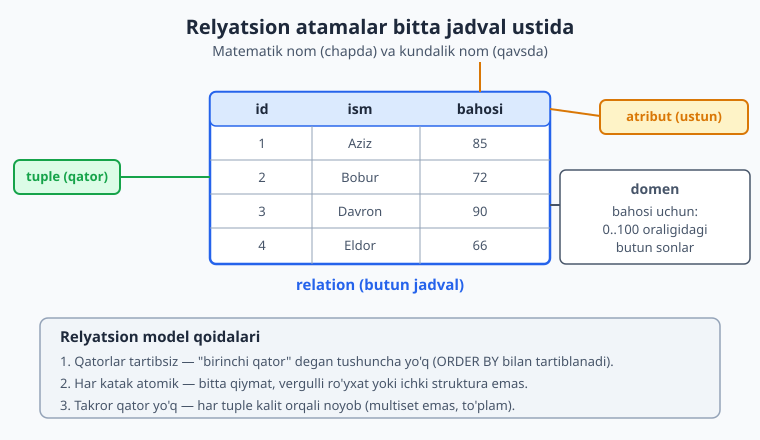
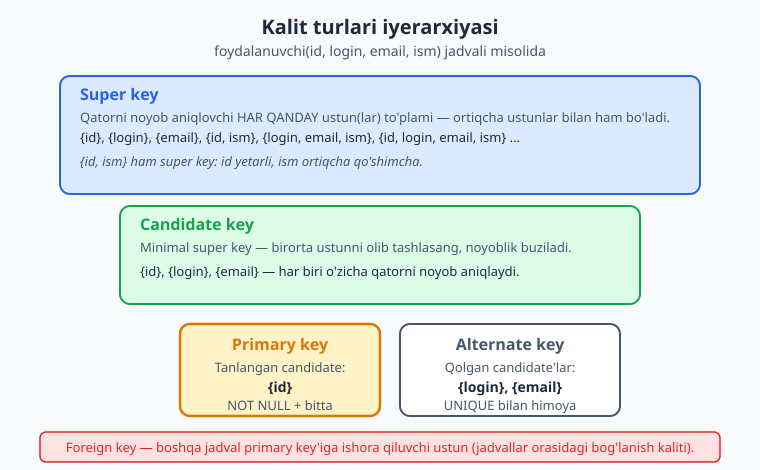
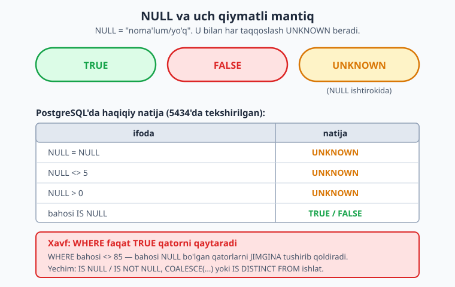

# 05 — Relyatsion model va kalit turlari

[⬅️ Oldingi: 04 — Bog'lanishlar va kardinallik (1:1, 1:N, N:M)](./04-boglanish-kardinallik.md) · [🏠 README](./README.md) · [Keyingi: 06 — Kalit dizayni: natural, surrogate, UUID, kompozit ➡️](./06-kalit-dizayni.md)

> **Bu bobda:** relyatsion modelning nazariy poydevorini (Codd) o'rganamiz — relation, tuple, atribut va domen nima. So'ng kalit turlari iyerarxiyasini (super key -> candidate key -> primary key + alternate key) va foreign key'ni ko'ramiz. Relyatsion butunlik qoidalari (entity va referential integrity) sxemani qanday himoya qilishini, NULL ning haqiqiy ma'nosini va uning uch qiymatli mantiqdagi xavfini PostgreSQL 18'da real misollar bilan tushunamiz.

---

## Nega bu bob muhim

Oldingi boblarda biz ER-diagramma chizdik va bog'lanishlarni topdik. Endi navbat o'sha tasvirni **qat'iy matematik modelga** o'tkazishga keldi. Relyatsion model — bu shunchaki "jadvallar" emas. Bu 1970-yilda Edgar F. Codd taklif qilgan, to'plamlar nazariyasiga asoslangan aniq qoidalar tizimi. PostgreSQL, MySQL, Oracle — hammasi shu modelning amaliy ko'rinishi.

Nima uchun nazariyaga vaqt sarflaymiz? Chunki kalitni noto'g'ri tanlash yoki NULL ni noto'g'ri tushunish — eng qimmat dizayn xatolaridan. Bu xatolar SELECT yozayotganda emas, balki yarim yildan keyin "hisobotda raqamlar mos kelmayapti" deganda chiqadi. Bu bob ana shu kelajakdagi og'riqdan saqlaydi.

> SQL sintaksisini ([SQL kitobi](../sql/README.md) da) bilasiz deb hisoblaymiz. Bu yerda gap **nega** shunday — qaysi ustun kalit bo'lishi kerak, NULL ruxsat etiladimi, butunlikni kim himoya qiladi.

## Relyatsion model atamalari: relation, tuple, atribut, domen

Kundalik tilda "jadval", "qator", "ustun" deymiz. Lekin nazariy adabiyotda (va suhbatdoshlik savollarida) boshqa, aniqroq atamalar ishlatiladi. Ularni bilish kerak, chunki nazariy qoidalar aynan shu atamalar bilan yoziladi.

| Matematik atama | Kundalik atama | Misol (talaba jadvali) |
|---|---|---|
| **Relation** | Jadval (table) | butun `talaba` jadvali |
| **Tuple** | Qator (row) | `(1, 'Aziz', 85)` |
| **Atribut** | Ustun (column) | `ism`, `bahosi` |
| **Domen** | Ustun qiymatlar to'plami | `bahosi` uchun: 0..100 butun sonlar |
| **Cardinality** | Qatorlar soni | jadvalda nechta tuple bor |
| **Degree (arity)** | Ustunlar soni | jadvalda nechta atribut bor |

Hayotiy o'xshatish: **relation — bu Excel varag'i**, lekin qattiq qoidalar bilan. **Domen** esa har ustunga "qaysi qiymatlar ruxsat etilgan" degan ro'yxat. Masalan `bahosi` domeni — 0 dan 100 gacha butun sonlar. 150 yoki "salom" bu domenga kirmaydi, shuning uchun bazada CHECK orqali rad etiladi.



Keling, shu atamalarni jonli jadvalda ko'raylik. Har bobda alohida schema ishlatamiz (parallel ishlar to'qnashmasligi uchun):

```sql
CREATE SCHEMA IF NOT EXISTS ch05;
SET search_path = ch05;

-- relation = talaba jadvali
CREATE TABLE talaba (
  id        int PRIMARY KEY,                       -- atribut, domeni: butun son
  ism       text NOT NULL,                         -- atribut, domeni: matn
  email     text UNIQUE,                           -- atribut (NULL bo'lishi mumkin)
  bahosi    int CHECK (bahosi BETWEEN 0 AND 100)   -- domen 0..100 bilan cheklangan
);

INSERT INTO talaba VALUES
  (1, 'Aziz',   'aziz@uni.uz',  85),   -- tuple
  (2, 'Bobur',  'bobur@uni.uz', 72),
  (3, 'Davron', NULL,           NULL);

SELECT * FROM talaba ORDER BY id;
```

Natija (PostgreSQL 18.4, port 5434'da tekshirilgan):

```text
 id |  ism   |    email     | bahosi
----+--------+--------------+--------
  1 | Aziz   | aziz@uni.uz  |     85
  2 | Bobur  | bobur@uni.uz |     72
  3 | Davron |              |
(3 rows)
```

Bu yerda `CHECK (bahosi BETWEEN 0 AND 100)` aynan **domenni** majburlaydi. Domen — dizayn vositasi: u xato qiymatni bazaga kirishidan oldin to'xtatadi.

## Relyatsion modelning uchta asosiy qoidasi

Codd modeli jadvalga uchta muhim cheklov qo'yadi. Bularni buzgan sxema "relyatsion bo'lmagan" hisoblanadi va kelajakda muammo tug'diradi.

### 1-qoida: qatorlar tartibsiz

Relation — bu **to'plam** (set), ro'yxat emas. "Birinchi qator" yoki "oxirgi qator" degan tushuncha yo'q. Agar tartib kerak bo'lsa — `ORDER BY` ishlat. Bazaga "qatorni yuqoriga ko'tar" deb buyruq berib bo'lmaydi.

> **Dizayn xulosasi:** hech qachon "qator tartibiga" tayanmang. Agar tartib muhim bo'lsa (masalan to-do ro'yxatdagi vazifalar tartibi), uni alohida `tartib_raqami` ustunida saqlang.

### 2-qoida: har katak atomik (1NF poydevori)

Har bir katakda **bitta** qiymat bo'lishi kerak. Vergulli ro'yxat (`'olma,nok,uzum'`), ichki struktura yoki ko'p qiymat — relyatsion modelga zid. Bu birinchi normal forma (1NF) ning poydevori — 07-bobda chuqur ko'ramiz.

```sql
-- ❌ ANTI-MISOL: atomik emas, relyatsion modelga zid
-- mahsulotlar text -- 'olma, nok, uzum' kabi vergulli ro'yxat saqlasa,
-- "nechta nok sotildi?" so'rovi indekssiz, sekin va ishonchsiz bo'ladi.
```

### 3-qoida: takror qator yo'q

To'plamda bir xil element ikki marta bo'lmaydi. Demak ikkita bir xil tuple ham bo'lmasligi kerak. Aynan shu sababdan **har relation'da kalit kerak** — kalit qatorlarni bir-biridan ajratadi. Bu bizni kalit mavzusiga olib keladi.

> MySQL'da ham, PG'da ham jadval texnik jihatdan kalitsiz takror qator saqlay oladi (chunki ular "bag/multiset" sifatida amalga oshirilgan). Lekin bu — dizayn xatosi. Har jiddiy jadvalda primary key bo'lishi kerak.

## Kalit turlari iyerarxiyasi

Kalit — bu qatorni noyob aniqlovchi atribut(lar). Bir necha xil kalit bor va ular bir-biridan kelib chiqadi. Iyerarxiyani tushunish kalit tanlashning poydevori.



Misol uchun `foydalanuvchi(id, login, email, ism)` jadvalini olaylik, bunda `id`, `login`, `email` har biri noyob, `ism` esa takrorlanishi mumkin.

### Super key

**Super key** — qatorni noyob aniqlovchi **har qanday** ustunlar to'plami, hatto ortiqcha ustun bilan bo'lsa ham. `{id}` super key. `{id, ism}` ham super key (chunki `id` allaqachon yetarli, `ism` ortiqcha qo'shimcha). `{login, email, ism}` ham super key. Super key'lar juda ko'p bo'ladi va aksariyati ortiqcha.

### Candidate key

**Candidate key** — bu **minimal** super key: undan birorta ustunni olib tashlasang, noyoblik buziladi. `{id}` candidate key (bittagina ustun, olib bo'lmaydi). `{login}` va `{email}` ham candidate key. Lekin `{id, ism}` candidate **emas**, chunki `ism` ni olib tashlab `{id}` qoldirsak ham noyoblik saqlanadi — demak u minimal emas.

Bir jadvalda bir nechta candidate key bo'lishi mumkin. Bu yerda uchtasi bor: `{id}`, `{login}`, `{email}`.

### Primary key va alternate key

Candidate key'lar ichidan **bittasini** tanlab, uni **primary key** deb e'lon qilamiz. Qolganlari **alternate key** (ba'zan "secondary key") deyiladi.

- **Primary key** — qatorni rasmiy aniqlovchi. Avtomatik `NOT NULL` va noyob. Jadvalda faqat bitta bo'ladi. FK'lar shunga ishora qiladi.
- **Alternate key** — qolgan candidate'lar. Ularni `UNIQUE` constraint bilan himoya qilamiz, aks holda noyoblik faqat "niyatda" qoladi.

```sql
SET search_path = ch05;

CREATE TABLE foydalanuvchi (
  id    int GENERATED ALWAYS AS IDENTITY PRIMARY KEY,  -- tanlangan primary key
  login text NOT NULL UNIQUE,                           -- alternate key
  email text NOT NULL UNIQUE,                           -- alternate key
  ism   text NOT NULL                                   -- kalit emas (takrorlanadi)
);

INSERT INTO foydalanuvchi (login, email, ism) VALUES ('aziz', 'aziz@x.uz', 'Aziz');
-- Endi boshqa foydalanuvchi xuddi shu email bilan kirsa:
INSERT INTO foydalanuvchi (login, email, ism) VALUES ('bobur', 'aziz@x.uz', 'Bobur');
```

Ikkinchi INSERT rad etiladi (alternate key himoyasi ishlaydi):

```text
ERROR:  duplicate key value violates unique constraint "foydalanuvchi_email_key"
DETAIL:  Key (email)=(aziz@x.uz) already exists.
```

> **Muhim dizayn nuqtasi:** alternate key'ni `UNIQUE` qilmasangiz, baza uni oddiy ustun deb biladi va dublikatlarga ruxsat beradi. Candidate key — bu sizning niyatingiz; `UNIQUE` — uni majburlash. Niyatni har doim constraint'ga aylantiring.

Qaysi candidate'ni primary qilish kerak — bu 06-bobning mavzusi (natural vs surrogate kalit). Hozircha shuni eslang: primary key **barqaror, kichik va o'zgarmas** bo'lishi kerak.

### Kompozit (composite) kalit

Ba'zan bitta ustun noyoblikni ta'minlamaydi va bir necha ustun **birgalikda** kalit bo'ladi. Bu — kompozit kalit. Klassik misol — bog'lovchi (junction) jadval (04-bobda ko'rgan N:M bog'lanish):

```sql
SET search_path = ch05;

CREATE TABLE royxat (
  talaba_id int  NOT NULL REFERENCES talaba(id),
  fan       text NOT NULL,
  semestr   int  NOT NULL,
  PRIMARY KEY (talaba_id, fan)   -- kompozit primary key
);

INSERT INTO royxat VALUES (1, 'Matematika', 1), (1, 'Fizika', 1), (2, 'Matematika', 1);
-- Bir talaba bir fanga ikki marta yozila olmaydi:
INSERT INTO royxat VALUES (1, 'Matematika', 2);
```

Oxirgi INSERT rad etiladi — `(1, 'Matematika')` allaqachon mavjud:

```text
ERROR:  duplicate key value violates unique constraint "royxat_pkey"
DETAIL:  Key (talaba_id, fan)=(1, Matematika) already exists.
```

Kompozit kalit qachon to'g'ri, qachon o'rniga surrogate ishlatish kerak — buni 06-bobda batafsil ko'ramiz.

## Foreign key: jadvallar orasidagi bog'lanish kaliti

**Foreign key (FK)** — boshqa jadvalning primary key'iga (yoki candidate key'iga) ishora qiluvchi ustun. FK — ER-diagrammadagi bog'lanishni fizik sxemada amalga oshirish vositasi.

```sql
SET search_path = ch05;

CREATE TABLE imtihon (
  id        int PRIMARY KEY,
  talaba_id int NOT NULL REFERENCES talaba(id),    -- foreign key
  fan       text NOT NULL,
  ball      int CHECK (ball BETWEEN 0 AND 100)
);

-- TO'G'RI: mavjud talaba(id=1) ga ishora
INSERT INTO imtihon VALUES (1, 1, 'Matematika', 90);
```

FK'ning kuchi — u **referential integrity** ni majburlaydi (pastda ko'ramiz). FK ustunni indekslash kerakligini esda tuting (14-bobda batafsil) — PG FK uchun avtomatik indeks yaratmaydi.

## Relyatsion butunlik (integrity) qoidalari

Codd modeli ikkita asosiy butunlik qoidasini belgilaydi. Bular — bazaning "tabiat qonunlari": ularni baza o'zi majburlaydi, ilova kodiga ishonish shart emas.

### Entity integrity (mohiyat butunligi): primary key NULL bo'la olmaydi

Qoida: **primary key hech qachon NULL bo'lmaydi va takrorlanmaydi.** Mantiq oddiy — agar kalit noma'lum (NULL) bo'lsa, qatorni qanday aniqlaymiz? Identifikator yo'q qator — identifikatsiyalanmaydigan qator.

```sql
SET search_path = ch05;

-- ❌ PK NULL bo'la olmaydi (entity integrity)
INSERT INTO talaba (id, ism) VALUES (NULL, 'Xato');
```

```text
ERROR:  null value in column "id" of relation "talaba" violates not-null constraint
DETAIL:  Failing row contains (null, Xato, null, null).
```

```sql
SET search_path = ch05;

-- ❌ PK takrorlanmaydi (entity integrity)
INSERT INTO talaba (id, ism) VALUES (1, 'Takror');
```

```text
ERROR:  duplicate key value violates unique constraint "talaba_pkey"
DETAIL:  Key (id)=(1) already exists.
```

`PRIMARY KEY` constraint avtomatik `NOT NULL` + `UNIQUE` qiladi. Aynan shu sababdan PK alohida e'lon qilinadi — bu shunchaki "noyob ustun" emas, balki entity integrity'ning kafolati.

### Referential integrity (havola butunligi): FK mavjud qatorga ishora qiladi

Qoida: **foreign key qiymati ishora qilayotgan jadvalda HAQIQATAN mavjud bo'lishi kerak** (yoki to'liq NULL bo'lishi). "Yetim" (orphan) qator bo'lishi mumkin emas — masalan mavjud bo'lmagan talabaning imtihoni.

```sql
SET search_path = ch05;

-- ❌ 999 raqamli talaba yo'q -> referential integrity buziladi
INSERT INTO imtihon VALUES (2, 999, 'Fizika', 80);
```

```text
ERROR:  insert or update on table "imtihon" violates foreign key constraint "imtihon_talaba_id_fkey"
DETAIL:  Key (talaba_id)=(999) is not present in table "talaba".
```

Teskari tomondan ham himoya bor — ishora qilinayotgan qatorni o'chirib bo'lmaydi (agar unga FK orqali bog'langan qatorlar bor bo'lsa):

```sql
SET search_path = ch05;

-- ❌ imtihon undan FK orqali bog'langan talaba(1) ni o'chirib bo'lmaydi
DELETE FROM talaba WHERE id = 1;
```

```text
ERROR:  update or delete on table "talaba" violates foreign key constraint "imtihon_talaba_id_fkey" on table "imtihon"
DETAIL:  Key (id)=(1) is still referenced from table "imtihon".
```

Bu standart (`NO ACTION`/`RESTRICT`) xatti-harakat. O'chirishda nima bo'lishini boshqarish uchun `ON DELETE CASCADE`, `SET NULL` va boshqalar bor — bu butunlay alohida dizayn qarori, 11-bobda batafsil ko'rib chiqamiz.

> **Dizayn falsafasi:** butunlikni **bazada** majburla, ilovada emas. Ilova kodi xato qilishi mumkin, ikkita ilova bitta bazaga yozishi mumkin, migratsiya skripti chetlab o'tishi mumkin. Baza constraint'i — oxirgi va eng ishonchli qal'a.

## NULL: ma'nosi va xavfi

NULL — relyatsion modelning eng ko'p tushunmaslik keltiradigan qismi. Avval ma'nosini aniqlaylik.

### NULL nima va nima EMAS

NULL — bu **"qiymat noma'lum yoki mavjud emas"** degan belgi. U:

- **nol (0) EMAS** — nol bu ma'lum qiymat, NULL esa noma'lumlik;
- **bo'sh satr ('') EMAS** — bo'sh satr ham ma'lum qiymat (uzunligi 0 bo'lgan matn);
- **"hech narsa" EMAS** — aksincha, "bu yerda nima borligini bilmayman" degani.

Misol: `email = NULL` — "bu odamning emaili noma'lum" yoki "umuman emaili yo'q". `email = ''` — "emaili bor va u bo'sh satr" (bu odatda xato). `bahosi = 0` — "bahosi aniq nolga teng" (yiqildi), `bahosi = NULL` — "hali baholanmagan".

### Uch qiymatli mantiq (three-valued logic)

Mana eng muhim joy. Oddiy mantiqda har ifoda TRUE yoki FALSE. Lekin NULL ishtirok etsa, uchinchi natija paydo bo'ladi: **UNKNOWN**. Sababi: noma'lum qiymatni biror narsa bilan taqqoslasangiz, natija ham noma'lum bo'ladi.



PostgreSQL 18'da haqiqiy natija (psql `UNKNOWN` ni bo'sh katak sifatida ko'rsatadi, chunki natija NULL):

```sql
SET search_path = ch05;

SELECT
  (NULL = NULL)  AS "null_teng_null",
  (NULL <> 5)    AS "null_noteng_5",
  (NULL > 0)     AS "null_katta_0",
  (5 = 5)        AS "besh_teng_besh";
```

```text
 null_teng_null | null_noteng_5 | null_katta_0 | besh_teng_besh
----------------+---------------+--------------+----------------
                |               |              | t
(1 row)
```

Diqqat: **`NULL = NULL` ham TRUE emas, balki UNKNOWN** (bo'sh katak). "Noma'lum noma'lumga tengmi?" — javob, albatta, noma'lum. Faqat `5 = 5` aniq `t` (TRUE) berdi.

### NULL tuzog'i 1: WHERE jimgina qator tushiradi

`WHERE` faqat natijasi **TRUE** bo'lgan qatorlarni qaytaradi. UNKNOWN qatorlar tushib qoladi. Bu eng xavfli tuzoq — natija noto'g'ri, lekin xato chiqmaydi.

```sql
SET search_path = ch05;
-- talaba(3, 'Davron') ning bahosi NULL edi
SELECT 'bahosi <> 85' AS sorov, count(*) AS topildi FROM talaba WHERE bahosi <> 85
UNION ALL
SELECT 'bahosi = 85', count(*) FROM talaba WHERE bahosi = 85
UNION ALL
SELECT 'jami qator', count(*) FROM talaba;
```

```text
    sorov     | topildi
--------------+---------
 bahosi <> 85 |       1
 bahosi = 85  |       1
 jami qator   |       3
```

Mantiqan "85 ga teng" (1 ta) + "85 ga teng emas" qo'shilib jami 3 ni berishi kerak edi. Lekin `<> 85` faqat 1 ta qaytardi! Davronning NULL bahosi ikkala tomonda ham yo'q — chunki `NULL <> 85` UNKNOWN. Foydalanuvchi "85 dan boshqa hamma" deb o'ylab, jimgina bitta qatorni yo'qotdi.

### NULL tuzog'i 2: NOT IN va NULL

```sql
SET search_path = ch05;
SELECT count(*) AS topildi
FROM talaba WHERE bahosi NOT IN (72, NULL);
```

```text
 topildi
---------
       0
(1 row)
```

`NOT IN` ro'yxatida NULL bo'lsa — natija **har doim bo'sh** (0 qator). Sababi: `bahosi NOT IN (72, NULL)` ichki tarzda `bahosi <> 72 AND bahosi <> NULL` ga aylanadi, va `bahosi <> NULL` hech qachon TRUE bo'lmaydi. Bu juda mashhur va topish qiyin bug.

### NULL tuzog'i 3: agregatlar NULL ni e'tiborsiz qoldiradi

```sql
SET search_path = ch05;
SELECT count(*)       AS "count_yulduzcha",
       count(bahosi)  AS "count_bahosi",
       avg(bahosi)    AS "ortacha"
FROM talaba;
```

```text
 count_yulduzcha | count_bahosi |       ortacha
-----------------+--------------+---------------------
               3 |            2 | 78.5000000000000000
```

`count(*)` hamma qatorni (3) sanaydi, `count(bahosi)` esa NULL bo'lmaganlarini (2). `avg` ham faqat 2 qiymat ustida hisoblaydi: `(85+72)/2 = 78.5` — Davronning NULL'i o'rtachaga kirmaydi. Bu ba'zan to'g'ri (baholanmaganni qo'shmaslik), ba'zan xato (uni 0 deb hisoblash kerak edi). Muhimi — buni **ataylab** hal qiling, tasodifan emas.

### NULL'ni xavfsiz boshqarish

Yechimlar oddiy, faqat ularni eslab ishlatish kerak:

- **`IS NULL` / `IS NOT NULL`** — NULL ni tekshirishning yagona to'g'ri usuli (`= NULL` hech qachon ishlamaydi);
- **`COALESCE(ustun, zaxira)`** — NULL ni standart qiymatga almashtirish;
- **`IS DISTINCT FROM`** — NULL-xavfsiz taqqoslash (UNKNOWN o'rniga TRUE/FALSE qaytaradi).

```sql
SET search_path = ch05;

SELECT
  (NULL IS DISTINCT FROM 5)        AS "null_farqli_5",
  (NULL IS NOT DISTINCT FROM NULL) AS "null_aynan_null",
  (5 IS DISTINCT FROM 5)           AS "besh_farqli_besh";
```

```text
 null_farqli_5 | null_aynan_null | besh_farqli_besh
---------------+-----------------+------------------
 t             | t               | f
(1 row)
```

Ko'ring: `IS DISTINCT FROM` hech qachon UNKNOWN bermaydi — har doim aniq TRUE yoki FALSE. `NULL IS DISTINCT FROM 5` -> `t` (farqli), `NULL IS NOT DISTINCT FROM NULL` -> `t` (aynan bir xil). Bu — NULL bilan ishonchli ishlash usuli.

### Dizayn xulosasi: NULL'ni qachon ruxsat berish kerak

Har ustun uchun "bu yerda NULL mantiqan bo'lishi mumkinmi?" deb so'rang:

- **NOT NULL qiling**, agar qiymat har doim majburiy bo'lsa (`ism`, `narx`, `created_at`). Bu eng xavfsiz standart.
- **NULL ruxsat bering**, agar qiymat haqiqatan ixtiyoriy yoki "hali ma'lum emas" bo'lsa (`o'rta_ism`, `tugatilgan_sana` hali tugamagan vazifada).
- **NULL ni "yo'q" ma'nosida ortiqcha ishlatmang** — ba'zan alohida holat ustuni (`holat = 'kutilmoqda'`) NULL'dan aniqroq.

> 13-bobda "NULL suiiste'moli" anti-naqshini ko'ramiz. Hozircha asosiy qoida: **standart bo'yicha `NOT NULL`, NULL'ga ruxsatni ataylab bering.**

## MySQL bilan asosiy farqlar (qisqa)

- **Bir nechta NULL UNIQUE ustunda:** PG va MySQL ikkalasi ham `UNIQUE` ustunda **bir nechta** NULL'ga ruxsat beradi (chunki `NULL <> NULL`). Standart shunday. Buni biz tekshirdik — `email` ustuniga bir nechta NULL bemalol kirdi.
- **NULL saralashda:** PG'da `ORDER BY` da NULL standart bo'yicha oxirda (`ASC` da), MySQL'da boshda. `NULLS FIRST`/`NULLS LAST` bilan boshqariladi.
- **`IS DISTINCT FROM`:** standart SQL, PG'da bor. MySQL'da `<=>` (null-safe equal) operatori shu vazifani bajaradi.
- **Kalit nazariyasi (super/candidate/primary key)** har ikki bazada bir xil — bu RDBMS'ga bog'liq emas, relyatsion modelning o'zi.

Tekshiruv yakunida schema'ni tozalaymiz:

```sql
DROP SCHEMA ch05 CASCADE;
```

---

## Mashqlar

Quyidagi mashqlar **dizayn** mashqlari — kalitni tanlash, NULL tuzog'ini topish, butunlikni loyihalash. Faqat SELECT yozish emas.

### Oson

1. **Atamalarni moslashtir.** `mahsulot(id, nom, narx, ombor_soni)` jadvali berilgan, unda 50 ta qator bor. Quyidagilarni nomlang: (a) butun jadval relyatsion atama bilan, (b) bitta qator, (c) `narx` ustuni, (d) jadvalning cardinality va degree qiymatlari.

2. **Atomik emasni top.** Bu jadval relyatsion modelning qaysi qoidasini buzadi va nega: `talaba(id, ism, telefonlar)`, bunda `telefonlar` ustunida `'+99890..., +99891...'` kabi vergulli ro'yxat saqlanadi? Tuzatish g'oyasini bir jumlada ayting.

3. **Candidate key topish.** `xodim(tabel_raqami, pasport_seriya, email, ism, bolim)` jadvalida `tabel_raqami`, `pasport_seriya`, `email` har biri noyob, `ism` va `bolim` takrorlanadi. Barcha candidate key'larni sanang. `{tabel_raqami, ism}` candidate key'mi? Nega?

4. **Entity integrity buzilishini aniqla.** Quyidagi INSERT'lardan qaysilari `kitob(isbn PRIMARY KEY, sarlavha, muallif)` jadvalida rad etiladi va nega? (a) `('978-1', 'Kitob A', NULL)`, (b) `(NULL, 'Kitob B', 'Ali')`, (c) `('978-1', 'Kitob C', 'Vali')` — (a) dan keyin.

### O'rta

5. **Primary key tanlash.** `mijoz(id_serial, email, telefon, pasport, ism)` jadvalida `id_serial`, `email`, `telefon`, `pasport` candidate key'lar. Qaysi birini primary key qilasiz va nega? Qolganlarini qanday himoya qilasiz? Qisqa asoslang (06-bobni oldindan ko'rmasdan, intuitsiya bilan).

6. **NULL tuzog'ini aniqla.** Quyidagi so'rov nima uchun kutilganidan kam qator qaytaradi? `xodim` jadvalida 100 ta xodim bor, 10 tasining `bolim` ustuni NULL. `SELECT count(*) FROM xodim WHERE bolim <> 'IT';` Hamma "IT bo'lmagan" xodimlar sanaladi deb kutilgan edi. To'g'ri so'rovni yozing.

7. **Alternate key'ni majburla.** `foydalanuvchi(id PK, login, email, ism)` jadvali yaratilgan, lekin `login` va `email` ga `UNIQUE` qo'yilmagan. Hozir ikkita foydalanuvchi bir xil email bilan ro'yxatdan o'tdi. (a) Bu qaysi kalit tushunchasining buzilishi? (b) `ALTER TABLE` bilan kelajakda buni qanday oldini olasiz?

8. **NOT IN tuzog'i.** `SELECT * FROM buyurtma WHERE status NOT IN ('yangi', 'tugallandi', NULL);` so'rovi nima qaytaradi va nega? Maqsad: "yangi va tugallandi'dan boshqa hamma buyurtma". To'g'rilang.

### Qiyin

9. **N:M kompozit kalit dizayni.** Onlayn-kurs platformasida: talaba bir nechta kursga yozilishi, kurs bir nechta talabaga ega bo'lishi mumkin. Yozilish sanasi va bahoni ham saqlash kerak. Bog'lovchi jadvalni loyihalang: ustunlar, primary key (kompozit?), foreign key'lar va integrity qoidalari. Bir talaba bir kursga ikki marta yozila olmasligi kafolatlangan bo'lsin. DDL yozing.

10. **NULL semantikasini loyihala.** `vazifa(id, sarlavha, boshlangan_sana, tugatilgan_sana, bekor_qilingan_sana)` jadvalida uch sana ustuni bor. Har biri uchun NULL nimani anglatishini aniqlang va qaysilari `NOT NULL` bo'lishi kerakligini hal qiling. `tugatilgan_sana IS NULL` so'rovi qaysi vazifalarni topadi — bu mantiqan to'g'rimi? Muqobil dizayn (holat ustuni) bilan solishtiring.

11. **Referential integrity strategiyasi.** `buyurtma(id PK, mijoz_id FK -> mijoz)` va `buyurtma_qatori(id PK, buyurtma_id FK -> buyurtma)` jadvallari bor. Mijoz o'z akkauntini o'chirmoqchi. Uchta variantni muhokama qiling: (a) o'chirishni bloklash (RESTRICT), (b) hamma narsani kaskadli o'chirish (CASCADE), (c) `mijoz_id` ni NULL qilish (SET NULL). Har biri qachon to'g'ri? Buyurtma tarixini saqlash uchun qaysi biri eng yaxshi?

12. **Anti-naqshni topib tuzat.** Mana real loyihadan sxema: `hisobot(id, sana, sotuvchi_ismi, sotuvchi_email, mahsulotlar_royxati, jami_summa, tolov_holati)`, bunda `mahsulotlar_royxati` — vergulli ro'yxat, `jami_summa` — qo'lda kiritilgan son, `tolov_holati` — ba'zan NULL, ba'zan bo'sh satr. Bu sxemada relyatsion modelning va integrity'ning qaysi qoidalari buzilgan? Har bittasini ko'rsating va tuzatilgan sxemani (jadvallarga ajrating) loyihalang.

13. **Super key vs candidate.** `(a, b, c, d)` atributli jadvalda funksional bog'liqliklar shunday: `a` -> butun qator noyob; `{b, c}` -> butun qator noyob; `d` -> takrorlanadi. (a) `{a, b}` super key'mi? (b) `{a, b}` candidate key'mi? (c) `{b, c}` candidate key'mi? (d) Barcha candidate key'larni sanang. (e) Nechta primary key tanlay olasiz?

14. **3 qiymatli mantiq jadvali.** `x` ustuni quyidagi qiymatlarga ega: `10, 20, NULL`. Quyidagi har bir shart uchun qaysi qatorlar qaytishini (qaysi `x` qiymatlar) aniqlang va nega: (a) `WHERE x > 15`, (b) `WHERE x > 15 OR x IS NULL`, (c) `WHERE NOT (x > 15)`, (d) `WHERE x = x`. Javobni 3 qiymatli mantiq orqali asoslang.

## Yechimlar

<details markdown="1">
<summary>Yechim — 1</summary>

(a) Butun jadval — **relation**. (b) Bitta qator — **tuple**. (c) `narx` ustuni — **atribut**. (d) **Cardinality** = 50 (qatorlar soni), **degree (arity)** = 4 (ustunlar soni: id, nom, narx, ombor_soni).

</details>

<details markdown="1">
<summary>Yechim — 2</summary>

Bu **2-qoidani (har katak atomik)** buzadi — `telefonlar` katagida bitta qiymat emas, vergulli ro'yxat saqlanmoqda. Natijada "kimning telefoni +99890... ?" so'rovi indekssiz, matn ichidan qidirish bo'lib qoladi va ishonchsiz.

Tuzatish: telefonlarni alohida `telefon(talaba_id FK, raqam)` jadvaliga chiqarish (1:N bog'lanish) — har telefon o'z qatorida atomik bo'ladi.

</details>

<details markdown="1">
<summary>Yechim — 3</summary>

Candidate key'lar: **`{tabel_raqami}`, `{pasport_seriya}`, `{email}`** — har biri yakka o'zi noyob va minimal.

`{tabel_raqami, ism}` candidate key **emas**. U super key (chunki noyoblikni ta'minlaydi), lekin minimal emas: `ism` ni olib tashlasak `{tabel_raqami}` o'zi yetarli bo'lib qoladi. Candidate key minimal super key bo'lishi shart.

</details>

<details markdown="1">
<summary>Yechim — 4</summary>

(a) `('978-1', 'Kitob A', NULL)` — **o'tadi**. `muallif` ustuni PK emas, NULL ruxsat etilgan (NOT NULL belgilanmagan).

(b) `(NULL, 'Kitob B', 'Ali')` — **rad etiladi**. `isbn` primary key, entity integrity bo'yicha PK NULL bo'la olmaydi.

(c) `('978-1', 'Kitob C', 'Vali')` — **rad etiladi**. `isbn = '978-1'` allaqachon (a) da kiritilgan; PK takrorlanmaydi (entity integrity).

</details>

<details markdown="1">
<summary>Yechim — 5</summary>

**`id_serial` ni primary key qilaman.** Sabablar: u barqaror (hech qachon o'zgarmaydi), kichik (4-8 bayt), biznesga bog'liq emas (email, telefon, hatto pasport vaqt o'tib o'zgarishi yoki noto'g'ri kiritilishi mumkin). FK'lar shunga ishora qiladi — biznes qiymati o'zgarganda FK'larni yangilash shart emas.

Qolgan candidate'larni `UNIQUE` constraint bilan himoya qilaman:

```sql
ALTER TABLE mijoz ADD CONSTRAINT mijoz_email_uq  UNIQUE (email);
ALTER TABLE mijoz ADD CONSTRAINT mijoz_pasport_uq UNIQUE (pasport);
-- telefon ba'zan ixtiyoriy bo'lishi mumkin; biznes qoidasiga qarab UNIQUE
```

Bu — surrogate key tanlashning klassik holati; 06-bobda chuqurroq.

</details>

<details markdown="1">
<summary>Yechim — 6</summary>

`bolim` NULL bo'lgan 10 ta xodim uchun `NULL <> 'IT'` natijasi **UNKNOWN** bo'ladi, TRUE emas. `WHERE` faqat TRUE qatorlarni qaytargani uchun bu 10 ta xodim jimgina tushib qoladi. So'rov 100 - (IT xodimlari) - 10 ta NULL qaytaradi.

To'g'ri so'rov — NULL'ni ham qamrab oling (agar "bo'limi noma'lum"larni ham IT bo'lmagan deb hisoblasak):

```sql
SELECT count(*) FROM xodim
WHERE bolim <> 'IT' OR bolim IS NULL;
-- yoki NULL-xavfsiz:
SELECT count(*) FROM xodim
WHERE bolim IS DISTINCT FROM 'IT';
```

</details>

<details markdown="1">
<summary>Yechim — 7</summary>

(a) Bu **alternate key (candidate key)** himoyasining yo'qligi. `login` va `email` candidate key bo'lishi kerak edi, lekin `UNIQUE` qo'yilmagani uchun baza dublikatga ruxsat berdi — niyat constraint'ga aylantirilmagan.

(b) Avval mavjud dublikatlarni tozalash kerak (aks holda `ALTER` rad etiladi), so'ng:

```sql
ALTER TABLE foydalanuvchi ADD CONSTRAINT foydalanuvchi_login_uq UNIQUE (login);
ALTER TABLE foydalanuvchi ADD CONSTRAINT foydalanuvchi_email_uq UNIQUE (email);
```

Endi baza ikkinchi bir xil email/login'ni rad etadi.

</details>

<details markdown="1">
<summary>Yechim — 8</summary>

So'rov **bo'sh natija (0 qator)** qaytaradi. `NOT IN (..., NULL)` ichki tarzda `status <> 'yangi' AND status <> 'tugallandi' AND status <> NULL` ga aylanadi. Oxirgi shart `status <> NULL` hech qachon TRUE bo'lmaydi (har doim UNKNOWN), shuning uchun butun AND zanjiri hech qachon TRUE bo'lmaydi.

Tuzatish — ro'yxatdan NULL'ni olib tashlang:

```sql
SELECT * FROM buyurtma WHERE status NOT IN ('yangi', 'tugallandi');
```

Agar `status` NULL bo'lgan qatorlarni ham qaytarmoqchi bo'lsangiz, alohida qo'shing: `... OR status IS NULL`.

</details>

<details markdown="1">
<summary>Yechim — 9</summary>

Bog'lovchi (junction) jadval kompozit primary key bilan:

```sql
CREATE TABLE talaba (id int GENERATED ALWAYS AS IDENTITY PRIMARY KEY, ism text NOT NULL);
CREATE TABLE kurs   (id int GENERATED ALWAYS AS IDENTITY PRIMARY KEY, nom text NOT NULL);

CREATE TABLE yozilish (
  talaba_id     int  NOT NULL REFERENCES talaba(id),
  kurs_id       int  NOT NULL REFERENCES kurs(id),
  yozilgan_sana date NOT NULL DEFAULT current_date,
  bahosi        int  CHECK (bahosi BETWEEN 0 AND 100),  -- hali baholanmagan = NULL
  PRIMARY KEY (talaba_id, kurs_id)   -- kompozit PK: bir juftlik faqat bir marta
);
```

Integrity qoidalari: kompozit PK `(talaba_id, kurs_id)` bir talaba-kurs juftligi takrorlanishini bloklaydi (entity integrity) — shu bilan "ikki marta yozilish" oldini oladi. Ikkita FK referential integrity'ni ta'minlaydi — mavjud bo'lmagan talaba yoki kursga yozilib bo'lmaydi. `bahosi` NULL — "hali baholanmagan" semantikasi bilan. PG18'da bu DDL muvaffaqiyatli ishlaydi (5434'da tekshirilgan struktura).

</details>

<details markdown="1">
<summary>Yechim — 10</summary>

NULL semantikasi:
- `boshlangan_sana IS NULL` — vazifa hali boshlanmagan;
- `tugatilgan_sana IS NULL` — vazifa hali tugatilmagan (yoki bekor qilingan);
- `bekor_qilingan_sana IS NULL` — vazifa bekor qilinmagan.

`NOT NULL` qarori: `id` (PK) albatta NOT NULL, `sarlavha` NOT NULL (har vazifaning nomi bor). Uchala sana ustuni **NULL ruxsat etilgan** — chunki ular "hali sodir bo'lmagan hodisa"ni anglatadi, bu NULL'ning to'g'ri ishlatilishi.

`tugatilgan_sana IS NULL` so'rovi tugatilmagan vazifalarni topadi — **lekin bu chalkash**: bekor qilingan vazifaning ham `tugatilgan_sana` NULL bo'ladi, demak u "faol, tugatilmagan" deb noto'g'ri hisoblanishi mumkin.

**Muqobil (yaxshiroq) dizayn** — aniq holat ustuni:

```sql
CREATE TABLE vazifa (
  id        int GENERATED ALWAYS AS IDENTITY PRIMARY KEY,
  sarlavha  text NOT NULL,
  holat     text NOT NULL DEFAULT 'yangi'
            CHECK (holat IN ('yangi','jarayonda','tugatildi','bekor_qilindi')),
  yangilangan timestamptz NOT NULL DEFAULT now()
);
```

Holat ustuni bilan "tugatilmagan" va "bekor qilingan"ni aniq ajratamiz — sanalardan NULL semantikasini chiqarib o'qishga urinishdan ishonchliroq. (Holat modellashtirishni 12-bobda batafsil ko'ramiz.)

</details>

<details markdown="1">
<summary>Yechim — 11</summary>

- **(a) RESTRICT / NO ACTION** — buyurtmasi bor mijozni o'chirib bo'lmaydi. **Buyurtma tarixini saqlash uchun eng yaxshi.** Moliyaviy/yuridik yozuvlar yo'qolmasligi kerak. Amalda mijozni o'chirish o'rniga "soft delete" (`faol = false`) ishlatiladi (12-bob).
- **(b) CASCADE** — mijoz o'chsa, uning hamma buyurtmalari va buyurtma qatorlari ham o'chadi. Buyurtma tarixi uchun **xavfli** — moliyaviy ma'lumot yo'qoladi. CASCADE faqat haqiqatan bog'liq, mustaqil ma'noga ega bo'lmagan ma'lumot uchun (masalan savatcha elementlari) to'g'ri.
- **(c) SET NULL** — mijoz o'chsa, buyurtmadagi `mijoz_id` NULL bo'ladi (anonim buyurtma). Buyurtma saqlanadi, lekin kim qilgani noma'lum bo'lib qoladi. GDPR/maxfiylik talablari uchun ("foydalanuvchi ma'lumotini o'chir, lekin tranzaksiyani saqla") foydali.

**Xulosa:** buyurtma tarixini saqlash uchun (a) RESTRICT + soft delete eng yaxshi. To'liq FK strategiyasini 11-bobda ko'ramiz.

</details>

<details markdown="1">
<summary>Yechim — 12</summary>

Buzilgan qoidalar:
1. **Atomiklik (2-qoida):** `mahsulotlar_royxati` vergulli ro'yxat — atomik emas.
2. **Takrorlanuvchi ma'lumot:** `sotuvchi_ismi`, `sotuvchi_email` har hisobotda qayta yoziladi (takror anomaliyasi) — sotuvchi alohida entity bo'lishi kerak.
3. **Hosilaviy ma'lumot xavfi (bug):** `jami_summa` qo'lda kiritilgan — mahsulot narxlaridan farq qilishi mumkin (haqiqat manbai ikkita).
4. **NULL semantikasi:** `tolov_holati` ba'zan NULL, ba'zan bo'sh satr — bir xil ma'no ikki xil ko'rinishda; aniq holat ustuni va `NOT NULL` kerak.

Tuzatilgan sxema:

```sql
CREATE TABLE sotuvchi (
  id    int GENERATED ALWAYS AS IDENTITY PRIMARY KEY,
  ism   text NOT NULL,
  email text NOT NULL UNIQUE
);

CREATE TABLE mahsulot (
  id   int GENERATED ALWAYS AS IDENTITY PRIMARY KEY,
  nom  text NOT NULL,
  narx numeric(12,2) NOT NULL CHECK (narx >= 0)
);

CREATE TABLE hisobot (
  id          int GENERATED ALWAYS AS IDENTITY PRIMARY KEY,
  sana        date NOT NULL DEFAULT current_date,
  sotuvchi_id int  NOT NULL REFERENCES sotuvchi(id),
  tolov_holati text NOT NULL DEFAULT 'kutilmoqda'
               CHECK (tolov_holati IN ('kutilmoqda','tolandi','bekor'))
);

CREATE TABLE hisobot_qatori (
  hisobot_id  int NOT NULL REFERENCES hisobot(id),
  mahsulot_id int NOT NULL REFERENCES mahsulot(id),
  miqdor      int NOT NULL CHECK (miqdor > 0),
  PRIMARY KEY (hisobot_id, mahsulot_id)
);
```

Endi `jami_summa` qo'lda saqlanmaydi — u `hisobot_qatori` va `mahsulot.narx` dan hisoblanadi (yagona haqiqat manbai). Atomiklik, normalizatsiya va integrity tiklandi.

</details>

<details markdown="1">
<summary>Yechim — 13</summary>

(a) **`{a, b}` super key'mi?** Ha — `a` o'zi qatorni noyob aniqlaydi, demak `{a, b}` ham (ortiqcha `b` bilan) noyob.

(b) **`{a, b}` candidate key'mi?** Yo'q — minimal emas; `b` ni olib `{a}` qoldirsak ham noyob. Candidate emas, oddiy super key.

(c) **`{b, c}` candidate key'mi?** Ha — birgalikda noyob (berilgan) va minimal (`b` yoki `c` ni yakka o'zi noyob deb aytilmagan).

(d) Barcha candidate key'lar: **`{a}`** va **`{b, c}`**.

(e) **Bittagina** primary key tanlash mumkin. Jadvalda primary key faqat bitta bo'ladi. Bu yerda `{a}` (kichikroq, bitta ustun) tanlash mantiqiy; `{b, c}` esa alternate key bo'lib, `UNIQUE (b, c)` bilan himoyalanadi.

</details>

<details markdown="1">
<summary>Yechim — 14</summary>

`x` qiymatlari: 10, 20, NULL.

(a) **`WHERE x > 15`** — qaytadi: **{20}**. Hisob: `10 > 15` FALSE, `20 > 15` TRUE, `NULL > 15` UNKNOWN (tushadi). Faqat 20.

(b) **`WHERE x > 15 OR x IS NULL`** — qaytadi: **{20, NULL}**. NULL qatori uchun: `UNKNOWN OR TRUE` = TRUE (chunki `x IS NULL` TRUE). 20 uchun: `TRUE OR FALSE` = TRUE. 10 uchun: `FALSE OR FALSE` = FALSE.

(c) **`WHERE NOT (x > 15)`** — qaytadi: **{10}**. `NOT(FALSE)`=TRUE (10), `NOT(TRUE)`=FALSE (20), `NOT(UNKNOWN)`=UNKNOWN (NULL tushadi). Diqqat: NULL bu yerda ham (a) da ham tushib qoldi — "katta" va "katta emas" birga olganda ham NULL hech qaerga kirmaydi.

(d) **`WHERE x = x`** — qaytadi: **{10, 20}**. `10=10` TRUE, `20=20` TRUE, lekin `NULL = NULL` UNKNOWN (tushadi). Hatto ustunni o'ziga taqqoslash ham NULL qatorni qaytarmaydi — bu uch qiymatli mantiqning eng hayratlanarli oqibati.

</details>

---

[⬅️ Oldingi: 04 — Bog'lanishlar va kardinallik (1:1, 1:N, N:M)](./04-boglanish-kardinallik.md) · [🏠 README](./README.md) · [Keyingi: 06 — Kalit dizayni: natural, surrogate, UUID, kompozit ➡️](./06-kalit-dizayni.md)
