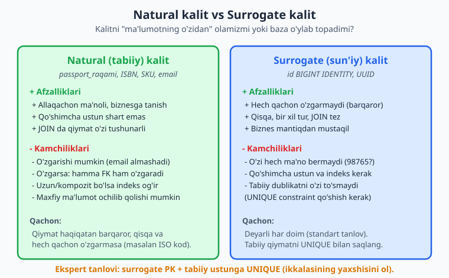
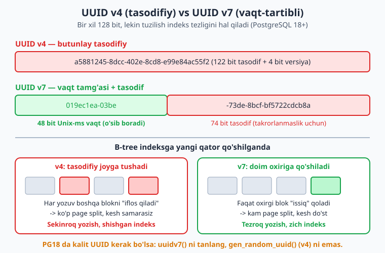
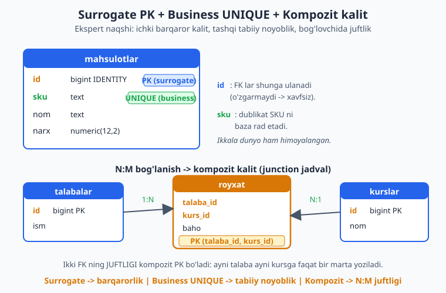

# 06 — Kalit dizayni: natural, surrogate, UUID, kompozit

[⬅️ Oldingi: 05 — Relyatsion model va kalit turlari](./05-relyatsion-model.md) · [🏠 README](./README.md) · [Keyingi: 07 — Normalizatsiya I: 1NF, 2NF, 3NF va anomaliyalar ➡️](./07-normalizatsiya-asoslari.md)

> **Bu bobda:** Har jadvalga primary key kerak — lekin qaysi ustun? Tabiiy qiymatni (email, SKU) olamizmi yoki baza o'zi raqam o'ylab topadimi? Bu bobda natural va surrogate kalit trade-off'larini, surrogate turlarini (IDENTITY vs eskirgan SERIAL, UUID v4 vs v7, ULID), kompozit kalit qachon kerakligini, surrogate PK + business UNIQUE eng yaxshi amaliyotini va taqsimlangan tizimda nega UUID kerakligini PostgreSQL 18 da haqiqiy misollar bilan o'rganamiz.

---

## Kalit tanlash — eng erta va eng qimmat qaror

05-bobda kalit *turlarini* ko'rdik: super key, candidate key, primary key, foreign key. Endi amaliy savol: **aniq qaysi ustunni primary key qilaman?** Bu shunchaki texnik detal emas — bu butun sxemaning asosi. Primary key'ga foreign key'lar ulanadi, indekslar quriladi, JOIN'lar tayanadi. Noto'g'ri tanlasangiz, keyin tuzatish juda qimmat: o'nlab jadvaldagi FK'ni, indekslarni va ilova kodini birato'la o'zgartirish kerak bo'ladi.

Hayotiy o'xshatish: kalit — odamning **identifikatori**. Pasport raqami bormi yoki ichki xodim raqami? Ismni ishlatsak — ikki "Ali Valiyev" bo'lsa-chi, yoki kimdir familiyasini o'zgartirsa? Bu savollarning bazadagi javobi shu bobda.

Ikki katta yondashuv bor:

- **Natural (tabiiy) kalit** — ma'lumotning o'zida mavjud, biznesga ma'noli qiymat (email, ISBN, pasport, SKU).
- **Surrogate (sun'iy) kalit** — baza o'ylab topgan, biznes mantig'iga aloqasi yo'q qiymat (avtoinkrement `id`, UUID).



## Natural kalit: ma'noli, lekin xavfli

Natural kalit jozibali ko'rinadi: qiymat allaqachon mavjud, qo'shimcha ustun shart emas, JOIN'da `WHERE email = '...'` o'qishga tushunarli. Marketplace'da mahsulot uchun SKU, kitob uchun ISBN, davlat uchun ISO kodi (`UZ`, `US`) — bularning hammasi tabiiy nomzodlar.

Ammo amaliyotda natural kalit deyarli har doim muammoga olib keladi. Asosiy sabab — **barqarorlik**. Primary key o'zgarmasligi kerak, chunki unga foreign key'lar bog'langan. Tabiiy qiymatlar esa o'zgarib turadi:

- Foydalanuvchi email'ini almashtiradi.
- Mahsulot SKU'si rebrending sababli yangilanadi.
- "Hech qachon takrorlanmaydi" deb o'ylangan qiymat takrorlanib qoladi (eski ISBN'lar, qayta ishlatilgan telefon raqamlari).

```sql
-- ❌ Natural kalitni PK qilish: keyin pushaymon
CREATE TABLE foydalanuvchilar (
    email text PRIMARY KEY,        -- email = kalit
    ism   text NOT NULL
);
-- Buyurtmalar email'ga bog'langan:
-- buyurtmalar(email_fk text REFERENCES foydalanuvchilar(email), ...)
-- Endi foydalanuvchi email'ini o'zgartirsa -> hamma buyurtmadagi FK ham o'zgarishi kerak!
```

Yana ikki kamchilik: tabiiy qiymat ko'pincha **uzun** bo'ladi (email 50+ belgi) — har FK'da takrorlanib, indekslarni shishiradi; va u **maxfiy ma'lumot** bo'lishi mumkin (pasport raqamini URL'da yoki log'da ko'rsatish xavfli).

> **Qachon natural kalit o'rinli?** Faqat qiymat haqiqatan o'zgarmas, qisqa va universal bo'lsa — masalan ISO mamlakat kodi (`uz`, `us`) yoki valyuta kodi (`USD`, `UZS`). Bunda ham ko'pincha lookup jadval sifatida ishlatiladi, asosiy entity'ning PK'si sifatida emas.

## Surrogate kalit: barqaror va begona

Surrogate kalit — biznesga aloqasi yo'q, faqat satrni noyob aniqlash uchun yaratilgan qiymat. U **hech qachon o'zgarmaydi**, chunki uning o'zgarishiga hech qanday biznes sababi yo'q. Ana shu barqarorlik tufayli FK'lar uchun ideal: foydalanuvchi email'ini million marta o'zgartirsa ham, uning `id`'si o'zgarmaydi.

Kamchiligi: surrogate kalit **o'zi hech ma'no bermaydi**. `id = 98765` kim ekanini bilmaysiz. Va u tabiiy dublikatni avtomatik to'smaydi — `id` har xil bo'lgani uchun ikkita bir xil email'li foydalanuvchi yaratilishi mumkin (buni keyin UNIQUE bilan yopamiz).

Surrogate kalitning ikki asosiy turi bor: **ketma-ket butun son** (IDENTITY) va **UUID**.

## IDENTITY ustun (SERIAL emas!)

Avtoinkrement butun son — eng keng tarqalgan surrogate. PostgreSQL'da tarixan `SERIAL` ishlatilgan, lekin u **eskirgan** (legacy). Zamonaviy va SQL standartiga mos usul — `GENERATED ALWAYS AS IDENTITY`.

```sql
CREATE SCHEMA IF NOT EXISTS ch06;
SET search_path = ch06;

-- ✅ Zamonaviy usul: GENERATED ALWAYS AS IDENTITY
CREATE TABLE mijozlar (
    id    bigint GENERATED ALWAYS AS IDENTITY PRIMARY KEY,
    ism   text NOT NULL,
    email text NOT NULL UNIQUE
);
INSERT INTO mijozlar (ism, email) VALUES ('Ali', 'ali@example.uz'), ('Vali', 'vali@example.uz');
SELECT id, ism, email FROM mijozlar ORDER BY id;
```

Natija (PG18, port 5434 da haqiqatan ishga tushirildi):

```text
 id | ism  |      email
----+------+-----------------
  1 | Ali  | ali@example.uz
  2 | Vali | vali@example.uz
(2 rows)
```

`GENERATED ALWAYS` — kalitni **faqat baza** beradi. Ilova `id`'ni qo'lda kiritishga urinsa, baza rad etadi. Bu xatolikning oldini oladi:

```sql
SET search_path = ch06;
-- ❌ GENERATED ALWAYS bilan aniq id berishga urinish RAD etiladi
INSERT INTO mijozlar (id, ism, email) VALUES (999, 'Haker', 'h@example.uz');
```

```text
ERROR:  cannot insert a non-DEFAULT value into column "id"
DETAIL:  Column "id" is an identity column defined as GENERATED ALWAYS.
HINT:  Use OVERRIDING SYSTEM VALUE to override.
```

**`GENERATED ALWAYS` vs `GENERATED BY DEFAULT`:** `ALWAYS` qattiqroq — ilova qiymat berolmaydi (xavfsizroq, tavsiya etiladi). `BY DEFAULT` esa ilova qiymat berishiga ruxsat beradi (ma'lumot ko'chirishda qulay, lekin sequence va qo'lda qiymat to'qnashishi mumkin).

### Nega SERIAL eskirgan?

`SERIAL` aslida sintaktik "shakar" — orqada yashirin sequence yaratadi va `DEFAULT nextval(...)` qo'yadi:

```sql
SET search_path = ch06;
-- SERIAL aslida nima ekanini ko'ramiz
CREATE TABLE eski_usul (id serial PRIMARY KEY, nom text);
SELECT column_name, data_type, column_default
FROM information_schema.columns
WHERE table_schema='ch06' AND table_name='eski_usul' AND column_name='id';
```

```text
 column_name | data_type |            column_default
-------------+-----------+---------------------------------------
 id          | integer   | nextval('eski_usul_id_seq'::regclass)
(1 row)
```

`SERIAL` muammolari: sequence ustunga to'liq "bog'lanmaydi" (egalik chalkash bo'lishi mumkin), standart emas (ko'chirib bo'lmaydi), va ruxsatlarni alohida boshqarish kerak. Yangi loyihalarda **doim `GENERATED ALWAYS AS IDENTITY` ishlating**.

> **Tur tanlash:** `int` (4 bayt) ~2.1 milliard qatorgacha yetadi; jiddiy tizimda **`bigint`** (8 bayt, ~9.2 kvintillion) ishlating. Diskdagi 4 bayt farqi arzon, lekin `int` to'lib qolsa — migratsiya dahshat. Standart tavsiya: `bigint GENERATED ALWAYS AS IDENTITY`.

> **MySQL'da farq:** MySQL'da bu `id BIGINT AUTO_INCREMENT PRIMARY KEY` deyiladi; `GENERATED ALWAYS AS IDENTITY` sintaksisi MySQL'da yo'q.

## UUID: butun son yetmaganda

Ketma-ket `id` ajoyib, lekin bitta katta kamchiligi bor: uni yaratish uchun **markaziy nuqta** (sequence) kerak. Bitta bazada bu muammo emas. Lekin agar:

- ma'lumot bir necha bazaga taqsimlangan bo'lsa (sharding),
- ID'ni baza emas, **ilova/mijoz** generatsiya qilishi kerak bo'lsa (offline mobil ilova, keyin sinxron),
- ID'ni boshqalar topa olmasligi kerak bo'lsa (ketma-ket `id` "qancha mijoz bor" degan ma'lumotni oshkor qiladi),

— u holda **UUID** (Universally Unique Identifier) kerak bo'ladi. UUID — 128 bitli qiymat bo'lib, markaziy koordinatsiyasiz, har joyda mustaqil generatsiya qilinsa ham deyarli takrorlanmaydi.

PostgreSQL'da ikki muhim variant: **v4** (butunlay tasodifiy) va **v7** (vaqt-tartibli, PostgreSQL 18+ da nativ).

```sql
SET search_path = ch06;
-- UUID v4 (tasodifiy) va v7 (vaqt tartibli) generatsiyasi
SELECT gen_random_uuid()  AS uuid_v4_tasodifiy;
SELECT uuidv7()           AS uuid_v7_tartibli;          -- (PostgreSQL 18+)
SELECT uuid_extract_version(gen_random_uuid()) AS v4_versiya,
       uuid_extract_version(uuidv7())          AS v7_versiya;
```

```text
          uuid_v4_tasodifiy
--------------------------------------
 bb11d0c4-851c-4ba7-bb81-a9e5d489c516

           uuid_v7_tartibli
--------------------------------------
 019ec1e9-2b70-7fd6-aeb5-bdb821566ce1

 v4_versiya | v7_versiya
------------+------------
          4 |          7
```

`gen_random_uuid()` har doim mavjud (v4). `uuidv7()` esa **(PostgreSQL 18+)** da yangi qo'shilgan nativ funksiya — undan oldin v7'ni qo'lda yoki tashqi kutubxona bilan yaratishga to'g'ri kelardi.



### v4 — tasodifiy, lekin indeksga yomon

UUID v4'ning 122 biti butunlay tasodifiy. Bu yaxshi taqsimot beradi, lekin **primary key sifatida indeksga zarar yetkazadi**. PostgreSQL primary key uchun B-tree indeks quradi. Tasodifiy qiymat har safar indeksning *boshqa-boshqa* joyiga tushadi — bu page split'larni ko'paytiradi, kesh samaradorligini buzadi va indeksni shishirtiradi.

Ketma-ket chaqirilgan v4 qiymatlar **tartibsiz** ekanini ko'ramiz:

```sql
SET search_path = ch06;
WITH v4 AS (
    SELECT 1 AS n, gen_random_uuid() AS u
    UNION ALL SELECT 2, gen_random_uuid()
    UNION ALL SELECT 3, gen_random_uuid()
    UNION ALL SELECT 4, gen_random_uuid()
    UNION ALL SELECT 5, gen_random_uuid()
)
SELECT n, u, u > lag(u) OVER (ORDER BY n) AS oldingidan_katta
FROM v4 ORDER BY n;
```

```text
 n |                  u                   | oldingidan_katta
---+--------------------------------------+------------------
 1 | a5881245-8dcc-402e-8cd8-e99e84ac55f2 |
 2 | 609d09be-8a10-4d08-821d-1b3a60297f19 | f
 3 | c2af2a7c-0230-4c1b-be08-3ba4e8fab5d8 | t
 4 | 933c6bb8-8768-428b-93ee-44ef5886d8c1 | f
 5 | c1472114-21ea-490b-bf84-ce5e13e2fbfd | t
```

`oldingidan_katta` ustuni `f` va `t` aralash — har keyingisi oldingisidan goh kichik, goh katta. Indeks nuqtai nazaridan bu "tartibsizlik" yomon.

### v7 — vaqt-tartibli, indeksga do'st (PostgreSQL 18+)

UUID v7 birinchi 48 bitiga **Unix vaqt tamg'asini (millisekund)** joylaydi, qolgani tasodif. Demak ketma-ket generatsiya qilingan v7 qiymatlar **o'sib boradi** — xuddi avtoinkrement `id` kabi. B-tree indeksda ular doim oxiriga qo'shiladi: kam page split, zich indeks, tez yozish.

Buni isbotlaymiz — 5 ta v7'ni ketma-ket yaratib, har biri oldingisidan katta ekanini ko'rsatamiz:

```sql
SET search_path = ch06;
-- uuidv7() VAQT TARTIBLI: ketma-ket qiymatlar doim o'sadi
WITH ketma_ket AS (
    SELECT 1 AS n, uuidv7() AS u
    UNION ALL SELECT 2, uuidv7()
    UNION ALL SELECT 3, uuidv7()
    UNION ALL SELECT 4, uuidv7()
    UNION ALL SELECT 5, uuidv7()
)
SELECT n, u, u > lag(u) OVER (ORDER BY n) AS oldingidan_katta
FROM ketma_ket ORDER BY n;
```

```text
 n |                  u                   | oldingidan_katta
---+--------------------------------------+------------------
 1 | 019ec1e9-50a1-760f-b06a-2aeadff92ed0 |
 2 | 019ec1e9-50a1-7659-bedf-4d10dca93fd3 | t
 3 | 019ec1e9-50a1-7665-bb63-60ccb4d1d11d | t
 4 | 019ec1e9-50a1-766c-af11-5faa3322d85d | t
 5 | 019ec1e9-50a1-7677-82ce-803f8935abef | t
```

Hamma `oldingidan_katta = t` — **monoton o'sish**. v4 dagi `f/t` aralashmasi bilan solishtiring: aynan shu farq v7'ni kalit sifatida ustun qiladi. Boshlanish (`019ec1e9-50a1`) ham bir xilligini ko'ring — ular bir necha millisekund ichida yaratilgani uchun vaqt qismi deyarli teng.

Yana bir bonus: v7'dan **vaqtni qaytarib ajratib olish** mumkin (v4'dan mumkin emas):

```sql
SET search_path = ch06;
SELECT uuid_extract_timestamp(uuidv7())         AS v7_vaqti;
SELECT uuid_extract_timestamp(gen_random_uuid()) AS v4_vaqti;  -- NULL
```

```text
          v7_vaqti
----------------------------
 2026-06-13 21:56:02.246+05

 v4_vaqti
----------
                              (NULL — v4 da vaqt yo'q)
```

UUID'ni jadval kaliti sifatida ishlatish (`DEFAULT uuidv7()`) va `id` bo'yicha tartiblash aslida vaqt bo'yicha tartiblashga teng ekanini ko'ramiz:

```sql
SET search_path = ch06;
CREATE TABLE hodisalar (
    id    uuid PRIMARY KEY DEFAULT uuidv7(),   -- (PostgreSQL 18+)
    turi  text NOT NULL,
    vaqti timestamptz NOT NULL DEFAULT now()
);
INSERT INTO hodisalar (turi) VALUES ('login'), ('xarid'), ('chiqish');
SELECT id, turi, uuid_extract_timestamp(id) AS id_dan_vaqt
FROM hodisalar ORDER BY id;   -- id bo'yicha tartib = qo'shilish (vaqt) tartibi
```

```text
                  id                  |  turi   |        id_dan_vaqt
--------------------------------------+---------+----------------------------
 019ec1ea-03be-73de-8bcf-bf5722cdcb8a | login   | 2026-06-13 21:56:39.614+05
 019ec1ea-03bf-70d3-8c97-844faff03253 | xarid   | 2026-06-13 21:56:39.615+05
 019ec1ea-03bf-7105-823e-65024585d819 | chiqish | 2026-06-13 21:56:39.615+05
(3 rows)
```

> **Qoida:** UUID kalit kerak bo'lsa, PG18'da **`uuidv7()`** ni tanlang, `gen_random_uuid()` (v4) ni emas. v4 ni faqat ID'ning vaqt sirini ham yashirish kerak bo'lganda (tokenlar, parolni tiklash havolasi) ishlating.

### ULID — qisqacha

ULID (Universally Unique Lexicographically Sortable Identifier) — UUID v7'dan oldin paydo bo'lgan, xuddi shu g'oyaga asoslangan format: 48 bit vaqt + 80 bit tasodif, lekin matn ko'rinishi qisqaroq va lug'aviy tartiblanadigan Crockford Base32 kodlash bilan (masalan `01ARZ3NDEKTSV4RRFFQ69G5FAV`). ULID PostgreSQL'da nativ tur emas — uni `text` yoki tashqi kengaytma bilan saqlash kerak. **Amaliy maslahat:** PG18'da nativ `uuidv7()` borligi sababli endi ULID'ni alohida olib kelishning hojati deyarli yo'q — v7 bir xil afzallikni nativ tarzda beradi.

## Kompozit kalit: bir necha ustun birga

Ba'zan birorta yagona ustun satrni noyob aniqlay olmaydi — kalit **bir necha ustunning birikmasi** bo'lishi kerak. Bu **kompozit (composite) kalit**.

Eng tipik holat — **N:M bog'lanish uchun junction (bog'lovchi) jadval**. "Talaba ko'p kursga yoziladi, kurs ko'p talabaga" — bu N:M. U bog'lovchi jadval bilan modellanadi va uning kaliti tabiiy ravishda ikki FK'ning juftligi bo'ladi:

```sql
SET search_path = ch06;
CREATE TABLE talabalar (id bigint GENERATED ALWAYS AS IDENTITY PRIMARY KEY, ism text NOT NULL);
CREATE TABLE kurslar   (id bigint GENERATED ALWAYS AS IDENTITY PRIMARY KEY, nom text NOT NULL);

CREATE TABLE royxat (
    talaba_id bigint NOT NULL REFERENCES talabalar(id),
    kurs_id   bigint NOT NULL REFERENCES kurslar(id),
    baho      int,
    PRIMARY KEY (talaba_id, kurs_id)   -- KOMPOZIT kalit
);

INSERT INTO talabalar (ism) VALUES ('Ali'), ('Vali');
INSERT INTO kurslar (nom) VALUES ('SQL'), ('Tarmoq');
INSERT INTO royxat (talaba_id, kurs_id, baho) VALUES (1,1,90), (1,2,85), (2,1,75);
SELECT * FROM royxat ORDER BY talaba_id, kurs_id;
```

```text
 talaba_id | kurs_id | baho
-----------+---------+------
         1 |       1 |   90
         1 |       2 |   85
         2 |       1 |   75
(3 rows)
```

Kompozit PK avtomatik ravishda muhim biznes qoidasini majburlaydi: **ayni talaba ayni kursga ikki marta yozilolmaydi**.

```sql
SET search_path = ch06;
-- Kompozit kalit takrorlanishni rad etadi
INSERT INTO royxat (talaba_id, kurs_id, baho) VALUES (1, 1, 100);
```

```text
ERROR:  duplicate key value violates unique constraint "royxat_pkey"
DETAIL:  Key (talaba_id, kurs_id)=(1, 1) already exists.
```

### Kompozit PK qo'shimcha surrogate bilan

Junction jadval ham boshqa jadvalga **referenslanadigan** bo'lsa (masalan `royxat` ga to'lovlar bog'lanadi), kompozit kalitni ikkala FK'da takrorlash noqulay. Bunda surrogate PK qo'shib, kompozit ustunlarni UNIQUE qilish keng tarqalgan:

```sql
-- ✅ Junction'ga FK kerak bo'lsa: surrogate PK + kompozit UNIQUE
-- CREATE TABLE royxat2 (
--     id        bigint GENERATED ALWAYS AS IDENTITY PRIMARY KEY,
--     talaba_id bigint NOT NULL REFERENCES talabalar(id),
--     kurs_id   bigint NOT NULL REFERENCES kurslar(id),
--     UNIQUE (talaba_id, kurs_id)   -- baribir juftlik noyob
-- );
```

> **Qoida:** Sof junction jadval (faqat ikki FK + atribut) — **kompozit PK** yetarli va toza. Junction'ning o'ziga boshqa jadval ulanadigan bo'lsa — **surrogate PK + kompozit UNIQUE**.

## Eng yaxshi amaliyot: surrogate PK + business key UNIQUE

Mana butun bobning eng muhim xulosasi. Natural va surrogate kalit o'rtasida tanlash — soxta dilemma. **Ikkalasini ham oling:**

- **Surrogate** ustunni primary key qiling — barqarorlik va tez JOIN uchun. FK'lar shunga ulanadi.
- **Tabiiy (business) qiymatga** `UNIQUE` constraint qo'ying — haqiqiy dunyodagi noyoblikni majburlash uchun.

```sql
SET search_path = ch06;
-- ✅ Ekspert naqshi
CREATE TABLE mahsulotlar (
    id    bigint GENERATED ALWAYS AS IDENTITY PRIMARY KEY,  -- surrogate (ichki, barqaror)
    sku   text NOT NULL UNIQUE,                              -- business key (tashqi, tabiiy)
    nom   text NOT NULL,
    narx  numeric(12,2) NOT NULL CHECK (narx >= 0)
);
INSERT INTO mahsulotlar (sku, nom, narx) VALUES ('KIT-001', 'Kitob', 50000), ('QAL-002', 'Qalam', 3000);
SELECT id, sku, nom, narx FROM mahsulotlar ORDER BY id;
```

```text
 id |   sku   |  nom  |   narx
----+---------+-------+----------
  1 | KIT-001 | Kitob | 50000.00
  2 | QAL-002 | Qalam |  3000.00
(2 rows)
```

`id` — FK'lar uchun barqaror nuqta. `sku` — `UNIQUE` tufayli dublikat rad etiladi:

```sql
SET search_path = ch06;
-- Business key UNIQUE dublikat SKU ni to'sadi
INSERT INTO mahsulotlar (sku, nom, narx) VALUES ('KIT-001', 'Boshqa kitob', 60000);
```

```text
ERROR:  duplicate key value violates unique constraint "mahsulotlar_sku_key"
DETAIL:  Key (sku)=(KIT-001) already exists.
```



Shunday qilib SKU o'zgarsa ham (`UPDATE mahsulotlar SET sku=... WHERE id=1`), barcha FK'lar `id`'ga bog'langani uchun hech narsa buzilmaydi. Tabiiy dublikat esa baza darajasida to'silgan. Ikkala dunyoning yaxshisi.

## Kalit barqarorligi: immutable bo'lsin

Yuqoridagi hamma muhokamaning ostida bitta tamoyil yotadi: **primary key o'zgarmas (immutable) bo'lishi shart.** Sababi:

1. FK'lar PK'ga ishora qiladi — PK o'zgarsa, FK'lar yetim qoladi yoki kaskadli o'zgarish kerak.
2. Tashqi tizimlar (URL'lar, API, keshlar, log'lar) PK'ni eslab qoladi — o'zgarsa, ular buziladi.

Shuning uchun PK uchun *hech qachon o'zgarishiga biznes sababi bo'lmagan* qiymat tanlanadi. Surrogate kalitlar shu sababli ustun: ularning ta'rifi bo'yicha o'zgarishga sabab yo'q. Natural kalitlar esa har doim "o'zgarib qolish" xavfini ko'taradi. Agar tabiiy qiymatni baribir kalit qilmoqchi bo'lsangiz, o'zingizga halol savol bering: *"Bu qiymat keyingi 10 yilda 100% o'zgarmasligiga kafolat beraman?"* Javob "yo'q" yoki "balki" bo'lsa — surrogate ishlating.

## Taqsimlangan tizimda kalit: nega UUID

Yana bir bor: bitta bazada `bigint IDENTITY` deyarli har doim eng yaxshi tanlov — eng kichik, eng tez, eng oddiy. UUID'ga o'tish uchun aniq sabab kerak:

| Vaziyat | Nega `bigint` yetmaydi | UUID yechimi |
|---|---|---|
| Sharding (ko'p baza) | Ikki bazada bir xil `id` to'qnashadi | UUID global noyob — koordinatsiyasiz |
| ID'ni mijoz/ilova generatsiya qiladi | Sequence faqat bazada | Ilova UUID'ni o'zi yaratadi |
| Offline-first mobil ilova | Server bilan oldin gaplashish kerak | ID oldindan, offline yaratiladi |
| Tashqi havola sirligi | `id=42` -> raqobatchi "42 ta buyurtma" deb biladi | UUID enumeratsiyani buzadi |
| Tizimlarni birlashtirish (merge) | `id` lar to'qnashadi | UUID lar birlashganda ham noyob |

Taqsimlangan tizimda asosiy g'oya: **markaziy koordinatsiyani yo'qotish.** Har tugun mustaqil ravishda ID yaratib, keyin to'qnashuvsiz birlashtira olishi kerak. UUID aynan shuni ta'minlaydi — ehtimollik shu darajada kichikki, amalda takrorlanish bo'lmaydi. Va PG18'da `uuidv7()` borligi tufayli endi UUID'ning eski "indeks shishadi" muammosi ham hal bo'lgan: vaqt-tartibli bo'lgani uchun u `bigint` ga yaqin indeks samaradorligini beradi, lekin global noyoblikni saqlaydi.

```sql
-- Tozalash (bobning izolyatsiyasi)
DROP SCHEMA ch06 CASCADE;
```

> **MySQL'da farq:** MySQL'da `uuidv7()` nativ funksiyasi yo'q; v4 uchun `UUID()` bor, lekin uni `BINARY(16)` ga `UUID_TO_BIN(..., 1)` bilan "swap" qilib saqlash tavsiya etiladi (vaqt qismini oldinga olib, indeksga do'st qilish). PostgreSQL 18 `uuidv7()` esa buni nativ va toza qiladi.

## Qaror daraxti: qaysi kalitni tanlayman?

Amaliy yakuniy ko'rsatma:

1. **Standart:** `id bigint GENERATED ALWAYS AS IDENTITY PRIMARY KEY`. Shubha bo'lsa — shu.
2. **Tabiiy noyob qiymat bormi?** (email, SKU, ISBN) -> uni alohida ustun qilib `UNIQUE` qo'shing. PK qilmang.
3. **Taqsimlangan/sharding/mijoz-generatsiya/sir kerakmi?** -> `id uuid PRIMARY KEY DEFAULT uuidv7()` (PG18+).
4. **N:M junction jadvalmi?** -> kompozit PK `(a_id, b_id)`. Junction'ga boshqa jadval ulansa -> surrogate PK + kompozit UNIQUE.
5. **SERIAL?** -> Hech qachon. Doim `GENERATED ALWAYS AS IDENTITY`.

## Mashqlar

Quyidagi masalalar DIZAYN qarorlariga qaratilgan — to'g'ri kalit strategiyasini tanlash va asoslab berish.

### Oson

1. Quyidagi jadvalda nima xato? Kalit dizayni nuqtai nazaridan tuzating:
   ```sql
   CREATE TABLE foydalanuvchilar (
       email text PRIMARY KEY,
       ism   text
   );
   ```

2. `SERIAL` o'rniga zamonaviy PostgreSQL 18 usulida `buyurtmalar` jadvalining `id` ustunini yozing. Nega `SERIAL` eskirgan — bir jumlada ayting.

3. `gen_random_uuid()` va `uuidv7()` o'rtasidagi asosiy farq nima? Qaysi biri primary key uchun yaxshiroq va nega?

4. Quyidagi vaziyat uchun natural kalit yoki surrogate kalit tanlardingiz? Sababini yozing: "Mamlakatlar jadvali — har mamlakatning ISO 3166 ikki harfli kodi bor (`uz`, `us`, `de`)".

### O'rta

5. "Talaba" va "kurs" N:M bog'lanishini bog'lovchi (`royxat`) jadval bilan modellashtiring. Kalitni to'g'ri tanlang va nega kompozit kalit ekanini izohlang.

6. `mahsulotlar` jadvali uchun "surrogate PK + business key UNIQUE" naqshini DDL bilan yozing. SKU ustuni — tabiiy noyob qiymat. Keyin tushuntiring: SKU o'zgarsa nima bo'ladi va nega bu xavfsiz?

7. Bir jamoa shunday dedi: "UUID v4 ni hamma joyda primary key qilamiz, chunki u global noyob". Bu qarorning indeks/performans tomondan kamchiligini tushuntiring va PostgreSQL 18 da yaxshiroq alternativani taklif qiling.

8. Quyidagi jadvalda `passport_raqami` primary key qilingan. Bu qaror qaysi kalit barqarorligi tamoyilini buzadi? Yaxshiroq dizaynni yozing:
   ```sql
   CREATE TABLE fuqarolar (
       passport_raqami text PRIMARY KEY,
       ism text,
       tugilgan_sana date
   );
   ```

### Qiyin

9. Offline-first mobil ilova loyihalashtiryapsiz: foydalanuvchi internetisiz yozuvlar yaratadi, keyin server bilan sinxron qiladi. Nega bu yerda `bigint IDENTITY` ishlamaydi va qanday kalit strategiyasi to'g'ri? Jadval DDL'ini yozing.

10. Marketplace tizimi 4 ta alohida bazaga shardlangan (har biri mintaqa bo'yicha). `buyurtmalar` jadvali uchun kalit strategiyasini tanlang va asoslang. `bigint IDENTITY` nega muammo tug'diradi, qanday yechimlar bor (kamida ikkitasini ayting)?

11. `royxat` junction jadvaliga endi "to'lovlar" jadvali bog'lanishi kerak (har ro'yxatga olish uchun to'lovlar). Hozirgi kompozit PK `(talaba_id, kurs_id)` bu vaziyatni qiyinlashtiradi. Sxemani qayta loyihalang va nega o'zgartirganingizni tushuntiring.

12. Bir tizim foydalanuvchi `id` sifatida `gen_random_uuid()` (v4) ishlatadi va jadval 50 million qatorga yetganda INSERT'lar sekinlashganini sezdi. Muammoni diagnostik tushuntiring (B-tree indeks nuqtai nazaridan) va PG18 da minimal o'zgarish bilan yechimni yozing.

13. Quyidagi "lookup + entity" aralashmasini ko'rib chiqing. `valyutalar` (kichik, barqaror ro'yxat: `USD`, `UZS`, `EUR`) va `hisoblar` (millionlab, o'sib boruvchi) jadvallari uchun har birida qaysi kalit strategiyasi (natural vs surrogate) to'g'riligini alohida asoslang.

14. Bir loyihada `foydalanuvchilar(id uuid DEFAULT uuidv7())` va parolni tiklash uchun `parol_tiklash(token uuid DEFAULT ???)` jadvali bor. `token` uchun `uuidv7()` ishlatish nega xavfsizlik xatosi? Qaysi UUID variantini va nega ishlatasiz?

## Yechimlar

<details markdown="1">
<summary>Yechim — 1</summary>

`email` primary key qilingan — bu natural kalit barqarorlik tamoyilini buzadi. Email o'zgaradi (foydalanuvchi yangi email'ga o'tadi), va u o'zgarsa, unga bog'langan barcha FK'lar buziladi. Tuzatish — surrogate PK + email'ga UNIQUE:

```sql
CREATE TABLE foydalanuvchilar (
    id    bigint GENERATED ALWAYS AS IDENTITY PRIMARY KEY,
    email text NOT NULL UNIQUE,
    ism   text NOT NULL
);
```

Endi `id` barqaror (FK'lar shunga ulanadi), `email` esa baribir noyob (`UNIQUE` tufayli) va istalgancha o'zgartirilishi mumkin.

</details>

<details markdown="1">
<summary>Yechim — 2</summary>

```sql
CREATE TABLE buyurtmalar (
    id bigint GENERATED ALWAYS AS IDENTITY PRIMARY KEY
);
```

`SERIAL` eskirgan, chunki u standartga mos kelmaydigan, orqada yashirin sequence yaratadigan eski sintaksis; `GENERATED ALWAYS AS IDENTITY` esa SQL standartiga mos, sequence'ni ustunga to'g'ri bog'laydi va ilovaning xato qiymat kiritishini to'sadi.

</details>

<details markdown="1">
<summary>Yechim — 3</summary>

`gen_random_uuid()` — UUID **v4**, butunlay tasodifiy (122 bit tasodif). `uuidv7()` — UUID **v7** (PostgreSQL 18+), birinchi 48 biti vaqt tamg'asi, qolgani tasodif, shuning uchun ketma-ket qiymatlar o'sib boradi.

Primary key uchun **v7 yaxshiroq**: vaqt-tartibli bo'lgani uchun B-tree indeksda doim oxiriga qo'shiladi — kam page split, zich indeks, tez INSERT. v4 esa tasodifiy joyga tushib, indeksni shishirtiradi va yozishni sekinlashtiradi.

</details>

<details markdown="1">
<summary>Yechim — 4</summary>

Bu — natural kalit o'rinli bo'lgan kam holatlardan biri. ISO 3166 kodi: qisqa (2 belgi), universal, standartlashtirilgan va **deyarli hech qachon o'zgarmaydi**. Mamlakatlar jadvali kichik lookup jadval bo'lgani uchun natural kalit (`kod char(2) PRIMARY KEY`) maqbul:

```sql
CREATE TABLE mamlakatlar (
    kod char(2) PRIMARY KEY,   -- 'uz', 'us', 'de'
    nom text NOT NULL
);
```

Bu yerda kod o'zgarmasligi tufayli FK'lar (`mamlakat_kod char(2) REFERENCES mamlakatlar(kod)`) ham xavfsiz, va `kod` o'qishga ma'noli. Lekin xohlasangiz surrogate + UNIQUE ham noto'g'ri emas — bu nozik holat.

</details>

<details markdown="1">
<summary>Yechim — 5</summary>

```sql
CREATE TABLE talabalar (id bigint GENERATED ALWAYS AS IDENTITY PRIMARY KEY, ism text NOT NULL);
CREATE TABLE kurslar   (id bigint GENERATED ALWAYS AS IDENTITY PRIMARY KEY, nom text NOT NULL);

CREATE TABLE royxat (
    talaba_id bigint NOT NULL REFERENCES talabalar(id),
    kurs_id   bigint NOT NULL REFERENCES kurslar(id),
    baho      int,
    PRIMARY KEY (talaba_id, kurs_id)
);
```

Kompozit kalit `(talaba_id, kurs_id)`, chunki: (a) bog'lovchi qatorni noyob aniqlaydigan narsa aynan ikki tomonning juftligi; (b) bu avtomatik ravishda "ayni talaba ayni kursga ikki marta yozilolmaydi" qoidasini majburlaydi. Bitta ustun (faqat `talaba_id`) yetmaydi — talaba ko'p kursga yozilishi mumkin.

</details>

<details markdown="1">
<summary>Yechim — 6</summary>

```sql
CREATE TABLE mahsulotlar (
    id   bigint GENERATED ALWAYS AS IDENTITY PRIMARY KEY,
    sku  text NOT NULL UNIQUE,
    nom  text NOT NULL,
    narx numeric(12,2) NOT NULL CHECK (narx >= 0)
);
```

SKU o'zgarsa (`UPDATE mahsulotlar SET sku='YANGI' WHERE id=1`) — **hech narsa buzilmaydi**, chunki barcha foreign key'lar `id`'ga bog'langan, `sku`'ga emas. `id` o'zgarmagani uchun FK'lar joyida qoladi. Ayni paytda `UNIQUE` tufayli baza ikkita bir xil SKU'li mahsulotni rad etadi — tabiiy noyoblik baribir saqlanadi. Surrogate barqarorlikni, UNIQUE esa biznes noyobligini ta'minlaydi.

</details>

<details markdown="1">
<summary>Yechim — 7</summary>

Kamchilik: UUID v4 butunlay tasodifiy, shuning uchun primary key B-tree indeksida har INSERT tasodifiy sahifaga tushadi. Bu page split'larni ko'paytiradi, kesh lokalligini buzadi (oxirgi sahifa "issiq" qolmaydi), indeksni shishirtiradi va katta jadvallarda yozishni sezilarli sekinlashtiradi.

Yaxshiroq alternativa (PG18): **`uuidv7()`**. U global noyoblikni saqlaydi (v4 kabi), lekin vaqt-tartibli bo'lgani uchun indeksga `bigint` kabi do'st: yozuvlar doim oxiriga qo'shiladi.

```sql
CREATE TABLE elementlar (
    id uuid PRIMARY KEY DEFAULT uuidv7()
);
```

Agar global noyoblik umuman kerak bo'lmasa (bitta baza) — eng yaxshisi `bigint GENERATED ALWAYS AS IDENTITY`.

</details>

<details markdown="1">
<summary>Yechim — 8</summary>

`passport_raqami` PK qilish **kalit barqarorligi (immutability)** tamoyilini buzadi: pasport raqami yangilanishi mumkin (yo'qotilgan, almashtirilgan pasport), va u maxfiy ma'lumot bo'lgani uchun URL/log'da ko'rsatish xavfli. Yaxshiroq dizayn — surrogate PK + pasportga UNIQUE:

```sql
CREATE TABLE fuqarolar (
    id              bigint GENERATED ALWAYS AS IDENTITY PRIMARY KEY,
    passport_raqami text NOT NULL UNIQUE,
    ism             text NOT NULL,
    tugilgan_sana   date
);
```

Endi pasport almashsa, faqat shu bitta ustun yangilanadi; FK'lar `id`'da qolib, hech narsa buzilmaydi.

</details>

<details markdown="1">
<summary>Yechim — 9</summary>

`bigint IDENTITY` ishlamaydi, chunki ketma-ket `id` ni faqat **markaziy sequence** (server bazasi) berishi mumkin. Offline holatda mijoz serverga ulanmagan — sequence'dan qiymat ololmaydi. Agar har qurilma o'zicha `1, 2, 3...` bersa, sinxronda hammasi to'qnashadi.

To'g'ri yechim — mijoz tomonda yaratiladigan **UUID**, afzal `uuidv7()` (yoki ilova kutubxonasidagi v7):

```sql
CREATE TABLE qaydlar (
    id       uuid PRIMARY KEY DEFAULT uuidv7(),
    matn     text NOT NULL,
    yaratilgan timestamptz NOT NULL DEFAULT now()
);
```

Mijoz offline'da ham UUID'ni o'zi yaratadi (global noyob), keyin sinxronda hech qanday to'qnashuvsiz serverga yuboradi. v7 tanlanadi, chunki u vaqt-tartibli — server indeksiga do'st.

</details>

<details markdown="1">
<summary>Yechim — 10</summary>

`bigint IDENTITY` muammosi: har shard'ning o'z sequence'i bor, shuning uchun 4 ta bazada ham `id = 1, 2, 3...` yaratiladi — global to'qnashuv. Ikki bazadagi `buyurtma id=100` har xil buyurtma bo'lib, birlashtirishda chalkashlik.

Yechimlar (kamida ikkitasi):

1. **UUID (uuidv7)** — eng toza: har shard mustaqil global noyob ID yaratadi, koordinatsiyasiz.
   ```sql
   CREATE TABLE buyurtmalar (id uuid PRIMARY KEY DEFAULT uuidv7(), ...);
   ```
2. **Sequence diapazonini bo'lib berish** — har shard'ga alohida oraliq (shard 1: 1–1mlrd, shard 2: 1mlrd–2mlrd) yoki har sequence'ni boshqa `START`/`INCREMENT` bilan sozlash.
3. **Kompozit/prefiksli kalit** — `(shard_id, lokal_id)` yoki `id`ning yuqori bitlariga shard raqamini joylash (snowflake-uslub ID).

Zamonaviy tavsiya — `uuidv7()`: oddiy, indeksga do'st, koordinatsiya talab qilmaydi.

</details>

<details markdown="1">
<summary>Yechim — 11</summary>

Junction jadvalga boshqa jadval ulanishi kerak bo'lsa, kompozit PK'ni FK sifatida takrorlash noqulay (`to'lovlar` ikkala ustunni ham olib yurishi kerak bo'ladi). Yechim — `royxat`ga surrogate PK qo'shib, juftlikni UNIQUE qilish:

```sql
CREATE TABLE royxat (
    id        bigint GENERATED ALWAYS AS IDENTITY PRIMARY KEY,
    talaba_id bigint NOT NULL REFERENCES talabalar(id),
    kurs_id   bigint NOT NULL REFERENCES kurslar(id),
    baho      int,
    UNIQUE (talaba_id, kurs_id)        -- juftlik baribir noyob
);

CREATE TABLE tolovlar (
    id        bigint GENERATED ALWAYS AS IDENTITY PRIMARY KEY,
    royxat_id bigint NOT NULL REFERENCES royxat(id),   -- bitta ustunli FK
    summa     numeric(12,2) NOT NULL CHECK (summa >= 0)
);
```

Nega: `to'lovlar` endi `royxat`ga bitta sodda FK (`royxat_id`) bilan ulanadi, ikki ustunni emas. `UNIQUE (talaba_id, kurs_id)` esa "bir marta yozilish" qoidasini saqlaydi — biznes qoidasi yo'qolmaydi.

</details>

<details markdown="1">
<summary>Yechim — 12</summary>

Diagnostika: v4 UUID butunlay tasodifiy. Primary key B-tree indeksida har yangi INSERT tasodifiy bargga (leaf page) tushadi. Jadval kichikligida bu sezilmaydi, lekin 50 million qatorda indeks RAM'ga sig'maydi — har INSERT diskdan tasodifiy sahifani o'qib, o'zgartirib, qaytaradi. Page split'lar ko'payadi, kesh "issiq sahifa" lokalligini yo'qotadi -> INSERT sekinlashadi va indeks shishadi.

Minimal yechim (PG18) — kalitni `uuidv7()` ga o'tkazish. v7 vaqt-tartibli bo'lgani uchun yangi qatorlar doim indeksning oxirgi sahifasiga qo'shiladi (sequential insert): faqat bitta "issiq" sahifa, kam split, kesh do'st.

```sql
ALTER TABLE foydalanuvchilar
    ALTER COLUMN id SET DEFAULT uuidv7();
-- (yangi qatorlar v7 oladi; mavjud v4 qatorlar qoladi, lekin yangilari tartibli)
```

Toza yechim — yangi jadvalni `uuidv7()` DEFAULT bilan yaratib, ma'lumotni ko'chirish. Tur (`uuid`) o'zgarmagani uchun migratsiya yengil.

</details>

<details markdown="1">
<summary>Yechim — 13</summary>

**`valyutalar`** — kichik, barqaror, standartlashtirilgan lookup. Natural kalit (`kod char(3) PRIMARY KEY`: `USD`, `UZS`) maqbul: kod hech qachon o'zgarmaydi, qisqa, o'qishga ma'noli va FK'lar (`valyuta_kod char(3)`) ham tushunarli bo'ladi.

```sql
CREATE TABLE valyutalar (
    kod char(3) PRIMARY KEY,   -- 'USD', 'UZS', 'EUR'
    nom text NOT NULL
);
```

**`hisoblar`** — millionlab, o'sib boruvchi entity. Surrogate kalit (`bigint GENERATED ALWAYS AS IDENTITY`): hisob raqami biznes qoidasi bilan o'zgarishi mumkin, ko'p FK unga ulanadi, va indeks tez bo'lishi kerak.

```sql
CREATE TABLE hisoblar (
    id          bigint GENERATED ALWAYS AS IDENTITY PRIMARY KEY,
    valyuta_kod char(3) NOT NULL REFERENCES valyutalar(kod),
    raqam       text NOT NULL UNIQUE   -- tabiiy hisob raqami -> UNIQUE
);
```

Tamoyil: kichik/barqaror lookup -> natural maqbul; katta/o'sadigan entity -> surrogate + tabiiy qiymatga UNIQUE.

</details>

<details markdown="1">
<summary>Yechim — 14</summary>

`token` uchun `uuidv7()` xavfsizlik xatosi, chunki v7 ichida **vaqt tamg'asi ochiq saqlanadi** — `uuid_extract_timestamp()` bilan tokenning aniq yaratilish vaqtini bilib olish mumkin. Hujumchi token qachon yaratilganini taxmin qilib, qolgan tasodifiy qismni siniqtirishga urinish maydonini toraytiradi. Parol tiklash tokeni **butunlay taxmin qilib bo'lmaydigan** bo'lishi kerak.

To'g'ri tanlov — **`gen_random_uuid()`** (v4): butunlay tasodifiy, hech qanday vaqt yoki tartib sirini oshkor qilmaydi.

```sql
CREATE TABLE parol_tiklash (
    token       uuid PRIMARY KEY DEFAULT gen_random_uuid(),   -- v4: sir
    foydalanuvchi_id uuid NOT NULL REFERENCES foydalanuvchilar(id),
    amal_qiladi timestamptz NOT NULL
);
```

Qoida: **kalit/tartib** kerak bo'lsa v7; **sir/oldindan taxmin qilib bo'lmaydigan token** kerak bo'lsa v4.

</details>

---

[⬅️ Oldingi: 05 — Relyatsion model va kalit turlari](./05-relyatsion-model.md) · [🏠 README](./README.md) · [Keyingi: 07 — Normalizatsiya I: 1NF, 2NF, 3NF va anomaliyalar ➡️](./07-normalizatsiya-asoslari.md)
