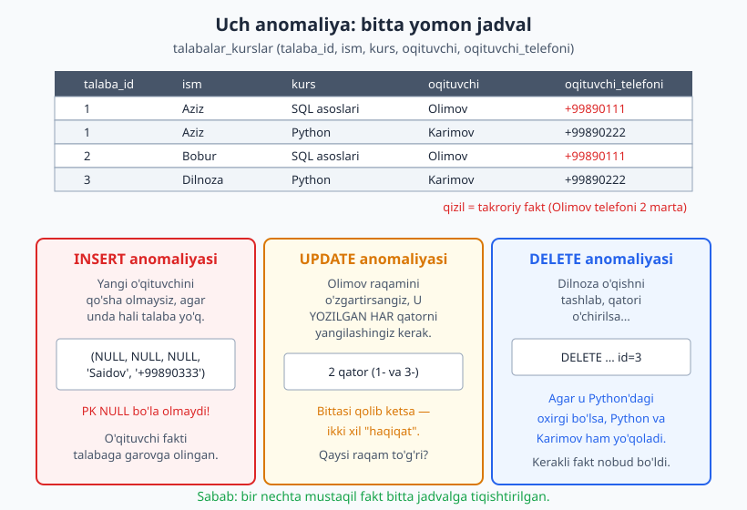
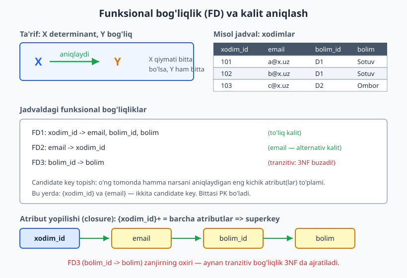
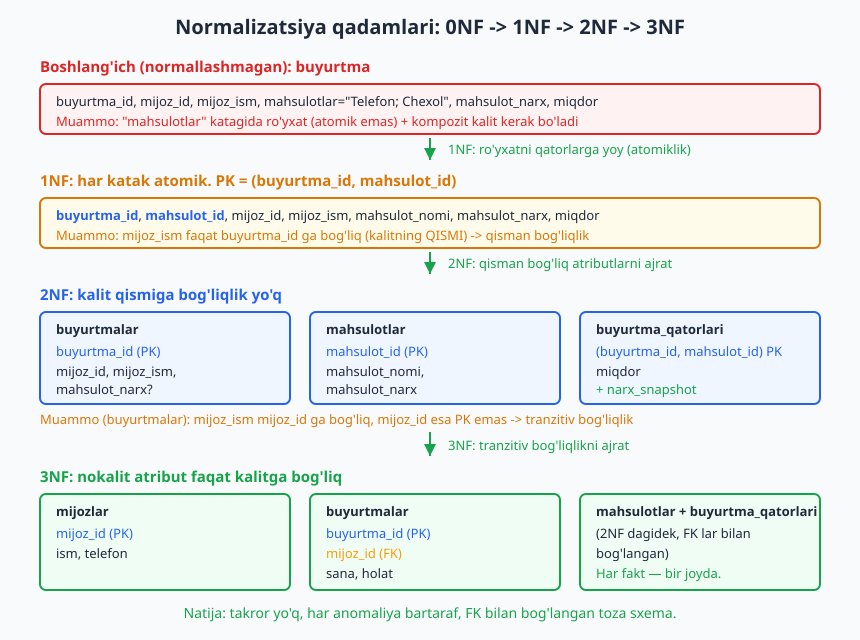

# 07 — Normalizatsiya I: 1NF, 2NF, 3NF va anomaliyalar

[⬅️ Oldingi: 06 — Kalit dizayni: natural, surrogate, UUID, kompozit](./06-kalit-dizayni.md) · [🏠 README](./README.md) · [Keyingi: 08 — Normalizatsiya II: BCNF, 4NF, 5NF va denormalizatsiya ➡️](./08-normalizatsiya-ilgor.md)

> **Bu bobda:** normalizatsiyaning asl mexanizmi — **funksional bog'liqlik (FD)** nimaligini, "hammasi bitta jadvalda" dizayni keltiradigan uchta **anomaliya**ni (insert/update/delete) bitta yomon jadvalda ko'rib chiqamiz, so'ng aynan shu jadvalni **1NF -> 2NF -> 3NF** bo'ylab qadam-baqadam parchalaymiz. SQL kitobi normalizatsiyaga sodda "3 qoida" sifatida qaragan edi; bu bobda nazariy asos (determinant, candidate key, qisman va tranzitiv bog'liqlik) bilan **nega** har qadam shunday qilinishini tushunamiz.

---

## Kirish: normalizatsiya — bu ratsional jarayon, sehr emas

SQL kitobining [20-bobida](../sql/20-normalizatsiya.md) normalizatsiyani uchta sodda qoida sifatida o'rgangansiz: "bitta katak — bitta qiymat", "har fakt — o'z jadvalida", "jadvallar id orqali bog'lanadi". Bu qoidalar amaliyot uchun ajoyib, lekin ular **nega** ishlashini tushuntirmaydi. Nima uchun aynan uchta jadval, ikkita emas? Qaysi ustun qaysi jadvalga tegishli — buni qanday qat'iy aniqlaymiz?

Javob bitta nazariy tushunchada: **funksional bog'liqlik**. Normal formalar (1NF, 2NF, 3NF) — bu funksional bog'liqliklar haqidagi qoidalar to'plami. Funksional bog'liqlikni tushunsangiz, normalizatsiya mexanik, deyarli matematik jarayonga aylanadi: jadvalga qarab "bu yerda qanday bog'liqliklar bor?" deb so'raysiz, javobga ko'ra jadvalni qayerdan kesishni aniq bilasiz.

Bu bob aynan shu nazariy asosni beradi. Avval kasallikni (anomaliyalar) ko'ramiz, keyin tashxis vositasini (FD), so'ng davoni (1NF -> 2NF -> 3NF qadamlari) o'rganamiz.

## Yomon jadval va uchta anomaliya

Bitta amaliy misol bilan boshlaymiz. Onlayn kurs platformasi har bir yozilishni (talaba qaysi kursga yozilgan) bitta keng jadvalga yozyapti:

```
talabalar_kurslar (talaba_id, ism, kurs, oqituvchi, oqituvchi_telefoni)
```

| talaba_id | ism | kurs | oqituvchi | oqituvchi_telefoni |
|---|---|---|---|---|
| 1 | Aziz | SQL asoslari | Olimov | +99890111 |
| 1 | Aziz | Python | Karimov | +99890222 |
| 2 | Bobur | SQL asoslari | Olimov | +99890111 |
| 3 | Dilnoza | Python | Karimov | +99890222 |

Birinchi qarashda hammasi joyida ko'rinadi. Lekin diqqat qiling: **Olimovning telefoni ikki qatorda takrorlangan**, Karimovniki ham. Bu takror bejiz emas — u uchta jiddiy muammoning manbai. Bularning rasmiy nomi **anomaliya**: jadval tuzilishi noto'g'ri bo'lgani uchun normal amallar (qo'shish, yangilash, o'chirish) "g'alati" oqibatlarga olib keladi.



### 1. UPDATE (yangilash) anomaliyasi

Olimov telefon raqamini o'zgartirdi. Endi siz uni **har bir qatorda** yangilashingiz kerak. Bu jadvalda 2 qator, lekin real bazada Olimov 500 talabaga dars bersa — 500 ta UPDATE. Bittasi qolib ketsa, bazada ikki xil "haqiqat" paydo bo'ladi: qaysi raqam to'g'ri? Bazada bir faktning **bir nechta nusxasi** borligi har doim bu xavfni keltiradi.

Tekshirib ko'ramiz — yomon jadvalda har o'qituvchining raqami necha qatorda takrorlanganini sanaymiz:

```sql
SELECT oqituvchi,
       count(*)                          AS qatorlar,
       count(DISTINCT oqituvchi_telefoni) AS xil_raqamlar
FROM talabalar_kurslar
GROUP BY oqituvchi
ORDER BY oqituvchi;
```

```
 oqituvchi | qatorlar | xil_raqamlar
-----------+----------+--------------
 Karimov   |        2 |            1
 Olimov    |        2 |            1
```

Hozir `xil_raqamlar = 1` — yaxshi. Lekin bu shunchaki **omad**: bironta UPDATE chala bajarilsa, bu qiymat 2 ga aylanadi va bazaga ishonib bo'lmay qoladi. To'g'ri dizaynda esa raqam **jismonan** bir joyda saqlangani uchun bu holat *mumkin emas*.

### 2. INSERT (kiritish) anomaliyasi

Platformaga yangi o'qituvchi — Saidov — qo'shilmoqchi, lekin hali unga talaba biriktirilmagan. Uni qanday qo'shasiz?

```sql
-- ❌ Bunday qatorni qo'sha olmaymiz: talaba_id PRIMARY KEY, NULL bo'la olmaydi
INSERT INTO talabalar_kurslar VALUES (NULL, NULL, NULL, 'Saidov', '+99890333');
```

O'qituvchi fakti talaba fakti bilan **garovga** bog'langan: talabasiz o'qituvchini yoza olmaysiz. Mustaqil mavjudotni (o'qituvchi) boshqa mavjudot (talaba) bo'lmaguncha kiritolmaslik — bu insert anomaliyasi.

### 3. DELETE (o'chirish) anomaliyasi

Dilnoza o'qishni tashladi, qatorini o'chiramiz. Lekin u "Python" + "Karimov" bo'yicha **oxirgi** qator edi (3-talaba). Qatorni o'chirsak — Karimov va uning telefoni haqidagi ma'lumot ham birga yo'qoladi! Talabani o'chirmoqchi edik, ammo o'qituvchi haqidagi mutlaqo boshqa faktni nobud qildik. Bu delete anomaliyasi.

> **Umumiy sabab.** Uchala anomaliya bitta ildizga borib taqaladi: **bir nechta mustaqil fakt bitta jadvalga tiqishtirilgan**. "Talaba kimligi", "o'qituvchi telefoni", "talaba qaysi kursga yozilgani" — bular alohida faktlar, lekin ular bitta qatorda yopishib qolgan. Normalizatsiya — aynan shu faktlarni o'z jadvallariga ajratish. Endi buni qat'iy qilish uchun vositamiz bilan tanishamiz.

## Funksional bog'liqlik (FD) — normalizatsiyaning ildizi

**Funksional bog'liqlik** (functional dependency, FD) — relyatsion nazariyaning markaziy tushunchasi. Ta'rifi sodda:

> `X -> Y` ("X Y ni aniqlaydi") degani: agar ikki qatorda **X qiymatlari bir xil bo'lsa**, ularda **Y qiymatlari ham albatta bir xil bo'ladi**. X — **determinant** (aniqlovchi), Y — bog'liq tomon.

Hayotiy o'xshatish: pasport raqamini bilsangiz, egasining ismi bir qiymatli aniqlanadi. `pasport_raqami -> ism`. Bitta pasport raqamiga ikki xil ism bo'lishi mumkin emas. Bu — funksional bog'liqlik.



Misol jadvalga qaraylik:

| xodim_id | email | bolim_id | bolim |
|---|---|---|---|
| 101 | a@x.uz | D1 | Sotuv |
| 102 | b@x.uz | D1 | Sotuv |
| 103 | c@x.uz | D2 | Ombor |

Bu yerdagi funksional bog'liqliklar (biznes qoidalaridan kelib chiqib):

- `xodim_id -> email, bolim_id, bolim` — xodim raqami uning hamma narsasini aniqlaydi.
- `email -> xodim_id` — email noyob, demak u ham xodimni aniqlaydi.
- `bolim_id -> bolim` — bo'lim raqami bo'lim nomini aniqlaydi (D1 doim "Sotuv").

E'tibor bering: FD — bu **ma'lumotdagi tasodif emas, biznes qoidasi**. Yuqoridagi jadvalda 101 va 102 bir xil bo'limda — bu tasodifiy emas, "bir bo'lim raqami = bir bo'lim nomi" qoidasi shunday talab qiladi. FD ni jadvaldagi joriy ma'lumotga qarab "taxmin qilmaysiz" — domenni tushunib **aniqlaysiz**. Aynan shu sababdan [02-bobda](./02-talab-tahlili.md) o'rgangan talab tahlili muhim: u FD larni yuzaga chiqaradi.

### FD dan kalitni aniqlash: candidate key va superkey

Funksional bog'liqlik nima uchun muhim? Chunki u **kalit nima ekanini matematik aniqlaydi** (kalit turlarini [05-bobda](./05-relyatsion-model.md) ko'rgansiz):

- **Superkey** — jadvaldagi *barcha* atributlarni funksional aniqlaydigan atribut(lar) to'plami. Yuqorida `{xodim_id}` superkey, chunki `xodim_id ->` hamma narsa.
- **Candidate key** — ortiqcha atributi yo'q minimal superkey. Bu yerda `{xodim_id}` *va* `{email}` — ikkita candidate key (ikkalasi ham hamma narsani aniqlaydi va minimal).
- **Primary key** — candidate key lardan biri tanlangani (qaysi birini tanlash dizayn qarori — [06-bobda](./06-kalit-dizayni.md) ko'rgansiz).
- **Alternativ kalit** — tanlanmagan candidate key (bu yerda `email`).

Atribut **yopilishi** (attribute closure, `{X}+` deb belgilanadi) — X dan funksional yetib boriladigan barcha atributlar to'plami. `{xodim_id}+` = {xodim_id, email, bolim_id, bolim} = barcha atributlar, demak `{xodim_id}` superkey. Bu — kalit topishning aniq algoritmi: atribut to'plamining yopilishi barcha atributlarni qamrasa, u superkey.

> **Atama: nokalit atribut.** Hech qaysi candidate key tarkibiga kirmaydigan atribut — **nokalit (non-prime) atribut**. Yuqorida `bolim`, `bolim_id` nokalit (email va xodim_id esa candidate key larga kiradi). Bu atama 2NF va 3NF ta'riflarida kerak bo'ladi — yodda tuting.

Endi bizda vosita bor. Normal formalar — bu funksional bog'liqliklar qanaqa ko'rinishda bo'lishi kerakligi haqidagi qoidalar. Har bir normal formani o'sha yomon jadvalimizni parchalab ko'rsatamiz.



## 1NF — birinchi normal forma: atomiklik

**Qoida:** jadval 1NF da bo'lishi uchun har bir katakda **atomik (bo'linmas) bitta qiymat** bo'lishi, takrorlanuvchi guruhlar bo'lmasligi va har qatorni noyob aniqlaydigan kalit bo'lishi kerak.

Yangi misol — buyurtma jadvali, hozircha normallashmagan ("0NF") holatda:

```
buyurtma (buyurtma_id, mijoz_id, mijoz_ism, mahsulotlar, mahsulot_narx, miqdor)
```

| buyurtma_id | mijoz_id | mijoz_ism | mahsulotlar | ... |
|---|---|---|---|---|
| 500 | 7 | Davron | "Telefon; Chexol" | ... |

`mahsulotlar` katagida **ro'yxat** ("Telefon; Chexol") — bu 1NF ni buzadi. Bu eng keng tarqalgan anti-naqsh: vergulli/nuqta-vergulli ro'yxatni bitta ustunga tiqish (SQL Antipatterns kitobida "Jaywalking" deyiladi — uni [13-bobda](./13-anti-naqshlar.md) batafsil ko'ramiz). Muammo: "Chexol nechta sotilgan?" so'rovini yoza olmaysiz, FK qo'ya olmaysiz, indeks samarasiz.

**1NF ga keltirish:** ro'yxatdagi har elementni alohida qatorga yoyamiz. Endi bitta buyurtma — bir nechta qator, har qatorda bitta mahsulot. Bu kompozit kalit talab qiladi:

```
qayd_1nf (buyurtma_id, mahsulot_id, mijoz_id, mijoz_ism,
          mahsulot_nomi, mahsulot_narx, miqdor)
PRIMARY KEY (buyurtma_id, mahsulot_id)
```

```sql
CREATE TABLE qayd_1nf (
    buyurtma_id   int,
    mahsulot_id   int,
    mijoz_id      int,
    mijoz_ism     text,
    mahsulot_nomi text,
    mahsulot_narx numeric(12,2),
    miqdor        int,
    PRIMARY KEY (buyurtma_id, mahsulot_id)   -- kompozit kalit
);
```

Endi har katak atomik. Lekin bu hali yaxshi dizayn emas — `mijoz_ism` har mahsulot qatorida takrorlanadi (bir buyurtmada 5 mahsulot bo'lsa, mijoz ismi 5 marta). Bu bizni 2NF ga olib boradi.

> **Atomiklik nisbiy tushuncha.** "To'liq ism" bitta ustunda atomikmi yoki "ism" + "familiya" ga bo'linadimi — bu domenga bog'liq. Agar siz hech qachon faqat familiya bo'yicha qidirmasangiz, "to'liq ism" atomik hisoblanadi. PostgreSQL'da `JSONB` va `array` turlari ataylab "bir katakda murakkab qiymat" saqlaydi — bu 1NF ni "buzadi"mi? Amaliyotda: agar siz qiymat *ichidan* relyatsion so'rov qilmasangiz va u yaxlit birlik bo'lsa, bu joiz dizayn qaroridir. Bularni [10-bobda](./10-malumot-turlari.md) (turlar) va [13-bobda](./13-anti-naqshlar.md) (anti-naqshlar) ko'rib chiqamiz.

## 2NF — ikkinchi normal forma: qisman bog'liqlikni yo'qotish

2NF faqat **kompozit (ko'p ustunli) kalitli** jadvallar uchun ma'noli. Agar kalit bitta ustun bo'lsa, jadval 1NF da bo'lsa avtomatik 2NF da ham bo'ladi.

**Qoida:** jadval 2NF da bo'lishi uchun u 1NF da bo'lishi va har bir **nokalit atribut to'liq kalitga bog'liq** bo'lishi kerak — kalitning faqat **bir qismiga** bog'liq bo'lmasligi kerak. Kalitning qismiga bog'liqlik **qisman bog'liqlik** (partial dependency) deyiladi va aynan u 2NF ni buzadi.

`qayd_1nf` jadvalimizdagi funksional bog'liqliklarni yozamiz (PK = `{buyurtma_id, mahsulot_id}`):

```
buyurtma_id                -> mijoz_id, mijoz_ism      (kalitning FAQAT bir qismi!)
mahsulot_id                -> mahsulot_nomi, mahsulot_narx  (kalitning FAQAT bir qismi!)
buyurtma_id, mahsulot_id   -> miqdor                   (to'liq kalit — yaxshi)
```

Birinchi ikki FD — qisman bog'liqlik:
- `mijoz_ism` faqat `buyurtma_id` ga bog'liq, `mahsulot_id` ga emas. Shuning uchun u har mahsulot qatorida takrorlanadi.
- `mahsulot_nomi`/`mahsulot_narx` faqat `mahsulot_id` ga bog'liq.

Buni amalda ko'rsatamiz — qisman bog'liqlik takrorga olib kelishini sanaymiz:

```sql
-- mahsulot_id -> mahsulot_nomi qisman bog'liqligi sabab nomi takrorlanadi
CREATE TABLE buyurtma_2nf_buzuq (
    buyurtma_id   int,
    mahsulot_id   int,
    mahsulot_nomi text,   -- qisman bog'liq: faqat mahsulot_id ga
    miqdor        int,
    PRIMARY KEY (buyurtma_id, mahsulot_id)
);
INSERT INTO buyurtma_2nf_buzuq VALUES
 (100,1,'Telefon',1),(100,2,'Chexol',2),(101,1,'Telefon',1);

SELECT mahsulot_id, count(*) AS marta
FROM buyurtma_2nf_buzuq
GROUP BY mahsulot_id ORDER BY mahsulot_id;
```

```
 mahsulot_id | marta
-------------+-------
           1 |     2      <- "Telefon" nomi 2 marta yozilgan
           2 |     1
```

**2NF ga keltirish:** har qisman bog'liqlikni o'z jadvaliga ajratamiz. Determinant (`buyurtma_id`, `mahsulot_id`) yangi jadvalning kaliti bo'ladi:

```
buyurtmalar         (buyurtma_id PK, mijoz_id, mijoz_ism, ...)
mahsulotlar         (mahsulot_id PK, mahsulot_nomi, mahsulot_narx)
buyurtma_qatorlari  (buyurtma_id, mahsulot_id) PK, miqdor, narx_snapshot
```

Endi `mahsulot_nomi` bitta joyda — `mahsulotlar` jadvalida. `buyurtma_qatorlari` da faqat to'liq kalitga bog'liq atribut (`miqdor`) qoldi.

> **Diqqat: narx_snapshot.** `buyurtma_qatorlari` ga `narx_snapshot` qo'shdik. Mahsulot narxi vaqt o'tib o'zgaradi, ammo buyurtma berilgan ondagi narx tarixiy fakt bo'lib qolishi kerak. Bu ataylab takror — denormalizatsiya emas, balki narx "qachon" ma'nosiga ko'ra mahsulot joriy narxidan **boshqa fakt**. Buni [08-bobda](./08-normalizatsiya-ilgor.md) (denormalizatsiya) chuqurroq ko'ramiz.

## 3NF — uchinchi normal forma: tranzitiv bog'liqlikni yo'qotish

2NF dagi `buyurtmalar` jadvalida hali muammo bor. Uning FD lariga qaraylik (PK = `buyurtma_id`):

```
buyurtma_id -> mijoz_id        (kalitga to'g'ridan-to'g'ri bog'liq — yaxshi)
mijoz_id    -> mijoz_ism       (nokalit -> nokalit — MUAMMO!)
```

`mijoz_ism` kalitga (`buyurtma_id`) faqat `mijoz_id` orqali bog'langan: `buyurtma_id -> mijoz_id -> mijoz_ism`. Bu **tranzitiv bog'liqlik** (transitive dependency) — nokalit atribut boshqa nokalit atribut orqali kalitga bog'lanishi.

**Qoida:** jadval 3NF da bo'lishi uchun u 2NF da bo'lishi va har bir nokalit atribut **faqat candidate key(lar)ga to'g'ridan-to'g'ri bog'liq** bo'lishi kerak — boshqa nokalit atribut orqali emas (tranzitiv emas).

Klassik xotirlash formulasi (Bill Kent): har bir nokalit atribut

> "**kalitga, butun kalitga va faqat kalitga**" bog'liq bo'lishi kerak — "so help me Codd".

- "kalitga" = 1NF (kalit bor, atomik),
- "butun kalitga" = 2NF (qisman bog'liqlik yo'q),
- "faqat kalitga" = 3NF (tranzitiv bog'liqlik yo'q).

**3NF ga keltirish:** tranzitiv bog'liqlikni o'z jadvaliga ajratamiz. Determinant (`mijoz_id`) yangi jadvalning kaliti, eski jadvalda u FK bo'lib qoladi:

```
mijozlar     (mijoz_id PK, ism, telefon)
buyurtmalar  (buyurtma_id PK, mijoz_id FK, sana, holat)
```

Endi to'liq parchalangan sxemani PostgreSQL 18 da yaratamiz (ilgaridagi `talabalar_kurslar` yomon jadvalini 3NF gacha olib boramiz — uchala anomaliya yo'qoladi):

```sql
CREATE SCHEMA IF NOT EXISTS ch07;
SET search_path = ch07;

CREATE TABLE talabalar (
    talaba_id int PRIMARY KEY,
    ism       text NOT NULL
);
CREATE TABLE oqituvchilar (
    oqituvchi_id int PRIMARY KEY,
    ism          text NOT NULL,
    telefon      text NOT NULL
);
CREATE TABLE kurslar (
    kurs_id      int PRIMARY KEY,
    nomi         text NOT NULL,
    oqituvchi_id int NOT NULL REFERENCES oqituvchilar(oqituvchi_id)
);
CREATE TABLE qaydlar (
    talaba_id int REFERENCES talabalar(talaba_id),
    kurs_id   int REFERENCES kurslar(kurs_id),
    PRIMARY KEY (talaba_id, kurs_id)   -- N:M yozilish
);
```

Ma'lumotni joylaymiz:

```sql
INSERT INTO talabalar    VALUES (1,'Aziz'),(2,'Bobur'),(3,'Dilnoza');
INSERT INTO oqituvchilar VALUES (1,'Olimov','+99890111'),(2,'Karimov','+99890222');
INSERT INTO kurslar      VALUES (10,'SQL asoslari',1),(20,'Python',2);
INSERT INTO qaydlar      VALUES (1,10),(1,20),(2,10),(3,20);
```

Endi uchala anomaliya yo'qolganini **tekshiramiz**:

```sql
-- INSERT anomaliyasi YO'Q: talabasiz o'qituvchini qo'shamiz
INSERT INTO oqituvchilar VALUES (3,'Saidov','+99890333');

-- UPDATE anomaliyasi YO'Q: Olimov raqamini BITTA joyda yangilaymiz
UPDATE oqituvchilar SET telefon='+99899999' WHERE ism='Olimov';

-- JOIN bilan asl ko'rinishni tiklaymiz
SELECT t.ism, k.nomi AS kurs, o.ism AS oqituvchi, o.telefon
FROM qaydlar q
JOIN talabalar    t ON t.talaba_id    = q.talaba_id
JOIN kurslar      k ON k.kurs_id      = q.kurs_id
JOIN oqituvchilar o ON o.oqituvchi_id = k.oqituvchi_id
ORDER BY t.ism, k.nomi;
```

```
   ism   |     kurs     | oqituvchi |  telefon
---------+--------------+-----------+-----------
 Aziz    | Python       | Karimov   | +99890222
 Aziz    | SQL asoslari | Olimov    | +99899999
 Bobur   | SQL asoslari | Olimov    | +99899999
 Dilnoza | Python       | Karimov   | +99890222
```

E'tibor bering: bitta `UPDATE` Olimovning raqamini **har joyda** yangiladi (+99899999) — chunki raqam endi jismonan bitta qatorda. UPDATE anomaliyasi tuzilish darajasida yo'q qilindi. DELETE anomaliyasi ham yo'q: Dilnozaning `qaydlar` qatorini o'chirsangiz, `kurslar` va `oqituvchilar` daxlsiz qoladi.

> Bu DDL va natijalar PostgreSQL 18.4 da (port 5434) **haqiqatan ishga tushirilib tekshirilgan** — yuqoridagi chiqishlar psql'ning aynan o'zi.

## 3NF — odatda yetarli daraja

Amaliyotda **3NF — ko'pchilik OLTP loyihasi uchun maqsadli daraja**. 3NF ga yetgan sxema:

- takrorni yo'qotadi (har fakt bir joyda),
- uchala anomaliyani bartaraf qiladi,
- yangilashni bir nuqtaga jamlaydi (bitta UPDATE — bitta haqiqat).

3NF dan keyin yana BCNF, 4NF, 5NF bor — ular nozikroq holatlarni qoplaydi (masalan, bir nechta candidate key bir-birining ustiga tushib qolganda). Aksariyat real jadvallarda 3NF allaqachon BCNF ham bo'ladi. Bu ilg'or formalarni va "qanchalik normalizatsiya kerak", "qachon ataylab denormalizatsiya qilinadi" degan trade-off'ni keyingi — [08-bobda](./08-normalizatsiya-ilgor.md) ko'rib chiqamiz.

> **Ekspert maslahati.** Normalizatsiyani "qancha ko'p bo'lsa shuncha yaxshi" deb tushunmang. 3NF — bu **standart**, undan pastga tushish (denormalizatsiya) — bu **o'lchangan, asoslangan qaror** (performans uchun, hisobot uchun, snapshot uchun). "Avval normalize qiling, keyin o'lchang, faqat dalil bilan denormalize qiling" — bu kitobning [08](./08-normalizatsiya-ilgor.md)- va [15](./15-performans.md)-boblarida qaytariladigan asosiy tamoyil.

## Mashqlar

Quyidagi mashqlarda asosan: jadval qaysi normal formada ekanini **aniqlang**, anomaliyani **toping**, va jadvalni **3NF gacha normalizatsiya qiling** (DDL yozing). Funksional bog'liqliklarni yozib chiqishni odat qiling — ular sizning ish quroli.

### Oson

1. `talabalar_kurslar (talaba_id, ism, kurs, oqituvchi, oqituvchi_telefoni)` jadvalida uchta anomaliyaning har birini o'z so'zingiz bilan tushuntiring va aynan qaysi qatorlar/qiymatlar muammo tug'dirishini ko'rsating.

2. Quyidagi jadval qaysi normal formani buzadi? `kitoblar (kitob_id, sarlavha, janr_kodi, janr_nomi)`, bunda `janr_kodi -> janr_nomi`. Buzilish turini nomlang (qisman/tranzitiv).

3. `xaridlar (xarid_id, mahsulotlar)` jadvalida `mahsulotlar` ustunida "Olma, Non, Sut" kabi vergulli ro'yxat saqlanadi. Bu qaysi normal formani buzadi va nega? 1NF ga keltiring.

4. Funksional bog'liqlik ta'rifini ishlatib, quyidagi qaysi bog'liqliklar to'g'ri ekanini ayting: telefon raqami bo'yicha `telefon -> mijoz_ism` har doim to'g'rimi? `tugilgan_yil -> yosh` chi?

### O'rta

5. `buyurtma_qatorlari (buyurtma_id, mahsulot_id, mahsulot_nomi, mahsulot_narx, miqdor)`, PK = `(buyurtma_id, mahsulot_id)`. FD larni yozing, qaysi normal formada ekanini aniqlang va 3NF gacha normalizatsiya qiling (DDL bilan).

6. `xodimlar (xodim_id, ism, email, bolim_id, bolim_nomi, bolim_binosi)`, bunda `bolim_id -> bolim_nomi, bolim_binosi`. Tranzitiv bog'liqlikni toping va jadvalni 3NF ga keltiring.

7. Bir kutubxonada bitta kitobni bir nechta muallif yozishi mumkin. `kitoblar (kitob_id, sarlavha, isbn, muallif_ismlari)` da `muallif_ismlari` ustunida vergulli ro'yxat bor. Bu N:M bog'lanishni 3NF da to'g'ri modellashtiring (DDL bilan).

8. `talaba_id -> guruh_id` va `guruh_id -> kurator_ism` berilgan. `talaba_id -> kurator_ism` bog'liqligi mavjudmi? Agar ha bo'lsa, uning turi qanday (tranzitivmi)? Tushuntiring.

### Qiyin

9. Quyidagi jadvalda ikkita candidate key bor: `xodimlar (xodim_id, email, bolim_id, bolim)`, bunda `xodim_id -> email, bolim_id, bolim`; `email -> xodim_id`; `bolim_id -> bolim`. Ikkala candidate key'ni aniqlang, primary key tanlang, va jadvalni 3NF ga keltiring. Qaysi atribut nokalit?

10. `loyihalar (loyiha_id, xodim_id, xodim_roli, soat, xodim_ism, loyiha_nomi)`, PK = `(loyiha_id, xodim_id)`. Bu jadvalda ham qisman, ham tranzitiv bog'liqlik bor. Ikkalasini ham toping va jadvalni bosqichma-bosqich (1NF -> 2NF -> 3NF) parchalang, har bosqichdagi jadvallarni yozing.

11. Faktura tizimi: `faktura_qatorlari (faktura_id, mahsulot_id, miqdor)` va `mahsulotlar (mahsulot_id, nomi, joriy_narx)`. Mijoz "faktura ustidagi narx keyin mahsulot narxi o'zgarsa ham o'zgarmasligi kerak" deydi. 3NF ni buzmasdan (yoki asoslangan istisno bilan) bu talabni qondiradigan sxemani loyihalang va nega `narx_snapshot` ataylab "takror" emasligini tushuntiring.

12. Quyidagi jadval 2NF da, lekin 3NF da emas: `arizalar (ariza_id, talaba_id, talaba_email, holat_kodi, holat_matni)`, bunda `holat_kodi -> holat_matni` va `talaba_id -> talaba_email`. Ikkita tranzitiv bog'liqlikni toping va to'liq 3NF sxemani DDL bilan yozing (FK va CHECK constraint'lar bilan).

## Yechimlar

<details markdown="1">
<summary>Yechim — 1</summary>

- **UPDATE:** Olimov telefonini o'zgartirsa, 1- va 3-qatorni (har ikkala "Olimov" qatorini) yangilash kerak. Bittasi qolib ketsa, Olimovning ikki xil raqami paydo bo'ladi.
- **INSERT:** yangi o'qituvchi (masalan Saidov) talaba biriktirilmaguncha qo'shilolmaydi, chunki `talaba_id`/`ism` NULL bo'la olmaydi (PK).
- **DELETE:** Dilnoza qatorini (3-talaba) o'chirsangiz, u "Python"+"Karimov" bo'yicha oxirgi qator bo'lsa, Karimov va uning telefoni haqidagi yagona yozuv ham yo'qoladi.

Umumiy sabab: talaba, o'qituvchi va yozilish — uch mustaqil fakt bitta jadvalda.
</details>

<details markdown="1">
<summary>Yechim — 2</summary>

3NF buziladi. FD: `kitob_id -> sarlavha, janr_kodi` (kalitga to'g'ridan-to'g'ri) va `janr_kodi -> janr_nomi` (nokalit -> nokalit). Demak `kitob_id -> janr_kodi -> janr_nomi` — **tranzitiv bog'liqlik**. Qisman emas, chunki kalit bitta ustun (`kitob_id`), shuning uchun qisman bog'liqlik bo'lishi mumkin emas — jadval 2NF da, lekin 3NF da emas.

Tuzatish: `janrlar (janr_kodi PK, janr_nomi)` va `kitoblar (kitob_id PK, sarlavha, janr_kodi FK)`.
</details>

<details markdown="1">
<summary>Yechim — 3</summary>

1NF buziladi (atomiklik): bitta katakda ro'yxat. "Sut nechta xaridda bor?" so'rovi yozib bo'lmaydi, FK qo'yib bo'lmaydi.

1NF ga keltirish — har element alohida qatorga:

```sql
CREATE SCHEMA IF NOT EXISTS s3; SET search_path = s3;
CREATE TABLE mahsulotlar (mahsulot_id int PRIMARY KEY, nomi text NOT NULL);
CREATE TABLE xaridlar    (xarid_id int PRIMARY KEY, sana date NOT NULL DEFAULT current_date);
CREATE TABLE xarid_qatorlari (
    xarid_id    int REFERENCES xaridlar(xarid_id),
    mahsulot_id int REFERENCES mahsulotlar(mahsulot_id),
    PRIMARY KEY (xarid_id, mahsulot_id)
);
DROP SCHEMA s3 CASCADE;
```
</details>

<details markdown="1">
<summary>Yechim — 4</summary>

- `telefon -> mijoz_ism`: faqat agar bitta telefon bitta mijozga tegishli bo'lsa to'g'ri. Agar oilada bitta raqamni ikki kishi ishlatsa — buziladi. Bu **biznes qoidasiga** bog'liq, universal emas.
- `tugilgan_yil -> yosh`: bir yilda tug'ilganlarning yoshi bir xil bo'lgani uchun "shu yilda" to'g'ri ko'rinadi, lekin yosh vaqt o'tib o'zgaradi — `yosh` hosil (derived) atribut. Uni saqlamaslik, `current_date - tugilgan_sana` bilan hisoblash to'g'ri (hosil atribut — [10-bobda](./10-malumot-turlari.md) generated column).
</details>

<details markdown="1">
<summary>Yechim — 5</summary>

FD lar (PK = `{buyurtma_id, mahsulot_id}`):
- `mahsulot_id -> mahsulot_nomi, mahsulot_narx` — **qisman bog'liqlik** (kalitning bir qismi).
- `(buyurtma_id, mahsulot_id) -> miqdor` — to'liq kalit.

Jadval 1NF da, lekin 2NF da emas (qisman bog'liqlik bor). 3NF ga keltirish:

```sql
CREATE SCHEMA IF NOT EXISTS s5; SET search_path = s5;
CREATE TABLE mahsulotlar (
    mahsulot_id int PRIMARY KEY,
    nomi        text NOT NULL,
    joriy_narx  numeric(12,2) NOT NULL
);
CREATE TABLE buyurtma_qatorlari (
    buyurtma_id  int,
    mahsulot_id  int REFERENCES mahsulotlar(mahsulot_id),
    miqdor       int NOT NULL CHECK (miqdor > 0),
    narx_snapshot numeric(12,2) NOT NULL,  -- tarixiy narx (10-bobga qarang)
    PRIMARY KEY (buyurtma_id, mahsulot_id)
);
DROP SCHEMA s5 CASCADE;
```
</details>

<details markdown="1">
<summary>Yechim — 6</summary>

Tranzitiv bog'liqlik: `xodim_id -> bolim_id -> bolim_nomi, bolim_binosi`. `bolim_nomi` va `bolim_binosi` kalitga (`xodim_id`) faqat `bolim_id` orqali bog'langan. 3NF ga keltirish (PG18 da tekshirilgan):

```sql
CREATE SCHEMA IF NOT EXISTS s6; SET search_path = s6;
CREATE TABLE bolimlar (
    bolim_id int PRIMARY KEY,
    nomi     text NOT NULL,
    bina     text NOT NULL
);
CREATE TABLE xodimlar (
    xodim_id int PRIMARY KEY,
    ism      text NOT NULL,
    email    text UNIQUE NOT NULL,
    bolim_id int NOT NULL REFERENCES bolimlar(bolim_id)
);
-- Endi bo'lim binosini o'zgartirish — BITTA UPDATE, hamma xodimga ta'sir qiladi:
INSERT INTO bolimlar VALUES (1,'Sotuv','A-bino'),(2,'Ombor','B-bino');
INSERT INTO xodimlar VALUES (101,'A','a@x.uz',1),(102,'B','b@x.uz',1),(103,'C','c@x.uz',2);
UPDATE bolimlar SET bina='C-bino' WHERE bolim_id=1;
DROP SCHEMA s6 CASCADE;
```
</details>

<details markdown="1">
<summary>Yechim — 7</summary>

`muallif_ismlari` ro'yxati 1NF ni buzadi, kitob-muallif esa N:M bog'lanish ([04-bobga](./04-boglanish-kardinallik.md) qarang) — bog'lovchi (junction) jadval kerak:

```sql
CREATE SCHEMA IF NOT EXISTS s7; SET search_path = s7;
CREATE TABLE mualliflar (
    muallif_id int GENERATED ALWAYS AS IDENTITY PRIMARY KEY,
    ism        text NOT NULL
);
CREATE TABLE kitoblar (
    kitob_id   int GENERATED ALWAYS AS IDENTITY PRIMARY KEY,
    sarlavha   text NOT NULL,
    isbn       text UNIQUE NOT NULL
);
CREATE TABLE kitob_muallif (        -- N:M junction
    kitob_id   int REFERENCES kitoblar(kitob_id),
    muallif_id int REFERENCES mualliflar(muallif_id),
    PRIMARY KEY (kitob_id, muallif_id)
);
DROP SCHEMA s7 CASCADE;
```

PG18 da tekshirilgan: `INSERT` + 3 jadvalli JOIN kitob-muallif juftliklarini to'g'ri qaytaradi.
</details>

<details markdown="1">
<summary>Yechim — 8</summary>

Ha, `talaba_id -> kurator_ism` mavjud — bu funksional bog'liqlikning **tranzitivlik** xususiyati (Armstrong aksiomalaridan biri): agar `X -> Y` va `Y -> Z` bo'lsa, `X -> Z` ham kelib chiqadi. Bu yerda `talaba_id -> guruh_id -> kurator_ism`, demak `talaba_id -> kurator_ism` tranzitiv bog'liqlik. Aynan shu tranzitiv FD 3NF ni buzadi (agar hammasi bitta jadvalda bo'lsa), shuning uchun `guruhlar (guruh_id PK, kurator_ism)` alohida jadval bo'lishi kerak.
</details>

<details markdown="1">
<summary>Yechim — 9</summary>

Candidate key lar: `{xodim_id}` (chunki `xodim_id ->` hamma narsa) va `{email}` (chunki `email -> xodim_id ->` hamma narsa, tranzitivlik bo'yicha). Primary key sifatida `xodim_id` ni tanlaymiz (barqaror surrogate-ga yaqin, [06-bobga](./06-kalit-dizayni.md) qarang), `email` — alternativ kalit (`UNIQUE`).

Nokalit atribut: `bolim` (u hech qaysi candidate key tarkibiga kirmaydi). `bolim_id` ham nokalit. Tranzitiv bog'liqlik `bolim_id -> bolim` 3NF ni buzadi. Tuzatish:

```sql
CREATE SCHEMA IF NOT EXISTS s9; SET search_path = s9;
CREATE TABLE bolimlar (bolim_id text PRIMARY KEY, bolim text NOT NULL);
CREATE TABLE xodimlar (
    xodim_id int PRIMARY KEY,
    ism      text NOT NULL,
    email    text UNIQUE NOT NULL,        -- alternativ (candidate) kalit
    bolim_id text NOT NULL REFERENCES bolimlar(bolim_id)
);
DROP SCHEMA s9 CASCADE;
```
</details>

<details markdown="1">
<summary>Yechim — 10</summary>

FD lar (PK = `{loyiha_id, xodim_id}`):
- `xodim_id -> xodim_ism` — qisman (kalit qismiga).
- `loyiha_id -> loyiha_nomi` — qisman (kalit qismiga).
- `(loyiha_id, xodim_id) -> xodim_roli, soat` — to'liq kalit.

**1NF:** atomik, kompozit PK bor (boshlang'ich holat).

**2NF** (qisman bog'liqliklarni ajratamiz):
```
xodimlar             (xodim_id PK, xodim_ism)
loyihalar            (loyiha_id PK, loyiha_nomi)
ishtirok             (loyiha_id, xodim_id) PK, xodim_roli, soat
```

**3NF:** bu misolda 2NF dan keyin tranzitiv bog'liqlik qolmadi (har jadvalda nokalit atribut to'g'ridan-to'g'ri kalitga bog'liq), demak sxema allaqachon 3NF da.

```sql
CREATE SCHEMA IF NOT EXISTS s10; SET search_path = s10;
CREATE TABLE xodimlar  (xodim_id int PRIMARY KEY, xodim_ism text NOT NULL);
CREATE TABLE loyihalar (loyiha_id int PRIMARY KEY, loyiha_nomi text NOT NULL);
CREATE TABLE ishtirok (
    loyiha_id  int REFERENCES loyihalar(loyiha_id),
    xodim_id   int REFERENCES xodimlar(xodim_id),
    xodim_roli text NOT NULL,
    soat       numeric(6,2) NOT NULL CHECK (soat >= 0),
    PRIMARY KEY (loyiha_id, xodim_id)
);
DROP SCHEMA s10 CASCADE;
```
</details>

<details markdown="1">
<summary>Yechim — 11</summary>

Talab: faktura narxi tarixiy, mahsulot narxi joriy. `narx_snapshot` — bu **takror EMAS**, chunki u boshqa faktni ifodalaydi: "buyurtma berilgan ondagi narx" `mahsulotlar.joriy_narx` ("hozirgi narx") dan ma'no jihatdan farq qiladi. Funksional bog'liqlik nuqtai nazaridan ham bu to'g'ri: `(faktura_id, mahsulot_id) -> narx_snapshot` (to'liq kalitga bog'liq, qisman emas).

```sql
CREATE SCHEMA IF NOT EXISTS s11; SET search_path = s11;
CREATE TABLE mahsulotlar (
    mahsulot_id int PRIMARY KEY,
    nomi        text NOT NULL,
    joriy_narx  numeric(12,2) NOT NULL
);
CREATE TABLE faktura_qatorlari (
    faktura_id    int,
    mahsulot_id   int REFERENCES mahsulotlar(mahsulot_id),
    miqdor        int NOT NULL CHECK (miqdor > 0),
    narx_snapshot numeric(12,2) NOT NULL,   -- tarixiy fakt
    PRIMARY KEY (faktura_id, mahsulot_id)
);
INSERT INTO mahsulotlar VALUES (1,'Telefon',1000),(2,'Chexol',50);
INSERT INTO faktura_qatorlari VALUES (500,1,1,1000),(500,2,2,50);
UPDATE mahsulotlar SET joriy_narx=1200 WHERE mahsulot_id=1;
-- Faktura hali 1000.00, joriy narx 1200.00 — tarixiy fakt saqlandi:
SELECT f.faktura_id, m.nomi, f.narx_snapshot, m.joriy_narx
FROM faktura_qatorlari f JOIN mahsulotlar m USING(mahsulot_id) ORDER BY 1,2;
DROP SCHEMA s11 CASCADE;
```

PG18 da tekshirilgan natija: Telefon `narx_snapshot=1000.00`, `joriy_narx=1200.00` — narx o'zgarsa ham faktura o'zgarmadi.
</details>

<details markdown="1">
<summary>Yechim — 12</summary>

Ikki tranzitiv bog'liqlik: `ariza_id -> talaba_id -> talaba_email` va `ariza_id -> holat_kodi -> holat_matni`. Ikkalasini ham o'z jadvaliga ajratamiz:

```sql
CREATE SCHEMA IF NOT EXISTS s12; SET search_path = s12;
CREATE TABLE talabalar (
    talaba_id int PRIMARY KEY,
    email     text UNIQUE NOT NULL
);
CREATE TABLE holatlar (
    holat_kodi text PRIMARY KEY,
    matn       text NOT NULL
);
CREATE TABLE arizalar (
    ariza_id   int PRIMARY KEY,
    talaba_id  int  NOT NULL REFERENCES talabalar(talaba_id),
    holat_kodi text NOT NULL REFERENCES holatlar(holat_kodi)
);
-- holat lug'at-jadvali (lookup) — qadriyatlarni cheklaydi (11-, 12-bobga qarang)
INSERT INTO holatlar VALUES ('YANGI','Yangi'),('TASDIQ','Tasdiqlangan'),('RAD','Rad etilgan');
INSERT INTO talabalar VALUES (1,'a@x.uz'),(2,'b@x.uz');
INSERT INTO arizalar  VALUES (100,1,'YANGI'),(101,2,'TASDIQ');
DROP SCHEMA s12 CASCADE;
```

Endi talaba emaili va holat matni bitta joyda saqlanadi; FK ular bilan yaxlitlikni qo'riqlaydi.
</details>

---

[⬅️ Oldingi: 06 — Kalit dizayni: natural, surrogate, UUID, kompozit](./06-kalit-dizayni.md) · [🏠 README](./README.md) · [Keyingi: 08 — Normalizatsiya II: BCNF, 4NF, 5NF va denormalizatsiya ➡️](./08-normalizatsiya-ilgor.md)
