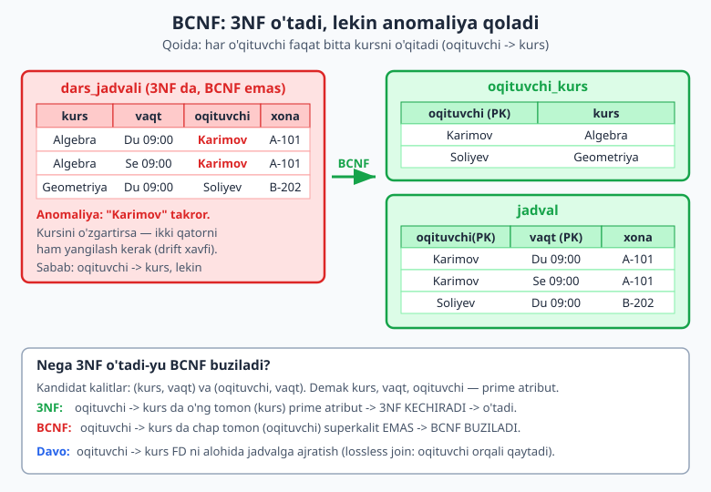
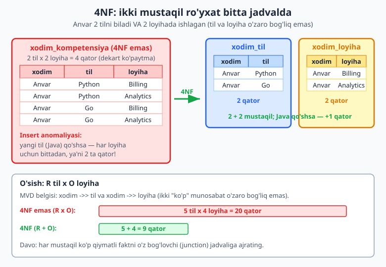
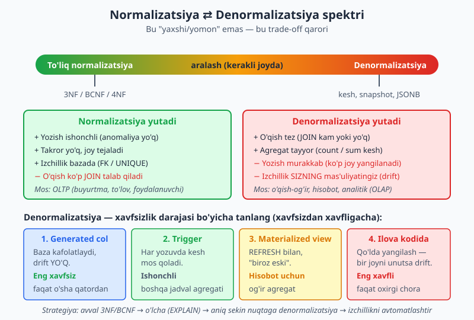

# 08 — Normalizatsiya II: BCNF, 4NF, 5NF va denormalizatsiya

[⬅️ Oldingi: 07 — Normalizatsiya I: 1NF, 2NF, 3NF va anomaliyalar](./07-normalizatsiya-asoslari.md) · [🏠 README](./README.md) · [Keyingi: 09 — Logik modeldan fizik sxemaga ➡️](./09-logik-fizik-sxema.md)

> **Bu bobda:** 3NF dan nariga o'tamiz. Avval BCNF (Boyce-Codd normal forma) — 3NF "o'tdi" deganda ham qolib ketadigan yashirin anomaliyani topamiz. Keyin 4NF (ko'p qiymatli bog'liqlik) va 5NF ni ko'ramiz. Eng muhimi — "qanchalik normalizatsiya kerak" degan amaliy savolga javob beramiz va DENORMALIZATSIYA ni qachon ATAYLAB ishlatish to'g'ri ekanini, uning narxi bilan birga, o'rganamiz.

---

## 0. Qayerda to'xtagandik

[07-bobda](./07-normalizatsiya-asoslari.md) funksional bog'liqlik (FD), anomaliyalar va 1NF/2NF/3NF ni ko'rdik. Qisqacha eslatma:

- **1NF** — har katak atomik (vergulli ro'yxat yo'q, takror guruh yo'q).
- **2NF** — har bir nokalit atribut **butun** kalitga bog'liq (qisman bog'liqlik yo'q).
- **3NF** — nokalit atribut faqat kalitga bog'liq, boshqa nokalitga emas (**tranzitiv** bog'liqlik yo'q).

Xalq orasidagi shior: *"har bir atribut kalitga, butun kalitga va faqat kalitga bog'liq bo'lsin — Xudo haqi"* ("the key, the whole key, and nothing but the key"). Bu uchlik aslida **3NF** ni emas, **BCNF** ni ta'riflaydi. Ko'pchilik "3NF qildim" deb o'ylab, aslida BCNF ni nazarda tutadi. Farq ingichka, lekin bor — shundan boshlaymiz.

> Bu bob 07-bobning davomi: 1NF/2NF/3NF ni qaytadan o'rgatmaymiz. Funksional bog'liqlik (FD) tushunchasi va parchalash (decomposition) usuli sizga tanish deb hisoblaymiz.

---

## 1. BCNF — Boyce-Codd normal forma

### 1.1 Ta'rif (sodda til bilan)

**BCNF:** jadvaldagi *har bir* funksional bog'liqlikda chap tomon (aniqlovchi, determinant) **superkalit** bo'lishi shart.

Superkalit — qatorni yakka-yagona aniqlaydigan ustun(lar) to'plami (kandidat kalit yoki uning ustki to'plami). Boshqacha aytganda: agar `X -> Y` bo'lsa, `X` butun jadvalni aniqlay olishi kerak.

3NF biroz yumshoqroq qoidaga ruxsat beradi: `X -> Y` da `Y` **prime atribut** (qaysidir kandidat kalitning bo'lagi) bo'lsa, 3NF buni kechiradi. BCNF kechirmaydi. Aynan shu "kechirim" yashirin anomaliya qoldiradi.

### 1.2 Qachon 3NF yetarli emas — aniq misol

Domen: **dars jadvali**. Bizda quyidagi biznes qoidalar bor:

- Har bir `(kurs, vaqt)` juftligi aniq bitta `xona` va bitta `oqituvchi` ga tegishli.
- **Har bir o'qituvchi faqat bitta kursni o'qitadi** (ekspert: Karimov faqat Algebra, Soliyev faqat Geometriya).

Bu qoidalardan funksional bog'liqliklar:

```
(kurs, vaqt) -> xona, oqituvchi      -- FD1
oqituvchi    -> kurs                  -- FD2  (o'qituvchi kursni belgilaydi)
```

Kandidat kalitlar ikkita: `(kurs, vaqt)` va `(oqituvchi, vaqt)`. Demak `kurs`, `vaqt`, `oqituvchi` — hammasi **prime atribut** (qaysidir kandidat kalitning bo'lagi).



Jadval:

```sql
CREATE TABLE dars_jadvali (
    kurs       text NOT NULL,
    vaqt       text NOT NULL,
    oqituvchi  text NOT NULL,
    xona       text NOT NULL,
    PRIMARY KEY (kurs, vaqt)
);

INSERT INTO dars_jadvali VALUES
  ('Algebra',    'Du 09:00', 'Karimov', 'A-101'),
  ('Algebra',    'Se 09:00', 'Karimov', 'A-101'),
  ('Geometriya', 'Du 09:00', 'Soliyev', 'B-202'),
  ('Fizika',     'Du 11:00', 'Yusupov', 'A-101');
```

**3NF tekshiruvi:** `oqituvchi -> kurs` da o'ng tomon (`kurs`) prime atribut. 3NF buni kechiradi. Demak jadval **3NF da**.

**BCNF tekshiruvi:** `oqituvchi -> kurs` da chap tomon (`oqituvchi`) superkalit emas (o'qituvchining o'zi qatorni aniqlamaydi — bitta o'qituvchining bir necha qatori bor). Demak **BCNF buziladi**.

Endi anomaliyani ko'ring: Karimov ikki qatorda (`Du` va `Se`). Agar Karimov endi "Geometriya" ga o'tsa, **ikkala** qatorni ham yangilash kerak. Bittasini unutsak — Karimov bir vaqtning o'zida Algebra ham, Geometriya ham o'qitadigan bo'lib qoladi. Bu **yangilash anomaliyasi**, va u 3NF "o'tgan" bo'lsa ham qoldi.

### 1.3 BCNF ga parchalash

Buzilgan FD (`oqituvchi -> kurs`) ni alohida jadvalga chiqaramiz:

```sql
-- O'qituvchi qaysi kursni o'qitishi (FD2)
CREATE TABLE oqituvchi_kurs (
    oqituvchi text PRIMARY KEY,
    kurs      text NOT NULL
);

-- Jadval: o'qituvchi qaysi vaqtda qaysi xonada
CREATE TABLE jadval (
    oqituvchi text NOT NULL REFERENCES oqituvchi_kurs(oqituvchi),
    vaqt      text NOT NULL,
    xona      text NOT NULL,
    PRIMARY KEY (oqituvchi, vaqt)
);
```

Endi `oqituvchi_kurs` da `oqituvchi` — PRIMARY KEY, ya'ni superkalit. `jadval` da `(oqituvchi, vaqt)` superkalit. Ikkala jadval ham BCNF da. Karimov boshqa kursga o'tsa — `oqituvchi_kurs` da **bitta qator** yangilanadi, anomaliya yo'q.

> **Lossless join (ma'lumot yo'qolmasligi):** parchalash to'g'ri bo'lishi uchun jadvallarni qaytadan birlashtirganda asl ma'lumot, na ko'p na kam, qaytishi shart. Bu misolda `oqituvchi` umumiy ustun orqali JOIN qilamiz va asl 4 qator aynan qaytadi (men buni 5434 da tekshirdim — 4 qator chiqdi).

### 1.4 3NF vs BCNF — narx

Yomon yangilik: BCNF parchalash ba'zan **bog'liqlikni saqlay olmaydi** (dependency-preserving emas). Ya'ni FD1 (`(kurs,vaqt) -> ...`) endi ikki jadvalga "yoyilib" ketdi va uni bitta jadvalda CHECK bilan ushlab bo'lmaydi. Amalda bu kamdan-kam muammo. Qoida shunday:

- **3NF** — har doim ham lossless, ham dependency-preserving parchalash mavjud.
- **BCNF** — har doim lossless, lekin ba'zan dependency-preserving emas.

Shuning uchun amalda ko'p tizimlar 3NF da to'xtaydi va BCNF buzilishi faqat yuqoridagi kabi maxsus holatlarda (bir nechta ustma-ust tushadigan kandidat kalit bo'lganda) yuzaga keladi. **Yagona kandidat kalit + surrogate PK** ishlatadigan oddiy jadvallarda 3NF va BCNF amalda ustma-ust tushadi — shuning uchun ko'pchilik farqni umuman sezmaydi.

> **Esda tuting:** BCNF buzilishi deyarli har doim **bir nechta kandidat kalit** bo'lib, ular bir-birini "kesib o'tganda" (overlapping) paydo bo'ladi. Bitta tabiiy kalit yoki bitta surrogate `id` bo'lsa, odatda 3NF = BCNF.

---

## 2. 4NF — ko'p qiymatli bog'liqlik (multivalued dependency)

### 2.1 Muammo: ikkita mustaqil ro'yxat bitta jadvalda

Tasavvur qiling: xodim haqida ikki xil ma'lumot saqlaymiz — **bilgan tillari** va **ishlagan loyihalari**. Bu ikki ro'yxat bir-biriga **mutlaqo bog'liq emas** (Python bilishi qaysi loyihada ishlaganini belgilamaydi).

Agar ularni bitta jadvalga tiqsak:

```sql
CREATE TABLE xodim_kompetensiya (
    xodim   text NOT NULL,
    til     text NOT NULL,
    loyiha  text NOT NULL,
    PRIMARY KEY (xodim, til, loyiha)
);

-- Anvar 2 tilni biladi (Python, Go) va 2 loyihada ishlagan (Billing, Analytics)
INSERT INTO xodim_kompetensiya VALUES
  ('Anvar','Python','Billing'),
  ('Anvar','Python','Analytics'),
  ('Anvar','Go','Billing'),
  ('Anvar','Go','Analytics');
```

Anvar uchun **2 til × 2 loyiha = 4 qator** kerak bo'ldi (men buni 5434 da tekshirdim — 4 qator). Bu **dekart ko'paytma** portlashi: agar Anvar 5 til va 4 loyiha bilsa — 20 qator! Hamma kombinatsiyani yozishga majburmiz, garchi til va loyiha o'rtasida hech qanday ma'no yo'q.



Bu jadval **BCNF da** (yagona kandidat kalit — uchchala ustun), lekin baribir takror va anomaliya bor:

- **Insert anomaliyasi:** Anvar yangi til (Java) o'rgansa — har bir loyiha uchun bitta, ya'ni **2 ta** qator qo'shish kerak.
- **Update anomaliyasi:** loyiha nomi o'zgarsa — bir nechta qator yangilanadi.

Sabab: bu yerda **ko'p qiymatli bog'liqlik** (multivalued dependency, MVD) bor. Belgilashi: `xodim ->> til` va `xodim ->> loyiha` — bir `xodim` ga ko'p mustaqil `til` va ko'p mustaqil `loyiha` mos keladi.

### 2.2 4NF ta'rifi va parchalash

**4NF:** jadvalda har bir noma'mul (notrivial) ko'p qiymatli bog'liqlik `X ->> Y` da `X` superkalit bo'lishi shart. Soddasi: **bir-biriga bog'liq bo'lmagan ko'p qiymatli faktlarni bitta jadvalga aralashtirma.**

Davo — har bir mustaqil MVD ni o'z jadvaliga ajratish:

```sql
CREATE TABLE xodim_til (
    xodim text NOT NULL,
    til   text NOT NULL,
    PRIMARY KEY (xodim, til)
);
CREATE TABLE xodim_loyiha (
    xodim  text NOT NULL,
    loyiha text NOT NULL,
    PRIMARY KEY (xodim, loyiha)
);
```

Endi Anvar uchun `2 + 2 = 4` o'rniga... aslida baribir 4 qator, lekin **mustaqil** 4 qator (2 ta tilda, 2 ta loyihada). Farqi yangi til qo'shganda ko'rinadi: 4NF da **bitta** qator (`xodim_til` ga Java) qo'shamiz; normalizatsiyalanmaganda esa har mavjud loyiha uchun bittadan, ya'ni **2 ta** qator qo'shishga majbur edik. Xodim 5 til × 4 loyiha bilsa: normalizatsiyalanmagan jadval 20 qator, 4NF esa atigi `5 + 4 = 9` qator.

> **Lossless join:** ikki jadvalni `xodim` bo'yicha JOIN qilsak (aslida CROSS JOIN har xodim ichida), asl 4 kombinatsiya aynan qaytadi. Men buni 5434 da tekshirdim — Go/Analytics, Go/Billing, Python/Analytics, Python/Billing, ya'ni 4 qator qaytdi. Demak parchalash yo'qotishsiz.

### 2.3 4NF ni qachon eslab qolish kerak

Belgi oddiy: agar bitta jadvalda **ikki yoki undan ortiq mustaqil "ko'p" munosabat** (masalan, teglar VA mualliflar, ranglar VA o'lchamlar, telefonlar VA elektron pochtalar) birga turgan bo'lsa va siz ularning **hamma kombinatsiyasini** yozayotgan bo'lsangiz — bu 4NF buzilishi. Davo: har bir ro'yxatni o'z bog'lovchi (junction) jadvaliga ajrating.

---

## 3. 5NF — birlashtirish bog'liqligi (qisqacha)

**5NF** (yoki PJ/NF — project-join normal form) eng nozik forma. U **birlashtirish bog'liqligi** (join dependency) bilan ishlaydi: jadvalni 3 yoki undan ortiq qismga ajratib, keyin ularni JOIN qilganda asl ma'lumot qaytishi mumkin bo'lgan, lekin 2 qismga ajratganda qaytmaydigan kamyob holatlar.

Klassik misol: `(sotuvchi, mahsulot, yetkazuvchi)` uchligi, bu yerda qoida shunday — *"agar sotuvchi M mahsulotni sotsa, va Y yetkazuvchi M mahsulotni yetkazsa, va sotuvchi Y bilan ishlasa, U HOLDA sotuvchi aynan Y dan M ni oladi"*. Bu murakkab "uch tomonlama" qoida 2 jadval bilan ifodalanmaydi, 3 jadval kerak bo'ladi.

Amaliy maslahat: **5NF deyarli hech qachon real loyihada qo'lda kerak bo'lmaydi.** U mavhum-akademik forma. Agar dizayningiz 4NF da bo'lsa va ER-modelni puxta qilgan bo'lsangiz, 5NF odatda o'z-o'zidan ta'minlanadi. Uni bilish foydali ("bunaqa narsa bor"), lekin uni "majburan qidirib" vaqt sarflash shart emas.

> **6NF** ham bor (har jadvalda kalit + bitta atribut) — u faqat temporal/bitemporal ma'lumotlar omborida tor doirada ishlatiladi. Buni [18-bobda](./18-temporal-versiya.md) tegib o'tamiz.

---

## 4. "Qanchalik normalizatsiya kerak?"

Bu eng amaliy savol. Qisqa javob: **3NF — minimal standart; BCNF — yaxshi maqsad; 4NF — kerak bo'lganda; 5NF — deyarli hech qachon qo'lda emas.**

Sabablari:

- **OLTP (tranzaksion) tizimlar** — buyurtma, foydalanuvchi, to'lov kabi tez-tez yoziladigan tizimlar uchun **3NF/BCNF** standart. Normalizatsiya yozish anomaliyalarini yo'q qiladi, bu esa tranzaksion tizimda eng muhim.
- **3NF amalda 95% holatda yetarli.** To'g'ri ER-model + surrogate kalit + 3NF — sog'lom dizaynning poydevori.
- **4NF** — faqat yuqoridagi "ikki mustaqil ko'p ro'yxat" alomati ko'ringanda.
- **5NF/6NF** — maxsus holatlar; ataylab qidirmaysiz.

Muhim tushuncha: normalizatsiya — bu **yozishni** (insert/update/delete) ishonchli va izchil qiladigan vosita. U **o'qishni** esa ko'pincha **sekinlashtiradi** — chunki ma'lumot bir nechta jadvalga tarqaladi va uni yig'ish uchun JOIN kerak bo'ladi. Mana shu yerda **denormalizatsiya** sahnaga chiqadi.



---

## 5. Denormalizatsiya — qachon ATAYLAB to'g'ri

**Denormalizatsiya** — normalizatsiya qoidasini *bilib turib, sababga ko'ra* buzish: takror ma'lumotni ataylab saqlash, o'qishni tezlatish uchun. Bu "xato" emas — bu **trade-off qarori**. Lekin u bepul emas: takrorni endi siz **qo'lda izchil** saqlashingiz kerak.

> **Oltin qoida:** avval normalizatsiya qiling (3NF/BCNF). Denormalizatsiyani faqat **o'lchangan** ehtiyoj (sekin so'rov, profiler ko'rsatgan muammo) bo'lganda qo'shing — taxminga ko'ra emas. "Avval o'lcha, keyin kes" ([01-bobni eslang](./01-dizayn-nima.md)).

Quyida denormalizatsiya **to'g'ri** bo'ladigan beshta tipik holat.

### 5.1 O'qish-og'ir tizim va hisobot

Agar tizim 1 marta yozib, 1000 marta o'qisa (yangiliklar lentasi, hisobot paneli, mahsulot katalogi) — JOIN ni har o'qishda takrorlamaslik uchun ba'zi ustunlarni "yonida" saqlash mantiqiy. Masalan, `izoh` jadvalida `muallif_id` dan tashqari `muallif_ismi` ni ham saqlash (har izohni ko'rsatishda foydalanuvchi jadvaliga JOIN qilmaslik uchun).

Narxi: foydalanuvchi ismini o'zgartirsa, eski izohlardagi `muallif_ismi` eskirib qoladi (yoki uni hammasini yangilash kerak). Shuning uchun bu faqat o'zgarmaydigan/kam o'zgaradigan maydonlar uchun yaxshi.

### 5.2 Keshlangan agregat (eng keng tarqalgan)

Eng ko'p uchraydigan denormalizatsiya — **hisoblangan agregat** (count, sum) ni ustunda saqlash. Misol: forum mavzusida "izohlar soni". Har safar `SELECT count(*)` qilish o'rniga `mavzular.izoh_soni` ustunini yangilab boramiz.

Izchillikni **trigger** bilan avtomatik saqlaymiz — bu eng ishonchli usul, chunki kesh ilova kodi qaydan yozsa ham mos qoladi:

```sql
CREATE TABLE mavzular (
    id        bigint GENERATED ALWAYS AS IDENTITY PRIMARY KEY,
    sarlavha  text NOT NULL,
    izoh_soni integer NOT NULL DEFAULT 0   -- DENORMALIZATSIYALANGAN agregat
);
CREATE TABLE izohlar (
    id       bigint GENERATED ALWAYS AS IDENTITY PRIMARY KEY,
    mavzu_id bigint NOT NULL REFERENCES mavzular(id),
    matn     text NOT NULL
);

CREATE OR REPLACE FUNCTION izoh_soni_yangila() RETURNS trigger AS $$
BEGIN
    IF TG_OP = 'INSERT' THEN
        UPDATE mavzular SET izoh_soni = izoh_soni + 1 WHERE id = NEW.mavzu_id;
    ELSIF TG_OP = 'DELETE' THEN
        UPDATE mavzular SET izoh_soni = izoh_soni - 1 WHERE id = OLD.mavzu_id;
    END IF;
    RETURN NULL;
END;
$$ LANGUAGE plpgsql;

CREATE TRIGGER trg_izoh_soni
AFTER INSERT OR DELETE ON izohlar
FOR EACH ROW EXECUTE FUNCTION izoh_soni_yangila();
```

Sinab ko'ramiz (3 izoh qo'shamiz, 1 tasini o'chiramiz):

```sql
INSERT INTO mavzular (sarlavha) VALUES ('PostgreSQL 18 yangiliklari');
INSERT INTO izohlar (mavzu_id, matn) VALUES (1,'Zo''r maqola'),(1,'uuidv7 yaxshi'),(1,'rahmat');
SELECT id, sarlavha, izoh_soni FROM mavzular WHERE id=1;
```

Natija (5434 da tekshirildi):

```
 id |          sarlavha          | izoh_soni
----+----------------------------+-----------
  1 | PostgreSQL 18 yangiliklari |         3
```

Bitta izohni o'chiramiz va keshni haqiqiy `COUNT` bilan solishtiramiz:

```sql
DELETE FROM izohlar WHERE matn='rahmat';
SELECT m.izoh_soni AS kesh, count(i.id) AS haqiqiy
FROM mavzular m LEFT JOIN izohlar i ON i.mavzu_id=m.id
WHERE m.id=1 GROUP BY m.izoh_soni;
```

Natija (5434 da tekshirildi) — kesh haqiqiy songa **aynan mos**:

```
 kesh | haqiqiy
------+---------
    2 |       2
```

> **MySQL farqi:** MySQL'da `GENERATED ALWAYS AS IDENTITY` o'rniga `AUTO_INCREMENT`, trigger sintaksisida `$$` o'rniga `DELIMITER` ishlatiladi, va `RETURN NULL` o'rniga trigger tanasi boshqacha yoziladi. Mantiq bir xil.

### 5.3 Snapshot tarix — "muzlatilgan" qiymat

Ba'zan takror **ataylab kerak**, chunki qiymat **o'sha paytdagi holatni** aks ettirishi shart. Klassik misol: buyurtmadagi narx. Mahsulot narxi keyin o'zgaradi, lekin eski buyurtma o'sha paytdagi narxda qolishi kerak (chunki mijoz o'shanda shu pulni to'lagan).

```sql
CREATE TABLE mahsulotlar (
    id int PRIMARY KEY, nomi text NOT NULL, narx numeric(10,2) NOT NULL
);
CREATE TABLE buyurtma_satri (
    id int PRIMARY KEY,
    mahsulot_id int NOT NULL REFERENCES mahsulotlar(id),
    soni int NOT NULL,
    narx_snapshot numeric(10,2) NOT NULL  -- buyurtma paytidagi narx (muzlatilgan)
);

INSERT INTO mahsulotlar VALUES (1,'Klaviatura', 250000.00);
INSERT INTO buyurtma_satri VALUES (1, 1, 2, 250000.00);

UPDATE mahsulotlar SET narx = 300000.00 WHERE id=1;  -- narx oshdi

SELECT bs.narx_snapshot AS buyurtmadagi_narx, m.narx AS hozirgi_katalog_narx,
       bs.soni * bs.narx_snapshot AS buyurtma_summasi
FROM buyurtma_satri bs JOIN mahsulotlar m ON m.id=bs.mahsulot_id;
```

Natija (5434 da tekshirildi) — buyurtma eski narxda, katalog yangi narxda:

```
 buyurtmadagi_narx | hozirgi_katalog_narx | buyurtma_summasi
-------------------+----------------------+------------------
         250000.00 |            300000.00 |        500000.00
```

Diqqat: bu yerda `narx_snapshot` "takror" bo'lib ko'rinadi, lekin u **aslida boshqa fakt** — "buyurtma paytidagi narx", katalogdagi "hozirgi narx" emas. Shuning uchun bu, qattiq aytganda, denormalizatsiya emas, balki **to'g'ri modellashtirish**. Bu farqni anglash muhim: ba'zi "takror"lar — aslida alohida fakt.

### 5.4 Keshlangan agregatni avtomatik saqlash: generated column

Agar hosil qiymat **o'sha qatorning** ustunlaridan hisoblansa (boshqa jadvaldan emas), trigger ham kerak emas — **STORED generated column** baza tomonidan avtomatik, har doim izchil hisoblanadi:

```sql
CREATE TABLE hisob_satri (
    id   int PRIMARY KEY,
    soni int NOT NULL,
    narx numeric(10,2) NOT NULL,
    jami numeric(12,2) GENERATED ALWAYS AS (soni * narx) STORED
);
INSERT INTO hisob_satri (id, soni, narx) VALUES (1, 3, 250000.00);
SELECT id, soni, narx, jami FROM hisob_satri;
```

Natija (5434 da tekshirildi) — `jami` o'zi hisoblandi:

```
 id | soni |   narx    |   jami
----+------+-----------+-----------
  1 |    3 | 250000.00 | 750000.00
```

> **PostgreSQL 18+ yangiligi:** PG18 da `GENERATED ALWAYS AS (...) VIRTUAL` ham bor — qiymat saqlanmaydi, balki **o'qishda** hisoblanadi (joy tejaydi, lekin o'qishda CPU sarflaydi). STORED — joy ko'p, o'qish tez; VIRTUAL — joy yo'q, o'qish hisoblab beradi. [10-bobda](./10-malumot-turlari.md) batafsil.

### 5.5 JSONB bilan denormalizatsiya

Ba'zan butun bog'liq obyektni JSONB ustunda "yonida" saqlash o'qishni tezlatadi (masalan, buyurtma ichidagi mijoz manzilini JSONB snapshot sifatida). Bu kuchli, lekin xavfli: JSONB ichidagi ma'lumotga FK qo'yib bo'lmaydi, izchillikni baza majburlamaydi. JSONB ni qachon ishlatish/ishlatmaslikni [10-bobda](./10-malumot-turlari.md) chuqur ko'ramiz. Hozircha: **JSONB — normalizatsiya o'rnini bosmaydi, uni to'ldiradi.**

---

## 6. Denormalizatsiyaning narxi

Har bir denormalizatsiya bilan siz **bir mas'uliyatni o'z bo'yningizga olasiz**: takror ma'lumotni izchil saqlash. Baza endi buni siz uchun kafolatlamaydi (FK/UNIQUE faqat normalizatsiyalangan tuzilishni himoya qiladi).

| Narx turi | Tushuntirish |
|---|---|
| **Izchillik xavfi** | Kesh/takror eskirib qolishi mumkin — "drift". Trigger/generated column bilan kamaytiriladi. |
| **Yozish murakkabligi** | Endi bir o'zgarish bir nechta joyni yangilaydi (ko'proq kod, ko'proq qulflanish). |
| **Bug yuzasi** | Izchillikni saqlovchi kod (trigger, ilova logikasi) yangi xatolar manbai. |
| **Joy** | Takror ma'lumot diskda ko'proq joy egallaydi. |

Shuning uchun **xavfsizlik darajasi** bo'yicha tanlang:

1. **Generated column (STORED)** — eng xavfsiz: baza kafolatlaydi, drift bo'lmaydi. Lekin faqat o'sha qator ustunlaridan.
2. **Trigger** — ishonchli: har qanday yozuvda kesh mos qoladi. Sekinroq yozish.
3. **Materialized view** — hisobot uchun: vaqti-vaqti bilan `REFRESH` qilinadi, "biroz eski" bo'lishi mumkin ([15-bobda](./15-performans.md)).
4. **Ilova kodida qo'lda yangilash** — eng xavfli: bir joyni unutsangiz — drift. Faqat oxirgi chora.

> **Ekspert maslahati:** denormalizatsiya qaror qabul qilganda har doim **uchta savolga** javob bering: (1) Bu takrorni nima izchil saqlaydi? (2) Drift bo'lsa qanday aniqlayman (audit so'rovi)? (3) Bu o'qish chindan ham profilerda muammomi, yo'qsa men shunchaki "ehtiyot bo'ldim"mi? Uchchalasiga aniq javob bo'lsa — denormalizatsiya oqlangan.

---

## 7. Trade-off: normalizatsiya ⇄ tezlik

Yakuniy manzara — bu **spektr**, ikki qutbli "yaxshi/yomon" emas:

- **To'liq normalizatsiya (3NF/BCNF/4NF):** yozish ishonchli, takror yo'q, izchillik bazada. Lekin o'qish ko'p JOIN talab qiladi.
- **Denormalizatsiya:** o'qish tez (JOIN kam), lekin yozish murakkab va izchillik sizning mas'uliyatingiz.

Amaliy strategiya, deyarli har doim:

1. **3NF/BCNF dan boshlang** — bu standart, sog'lom poydevor.
2. **O'lchang** — qaysi so'rov sekin? (`EXPLAIN ANALYZE`, [15-bob](./15-performans.md)).
3. **Aniq sekin nuqtaga** denormalizatsiya qo'shing (generated column > trigger > MV tartibida xavfsizlikni afzal ko'ring).
4. **Izchillikni avtomatlashtiring** — qo'lda yangilashdan qoching.

> Denormalizatsiya — bu "tezlik uchun izchillik mas'uliyatini sotib olish". Bu kelishuvni **bilib** tuzing, tasodifan emas. Analitik omborda esa denormalizatsiya butunlay NORMA bo'ladi — buni [21-bobda](./21-analitik-ombor.md) (star schema) ko'ramiz.

---

## Mashqlar

### Oson

1. **Shior tahlili.** "Har bir atribut kalitga, butun kalitga va faqat kalitga bog'liq bo'lsin" shiori qaysi normal formani ta'riflaydi — 3NF nimi yoki BCNF nimi? Nega?

2. **MVD ni tan olish.** Quyidagi jadval qaysi muammodan aziyat chekadi va davosi nima?
   `kitob(kitob_id, muallif, til)` — bir kitobning bir necha muallifi VA bir necha tilga tarjimasi bor (muallif va til o'zaro bog'liq emas).

3. **Generated column.** `hisob_satri(soni, narx)` jadvaliga `jami = soni * narx` ustunini qo'shing. Trigger kerakmi, yo'qmi? Nega?

4. **Snapshot yoki takror?** Onlayn-do'kon `buyurtma_satri` jadvalida mahsulot narxini `narx_snapshot` sifatida saqlash — bu denormalizatsiyami yoki to'g'ri modellashtirish? Asoslang.

### O'rta

5. **BCNF buzilishini top.** Jadval: `talaba_maslahatchi(talaba_id, fan, maslahatchi)`. Qoidalar: har `(talaba_id, fan)` da bitta `maslahatchi`; har `maslahatchi` faqat bitta `fan` bo'yicha maslahat beradi. FD larni yozing, kandidat kalitlarni toping, 3NF/BCNF holatini aniqlang, kerak bo'lsa parchalang.

6. **4NF ga keltir.** `mahsulot_atribut(mahsulot_id, rang, olcham)` — bir mahsulot bir necha rangda VA bir necha o'lchamda mavjud (rang va o'lcham mustaqil). Hozirgi tuzilishning kamchiligini ko'rsating va 4NF ga keltiring. 3 rang × 4 o'lcham bo'lsa, qancha qator tejaladi?

7. **Keshlangan agregat dizayni.** Foydalanuvchining "obunachilar soni" ni (`foydalanuvchi.obunachi_soni`) keshlash kerak. `obuna(kim_id, kimga_id)` jadvali bor. Triggerni yozing (INSERT va DELETE da). Qanday holatda kesh drift bo'lishi mumkin?

8. **Denormalizatsiya qarorini asoslab ber.** Yangiliklar saytida har maqola sahifasida muallif ismi ko'rsatiladi (kuniga ~100k o'qish, kamdan-kam yoziladi). `maqola.muallif_ismi` ni denormalizatsiya qilish to'g'rimi? Trade-off ni yozing va izchillik strategiyasini taklif qiling.

### Qiyin

9. **3NF ham, BCNF emas misolini ixtiro qiling.** O'zingiz yangi domen tanlab (dars jadvali emas), 3NF ni qanoatlantiradigan, lekin BCNF ni buzadigan jadval tuzing. FD larni, kandidat kalitlarni keltiring va BCNF ga parchalang. Lossless ekanini tushuntiring.

10. **Bog'liqlik saqlanmasligi.** 1-misoldagi (yoki o'zingizning 9-mashq) BCNF parchalashda qaysi FD endi bitta jadval ichida ushlanmay qoldi? Bu amalda muammomi? Qanday yengillashtirish mumkin (CHECK, trigger, ilova)?

11. **Hybrid dizayn.** Marketplace `mahsulot` katalogi: 10 mln mahsulot, kuniga 50 mln o'qish, kuniga 50k yangilash. Mahsulot sahifasida o'rtacha reyting (`avg(baho)`) va sharhlar soni ko'rsatiladi. Normalizatsiyalangan `sharh(mahsulot_id, baho)` jadvali bor. To'liq dizayn taklif qiling: nima normalizatsiyalangan qoladi, nima denormalizatsiya qilinadi, izchillik qanday saqlanadi, va nega aynan shu yondashuv (trigger vs materialized view vs generated column).

12. **4NF + BCNF birga.** `oqituvchi_jadval(oqituvchi, kun, soat, kurs, daraja)` — har o'qituvchi bir necha kun-soatda dars beradi (jadval), va alohida bir necha kursni bir necha darajada o'qitadi (kurs ↔ daraja bog'liq emas). Bu jadvalda qanday muammolar bor (BCNF + 4NF nuqtai nazaridan)? To'liq parchalang.

13. **Drift detektori.** 7-mashqdagi keshlangan `obunachi_soni` uchun **audit so'rovi** yozing — kesh haqiqiy `COUNT` dan farq qiladigan barcha foydalanuvchilarni topadigan SELECT. Bu so'rovni qachon (qanchalik tez-tez) ishga tushirish kerak?

14. **Normalizatsiya darajasini tanlash.** Quyidagi uch tizim uchun maqsadli normal formani (va denormalizatsiya bo'ladimi) tanlang va asoslang: (a) bank tranzaksiyalari, (b) real-vaqt analitik panel (dashboard), (c) IoT sensor o'lchovlari ombori. Har biri uchun bitta jumla bilan sabab.

---

## Yechimlar

<details markdown="1">
<summary>Yechim — 1</summary>

Shior **BCNF** ni ta'riflaydi. "Faqat kalitga bog'liq" qismi har bir aniqlovchi superkalit bo'lishini talab qiladi — bu BCNF ta'rifi. 3NF biroz yumshoqroq: u o'ng tomon prime atribut bo'lgan FD larni kechiradi, ya'ni "faqat kalitga" qoidasini to'liq talab qilmaydi. Shuning uchun ko'pchilik "3NF" deb aytadi-yu, amalda BCNF ni nazarda tutadi.

</details>

<details markdown="1">
<summary>Yechim — 2</summary>

Muammo — **ko'p qiymatli bog'liqlik (4NF buzilishi)**. `muallif` va `til` bir-biriga bog'liq emas, lekin bitta jadvalda turgani uchun har kombinatsiya yoziladi (dekart ko'paytma). 3 muallif × 2 til = 6 ortiqcha qator.

Davo — ikki alohida jadval:

```sql
CREATE TABLE kitob_muallif (kitob_id int, muallif text, PRIMARY KEY (kitob_id, muallif));
CREATE TABLE kitob_til     (kitob_id int, til text,     PRIMARY KEY (kitob_id, til));
```

Endi 3 muallif + 2 til = 5 qator (6 emas), va yangi til qo'shsa — atigi 1 qator.

</details>

<details markdown="1">
<summary>Yechim — 3</summary>

Trigger **kerak emas**. `jami` faqat o'sha qatorning `soni` va `narx` ustunlaridan hisoblanadi (boshqa jadvaldan emas), shuning uchun STORED generated column eng to'g'ri yechim — baza har doim izchil hisoblaydi:

```sql
ALTER TABLE hisob_satri
  ADD COLUMN jami numeric(12,2) GENERATED ALWAYS AS (soni * narx) STORED;
```

Trigger faqat hosil qiymat **boshqa jadval** ma'lumotiga (agregat) bog'liq bo'lganda kerak.

</details>

<details markdown="1">
<summary>Yechim — 4</summary>

Bu **to'g'ri modellashtirish** (denormalizatsiya emas). `narx_snapshot` — katalogdagi "hozirgi narx" ning takrori emas, balki **alohida fakt**: "buyurtma qilingan paytdagi narx". Mahsulot narxi keyin o'zgarsa ham, buyurtma o'sha paytdagi qiymatni saqlashi shart (chunki mijoz o'shanda shu summani to'lagan). Agar `narx_snapshot` o'rniga har safar joriy `mahsulotlar.narx` ga JOIN qilsak — eski buyurtmalar summasi noto'g'ri (o'zgargan) bo'lib ketadi. Demak takror bu yerda majburiy va to'g'ri.

</details>

<details markdown="1">
<summary>Yechim — 5</summary>

FD lar:

```
(talaba_id, fan) -> maslahatchi     -- FD1
maslahatchi      -> fan              -- FD2 (maslahatchi fanni belgilaydi)
```

Kandidat kalitlar: `(talaba_id, fan)` va `(talaba_id, maslahatchi)`. Demak `fan`, `maslahatchi` — prime atributlar.

- **3NF:** `maslahatchi -> fan` da o'ng tomon (`fan`) prime atribut -> 3NF kechiradi -> **3NF da**.
- **BCNF:** `maslahatchi -> fan` da chap tomon (`maslahatchi`) superkalit emas -> **BCNF buziladi**.

Parchalash:

```sql
CREATE TABLE maslahatchi_fan (
    maslahatchi text PRIMARY KEY,
    fan         text NOT NULL
);
CREATE TABLE talaba_maslahatchi (
    talaba_id   int  NOT NULL,
    maslahatchi text NOT NULL REFERENCES maslahatchi_fan(maslahatchi),
    PRIMARY KEY (talaba_id, maslahatchi)
);
```

Bu 1.3-bo'limdagi dars jadvali bilan bir xil naqsh. Ikkala jadval ham BCNF da.

</details>

<details markdown="1">
<summary>Yechim — 6</summary>

Kamchilik — **4NF buzilishi (ko'p qiymatli bog'liqlik)**. `rang` va `olcham` mustaqil, lekin bitta jadvalda hamma kombinatsiya yoziladi: 3 rang × 4 o'lcham = **12 qator**.

4NF parchalash:

```sql
CREATE TABLE mahsulot_rang   (mahsulot_id int, rang text,   PRIMARY KEY (mahsulot_id, rang));
CREATE TABLE mahsulot_olcham (mahsulot_id int, olcham text, PRIMARY KEY (mahsulot_id, olcham));
```

Endi 3 + 4 = **7 qator**. Tejaladi: `12 - 7 = 5 qator`. Mahsulot kombinatsiyasi qancha ko'p bo'lsa, tejash shuncha katta (`R×O` o'rniga `R+O`).

> Eslatma: agar har `(rang, olcham)` juftligi alohida zaxira/SKU bo'lsa (ya'ni "qora-XL" alohida tovar) — u holda kombinatsiyalar **mustaqil emas**, MVD yo'q, va dekart ko'paytma to'g'ri (har variant haqiqiy mavjudlik). 4NF buzilishi faqat rang va o'lcham **chindan mustaqil** bo'lganda.

</details>

<details markdown="1">
<summary>Yechim — 7</summary>

```sql
ALTER TABLE foydalanuvchi ADD COLUMN obunachi_soni integer NOT NULL DEFAULT 0;

CREATE OR REPLACE FUNCTION obunachi_soni_yangila() RETURNS trigger AS $$
BEGIN
    IF TG_OP = 'INSERT' THEN
        UPDATE foydalanuvchi SET obunachi_soni = obunachi_soni + 1 WHERE id = NEW.kimga_id;
    ELSIF TG_OP = 'DELETE' THEN
        UPDATE foydalanuvchi SET obunachi_soni = obunachi_soni - 1 WHERE id = OLD.kimga_id;
    END IF;
    RETURN NULL;
END;
$$ LANGUAGE plpgsql;

CREATE TRIGGER trg_obunachi_soni
AFTER INSERT OR DELETE ON obuna
FOR EACH ROW EXECUTE FUNCTION obunachi_soni_yangila();
```

Kesh drift bo'lishi mumkin: (a) trigger o'chirib qo'yilganda (`ALTER TABLE ... DISABLE TRIGGER`) yozuv bo'lsa; (b) ma'lumot `COPY`/bulk-load bilan triggerni chetlab kiritilsa; (c) `obuna` ga to'g'ridan-to'g'ri `TRUNCATE` qilinsa (TRUNCATE row-trigger ni ishlatmaydi); (d) trigger funksiyasida xato bo'lsa. Shuning uchun 13-mashqdagi audit so'rovi kerak.

</details>

<details markdown="1">
<summary>Yechim — 8</summary>

Ha, denormalizatsiya **to'g'ri**: o'qish/yozish nisbati nihoyatda nomutanosib (100k o'qish : kam yozish), va har o'qishda `foydalanuvchi` jadvaliga JOIN qilish ortiqcha.

Trade-off: muallif ismini o'zgartirsa — eski maqolalardagi `muallif_ismi` eskirib qoladi. Lekin: (a) muallif ismi kamdan-kam o'zgaradi; (b) o'zgarsa ham — eski maqolada eski ism turishi ko'pincha **maqbul** (hatto to'g'ri — maqola o'sha ism ostida chiqqan).

Izchillik strategiyasi: muallif ismi o'zgarganda bir martalik `UPDATE maqola SET muallif_ismi = ... WHERE muallif_id = ...` (kam bo'ladigan operatsiya), yoki triggerni `foydalanuvchi.ism` ustuniga qo'yish. Generated column bu yerda ishlamaydi (boshqa jadval).

</details>

<details markdown="1">
<summary>Yechim — 9</summary>

Misol domen: **bron qilish (booking)**. Jadval `bron(mehmon, sana, xona, oshpaz)`, qoidalar: har `(mehmon, sana)` da bitta `xona` va bitta `oshpaz`; har `xona` ga aniq bitta `oshpaz` biriktirilgan.

FD lar:

```
(mehmon, sana) -> xona, oshpaz
xona           -> oshpaz
```

Kandidat kalit: `(mehmon, sana)`. `xona` prime emas... lekin `oshpaz` ham prime emas. Bu yerda `xona -> oshpaz` da o'ng tomon (`oshpaz`) **prime emas** -> demak bu **3NF ni ham buzadi** (tranzitiv: kalit -> xona -> oshpaz). Bu yaxshi 3NF-vs-BCNF misoli emas.

To'g'ri misol — kandidat kalitlar **kesishishi** kerak. Olaylik `kvartira_ijara(ijarachi, davr, uy, egasi)`: har `(ijarachi, davr)` da bitta uy; har uyning bitta egasi; **har egasi faqat bitta uyga ega** va **har ijarachi bir davrda faqat bitta egadan ijaraga oladi**, ya'ni `(ijarachi, davr)` va `(ijarachi, egasi)` ikkalasi ham kandidat kalit. FD `egasi -> uy`: o'ng tomon `uy` prime (chunki... ) — bu nozik. Soddaroq va ishonchli yo'l — 5-mashq/1.2-bo'lim naqshini ishlatish: ikki kandidat kalit kesishadigan `(A,B)`/`(C,B)` strukturasi, `C -> A` FD bilan, bunda `A` prime (3NF o'tadi), `C` superkalit emas (BCNF buziladi).

Eng ishonchli misol — 1.2-bo'limdagi `dars_jadvali` strukturasi: `(X, vaqt)` va `(Y, vaqt)` kandidat kalit, `Y -> X` FD. Bu yerda har doim 3NF o'tadi (`X` prime), BCNF buziladi (`Y` superkalit emas), va `Y -> X` ni alohida jadvalga ajratish lossless (umumiy `Y` ustuni orqali JOIN asl qatorlarni qaytaradi, chunki `Y` ajratilgan jadvalda kalit). Domenni "shifokor faqat bitta klinikada qabul qiladi" yoki "kuryer faqat bitta hududda ishlaydi" ga moslab tanlash mumkin.

</details>

<details markdown="1">
<summary>Yechim — 10</summary>

1.2-misolda BCNF parchalashdan keyin yo'qolgan FD — `(kurs, vaqt) -> xona`. Endi `kurs` `oqituvchi_kurs` jadvalida, `xona` esa `jadval` jadvalida — bu FD ni bitta jadval ichidagi CHECK/UNIQUE bilan majburlab bo'lmaydi. Ya'ni parchalash **dependency-preserving emas**.

Amalda muammo darajasi past: bu FD buzilishi (bir `(kurs, vaqt)` ikki xona olishi) faqat noto'g'ri yozuvda yuzaga keladi, va `jadval` da `(oqituvchi, vaqt)` PK bo'lgani uchun bir o'qituvchi bir vaqtda ikki xonada bo'lolmaydi. Yengillashtirish: (a) yozuvni o'tkazuvchi ilova qatlamida tekshirish; (b) ikki jadvalni JOIN qiluvchi `VIEW` ustiga davriy audit so'rov; (c) zarur bo'lsa, izchillikni ushlovchi trigger. Ko'p hollarda 3NF da qolib (parchalamasdan) bu FD ni saqlash afzalroq — bu BCNF vs 3NF trade-off ining mohiyati.

</details>

<details markdown="1">
<summary>Yechim — 11</summary>

To'liq dizayn:

**Normalizatsiyalangan qoladi (haqiqat manbai):**

```sql
CREATE TABLE mahsulot (id bigint PRIMARY KEY, nomi text NOT NULL, ...);
CREATE TABLE sharh (
    id bigint GENERATED ALWAYS AS IDENTITY PRIMARY KEY,
    mahsulot_id bigint NOT NULL REFERENCES mahsulot(id),
    baho smallint NOT NULL CHECK (baho BETWEEN 1 AND 5),
    matn text
);
```

**Denormalizatsiya (o'qish uchun) — `mahsulot` ga keshlangan agregat:**

```sql
ALTER TABLE mahsulot
  ADD COLUMN sharh_soni integer NOT NULL DEFAULT 0,
  ADD COLUMN baho_yigindi bigint NOT NULL DEFAULT 0;  -- sum, avg ni bo'lib hisoblaymiz
-- o'rtacha = baho_yigindi::numeric / NULLIF(sharh_soni,0)
```

`avg` ni to'g'ridan-to'g'ri saqlamaymiz, balki `sum` + `count` ni saqlaymiz — chunki INSERT/DELETE da inkremental yangilash oson (`avg` ni inkremental yangilab bo'lmaydi aniq).

**Izchillik — trigger** (50k yozish/kun — trigger yuki maqbul, va kesh **doim aniq** bo'lishi kerak):

```sql
CREATE FUNCTION sharh_agregat() RETURNS trigger AS $$
BEGIN
  IF TG_OP='INSERT' THEN
    UPDATE mahsulot SET sharh_soni=sharh_soni+1, baho_yigindi=baho_yigindi+NEW.baho
      WHERE id=NEW.mahsulot_id;
  ELSIF TG_OP='DELETE' THEN
    UPDATE mahsulot SET sharh_soni=sharh_soni-1, baho_yigindi=baho_yigindi-OLD.baho
      WHERE id=OLD.mahsulot_id;
  END IF;
  RETURN NULL;
END; $$ LANGUAGE plpgsql;
```

**Nega trigger, materialized view emas:** MV `REFRESH` qilinishi kerak va u "biroz eski" bo'ladi; 50 mln o'qishda foydalanuvchi har doim joriy reytingni ko'rishi kerak. Trigger har yozuvda darhol yangilaydi. **Generated column ham emas**, chunki agregat boshqa jadvaldan (`sharh`) keladi, o'sha qatordan emas.

</details>

<details markdown="1">
<summary>Yechim — 12</summary>

Jadvalda **ikki muammo birga**:

1. **4NF buzilishi:** `(kun, soat)` (jadval) va `(kurs, daraja)` (kompetensiya) bir-biriga bog'liq emas — bitta jadvalda hamma kombinatsiya yoziladi (dekart ko'paytma).
2. **BCNF/funksional bog'liqlik aralashuvi:** ikki butunlay boshqa fakt (o'qituvchi qachon dars beradi VA nimani o'qitadi) bitta jadvalga tiqilgan.

Parchalash — ikki mustaqil faktni ikki jadvalga:

```sql
CREATE TABLE oqituvchi_jadval (
    oqituvchi text NOT NULL,
    kun       text NOT NULL,
    soat      text NOT NULL,
    PRIMARY KEY (oqituvchi, kun, soat)
);
CREATE TABLE oqituvchi_kompetensiya (
    oqituvchi text NOT NULL,
    kurs      text NOT NULL,
    daraja    text NOT NULL,
    PRIMARY KEY (oqituvchi, kurs, daraja)
);
```

Agar `kurs` va `daraja` ham o'zaro bog'liq bo'lmasa (bir kursni bir necha darajada, bir darajada bir necha kursni), `oqituvchi_kompetensiya` ham 4NF ni buzadi — uni yana ikkiga bo'lamiz: `oqituvchi_kurs(oqituvchi, kurs)` va `oqituvchi_daraja(oqituvchi, daraja)`. Lekin amalda kurs va daraja odatda **birga** ma'no kasb etadi ("Algebra — 2-daraja"), shuning uchun ularni birga qoldirish to'g'riroq. Bu — dizayn qarori, biznes qoidasiga bog'liq.

</details>

<details markdown="1">
<summary>Yechim — 13</summary>

Audit so'rovi — kesh haqiqiy `COUNT` dan farq qiladigan foydalanuvchilar:

```sql
SELECT f.id, f.obunachi_soni AS kesh, count(o.kim_id) AS haqiqiy
FROM foydalanuvchi f
LEFT JOIN obuna o ON o.kimga_id = f.id
GROUP BY f.id, f.obunachi_soni
HAVING f.obunachi_soni <> count(o.kim_id);
```

Agar natija bo'sh bo'lsa — drift yo'q. Qachon ishga tushirish: (a) har kechasi rejalashtirilgan vazifa (cron) sifatida; (b) bulk-import yoki migratsiyadan keyin majburiy; (c) trigger o'chirib/yoqilgan har safar. Drift topilsa — `obunachi_soni` ni haqiqiy `COUNT` ga tenglashtiruvchi tuzatish `UPDATE` ishga tushiriladi.

</details>

<details markdown="1">
<summary>Yechim — 14</summary>

- **(a) Bank tranzaksiyalari — 3NF/BCNF, denormalizatsiya YO'Q (yoki juda ehtiyotkor).** Sabab: pul va izchillik birinchi o'rinda; yozish anomaliyasi qabul qilinmaydi, takror drift xavfli.
- **(b) Real-vaqt analitik panel — denormalizatsiya/keshlangan agregat OCHIQ.** Sabab: o'qish-og'ir, agregat ko'rsatkichlar (sum/count/avg) ni har so'rovda qayta hisoblash qimmat; materialized view yoki keshlangan ustun mos.
- **(c) IoT sensor o'lchovlari — keng (denormalizatsiyalangan) jadval, partition bilan.** Sabab: ulkan hajmli append-only yozuv; JOIN minimal bo'lishi kerak, ko'pincha bitta keng jadval + vaqt bo'yicha partition ([22-bob](./22-partitioning-masshtab.md)) eng amaliy.

Umumiy tamoyil: **tranzaksion (OLTP) -> normalizatsiya; analitik (OLAP)/o'qish-og'ir -> denormalizatsiya.**

</details>

---

[⬅️ Oldingi: 07 — Normalizatsiya I: 1NF, 2NF, 3NF va anomaliyalar](./07-normalizatsiya-asoslari.md) · [🏠 README](./README.md) · [Keyingi: 09 — Logik modeldan fizik sxemaga ➡️](./09-logik-fizik-sxema.md)
