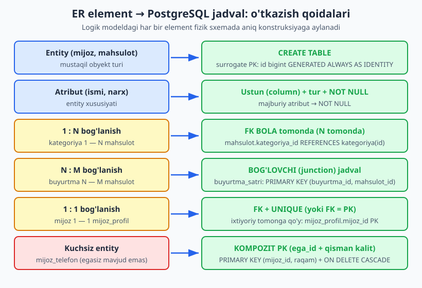
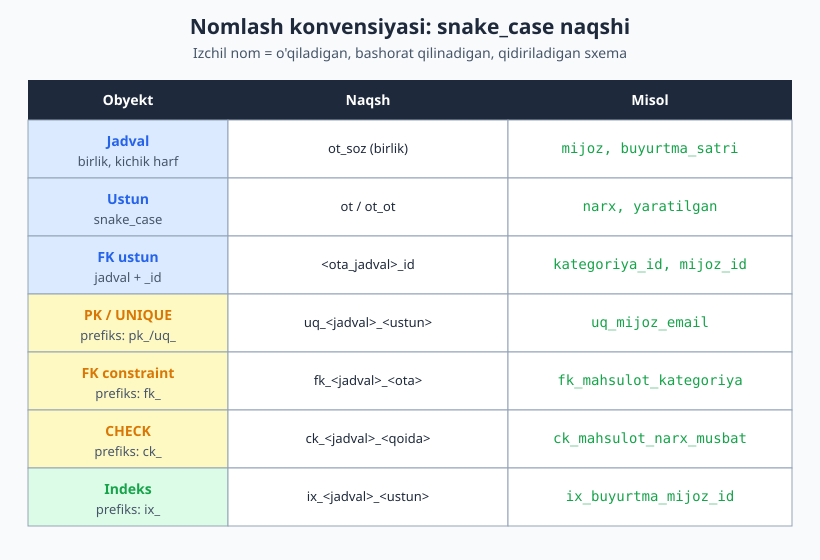
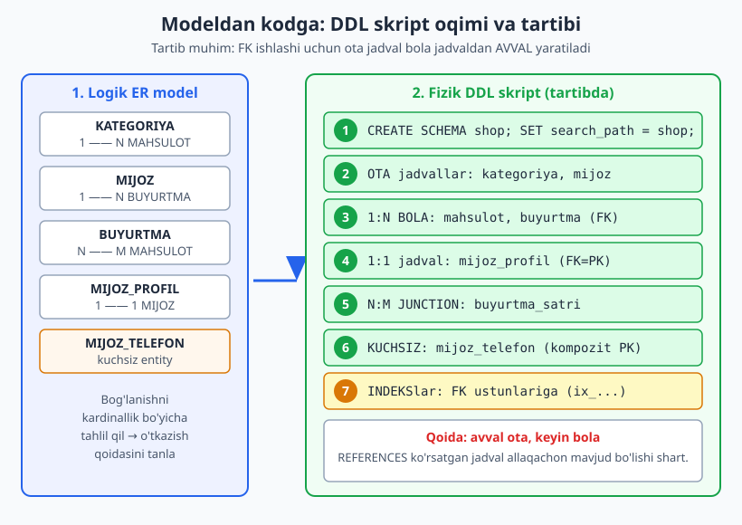

# 09 — Logik modeldan fizik sxemaga

[⬅️ Oldingi: 08 — Normalizatsiya II: BCNF, 4NF, 5NF va denormalizatsiya](./08-normalizatsiya-ilgor.md) · [🏠 README](./README.md) · [Keyingi: 10 — To'g'ri ma'lumot turini tanlash (PostgreSQL boy turlari) ➡️](./10-malumot-turlari.md)

> **Bu bobda:** ER/logik modelni qog'ozdan haqiqiy PostgreSQL jadvallariga aylantiramiz. Har bir element uchun aniq o'tkazish qoidasini ko'ramiz: entity -> jadval, atribut -> ustun, 1:N -> bola tomonda FK, N:M -> bog'lovchi (junction) jadval, 1:1 -> qaysi tomonda FK, kuchsiz entity -> kompozit kalit. Keyin izchil nomlash konvensiyasini (snake_case), DDL skript tartibini (avval ota jadval) va PG schema/`search_path` bilan tashkil etishni o'rganamiz. Yakunda butun bir do'kon modelini noldan to'liq DDL ga aylantiramiz va uni jonli PostgreSQL 18 klasterida ishga tushiramiz.

---

## 0. Ko'prik: II qismdan III qismga

Bu bob kitobning **ikki yarmini bog'laydigan ko'prik**. Shu paytgacha (II qism) biz *modellashtirish* bilan shug'ullandik: ER-diagramma chizdik ([03-bob](./03-er-diagramma.md)), kardinallikni aniqladik ([04-bob](./04-boglanish-kardinallik.md)), kalit tanladik ([06-bob](./06-kalit-dizayni.md)) va normalizatsiya qildik ([07](./07-normalizatsiya-asoslari.md)–[08](./08-normalizatsiya-ilgor.md)-boblar). Bularning hammasi — **logik model**: ma'lumot qanday tashkil etilishi, mahsulot (DBMS) ga bog'liq emas.

Endi (III qismdan boshlab) biz *fizik dizayn* ga o'tamiz: bu logik modelni aynan PostgreSQL'da `CREATE TABLE` skriptiga aylantirish. Bu **mexanik, lekin qoidaga asoslangan** jarayon. Qoidalarni bir marta o'rgansangiz — har qanday ER-modelni ishonchli DDL ga aylantira olasiz.

> **Eslatma:** `CREATE TABLE`, `FOREIGN KEY`, `PRIMARY KEY` ning *sintaksisi* sizga tanish ([SQL kitobining 4-bobiga](../sql/04-create.md) qarang). Bu bob sintaksisni qayta o'rgatmaydi — u **qaysi konstruksiyani qachon va nega** tanlashni o'rgatadi. Ya'ni dizayn qarori, sintaksis emas.

Uch bosqichli dizayn jarayonini ([01-bobdan](./01-dizayn-nima.md)) eslang: **konseptual -> logik -> fizik**. Biz hozir oxirgi o'qning ustidamiz.

---

## 1. O'tkazishning oltita qoidasi

Logik modelda atigi bir nechta element turi bor: entity, atribut va bog'lanish (1:1, 1:N, N:M). Har biri uchun aniq bir o'tkazish qoidasi mavjud. Quyidagi xarita butun bobning xulosasi:



Endi har bir qoidani alohida, do'kon domeni misolida ko'ramiz.

### 1.1 Qoida 1 — Entity -> jadval

Har bir **kuchli (mustaqil) entity** bitta `CREATE TABLE` ga aylanadi. Jadvalga surrogate birlamchi kalit (`id`) qo'shamiz — buni [06-bobda](./06-kalit-dizayni.md) muhokama qilgan edik (surrogate kalit barqaror va o'zgarmas).

```sql
CREATE TABLE kategoriya (
    id   bigint GENERATED ALWAYS AS IDENTITY PRIMARY KEY,
    nomi text NOT NULL
);
```

`GENERATED ALWAYS AS IDENTITY` — PostgreSQL'da surrogate kalit yaratishning zamonaviy, standart-SQL usuli (eski `serial` o'rniga afzal). `bigint` ni `int` dan ko'ra tanlaymiz, chunki jadval o'sib 2 milliarddan oshib ketishi mumkin va keyin turni o'zgartirish og'riqli.

### 1.2 Qoida 2 — Atribut -> ustun

Entity atributlari jadval ustunlariga aylanadi. Bu yerda ikki qaror bor:

- **Tur (type)** — `text`, `numeric`, `timestamptz` va h.k. To'g'ri tur tanlash o'z-o'zicha katta dizayn mavzusi; uni to'liq [10-bobda](./10-malumot-turlari.md) ko'ramiz. Hozircha asosiy tanlovlarni ishlatamiz: matn uchun `text`, pul uchun `numeric(12,2)` (hech qachon `float` emas!), vaqt uchun `timestamptz`.
- **Majburiymi?** — Logik modelda atribut majburiy (mandatory) bo'lsa, ustunga `NOT NULL` qo'yamiz. Ixtiyoriy bo'lsa — `NOT NULL` siz qoldiramiz (NULL ruxsat).

```sql
CREATE TABLE mijoz (
    id         bigint GENERATED ALWAYS AS IDENTITY PRIMARY KEY,
    email      text NOT NULL,           -- majburiy atribut
    ismi       text NOT NULL,           -- majburiy
    yaratilgan timestamptz NOT NULL DEFAULT now()
);
```

> **Kompozit/ko'p qiymatli/hosil atribut.** Logik modeldagi maxsus atribut turlari ([03-bobni eslang](./03-er-diagramma.md)) fizik sxemada quyidagicha hal qilinadi: **kompozit** atribut (masalan, `manzil = shahar + ko'cha + uy`) odatda alohida ustunlarga yoyiladi; **ko'p qiymatli** atribut (masalan, bir mijozning bir necha telefoni) alohida jadvalga ajratiladi (1NF talabi — [07-bob](./07-normalizatsiya-asoslari.md)); **hosil** atribut (masalan, `jami = soni * narx`) generated column bo'lib saqlanadi ([08-bobni eslang](./08-normalizatsiya-ilgor.md)).

### 1.3 Qoida 3 — 1:N -> bola tomonda FK

Bu eng ko'p uchraydigan bog'lanish. Qoida sodda: **FK ustunini "ko'p" (N) tomondagi jadvalga qo'y**, va u "bir" (1) tomonning birlamchi kalitiga ishora qilsin.

Do'konda: bitta `kategoriya` ga ko'p `mahsulot` tegishli (1:N). Demak FK `mahsulot` jadvalida:

```sql
CREATE TABLE mahsulot (
    id            bigint GENERATED ALWAYS AS IDENTITY PRIMARY KEY,
    kategoriya_id bigint NOT NULL,
    nomi          text NOT NULL,
    narx          numeric(12,2) NOT NULL,
    CONSTRAINT fk_mahsulot_kategoriya
        FOREIGN KEY (kategoriya_id) REFERENCES kategoriya (id)
        ON UPDATE CASCADE ON DELETE RESTRICT
);
```

Ikki nozik nuqta:

- **`NOT NULL` mi?** Agar har bir mahsulot **majburan** bir kategoriyaga tegishli bo'lsa (majburiy ishtirok) -> `NOT NULL`. Agar mahsulot kategoriyasiz ham bo'la olsa (ixtiyoriy ishtirok, "modallik" — [04-bob](./04-boglanish-kardinallik.md)) -> NULL ruxsat.
- **`ON DELETE` strategiyasi.** Ota o'chirilsa bola bilan nima bo'ladi? `RESTRICT` (bola bo'lsa o'chirishni rad et), `CASCADE` (bolalarni ham o'chir), `SET NULL` (FK ni NULL qil). Bu **dizayn qarori** — uni to'liq [11-bobda](./11-constraint-dizayni.md) ko'ramiz. Bu yerda `RESTRICT` tanladik: tegishli mahsulotlari bor kategoriyani tasodifan o'chirib bo'lmasin.

> **O'z-o'ziga 1:N (rekursiv bog'lanish).** Xodim-boshliq kabi holatda FK o'sha jadvalning o'ziga ishora qiladi: `boshliq_id bigint REFERENCES xodim(id)`. Bu ham 1:N ning bir ko'rinishi. Daraxt strukturalarini ([17-bob](./17-daraxt-graf.md)) chuqurroq ko'ramiz.

### 1.4 Qoida 4 — N:M -> bog'lovchi (junction) jadval

Relyatsion modelda N:M bog'lanishni **to'g'ridan-to'g'ri ifodalab bo'lmaydi** — har doim **uchinchi jadval** (junction / bog'lovchi / o'tish jadvali) kerak. Bu jadval ikki tomonning kalitlarini bir-biriga ulaydi.

Do'konda: bitta `buyurtma` da ko'p `mahsulot`, bitta `mahsulot` ko'p `buyurtma` da bo'ladi (N:M). Bog'lovchi jadval — `buyurtma_satri`:

```sql
CREATE TABLE buyurtma_satri (
    buyurtma_id   bigint NOT NULL REFERENCES buyurtma (id) ON DELETE CASCADE,
    mahsulot_id   bigint NOT NULL REFERENCES mahsulot (id) ON DELETE RESTRICT,
    soni          integer NOT NULL,
    narx_snapshot numeric(12,2) NOT NULL,
    PRIMARY KEY (buyurtma_id, mahsulot_id),
    CONSTRAINT ck_satr_soni_musbat CHECK (soni > 0)
);
```

Diqqat qiling:

- **Birlamchi kalit kompozit:** `PRIMARY KEY (buyurtma_id, mahsulot_id)` — ikki FK birgalikda kalit bo'ladi. Bu bir buyurtmada bir mahsulot ikki marta yozilmasligini ham kafolatlaydi.
- **Bog'lanish atributlari:** N:M ning ko'p chiroyli tomoni — bog'lanishning *o'ziga xos* atributlari (bu yerda `soni` va `narx_snapshot`) aynan shu junction jadvalga tabiiy joylashadi. (`narx_snapshot` — buyurtma paytidagi muzlatilgan narx, [08-bobdagi](./08-normalizatsiya-ilgor.md) snapshot naqshi.)

> **Surrogate `id` qo'shsam-chi?** Ba'zan junction jadvalga ham alohida `id bigint` qo'shiladi (masalan, ORM talabi yoki junction satriga boshqa jadval ishora qilishi kerak bo'lsa). U holda `(buyurtma_id, mahsulot_id)` ga `UNIQUE` qo'yib, takrorni baribir taqiqlash kerak — aks holda bitta mahsulot bir buyurtmada ikki marta paydo bo'lishi mumkin.

### 1.5 Qoida 5 — 1:1 -> qaysi tomonda FK?

1:1 eng kam uchraydigan, lekin eng ko'p qaror talab qiladigan holat. Asosiy savol: **FK qaysi tomonga qo'yiladi?** Bir nechta yondashuv bor.

**(a) Ixtiyoriy tomonga FK + UNIQUE.** Agar bog'lanish bir tomonda majburiy, ikkinchi tomonda ixtiyoriy bo'lsa — FK ni **ixtiyoriy** tomonga qo'ying. Do'konda: har `mijoz` ning profili bo'lishi shart emas, lekin har `mijoz_profil` aynan bitta mijozga tegishli. Demak FK `mijoz_profil` da:

```sql
CREATE TABLE mijoz_profil (
    mijoz_id   bigint PRIMARY KEY REFERENCES mijoz (id) ON DELETE CASCADE,
    bio        text,
    avatar_url text
);
```

Bu yerda chiroyli hiyla: FK ustunini **bir vaqtning o'zida birlamchi kalit** qildik (`mijoz_id ... PRIMARY KEY`). PK avtomatik UNIQUE bo'lgani uchun, bitta mijozga bir nechta profil yozib bo'lmaydi — bu aynan 1:1 ni kafolatlaydi.

**(b) Alohida `id` + UNIQUE FK.** Agar jadvalga o'z surrogate kaliti kerak bo'lsa, FK ni `UNIQUE` qilamiz:

```sql
-- Muqobil: 1:1 ni UNIQUE FK bilan
CREATE TABLE mijoz_sozlama (
    id       bigint GENERATED ALWAYS AS IDENTITY PRIMARY KEY,
    mijoz_id bigint NOT NULL UNIQUE REFERENCES mijoz (id) ON DELETE CASCADE,
    til      text NOT NULL DEFAULT 'uz'
);
```

`UNIQUE` bo'lmasa, bu 1:N ga aylanib qoladi. Aynan `UNIQUE` 1:1 ni majburlaydi.

> **Umuman alohida jadval kerakmi?** Ko'pincha 1:1 atributlarini shunchaki **asosiy jadvalga ustun** qilib qo'shish to'g'riroq. 1:1 ni alohida jadvalga ajratish faqat shu hollarda mantiqiy: (1) ixtiyoriy/kam to'ldiriladigan ustunlarni ajratib, asosiy jadvalni ixcham saqlash; (2) maxfiy ma'lumotni (parol, hujjat) alohida ruxsat bilan himoyalash; (3) juda katta ustunni (BLOB, uzun matn) "dangasa yuklash" uchun ajratish. Sababsiz 1:1 ajratish — ortiqcha JOIN.

### 1.6 Qoida 6 — Kuchsiz entity -> kompozit kalit

**Kuchsiz entity** ([03-bob](./03-er-diagramma.md)) — egasiz mustaqil mavjud bo'lolmaydigan obyekt; uning identifikatsiyasi egasiga bog'liq. Misol: `mijoz_telefon`. Telefon raqami o'z-o'zicha emas, balki *qaysi mijozning* raqami ekani bilan ma'noli.

Fizik sxemada: kuchsiz entity jadvalining birlamchi kaliti **eganing kaliti + o'zining qisman (partial) kaliti** dan tashkil topadi:

```sql
CREATE TABLE mijoz_telefon (
    mijoz_id bigint NOT NULL REFERENCES mijoz (id) ON DELETE CASCADE,
    raqam    text NOT NULL,
    turi     text NOT NULL DEFAULT 'asosiy',
    PRIMARY KEY (mijoz_id, raqam)
);
```

Ikki muhim belgi:

- **Kompozit PK:** `(mijoz_id, raqam)` — `mijoz_id` (ega kaliti) + `raqam` (qisman kalit). Bu bir mijozda bir raqam ikki marta bo'lmasligini kafolatlaydi.
- **`ON DELETE CASCADE`:** ega (`mijoz`) o'chirilsa, uning telefonlari ham avtomatik o'chadi. Bu **deyarli har doim** to'g'ri kuchsiz entity uchun — chunki egasiz telefon ma'nosiz.

---

## 2. Nomlash konvensiyasi — kelishuvni bir marta tanlang

Sxema o'sib borgani sayin, **izchil nomlash** uning eng kuchli "hujjati" ga aylanadi. Yangi dasturchi `mahsulot.kategoriya_id` ni ko'rsa, hech qanday hujjatsiz, bu `kategoriya` jadvaliga FK ekanini darhol tushunadi. Izchilliksiz nom esa — doimiy chalkashlik.

Eng muhimi: **qaysi konvensiyani tanlashingiz aslida muhim emas, izchillik muhim.** Bir loyihada bitta qoidani tanlang va undan og'ishmang.



### 2.1 Jadval va ustun nomi: snake_case

PostgreSQL nomlarni **kichik harfga keltiradi** (qo'shtirnoq ichida yozmasangiz). Shuning uchun `CamelCase` PG'da yomon ishlaydi — `snake_case` (kichik harf, so'zlar pastki chiziq bilan) standart:

- **To'g'ri:** `buyurtma_satri`, `kategoriya_id`, `yaratilgan_vaqt`
- **Yomon:** `BuyurtmaSatri` (PG `buyurtmasatri` ga aylantiradi), `"BuyurtmaSatri"` (har joyda qo'shtirnoq kerak — og'riq).

### 2.2 Birlik mi, ko'plik mi? (jadval nomi munozarasi)

Bu eng mashhur "diniy urush". Ikki maktab bor:

- **Birlik** (`mijoz`, `buyurtma`): "jadval — entity *turi*". Bir qator = bitta mijoz. ORM lar ko'pincha buni afzal ko'radi.
- **Ko'plik** (`mijozlar`, `buyurtmalar`): "jadval — qatorlar *to'plami*". `SELECT * FROM mijozlar` tabiiyroq o'qiladi.

**Maslahat:** ikkalasi ham to'g'ri. Bitta loyihada bittasini tanlang. Bu kitobda **birlik** ishlatamiz (`mijoz`, `mahsulot`) — chunki u entity nomi bilan to'g'ridan-to'g'ri mos keladi va junction jadvallarda (`buyurtma_satri`) tabiiyroq.

### 2.3 FK ustun nomi: `<ota_jadval>_id`

FK ustunini har doim `<ishora_qilingan_jadval>_id` deb nomlang. Bu nom o'zi hujjat bo'ladi:

- `kategoriya_id` -> `kategoriya(id)` ga FK
- `mijoz_id` -> `mijoz(id)` ga FK

Agar bitta jadval bir xil ota jadvalga ikki FK qo'ysa, rolni qo'shing: `yuboruvchi_id`, `qabul_qiluvchi_id` (ikkalasi ham `foydalanuvchi(id)` ga).

### 2.4 Constraint va indeks nomlash siyosati

PostgreSQL nom bermasangiz constraint'larga avtomatik nom beradi (masalan, `buyurtma_satri_buyurtma_id_fkey`). Bu ishlaydi, lekin **muhim constraint'larga o'zingiz aniq nom bering** — chunki: (1) xato xabarida o'qiladigan nom chiqadi; (2) keyin `ALTER TABLE ... DROP CONSTRAINT <nom>` qilish oson; (3) migratsiyalarda barqaror nom kerak.

Keng tarqalgan prefiks siyosati:

| Obyekt | Prefiks | Naqsh | Misol |
|---|---|---|---|
| Primary key | `pk_` | `pk_<jadval>` | `pk_mijoz` |
| Unique | `uq_` | `uq_<jadval>_<ustun>` | `uq_mijoz_email` |
| Foreign key | `fk_` | `fk_<jadval>_<ota>` | `fk_mahsulot_kategoriya` |
| Check | `ck_` | `ck_<jadval>_<qoida>` | `ck_mahsulot_narx_musbat` |
| Index | `ix_` | `ix_<jadval>_<ustun>` | `ix_buyurtma_mijoz_id` |

Bu siyosatni qo'llaganda `\d` chiqishida farq aniq ko'rinadi (quyida 4-bo'limda haqiqiy chiqishni ko'ramiz): o'zingiz nomlagan `fk_mahsulot_kategoriya` va PG avtomatik bergan `buyurtma_satri_buyurtma_id_fkey` yonma-yon turadi.

---

## 3. DDL skript tuzilishi va tartibi

Endi alohida qoidalarni bitta **bajariladigan skript** ga yig'amiz. Bu yerda eng muhim narsa — **tartib**.



### 3.1 Oltin qoida: avval ota, keyin bola

`FOREIGN KEY (...) REFERENCES kategoriya (id)` yozilganda, `kategoriya` jadvali **allaqachon mavjud** bo'lishi shart. Demak yaratish tartibi bog'liqlik grafiga bo'ysunadi:

1. **Mustaqil (ota) jadvallar** — hech kimga FK qo'ymaydiganlar: `kategoriya`, `mijoz`.
2. **Bola jadvallar** — ota mavjud bo'lgandan keyin: `mahsulot` (kategoriyaga), `buyurtma` (mijozga).
3. **Junction va kuchsiz** — ikkala otasi tayyor bo'lgach: `buyurtma_satri`, `mijoz_telefon`.
4. **Indekslar** oxirida.

> **Sirkulyar bog'lanish bo'lsa-chi?** Ba'zan A -> B va B -> A bir-biriga ishora qiladi (masalan, `bo'lim.boshliq_id -> xodim` va `xodim.bo'lim_id -> bo'lim`). U holda tartib yetmaydi: avval jadvallarni FK'siz yarating, keyin `ALTER TABLE ... ADD CONSTRAINT ... FOREIGN KEY ...` bilan FK qo'shing. Yoki `DEFERRABLE` constraint ishlating ([11-bob](./11-constraint-dizayni.md)).

### 3.2 FK ni jadval ichida yoki ALTER bilan?

Ikki uslub bor, ikkalasi ham to'g'ri:

```sql
-- (a) Jadval ta'rifida (inline) — o'qish oson, lekin tartib muhim
CREATE TABLE mahsulot (
    ...,
    kategoriya_id bigint NOT NULL REFERENCES kategoriya (id)
);

-- (b) Keyin ALTER bilan — tartibdan ozod, migratsiyalarda qulay
ALTER TABLE mahsulot
  ADD CONSTRAINT fk_mahsulot_kategoriya
  FOREIGN KEY (kategoriya_id) REFERENCES kategoriya (id);
```

Boshlang'ich skriptda (a) ko'proq o'qiladi. Mavjud bazaga o'zgartirish kiritganda (migratsiya — [23-bob](./23-migratsiya-evolyutsiya.md)) (b) afzal.

### 3.3 FK ustunlariga indeks — unutmang!

PostgreSQL **avtomatik** PRIMARY KEY va UNIQUE constraint'larga indeks yaratadi, lekin **FK ustunlariga emas**. Bu juda keng tarqalgan unutilish. FK ustuniga indeks bo'lmasa: (1) JOIN sekin bo'ladi; (2) ota qatorni o'chirish/yangilash juda sekinlashadi (PG butun bola jadvalni skanerlaydi). Shuning uchun har FK ustuniga indeks qo'shing:

```sql
CREATE INDEX ix_mahsulot_kategoriya_id ON mahsulot (kategoriya_id);
CREATE INDEX ix_buyurtma_mijoz_id      ON buyurtma (mijoz_id);
CREATE INDEX ix_satr_mahsulot_id       ON buyurtma_satri (mahsulot_id);
```

(`buyurtma_satri.buyurtma_id` ga alohida indeks shart emas — u kompozit PK ning *birinchi* ustuni, shuning uchun PK indeksi uni allaqachon qoplaydi. Indeks strategiyasini [14-bobda](./14-indeks-strategiyasi.md) chuqur ko'ramiz.)

---

## 4. PostgreSQL: schema va `search_path` bilan tashkil etish

PostgreSQL'da **schema** — bu baza ichidagi nomlar makoni (namespace), jadvallar uchun "papka" kabi. Standart schema — `public`. Lekin yirik loyihada jadvallarni mantiqiy schema'larga bo'lish foydali: `shop`, `auth`, `billing` va h.k.

### 4.1 Schema yaratish va `search_path`

```sql
CREATE SCHEMA IF NOT EXISTS shop;
SET search_path = shop;   -- endi nomlar avval shop'da qidiriladi
```

`search_path` — PG nomni qidiradigan schema'lar ro'yxati. `SET search_path = shop` dan keyin `CREATE TABLE mahsulot` aslida `shop.mahsulot` ni yaratadi va `SELECT ... FROM mahsulot` ham `shop.mahsulot` ni topadi — har safar `shop.` yozmasdan.

Schema afzalliklari dizayn nuqtai nazaridan:

- **Tashkilot:** bog'liq jadvallarni guruhlash (`billing.hisob`, `billing.tolov`).
- **Ruxsat:** schema darajasida `GRANT` berish oson (bir butun modulga ruxsat).
- **Multi-tenancy:** har ijarachiga alohida schema ([19-bob](./19-multi-tenancy.md) — schema-per-tenant strategiyasi).
- **Test izolyatsiyasi:** bu kitobning har bobi o'z schema'sida ishlaydi (`ch09`), bir-biriga xalal bermasin.

> **Ehtiyot:** `search_path` ni faqat seans (session) darajasida `SET` qilsangiz, u keyingi ulanishda yo'qoladi. Doimiy qilish uchun foydalanuvchiga `ALTER ROLE ... SET search_path = ...` yoki bazaga `ALTER DATABASE ...` qo'llang. Skriptlarda esa har doim boshida `SET search_path` yozish odat tusiga kirsin.

---

## 5. To'liq misol: do'kon modelidan to'liq DDL ga (PG18'da ishga tushirilgan)

Endi hammasini birlashtiramiz. Quyidagi do'kon modeli oltita o'tkazish qoidasining hammasini qamraydi:

- `kategoriya`, `mijoz` — mustaqil entity (Qoida 1).
- `mahsulot` 1:N `kategoriya`, `buyurtma` 1:N `mijoz` (Qoida 3).
- `mijoz_profil` 1:1 `mijoz` (Qoida 5).
- `buyurtma` N:M `mahsulot` orqali `buyurtma_satri` (Qoida 4).
- `mijoz_telefon` — kuchsiz entity (Qoida 6).

Quyidagi skript **PostgreSQL 18.4 (port 5434)** klasterida `ch09` schema'sida HAQIQATAN ishga tushirildi. Har bir natija real `psql` chiqishi.

### 5.1 To'liq DDL skripti

```sql
CREATE SCHEMA IF NOT EXISTS ch09;
SET search_path = ch09;

-- 1) Mustaqil (ota) jadvallar AVVAL
CREATE TABLE kategoriya (
    id   bigint GENERATED ALWAYS AS IDENTITY PRIMARY KEY,
    nomi text NOT NULL,
    CONSTRAINT uq_kategoriya_nomi UNIQUE (nomi)
);

CREATE TABLE mijoz (
    id         bigint GENERATED ALWAYS AS IDENTITY PRIMARY KEY,
    email      text NOT NULL,
    ismi       text NOT NULL,
    yaratilgan timestamptz NOT NULL DEFAULT now(),
    CONSTRAINT uq_mijoz_email UNIQUE (email)
);

-- 2) 1:N bola jadvallar (FK bola tomonda)
CREATE TABLE mahsulot (
    id            bigint GENERATED ALWAYS AS IDENTITY PRIMARY KEY,
    kategoriya_id bigint NOT NULL,
    nomi          text NOT NULL,
    narx          numeric(12,2) NOT NULL,
    CONSTRAINT fk_mahsulot_kategoriya
        FOREIGN KEY (kategoriya_id) REFERENCES kategoriya (id)
        ON UPDATE CASCADE ON DELETE RESTRICT,
    CONSTRAINT ck_mahsulot_narx_musbat CHECK (narx > 0)
);

CREATE TABLE buyurtma (
    id         bigint GENERATED ALWAYS AS IDENTITY PRIMARY KEY,
    mijoz_id   bigint NOT NULL REFERENCES mijoz (id) ON DELETE RESTRICT,
    holati     text NOT NULL DEFAULT 'yangi',
    yaratilgan timestamptz NOT NULL DEFAULT now(),
    CONSTRAINT ck_buyurtma_holati
        CHECK (holati IN ('yangi','tolangan','yetkazilgan','bekor'))
);

-- 3) 1:1 jadval (FK = PK, ixtiyoriy tomonda)
CREATE TABLE mijoz_profil (
    mijoz_id   bigint PRIMARY KEY REFERENCES mijoz (id) ON DELETE CASCADE,
    bio        text,
    avatar_url text
);

-- 4) N:M junction jadval (kompozit PK)
CREATE TABLE buyurtma_satri (
    buyurtma_id   bigint NOT NULL REFERENCES buyurtma (id) ON DELETE CASCADE,
    mahsulot_id   bigint NOT NULL REFERENCES mahsulot (id) ON DELETE RESTRICT,
    soni          integer NOT NULL,
    narx_snapshot numeric(12,2) NOT NULL,
    PRIMARY KEY (buyurtma_id, mahsulot_id),
    CONSTRAINT ck_satr_soni_musbat CHECK (soni > 0)
);

-- 5) Kuchsiz entity (kompozit PK: ega + qisman kalit)
CREATE TABLE mijoz_telefon (
    mijoz_id bigint NOT NULL REFERENCES mijoz (id) ON DELETE CASCADE,
    raqam    text NOT NULL,
    turi     text NOT NULL DEFAULT 'asosiy',
    PRIMARY KEY (mijoz_id, raqam)
);

-- 6) Indekslar: FK ustunlariga (PG FK ni avtomatik indekslamaydi)
CREATE INDEX ix_mahsulot_kategoriya_id ON mahsulot (kategoriya_id);
CREATE INDEX ix_buyurtma_mijoz_id      ON buyurtma (mijoz_id);
CREATE INDEX ix_satr_mahsulot_id       ON buyurtma_satri (mahsulot_id);
```

Ishga tushganda PG quyidagini chiqaradi (real, 5434 da):

```
CREATE SCHEMA
SET
CREATE TABLE
CREATE TABLE
CREATE TABLE
CREATE TABLE
CREATE TABLE
CREATE TABLE
CREATE TABLE
CREATE INDEX
CREATE INDEX
CREATE INDEX
```

Yetti jadval va uchta indeks toza yaratildi.

### 5.2 Ma'lumot bilan to'ldirib, bog'lanishni tekshirish

```sql
SET search_path = ch09;

INSERT INTO kategoriya (nomi) VALUES ('Elektronika'), ('Kitoblar');

INSERT INTO mijoz (email, ismi) VALUES
  ('ali@example.com','Ali Valiyev'),
  ('lola@example.com','Lola Karimova');

INSERT INTO mijoz_profil (mijoz_id, bio) VALUES (1, 'Texnika ishqibozi');

INSERT INTO mijoz_telefon (mijoz_id, raqam, turi) VALUES
  (1, '+998901112233', 'asosiy'),
  (1, '+998935556677', 'ish');

INSERT INTO mahsulot (kategoriya_id, nomi, narx) VALUES
  (1, 'Klaviatura', 250000.00),
  (1, 'Sichqoncha', 120000.00),
  (2, 'PostgreSQL kitobi', 90000.00);

INSERT INTO buyurtma (mijoz_id, holati) VALUES (1, 'yangi');

INSERT INTO buyurtma_satri (buyurtma_id, mahsulot_id, soni, narx_snapshot) VALUES
  (1, 1, 2, 250000.00),
  (1, 3, 1, 90000.00);
```

N:M bog'lanishni JOIN orqali o'qiymiz (buyurtma -> satr -> mahsulot):

```sql
SELECT b.id AS buyurtma, m.ismi AS mijoz, p.nomi AS mahsulot,
       bs.soni, bs.narx_snapshot, bs.soni*bs.narx_snapshot AS satr_jami
FROM buyurtma b
JOIN mijoz m            ON m.id = b.mijoz_id
JOIN buyurtma_satri bs  ON bs.buyurtma_id = b.id
JOIN mahsulot p         ON p.id = bs.mahsulot_id
ORDER BY p.nomi;
```

Natija (5434 da tekshirildi):

```
 buyurtma |    mijoz    |     mahsulot      | soni | narx_snapshot | satr_jami
----------+-------------+-------------------+------+---------------+-----------
        1 | Ali Valiyev | Klaviatura        |    2 |     250000.00 | 500000.00
        1 | Ali Valiyev | PostgreSQL kitobi |    1 |      90000.00 |  90000.00
(2 rows)
```

### 5.3 Constraint'lar haqiqatan ishlayotganini ko'rsatish

Sxema "qog'ozda" emas, **baza majburlaydi**. Buni uchta urinish bilan tasdiqlaymiz.

**FK `RESTRICT`** — tegishli mahsuloti bor kategoriyani o'chirib bo'lmaydi:

```sql
DELETE FROM kategoriya WHERE id = 1;
```

```
ERROR:  update or delete on table "kategoriya" violates RESTRICT setting of
        foreign key constraint "fk_mahsulot_kategoriya" on table "mahsulot"
DETAIL:  Key (id)=(1) is referenced from table "mahsulot".
```

**CHECK** — narxi noldan katta bo'lishi shart:

```sql
INSERT INTO mahsulot (kategoriya_id, nomi, narx) VALUES (1, 'Tekin mahsulot', 0);
```

```
ERROR:  new row for relation "mahsulot" violates check constraint "ck_mahsulot_narx_musbat"
DETAIL:  Failing row contains (4, 1, Tekin mahsulot, 0.00).
```

**`ON DELETE CASCADE`** — mijoz o'chirilsa, profili avtomatik o'chadi. (Test mijoz qo'shib, o'chirib, profil sonini solishtiramiz.)

```sql
INSERT INTO mijoz (email, ismi) VALUES ('test@x.com','Test');
INSERT INTO mijoz_profil (mijoz_id, bio)
  VALUES (currval(pg_get_serial_sequence('mijoz','id')), 'vaqtinchalik');
SELECT count(*) AS profil_avval FROM mijoz_profil;
DELETE FROM mijoz WHERE email='test@x.com';
SELECT count(*) AS profil_keyin FROM mijoz_profil;
```

Natija (5434 da tekshirildi) — profil 2 dan 1 ga tushdi, ya'ni CASCADE ishladi:

```
 profil_avval
--------------
            2

 profil_keyin
--------------
            1
```

### 5.4 `\d` bilan fizik tuzilishni tekshirish

`psql` ning `\d <jadval>` buyrug'i fizik sxemani ko'rsatadi. Bu yerda nomlash konvensiyasining ta'siri aniq ko'rinadi:

```
\d ch09.mahsulot
```

Real chiqish (5434 da):

```
                                Table "ch09.mahsulot"
    Column     |     Type      | Nullable |           Default
---------------+---------------+----------+------------------------------
 id            | bigint        | not null | generated always as identity
 kategoriya_id | bigint        | not null |
 nomi          | text          | not null |
 narx          | numeric(12,2) | not null |
Indexes:
    "mahsulot_pkey" PRIMARY KEY, btree (id)
    "ix_mahsulot_kategoriya_id" btree (kategoriya_id)
Check constraints:
    "ck_mahsulot_narx_musbat" CHECK (narx > 0::numeric)
Foreign-key constraints:
    "fk_mahsulot_kategoriya" FOREIGN KEY (kategoriya_id) REFERENCES ch09.kategoriya(id) ON UPDATE CASCADE ON DELETE RESTRICT
Referenced by:
    TABLE "ch09.buyurtma_satri" CONSTRAINT "buyurtma_satri_mahsulot_id_fkey" FOREIGN KEY (mahsulot_id) REFERENCES ch09.mahsulot(id) ON DELETE RESTRICT
```

Diqqat: o'zimiz nomlagan `fk_mahsulot_kategoriya` va `ck_mahsulot_narx_musbat` o'qiladi; junction jadvaldagi avtomatik `buyurtma_satri_mahsulot_id_fkey` esa — uzunroq, mashina yaratgan nom. Aynan shu farq nima uchun muhim constraint'larga o'zimiz nom berishimiz kerakligini ko'rsatadi.

### 5.5 Tozalash

Test schema'sini ortidan tozalaymiz:

```sql
DROP SCHEMA ch09 CASCADE;
```

```
NOTICE:  drop cascades to 8 other objects
DROP SCHEMA
```

`CASCADE` schema ichidagi barcha jadval/indeks/constraint'ni birga o'chiradi — test izolyatsiyasi uchun ideal.

---

## 6. Ekspert maslahatlari va ko'p uchraydigan xatolar

Tajriba bilan kelgan amaliy qoidalar:

| Xato / qaror | To'g'ri yondashuv |
|---|---|
| FK ustuniga indeks qo'ymaslik | Har FK ustuniga `ix_` indeks qo'shing (JOIN va ota o'chirish tezligi). |
| `int` ni PK qilish | O'sib ketishi mumkin jadvallarda `bigint` (turni keyin o'zgartirish og'riqli). |
| Pulni `float`/`real` da saqlash | Har doim `numeric(p,s)` (yaxlitlash xatosi yo'q — [10-bob](./10-malumot-turlari.md)). |
| `timestamp` (zonasiz) ishlatish | `timestamptz` (vaqt mintaqasi bilan) — standart tanlov. |
| N:M ni ikki FK ustun bilan "to'g'ridan-to'g'ri" | Doim junction jadval; takrorni `PRIMARY KEY`/`UNIQUE` bilan to'sing. |
| Constraint'larni nomsiz qoldirish | Muhim constraint'larga `fk_`/`uq_`/`ck_` nom bering (xato xabari + migratsiya). |
| Yaratish tartibini e'tiborsiz qoldirish | Avval ota, keyin bola; sirkulyar bo'lsa `ALTER ... ADD CONSTRAINT`. |

> **PostgreSQL 18+ yangiligi:** taqsimlangan tizimga moslab, surrogate kalitni `uuidv7()` bilan ham yaratish mumkin — bu vaqt bo'yicha tartiblanadigan UUID (`019ec1f7-5c84-77f5-...`), ya'ni B-tree indeksda UUIDv4 dagi tasodifiy tarqalishdan farqli, ketma-ket joylashadi. PG18 da `id uuid PRIMARY KEY DEFAULT uuidv7()` to'g'ridan-to'g'ri ishlaydi (5434 da sinab ko'rdim). Bu va `BIGINT IDENTITY` o'rtasidagi trade-off [06-bobda](./06-kalit-dizayni.md) batafsil.

Yakuniy fikr: logik modeldan fizik sxemaga o'tish — **ijod emas, intizom**. Oltita qoidani izchil qo'llang, izchil nomlang, tartibni hurmat qiling. Keyingi bobda esa eng nozik fizik dizayn qaroriga — **to'g'ri ma'lumot turini tanlash** ga — chuqur kirib boramiz.

---

## Mashqlar

### Oson

1. **Entity -> jadval.** "Kutubxona" domenida `kitob` entity'si quyidagi atributlarga ega: `isbn` (majburiy, noyob), `sarlavha` (majburiy), `nashr_yili` (ixtiyoriy). Surrogate `id` bilan to'liq `CREATE TABLE` yozing, qaysi ustun(lar)ga `NOT NULL` va `UNIQUE` kerakligini ko'rsating.

2. **1:N -> FK.** `muallif` 1 — N `kitob` (bir muallif ko'p kitob, har kitob bitta muallif). FK qaysi jadvalda bo'ladi va nomi qanday? FK ustunini `NOT NULL` qilasizmi — qaror biznes qoidasiga qanday bog'liq?

3. **FK indeksi.** Yangi `kitob` jadvalida `muallif_id` FK bor. PostgreSQL bu ustunga avtomatik indeks yaratadimi? Agar yo'q bo'lsa, kerakli `CREATE INDEX` ni yozing va nima uchun kerakligini bir jumlada ayting.

4. **Nomlashni tuzating.** Quyidagi nomlarni snake_case + bu bobdagi konvensiyaga keltiring: jadval `OrderItems`, ustun `CustomerID`, FK constraint (mahsulotdan kategoriyaga) nomsiz, narx > 0 CHECK constraint nomsiz.

### O'rta

5. **N:M -> junction.** `talaba` N — M `kurs` (bir talaba ko'p kursga yoziladi, bir kursda ko'p talaba). Bog'lovchi jadvalni yarating; unga `royxatga_olingan` (sana) bog'lanish atributini qo'shing; bir talaba bir kursga ikki marta yozilmasligini qanday kafolatlaysiz?

6. **1:1 qaror.** `foydalanuvchi` va uning `pasport_malumoti` (har foydalanuvchining 0 yoki 1 ta pasporti). FK qaysi jadvalga va nega? Ikki muqobil (FK=PK va alohida `id`+UNIQUE FK) ni yozing va qaysi biri qachon afzalligini ayting.

7. **Kuchsiz entity.** Onlayn-do'kon `buyurtma` ning `yetkazish_manzili` har buyurtmaga xos (kuchsiz entity, buyurtmasiz mavjud emas). To'liq `CREATE TABLE` yozing: kompozit PK qanday bo'ladi, `ON DELETE` strategiyasi qanday va nega?

8. **DDL tartibi.** Sizda quyidagi jadvallar bor: `buyurtma_satri`, `kategoriya`, `mahsulot`, `mijoz`, `buyurtma`. Ularni `CREATE TABLE` qaysi tartibda yozasiz? Bog'liqlikni ko'rsatib, tartibni asoslang.

### Qiyin

9. **To'liq modeldan DDL.** Quyidagi "blog" logik modelini to'liq PG DDL ga aylantiring: `muallif` (1) — N `maqola`; `maqola` N — M `teg` (junction); har `maqola` ga 0+ `izoh` (1:N, kuchsiz emas — izohning o'z `id` si bor); `muallif` 1 — 1 `muallif_sozlama`. Nomlash konvensiyasini, FK indekslarini, kamida ikkita CHECK ni va to'g'ri yaratish tartibini qo'shing.

10. **Nomlashni to'liq tuzating.** Quyidagi sxema yomon nomlangan. To'liq qayta yozing (jadval, ustun, constraint, indeks nomlari):
    ```sql
    CREATE TABLE Products (
        ProductID serial PRIMARY KEY,
        catId int REFERENCES Categories(catId),
        Price float
    );
    ```
    Kamida 4 muammoni toping (nom, tur, indeks, constraint) va tuzating.

11. **Sirkulyar bog'lanish.** `bolim` jadvalining `boshliq_id` ustuni `xodim` ga ishora qiladi, `xodim` jadvalining `bolim_id` ustuni `bolim` ga ishora qiladi. Oddiy "avval ota, keyin bola" tartibi bu yerda nega yetmaydi? To'liq, ishlaydigan DDL skriptini yozing (jadvallarni yarating, keyin FK qo'shing).

12. **1:N ni N:M ga aylantirish (evolyutsiya).** Boshida `mahsulot` 1 — N `kategoriya` deb modellashtirgansiz (`mahsulot.kategoriya_id`). Endi biznes o'zgardi: bir mahsulot **bir nechta** kategoriyada bo'lishi mumkin (N:M). Eski FK ustunidan junction jadvalga o'tish uchun DDL qadamlarini yozing: yangi junction jadvalni yarating, mavjud ma'lumotni unga ko'chiring, eski ustunni olib tashlang.

13. **Schema bilan tashkil etish.** Bir bazada ikki modul bor: `shop` (mahsulot, buyurtma) va `auth` (foydalanuvchi, sessiya). Ikki schema yarating, har biriga bittadan jadval qo'ying, `search_path` ni to'g'ri sozlang va `auth.foydalanuvchi` ga `shop.buyurtma` dan FK qo'ying (schema-aro FK). Bu ishlaydimi — sinab ko'ring (psql'da).

14. **Audit ustunlari va generated column.** `buyurtma_satri` jadvaliga: (a) `yaratilgan timestamptz` audit ustunini; (b) `jami numeric` ni `soni * narx_snapshot` dan STORED generated column sifatida qo'shing. Generated column uchun trigger keraksizligini asoslang ([08-bobni eslang](./08-normalizatsiya-ilgor.md)).

---

## Yechimlar

<details markdown="1">
<summary>Yechim — 1</summary>

`isbn` — noyob biznes kaliti, lekin barqarorlik uchun surrogate `id` ni PK qilamiz va `isbn` ga `UNIQUE` qo'yamiz:

```sql
CREATE TABLE kitob (
    id         bigint GENERATED ALWAYS AS IDENTITY PRIMARY KEY,
    isbn       text NOT NULL,
    sarlavha   text NOT NULL,
    nashr_yili integer,                 -- ixtiyoriy => NOT NULL yo'q
    CONSTRAINT uq_kitob_isbn UNIQUE (isbn)
);
```

`isbn` va `sarlavha` — majburiy (`NOT NULL`); `nashr_yili` — ixtiyoriy (NULL ruxsat); `isbn` — noyob biznes kalit (`UNIQUE`), lekin PK emas (barqarorlik uchun surrogate afzal — [06-bob](./06-kalit-dizayni.md)).

</details>

<details markdown="1">
<summary>Yechim — 2</summary>

FK **"ko'p" (N) tomonda**, ya'ni `kitob` jadvalida, nomi `muallif_id`:

```sql
CREATE TABLE kitob (
    id         bigint GENERATED ALWAYS AS IDENTITY PRIMARY KEY,
    muallif_id bigint NOT NULL REFERENCES muallif (id),
    sarlavha   text NOT NULL
);
```

`NOT NULL` qarori biznes qoidasiga bog'liq: agar **har kitob majburan** bir muallifga tegishli bo'lsa (majburiy ishtirok) -> `NOT NULL`. Agar mualifsiz kitob (masalan, anonim/noma'lum) bo'lishi mumkin bo'lsa -> NULL ruxsat. Bu — modallik ([04-bob](./04-boglanish-kardinallik.md)) qarori.

</details>

<details markdown="1">
<summary>Yechim — 3</summary>

**Yo'q**, PostgreSQL FK ustuniga avtomatik indeks yaratmaydi (faqat PK va UNIQUE'ga yaratadi). Shuning uchun:

```sql
CREATE INDEX ix_kitob_muallif_id ON kitob (muallif_id);
```

Kerakli: `muallif` bo'yicha kitoblarni izlash (JOIN) tez bo'lsin, va muallif qatorini o'chirish/yangilashda PG butun `kitob` jadvalini skanerlamasin.

</details>

<details markdown="1">
<summary>Yechim — 4</summary>

```sql
-- OrderItems -> buyurtma_satri (snake_case, birlik)
-- CustomerID -> mijoz_id (FK ustun nomi: ota_jadval + _id)
-- FK constraint -> fk_mahsulot_kategoriya
-- CHECK -> ck_mahsulot_narx_musbat

ALTER TABLE mahsulot
  ADD CONSTRAINT fk_mahsulot_kategoriya
  FOREIGN KEY (kategoriya_id) REFERENCES kategoriya (id);

ALTER TABLE mahsulot
  ADD CONSTRAINT ck_mahsulot_narx_musbat CHECK (narx > 0);
```

Asosiy tuzatishlar: jadval nomi snake_case + birlik; FK ustuni `<ota>_id`; constraint'larga `fk_`/`ck_` prefiksli aniq nom.

</details>

<details markdown="1">
<summary>Yechim — 5</summary>

```sql
CREATE TABLE royxat (
    talaba_id        bigint NOT NULL REFERENCES talaba (id) ON DELETE CASCADE,
    kurs_id          bigint NOT NULL REFERENCES kurs (id)   ON DELETE CASCADE,
    royxatga_olingan date NOT NULL DEFAULT current_date,
    PRIMARY KEY (talaba_id, kurs_id)
);
CREATE INDEX ix_royxat_kurs_id ON royxat (kurs_id);
```

Takrorni **kompozit PRIMARY KEY** `(talaba_id, kurs_id)` to'sadi — bir talaba bir kursga ikki marta yozilolmaydi. `royxatga_olingan` — bog'lanishning o'ziga xos atributi, tabiiy ravishda junction jadvalda. `kurs_id` ga indeks: PK ning *birinchi* ustuni `talaba_id` bo'lgani uchun, `kurs` bo'yicha qidiruvga alohida indeks kerak.

</details>

<details markdown="1">
<summary>Yechim — 6</summary>

FK **`pasport_malumoti`** da (kamroq/ixtiyoriy mavjud tomonda), chunki har foydalanuvchining pasporti bo'lmasligi mumkin, lekin har pasport aynan bitta foydalanuvchiga tegishli.

```sql
-- Muqobil (a): FK = PK
CREATE TABLE pasport_malumoti (
    foydalanuvchi_id bigint PRIMARY KEY REFERENCES foydalanuvchi (id) ON DELETE CASCADE,
    seriya_raqam     text NOT NULL
);

-- Muqobil (b): alohida id + UNIQUE FK
CREATE TABLE pasport_malumoti (
    id               bigint GENERATED ALWAYS AS IDENTITY PRIMARY KEY,
    foydalanuvchi_id bigint NOT NULL UNIQUE REFERENCES foydalanuvchi (id) ON DELETE CASCADE,
    seriya_raqam     text NOT NULL
);
```

(a) soddaroq va ortiqcha ustunsiz — odatda afzal. (b) faqat boshqa jadval bu jadvalga o'z `id` orqali ishora qilishi kerak bo'lganda yoki ORM talab qilganda. Ikkalasida ham 1:1 ni `PRIMARY KEY`/`UNIQUE` kafolatlaydi.

</details>

<details markdown="1">
<summary>Yechim — 7</summary>

```sql
CREATE TABLE yetkazish_manzili (
    buyurtma_id bigint NOT NULL REFERENCES buyurtma (id) ON DELETE CASCADE,
    qator       smallint NOT NULL,           -- qisman kalit (bir buyurtmaga bir necha manzil bo'lsa)
    shahar      text NOT NULL,
    kocha       text NOT NULL,
    PRIMARY KEY (buyurtma_id, qator)
);
```

Kompozit PK: `(buyurtma_id, qator)` — ega kaliti (`buyurtma_id`) + qisman kalit (`qator`). Agar har buyurtmaga aniq **bitta** manzil bo'lsa, qisman kalit shart emas — `buyurtma_id` ni o'zi PK bo'ladi (bu 1:1 ga aylanadi). `ON DELETE CASCADE`: buyurtma o'chsa, manzili ham o'chadi — chunki egasiz manzil ma'nosiz (kuchsiz entity belgisi).

</details>

<details markdown="1">
<summary>Yechim — 8</summary>

Tartib bog'liqlik grafiga bo'ysunadi:

1. `kategoriya`, `mijoz` — hech kimga FK qo'ymaydi (ota).
2. `mahsulot` (-> kategoriya), `buyurtma` (-> mijoz) — bitta otaga bog'liq.
3. `buyurtma_satri` (-> buyurtma VA mahsulot) — oxirgi, ikkala otasi tayyor bo'lgach.

Asos: `buyurtma_satri` ikkala (`buyurtma`, `mahsulot`) ga FK qo'yadi, demak ular allaqachon mavjud bo'lishi shart. `mahsulot` `kategoriya` ga, `buyurtma` `mijoz` ga bog'liq. Mustaqillar birinchi.

</details>

<details markdown="1">
<summary>Yechim — 9</summary>

```sql
-- 1) Ota jadvallar
CREATE TABLE muallif (
    id    bigint GENERATED ALWAYS AS IDENTITY PRIMARY KEY,
    ismi  text NOT NULL,
    email text NOT NULL,
    CONSTRAINT uq_muallif_email UNIQUE (email)
);
CREATE TABLE teg (
    id   bigint GENERATED ALWAYS AS IDENTITY PRIMARY KEY,
    nomi text NOT NULL,
    CONSTRAINT uq_teg_nomi UNIQUE (nomi)
);

-- 2) 1:N bola: maqola (muallifga)
CREATE TABLE maqola (
    id         bigint GENERATED ALWAYS AS IDENTITY PRIMARY KEY,
    muallif_id bigint NOT NULL REFERENCES muallif (id) ON DELETE RESTRICT,
    sarlavha   text NOT NULL,
    korishlar  integer NOT NULL DEFAULT 0,
    CONSTRAINT ck_maqola_korishlar CHECK (korishlar >= 0)
);

-- 3) 1:1: muallif_sozlama (FK = PK)
CREATE TABLE muallif_sozlama (
    muallif_id bigint PRIMARY KEY REFERENCES muallif (id) ON DELETE CASCADE,
    til        text NOT NULL DEFAULT 'uz'
);

-- 4) 1:N: izoh (maqolaga; o'z id si bor — kuchsiz emas)
CREATE TABLE izoh (
    id        bigint GENERATED ALWAYS AS IDENTITY PRIMARY KEY,
    maqola_id bigint NOT NULL REFERENCES maqola (id) ON DELETE CASCADE,
    matn      text NOT NULL,
    baho      smallint,
    CONSTRAINT ck_izoh_baho CHECK (baho IS NULL OR baho BETWEEN 1 AND 5)
);

-- 5) N:M junction: maqola <-> teg
CREATE TABLE maqola_teg (
    maqola_id bigint NOT NULL REFERENCES maqola (id) ON DELETE CASCADE,
    teg_id    bigint NOT NULL REFERENCES teg (id)    ON DELETE CASCADE,
    PRIMARY KEY (maqola_id, teg_id)
);

-- 6) FK indekslar
CREATE INDEX ix_maqola_muallif_id ON maqola (muallif_id);
CREATE INDEX ix_izoh_maqola_id    ON izoh (maqola_id);
CREATE INDEX ix_maqola_teg_teg_id ON maqola_teg (teg_id);
```

Diqqat: `izoh` — kuchsiz entity EMAS (o'z `id` PK si bor, mustaqil identifikatsiya), lekin `maqola` ga `ON DELETE CASCADE` bilan bog'langan (maqola o'chsa izohlar ketadi). `maqola_teg.maqola_id` ga indeks kerak emas (kompozit PK birinchi ustuni), lekin `teg_id` ga kerak.

</details>

<details markdown="1">
<summary>Yechim — 10</summary>

To'rt (va undan ko'p) muammo:

1. `Products` -> `mahsulot` (snake_case, birlik).
2. `serial` -> `bigint GENERATED ALWAYS AS IDENTITY` (zamonaviy, standart, kattaroq diapazon).
3. `Price float` -> `narx numeric(12,2)` (pul hech qachon `float` da — yaxlitlash xatosi).
4. FK ustun `catId` -> `kategoriya_id`; FK constraint nomsiz -> `fk_mahsulot_kategoriya`.
5. FK ustuniga indeks yo'q -> `ix_` qo'shildi.

```sql
CREATE TABLE mahsulot (
    id            bigint GENERATED ALWAYS AS IDENTITY PRIMARY KEY,
    kategoriya_id bigint NOT NULL,
    narx          numeric(12,2) NOT NULL,
    CONSTRAINT fk_mahsulot_kategoriya
        FOREIGN KEY (kategoriya_id) REFERENCES kategoriya (id),
    CONSTRAINT ck_mahsulot_narx_musbat CHECK (narx > 0)
);
CREATE INDEX ix_mahsulot_kategoriya_id ON mahsulot (kategoriya_id);
```

</details>

<details markdown="1">
<summary>Yechim — 11</summary>

"Avval ota, keyin bola" yetmaydi, chunki bog'liqlik **ikki tomonlama (sirkulyar)**: `bolim` ni yaratish uchun `xodim` kerak (`boshliq_id`), lekin `xodim` ni yaratish uchun `bolim` kerak (`bolim_id`). Hech biri "birinchi" bo'lolmaydi.

Yechim — avval FK'siz yarat, keyin `ALTER` bilan qo'sh:

```sql
CREATE TABLE bolim (
    id        bigint GENERATED ALWAYS AS IDENTITY PRIMARY KEY,
    nomi      text NOT NULL,
    boshliq_id bigint            -- FK keyin qo'shiladi
);
CREATE TABLE xodim (
    id       bigint GENERATED ALWAYS AS IDENTITY PRIMARY KEY,
    ismi     text NOT NULL,
    bolim_id bigint NOT NULL REFERENCES bolim (id)
);
ALTER TABLE bolim
  ADD CONSTRAINT fk_bolim_boshliq
  FOREIGN KEY (boshliq_id) REFERENCES xodim (id);

CREATE INDEX ix_xodim_bolim_id  ON xodim (bolim_id);
CREATE INDEX ix_bolim_boshliq_id ON bolim (boshliq_id);
```

`boshliq_id` ni NULL ruxsat qoldirdik — chunki bo'lim yaratilganda boshlig'i hali tayinlanmagan bo'lishi mumkin (tovuq-tuxum muammosini yumshatadi). Muqobil: `DEFERRABLE INITIALLY DEFERRED` constraint ([11-bob](./11-constraint-dizayni.md)).

</details>

<details markdown="1">
<summary>Yechim — 12</summary>

```sql
-- 1) Yangi junction jadval
CREATE TABLE mahsulot_kategoriya (
    mahsulot_id   bigint NOT NULL REFERENCES mahsulot (id)   ON DELETE CASCADE,
    kategoriya_id bigint NOT NULL REFERENCES kategoriya (id) ON DELETE CASCADE,
    PRIMARY KEY (mahsulot_id, kategoriya_id)
);
CREATE INDEX ix_mahkat_kategoriya_id ON mahsulot_kategoriya (kategoriya_id);

-- 2) Mavjud ma'lumotni ko'chir (eski 1:N bog'lanishlarni junction'ga)
INSERT INTO mahsulot_kategoriya (mahsulot_id, kategoriya_id)
SELECT id, kategoriya_id FROM mahsulot WHERE kategoriya_id IS NOT NULL;

-- 3) Eski FK ustunni olib tashla
ALTER TABLE mahsulot DROP COLUMN kategoriya_id;
```

Tartib muhim: avval junction tayyor, keyin ma'lumotni ko'chir (yo'qotmaslik uchun), keyingina eski ustunni o'chir. Bu — sxema evolyutsiyasining tipik namunasi ([23-bob](./23-migratsiya-evolyutsiya.md): expand-contract).

</details>

<details markdown="1">
<summary>Yechim — 13</summary>

```sql
CREATE SCHEMA IF NOT EXISTS auth;
CREATE SCHEMA IF NOT EXISTS shop;

CREATE TABLE auth.foydalanuvchi (
    id    bigint GENERATED ALWAYS AS IDENTITY PRIMARY KEY,
    email text NOT NULL UNIQUE
);

-- schema-aro FK: shop.buyurtma -> auth.foydalanuvchi
CREATE TABLE shop.buyurtma (
    id               bigint GENERATED ALWAYS AS IDENTITY PRIMARY KEY,
    foydalanuvchi_id bigint NOT NULL REFERENCES auth.foydalanuvchi (id),
    yaratilgan       timestamptz NOT NULL DEFAULT now()
);

SET search_path = shop, auth, public;  -- ikkala schema ham qidiriladi
CREATE INDEX ix_buyurtma_foydalanuvchi_id ON shop.buyurtma (foydalanuvchi_id);
```

**Ha, schema-aro FK ishlaydi** — FK schema chegarasini kesib o'tishi mumkin (baza bitta bo'lsa), faqat to'liq nomni (`auth.foydalanuvchi`) ko'rsatish kerak. `search_path = shop, auth, public` ikkala modulning jadvallarini prefiks'siz topishga imkon beradi.

</details>

<details markdown="1">
<summary>Yechim — 14</summary>

```sql
ALTER TABLE buyurtma_satri
  ADD COLUMN yaratilgan timestamptz NOT NULL DEFAULT now();

ALTER TABLE buyurtma_satri
  ADD COLUMN jami numeric(14,2)
  GENERATED ALWAYS AS (soni * narx_snapshot) STORED;
```

Generated column uchun **trigger keraksiz**, chunki `jami` faqat **o'sha qatorning** ustunlaridan (`soni`, `narx_snapshot`) hisoblanadi — boshqa jadval ma'lumotiga bog'liq emas. PostgreSQL STORED generated column'ni har INSERT/UPDATE da avtomatik, har doim izchil hisoblaydi; drift mumkin emas ([08-bob](./08-normalizatsiya-ilgor.md)). Trigger faqat hosil qiymat **boshqa jadval agregatiga** (masalan, `count`/`sum`) bog'liq bo'lganda kerak edi.

</details>

---

[⬅️ Oldingi: 08 — Normalizatsiya II: BCNF, 4NF, 5NF va denormalizatsiya](./08-normalizatsiya-ilgor.md) · [🏠 README](./README.md) · [Keyingi: 10 — To'g'ri ma'lumot turini tanlash (PostgreSQL boy turlari) ➡️](./10-malumot-turlari.md)
