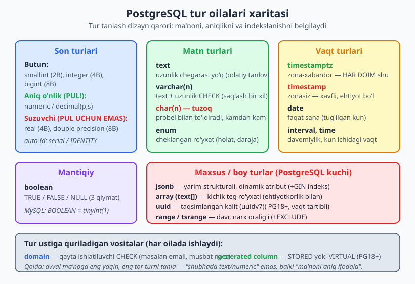
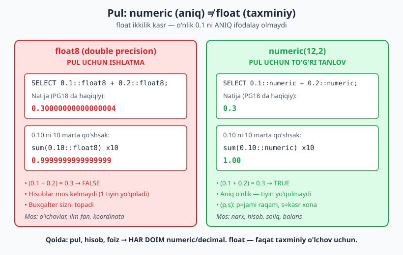
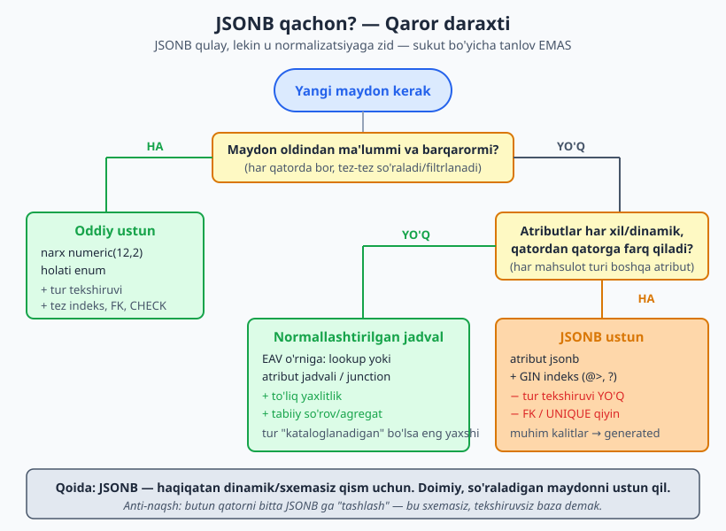

# 10 — To'g'ri ma'lumot turini tanlash (PostgreSQL boy turlari)

[⬅️ Oldingi: 09 — Logik modeldan fizik sxemaga](./09-logik-fizik-sxema.md) · [🏠 README](./README.md) · [Keyingi: 11 — Yaxlitlik va constraint dizayni ➡️](./11-constraint-dizayni.md)

> **Bu bobda:** ustunga tur tanlash — bu shunchaki "raqammi yo matnmi" emas, balki DIZAYN qarori. Noto'g'ri tur bug, sekinlik va joy isrofiga olib keladi. Pulni nega float'da saqlash mumkin emasligini (haqiqiy 0.1+0.2 xatosi bilan), `timestamptz` nega `timestamp` dan ustunligini, JSONB qachon dono va qachon tuzoq ekanini, array/enum/range/uuid/domain/generated column'larni qachon ishlatishni — hammasini PostgreSQL 18 da haqiqatan ishga tushirib ko'rsatamiz.

---

## 0. Tur tanlash — bu dizayn qaror, sintaksis emas

[09-bobda](./09-logik-fizik-sxema.md) logik modelni fizik PostgreSQL sxemasiga o'tkazdik va tur tanlashga kirish qildik. Endi har bir ustun turini ATAYLAB tanlashni o'rganamiz.

`CREATE TABLE` yozish oson. Lekin har `column_name <type>` qatorida siz aslida to'rtta narsani bir vaqtda hal qilasiz:

1. **Ma'no** — bu ustun nimani anglatadi? (`narx` pul, `created_at` lahza, `is_active` mantiq)
2. **Yaxlitlik** — qanday qiymatlar JOIZ? (`age >= 0`, email shaklida, faqat 5 ta holatdan biri)
3. **Aniqlik** — qiymat ANIQ saqlanadimi yoki taxminanmi? (pulda 1 tiyin ham muhim)
4. **Performans** — bu ustun bo'yicha qanday indeks/so'rov ishlaydi? (numeric tez taqqoslanadi, JSONB GIN talab qiladi)

Yomon tur tanlash narxi:

- **Bug:** pulni `float`da saqlasangiz, hisob-kitob 1 tiyinga adashadi (pastda haqiqiy misol).
- **Sekinlik:** sanani `text`da (`'2026-06-13'`) saqlasangiz, oraliq so'rovi va indeks ishlamaydi.
- **Joy isrofi:** har qatorda `bigint` o'rniga... aksincha, `int` yetarli bo'lsa-yu `bigint` qo'ysangiz — har qatorda 4 bayt ortiqcha.
- **Yaxlitlik teshigi:** holatni erkin `text`da saqlasangiz, `'tolangan'`, `'Tolangan'`, `'paid'` — uchchovi bir jadvalda yashaydi.



> **Oltin qoida:** *ma'noga eng yaqin, eng tor turni tanla.* "Shubhada bo'lsa `text`/`numeric` qo'yaman" emas — balki "bu maydon haqiqatan nimani ifodalaydi?" deb so'ra. To'g'ri tur — bu bepul yaxlitlik va bepul hujjat.

Bu bob PostgreSQL 18 ga qaratilgan. Boshqa bazalardagi muhim farqlarni kerakli joyda **"MySQL'da:"** izohi bilan beramiz.

---

## 1. Son turlari: numeric vs float — eng qimmat xato

### 1.1 Pulni nega float'da SAQLAB BO'LMAYDI

`float` (PostgreSQL'da `real` = 4 bayt, `double precision`/`float8` = 8 bayt) — bu **ikkilik suzuvchi nuqta** turi. U IEEE 754 standartiga ko'ra sonni ikkilik kasr sifatida saqlaydi. Muammo shundaki, `0.1` kabi oddiy o'nlik kasr ikkilikda ANIQ ifodalanmaydi — xuddi `1/3` ni o'nlikda `0.333...` deb cheksiz yozganimizdek.

Bu nazariy emas. PostgreSQL 18 da haqiqatan ishga tushirdik:

```sql
SELECT 0.1::float8 + 0.2::float8        AS float_yigindi,
       (0.1::float8 + 0.2::float8) = 0.3 AS float_teng_mi;
```

```text
    float_yigindi    | float_teng_mi
---------------------+---------------
 0.30000000000000004 | f
```

`0.1 + 0.2` `0.3` ga **teng emas** — natija `0.30000000000000004`. Endi tasavvur qiling: do'kon savatida 10 ta mahsulot, har biri `0.10` so'm. Float bilan jamlasak:

```sql
SELECT sum(x)::float8 AS float_sum
FROM (SELECT 0.10::float8 AS x FROM generate_series(1,10)) t;
```

```text
     float_sum
--------------------
 0.9999999999999999
```

Kutilgan `1.00` o'rniga `0.9999999999999999`. Yetarlicha tranzaksiyadan keyin balansingiz tiyinlarga adashadi va buxgalter sizni topadi. Bu klassik "float'da pul" anti-naqshi (13-bobda yana ko'ramiz).

### 1.2 numeric — aniq o'nlik

`numeric(p, s)` (sinonimi `decimal`) — bu **aniq o'nlik** turi. `p` (precision) — jami muhim raqamlar soni, `s` (scale) — kasr xonalari soni. Pul uchun odatda `numeric(p, 2)`.

```sql
SELECT 0.1::numeric + 0.2::numeric        AS numeric_yigindi,
       (0.1::numeric + 0.2::numeric) = 0.3 AS numeric_teng_mi;
```

```text
 numeric_yigindi | numeric_teng_mi
-----------------+-----------------
             0.3 | t
```

Aynan `0.3`, va `= 0.3` rost. O'sha 10 ta `0.10` ni jamlasak:

```sql
SELECT sum(x)::numeric AS numeric_sum
FROM (SELECT 0.10::numeric(12,2) AS x FROM generate_series(1,10)) t;
```

```text
 numeric_sum
-------------
        1.00
```

Aniq `1.00`. `numeric` ustun saqlashda berilgan masshtabga yaxlitlanadi:

```sql
SELECT 12.349::numeric(12,2) AS yaxlitlangan, 12.344::numeric(12,2) AS pastga;
```

```text
 yaxlitlangan | pastga
--------------+--------
        12.35 |  12.34
```



> **Qaror qoidasi:** narx, balans, soliq, foiz, har qanday pul yoki "aniq bo'lishi shart" son → **`numeric`/`decimal`**. `float`/`real` ni faqat *taxminiy* o'lchovlar uchun ishlat: sensor o'qishi, geo-koordinata, ilmiy hisob, ML xususiyatlari. Ularda bir milliarddan bir xato muhim emas, lekin tezlik va joy muhim.
>
> **MySQL'da:** xuddi shu — `DECIMAL(p,s)` pul uchun, `FLOAT`/`DOUBLE` taxminiy uchun. Tamoyil bir xil.

### 1.3 Butun son turlari: smallint / integer / bigint

Butun sonlar uchun uchta o'lcham bor. Diapazonni va baytni PG18 tasdiqladi:

```sql
SELECT pg_column_size(1::smallint) AS smallint_bayt,
       pg_column_size(1::int)      AS int_bayt,
       pg_column_size(1::bigint)   AS bigint_bayt;
```

```text
 smallint_bayt | int_bayt | bigint_bayt
---------------+----------+-------------
             2 |        4 |           8
```

| Tur | Bayt | Diapazon | Qachon |
|-----|------|----------|--------|
| `smallint` | 2 | -32 768 ... 32 767 | yosh, yil, mayda hisoblagich, enum-kod |
| `integer` (`int`) | 4 | ~ -2.1 mlrd ... 2.1 mlrd | odatiy tanlov: ko'pchilik ID, miqdor |
| `bigint` | 8 | ~ -9.2e18 ... 9.2e18 | katta ID-ketma-ketlik, baytlar, vaqt belgisi |

**Dizayn maslahati:** auto-o'suvchi PRIMARY KEY uchun ko'p loyihalarda `bigint` (`bigint GENERATED ALWAYS AS IDENTITY`) standart bo'lib qoldi — chunki tabiat qonuni: muvaffaqiyatli loyiha `int` chegarasiga (2.1 mlrd) yetib qoladi, keyin uni `bigint`ga o'tkazish katta jadvalda og'riqli migratsiya (23-bobga qarang). 8 bayt arzon, kechiktirilgan migratsiya qimmat. Kalit dizayni haqida [06-bobga](./06-kalit-dizayni.md) qarang.

> **MySQL'da:** `TINYINT`/`SMALLINT`/`MEDIUMINT`/`INT`/`BIGINT` bor va `UNSIGNED` varianti ham bor. PostgreSQL'da `UNSIGNED` yo'q — o'rniga `CHECK (x >= 0)` yoki domen ishlatiladi (1.x bo'limida domen).

---

## 2. Matn turlari: text vs varchar(n) vs char(n)

### 2.1 PostgreSQL'da text va varchar(n) deyarli bir xil

Ko'p dasturchi MySQL odatidan kelib, "qancha belgi kerak?" deb o'ylab `varchar(255)` yozadi. PostgreSQL'da bu deyarli ma'nosiz: `text` va `varchar(n)` **bir xil ichki saqlash** mexanizmiga ega (variable-length, TOAST). `varchar(n)` shunchaki `text` + `length(value) <= n` CHECK qoidasi.

```sql
CREATE TABLE t_test (a text, b varchar(100), c char(10));
INSERT INTO t_test VALUES ('salom', 'salom', 'salom');

SELECT pg_column_size(a) AS text_bayt, pg_column_size(b) AS varchar_bayt
FROM t_test;
```

```text
 text_bayt | varchar_bayt
-----------+--------------
         6 |            6
```

Bir xil 6 bayt. Demak `varchar(n)` ni faqat haqiqatan **biznes chegarasi** bo'lsa ishlating ("telefon raqami 20 belgidan oshmaydi") — chegarani ifodalash uchun, performans uchun emas. Aks holda oddiy `text` qo'ying; chegara keyin kerak bo'lsa, `CHECK` qo'shasiz (va `varchar(n)` ni kattalashtirish PG18 da metadata-only, lekin kichraytirish jadvalni qayta tekshiradi).

### 2.2 char(n) — tuzoq, deyarli hech qachon kerak emas

`char(n)` (`character(n)`) — bu *qat'iy uzunlikdagi, probel bilan to'ldirilgan* tur. Aynan shu to'ldirish tuzoq tug'diradi:

```sql
INSERT INTO t_test VALUES ('salom', 'salom', 'salom');
SELECT (c = 'salom') AS char_teng, (a = 'salom     ') AS text_teng FROM t_test;
```

```text
 char_teng | text_teng
-----------+-----------
 t         | f
```

`char(10)` ustunidagi `'salom'` `'salom'` ga **teng** (oxiridagi probellar taqqoslashda e'tiborga olinmaydi), lekin `text` ustunidagi `'salom'` `'salom     '` ga **teng emas** (probellar muhim). Bu nomuvofiqlik foydalanuvchini chalg'itadi, dasturda kutilmagan bug tug'diradi va `char(n)` saqlashda joy ham tejamaydi. **Maslahat:** `char(n)` ni ishlatmang. ISO mamlakat kodi (`'UZ'`) kabi haqiqatan qat'iy uzunlikli narsada ham `text` + `CHECK (length(x) = 2)` ishonchli va kutilgan tarzda ishlaydi.

> **MySQL'da:** `VARCHAR(n)` da `n` haqiqatan o'lchamga ta'sir qiladi (indeks prefiks chegarasi, in-row saqlash) — shuning uchun MySQL'dan kelganlar `varchar(n)` ga ko'proq e'tibor berishadi. PostgreSQL'da bu odatni unutish mumkin.

---

## 3. Vaqt turlari: timestamptz vs timestamp — har doim timestamptz

Bu — eng ko'p uchraydigan, lekin eng kech sezilgan xato. Ikki tur o'xshash ko'rinadi:

- `timestamp` (`timestamp without time zone`) — "soat 12:00", lekin *qaysi shaharning* 12:00 ekani yozilmaydi. Bu "naive" lahza.
- `timestamptz` (`timestamp with time zone`) — aniq lahzani ichida **UTC** sifatida saqlaydi va o'qiyotgan sessiyaning vaqt mintaqasiga avtomatik o'giradi.

Farqni PG18 da ko'rsatamiz. Bir xil qiymatni Toshkent zonasida saqlab, keyin boshqa zonada o'qiymiz:

```sql
SET timezone = 'Asia/Tashkent';

CREATE TABLE hodisa (id int, tz timestamptz, notz timestamp);
INSERT INTO hodisa VALUES (1, '2026-06-13 12:00:00+00', '2026-06-13 12:00:00');

SELECT tz AS tz_tashkentda, notz AS notz_ozgarmas FROM hodisa;
```

```text
     tz_tashkentda      |    notz_ozgarmas
------------------------+---------------------
 2026-06-13 17:00:00+05 | 2026-06-13 12:00:00
```

Endi New York zonasiga o'tib, AYNI o'sha qatorni o'qiymiz:

```sql
SET timezone = 'America/New_York';
SELECT tz AS tz_newyorkda, notz AS notz_ozgarmas FROM hodisa;
```

```text
      tz_newyorkda      |    notz_ozgarmas
------------------------+---------------------
 2026-06-13 08:00:00-04 | 2026-06-13 12:00:00
```

E'tibor bering:

- **`timestamptz`** bir xil lahzani ko'rsatadi: Toshkentda `17:00 (+05)`, New Yorkda `08:00 (-04)` — ikkalasi ham aynan UTC `12:00`. Tur "qaysi lahza" ekanini biladi.
- **`timestamp`** har doim `12:00` — lekin bu *qaysi* shaharning 12:00 si? Hech kim bilmaydi. Yer yuzida foydalanuvchilar bo'lsa, bu ma'lumot buzuq.

> **Qaror qoidasi:** lahzani (hodisa qachon yuz berdi: `created_at`, `paid_at`, `logged_in_at`) saqlasangiz — **HAR DOIM `timestamptz`**. Bu sukut bo'yicha tanlovingiz bo'lsin. `timestamp` (zonasiz) ni faqat zona ataylab ma'nosiz bo'lganda ishlating: masalan "har kuni mahalliy soat 09:00 da budilnik" yoki sof matematik vaqt.

Boshqa vaqt turlari:

- **`date`** — faqat sana, soatsiz: tug'ilgan kun, hisobot kuni, ta'til sanasi.
- **`time`** — kun ichidagi vaqt, sanasiz: do'kon ochilish vaqti.
- **`interval`** — davomiylik: `'2 days 3 hours'`, `'90 minutes'`. Ikki `timestamptz` ayirmasi `interval` beradi.

> **MySQL'da:** `DATETIME` (zonasiz, `timestamp`ga o'xshash) va `TIMESTAMP` (UTC saqlaydi, lekin diapazoni 2038 gacha cheklangan va sessiya zonasiga bog'liq). MySQL'da xulq boshqacha va chalkash — PostgreSQL'ning `timestamptz` modeli ancha tiniq. Qaysi bazada bo'lsangiz ham, "UTC saqla, ko'rsatishda o'gir" tamoyiliga amal qiling.

---

## 4. boolean — uch qiymatli mantiq

`boolean` `TRUE`, `FALSE` va... `NULL` qiymatlarini oladi. Bu uch qiymat haqida [05-bobda](./05-relyatsion-model.md) gapirgandik — `NULL` "noma'lum" degani. `is_active boolean NOT NULL DEFAULT true` deb yozsangiz, ikki qiymatga majburlaysiz; `NULL`ga ruxsat bersangiz, "ha/yo'q/noma'lum" uchligini modellaysiz (masalan so'rovnomada javob berilmagan).

```sql
CREATE TABLE buyurtma (id int PRIMARY KEY, tolangan boolean NOT NULL DEFAULT false);
```

> **Maslahat:** boolean ustun nomini ijobiy va "ha/yo'q"li qiling: `is_active`, `tolangan`, `tasdiqlangan`. `is_not_disabled` kabi qo'sh-inkor nomdan qoching — kod o'qishni qiyinlashtiradi.
>
> **MySQL'da:** alohida `BOOLEAN` turi YO'Q — u `TINYINT(1)` ning sinonimi. `0`/`1` saqlanadi va siz osongina `tolangan = 5` kabi noto'g'ri qiymat kiritib qo'yishingiz mumkin. PostgreSQL `boolean`i haqiqiy va qat'iy.

---

## 5. enum vs lookup-jadval — cheklangan ro'yxat trade-off'i

Ko'p ustunlar faqat oldindan ma'lum qiymatlar to'plamidan birini oladi: buyurtma holati, foydalanuvchi roli, to'lov usuli. Buni modellashning ikki yo'li bor.

### 5.1 PostgreSQL ENUM turi

```sql
CREATE TYPE buyurtma_holati AS ENUM ('yangi','tolangan','jonatildi','yetkazildi','bekor');
CREATE TABLE buyurtma (id int PRIMARY KEY,
                       holati buyurtma_holati NOT NULL DEFAULT 'yangi');
INSERT INTO buyurtma (id, holati) VALUES (1,'tolangan'),(2,'yangi');

SELECT id, holati FROM buyurtma ORDER BY holati;
```

```text
 id |  holati
----+----------
  2 | yangi
  1 | tolangan
```

Diqqat: `ORDER BY holati` alfavit emas, **e'lon tartibi** bo'yicha saralaydi (`yangi` < `tolangan`). Bu enum'ning yaxshi xususiyati — "holat oqimi" tabiiy tartiblanadi.

ENUM **afzalliklari:** ixcham (ichida kichik son sifatida saqlanadi), o'qish oson, tartibli, ustunda darhol yaxlitlik (noto'g'ri qiymat rad etiladi). **Kamchiliklari:** yangi qiymat qo'shish `ALTER TYPE ... ADD VALUE` talab qiladi (bu yengil, lekin migratsiya); qiymatni **o'chirish/qayta nomlash qiyin**; har bir enum qiymatiga qo'shimcha metadata (tavsif, tartib raqami, rang) biriktirib bo'lmaydi.

### 5.2 Lookup (ma'lumotnoma) jadval

```sql
CREATE TABLE buyurtma_holati_turi (
    kod    text PRIMARY KEY,         -- 'yangi', 'tolangan', ...
    nomi   text NOT NULL,            -- ko'rsatish uchun "Yangi buyurtma"
    tartib smallint NOT NULL         -- oqimdagi o'rni
);

CREATE TABLE buyurtma2 (
    id     int PRIMARY KEY,
    holati text NOT NULL REFERENCES buyurtma_holati_turi(kod)
);
```

Lookup jadval **afzalliklari:** yangi holat — oddiy `INSERT` (DDL/migratsiya kerak emas, hatto runtime'da admin qo'shadi); har holatga metadata biriktirsa bo'ladi (tavsif, tartib, rang, faollik); boshqa jadvallar ham unga FK qo'yishi mumkin. **Kamchiliklari:** har so'rovda JOIN; nomli kod (`text`) o'rniga raqamli ID ishlatsangiz so'rov o'qishi murakkablashadi.

| Mezon | ENUM | Lookup jadval |
|-------|------|---------------|
| Qiymatlar barqaror, kamdan-kam o'zgaradi | ✅ enum yaxshi | ortiqcha |
| Qiymatlar tez-tez qo'shiladi/o'zgaradi | ALTER kerak | ✅ INSERT |
| Har qiymatga metadata kerak (tavsif, rang) | ❌ yo'q | ✅ ustun qo'sh |
| Runtime'da admin boshqaradi | ❌ | ✅ |
| Eng ixcham saqlash / JOIN'siz | ✅ | JOIN kerak |

> **Qaror qoidasi:** kichik, deyarli o'zgarmas, "kod ichidagi" to'plam (masalan `boolean`dan biroz kengroq holat) → **enum**. Foydalanuvchi/admin boshqaradigan, metadata kerak, kengayib boruvchi to'plam → **lookup jadval**. Ikkilanaganda lookup jadval xavfsizroq tanlov, chunki kelajakda kengaytirish oson. (12-bobda holat modellashtirishni chuqurroq ko'ramiz.)
>
> **MySQL'da:** `ENUM('a','b','c')` ustun turi sifatida bor (PostgreSQL'da alohida TYPE), lekin u o'zgartirish qiyin va ko'chirishda muammoli — MySQL hamjamiyatida ko'pchilik lookup jadvalni afzal ko'radi.

---

## 6. JSONB — qachon dono, qachon tuzoq

`jsonb` — PostgreSQL'ning eng kuchli va eng ko'p suiiste'mol qilinadigan turi. U JSON hujjatni ikkilik, indekslanadigan shaklda saqlaydi. (`json` turi ham bor — u xom matn saqlaydi, deyarli har doim `jsonb` afzal: tezroq so'raladi, indekslanadi, ortiqcha probel/dublikat kalitni tozalaydi.)

### 6.1 JSONB qachon o'rinli — dinamik atributlar

To'g'ri ishlatilganda JSONB ajoyib: **har qatorda har xil bo'ladigan**, oldindan to'liq noma'lum atributlar uchun. Klassik misol — turli mahsulot toifalari (telefonning xotirasi bor, kitobning muallifi bor, stulning materiali bor):

```sql
CREATE TABLE mahsulot (
    id      int PRIMARY KEY,
    nom     text NOT NULL,
    narx    numeric(12,2) NOT NULL,    -- DOIMIY maydon -> oddiy ustun
    atribut jsonb NOT NULL DEFAULT '{}' -- DINAMIK qism -> JSONB
);
INSERT INTO mahsulot VALUES
  (1, 'Telefon', 4500000, '{"rang":"qora","xotira_gb":256,"5g":true}'),
  (2, 'Kitob',     85000, '{"muallif":"Oqil","sahifa":320}'),
  (3, 'Stul',     350000, '{"material":"yog och","rang":"jigarrang"}');
```

Diqqat: `narx` — har mahsulotda bor, doim so'raladi, shuning uchun u **oddiy `numeric` ustun**. Faqat *o'zgaruvchan* qism JSONB'ga ketdi.

JSONB so'rovlari:

```sql
-- @> containment: 256 GB xotirali mahsulotlar
SELECT id, nom FROM mahsulot WHERE atribut @> '{"xotira_gb":256}';
```

```text
 id |   nom
----+---------
  1 | Telefon
```

```sql
-- ->> operatori: qiymatni matn sifatida; ? operatori: kalit bor-yo'qligi
SELECT nom, atribut->>'rang' AS rang FROM mahsulot WHERE atribut ? 'rang';
```

```text
   nom   |   rang
---------+-----------
 Telefon | qora
 Stul    | jigarrang
```

### 6.2 JSONB'ni indekslash — GIN

JSONB ustunni filtrlash katta jadvalda sekin (har qatorni ochish kerak). Yechim — **GIN indeks**:

```sql
CREATE INDEX idx_mahsulot_atribut ON mahsulot USING gin (atribut);

EXPLAIN (COSTS off) SELECT id FROM mahsulot WHERE atribut @> '{"5g":true}';
```

```text
                       QUERY PLAN
--------------------------------------------------------
 Bitmap Heap Scan on mahsulot
   Recheck Cond: (atribut @> '{"5g": true}'::jsonb)
   ->  Bitmap Index Scan on idx_mahsulot_atribut
         Index Cond: (atribut @> '{"5g": true}'::jsonb)
```

So'rov rejasi **`Bitmap Index Scan on idx_mahsulot_atribut`** ni ko'rsatadi — GIN indeks `@>` (containment) so'rovini tezlashtirdi. GIN `@>`, `?`, `?|`, `?&` operatorlarini qo'llab-quvvatlaydi. (Indeks turlari haqida [14-bobga](./14-indeks-strategiyasi.md) qarang.)

> **Eslatma:** bu reja jadval **yetarlicha katta** bo'lganda chiqadi. Bizning misoldagidek bir necha qatorli jadvalda planner indeksni e'tiborsiz qoldirib, baribir `Seq Scan` tanlashi mumkin — kichik jadvalni to'liq o'qish indeksdan ham arzon. GIN'ning haqiqiy foydasi minglab qatorda ko'rinadi (buni [14-bobda](./14-indeks-strategiyasi.md) 100 mingdan ortiq qatorli jadvalda aniq o'lchaymiz).

Agar bitta aniq kalit doim so'ralsa va siz uni indekslamoqchi/cheklab qo'ymoqchi bo'lsangiz — uni JSONB'dan **generated column** sifatida tashqariga chiqaring (7-bo'limga qarang).

### 6.3 JSONB xavfi — nega sukut bo'yicha tanlov EMAS



JSONB qulaylik bilan birga jiddiy narx oladi:

- **Tur tekshiruvi yo'q.** `{"narx": "behisob"}` ham, `{"narx": -5}` ham bemalol kiradi. Baza sizni himoya qilmaydi.
- **Yaxlitlik yo'q.** JSONB ichidagi qiymatga `FOREIGN KEY` yoki `UNIQUE` qo'yish qiyin va g'ayritabiiy.
- **Normalizatsiyaga zid.** Bir xil qiymat (`"rang":"qora"`) minglab qatorda takrorlanadi — bu denormalizatsiya. Uni yangilash, agregatlash qiyin.
- **So'rov noqulay.** `atribut->>'narx'` har doim matn qaytaradi; raqam sifatida ishlatish uchun har joyda `cast` kerak.

> **Qaror qoidasi (qaror daraxtidan):**
> 1. Maydon **oldindan ma'lum va barqaror** (har qatorda bor, tez-tez filtrlanadi)? → **oddiy ustun** (`numeric`, `enum`, `timestamptz`). Tur, FK, CHECK, indeks bepul.
> 2. Atributlar **haqiqatan har xil va dinamik** (mahsulot toifasiga qarab boshqa)? → **JSONB** + GIN indeks, muhim kalitlarni generated column qil.
> 3. Atributlar cheklangan, "kataloglanadigan" to'plam? → **normallashtirilgan jadval** (lookup/atribut jadvali) — EAV anti-naqshidan saqlanib (13-bob).
>
> **Eng katta anti-naqsh:** butun qatorni bitta JSONB `data` ustuniga "tashlash" — bu sxemasiz, tekshiruvsiz bazaga aylantirish. JSONB — *qo'shimcha*, asos emas.
>
> **MySQL'da:** `JSON` turi bor (MySQL 5.7+), lekin u PostgreSQL'ning `jsonb` siga tengdek emas — generated column + indeks orqali indekslanadi, GIN'ga o'xshash to'g'ridan-to'g'ri operator indeksi yo'q. Tamoyil bir xil: dinamik qism uchun, asos uchun emas.

---

## 7. generated column — STORED va PG18 VIRTUAL

**Generated column** — qiymati boshqa ustunlardan IFODA orqali avtomatik hisoblanadigan ustun. Siz unga yoza olmaysiz; baza o'zi hisoblaydi. Bu denormalizatsiyaning *eng xavfsiz* shakli, chunki qiymat hech qachon "drift" qilmaydi (manba bilan nomuvofiq bo'lib qolmaydi).

### 7.1 STORED — diskda saqlanadi

```sql
CREATE TABLE buyurtma_qatori (
    id          int PRIMARY KEY,
    miqdor      int NOT NULL,
    birlik_narx numeric(12,2) NOT NULL,
    jami        numeric(12,2) GENERATED ALWAYS AS (miqdor * birlik_narx) STORED
);
INSERT INTO buyurtma_qatori (id, miqdor, birlik_narx) VALUES (1, 3, 2500.00), (2, 10, 99.90);
SELECT id, miqdor, birlik_narx, jami FROM buyurtma_qatori;
```

```text
 id | miqdor | birlik_narx |  jami
----+--------+-------------+---------
  1 |      3 |     2500.00 | 7500.00
  2 |     10 |       99.90 |  999.00
```

`jami` o'zi hisoblandi (`3 * 2500 = 7500`). STORED qiymat diskda saqlanadi — o'qish tez, indekslab bo'ladi, lekin joy egallaydi va yozishda hisoblanadi.

### 7.2 VIRTUAL — hisoblab beriladi (PostgreSQL 18+)

PostgreSQL 18 dan boshlab **VIRTUAL** generated column ham bor: qiymat diskda saqlanmaydi, o'qishda hisoblab beriladi. Joy tejaydi, yozish arzon — lekin har o'qishda hisoblanadi va (hozircha) to'g'ridan-to'g'ri indekslab bo'lmaydi. PG18 (port 5434) da haqiqatan tasdiqladik:

```sql
-- VIRTUAL generated column (PostgreSQL 18+)
CREATE TABLE inson (
    id        int PRIMARY KEY,
    ism       text NOT NULL,
    familiya  text NOT NULL,
    toliq_ism text GENERATED ALWAYS AS (ism || ' ' || familiya) VIRTUAL
);
INSERT INTO inson (id, ism, familiya) VALUES (1, 'Oqil', 'Imomnazarov');
SELECT id, toliq_ism FROM inson;
```

```text
 id |    toliq_ism
----+------------------
  1 | Oqil Imomnazarov
```

`VIRTUAL` ishladi — `toliq_ism` ustuni saqlanmagani holda hisoblab berildi.

> **STORED vs VIRTUAL qaror qoidasi:** ifoda qimmat va tez-tez o'qiladi yoki indekslanishi kerak bo'lsa → **STORED** (hisobni bir marta yozishda qil). Ifoda arzon, joy muhim, kamdan-kam o'qiladi → **VIRTUAL** (PG18+). To'liq ism, formatlash kabi yengil narsalar uchun VIRTUAL mukammal.

### 7.3 JSONB kalitini ustunga chiqarish

Generated column JSONB'dagi muhim kalitni "haqiqiy ustun" qilib, indekslash/cheklash imkonini beradi:

```sql
CREATE TABLE hujjat (
  id      int PRIMARY KEY,
  data    jsonb NOT NULL,
  muallif text GENERATED ALWAYS AS (data->>'muallif') STORED
);
INSERT INTO hujjat (id, data) VALUES (1, '{"muallif":"Oqil","yil":2026}');
SELECT id, muallif FROM hujjat;
```

```text
 id | muallif
----+---------
  1 | Oqil
```

Endi `muallif` ustuniga oddiy B-tree indeks qo'yib, JSONB'dagi qiymatni tez filtrlash mumkin — JSONB qulayligi + ustun tezligi.

> **MySQL'da:** generated column bor (`GENERATED ALWAYS AS (...) STORED|VIRTUAL`) — MySQL'da VIRTUAL allaqachon bor edi. PostgreSQL'ga VIRTUAL faqat 18-versiyada qo'shildi.

---

## 8. array, range, uuid — yana uchta boy tur

### 8.1 array — qachon o'rinli, qachon normalizatsiyaga zid

PostgreSQL ustunda massiv saqlay oladi (`text[]`, `int[]`). Bu **kichik, tartibi muhim bo'lishi mumkin, alohida so'rov/FK talab qilmaydigan** ro'yxat uchun mos — masalan maqola teglari:

```sql
CREATE TABLE maqola (
    id       int PRIMARY KEY,
    sarlavha text NOT NULL,
    teglar   text[] NOT NULL DEFAULT '{}'
);
INSERT INTO maqola VALUES
  (1,'PostgreSQL 18 yangiliklari', ARRAY['postgresql','baza','sql']),
  (2,'Pul turlari',                ARRAY['baza','dizayn']);

-- 'baza' tegi bor maqolalar (@> containment)
SELECT id, sarlavha FROM maqola WHERE teglar @> ARRAY['baza'];
```

```text
 id |          sarlavha
----+----------------------------
  1 | PostgreSQL 18 yangiliklari
  2 | Pul turlari
```

Array ustunni ham GIN bilan indekslash mumkin: `CREATE INDEX ... USING gin (teglar);`

**Lekin ehtiyot bo'ling — array ko'pincha normalizatsiyaga zid.** Agar:
- teg/element alohida entity bo'lsa (o'z nomi, tavsifi, soni bor),
- unga FK kerak bo'lsa (`teg` jadvaliga ishora),
- "qaysi teg eng ko'p ishlatilgan?" kabi agregat kerak bo'lsa —

unda bu **N:M bog'lanish** ([04-bobga](./04-boglanish-kardinallik.md) qarang): `maqola`, `teg`, `maqola_teg` (junction) jadvallari. Array — bu denormalizatsiya; faqat ro'yxat haqiqatan "bitta qiymat" kabi ishlaganda o'rinli (masalan rangli rasm RGB qiymatlari, ruxsat bayroqlari).

> **MySQL'da:** mahalliy array turi YO'Q. Odatda JSON massivi yoki junction jadval ishlatiladi. PostgreSQL array — uning o'ziga xos kuchi.

### 8.2 range — oraliqlar va EXCLUDE bilan ustma-ustlikni taqiqlash

`range` turlari (`int4range`, `num2range`, `tsrange`, `tstzrange`, `daterange`) oraliqni bitta qiymat sifatida saqlaydi: narx oralig'i, amal qilish davri, band qilingan vaqt. Eng kuchli qo'llanishi — `EXCLUDE` constraint bilan **ustma-ust tushishni taqiqlash** (masalan bitta xona ikki marta bron qilinmasin):

```sql
CREATE TABLE bron (
    xona int NOT NULL,
    davr tsrange NOT NULL,
    EXCLUDE USING gist (xona WITH =, davr WITH &&)   -- bir xona + ustma-ust davr taqiqlanadi
);
INSERT INTO bron VALUES (101, '[2026-06-13 14:00, 2026-06-13 16:00)');
-- Endi ustma-ust tushadigan bron:
INSERT INTO bron VALUES (101, '[2026-06-13 15:00, 2026-06-13 17:00)');
```

Ikkinchi `INSERT` PG18 da rad etildi:

```text
ERROR:  conflicting key value violates exclusion constraint "bron_xona_davr_excl"
DETAIL:  Key (xona, davr)=(101, ["2026-06-13 15:00:00","2026-06-13 17:00:00")) conflicts
         with existing key (xona, davr)=(101, ["2026-06-13 14:00:00","2026-06-13 16:00:00")).
```

Baza darajasida, dastur kodisiz, ikki bron 15:00–16:00 da ustma-ust kelishi taqiqlandi. (EXCLUDE constraint'ni [11-bobda](./11-constraint-dizayni.md) chuqurroq ko'ramiz.)

### 8.3 uuid — taqsimlangan kalit

`uuid` — 128-bitli universal noyob identifikator. Taqsimlangan tizimda (bir nechta server bir jadvalga yozadi, yoki ID'ni mijoz/oflayn yaratadi) auto-increment ID'ga qarshi tabiiy yechim. PostgreSQL 18 da **vaqt-tartibli `uuidv7()`** funksiyasi bor (oldingi `uuidv4()` tasodifiy edi — indeksda yomon joylashardi):

```sql
SELECT uuidv7() IS NOT NULL AS uuidv7_ishlaydi;
```

```text
 uuidv7_ishlaydi
-----------------
 t
```

`uuidv7()` ichida vaqt belgisi borligi uchun yangi qatorlar indeksning oxiriga tartibli tushadi — `uuidv4()` ning tasodifiy tarqalishidan kelib chiqadigan indeks shishishi muammosini hal qiladi. Kalit turlari (UUID v4 vs v7) haqida [06-bobga](./06-kalit-dizayni.md) qarang.

> **MySQL'da:** mahalliy `UUID` ustun turi yo'q — odatda `BINARY(16)` da saqlanadi, `UUID()` funksiyasi v1 beradi. PostgreSQL'da `uuid` haqiqiy tur.

---

## 9. domain — qayta ishlatiluvchi CHECK

`DOMAIN` — bu bazaviy tur + ko'p marta ishlatiladigan CHECK qoidasi(lari)ni bitta nomlangan turga "o'rab" qo'yish. Bir CHECK qoidasi loyihada o'nlab ustunda kerak bo'lsa (email, musbat narx, mamlakat kodi) — uni har joyda qaytarib yozish o'rniga, bir marta domen sifatida e'lon qiling.

```sql
CREATE DOMAIN email AS text
  CHECK (VALUE ~ '^[^@\s]+@[^@\s]+\.[^@\s]+$');

CREATE TABLE foydalanuvchi (
    id     int PRIMARY KEY,
    pochta email NOT NULL          -- text emas, "email" domeni
);
INSERT INTO foydalanuvchi VALUES (1, 'oqil@ioqil.uz');
SELECT * FROM foydalanuvchi;
```

```text
 id |    pochta
----+---------------
  1 | oqil@ioqil.uz
```

Endi domen qoidasini buzadigan qiymat:

```sql
INSERT INTO foydalanuvchi VALUES (2, 'notogri-email');
```

```text
ERROR:  value for domain email violates check constraint "email_check"
```

PG18 noto'g'ri emailni rad etdi. Domenning kuchi: `email` qoidasi `foydalanuvchi.pochta`, `xodim.pochta`, `mijoz.pochta` — hammasida bir xil ishlaydi va qoidani bir joyda o'zgartirsangiz, hamma joyga tatbiq bo'ladi. Bu yaxlitlikni markazlashtiradi va kodni quruq (DRY) qiladi.

> **Qaror qoidasi:** bir xil tekshiruv ikki yoki undan ko'p ustunda takrorlansa → domen. Faqat bitta ustunda bo'lsa → oddiy `CHECK` yetarli. (Constraint dizaynini [11-bobda](./11-constraint-dizayni.md) to'liq ko'ramiz.)
>
> **MySQL'da:** `CREATE DOMAIN` YO'Q. Har ustunda `CHECK` ni qaytarib yozish yoki ilova/trigger'da tekshirish kerak. PostgreSQL domeni — toza dizayn vositasi.

---

## 10. Xulosa — tur tanlash cheat-sheet

| Maqsad | To'g'ri tur | Qochish kerak |
|--------|-------------|---------------|
| Pul, narx, balans, foiz | `numeric(p,2)` | ❌ `float`/`real`/`money` |
| Taxminiy o'lchov, koordinata | `real`/`double precision` | numeric (sekin, ortiqcha) |
| ID, miqdor (kichik-o'rta) | `integer`, kalitda `bigint` | matn ID |
| Lahza (hodisa qachon) | `timestamptz` | ❌ `timestamp`, `text` sana |
| Faqat sana | `date` | `timestamptz` (soat ortiqcha) |
| Ha/yo'q | `boolean` | `int 0/1`, `char 'Y'/'N'` |
| Kichik barqaror to'plam | `enum` | erkin `text` |
| Kengayuvchi/metadatali to'plam | lookup jadval + FK | enum |
| Dinamik, har xil atribut | `jsonb` + GIN | butun qatorni JSONB'ga tashlash |
| Doimiy so'raladigan maydon | oddiy ustun | JSONB ichida saqlash |
| Hisoblangan qiymat | generated `STORED`/`VIRTUAL` | qo'lda hisoblab, drift xavfi |
| Kichik element ro'yxati | `text[]` (ehtiyotkorlik) | entity bo'lsa — junction jadval |
| Oraliq, ustma-ustlikni taqiqlash | `range` + EXCLUDE | ikki ustun (start/end) + kod tekshiruvi |
| Taqsimlangan/mijoz kaliti | `uuid` (`uuidv7()` PG18+) | tasodifiy `uuidv4` (indeks shishadi) |
| Takrorlanuvchi tekshiruv | `DOMAIN` | har ustunda CHECK takrori |

Eng muhim uchta xulosa: **(1)** pul → har doim `numeric`; **(2)** lahza → har doim `timestamptz`; **(3)** JSONB — faqat haqiqatan dinamik qism uchun, sukut bo'yicha tanlov emas.

---

## Mashqlar

### Oson

1. **Pul ustuni.** `tovar` jadvalida narxni saqlash uchun ustun e'lon qiling. So'm tiyinsiz (butun) bo'lsa ham, ertaga aksiyada `99.90` kerak bo'lishi mumkin. Qaysi tur va nega? Bir qatorlik `CREATE TABLE` yozing.

2. **Sana yoki lahza?** Quyidagi ustunlarning har biri uchun `date`, `timestamptz` yoki `timestamp` dan birini tanlang va sababini bir jumlada yozing: (a) `tugilgan_kun`, (b) `royxatdan_otgan_vaqt`, (c) `kunlik_budilnik_vaqti`.

3. **boolean nomi.** `is_not_inactive boolean` ustuni berilgan. Nega bu yomon nom? To'g'ri nom taklif qiling.

4. **char tuzog'i.** Hamkasbingiz mamlakat kodini `char(2)` da saqlamoqchi. Bunda qanday taqqoslash tuzog'i bor? `text` bilan qanday muqobil yozasiz (CHECK bilan)?

### O'rta

5. **Xato turni top.** Quyidagi jadvalda KAMIDA 4 ta tur xatosini toping va tuzating:
   ```sql
   CREATE TABLE tolov (
       id          varchar(255),
       summa       float,
       tolangan_vaqt timestamp,
       muvaffaqiyatli char(1),     -- 'Y' yoki 'N'
       valyuta      text           -- faqat 'UZS','USD','EUR'
   );
   ```

6. **enum yoki lookup?** Quyidagi ikki holatning har biri uchun enum yoki lookup jadval tanlang va sababini yozing: (a) buyurtma holati (`yangi/tolangan/.../bekor`, kamdan-kam o'zgaradi); (b) blog kategoriyasi (admin istalgan vaqtda yangi kategoriya qo'shadi, har biriga ikona va tavsif kerak).

7. **JSONB yoki ustun?** `foydalanuvchi` jadvali uchun: `email`, `parol_xesh`, `royxat_vaqti` doim bor; lekin "profil sozlamalari" (mavzu, til, bildirishnoma yoqilgan-mi, va kelajakda qo'shiladigan noma'lum sozlamalar) har foydalanuvchida har xil. Qaysi maydonlar oddiy ustun, qaysilari JSONB? `CREATE TABLE` chizing.

8. **Generated column.** `aylanma` jadvalida `miqdor int` va `birlik_narx numeric(12,2)` bor. `jami` ustunini qo'shing — u har doim `miqdor * birlik_narx` ga teng bo'lsin va qo'lda yozib bo'lmasin. STORED yoki VIRTUAL — qaysi va nega?

9. **Domen dizayni.** Loyihada `narx`, `chegirma_narx`, `yetkazish_narxi` ustunlari bor — barchasi musbat pul bo'lishi shart. Bu qoidani har joyda qaytarmasdan qanday markazlashtirasiz? Domen e'lon qiling va bitta ustunda ishlating.

### Qiyin

10. **Bron tizimi.** Mehmonxona xonalarining bronini modellashtiring: bitta xona bir vaqt oralig'ida faqat bitta bronga ega bo'lishi mumkin (ustma-ust bron TAQIQLANGAN). Qaysi tur va qaysi constraint? `CREATE TABLE` yozing va nega ilova kodida emas, bazada tekshirilishini tushuntiring.

11. **Mahsulot katalogi (aralash).** Marketplace'da uch xil mahsulot bor: elektronika (kafolat oyi, quvvat W), kiyim (o'lcham, mato), kitob (muallif, sahifa, ISBN). Hammasida `nom`, `narx`, `ombor_qoldigi` bor. Sxema chizing: qaysi maydonlar barcha mahsulotda umumiy ustun, qaysilari JSONB, va `ISBN` kabi muhim/noyob qiymatni JSONB ichida bo'lsa ham qanday indekslash/UNIQUE qilish mumkin?

12. **uuid kaliti.** Mobil ilova oflayn rejimda yangi yozuvlar yaratadi va keyin serverga sinxronlaydi. Auto-increment `bigint` kalit nega bu yerda muammo? Qaysi turni tanlaysiz va PG18 da qaysi funksiyani DEFAULT qilasiz? Indeks nuqtai nazaridan `uuidv4` va `uuidv7` farqini tushuntiring.

13. **Migratsiya tuzog'i.** Loyiha `tolangan_vaqt timestamp` (zonasiz) bilan 2 yil ishladi; foydalanuvchilar 3 mamlakatda. Endi `timestamptz` ga o'tmoqchisiz. Nima muammo (eski qiymatlar qaysi zonada edi?), va bu xatoni boshidan oldini olish uchun qanday qoida o'rnatasiz?

---

## Yechimlar

<details markdown="1">
<summary>Yechim — 1</summary>

Pul har doim `numeric` (decimal), hech qachon `float`:

```sql
CREATE TABLE tovar (
    id   bigint GENERATED ALWAYS AS IDENTITY PRIMARY KEY,
    narx numeric(12,2) NOT NULL CHECK (narx >= 0)
);
```

`numeric(12,2)` — 2 ta kasr xona (tiyin) ga joy qoldiradi, shuning uchun `99.90` muammosiz saqlanadi. `float` bo'lsa `0.1+0.2` tipidagi yaxlitlash xatosi balansga o'tib ketardi. `CHECK (narx >= 0)` qo'shimcha yaxlitlik beradi.

</details>

<details markdown="1">
<summary>Yechim — 2</summary>

- (a) `tugilgan_kun` → **`date`**. Soat/zona ma'nosiz; tug'ilgan kun — sof kalendar sanasi.
- (b) `royxatdan_otgan_vaqt` → **`timestamptz`**. Bu aniq lahza (hodisa qachon yuz berdi); foydalanuvchilar turli zonada bo'lishi mumkin, UTC saqlab, ko'rsatishda o'girish kerak.
- (c) `kunlik_budilnik_vaqti` → **`time`** (yoki zona ataylab muhim bo'lmasa). Bu kun ichidagi vaqt, aniq sana/lahza emas. Agar "mahalliy 09:00" ma'nosida bo'lsa, `time` to'g'ri; zona-bog'liq lahza emas.

</details>

<details markdown="1">
<summary>Yechim — 3</summary>

`is_not_inactive` — bu **qo'sh inkor**. "Inactive emas" = "active". Kodda `WHERE is_not_inactive = false` yozsangiz, "active emas" degani bo'lib, miyani chalg'itadi va bug tug'diradi.

To'g'ri: `is_active boolean NOT NULL DEFAULT true`. Ijobiy, to'g'ridan-to'g'ri o'qiladi: `WHERE is_active` — "faol bo'lganlar".

</details>

<details markdown="1">
<summary>Yechim — 4</summary>

`char(2)` tuzog'i: oxiridagi probellar taqqoslashda e'tiborga olinmaydi va saqlashda probel bilan to'ldiriladi. `'UZ '` va `'UZ'` "teng" bo'lib chiqishi (yoki aksincha, dasturda kutilmagan probel) chalkashlik tug'diradi. Bobdagi misol: `char` ustunda `c = 'salom'` rost, lekin `text` ustunda `a = 'salom     '` yolg'on — bu nomuvofiqlik.

Muqobil — `text` + qat'iy CHECK:

```sql
CREATE TABLE mamlakat (
    kod  text PRIMARY KEY CHECK (kod ~ '^[A-Z]{2}$'),  -- aniq 2 ta bosh harf
    nomi text NOT NULL
);
```

`CHECK (kod ~ '^[A-Z]{2}$')` aniq ikkita bosh harfni majburlaydi va `text` ning kutilgan, probelsiz taqqoslash xulqini saqlaydi.

</details>

<details markdown="1">
<summary>Yechim — 5</summary>

Beshta tur xatosi va tuzatilgan sxema:

```sql
CREATE TABLE tolov (
    -- 1. id: varchar(255) o'rniga haqiqiy kalit turi
    id            bigint GENERATED ALWAYS AS IDENTITY PRIMARY KEY,
    -- 2. summa: float -> numeric (PUL!)
    summa         numeric(14,2) NOT NULL CHECK (summa >= 0),
    -- 3. tolangan_vaqt: timestamp -> timestamptz (lahza, zonali)
    tolangan_vaqt timestamptz NOT NULL DEFAULT now(),
    -- 4. muvaffaqiyatli: char(1) 'Y'/'N' -> boolean
    muvaffaqiyatli boolean NOT NULL DEFAULT false,
    -- 5. valyuta: erkin text -> cheklangan to'plam (enum yoki CHECK)
    valyuta       text NOT NULL CHECK (valyuta IN ('UZS','USD','EUR'))
);
```

Xatolar: (1) `id varchar(255)` — kalit matn emas, surrogat `bigint` bo'lishi kerak; (2) `float` pul uchun — yaxlitlash xatosi; (3) `timestamp` zonasiz — lahza uchun `timestamptz`; (4) `char(1)` `'Y'/'N'` o'rniga haqiqiy `boolean`; (5) erkin `text` o'rniga `CHECK ... IN (...)` (yoki enum) bilan cheklangan to'plam.

</details>

<details markdown="1">
<summary>Yechim — 6</summary>

- (a) **Buyurtma holati → enum.** Kichik, barqaror, deyarli o'zgarmas to'plam; "kod ichidagi" oqim (yangi → tolangan → ...). Tartiblanishi ham foydali (enum e'lon tartibida saralanadi). Metadata kerak emas.

   ```sql
   CREATE TYPE buyurtma_holati AS ENUM ('yangi','tolangan','jonatildi','yetkazildi','bekor');
   ```

- (b) **Blog kategoriyasi → lookup jadval.** Admin runtime'da yangi kategoriya qo'shadi (DDL/migratsiya kerak emas), va har kategoriyaga ikona/tavsif (metadata) kerak — enum buni qila olmaydi.

   ```sql
   CREATE TABLE kategoriya (
       id    int GENERATED ALWAYS AS IDENTITY PRIMARY KEY,
       slug  text UNIQUE NOT NULL,
       nomi  text NOT NULL,
       ikona text,
       tavsif text
   );
   CREATE TABLE maqola (
       id          bigint GENERATED ALWAYS AS IDENTITY PRIMARY KEY,
       kategoriya_id int NOT NULL REFERENCES kategoriya(id),
       sarlavha    text NOT NULL
   );
   ```

</details>

<details markdown="1">
<summary>Yechim — 7</summary>

Doimiy, har foydalanuvchida bor va so'raladigan maydonlar → oddiy ustun. O'zgaruvchan/kelajakda kengayadigan sozlamalar → JSONB:

```sql
CREATE TABLE foydalanuvchi (
    id           bigint GENERATED ALWAYS AS IDENTITY PRIMARY KEY,
    email        text UNIQUE NOT NULL,
    parol_xesh   text NOT NULL,
    royxat_vaqti timestamptz NOT NULL DEFAULT now(),
    sozlamalar   jsonb NOT NULL DEFAULT '{}'   -- mavzu, til, bildirishnoma + kelajak
);
```

`email`, `parol_xesh` — har doim bor, filtrlangani uchun (ayniqsa `email` login'da) oddiy ustun + `UNIQUE`. `royxat_vaqti` — lahza, `timestamptz`. `sozlamalar` esa har foydalanuvchida har xil va kelajakda kengayadi — JSONB ideal. Agar biror sozlama (masalan `til`) keng so'ralsa, uni generated column qilib chiqarish mumkin.

</details>

<details markdown="1">
<summary>Yechim — 8</summary>

```sql
ALTER TABLE aylanma
  ADD COLUMN jami numeric(14,2)
  GENERATED ALWAYS AS (miqdor * birlik_narx) STORED;
```

**STORED**, chunki: (1) `jami` ko'pincha hisobotlarda jamlanadi (`SUM(jami)`) va filtrlanadi — diskda tayyor tursa o'qish tez; (2) uni indekslash kerak bo'lishi mumkin (STORED indekslanadi, VIRTUAL hozircha to'g'ridan-to'g'ri indekslanmaydi). VIRTUAL faqat ifoda arzon va kamdan-kam o'qiladigan, joy muhim bo'lgan holatda yaxshiroq. Pul agregati uchun STORED to'g'ri tanlov. Har ikkala holda ham qiymat avtomatik hisoblanadi — `INSERT`/`UPDATE` da `jami` ga qo'lda yozib bo'lmaydi, shuning uchun drift mumkin emas.

</details>

<details markdown="1">
<summary>Yechim — 9</summary>

Musbat pulni qayta ishlatiluvchi domen sifatida e'lon qiling:

```sql
CREATE DOMAIN musbat_pul AS numeric(14,2)
  CHECK (VALUE >= 0);

CREATE TABLE buyurtma_qatori (
    id              bigint GENERATED ALWAYS AS IDENTITY PRIMARY KEY,
    narx            musbat_pul NOT NULL,
    chegirma_narx   musbat_pul,
    yetkazish_narxi musbat_pul NOT NULL DEFAULT 0
);
```

Endi `narx`, `chegirma_narx`, `yetkazish_narxi` — uchchovi `numeric(14,2)` + `>= 0` qoidasini avtomatik oladi. Qoidani bir joyda (`musbat_pul`) o'zgartirsangiz, hamma ustunga tatbiq bo'ladi — DRY va markazlashgan yaxlitlik.

</details>

<details markdown="1">
<summary>Yechim — 10</summary>

`tsrange`/`tstzrange` + `EXCLUDE` constraint:

```sql
CREATE EXTENSION IF NOT EXISTS btree_gist;   -- "xona WITH =" uchun kerak

CREATE TABLE bron (
    id    bigint GENERATED ALWAYS AS IDENTITY PRIMARY KEY,
    xona  int NOT NULL,
    davr  tstzrange NOT NULL,
    EXCLUDE USING gist (xona WITH =, davr WITH &&)
);
```

`EXCLUDE USING gist (xona WITH =, davr WITH &&)` baza darajasida "bir xil `xona` va ustma-ust (`&&`) `davr`" juftligini taqiqlaydi. Bobdagi misolda ikkinchi ustma-ust `INSERT` `ERROR: conflicting key value violates exclusion constraint` bilan rad etilgan edi.

**Nega bazada, ilovada emas:** ilovada "avval band-mi tekshir, keyin yoz" qilsangiz, ikki foydalanuvchi bir vaqtda tekshirib, ikkalasi ham "bo'sh" deb ko'rib, ikkovi ham yozishi mumkin (poyga holati / race condition). EXCLUDE constraint atomik va parallel yozishda ham kafolatlaydi — bu "baza himoyasi oxirgi qal'a" tamoyili (11-bob). `btree_gist` kengaytmasi `int` ustunni (`xona WITH =`) GiST indeksida tenglik bilan ishlatish uchun kerak.

</details>

<details markdown="1">
<summary>Yechim — 11</summary>

Umumiy maydonlar — oddiy ustun; toifaga xos atributlar — JSONB; muhim/noyob `ISBN` — generated column orqali ustunga chiqarib UNIQUE:

```sql
CREATE TABLE mahsulot (
    id            bigint GENERATED ALWAYS AS IDENTITY PRIMARY KEY,
    nom           text NOT NULL,
    narx          numeric(12,2) NOT NULL CHECK (narx >= 0),
    ombor_qoldigi int NOT NULL DEFAULT 0 CHECK (ombor_qoldigi >= 0),
    toifa         text NOT NULL,        -- 'elektronika' | 'kiyim' | 'kitob'
    atribut       jsonb NOT NULL DEFAULT '{}',
    -- ISBN faqat kitoblarda; JSONB'dan ustunga chiqaramiz va UNIQUE qilamiz
    isbn          text GENERATED ALWAYS AS (atribut->>'isbn') STORED
);

-- JSONB atributlar bo'yicha tez qidiruv
CREATE INDEX idx_mahsulot_atribut ON mahsulot USING gin (atribut);

-- ISBN noyob bo'lsin (NULL'lar ko'p bo'lishi mumkin -> qisman UNIQUE indeks)
CREATE UNIQUE INDEX uq_mahsulot_isbn ON mahsulot (isbn) WHERE isbn IS NOT NULL;
```

`nom`, `narx`, `ombor_qoldigi` — barcha mahsulotda bor, doim so'raladi → oddiy ustun. Toifaga xos maydonlar (`kafolat_oyi`, `o'lcham`, `material`, `sahifa`...) har xil → `atribut jsonb`. `ISBN` muhim va noyob bo'lishi kerak, lekin faqat kitobda bor — uni `STORED` generated column qilib JSONB'dan chiqaramiz, so'ng `WHERE isbn IS NOT NULL` qisman UNIQUE indeks bilan faqat mavjud ISBN'lar noyobligini majburlaymiz (kitob bo'lmaganlarda `NULL`, ular cheklovga tushmaydi).

</details>

<details markdown="1">
<summary>Yechim — 12</summary>

**Auto-increment muammosi:** oflayn ikki qurilma bir xil navbatdagi raqamni (masalan `1043`) yaratib qo'yishi mumkin, chunki ular serverga ulanmagan holda mahalliy hisoblagichdan o'qiydi. Sinxronlashda kalit to'qnashuvi yoki qayta raqamlash kerak bo'ladi — keyingi FK'lar buziladi.

**Yechim:** `uuid` kalit, har qurilma o'zi to'qnashuvsiz yarata oladi:

```sql
CREATE TABLE yozuv (
    id          uuid PRIMARY KEY DEFAULT uuidv7(),   -- PostgreSQL 18+
    matn        text NOT NULL,
    yaratilgan  timestamptz NOT NULL DEFAULT now()
);
```

**`uuidv4` vs `uuidv7` indeks farqi:** `uuidv4` to'liq tasodifiy — yangi qatorlar B-tree indeksning tasodifiy joylariga tushadi, bu sahifa bo'linishini ko'paytiradi va indeksni shishiradi (yozish sekinlashadi, kesh samarasi tushadi). `uuidv7` ichida vaqt belgisi bor — yangi qatorlar indeksning oxiriga ketma-ket tushadi (xuddi auto-increment kabi), shuning uchun indeks zich va yozish samaraliroq. Shu sabab taqsimlangan tizimda PG18 da `uuidv7()` afzal.

</details>

<details markdown="1">
<summary>Yechim — 13</summary>

**Muammo:** `timestamp` (zonasiz) eski qiymatlar "naive" — ularda zona yozilmagan. Foydalanuvchilar 3 mamlakatda bo'lsa, `2024-03-15 14:00` qiymati Toshkent vaqtimi, Moskva vaqtimi yoki UTCmi — *hech kim ishonch bilan ayta olmaydi*. `timestamptz` ga `AT TIME ZONE` bilan o'tkazganda qaysi zonani tanlash kerakligi noaniq; noto'g'ri taxmin qilsangiz, hamma eski yozuv soatlarga siljiydi (masalan UTC+5 deb hisoblasangiz, lekin aslida UTC bo'lsa, 5 soat xato).

**Amaliy yondashuv:** ma'lumot qaysi zonada yozilganini (log, ilova sozlamasi, server zonasi) aniqlab, shu zona bilan `column AT TIME ZONE 'Asia/Tashkent'` qilib `timestamptz` ga o'tkazish — lekin bu taxmin doim biroz xavfli.

**Boshidan oldini olish qoidasi:** *loyihaning birinchi kunidan barcha lahza ustunlari `timestamptz` bo'lsin.* Komanda standarti: "hodisa vaqti = har doim `timestamptz`, sukut bo'yicha `DEFAULT now()`". Linter/code-review da `timestamp without time zone` ishlatilishini taqiqlang. Shunda bu og'riqli, ma'lumot-buzuvchi migratsiya hech qachon kerak bo'lmaydi.

</details>

---

[⬅️ Oldingi: 09 — Logik modeldan fizik sxemaga](./09-logik-fizik-sxema.md) · [🏠 README](./README.md) · [Keyingi: 11 — Yaxlitlik va constraint dizayni ➡️](./11-constraint-dizayni.md)
