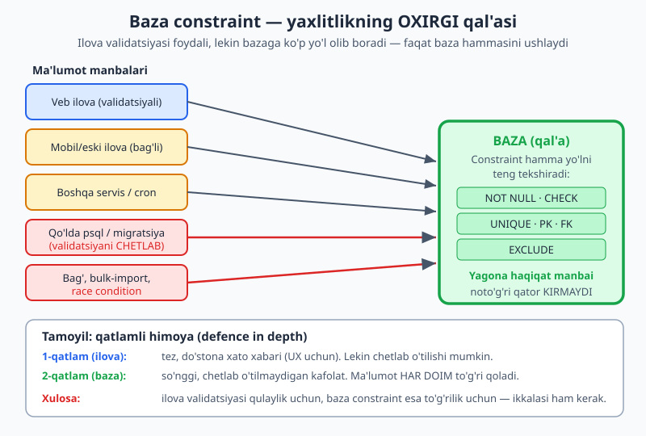
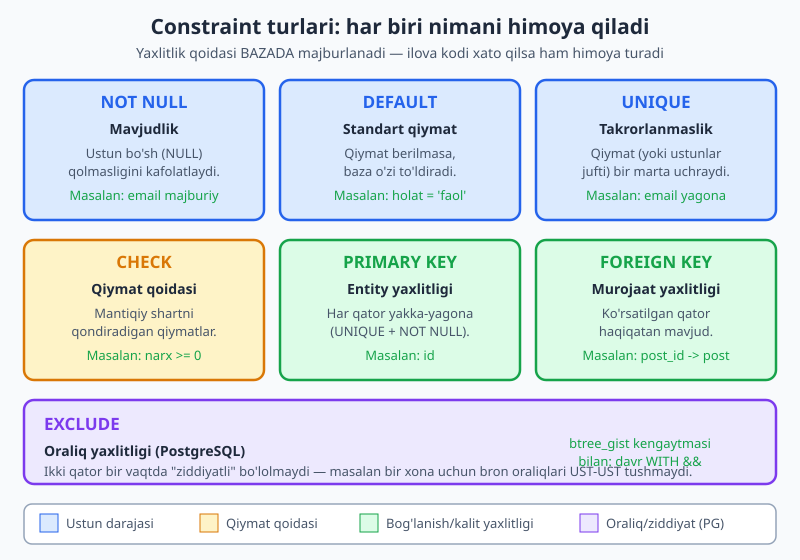
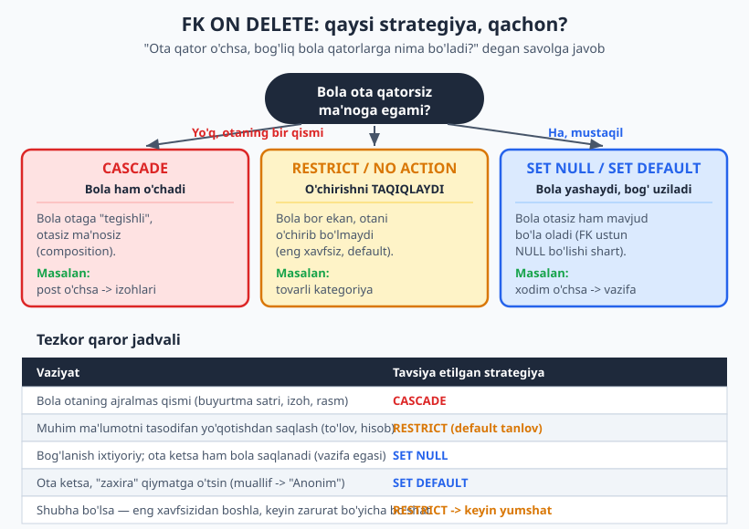

# 11 — Yaxlitlik va constraint dizayni

[⬅️ Oldingi: 10 — To'g'ri ma'lumot turini tanlash (PostgreSQL boy turlari)](./10-malumot-turlari.md) · [🏠 README](./README.md) · [Keyingi: 12 — Keng tarqalgan dizayn naqshlari ➡️](./12-dizayn-naqshlari.md)

> **Bu bobda:** yaxlitlikni (ma'lumot to'g'riligini) BAZADA majburlash falsafasini o'rganamiz — nega baza "oxirgi qal'a" va nega ilova validatsiyasiga yolg'iz ishonib bo'lmaydi. Keyin har bir constraint turini (NOT NULL, DEFAULT, UNIQUE, CHECK, PRIMARY KEY, FOREIGN KEY, EXCLUDE) DIZAYN nuqtai nazaridan — qaysi qoidani qaysi constraint bilan ifodalash kerakligini — ko'ramiz. FK uchun `ON DELETE` strategiyasini (CASCADE/RESTRICT/SET NULL/SET DEFAULT/NO ACTION) tanlash, deferrable constraint va constraint nomlash konvensiyasini chuqur o'rganamiz.

---

## 0. Sintaksis SQL kitobida, dizayn bu yerda

Constraint YOZISH sintaksisi (`CHECK (...)`, `REFERENCES ...`, `ALTER TABLE ... ADD CONSTRAINT`) [SQL va MySQL kitobining 18-bobida](../sql/18-alter-constraint-fk.md) batafsil bor. Bu bobda biz sintaksisni qaytadan o'rgatmaymiz — biz **dizayn savollariga** javob beramiz:

- Qaysi qoidani qaysi constraint bilan ifodalash kerak?
- FK o'chirilganda nima bo'lsin — bola qator ham o'chsinmi, yoki o'chirish taqiqlansinmi?
- Yaxlitlikni ilovada tekshirish kifoyami, yoki bazada majburlash shartmi?

Misollar PostgreSQL 18 sintaksisida; har bir SQL bloki jonli PG 18.4 klasterida (`ch11` sxemasida) haqiqatan ishga tushirilgan va natijalar shu chiqishga mos.

---

## 1. Yaxlitlik nima va nega BAZADA majburlanadi

**Ma'lumot yaxlitligi (data integrity)** — bazadagi ma'lumotning to'g'ri, izchil va biznes qoidalariga mos bo'lishi. Masalan: narx manfiy bo'lmasligi, har foydalanuvchi emaili yagona bo'lishi, izoh faqat mavjud postga tegishli bo'lishi.

Savol shunda: bu qoidalarni **qayerda** tekshirish kerak — ilova kodidami yoki bazadami?

Ko'p dasturchi shunday o'ylaydi: *"Men ilovada tekshiraman — forma jo'natilganda narx manfiy bo'lsa, qabul qilmayman. Nega bazaga ham qo'yay?"* Bu xato fikr, va sababi oddiy: **bazaga ma'lumot bitta yo'l bilan kelmaydi.**



Tasavvur qiling, sizning veb ilovangiz narxni puxta tekshiradi. Lekin o'sha bazaga yana kim/nima yozadi?

- **Mobil ilova** — boshqa jamoa yozgan, validatsiyasi biroz boshqacha (yoki bag'li).
- **Eski versiya** — telefonida yangilanmagan foydalanuvchi hali eski, nuqsonli kodni ishlatadi.
- **Boshqa servis yoki cron** — kechasi ishlaydigan skript, hisobot generatori.
- **Qo'lda `psql`** — admin yoki DBA to'g'ridan-to'g'ri `UPDATE` qiladi.
- **Migratsiya, bulk-import, race condition** — validatsiyani umuman ko'rmaydi.

Ularning har biri **alohida validatsiya kodi**ga ega yoki umuman ega emas. Bitta joyda bug bo'lsa — buzuq ma'lumot bazaga kiradi va u **abadiy** o'sha yerda qoladi. Buzuq ma'lumotni tozalash — eng og'ir va xavfli ish.

> **Asosiy tamoyil:** ilova validatsiyasi — **birinchi qatlam** (foydalanuvchiga tez va do'stona xato xabari beradi, UX uchun). Baza constraint — **oxirgi qal'a** (hech kim, hech qaysi yo'l bilan chetlab o'tolmaydigan kafolat). Bu "ikkisidan birini tanlash" emas — **ikkalasi ham** kerak. Bunga *qatlamli himoya* (defence in depth) deyiladi.

Baza constraintining yana bir kuchi — u **yagona haqiqat manbai** (single source of truth) sifatida hujjat vazifasini ham bajaradi. `CHECK (baho BETWEEN 1 AND 5)` ni o'qigan har bir dasturchi biznes qoidasini darhol tushunadi — uni kod ichidan qidirib yurish shart emas.

> **MySQL farqi:** tarixan MySQL `CHECK` ni *qabul qilardi-yu, e'tiborsiz qoldirardi* (8.0.16 gacha). Endi MySQL 8.0.16+ uni majburlaydi. Lekin bu tarix aynan shuni ko'rsatadi: agar baza majburlamasa, "constraint bor" degan yolg'on tuyg'u eng xavflisi. PostgreSQL har doim majburlagan.

---

## 2. Olti constraint turi — dizayn xaritasi

Har bir constraint turi ma'lumotning **boshqa xil yaxlitligini** himoya qiladi. Dizaynda asosiy ko'nikma — qoidani ko'rib, qaysi turga tegishli ekanini darhol aniqlash.



| Constraint | Nimani kafolatlaydi | Misol qoida |
|---|---|---|
| **NOT NULL** | Ustun bo'sh qolmaydi (mavjudlik) | "har foydalanuvchining emaili bo'lishi shart" |
| **DEFAULT** | Qiymat berilmasa, standart to'ldiriladi | "yangi hisob holati 'faol'" |
| **UNIQUE** | Qiymat (yoki ustunlar jufti) takrorlanmaydi | "email yagona" |
| **CHECK** | Qiymat mantiqiy shartni qondiradi | "narx >= 0" |
| **PRIMARY KEY** | Har qator yakka-yagona aniqlanadi (entity yaxlitligi) | "har qatorda `id`" |
| **FOREIGN KEY** | Murojaat haqiqiy qatorga (murojaat yaxlitligi) | "izoh mavjud postga tegishli" |
| **EXCLUDE** | Ikki qator "ziddiyatli" bo'lmaydi (PG) | "bron oraliqlari ust-ust tushmaydi" |

Quyida har birini dizayn nuqtai nazaridan ko'ramiz.

---

## 3. NOT NULL va DEFAULT — eng oddiy, eng ko'p e'tiborsiz qoldiriladigan

### 3.1 NOT NULL — "bo'sh bo'lishi mumkinmi?" degan qaror

Har bir ustun uchun dizayn paytida bitta savol bering: **"bu qiymat berilmasligi mumkinmi?"** Agar yo'q bo'lsa — `NOT NULL` qo'ying. Bu juda oddiy ko'rinadi, lekin NULL ruxsat etilgan har bir ustun — kelajakdagi bug manbai (`NULL` bilan taqqoslash, `NULL` ni JOIN, agregatlarda `NULL` ni e'tiborsiz qoldirish — [05-bobda](./05-relyatsion-model.md) NULL ning xavfini ko'rgandik).

> **Dizayn qoidasi:** standart holat `NOT NULL` bo'lsin. NULL ga **ataylab**, "bu qiymat haqiqatan noma'lum/qo'llanilmaydigan bo'lishi mumkin" deb qaror qilganingizda ruxsat bering — odat bo'yicha emas.

### 3.2 DEFAULT — qulaylik va izchillik

`DEFAULT` qiymat berilmaganda baza o'zi to'ldiradigan qiymatni belgilaydi. U `NOT NULL` bilan birga ko'p ishlatiladi: ustun bo'sh qolmaydi, lekin har INSERT da qiymat yozish shart emas.

```sql
CREATE SCHEMA IF NOT EXISTS ch11;
SET search_path = ch11;

CREATE TABLE mahsulot (
    id        bigint GENERATED ALWAYS AS IDENTITY PRIMARY KEY,
    nomi      text   NOT NULL,
    narx      numeric(12,2) NOT NULL DEFAULT 0,
    chegirma  numeric(12,2) NOT NULL DEFAULT 0,
    CONSTRAINT mahsulot_narx_musbat   CHECK (narx >= 0),
    CONSTRAINT mahsulot_chegirma_chek CHECK (chegirma >= 0 AND chegirma <= narx)
);

INSERT INTO mahsulot (nomi, narx, chegirma) VALUES ('Klaviatura', 250000, 50000);
```

Natija (5434 da tekshirildi): `INSERT 0 1` — qator kirdi. Bu yerda `DEFAULT 0` tufayli `narx`/`chegirma` siz ham INSERT qilsak bo'lardi.

> **Diqqat — DEFAULT qachon hisoblanadi:** `DEFAULT now()` har INSERT vaqtida qaytadan hisoblanadi (har qatorga o'z vaqti). Lekin `ALTER TABLE ... ADD COLUMN ... DEFAULT` mavjud qatorlarga qo'shilganda PG default ni metama'lumotda saqlaydi — bu tezroq, lekin "volatil" default (`now()`) eski qatorlar uchun **bir xil** (qo'shilgan payt) bo'lib qoladi. Bu nozik nuqtani [23-bobda](./23-migratsiya-evolyutsiya.md) ko'ramiz.

---

## 4. CHECK — biznes qoidasini bazaga yozish

`CHECK` har qator uchun mantiqiy shartni majburlaydi. Bu — biznes qoidasini to'g'ridan-to'g'ri sxemada ifodalashning eng kuchli vositasi.

### 4.1 Oddiy CHECK va uni rad etish

Yuqoridagi `mahsulot` jadvalida `mahsulot_narx_musbat CHECK (narx >= 0)` bor. Manfiy narx kiritishga urinib ko'ramiz:

```sql
SET search_path = ch11;
INSERT INTO mahsulot (nomi, narx, chegirma) VALUES ('Test', -5, -10);
```

Natija (5434 da tekshirildi) — rad etildi:

```
ERROR:  new row for relation "mahsulot" violates check constraint "mahsulot_chegirma_chek"
DETAIL:  Failing row contains (5, Test, -5.00, -10.00).
```

> **Nozik dizayn dars:** e'tibor bering — xato `narx_musbat` da emas, `chegirma_chek` da chiqdi! Sababi: `chegirma_chek` shartlaridan biri `chegirma <= narx`, ya'ni `-10 <= -5` — bu **rost**, lekin `chegirma >= 0`, ya'ni `-10 >= 0` — bu **yolg'on**. PostgreSQL constraintlarni qaysi tartibda baholasa, **birinchi buzilgani**ni qaytaradi. Shuning uchun constraintni alohida va aniq nomlash muhim — xato xabari qaysi qoida buzilganini darhol ko'rsatadi.

### 4.2 Ko'p ustunli (multi-column) va shartli CHECK

CHECK ning haqiqiy kuchi — **bir nechta ustun o'rtasidagi** munosabatni tekshirishi. Yuqoridagi `chegirma <= narx` ana shunday. Yana kuchliroq misol — **holatga bog'liq** (conditional) qoida. Ijara jadvalini olaylik: faqat "bekor" holatdagi ijarada bekor qilingan sana bo'lishi mumkin (va shart), boshqa holatlarda — yo'q:

```sql
SET search_path = ch11;
CREATE TABLE ijara (
    id          bigint GENERATED ALWAYS AS IDENTITY PRIMARY KEY,
    boshlanish  date NOT NULL,
    tugash      date NOT NULL,
    holat       text NOT NULL DEFAULT 'faol',
    bekor_sana  date,
    CONSTRAINT ijara_sana_tartib CHECK (tugash > boshlanish),
    CONSTRAINT ijara_holat_chek  CHECK (holat IN ('faol','tugagan','bekor')),
    CONSTRAINT ijara_bekor_chek CHECK (
        (holat = 'bekor' AND bekor_sana IS NOT NULL)
        OR (holat <> 'bekor' AND bekor_sana IS NULL)
    )
);

INSERT INTO ijara (boshlanish, tugash, holat) VALUES ('2026-01-01','2026-12-31','faol');
INSERT INTO ijara (boshlanish, tugash, holat, bekor_sana) VALUES ('2026-02-01','2026-06-01','bekor','2026-03-15');
SELECT id, holat, bekor_sana FROM ijara ORDER BY id;
```

Natija (5434 da tekshirildi):

```
 id | holat | bekor_sana
----+-------+------------
  1 | faol  |
  2 | bekor | 2026-03-15
(2 rows)
```

Endi qoidani buzamiz — "faol" holatda bekor sanasini berib ko'ramiz:

```sql
SET search_path = ch11;
INSERT INTO ijara (boshlanish,tugash,holat,bekor_sana) VALUES ('2026-01-01','2026-12-31','faol','2026-05-01');
```

Natija (5434 da tekshirildi) — rad etildi:

```
ERROR:  new row for relation "ijara" violates check constraint "ijara_bekor_chek"
```

Bu nihoyatda kuchli: "agar holat bekor bo'lsa, bekor sanasi bo'lsin" degan murakkab biznes qoidasi endi ilova kodiga emas, **bazaga** yozilgan va hech kim uni chetlab o'tolmaydi.

### 4.3 CHECK ning chegaralari — nima QILA OLMAYDI

CHECK faqat **shu qatorning** ustunlarini ko'ra oladi. U **boshqa qatorlarga** yoki **boshqa jadvalga** murojaat qilolmaydi — ya'ni ichida subquery ishlatib bo'lmaydi:

```sql
-- ❌ Bu ISHLAMAYDI — CHECK ichida subquery taqiqlangan
SET search_path = ch11;
CREATE TABLE t_bad (id int, kat_id int CHECK (kat_id IN (SELECT id FROM kategoriya)));
```

Natija (5434 da tekshirildi):

```
ERROR:  cannot use subquery in check constraint
```

Sababi mantiqiy: agar CHECK boshqa jadvalga qarasa, o'sha jadval o'zgarganda bu qator endi qoidaga zid bo'lib qolardi-yu, baza buni sezmasdi. "Boshqa jadvalda mavjud bo'lsin" degan qoida — bu aslida **FOREIGN KEY** ning ishi. "Boshqa qatorlar bilan ziddiyat bo'lmasin" degan qoida — **EXCLUDE** ning ishi. Har qoidani to'g'ri vositaga bering.

> **Eslatma:** CHECK ichida `IMMUTABLE` bo'lmagan funksiyalardan (`now()`, `random()`) qoching — qator kiritilganda rost bo'lgan shart keyin yolg'onga aylanib qolishi mumkin, baza esa buni qaytadan tekshirmaydi. CHECK faqat o'zgarmas (deterministik) ifodalar uchun.

---

## 5. UNIQUE — takrorlanmaslikni dizaynlash

`UNIQUE` qiymat (yoki ustunlar to'plami) jadvalda bir martadan ortiq uchramasligini kafolatlaydi.

### 5.1 Oddiy UNIQUE va NULL ning maxsus xatti-harakati

```sql
SET search_path = ch11;
CREATE TABLE foydalanuvchi (
    id        bigint GENERATED ALWAYS AS IDENTITY PRIMARY KEY,
    email     text NOT NULL,
    nikneym   text,
    faol      boolean NOT NULL DEFAULT true,
    CONSTRAINT foydalanuvchi_email_uq UNIQUE (email)
);

INSERT INTO foydalanuvchi (email, nikneym, faol) VALUES
  ('a@x.uz', 'oqil', true),
  ('b@x.uz', 'oqil', false);
```

Dublikat emailni urinib ko'ramiz:

```sql
SET search_path = ch11;
INSERT INTO foydalanuvchi (email, nikneym, faol) VALUES ('a@x.uz', 'boshqa', true);
```

Natija (5434 da tekshirildi) — rad etildi:

```
ERROR:  duplicate key value violates unique constraint "foydalanuvchi_email_uq"
DETAIL:  Key (email)=(a@x.uz) already exists.
```

**Dizayn uchun muhim nozik nuqta — NULL va UNIQUE:** standart bo'yicha PostgreSQL'da `NULL` lar **bir-biriga teng emas** deb hisoblanadi, shuning uchun UNIQUE ustunda **bir nechta NULL** bo'lishi mumkin:

```sql
SET search_path = ch11;
INSERT INTO foydalanuvchi (email, nikneym, faol) VALUES ('d@x.uz', NULL, true), ('e@x.uz', NULL, true);
SELECT count(*) AS nullniknemlar FROM foydalanuvchi WHERE nikneym IS NULL;
```

Natija (5434 da tekshirildi):

```
 nullniknemlar
---------------
             2
(1 row)
```

Ya'ni `nikneym` ga UNIQUE qo'ysangiz ham, ikki foydalanuvchi `nikneym = NULL` bilan yashashi mumkin. Agar buni xohlamasangiz, PostgreSQL 15+ da `UNIQUE NULLS NOT DISTINCT` ishlatiladi (NULL larni ham teng deb sanaydi).

### 5.2 Qisman (partial) UNIQUE indeks — shartli takrorlanmaslik

Eng kuchli dizayn vositalaridan biri — **qisman UNIQUE indeks**: unikallik faqat qatorlarning bir qismiga taalluqli. Klassik misol: nikneym faqat **faol** foydalanuvchilar orasida yagona bo'lsin (nofaol/o'chirilgan hisoblar eski nikneymni "band qilib" turmasin):

```sql
SET search_path = ch11;
CREATE UNIQUE INDEX foydalanuvchi_nikneym_faol_uq
    ON foydalanuvchi (nikneym) WHERE faol = true;
```

Yuqorida biz `'oqil'` ni ikki marta kiritgandik (`a@x.uz` faol, `b@x.uz` nofaol) — bu o'tdi, chunki faqat bittasi faol. Endi **ikkinchi faol** `'oqil'` ni kiritishga urinib ko'ramiz:

```sql
SET search_path = ch11;
INSERT INTO foydalanuvchi (email, nikneym, faol) VALUES ('c@x.uz', 'oqil', true);
```

Natija (5434 da tekshirildi) — rad etildi (chunki faol `'oqil'` allaqachon bor):

```
ERROR:  duplicate key value violates unique constraint "foydalanuvchi_nikneym_faol_uq"
DETAIL:  Key (nikneym)=(oqil) already exists.
```

Qisman UNIQUE — soft-delete (`deleted_at`), holat-asoslangan unikallik, "bir vaqtda faqat bitta asosiy manzil" kabi qoidalar uchun ajralmas. Bu naqshni [12-bobda](./12-dizayn-naqshlari.md) (soft delete) yana ko'ramiz.

> **PRIMARY KEY vs UNIQUE — dizayn farqi:** PRIMARY KEY = UNIQUE + NOT NULL + "bu jadvalning asosiy identifikatori". Har jadvalda **bitta** PRIMARY KEY (entity yaxlitligi), lekin bir nechta UNIQUE bo'lishi mumkin (alternativ kalitlar). Masalan, `foydalanuvchi` da PK = `id` (surrogate, [06-bobni eslang](./06-kalit-dizayni.md)), va `email` — alternativ (biznes) kalit sifatida UNIQUE.

---

## 6. PRIMARY KEY va FOREIGN KEY — bog'lanish yaxlitligi

### 6.1 PRIMARY KEY — entity yaxlitligi

PRIMARY KEY har qatorni yakka-yagona aniqlaydi va `NULL` bo'lishiga yo'l qo'ymaydi. Kalit dizayni (natural vs surrogate, UUID, kompozit) [06-bobda](./06-kalit-dizayni.md) to'liq ko'rilgan — bu yerda faqat constraint sifatida eslatamiz: PK = **entity yaxlitligi** kafolati. "Har bir entity nusxasi noyob va aniqlanadigan" degani.

### 6.2 FOREIGN KEY — murojaat yaxlitligi

FOREIGN KEY (FK) bola jadvaldagi qiymat ota jadvalda **haqiqatan mavjud** ekanini kafolatlaydi. Bu — relyatsion modelning yuragi: "yetim" qatorlar (mavjud bo'lmagan postga ishora qiluvchi izoh) paydo bo'lishining oldini oladi.

FK borligida ikki narsa bloklanadi: (1) mavjud bo'lmagan otaga ishora qiluvchi bolani kiritish, (2) bog'liq bolasi bor otani o'chirish/o'zgartirish (default xatti-harakat). Aynan **ikkinchisi** eng muhim dizayn qaroriga olib keladi: ota o'chirilganda nima bo'lsin?

> **Dizayn ogohlantirishi:** FK ustuniga deyarli **har doim indeks** qo'ying. PostgreSQL PK/UNIQUE uchun indeksni avtomatik yaratadi, lekin **FK ustuni uchun emas**. Indekssiz FK — sekin JOIN va sekin ota-o'chirish (CASCADE/RESTRICT tekshiruvi) demakdir. Buni [13-bobda](./13-anti-naqshlar.md) anti-naqsh sifatida ko'ramiz, indeks dizaynini esa [14-bobda](./14-indeks-strategiyasi.md).

---

## 7. ON DELETE / ON UPDATE strategiyasi — eng muhim FK dizayn qarori

Bu bobning markaziy qarori. FK e'lon qilganda PostgreSQL'dan so'raysiz: **"ota qator o'chirilganda (yoki kaliti o'zgarganda), bog'liq bolalarga nima qilay?"** Beshta variant bor.



Tanlovning kaliti — bitta savol: **"bola ota qatorsiz ma'noga egami?"**

### 7.1 ON DELETE CASCADE — bola otaga "tegishli"

Agar bola otaning **ajralmas qismi** bo'lsa (otasiz ma'nosiz), CASCADE: ota o'chsa, bola ham o'chadi. Klassik misol — post va uning izohlari (post yo'q bo'lsa, izohlar mantiqsiz):

```sql
SET search_path = ch11;
CREATE TABLE post (
    id    bigint GENERATED ALWAYS AS IDENTITY PRIMARY KEY,
    matn  text NOT NULL
);
CREATE TABLE izoh (
    id      bigint GENERATED ALWAYS AS IDENTITY PRIMARY KEY,
    post_id bigint NOT NULL,
    matn    text NOT NULL,
    CONSTRAINT izoh_post_fk FOREIGN KEY (post_id)
        REFERENCES post(id) ON DELETE CASCADE
);

INSERT INTO post (matn) VALUES ('Birinchi post'), ('Ikkinchi post');
INSERT INTO izoh (post_id, matn) VALUES (1,'zo''r'), (1,'rahmat'), (2,'salom');

SELECT 'oldin' AS holat, count(*) AS izohlar FROM izoh;
DELETE FROM post WHERE id = 1;
SELECT 'keyin (CASCADE)' AS holat, count(*) AS izohlar FROM izoh;
```

Natija (5434 da tekshirildi) — post 1 o'chirilganda uning 2 izohi ham o'chdi, 1 ta qoldi:

```
      holat      | izohlar
-----------------+---------
 oldin           |       3

 keyin (CASCADE) |       1
```

CASCADE qulay, lekin **xavfli**: bitta `DELETE` zanjir bo'ylab katta hajmni jimgina o'chirib yuborishi mumkin. Faqat ota-bola munosabati chinakam **composition** (otaga "egalik") bo'lganda ishlating: buyurtma → buyurtma satrlari, post → izohlar, hujjat → rasm. To'lov, hisob, jurnal kabi muhim ma'lumotda CASCADE dan ehtiyot bo'ling.

### 7.2 ON DELETE RESTRICT (va NO ACTION) — eng xavfsiz

`RESTRICT`: bog'liq bola bor ekan, otani o'chirib bo'lmaydi — `DELETE` rad etiladi. Bu **eng xavfsiz** tanlov va shubha bo'lganda boshlang'ich nuqta. Misol — tovarli kategoriyani o'chirib bo'lmaydi:

```sql
SET search_path = ch11;
CREATE TABLE kategoriya (
    id   bigint GENERATED ALWAYS AS IDENTITY PRIMARY KEY,
    nomi text NOT NULL
);
CREATE TABLE tovar (
    id           bigint GENERATED ALWAYS AS IDENTITY PRIMARY KEY,
    nomi         text NOT NULL,
    kategoriya_id bigint NOT NULL,
    CONSTRAINT tovar_kat_fk FOREIGN KEY (kategoriya_id)
        REFERENCES kategoriya(id) ON DELETE RESTRICT
);
INSERT INTO kategoriya (nomi) VALUES ('Elektronika');
INSERT INTO tovar (nomi, kategoriya_id) VALUES ('Telefon', 1);

DELETE FROM kategoriya WHERE id = 1;
```

Natija (5434 da tekshirildi) — o'chirish taqiqlandi:

```
ERROR:  update or delete on table "kategoriya" violates RESTRICT setting of foreign key constraint "tovar_kat_fk" on table "tovar"
DETAIL:  Key (id)=(1) is referenced from table "tovar".
```

> **RESTRICT vs NO ACTION — nozik farq:** ikkalasi ham o'chirishni taqiqlaydi, lekin **vaqti** boshqacha. `NO ACTION` (default) tekshiruvni tranzaksiya **oxiriga** (yoki gap oxiriga) qoldirishga ruxsat beradi — ya'ni deferrable bo'lishi mumkin. `RESTRICT` esa **darhol** tekshiradi va hech qachon deferred bo'lmaydi. Amalda agar FK ni o'chirilgan otani keyin qayta kiritib "tuzatadigan" tranzaksiyalar bo'lsa, `NO ACTION` moslashuvchanroq. Agar bunday holat yo'q bo'lsa, ikkalasi bir xil ishlaydi. **FK ning standarti — NO ACTION**, ya'ni `ON DELETE` umuman yozmasangiz, taqiqlash kuchda bo'ladi.

### 7.3 ON DELETE SET NULL — bola yashaydi, bog' uziladi

Agar bog'lanish **ixtiyoriy** bo'lsa va bola otasiz ham mavjud bo'la olsa — `SET NULL`. Ota o'chsa, bolaning FK ustuni `NULL` ga aylanadi. Shart: **FK ustuni `NOT NULL` bo'lmasligi kerak**. Misol — xodim o'chsa, uning vazifalari "egasiz" qoladi (o'chmaydi):

```sql
SET search_path = ch11;
CREATE TABLE xodim (
    id   bigint GENERATED ALWAYS AS IDENTITY PRIMARY KEY,
    ism  text NOT NULL
);
CREATE TABLE vazifa (
    id        bigint GENERATED ALWAYS AS IDENTITY PRIMARY KEY,
    sarlavha  text NOT NULL,
    xodim_id  bigint,        -- NULL bo'la oladi (SET NULL uchun shart)
    CONSTRAINT vazifa_xodim_fk FOREIGN KEY (xodim_id)
        REFERENCES xodim(id) ON DELETE SET NULL
);
INSERT INTO xodim (ism) VALUES ('Anvar');
INSERT INTO vazifa (sarlavha, xodim_id) VALUES ('Hisobot tayyorlash', 1);

SELECT 'oldin' AS holat, xodim_id FROM vazifa WHERE id=1;
DELETE FROM xodim WHERE id = 1;
SELECT 'keyin (SET NULL)' AS holat, xodim_id FROM vazifa WHERE id=1;
```

Natija (5434 da tekshirildi) — vazifa saqlanib qoldi, `xodim_id` esa `NULL` bo'ldi:

```
      holat       | xodim_id
------------------+----------
 oldin            |        1

 keyin (SET NULL) |
```

### 7.4 ON DELETE SET DEFAULT — "zaxira" qiymatga o'tish

`SET DEFAULT`: ota o'chsa, bolaning FK ustuni o'zining `DEFAULT` qiymatiga o'tadi. Shart — o'sha default qiymat ota jadvalda **mavjud** bo'lishi kerak (aks holda yangi FK buzilishi yuz beradi). Klassik misol — muallif o'chsa, uning maqolalari "Anonim" (id=0) muallifga o'tadi:

```sql
SET search_path = ch11;
CREATE TABLE muallif (
    id   bigint PRIMARY KEY,
    ism  text NOT NULL
);
INSERT INTO muallif (id, ism) VALUES (0, 'Anonim'), (5, 'Dilnoza');
CREATE TABLE maqola (
    id         bigint GENERATED ALWAYS AS IDENTITY PRIMARY KEY,
    sarlavha   text NOT NULL,
    muallif_id bigint NOT NULL DEFAULT 0,    -- zaxira: Anonim
    CONSTRAINT maqola_muallif_fk FOREIGN KEY (muallif_id)
        REFERENCES muallif(id) ON DELETE SET DEFAULT
);
INSERT INTO maqola (sarlavha, muallif_id) VALUES ('Postgres haqida', 5);

SELECT 'oldin' AS holat, muallif_id FROM maqola WHERE id=1;
DELETE FROM muallif WHERE id = 5;
SELECT 'keyin (SET DEFAULT)' AS holat, muallif_id FROM maqola WHERE id=1;
```

Natija (5434 da tekshirildi) — Dilnoza (5) o'chirilganda maqola Anonim (0) ga o'tdi:

```
        holat        | muallif_id
---------------------+------------
 oldin               |          5

 keyin (SET DEFAULT) |          0
```

### 7.5 Tezkor qaror jadvali

| Vaziyat | Strategiya |
|---|---|
| Bola otaning ajralmas qismi (buyurtma satri, izoh, rasm) | **CASCADE** |
| Muhim ma'lumotni tasodifan yo'qotishdan saqlash (to'lov, hisob) | **RESTRICT / NO ACTION** |
| Bog'lanish ixtiyoriy, ota ketsa ham bola saqlanadi (vazifa egasi) | **SET NULL** |
| Ota ketsa "zaxira" qiymatga o'tsin (muallif → Anonim) | **SET DEFAULT** |
| Shubha bo'lsa | **RESTRICT** dan boshla, keyin zarurat bo'yicha yumshat |

> **ON UPDATE haqida:** xuddi shu strategiyalar `ON UPDATE` uchun ham bor (ota kaliti o'zgarganda). Lekin agar siz [06-bobdagi](./06-kalit-dizayni.md) maslahatga amal qilib **barqaror surrogate kalit** (o'zgarmaydigan `id`) ishlatsangiz, ota kaliti deyarli hech qachon o'zgarmaydi — shuning uchun `ON UPDATE` amalda kam ahamiyatga ega. `ON UPDATE CASCADE` faqat tabiiy (natural) kalit ishlatilganda (kalit qiymati o'zgarishi mumkin) muhim bo'ladi. Bu — surrogate kalit foydasiga yana bitta dalil.

---

## 8. EXCLUDE — oraliq va ziddiyat yaxlitligi (PostgreSQL)

UNIQUE "ikki qatorda **bir xil** qiymat bo'lmasin" deydi. Lekin ba'zan kerakli qoida boshqacha: "ikki qator bir-biri bilan **ziddiyatli** bo'lmasin" — masalan, vaqt oraliqlari **ust-ust tushmasin**. UNIQUE buni qila olmaydi (oraliqlar bir xil emas, lekin kesishadi). PostgreSQL'ning kuchli vositasi — **EXCLUDE constraint**.

EXCLUDE umumiy tenglikdan kengroq operatorlar bilan ishlaydi. Oraliq uchun bizga `&&` (overlap, kesishadimi?) operatori kerak, va bitta ustunni `=` (bir xil xona) bilan solishtirishimiz uchun `btree_gist` kengaytmasi lozim:

```sql
SET search_path = ch11;
CREATE EXTENSION IF NOT EXISTS btree_gist;

CREATE TABLE bron (
    id      bigint GENERATED ALWAYS AS IDENTITY PRIMARY KEY,
    xona_id int  NOT NULL,
    davr    tsrange NOT NULL,
    CONSTRAINT bron_ustustun_emas
        EXCLUDE USING gist (xona_id WITH =, davr WITH &&)
);

INSERT INTO bron (xona_id, davr) VALUES
  (1, '[2026-06-13 10:00, 2026-06-13 12:00)');   -- xona 1: 10:00-12:00
INSERT INTO bron (xona_id, davr) VALUES
  (1, '[2026-06-13 12:00, 2026-06-13 14:00)');   -- chegara tegadi, kesishmaydi -> OK
INSERT INTO bron (xona_id, davr) VALUES
  (2, '[2026-06-13 10:00, 2026-06-13 12:00)');   -- boshqa xona -> OK
SELECT id, xona_id, davr FROM bron ORDER BY id;
```

Natija (5434 da tekshirildi) — uchchala bron ham kirdi (yondosh oraliqlar `[12:00,14:00)` chegarada tegadi, lekin kesishmaydi; boshqa xona — mustaqil):

```
 id | xona_id |                     davr
----+---------+-----------------------------------------------
  1 |       1 | ["2026-06-13 10:00:00","2026-06-13 12:00:00")
  2 |       1 | ["2026-06-13 12:00:00","2026-06-13 14:00:00")
  3 |       2 | ["2026-06-13 10:00:00","2026-06-13 12:00:00")
(3 rows)
```

Endi **ust-ust tushadigan** bronni kiritamiz (xona 1, 11:00–13:00 — birinchi bron 10:00–12:00 bilan kesishadi):

```sql
SET search_path = ch11;
INSERT INTO bron (xona_id, davr) VALUES (1, '[2026-06-13 11:00, 2026-06-13 13:00)');
```

Natija (5434 da tekshirildi) — rad etildi:

```
ERROR:  conflicting key value violates exclusion constraint "bron_ustustun_emas"
DETAIL:  Key (xona_id, davr)=(1, ["2026-06-13 11:00:00","2026-06-13 13:00:00")) conflicts with existing key (xona_id, davr)=(1, ["2026-06-13 10:00:00","2026-06-13 12:00:00")).
```

Bu — bron tizimlari, xona/resurs rejalashtirish, xodim smenalari uchun ajralmas. E'tibor bering: bu qoidani ilovada to'g'ri amalga oshirish nihoyatda qiyin (ikki foydalanuvchi bir vaqtda band qilsa — **race condition**). EXCLUDE buni atomik, ishonchli tarzda bazada hal qiladi.

> **Diqqat — chegara muhim:** `[10:00, 12:00)` da `[` — yopiq (kiritiladi), `)` — ochiq (kiritilmaydi). Shuning uchun `[12:00, 14:00)` kesishmaydi (12:00 birinchi oraliqqa kirmaydi). Agar `[10:00, 12:00]` (ikki tomon yopiq) bo'lsaydi, 12:00 ikkala oraliqda bo'lib, kesishish yuz berardi. Oraliq chegaralarini dizaynda ataylab tanlang.

> **PostgreSQL 18 yangiligi — temporal PRIMARY KEY:** PG18 da xuddi shu g'oya `PRIMARY KEY (id, davr WITHOUT OVERLAPS)` sintaksisi bilan kalit darajasiga chiqdi (ichida EXCLUDE ishlatadi). Masalan, narx tarixida bir mahsulotning davrlari ust-ust tushmasligi: `PRIMARY KEY (mahsulot_id, davr WITHOUT OVERLAPS)`. Bu temporal modellashtirishning qulay vositasi — [18-bobda](./18-temporal-versiya.md) batafsil. (Men buni 5434 da tekshirdim — ishlaydi va kesishgan davrni rad etadi.)

---

## 9. Deferrable constraint — tranzaksiya oxirida tekshirish

Default bo'yicha constraint **darhol** (har gapdan keyin) tekshiriladi. Ba'zan bu muammo: tranzaksiya **o'rtasida** vaqtincha qoida buzilishi mumkin, lekin tranzaksiya **oxirida** hamma narsa to'g'ri bo'ladi. `DEFERRABLE INITIALLY DEFERRED` constraint tekshiruvni `COMMIT` ga qoldiradi.

### 9.1 Klassik misol: ikki qatorni almashtirish

Boblar tartibini olaylik — `UNIQUE (kitob, tartib)`. Ikki bobning tartibini almashtirmoqchimiz (1 ↔ 2). Oddiy UNIQUE bilan **birinchi** `UPDATE` darhol dublikat yaratadi va xato beradi. Deferred bilan bu o'tadi. Avval oddiy (deferrable bo'lmagan) UNIQUE bilan urinib ko'ramiz:

```sql
SET search_path = ch11;
CREATE TABLE bob2 (
    id     bigint GENERATED ALWAYS AS IDENTITY PRIMARY KEY,
    kitob  text NOT NULL,
    tartib int  NOT NULL,
    CONSTRAINT bob2_tartib_uq UNIQUE (kitob, tartib)   -- oddiy, darhol tekshiriladi
);
INSERT INTO bob2 (kitob, tartib) VALUES ('DB',1), ('DB',2);

BEGIN;
  UPDATE bob2 SET tartib = 2 WHERE id = 1;   -- endi ikki qator tartib=2
ROLLBACK;
```

Natija (5434 da tekshirildi) — **birinchi** UPDATE da darhol xato:

```
ERROR:  duplicate key value violates unique constraint "bob2_tartib_uq"
DETAIL:  Key (kitob, tartib)=(DB, 2) already exists.
```

Endi **deferrable** UNIQUE bilan xuddi shu almashtirish:

```sql
SET search_path = ch11;
CREATE TABLE bob (
    id     bigint GENERATED ALWAYS AS IDENTITY PRIMARY KEY,
    kitob  text NOT NULL,
    tartib int  NOT NULL,
    CONSTRAINT bob_tartib_uq UNIQUE (kitob, tartib)
        DEFERRABLE INITIALLY DEFERRED
);
INSERT INTO bob (kitob, tartib) VALUES ('DB',1), ('DB',2), ('DB',3);

BEGIN;
  UPDATE bob SET tartib = 2 WHERE id = 1;   -- vaqtincha ikki ta tartib=2 (RUXSAT)
  UPDATE bob SET tartib = 1 WHERE id = 2;   -- endi yana yagona
COMMIT;
SELECT id, kitob, tartib FROM bob ORDER BY id;
```

Natija (5434 da tekshirildi) — almashtirish muvaffaqiyatli, tekshiruv faqat COMMIT da bo'ldi:

```
 id | kitob | tartib
----+-------+--------
  1 | DB    |      2
  2 | DB    |      1
  3 | DB    |      3
(3 rows)
```

### 9.2 Deferrable FK: aylanali bog'lanish

Yana bir muhim holat — **aylanali (circular)** FK. Masalan, bo'limning boshlig'i o'sha bo'lim xodimi, va xodim qaysidir bo'limga tegishli. Ikkalasini bir tranzaksiyada kiritish kerak, lekin qaysi birini birinchi yozsangiz ham — FK buziladi. Deferred FK yechim:

```sql
SET search_path = ch11;
CREATE TABLE bolim (
    id        bigint PRIMARY KEY,
    nomi      text NOT NULL,
    boshliq_id bigint
);
CREATE TABLE hodim (
    id       bigint PRIMARY KEY,
    ism      text NOT NULL,
    bolim_id bigint NOT NULL REFERENCES bolim(id)
);
ALTER TABLE bolim ADD CONSTRAINT bolim_boshliq_fk
    FOREIGN KEY (boshliq_id) REFERENCES hodim(id)
    DEFERRABLE INITIALLY DEFERRED;

BEGIN;
  INSERT INTO bolim (id, nomi, boshliq_id) VALUES (1, 'Muhandislik', 100);  -- hodim 100 hali yo'q
  INSERT INTO hodim (id, ism, bolim_id) VALUES (100, 'Aziz', 1);            -- endi bor
COMMIT;
SELECT b.nomi, h.ism AS boshliq FROM bolim b JOIN hodim h ON h.id = b.boshliq_id;
```

Natija (5434 da tekshirildi) — aylanali bog'lanish bir tranzaksiyada o'rnatildi:

```
    nomi     | boshliq
-------------+---------
 Muhandislik | Aziz
(1 row)
```

Agar bu FK deferrable bo'lmasa, **birinchi** INSERT darhol `violates foreign key constraint ... is not present` xatosini berardi (men buni ham 5434 da tasdiqladim).

> **Dizayn maslahati:** deferrable constraintni **faqat kerak bo'lganda** ishlating (almashtirish, aylanali bog'lanish, ko'p qatorli atomik o'zgarish). Ular darhol-tekshiriladigan constraintdan biroz qimmatroq (PG buzilishlarni tranzaksiya oxirigacha eslab turishi kerak) va xatoni kechroq qaytaradi. Standart — `NOT DEFERRABLE` (darhol). `DEFERRABLE INITIALLY IMMEDIATE` ham bor — odatda darhol, lekin tranzaksiya ichida `SET CONSTRAINTS ... DEFERRED` bilan vaqtincha kechiktirish mumkin.

---

## 10. Constraint nomlash — kelajakdagi o'zingizga sovg'a

PostgreSQL nom bermasangiz, constraintga avtomatik nom beradi (masalan `mahsulot_narx_check`). Lekin **doimo o'zingiz nom bering**. Sabablari:

1. **Xato xabari tushunarli bo'ladi:** `violates check constraint "ijara_bekor_chek"` — qaysi qoida buzilganini darhol aytadi. Avtomatik `ijara_check1` esa hech narsa demaydi.
2. **Migratsiya barqaror bo'ladi:** constraintni `ALTER TABLE ... DROP CONSTRAINT nom` bilan o'chirish/qayta yaratish uchun barqaror nom kerak. Avtomatik nomlar muhitlar orasida farq qilishi mumkin.
3. **Kod hujjat bo'ladi:** nom qoidani tavsiflaydi.

Keng tarqalgan konvensiya — `{jadval}_{ustun(lar)}_{tur}`:

| Tur | Qisqartma | Misol |
|---|---|---|
| Primary key | `pk` yoki `_pkey` | `foydalanuvchi_pkey` |
| Foreign key | `fk` | `izoh_post_fk` |
| Unique | `uq` | `foydalanuvchi_email_uq` |
| Check | `chek` / `check` | `mahsulot_narx_musbat` |
| Exclude | `excl` | `bron_ustustun_emas` |

> **Ekspert maslahati:** CHECK uchun **qoidani tavsiflovchi** nom tanlang (`mahsulot_narx_musbat`), shunchaki `mahsulot_narx_check` emas. Jadvalda bir ustunda bir nechta CHECK bo'lishi mumkin — nom qaysi biri buzilganini ajratadi. Nomlash siyosatini butun loyiha bo'ylab izchil saqlang ([09-bobdagi](./09-logik-fizik-sxema.md) nomlash konvensiyasini eslang).

---

## 11. Yaxlitlikni dizaynlash — yakuniy nuqtai nazar

Sxema dizaynida har bir ustun va bog'lanish uchun o'zingizga savol bering:

1. **Bo'sh bo'lishi mumkinmi?** Yo'q → `NOT NULL`.
2. **Standart qiymati bormi?** Ha → `DEFAULT`.
3. **Takrorlanmasligi kerakmi?** Ha → `UNIQUE` (yoki shartli bo'lsa, qisman UNIQUE indeks).
4. **Qiymat qandaydir qoidaga bo'ysunadimi?** Ha → `CHECK` (bir yoki ko'p ustunli).
5. **Boshqa jadvalga ishora qiladimi?** Ha → `FOREIGN KEY` + `ON DELETE` strategiyasini ataylab tanlang + FK ustuniga indeks.
6. **Oraliqlar/qiymatlar ziddiyatsiz bo'lishi kerakmi?** Ha → `EXCLUDE` (PG).
7. **Tranzaksiya o'rtasida vaqtincha buzilishi mumkinmi?** Ha → `DEFERRABLE`.

Va eng muhimi — bu qoidalarni **bazada** majburlang. Ilova validatsiyasi UX uchun foydali birinchi qatlam, lekin **baza — oxirgi qal'a**. Buzuq ma'lumotning bazaga kirishiga yo'l qo'ymaslik — uni keyin tozalashdan ming barobar arzon.

> **Muvozanat:** "hamma narsani constraint bilan o'rab tashlash" ham xato emas — lekin ba'zi qoidalar (masalan, "buyurtma jami 1 mln dan oshmasin, agar mijoz VIP bo'lmasa") ilova logikasiga to'g'ri keladi, chunki ular tez-tez o'zgaradi yoki murakkab kontekstga muhtoj. **Qoida tamoyili:** ma'lumotning fundamental yaxlitligi (mavjudlik, noyoblik, murojaat, oraliq) — bazada; o'zgaruvchan, kontekstga bog'liq biznes-jarayon qoidalari — ilovada. Shubha bo'lsa, bazaga moyil bo'ling.

---

## Mashqlar

### Oson

1. **Qaysi constraint?** Quyidagi har bir qoida uchun mos constraint turini ayting: (a) "har xodimning tabel raqami yagona"; (b) "yosh 0 dan kichik bo'lmasin"; (c) "har buyurtma mavjud mijozga tegishli"; (d) "telefon raqami berilishi shart"; (e) "yangi hisob valyutasi standart 'UZS'".

2. **NOT NULL qarori.** `foydalanuvchi(id, email, telefon, tugilgan_sana, royxatdan_otgan)` jadvalida qaysi ustunlar `NOT NULL` bo'lishi kerak, qaysilari NULL ga ruxsat berishi mumkin? Har biri uchun bir jumla bilan asoslang.

3. **Oddiy CHECK yozing.** `mahsulot(narx, chegirma_foiz)` jadvaliga ikkita CHECK qo'shing: narx musbat; chegirma foizi 0 dan 100 gacha. Constraintlarni to'g'ri nomlang.

4. **ON DELETE tanlang (oson).** Quyidagi FK lar uchun `ON DELETE` strategiyasini tanlang va bir jumla bilan asoslang: (a) `buyurtma_satri.buyurtma_id → buyurtma`; (b) `xodim.bolim_id → bolim`; (c) `tolov.buyurtma_id → buyurtma`.

### O'rta

5. **Ko'p ustunli CHECK.** `chegirma(boshlanish_sana, tugash_sana, foiz)` jadvalini loyihalang, quyidagi qoidalar bilan: tugash sanasi boshlanishdan keyin; foiz 1 dan 90 gacha. Constraintlarni yozing va nomlang.

6. **Qisman UNIQUE.** `manzil(foydalanuvchi_id, shahar, kocha, asosiy)` jadvalida har foydalanuvchining **faqat bitta** asosiy manzili (`asosiy = true`) bo'lishi kerak, lekin asosiy bo'lmagan manzillar ko'p bo'lishi mumkin. Buni qanday majburlaysiz? DDL yozing.

7. **CASCADE yoki RESTRICT?** Onlayn-do'kon `kategoriya → tovar → sharh` zanjiri bor. Kategoriya o'chirilganda nima bo'lishini xohlaysiz va nega? Har FK uchun strategiya tanlang va xavfini muhokama qiling.

8. **Shartli (conditional) CHECK.** `hodim(id, ism, holat, ishdan_boshagan_sana)` — `holat IN ('ishlayapti','boshagan')`. Faqat 'boshagan' holatda `ishdan_boshagan_sana` to'ldirilgan bo'lishi shart, 'ishlayapti' da esa NULL bo'lishi kerak. CHECK ni yozing.

9. **EXCLUDE bilan overlap.** Shifokor qabuli tizimi: `qabul(shifokor_id, davr tsrange)`. Bir shifokorning qabul vaqtlari ust-ust tushmasligini majburlang. Kerakli kengaytma va EXCLUDE constraintni yozing. Yondosh qabullar (`[09:00,10:00)` va `[10:00,11:00)`) o'tadimi?

### Qiyin

10. **Aylanali bog'lanishni dizaynlang.** Ikki jadval bir-biriga FK bilan ishora qiladi: `hujjat(id, joriy_versiya_id)` va `versiya(id, hujjat_id)`. Bitta hujjatni uning birinchi versiyasi bilan birga atomik kiritish kerak. To'liq DDL va `BEGIN ... COMMIT` bloki yozing. Qaysi FK deferrable bo'lishi kerak va nega?

11. **Bron tizimini to'liq loyihalang.** Mehmonxona bron tizimi: `xona`, `bron(xona_id, mehmon_id, davr)`. Talablar: (a) bir xona bir vaqtda faqat bitta bronga ega; (b) bron davri kelajakda bo'lishi (boshlanish > bugun emas — buni CHECK bilan tekshirib bo'lmaslik sababini ham tushuntiring); (c) mehmon o'chirilsa bronlar ham o'chsin, xona o'chirilsa esa taqiqlansin. To'liq DDL yozing va har constraint qarorini asoslang.

12. **Yaxlitlik auditi.** Sizga "god table" uslubidagi mavjud jadval berilgan: barcha ustunlar NULL ga ruxsat beradi, FK yo'q, CHECK yo'q, faqat `id` PK. `buyurtma(id, mijoz_id, mahsulot_id, soni, narx, holat, yaratilgan)`. Bu jadvalga qaysi constraintlarni qo'shgan bo'lardingiz? Har biri uchun: qaysi constraint, nega, va uni qo'shishdan oldin qanday ma'lumotni tozalash kerak bo'lishi mumkin.

13. **Deferrable kerakmi?** Quyidagi uch holatdan qaysi biri uchun deferrable constraint kerak, qaysi biri uchun yo'q? Asoslang: (a) sahifadagi elementlar tartibini drag-and-drop bilan qayta tartiblash; (b) yangi buyurtma va uning satrlarini bir tranzaksiyada kiritish; (c) bir hisobdan boshqasiga pul o'tkazish (ikki UPDATE).

14. **Constraint vs ilova logikasi.** Quyidagi qoidalarning qaysilari bazada (constraint), qaysilari ilovada bo'lishi kerak? Har biri uchun sabab: (a) "email yagona"; (b) "buyurtma faqat ish vaqtida (09:00-18:00) qabul qilinadi"; (c) "mahsulot zaxirasi manfiy bo'lmasin"; (d) "VIP mijoz uchun chegirma 50% gacha, oddiy mijoz uchun 20% gacha"; (e) "har sharh 1 dan 5 gacha baho".

---

## Yechimlar

<details markdown="1">
<summary>Yechim — 1</summary>

(a) tabel raqami yagona → **UNIQUE**; (b) yosh 0 dan kichik emas → **CHECK (yosh >= 0)**; (c) buyurtma mavjud mijozga → **FOREIGN KEY**; (d) telefon berilishi shart → **NOT NULL**; (e) standart valyuta 'UZS' → **DEFAULT 'UZS'** (ehtimol `NOT NULL` bilan birga).

</details>

<details markdown="1">
<summary>Yechim — 2</summary>

- `id` — **NOT NULL** (PK, har doim bor).
- `email` — **NOT NULL** (autentifikatsiya uchun majburiy, odatda yagona ham).
- `telefon` — **NULL ga ruxsat** (hamma foydalanuvchi telefon bermaydi — ixtiyoriy).
- `tugilgan_sana` — **NULL ga ruxsat** (ko'pincha ixtiyoriy ma'lumot).
- `royxatdan_otgan` — **NOT NULL DEFAULT now()** (har qatorda yaratilish vaqti bo'lishi mantiqiy).

Tamoyil: standart `NOT NULL`, NULL ga faqat qiymat haqiqatan ixtiyoriy/noma'lum bo'lishi mumkin bo'lgan ustunlarda ruxsat bering.

</details>

<details markdown="1">
<summary>Yechim — 3</summary>

```sql
CREATE TABLE mahsulot (
    id           bigint GENERATED ALWAYS AS IDENTITY PRIMARY KEY,
    narx         numeric(12,2) NOT NULL,
    chegirma_foiz numeric(5,2) NOT NULL DEFAULT 0,
    CONSTRAINT mahsulot_narx_musbat    CHECK (narx > 0),
    CONSTRAINT mahsulot_chegirma_oraliq CHECK (chegirma_foiz >= 0 AND chegirma_foiz <= 100)
);
```

</details>

<details markdown="1">
<summary>Yechim — 4</summary>

- (a) `buyurtma_satri.buyurtma_id → buyurtma` → **CASCADE**: satr buyurtmaning ajralmas qismi, buyurtmasiz ma'nosiz.
- (b) `xodim.bolim_id → bolim` → **RESTRICT** (yoki SET NULL): xodimi bor bo'limni tasodifan o'chirib yubormaslik kerak; agar xodim bo'limsiz vaqtincha bo'la olsa — SET NULL.
- (c) `tolov.buyurtma_id → buyurtma` → **RESTRICT**: to'lov — muhim moliyaviy yozuv, buyurtma o'chsa ham to'lov tarixi yo'qolmasligi kerak (CASCADE bu yerda xavfli).

</details>

<details markdown="1">
<summary>Yechim — 5</summary>

```sql
CREATE TABLE chegirma (
    id             bigint GENERATED ALWAYS AS IDENTITY PRIMARY KEY,
    boshlanish_sana date NOT NULL,
    tugash_sana     date NOT NULL,
    foiz            numeric(5,2) NOT NULL,
    CONSTRAINT chegirma_sana_tartib CHECK (tugash_sana > boshlanish_sana),
    CONSTRAINT chegirma_foiz_oraliq CHECK (foiz >= 1 AND foiz <= 90)
);
```

`chegirma_sana_tartib` — ko'p ustunli CHECK (ikki ustunni taqqoslaydi). Bu CHECK ning kuchi: faqat bitta ustun emas, ustunlar orasidagi munosabat ham tekshiriladi.

</details>

<details markdown="1">
<summary>Yechim — 6</summary>

Qisman UNIQUE indeks — faqat `asosiy = true` qatorlar orasida `foydalanuvchi_id` yagona bo'lsin:

```sql
CREATE TABLE manzil (
    id             bigint GENERATED ALWAYS AS IDENTITY PRIMARY KEY,
    foydalanuvchi_id bigint NOT NULL REFERENCES foydalanuvchi(id) ON DELETE CASCADE,
    shahar         text NOT NULL,
    kocha          text NOT NULL,
    asosiy         boolean NOT NULL DEFAULT false
);

CREATE UNIQUE INDEX manzil_bitta_asosiy_uq
    ON manzil (foydalanuvchi_id) WHERE asosiy = true;
```

Endi bir foydalanuvchining `asosiy = true` bo'lgan ikkita manzili bo'lolmaydi, lekin `asosiy = false` manzillar cheksiz bo'lishi mumkin. (Oddiy `UNIQUE(foydalanuvchi_id, asosiy)` ishlamaydi — u har foydalanuvchiga bittadan `true` VA bittadan `false` ga ruxsat berardi.)

</details>

<details markdown="1">
<summary>Yechim — 7</summary>

- `tovar.kategoriya_id → kategoriya`: odatda **RESTRICT**. Tovarli kategoriyani o'chirish — ko'pincha xato; avval tovarlarni boshqa kategoriyaga ko'chirish kerak. (Muqobil: SET NULL, agar "kategoriyasiz tovar" ruxsat etilsa.)
- `sharh.tovar_id → tovar`: **CASCADE**. Sharh tovarning qismi — tovar o'chsa, uning sharhlari ham ma'nosiz.

Xavf muhokamasi: agar `tovar → sharh` da CASCADE va `kategoriya → tovar` da ham CASCADE bo'lsa, bitta kategoriyani o'chirish **butun zanjir**ni (tovarlar + ularning barcha sharhlari) jimgina o'chirib yuboradi — bu xavfli. Shuning uchun `kategoriya → tovar` da RESTRICT qo'yib, "ataylab" o'chirishga majbur qilish xavfsizroq.

</details>

<details markdown="1">
<summary>Yechim — 8</summary>

```sql
CREATE TABLE hodim (
    id    bigint GENERATED ALWAYS AS IDENTITY PRIMARY KEY,
    ism   text NOT NULL,
    holat text NOT NULL DEFAULT 'ishlayapti',
    ishdan_boshagan_sana date,
    CONSTRAINT hodim_holat_chek CHECK (holat IN ('ishlayapti','boshagan')),
    CONSTRAINT hodim_boshagan_chek CHECK (
        (holat = 'boshagan'   AND ishdan_boshagan_sana IS NOT NULL)
        OR (holat = 'ishlayapti' AND ishdan_boshagan_sana IS NULL)
    )
);
```

Bu — 4.2-bo'limdagi `ijara` naqshining aynan o'zi: holatga bog'liq ustun mavjudligi.

</details>

<details markdown="1">
<summary>Yechim — 9</summary>

```sql
CREATE EXTENSION IF NOT EXISTS btree_gist;

CREATE TABLE qabul (
    id         bigint GENERATED ALWAYS AS IDENTITY PRIMARY KEY,
    shifokor_id int NOT NULL,
    davr       tsrange NOT NULL,
    CONSTRAINT qabul_overlap_emas
        EXCLUDE USING gist (shifokor_id WITH =, davr WITH &&)
);
```

`btree_gist` kerak, chunki `shifokor_id` ni `=` bilan, `davr` ni `&&` bilan birga GiST indeksida ishlatamiz. Yondosh qabullar `[09:00,10:00)` va `[10:00,11:00)` — **o'tadi**, chunki `)` yarim-ochiq chegara tufayli 10:00 birinchi oraliqqa kirmaydi, demak kesishmaydi.

</details>

<details markdown="1">
<summary>Yechim — 10</summary>

```sql
CREATE TABLE hujjat (
    id            bigint PRIMARY KEY,
    sarlavha      text NOT NULL,
    joriy_versiya_id bigint     -- versiyaga FK (deferrable)
);
CREATE TABLE versiya (
    id        bigint PRIMARY KEY,
    hujjat_id bigint NOT NULL REFERENCES hujjat(id),
    matn      text NOT NULL
);
ALTER TABLE hujjat ADD CONSTRAINT hujjat_joriy_versiya_fk
    FOREIGN KEY (joriy_versiya_id) REFERENCES versiya(id)
    DEFERRABLE INITIALLY DEFERRED;

BEGIN;
  INSERT INTO hujjat (id, sarlavha, joriy_versiya_id) VALUES (1, 'Shartnoma', 10);  -- versiya 10 hali yo'q
  INSERT INTO versiya (id, hujjat_id, matn) VALUES (10, 1, 'Birinchi loyiha');      -- endi bor
COMMIT;
```

`hujjat.joriy_versiya_id → versiya` FK **deferrable** bo'lishi kerak, chunki hujjatni kiritganda u ishora qiladigan versiya hali mavjud emas (versiya o'z navbatida hujjatga muhtoj). `versiya.hujjat_id → hujjat` deferrable bo'lishi shart emas, chunki hujjat birinchi kiritiladi. (5434 da tekshirilgan naqsh — 9.2-bo'limdagi `bolim/hodim` bilan bir xil.)

</details>

<details markdown="1">
<summary>Yechim — 11</summary>

```sql
CREATE EXTENSION IF NOT EXISTS btree_gist;

CREATE TABLE xona (
    id   bigint GENERATED ALWAYS AS IDENTITY PRIMARY KEY,
    raqam text NOT NULL UNIQUE
);
CREATE TABLE mehmon (
    id  bigint GENERATED ALWAYS AS IDENTITY PRIMARY KEY,
    ism text NOT NULL
);
CREATE TABLE bron (
    id        bigint GENERATED ALWAYS AS IDENTITY PRIMARY KEY,
    xona_id   bigint NOT NULL,
    mehmon_id bigint NOT NULL,
    davr      tsrange NOT NULL,
    CONSTRAINT bron_xona_fk   FOREIGN KEY (xona_id)   REFERENCES xona(id)   ON DELETE RESTRICT,
    CONSTRAINT bron_mehmon_fk FOREIGN KEY (mehmon_id) REFERENCES mehmon(id) ON DELETE CASCADE,
    CONSTRAINT bron_overlap_emas EXCLUDE USING gist (xona_id WITH =, davr WITH &&)
);
```

Asoslar:

- (a) **EXCLUDE** — bir xona bir vaqtda faqat bitta bron (overlap rad).
- (b) "boshlanish kelajakda" qoidasini **CHECK bilan to'g'ri majburlab bo'lmaydi**, chunki CHECK ichida `now()` (volatil funksiya) ishlatish xato bo'ladi: bron kiritilganda kelajak edi, ertaga esa o'tmishga aylanadi, lekin CHECK qaytadan tekshirilmaydi — qator "buzilgan" ko'rinardi-yu, baza buni sezmasdi. Bu qoida **ilova qatlamida** yoki INSERT trigger bilan tekshirilishi kerak.
- (c) mehmon o'chsa bronlar ham → `mehmon_id` da **CASCADE**; xona o'chirilishi taqiqlangan (bronli xona) → `xona_id` da **RESTRICT**.

</details>

<details markdown="1">
<summary>Yechim — 12</summary>

Qo'shiladigan constraintlar:

| Ustun/qoida | Constraint | Nega | Oldindan tozalash |
|---|---|---|---|
| `mijoz_id` | FK → mijoz, NOT NULL | har buyurtma mijozga tegishli | mavjud bo'lmagan mijozga ishora qiluvchi (yetim) qatorlarni topib tuzatish |
| `mahsulot_id` | FK → mahsulot, NOT NULL | murojaat yaxlitligi | yetim qatorlarni tozalash |
| `soni` | NOT NULL, CHECK (soni > 0) | manfiy/nol miqdor mantiqsiz | `soni <= 0` yoki NULL qatorlarni tuzatish |
| `narx` | NOT NULL, CHECK (narx >= 0) | manfiy narx yo'q | manfiy/NULL narxlarni tuzatish |
| `holat` | NOT NULL, CHECK (holat IN (...)) | faqat ruxsat etilgan holatlar | noma'lum holat qiymatlarini xaritalash |
| `yaratilgan` | NOT NULL DEFAULT now() | har qatorda vaqt | NULL qatorlarga vaqt qo'yish |

Muhim: NOT NULL yoki CHECK qo'shishdan **oldin** mavjud buzuq qatorlarni tozalash shart, aks holda `ALTER TABLE ... ADD CONSTRAINT` mavjud ma'lumotni tekshirib, xato qaytaradi. (Katta jadvalda buni bosqichma-bosqich `NOT VALID` + keyin `VALIDATE CONSTRAINT` bilan qilish kerak — [23-bobda](./23-migratsiya-evolyutsiya.md).)

</details>

<details markdown="1">
<summary>Yechim — 13</summary>

- (a) **Drag-and-drop qayta tartiblash** — deferrable UNIQUE (`tartib` ustuni) **kerak**: bir nechta element tartibi bir tranzaksiyada almashadi, oraliq holat vaqtincha dublikat bo'lishi mumkin (9.1-bo'lim).
- (b) **Buyurtma + satrlar** — deferrable **kerak emas**: buyurtma birinchi kiritiladi, keyin uning satrlari (satrlar buyurtmaga ishora qiladi, teskari emas). Oddiy FK tartib bilan ishlaydi.
- (c) **Pul o'tkazish** — constraint deferrable **kerak emas**, lekin tranzaksiya (atomiklik) kerak. Agar "ikki hisob jami o'zgarmas qolsin" degan qoida bo'lsa va u oraliqda buzilsa — deferrable CHECK kerak bo'lardi, lekin amalda bu qoida ilova/tranzaksiya darajasida hal qilinadi ([16-bobda](./16-tranzaksiya-parallellik.md)).

</details>

<details markdown="1">
<summary>Yechim — 14</summary>

- (a) "email yagona" → **bazada** (UNIQUE). Fundamental noyoblik qoidasi; race condition ilovada to'g'ri hal qilinmaydi.
- (b) "faqat ish vaqtida qabul" → **ilovada**. Bu jarayon/biznes-vaqt qoidasi, tez-tez o'zgaradi (bayramlar, vaqt zonasi); CHECK ichida `now()` ishlatib bo'lmaydi.
- (c) "zaxira manfiy bo'lmasin" → **bazada** (CHECK (zaxira >= 0)). Fundamental yaxlitlik; manfiy zaxira hech qachon to'g'ri emas.
- (d) "VIP/oddiy chegirma chegarasi" → **ilovada**. Murakkab, kontekstga (mijoz turi) bog'liq, o'zgaruvchan biznes qoidasi.
- (e) "baho 1-5" → **bazada** (CHECK (baho BETWEEN 1 AND 5)). Oddiy, barqaror, fundamental qiymat qoidasi.

Umumiy tamoyil: fundamental, barqaror yaxlitlik → bazada; murakkab, o'zgaruvchan, kontekstli biznes-jarayon → ilovada. Shubha bo'lsa — bazaga moyil bo'l (oxirgi qal'a).

</details>

---

[⬅️ Oldingi: 10 — To'g'ri ma'lumot turini tanlash (PostgreSQL boy turlari)](./10-malumot-turlari.md) · [🏠 README](./README.md) · [Keyingi: 12 — Keng tarqalgan dizayn naqshlari ➡️](./12-dizayn-naqshlari.md)
