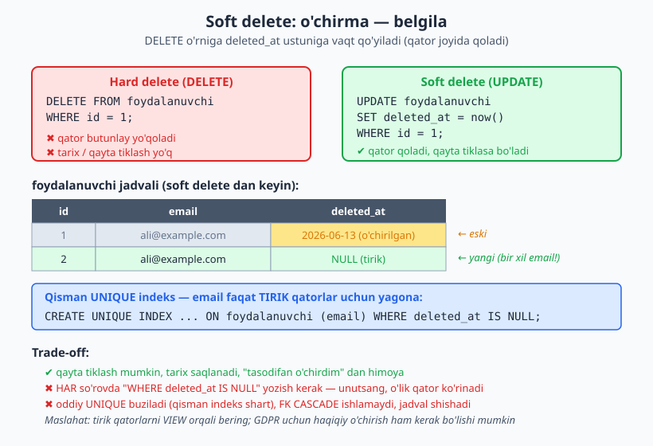
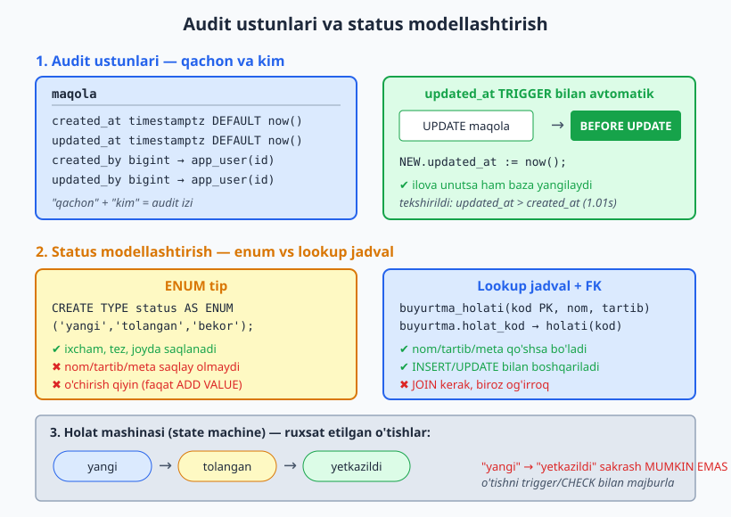
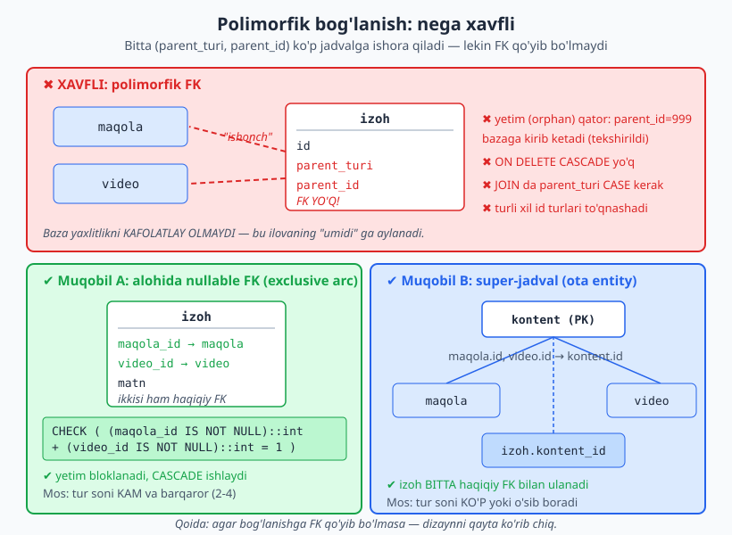

# 12 — Keng tarqalgan dizayn naqshlari

[⬅️ Oldingi: 11 — Yaxlitlik va constraint dizayni](./11-constraint-dizayni.md) · [🏠 README](./README.md) · [Keyingi: 13 — Anti-naqshlar: nima qilmaslik kerak ➡️](./13-anti-naqshlar.md)

> **Bu bobda:** real loyihalarda qayta-qayta uchraydigan tayyor yechimlarni — dizayn naqshlarini — o'rganamiz. Har biri uchun bir xil savol: qanday muammoni yechadi, qanday quriladi va qanday narxni (trade-off) to'laymiz. Soft delete, audit ustunlari, status modellashtirish, slug, lookup jadval, polimorfik bog'lanish (va nega u xavfli), i18n/tarjima, pul + valyuta, manzil — hammasini PostgreSQL 18 da haqiqatan ishga tushirib ko'ramiz.

---

## 0. Naqsh nima va nega kerak

11-bobgacha biz "qanday to'g'ri jadval qurish" ni o'rgandik: kalit, normalizatsiya, tur, constraint. Bu bob boshqacha — bu yerda **tayyor retseptlar** to'plami. Naqsh (pattern) — bu ko'p loyihada takror uchragan muammoning sinovdan o'tgan yechimi.

Hayotiy o'xshatish: oshpaz har safar noldan o'ylab topmaydi — "qovurma sous", "xamir", "marinad" kabi tayyor texnikalari bor. Sxema dizaynida ham xuddi shunday: "foydalanuvchini o'chirish kerak, lekin tarix qolsin" — bu *soft delete* naqshi; "kim, qachon o'zgartirdi" — bu *audit ustunlari* naqshi. Naqshni bilsang, g'ildirakni qaytadan ixtiro qilmaysan.

Lekin eng muhim qoida: **har naqshning narxi bor.** Naqshni "moda shunday" deb emas, balki uning trade-off'ini bilib qo'llash kerak. Shu bob davomida har naqsh uchun **muammo → yechim → trade-off** uchligini ko'rsatamiz.

> Bu bobda barcha misollar PostgreSQL 18 (port 5434) da haqiqatan ishga tushirilgan. Natijalar — psql ning real chiqishi.

---

## 1. Soft delete — "o'chirma, belgila"

### 1.1 Muammo

Foydalanuvchi hisobini o'chirdik (`DELETE`). Ertaga ma'lum bo'ldi: uning buyurtmalari hisobotda kerak edi, qo'llab-quvvatlash bo'limi "kim edi bu?" deb so'rayapti, va o'zi "hisobimni tiklang" deyapti. `DELETE` qaytib bo'lmaydi — qator butunlay yo'q.

### 1.2 Yechim

Qatorni o'chirmaymiz — uni **o'chirilgan deb belgilaymiz**. Buning uchun `deleted_at timestamptz` ustuni qo'shamiz: `NULL` = tirik, vaqt = o'chirilgan.



```sql
CREATE TABLE foydalanuvchi (
    id          bigint GENERATED ALWAYS AS IDENTITY PRIMARY KEY,
    email       text NOT NULL,
    ism         text NOT NULL,
    deleted_at  timestamptz          -- NULL = tirik, vaqt = o'chirilgan
);
```

"O'chirish" endi `UPDATE`:

```sql
UPDATE foydalanuvchi SET deleted_at = now() WHERE email = 'ali@example.com';
```

Tirik foydalanuvchilarni olish uchun har so'rovga `WHERE deleted_at IS NULL` qo'shiladi.

### 1.3 Yashirin tuzoq: UNIQUE buziladi

Agar `email` ga oddiy `UNIQUE` qo'ygan bo'lsak — soft delete uni buzadi. `ali@example.com` o'chirildi (lekin qator joyida), endi shu odam qayta ro'yxatdan o'tmoqchi — oddiy `UNIQUE` buni rad etadi, chunki o'lik qatorda hali ham o'sha email turibdi!

Yechim — **qisman (partial) UNIQUE indeks**: yagonalik faqat tirik qatorlar uchun amal qilsin:

```sql
CREATE UNIQUE INDEX uq_foydalanuvchi_email_tirik
    ON foydalanuvchi (email)
    WHERE deleted_at IS NULL;
```

Buni 5434 klasterida sinab ko'ramiz. Ali ni qo'shdik, soft-delete qildik, keyin xuddi shu email bilan yangi tirik foydalanuvchi qo'shdik — o'tdi. Ikkinchi tirik dublikat esa bloklandi:

```text
 id |      email      |     ism     | ochirilgan
----+-----------------+-------------+------------
  1 | ali@example.com | Ali         | t
  2 | ali@example.com | Ali (yangi) | f
(2 rows)

NOTICE:  OK: qisman UNIQUE indeks ikkinchi tirik dublikatni bloklab qoldi
```

Eski qator (`id=1`) qoldi, yangi tirik qator (`id=2`) bir xil email bilan o'tdi, lekin uchinchi tirik dublikat qisman indeks tomonidan rad etildi — aynan biz xohlagan xulq.

### 1.4 So'rovni soddalashtirish: VIEW

Har so'rovda `WHERE deleted_at IS NULL` ni unutib qo'yish — eng katta xato. Yechim: tirik qatorlar uchun ko'rinish (view) yarating va kundalik so'rovlarda shuni ishlating:

```sql
CREATE VIEW tirik_foydalanuvchi AS
    SELECT * FROM foydalanuvchi WHERE deleted_at IS NULL;
```

### 1.5 Trade-off

| Afzallik | Kamchilik |
|---|---|
| Qayta tiklash mumkin | Har so'rovga `WHERE deleted_at IS NULL` kerak (unutsang — o'lik qator ko'rinadi) |
| Tarix saqlanadi (audit, hisobot) | Oddiy `UNIQUE` buziladi — qisman indeks shart |
| "Tasodifan o'chirdim" dan himoya | `ON DELETE CASCADE` ishlamaydi (bola jadvallar qo'lda boshqariladi) |
| FK buzilmaydi | Jadval o'lik qatorlardan shishadi; haqiqiy o'chirish (purge) rejasi kerak |

> **Ekspert maslahati:** GDPR / "meni unut" talablari uchun soft delete YETARLI EMAS — bu yerda ma'lumot haqiqatan o'chirilishi yoki anonimlashtirilishi kerak. Soft delete'ni "tarix kerak" uchun ishlating, "maxfiylik" uchun emas. Ko'pincha aralash strategiya to'g'ri: soft delete + N kundan keyin fon ishi (background job) bilan haqiqiy purge.

---

## 2. Audit ustunlari — "qachon va kim"

### 2.1 Muammo

"Bu qator qachon yaratilgan? Oxirgi marta qachon o'zgardi? Kim o'zgartirdi?" — bu savollar ertami-kechmi har loyihada chiqadi (debug, qo'llab-quvvatlash, tergov).

### 2.2 Yechim: created_at / updated_at

Har jadvalga ikki vaqt ustuni qo'shing. `created_at` ni `DEFAULT now()` hal qiladi. `updated_at` ni esa **trigger** bilan avtomatlashtiramiz — ilova kodi uni yangilashni unutsa ham baza o'zi yangilaydi.



```sql
CREATE TABLE maqola (
    id          bigint GENERATED ALWAYS AS IDENTITY PRIMARY KEY,
    sarlavha    text NOT NULL,
    matn        text,
    created_at  timestamptz NOT NULL DEFAULT now(),
    updated_at  timestamptz NOT NULL DEFAULT now()
);

CREATE OR REPLACE FUNCTION trg_updated_at()
RETURNS trigger AS $$
BEGIN
    NEW.updated_at := now();
    RETURN NEW;
END;
$$ LANGUAGE plpgsql;

CREATE TRIGGER maqola_updated_at
    BEFORE UPDATE ON maqola
    FOR EACH ROW
    EXECUTE FUNCTION trg_updated_at();
```

Trigger UPDATE'da `updated_at` ni haqiqatan yangilashini ko'ramiz. INSERT qildik, 1 soniya kutdik (`pg_sleep(1)`), keyin UPDATE qildik:

```text
 id |          created_at           |          updated_at           | updated_yangilandi | farq_sekund
----+-------------------------------+-------------------------------+--------------------+-------------
  1 | 2026-06-13 22:12:31.723071+05 | 2026-06-13 22:12:32.737757+05 | t                  |        1.01
(1 row)
```

`updated_at` `created_at` dan **1.01 soniya** kechroq — trigger UPDATE paytida vaqtni haqiqatan yangiladi. (Bu funksiya bitta — uni loyihadagi barcha jadvallarga bog'lab ishlatish mumkin.)

### 2.3 created_by / updated_by — "kim"

Vaqtdan tashqari "kim" ham kerak bo'lsa — foydalanuvchiga FK qo'shamiz:

```sql
CREATE TABLE hujjat (
    id          bigint GENERATED ALWAYS AS IDENTITY PRIMARY KEY,
    sarlavha    text NOT NULL,
    created_at  timestamptz NOT NULL DEFAULT now(),
    updated_at  timestamptz NOT NULL DEFAULT now(),
    created_by  bigint REFERENCES app_user(id),
    updated_by  bigint REFERENCES app_user(id)
);
```

`created_by` / `updated_by` qiymatini odatda ilova beradi (sessiyadagi joriy foydalanuvchi). Tekshiruvda admin yaratdi, editor tahrirladi:

```text
 id | yaratgan | tahrirlagan
----+----------+-------------
  1 | admin    | editor
(1 row)
```

### 2.4 Trade-off va chegara

Bu naqsh **bir bosqichli** audit beradi: faqat OXIRGI o'zgarish (kim, qachon) saqlanadi. To'liq tarix kerak bo'lsa — har versiyani saqlash, "kim nimani nimaga o'zgartirdi" — bu **temporal / history table** mavzusi, uni [18-bobda](./18-temporal-versiya.md) ko'ramiz. Audit ustunlari — arzon va yengil; to'liq tarix — qimmatroq, lekin to'liqroq.

---

## 3. Status / holatni modellashtirish

### 3.1 Muammo

Buyurtmaning holati bor: `yangi → tolangan → jonatildi → yetkazildi`, yoki `bekor`. Buni qanday saqlash kerak? Uch yondashuv bor, har birining o'rni bor.

### 3.2 Variant A — ENUM tip

```sql
CREATE TYPE buyurtma_status AS ENUM
    ('yangi','tolangan','jonatildi','yetkazildi','bekor');

CREATE TABLE buyurtma_enum (
    id     bigint GENERATED ALWAYS AS IDENTITY PRIMARY KEY,
    status buyurtma_status NOT NULL DEFAULT 'yangi'
);
```

Enum ixcham va tez. Noto'g'ri qiymatni baza darhol rad etadi:

```text
NOTICE:  OK: enum noto'g'ri qiymatni bloklab qoldi
```

Yangi qiymat qo'shish mumkin (`ALTER TYPE ... ADD VALUE 'qaytarildi'`), va u haqiqatan qo'shildi:

```text
 enumlabel
------------
 yangi
 tolangan
 jonatildi
 yetkazildi
 bekor
 qaytarildi
(6 rows)
```

Lekin enum'dan qiymatni **o'chirish** og'riqli (alohida amal yo'q), va status uchun qo'shimcha ma'lumot — ko'rsatiladigan nom, saralash tartibi, rang — saqlay olmaysiz.

### 3.3 Variant B — lookup jadval + FK (tavsiya etiladi)

Agar statusga meta-ma'lumot kerak bo'lsa (nom, tartib, faollik) — lookup jadval to'g'riroq:

```sql
CREATE TABLE buyurtma_holati (
    kod    text PRIMARY KEY,          -- 'yangi', 'tolangan', ...
    nom    text NOT NULL,             -- UI da ko'rsatiladigan nom
    tartib int  NOT NULL              -- saralash uchun
);

INSERT INTO buyurtma_holati (kod, nom, tartib) VALUES
    ('yangi',     'Yangi',          1),
    ('tolangan',  'To''langan',     2),
    ('jonatildi', 'Jo''natildi',    3),
    ('yetkazildi','Yetkazildi',     4),
    ('bekor',     'Bekor qilingan', 9);

CREATE TABLE buyurtma (
    id         bigint GENERATED ALWAYS AS IDENTITY PRIMARY KEY,
    holat_kod  text NOT NULL REFERENCES buyurtma_holati(kod)
);
```

JOIN bilan ko'rsatish nomini olamiz, FK esa noto'g'ri kodni bloklaydi:

```text
 id | holat_kod |    nom
----+-----------+-----------
  1 | yangi     | Yangi
  2 | tolangan  | To'langan
  3 | yangi     | Yangi
(3 rows)

NOTICE:  OK: lookup FK noto'g'ri holat kodini bloklab qoldi
```

> **enum yoki lookup?** Qiymatlar barqaror, kam va faqat ichki mantiq uchun bo'lsa — enum (ixcham, tez). Qiymatlar UI da ko'rsatiladigan nom, tartib, rang yoki "faolmi" bayrog'iga muhtoj bo'lsa, yoki admin ularni o'zgartirishi kerak bo'lsa — lookup jadval. Shubha bo'lsa — lookup jadval, chunki uni kengaytirish osonroq.

### 3.4 Variant C — holat mashinasi (state machine)

Yuqoridagilar "hozir qaysi holat" ni saqlaydi, lekin **qaysi o'tish ruxsat etilgan** ni emas. `yangi`'dan to'g'ridan-to'g'ri `yetkazildi`'ga sakrash mantiqsiz. Ruxsat etilgan o'tishlarni majburlash uchun:

- ruxsatlar jadvali `holat_otish(qaysidan, qaysiga)` + INSERT/UPDATE oldidan tekshiruvchi trigger, yoki
- oddiy hollarda `CHECK` / trigger bilan eski va yangi qiymat juftligini tekshirish.

Bu — to'liq mavzu; bu yerda uni naqsh sifatida bilib qo'yish kifoya. Holatlar ko'p va o'tish qoidalari murakkab bo'lsa, state machine'ni alohida modellashtiring.

---

## 4. Slug — tabiiy URL kaliti

### 4.1 Muammo

`/maqola/4217` chiroyli ham, SEO uchun foydali ham emas. Foydalanuvchi va qidiruv tizimi `/maqola/postgresql-18-yangiliklari` ni afzal ko'radi. Lekin sarlavha o'zgaruvchan va takrorlanishi mumkin — uni to'g'ridan-to'g'ri kalit qilib bo'lmaydi.

### 4.2 Yechim

Sarlavhadan **slug** — URL-xavfsiz, barqaror identifikator hosil qilamiz va uni `UNIQUE` qilamiz. ID (surrogate kalit) ham qoladi — slug faqat tashqi (URL) kalit:

```sql
CREATE TABLE blog_post (
    id        bigint GENERATED ALWAYS AS IDENTITY PRIMARY KEY,
    slug      text NOT NULL,
    sarlavha  text NOT NULL,
    CONSTRAINT uq_blog_slug UNIQUE (slug),
    CONSTRAINT slug_format CHECK (slug ~ '^[a-z0-9]+(-[a-z0-9]+)*$')
);
```

`CHECK` slug formatini majburlaydi: faqat kichik harf, raqam va `-`. Yaroqsiz slug bloklandi:

```text
NOTICE:  OK: slug format CHECK yaroqsiz slug ni bloklab qoldi
```

### 4.3 Slug generatsiyasi

Sarlavhadan slug yasash uchun: kichik harfga o'tkazish + harf/raqam bo'lmagan hamma narsani `-` ga almashtirish + chetdagi `-` ni olib tashlash:

```sql
SELECT regexp_replace(
         regexp_replace(lower('  PostgreSQL 18: Dizayn Naqshlari!  '), '[^a-z0-9]+', '-', 'g'),
         '(^-|-$)', '', 'g'
       ) AS slug;
```

```text
              slug
--------------------------------
 postgresql-18-dizayn-naqshlari
```

### 4.4 Trade-off

- Slug **barqaror** bo'lishi kerak: maqola sarlavhasi o'zgarsa, slug avtomatik o'zgarmasligi lozim (aks holda eski havolalar buziladi). Odatda slug bir marta yaratiladi va qotib qoladi; o'zgartirsa — eski slug'dan yangisiga 301 redirect kerak.
- Takrorlanish: ikki maqola bir xil sarlavha bilan — `UNIQUE` buzadi. Yechim: slug oxiriga raqam qo'shish (`dizayn-naqshlari-2`).
- Slug — tabiiy kalit (6-bobdagi natural vs surrogate), shuning uchun uni PK QILMANG; PK surrogate (`id`) qolsin, slug esa `UNIQUE` tashqi kalit bo'lsin.

---

## 5. Lookup / reference jadval (kod-qiymat)

3-bo'limda lookup jadvalni status uchun ko'rdik, lekin bu undan keng naqsh. Mamlakatlar, valyutalar, kategoriyalar, ruxsat turlari — har qanday **cheklangan, nomli qiymatlar to'plami** lookup jadvalga tushadi:

```sql
CREATE TABLE valyuta (
    kod    char(3) PRIMARY KEY,    -- ISO 4217: 'UZS', 'USD'
    nom    text NOT NULL,
    onlik  smallint NOT NULL       -- nechta onlik raqam (UZS=2, JPY=0)
);
```

**Nega yaxshi:** noto'g'ri kod FK bilan bloklanadi, qiymatga meta qo'shsa bo'ladi (nom, tartib, faollik), bitta joyda boshqariladi, va kelajakda til/tarjima ham qo'shsa bo'ladi.

**Kalit tanlash:** lookup jadvalda **ma'noli matnli kod** (`'UZS'`, `'yangi'`) ko'pincha integer surrogate'dan qulayroq — `holat_kod = 'yangi'` o'qishda JOIN'siz ham tushunarli. Kod barqaror va qisqa bo'lsa, uni PK qilish o'rinli. Faqat juda katta/o'zgaruvchan lug'atlarda surrogate integer afzal.

---

## 6. Polimorfik bog'lanish — va nega u xavfli

### 6.1 Muammo va "vasvasa"

`izoh` (comment) ham `maqola`ga, ham `video`ga, ertaga `rasm`ga tegishli bo'lishi mumkin. Vasvasa: bitta `izoh` jadvali, ikki ustun — `parent_turi` ('maqola'/'video') va `parent_id`. Bitta jadval hamma narsaga ishora qiladi — chiroyli ko'rinadi.

```sql
-- ❌ ANTI-NAQSH: polimorfik FK
CREATE TABLE izoh_polimorfik (
    id          bigint GENERATED ALWAYS AS IDENTITY PRIMARY KEY,
    parent_turi text   NOT NULL,   -- 'maqola' yoki 'video'
    parent_id   bigint NOT NULL,   -- qaysidir jadval id si — FK YO'Q!
    matn        text   NOT NULL
);
```

### 6.2 Nega xavfli — baza yaxlitlikni kafolatlay olmaydi

Muammo bitta jumlada: **`parent_id` ga FK qo'yib bo'lmaydi**, chunki u goh `maqola.id`, goh `video.id` ga ishora qiladi — bitta ustun ikki jadvalga FK bo'la olmaydi. Natijada baza yaxlitlikni yo'qotadi.



Buni 5434 da ko'rsatdik. Mavjud bo'lmagan `parent_id = 999` bilan izoh — baza TO'XTATMAYDI, yetim qator kirib ketadi:

```text
 id | parent_turi | parent_id |              matn
----+-------------+-----------+--------------------------------
  2 | maqola      |       999 | Mavjud bo'lmagan maqolaga izoh
(1 row)
```

Yana yomoni: maqolani o'chirsak, uning izohlari yetim qolib ketadi (`ON DELETE CASCADE` yo'q):

```text
 id | parent_turi | parent_id | parent_yoq
----+-------------+-----------+------------
  1 | maqola      |         1 | t
  2 | maqola      |       999 | t
(2 rows)
```

Qo'shimcha og'riqlar: har JOIN'da `parent_turi` bo'yicha `CASE`/shart kerak, indekslar samarasiz, va turli jadvallarning id turlari bir ustunga sig'maydi (biri `bigint`, biri `uuid` bo'lsa — tugadi).

### 6.3 Xavfsiz muqobil A — alohida nullable FK (exclusive arc)

Tur soni **kam va barqaror** bo'lsa (2-4 ta): har tur uchun alohida nullable FK + `CHECK` bilan "aniq bittasi to'ldirilsin":

```sql
CREATE TABLE izoh_xavfsiz (
    id         bigint GENERATED ALWAYS AS IDENTITY PRIMARY KEY,
    maqola_id  bigint REFERENCES maqola(id) ON DELETE CASCADE,
    video_id   bigint REFERENCES video(id)  ON DELETE CASCADE,
    matn       text NOT NULL,
    CONSTRAINT bitta_ota CHECK (
        (maqola_id IS NOT NULL)::int + (video_id IS NOT NULL)::int = 1
    )
);
```

Endi baza hammasini kafolatlaydi. Yetim FK bloklanadi, ikkala (yoki hech qaysi) ota bloklanadi, va CASCADE ishlaydi:

```text
NOTICE:  OK: FK yetim maqola_id ni bloklab qoldi
NOTICE:  OK: CHECK ikkala ota ni bloklab qoldi (aniq bitta bo'lsin)
== CASCADE ishladi: maqola o'chdi, izoh ham ketdi ==
 qolgan_maqola_izoh
--------------------
                  0
```

### 6.4 Xavfsiz muqobil B — super-jadval (ota entity)

Tur soni **ko'p yoki o'sib boradigan** bo'lsa, har turga alohida ustun cho'zilib ketadi. Bunda umumiy ota jadval (`kontent`) yarating; `maqola` va `video` uning `id` siga FK bilan ishora qilsin (shared primary key), izoh esa BITTA haqiqiy FK bilan `kontent`ga bog'lansin:

```sql
CREATE TABLE kontent (id bigint GENERATED ALWAYS AS IDENTITY PRIMARY KEY, turi text NOT NULL);
CREATE TABLE maqola  (id bigint PRIMARY KEY REFERENCES kontent(id), sarlavha text);
CREATE TABLE video   (id bigint PRIMARY KEY REFERENCES kontent(id), davomiyligi int);
CREATE TABLE izoh    (id bigint GENERATED ALWAYS AS IDENTITY PRIMARY KEY,
                      kontent_id bigint NOT NULL REFERENCES kontent(id) ON DELETE CASCADE,
                      matn text NOT NULL);
```

> **Oltin qoida:** agar bog'lanishga FK qo'yib bo'lmasa — bu dizayn xatosining alomati. To'xtab, qayta o'ylang. Polimorfik FK 13-bobdagi anti-naqshlar ro'yxatida ham qaytadi.

---

## 7. Tarjima / i18n jadvali

### 7.1 Muammo

Ilova ko'p tilli: mahsulot nomi va tavsifi `uz`, `ru`, `en` da kerak. Har til uchun ustun (`nom_uz`, `nom_ru`, `nom_en`) qo'shish — yangi til qo'shilganda jadvalni `ALTER` qilishni talab qiladi va kengaytirilmaydi (bu jaywalking'ga yaqin anti-naqsh).

### 7.2 Yechim — alohida tarjima jadvali

Tilga bog'liq matnlarni alohida jadvalga ajratamiz; kalit `(mahsulot_id, til)`:

```sql
CREATE TABLE mahsulot (
    id    bigint GENERATED ALWAYS AS IDENTITY PRIMARY KEY,
    narx  numeric(12,2) NOT NULL
);
CREATE TABLE mahsulot_tarjima (
    mahsulot_id bigint  NOT NULL REFERENCES mahsulot(id) ON DELETE CASCADE,
    til         char(2) NOT NULL,           -- 'uz','ru','en'
    nom         text    NOT NULL,
    tavsif      text,
    PRIMARY KEY (mahsulot_id, til)
);
```

Tilga bog'liq bo'lmagan maydonlar (`narx`, `id`) asosiy jadvalda; tilga bog'liqlari tarjima jadvalida. Yangi til = yangi qator, `ALTER` kerak emas.

### 7.3 Fallback (zaxira til)

So'ralgan tilda tarjima yo'q bo'lsa, asosiy tilga (`uz`) qaytamiz — `COALESCE` bilan:

```sql
SELECT m.id, COALESCE(t_ru.nom, t_uz.nom) AS nom_korsatiladi
FROM mahsulot m
LEFT JOIN mahsulot_tarjima t_ru ON t_ru.mahsulot_id = m.id AND t_ru.til = 'ru'
LEFT JOIN mahsulot_tarjima t_uz ON t_uz.mahsulot_id = m.id AND t_uz.til = 'uz';
```

```text
 id | nom_korsatiladi
----+-----------------
  1 | Chaynik
```

> **Eslatma til kodlari haqida:** bu yerda namuna uchun `char(2)` (ISO 639-1: `uz`, `ru`, `en`) ishlatildi. To'liq lokal kerak bo'lsa (`pt-BR`, `zh-Hant`) — `text` va `til` jadvaliga FK qiling. Kirill yozuvini SAQLASH kerak bo'lsa, u ma'lumotning o'zida (qiymatda) bo'ladi — sxema/identifikator esa lotin qoladi.

---

## 8. Pul va valyuta

### 8.1 Muammo — float'da pul = falokat

Pulni `float`/`real` da saqlash — klassik xato. Suzuvchi nuqta ikkilik tizimda `0.1` ni aniq saqlay olmaydi. 5434 da ko'rsatdik:

```text
 numeric_jami |     float_jami      | float_teng_03
--------------+---------------------+---------------
          0.3 | 0.30000000000000004 | f
```

`numeric` da `0.1 + 0.2 = 0.3` aniq; `float` da esa `0.30000000000000004` — va `= 0.3` tekshiruvi `false` qaytaradi. Pul hisobida bu xatolar to'planib, balansni buzadi.

### 8.2 Yechim — numeric + valyuta kodi

Pul har doim `numeric(p, s)` da, va **valyuta kodi bilan birga** saqlanadi (summa o'zi yetarli emas — "150000" so'mmi, dollarmu?):

```sql
CREATE TABLE tolov (
    id           bigint GENERATED ALWAYS AS IDENTITY PRIMARY KEY,
    summa        numeric(14,2) NOT NULL CHECK (summa >= 0),  -- float EMAS!
    valyuta_kod  char(3) NOT NULL REFERENCES valyuta(kod)
);
```

Valyuta bo'yicha jami — aniq:

```text
 valyuta_kod |     nom      | soni |   jami
-------------+--------------+------+-----------
 USD         | AQSH dollari |    1 |     19.99
 UZS         | O'zbek so'mi |    2 | 400000.50
(2 rows)
```

### 8.3 Dizayn tafsilotlari

- **Onlik raqamlar soni valyutaga bog'liq:** UZS/USD = 2, JPY/KRW = 0. Shuning uchun lookup `valyuta` jadvalida `onlik` ustuni bor. Universal tizimda summani eng kichik birlikda (tiyin/sent) butun son sifatida saqlash ham keng tarqalgan yondashuv (`bigint`, `19.99 USD → 1999`).
- **Hech qachon turli valyutalarni qo'shmang:** `sum(summa)` ni doim `GROUP BY valyuta_kod` bilan. UZS va USD ni jamlash — ma'nosiz.
- **Kurs (konvertatsiya)** alohida masala: kurslar vaqtga bog'liq, shuning uchun tranzaksiya paytidagi kursni *snapshot* qilib saqlang (qarang: 1-bobdagi narx snapshot mantiqi).

---

## 9. Manzil modellashtirish

### 9.1 Muammo

Foydalanuvchining bir nechta manzili bo'lishi mumkin: uy, ish, yetkazish. Manzilni foydalanuvchi jadvalidagi ustunlarga (`kocha`, `shahar`...) tiqish — faqat bitta manzilga yetadi va N:1 talabni buzadi.

### 9.2 Yechim — alohida manzil jadvali (1:N)

```sql
CREATE TABLE manzil (
    id          bigint GENERATED ALWAYS AS IDENTITY PRIMARY KEY,
    mijoz_id    bigint NOT NULL REFERENCES mijoz(id) ON DELETE CASCADE,
    turi        text   NOT NULL CHECK (turi IN ('uy','ish','yetkazish')),
    mamlakat    char(2) NOT NULL,          -- ISO 3166-1 alpha-2
    viloyat     text,
    shahar      text   NOT NULL,
    kocha       text   NOT NULL,
    pochta_kod  text,
    is_asosiy   boolean NOT NULL DEFAULT false
);

-- Har mijozda faqat BITTA asosiy manzil (qisman unique):
CREATE UNIQUE INDEX uq_mijoz_asosiy_manzil
    ON manzil (mijoz_id) WHERE is_asosiy;
```

"Har mijozda bitta asosiy manzil" qoidasini yana qisman UNIQUE indeks majburlaydi. Ikkinchi asosiy manzil bloklandi:

```text
NOTICE:  OK: qisman unique ikkinchi asosiy manzilni bloklab qoldi
```

### 9.3 Dizayn maslahatlari

- **Manzil "tekis matn" yoki "tuzilgan"?** Mamlakatlar manzil formati turlicha (AQSH ZIP, Yaponiya teskari tartib). Universal tizimda ko'pincha bir nechta erkin `qator1`, `qator2` + `mamlakat` + `pochta_kod` to'g'riroq, qattiq `viloyat/shahar/kocha` strukturasidan ko'ra. Faqat bitta mamlakat ichida ishlasangiz, tuzilgan ustunlar qulay.
- **Yetkazish manzili snapshot:** buyurtma yetkazib bo'lingach, mijoz manzilini o'zgartirsa — eski buyurtma qayerga ketganini bilish kerak. Shuning uchun buyurtmaga yetkazish manzilini *nusxa* (snapshot) qilib saqlang, FK bilan tirik manzilga bog'lab emas.

---

## 10. Daraxt strukturalari — bu yerda emas

"Kategoriya ichida subkategoriya", "xodim-boshliq", "izohga javob" kabi **ierarxik (daraxt)** ma'lumot ham juda keng naqsh. Eng sodda ko'rinishi — `parent_id` ustuni (adjacency list). Lekin bu o'zining trade-off'lari (chuqurlikni so'rash, butun shoxni olish) va boshqa usullari (materialized path, nested set, closure table) bilan alohida katta mavzu.

Shuning uchun bu yerda chuqurlashtirmaymiz — daraxt va graf strukturalarini to'liq [17-bobda](./17-daraxt-graf.md) ko'ramiz. Bu yerda faqat bilib qo'ying: `parent_id` — naqsh, lekin "naive tree" (faqat `parent_id`, recursive so'rovsiz) 13-bobda anti-naqsh sifatida ham keladi.

---

## 11. Xulosa

Naqshlar — tayyor retseptlar, lekin har biri narx bilan keladi:

- **Soft delete** — tarix kerak bo'lsa; lekin qisman UNIQUE indeks va `WHERE deleted_at IS NULL` majburiyatini unutmang.
- **Audit ustunlari** — arzon "qachon/kim"; `updated_at` ni trigger bilan avtomatlashtir. To'liq tarix uchun 18-bob.
- **Status** — barqaror/ichki bo'lsa enum, meta kerak bo'lsa lookup jadval; murakkab o'tishlar uchun state machine.
- **Slug** — barqaror URL kaliti; PK emas, `UNIQUE` tashqi kalit.
- **Lookup jadval** — cheklangan nomli qiymatlar uchun FK bilan, ko'pincha matnli kod bilan.
- **Polimorfik FK** — XAVFLI (FK yo'qoladi); exclusive arc yoki super-jadval bilan almashtir.
- **i18n** — tilga bog'liq matn alohida jadvalda, `(id, til)` kaliti, `COALESCE` fallback.
- **Pul** — har doim `numeric` + valyuta kodi; float'da pul yo'q.
- **Manzil** — 1:N alohida jadval; asosiy manzil qisman UNIQUE; yetkazish manzili snapshot.

Keyingi bobda esa **teskari tomon** — aynan shu naqshlarning suiiste'moli va boshqa keng tarqalgan **anti-naqshlar**ni (nima qilmaslik kerak) ko'rib chiqamiz.

---

## Mashqlar

### Oson

1. **Soft delete qo'shish.** Quyidagi jadvalga soft delete naqshini qo'shing va tirik qatorlar uchun `email` ni yagona qiling:
   `xodim(id, email text, ism text)`. Qaysi turdagi indeks kerak va nega?

2. **updated_at unutilishi.** Bir jamoa `updated_at` ustunini qo'ydi, lekin uni faqat ilova kodida (`UPDATE ... SET updated_at = now()`) yangilaydi, trigger qo'ymadi. Bu yondashuvning xavfi nima? Bir misol keltiring qachon `updated_at` noto'g'ri bo'lib qoladi.

3. **enum yoki lookup?** Quyidagilarning har biri uchun enum yoki lookup jadval tanlang va bir jumla bilan asoslang: (a) jinsi (`erkak`/`ayol`/`korsatilmagan`), (b) buyurtma holati (UI da nom va rang bilan), (c) hafta kuni.

4. **Float'da pul.** `mahsulot(id, narx real)` jadvali bor. Bu nega xato? To'g'ri tur nima? Bir misol bilan (qiymat) ko'rsating qachon `real` xato natija beradi.

5. **Slug PK emas.** Bir dasturchi `blog_post` da `slug` ni PRIMARY KEY qildi (`id` yo'q). Bu nega yomon g'oya? Kamida ikki sabab keltiring.

### O'rta

6. **Soft delete + FK muammosi.** `buyurtma.mijoz_id → mijoz(id)` FK bor va `mijoz` soft delete ishlatadi. Mijozni soft-delete qilganda nima sodir bo'ladi (qator hali turibdi)? Bu holatda `ON DELETE CASCADE` ishlaydimi? Bu vaziyatni qanday boshqarish kerak?

7. **Audit ustunlari to'plamini loyihala.** `hujjat` jadvaliga to'liq audit qo'shing: `created_at`, `updated_at`, `created_by`, `updated_by`. `updated_at` uchun trigger yozing. `created_at` va `created_by` ni UPDATE da o'zgarmas (immutable) qilish uchun nima qilasiz?

8. **i18n ni qayta loyihala.** Quyidagi jadval ko'p tilli kontent uchun ishlatilgan:
   `mahsulot(id, nom_uz, nom_ru, nom_en, tavsif_uz, tavsif_ru, tavsif_en, narx)`.
   Buni i18n naqshiga qayta loyihalang. Yangi til (`kz`) qo'shilganda eski va yangi dizaynda nima farq?

9. **Manzil — bitta asosiy.** Mijozning ko'p manzili bor, lekin aniq bittasi "asosiy" bo'lishi kerak. Buni baza darajasida qanday majburlaysiz? DDL yozing va nega ilova kodiga ishonmaslik kerakligini tushuntiring.

10. **Status o'tishini cheklash.** `buyurtma` holati `yangi → tolangan → yetkazildi` tartibida bo'lishi kerak, sakrash mumkin emas. Buni qanday majburlaysiz? Bir necha yondashuvni (CHECK, trigger, o'tishlar jadvali) sanab, qaysi biri qachon to'g'ri ekanini ayting.

### Qiyin

11. **Polimorfikni xavfsiz qayta loyihala.** Quyidagi anti-naqsh berilgan:
    `like(id, user_id, target_turi text, target_id bigint)` — `target_turi` 'maqola'/'izoh'/'foto' bo'lishi mumkin, FK yo'q.
    (a) Bu dizaynning aniq xavflarini sanang. (b) Exclusive arc yondashuvi bilan qayta loyihalang (DDL + CHECK). (c) Agar turlar soni 10 taga yetsa, qaysi yondashuv to'g'ri va nega?

12. **Soft delete + unique + tarix.** Foydalanuvchi `email` ni o'zgartirib, keyin hisobini o'chiradi, keyin yana shu email bilan yangi hisob ochadi — bularning hammasi vaqt o'tishi bilan. Tirik foydalanuvchilar orasida email yagona bo'lsin, lekin barcha eski (o'chirilgan) qatorlar tarix sifatida qolsin. To'liq DDL yozing va 3-4 INSERT/UPDATE bilan stsenariyni ko'rsating.

13. **Ko'p valyutali hamyon.** Foydalanuvchining bir nechta valyutadagi balansi bo'lishi mumkin (UZS, USD, ...). Sxemani loyihalang: `hamyon`, `valyuta` jadvallari. "Bir foydalanuvchida har valyutadan bitta hamyon" qoidasini majburlang. Balansni qaysi turda saqlaysiz va nega? Turli valyutalarni qo'shib yuborishdan qanday himoyalanasiz?

14. **To'liq mahsulot katalogi naqshlari.** Marketplace mahsulot katalogini loyihalang, bir nechta naqshni birlashtirib: (a) soft delete (mahsulot "arxivlandi", lekin eski buyurtmalarda ko'rinadi), (b) i18n (nom/tavsif uz/ru/en), (c) status (lookup jadval: `qoralama`/`faol`/`arxiv`), (d) pul (numeric + valyuta), (e) audit (created/updated at+by). To'liq DDL yozing va har naqsh qaysi muammoni yechayotganini bir jumla bilan izohlang.

---

## Yechimlar

<details markdown="1">
<summary>Yechim — 1</summary>

`deleted_at timestamptz` ustuni va **qisman (partial) UNIQUE indeks** kerak — oddiy `UNIQUE` emas, chunki o'chirilgan qatorda eski email qolib, qayta ro'yxatdan o'tishni bloklab qo'yadi.

```sql
ALTER TABLE xodim ADD COLUMN deleted_at timestamptz;
CREATE UNIQUE INDEX uq_xodim_email_tirik
    ON xodim (email) WHERE deleted_at IS NULL;
```

Qisman indeks yagonalikni faqat tirik (`deleted_at IS NULL`) qatorlarga qo'llaydi.

</details>

<details markdown="1">
<summary>Yechim — 2</summary>

Xavf: ilova kodida `updated_at` ni yangilash **unutilishi mumkin**. Bir necha joydan UPDATE qilinsa (admin paneli, API, migratsiya skripti, qo'lda `psql` UPDATE), kimdir `updated_at = now()` qo'shishni o'tkazib yuboradi — natijada `updated_at` haqiqiy o'zgarish vaqtini ko'rsatmaydi.

Misol: ma'lumotni to'g'ridan-to'g'ri `psql` dan `UPDATE maqola SET matn = '...' WHERE id = 1;` qilsangiz — `updated_at` eski qiymatda qoladi, garchi qator o'zgargan bo'lsa ham. Trigger (`BEFORE UPDATE`) buni hal qiladi: kim qaysi yo'l bilan UPDATE qilmasin, baza `updated_at` ni avtomatik yangilaydi.

</details>

<details markdown="1">
<summary>Yechim — 3</summary>

- **(a) jinsi** — enum (yoki `CHECK IN (...)`). Qiymatlar barqaror, kam, meta kerak emas.
- **(b) buyurtma holati (nom + rang bilan)** — lookup jadval. UI uchun nom, rang, tartib saqlash kerak; bu enum'ga sig'maydi.
- **(c) hafta kuni** — enum yoki shunchaki `CHECK (kun BETWEEN 1 AND 7)`. Qat'iy, o'zgarmas; lookup jadval ortiqcha (agar lokalizatsiya kerak bo'lmasa). Agar kun nomini ko'p tilda chiqarish kerak bo'lsa — lookup + i18n.

</details>

<details markdown="1">
<summary>Yechim — 4</summary>

`real` (float) pulni aniq saqlay olmaydi — ikkilik suzuvchi nuqta ko'p o'nlik kasrni yaxlitlaydi. Xatolar to'planib balansni buzadi.

To'g'ri tur: `numeric(p, s)` (masalan `numeric(12, 2)`).

Misol (5434 da tasdiqlangan): `0.1 + 0.2` float da `0.30000000000000004` beradi, `numeric` da esa aniq `0.3`. 1000 ta tranzaksiya yig'ilganda bu xato sezilarli summaga aylanadi va `summa = 0.3` kabi tekshiruvlar `false` qaytaradi.

```sql
ALTER TABLE mahsulot ALTER COLUMN narx TYPE numeric(12,2);
```

</details>

<details markdown="1">
<summary>Yechim — 5</summary>

1. **Slug o'zgaruvchan:** slug — tabiiy kalit, vaqt o'tib o'zgarishi mumkin (sarlavha tahrir qilinsa). PK o'zgarsa — unga ishora qilgan barcha FK lar ham o'zgarishi kerak (yoki buziladi). Surrogate `id` esa hech qachon o'zgarmaydi.
2. **FK og'irligi:** `text` PK bola jadvallarda takrorlanadi, indeks kattaroq va sekinroq bo'ladi (`bigint` ga nisbatan).
3. (Qo'shimcha) takror sarlavhalar slug to'qnashuviga olib keladi; surrogate kalit bunga befarq.

To'g'ri yondashuv: `id` (surrogate) — PK; `slug` — `UNIQUE` tashqi kalit.

</details>

<details markdown="1">
<summary>Yechim — 6</summary>

Mijoz soft-delete qilinganda qator JOIDA QOLADI (`deleted_at` to'ldiriladi, `DELETE` bo'lmaydi). Demak:

- `ON DELETE CASCADE` **ishlamaydi** — chunki haqiqiy `DELETE` yuz bermayapti. Buyurtmalar daxlsiz qoladi (ko'pincha bu to'g'ri — buyurtma tarixi yo'qolmasligi kerak).
- FK ham buzilmaydi, chunki ota qator hali mavjud.

Boshqarish: bu aslida soft delete'ning **afzalligi** — bog'liq ma'lumot saqlanadi. Lekin "tirik mijozlar" so'rovlarida `WHERE m.deleted_at IS NULL` ni unutmaslik kerak. Agar o'chirilgan mijozning buyurtmalarini ham yashirish kerak bo'lsa, buni JOIN shartida hisobga oling. Mijozni HAQIQATAN o'chirish (purge) kerak bo'lsa — avval bog'liq buyurtmalar bilan nima qilishni hal qiling (arxivlash/anonimlashtirish).

</details>

<details markdown="1">
<summary>Yechim — 7</summary>

```sql
CREATE TABLE hujjat (
    id          bigint GENERATED ALWAYS AS IDENTITY PRIMARY KEY,
    sarlavha    text NOT NULL,
    created_at  timestamptz NOT NULL DEFAULT now(),
    updated_at  timestamptz NOT NULL DEFAULT now(),
    created_by  bigint REFERENCES app_user(id),
    updated_by  bigint REFERENCES app_user(id)
);

CREATE OR REPLACE FUNCTION trg_audit_update()
RETURNS trigger AS $$
BEGIN
    NEW.updated_at := now();
    -- created_at / created_by ni o'zgarmas qilamiz:
    NEW.created_at := OLD.created_at;
    NEW.created_by := OLD.created_by;
    RETURN NEW;
END;
$$ LANGUAGE plpgsql;

CREATE TRIGGER hujjat_audit
    BEFORE UPDATE ON hujjat
    FOR EACH ROW EXECUTE FUNCTION trg_audit_update();
```

`created_at`/`created_by` ni immutable qilish: trigger ichida `NEW.created_at := OLD.created_at` — UPDATE ularni o'zgartirmaydi, kim urinmasin. `updated_by` ni odatda ilova beradi (joriy foydalanuvchi).

</details>

<details markdown="1">
<summary>Yechim — 8</summary>

```sql
CREATE TABLE mahsulot (
    id    bigint GENERATED ALWAYS AS IDENTITY PRIMARY KEY,
    narx  numeric(12,2) NOT NULL
);
CREATE TABLE mahsulot_tarjima (
    mahsulot_id bigint  NOT NULL REFERENCES mahsulot(id) ON DELETE CASCADE,
    til         char(2) NOT NULL,
    nom         text    NOT NULL,
    tavsif      text,
    PRIMARY KEY (mahsulot_id, til)
);
```

Farq: eski (ustunli) dizaynda yangi til `kz` qo'shish uchun `ALTER TABLE ... ADD COLUMN nom_kz, ADD COLUMN tavsif_kz` kerak — sxema o'zgaradi, migratsiya yoziladi, kod yangilanadi. Yangi (i18n) dizaynda esa atigi yangi qatorlar qo'shiladi (`INSERT ... (mahsulot_id, 'kz', ...)`), sxema o'zgarmaydi. i18n dizayn ochiq tugagan tillar to'plamiga moslashadi.

</details>

<details markdown="1">
<summary>Yechim — 9</summary>

```sql
CREATE UNIQUE INDEX uq_mijoz_asosiy_manzil
    ON manzil (mijoz_id) WHERE is_asosiy;
```

Qisman UNIQUE indeks: `mijoz_id` faqat `is_asosiy = true` qatorlar ichida yagona — ya'ni har mijozda eng ko'pi bitta asosiy manzil.

Nega ilova kodiga ishonmaslik kerak: ilova "yangi asosiyni belgilashdan oldin eskisini bekor qil" mantig'ini bajarmasa yoki ikki so'rov bir vaqtda kelsa (race condition), ikki asosiy manzil paydo bo'lib qoladi. Baza darajasidagi qisman indeks — bu xatoning oldini fizik ravishda oladi (11-bob: "baza himoyasi — oxirgi qal'a").

</details>

<details markdown="1">
<summary>Yechim — 10</summary>

Yondashuvlar:

- **CHECK** — yetarli emas: `CHECK` faqat joriy qatorning ustunlarini ko'radi, eski qiymatni (`OLD`) bilmaydi, shuning uchun "yangidan tolanganga o'tish" mumkinmi degan o'tish qoidasini tekshira olmaydi.
- **BEFORE UPDATE trigger** — to'g'ri yo'l oddiy hollarda: `OLD.holat` va `NEW.holat` juftligini ruxsat etilgan o'tishlar bilan solishtiradi.

```sql
CREATE OR REPLACE FUNCTION trg_holat_otish()
RETURNS trigger AS $$
BEGIN
  IF NOT (
       (OLD.holat = 'yangi'    AND NEW.holat IN ('tolangan','bekor')) OR
       (OLD.holat = 'tolangan' AND NEW.holat IN ('yetkazildi','bekor')) OR
       (OLD.holat = NEW.holat)
     ) THEN
    RAISE EXCEPTION 'Ruxsat etilmagan o''tish: % -> %', OLD.holat, NEW.holat;
  END IF;
  RETURN NEW;
END;
$$ LANGUAGE plpgsql;
```

- **O'tishlar jadvali** (`holat_otish(qaysidan, qaysiga)`) + trigger — eng moslashuvchan: o'tish qoidalari ma'lumot bo'lib qoladi (kodga emas), admin ularni o'zgartira oladi. Holatlar ko'p va qoidalar tez-tez o'zgaradigan bo'lsa shu to'g'ri.

</details>

<details markdown="1">
<summary>Yechim — 11</summary>

**(a) Xavflar:** `target_id` ga FK yo'q — yetim like'lar (mavjud bo'lmagan maqolaga like) kirib ketadi; maqola o'chsa like yetim qoladi (CASCADE yo'q); JOIN'da `target_turi` bo'yicha shart kerak; turli jadval id turlari to'qnashishi mumkin; UNIQUE ("bir user bir narsaga bir marta like") murakkablashadi.

**(b) Exclusive arc:**

```sql
CREATE TABLE like_xavfsiz (
    id        bigint GENERATED ALWAYS AS IDENTITY PRIMARY KEY,
    user_id   bigint NOT NULL REFERENCES app_user(id) ON DELETE CASCADE,
    maqola_id bigint REFERENCES maqola(id) ON DELETE CASCADE,
    izoh_id   bigint REFERENCES izoh(id)   ON DELETE CASCADE,
    foto_id   bigint REFERENCES foto(id)   ON DELETE CASCADE,
    CHECK (
       (maqola_id IS NOT NULL)::int
     + (izoh_id   IS NOT NULL)::int
     + (foto_id   IS NOT NULL)::int = 1
    ),
    UNIQUE (user_id, maqola_id),
    UNIQUE (user_id, izoh_id),
    UNIQUE (user_id, foto_id)
);
```

**(c) 10 turga yetsa:** exclusive arc cho'zilib ketadi (10 ustun + 10 FK + ulkan CHECK). Bunda **super-jadval** to'g'ri: umumiy `likeable` (yoki `kontent`) ota jadval, har tur uning `id` siga FK, `like` esa bitta `kontent_id` FK bilan ulanadi. Ustun soni turlar soniga bog'liq emas.

</details>

<details markdown="1">
<summary>Yechim — 12</summary>

```sql
CREATE TABLE foydalanuvchi (
    id          bigint GENERATED ALWAYS AS IDENTITY PRIMARY KEY,
    email       text NOT NULL,
    deleted_at  timestamptz
);
CREATE UNIQUE INDEX uq_email_tirik
    ON foydalanuvchi (email) WHERE deleted_at IS NULL;

-- 1) Ro'yxatdan o'tish
INSERT INTO foydalanuvchi (email) VALUES ('a@x.com');           -- id 1
-- 2) Email o'zgartirish
UPDATE foydalanuvchi SET email = 'b@x.com' WHERE id = 1;
-- 3) Hisobni o'chirish (soft)
UPDATE foydalanuvchi SET deleted_at = now() WHERE id = 1;
-- 4) Xuddi shu email bilan yangi hisob — o'tadi (eskisi o'lik)
INSERT INTO foydalanuvchi (email) VALUES ('b@x.com');           -- id 2
```

Natija: 2 ta qator — `id=1` (`b@x.com`, o'chirilgan, tarix) va `id=2` (`b@x.com`, tirik). Qisman indeks faqat tirik qatorlarni tekshirgani uchun ikkalasi birga yashaydi. Endi `id=2` ni tirikligida yana bir `b@x.com` tirik qo'shsa — bloklanadi.

Bu naqsh 5434 da (1.3-bo'lim) aynan shu mantiq bilan tasdiqlangan.

</details>

<details markdown="1">
<summary>Yechim — 13</summary>

```sql
CREATE TABLE valyuta (
    kod   char(3) PRIMARY KEY,
    onlik smallint NOT NULL
);
CREATE TABLE hamyon (
    id          bigint GENERATED ALWAYS AS IDENTITY PRIMARY KEY,
    user_id     bigint NOT NULL REFERENCES app_user(id),
    valyuta_kod char(3) NOT NULL REFERENCES valyuta(kod),
    balans      numeric(18,2) NOT NULL DEFAULT 0 CHECK (balans >= 0),
    UNIQUE (user_id, valyuta_kod)     -- har valyutadan bitta hamyon
);
```

- **Balans turi:** `numeric` — pul aniq bo'lishi shart (float emas, 8-bo'lim).
- **Bir valyutadan bitta hamyon:** `UNIQUE (user_id, valyuta_kod)`.
- **Valyuta aralashuvidan himoya:** har hamyon o'z `valyuta_kod` iga ega; balansni boshqa hamyon balansiga to'g'ridan-to'g'ri qo'shib bo'lmaydi (har biri alohida qator). Konvertatsiya alohida amal (kurs bilan) bo'lib, ikki hamyon o'rtasida tranzaksiya sifatida bajariladi. Hisobotlarda `sum(balans)` doim `GROUP BY valyuta_kod` bilan.

</details>

<details markdown="1">
<summary>Yechim — 14</summary>

```sql
-- Lookup: mahsulot statusi (i18n / meta uchun jadval)
CREATE TABLE mahsulot_status (
    kod text PRIMARY KEY, nom text NOT NULL, tartib int NOT NULL
);
INSERT INTO mahsulot_status VALUES
    ('qoralama','Qoralama',1), ('faol','Faol',2), ('arxiv','Arxiv',9);

-- Valyuta lookup
CREATE TABLE valyuta (kod char(3) PRIMARY KEY, onlik smallint NOT NULL);

-- Asosiy mahsulot: pul + status + audit + soft delete
CREATE TABLE mahsulot (
    id          bigint GENERATED ALWAYS AS IDENTITY PRIMARY KEY,
    narx        numeric(12,2) NOT NULL CHECK (narx >= 0),  -- (d) pul
    valyuta_kod char(3) NOT NULL REFERENCES valyuta(kod),  -- (d) valyuta
    status_kod  text NOT NULL DEFAULT 'qoralama'
                     REFERENCES mahsulot_status(kod),       -- (c) status (lookup)
    created_at  timestamptz NOT NULL DEFAULT now(),         -- (e) audit
    updated_at  timestamptz NOT NULL DEFAULT now(),
    created_by  bigint REFERENCES app_user(id),
    updated_by  bigint REFERENCES app_user(id),
    deleted_at  timestamptz                                 -- (a) soft delete
);

-- (b) i18n: tilga bog'liq matnlar alohida
CREATE TABLE mahsulot_tarjima (
    mahsulot_id bigint  NOT NULL REFERENCES mahsulot(id) ON DELETE CASCADE,
    til         char(2) NOT NULL,
    nom         text    NOT NULL,
    tavsif      text,
    PRIMARY KEY (mahsulot_id, til)
);

-- updated_at trigger
CREATE TRIGGER mahsulot_upd BEFORE UPDATE ON mahsulot
    FOR EACH ROW EXECUTE FUNCTION trg_updated_at();
```

Har naqsh nimani yechadi:

- **(a) soft delete** (`deleted_at`) — mahsulot "arxivlandi"/o'chdi, lekin eski buyurtmalar unga ishora qilishni davom etadi (tarix saqlanadi).
- **(b) i18n** — nom/tavsif uz/ru/en, yangi til `ALTER`'siz qo'shiladi.
- **(c) status** (lookup) — `qoralama/faol/arxiv` UI nomi va tartibi bilan; noto'g'ri status FK bilan bloklanadi.
- **(d) pul** — `numeric` + valyuta kodi, float xatosi yo'q.
- **(e) audit** — kim/qachon yaratdi va oxirgi tahrirladi; `updated_at` trigger bilan avtomatik.

(Eslatma: `status` enum emas, lookup jadval tanlandi — chunki UI nomi/tartibi kerak; `soft delete` borligida `arxiv` statusi va `deleted_at` farqi: `arxiv` — biznes holati, `deleted_at` — texnik o'chirish.)

</details>

---

[⬅️ Oldingi: 11 — Yaxlitlik va constraint dizayni](./11-constraint-dizayni.md) · [🏠 README](./README.md) · [Keyingi: 13 — Anti-naqshlar: nima qilmaslik kerak ➡️](./13-anti-naqshlar.md)
