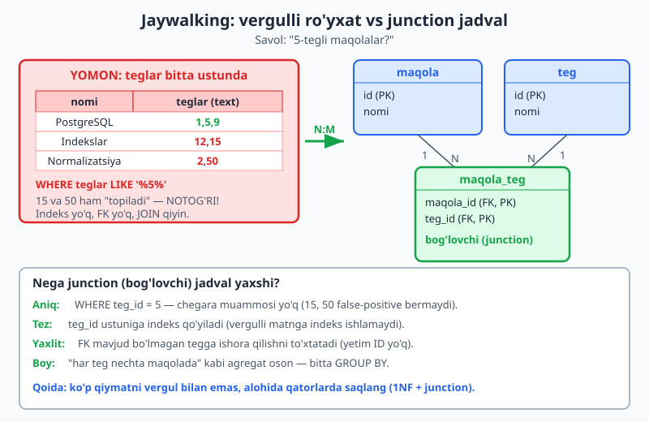
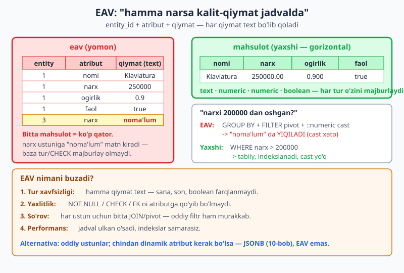
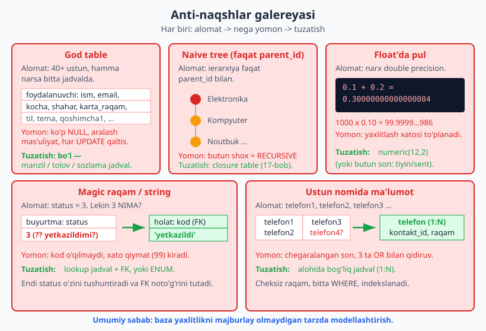

# 13 — Anti-naqshlar: nima qilmaslik kerak

[⬅️ Oldingi: 12 — Keng tarqalgan dizayn naqshlari](./12-dizayn-naqshlari.md) · [🏠 README](./README.md) · [Keyingi: 14 — Indeks strategiyasi ➡️](./14-indeks-strategiyasi.md)

> **Bu bobda:** [12-bobda](./12-dizayn-naqshlari.md) "qanday qilish kerak" ni ko'rdik. Bu bob — teskarisi: keng tarqalgan **anti-naqshlar** (antipatterns) — birinchi qarashda qulay tuyuladigan, lekin keyin og'riq keltiradigan dizayn xatolari. Har birini bir xil tartibda ko'ramiz: **ALOMAT** (kodda qanday ko'rinadi) -> **NEGA yomon** -> **TUZATISH** (qanday qayta loyihalash). Qamragan anti-naqshlar: vergulli ro'yxat (jaywalking), EAV, naive tree, god table, polimorfik FK, NULL suiiste'moli, magic raqam, ustun nomida ma'lumot, float'da pul, indekssiz FK. Hamma muammoni PostgreSQL 18 da haqiqatan ishga tushirib ko'rsatamiz.

---

## 0. Anti-naqsh nima va nega ularni o'rganamiz

**Anti-naqsh** — bu *takror uchraydigan, dastlab jozibali, lekin oqibatda zararli* yechim. Naqsh (pattern) sinovdan o'tgan yaxshi yechim bo'lsa, anti-naqsh — sinovdan o'tgan **yomon** yechim. Ularni alohida o'rganishning sababi oddiy: bu xatolar shu qadar tez-tez takrorlanadiki, ularning o'z nomi bor. Nomini bilsangiz — kod-ko'rikda (code review) ularni darhol taniysiz va "bu jaywalking-ku" deb bir og'iz bilan tushuntirasiz.

Bu bobdagi deyarli har bir anti-naqshning ildizi bitta umumiy sababga borib taqaladi:

> **Bosh sabab:** ma'lumotni shunday modellashtirishki, baza endi **yaxlitlikni majburlay olmaydi**. [11-bobda](./11-constraint-dizayni.md) "baza himoyasi — oxirgi qal'a" deganimizni eslang. Anti-naqshlar aynan shu qal'ani buzadi: FK, CHECK, NOT NULL, to'g'ri tur — bularning hech biri qo'llanolmaydigan tuzilish yaratadi.

Har bir bo'limda yomon va yaxshi yondashuvni **5434 portidagi PG18 klasterida** yonma-yon ishga tushirib, farqni real natija bilan ko'rsatamiz.

---

## 1. Jaywalking — vergulli ro'yxat bitta ustunda

### 1.1 Alomat

Eng keng tarqalgan anti-naqsh. Bir entity ko'p qiymatga ega bo'lganda (maqolaning teglari, foydalanuvchining rollari), ularni bitta matn ustunida vergul bilan saqlash:

```sql
CREATE TABLE maqola_yomon (
    id     int PRIMARY KEY,
    nomi   text NOT NULL,
    teglar text          -- "1,5,9" kabi vergulli ro'yxat
);
INSERT INTO maqola_yomon VALUES
  (1,'PostgreSQL 18',  '1,5,9'),    -- haqiqatan 5-tegli
  (2,'Indekslar',      '12,15'),    -- 5 YO'Q, lekin 15 ichida "5" bor
  (3,'Normalizatsiya', '2,50'),     -- 5 YO'Q, lekin 50 ichida "5" bor
  (4,'Float xatosi',   '5,7');      -- haqiqatan 5-tegli
```

Nomi "jaywalking" — yo'lni belgilangan o'tish joyidan tashqarida kesib o'tish kabi, normalizatsiya qoidasini (1NF — atomiklik) "kesib o'tish".



### 1.2 Nega yomon

Eng yaqqol muammo — **qidiruv**. "5-tegli maqolalar" ni topmoqchimiz. Tabiiy urinish:

```sql
SELECT id, nomi, teglar FROM maqola_yomon WHERE teglar LIKE '%5%';
```

Natija (5434 da tekshirildi) — to'rttala qator ham chiqdi, garchi faqat 1 va 4 chindan 5-tegli:

```
 id |      nomi      | teglar
----+----------------+--------
  1 | PostgreSQL 18  | 1,5,9
  2 | Indekslar      | 12,15
  3 | Normalizatsiya | 2,50
  4 | Float xatosi   | 5,7
```

`LIKE '%5%'` `15` va `50` ichidagi `5` ni ham "topdi" — bular **false-positive**. To'g'ri qilish uchun chegara qo'shib hiyla ishlatishga majbur bo'lasiz (`',' || teglar || ','` ga `'%,5,%'`):

```sql
SELECT id, nomi, teglar FROM maqola_yomon
WHERE ',' || teglar || ',' LIKE '%,5,%';
```

Natija (5434 da tekshirildi) — endi faqat to'g'ri ikkita:

```
 id |     nomi      | teglar
----+---------------+--------
  1 | PostgreSQL 18 | 1,5,9
  4 | Float xatosi  | 5,7
```

Ishladi, lekin bu yechim qimmat: (a) **indeks ishlamaydi** — `LIKE '%...%'` har doim seq scan; (b) yangi teg qo'shish/o'chirish satr ichidagi matnni qayta yozishni talab qiladi; (c) **FK yo'q** — `'999'` kabi mavjud bo'lmagan tegni hech narsa to'xtatmaydi; (d) "har teg nechta maqolada" kabi agregat deyarli imkonsiz.

### 1.3 Tuzatish — junction (bog'lovchi) jadval

Bu klassik N:M munosabat ([04-bobni eslang](./04-boglanish-kardinallik.md)) — uni bog'lovchi jadval bilan modellashtiramiz:

```sql
CREATE TABLE maqola (id int PRIMARY KEY, nomi text NOT NULL);
CREATE TABLE teg    (id int PRIMARY KEY, nomi text NOT NULL UNIQUE);
CREATE TABLE maqola_teg (
    maqola_id int NOT NULL REFERENCES maqola(id),
    teg_id    int NOT NULL REFERENCES teg(id),
    PRIMARY KEY (maqola_id, teg_id)
);
```

Endi "5-tegli maqolalar" — aniq va indekslanadigan so'rov:

```sql
SELECT m.id, m.nomi
FROM maqola m
JOIN maqola_teg mt ON mt.maqola_id = m.id
WHERE mt.teg_id = 5
ORDER BY m.id;
```

Natija (5434 da tekshirildi) — chegara muammosi yo'q, faqat haqiqiy 5-teglilar:

```
 id |     nomi
----+---------------
  1 | PostgreSQL 18
  4 | Float xatosi
```

Bonus: agregat ham oson bo'ldi. "Har teg nechta maqolada":

```sql
SELECT t.nomi, count(*) AS maqola_soni
FROM teg t JOIN maqola_teg mt ON mt.teg_id = t.id
GROUP BY t.nomi ORDER BY maqola_soni DESC, t.nomi;
```

Va yaxlitlik tiklandi — mavjud bo'lmagan tegga ishora qilolmaysiz:

```sql
INSERT INTO maqola_teg VALUES (1, 999);   -- 999 teg yo'q
```

Natija (5434 da tekshirildi) — FK to'xtatdi:

```
ERROR:  insert or update on table "maqola_teg" violates foreign key constraint "maqola_teg_teg_id_fkey"
DETAIL:  Key (teg_id)=(999) is not present in table "teg".
```

> **Istisno (har doimgidek):** agar ro'yxat **chindan atomik** bo'lsa — uni hech qachon element bo'yicha qidirmaysiz/birlashtirmaysiz, faqat butun o'qiysiz (masalan, log qatori yoki "tanlangan opsiyalar" snapshoti) — PostgreSQL `array` yoki `jsonb` to'g'ri yechim bo'lishi mumkin ([10-bobni eslang](./10-malumot-turlari.md)). Anti-naqsh — bu **CSV matnni** ustunda saqlab, keyin uni `LIKE` bilan element-element qidirishga urinish.

---

## 2. EAV — entity-attribute-value

### 2.1 Alomat

"Bizning mahsulotlar har xil — kitobning sahifalari bor, telefonning xotirasi, kiyimning o'lchami. Hammasini bitta moslashuvchan jadvalda saqlaylik" degan vasvasa. Natija — uchta ustunli universal jadval:

```sql
CREATE TABLE eav (
    entity_id int  NOT NULL,
    atribut   text NOT NULL,
    qiymat    text,                       -- HAMMA narsa text!
    PRIMARY KEY (entity_id, atribut)
);
INSERT INTO eav VALUES
  (1,'nomi','Klaviatura'), (1,'narx','250000'), (1,'ogirlik','0.9'), (1,'faol','true'),
  (2,'nomi','Sichqoncha'), (2,'narx','120000'), (2,'ogirlik','0.1'), (2,'faol','false'),
  (3,'nomi','Monitor'),    (3,'narx','noma''lum'),                    (3,'faol','true');
```

Har bir "atribut" — alohida qator. Bitta mahsulot bir necha qatorga "yoyiladi".



### 2.2 Nega yomon

Yuqoridagi `INSERT` ga e'tibor bering: 3-mahsulot narxi sifatida `'noma'lum'` degan **matn** kirdi va baza buni **to'xtatmadi**. Sababi — `qiymat` ustuni `text`, demak son uchun mo'ljallangan maydonga ham har qanday matn sig'adi. Tur xavfsizligi yo'q.

Endi oddiy savol beraylik: "narxi 200000 dan oshgan mahsulotlar". EAV da bu pivot (`GROUP BY` + `FILTER`) va `::numeric` cast talab qiladi:

```sql
SELECT entity_id,
       max(qiymat) FILTER (WHERE atribut='nomi') AS nomi,
       max(qiymat) FILTER (WHERE atribut='narx') AS narx_text
FROM eav
GROUP BY entity_id
HAVING (max(qiymat) FILTER (WHERE atribut='narx'))::numeric > 200000;
```

Natija (5434 da tekshirildi) — so'rov YIQILDI:

```
ERROR:  invalid input syntax for type numeric: "noma'lum"
```

Mana EAV ning haqiqiy narxi: bitta "noma'lum" matn butun so'rovni qulatadi, chunki cast unga qoqilib ketdi. Va bu faqat boshlanishi. EAV da:

- **Tur xavfsizligi yo'q** — sana, son, boolean — hammasi `text`, baza farqlamaydi.
- **Yaxlitlik yo'q** — `narx` ga `NOT NULL` yoki `CHECK (narx >= 0)` qo'yib bo'lmaydi, chunki u "atribut", ustun emas.
- **Har so'rov murakkab** — har kerakli maydon uchun bitta JOIN yoki pivot.
- **Performans** — N ta atributli M ta entity = `N*M` qator; indekslar samarasiz.

### 2.3 Tuzatish — oddiy relyatsion jadval

Atributlar ma'lum bo'lsa (deyarli har doim shunday), ularni **ustun** qiling — har biri o'z turi va constraint'i bilan:

```sql
CREATE TABLE mahsulot_yaxshi (
    id      int PRIMARY KEY,
    nomi    text          NOT NULL,
    narx    numeric(12,2) NOT NULL CHECK (narx >= 0),
    ogirlik numeric(6,3),
    faol    boolean       NOT NULL DEFAULT true
);
INSERT INTO mahsulot_yaxshi VALUES
  (1,'Klaviatura', 250000.00, 0.900, true),
  (2,'Sichqoncha', 120000.00, 0.100, false),
  (3,'Monitor',   1500000.00, NULL,  true);
```

Endi o'sha savol tabiiy, cast'siz va indekslanadigan:

```sql
SELECT id, nomi, narx FROM mahsulot_yaxshi WHERE narx > 200000 ORDER BY narx;
```

Natija (5434 da tekshirildi):

```
 id |    nomi    |    narx
----+------------+------------
  1 | Klaviatura |  250000.00
  3 | Monitor    | 1500000.00
```

Va baza endi yaxlitlikni majburlaydi — narxga matn yoki manfiy son kirmaydi:

```sql
INSERT INTO mahsulot_yaxshi (id,nomi,narx) VALUES (4,'Buzuq','noma''lum');
INSERT INTO mahsulot_yaxshi (id,nomi,narx) VALUES (5,'Manfiy',-100);
```

Natija (5434 da tekshirildi) — ikkalasi ham rad etildi:

```
ERROR:  invalid input syntax for type numeric: "noma'lum"
ERROR:  new row for relation "mahsulot_yaxshi" violates check constraint "mahsulot_yaxshi_narx_check"
```

> **"Lekin atributlarim chindan dinamik!"** Ba'zan atributlar oldindan noma'lum bo'ladi (foydalanuvchi o'zi maydon qo'shadigan CRM). Bu holatda ham EAV emas, **JSONB** ustunidan foydalaning ([10-bobni eslang](./10-malumot-turlari.md)): `qoshimcha jsonb`. JSONB da indekslash (GIN), ichki kalit bo'yicha so'rov va hatto qisman CHECK mumkin — EAV ning hech biriga qodir emas. Qoida: **barqaror atributlar -> ustun; chindan dinamik atributlar -> JSONB; EAV — hech qachon.**

---

## 3. Naive tree — faqat parent_id

### 3.1 Alomat

Ierarxiyani (kategoriyalar daraxti, izoh-tarmog'i, tashkilot tuzilmasi) modellashtirishning eng sodda usuli — har qatorda otasiga ishora:

```sql
CREATE TABLE kategoriya (
    id        int PRIMARY KEY,
    nomi      text NOT NULL,
    parent_id int REFERENCES kategoriya(id)
);
INSERT INTO kategoriya VALUES
  (1,'Elektronika', NULL),
  (2,'Kompyuter', 1),
  (3,'Noutbuk', 2),
  (4,'Gaming noutbuk', 3),
  (5,'Telefon', 1),
  (6,'Smartfon', 5);
```

Bu **adjacency list** naqshi va u o'z-o'zicha yomon emas — muammo "faqat shu, boshqa hech narsa bilmasdan" ishlatishda.

### 3.2 Nega yomon

Bitta `JOIN` faqat **bitta** darajani ochadi:

```sql
SELECT k.nomi AS bola, p.nomi AS ota
FROM kategoriya k JOIN kategoriya p ON k.parent_id = p.id
WHERE p.id = 1;
```

Natija (5434 da tekshirildi) — faqat to'g'ridan-to'g'ri bolalar (nabiralar yo'q):

```
   bola    |     ota
-----------+-------------
 Kompyuter | Elektronika
 Telefon   | Elektronika
```

"Elektronika"ning **barcha** avlodlari (Noutbuk, Gaming noutbuk, Smartfon ham) kerak bo'lsa — daraxt chuqurligi noma'lum bo'lgani uchun oddiy JOIN yetmaydi. `RECURSIVE` CTE kerak:

```sql
WITH RECURSIVE shox AS (
    SELECT id, nomi, parent_id, 1 AS daraja
    FROM kategoriya WHERE id = 1
  UNION ALL
    SELECT k.id, k.nomi, k.parent_id, s.daraja + 1
    FROM kategoriya k JOIN shox s ON k.parent_id = s.id
)
SELECT repeat('  ', daraja-1) || nomi AS daraxt, daraja FROM shox ORDER BY daraja, id;
```

Natija (5434 da tekshirildi):

```
        daraxt        | daraja
----------------------+--------
 Elektronika          |      1
   Kompyuter          |      2
   Telefon            |      2
     Noutbuk          |      3
     Smartfon         |      3
       Gaming noutbuk |      4
```

Recursive CTE PostgreSQL'da ishlaydi (va to'g'ri vosita), lekin: chuqur daraxtlarda sekin; "shu tugun nechinchi darajada", "ikki tugun ajdod-avlodmi" kabi savollar har safar rekursiyani talab qiladi; "butun shoxni bitta indeks bilan olib bo'lmaydi". MySQL'ning eski versiyalarida (8.0 gacha) `RECURSIVE` umuman yo'q edi — u yerda naive tree haqiqiy ko'rgilik.

### 3.3 Tuzatish

To'liq yechim — daraxt naqshini ataylab tanlash:

- **Materialized path** — har tugunda `'/1/2/3/'` kabi yo'l saqlash (avlodlar `LIKE '/1/2/%'` bilan, indekslanadigan).
- **Closure table** — barcha ajdod-avlod juftliklarini alohida jadvalda saqlash (eng kuchli, o'qish tez).
- **Nested set** — chap/o'ng raqamlar (o'qish tez, yozish qimmat).

Bu yondashuvlarning to'liq trade-off jadvali va DDL'lari — **butun bir mavzu**, shuning uchun ularni [17-bobda (daraxt va graf)](./17-daraxt-graf.md) chuqur ko'ramiz. Bu yerda asosiy xulosa: **parent_id'dan boshlash yaxshi, lekin "butun shox" so'rovlari ko'p bo'lsa — bilib turib boshqa naqsh tanlang yoki materialized path/closure table qo'shing.**

---

## 4. God table — hamma narsa bitta jadvalda

### 4.1 Alomat

"JOIN sekin, hamma narsani bitta jadvalga yig'aylik" degan fikr 40-50 ustunli ulkan jadvalga olib keladi:

```sql
CREATE TABLE foydalanuvchi_god (
    id int PRIMARY KEY,
    ism text, email text,
    -- manzil
    kocha text, shahar text, davlat text, indeks text,
    -- to'lov
    karta_raqam text, karta_muddat text,
    -- sozlama
    til text, tema text, bildirishnoma boolean,
    -- ... yana 30 ustun
    qoshimcha1 text, qoshimcha2 text
);
INSERT INTO foydalanuvchi_god (id, ism, email, til)
VALUES (1,'Ali','ali@x.uz','uz');   -- qolgan 10+ ustun NULL
```

Bitta jadval bir necha **mas'uliyatni** (identifikatsiya + manzil + to'lov + sozlama) o'z ichiga oladi.



### 4.2 Nega yomon

Yuqoridagi `INSERT` faqat 4 ustunni to'ldirdi — qolgan hammasi NULL. Buni o'lchaymiz:

```sql
SELECT count(*) FILTER (WHERE kocha IS NULL) AS bosh_manzil,
       count(*) FILTER (WHERE karta_raqam IS NULL) AS bosh_tolov
FROM foydalanuvchi_god;
```

Natija (5434 da tekshirildi) — manzil ham, to'lov ham bo'sh:

```
 bosh_manzil | bosh_tolov
-------------+------------
           1 |          1
```

God table muammolari:

- **NULL dengizi** — ko'p foydalanuvchining manzili/kartasi yo'q; ustunlar ko'pincha bo'sh, joy va aniqlik yo'qoladi.
- **Aralash mas'uliyat** — bitta jadval o'zgartirilganda har xil jamoa (auth, billing, profil) bir-biriga halal beradi.
- **Constraint qiyinlashadi** — "manzil to'liq bo'lsa, hamma manzil ustuni to'ldirilsin" kabi qoidani ifodalash murakkab CHECK talab qiladi.
- **Lock va qulflash** — bitta keng qatorga tez-tez UPDATE qilish ko'proq to'qnashuv.
- **Maxfiylik** — karta ma'lumoti asosiy jadvalda turishi — auditni qiyinlashtiradi.

### 4.3 Tuzatish — mas'uliyat bo'yicha ajratish

Har bir mantiqiy birlikni o'z jadvaliga ajrating (bu, aslida, normalizatsiyaning tabiiy natijasi):

```sql
CREATE TABLE foydalanuvchi (id int PRIMARY KEY, ism text NOT NULL, email text NOT NULL UNIQUE);

CREATE TABLE manzil (
    id int PRIMARY KEY,
    foydalanuvchi_id int NOT NULL REFERENCES foydalanuvchi(id),
    kocha text NOT NULL, shahar text NOT NULL, davlat text NOT NULL, indeks text
);

CREATE TABLE tolov_usuli (
    id int PRIMARY KEY,
    foydalanuvchi_id int NOT NULL REFERENCES foydalanuvchi(id),
    karta_raqam text NOT NULL, karta_muddat text NOT NULL
);

CREATE TABLE sozlama (
    foydalanuvchi_id int PRIMARY KEY REFERENCES foydalanuvchi(id),
    til text NOT NULL DEFAULT 'uz', tema text NOT NULL DEFAULT 'light',
    bildirishnoma boolean NOT NULL DEFAULT true
);
```

Endi manzil bo'lsa — `manzil` jadvalida to'liq (har ustun `NOT NULL`); bo'lmasa — umuman qator yo'q (NULL dengizi yo'q). Har jadval o'z constraint'lari bilan himoyalangan, har jamoa o'z hududida ishlaydi.

> **Belgi:** jadvalingizda 30+ ustun bo'lsa va ularning katta qismi ko'p qatorlarda NULL bo'lsa — bu god-table alomati. "Bu ustunlar har doim birga to'ldiriladimi?" deb so'rang. Agar bir guruh ustun "birga keladi yoki umuman kelmaydi" bo'lsa — ular alohida jadval bo'lishi kerak. (Buni 1:1 yoki 1:N munosabat sifatida modellaymiz, [04-bobga qarang](./04-boglanish-kardinallik.md).)

---

## 5. Polimorfik FK suiiste'moli

### 5.1 Alomat

"Izoh ham maqolaga, ham rasmga, ham videoga tegishli bo'lishi mumkin. Ikkita ustun qo'yamiz: qaysi tur va qaysi ID" — bu **polimorfik bog'lanish** ([12-bobda](./12-dizayn-naqshlari.md) tilga olingan, xavfi bilan):

```sql
CREATE TABLE izoh_poly (
    id         int PRIMARY KEY,
    egasi_turi text NOT NULL,   -- 'maqola' | 'rasm' | 'video'
    egasi_id   int  NOT NULL,   -- qaysi jadvalga? — FK QO'YIB BO'LMAYDI
    matn       text NOT NULL
);
```

### 5.2 Nega yomon

Asosiy muammo: `egasi_id` bir vaqtning o'zida bir necha jadvalga ishora qilishi mumkinligi uchun, unga **FK qo'yib bo'lmaydi**. Demak baza yetim yozuvni to'xtata olmaydi:

```sql
CREATE TABLE maqola_p (id int PRIMARY KEY, nomi text);
CREATE TABLE rasm_p   (id int PRIMARY KEY, fayl text);
INSERT INTO maqola_p VALUES (1,'PG18');
INSERT INTO rasm_p   VALUES (1,'photo.jpg');
INSERT INTO izoh_poly VALUES
  (1,'maqola',1,'zo''r'),
  (2,'rasm',  1,'chiroyli'),
  (3,'maqola',999,'sharh');   -- 999 maqola YO'Q
```

3-qator (`maqola` 999 ga ishora qiladi, ammo bunday maqola yo'q) muammosiz kirdi. Yetimni topish uchun qo'lda tekshirishga majburmiz:

```sql
SELECT i.* FROM izoh_poly i
LEFT JOIN maqola_p m ON i.egasi_turi='maqola' AND i.egasi_id=m.id
WHERE i.egasi_turi='maqola' AND m.id IS NULL;
```

Natija (5434 da tekshirildi) — yetim sharh bazada o'tirib qoldi:

```
 id | egasi_turi | egasi_id | matn
----+------------+----------+-------
  3 | maqola     |      999 | sharh
```

FK qo'yishga urinib ko'rsak ham, u butun ustunni bitta jadvalga bog'lashga majbur qiladi va rasm-sharhlarida yiqiladi:

```sql
ALTER TABLE izoh_poly ADD CONSTRAINT fk_dummy
  FOREIGN KEY (egasi_id) REFERENCES maqola_p(id);
```

Natija (5434 da tekshirildi):

```
ERROR:  insert or update on table "izoh_poly" violates foreign key constraint "fk_dummy"
DETAIL:  Key (egasi_id)=(999) is not present in table "maqola_p".
```

FK qo'shib bo'lmadi — chunki `egasi_id` da rasmga (1) va yo'q maqolaga (999) ishora qiluvchi qatorlar bor. Polimorfik FK — bu baza yaxlitlikni boshqaradigan kuchidan voz kechish.

### 5.3 Tuzatish — har tur uchun alohida nullable FK

Eng oddiy va kuchli yechim: har egalik turi uchun alohida, haqiqiy FK ustun; va "aniq bittasi to'ldirilgan" qoidasini CHECK bilan ushlash:

```sql
CREATE TABLE izoh_yaxshi (
    id        int PRIMARY KEY,
    maqola_id int REFERENCES maqola_p(id),
    rasm_id   int REFERENCES rasm_p(id),
    matn      text NOT NULL,
    CHECK (num_nonnulls(maqola_id, rasm_id) = 1)  -- aniq bittasi
);
INSERT INTO izoh_yaxshi VALUES (1,1,NULL,'zo''r'),(2,NULL,1,'chiroyli');
```

`num_nonnulls(...)` — PostgreSQL funksiyasi, NULL bo'lmagan argumentlar sonini qaytaradi. `= 1` deb cheklash "aniq bitta ega" qoidasini majburlaydi. Endi yetim sharh kira olmaydi:

```sql
INSERT INTO izoh_yaxshi VALUES (3,999,NULL,'sharh');  -- 999 maqola yo'q
```

Natija (5434 da tekshirildi) — FK to'xtatdi:

```
ERROR:  insert or update on table "izoh_yaxshi" violates foreign key constraint "izoh_yaxshi_maqola_id_fkey"
DETAIL:  Key (maqola_id)=(999) is not present in table "maqola_p".
```

Boshqa muqobillar: (a) har tur uchun **alohida izoh jadvali** (`maqola_izoh`, `rasm_izoh`) — agar izoh maydonlari turlicha bo'lsa; (b) "izohlanadigan" obyektlar uchun **umumiy super-jadval** (`izohlanadigan(id)`), unga maqola va rasm ham FK bilan bog'lanadi va izoh o'sha super-jadvalga ishora qiladi (klassik "exclusive arc" / supertype yechimi).

---

## 6. NULL suiiste'moli

### 6.1 Alomat

NULL — kuchli, lekin nozik. Suiiste'mol — NULL ni **bir necha xil ma'noda** ishlatish: bir ustunda NULL "yo'q", boshqasida "0", uchinchisida "noma'lum":

```sql
CREATE TABLE narx_null (
    id       int PRIMARY KEY,
    nomi     text NOT NULL,
    chegirma int          -- NULL turli ma'no: yo'q? 0? noma'lum?
);
INSERT INTO narx_null VALUES (1,'A',10),(2,'B',0),(3,'C',NULL);
```

Bu yerda `0` ("chegirma yo'q") va `NULL` ("noma'lum") aralashtirilgan — yoki teskarisi. Ma'no noaniq.

### 6.2 Nega yomon

NULL **uch qiymatli mantiq** (true / false / unknown) bilan ishlaydi va bu kutilmagan natija beradi. "Chegirmasi 5% dan kam mahsulotlar":

```sql
SELECT id, nomi, chegirma FROM narx_null WHERE chegirma < 5;
```

Natija (5434 da tekshirildi) — C (NULL) **jim tushib qoldi**:

```
 id | nomi | chegirma
----+------+----------
  2 | B    |        0
```

Agar NULL "chegirma yo'q" degani bo'lsa, u ham `< 5` ga mos kelishi kerak edi — lekin `NULL < 5` natijasi `true` emas, balki `unknown`, va `WHERE` `unknown` ni rad etadi. NULL bilan taqqoslash har doim shunday:

```sql
SELECT (NULL = NULL)  AS "null_teng_null",
       (NULL <> 5)    AS "null_noteng_5",
       (NULL IS NULL) AS "null_is_null";
```

Natija (5434 da tekshirildi) — `NULL = NULL` ham `true` emas (bo'sh), faqat `IS NULL` ishonchli:

```
 null_teng_null | null_noteng_5 | null_is_null
----------------+---------------+--------------
                |               | t
```

Agregatlar ham NULL ni e'tiborsiz qoldiradi, bu uch xil "o'rtacha" beradi:

```sql
SELECT count(*) AS qatorlar, count(chegirma) AS chegirma_bor,
       avg(chegirma) AS ortacha FROM narx_null;
```

Natija (5434 da tekshirildi) — `avg` faqat 2 qiymatdan hisoblandi (`(10+0)/2 = 5`), NULL'ni tashlab yubordi:

```
 qatorlar | chegirma_bor |      ortacha
----------+--------------+--------------------
        3 |            2 | 5.0000000000000000
```

### 6.3 Tuzatish

- **NULL ning ma'nosini bitta qiling.** Agar NULL "noma'lum" bo'lsa — uni "0" yoki "yo'q" o'rnida ishlatmang. Agar "yo'q/standart" bo'lsa — `DEFAULT 0 NOT NULL` qo'ying va NULL'ni umuman ruxsat etmang.

```sql
CREATE TABLE narx_yaxshi (
    id       int PRIMARY KEY,
    nomi     text NOT NULL,
    chegirma int NOT NULL DEFAULT 0 CHECK (chegirma BETWEEN 0 AND 100)
);
```

- **NULL bilan ishlaganda `IS NULL` / `IS NOT NULL` dan foydalaning**, `= NULL` emas. Agar "NULL'ni nol kabi qara" kerak bo'lsa — `COALESCE(chegirma, 0)`.
- **"Bo'sh string" `''` va NULL ni aralashtirmang** — ikkalasi bir-biridan farq qiladi (PostgreSQL'da `'' <> NULL`). Bitta siyosatni tanlang.

> **Falsafa:** NULL — "bu yerda qiymat YO'Q (noma'lum/qo'llanmaydi)" degani, "nol" yoki "bo'sh" emas. NULL ni ataylab, bitta aniq ma'no bilan ishlating. [05-bobda](./05-relyatsion-model.md) NULL ning ma'nosi va xavfini kirish sifatida ko'rgan edik — bu yerda uning amaliy tuzog'ini ko'rdik.

---

## 7. Magic raqam / string

### 7.1 Alomat

Holatni "sehrli" raqam yoki kod bilan saqlash, hech qayerda hujjatlashtirmasdan:

```sql
CREATE TABLE buyurtma_magic (
    id     int PRIMARY KEY,
    status int NOT NULL          -- 1? 2? 3? hech kim eslamaydi
);
INSERT INTO buyurtma_magic VALUES (1,1),(2,3),(3,2),(4,3);
```

```sql
SELECT * FROM buyurtma_magic WHERE status = 3;
```

Natija (5434 da tekshirildi):

```
 id | status
----+--------
  2 |      3
  4 |      3
```

`status = 3` — lekin **3 nimani anglatadi?** "Yetkazildi"mi, "bekor qilindi"mi? Buni faqat kod ichidagi yashirin `if status == 3` dan bilib olasiz.

### 7.2 Nega yomon

- **O'qilmaydi** — so'rov va hisobotlarda `3` ma'nosiz; har safar tarjima jadvalini eslab/qidirib o'tirasiz.
- **Yaxlitlik yo'q** — `INSERT ... status = 99` muammosiz kiradi, garchi 99-holat mavjud bo'lmasa ham.
- **Drift** — kod ichidagi "magic"lar fayllar bo'ylab tarqaladi, biri o'zgarsa boshqasi orqada qoladi.

### 7.3 Tuzatish — lookup jadval + FK (yoki enum)

Holatlarni o'qiladigan kod sifatida saqlang va lookup jadvaliga FK bilan bog'lang:

```sql
CREATE TABLE buyurtma_holati (
    kod  text PRIMARY KEY,        -- 'yangi','tolangan','yetkazildi','bekor'
    izoh text NOT NULL
);
INSERT INTO buyurtma_holati VALUES
  ('yangi','Yangi buyurtma'),('tolangan','To''lov qabul qilindi'),
  ('yetkazildi','Mijozga yetib bordi'),('bekor','Bekor qilindi');

CREATE TABLE buyurtma_yaxshi (
    id     int PRIMARY KEY,
    status text NOT NULL REFERENCES buyurtma_holati(kod)
);
INSERT INTO buyurtma_yaxshi VALUES (1,'yangi'),(2,'yetkazildi'),(3,'tolangan'),(4,'yetkazildi');
```

Endi so'rov o'zini tushuntiradi:

```sql
SELECT id, status FROM buyurtma_yaxshi WHERE status = 'yetkazildi';
```

Natija (5434 da tekshirildi):

```
 id |   status
----+------------
  2 | yetkazildi
  4 | yetkazildi
```

Va xato holat kira olmaydi (imlo xatosi ham tutiladi):

```sql
INSERT INTO buyurtma_yaxshi VALUES (5,'yetkzldi');  -- imlo xatosi
```

Natija (5434 da tekshirildi):

```
ERROR:  insert or update on table "buyurtma_yaxshi" violates foreign key constraint "buyurtma_yaxshi_status_fkey"
DETAIL:  Key (status)=(yetkzldi) is not present in table "buyurtma_holati".
```

> **Lookup jadval vs `ENUM`:** PostgreSQL'da `CREATE TYPE ... AS ENUM (...)` ham bor va u oz joy egallaydi. Tanlov: **lookup jadval** — qiymatlar tez-tez o'zgaradigan, qo'shimcha atributli (izoh, tartib, faollik) bo'lsa afzal (yangi holat = bitta INSERT). **ENUM** — qiymatlar deyarli o'zgarmaydigan, qat'iy ro'yxat bo'lsa qulay, lekin yangi qiymat qo'shish `ALTER TYPE`, o'chirish esa qiyin. Ikkalasi ham magic raqamdan ming marta yaxshi. ([10-bobda](./10-malumot-turlari.md) enum vs lookup ni batafsil ko'rdik.)

---

## 8. Ustun nomida ma'lumot (telefon1, telefon2, telefon3)

### 8.1 Alomat

Takrorlanuvchi ma'lumotni raqamlangan ustunlarga "yoyish":

```sql
CREATE TABLE kontakt_yomon (
    id       int PRIMARY KEY,
    nomi     text NOT NULL,
    telefon1 text,
    telefon2 text,
    telefon3 text       -- 4-telefon kerak bo'lsa? ALTER TABLE...
);
INSERT INTO kontakt_yomon VALUES (1,'Ali','+99890...','+99891...',NULL);
```

Ma'lumot (nechinchi telefon) ustun **nomiga** kirib ketgan. Bu jaywalking'ning teskari ko'rinishi: u yerda ko'p qiymat bitta katakda, bu yerda ko'p qiymat bitta qatorning ko'p ustunida.

### 8.2 Nega yomon

- **Qattiq chegara** — 3 ta telefon, 4-si kerak bo'lsa `ALTER TABLE` (sxema o'zgarishi!).
- **Qidiruv azobi** — "kimda +99891 bilan boshlanuvchi raqam bor?" har ustun uchun bitta OR:

```sql
SELECT id, nomi FROM kontakt_yomon
WHERE telefon1 LIKE '+99891%' OR telefon2 LIKE '+99891%' OR telefon3 LIKE '+99891%';
```

Natija (5434 da tekshirildi):

```
 id | nomi
----+------
  1 | Ali
```

Telefon ustunlari ko'paysa, bu so'rov ham, undagi indeks ehtiyoji ham ko'payadi. Agregat ("o'rtacha foydalanuvchida nechta telefon") deyarli imkonsiz.

### 8.3 Tuzatish — alohida bog'liq jadval (1:N)

Takrorlanuvchi guruhni o'z jadvaliga ajrating:

```sql
CREATE TABLE kontakt (id int PRIMARY KEY, nomi text NOT NULL);
CREATE TABLE telefon (
    id         int PRIMARY KEY,
    kontakt_id int NOT NULL REFERENCES kontakt(id),
    raqam      text NOT NULL,
    turi       text NOT NULL DEFAULT 'mobil'
);
INSERT INTO kontakt VALUES (1,'Ali');
INSERT INTO telefon VALUES (1,1,'+99890...','ish'),(2,1,'+99891...','mobil');
```

Endi cheksiz telefon, bitta WHERE, indekslanadigan:

```sql
SELECT k.nomi, t.raqam, t.turi FROM kontakt k JOIN telefon t ON t.kontakt_id=k.id
WHERE t.raqam LIKE '+99891%';
```

Natija (5434 da tekshirildi):

```
 nomi |   raqam   | turi
------+-----------+-------
 Ali  | +99891... | mobil
```

Bonus: `turi` ustuni ("ish", "mobil", "uy") qo'shildi — `telefon1/2/3` da bunday metama'lumot uchun joy yo'q edi.

> **Belgi:** ustun nomida raqam yoki ketma-ketlik ko'rsangiz (`telefon1`, `manzil_a`/`manzil_b`, `2024_savdo`/`2025_savdo`) — bu deyarli har doim "ma'lumot ustun nomiga sizib chiqqan" alomati. Ma'lumot **qatorlarda** bo'lishi kerak, ustun nomida emas. ("Yil ustun nomida" — `2024_savdo` kabi — buni `savdo(yil, summa)` qatorlariga aylantiring.)

---

## 9. Float'da pul

### 9.1 Alomat

Pul, narx, hisob qoldig'ini `float`/`double precision` (yoki `real`) da saqlash:

```sql
CREATE TABLE hisob_float (
    id   int PRIMARY KEY,
    pul  double precision   -- ANTI: pul float'da
);
```

`double precision` "kasrli son uchun-ku" degan tabiiy tuyg'u shu xatoga olib keladi.

### 9.2 Nega yomon — bu eng "xavfli" anti-naqsh

Float — ikkilik (binary) suzuvchi nuqta. U `0.1` kabi o'nlik kasrni **aniq** ifodalay olmaydi. Eng mashhur misol:

```sql
SELECT 0.1::double precision + 0.2::double precision AS float_yigindi,
       (0.1::double precision + 0.2::double precision = 0.3) AS teng_mi;
```

Natija (5434 da tekshirildi) — `0.1 + 0.2` aynan `0.3` emas:

```
    float_yigindi    | teng_mi
---------------------+---------
 0.30000000000000004 | f
```

Xato **to'planadi**. 10 tiyinni 1000 marta qo'shamiz:

```sql
SELECT sum(0.10::double precision) AS float_jami,
       sum(0.10::numeric)          AS numeric_jami
FROM generate_series(1, 1000);
```

Natija (5434 da tekshirildi) — float `100.00` o'rniga `99.9999...` berdi:

```
    float_jami    | numeric_jami
------------------+--------------
 99.9999999999986 |       100.00
```

Va to'g'ridan-to'g'ri narx hisobida:

```sql
INSERT INTO hisob_float   VALUES (1, 19.99);
SELECT pul*10 AS float_x10 FROM hisob_float WHERE id=1;
```

Natija (5434 da tekshirildi) — `199.90` o'rniga:

```
     float_x10
--------------------
 199.89999999999998
```

Bir tiyin yo'qolishi pul tizimida tuzatib bo'lmas xatolar, hisob-kitob nomuvofiqligi va auditda yiqilishga olib keladi.

### 9.3 Tuzatish

Pul uchun **har doim `numeric`/`decimal`** (aniq, masshtabli o'nlik) ishlating:

```sql
CREATE TABLE hisob_numeric (
    id   int PRIMARY KEY,
    pul  numeric(12,2)      -- aniq: 2 xona aniqlik
);
INSERT INTO hisob_numeric VALUES (1, 19.99);
SELECT pul*10 AS numeric_x10 FROM hisob_numeric WHERE id=1;
```

Natija (5434 da tekshirildi) — aynan to'g'ri:

```
 numeric_x10
-------------
      199.90
```

Ikki muqobil: (a) **butun sonda eng kichik birlikda saqlash** — pulni `bigint` da tiyin/sent sifatida (`19990` = 19.99 so'm/dollar emas, 19990 tiyin), keyin ko'rsatishda bo'lasiz. Bu valyuta operatsiyalarida juda keng tarqalgan. (b) PostgreSQL'da `money` turi ham bor, lekin u lokalga bog'liq va kam moslashuvchan — odatda `numeric` afzal.

> **Qoida:** float — fizika, statistika, geometriya, o'lchov uchun (ozgina noaniqlik muhim emas joyda). Pul, hisob, miqdor — **har doim `numeric`** yoki butun-tiyin. Buni [10-bobda](./10-malumot-turlari.md) "numeric vs float (pul!)" sifatida ta'kidlagan edik — bu yerda nega ekanini real raqamlar bilan ko'rdik.

---

## 10. Indekssiz FK — sekin JOIN va DELETE

### 10.1 Alomat

PostgreSQL FK ustuniga **avtomatik indeks qo'ymaydi** (faqat PRIMARY KEY va UNIQUE'ga). Ko'pchilik buni bilmaydi va FK ustunini indekssiz qoldiradi:

```sql
CREATE TABLE ota (id int PRIMARY KEY, nomi text);
CREATE TABLE bola_indekssiz (
    id     int PRIMARY KEY,
    ota_id int NOT NULL REFERENCES ota(id)   -- FK bor, lekin INDEKS YO'Q
);
INSERT INTO ota SELECT g, 'ota'||g FROM generate_series(1,1000) g;
INSERT INTO bola_indekssiz SELECT g, (g % 1000)+1 FROM generate_series(1,200000) g;
ANALYZE ota; ANALYZE bola_indekssiz;
```

### 10.2 Nega yomon

FK bo'yicha qidiruv (yoki ota qatorini o'chirishda PostgreSQL bola jadvalini tekshiradi) — indekssiz **butun jadvalni** skanlaydi:

```sql
EXPLAIN (ANALYZE, COSTS OFF, TIMING OFF, SUMMARY OFF)
SELECT count(*) FROM bola_indekssiz WHERE ota_id = 7;
```

Natija (5434 da tekshirildi) — Seq Scan, 199800 qatorni filtrlab tashladi, 885 blok o'qildi:

```
                          QUERY PLAN
---------------------------------------------------------------
 Aggregate (actual rows=1.00 loops=1)
   Buffers: shared hit=885
   ->  Seq Scan on bola_indekssiz (actual rows=200.00 loops=1)
         Filter: (ota_id = 7)
         Rows Removed by Filter: 199800
         Buffers: shared hit=885
```

Bu, ayniqsa, `ota` jadvalidan qator o'chirilganda og'riydi: har `DELETE FROM ota WHERE id=...` bola jadvalida shu seq scan'ni ishga tushiradi — katta jadvalda o'chirish juda sekinlashadi.

### 10.3 Tuzatish — FK ustuniga indeks

```sql
CREATE INDEX idx_bola_ota ON bola_indekssiz(ota_id);
EXPLAIN (ANALYZE, COSTS OFF, TIMING OFF, SUMMARY OFF)
SELECT count(*) FROM bola_indekssiz WHERE ota_id = 7;
```

Natija (5434 da tekshirildi) — endi indeks orqali, 885 blok o'rniga atigi ~200:

```
                                 QUERY PLAN
----------------------------------------------------------------------------
 Aggregate (actual rows=1.00 loops=1)
   Buffers: shared hit=200 read=2
   ->  Bitmap Heap Scan on bola_indekssiz (actual rows=200.00 loops=1)
         Recheck Cond: (ota_id = 7)
         Heap Blocks: exact=200
         ->  Bitmap Index Scan on idx_bola_ota (actual rows=200.00 loops=1)
               Index Cond: (ota_id = 7)
```

> **Amaliy qoida:** PostgreSQL'da deyarli **har FK ustuniga indeks qo'ying** (ayniqsa, ota jadvalidan o'chirish/yangilash bo'lsa yoki FK bo'yicha JOIN qilsangiz). Buni tez-tez unutishadi, chunki baza FK'ni qabul qiladi-yu, ogohlantirmaydi. Indekslarning to'liq strategiyasini — qachon qaysi indeks, kompozit tartibi, narxi — keyingi [14-bobda (indeks strategiyasi)](./14-indeks-strategiyasi.md) chuqur ko'ramiz.

---

## 11. Xulosa — anti-naqshlarni qanday tanib olish

Hammasini bitta jadvalga jamlaymiz:

| Anti-naqsh | Alomat | Asosiy zarar | Tuzatish |
|---|---|---|---|
| **Jaywalking** | teglar = `'1,5,9'` | qidiruv noto'g'ri, FK yo'q | junction jadval (N:M) |
| **EAV** | `(entity, atribut, qiymat)` | tur/yaxlitlik yo'q, so'rov murakkab | oddiy ustunlar; dinamik bo'lsa JSONB |
| **Naive tree** | faqat `parent_id` | butun shox so'rovi qiyin | materialized path / closure (17-bob) |
| **God table** | 40+ ustun, ko'p NULL | aralash mas'uliyat, lock | mas'uliyat bo'yicha ajratish |
| **Polimorfik FK** | `egasi_turi` + `egasi_id` | FK qo'yib bo'lmaydi, yetim yozuv | alohida nullable FK + CHECK |
| **NULL suiiste'mol** | NULL = "yo'q"/"0"/"noma'lum" | uch qiymatli mantiq tuzog'i | bitta aniq ma'no; DEFAULT NOT NULL |
| **Magic raqam** | `status = 3` | o'qilmaydi, xato qiymat kiradi | lookup + FK yoki enum |
| **Ustun nomida ma'lumot** | `telefon1/2/3` | qattiq chegara, OR-qidiruv | alohida 1:N jadval |
| **Float'da pul** | `pul double precision` | tiyin yo'qoladi, audit yiqiladi | `numeric` yoki butun-tiyin |
| **Indekssiz FK** | FK bor, indeks yo'q | sekin JOIN/DELETE | FK ustuniga indeks |

Umumiy belgi — yana o'sha bosh sabab: **baza yaxlitlikni majburlay olmaydigan tuzilish.** Kod-ko'rikda o'zingizga shu savolni bering: *"Bu ustun/jadvalga noto'g'ri ma'lumot kirsa, baza uni to'xtata oladimi?"* Agar "yo'q" bo'lsa — ehtimol anti-naqsh oldidasiz.

> **Ekspert maslahati:** anti-naqshlar har doim ham "xato" emas — ba'zan ataylab tanlangan trade-off bo'ladi (denormalizatsiya kabi, [08-bobni eslang](./08-normalizatsiya-ilgor.md)). Farq: **anti-naqsh** — siz uni bilmasdan, qulaylik uchun tanlaysiz; **ongli trade-off** — siz narxini bilib, sababga ko'ra tanlaysiz va izchillikni boshqa yo'l bilan ushlaysiz. "Bu yerda denormalizatsiya qildim, izchillikni trigger ushlaydi" — bu kasb; "teglarni vergul bilan saqladim, qidiruv keyin o'ylanadi" — bu anti-naqsh.

---

## Mashqlar

### Oson

1. **Jaywalking ni top.** `foydalanuvchi(id, ism, rollar text)` jadvalida `rollar` ustuni `'admin,muharrir'` kabi saqlanadi. Bu qaysi anti-naqsh? Nega yomon (kamida 2 sabab)? Qanday qayta loyihalaysiz?

2. **Float'da pul.** Bir loyihada `hisob(id, balans real)` ishlatilgan. Nega bu xavfli? Bitta aniq raqamli misol keltiring va to'g'ri tur turini yozing.

3. **Magic raqam.** `tiket(id, holat smallint)` da `holat` 0/1/2/3 qiymatlar oladi. Bu anti-naqshning nomi nima? Ikki xil tuzatish yo'lini sanab bering (har biriga bitta jumla).

4. **Indekssiz FK.** `izoh(id, post_id int REFERENCES post(id), matn text)` jadvalida nima yetishmayapti va nega `post` dan qator o'chirish sekin bo'ladi? Tuzatuvchi bitta DDL satrini yozing.

5. **NULL ma'nosi.** `xodim(id, ishdan_ketgan_sana date)` jadvalida `ishdan_ketgan_sana = NULL` nimani anglatishi mumkin (kamida ikki xil talqin)? Qaysi talqinni tanlash kerak va NULL'ni boshqa ma'noda ishlatmaslik uchun nima qilasiz?

### O'rta

6. **EAV ni qayta loyihala.** Quyidagi EAV jadvali berilgan: `xususiyat(mahsulot_id, kalit text, qiymat text)`, kalitlar `'narx'`, `'rang'`, `'ogirlik'`, `'sotuvda'`. Nega bu yomon (kamida 3 sabab)? Buni oddiy relyatsion jadvalga aylantiring, har ustunga to'g'ri tur va kamida bitta CHECK qo'ying.

7. **God table ni bo'l.** `buyurtma(id, mijoz_ismi, mijoz_email, mijoz_telefon, yetkazish_kocha, yetkazish_shahar, tolov_turi, karta_oxiri, mahsulot_nomi, mahsulot_narxi, soni)` — 11 ustun. Bu yerda qanday mas'uliyatlar aralashgan? Buni mantiqiy jadvallar to'plamiga ajrating (FK lar bilan). Qaysi ma'lumot snapshot bo'lib qolishi kerak (08-bobni eslang)?

8. **Polimorfik FK.** `fayl(id, biriktirilgan_turi text, biriktirilgan_id int, url text)` — fayl ham `loyiha` ga, ham `vazifa` ga biriktiriladi. Nega FK qo'yib bo'lmaydi? `num_nonnulls` bilan tuzatilgan sxemani yozing va xato yozuvni to'xtatishini tushuntiring.

9. **telefon1/2/3 ni 1NF ga keltir.** `talaba(id, ism, fan1, baho1, fan2, baho2, fan3, baho3)` jadvalini ko'ring. Bu yerda ikki anti-naqsh birlashgan — qaysilar? Uni to'g'ri sxemaga (talaba + baho) aylantiring.

10. **NULL filtri tuzog'i.** `mahsulot(id, nomi, chegirma int)` da `chegirma` NULL bo'lishi mumkin. "Chegirmasi 10% dan kam yoki chegirmasi yo'q mahsulotlar" so'rovini to'g'ri yozing (NULL'ni ham qamrasin). Keyin sxemani shunday o'zgartiringki, bu tuzoq umuman yuzaga kelmasin.

### Qiyin

11. **To'liq qayta loyihalash — onlayn kurs platformasi.** Bir startap quyidagi yagona jadvalni ishlatadi:
    `kurs(id, sarlavha, teglar text, narx real, oqituvchi_ismi, oqituvchi_email, status int, daraja1_nomi, daraja2_nomi, daraja3_nomi, qoshimcha jsonb)`.
    Bu yerda **kamida 5 ta** anti-naqshni toping va nomlang. So'ng platformani 0 dan to'g'ri loyihalang: barcha kerakli jadvallar, kalitlar, FK lar, to'g'ri turlar va lookup'lar bilan to'liq DDL yozing.

12. **Anti-naqsh yoki ongli trade-off?** Quyidagi uch holatning har biri uchun: bu anti-naqshmi yoki oqlangan trade-off'mi? Asoslang va agar oqlangan bo'lsa — izchillikni nima ushlab turishi kerakligini ayting.
    (a) `buyurtma_satri` da `narx_snapshot numeric` (mahsulot narxining nusxasi).
    (b) `maqola` da `teglar text` = `'pg,sql,dizayn'` (faqat ko'rsatish uchun, hech qachon teg bo'yicha qidirilmaydi).
    (c) `mavzu` da `izoh_soni int` (haqiqiy izohlar `izoh` jadvalida).

13. **Migratsiya rejasi — jaywalking'dan junction'ga.** Ishlab turgan tizimda `maqola(id, nomi, teglar text)` bor (`teglar` = `'pg,sql,dizayn'`). Uni to'xtatmasdan (zero-downtime emas, lekin ma'lumot yo'qotmasdan) `teg` va `maqola_teg` junction strukturasiga ko'chirish bosqichlarini yozing: (a) yangi jadvallar; (b) mavjud CSV'larni qatorlarga yoyuvchi `INSERT ... SELECT` (maslahat: `string_to_array` / `unnest`); (c) eski ustunni qachon o'chirish mumkin. (23-bobda migratsiyani chuqur ko'ramiz — bu yerda faqat ushbu holat.)

14. **"Baza to'xtata oladimi?" auditi.** Quyidagi jadval berilgan:
    `tolov(id int, foydalanuvchi_id int, summa float8, valyuta text, holat int, karta_oxiri text)`.
    Har ustun uchun "noto'g'ri ma'lumot kirsa baza to'xtata oladimi?" savoliga javob bering va topilgan har bir muammoni tuzatuvchi yangi DDL (turlar, FK, CHECK, lookup) yozing. `summa` ga alohida e'tibor bering.

---

## Yechimlar

<details markdown="1">
<summary>Yechim — 1</summary>

Bu **jaywalking** (vergulli ro'yxat ustunda).

Nega yomon: (1) rol bo'yicha qidiruv (`WHERE rollar LIKE '%admin%'`) noto'g'ri/sekin — `'superadmin'` ham `'admin'` ni "topadi" va indeks ishlamaydi; (2) FK yo'q — mavjud bo'lmagan rol nomi ham kiraveradi, imlo xatosini hech narsa tutmaydi; (3) rol qo'shish/o'chirish matnni qayta yozishni talab qiladi.

Qayta loyihalash — N:M junction:

```sql
CREATE TABLE foydalanuvchi (id int PRIMARY KEY, ism text NOT NULL);
CREATE TABLE rol (kod text PRIMARY KEY, izoh text NOT NULL);
CREATE TABLE foydalanuvchi_rol (
    foydalanuvchi_id int  NOT NULL REFERENCES foydalanuvchi(id),
    rol_kod          text NOT NULL REFERENCES rol(kod),
    PRIMARY KEY (foydalanuvchi_id, rol_kod)
);
```

</details>

<details markdown="1">
<summary>Yechim — 2</summary>

`real` (float) pulni aniq saqlay olmaydi, chunki u ikkilik suzuvchi nuqta. Yaxlitlash xatosi to'planadi.

Aniq misol: `0.1 + 0.2` float'da `0.30000000000000004` (5434 da tekshirildik) — `0.3` ga teng emas. Pulda bu tiyinlarning yo'qolishiga, hisob nomuvofiqligiga va auditda yiqilishga olib keladi.

To'g'ri tur:

```sql
CREATE TABLE hisob (id int PRIMARY KEY, balans numeric(14,2) NOT NULL);
```

Yoki butun-tiyin: `balans bigint` (eng kichik birlikda).

</details>

<details markdown="1">
<summary>Yechim — 3</summary>

Bu **magic raqam** anti-naqshi — `0/1/2/3` nimani anglatishi sxemada hujjatlashtirilmagan.

Ikki tuzatish: (a) **lookup jadval + FK** — `tiket_holati(kod text PK, izoh text)` yaratib, `tiket.holat text REFERENCES tiket_holati(kod)` qilish (qiymatlar o'zgaruvchan/atributli bo'lsa afzal). (b) **ENUM** — `CREATE TYPE tiket_holati AS ENUM ('ochiq','jarayonda','hal_qilindi','yopildi')` (qat'iy, kam o'zgaradigan ro'yxat bo'lsa qulay).

</details>

<details markdown="1">
<summary>Yechim — 4</summary>

`post_id` (FK ustuni) ga **indeks yetishmayapti**. PostgreSQL FK'ga avtomatik indeks qo'ymaydi. `DELETE FROM post WHERE id=...` da baza shu post'ga ishora qiluvchi izohlarni qidirishi kerak — indekssiz bu **seq scan**, katta `izoh` jadvalida sekin.

Tuzatish:

```sql
CREATE INDEX idx_izoh_post ON izoh(post_id);
```

</details>

<details markdown="1">
<summary>Yechim — 5</summary>

`ishdan_ketgan_sana = NULL` ikki ma'noni bildirishi mumkin: (1) **xodim hali ishlayapti** (ketmagani uchun sana yo'q); (2) **ketgan, lekin sanasi noma'lum** (ma'lumot kiritilmagan).

To'g'ri talqin — (1): NULL = "hali ishlayapti". Bu eng tabiiy va foydali ma'no. Uni boshqa ma'noda ishlatmaslik uchun: agar "ketgan-ketmaganlik"ni aniq bilish kerak bo'lsa, alohida `faol boolean NOT NULL DEFAULT true` ustun qo'shing — shunda NULL faqat "sana noma'lum" degan toza ma'noga ega bo'ladi, "ketdimi?" savoliga esa `faol` javob beradi. Bitta ustunga ikki ma'no yuklamang.

</details>

<details markdown="1">
<summary>Yechim — 6</summary>

Nega yomon: (1) **tur xavfsizligi yo'q** — `narx`, `ogirlik` (son) va `sotuvda` (boolean) hammasi `text`, baza farqlamaydi va `'noma'lum'` kabi axlat kiradi; (2) **yaxlitlik yo'q** — `narx >= 0` yoki `NOT NULL` qo'yib bo'lmaydi; (3) **so'rov murakkab** — "narxi 100000 dan oshgan, sotuvdagi mahsulotlar" pivot + ikki cast talab qiladi.

Qayta loyihalash:

```sql
CREATE TABLE mahsulot (
    id      int PRIMARY KEY,
    narx    numeric(12,2) NOT NULL CHECK (narx >= 0),
    rang    text,
    ogirlik numeric(6,3)  CHECK (ogirlik > 0),
    sotuvda boolean       NOT NULL DEFAULT true
);
```

Endi "narxi 100000 dan oshgan, sotuvdagi": `WHERE narx > 100000 AND sotuvda` — tabiiy, indekslanadigan, cast'siz.

</details>

<details markdown="1">
<summary>Yechim — 7</summary>

Aralashgan mas'uliyatlar: **mijoz** (ism, email, telefon), **yetkazish manzili**, **to'lov usuli** (tur, karta oxiri), **buyurtma satri** (mahsulot, narx, soni). Bularning hammasi bitta jadvalga tiqilgan (god table).

Ajratish:

```sql
CREATE TABLE mijoz (id int PRIMARY KEY, ism text NOT NULL, email text NOT NULL, telefon text);
CREATE TABLE mahsulot (id int PRIMARY KEY, nomi text NOT NULL, narx numeric(12,2) NOT NULL CHECK (narx>=0));
CREATE TABLE buyurtma (
    id int PRIMARY KEY,
    mijoz_id int NOT NULL REFERENCES mijoz(id),
    yetkazish_kocha text NOT NULL, yetkazish_shahar text NOT NULL,
    tolov_turi text NOT NULL, karta_oxiri text
);
CREATE TABLE buyurtma_satri (
    id int PRIMARY KEY,
    buyurtma_id int NOT NULL REFERENCES buyurtma(id),
    mahsulot_id int NOT NULL REFERENCES mahsulot(id),
    soni int NOT NULL CHECK (soni > 0),
    narx_snapshot numeric(12,2) NOT NULL   -- buyurtma paytidagi narx (snapshot!)
);
```

**Snapshot bo'lishi kerak:** `narx_snapshot` (`buyurtma_satri` da) — buyurtma paytidagi narx muzlatilishi shart (mahsulot narxi keyin o'zgarsa ham eski buyurtma o'zgarmasligi kerak). Bu denormalizatsiya emas, to'g'ri modellashtirish ([08-bobni eslang](./08-normalizatsiya-ilgor.md)).

</details>

<details markdown="1">
<summary>Yechim — 8</summary>

`biriktirilgan_id` bir vaqtning o'zida `loyiha` ham, `vazifa` ham bo'lishi mumkin, shuning uchun unga **bitta jadvalga ishlaydigan FK** qo'yib bo'lmaydi — agar `loyiha(id)` ga FK qo'ysangiz, vazifaga biriktirilgan fayllar yiqiladi va aksincha.

Tuzatish:

```sql
CREATE TABLE fayl (
    id int PRIMARY KEY,
    loyiha_id int REFERENCES loyiha(id),
    vazifa_id int REFERENCES vazifa(id),
    url text NOT NULL,
    CHECK (num_nonnulls(loyiha_id, vazifa_id) = 1)
);
```

Har ikkala ustun ham haqiqiy FK — yetim ID (`loyiha_id = 999` mavjud bo'lmasa) kirmaydi. `num_nonnulls(...) = 1` esa "aniq bittasi to'ldirilgan" qoidasini majburlaydi: ikkalasi NULL bo'lsa ham, ikkalasi to'ldirilsa ham CHECK rad etadi.

</details>

<details markdown="1">
<summary>Yechim — 9</summary>

Ikki anti-naqsh birlashgan: (1) **ustun nomida ma'lumot** (`fan1/fan2/fan3` — nechinchi fan ustun nomida); (2) **takrorlanuvchi guruh** (bu, aslida, 1NF buzilishi — har talaba uchun 3 ta fan-baho juftligi).

To'g'ri sxema — baho alohida jadvalda (1:N):

```sql
CREATE TABLE talaba (id int PRIMARY KEY, ism text NOT NULL);
CREATE TABLE baho (
    id int PRIMARY KEY,
    talaba_id int NOT NULL REFERENCES talaba(id),
    fan  text NOT NULL,
    baho int  NOT NULL CHECK (baho BETWEEN 1 AND 5),
    UNIQUE (talaba_id, fan)
);
```

Endi cheksiz fan, "o'rtacha baho" — bitta `avg`, "qaysi fanda eng past" — bitta so'rov.

</details>

<details markdown="1">
<summary>Yechim — 10</summary>

NULL `< 10` ga mos kelmaydi (`unknown`), shuning uchun uni aniq qamrash kerak:

```sql
SELECT id, nomi FROM mahsulot
WHERE chegirma < 10 OR chegirma IS NULL;
```

Yoki `COALESCE` bilan: `WHERE COALESCE(chegirma, 0) < 10`.

Tuzoqni butunlay yo'q qilish — NULL'ni umuman ruxsat etmaslik:

```sql
ALTER TABLE mahsulot
  ALTER COLUMN chegirma SET DEFAULT 0,
  ALTER COLUMN chegirma SET NOT NULL;   -- avval mavjud NULL'larni 0 ga UPDATE qiling
```

Endi "chegirma yo'q" = `0` (NULL emas), va `WHERE chegirma < 10` har doim to'g'ri ishlaydi.

</details>

<details markdown="1">
<summary>Yechim — 11</summary>

**Topilgan anti-naqshlar (kamida 5):**

1. `teglar text` — **jaywalking** (vergulli ro'yxat).
2. `narx real` — **float'da pul**.
3. `oqituvchi_ismi, oqituvchi_email` — **god table / takror** (o'qituvchi alohida entity bo'lishi kerak; ism/email takrorlanadi).
4. `status int` — **magic raqam**.
5. `daraja1_nomi, daraja2_nomi, daraja3_nomi` — **ustun nomida ma'lumot** (raqamlangan ustunlar).

(Qo'shimcha: `qoshimcha jsonb` o'zi anti-naqsh emas, lekin agar barqaror maydonlar shu yerga tashlangan bo'lsa — yashirin EAV alomati.)

**To'g'ri loyihalash:**

```sql
CREATE TABLE oqituvchi (
    id    int PRIMARY KEY,
    ism   text NOT NULL,
    email text NOT NULL UNIQUE
);

CREATE TABLE kurs_holati (kod text PRIMARY KEY, izoh text NOT NULL);
INSERT INTO kurs_holati VALUES
  ('qoralama','Qoralama'),('chop_etilgan','Chop etilgan'),('arxiv','Arxivlangan');

CREATE TABLE kurs (
    id          int PRIMARY KEY,
    sarlavha    text NOT NULL,
    narx        numeric(12,2) NOT NULL CHECK (narx >= 0),
    oqituvchi_id int NOT NULL REFERENCES oqituvchi(id),
    status      text NOT NULL REFERENCES kurs_holati(kod)
);

CREATE TABLE teg (id int PRIMARY KEY, nomi text NOT NULL UNIQUE);
CREATE TABLE kurs_teg (
    kurs_id int NOT NULL REFERENCES kurs(id),
    teg_id  int NOT NULL REFERENCES teg(id),
    PRIMARY KEY (kurs_id, teg_id)
);

CREATE TABLE kurs_darajasi (         -- daraja1/2/3 o'rniga 1:N
    id      int PRIMARY KEY,
    kurs_id int NOT NULL REFERENCES kurs(id),
    tartib  int NOT NULL,            -- nechinchi daraja
    nomi    text NOT NULL,
    UNIQUE (kurs_id, tartib)
);
CREATE INDEX idx_kurs_oqituvchi ON kurs(oqituvchi_id);  -- FK indeksi
```

Har anti-naqsh teskari naqsh bilan tuzatildi: jaywalking -> junction; float -> numeric; takror o'qituvchi -> alohida entity + FK; magic -> lookup + FK; raqamlangan ustun -> 1:N jadval. Plus FK ga indeks.

</details>

<details markdown="1">
<summary>Yechim — 12</summary>

(a) **Oqlangan — bu hatto trade-off ham emas, to'g'ri modellashtirish.** `narx_snapshot` "katalog narxi" ning takrori emas, "buyurtma paytidagi narx" degan alohida fakt. Mahsulot narxi keyin o'zgarsa ham, eski buyurtma o'zgarmasligi kerak. Izchillik: buyurtma yaratilganda joriy narx ko'chiriladi va keyin **o'zgarmaydi** — hech narsa uni sinxronlash shart emas.

(b) **Oqlangan trade-off (chegaraviy).** Agar teg chindan **hech qachon** qidirilmasa/agregatlanmasa — faqat ko'rsatish uchun bo'lsa — `text` saqlash maqbul (jaywalking'ning zarari aynan qidiruvdan kelib chiqadi). Lekin xavf: "hech qachon qidirilmaydi" deyarli har doim vaqt o'tib o'zgaradi. Izchillik: alohida narsa yo'q, ammo qidiruv talabi paydo bo'lishi bilanoq junction'ga ko'chirishga tayyor turing. Agar shubha bo'lsa — boshidan junction.

(c) **Oqlangan trade-off — keshlangan agregat (denormalizatsiya).** O'qish-og'ir bo'lsa `izoh_soni` ni saqlash mantiqiy. Izchillik: trigger (INSERT/DELETE da) yoki davriy audit so'rovi ushlab turishi shart, aks holda kesh drift bo'ladi ([08-bobni eslang](./08-normalizatsiya-ilgor.md)).

Umumiy farq: (a) takror emas, alohida fakt; (b), (c) — bilib turib, narxini bilgan holda tanlangan, izchillik rejasi bor.

</details>

<details markdown="1">
<summary>Yechim — 13</summary>

**(a) Yangi jadvallar:**

```sql
CREATE TABLE teg (id int GENERATED ALWAYS AS IDENTITY PRIMARY KEY, nomi text NOT NULL UNIQUE);
CREATE TABLE maqola_teg (
    maqola_id int NOT NULL REFERENCES maqola(id),
    teg_id    int NOT NULL REFERENCES teg(id),
    PRIMARY KEY (maqola_id, teg_id)
);
```

**(b) CSV'larni yoyish:**

```sql
-- avval barcha noyob teg nomlarini teg jadvaliga
INSERT INTO teg (nomi)
SELECT DISTINCT trim(t)
FROM maqola, unnest(string_to_array(teglar, ',')) AS t
WHERE teglar IS NOT NULL AND trim(t) <> ''
ON CONFLICT (nomi) DO NOTHING;

-- keyin junction'ni to'ldirish
INSERT INTO maqola_teg (maqola_id, teg_id)
SELECT m.id, tg.id
FROM maqola m
CROSS JOIN LATERAL unnest(string_to_array(m.teglar, ',')) AS t
JOIN teg tg ON tg.nomi = trim(t)
WHERE m.teglar IS NOT NULL AND trim(t) <> ''
ON CONFLICT DO NOTHING;
```

`string_to_array('pg,sql,dizayn', ',')` -> `{pg,sql,dizayn}`, `unnest` esa har elementni alohida qatorga yoyadi.

**(c) Eski ustunni o'chirish:** ilova kodi to'liq junction'ga o'tgani, barcha o'qish/yozish yangi strukturaga ko'chgani va migratsiya natijasi tekshirilgandan **keyin** `ALTER TABLE maqola DROP COLUMN teglar;`. Oralig'da ikkala manba parallel turishi mumkin (expand-contract naqshi, [23-bob](./23-migratsiya-evolyutsiya.md)).

</details>

<details markdown="1">
<summary>Yechim — 14</summary>

Ustun-ustun audit:

- `id int` — PK bo'lsa OK, lekin DDL'da `PRIMARY KEY` ko'rsatilmagan -> dublikat id kirishi mumkin. **Tuzatish:** `PRIMARY KEY`.
- `foydalanuvchi_id int` — FK yo'q -> mavjud bo'lmagan foydalanuvchiga to'lov yozilishi mumkin (yetim). **Baza to'xtata olmaydi.**
- `summa float8` — **eng jiddiy:** float pulni aniq saqlamaydi, manfiy ham kirishi mumkin. **Baza to'xtata olmaydi.**
- `valyuta text` — har qanday matn (`'XYZ'`, `'so'm'`, `''`) kiradi. **To'xtata olmaydi.**
- `holat int` — magic raqam; har qanday int kiradi. **To'xtata olmaydi.**
- `karta_oxiri text` — uzunlik/format cheklanmagan (xohlagancha belgi). **Cheklamaydi.**

Tuzatilgan DDL:

```sql
CREATE TABLE valyuta (kod text PRIMARY KEY);          -- lookup
INSERT INTO valyuta VALUES ('UZS'),('USD'),('EUR');

CREATE TABLE tolov_holati (kod text PRIMARY KEY, izoh text NOT NULL);
INSERT INTO tolov_holati VALUES
  ('kutilmoqda','Kutilmoqda'),('tolandi','To''landi'),('bekor','Bekor qilindi');

CREATE TABLE tolov (
    id             bigint GENERATED ALWAYS AS IDENTITY PRIMARY KEY,
    foydalanuvchi_id int  NOT NULL REFERENCES foydalanuvchi(id),
    summa          numeric(14,2) NOT NULL CHECK (summa > 0),   -- float emas!
    valyuta        text NOT NULL REFERENCES valyuta(kod),
    holat          text NOT NULL REFERENCES tolov_holati(kod),
    karta_oxiri    char(4) CHECK (karta_oxiri ~ '^[0-9]{4}$')
);
CREATE INDEX idx_tolov_foydalanuvchi ON tolov(foydalanuvchi_id);  -- FK indeksi
```

`summa` ga alohida e'tibor: `numeric(14,2)` (float emas) — tiyin aniq saqlanadi; `CHECK (summa > 0)` manfiy/nol to'lovni bloklaydi. Endi har ustun yaxlitlikni **baza** majburlaydi.

</details>

---

[⬅️ Oldingi: 12 — Keng tarqalgan dizayn naqshlari](./12-dizayn-naqshlari.md) · [🏠 README](./README.md) · [Keyingi: 14 — Indeks strategiyasi ➡️](./14-indeks-strategiyasi.md)
