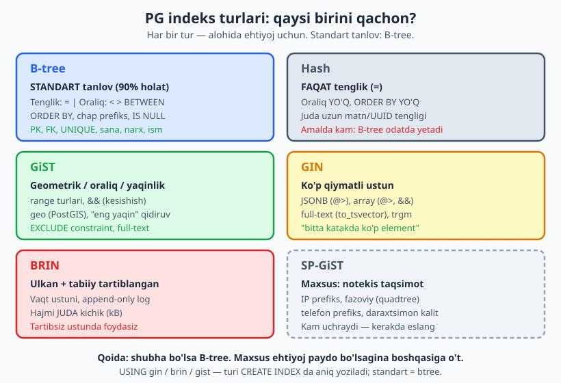
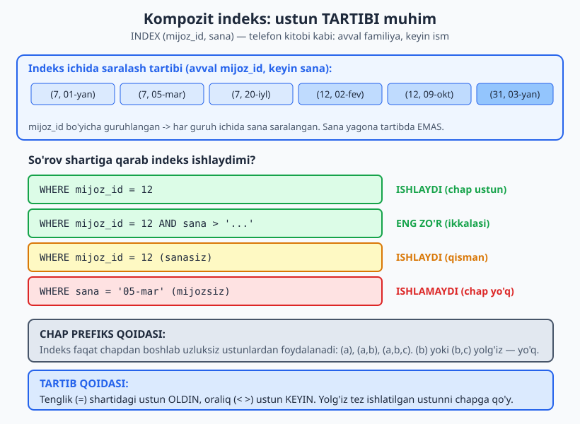
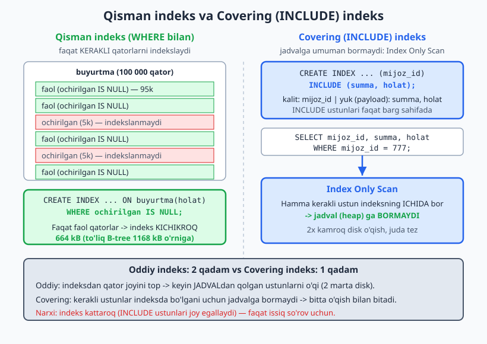

# 14 — Indeks strategiyasi

[⬅️ Oldingi: 13 — Anti-naqshlar: nima qilmaslik kerak](./13-anti-naqshlar.md) · [🏠 README](./README.md) · [Keyingi: 15 — Sxema va so'rov performansi (EXPLAIN ANALYZE) ➡️](./15-performans.md)

> **Bu bobda:** indeks endi shunchaki "qidiruvni tezlashtiruvchi narsa" emas — uni DIZAYN qarori sifatida ko'ramiz. PostgreSQL ning beshta indeks turini (B-tree, Hash, GiST, GIN, BRIN) va har birini qachon ishlatishni o'rganamiz; kompozit indeksda ustun tartibini to'g'ri tanlashni, qisman (partial), ifoda (expression) va covering (INCLUDE) indekslarni loyihalashni; indeksning haqiqiy narxini, ortiqcha indeksni topishni va FK ustuniga indeks qo'yishni ko'ramiz. Hammasini PG 18 da `EXPLAIN (ANALYZE)` bilan o'z ko'zimiz bilan tekshiramiz.

---

## 0. Bu bob SQL kitobidan nimasi bilan farq qiladi

SQL kitobining [21-bobida](../sql/21-indekslar.md) indeks nima ekanini, `CREATE INDEX` sintaksisini, B-tree daraxtini va chap prefiks qoidasini ko'rgansiz. U yerda asosiy savol edi: *"indeks qanday ishlaydi va qanday yaratiladi?"*

Bu bobning savoli boshqacha: **"qaysi indeksni, qaysi ustunga, qaysi tartibda, qaysi tur bilan loyihalash kerak?"** Bu — sxema dizaynining bir qismi. Yomon tanlangan indeks jadvalingizni sekinlashtiradi, joyni isrof qiladi va sizni "indeks bor-ku, nega ishlamayapti?" degan tuzoqqa soladi.

Shuning uchun bu yerda biz `CREATE INDEX` sintaksisini qayta o'rgatmaymiz — uni ishlatamiz. Diqqat — **qaror**da: nima uchun aynan shu indeks.

> **Falsafa:** indeks — bepul tezlik emas. Har bir indeks o'qishni tezlashtiradi, lekin yozishni (INSERT/UPDATE/DELETE) sekinlashtiradi va disk joy egallaydi. Indeks dizayni — bu o'qish va yozish o'rtasidagi savdolashuv (trade-off). "Har ehtimolga" indeks qo'yish — anti-naqsh.

Bu bobning hamma misollari **PostgreSQL 18.4** da, 100 000 qatorli `buyurtma` jadvalida haqiqatan ishga tushirilgan. Reja:

```sql
CREATE SCHEMA IF NOT EXISTS ch14;
SET search_path = ch14;

CREATE TABLE buyurtma (
    id          bigint GENERATED ALWAYS AS IDENTITY PRIMARY KEY,
    mijoz_id    int           NOT NULL,
    holat       text          NOT NULL,
    summa       numeric(12,2) NOT NULL,
    email       text          NOT NULL,
    teglar      text[]        NOT NULL,   -- ko'p qiymatli: massiv
    xususiyat   jsonb         NOT NULL,   -- {"rang": "...", "olcham": "..."}
    yaratilgan  timestamptz   NOT NULL,
    ochirilgan  timestamptz               -- soft delete: NULL = faol
);

-- 100 000 qatorni generate_series bilan yasaymiz:
INSERT INTO buyurtma (mijoz_id, holat, summa, email, teglar, xususiyat, yaratilgan, ochirilgan)
SELECT
    (random()*20000)::int + 1,
    (ARRAY['yangi','tolangan','jonatilgan','yetkazilgan','bekor'])[(random()*4)::int + 1],
    (random()*5000)::numeric(12,2),
    'User' || g || '@shop.uz',
    ARRAY[ (ARRAY['aksiya','vip','tezkor','sovga','optom'])[(random()*4)::int+1],
           (ARRAY['aksiya','vip','tezkor','sovga','optom'])[(random()*4)::int+1] ],
    jsonb_build_object('rang',   (ARRAY['qizil','kok','yashil'])[(random()*2)::int+1],
                       'olcham', (ARRAY['S','M','L','XL'])[(random()*3)::int+1]),
    timestamptz '2024-01-01' + (g || ' minutes')::interval,
    CASE WHEN random() < 0.05 THEN timestamptz '2025-01-01' ELSE NULL END
FROM generate_series(1, 100000) AS g;

ANALYZE buyurtma;          -- statistikani yangilash (planner uchun MUHIM)
```

`generate_series(1, 100000)` — bu PG ning bir qatordan 100 000 qator yasash usuli (SQL kitobidagi `WITH RECURSIVE` ga teng, lekin ancha qulay). `ANALYZE` — planner to'g'ri qaror chiqarishi uchun jadval statistikasini yangilaydi; uni unutsangiz, plan noto'g'ri bo'lishi mumkin.

> Bizning jadvalda atayin **har xil shaklli ustunlar** bor: tartiblangan vaqt (`yaratilgan` -> BRIN uchun), massiv va JSONB (`teglar`, `xususiyat` -> GIN uchun), email (`expression` indeks uchun), `ochirilgan` (partial indeks uchun). Har bir indeks turini shu jadvalda namoyish qilamiz.

---

## 1. Seq scan vs index scan — nima uchun umuman indeks kerak

Avval indekssiz holatga qaraylik. Bitta mijozning buyurtmalarini topamiz:

```sql
EXPLAIN (ANALYZE, COSTS OFF) SELECT * FROM buyurtma WHERE mijoz_id = 12345;
```

PG 18 chiqishi (qisqartirilgan, vaqtlar taxminan):

```text
 Seq Scan on buyurtma (actual rows=4.00 loops=1)
   Filter: (mijoz_id = 12345)
   Rows Removed by Filter: 99996
   Buffers: shared hit=2138
```

Diqqat qiling: `Seq Scan` — **butun jadvalni** ketma-ket o'qidi, `Rows Removed by Filter: 99996` — 4 ta kerakli qatorni topish uchun 99 996 qatorni tashlab yubordi. `Buffers: shared hit=2138` — 2138 ta sahifa o'qildi.

Endi B-tree indeks qo'yamiz:

```sql
CREATE INDEX idx_buyurtma_mijoz ON buyurtma(mijoz_id);

EXPLAIN (ANALYZE, COSTS OFF) SELECT * FROM buyurtma WHERE mijoz_id = 12345;
```

```text
 Bitmap Heap Scan on buyurtma (actual rows=4.00 loops=1)
   Recheck Cond: (mijoz_id = 12345)
   Heap Blocks: exact=4
   Buffers: shared hit=4 read=2
   ->  Bitmap Index Scan on idx_buyurtma_mijoz (actual rows=4.00 loops=1)
         Index Cond: (mijoz_id = 12345)
```

Mana farq: `Buffers` **2138 dan 6 ga** tushdi. PG endi butun jadvalni emas, faqat indeksni va kerakli 4 sahifani o'qiyapti. Million qatorli jadvalda bu farq "yarim soniya" va "ko'z ochib yumguncha" o'rtasidagi farqdir.

`Bitmap Heap Scan` — PG bir nechta qatorni topish kerak bo'lganda tanlaydigan rejim: avval indeksdan qatorlar joyini "bitmap" ga yig'adi, keyin jadvaldan o'qiydi. Bitta qator uchun esa to'g'ridan-to'g'ri `Index Scan` ishlatiladi. Rejalarni o'qishni keyingi [15-bobda](./15-performans.md) chuqurroq ko'ramiz.

> **Dizayn xulosasi:** indeks katta jadvalda **WHERE/JOIN/ORDER BY** da tez-tez ishlatiladigan ustun uchun kerak. Kichik jadvalda (bir necha ming qator) PG ko'pincha indeksdan ko'ra seq scan ni afzal ko'radi — va to'g'ri qiladi, chunki butun jadvalni o'qish baribir arzon.

---

## 2. Indeks turlari: qaysi birini qachon

PostgreSQL bir nechta indeks turini taklif qiladi. Aksariyat dasturchilar faqat B-tree ni biladi — lekin to'g'ri tur tanlash ba'zan o'nlab baravar farq qiladi.



### 2.1 B-tree — standart tanlov (90% holat)

`CREATE INDEX` da tur ko'rsatmasangiz, PG **B-tree** yaratadi. U deyarli hamma narsani qoplaydi:

- Tenglik: `WHERE x = 5`
- Oraliq: `WHERE x > 5`, `BETWEEN`, `<`, `>=`
- `ORDER BY x` (saralangan natija — indeks allaqachon tartiblangan)
- `IS NULL`, chap prefiks (kompozit)

PK, FK, UNIQUE, sana, narx, ism — bularning hammasi B-tree. **Qoida: shubha bo'lsa, B-tree.**

### 2.2 Hash — faqat tenglik

```sql
CREATE INDEX idx_email_hash ON buyurtma USING hash (email);
```

Hash indeks faqat `=` ni qo'llaydi — oraliq ham, `ORDER BY` ham yo'q. Nazariy jihatdan juda uzun matn yoki UUID tengligida B-tree dan biroz tejamliroq. Amalda esa B-tree odatda yetarli va ko'p qirrali, shuning uchun Hash kam ishlatiladi. Bilib qo'ying — lekin sukut bo'yicha B-tree ni tanlang.

### 2.3 GIN — ko'p qiymatli ustun (JSONB, array, full-text)

Bitta katakda **ko'p element** bo'lsa (massiv, JSONB hujjat, matn so'zlari), B-tree ojiz — u butun qiymatni yaxlit kalit deb biladi, ichidagi elementni topa olmaydi. Bu yerda **GIN** (Generalized Inverted iNdex) kerak.

Massiv ichida qidiramiz — "vip" tegi bor buyurtmalar:

```sql
CREATE INDEX idx_buyurtma_teglar ON buyurtma USING gin (teglar);

EXPLAIN (ANALYZE, COSTS OFF) SELECT count(*) FROM buyurtma WHERE teglar @> ARRAY['vip'];
```

```text
 Aggregate (actual rows=1.00 loops=1)
   ->  Bitmap Heap Scan on buyurtma (actual rows=43776.00 loops=1)
         Recheck Cond: (teglar @> '{vip}'::text[])
         ->  Bitmap Index Scan on idx_buyurtma_teglar (actual rows=43776.00 loops=1)
               Index Cond: (teglar @> '{vip}'::text[])
```

`@>` — "o'z ichiga oladi" operatori; GIN aynan shunga moslangan. JSONB uchun ham xuddi shunday:

```sql
CREATE INDEX idx_buyurtma_xususiyat ON buyurtma USING gin (xususiyat);

EXPLAIN (ANALYZE, COSTS OFF)
SELECT count(*) FROM buyurtma WHERE xususiyat @> '{"rang": "qizil"}';
```

```text
 Aggregate (actual rows=1.00 loops=1)
   ->  Bitmap Heap Scan on buyurtma (actual rows=24921.00 loops=1)
         Recheck Cond: (xususiyat @> '{"rang": "qizil"}'::jsonb)
         ->  Bitmap Index Scan on idx_buyurtma_xususiyat (actual rows=24921.00 loops=1)
```

> **Dizayn eslatmasi:** JSONB ga GIN qo'yishdan oldin so'rang — *"bu ma'lumot haqiqatan JSONB bo'lishi kerakmi, yoki oddiy ustunlar yaxshiroqmi?"* ([13-bobdagi EAV anti-naqshini](./13-anti-naqshlar.md) eslang). Agar JSONB to'g'ri qaror bo'lsa va ichidan qidirsangiz — GIN majburiy. Faqat bitta yo'l (`xususiyat->>'rang'`) bo'yicha qidirsangiz, expression indeks (3.3) yengilroq.

### 2.4 BRIN — ulkan, tabiiy tartiblangan jadval (vaqt!)

`yaratilgan` ustuni vaqt bo'yicha o'sib boradi (yangi buyurtma — har doim oxirgi vaqt). Bunday **tabiiy tartiblangan** ustun uchun **BRIN** (Block Range INdex) bor — u har bir disk bloki uchun faqat "min-max" oralig'ini saqlaydi, shuning uchun ulkan jadvalda ham juda kichik bo'ladi:

```sql
CREATE INDEX idx_buyurtma_sana_brin ON buyurtma USING brin (yaratilgan);

SELECT pg_size_pretty(pg_relation_size('idx_buyurtma_sana_brin')) AS brin,
       pg_size_pretty(pg_relation_size('idx_buyurtma_lower_email')) AS btree;
```

```text
 brin  | btree
-------+---------
 24 kB | 3992 kB
```

**24 kB vs 3992 kB** — BRIN B-tree dan ~160 baravar kichik! Va u oraliq so'rovni quvvatlaydi:

```sql
EXPLAIN (ANALYZE, COSTS OFF)
SELECT count(*) FROM buyurtma WHERE yaratilgan BETWEEN '2024-02-01' AND '2024-02-05';
```

```text
 Aggregate (actual rows=1.00 loops=1)
   ->  Bitmap Heap Scan on buyurtma (actual rows=5761.00 loops=1)
         Recheck Cond: ((yaratilgan >= ...) AND (yaratilgan <= ...))
         Rows Removed by Index Recheck: 12202
         ->  Bitmap Index Scan on idx_buyurtma_sana_brin (actual rows=3840.00 loops=1)
```

`Rows Removed by Index Recheck: 12202` — BRIN "taxminiy": u blokni "ehtimol mos" deb belgilaydi, keyin PG aniqlab tekshiradi. Shuning uchun BRIN faqat **tartiblangan** ustunda foydali. Agar ustun tartibsiz (random) bo'lsa, har blokda min-max butun diapazonni qoplaydi va indeks foydasiz. BRIN ning ideal o'rni — vaqt ustunli ulkan log/o'lchov jadvallari (millionlab+ qator).

### 2.5 GiST — geometrik, oraliq, "kesishmaslik"

**GiST** geometrik ma'lumot (PostGIS), `range` turlari va "eng yaqin" qidiruv uchun. Eng amaliy dizayn ishlatilishi — **`EXCLUDE` constraint** ([11-bobda](./11-constraint-dizayni.md) ko'rgan xona band-bo'sh, vaqt oralig'i kesishmasligi). U yerdagi `EXCLUDE USING gist (...)` aynan GiST indeksiga tayanadi. Full-text qidiruvni ham (kichik hajmda) quvvatlaydi.

### 2.6 SP-GiST — maxsus, notekis taqsimotli

**SP-GiST** notekis taqsimlangan, daraxtsimon ma'lumot uchun: IP prefiks (`inet`), telefon prefiks, fazoviy nuqtalar (quadtree). Kam uchraydi — shunday ehtiyoj paydo bo'lsa, "bunaqasi ham bor" deb eslang. Aksariyat loyihada hech qachon kerak bo'lmaydi.

| Tur | Qachon | Operatorlar |
|---|---|---|
| **B-tree** | standart: tenglik, oraliq, ORDER BY | `=` `<` `>` `BETWEEN` `IS NULL` |
| **Hash** | faqat tenglik (kam ishlatiladi) | `=` |
| **GiST** | geometrik, range, EXCLUDE, yaqinlik | `&&` `@>` `<->` |
| **GIN** | JSONB, array, full-text (ko'p qiymatli) | `@>` `?` `&&` `@@` |
| **BRIN** | ulkan + tabiiy tartiblangan (vaqt) | `<` `>` `BETWEEN` |
| **SP-GiST** | notekis taqsimot (IP, prefiks) | `=` `<<` `@>` |

> **MySQL farqi:** InnoDB faqat B-tree ni (va `FULLTEXT`, `SPATIAL` maxsus turlarini) qo'llaydi; GIN/BRIN/GiST PG ga xos. MySQL da JSON ustunidan tez qidirish uchun odatda generated column + B-tree ishlatiladi.

---

## 3. Kompozit, qisman va ifoda indekslari — dizayn nozikliklari

### 3.1 Kompozit indeks: ustun TARTIBI qaror

Bir nechta ustunni qamragan indeksda **ustunlar tartibi** — eng ko'p xato qilinadigan joy. `(mijoz_id, yaratilgan)` va `(yaratilgan, mijoz_id)` — bu ikki **boshqa** indeks, bir-birini almashtira olmaydi.



```sql
CREATE INDEX idx_buyurtma_mijoz_sana ON buyurtma(mijoz_id, yaratilgan);
```

Indeks avval `mijoz_id` bo'yicha, har guruh ichida `yaratilgan` bo'yicha saralangan. Demak **chap prefiks qoidasi** ([SQL kitobida](../sql/21-indekslar.md) ko'rgan): indeks faqat chapdan boshlab uzluksiz ustunlardan foydalanadi.

Chap ustun bor — indeks tig'iz ishlaydi:

```sql
EXPLAIN (ANALYZE, COSTS OFF)
SELECT * FROM buyurtma WHERE mijoz_id = 999 AND yaratilgan > '2024-06-01';
```

```text
 Index Scan using idx_buyurtma_mijoz_sana on buyurtma (actual rows=0.00 loops=1)
   Index Cond: ((mijoz_id = 999) AND (yaratilgan > '2024-06-01'...))
   Buffers: shared read=3
```

Faqat 3 ta sahifa — mukammal. Endi **faqat ikkinchi ustun** (chap prefiks yo'q):

```sql
EXPLAIN (ANALYZE, COSTS OFF)
SELECT count(*) FROM buyurtma WHERE yaratilgan = '2024-03-15 10:00:00+00';
```

```text
 Aggregate (actual rows=1.00 loops=1)
   ->  Index Only Scan using idx_buyurtma_mijoz_sana on buyurtma (actual rows=0.00 loops=1)
         Index Cond: (yaratilgan = '2024-03-15 15:00:00+05'...)
         Buffers: shared hit=12 read=383
```

Diqqat: PG indeksdan foydalandi-yu, lekin `Buffers ... read=383` — **butun indeksni** o'qishga majbur bo'ldi! Chunki `mijoz_id` (chap ustun) cheklanmagan, qatorlar `yaratilgan` bo'yicha global saralanmagan — PG har guruhni titkilashga majbur. Bu chap prefiks qoidasining haqiqiy isboti: indeks bor, ammo samarasi yo'qoldi.

**Tartib qoidalari (dizayn):**

1. **Tenglik avval, oraliq keyin.** `WHERE a = ? AND b > ?` uchun `(a, b)` — to'g'ri. Tenglik ustunini chapga qo'ying, indeks aniq nuqtaga "sakraydi", keyin oraliqni skanlaydi.
2. **Yolg'iz tez ishlatilgan ustun chapga.** Agar `mijoz_id` ba'zan yolg'iz, ba'zan `yaratilgan` bilan birga kelsa — `mijoz_id` ni chapga qo'ying; u har ikki holatda ham ishlaydi.
3. **Selektivlik.** Ko'p xil qiymatli (yuqori selektiv) ustun odatda foydaliroq, lekin tenglik/oraliq qoidasi undan ustun turadi.

### 3.2 Qisman (partial) indeks — faqat kerakli qatorlar

[12-bobdagi soft delete](./12-dizayn-naqshlari.md) naqshini eslang: `ochirilgan IS NULL` = faol qator. Ko'pchilik so'rov faqat faol qatorlar bilan ishlaydi. Nega o'chirilgan 5% qatorni ham indekslash kerak? — Kerak emas.



```sql
CREATE INDEX idx_buyurtma_faol_holat ON buyurtma(holat) WHERE ochirilgan IS NULL;

SELECT pg_size_pretty(pg_relation_size('idx_buyurtma_mijoz'))      AS toliq_btree,
       pg_size_pretty(pg_relation_size('idx_buyurtma_faol_holat')) AS partial;
```

```text
 toliq_btree | partial
-------------+---------
 1168 kB     | 664 kB
```

Indeks **664 kB**, to'liq B-tree esa 1168 kB — kichikroq, tezroq, yangilash ham arzonroq. So'rov shartida `WHERE` predikatiga mos kelsa, PG bu indeksdan foydalanadi:

```sql
EXPLAIN (ANALYZE, COSTS OFF)
SELECT * FROM buyurtma WHERE holat = 'yangi' AND ochirilgan IS NULL;
```

```text
 Bitmap Heap Scan on buyurtma (actual rows=11866.00 loops=1)
   Recheck Cond: ((holat = 'yangi'::text) AND (ochirilgan IS NULL))
   ->  Bitmap Index Scan on idx_buyurtma_faol_holat (actual rows=11866.00 loops=1)
         Index Cond: (holat = 'yangi'::text)
```

**Qachon partial indeks:**

- Soft delete: `WHERE ochirilgan IS NULL` (faol qatorlar).
- Holat filtri: `WHERE holat = 'faol'` — agar so'rovlarning ko'pi faqat faol holatni qidirsa.
- "Faqat 1% qatorga tegishli" hodisalar: `WHERE muammoli = true` — kichik indeks, hammasini topadi.
- UNIQUE bilan birga: `CREATE UNIQUE INDEX ... (email) WHERE ochirilgan IS NULL` — "faol foydalanuvchilar orasida email noyob, o'chirilganlar hisobga olinmaydi" degan biznes qoidasini majburlaydi.

### 3.3 Ifoda (expression) indeks — funksiya natijasiga indeks

`WHERE lower(email) = '...'` (registr-sezgir bo'lmagan qidiruv) — bu yerda oddiy indeks ishlamaydi, chunki indeks `email` ni saqlaydi, `lower(email)` ni emas ([13-bobdagi "ustunga funksiya" tuzog'ini](./13-anti-naqshlar.md) eslang). Avval indekssiz:

```sql
EXPLAIN (COSTS OFF) SELECT * FROM buyurtma WHERE lower(email) = 'user5000@shop.uz';
```

```text
 Seq Scan on buyurtma
   Filter: (lower(email) = 'user5000@shop.uz'::text)
```

Seq Scan — yomon. **Ifoda indeksi** aynan funksiya natijasini indekslaydi:

```sql
CREATE INDEX idx_buyurtma_lower_email ON buyurtma(lower(email));

EXPLAIN (ANALYZE, COSTS OFF) SELECT * FROM buyurtma WHERE lower(email) = 'user5000@shop.uz';
```

```text
 Bitmap Heap Scan on buyurtma (actual rows=1.00 loops=1)
   Recheck Cond: (lower(email) = 'user5000@shop.uz'::text)
   ->  Bitmap Index Scan on idx_buyurtma_lower_email (actual rows=1.00 loops=1)
         Index Cond: (lower(email) = 'user5000@shop.uz'::text)
```

So'rovdagi ifoda indeksdagi ifodaga **aynan** mos kelishi kerak (`lower(email)`). Boshqa misollar: `(date_trunc('day', yaratilgan))`, `(xususiyat->>'rang')` (JSONB dan bitta yo'lni indekslash — to'liq GIN dan yengilroq), `((narx * miqdor))`.

### 3.4 Covering (INCLUDE) indeks — index-only scan

Oddiy indeks bilan PG ikki qadam qiladi: (1) indeksdan qator joyini topadi, (2) jadval (heap) dan qolgan ustunlarni o'qiydi. Agar kerakli **hamma** ustun indeksning ichida bo'lsa, ikkinchi qadam keraksiz — bu **Index Only Scan**.

PG 18 da `INCLUDE` bilan ustunlarni indeksning bargiga "yuk" (payload) sifatida qo'shamiz:

```sql
CREATE INDEX idx_buyurtma_mijoz_inc ON buyurtma(mijoz_id) INCLUDE (summa, holat);

EXPLAIN (ANALYZE, COSTS OFF)
SELECT mijoz_id, summa, holat FROM buyurtma WHERE mijoz_id = 777;
```

Index Only Scan aniq ko'rinishi uchun (raqobatchi indeks o'chirilgan holatda):

```text
 Index Only Scan using idx_buyurtma_mijoz_inc on buyurtma (actual rows=3.00 loops=1)
   Index Cond: (mijoz_id = 777)
   Heap Fetches: 3
```

`Index Only Scan` + `Heap Fetches` — jadvalga deyarli bormadi (`Heap Fetches` past bo'lsa zo'r; `VACUUM` dan keyin 0 ham bo'lishi mumkin). `summa` va `holat` indeksdan o'qildi.

**`INCLUDE` vs kalitga qo'shish farqi:** `INCLUDE (summa, holat)` ustunlari indeksda saralanmaydi, ular faqat barg sahifada saqlanadi — shuning uchun ular bo'yicha qidirib bo'lmaydi, lekin ularni o'qib bo'ladi. Agar `(mijoz_id, summa, holat)` deb yozsangiz, hammasi kalit bo'ladi, indeks kattaroq va `summa`/`holat` bo'yicha saralash imkonini ham beradi. Faqat **o'qish** kerak bo'lsa — `INCLUDE` yengilroq.

> **Dizayn eslatmasi:** covering indeks faqat eng "issiq" (juda tez-tez chaqiriladigan) so'rov uchun. INCLUDE ustunlari indeksni kattalashtiradi va yozishni sekinlashtiradi. "Bu so'rov soatiga ming marta chaqiriladi va doim shu uch ustunni qaytaradi" — ana shunda INCLUDE oqlanadi.

---

## 4. Indeksning narxi va ortiqcha indekslar

### 4.1 Har indeks — yozishga soliq

Indeks bepul emas. Har bir `INSERT`, har bir indekslangan ustunni o'zgartiruvchi `UPDATE`, har bir `DELETE` — **barcha** tegishli indekslarni ham yangilaydi. 5 ta indeksli jadvalga INSERT — bu 1 ta jadval yozuvi + 5 ta indeks yangilanishi.

| Narx | Tafsilot |
|---|---|
| **Yozish sekinroq** | har INSERT/UPDATE/DELETE indekslarni yangilaydi |
| **Disk joy** | indeks alohida tuzilma; ba'zan jadvaldan ham katta (bizda B-tree email = ~4 MB) |
| **VACUUM/maintenance** | ko'proq indeks = ko'proq tozalash ishi |
| **Planner sekinroq** | juda ko'p indeks plannerni chalg'itadi va rejalashtirish vaqtini oshiradi |

Shuning uchun **kam yozadigan, ko'p o'qiladigan** ustunga indeks qo'ying. Kam o'qilib, ko'p yoziladigan ustunga indeks — sof zarar.

### 4.2 Ortiqcha va dublikat indeksni topish

Vaqt o'tib loyihada indekslar yig'ilib qoladi: kimdir `(a)` qo'ydi, keyin yana kimdir `(a, b)` qo'shdi — endi `(a)` ortiqcha, chunki `(a, b)` uning chap prefiksini ham qoplaydi. Yoki ikkita bir xil indeks ikki marta yaratilgan.

**Ishlatilmagan indeksni topish** — `pg_stat_user_indexes` orqali skan sonini ko'ramiz:

```sql
SELECT indexrelid::regclass AS indeks,
       idx_scan            AS skan_soni,
       pg_size_pretty(pg_relation_size(indexrelid)) AS hajm
FROM pg_stat_user_indexes
WHERE schemaname = 'ch14'
ORDER BY idx_scan;
```

```text
          indeks          | skan_soni |  hajm
--------------------------+-----------+---------
 buyurtma_pkey            |         0 | 2208 kB
 idx_buyurtma_xususiyat   |         1 | 560 kB
 ...
```

`skan_soni = 0` (uzoq vaqt ishlagan tizimda) — bu indeks hech ishlatilmagan, nomzod o'chirishga. (Ehtiyot: yaqinda qo'shilgan yoki noyob hodisalar uchun indeks 0 ko'rinishi mumkin — statistika yetarli yig'ilganini tekshiring.)

**Dublikat (bir xil) indeksni topish:**

```sql
SELECT indexrelid::regclass AS indeks,
       pg_size_pretty(pg_relation_size(indexrelid)) AS hajm
FROM pg_index i
JOIN pg_stat_user_indexes s USING (indexrelid)
WHERE schemaname = 'ch14'
  AND (indrelid, indkey::text, indclass::text, indexprs IS NULL, indpred IS NULL) IN (
    SELECT indrelid, indkey::text, indclass::text, indexprs IS NULL, indpred IS NULL
    FROM pg_index GROUP BY 1,2,3,4,5 HAVING count(*) > 1)
ORDER BY 1;
```

Agar `idx_dup_a` va `idx_dup_b` ikkalasi ham `(holat)` ustunida bo'lsa, bu so'rov ikkalasini ham qaytaradi — bittasini o'chiring.

### 4.3 FK ustuniga indeks — PG AVTOMATIK QO'YMAYDI!

Bu eng ko'p uchraydigan yashirin xato. PG `PRIMARY KEY` va `UNIQUE` ga avtomatik indeks qo'yadi, lekin **FOREIGN KEY ustuniga indeks qo'ymaydi** (MySQL/InnoDB esa qo'yadi — bu farqni biling!).

```sql
CREATE TABLE qator (
    id          int PRIMARY KEY,
    buyurtma_id bigint REFERENCES buyurtma(id),   -- FK
    nom         text
);

SELECT indexname FROM pg_indexes WHERE tablename = 'qator';
```

```text
 indexname
------------
 qator_pkey      -- faqat PK ga, buyurtma_id ga indeks YO'Q!
```

Indekssiz FK ikki muammo keltiradi:

1. **Bola jadvalidan qidirish sekin:** `SELECT * FROM qator WHERE buyurtma_id = 50` -> Seq Scan.
2. **Eng yashirin va xavfli:** ota jadvaldan qator o'chirilganda (`DELETE FROM buyurtma WHERE id = 50`), PG bola jadvalida "shu ID ga bog'liq qator bormi?" deb tekshirishi kerak. Indeks bo'lmasa — har o'chirishda bola jadvalining **to'liq skani**. Katta bola jadvalida bu DELETE ni o'lik darajada sekinlashtiradi.

**Qoida: har bir FK ustuniga indeks qo'ying** (agar u allaqachon kompozit indeksning chap prefiksi bo'lmasa):

```sql
CREATE INDEX idx_qator_buyurtma ON qator(buyurtma_id);
```

> Bu shu qadar muhimki, ko'p jamoalar buni dizayn nazoratiga kiritadi: "FK qo'shganda, indeksini ham qo'shasan". [13-bobdagi "indekssiz FK" anti-naqshini](./13-anti-naqshlar.md) ham qarang.

---

## 5. Indeks dizayni — amaliy yondashuv

Indeksni "oldindan hamma narsaga" qo'ymang. Ketma-ketlik:

1. **Avval o'lcha.** Sxema va misol ma'lumot bilan boshlang, asosiy so'rovlarni `EXPLAIN (ANALYZE)` bilan ko'ring. Sekin joyni toping, keyin indeks qo'ying.
2. **Default majburiy minimum:** har PK (avtomatik), har FK (qo'lda!), har UNIQUE qoida (avtomatik), eng tez-tez ishlatiladigan WHERE/JOIN ustunlari.
3. **Tur to'g'ri tanlangan:** oddiy ustun -> B-tree; JSONB/array -> GIN; ulkan vaqt jadvali -> BRIN; geometrik/EXCLUDE -> GiST.
4. **Kompozitda tartib:** tenglik avval, oraliq keyin; yolg'iz tez ishlatilgan ustun chapga.
5. **Nozik vositalar kerakli joyda:** filtrlangan so'rov -> partial; funksiya bo'yicha qidiruv -> expression; juda issiq o'qish -> covering INCLUDE.
6. **Davriy audit:** `pg_stat_user_indexes` bilan ishlatilmagan/dublikat indekslarni topib o'chiring.

> **Ekspert maslahati:** indeks dizayni — bir martalik ish emas, doimiy jarayon. So'rov naqshlari o'zgaradi, ma'lumot o'sadi. Kvartalda bir marta indekslarni qayta ko'rib chiqing: qaysilari ishlatilmayapti, qaysi yangi so'rovga indeks kerak. "Indeks qo'shish" qanchalik oson bo'lsa, "keraksizini o'chirish" shunchalik unutiladi.

Tekshiruvni tozalaymiz:

```sql
DROP SCHEMA ch14 CASCADE;
```

---

## Mashqlar

### Oson

1. **Tur tanlash — tezkor.** Quyidagi ustunlarning har biri uchun qaysi indeks turi mos: (a) `narx numeric` (oraliq qidiruv), (b) `teglar text[]` (ichidan qidirish), (c) `hodisa_vaqti timestamptz` (ulkan log jadvali, oraliq), (d) `sozlamalar jsonb` (kalit bo'yicha qidirish). Sababini bir jumlada yozing.
2. **Nega indeks ishlamadi.** `CREATE INDEX idx_email ON foydalanuvchi(email)` bor, lekin `WHERE lower(email) = 'a@b.uz'` Seq Scan beradi. Nega? Tuzating.
3. **Avtomatik indeks.** `id serial PRIMARY KEY`, `email text UNIQUE`, `tuman_id int REFERENCES tuman(id)` ustunli jadvalda PG qaysi ustunlarga indeksni AVTOMATIK qo'yadi, qaysiga YO'Q? O'zingiz qaysi indeksni qo'lda qo'shasiz?
4. **Kompozit tartib — birinchi qadam.** "Berilgan mijozning so'nggi buyurtmalari" (`WHERE mijoz_id = ? ORDER BY yaratilgan DESC`) uchun `(mijoz_id, yaratilgan)` yoki `(yaratilgan, mijoz_id)` — qaysi tartib to'g'ri? Nega?

### O'rta

5. **Selektivlik.** `jins text` ustunida atigi 2 xil qiymat (`'erkak'`, `'ayol'`) bor, har biri ~50%. Bunga oddiy B-tree indeks foyda beradimi? Qaysi vaziyatda partial indeks bu yerda mantiqliroq bo'ladi?
6. **Partial indeksni loyihala.** `buyurtma(holat)` da 5 xil holat bor, lekin so'rovlarning 90% i faqat `holat = 'yangi'` ni qidiradi (qayta ishlash navbati). Eng tejamli indeksni loyihalang va nega to'liq indeksdan yaxshiroq ekanini tushuntiring.
7. **Covering indeks.** API endpointi har so'rovda `SELECT mahsulot_id, narx, ombor_qoldigi FROM ombor WHERE mahsulot_id = ?` ni qaytaradi va soatiga o'n minglab marta chaqiriladi. Index-only scan beradigan indeksni loyihalang. Kalit va INCLUDE ni qanday taqsimlaysiz?
8. **Ortiqcha indeksni top.** Jadvalda `idx_a (mijoz_id)`, `idx_ab (mijoz_id, sana)`, `idx_b (sana)` indekslari bor. Qaysi biri ortiqcha bo'lishi mumkin? Qaysi so'rov naqshida `idx_b` baribir kerak bo'lib qoladi?
9. **GIN qachon.** `maqola(matn text, teglar text[])` jadvalida ikki so'rov bor: (a) `WHERE teglar @> ARRAY['postgresql']`, (b) `WHERE matn ILIKE '%indeks%'`. Har biriga qaysi indeks (yoki indeks emas)? Tushuntiring.
10. **Tenglik-oraliq tartibi.** `WHERE tuman_id = 5 AND yaratilgan BETWEEN ? AND ?` uchun ikki nomzod: `(tuman_id, yaratilgan)` va `(yaratilgan, tuman_id)`. Qaysi biri tezroq va nega? "Tenglik avval" qoidasini qo'llang.

### Qiyin

11. **BRIN qaror.** 500 million qatorli `sensor_olchov(qurilma_id int, vaqt timestamptz, qiymat numeric)` jadvali bor; ma'lumot vaqt bo'yicha ketma-ket yoziladi. Vaqt oralig'i bo'yicha so'rovlar uchun BRIN yoki B-tree? Hajm va tezlik trade-off ini taqqoslang. Endi `qurilma_id` random tartibda kelsa — unga BRIN ishlaydimi?
12. **Indeks auditi loyihasi.** Loyihada `buyurtma` jadvalida 9 ta indeks bor, INSERT lar sekinlashgan. `pg_stat_user_indexes` dan qanday foydalanib ishlatilmagan va dublikat indekslarni aniqlaysiz? Qaysi indekslarni o'chirish xavfsiz, qaysilari "0 skan" bo'lsa ham qoldirish kerak (maslahat: UNIQUE va FK-quvvatlovchi indekslar)?
13. **To'liq indeks strategiyasi loyihala.** Marketplace `buyurtma(id, xaridor_id, sotuvchi_id, holat, summa, yaratilgan, ochirilgan, xususiyat jsonb)` jadvali uchun quyidagi so'rovlar bor: (a) xaridorning faol buyurtmalari sana bo'yicha; (b) sotuvchining "yangi" holatdagi buyurtmalari; (c) `xususiyat->>'kategoriya'` bo'yicha qidirish; (d) email registr-sezgir bo'lmagan qidiruv (email ustuni qo'shilgan deb hisoblang). Har bir so'rov uchun indeksni (turi, ustunlari, tartibi, partial/expression/INCLUDE) loyihalang va minimal indekslar to'plamini taklif qiling.
14. **Index-only scan buzilishi.** Covering indeks qo'ydingiz, lekin `EXPLAIN` da `Index Only Scan` o'rniga `Heap Fetches` juda yuqori chiqyapti. Nega bunday bo'ladi (maslahat: visibility map, yangi yozilgan qatorlar) va qaysi maintenance buyrug'i buni tuzatadi?
15. **Yozish vs o'qish trade-off.** `hodisa_log(id, foydalanuvchi_id, tur, vaqt, tafsilot jsonb)` jadvaliga soatiga millionlab qator yoziladi (append-only), o'qish kam (kunlik hisobot). Indeks strategiyasini qanday loyihalaysiz — ko'p indeks yoki kam? Qaysi turlar? Yozish tezligini saqlash uchun nimani qurbon qilasiz?

## Yechimlar

<details markdown="1">
<summary>Yechim — 1</summary>

- **(a) `narx numeric`** -> **B-tree.** Oraliq (`<`, `>`, `BETWEEN`) va saralash — bu B-tree ning asosiy ishi.
- **(b) `teglar text[]`** -> **GIN.** Massiv ichidan element qidirish (`@>`, `&&`) faqat GIN bilan tez; B-tree butun massivni yaxlit kalit deb biladi.
- **(c) `hodisa_vaqti` (ulkan log)** -> **BRIN.** Vaqt tabiiy tartiblangan, jadval ulkan; BRIN juda kichik bo'ladi va oraliqni quvvatlaydi. (Kichik jadvalda esa oddiy B-tree.)
- **(d) `sozlamalar jsonb`** -> **GIN.** JSONB ichidan kalit/qiymat bo'yicha qidirish (`@>`, `?`) GIN ni talab qiladi. (Agar faqat bitta yo'l bo'yicha qidirilsa — expression indeks yengilroq.)

</details>

<details markdown="1">
<summary>Yechim — 2</summary>

Indeks `email` qiymatini saqlaydi, lekin so'rov `lower(email)` natijasini qidiradi — bu boshqa qiymat, shuning uchun indeks yaramaydi (PG har qatorda `lower()` ni hisoblashga majbur -> Seq Scan). Tuzatish — **ifoda (expression) indeks**:

```sql
CREATE INDEX idx_email_lower ON foydalanuvchi(lower(email));
```

Endi indeksdagi ifoda so'rovdagi ifodaga aynan mos keladi. (Muqobil: `email` ni doim kichik harfda saqlash yoki `citext` turi ishlatish.)

</details>

<details markdown="1">
<summary>Yechim — 3</summary>

PG **avtomatik** qo'yadi:
- `id serial PRIMARY KEY` -> avtomatik unique B-tree indeks.
- `email text UNIQUE` -> avtomatik unique B-tree indeks.

PG **qo'ymaydi**:
- `tuman_id int REFERENCES tuman(id)` -> FOREIGN KEY ga indeks YO'Q!

Qo'lda qo'shish kerak:

```sql
CREATE INDEX idx_foydalanuvchi_tuman ON foydalanuvchi(tuman_id);
```

Aks holda `tuman` dan qator o'chirilganda PG butun `foydalanuvchi` jadvalini skanlaydi (FK butunligini tekshirish uchun) va `WHERE tuman_id = ?` so'rovi sekin bo'ladi.

</details>

<details markdown="1">
<summary>Yechim — 4</summary>

**`(mijoz_id, yaratilgan)`** to'g'ri.

- `mijoz_id` — tenglik sharti (`= ?`), shuning uchun chapga: indeks aniq mijozga "sakraydi".
- O'sha guruh ichida qatorlar `yaratilgan` bo'yicha allaqachon saralangan, demak `ORDER BY yaratilgan DESC` ham indeksdan bepul olinadi (PG indeksni teskari o'qiydi) — qo'shimcha saralash qadami kerak emas.

`(yaratilgan, mijoz_id)` bo'lsa, chap ustun `yaratilgan` cheklanmagan -> chap prefiks ishlamaydi, indeks samarasiz.

```sql
CREATE INDEX idx_buyurtma_mijoz_sana ON buyurtma(mijoz_id, yaratilgan);
-- so'rov: WHERE mijoz_id = ? ORDER BY yaratilgan DESC LIMIT 10
```

</details>

<details markdown="1">
<summary>Yechim — 5</summary>

Oddiy B-tree indeks `jins` ga deyarli foyda bermaydi: har bir qiymat qatorlarning ~50% ini qamraydi, shuning uchun PG baribir jadvalning yarmini o'qishga majbur — bu Seq Scan dan ko'p farq qilmaydi (hatto sekinroq bo'lishi mumkin). Bu **past selektivlik**.

Partial indeks mantiqli bo'ladigan vaziyat: qiymatlardan biri **kam uchraganda**. Masalan `holat = 'muammoli'` qatorlar atigi 0.5% bo'lsa:

```sql
CREATE INDEX idx_muammoli ON buyurtma(yaratilgan) WHERE holat = 'muammoli';
```

Endi indeks kichik (faqat 0.5% qator) va "muammoli buyurtmalar" so'rovi juda tez. Asosiy tushuncha: indeks foydasi **kam uchraydigan qatorlarni** ajratishda, ko'pchilik qatorni qamrashda emas.

</details>

<details markdown="1">
<summary>Yechim — 6</summary>

So'rovlarning 90% i `holat = 'yangi'` bo'lgani uchun, eng tejamli yo'l — shu shartni indeksning o'ziga qotirish (partial):

```sql
CREATE INDEX idx_yangi_navbat ON buyurtma(yaratilgan) WHERE holat = 'yangi';
```

To'liq `buyurtma(holat)` indeksidan afzalligi:

- **Kichikroq:** faqat 'yangi' qatorlarni indekslaydi (masalan 20% qator -> indeks ~5x kichik).
- **Tezroq yangilanadi:** boshqa holatga o'tgan qator indeksdan tushib qoladi — INSERT/UPDATE arzonroq.
- `WHERE holat = 'yangi' ORDER BY yaratilgan` so'rovini mukammal quvvatlaydi.

So'rov shartidagi `holat = 'yangi'` indeks predikatiga mos kelishi shart, aks holda PG bu indeksni ishlatmaydi.

</details>

<details markdown="1">
<summary>Yechim — 7</summary>

Index-only scan uchun barcha qaytariladigan ustunlar indeksda bo'lishi kerak. Qidiruv kaliti `mahsulot_id`, qolgan ikki ustun (`narx`, `ombor_qoldigi`) — INCLUDE (yuk):

```sql
CREATE INDEX idx_ombor_lookup ON ombor(mahsulot_id) INCLUDE (narx, ombor_qoldigi);
```

- **Kalit = `mahsulot_id`:** WHERE bo'yicha qidiriladi, saralanishi kerak.
- **INCLUDE = `narx, ombor_qoldigi`:** faqat o'qiladi, qidirilmaydi -> kalitga emas, yukka.

`EXPLAIN` da `Index Only Scan` ko'rinadi: jadvalga (heap) bormaydi, bitta o'qish bilan bitadi. Soatiga o'n minglab marta chaqirilgani uchun bu INCLUDE narxini (kattaroq indeks) oqlaydi.

</details>

<details markdown="1">
<summary>Yechim — 8</summary>

- **`idx_a (mijoz_id)` — ortiqcha.** `idx_ab (mijoz_id, sana)` uning chap prefiksini qoplaydi: `WHERE mijoz_id = ?` ikkala indeksdan ham foydalanadi. `idx_a` ni o'chirish mumkin (indeks biroz kattaroq bo'ladi, lekin bitta indeks yetadi).
- **`idx_b (sana)` — KERAK bo'lib qoladi.** `idx_ab` ning chap ustuni `mijoz_id`, shuning uchun `WHERE sana = ?` (mijozsiz) `idx_ab` dan foydalana olmaydi (chap prefiks yo'q). Agar shunday so'rov bo'lsa, `idx_b` zarur.

Xulosa: `idx_a` ni o'chirish xavfsiz; `idx_ab` va `idx_b` ni "sana yolg'iz qidiriladimi?" degan savol asosida qoldirish kerak.

</details>

<details markdown="1">
<summary>Yechim — 9</summary>

- **(a) `WHERE teglar @> ARRAY['postgresql']`** -> **GIN.** Massiv ichidan element qidirish; `@>` operatori GIN bilan tez.

  ```sql
  CREATE INDEX idx_maqola_teglar ON maqola USING gin (teglar);
  ```

- **(b) `WHERE matn ILIKE '%indeks%'`** -> oddiy indeks **ishlamaydi** (boshi va oxiri ochiq `%...%`). To'g'ri yechim — full-text qidiruv (GIN + `to_tsvector`) yoki `pg_trgm` kengaytmasi bilan trigram GIN:

  ```sql
  CREATE EXTENSION IF NOT EXISTS pg_trgm;
  CREATE INDEX idx_maqola_matn_trgm ON maqola USING gin (matn gin_trgm_ops);
  ```

  Oddiy `LIKE '%...%'` ga B-tree umuman yordam bermaydi — bu [SQL kitobida](../sql/21-indekslar.md) ko'rgan "boshi noma'lum" tuzog'i.

</details>

<details markdown="1">
<summary>Yechim — 10</summary>

**`(tuman_id, yaratilgan)`** tezroq.

- `tuman_id` — tenglik (`= 5`): indeks aynan shu tuman guruhiga sakraydi.
- O'sha guruh ichida qatorlar `yaratilgan` bo'yicha saralangan -> `BETWEEN` oralig'i tig'iz, uzluksiz diapazon bo'lib o'qiladi.

`(yaratilgan, tuman_id)` bo'lsa: indeks avval vaqt bo'yicha saralangan, `tuman_id` har vaqt nuqtasida tarqoq. `BETWEEN` diapazonidagi hamma qatorni o'qib, keyin `tuman_id = 5` ni filtrlash kerak — ko'p ortiqcha ish.

**Qoida:** tenglik shartidagi ustun (`tuman_id`) — chapga, oraliq shartidagi ustun (`yaratilgan`) — o'ngga.

</details>

<details markdown="1">
<summary>Yechim — 11</summary>

**Vaqt oralig'i so'rovi uchun — BRIN.**

- 500 mln qator vaqt bo'yicha ketma-ket yozilgan -> har disk bloki tor min-max vaqt oralig'iga ega -> BRIN juda samarali.
- **Hajm:** BRIN bunday jadvalda bir necha MB; ekvivalent B-tree o'nlab GB bo'lishi mumkin. Bu disk va xotira tejamkorligi katta.
- **Tezlik:** oraliq so'rovda BRIN mos bloklarni tezda topadi (keyin aniqlab tekshiradi). Aniq bitta qatorni topishda B-tree tezroq, lekin bu yerda vazifa — oraliq.

**`qurilma_id` random kelsa -> BRIN ishlamaydi.** BRIN faqat qiymat disk tartibiga **korrelyatsiya qilganda** foydali. `qurilma_id` aralash kelsa, har blokda min-max butun diapazonni qoplaydi va BRIN hech narsani ajrata olmaydi. `qurilma_id` ga oddiy B-tree (yoki `(qurilma_id, vaqt)` kompozit) kerak.

</details>

<details markdown="1">
<summary>Yechim — 12</summary>

**Qadamlar:**

1. **Ishlatilmagan indeks** — skan soni 0:

   ```sql
   SELECT indexrelid::regclass, idx_scan, pg_size_pretty(pg_relation_size(indexrelid))
   FROM pg_stat_user_indexes WHERE relname = 'buyurtma' ORDER BY idx_scan;
   ```

   `idx_scan = 0` (statistika yetarli yig'ilgandan keyin) — o'chirishga nomzod.

2. **Dublikat indeks** — bir xil ustun/ifoda/predikatli indekslarni `pg_index` ni guruhlash orqali toping (bobdagi 4.2 so'rovi).

**O'chirish xavfsiz:** ikki nusxadagi indeksning bittasi; hech qachon ishlatilmagan oddiy qo'shimcha indekslar; boshqa indeks chap prefiksi sifatida qoplaydigan ortiqcha indeks.

**0 skan bo'lsa ham QOLDIRISH kerak:**
- **UNIQUE constraint ni quvvatlovchi indeks** — u qidiruv uchun emas, **butunlik** uchun; o'chirsangiz unikallik buziladi.
- **FK ni quvvatlovchi indeks** — `idx_scan` da ko'rinmasligi mumkin, lekin ota jadvaldan DELETE/UPDATE da ishlatiladi; o'chirsangiz cascade operatsiyalar sekinlashadi.
- **Yaqinda qo'shilgan indeks** — statistika hali yig'ilmagan bo'lishi mumkin.

</details>

<details markdown="1">
<summary>Yechim — 13</summary>

So'rovlarni indekslarga moslab:

```sql
-- (a) xaridorning faol buyurtmalari sana bo'yicha (soft delete partial + kompozit)
CREATE INDEX idx_buyurtma_xaridor_faol ON buyurtma(xaridor_id, yaratilgan)
    WHERE ochirilgan IS NULL;

-- (b) sotuvchining "yangi" holatdagi buyurtmalari (partial, holat indeksga qotirilgan)
CREATE INDEX idx_buyurtma_sotuvchi_yangi ON buyurtma(sotuvchi_id, yaratilgan)
    WHERE holat = 'yangi' AND ochirilgan IS NULL;

-- (c) xususiyat->>'kategoriya' bo'yicha qidirish (faqat bitta yo'l -> expression yengil)
CREATE INDEX idx_buyurtma_kategoriya ON buyurtma((xususiyat->>'kategoriya'));
-- (agar JSONB ning ko'p yo'li bo'yicha qidirilsa -> GIN: USING gin (xususiyat))

-- (d) email registr-sezgir bo'lmagan qidiruv (expression)
CREATE INDEX idx_buyurtma_email_lower ON buyurtma(lower(email));
```

**Tahlil:**
- (a) va (b) — `(id_ustun, yaratilgan)` tartibi: tenglik avval (`xaridor_id`/`sotuvchi_id`), oraliq/saralash keyin (`yaratilgan`); partial bilan faol/yangi qatorlarga cheklangan -> kichik va tez.
- (c) — bitta JSONB yo'l bo'yicha qidirish uchun expression indeks GIN dan yengil va arzon; ko'p yo'l kerak bo'lsa GIN.
- (d) — funksiya natijasini indekslash (expression).

**Minimal to'plam:** har so'rov uchun aniq bittadan indeks; ortiqcha "har ehtimolga" indeks yo'q. PK (id) avtomatik. Agar `xaridor_id`/`sotuvchi_id` mustaqil FK bo'lsa va ota jadvaldan tez-tez DELETE bo'lsa — partialsiz to'liq FK indeksini ham qo'shish kerak bo'lishi mumkin (partial indeks FK butunlik tekshiruvini to'liq qoplamaydi).

</details>

<details markdown="1">
<summary>Yechim — 14</summary>

`Index Only Scan` haqiqatan "only" bo'lishi uchun PG qatorning **ko'rinishini** (visible/o'chirilmagan emasligini) bilishi kerak. Bu ma'lumot indeksda emas, **visibility map** (VM) da saqlanadi. Agar qator yaqinda yozilgan/yangilangan va VM hali yangilanmagan bo'lsa, PG har qator uchun jadvalga (heap) borib ko'rinishni tekshiradi -> `Heap Fetches` yuqori, foyda yo'qoladi.

**Tuzatish — `VACUUM`** (visibility map ni yangilaydi):

```sql
VACUUM buyurtma;          -- yoki avtomatik autovacuum
-- yoki: VACUUM (ANALYZE) buyurtma;
```

`VACUUM` dan keyin VM "bu bloklardagi hamma qator ko'rinadi" deb belgilaydi, PG jadvalga bormaydi, `Heap Fetches` 0 ga tushadi. Shuning uchun ko'p yoziladigan jadvalda index-only scan foydasi autovacuum sozlamasiga bog'liq.

</details>

<details markdown="1">
<summary>Yechim — 15</summary>

Bu **yozish-og'ir, o'qish-kam** ssenariy — strategiya: **indeksni minimal saqlash.**

- **Har indeks INSERT ni sekinlashtiradi.** Soatiga millionlab yozuvda har qo'shimcha indeks katta soliq. Shuning uchun "har ehtimolga" indeks YO'Q.
- **Faqat haqiqatan kerakli indeks:** kunlik hisobot vaqt bo'yicha bo'lsa -> `vaqt` ga **BRIN** (kichik, yozishga deyarli ta'sir qilmaydi, append-only ga ideal). B-tree o'rniga BRIN — chunki BRIN yozishda ancha arzon.
- **PK ni yengil saqlang:** agar `id` faqat noyoblik uchun bo'lsa, `bigint identity` (B-tree PK) yetarli; UUID PK random bo'lsa yozishni va indeksni shishiradi (`uuidv7()` ketma-ket bo'lgani uchun afzalroq).
- **JSONB ga GIN — faqat zarur bo'lsa.** GIN yozishda qimmat; agar `tafsilot` dan kam qidirilsa, GIN qo'ymang yoki kechroq, hisobot vaqtida vaqtinchalik qo'ying.

**Nimani qurbon qilamiz:** ad-hoc o'qish tezligini. Kam o'qiladigan ustunlarga indeks qo'ymaymiz — kerak bo'lsa hisobot sekinroq ishlaydi, lekin yozish tez qoladi. Agar hisobot juda muhim bo'lsa — alohida analitik nusxa/materialized view ga ko'chiring ([15-bob](./15-performans.md), [21-bob](./21-analitik-ombor.md)), asosiy yozuv jadvalini indekssiz tez saqlang.

</details>

---

[⬅️ Oldingi: 13 — Anti-naqshlar: nima qilmaslik kerak](./13-anti-naqshlar.md) · [🏠 README](./README.md) · [Keyingi: 15 — Sxema va so'rov performansi (EXPLAIN ANALYZE) ➡️](./15-performans.md)
