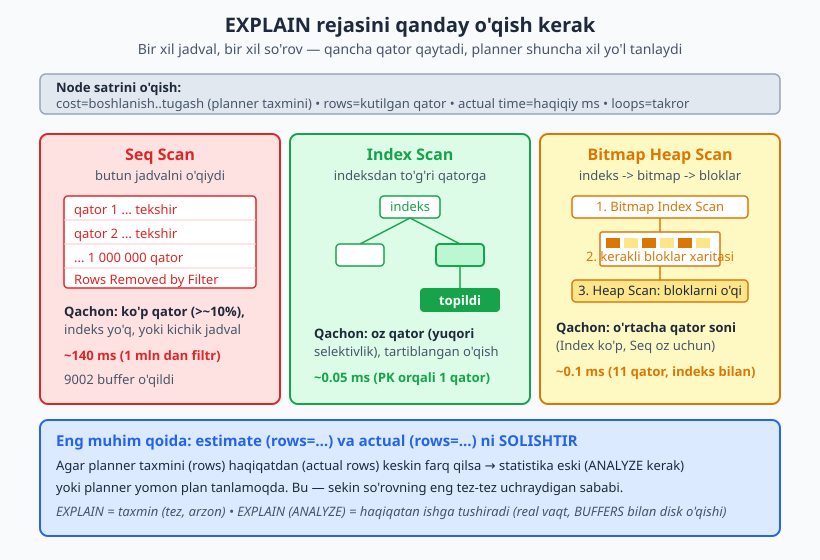
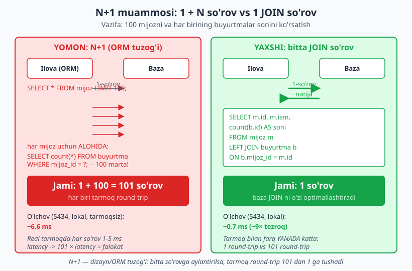
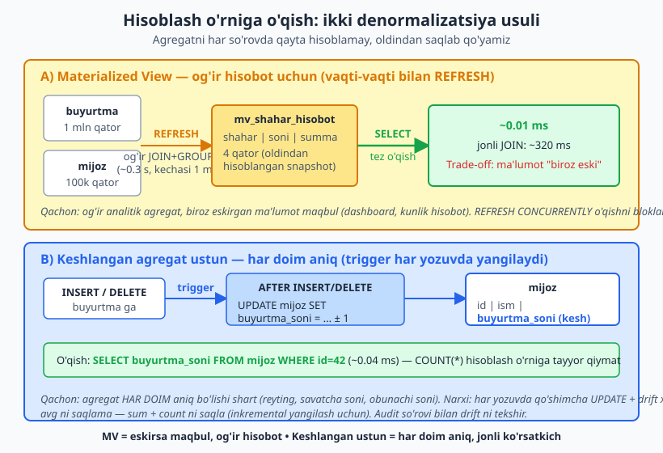

# 15 — Sxema va so'rov performansi (EXPLAIN ANALYZE)

[⬅️ Oldingi: 14 — Indeks strategiyasi](./14-indeks-strategiyasi.md) · [🏠 README](./README.md) · [Keyingi: 16 — Tranzaksiya, izolyatsiya va parallellik dizayni ➡️](./16-tranzaksiya-parallellik.md)

> **Bu bobda:** Dizayn qarori performansga qanday ta'sir qilishini o'rganamiz. Avval `EXPLAIN (ANALYZE, BUFFERS)` ni o'qishni — node turlari (Seq Scan, Index Scan, Bitmap, Nested Loop, Hash Join, Merge Join) va `cost`/`rows`/`actual time` raqamlarini — chuqur ko'ramiz. Keyin N+1 muammosini dizayn tomondan, normalizatsiya vs denormalizatsiya tezlik trade-offini (o'lchov bilan), materialized view va trigger orqali keshlangan agregat ustunni qo'llaymiz. Eng muhim shior: **avval o'lcha, keyin optimallashtir.**

---

## 0. Performans — bu DIZAYN masalasi

Ko'pchilik "performans" ni keyinroq, "tizim sekinlashganda" hal qilinadigan narsa deb o'ylaydi. Bu xato. Performansning katta qismi — **sxema dizaynida**, kod yozilishidan ham oldin hal bo'ladi:

- Qaysi ustunga indeks qo'yiladi ([14-bob](./14-indeks-strategiyasi.md))?
- Ma'lumot qancha normalizatsiyalangan — o'qish necha JOIN talab qiladi ([08-bob](./08-normalizatsiya-ilgor.md))?
- Agregat har safar hisoblanadimi yoki keshlanadimi?
- Ilova bitta JOIN so'rov yuboradimi yoki 100 ta alohida so'rov (N+1)?

Bu bob — [14-bobning](./14-indeks-strategiyasi.md) davomi. U yerda indeks **qanday** ishlashini ko'rdik; bu yerda indeks va boshqa dizayn qarorlarining ta'sirini **o'lchashni** va `EXPLAIN` orqali **isbotlashni** o'rganamiz.

> **Bu bobning oltin qoidasi:** *"AVVAL O'LCHA, keyin optimallashtir."* Taxminga ko'ra optimallashtirish — vaqtni behuda sarflash va ko'pincha dizaynni murakkablashtirish. `EXPLAIN ANALYZE` — sizning o'lchov asbobingiz. Hech bir optimallashtirishni o'lchamasdan qilmang.

Bu bobdagi barcha raqamlar **haqiqiy** — PostgreSQL 18.4 klasterida, 1 million qatorli jadval ustida ishga tushirilgan. Aniq millisekund qiymatlari **mashinaga bog'liq** (sizning kompyuteringizda boshqacha bo'ladi) — shuning uchun e'tibor bering **plan TURI** ga (Seq Scan mi, Index Scan mi) va **nisbatlarga** (necha barobar tez/sekin), aniq millisekundga emas.

### 0.1 Tajriba poligoni: 1 million qatorli jadval

Butun bob davomida bitta domendan foydalanamiz: onlayn-do'kon `buyurtma` va `mijoz` jadvallari. Buni `generate_series` bilan to'ldiramiz:

```sql
CREATE SCHEMA IF NOT EXISTS ch15;
SET search_path = ch15;

CREATE TABLE buyurtma (
    id          bigint GENERATED ALWAYS AS IDENTITY PRIMARY KEY,
    mijoz_id    bigint NOT NULL,
    holat       text   NOT NULL,
    summa       numeric(10,2) NOT NULL,
    yaratilgan  timestamptz NOT NULL
);

INSERT INTO buyurtma (mijoz_id, holat, summa, yaratilgan)
SELECT
    (random()*100000)::bigint + 1,
    (ARRAY['yangi','tolangan','yetkazildi','bekor'])[(random()*3)::int + 1],
    (random()*500000)::numeric(10,2),
    now() - ((random()*365)::int || ' days')::interval
FROM generate_series(1, 1000000);

ANALYZE buyurtma;
```

Bu 1 000 000 qator yaratadi. `holat` taqsimoti (5434 da o'lchandi):

```
   holat    | count
------------+--------
 bekor      | 166971
 tolangan   | 332791
 yangi      | 166922
 yetkazildi | 333316
```

Jadval o'lchami (5434 da o'lchandi):

```
 jami_olcham | jadval | indekslar
-------------+--------+-----------
 107 MB      | 70 MB  | 37 MB
```

> `mijoz` jadvali ham bor: 100 000 qator (`id`, `ism`, `shahar`). Uni JOIN bo'limida ishlatamiz.

---

## 1. EXPLAIN va EXPLAIN ANALYZE — farqi

Bu ikkitasini chalkashtirmaslik muhim:

| Buyruq | Nima qiladi | So'rovni ishga tushiradimi? |
|---|---|---|
| `EXPLAIN` | Plannerning **taxminiy** rejasini ko'rsatadi (cost, rows) | Yo'q — tez, arzon, xavfsiz |
| `EXPLAIN (ANALYZE)` | So'rovni **haqiqatan ishga tushiradi** va real vaqt/qatorni ko'rsatadi | Ha — `actual time`, `actual rows` |
| `EXPLAIN (ANALYZE, BUFFERS)` | Yuqoridagilarga + diskdan/keshdan necha blok o'qilgani | Ha |

> **Ogohlantirish:** `EXPLAIN (ANALYZE)` so'rovni **chindan bajaradi**. `UPDATE`/`DELETE`/`INSERT` ustida ishlatsangiz — ma'lumot **o'zgaradi**! Agar shunchaki rejani ko'rmoqchi bo'lsangiz, tranzaksiyaga o'rang: `BEGIN; EXPLAIN ANALYZE DELETE ...; ROLLBACK;`.

Amalda eng foydali shakl — `EXPLAIN (ANALYZE, BUFFERS)`: u plannerning taxmini bilan haqiqatni yonma-yon qo'yadi va disk o'qishini ham ko'rsatadi.



### 1.1 Bir satrni o'qish

Eng oddiy so'rov — birlamchi kalit (PK) bo'yicha bitta qator (5434 da olingan):

```sql
EXPLAIN (ANALYZE, BUFFERS) SELECT * FROM buyurtma WHERE id = 500000;
```

```
 Index Scan using buyurtma_pkey on buyurtma  (cost=0.42..8.44 rows=1 width=40) (actual time=0.051..0.051 rows=1.00 loops=1)
   Index Cond: (id = 500000)
   Index Searches: 1
   Buffers: shared hit=7
 Planning Time: 1.265 ms
 Execution Time: 0.147 ms
```

Endi har bir raqamni o'qiymiz:

- **`Index Scan using buyurtma_pkey`** — node turi. PK indeksidan foydalanib qatorga to'g'ridan-to'g'ri bordi.
- **`cost=0.42..8.44`** — plannerning **taxminiy narxi**, ixtiyoriy birlikda (millisekund emas!). `0.42` — birinchi qatorni qaytarish narxi (start-up cost), `8.44` — barcha qatorlarni qaytarish narxi. Planner shu raqam bo'yicha planlarni solishtiradi.
- **`rows=1`** — planner **taxminan** 1 qator qaytadi deb hisobladi.
- **`width=40`** — har qator o'rtacha 40 bayt.
- **`actual time=0.051..0.051`** — **haqiqiy** vaqt millisekundda (start-up..total).
- **`rows=1.00`** — **haqiqatan** 1 qator qaytdi. (Taxmin `rows=1` haqiqat `rows=1.00` ga mos — planner to'g'ri.)
- **`loops=1`** — bu node 1 marta bajarildi.
- **`Buffers: shared hit=7`** — 7 ta 8KB lik blok keshdan o'qildi (`hit` = kesh, `read` = diskdan). Bu yerda hammasi keshda edi.
- **`Planning Time`** — rejani tuzishga ketgan vaqt. **`Execution Time`** — bajarishga ketgan vaqt.

> **Eng muhim ko'nikma:** har doim plannerning taxmini (`rows=N`) ni haqiqat (`actual ... rows=M`) bilan SOLISHTIRING. Agar ular keskin farq qilsa (masalan, taxmin 5, haqiqat 333 000) — planner statistikasi eski yoki noto'g'ri, va bu **sekin so'rovning eng tez-tez uchraydigan sababi** (4-bo'limda ko'ramiz).

---

## 2. Node turlari: planner qanday tanlaydi

Endi bir xil jadvalda, **necha qator qaytishiga qarab** planner qanday turli yo'l tanlashini ko'ramiz. Bu — performans dizaynining yuragi.

### 2.1 Seq Scan — butun jadvalni o'qish

`mijoz_id` ustunida hozircha indeks **yo'q**. Bitta mijozni qidiramiz:

```sql
EXPLAIN (ANALYZE, BUFFERS) SELECT * FROM buyurtma WHERE mijoz_id = 42;
```

```
 Gather  (cost=1000.00..15211.43 rows=11 width=40) (actual time=6.266..140.282 rows=11.00 loops=1)
   Workers Planned: 2
   Workers Launched: 2
   Buffers: shared hit=9002
   ->  Parallel Seq Scan on buyurtma  (cost=0.00..14210.33 rows=5 width=40) (actual time=5.680..28.472 rows=3.67 loops=3)
         Filter: (mijoz_id = 42)
         Rows Removed by Filter: 333330
         Buffers: shared hit=9002
 Planning Time: 0.051 ms
 Execution Time: 140.306 ms
```

Bu yerda nima bo'ldi:

- **`Parallel Seq Scan`** — indeks yo'qligi sababli PG **butun jadvalni** o'qishga majbur. U buni tezlashtirish uchun 2 ta parallel ishchi (`Workers`) ishga soldi.
- **`Rows Removed by Filter: 333330`** — har ishchi 333 330 qatorni o'qib, **tashladi** (faqat 11 tasi `mijoz_id = 42`). Bu — isrof: 1 million qator o'qildi, atigi 11 tasi kerak edi.
- **`Buffers: shared hit=9002`** — 9002 blok (~70 MB) o'qildi.
- **`Execution Time: ~140 ms`** *(taxminan; mashinaga bog'liq)* — atigi 11 qator uchun!

Bu — **dizayn xatosi**: tez-tez `mijoz_id` bo'yicha qidirilsa, bu ustunga indeks kerak.

### 2.2 Index/Bitmap Scan — indeks qo'shgandan keyin

Indeks qo'shamiz va aynan o'sha so'rovni qaytaramiz:

```sql
CREATE INDEX idx_buyurtma_mijoz ON buyurtma (mijoz_id);
ANALYZE buyurtma;
EXPLAIN (ANALYZE, BUFFERS) SELECT * FROM buyurtma WHERE mijoz_id = 42;
```

```
 Bitmap Heap Scan on buyurtma  (cost=4.51..47.49 rows=11 width=40) (actual time=0.081..0.089 rows=11.00 loops=1)
   Recheck Cond: (mijoz_id = 42)
   Heap Blocks: exact=11
   Buffers: shared hit=14 read=3
   ->  Bitmap Index Scan on idx_buyurtma_mijoz  (cost=0.00..4.51 rows=11 width=0) (actual time=0.067..0.067 rows=11.00 loops=1)
         Index Cond: (mijoz_id = 42)
         Buffers: shared hit=3 read=3
 Execution Time: 0.114 ms
```

- Plan **Seq Scan dan Bitmap Heap Scan ga o'tdi** — endi indeksdan foydalanadi.
- **`Bitmap Index Scan`** — avval indeksni o'qib, qaysi **bloklarda** kerakli qatorlar borligi xaritasini (bitmap) tuzadi.
- **`Bitmap Heap Scan`** — keyin faqat o'sha bloklarni (`Heap Blocks: exact=11`) o'qiydi.
- **`Execution Time: ~0.11 ms`** — Seq Scan dagi ~140 ms ga nisbatan **mingdan ortiq barobar tez** *(nisbat muhim, aniq raqam mashinaga bog'liq)*.

> **Nega Bitmap, oddiy Index Scan emas?** 11 qator turli bloklarga tarqalgan bo'lishi mumkin. Bitmap avval bloklar ro'yxatini yig'ib, ularni **disk tartibida** o'qiydi (tasodifiy o'qishdan tez). Index Scan bitta yoki ketma-ket bir necha qator uchun, Bitmap esa o'rtacha sondagi tarqoq qatorlar uchun afzal.

### 2.3 Index Only Scan — jadvalga umuman tegmasdan

Agar so'rov **faqat indeksdagi ustunlarni** so'rasa, PG jadval (heap) ga umuman bormaydi:

```sql
EXPLAIN (ANALYZE, BUFFERS) SELECT mijoz_id FROM buyurtma WHERE mijoz_id = 42;
```

```
 Index Only Scan using idx_buyurtma_mijoz on buyurtma  (cost=0.42..4.62 rows=11 width=8) (actual time=5.763..5.765 rows=11.00 loops=1)
   Index Cond: (mijoz_id = 42)
   Heap Fetches: 0
   Buffers: shared hit=7
```

- **`Index Only Scan`** — `Heap Fetches: 0`, ya'ni jadvalga **hech qachon** borilmadi, hamma narsa indeksdan o'qildi.
- Bu — `INCLUDE` (covering) indekslarning kuchi ([14-bob](./14-indeks-strategiyasi.md)): kerakli ustunlarni indeksga qo'shsangiz, o'qish jadvalni umuman chetlab o'tadi.

### 2.4 Selektivlik — planner nega ba'zan Seq Scan ni TANLAYDI

Muhim tushuncha: indeks **har doim** ham yaxshi emas. `holat = 'tolangan'` ~333 000 qator (33%) qaytaradi. Bu ustunga indeks **qo'ysak ham**, planner uni e'tiborsiz qoldiradi:

```sql
CREATE INDEX idx_buyurtma_holat ON buyurtma (holat);
ANALYZE buyurtma;
EXPLAIN (ANALYZE, BUFFERS) SELECT count(*) FROM buyurtma WHERE holat = 'tolangan';
```

```
 Finalize Aggregate ...
   ->  Gather  (Workers Planned: 2 ...)
         ->  Partial Aggregate ...
               ->  Parallel Index Only Scan using idx_buyurtma_holat ...
                     Index Cond: (holat = 'tolangan'::text)
 Execution Time: 38.287 ms
```

Bu yerda PG indeksdan `count` uchun foydalandi (Index Only Scan — chunki `count(*)` ga heap kerak emas), lekin agar `SELECT *` bo'lganda Seq Scan ni tanlardi. **Qoida:** so'rov jadvalning katta qismini (~taxminan >5-10%) qaytarsa, indeks bo'yicha tasodifiy o'qishdan ko'ra butun jadvalni ketma-ket o'qish **arzonroq**. Planner buni `cost` orqali hisoblaydi.

> **Dizayn xulosasi:** past selektivlikli ustunga (oz xil qiymat: `holat`, `jins`, `faolmi`) oddiy B-tree indeks ko'pincha **befoyda** — u joy egallaydi, yozishni sekinlashtiradi, lekin planner uni ishlatmaydi. Bunday ustunlar uchun **qisman (partial) indeks** yoki kompozit indeks tarkibida ishlatish to'g'riroq ([14-bobni eslang](./14-indeks-strategiyasi.md)).

---

## 3. JOIN strategiyalari: Nested Loop, Hash Join, Merge Join

Planner ikki jadvalni birlashtirishda uchta usuldan birini tanlaydi. Qaysi birini — yana **necha qator** ishtirok etishiga bog'liq.

### 3.1 Nested Loop — kichik tanlov uchun

Bitta mijozning buyurtmalari (oz qator):

```sql
EXPLAIN (ANALYZE, BUFFERS)
SELECT m.ism, b.id, b.summa
FROM mijoz m JOIN buyurtma b ON b.mijoz_id = m.id
WHERE m.id = 42;
```

```
 Nested Loop  (cost=4.80..55.91 rows=11 width=28) (actual time=0.046..0.074 rows=11.00 loops=1)
   ->  Index Scan using mijoz_pkey on mijoz m  (cost=0.29..8.31 rows=1 ...) (actual ... rows=1.00 loops=1)
         Index Cond: (id = 42)
   ->  Bitmap Heap Scan on buyurtma b  (cost=4.51..47.49 rows=11 ...) (actual ... rows=11.00 loops=1)
         Recheck Cond: (mijoz_id = 42)
         ->  Bitmap Index Scan on idx_buyurtma_mijoz ...
 Execution Time: 0.095 ms
```

- **`Nested Loop`** — tashqi tomondan (1 mijoz) har qator uchun ichki tomonni (uning buyurtmalari) qidiradi.
- Tashqi tomon kichik (1 qator) bo'lgani uchun bu eng tez yo'l. `loops=1` — ichki qidiruv atigi 1 marta bajarildi.
- **Dizayn:** Nested Loop **indeks bo'lganda** juda tez. Ichki tomonda indeks bo'lmasa (har loopda Seq Scan) — falokat.

### 3.2 Hash Join — katta + katta uchun

Endi **barcha** buyurtmalarni mijozlar bilan birlashtirib, shahar bo'yicha hisoblaymiz:

```sql
EXPLAIN (ANALYZE, BUFFERS)
SELECT m.shahar, count(*)
FROM buyurtma b JOIN mijoz m ON m.id = b.mijoz_id
GROUP BY m.shahar;
```

```
 Finalize GroupAggregate ...
   ->  Gather Merge  (Workers Planned: 2 ...)
         ->  Partial HashAggregate ...
               ->  Hash Join  (cost=2986.00..17248.46 rows=416667 ...) (actual ... rows=333331.00 loops=3)
                     Hash Cond: (b.mijoz_id = m.id)
                     ->  Parallel Seq Scan on buyurtma b ...
                     ->  Hash  (... rows=100000 ...)  Memory Usage: 6101kB
                           ->  Seq Scan on mijoz m ...
 Execution Time: 224.142 ms
```

- **`Hash Join`** — kichikroq jadval (`mijoz`, 100k) dan xotirada **hash jadval** tuziladi (`Memory Usage: 6101kB`), keyin katta jadval (`buyurtma`) qatorlari shu hash bo'yicha tekshiriladi.
- Ko'p qator birlashtirilganda (333 000+) bu Nested Loop dan ancha tez. Planner aynan shuning uchun uni tanladi.
- **Dizayn:** Hash Join uchun kichik tomon xotiraga sig'ishi kerak (`work_mem`). Sig'masa — `Batches: N` (>1) ko'rinadi va disk ishlatiladi (sekinroq).

### 3.3 Merge Join — ikki tartiblangan oqim

Merge Join ikkala tomon ham birlashtirish ustuni bo'yicha **tartiblangan** bo'lsa ishlaydi (masalan, ikkalasida ham indeks bor). Buni ko'rsatish uchun planner tanlovini majburlaymiz:

```sql
SET enable_hashjoin = off;
SET enable_nestloop = off;
EXPLAIN (ANALYZE, BUFFERS)
SELECT m.shahar, count(*)
FROM buyurtma b JOIN mijoz m ON m.id = b.mijoz_id
GROUP BY m.shahar;
RESET enable_hashjoin; RESET enable_nestloop;
```

```
 ... Merge Join  (cost=1.15..22512.51 rows=416667 ...) (actual ... rows=333331.00 loops=3)
       Merge Cond: (b.mijoz_id = m.id)
       ->  Parallel Index Only Scan using idx_buyurtma_mijoz on buyurtma b ...
       ->  Index Scan using mijoz_pkey on mijoz m ...
 Execution Time: 214.573 ms
```

- **`Merge Join`** — ikki tartiblangan oqimni "zip" kabi birlashtiradi (har ikkalasi `mijoz_id`/`id` bo'yicha tartiblangan, indeks orqali).
- Bu yerda Merge Join ham Hash Join ham deyarli teng tez — planner odatda Hash Join ni tanlardi. Merge Join juda katta, allaqachon tartiblangan ma'lumotlarda yorqinroq.

> **Diqqat:** `SET enable_*` ni faqat **tajriba/o'rganish** uchun ishlating, ishlab chiqarishda emas. Bu plannerga "shu usulni ishlatma" deydi — real tizimda planner tanlovi deyarli har doim to'g'ri.

| JOIN turi | Qachon eng yaxshi | Kalit shart |
|---|---|---|
| **Nested Loop** | Tashqi tomon oz qator | Ichki tomonda indeks |
| **Hash Join** | Ikkala tomon katta, ko'p qator | Kichik tomon `work_mem` ga sig'sin |
| **Merge Join** | Ikkalasi tartiblangan (indeks/sort) | Birlashtirish ustuni tartiblangan |

---

## 4. Statistika va ANALYZE — planner nega xato qiladi

Planner qaror qabul qilishda **statistikaga** tayanadi: jadvalda necha qator, ustunda necha xil qiymat, taqsimot qanday. Bu statistika `ANALYZE` (yoki autovacuum) bilan yangilanadi. **Eski statistika — yomon plan sababi #1.**

Buni jonli ko'ramiz. Yangi jadvalga 500 000 qator kiritamiz, lekin `ANALYZE` qilmaymiz:

```sql
CREATE TABLE stat_demo (id bigint, kategoriya text);
INSERT INTO stat_demo
SELECT g, 'kat-' || (g % 5) FROM generate_series(1, 500000) g;

-- ANALYZE SIZ:
EXPLAIN SELECT * FROM stat_demo WHERE kategoriya = 'kat-1';
```

```
 Gather  (cost=1000.00..6250.20 rows=1622 width=40)
   ->  Parallel Seq Scan on stat_demo  (cost=0.00..5088.00 rows=954 width=40)
         Filter: (kategoriya = 'kat-1'::text)
```

Planner `rows=954` deb taxmin qildi — lekin haqiqatda `kat-1` 100 000 qator (har 5 dan 1 tasi)! Statistika yo'qligi sababli taxmin **100 barobar xato**.

Endi `ANALYZE` qilamiz:

```sql
ANALYZE stat_demo;
EXPLAIN SELECT * FROM stat_demo WHERE kategoriya = 'kat-1';
```

```
 Seq Scan on stat_demo  (cost=0.00..8953.00 rows=99683 width=14)
   Filter: (kategoriya = 'kat-1'::text)
```

Endi taxmin `rows=99683` — haqiqiy 100 000 ga juda yaqin. Statistika to'g'rilandi, planner endi to'g'ri qaror qabul qiladi.

> **Nega bu muhim?** Agar planner "1622 qator qaytadi" deb o'ylab, Nested Loop tanlasa, lekin haqiqatda 100 000 qator bo'lsa — u Nested Loop ni 100 000 marta aylantiradi va so'rov soatlab cho'ziladi. Aynan shu sababli **katta `INSERT`/migratsiyadan keyin `ANALYZE` qilish** majburiy.

**Dizayn/operatsion xulosa:**

- PG **autovacuum** odatda `ANALYZE` ni avtomatik bajaradi — lekin katta bulk-yuklamadan keyin **qo'lda** `ANALYZE jadval;` qiling, kutmang.
- Notekis taqsimotli yoki o'zaro bog'liq ustunlar uchun **kengaytirilgan statistika** yarating: `CREATE STATISTICS ... (dependencies, ndistinct) ON a, b FROM jadval;` — planner ustunlar orasidagi bog'liqlikni bilib oladi.
- EXPLAIN da taxmin/haqiqat keskin farq qilsa — birinchi gumon: eski statistika.

---

## 5. N+1 muammosi — dizayn/ORM tuzog'i

Bu — eng keng tarqalgan performans muammosi va u **sxemada emas, ilova kodida** (ko'pincha ORM tufayli) tug'iladi.

### 5.1 Muammo

Vazifa: 100 mijozni va har birining buyurtmalar sonini ko'rsatish. ORM (masalan, sodda yozilgan kod) buni shunday qiladi:

1. **1 so'rov:** mijozlar ro'yxatini ol.
2. **Keyin har mijoz uchun ALOHIDA so'rov** (sikl ichida): `SELECT count(*) FROM buyurtma WHERE mijoz_id = ?`.

100 mijoz uchun bu **1 + 100 = 101 so'rov**. Bu "N+1 muammosi" deyiladi.



### 5.2 O'lchov — haqiqatda qancha qimmat?

N+1 ni `plpgsql` sikli bilan simulyatsiya qilamiz (5434 da ishga tushirildi):

```sql
DO $$
DECLARE r record; c bigint; t0 timestamptz; t1 timestamptz; n int := 0;
BEGIN
    t0 := clock_timestamp();
    FOR r IN SELECT id FROM mijoz WHERE id <= 100 ORDER BY id LOOP
        SELECT count(*) INTO c FROM buyurtma WHERE mijoz_id = r.id;  -- har safar alohida
        n := n + 1;
    END LOOP;
    t1 := clock_timestamp();
    RAISE NOTICE 'N+1: 1 + % so''rov, vaqt = % ms', n,
                 round(extract(milliseconds FROM (t1 - t0))::numeric, 2);
END $$;
```

Natija (5434, lokal):

```
NOTICE:  N+1: 1 + 100 so'rov, vaqt = 6.58 ms
```

Endi xuddi shu natijani **bitta JOIN** bilan:

```sql
SELECT m.id, m.ism, count(b.id) AS buyurtma_soni
FROM mijoz m
LEFT JOIN buyurtma b ON b.mijoz_id = m.id
WHERE m.id <= 100
GROUP BY m.id, m.ism;
```

Natija (5434, lokal):

```
NOTICE:  JOIN: 1 so'rov, vaqt = 0.74 ms
```

| Yondashuv | So'rovlar soni | Vaqt (lokal, 5434) |
|---|---|---|
| N+1 | 101 | ~6.6 ms |
| Bitta JOIN | 1 | ~0.7 ms |

Lokalda ~9 barobar farq. **Lekin haqiqiy tizimda farq ulkanroq:** bu o'lchov tarmoqsiz (baza ichida). Real ilovada har so'rov ilova serveridan bazaga **tarmoq round-trip** (1-5 ms) talab qiladi. 101 so'rov × 3 ms = ~300 ms, 1 so'rov × 3 ms = 3 ms — **100 barobar farq**.

### 5.3 Dizayn tomondan yechish

- **JOIN bilan birlashtir** — bitta so'rovda kerakli ma'lumotni ol (yuqoridagi misol).
- **ORM da "eager loading" (oldindan yuklash)** yoqing: Django `select_related`/`prefetch_related`, SQLAlchemy `joinedload`, Hibernate `JOIN FETCH`, Prisma `include`. Bular ORM ga "alohida so'rov yuborma, JOIN qil" deydi.
- **`IN` bilan to'plab so'rang:** `SELECT * FROM buyurtma WHERE mijoz_id IN (1,2,...,100)` — 100 so'rov o'rniga 1 ta.

> **Esda tuting:** N+1 — bu **sxema xatosi emas**, **kirish naqshi (access pattern) xatosi**. Sxemangiz ideal bo'lishi mumkin, lekin ORM uni N+1 ga aylantirsa — sekin bo'ladi. Shuning uchun ishlab chiqishda baza so'rov jurnalini (`log_statement = 'all'` yoki ORM debug) ko'rib turing: bitta sahifa 100 ta so'rov yuborayotgan bo'lsa — N+1.

---

## 6. Normalizatsiya vs denormalizatsiya — tezlikni O'LCHASH

[08-bobda](./08-normalizatsiya-ilgor.md) denormalizatsiyani **nazariy** ko'rdik. Endi uning tezlik ta'sirini **o'lchaymiz**.

Vazifa: shahar bo'yicha buyurtmalar statistikasi. Ikki yo'l bilan olamiz.

**Yo'l 1 — to'liq normalizatsiyalangan (jonli JOIN + GROUP BY):**

```sql
EXPLAIN (ANALYZE, BUFFERS)
SELECT m.shahar, count(*) FROM buyurtma b JOIN mijoz m ON m.id=b.mijoz_id GROUP BY m.shahar;
```

Natija (5434): `Hash Join` + `GroupAggregate`, `Execution Time` **~320 ms**, `Buffers: shared hit=10556` (1 mln + 100k qator har safar o'qiladi).

**Yo'l 2 — denormalizatsiyalangan (oldindan hisoblangan materialized view):**

```sql
EXPLAIN (ANALYZE, BUFFERS) SELECT shahar, buyurtma_soni FROM mv_shahar_hisobot;
```

Natija (5434): `Seq Scan on mv_shahar_hisobot`, `Execution Time` **~0.01 ms**, `Buffers: shared hit=1` (atigi 4 qatorli MV).

| Yo'l | Plan | Vaqt | Bloklar |
|---|---|---|---|
| Normalizatsiya (jonli JOIN) | Hash Join + Aggregate | ~320 ms | 10556 |
| Denormalizatsiya (MV) | Seq Scan (4 qator) | ~0.01 ms | 1 |

O'qishda **o'n minglab barobar** farq. Lekin bu bepul emas — bu farqning narxi: MV "biroz eski" bo'ladi va uni `REFRESH` qilish kerak (keyingi bo'lim). Bu — [08-bobdagi](./08-normalizatsiya-ilgor.md) trade-offning **o'lchangan isboti**: normalizatsiya — yozish ishonchli, o'qish sekin; denormalizatsiya — o'qish tez, izchillik sizning mas'uliyatingiz.

> **AVVAL O'LCHA:** bu 320 ms farqni denormalizatsiya bilan yopishdan **oldin** o'zingizdan so'rang — bu so'rov chindan tez-tez ishlatiladimi? Agar bu hisobot kuniga 2 marta ishlatilsa, 320 ms — muammo emas. Agar har sahifa yuklashda ishlatilsa — denormalizatsiya oqlangan. **O'lchov + ishlatish chastotasi** = qaror.

---

## 7. Materialized view — oldindan hisoblangan snapshot

**Materialized view (MV)** — so'rov natijasini **diskka saqlab qo'yadigan** ko'rinish. Oddiy `VIEW` har so'rovda qayta hisoblanadi; MV esa bir marta hisoblanib, saqlanadi va `REFRESH` qilinmaguncha o'zgarmaydi.



### 7.1 Yaratish va o'qish

```sql
CREATE MATERIALIZED VIEW mv_shahar_hisobot AS
SELECT m.shahar,
       count(*)               AS buyurtma_soni,
       sum(b.summa)           AS umumiy_summa,
       round(avg(b.summa), 2) AS ortacha_summa
FROM buyurtma b JOIN mijoz m ON m.id = b.mijoz_id
GROUP BY m.shahar
WITH DATA;

-- REFRESH CONCURRENTLY uchun unikal indeks SHART:
CREATE UNIQUE INDEX ON mv_shahar_hisobot (shahar);
```

O'qish (5434 da olingan natija):

```
  shahar   | buyurtma_soni |  umumiy_summa  | ortacha_summa
-----------+---------------+----------------+---------------
 Andijon   |        163393 | 40891898633.32 |     250267.14
 Buxoro    |        338728 | 84718168868.89 |     250106.78
 Samarqand |        331008 | 82712351828.70 |     249880.22
 Toshkent  |        166864 | 41723338052.55 |     250043.98
```

### 7.2 Eskirish va REFRESH

MV ning asosiy xususiyati — u **snapshot**, ya'ni baza o'zgarsa ham MV eski qoladi. Buni ko'rsatamiz:

```sql
-- Samarqandlik mijozga (id=1) yangi buyurtma qo'shamiz:
INSERT INTO buyurtma (mijoz_id, holat, summa, yaratilgan) VALUES (1, 'yangi', 999999.00, now());

SELECT shahar, buyurtma_soni FROM mv_shahar_hisobot WHERE shahar = 'Samarqand';
```

Natija — MV hali **eski** (331008, yangi buyurtmani ko'rmaydi):

```
  shahar   | buyurtma_soni
-----------+---------------
 Samarqand |        331008
```

Endi `REFRESH` qilamiz:

```sql
REFRESH MATERIALIZED VIEW CONCURRENTLY mv_shahar_hisobot;
SELECT shahar, buyurtma_soni FROM mv_shahar_hisobot WHERE shahar = 'Samarqand';
```

Natija — endi yangilandi (331009):

```
  shahar   | buyurtma_soni
-----------+---------------
 Samarqand |        331009
```

- **`REFRESH MATERIALIZED VIEW`** — MV ni qaytadan hisoblaydi (so'rovni qaytadan bajaradi). Bu **og'ir** operatsiya (bizning misolda ~0.3 s).
- **`CONCURRENTLY`** — REFRESH paytida MV ni **o'qishni bloklamaydi** (foydalanuvchilar eski ma'lumotni o'qib turaveradi). Buning uchun MV da **unikal indeks** bo'lishi shart.

### 7.3 MV ni qachon ishlatish

| Mos | Mos emas |
|---|---|
| Og'ir analitik agregat (dashboard, hisobot) | Har doim aniq bo'lishi shart bo'lgan ma'lumot |
| Biroz eskirgan ma'lumot maqbul | Tez-tez (har soniyada) o'zgaradigan |
| Vaqti-vaqti bilan (kechasi, soatda 1 marta) REFRESH | Bitta qator o'zgarsa darhol ko'rinishi kerak |

> **MySQL farqi:** MySQL'da materialized view **yo'q**. O'rniga: oddiy jadval yaratib, uni event/cron yoki trigger bilan to'ldirib turiladi. PG ning `REFRESH MATERIALIZED VIEW` qulayligi yo'q.

---

## 8. Keshlangan agregat ustun — trigger bilan

MV "biroz eski" bo'lishi mumkin edi. Lekin ba'zi ko'rsatkichlar **har doim aniq** bo'lishi kerak (mahsulot reytingi, savatcha soni, obunachilar soni). Bunda **keshlangan agregat ustun + trigger** ishlatamiz: agregatni har yozuvda inkremental yangilab boramiz.

Buni [08-bobda](./08-normalizatsiya-ilgor.md) ko'rgan edik — bu yerda uni 1 mln qatorli jadvalda **o'lchaymiz**.

### 8.1 Ustun + backfill + trigger

```sql
ALTER TABLE mijoz ADD COLUMN buyurtma_soni integer NOT NULL DEFAULT 0;

-- Mavjud ma'lumotni boshlang'ich to'ldirish (backfill):
UPDATE mijoz m
SET buyurtma_soni = s.cnt
FROM (SELECT mijoz_id, count(*) cnt FROM buyurtma GROUP BY mijoz_id) s
WHERE m.id = s.mijoz_id;

CREATE OR REPLACE FUNCTION buyurtma_soni_yangila() RETURNS trigger AS $$
BEGIN
    IF TG_OP = 'INSERT' THEN
        UPDATE mijoz SET buyurtma_soni = buyurtma_soni + 1 WHERE id = NEW.mijoz_id;
    ELSIF TG_OP = 'DELETE' THEN
        UPDATE mijoz SET buyurtma_soni = buyurtma_soni - 1 WHERE id = OLD.mijoz_id;
    END IF;
    RETURN NULL;
END;
$$ LANGUAGE plpgsql;

CREATE TRIGGER trg_buyurtma_soni
AFTER INSERT OR DELETE ON buyurtma
FOR EACH ROW EXECUTE FUNCTION buyurtma_soni_yangila();
```

### 8.2 Hisoblash o'rniga o'qish — o'lchov

**O'qish (keshlangan ustun):**

```sql
EXPLAIN (ANALYZE, BUFFERS) SELECT id, ism, buyurtma_soni FROM mijoz WHERE id = 42;
```

```
 Index Scan using mijoz_pkey on mijoz  (cost=0.42..8.44 rows=1 ...) (actual time=0.025..0.026 rows=1.00 loops=1)
   Index Cond: (id = 42)
 Execution Time: 0.040 ms
```

**Hisoblash (har safar COUNT):**

```sql
EXPLAIN (ANALYZE, BUFFERS) SELECT count(*) FROM buyurtma WHERE mijoz_id = 42;
```

```
 Aggregate  ... (actual time=0.068..0.068 rows=1.00 loops=1)
   ->  Index Only Scan using idx_buyurtma_mijoz on buyurtma  ... rows=11.00 ...
 Execution Time: 0.080 ms
```

Bu yerda farq kichik (0.04 vs 0.08 ms), chunki bizning misolda mijozda atigi ~11 buyurtma. Lekin mijozda **10 000 buyurtma** bo'lsa, `count(*)` 10 000 qatorni sanab chiqishi kerak (sekinroq), keshlangan ustun esa **bitta** qatordan o'qiladi — farq keskin kattalashadi. Aynan shu sababli "izoh soni", "like soni" kabi ko'rsatkichlar deyarli har doim keshlanadi.

### 8.3 Trigger izchilligini tekshirish

3 buyurtma qo'shamiz, keyin 1 tasini o'chiramiz, va keshni haqiqiy `COUNT` bilan solishtiramiz (5434 da olingan):

```sql
INSERT INTO buyurtma (mijoz_id, holat, summa, yaratilgan) VALUES
  (42,'yangi',100,now()),(42,'yangi',200,now()),(42,'yangi',300,now());
SELECT m.buyurtma_soni AS kesh,
       (SELECT count(*) FROM buyurtma WHERE mijoz_id=42) AS haqiqiy
FROM mijoz m WHERE m.id=42;
```

```
 kesh | haqiqiy
------+---------
   14 |      14
```

```sql
DELETE FROM buyurtma WHERE mijoz_id=42 AND summa=300 AND holat='yangi';
SELECT m.buyurtma_soni AS kesh,
       (SELECT count(*) FROM buyurtma WHERE mijoz_id=42) AS haqiqiy
FROM mijoz m WHERE m.id=42;
```

```
 kesh | haqiqiy
------+---------
   13 |      13
```

Kesh haqiqiy songa **aynan mos** — trigger ishladi.

> **Ekspert maslahati:** `avg` ni to'g'ridan-to'g'ri keshlamang — uni inkremental yangilab bo'lmaydi. O'rniga `sum` va `count` ni alohida ustunlarda saqlang, o'rtachani o'qishda hisoblang: `sum_baho::numeric / NULLIF(count_baho, 0)`. INSERT da ikkalasiga `+` , DELETE da `-` — oson va aniq.

### 8.4 Uch usulni qanday tanlash

| Usul | Aniqlik | Yozish narxi | Qachon |
|---|---|---|---|
| **Generated column (STORED)** | Har doim aniq (baza kafolatlaydi) | Past | Faqat **o'sha qator** ustunlaridan (`soni * narx`) |
| **Trigger + kesh ustun** | Har doim aniq | O'rta (har yozuvda UPDATE) | **Boshqa jadval** agregati, jonli ko'rsatkich |
| **Materialized view** | "Biroz eski" | REFRESH paytida (og'ir) | Og'ir analitik hisobot, eskirish maqbul |

[08-bobdagi](./08-normalizatsiya-ilgor.md) "xavfsizlik darajasi" tartibi shu yerda ham: generated column > trigger > MV > qo'lda ilova kodi.

---

## 9. Amaliy ish oqimi: "avval o'lcha, keyin optimallashtir"

Hammasini birlashtiramiz. Sekin so'rovni optimallashtirishning **to'g'ri** tartibi:

1. **Aniqla** — qaysi so'rov sekin? (`pg_stat_statements` kengaytmasi eng ko'p vaqt yeyayotgan so'rovlarni ko'rsatadi.)
2. **O'lcha** — `EXPLAIN (ANALYZE, BUFFERS)` ishga tushir. Plan turini va taxmin/haqiqat farqini ko'r.
3. **Tashxis** — sabab nima?
   - Seq Scan katta jadvalda + oz qator qaytadi -> **indeks yetishmaydi**.
   - Taxmin va haqiqat keskin farq qiladi -> **`ANALYZE` qil** (eski statistika).
   - Bir so'rov 100 marta takrorlanmoqda -> **N+1**, JOIN ga aylantir.
   - Og'ir agregat tez-tez -> **MV yoki keshlangan ustun**.
   - JOIN da Nested Loop ko'p loops -> ichki tomonga **indeks** yoki Hash Join.
4. **Bitta o'zgarish qil** — indeks qo'sh, so'rovni qayta yoz, yoki denormalizatsiya.
5. **Qaytadan o'lcha** — `EXPLAIN ANALYZE` bilan yaxshilanganini **isbotla**.

> **Eng katta xato:** o'lchamasdan optimallashtirish ("bu yerga indeks kerak shekilli", "denormalizatsiya qilaylik har ehtimolga qarshi"). Bu — vaqt isrofi va ko'pincha dizaynni murakkablashtirib, hech narsani tezlashtirmaydi. **Profiler (EXPLAIN, pg_stat_statements) ko'rsatmagan muammoni "tuzatmang".**

Bob oxirida schema ni tozaladik:

```sql
DROP SCHEMA ch15 CASCADE;
```

---

## Mashqlar

### Oson

1. **EXPLAIN vs EXPLAIN ANALYZE.** Bu ikki buyruq orasidagi farqni tushuntiring. Qaysi biri so'rovni haqiqatan ishga tushiradi? `UPDATE` ustida `EXPLAIN (ANALYZE)` ishlatishning xavfi nima va undan qanday himoyalanasiz?

2. **Plan satrini o'qish.** Quyidagi satrda har bir raqamning ma'nosini yozing: `Index Scan using buyurtma_pkey (cost=0.42..8.44 rows=1 width=40) (actual time=0.051..0.051 rows=1.00 loops=1)`.

3. **Node turini taxmin qil.** 1 mln qatorli, `email` ustunida UNIQUE indeksli `foydalanuvchi` jadvalida `SELECT * FROM foydalanuvchi WHERE email = 'a@b.uz'` qaysi node turini ishlatadi va nega? `WHERE faolmi = true` (1 mln dan ~990k qator) uchun-chi?

4. **Taxmin vs haqiqat.** EXPLAIN ANALYZE da `(rows=5)` taxmin, lekin `(actual ... rows=200000)` chiqdi. Bu nimani bildiradi va birinchi qiladigan ishingiz nima?

### O'rta

5. **N+1 ni aniqlash.** Blog ilovasida bosh sahifa 20 ta maqolani ko'rsatadi, har biri ostida muallif ismi va izohlar soni. Baza jurnalida 41 ta so'rov ko'rinmoqda. Bu nima muammo, qayerda tug'iladi, va uni qanday 1-2 so'rovga tushirasiz?

6. **Selektivlik qarori.** `buyurtma(holat)` ustuniga indeks qo'ydingiz, lekin `WHERE holat = 'tolangan'` (jadvalning 33%) so'rovi baribir Seq Scan ishlatmoqda. Bu xatomi? Nega planner indeksni e'tiborsiz qoldiryapti? Bu ustunga indeks umuman kerakmi?

7. **JOIN strategiyasini tushuntir.** Bir so'rov `WHERE m.id = 42` bilan Nested Loop, boshqasi (butun jadvalni JOIN) Hash Join tanladi. Nega planner ikki xil tanladi? Har biri qachon afzal?

8. **MV yoki keshlangan ustun?** Quyidagi ikki ko'rsatkich uchun MV yoki trigger-keshlangan ustun tanlang va asoslang: (a) bosh sahifadagi "kunlik eng ko'p sotilgan 10 mahsulot"; (b) har mahsulot sahifasidagi "joriy ombordagi soni".

### Qiyin

9. **Sekin so'rovni tashxisla.** Sizga shunday EXPLAIN ANALYZE berildi: tashqi tomonda `Seq Scan (actual rows=500000)`, uning ustida `Nested Loop (loops=500000)` ichki tomonda yana `Seq Scan`. So'rov 40 soniya ishlaydi. Muammoni nomlang, sababini va kamida ikkita yechimni yozing.

10. **Keshlangan o'rtacha reyting.** Marketplace: `mahsulot` va `sharh(mahsulot_id, baho 1..5)`. Mahsulot sahifasida o'rtacha reyting va sharhlar soni HAR DOIM aniq ko'rsatilishi kerak (50 mln o'qish/kun). To'liq dizayn: qaysi ustunlar qo'shiladi, trigger qanday (INSERT/DELETE/UPDATE baho), nega `avg` o'rniga `sum`+`count`, va nega MV emas.

11. **N+1 o'lchov tajribasi.** `plpgsql` `DO` bloki yozing: 200 mijoz uchun N+1 yondashuvini (har biriga alohida `count`) va bitta JOIN yondashuvini `clock_timestamp()` bilan o'lchab, ikkalasining vaqtini `RAISE NOTICE` qiling. Tarmoqli real ilovada bu farq nega yanada katta bo'lishini izohlang.

12. **Statistika tuzog'i.** 10 mln qatorli jadvalga migratsiyada 5 mln yangi qator `COPY` bilan yuklandi, lekin `ANALYZE` qilinmadi. Ertasi kuni bir hisobot so'rovi 2 daqiqaga cho'zildi (avval 2 soniya edi). EXPLAIN da Nested Loop `loops` katta. Nima bo'ldi, qanday tuzatasiz, va kelajakda buni qanday oldini olasiz?

13. **Denormalizatsiya qarorini o'lcha.** "Foydalanuvchi profili" sahifasi `SELECT u.*, count(p.id) post_soni, count(f.id) follower_soni FROM ...` bilan har yuklamada ikki JOIN+agregat qiladi (~150 ms, sahifa kuniga 2 mln marta ochiladi). Denormalizatsiya qilish kerakmi? "Avval o'lcha" tamoyiliga rioya qilib, qaror jarayonini va aniq yechimni (qaysi ustun, qaysi mexanizm) yozing.

14. **To'liq tashxis ssenariysi.** Onlayn-do'kon "buyurtmalar tarixi" sahifasi sekin. EXPLAIN ANALYZE da: `buyurtma` ustida `Seq Scan (actual rows=11, Rows Removed by Filter=999989)`, `mijoz_id` bo'yicha filtr, indeks yo'q. Bosqichma-bosqich: (a) muammoni nomlang, (b) yechimni qo'llang, (c) yechimdan keyin qaysi plan turi kutiladi va nega, (d) bu ustunga qaysi indeks turi (B-tree/Hash/...) mos va nega.

---

## Yechimlar

<details markdown="1">
<summary>Yechim — 1</summary>

`EXPLAIN` — faqat plannerning **taxminiy** rejasini (cost, rows estimate) ko'rsatadi, so'rovni **ishga tushirmaydi** (tez, arzon, xavfsiz). `EXPLAIN (ANALYZE)` — so'rovni **haqiqatan bajaradi** va `actual time`, `actual rows`, `loops` ni qaytaradi.

`UPDATE`/`DELETE`/`INSERT` da `EXPLAIN (ANALYZE)` ma'lumotni **chindan o'zgartiradi** (DELETE qatorlarni o'chiradi!). Himoya: tranzaksiyaga o'rang va orqaga qaytaring:

```sql
BEGIN;
EXPLAIN (ANALYZE) DELETE FROM buyurtma WHERE holat = 'bekor';
ROLLBACK;
```

</details>

<details markdown="1">
<summary>Yechim — 2</summary>

- `Index Scan using buyurtma_pkey` — node turi: PK indeksidan foydalanib qatorga bordi.
- `cost=0.42..8.44` — plannerning taxminiy narxi (ixtiyoriy birlik, ms emas): `0.42` birinchi qatorgacha (start-up), `8.44` barchasi.
- `rows=1` — planner taxminan 1 qator qaytadi deb hisobladi.
- `width=40` — har qator o'rtacha 40 bayt.
- `actual time=0.051..0.051` — haqiqiy vaqt (ms): start-up..total.
- `rows=1.00` — haqiqatan 1 qator qaytdi (taxminga mos — planner to'g'ri).
- `loops=1` — node 1 marta bajarildi.

</details>

<details markdown="1">
<summary>Yechim — 3</summary>

- `WHERE email = 'a@b.uz'` — **Index Scan** (yoki Index Only Scan). `email` UNIQUE, ya'ni eng yuqori selektivlik (1 qator). Planner indeksdan to'g'ri qatorga boradi.
- `WHERE faolmi = true` (~990k/1mln, 99%) — **Seq Scan**. Selektivlik nihoyatda past: deyarli butun jadval qaytadi. Indeks bo'yicha 990 000 ta tasodifiy o'qishdan ko'ra butun jadvalni ketma-ket o'qish arzonroq, shuning uchun planner indeks bo'lsa ham uni ishlatmaydi. `faolmi` ga oddiy indeks bu yerda befoyda (qisman indeks `WHERE faolmi = false` foydaliroq bo'lardi, agar `false` kam bo'lsa).

</details>

<details markdown="1">
<summary>Yechim — 4</summary>

Bu — planner **statistikasi eski yoki noto'g'ri** degani: u 5 qator kutgan, lekin haqiqatda 200 000 qaytdi (40 000 barobar xato). Oqibati: planner shu xato taxminga asoslanib **yomon plan** tanlagan bo'lishi mumkin (masalan, 200 000 qatorni Nested Loop bilan aylantirgan — falokat).

Birinchi qiladigan ish: **`ANALYZE jadval;`** — statistikani yangilash. Notekis/bog'liq ustunlar bo'lsa, qo'shimcha `CREATE STATISTICS`. Keyin EXPLAIN ni qaytadan ko'rib, taxmin endi haqiqatga yaqinlashganini tekshirish.

</details>

<details markdown="1">
<summary>Yechim — 5</summary>

Bu — **N+1 muammosi**. 1 so'rov 20 maqolani oladi, keyin har maqola uchun alohida 1 so'rov muallif/izoh soni uchun: 1 + 20 + 20 = 41. Manba — ORM (yoki sikl ichida so'rov yuborayotgan kod), sxema emas.

Yechish: JOIN bilan bitta so'rovga aylantirish —

```sql
SELECT m.id, m.sarlavha, a.ism AS muallif, count(i.id) AS izoh_soni
FROM maqola m
JOIN muallif a ON a.id = m.muallif_id
LEFT JOIN izoh i ON i.maqola_id = m.id
GROUP BY m.id, m.sarlavha, a.ism
ORDER BY m.sana DESC LIMIT 20;
```

yoki ORM da eager loading (`select_related`/`prefetch_related`/`joinedload`). 41 so'rov -> 1 so'rov.

</details>

<details markdown="1">
<summary>Yechim — 6</summary>

Bu **xato emas** — planner **to'g'ri** qiladi. `holat = 'tolangan'` jadvalning ~33% (333k qator) ni qaytaradi. Bu past selektivlik: indeks bo'yicha 333 000 ta tasodifiy blok o'qishdan ko'ra butun jadvalni ketma-ket o'qish (Seq Scan) **arzonroq** — planner buni `cost` orqali hisoblab, Seq Scan ni tanlaydi.

Bu ustunga oddiy B-tree indeks deyarli **kerak emas** — u joy egallaydi, yozishni sekinlashtiradi, lekin planner ishlatmaydi. Agar faqat `holat = 'yangi'` (kichik qism) tez-tez qidirilsa — **qisman indeks** foydaliroq: `CREATE INDEX ... ON buyurtma (yaratilgan) WHERE holat = 'yangi';`.

</details>

<details markdown="1">
<summary>Yechim — 7</summary>

Tanlov **ishtirok etuvchi qator soniga** bog'liq:

- `WHERE m.id = 42` -> tashqi tomon **1 qator**. Planner **Nested Loop** tanlaydi: 1 mijoz uchun bir marta ichki qidiruv (`loops=1`), buyurtma indeksidan tez. Kichik tanlovda eng arzon.
- Butun jadval JOIN -> ikkala tomon **katta** (1 mln + 100k). **Hash Join**: kichik tomondan (`mijoz`) xotirada hash tuziladi, katta tomon (`buyurtma`) shu hash bo'yicha tekshiriladi. Ko'p qatorda Nested Loop (har qatorga qidiruv) juda sekin bo'lardi, Hash Join esa har tomonni bir marta o'qiydi.

Qoida: oz qator + ichki indeks -> Nested Loop; ko'p qator -> Hash Join (kichik tomon `work_mem` ga sig'sa); ikkalasi tartiblangan -> Merge Join.

</details>

<details markdown="1">
<summary>Yechim — 8</summary>

- **(a) Kunlik eng ko'p sotilgan 10 mahsulot — Materialized View.** Bu og'ir agregat (`SUM`/`GROUP BY`/`ORDER BY LIMIT` butun sotuvlar ustida), kuniga 1 marta yangilansa yetarli ("kunlik"), va "biroz eski" bo'lishi mutlaqo maqbul. `REFRESH MATERIALIZED VIEW CONCURRENTLY` kechasi cron bilan.
- **(b) Joriy ombordagi soni — trigger-keshlangan ustun (yoki ayni ombor jadvalidagi ustun).** Bu HAR DOIM aniq bo'lishi shart (xato son sotib bo'lmaydigan tovarni "bor" deb ko'rsatadi). Har sotuv/qabulda inkremental yangilanadigan ustun + trigger; MV bu yerda xavfli, chunki eskirish noto'g'ri savdoga olib keladi.

</details>

<details markdown="1">
<summary>Yechim — 9</summary>

**Muammo:** N+1 ga o'xshash, lekin so'rov ichida — **indekssiz Nested Loop**. Tashqi `Seq Scan` 500 000 qator qaytaradi, va har biri uchun (`loops=500000`) ichki `Seq Scan` butun ikkinchi jadvalni o'qiydi. Bu 500 000 × (jadval skani) = falokat (kvadratik).

**Sabablar:** (a) ichki tomonda JOIN ustuniga **indeks yo'q**, shuning uchun planner Nested Loop da har loopda Seq Scan ga majbur; (b) ehtimol statistika eski — planner tashqi tomondan oz qator kutib Nested Loop tanlagan, lekin 500k qaytdi.

**Yechimlar:**
1. Ichki tomonning JOIN ustuniga **indeks** qo'shish -> Nested Loop ichki Seq Scan o'rniga Index Scan ishlatadi (yoki planner umuman Hash Join ga o'tadi).
2. **`ANALYZE`** ikkala jadvalda -> planner to'g'ri qator sonini bilib, **Hash Join** tanlaydi (katta+katta uchun to'g'ri).
3. Agar tashqi filtr selektiv bo'lishi kerak bo'lsa — tashqi `WHERE` ustuniga indeks (500k o'rniga oz qator qaytarish).

</details>

<details markdown="1">
<summary>Yechim — 10</summary>

**Sxema:**

```sql
ALTER TABLE mahsulot
  ADD COLUMN sharh_soni  integer NOT NULL DEFAULT 0,
  ADD COLUMN baho_yigindi bigint NOT NULL DEFAULT 0;  -- avg = baho_yigindi / sharh_soni
```

**Nega `avg` emas, `sum`+`count`:** `avg` ni inkremental yangilab bo'lmaydi (yangi baho qo'shilganda eski o'rtachadan to'g'ri yangisini hisoblash uchun count kerak). `sum`+`count` esa har yozuvda oddiy `±` bilan yangilanadi, o'rtachani o'qishda hisoblaymiz: `baho_yigindi::numeric / NULLIF(sharh_soni, 0)`.

**Trigger (INSERT/DELETE/UPDATE):**

```sql
CREATE FUNCTION sharh_agregat() RETURNS trigger AS $$
BEGIN
  IF TG_OP='INSERT' THEN
    UPDATE mahsulot SET sharh_soni=sharh_soni+1, baho_yigindi=baho_yigindi+NEW.baho
      WHERE id=NEW.mahsulot_id;
  ELSIF TG_OP='DELETE' THEN
    UPDATE mahsulot SET sharh_soni=sharh_soni-1, baho_yigindi=baho_yigindi-OLD.baho
      WHERE id=OLD.mahsulot_id;
  ELSIF TG_OP='UPDATE' THEN  -- baho o'zgarsa: farqni qo'sh
    UPDATE mahsulot SET baho_yigindi=baho_yigindi-OLD.baho+NEW.baho
      WHERE id=NEW.mahsulot_id;
  END IF;
  RETURN NULL;
END; $$ LANGUAGE plpgsql;

CREATE TRIGGER trg_sharh_agregat
AFTER INSERT OR DELETE OR UPDATE OF baho ON sharh
FOR EACH ROW EXECUTE FUNCTION sharh_agregat();
```

**Nega MV emas:** 50 mln o'qish/kun bo'lganda foydalanuvchi har doim **joriy** reytingni ko'rishi kerak; MV "biroz eski" bo'ladi (yangi sharh darhol aks etmaydi), bu reytingda yomon tajriba. Trigger har yozuvda darhol yangilaydi -> har doim aniq.

</details>

<details markdown="1">
<summary>Yechim — 11</summary>

```sql
-- N+1:
DO $$
DECLARE r record; c bigint; t0 timestamptz; t1 timestamptz; n int := 0;
BEGIN
  t0 := clock_timestamp();
  FOR r IN SELECT id FROM mijoz WHERE id <= 200 ORDER BY id LOOP
    SELECT count(*) INTO c FROM buyurtma WHERE mijoz_id = r.id;
    n := n + 1;
  END LOOP;
  t1 := clock_timestamp();
  RAISE NOTICE 'N+1: 1 + % so''rov = % ms', n,
               round(extract(milliseconds FROM (t1-t0))::numeric, 2);
END $$;

-- Bitta JOIN:
DO $$
DECLARE cnt int; t0 timestamptz; t1 timestamptz;
BEGIN
  t0 := clock_timestamp();
  SELECT count(*) INTO cnt FROM (
    SELECT m.id, count(b.id) FROM mijoz m
    LEFT JOIN buyurtma b ON b.mijoz_id=m.id
    WHERE m.id <= 200 GROUP BY m.id) s;
  t1 := clock_timestamp();
  RAISE NOTICE 'JOIN: 1 so''rov = % ms',
               round(extract(milliseconds FROM (t1-t0))::numeric, 2);
END $$;
```

**Tarmoqda farq nega katta:** bu o'lchov baza ichida (tarmoqsiz). Real ilovada har so'rov ilova serveridan bazaga **tarmoq round-trip** (1-5 ms latency) talab qiladi. N+1 da 201 round-trip × ~3 ms = ~600 ms; JOIN da 1 round-trip × ~3 ms = ~3 ms. Tarmoq latency'si N+1 ni 100+ barobar yomonlashtiradi.

</details>

<details markdown="1">
<summary>Yechim — 12</summary>

**Nima bo'ldi:** `COPY` 5 mln qator yukladi, lekin **statistika yangilanmadi** (autovacuum hali ulgurmagan yoki bloklagan). Planner eski statistikaga ko'ra (jadval kichik deb) Nested Loop tanladi, lekin haqiqatda 5 mln yangi qator bor -> Nested Loop dahshatli sekin (`loops` katta).

**Tuzatish:** darhol `ANALYZE jadval;` -> planner to'g'ri qator sonini bilib, Hash Join ga o'tadi -> so'rov yana tez bo'ladi.

**Kelajakda oldini olish:** har katta bulk-yuklama/`COPY`/migratsiyadan **keyin majburiy `ANALYZE`** ni jarayonning bir qismi qiling (migratsiya skriptiga qo'shing). Autovacuum sozlamalarini (`autovacuum_analyze_scale_factor`) katta jadvallar uchun moslang.

</details>

<details markdown="1">
<summary>Yechim — 13</summary>

**Avval o'lcha:** 150 ms × kuniga 2 mln = ko'p; bu sahifa **eng tez-tez** ochiladigan, demak o'lchangan, real muammo (taxmin emas). EXPLAIN ANALYZE bilan tasdiqlang: ikki JOIN + agregat har yuklamada.

**Qaror:** denormalizatsiya **oqlangan** (yuqori o'qish chastotasi + o'lchangan sekinlik). Bu ko'rsatkichlar (`post_soni`, `follower_soni`) **boshqa jadvallardan** agregat, shuning uchun:

- **Mexanizm: trigger-keshlangan ustun** — `foydalanuvchi` ga `post_soni`, `follower_soni` ustunlari; `post` va `follow` jadvallariga INSERT/DELETE triggeri inkremental yangilaydi.
- Endi profil so'rovi: `SELECT *, post_soni, follower_soni FROM foydalanuvchi WHERE id=?` — bitta indeksli qator o'qish, JOIN/agregat yo'q (~0.05 ms).
- **Nega MV emas:** profil ko'rsatkichlari nisbatan jonli bo'lishi kerak (yangi follower darhol ko'rinishi yoqimli) va har foydalanuvchi uchun alohida MV qatori amaliy emas.
- Drift uchun kechalik audit so'rovi: kesh ≠ haqiqiy `COUNT` bo'lganlarni topib tuzatish.

</details>

<details markdown="1">
<summary>Yechim — 14</summary>

**(a) Muammo:** indekssiz `Seq Scan` — `mijoz_id` bo'yicha filtr, lekin indeks yo'q. Butun jadval (1 mln) o'qiladi, 999 989 qator tashlanadi (`Rows Removed by Filter`), atigi 11 kerak. Bu — yetishmayotgan indeks.

**(b) Yechim:**
```sql
CREATE INDEX idx_buyurtma_mijoz ON buyurtma (mijoz_id);
ANALYZE buyurtma;
```

**(c) Kutilgan plan:** oz qator (11) qaytgani uchun **Bitmap Heap Scan** (`Bitmap Index Scan` + `Bitmap Heap Scan`) yoki **Index Scan**. Seq Scan o'rniga indeksdan foydalaniladi — ~140 ms dan ~0.1 ms ga tushadi (mingdan ortiq barobar). Nega: 11 qator turli bloklarda tarqalgan bo'lishi mumkin, Bitmap avval bloklar xaritasini tuzib, ularni disk tartibida o'qiydi.

**(d) Indeks turi: B-tree.** `mijoz_id` — tenglik (`=`) va diapazon (`BETWEEN`) qidiruvi uchun ishlatiladi, bu B-tree ning asosiy holati. Hash indeks faqat `=` ni qo'llab-quvvatlaydi (diapazon yo'q) va kamroq foydali. FK ustunlariga (`mijoz_id` — `mijoz(id)` ga FK) indeks deyarli har doim B-tree va deyarli har doim kerak ([14-bobni eslang](./14-indeks-strategiyasi.md): indekssiz FK — anti-naqsh).

</details>

---

[⬅️ Oldingi: 14 — Indeks strategiyasi](./14-indeks-strategiyasi.md) · [🏠 README](./README.md) · [Keyingi: 16 — Tranzaksiya, izolyatsiya va parallellik dizayni ➡️](./16-tranzaksiya-parallellik.md)
