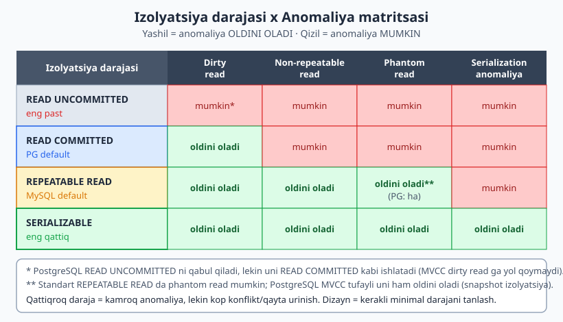
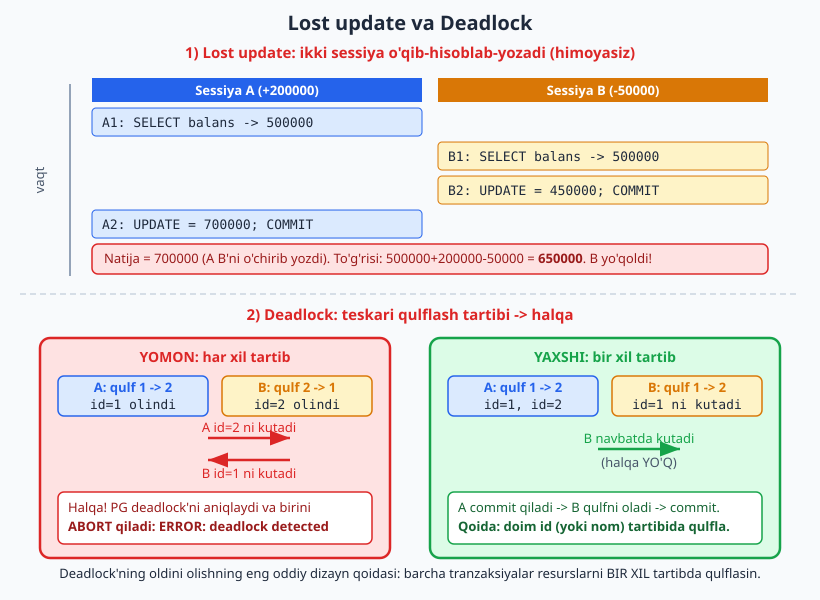
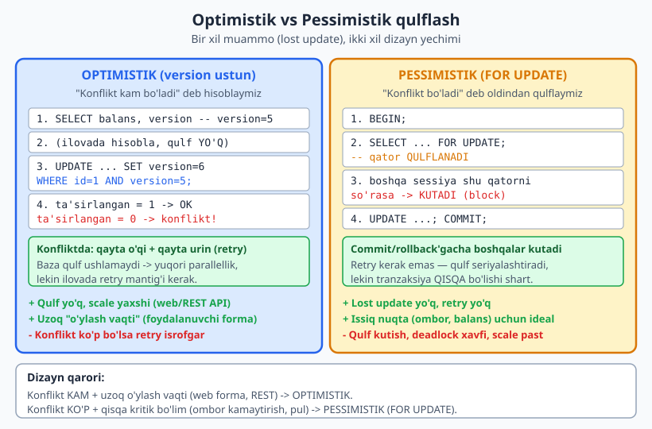

# 16 — Tranzaksiya, izolyatsiya va parallellik dizayni

[⬅️ Oldingi: 15 — Sxema va so'rov performansi (EXPLAIN ANALYZE)](./15-performans.md) · [🏠 README](./README.md) · [Keyingi: 17 — Daraxt va graf strukturalarini modellashtirish ➡️](./17-daraxt-graf.md)

> **Bu bobda:** bitta foydalanuvchi uchun "ishlaydigan" sxema ko'p foydalanuvchi bir vaqtda urilganda jimgina buziladi. Shu yashirin buzilishlarni — anomaliyalarni — dizayn nuqtai nazaridan ko'ramiz: ACID ning har bir harfi qanday qaror talab qiladi, izolyatsiya darajalari qaysi anomaliyani oldini oladi, PostgreSQL ning MVCC modeli nega qulfsiz o'qishni beradi, va eng muhimi — `lost update` ni optimistik (version ustun) yoki pessimistik (`FOR UPDATE`) qulflash bilan qaysi holatda qaysi birini tanlash kerakligini. Deadlock va idempotentlikni ham qoplaymiz. Hamma misol PostgreSQL 18.4 da ikki sessiyada haqiqatan ishga tushirilgan.

---

## 0. Bu bob qayerda turadi

[SQL kitobining 19-bobi](../sql/19-tranzaksiyalar.md) tranzaksiya **sintaksisini** o'rgatadi: `BEGIN`/`COMMIT`/`ROLLBACK`, autocommit, `FOR UPDATE` ning asosi, ACID ta'rifi. Buni qayta o'rgatmaymiz — sizga tanish deb hisoblaymiz.

Bu bob esa **dizayn** tomonidan yondashadi:

- Qaysi **izolyatsiya darajasini** tanlash — bu sxema/ilova dizayni qarori, sintaksis emas.
- `lost update` muammosini sxema darajasida qanday hal qilish (`version` ustuni qo'shamizmi? `FOR UPDATE` ishlatamizmi?).
- Qulflash tartibini qanday loyihalash — deadlock'ning oldini olish uchun.
- Idempotentlikni sxemaga qanday joylash (`idempotency_key` + `UNIQUE`).

Boshqacha aytganda: SQL kitobi "tranzaksiya qanday yoziladi" ni o'rgatdi; bu bob "tranzaksiyani qanday loyihalash kerak, toki ko'p sessiya urilganda ham ma'lumot to'g'ri qolsin" ni o'rgatadi.

---

## 1. ACID — dizayn nuqtai nazaridan

ACID — to'rt xossa: **A**tomicity, **C**onsistency, **I**solation, **D**urability. SQL kitobida ularning ta'rifini ko'rgansiz. Bu yerda har birini **dizayn qarori** sifatida ko'ramiz: baza ularni bepul bermaydi, siz to'g'ri ishlatishingiz kerak.

| Harf | Ma'no | Dizayner nimani hal qiladi |
|---|---|---|
| **A** — Atomiklik | "Yo hammasi, yo hech narsa" | Bir mantiqiy amalning qaysi qadamlari **bitta** tranzaksiyada bo'lishi kerak? (Pul yechish + yozish — bitta `BEGIN...COMMIT`.) |
| **C** — Izchillik | Tranzaksiya bazani bir to'g'ri holatdan ikkinchisiga olib o'tadi | Qaysi qoidalar `CHECK`/`FK`/`UNIQUE` bilan **bazada** majburlanadi (11-bob), qaysilari tranzaksiya mantig'ida? |
| **I** — Izolyatsiya | Parallel tranzaksiyalar bir-biriga "aralashmaydi" | Qaysi **izolyatsiya darajasi** kerak? (Bu bobning yuragi.) |
| **D** — Bardoshlilik | `COMMIT` bo'lgach, ma'lumot doimiy saqlanadi | `synchronous_commit`, replikatsiya, zaxira — operatsion qaror (22-bobga ishora). |

Bu bobda asosan **I** (izolyatsiya) ustida ishlaymiz, chunki aynan shu yerda eng ko'p dizayn xatosi bo'ladi. Atomiklik odatda intuitiv ("buyurtma + ombor — birga"); izolyatsiya esa noko'rinmas.

> **Asosiy fikr:** atomiklik bitta tranzaksiya **ichidagi** qadamlarni himoya qiladi. Izolyatsiya esa **bir vaqtda** ishlayotgan boshqa tranzaksiyalardan himoya qiladi. Ko'pchilik faqat birinchisini o'ylaydi va ikkinchisida kuyadi.

---

## 2. Anomaliyalar: parallellik nimani buzadi

Bir vaqtda ikki (yoki ko'p) tranzaksiya ishlasa, quyidagi "g'alati" hodisalar yuzaga kelishi mumkin. Bularni **anomaliya** deyiladi. SQL standarti to'rttasini nomlaydi:

- **Dirty read (iflos o'qish):** A tranzaksiya hali `COMMIT` qilmagan o'zgarishini B ko'radi. Agar A keyin `ROLLBACK` qilsa, B mavjud bo'lmagan ma'lumotga ishongan bo'ladi.
- **Non-repeatable read (takrorlanmas o'qish):** A bir qatorni ikki marta o'qiydi; orada B uni o'zgartirib `COMMIT` qiladi; A ikkinchi o'qishda boshqa qiymat ko'radi.
- **Phantom read (arvoh o'qish):** A bir shartga mos qatorlarni ikki marta sanaydi; orada B yangi qator qo'shadi; ikkinchi sanashda qatorlar soni o'zgaradi ("arvoh" qator paydo bo'ldi).
- **Serialization anomaly (seriyalash anomaliyasi):** har bir tranzaksiya alohida to'g'ri, lekin ularning **birgalikdagi** natijasi hech qanday ketma-ket (birin-ketin) bajarish bilan tushuntirilmaydi. Klassik misol — "write skew" (pastda ko'ramiz).

Har bir izolyatsiya darajasi shu anomaliyalarning bir qismini man qiladi. Daraja qanchalik qattiq — shuncha kam anomaliya, lekin shuncha ko'p konflikt/qayta urinish narxi.



### 2.1 Matritsa (SQL standarti)

| Daraja | Dirty read | Non-repeatable read | Phantom | Serialization anomaly |
|---|---|---|---|---|
| READ UNCOMMITTED | mumkin* | mumkin | mumkin | mumkin |
| READ COMMITTED | yo'q | mumkin | mumkin | mumkin |
| REPEATABLE READ | yo'q | yo'q | mumkin** | mumkin |
| SERIALIZABLE | yo'q | yo'q | yo'q | yo'q |

`*` — PostgreSQL `READ UNCOMMITTED` ni so'rasangiz qabul qiladi, lekin uni `READ COMMITTED` darajasida bajaradi. PG da MVCC tufayli dirty read **umuman bo'lmaydi**.

`**` — Standart bo'yicha `REPEATABLE READ` da phantom mumkin, **lekin PostgreSQL** MVCC snapshot izolyatsiyasi tufayli `REPEATABLE READ` da phantom'ni ham oldini oladi. Bu PG ning standartdan kuchliroq joyi.

---

## 3. PostgreSQL MVCC: qulfsiz o'qish

PostgreSQL parallellikni **MVCC** (Multi-Version Concurrency Control — ko'p versiyali boshqaruv) bilan hal qiladi. G'oya sodda, lekin kuchli:

- Har bir qator yangilanganda PG eski qatorni o'chirmaydi — **yangi versiyasini** yozadi. Eski versiya hali kerak bo'lgan tranzaksiyalar uchun turaveradi.
- Har bir tranzaksiya o'z **snapshot**'ini (suratini) ko'radi — bu boshlanganda (yoki har bayonotda) qaysi qator versiyalari "ko'rinadigan" ekanini belgilaydi.
- **O'quvchi yozuvchini, yozuvchi o'quvchini bloklamaydi.** Siz qatorni o'qiyotganingizda boshqa kishi uni o'zgartirsa — siz hali ham eski versiyani ko'rasiz, kutmaysiz.

Bu — PG ning eng muhim amaliy xossasi: hisobotingiz uzoq `SELECT` ishlatsa ham, u OLTP yozuvlarini sekinlashtirmaydi.

> **Hayotiy o'xshatish:** MVCC — gazetaning bosma nashri kabi. Siz ertalabki nashrni o'qiyapsiz; muharrir keyingi nashr uchun maqolani o'zgartirsa, sizning qo'lingizdagi gazeta o'zgarmaydi. Siz "snapshot"ni ushlab turibsiz.

### 3.1 READ COMMITTED da non-repeatable read (haqiqiy ikki sessiya)

PG da `READ COMMITTED` (default) har **bayonot** boshida yangi snapshot oladi. Demak bir tranzaksiya ichida ikki `SELECT` har xil natija berishi mumkin. Sinab ko'ramiz (sxema: `hisob(id, egasi, balans, version)`, `id=1` balans = 500000):

```sql
-- SESSIYA 1 (READ COMMITTED)
BEGIN ISOLATION LEVEL READ COMMITTED;
SELECT balans FROM hisob WHERE id = 1;   -- birinchi o'qish
-- ... shu payt Sessiya 2 quyidagini bajaradi va COMMIT qiladi ...
SELECT balans FROM hisob WHERE id = 1;   -- ikkinchi o'qish
COMMIT;
```

```sql
-- SESSIYA 2 (Sessiya 1 ning ikki o'qishi orasida)
UPDATE hisob SET balans = balans - 100000 WHERE id = 1;  -- avtomatik COMMIT
```

PG 18 da haqiqiy chiqish (Sessiya 1):

```
S1 birinchi o'qish:   500000.00
S1 ikkinchi o'qish:   400000.00      <- O'ZGARDI (non-repeatable read)
```

Bir tranzaksiya ichida bir qator ikki xil qiymat berdi. `READ COMMITTED` buni man qilmaydi. Agar mantig'ingiz "bir tranzaksiya ichida bir qiymatni qayta o'qisam — o'zgarmaydi" deb hisoblasa, bu **bug** manbai.

### 3.2 REPEATABLE READ: snapshot muzlatiladi

Endi xuddi shu ssenariy, lekin `REPEATABLE READ` bilan. Bu daraja tranzaksiya **boshida** bitta snapshot oladi va oxirigacha ushlab turadi:

```sql
-- SESSIYA 1 (REPEATABLE READ)
BEGIN ISOLATION LEVEL REPEATABLE READ;
SELECT balans FROM hisob WHERE id = 1;   -- birinchi o'qish
-- ... Sessiya 2 UPDATE + COMMIT qiladi (balans 500000 -> 400000) ...
SELECT balans FROM hisob WHERE id = 1;   -- ikkinchi o'qish
COMMIT;
SELECT balans FROM hisob WHERE id = 1;   -- COMMIT'dan keyin (yangi snapshot)
```

PG 18 da haqiqiy chiqish:

```
S1 birinchi o'qish:                          500000.00
S1 ikkinchi o'qish (S2 commit qilsa ham):    500000.00      <- O'ZGARMADI
S1 commit'dan keyin (yangi snapshot):        400000.00
```

Tranzaksiya **ichida** ikkala o'qish ham 500000 berdi — snapshot muzlatildi. Faqat tranzaksiya tugab, yangi tranzaksiya boshlangach 400000 ko'rindi. Hisobot, ko'p jadvalni izchil o'qish, eksport kabi ishlar uchun aynan shu kerak.

> **Dizayn qoidasi:** bir tranzaksiya ichida bir nechta jadvalni **izchil** (bir-biriga mos) o'qishingiz kerak bo'lsa (masalan moliyaviy hisobot) — `REPEATABLE READ` tanlang. Oddiy CRUD uchun `READ COMMITTED` (PG default) yetarli.

---

## 4. PG default = READ COMMITTED, MySQL default = REPEATABLE READ

Bu juda ko'p kishini chalg'itadigan farq:

| | PostgreSQL | MySQL (InnoDB) |
|---|---|---|
| Default izolyatsiya | **READ COMMITTED** | **REPEATABLE READ** |
| `REPEATABLE READ` da phantom | oldini oladi | gap/next-key qulf bilan oldini oladi |
| `SELECT` qulflaydimi? | yo'q (MVCC) | yo'q (snapshot o'qish) |
| Lost update'ni avtomatik? | yo'q (siz hal qilasiz) | yo'q (siz hal qilasiz) |

Amaliy oqibat: bir xil kodni MySQL'dan PG'ga ko'chirsangiz (yoki teskari), default izolyatsiya **boshqacha** bo'ladi va xatti-harakat o'zgaradi. PG'da `REPEATABLE READ` xulq-atvori kerak bo'lsa — uni **aniq** so'rashingiz kerak (`BEGIN ISOLATION LEVEL REPEATABLE READ`), MySQL'da esa default'da olasiz.

> **MySQL'da bu boshqacha:** MySQL `REPEATABLE READ` da yana bir nozik nuqta bor — `SELECT` snapshot'dan o'qiydi, lekin `UPDATE`/`SELECT ... FOR UPDATE` "eng so'nggi" qatorni ko'radi (locking read). PG'da bunday ajralish yo'q. Shu sabab MySQL'da `REPEATABLE READ` da ham lost update ehtimoli boshqacha namoyon bo'ladi.

Joriy darajani tekshirish:

```sql
SHOW default_transaction_isolation;   -- PG 18: read committed
```

---

## 5. Lost update — eng keng tarqalgan parallellik bug'i

**Lost update** (yo'qolgan yangilash) — eng ko'p uchraydigan va eng zararli muammo, chunki hech qanday xato chiqmaydi. Stsenariy: ikki sessiya bir qatorni **o'qiydi → ilovada hisoblaydi → qayta yozadi**. Ikkalasi bir vaqtda o'qisa, biri ikkinchisining yozuvini bekorga chiqaradi.



Misol: balans 500000. Sessiya A +200000 qilmoqchi, Sessiya B -50000. To'g'ri natija — 650000. Ikkalasi ham mutlaq qiymat yozadigan ("read-modify-write") kod:

```sql
-- SESSIYA A: balansni o'qib, ilovada 500000+200000=700000 hisoblab, yozadi
BEGIN;
SELECT balans FROM hisob WHERE id = 1;          -- 500000 o'qildi
-- (ilova hisoblaydi, biroz kechikadi)
UPDATE hisob SET balans = 700000 WHERE id = 1;  -- mutlaq qiymat
COMMIT;
```

```sql
-- SESSIYA B: shu payt 500000 ni o'qib, 500000-50000=450000 hisoblab, oldin yozadi
BEGIN;
SELECT balans FROM hisob WHERE id = 1;          -- 500000 o'qildi (A hali yozmagan)
UPDATE hisob SET balans = 450000 WHERE id = 1;
COMMIT;
```

PG 18 da haqiqiy yakuniy holat (B oldin, A keyin commit qildi):

```
Yakuniy balans: 700000.00       <- (kutilgan: 650000)
```

B ning -50000 amali **butunlay yo'qoldi**. Natija 700000 — A B ustiga yozdi. Hech qanday xato yo'q, log toza, lekin pul noto'g'ri. Bu `READ COMMITTED` da ham, `REPEATABLE READ` da ham (PG `REPEATABLE READ` da `UPDATE` konflikti seriyalash xatosini berardi — pastda) shunday bo'lishi mumkin agar siz hech narsa qilmasangiz.

> **Nega `UPDATE ... SET balans = balans - 50000` bu muammoni yengadi?** Chunki o'qish va yozish bitta atom amalga aylanadi va PG `UPDATE` paytida qatorni qulflab, eng so'nggi qiymatdan ayiradi. Lost update faqat **ilova xotirasida** hisoblab, mutlaq qiymat qaytarib yozganda yuzaga keladi. Birinchi himoya — iloji bo'lsa, hisobni SQL ifodasi ichida qiling. Ammo ko'p hollarda (forma tahriri, murakkab mantiq) bu yetarli emas — quyidagi ikki strategiya kerak bo'ladi.

---

## 6. Optimistik vs pessimistik qulflash — dizayn qarori

Lost update'ni hal qilishning ikki klassik dizayn yondashuvi bor. Bu **sxema darajasidagi** qaror, chunki optimistik yo'l jadvalga ustun qo'shishni talab qiladi.



### 6.1 Optimistik qulflash (version ustun)

Falsafa: "konflikt **kam** bo'ladi". Shuning uchun hech narsa qulflamaymiz. O'rniga jadvalga `version` (yoki `updated_at`) ustuni qo'shamiz. Yangilashda "men o'qigan versiya hali ham shumikan?" deb tekshiramiz. Agar boshqa kishi orada o'zgartirgan bo'lsa — `WHERE version = N` **0 qatorga** mos keladi va biz konfliktni aniqlaymiz.

```sql
CREATE TABLE hisob (
    id      int PRIMARY KEY,
    egasi   text NOT NULL,
    balans  numeric(12,2) NOT NULL,
    version int NOT NULL DEFAULT 1          -- optimistik qulf uchun
);
```

```sql
-- 1) o'qish: version'ni ham olamiz
SELECT balans, version FROM hisob WHERE id = 1;   -- balans=500000, version=1

-- 2) ilovada yangi qiymat hisoblanadi (qulf YO'Q)

-- 3) yozish: faqat version o'sha bo'lsa
UPDATE hisob
   SET balans = 700000, version = version + 1
 WHERE id = 1 AND version = 1;
-- ta'sirlangan qator: 1 bo'lsa -> muvaffaqiyat
--                      0 bo'lsa -> KONFLIKT (boshqa kishi tegdi) -> qayta o'qib, qayta urin
```

Buni ikki sessiyada PG 18 da sinab ko'rdik. Ikkala sessiya ham `version = 1` ni o'qidi. Sessiya B oldinroq commit qildi (`version` 1→2 bo'ldi). Keyin Sessiya A ning `WHERE id = 1 AND version = 1` so'rovi endi mos kelmadi:

```
-- Sessiya A ning UPDATE'i:
UPDATE 0                          <- 0 qator! konflikt aniqlandi

-- Yakuniy holat:
 balans   | version
----------+--------
 450000.00|      2                <- Sessiya B ning yozuvi saqlanib qoldi, A bekor
```

`UPDATE 0` — bu sizning ilovangizga "qaytadan o'qi va urinib ko'r" degan signal. Lost update bo'lmadi: A ko'r-ko'rona ustiga yozmadi, balki konfliktni payqab to'xtadi.

Optimistik qulf **web/REST** ilovalari uchun ideal: foydalanuvchi formani ochib, 5 daqiqa o'ylab, "Saqlash" bossa — siz bu 5 daqiqa qatorni qulflab turolmaysiz. Buning o'rniga formada `version` ni yashirib yuborasiz va saqlashda tekshirasiz.

### 6.2 Pessimistik qulflash (SELECT ... FOR UPDATE)

Falsafa: "konflikt **bo'ladi**, oldindan qulflaymiz". `SELECT ... FOR UPDATE` qatorni o'qish bilan birga **qulflaydi**. Boshqa sessiya shu qatorni `FOR UPDATE` qilsa yoki yangilamoqchi bo'lsa — siz `COMMIT`/`ROLLBACK` qilguningizcha **kutadi**.

```sql
-- SESSIYA A
BEGIN;
SELECT balans FROM hisob WHERE id = 1 FOR UPDATE;   -- qator QULFLANDI, balans=500000
-- (ilova hisoblaydi)
UPDATE hisob SET balans = balans + 200000 WHERE id = 1;
COMMIT;   -- qulf bo'shaydi
```

```sql
-- SESSIYA B (A ning qulfi turgan paytda)
BEGIN;
SELECT balans FROM hisob WHERE id = 1 FOR UPDATE;   -- A COMMIT qilguncha KUTADI (block)
-- A commit qilgach, eng so'nggi qiymatni (700000) ko'radi
UPDATE hisob SET balans = balans - 50000 WHERE id = 1;
COMMIT;
```

PG 18 da `\timing` bilan o'lchaganda Sessiya B ning `SELECT FOR UPDATE` aynan A kutgan vaqtga bloklandi:

```
S2 SELECT FOR UPDATE bloklangan vaqt:  1015 ms     <- A ni kutdi
S2 ko'rgan qiymat:                     700000.00    <- A ning yangi qiymati
Yakuniy balans:                        650000.00    <- TO'G'RI (500000+200000-50000)
```

Lost update **bo'lmadi**, retry **kerak emas** — qulf ikki tranzaksiyani avtomatik birin-ketin qildi. Narxi: B kutdi (parallellik kamaydi) va deadlock xavfi paydo bo'ldi (keyingi bo'lim).

Pessimistik qulf **issiq nuqta** (ko'p sessiya bir qatorga uriladigan joy: ombor zaxirasi, hisob balansi, navbat) uchun yaxshi — u yerda konflikt deyarli kafolatlangan, retry esa isrofgar bo'lardi.

### 6.3 Qaysi birini tanlash

| Mezon | Optimistik (version) | Pessimistik (FOR UPDATE) |
|---|---|---|
| Konflikt ehtimoli | past | yuqori |
| "O'ylash vaqti" (foydalanuvchi forma to'ldiradi) | uzoq bo'lishi mumkin | qisqa bo'lishi shart |
| Qulf ushlaydimi? | yo'q | ha (boshqalar kutadi) |
| Retry kerakmi? | ha (ilovada) | yo'q |
| Scale (ko'p sessiya) | yaxshi | cheklangan |
| Deadlock xavfi | yo'q | bor |
| Sxema o'zgarishi | `version` ustuni kerak | kerak emas |

Qo'pol qoida: **stateless web/API + uzoq o'ylash vaqti → optimistik. Qisqa kritik bo'lim + tez-tez to'qnashuv (pul, ombor) → pessimistik.**

> **`FOR UPDATE` variantlari (PG):** `FOR UPDATE NOWAIT` — kutish o'rniga darhol xato beradi ("band bo'lsa, keyinroq urin"). `FOR UPDATE SKIP LOCKED` — qulflangan qatorlarni **o'tkazib yuboradi**; bu navbat (queue) dizayni uchun oltin naqsh: bir nechta ishchi (worker) bir jadvaldan vazifa olganda, har biri "bo'sh" qatorni oladi, bir-birini kutmaydi.

```sql
-- Navbatdan keyingi bo'sh vazifani ol (boshqa worker olganini o'tkazib yubor)
SELECT id FROM hisob ORDER BY id FOR UPDATE SKIP LOCKED LIMIT 1;
```

---

## 7. SERIALIZABLE: eng qattiq daraja va write skew

`SERIALIZABLE` — PG ning eng qattiq darajasi. U barcha tranzaksiyalar go'yo **birin-ketin** (bir vaqtda emas) bajarilgandek natija berishini kafolatlaydi. Buni **SSI** (Serializable Snapshot Isolation) mexanizmi bilan amalga oshiradi: tranzaksiyalar orasida xavfli "o'qish/yozish bog'liqligi" topilsa, birini **bekor** qiladi.

Klassik misol — **write skew**. Ikkita shifokor navbatchi; qoida: **kamida bittasi navbatda qolishi** kerak. Ikkalasi bir vaqtda "yana bitta navbatchi bormi?" deb tekshiradi, ikkalasi ham "ha, yana bittasi bor" deb ko'radi va ikkalasi o'zini olib tashlaydi → **hech kim qolmaydi**.

```sql
CREATE TABLE navbatchi (
    ism      text PRIMARY KEY,
    navbatda boolean NOT NULL
);
INSERT INTO navbatchi VALUES ('Aziz', true), ('Bobur', true);
```

```sql
-- SESSIYA 1 (SERIALIZABLE)
BEGIN ISOLATION LEVEL SERIALIZABLE;
SELECT count(*) FROM navbatchi WHERE navbatda;     -- 2 ko'rdi
UPDATE navbatchi SET navbatda = false WHERE ism = 'Aziz';
COMMIT;
```

```sql
-- SESSIYA 2 (SERIALIZABLE) — parallel
BEGIN ISOLATION LEVEL SERIALIZABLE;
SELECT count(*) FROM navbatchi WHERE navbatda;     -- 2 ko'rdi (S1 hali commit qilmagan)
UPDATE navbatchi SET navbatda = false WHERE ism = 'Bobur';
COMMIT;
```

PG 18 da haqiqiy natija — Sessiya 2 commit qildi, Sessiya 1 esa rad etildi:

```
-- Sessiya 1 COMMIT urinishida:
ERROR:  could not serialize access due to read/write dependencies among transactions
DETAIL:  Reason code: Canceled on identification as a pivot, during write.
HINT:  The transaction might succeed if retried.

-- Yakuniy holat:
 ism   | navbatda
-------+----------
 Aziz  | t            <- Aziz hali navbatda (qoida BUZILMADI)
 Bobur | f
```

`SERIALIZABLE` write skew'ni payqadi va birini bekor qildi. **Invariant** ("kamida bitta navbatchi") saqlanib qoldi — `CHECK` constraint bilan ifodalab bo'lmaydigan (chunki u bir nechta qatorga taalluqli) qoidani baza o'zi himoya qildi.

Diqqat — `HINT: might succeed if retried`. `SERIALIZABLE` ishlatganda ilovangiz **`40001` (serialization_failure) xatosini ushlab, tranzaksiyani qaytadan ishga tushirishga** tayyor bo'lishi shart. Bu darajaning narxi: qayta urinish mantig'i.

> **Dizayn maslahati:** `SERIALIZABLE` ni butun ilovaga yoqmang. Uni faqat bir nechta qatorga taalluqli murakkab invariantlar (write skew xavfi bor joylar) uchun nuqtaviy ishlating. Oddiy lost update uchun optimistik version yoki `FOR UPDATE` arzonroq va aniqroq.

---

## 8. Deadlock — qanday yuzaga keladi va oldini olish

**Deadlock** (o'lik tugun) — ikki tranzaksiya bir-birining qulfini kutib, hech qaysi biri davom etolmaydigan halqa hosil bo'lganda. PG buni avtomatik **aniqlaydi** va birini "qurbon" qilib bekor qiladi — lekin bu sizning ilovangiz uchun xato; uni oldindan dizayn bilan oldini olish kerak.

Eng keng tarqalgan sabab — **har xil qulflash tartibi**:

```sql
-- SESSIYA A: avval id=1, keyin id=2
BEGIN;
UPDATE hisob SET balans = balans - 100 WHERE id = 1;   -- id=1 qulflandi
UPDATE hisob SET balans = balans + 100 WHERE id = 2;   -- id=2 ni kutadi (B ushlab turibdi)
```

```sql
-- SESSIYA B: avval id=2, keyin id=1 (TESKARI tartib!)
BEGIN;
UPDATE hisob SET balans = balans - 100 WHERE id = 2;   -- id=2 qulflandi
UPDATE hisob SET balans = balans + 100 WHERE id = 1;   -- id=1 ni kutadi (A ushlab turibdi)
```

A id=2 ni kutadi (B'da), B id=1 ni kutadi (A'da) → halqa. PG 18 da haqiqiy chiqish:

```
ERROR:  deadlock detected
DETAIL:  Process 14392 waits for ShareLock on transaction 1426; blocked by process 13604.
         Process 13604 waits for ShareLock on transaction 1425; blocked by process 14392.
HINT:  See server log for query details.
CONTEXT:  while updating tuple (0,20) in relation "hisob"
```

PG halqani topib, bir tranzaksiyani **abort** qildi (qurbon), ikkinchisi davom etdi.

### 8.1 Oldini olish: doim bir xil tartibda qulfla

Yechim dizaynda: **barcha tranzaksiyalar resurslarni bir xil tartibda qulflasin** (masalan, har doim kichik `id`'dan kattaga). Shunda halqa hosil bo'lolmaydi — kutish faqat bir yo'nalishda bo'ladi.

```sql
-- HAR IKKALA sessiya ham: avval id=1, keyin id=2 (BIR XIL tartib)
BEGIN;
UPDATE hisob SET balans = ... WHERE id = 1;   -- avval kichik id
UPDATE hisob SET balans = ... WHERE id = 2;   -- keyin katta id
COMMIT;
```

PG 18 da buni sinab ko'rdik: ikkala sessiya ham `1 → 2` tartibida qulfladi. Deadlock **bo'lmadi** — ikkinchi sessiya birinchisini navbatda kutdi, so'ng commit qildi. Ikkalasi ham muvaffaqiyatli yakunlandi.

Deadlock'ni kamaytirishning boshqa dizayn usullari:

- **Tranzaksiyani qisqa tut** — qulflarni iloji boricha kech ol, tez bo'shat. Tranzaksiya ichida tashqi API chaqirmang, foydalanuvchi javobini kutmang.
- **Bir qatorda bir necha amal bo'lsa**, ularni bitta `UPDATE` ga birlashtir.
- Pessimistik qulf o'rniga (iloji bo'lsa) optimistik version'dan foydalan — u qulf ushlamaydi, demak deadlock'ga yo'l bermaydi.
- **Advisory lock** — biznes mantiqi uchun maxsus qulf (`pg_advisory_xact_lock(kalit)`), masalan "bu foydalanuvchi uchun bir vaqtda faqat bitta hisob-kitob ishlasin".

---

## 9. Idempotentlik — takroriy so'rov xavfsizligi

Tarmoq ishonchsiz: mijoz "to'lov" so'rovini yuboradi, javob yo'qoladi, mijoz **qayta yuboradi**. Agar sxemangiz buni hisobga olmasa — ikki marta pul yechiladi. **Idempotent** dizayn — bir amalni necha marta yuborilsa ham, natija bir martagidek bo'lishini kafolatlaydi.

Eng oddiy va ishonchli usul — **idempotency kaliti** + `UNIQUE` constraint. Mijoz har bir mantiqiy amal uchun bir martalik kalit (UUID) yaratadi va uni har takror yuborishda **bir xil** yuboradi:

```sql
CREATE TABLE tolov (
    id              bigint GENERATED ALWAYS AS IDENTITY PRIMARY KEY,
    idempotency_key uuid NOT NULL UNIQUE,         -- bir martalik kalit
    summa           numeric(12,2) NOT NULL,
    yaratilgan      timestamptz NOT NULL DEFAULT now()
);

-- Mijoz xato bilan AYNI so'rovni 3 marta yubordi (bir xil kalit):
INSERT INTO tolov (idempotency_key, summa)
VALUES ('11111111-1111-1111-1111-111111111111', 100)
ON CONFLICT (idempotency_key) DO NOTHING;
-- ... yana 2 marta xuddi shu INSERT ...
```

PG 18 da haqiqiy natija:

```
INSERT 0 1        <- birinchi: yozildi
INSERT 0 0        <- ikkinchi: o'tkazib yuborildi (UNIQUE konflikt)
INSERT 0 0        <- uchinchi: o'tkazib yuborildi

jami_qator: 1     <- 3 marta yuborilsa ham faqat 1 ta yozuv
```

`UNIQUE` constraint + `ON CONFLICT DO NOTHING` takroriy so'rovni jimgina, atomik tarzda yutadi. Natija — pul faqat bir marta yechildi. Bu idempotentlikni **bazada** majburlash (11-bobning "baza — oxirgi qal'a" falsafasi): ilova logikasi xato qilsa ham, `UNIQUE` himoya qiladi.

> **Dizayn naqshlari:** (1) idempotency kalitini mijoz **yaratsin** (server emas), shunda retry'da bir xil bo'ladi; (2) kalitni eskirtirish uchun `yaratilgan` vaqt + davriy tozalash; (3) javobni ham saqlash kerak bo'lsa — `DO NOTHING` o'rniga `DO UPDATE` bilan oldingi natijani qaytarish yoki alohida `javob` ustuni. Pul/buyurtma kabi kritik amallarda idempotentlik — majburiy, ixtiyoriy emas.

---

## 10. Bir varaqlik dizayn xulosasi

| Muammo | Belgi | Dizayn yechimi |
|---|---|---|
| Non-repeatable / phantom read | bir tranzaksiyada o'qish o'zgaradi | `REPEATABLE READ` (izchil hisobot) |
| Lost update (kam konflikt, uzoq forma) | yangilash jimgina yo'qoladi | optimistik: `version` ustun + `WHERE version=N` |
| Lost update (issiq nuqta, pul/ombor) | bir qatorga ko'p uriladi | pessimistik: `SELECT ... FOR UPDATE` |
| Murakkab invariant (write skew) | bir nechta qatorga oid qoida buziladi | `SERIALIZABLE` + retry mantig'i |
| Deadlock | `ERROR: deadlock detected` | barcha tranzaksiyalarda bir xil qulflash tartibi |
| Takroriy so'rov | ikki marta pul/buyurtma | `idempotency_key` + `UNIQUE` + `ON CONFLICT` |
| Navbatni parallel qayta ishlash | worker'lar bir-birini kutadi | `FOR UPDATE SKIP LOCKED` |

**Oltin qoida:** avval eng arzon (past) izolyatsiya darajasini va eng yengil himoyani tanlang; muammo isbotlanganda (o'lchab) qattiqroq darajaga yoki kuchliroq qulfga ko'taring. Qulf va qattiq izolyatsiya — narxli; ularni faqat kerakli joyga, nuqtaviy qo'llang.

---

## Mashqlar

### Oson

1. **Izolyatsiya darajasini tanla (A).** Oylik moliyaviy hisobot bir nechta jadvaldan (`buyurtma`, `tolov`, `qaytarish`) jami summalarni o'qiydi va hammasi **bir vaqt kesimiga** mos bo'lishi kerak. Qaysi izolyatsiya darajasini tanlaysiz va nega?

2. **Default farqi.** Bir jamoa ilovani MySQL'dan PostgreSQL'ga ko'chirdi va "endi ba'zi joyda o'qishlar tranzaksiya ichida o'zgaryapti" deb shikoyat qilmoqda. Nima sodir bo'ldi va eng kichik o'zgarish bilan qanday tuzatasiz?

3. **Anomaliyani nomla.** Tranzaksiya `SELECT count(*) FROM buyurtma WHERE holat='yangi'` ni ikki marta chaqirdi va orada boshqa sessiya yangi buyurtma qo'shgani uchun son o'zgardi. Bu qaysi anomaliya, va qaysi izolyatsiya darajasidan boshlab PG uni oldini oladi?

4. **MVCC tushunchasi.** "PostgreSQL'da uzoq `SELECT` (hisobot) ishlasa, u `INSERT`/`UPDATE` larni bloklaydi" degan da'vo to'g'rimi? Javobingizni MVCC bilan asoslang.

### O'rta

5. **Lost update'ni optimistik bilan yech.** Quyidagi jadvalga optimistik qulflashni qo'shing va "balansni +X qilish" amalining to'liq oqimini (o'qish → yangilash → konflikt tekshiruvi) yozing:
   ```sql
   CREATE TABLE hamyon (id int PRIMARY KEY, balans numeric(12,2) NOT NULL);
   ```

6. **Lost update'ni pessimistik bilan yech.** Xuddi 5-masaladagi `hamyon` uchun, lekin bu safar `SELECT ... FOR UPDATE` bilan. Ikki sessiyaning kutish (block) xatti-harakatini tushuntiring.

7. **Deadlock'ni oldini ol.** Quyidagi "pul o'tkazish" funksiyasi ba'zan deadlock beradi. Sababini toping va sxema/kod o'zgarishisiz (faqat qulflash tartibi bilan) tuzating:
   ```sql
   -- A->B o'tkazma: avval jo'natuvchini, keyin qabul qiluvchini yangilaydi
   UPDATE hisob SET balans = balans - 100 WHERE id = :from_id;
   UPDATE hisob SET balans = balans + 100 WHERE id = :to_id;
   ```

8. **Idempotent dizayn.** "Buyurtma yaratish" endpoint'i tarmoq xatosida ikki marta chaqirilishi mumkin. `buyurtma` jadvalini idempotent qiladigan tarzda loyihalang (qaysi ustun, qaysi constraint, qaysi `INSERT` shakli).

9. **Qulf turini tanla.** Quyidagi har bir holatga optimistik yoki pessimistik qulflashni tanlang va bir jumlada asoslang: (a) blog postini tahrirlash sahifasi; (b) konsert chiptasi sotib olish (cheklangan o'rin); (c) ombordan mahsulot kamaytirish; (d) foydalanuvchi profili rasmini yangilash.

### Qiyin

10. **Write skew'ni modelle.** Bank qoidasi: mijozning ikki hisobi (joriy + jamg'arma) **jami** balansi manfiy bo'lmasligi kerak (har biri alohida manfiy bo'lsa ham mayli, jami >= 0 bo'lsa). Ikki sessiya parallel ravishda har biridan pul yechib, jami balansni manfiy qilib yuborishi mumkin bo'lgan ssenariyni yozing. Bu qaysi izolyatsiya darajasida oldini olinadi? `CHECK` constraint nega yetarli emas?

11. **Optimistik + retry dizayni.** Optimistik qulflashda `UPDATE 0` (konflikt) bo'lganda ilova qayta urinishi kerak. Cheksiz qayta urinish xavfli. Mustahkam retry strategiyasini loyihalang: necha marta, qancha kutish (backoff), qachon to'xtab foydalanuvchiga xato qaytarish. Buni ombor kamaytirish misolida tasvirlang.

12. **Navbat (queue) dizayni.** Ko'p worker bir `vazifa` jadvalidan vazifa olib bajaradi. Ikki worker bir vazifani **olmasligi** va biri bandini ikkinchisi **kutmasligi** kerak. Jadval sxemasini (holat ustuni bilan) va vazifa olish so'rovini loyihalang. Worker bajarish o'rtasida qulab tushsa, vazifa qanday "qaytadan olinadigan" bo'ladi?

13. **Izolyatsiya darajasini aralashtirish.** Bir ilovada ham OLTP yozuvlari (tez, `READ COMMITTED`), ham uzoq analitik hisobotlar bor. Hisobot tranzaksiyalari yozuvlarni sekinlashtirmasligi va o'zlari izchil snapshot ko'rishi uchun qanday dizayn qaror qabul qilasiz? PG'ning qaysi xossasi buni mumkin qiladi?

---

## Yechimlar

<details markdown="1">
<summary>Yechim — 1</summary>

`REPEATABLE READ` tanlanadi. Hisobot bir nechta jadvalni o'qiydi va ularning hammasi **bitta vaqt kesimiga** (bitta snapshot'ga) mos kelishi kerak. `READ COMMITTED` da har bayonot yangi snapshot oladi — `buyurtma` ni o'qiganingizdan keyin `tolov` ni o'qigunicha kimdir yangi to'lov qo'shsa, jamlaringiz bir-biriga mos kelmaydi (buyurtmada yo'q to'lov, yoki teskari).

```sql
BEGIN ISOLATION LEVEL REPEATABLE READ;
SELECT sum(summa) FROM buyurtma WHERE sana >= '2026-06-01';
SELECT sum(summa) FROM tolov    WHERE sana >= '2026-06-01';
SELECT sum(summa) FROM qaytarish WHERE sana >= '2026-06-01';
COMMIT;
```

Uchala `SELECT` ham bir xil muzlatilgan snapshot'dan o'qiydi. `SERIALIZABLE` ham bo'lardi, lekin faqat o'qiyotgan hisobot uchun u ortiqcha (va serialization xatosi/retry narxini qo'shadi). MVCC tufayli bu hisobot yozuvlarni bloklamaydi.

</details>

<details markdown="1">
<summary>Yechim — 2</summary>

MySQL'ning default izolyatsiya darajasi `REPEATABLE READ`, PostgreSQL'niki esa `READ COMMITTED`. MySQL'da kod tranzaksiya **boshida** olingan muzlatilgan snapshot'ga tayanardi — bir tranzaksiya ichida qayta o'qish bir xil qiymat berardi. PG'ga ko'chgach default `READ COMMITTED` bo'lib qoldi, bu yerda har bayonot yangi snapshot oladi, shuning uchun tranzaksiya ichidagi takroriy o'qish o'zgarishi mumkin (non-repeatable read).

Eng kichik tuzatish — shu xulq-atvorga tayanadigan tranzaksiyalarni aniq `REPEATABLE READ` da ishga tushirish:

```sql
BEGIN ISOLATION LEVEL REPEATABLE READ;
-- ...
COMMIT;
```

Yoki seans/ulanish darajasida: `SET SESSION CHARACTERISTICS AS TRANSACTION ISOLATION LEVEL REPEATABLE READ;` (lekin butun ulanishga ta'sir qilishini hisobga oling). Eng to'g'ri uzoq muddatli yechim — kodni izolyatsiya darajasiga **bog'liq bo'lmaydigan** qilib qayta yozish (masalan lost update'ni version yoki `FOR UPDATE` bilan aniq hal qilish), default'ga ishonmaslik.

</details>

<details markdown="1">
<summary>Yechim — 3</summary>

Bu **phantom read** (arvoh o'qish): bir shartga (`holat='yangi'`) mos qatorlar to'plami ikki o'qish orasida o'zgardi, chunki yangi qator qo'shildi.

Standart SQL bo'yicha phantom faqat `SERIALIZABLE` da oldini olinadi. **Lekin PostgreSQL** uni allaqachon `REPEATABLE READ` darajasida oldini oladi — chunki PG `REPEATABLE READ` snapshot izolyatsiyasi tranzaksiya boshidagi suratni ushlab turadi, demak tranzaksiya davomida qo'shilgan yangi qatorlar ko'rinmaydi. Demak PG'da `REPEATABLE READ` dan boshlab phantom yo'q (MySQL'da next-key lock bilan, standartdan farqli).

</details>

<details markdown="1">
<summary>Yechim — 4</summary>

Da'vo **noto'g'ri**. PostgreSQL MVCC (ko'p versiyali boshqaruv) ishlatadi: har bir yangilanish qatorning yangi versiyasini yozadi, eski versiya o'qiyotgan tranzaksiyalar uchun saqlanadi. O'quvchi (hisobot) o'z snapshot'ini ko'radi; yozuvchi (`INSERT`/`UPDATE`) yangi versiya yozadi. Ikkisi bir-birini **bloklamaydi** — "o'quvchi yozuvchini, yozuvchi o'quvchini bloklamaydi".

Yagona ehtiyot: juda uzoq hisobot tranzaksiyasi eski qator versiyalarini `VACUUM` tozalashiga to'sqinlik qilishi mumkin (jadval shishadi — "bloat"). Demak hisobot yozuvni sekinlashtirmaydi, lekin uni cheksiz uzoq ochiq tutmaslik kerak.

</details>

<details markdown="1">
<summary>Yechim — 5</summary>

`version` ustuni qo'shamiz va yangilashda uni tekshiramiz:

```sql
ALTER TABLE hamyon ADD COLUMN version int NOT NULL DEFAULT 1;
```

Amal oqimi ("balansni +X"):

```sql
-- 1) o'qish
SELECT balans, version FROM hamyon WHERE id = :id;   -- masalan balans=5000, version=7

-- 2) ilovada yangi balans = 5000 + X hisoblanadi

-- 3) shartli yozish
UPDATE hamyon
   SET balans = :yangi_balans, version = version + 1
 WHERE id = :id AND version = 7;
```

Ilovada `UPDATE` ta'sirlangan qator sonini tekshiradi:
- `1` → muvaffaqiyat.
- `0` → boshqa kishi orada o'zgartirdi (`version` endi 7 emas). Qadam 1'dan qaytadan o'qib, qayta hisoblab, qayta urinadi.

PG 18 da tasdiqlandi: ikki parallel sessiya `version=1` ni o'qisa, biri commit qilgach ikkinchisining `WHERE ... AND version=1` so'rovi `UPDATE 0` qaytaradi — konflikt aniqlanadi, lost update bo'lmaydi.

</details>

<details markdown="1">
<summary>Yechim — 6</summary>

`version` ustuni shart emas; qatorni `FOR UPDATE` bilan qulflaymiz:

```sql
BEGIN;
SELECT balans FROM hamyon WHERE id = :id FOR UPDATE;   -- qator qulflandi
-- ilovada yangi balans hisoblanadi
UPDATE hamyon SET balans = :yangi_balans WHERE id = :id;
COMMIT;   -- qulf bo'shaydi
```

Ikki sessiya xatti-harakati: Sessiya B ham `SELECT ... FOR UPDATE` qilsa, A `COMMIT`/`ROLLBACK` qilguncha **kutadi** (bloklanadi). A tugagach B qulfni oladi va **eng so'nggi** (A yozgan) balansni ko'radi — eski 5000 ni emas. Shuning uchun B ning hisobi A ning natijasi ustiga to'g'ri qo'shiladi, lost update bo'lmaydi. PG 18 da o'lchaganda kutuvchi sessiyaning `FOR UPDATE` si aynan birinchisi commit qilgunicha bloklangani (~1 soniya) ko'rindi va yakuniy balans to'g'ri chiqdi (650000, lost emas).

Eng yaxshisi — `FOR UPDATE` dan keyin `UPDATE ... SET balans = balans + :X` qilish (atomik), shunda ilovada qiymat hisoblash zarurati ham yo'qoladi.

</details>

<details markdown="1">
<summary>Yechim — 7</summary>

Sabab — **har xil qulflash tartibi**. Bir o'tkazma A→B bo'lsa `from_id < to_id` tartibida, parallel boshqa o'tkazma B→A bo'lsa teskari tartibda qulflaydi; halqa hosil bo'lib deadlock yuzaga keladi.

Tuzatish — har doim qatorlarni **bir xil tartibda** (masalan kichik `id`'dan kattaga) qulflash, o'tkazma yo'nalishidan qat'i nazar:

```sql
-- Avval ikkala id ni tartiblab qulflaymiz (yo'nalishdan qat'i nazar)
SELECT id FROM hisob
 WHERE id IN (:from_id, :to_id)
 ORDER BY id
 FOR UPDATE;

-- Endi xavfsiz yangilaymiz
UPDATE hisob SET balans = balans - 100 WHERE id = :from_id;
UPDATE hisob SET balans = balans + 100 WHERE id = :to_id;
```

`ORDER BY id ... FOR UPDATE` barcha tranzaksiyalarni bir xil tartibda qulflashga majbur qiladi — halqa hosil bo'lolmaydi. PG 18 da bir xil tartib (1→2) bilan ikki parallel sessiya deadlock'siz yakunlandi (biri ikkinchisini navbatda kutdi).

</details>

<details markdown="1">
<summary>Yechim — 8</summary>

Mijoz yaratadigan `idempotency_key` ustuni + `UNIQUE` constraint + `ON CONFLICT`:

```sql
CREATE TABLE buyurtma (
    id              bigint GENERATED ALWAYS AS IDENTITY PRIMARY KEY,
    idempotency_key uuid NOT NULL UNIQUE,
    mijoz_id        bigint NOT NULL,
    summa           numeric(12,2) NOT NULL,
    yaratilgan      timestamptz NOT NULL DEFAULT now()
);

INSERT INTO buyurtma (idempotency_key, mijoz_id, summa)
VALUES (:kalit, :mijoz, :summa)
ON CONFLICT (idempotency_key) DO NOTHING
RETURNING id;
```

- Mijoz har bir mantiqiy buyurtma uchun bir martalik UUID yaratadi va **retry'da bir xil** kalitni yuboradi.
- Birinchi `INSERT` qatorni yozadi va `id` qaytaradi. Takroriy `INSERT` (bir xil kalit) `UNIQUE` ga uriladi, `DO NOTHING` tufayli jimgina o'tkaziladi va `RETURNING` bo'sh qaytaradi.
- Ilova bo'sh `RETURNING` ni "bu allaqachon yaratilgan" deb tushunadi (kerak bo'lsa mavjud buyurtmani `idempotency_key` bo'yicha o'qib qaytaradi).

PG 18 da tasdiqlandi: bir xil kalit bilan 3 ta `INSERT` → `INSERT 0 1`, `INSERT 0 0`, `INSERT 0 0`; jadvalda atigi 1 qator.

</details>

<details markdown="1">
<summary>Yechim — 9</summary>

- **(a) Blog post tahrirlash** → **optimistik**. Foydalanuvchi formani uzoq ochiq tutishi mumkin; qatorni shuncha vaqt qulflab bo'lmaydi. Konflikt kam (kamdan-kam ikki kishi bir postni bir vaqtda tahrirlaydi). `version` mos kelmasa "boshqa kishi o'zgartirdi, qaytadan yuklang" deyiladi.
- **(b) Konsert chiptasi (cheklangan o'rin)** → **pessimistik** (`SELECT ... FOR UPDATE`). Konflikt deyarli kafolatlangan (ko'p kishi bir o'rinni xohlaydi); o'rinni qulflab, atomik band qilish kerak. `SKIP LOCKED` bilan "keyingi bo'sh o'rin" naqshi ham mos.
- **(c) Ombordan kamaytirish** → **pessimistik** yoki atomik `UPDATE ... SET qoldiq = qoldiq - :n WHERE qoldiq >= :n`. Issiq nuqta, konflikt ko'p, retry isrofgar.
- **(d) Profil rasmini yangilash** → **optimistik** (yoki umuman himoyasiz). Konflikt deyarli yo'q (faqat egasi o'zgartiradi), oxirgi yozuv g'olib bo'lsa ham zarari yo'q.

</details>

<details markdown="1">
<summary>Yechim — 10</summary>

Ssenariy (joriy=100, jamg'arma=100, jami=200; har biri 150 yechmoqchi):

```sql
-- SESSIYA 1
BEGIN ISOLATION LEVEL SERIALIZABLE;
SELECT sum(balans) FROM hisob WHERE mijoz_id = 7;   -- 200 ko'rdi, 150 yechsa jami 50 >= 0, OK
UPDATE hisob SET balans = balans - 150 WHERE id = :joriy;
COMMIT;
```
```sql
-- SESSIYA 2 (parallel)
BEGIN ISOLATION LEVEL SERIALIZABLE;
SELECT sum(balans) FROM hisob WHERE mijoz_id = 7;   -- 200 ko'rdi (S1 hali commit qilmagan), OK deb hisoblaydi
UPDATE hisob SET balans = balans - 150 WHERE id = :jamgarma;
COMMIT;
```

Ikkalasi 200 ni ko'rib, har biri boshqa hisobdan 150 yechadi → jami 200 - 300 = **-100** (qoida buzildi). Bu **write skew** — har bir tranzaksiya alohida to'g'ri, lekin birgalikda invariant buziladi.

`CHECK` constraint nega yetarli emas? Chunki qoida bir **qatorga** emas, mijozning **bir nechta qatori yig'indisiga** taalluqli. `CHECK (balans >= 0)` har qatorni alohida tekshiradi, ammo "ikki qator yig'indisi >= 0" ni ifodalay olmaydi (qatorlararo agregat shartni `CHECK` qo'llab-quvvatlamaydi).

Yechim — `SERIALIZABLE`: PG SSI orqali ikki tranzaksiyaning o'qish/yozish bog'liqligini payqaydi va birini `40001` xatosi bilan bekor qiladi (ilova qayta urinadi, qayta o'qiganda jami 50 ni ko'rib ikkinchi yechishni rad etadi). Muqobil — yechishdan oldin mijozning **barcha** hisoblarini `SELECT ... FOR UPDATE` bilan qulflab, yig'indini tekshirish (pessimistik).

</details>

<details markdown="1">
<summary>Yechim — 11</summary>

Mustahkam retry strategiyasi (ombor kamaytirish, optimistik `version`):

1. **Cheklangan urinishlar:** maksimal 3-5 marta. Undan oshsa to'xtab, foydalanuvchiga "Hozir band, keyinroq urinib ko'ring" xatosi qaytariladi (cheksiz sikl serverni cho'ktiradi).
2. **Eksponensial backoff + jitter:** har urinish orasida kutish vaqtini oshirish (masalan 50ms, 100ms, 200ms) va ustiga tasodifiy "jitter" qo'shish — shunda parallel klientlar bir vaqtda qayta urilib "podaviy" to'qnashuv (thundering herd) yaratmaydi.
3. **Har urinishda qaytadan o'qish:** `UPDATE 0` bo'lsa, eski o'qilgan qiymatni emas, **yangi** `balans`/`version`/`qoldiq` ni o'qib, biznes shartini qayta tekshirish (masalan "qoldiq hali ham yetarlimi?"). Yetarli bo'lmasa retry'ni to'xtatib "tovar tugadi" qaytarish.
4. **Idempotentlik bilan birga:** agar amal pul kabi kritik bo'lsa, retry takroriy yozuvga olib kelmasligi uchun `idempotency_key` bilan birga ishlatish.

Skelet (psevdokod):

```
for urinish in 1..5:
    (qoldiq, version) = SELECT qoldiq, version FROM mahsulot WHERE id=:id
    if qoldiq < :kerak: return "tovar tugadi"
    n = UPDATE mahsulot SET qoldiq = qoldiq - :kerak, version = version+1
        WHERE id=:id AND version=:version
    if n == 1: return "muvaffaqiyat"
    sleep(backoff(urinish) + jitter())   # konflikt -> kut va qayta urin
return "hozir band, keyinroq urinib ko'ring"
```

</details>

<details markdown="1">
<summary>Yechim — 12</summary>

`FOR UPDATE SKIP LOCKED` ga asoslangan navbat:

```sql
CREATE TABLE vazifa (
    id          bigint GENERATED ALWAYS AS IDENTITY PRIMARY KEY,
    holat       text NOT NULL DEFAULT 'kutmoqda'
                CHECK (holat IN ('kutmoqda','ishlanmoqda','tugadi','xato')),
    olingan     timestamptz,
    yuk         jsonb NOT NULL
);
CREATE INDEX ON vazifa (holat) WHERE holat = 'kutmoqda';
```

Worker vazifa oladi (atomik):

```sql
UPDATE vazifa
   SET holat = 'ishlanmoqda', olingan = now()
 WHERE id = (
     SELECT id FROM vazifa
      WHERE holat = 'kutmoqda'
      ORDER BY id
      FOR UPDATE SKIP LOCKED
      LIMIT 1
 )
RETURNING id, yuk;
```

- `FOR UPDATE` olingan vazifani qulflaydi → ikki worker bir vazifani **olmaydi**.
- `SKIP LOCKED` boshqa worker qulflaganini **o'tkazib yuboradi** → worker'lar bir-birini **kutmaydi**, har biri keyingi bo'sh vazifani oladi.
- Bajargach: `UPDATE vazifa SET holat='tugadi' WHERE id=:id`.

**Worker qulasa qaytadan olinish:** vazifa `ishlanmoqda` da `olingan` vaqti bilan qoladi. Davriy "supuruvchi" (yoki vazifa olishda) `olingan < now() - interval '5 min'` va `holat='ishlanmoqda'` bo'lganlarni `kutmoqda` ga qaytaradi (yoki `urinish` hisoblagichini oshirib, limitdan oshsa `xato` ga). Shunda yetimcholib qolgan vazifa qaytadan navbatga tushadi.

</details>

<details markdown="1">
<summary>Yechim — 13</summary>

Asosiy dizayn qaror: **OLTP va hisobotlarni bir xil bazada, lekin har birini o'ziga mos izolyatsiya darajasi bilan ishga tushirish**, MVCC ga tayanib.

- OLTP yozuvlari — `READ COMMITTED` (PG default), qisqa tranzaksiyalar.
- Hisobot tranzaksiyalari — `BEGIN ISOLATION LEVEL REPEATABLE READ` (yoki kerak bo'lsa `READ ONLY` bilan): izchil snapshot ko'radi.

PG'ning qaysi xossasi buni mumkin qiladi — **MVCC**. Hisobot o'z snapshot'idan o'qiydi va u OLTP `INSERT`/`UPDATE` larni **bloklamaydi** (o'quvchi yozuvchini bloklamaydi), shuningdek yozuvlar hisobotni bloklamaydi. Demak uzoq hisobot yozuv tezligini pasaytirmaydi.

Qo'shimcha dizayn vositalari:
- Og'ir hisobotlarni **read replica** ga yo'naltirish (22-bobga ishora) — toki ular asosiy tugun resurslarini umuman bandlamasin.
- Yoki **materialized view** (15-bobda ko'rilgan) — hisobotni oldindan hisoblab, davriy yangilash.
- `default_transaction_read_only` ni hisobot ulanishlarida yoqib, tasodifiy yozuvdan saqlanish.

Faqat ehtiyot: juda uzoq hisobot snapshot'i `VACUUM` ni ushlab, jadval shishishiga (bloat) olib kelishi mumkin — shuning uchun og'ir hisobotlar uchun replica afzal.

</details>

---

[⬅️ Oldingi: 15 — Sxema va so'rov performansi (EXPLAIN ANALYZE)](./15-performans.md) · [🏠 README](./README.md) · [Keyingi: 17 — Daraxt va graf strukturalarini modellashtirish ➡️](./17-daraxt-graf.md)
