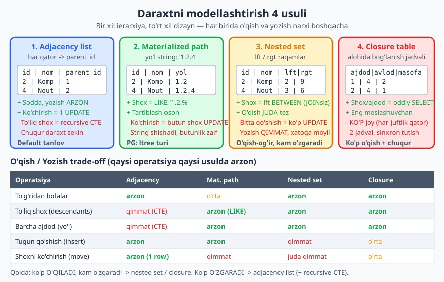
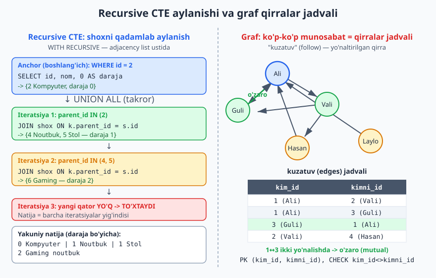
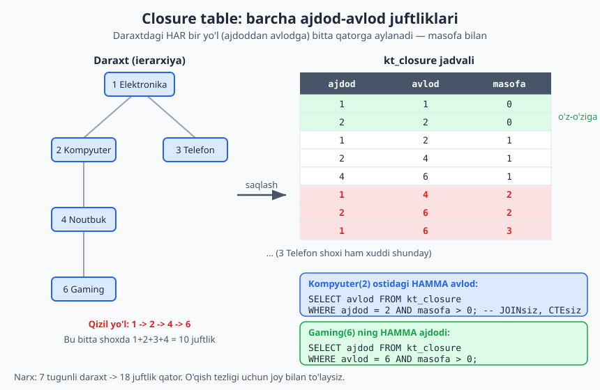

# 17 — Daraxt va graf strukturalarini modellashtirish

[⬅️ Oldingi: 16 — Tranzaksiya, izolyatsiya va parallellik dizayni](./16-tranzaksiya-parallellik.md) · [🏠 README](./README.md) · [Keyingi: 18 — Vaqtinchalik va versiyalangan ma'lumot ➡️](./18-temporal-versiya.md)

> **Bu bobda:** relyatsion baza tabiatan "tekis" jadvallardan iborat, lekin real dunyo ko'pincha **ierarxik** (kategoriya daraxti, xodim-boshliq, izoh ostidagi izoh) yoki **graf** shaklida (do'stlik, kuzatuv, marshrut) bo'ladi. Shu strukturalarni tekis jadvalga qanday "tushirish" — dizayn qarori. Daraxt uchun to'rt klassik usulni (adjacency list, materialized path, nested set, closure table) va ularning o'qish/yozish trade-off'ini ko'ramiz; adjacency list'ni `WITH RECURSIVE` bilan aylanishni o'rganamiz; grafni qirralar (edges) jadvali bilan modellashtiramiz va qachon graf-baza (Neo4j) kerakligini aniqlaymiz. Hamma misol PostgreSQL 18.4 da haqiqatan ishga tushirilgan.

---

## 0. Bu bob qayerda turadi

[SQL kitobining 15-bobi](../sql/15-cte.md) `WITH RECURSIVE` **sintaksisini** o'rgatadi: anchor (boshlang'ich) so'rov, `UNION ALL`, takroriy qism. Buni qayta o'rgatmaymiz — sizga tanish deb hisoblaymiz.

Bu bob esa **dizayn** tomonidan yondashadi: ierarxik yoki graf ma'lumotni jadvalga **qanday joylash** kerak, toki sizga kerak operatsiyalar (shox o'qish, ko'chirish, ajdod topish) arzon bo'lsin. Bitta to'g'ri javob yo'q — har usul biror narsani tez, boshqasini sekin qiladi. Sizning vazifangiz: **eng ko'p bajariladigan operatsiyani arzon qiladigan** usulni tanlash.

13-bobda ([anti-naqshlar](./13-anti-naqshlar.md)) "naive tree" — faqat `parent_id` qo'yib, chuqurlikni hisobga olmaslik — anti-naqsh sifatida tilga olingandi. Bu bob shu mavzuni to'liq ochadi: `parent_id` (adjacency list) **yomon emas**, agar uni to'g'ri (recursive CTE bilan) ishlatsangiz; muammo faqat uni noto'g'ri ishlatishda.

---

## 1. Muammo: tekis jadvalda ierarxiya

Tasavvur qiling: onlayn-do'kon kategoriya daraxti.

```
Elektronika
├── Kompyuter
│   ├── Noutbuk
│   │   └── Gaming noutbuk
│   └── Stol kompyuter
└── Telefon
    └── Smartfon
```

Bu daraxtni jadvalga solishimiz kerak. Tipik **savollar** (operatsiyalar) quyidagicha:

- **To'g'ridan bolalar:** "Kompyuter"ning bevosita bolalari kim? (Noutbuk, Stol kompyuter)
- **To'liq shox (descendants):** "Kompyuter" ostidagi **hamma** kategoriya (Noutbuk, Gaming, Stol — istalgan chuqurlikda).
- **Barcha ajdodlar (ancestors) / yo'l:** "Gaming noutbuk" qaysi zanjirda turadi? (Elektronika > Kompyuter > Noutbuk > Gaming noutbuk)
- **Tugun qo'shish / o'chirish.**
- **Shoxni ko'chirish (move):** "Kompyuter"ni butun shoxi bilan "Telefon" ostiga olib o'tish.

To'rt usulning har biri shu operatsiyalardan ba'zilarini arzon, ba'zilarini qimmat qiladi. Pastdagi diagramma butun rasmni beradi:



> **Asosiy dizayn savoli:** bu daraxt ko'p **o'qiladimi** (kategoriya menyusi har sahifada ko'rsatiladi) yoki ko'p **o'zgaradimi** (foydalanuvchilar doim shox ko'chiradi)? Javob usulni tanlaydi.

---

## 2. Usul 1 — Adjacency list (`parent_id`)

Eng sodda va eng keng tarqalgan: har qatorda **otasiga** ko'rsatkich (`parent_id`).

```sql
CREATE TABLE kategoriya (
    id        int PRIMARY KEY,
    nom       text NOT NULL,
    parent_id int REFERENCES kategoriya(id)   -- ildizda NULL
);

INSERT INTO kategoriya (id, nom, parent_id) VALUES
 (1, 'Elektronika',     NULL),
 (2, 'Kompyuter',        1),
 (3, 'Telefon',          1),
 (4, 'Noutbuk',          2),
 (5, 'Stol kompyuter',   2),
 (6, 'Gaming noutbuk',   4),
 (7, 'Smartfon',         3);
```

`parent_id` o'z jadvaliga `FOREIGN KEY` — bu **o'z-o'ziga bog'lanish** (self-reference, 4-bobda ko'rgan xodim-boshliq naqshi). Ildiz uchun `parent_id IS NULL`.

**Nima arzon:** tugun qo'shish (bitta `INSERT`), to'g'ridan bolalar (`WHERE parent_id = 2`), shoxni ko'chirish (bitta `UPDATE parent_id`).

**Nima qimmat:** "to'liq shox" yoki "barcha ajdodlar". Bitta `SELECT` chuqurlikni bilmaydi — ko'p bo'g'inli daraxtni aylanish uchun **recursive CTE** kerak.

### 2.1 To'liq shox: `WITH RECURSIVE` (descendants)

"Kompyuter" (id=2) ostidagi hamma kategoriyani, daraja bilan:

```sql
WITH RECURSIVE shox AS (
    SELECT id, nom, parent_id, 0 AS daraja
    FROM kategoriya WHERE id = 2          -- anchor: boshlang'ich tugun
  UNION ALL
    SELECT k.id, k.nom, k.parent_id, s.daraja + 1
    FROM kategoriya k
    JOIN shox s ON k.parent_id = s.id     -- takror: bolalarni top
)
SELECT daraja, repeat('  ', daraja) || nom AS daraxt, id
FROM shox ORDER BY daraja, id;
```

PG 18.4 da haqiqiy chiqish:

```
 daraja |       daraxt       | id
--------+--------------------+----
      0 | Kompyuter          |  2
      1 |   Noutbuk          |  4
      1 |   Stol kompyuter   |  5
      2 |     Gaming noutbuk |  6
(4 rows)
```

CTE qanday ishlaydi (3-rasmda batafsil): anchor "Kompyuter"ni oladi (daraja 0); birinchi iteratsiya uning bolalarini (`parent_id = 2`) topadi — Noutbuk, Stol (daraja 1); ikkinchi iteratsiya ularning bolalarini (Gaming, daraja 2); uchinchida yangi qator yo'q — to'xtaydi. `repeat('  ', daraja)` faqat chiroyli chekinish uchun.

### 2.2 Barcha ajdodlar (ancestors) — JOIN yo'nalishini teskari qil

"Gaming noutbuk" (id=6) dan ildizgacha ko'tarilamiz. Faqat `JOIN` shartini almashtiramiz (`k.id = a.parent_id`):

```sql
WITH RECURSIVE ajdod AS (
    SELECT id, nom, parent_id, 0 AS qadam
    FROM kategoriya WHERE id = 6
  UNION ALL
    SELECT k.id, k.nom, k.parent_id, a.qadam + 1
    FROM kategoriya k
    JOIN ajdod a ON k.id = a.parent_id    -- yuqoriga: otani top
)
SELECT qadam, nom, id FROM ajdod ORDER BY qadam;
```

```
 qadam |      nom       | id
-------+----------------+----
     0 | Gaming noutbuk |  6
     1 | Noutbuk        |  4
     2 | Kompyuter      |  2
     3 | Elektronika    |  1
(4 rows)
```

### 2.3 To'liq yo'l (breadcrumb) qurish

Ildizdan boshlab har tugun uchun "non ushoqlari" (breadcrumb) yo'lini string sifatida yig'ish:

```sql
WITH RECURSIVE yol AS (
    SELECT id, nom, parent_id, nom::text AS toliq_yol
    FROM kategoriya WHERE parent_id IS NULL          -- ildizdan boshla
  UNION ALL
    SELECT k.id, k.nom, k.parent_id, y.toliq_yol || ' > ' || k.nom
    FROM kategoriya k
    JOIN yol y ON k.parent_id = y.id
)
SELECT id, toliq_yol FROM yol ORDER BY id;
```

```
 id |                     toliq_yol
----+----------------------------------------------------
  1 | Elektronika
  2 | Elektronika > Kompyuter
  3 | Elektronika > Telefon
  4 | Elektronika > Kompyuter > Noutbuk
  5 | Elektronika > Kompyuter > Stol kompyuter
  6 | Elektronika > Kompyuter > Noutbuk > Gaming noutbuk
  7 | Elektronika > Telefon > Smartfon
(7 rows)
```



> **Ko'chirish (move) — adjacency list'ning kuchli tomoni.** "Kompyuter"ni butun shoxi bilan "Telefon" ostiga olib o'tish — bitta `UPDATE`:
> ```sql
> UPDATE kategoriya SET parent_id = 3 WHERE id = 2;
> ```
> Bolalarning `parent_id`'lari "Kompyuter"ga ishora qilgani uchun butun shox avtomatik ko'chadi. Boshqa usullarda bu ancha qimmat (pastda ko'ramiz).

> **PG kengaytmasi — `ltree`.** Agar materialized path uslubi yoqib qolsa, PostgreSQL'da maxsus `ltree` tur va GiST indeks bor (`CREATE EXTENSION ltree;`). U yo'l-bo'yicha so'rovlarni (`@>`, `<@`, `~`) tezlashtiradi. Bu bobda umumiy SQL'da qolamiz, lekin real loyihada `ltree` ni eslang.

### 2.4 Anti-naqshdan saqlaning: chuqurlik chegarasi

13-bobdagi "naive tree" anti-naqshi aslida adjacency list'ni recursive CTE'siz, ilovada `n` marta so'rov yuborib aylanishdir (N+1 muammosi, 15-bobga qarang). To'g'ri yechim — yuqoridagidek **bitta** recursive CTE. Cheksiz sikldan (agar ma'lumot buzilib daraxt halqaga aylansa) himoya uchun `UNION` (DISTINCT) yoki sun'iy chuqurlik chegarasi qo'shing: `WHERE daraja < 50`.

---

## 3. Usul 2 — Materialized path (yo'l string)

Har tugunda uning **to'liq yo'lini** string sifatida saqlaymiz: `'1.2.4'` degani "ildiz 1 > 2 > 4".

```sql
CREATE TABLE kt_path (
    id   int PRIMARY KEY,
    nom  text NOT NULL,
    yol  text NOT NULL              -- masalan '1.2.4'
);

INSERT INTO kt_path (id, nom, yol) VALUES
 (1, 'Elektronika',     '1'),
 (2, 'Kompyuter',       '1.2'),
 (3, 'Telefon',         '1.3'),
 (4, 'Noutbuk',         '1.2.4'),
 (5, 'Stol kompyuter',  '1.2.5'),
 (6, 'Gaming noutbuk',  '1.2.4.6'),
 (7, 'Smartfon',        '1.3.7');
```

**Kuchli tomon:** to'liq shox = oddiy **prefiks** so'rovi, recursive CTE'siz:

```sql
SELECT id, nom, yol FROM kt_path
WHERE yol LIKE '1.2.%' OR yol = '1.2'
ORDER BY yol;
```

```
 id |      nom       |   yol
----+----------------+---------
  2 | Kompyuter      | 1.2
  4 | Noutbuk        | 1.2.4
  6 | Gaming noutbuk | 1.2.4.6
  5 | Stol kompyuter | 1.2.5
(4 rows)
```

Chuqurlik = nuqtalar soni (string ustida):

```sql
SELECT id, nom, yol, length(yol) - length(replace(yol,'.','')) AS chuqurlik
FROM kt_path ORDER BY id;
```

```
 id |      nom       |   yol   | chuqurlik
----+----------------+---------+-----------
  1 | Elektronika    | 1       |         0
  2 | Kompyuter      | 1.2     |         1
  3 | Telefon        | 1.3     |         1
  4 | Noutbuk        | 1.2.4   |         2
  5 | Stol kompyuter | 1.2.5   |         2
  6 | Gaming noutbuk | 1.2.4.6 |         3
  7 | Smartfon       | 1.3.7   |         2
(7 rows)
```

**Zaif tomon — ko'chirish (move).** "Kompyuter" (`1.2`) ni butun shoxi bilan "Telefon" (`1.3`) ostiga ko'chirsak, shoxdagi **har bir** qatorning `yol` prefiksini almashtirish kerak (`1.2` -> `1.3.2`):

```sql
UPDATE kt_path SET yol = '1.3.2' || substr(yol, length('1.2') + 1)
WHERE yol = '1.2' OR yol LIKE '1.2.%';
```

Ko'chirishdan keyin (PG18'da haqiqiy natija, 3 qator yangilandi):

```
 id |    yol
----+-----------
  1 | 1
  3 | 1.3
  2 | 1.3.2
  4 | 1.3.2.4
  6 | 1.3.2.4.6
(5 rows)
```

Demak ko'chirish butun pastki shoxni qayta yozadi — adjacency list'dagi bitta `UPDATE`'dan qimmat. Yana zaif joylar: `yol` butunligini baza majburlay olmaydi (string yolg'on bo'lishi mumkin), `id` o'zgarsa yo'l buziladi, chuqur daraxtda string shishadi. Shuning uchun **surrogate** kalit (id) barqaror bo'lishi shart (6-bob).

---

## 4. Usul 3 — Nested set (lft / rgt)

G'oya: daraxtni "qavslar" kabi o'rab chiqamiz. Har tugunga ikki raqam beramiz — `lft` (chap qavs) va `rgt` (o'ng qavs). Bola butunlay ota qavslari **ichida** turadi: `bola.lft > ota.lft AND bola.rgt < ota.rgt`.

```sql
CREATE TABLE kt_nested (
    id   int PRIMARY KEY,
    nom  text NOT NULL,
    lft  int NOT NULL,
    rgt  int NOT NULL
);

-- Elektronika(1-14) > Kompyuter(2-9){Noutbuk(3-6){Gaming(4-5)}, Stol(7-8)}, Telefon(10-13){Smartfon(11-12)}
INSERT INTO kt_nested (id, nom, lft, rgt) VALUES
 (1, 'Elektronika',     1, 14),
 (2, 'Kompyuter',       2,  9),
 (4, 'Noutbuk',         3,  6),
 (6, 'Gaming noutbuk',  4,  5),
 (5, 'Stol kompyuter',  7,  8),
 (3, 'Telefon',        10, 13),
 (7, 'Smartfon',       11, 12);
```

**Kuchli tomon:** to'liq shox = bitta `BETWEEN`, **recursive CTE'siz va hatto `JOIN`'siz** (bir qiymatni bilsangiz):

```sql
SELECT c.id, c.nom, c.lft, c.rgt
FROM kt_nested p JOIN kt_nested c
  ON c.lft > p.lft AND c.rgt < p.rgt
WHERE p.id = 2;
```

```
 id |      nom       | lft | rgt
----+----------------+-----+-----
  4 | Noutbuk        |   3 |   6
  6 | Gaming noutbuk |   4 |   5
  5 | Stol kompyuter |   7 |   8
(3 rows)
```

Har tugun chuqurligi ham bitta so'rov bilan (uni o'rab turuvchi tugunlar sonidan):

```sql
SELECT n.nom, count(p.id) - 1 AS chuqurlik
FROM kt_nested n JOIN kt_nested p
  ON n.lft BETWEEN p.lft AND p.rgt
GROUP BY n.id, n.nom, n.lft
ORDER BY n.lft;
```

```
      nom       | chuqurlik
----------------+-----------
 Elektronika    |         0
 Kompyuter      |         1
 Noutbuk        |         2
 Gaming noutbuk |         3
 Stol kompyuter |         2
 Telefon        |         1
 Smartfon       |         2
(7 rows)
```

**Zaif tomon — yozish QIMMAT va xatoga moyil.** Yangi tugun qo'shish uchun undan **o'ngdagi** barcha `lft`/`rgt` qiymatlarini siljitish kerak (odatda `UPDATE ... SET lft = lft + 2 WHERE lft > ...`). Bir tugun qo'shish jadvalning yarmini yangilashi mumkin. Bir nechta sessiya bir vaqtda yozsa — qulflash va xato xavfi katta (16-bob). Shuning uchun nested set **kam o'zgaradigan, ko'p o'qiladigan** daraxt uchun (masalan, deyarli statik kategoriya katalogi yoki tashkilot tuzilmasi) yaxshi.

> **MySQL/PostgreSQL farqi yo'q** bu yerda — nested set sof relyatsion g'oya, ikkalasida bir xil ishlaydi. Lekin `lft`/`rgt` ustunlariga indeks qo'yish ikkalasida ham shart (aks holda `BETWEEN` seq scan bo'ladi, 14-bob).

---

## 5. Usul 4 — Closure table (ajdod-avlod jadvali)

Eng moslashuvchan: daraxtni **alohida** jadvalda saqlaymiz, unda har bir ajdod-avlod **juftligi** (o'z-o'ziga ham) bitta qator.

```sql
CREATE TABLE kt_closure (
    ajdod  int NOT NULL REFERENCES kategoriya(id),
    avlod  int NOT NULL REFERENCES kategoriya(id),
    masofa int NOT NULL,                          -- 0 = o'z-o'ziga
    PRIMARY KEY (ajdod, avlod)
);
```

Closure'ni adjacency list'dan **bir marta** recursive CTE bilan to'ldiramiz:

```sql
INSERT INTO kt_closure (ajdod, avlod, masofa)
WITH RECURSIVE c AS (
    SELECT id AS ajdod, id AS avlod, 0 AS masofa FROM kategoriya   -- o'z-o'ziga
  UNION ALL
    SELECT c.ajdod, k.id, c.masofa + 1
    FROM kategoriya k
    JOIN c ON k.parent_id = c.avlod
)
SELECT ajdod, avlod, masofa FROM c;
```

7 tugunli daraxt uchun bu **18** qator hosil qiladi (har shoxdagi har juftlik). Joy narxi shu — lekin o'qish bepul. Diagrammada tuzilish:



**To'liq shox** endi recursive CTE'siz — oddiy `SELECT`:

```sql
SELECT cl.avlod, k.nom, cl.masofa
FROM kt_closure cl JOIN kategoriya k ON k.id = cl.avlod
WHERE cl.ajdod = 2 AND cl.masofa > 0
ORDER BY cl.masofa, cl.avlod;
```

```
 avlod |      nom       | masofa
-------+----------------+--------
     4 | Noutbuk        |      1
     5 | Stol kompyuter |      1
     6 | Gaming noutbuk |      2
(3 rows)
```

**Barcha ajdodlar** — `WHERE avlod = ...` (teskari yo'nalish, baribir CTE'siz):

```sql
SELECT cl.ajdod, k.nom, cl.masofa
FROM kt_closure cl JOIN kategoriya k ON k.id = cl.ajdod
WHERE cl.avlod = 6 AND cl.masofa > 0
ORDER BY cl.masofa DESC;
```

```
 ajdod |     nom     | masofa
-------+-------------+--------
     1 | Elektronika |      3
     2 | Kompyuter   |      2
     4 | Noutbuk     |      1
(3 rows)
```

Jami qatorlar (joy narxi):

```sql
SELECT count(*) AS juftliklar FROM kt_closure;
```

```
 juftliklar
------------
         18
(1 row)
```

**Yangi tugun qo'shish** (closure'ni sinxron tutish). Yangi tugun (`avlod`) ning ajdodlari = **otasining** barcha ajdodlari + otaning o'zi, har biriga masofa +1, plus o'z-o'ziga (0). Masalan id=8 ni id=4 (Noutbuk) ostiga:

```sql
INSERT INTO kt_closure (ajdod, avlod, masofa)
  SELECT ajdod, 8, masofa + 1 FROM kt_closure WHERE avlod = 4
  UNION ALL SELECT 8, 8, 0;
```

**Trade-off:** o'qish barcha yo'nalishda arzon va sodda; chuqur daraxt uchun ideal. Narxi — qo'shimcha jadval (sinxron tutish kerak, odatda trigger bilan, 18-bobdagi tarix-jadval naqshiga o'xshash) va **ko'p joy** (qatorlar soni daraxt chuqurligiga proporsional o'sadi). Ko'chirish — o'rta: faqat ko'chirilayotgan shoxning closure qatorlarini qayta hisoblash.

---

## 6. To'rt usul — qanday tanlash

| Operatsiya | Adjacency | Mat. path | Nested set | Closure |
|---|---|---|---|---|
| To'g'ridan bolalar | arzon | o'rta | arzon | arzon |
| To'liq shox (descendants) | qimmat (CTE) | arzon (LIKE) | arzon | arzon |
| Barcha ajdod (yo'l) | qimmat (CTE) | arzon (string) | arzon | arzon |
| Tugun qo'shish | arzon | arzon | qimmat | o'rta |
| Shoxni ko'chirish (move) | arzon (1 qator) | qimmat | juda qimmat | o'rta |
| Butunlikni baza majburlaydi | ha (FK) | yo'q (string) | qisman | ha (FK) |
| Qo'shimcha joy | yo'q | o'rta | yo'q | ko'p |

**Amaliy qoida (dizayn qarori):**

- **Adjacency list + recursive CTE** — sukut bo'yicha tanlov. Sodda, butunlik FK bilan, ko'chirish arzon. PostgreSQL'da recursive CTE tez; ko'p loyihaga shu yetadi. Boshqa narsa kerakligini **o'lchov** ko'rsatsa tanlang (15-bob: "avval o'lcha, keyin kes").
- **Materialized path / `ltree`** — yo'l-bo'yicha qidiruv (breadcrumb, "shu yo'l ostidagi hamma") asosiy operatsiya bo'lsa va ko'chirish kam bo'lsa.
- **Nested set** — daraxt deyarli **statik**, juda ko'p o'qiladi, kam o'zgaradi (masalan, kategoriya katalogi yiliga bir marta yangilanadi).
- **Closure table** — chuqur daraxt + barcha yo'nalishda tez o'qish kerak + qo'shimcha jadval va joyni ko'tara olasiz (masalan, izoh ostidagi izohlar, tashkilot ierarxiyasi hisobotlari).

> **Ekspert maslahati:** ko'p tizim adjacency list'ni **asosiy haqiqat manbai** (source of truth, FK butunligi bilan) qilib saqlaydi va undan closure table yoki materialized path'ni **hosila** (derived) sifatida quradi — o'qish tezligi uchun. Bu denormalizatsiya (8-bob): hosila jadvalni asl bilan sinxron tutish narxini o'qish tezligiga almashtirasiz.

---

## 7. Grafni modellashtirish: qirralar (edges) jadvali

Daraxt — grafning maxsus turi (har tugunning bitta otasi bor, halqa yo'q). **Umumiy graf** da bunday cheklov yo'q: do'stlik, kuzatuv (follow), marshrut, tavsiya — bularda tugun ko'p tugunga bog'lanadi va halqa bo'lishi mumkin. Bu **ko'p-ko'p** (N:M) munosabat (4-bob), shuning uchun uni **qirralar (edges) bog'lovchi jadvali** bilan modellashtiramiz.

```sql
CREATE TABLE foydalanuvchi (
    id  int PRIMARY KEY,
    nom text NOT NULL
);

-- Kuzatuv (follow) — YO'NALTIRILGAN qirra (kim -> kimni)
CREATE TABLE kuzatuv (
    kim_id   int NOT NULL REFERENCES foydalanuvchi(id),
    kimni_id int NOT NULL REFERENCES foydalanuvchi(id),
    sana     date NOT NULL DEFAULT current_date,
    PRIMARY KEY (kim_id, kimni_id),
    CHECK (kim_id <> kimni_id)              -- o'zini kuzata olmaydi
);
```

Dizayn nuqtalari:

- **Kompozit `PRIMARY KEY (kim_id, kimni_id)`** — bir juftlik faqat bir marta (ikki marta kuzatib bo'lmaydi).
- **`CHECK (kim_id <> kimni_id)`** — o'z-o'ziga qirra man qilinadi (baza darajasida, 11-bob).
- **Yo'naltirilgan vs yo'naltirilmagan:** "kuzatuv" yo'naltirilgan (Ali Valini kuzatadi ≠ Vali Alini kuzatadi). "Do'stlik" odatda yo'naltirilmagan — uni ham shu jadvalda saqlasa bo'ladi, lekin har do'stlikni faqat bir marta yozish uchun konvensiya kerak (masalan doim `kichik_id < katta_id`).

Misol grafni to'ldiramiz (3-rasmda ko'rsatilgan):

```sql
INSERT INTO foydalanuvchi VALUES (1,'Ali'),(2,'Vali'),(3,'Guli'),(4,'Hasan'),(5,'Laylo');
INSERT INTO kuzatuv (kim_id, kimni_id) VALUES
 (1,2),(1,3),(2,3),(3,1),(4,1),(5,1),(2,4);
```

### 7.1 Kuzatuvchilarni topish (followers)

"Ali"ni (id=1) kim kuzatadi:

```sql
SELECT f.nom FROM kuzatuv k JOIN foydalanuvchi f ON f.id = k.kim_id
WHERE k.kimni_id = 1 ORDER BY f.nom;
```

```
  nom
-------
 Guli
 Hasan
 Laylo
(3 rows)
```

### 7.2 O'zaro kuzatuv (mutual / do'stlik)

Ikki tomon bir-birini kuzatsa — bu "do'stlik". Jadvalni o'ziga `JOIN` qilamiz:

```sql
SELECT a.kim_id, a.kimni_id
FROM kuzatuv a JOIN kuzatuv b
  ON a.kim_id = b.kimni_id AND a.kimni_id = b.kim_id
WHERE a.kim_id < a.kimni_id;       -- har juftlikni bir marta
```

```
 kim_id | kimni_id
--------+----------
      1 |        3
(1 row)
```

Ali (1) va Guli (3) bir-birini kuzatadi.

### 7.3 Tavsiya: "do'stning do'sti" (2 qadam)

Ali kuzatganlar yana kimni kuzatadi (lekin Ali hali kuzatmaydigan) — bu klassik "siz tanishingiz mumkin" tavsiyasi:

```sql
SELECT DISTINCT f.id, f.nom
FROM kuzatuv k1
JOIN kuzatuv k2 ON k1.kimni_id = k2.kim_id
JOIN foydalanuvchi f ON f.id = k2.kimni_id
WHERE k1.kim_id = 1
  AND k2.kimni_id <> 1                                       -- o'zini emas
  AND k2.kimni_id NOT IN (SELECT kimni_id FROM kuzatuv WHERE kim_id = 1)  -- allaqachon kuzatmaydigan
ORDER BY f.id;
```

```
 id |  nom
----+-------
  4 | Hasan
(1 row)
```

### 7.4 Grafni recursive CTE bilan aylanish (BFS — eng qisqa yo'l)

Daraxt kabi, grafni ham `WITH RECURSIVE` aylanishimiz mumkin. Lekin grafda **halqa** bo'lishi mumkin (3 -> 1 -> ... -> 3), shuning uchun `UNION ALL` o'rniga **`UNION`** (DISTINCT) ishlatamiz — takror tugunlar cheksiz siklga olib bormasin. Ali (1) dan 2 qadamgacha kimga yetib boriladi:

```sql
WITH RECURSIVE yetish AS (
    SELECT kimni_id AS tugun, 1 AS qadam
    FROM kuzatuv WHERE kim_id = 1
  UNION
    SELECT k.kimni_id, y.qadam + 1
    FROM kuzatuv k JOIN yetish y ON k.kim_id = y.tugun
    WHERE y.qadam < 2                       -- chuqurlik chegarasi
)
SELECT min(qadam) AS eng_qisqa, tugun
FROM yetish GROUP BY tugun ORDER BY tugun;
```

```
 eng_qisqa | tugun
-----------+-------
         2 |     1
         1 |     2
         1 |     3
         2 |     4
(4 rows)
```

> **Diqqat — halqa va `UNION`.** Grafda doim `UNION` (DISTINCT) yoki aniq "tashrif buyurilgan" ro'yxat va chuqurlik chegarasi ishlating. Aks holda halqa (Ali->Guli->Ali->...) so'rovni cheksiz qiladi. Bu daraxtdan farqi: daraxtda halqa bo'lmaydi (agar ma'lumot to'g'ri bo'lsa).

---

## 8. Qachon relyatsion baza yetarli emas: graf-baza

Yuqorida ko'rdik — relyatsion bazada graf **ishlaydi**: edges jadvali + recursive CTE. 1-2 qadamli so'rovlar (followers, do'stning do'sti) tez va qulay. Lekin **chuqur** graf aylanishlarida (5-6+ qadam, "eng qisqa yo'lni top", "bu ikki odam orasidagi eng qisqa zanjir") har qadam yana bitta `JOIN` — so'rov sekinlashadi va o'qish qiyinlashadi.

**Graf-baza** (masalan Neo4j) aynan shu uchun qurilgan: qirralar tugunda fizik ko'rsatkich sifatida saqlanadi, shuning uchun "qo'shni"ga o'tish `JOIN` emas, bir qadam (index-free adjacency). Chuqur aylanish (path-finding, ijtimoiy tarmoq tahlili, firibgarlik halqasini topish, tavsiya dvigateli) ularda tabiiy va tez.

**Dizayn qoidasi:**

- **Graf — ma'lumotning bir qismi**, asosiy ish 1-2 qadam (do'stlik, kuzatuv, kategoriya) -> **relyatsion baza yetadi** (edges jadvali). Yangi texnologiya kiritmang.
- **Graf aylanishi — ilovaning yuragi**, chuqur va tez-tez (yo'l qidirish, tavsiya, tarmoq tahlili) -> **graf-baza**ni ko'rib chiqing.

Buni keyingi qism — [20-bob (NoSQL ma'lumot modellashtirish)](./20-nosql-modellashtirish.md) — to'liqroq ochadi: NoSQL turlari (document, key-value, wide-column, **graph**) va polyglot persistence (har vazifaga mos baza). Hozircha: relyatsion bazada grafni qanday qurishni bilasiz, va qachon undan chiqish kerakligini sezasiz.

---

## Mashqlar

### Oson

1. **Usulni tanla.** Onlayn-do'kon kategoriya menyusi **har** sahifa yuklanishida ko'rsatiladi (juda ko'p o'qiladi), lekin kategoriya daraxti yiliga bir-ikki marta o'zgaradi. Qaysi usulni (4 tadan) tanlaysiz va nega?

2. **`parent_id` ustunini loyihalang.** `xodim(id, ism, boshliq_id)` jadvalini adjacency list sifatida loyihalang. Qaysi ustun `FOREIGN KEY` bo'ladi, qaysi qiymat ildiz (eng katta boshliq) uchun ishlatiladi, va o'zini-o'zi boshliq qilib qo'yishni qanday man qilasiz?

3. **Anti-naqshni aniqla.** Bir dasturchi izohlar daraxtini ilovada shunday aylanadi: avval ildiz izohni oladi, keyin har bola uchun alohida `SELECT`, keyin har nevara uchun yana... 100 izohga 100 ta so'rov ketadi. Bu qaysi anti-naqsh va to'g'ri yechim qanday?

4. **Daraxt yo'nalishini ayt.** Quyidagi recursive CTE'da `JOIN` sharti `JOIN t s ON k.parent_id = s.id`. Bu so'rov daraxtni **pastga** (avlodlar) aylanadimi yoki **yuqoriga** (ajdodlar)? Ajdodlarga aylanish uchun shartni qanday o'zgartirasiz?

### O'rta

5. **Recursive CTE yoz.** `kategoriya(id, nom, parent_id)` jadvali uchun "Elektronika" (id=1) ostidagi **barcha** kategoriyani daraja (chuqurlik) bilan qaytaruvchi recursive CTE yozing. Natija daraja bo'yicha tartiblangan bo'lsin.

6. **Adjacency -> closure.** `kategoriya(id, nom, parent_id)` adjacency list jadvalidan to'liq closure table (`ajdod, avlod, masofa`) ni recursive CTE bilan to'ldiruvchi `INSERT` yozing. O'z-o'ziga qatorlarni (masofa=0) ham qo'shing.

7. **Graf munosabatni modellashtir.** Ijtimoiy tarmoq uchun "do'stlik" (**yo'naltirilmagan**, ikki tomonlama) munosabatini jadval bilan loyihalang. Har do'stlik faqat bir marta saqlanishini, o'zini-o'ziga do'st qilishni man qilishni, va takror do'stlikni qanday oldini olasiz? DDL yozing.

8. **Usulni boshqasiga o'tkaz.** Sizda materialized path jadvali bor: `kt_path(id, nom, yol)` (`yol` = '1.2.4' ko'rinishida). Buni adjacency list (`id, nom, parent_id`) ga aylantiruvchi `SELECT` (yoki `INSERT ... SELECT`) yozing — ya'ni har tugun uchun otasini yo'l stringidan ajratib oling.

9. **O'zaro kuzatuvni top.** `kuzatuv(kim_id, kimni_id)` jadvalidan **o'zaro** (ikki tomon bir-birini kuzatadigan) juftliklarni qaytaruvchi so'rov yozing, har juftlik faqat bir marta chiqsin.

### Qiyin

10. **Trade-off asosida loyiha.** Forum tizimida izohlar **chuqur** ierarxik (izoh ostida izoh, 10+ daraja bo'lishi mumkin), juda ko'p o'qiladi (har sahifada butun zanjir), va yangi izoh tez-tez qo'shiladi (lekin mavjud izoh kamdan-kam ko'chiriladi). To'rt usuldan birini tanlang, qarorni trade-off jadvali asosida asoslang, va to'liq sxemani (DDL + bitta tugun qo'shish protsedurasi) loyihalang.

11. **Shoxni ko'chirishni har usulda taqqosla.** "Kompyuter" shoxini "Telefon" ostiga ko'chirish operatsiyasini (a) adjacency list, (b) materialized path, (c) closure table da qanday bajarilishini yozing (har biri uchun SQL). Qaysi biri eng arzon, qaysi biri eng qimmat va nega — bir paragrafda izohlang.

12. **Graf aylanish + halqa himoyasi.** `kuzatuv(kim_id, kimni_id)` grafida halqa bor (masalan 1->3 va 3->1). "Ali (1) dan eng ko'pi 3 qadamda yetib boriladigan barcha foydalanuvchini, eng qisqa masofasi bilan" qaytaruvchi recursive CTE yozing. Halqa so'rovni cheksiz qilmasligi uchun qanday choralar ko'rasiz (kamida ikkitasini ayting)?

13. **Qachon graf-baza qarori.** Quyidagi uch tizim uchun "relyatsion (edges jadvali)" yoki "graf-baza"ni tanlang va bir jumlada asoslang: (a) blogda har postning bitta muallifi va kategoriyalari; (b) LinkedIn uslubidagi "siz va shu odam orasidagi eng qisqa tanishlik zanjirini ko'rsat" xizmati; (c) onlayn-do'kon kategoriya daraxti (5 daraja, kam o'zgaradi).

14. **Closure table'ni sinxron tutish.** Closure table asl adjacency list bilan **doim** mos bo'lishi kerak. Bir tugun (va uning butun shoxi) **o'chirilganda** closure table'dan qaysi qatorlarni o'chirish kerakligini tushuntiring va `DELETE` so'rovini yozing. Nima uchun buni odatda trigger bilan avtomatlashtirishadi?

---

## Yechimlar

<details markdown="1">
<summary>Yechim — 1</summary>

**Nested set** (yoki closure table) eng mos. Asosiy operatsiya — to'liq shoxni o'qish (menyu), juda tez-tez; o'zgarish — kam. Nested set'da shox = bitta `lft BETWEEN ... AND ...` (CTE'siz, hatto JOINsiz), o'qish juda tez. Yozish qimmat, lekin yiliga bir-ikki marta bo'lgani uchun ahamiyatsiz.

Agar daraxt chuqur bo'lsa va barcha yo'nalishda (ajdod ham, avlod ham) tez o'qish kerak bo'lsa — closure table ham yaxshi tanlov. **Adjacency list** bu yerda eng yomon emas, lekin har menyu uchun recursive CTE ishga tushishi nested set'dagi oddiy `BETWEEN`'dan sekinroq. Qaror "ko'p o'qiladi, kam o'zgaradi" qoidasiga tayanadi.

</details>

<details markdown="1">
<summary>Yechim — 2</summary>

```sql
CREATE TABLE xodim (
    id        int PRIMARY KEY,
    ism       text NOT NULL,
    boshliq_id int REFERENCES xodim(id),     -- o'z-o'ziga FK (adjacency list)
    CHECK (boshliq_id <> id)                 -- o'zini-o'zi boshliq qila olmaydi
);
```

- `boshliq_id` — o'z jadvaliga `FOREIGN KEY` (self-reference).
- Ildiz (eng katta boshliq, masalan CEO) uchun `boshliq_id IS NULL` — uning ustida hech kim yo'q.
- `CHECK (boshliq_id <> id)` to'g'ridan o'z-o'ziga halqani man qiladi (lekin uzun halqani — A->B->A — `CHECK` ushlamaydi; buni ilova yoki maxsus trigger tekshiradi).

</details>

<details markdown="1">
<summary>Yechim — 3</summary>

Bu **N+1 muammosi** (15-bobda ko'rilgan; 13-bobdagi "naive tree" anti-naqshining ko'rinishi). 100 izohga 100+ so'rov — har biri tarmoq/disk borib-kelishi.

To'g'ri yechim — daraxtni **bitta** recursive CTE bilan olish:

```sql
WITH RECURSIVE izohlar AS (
    SELECT id, matn, parent_id, 0 AS daraja
    FROM izoh WHERE post_id = :post AND parent_id IS NULL
  UNION ALL
    SELECT i.id, i.matn, i.parent_id, iz.daraja + 1
    FROM izoh i JOIN izohlar iz ON i.parent_id = iz.id
)
SELECT * FROM izohlar ORDER BY daraja, id;
```

Bitta so'rov butun daraxtni qaytaradi; ilova uni `parent_id` bo'yicha xotirada daraxtga yig'adi. Yoki materialized path/closure table ishlatib, hatto CTE'siz prefiks/JOIN bilan bitta `SELECT` qilish mumkin.

</details>

<details markdown="1">
<summary>Yechim — 4</summary>

`JOIN t s ON k.parent_id = s.id` — har iteratsiyada "natijadagi tugunlarning **bolalarini**" topadi (`k.parent_id` natijaning `id`siga teng). Demak so'rov **pastga**, avlodlarga aylanadi.

Yuqoriga (ajdodlarga) aylanish uchun shartni teskari qilamiz:

```sql
JOIN t s ON k.id = s.parent_id
```

Endi har iteratsiyada "natijadagi tugunning **otasini**" topadi (`k.id` natijaning `parent_id`siga teng).

</details>

<details markdown="1">
<summary>Yechim — 5</summary>

```sql
WITH RECURSIVE shox AS (
    SELECT id, nom, parent_id, 0 AS daraja
    FROM kategoriya WHERE id = 1
  UNION ALL
    SELECT k.id, k.nom, k.parent_id, s.daraja + 1
    FROM kategoriya k
    JOIN shox s ON k.parent_id = s.id
)
SELECT daraja, nom, id FROM shox ORDER BY daraja, id;
```

Anchor "Elektronika" (id=1) ni daraja 0 bilan oladi; har iteratsiya bir daraja pastga tushadi. PG18'da bu butun daraxtni (7 qator) daraja bo'yicha tartiblangan holda qaytaradi.

</details>

<details markdown="1">
<summary>Yechim — 6</summary>

```sql
INSERT INTO kt_closure (ajdod, avlod, masofa)
WITH RECURSIVE c AS (
    SELECT id AS ajdod, id AS avlod, 0 AS masofa FROM kategoriya   -- o'z-o'ziga (masofa 0)
  UNION ALL
    SELECT c.ajdod, k.id, c.masofa + 1
    FROM kategoriya k
    JOIN c ON k.parent_id = c.avlod                                 -- har avlodning bolasi
)
SELECT ajdod, avlod, masofa FROM c;
```

Anchor har tugunni o'z-o'ziga (masofa 0) qo'shadi. Takroriy qism: agar `(A, B)` juftlik bor va `C` ning otasi `B` bo'lsa, `(A, C, masofa+1)` qo'shiladi — ya'ni `A` ham `C` ning ajdodi. 7 tugunli daraxtda jami 18 qator hosil bo'ladi (PG18'da tekshirilgan).

</details>

<details markdown="1">
<summary>Yechim — 7</summary>

```sql
CREATE TABLE dostlik (
    user_a int NOT NULL REFERENCES foydalanuvchi(id),
    user_b int NOT NULL REFERENCES foydalanuvchi(id),
    sana   date NOT NULL DEFAULT current_date,
    PRIMARY KEY (user_a, user_b),
    CHECK (user_a < user_b)                 -- konvensiya + o'zini-o'ziga man qiladi
);
```

- Yo'naltirilmagan munosabatni **bir marta** saqlash uchun konvensiya: doim `user_a < user_b`. Demak (3,5) saqlanadi, (5,3) saqlanmaydi.
- `CHECK (user_a < user_b)` ayni vaqtda o'zini-o'zi (user_a = user_b) ni ham man qiladi (chunki teng bo'lsa shart buziladi).
- `PRIMARY KEY (user_a, user_b)` takror do'stlikni oldini oladi.
- Ilova do'stlik qo'shishdan oldin ikki id'ni saralashi kerak: `INSERT INTO dostlik VALUES (least(:x,:y), greatest(:x,:y));`.

</details>

<details markdown="1">
<summary>Yechim — 8</summary>

Otaning id'si — yo'lning **oxirgi nuqtadan oldingi** qismi. PostgreSQL'da `split_part` yoki `string_to_array` bilan ajratamiz. Eng sodda — yo'ldan oxirgi `.NN` ni kesib tashlash:

```sql
SELECT
    id,
    nom,
    NULLIF(
      substring(yol from '^(.*)\.[^.]+$'),  -- oxirgi '.NN' dan oldingi qism
      ''
    )::int AS parent_id_yol_oxiri
FROM kt_path;
```

Aniqrog'i, ota id = yo'ldagi oxirgidan oldingi element. `string_to_array` bilan:

```sql
SELECT
    id, nom,
    (string_to_array(yol, '.'))[array_length(string_to_array(yol,'.'),1) - 1]::int AS parent_id
FROM kt_path;
```

Ildiz uchun (yo'lda bitta element, masalan '1') ota yo'q — natija `NULL` bo'ladi (massivda -1 indeks yo'q). Buni `INSERT INTO kategoriya (id, nom, parent_id) SELECT ...` bilan adjacency list jadvaliga yozish mumkin.

</details>

<details markdown="1">
<summary>Yechim — 9</summary>

```sql
SELECT a.kim_id, a.kimni_id
FROM kuzatuv a JOIN kuzatuv b
  ON a.kim_id = b.kimni_id AND a.kimni_id = b.kim_id
WHERE a.kim_id < a.kimni_id;
```

Jadvalni o'ziga `JOIN` qilamiz: `a` qirra (X->Y) va `b` qirra (Y->X) ikkalasi bor bo'lsa — o'zaro. `WHERE a.kim_id < a.kimni_id` har juftlikni faqat bir marta chiqaradi (aks holda (1,3) va (3,1) ikki marta kelardi). PG18'da bu (1,3) — Ali va Guli — ni qaytaradi.

</details>

<details markdown="1">
<summary>Yechim — 10</summary>

**Closure table** tanlanadi. Trade-off tahlili:

- Chuqur (10+ daraja) + juda ko'p o'qiladi: adjacency list'da har sahifa uchun chuqur recursive CTE — sekin. Closure'da to'liq zanjir bitta `WHERE ajdod = ...` (CTE'siz).
- Yangi izoh tez-tez qo'shiladi: closure'da qo'shish "o'rta" narx (otaning ajdodlari + o'zi), nested set'dagidek "jadvalning yarmini siljitish" emas.
- Ko'chirish kam: closure'ning yagona qimmat operatsiyasi shu, lekin kam bo'lgani uchun ahamiyatsiz.

```sql
CREATE TABLE izoh (
    id        bigint GENERATED ALWAYS AS IDENTITY PRIMARY KEY,
    post_id   bigint NOT NULL,
    muallif   text NOT NULL,
    matn      text NOT NULL,
    parent_id bigint REFERENCES izoh(id),     -- asl haqiqat manbai (adjacency)
    yaratilgan timestamptz NOT NULL DEFAULT now()
);

CREATE TABLE izoh_closure (
    ajdod  bigint NOT NULL REFERENCES izoh(id),
    avlod  bigint NOT NULL REFERENCES izoh(id),
    masofa int    NOT NULL,
    PRIMARY KEY (ajdod, avlod)
);
CREATE INDEX ON izoh_closure (avlod);          -- ajdodlarni topish uchun
```

Yangi izoh qo'shish (parent = :p, yangi id = :yangi):

```sql
INSERT INTO izoh_closure (ajdod, avlod, masofa)
  SELECT ajdod, :yangi, masofa + 1 FROM izoh_closure WHERE avlod = :p
  UNION ALL SELECT :yangi, :yangi, 0;
```

Asl `izoh` jadvali FK butunligini saqlaydi; `izoh_closure` o'qish tezligi uchun hosila. Ikkalasi bitta tranzaksiyada yangilanishi shart (16-bob).

</details>

<details markdown="1">
<summary>Yechim — 11</summary>

**(a) Adjacency list — bitta `UPDATE` (eng arzon):**
```sql
UPDATE kategoriya SET parent_id = 3 WHERE id = 2;
```
Bolalar otaga ishora qilgani uchun butun shox avtomatik ko'chadi.

**(b) Materialized path — butun shoxning prefiksini qayta yozish (qimmat):**
```sql
UPDATE kt_path SET yol = '1.3.2' || substr(yol, length('1.2') + 1)
WHERE yol = '1.2' OR yol LIKE '1.2.%';
```
Shoxdagi har bir qator yangilanadi (bizning misolda 3 qator).

**(c) Closure table — eski tashqi bog'lanishlarni o'chirib, yangisini qurish (o'rta):**
```sql
-- 1) Ko'chirilayotgan shox tugunlarining shoxdan TASHQARIdagi ajdodlarga bog'lanishini o'chir
DELETE FROM kt_closure
WHERE avlod IN (SELECT avlod FROM kt_closure WHERE ajdod = 2)
  AND ajdod NOT IN (SELECT avlod FROM kt_closure WHERE ajdod = 2);
-- 2) Yangi otaning ajdodlari x shoxning tugunlari uchun yangi qatorlar qo'sh
INSERT INTO kt_closure (ajdod, avlod, masofa)
SELECT yangi_ota.ajdod, shox.avlod, yangi_ota.masofa + shox.masofa + 1
FROM kt_closure yangi_ota
CROSS JOIN kt_closure shox
WHERE yangi_ota.avlod = 3 AND shox.ajdod = 2;
```

**Xulosa:** adjacency list eng arzon (1 qator), nested set eng qimmat (juda ko'p `lft`/`rgt` siljishi — shu sabab uni mashqdan tashqarida qoldirdik), materialized path va closure o'rtada. Sabab: adjacency list ierarxiyani **mahalliy** (har tugun faqat otasini biladi) saqlaydi, shuning uchun bitta bog'lanishni o'zgartirish yetadi; boshqa usullar ierarxiyani **global** (yo'l/raqam/juftliklar) saqlaydi, shuning uchun ko'chirish global qayta hisobni talab qiladi.

</details>

<details markdown="1">
<summary>Yechim — 12</summary>

```sql
WITH RECURSIVE yetish AS (
    SELECT kimni_id AS tugun, 1 AS qadam
    FROM kuzatuv WHERE kim_id = 1
  UNION                                      -- DISTINCT: takror tugunni tashlaydi
    SELECT k.kimni_id, y.qadam + 1
    FROM kuzatuv k JOIN yetish y ON k.kim_id = y.tugun
    WHERE y.qadam < 3                         -- chuqurlik chegarasi (3 qadam)
)
SELECT min(qadam) AS eng_qisqa, tugun
FROM yetish GROUP BY tugun ORDER BY tugun;
```

Halqaga qarshi choralar (kamida ikkitasi):

1. **`UNION` (DISTINCT)** `UNION ALL` o'rniga — bir marta ko'rilgan tugun qayta qo'shilmaydi, demak halqa (1->3->1->...) takror aylanmaydi.
2. **Chuqurlik chegarasi** `WHERE qadam < N` — har qanday holatda aylanish chekli qadamdan keyin to'xtaydi.
3. (Qo'shimcha) **Tashrif buyurilgan yo'lni massivda olib yurish:** `path int[]` ustuni qo'shib, `WHERE NOT k.kimni_id = ANY(path)` bilan oldindan ko'rilgan tugunni man qilish — eng ishonchli usul, ayniqsa eng qisqa yo'lni qayta tiklash kerak bo'lsa.

</details>

<details markdown="1">
<summary>Yechim — 13</summary>

**(a) Blog post -> muallif/kategoriya — relyatsion (edges/FK).** Bu sodda 1:N va N:M munosabatlar, chuqur aylanish yo'q. Oddiy FK va junction jadval yetadi. Graf-baza ortiqcha.

**(b) LinkedIn eng qisqa tanishlik zanjiri — graf-baza.** Bu chuqur, ko'p qadamli path-finding (eng qisqa yo'l), millionlab tugun ustida. Har qadam relyatsion `JOIN` bo'lsa, 4-5 darajada eksponensial sekinlashadi. Neo4j kabi graf-baza index-free adjacency bilan buni tabiiy bajaradi.

**(c) Kategoriya daraxti (5 daraja, kam o'zgaradi) — relyatsion.** Sayoz (5 daraja), kam o'zgaradi — adjacency list + recursive CTE yoki nested set/closure yetadi. Yangi texnologiya kiritishga hojat yo'q.

Umumiy qoida: graf aylanishi ilovaning **yuragi** va **chuqur** bo'lsa — graf-baza; aks holda relyatsion (20-bobga qarang).

</details>

<details markdown="1">
<summary>Yechim — 14</summary>

Tugun (id=:t) va uning butun shoxi o'chirilganda, closure table'dan shu tugunlar **ham ajdod, ham avlod** sifatida ishtirok etgan barcha qatorlarni o'chirish kerak.

```sql
-- :t va uning butun shoxi (avlodlari)
WITH ochiriladigan AS (
    SELECT avlod AS id FROM kt_closure WHERE ajdod = :t
)
DELETE FROM kt_closure
WHERE ajdod IN (SELECT id FROM ochiriladigan)
   OR avlod IN (SELECT id FROM ochiriladigan);
-- so'ng asl jadvaldan ham:
-- DELETE FROM kategoriya WHERE id IN (SELECT id FROM ochiriladigan);
```

Birinchi `ochiriladigan` to'plam — o'chiriladigan tugun va uning barcha avlodlari (closure'ning o'zidan olamiz). Keyin bu tugunlar ishtirok etgan **har qanday** closure qatori (ular ajdod yoki avlod bo'lgan) o'chiriladi.

**Nega trigger bilan?** Closure table — hosila ma'lumot; u asl `kategoriya` jadvali bilan **doim** mos bo'lishi shart. Agar har `INSERT`/`UPDATE`/`DELETE` da closure'ni qo'lda yangilashni dasturchiga qoldirsak, kimdir bir joyda unutadi va closure asl bilan rozi bo'lmay qoladi (consistency buziladi). Trigger (yoki bitta funksiya/protseduraga o'rab, doim shu orqali yozish) sinxronlikni **avtomatik va majburiy** qiladi — 11-bobdagi "yaxlitlikni bazada majburla" falsafasiga mos.

</details>

---

[⬅️ Oldingi: 16 — Tranzaksiya, izolyatsiya va parallellik dizayni](./16-tranzaksiya-parallellik.md) · [🏠 README](./README.md) · [Keyingi: 18 — Vaqtinchalik va versiyalangan ma'lumot ➡️](./18-temporal-versiya.md)
