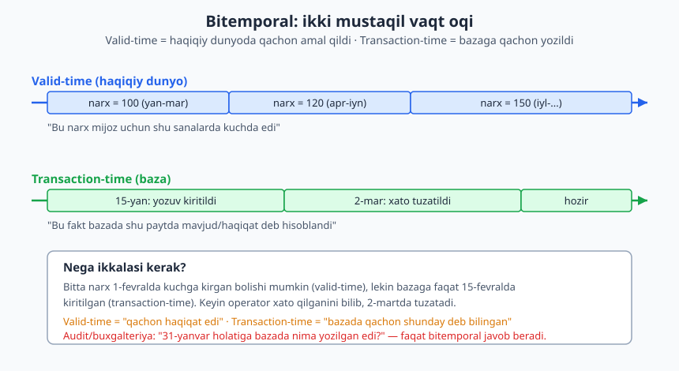
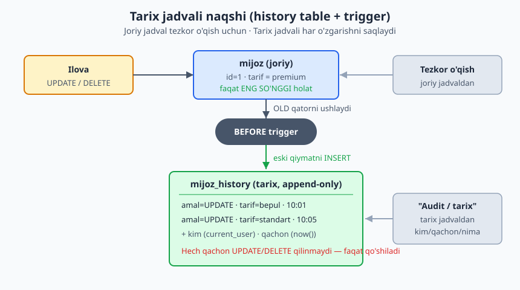
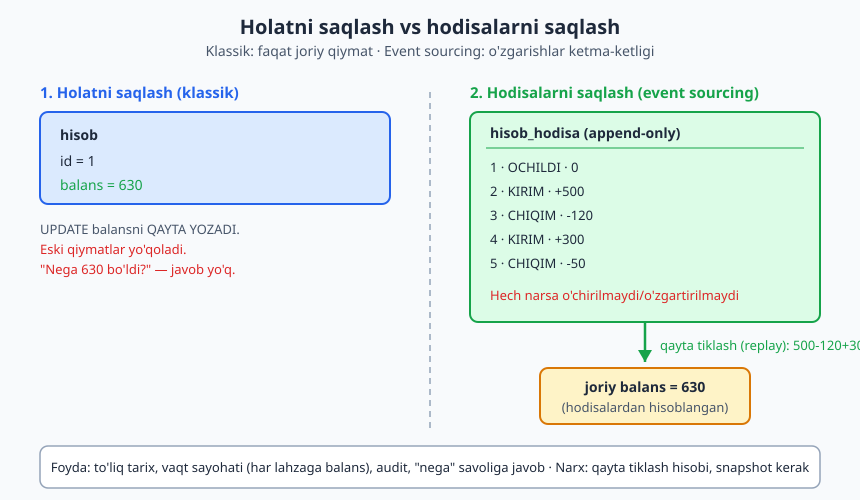

# 18 — Vaqtinchalik va versiyalangan ma'lumot

[⬅️ Oldingi: 17 — Daraxt va graf strukturalarini modellashtirish](./17-daraxt-graf.md) · [🏠 README](./README.md) · [Keyingi: 19 — Multi-tenancy dizayni va RLS ➡️](./19-multi-tenancy.md)

> **Bu bobda:** ko'pchilik sxema faqat "hozir" ni saqlaydi — `UPDATE` eski qiymatni o'chirib tashlaydi, `DELETE` qatorni yo'q qiladi. Lekin real dunyoda savol ko'pincha "kecha narx qancha edi?", "bu mijoz qachon premium bo'ldi?", "31-yanvar holatiga bizning bazada nima yozilgan edi?" bo'ladi. Bu bobda vaqt o'tishi bilan o'zgaruvchi ma'lumotni qanday loyihalashni ko'ramiz: valid-time va transaction-time farqi (bitemporal model), tarix jadvali + trigger naqshi, audit log dizayni (kim/qachon/nima), event sourcing kirishi va "hech narsani o'chirma" (append-only) falsafasi. Oxirida PostgreSQL 18 ning temporal `PRIMARY KEY (... WITHOUT OVERLAPS)` va temporal `FOREIGN KEY (..., PERIOD ...)` imkoniyatlarini — 5434 klasterida haqiqatan ishlatib — ko'rsatamiz.

---

## 0. Bu bob qayerda turadi

[SQL kitobining 19-bobi](../sql/19-tranzaksiyalar.md) tranzaksiya sintaksisini, bu kitobning [12-bobi](./12-dizayn-naqshlari.md) esa `created_at`/`updated_at` kabi oddiy audit ustunlarini va soft delete (`deleted_at`) naqshini ko'rsatdi. Bu bob ulardan **chuqurroq**: faqat "oxirgi o'zgargan vaqt" emas, balki **butun tarixni** — har bir qiymat qachondan qachongacha amal qilganini — modellashtirishni o'rganamiz.

Asosiy savol o'zgaradi. Klassik sxemada savol: *"Bu mahsulot narxi qancha?"* Temporal sxemada savol: *"Bu mahsulot narxi **2026-mart-15 holatiga** qancha edi?"* Ikkinchi savolga javob bermoqchi bo'lsangiz, dizayn ham boshqacha bo'lishi kerak.

> **Asosiy fikr:** `UPDATE` va `DELETE` — ma'lumotni **yo'q qiluvchi** amallar. Tarix kerak bo'lgan joyda biz ularni **qo'shuvchi** (append) amalga aylantiramiz: o'zgartirish o'rniga yangi versiya, o'chirish o'rniga "bekor qilindi" belgisi.

Bu bobda asosiy domen — **SaaS obuna/tarif tizimi** (mijoz tariflari vaqt o'tishi bilan o'zgaradi) va **moliyaviy hisob** (har tranzaksiya hodisa). Ikkalasi ham real hayotda majburan temporal: buxgalteriya hech qachon o'tmishni o'chirmaydi.

---

## 1. Nega "hozir" yetarli emas

Oddiy `mijoz` jadvalini ko'raylik:

```sql
CREATE TABLE mijoz (
    mijoz_id  int PRIMARY KEY,
    ismi      text NOT NULL,
    tarif     text NOT NULL          -- 'bepul' | 'standart' | 'premium'
);
```

Mijoz tarifini o'zgartirsangiz:

```sql
UPDATE mijoz SET tarif = 'premium' WHERE mijoz_id = 1;
```

Bu satr ishlaydi — lekin **eski qiymat butunlay yo'qoldi**. Endi quyidagi savollarga javob berolmaysiz:

- Bu mijoz qachon `standart` dan `premium` ga o'tdi? (Hisob-faktura uchun kerak.)
- Bu mijoz mart oyida qaysi tarifda edi? (Mart hisobotini qayta hisoblash uchun.)
- Tarifni kim o'zgartirdi — mijozning o'zimi, admin'mi? (Audit/xavfsizlik uchun.)

Yomon yechim — bularni ilova kodida log faylga yozish. Lekin log fayl bazadan ajralgan, so'rovga tushmaydi, atomik emas (tranzaksiya rollback bo'lsa log qoladi). **Tarix ham ma'lumot** — uni bazada, sxemaning bir qismi sifatida modellashtirish kerak.

> **Hayotiy o'xshatish:** klassik jadval — doskaga bo'r bilan yozilgan narx. Yangi narx kerak bo'lsa eskisini o'chirib, ustiga yozasiz. Temporal jadval — daftarcha: yangi narxni keyingi qatorga yozasiz, eskisi qoladi. Buxgalter daftarchani tanlaydi, doskani emas.

---

## 2. Ikki xil vaqt: valid-time va transaction-time

Temporal modellashtirishdagi eng muhim — va eng ko'p chalkashtiriladigan — tushuncha shu: ma'lumotda **ikki mustaqil vaqt o'qi** bor.



- **Valid-time (amal qilish vaqti):** fakt **haqiqiy dunyoda** qachondan qachongacha to'g'ri bo'lgan/bo'ladi. Masalan: "bu mahsulot narxi 1-apreldan 1-iyulgacha 120 so'm".
- **Transaction-time (tranzaksiya vaqti):** fakt **bazaga** qachon yozilgan va qachongacha "joriy haqiqat" deb hisoblangan. Masalan: "biz bu narxni bazaga 28-martda kiritdik".

Bu ikkisi har doim bir xil emas:

- Narx **1-apreldan** kuchga kiradi (valid-time), lekin operator uni **28-martda** oldindan kiritadi (transaction-time) — kelajakdagi valid-time.
- Mijoz aslida **1-fevraldan** premium bo'lgan (valid-time), lekin tizimga faqat **10-fevralda** kiritildi — orqaga qaragan (retroaktiv) yozuv.
- Operator narxni xato kiritdi; **2-aprelda** tuzatdi. Valid-time o'zgarmadi (narx baribir aprelda kuchda), lekin transaction-time bo'yicha bazada "haqiqat" o'zgardi.

### 2.1 Qaysi vaqt o'qi sizga kerak?

| Vaqt turi | Savolga javob beradi | Qachon kerak |
|---|---|---|
| Faqat **valid-time** | "Narx mart oyida qancha edi?" | Ko'p biznes holat: narx tarixi, obuna tarixi, kontrakt davri |
| Faqat **transaction-time** | "Bu yozuv bazaga qachon kirgan/o'zgargan?" | Audit log, "kim/qachon o'zgartirdi" |
| **Bitemporal** (ikkalasi) | "31-yanvar holatiga **bazada** nima yozilgan edi (garchi keyin tuzatilgan bo'lsa ham)?" | Moliya, sug'urta, soliq — qonun talab qiladigan auditlanadigan tarix |

> **Dizayn maslahati:** ko'pchilik tizimga **bitemporal** kerak emas — u murakkab va qimmat. Avval o'zingizga "menga retroaktiv tuzatish va 'bazada o'sha paytda nima bilingan' degan savol kerakmi?" deb ayting. Agar yo'q bo'lsa — faqat valid-time (yoki oddiy tarix jadvali) yetarli. Bitemporal — buxgalteriya/sug'urta darajasidagi qattiq talab uchun.

MySQL'da bularning hech biri ichki sintaksis bilan kelmaydi (`SYSTEM VERSIONING` MariaDB'da bor, lekin u faqat transaction-time). PostgreSQL'da esa quyida ko'radigan vositalar (range turlari, temporal kalitlar) valid-time'ni tabiiy ifodalaydi.

---

## 3. Tarix jadvali naqshi (history table + trigger)

Eng keng tarqalgan va eng amaliy naqsh. G'oya:

1. **Joriy jadval** o'zgarmasdan qoladi — tez o'qish uchun faqat eng so'nggi holat.
2. **Tarix jadvali** (`_history` qo'shimchasi bilan) joriy jadvalning ustunlari + audit metama'lumotlarini saqlaydi.
3. **Trigger** har `UPDATE`/`DELETE` da **eski** qatorni (`OLD`) tarix jadvaliga yozadi.



### 3.1 To'liq misol (PostgreSQL 18.4 da tekshirilgan)

```sql
CREATE TABLE mijoz (
    mijoz_id    int PRIMARY KEY,
    ismi        text NOT NULL,
    tarif       text NOT NULL,
    yangilangan timestamptz NOT NULL DEFAULT now()
);

-- Tarix: joriy jadval ustunlari + audit metama'lumotlari
CREATE TABLE mijoz_history (
    history_id   bigint GENERATED ALWAYS AS IDENTITY PRIMARY KEY,
    amal         text NOT NULL,                       -- UPDATE yoki DELETE
    amal_vaqti   timestamptz NOT NULL DEFAULT now(),
    bajardi      text NOT NULL DEFAULT current_user,  -- kim
    mijoz_id     int,
    ismi         text,
    tarif        text,
    yangilangan  timestamptz
);
```

Trigger funksiyasi `OLD` (o'zgartirishdan oldingi) qiymatni yozadi:

```sql
CREATE FUNCTION mijoz_tarix_yoz() RETURNS trigger AS $$
BEGIN
    INSERT INTO mijoz_history (amal, mijoz_id, ismi, tarif, yangilangan)
    VALUES (TG_OP, OLD.mijoz_id, OLD.ismi, OLD.tarif, OLD.yangilangan);
    IF TG_OP = 'DELETE' THEN
        RETURN OLD;
    END IF;
    RETURN NEW;
END;
$$ LANGUAGE plpgsql;

CREATE TRIGGER trg_mijoz_tarix
    BEFORE UPDATE OR DELETE ON mijoz
    FOR EACH ROW EXECUTE FUNCTION mijoz_tarix_yoz();
```

Endi o'zgartirishlar:

```sql
INSERT INTO mijoz (mijoz_id, ismi, tarif) VALUES (1, 'Olim', 'bepul');
UPDATE mijoz SET tarif = 'standart', yangilangan = now() WHERE mijoz_id = 1;
UPDATE mijoz SET tarif = 'premium',  yangilangan = now() WHERE mijoz_id = 1;
```

Joriy jadval faqat eng so'nggi holatni tutadi, tarix esa hammasini:

```sql
SELECT mijoz_id, ismi, tarif FROM mijoz;
SELECT amal, mijoz_id, tarif AS eski_tarif FROM mijoz_history ORDER BY history_id;
```

5434 klasterida haqiqiy chiqish:

```text
 mijoz_id | ismi |  tarif
----------+------+---------
        1 | Olim | premium

  amal  | mijoz_id | eski_tarif
--------+----------+------------
 UPDATE |        1 | bepul
 UPDATE |        1 | standart
```

Diqqat: tarixda **eski** qiymatlar saqlanadi (`bepul`, keyin `standart`), joriy jadvalda esa **yangi** (`premium`). Demak to'liq tasvirni olish uchun joriy jadval + tarixni birga o'qish kerak.

### 3.2 Dizayn qarorlari

| Qaror | Variantlar | Maslahat |
|---|---|---|
| `BEFORE` yoki `AFTER` trigger | ikkalasi ham ishlaydi | `BEFORE` da `OLD` aniq mavjud; ko'pchilik shuni tanlaydi |
| Tarixda `OLD` yoki `NEW` | eski qiymat / yangi qiymat | Eski qiymat + `amal_vaqti` = "shu vaqtgacha shunday edi" mantig'i |
| `amal` ustuni | UPDATE/DELETE (INSERT'ni ham?) | INSERT'ni odatda yozish shart emas — joriy jadval o'zi tutadi |
| Tarix jadval kaliti | surrogate (`history_id`) | Tabiiy kalit emas: bir `mijoz_id` ko'p marta uchraydi |
| Tarixni indekslash | `(mijoz_id, amal_vaqti)` | "Bu mijozning tarixini vaqt bo'yicha" so'rovi uchun |

> **Tuzoq:** trigger funksiyasi tarix jadvali ustunlariga **qattiq bog'langan**. Joriy jadvalga yangi ustun qo'shsangiz, trigger funksiyasini ham, tarix jadvalini ham yangilashni unutmang — aks holda yangi ustun tarixga tushmaydi. 23-bobda (migratsiya) buni esda tutamiz.

### 3.3 Universal versiya: JSONB bilan

Har jadval uchun alohida tarix jadvali yozish zerikarli. Muqobil — **bitta** universal `audit_log` jadvali, qatorni `jsonb` sifatida saqlaydi:

```sql
CREATE TABLE audit_log (
    id      bigint GENERATED ALWAYS AS IDENTITY PRIMARY KEY,
    jadval  text NOT NULL,
    amal    text NOT NULL,
    kim     text NOT NULL DEFAULT current_user,
    qachon  timestamptz NOT NULL DEFAULT now(),
    eski    jsonb,
    yangi   jsonb
);

CREATE FUNCTION audit_yoz() RETURNS trigger AS $$
BEGIN
    INSERT INTO audit_log (jadval, amal, eski, yangi)
    VALUES (TG_TABLE_NAME, TG_OP,
            CASE WHEN TG_OP IN ('UPDATE','DELETE') THEN to_jsonb(OLD) END,
            CASE WHEN TG_OP IN ('UPDATE','INSERT') THEN to_jsonb(NEW) END);
    RETURN COALESCE(NEW, OLD);
END;
$$ LANGUAGE plpgsql;
```

Bitta trigger funksiyasini **istalgan** jadvalga ulash mumkin — `to_jsonb(OLD)`/`to_jsonb(NEW)` qator tuzilishini avtomatik oladi. Bu audit log dizaynining keyingi bo'limdagi asosi.

---

## 4. Audit log dizayni: kim, qachon, nima

Audit log — alohida e'tibor talab qiladigan temporal naqsh. Maqsadi tarixni qayta o'qish emas, balki **mas'uliyat** (accountability): har o'zgarishni kim, qachon, qaysi qiymatdan qaysi qiymatga qilganini qayd etish. Bu xavfsizlik, muvofiqlik (compliance) va incident tekshiruvi uchun.

Yaxshi audit log yozuvi quyidagilarni tutadi:

| Maydon | Misol | Nega |
|---|---|---|
| **kim** | `current_user` yoki ilova `actor_id` | Mas'uliyat |
| **qachon** | `timestamptz` (UTC) | Vaqt chizig'i |
| **nima (jadval/obyekt)** | `TG_TABLE_NAME`, qator PK | Nima o'zgardi |
| **amal** | INSERT/UPDATE/DELETE | O'zgarish turi |
| **eski -> yangi** | `jsonb` diff yoki ikki ustun | "120 dan 150 ga" |
| **kontekst** | IP, so'rov ID, sabab | "Nega" — audit uchun oltin |

### 4.1 `current_user` yetarlimi?

Bazadagi `current_user` — bu **baza foydalanuvchisi**, ko'pincha bitta ilova ulanishi (masalan `app_user`). U "qaysi ish foydalanuvchisi" emas. Real ilovada audit uchun **biznes foydalanuvchi ID** kerak. Buni triggerga uzatishning toza usuli — sessiya o'zgaruvchisi:

```sql
-- Ilova har so'rov boshida o'rnatadi:
SET LOCAL app.actor_id = '42';

-- Trigger funksiyasida o'qiladi:
-- current_setting('app.actor_id', true)  -> '42' (yoki NULL agar o'rnatilmagan)
```

`SET LOCAL` tranzaksiyaga bog'langan — `COMMIT`/`ROLLBACK` da avtomatik tozalanadi, demak boshqa so'rovga "oqib o'tmaydi". `current_setting(..., true)` ikkinchi argument `true` — o'rnatilmagan bo'lsa xato emas, `NULL` qaytaradi.

### 4.2 Audit log immutabilligi

Audit log faqat **append-only** bo'lsagina ishonchli. Agar kimdir audit yozuvini o'zgartira yoki o'chira olsa — audit ma'nosini yo'qotadi. Buni baza darajasida majburlash:

```sql
-- Audit log ga UPDATE/DELETE ni umuman taqiqlovchi trigger
CREATE FUNCTION audit_himoya() RETURNS trigger AS $$
BEGIN
    RAISE EXCEPTION 'audit_log faqat append-only: % taqiqlangan', TG_OP;
END;
$$ LANGUAGE plpgsql;

CREATE TRIGGER trg_audit_himoya
    BEFORE UPDATE OR DELETE ON audit_log
    FOR EACH ROW EXECUTE FUNCTION audit_himoya();
```

Bundan tashqari `app_user` rolidan `UPDATE`/`DELETE` huquqini umuman olib tashlash (`REVOKE`) — qo'shimcha qatlam. "Baza himoyasi — oxirgi qal'a" ([11-bob](./11-constraint-dizayni.md)).

> **Falsafa:** audit log — tizimning **xotirasi**. Xotirani tahrirlash mumkin bo'lsa, u xotira emas, ertak. Shuning uchun audit log dizaynining birinchi qoidasi — uni o'zgartirib bo'lmasligi.

---

## 5. Event sourcing: holat o'rniga hodisalar

Hozirgacha biz holatni saqladik va tarixni **yon mahsulot** sifatida tutdik. Event sourcing buni teskari aylantiradi: **birlamchi haqiqat — hodisalar oqimi**, joriy holat esa ulardan hisoblanadigan natija.



### 5.1 G'oya

Bank hisobini ko'raylik. Klassik usul — `hisob.balans` ustunini saqlash va har tranzaksiyada `UPDATE balans = balans + summa`. Event sourcing usuli — `balans` ustunini **umuman saqlamaslik**, balki har bir **hodisani** (KIRIM/CHIQIM) append-only jadvalga yozish. Joriy balans — hodisalarni "yig'ish" (replay) natijasi.

```sql
-- Append-only hodisalar jurnali. Hech narsa o'chirilmaydi/o'zgartirilmaydi.
CREATE TABLE hisob_hodisa (
    hodisa_id  bigint GENERATED ALWAYS AS IDENTITY PRIMARY KEY,
    hisob_id   int NOT NULL,
    turi       text NOT NULL CHECK (turi IN ('OCHILDI','KIRIM','CHIQIM')),
    summa      numeric(14,2) NOT NULL DEFAULT 0,
    vaqti      timestamptz NOT NULL DEFAULT now()
);

INSERT INTO hisob_hodisa (hisob_id, turi, summa) VALUES
    (1, 'OCHILDI', 0),
    (1, 'KIRIM',  500),
    (1, 'CHIQIM', 120),
    (1, 'KIRIM',  300),
    (1, 'CHIQIM',  50);
```

Joriy balansni **qayta tiklash** (hodisalarni yig'ish):

```sql
SELECT hisob_id,
       sum(CASE turi WHEN 'KIRIM' THEN summa
                     WHEN 'CHIQIM' THEN -summa
                     ELSE 0 END) AS joriy_balans
FROM hisob_hodisa
WHERE hisob_id = 1
GROUP BY hisob_id;
```

5434 da haqiqiy natija: `joriy_balans = 630.00` (500 - 120 + 300 - 50).

### 5.2 Vaqt sayohati — event sourcing ning super-kuchi

Eng kuchli xususiyat: **istalgan o'tmish lahzasiga holatni qayta tiklash**. "3-hodisadan keyin balans qancha edi?" — shunchaki hodisalarni shu nuqtagacha yig'amiz:

```sql
SELECT sum(CASE turi WHEN 'KIRIM' THEN summa WHEN 'CHIQIM' THEN -summa ELSE 0 END) AS balans_3
FROM hisob_hodisa
WHERE hisob_id = 1 AND hodisa_id <= 3;
```

Natija: `380.00` (500 - 120). Klassik sxemada bu savolga javob **umuman** yo'q edi — eski balans o'chgan. Event sourcing'da har lahza qayta tiklanadi.

### 5.3 Trade-off jadvali

| Jihat | Holatni saqlash (klassik) | Event sourcing |
|---|---|---|
| Joriy holatni o'qish | Tez (`SELECT balans`) | Sekin (har safar yig'ish kerak) |
| To'liq tarix | Yo'q (qo'shimcha tarix kerak) | Bepul (tabiatan bor) |
| Vaqt sayohati | Yo'q | Bepul |
| "Nega bunday bo'ldi?" | Javob yo'q | Har hodisa qayd etilgan |
| Murakkablik | Past | Yuqori (replay, snapshot) |
| Disk hajmi | Kichik | Katta (hamma hodisa saqlanadi) |

Sekin o'qishni hal qilish — **snapshot**: vaqti-vaqti bilan joriy holatni alohida saqlab, replay'ni oxirgi snapshotdan boshlash. Bu klassik va event sourcing'ning gibridi.

> **Qachon event sourcing?** Domen tabiatan hodisaviy bo'lsa: moliya (har tranzaksiya hodisa), buyurtma holati (yaratildi -> to'landi -> jo'natildi -> yetkazildi), inventar harakati, o'yin reytingi. "Nega" savoli muhim va audit qonun talabi bo'lsa — kuchli nomzod. Oddiy CRUD (foydalanuvchi profili) uchun esa ortiqcha murakkablik.

> **Eslatma:** event sourcing — to'liq arxitektura naqshi (CQRS, projection, aggregate bilan). Bu bobda biz uning **ma'lumot modeli** tomonini — append-only jurnal va replay'ni — ko'rsatdik. To'liq amaliyot ilova darajasida quriladi.

---

## 6. "Hech narsani o'chirma" (append-only) falsafasi

Yuqoridagi uchchala naqsh (tarix jadvali, audit log, event sourcing) bir umumiy g'oyaga tayanadi: **ma'lumotni o'chirib/qayta yozib yo'qotma — yangi yozuv qo'sh**.

Bu — soft delete ([12-bob](./12-dizayn-naqshlari.md)) ning kengaytmasi. Soft delete qatorni `deleted_at` bilan "yashiradi"; append-only esa **o'zgartirishni** ham yangi yozuvga aylantiradi.

Falsafaning amaliy ifodalari:

- **`UPDATE` o'rniga** — eski versiyani yopib (valid-time tugatish), yangi versiya qator qo'shish.
- **`DELETE` o'rniga** — `bekor_qilindi`/`yopildi` belgisi yoki "DELETED" hodisasi.
- Haqiqiy `DELETE` faqat **retention** siyosati bo'yicha (masalan GDPR, 7 yildan eski) — biznes mantig'i emas.

Bu yondashuvning narxi — disk va murakkablik. Foydasi — **to'liq auditlanadigan tarix, vaqt sayohati, va "nega" savoliga javob**. Buxgalteriya, sog'liqni saqlash, huquq — bu sohalarda append-only majburiy.

> **Dizayn maslahati:** "hammasini saqla" deb hamma jadvalga qo'llamang — bu disk va murakkablikni keraksiz oshiradi. Avval aniqlang: **qaysi** jadvallar uchun tarix biznes/qonun talabi? Faqat shularni temporal qiling, qolganlari uchun oddiy `updated_at` yetarli.

---

## 7. PostgreSQL 18 temporal kalitlari: WITHOUT OVERLAPS va PERIOD

Valid-time tarixini saqlashda klassik muammo: **bir vaqtda ikki versiya amal qilmasligi** kerak. Masalan, bir mahsulotning 1-apreldan 1-iyulgacha ikki xil narxi bo'lishi — xato (overlap). Ilgari buni `EXCLUDE` constraint bilan qilar edik ([11-bob](./11-constraint-dizayni.md)). PostgreSQL 18 buni **temporal kalitlar** bilan tabiiy ifodalaydi.

### 7.1 Temporal PRIMARY KEY (WITHOUT OVERLAPS) — (PostgreSQL 18+)

Kalitda oddiy ustunlar (`mahsulot_id`) + bitta **range** ustuni (`davr`) qatnashadi. `WITHOUT OVERLAPS` PG'ga shuni aytadi: kalitning oddiy qismi (`mahsulot_id`) bir xil bo'lsa, range qismi (`davr`) **kesishmasligi** kerak.

```sql
CREATE TABLE mahsulot_narx (
    mahsulot_id  int,
    davr         daterange NOT NULL,
    narx         numeric(12,2) NOT NULL CHECK (narx >= 0),
    PRIMARY KEY (mahsulot_id, davr WITHOUT OVERLAPS)
);

-- Ikki ketma-ket (kesishmaydigan) davr — OK
INSERT INTO mahsulot_narx VALUES (1, '[2026-01-01,2026-04-01)', 100.00);
INSERT INTO mahsulot_narx VALUES (1, '[2026-04-01,2026-07-01)', 120.00);
```

Endi **kesishuvchi** davr kiritishga urinamiz — PG uni **rad etadi**:

```sql
INSERT INTO mahsulot_narx VALUES (1, '[2026-03-01,2026-05-01)', 999.00);
```

5434 klasteridagi haqiqiy xato:

```text
ERROR:  conflicting key value violates exclusion constraint "mahsulot_narx_pkey"
DETAIL:  Key (mahsulot_id, davr)=(1, [2026-03-01,2026-05-01)) conflicts with
         existing key (mahsulot_id, davr)=(1, [2026-01-01,2026-04-01)).
```

Mart 1-dan may 1-gacha davr mavjud yanvar-aprel davri bilan kesishadi — shuning uchun baza uni qabul qilmaydi. Demak "bir vaqtda ikki narx" mantiqiy xatosi sxema darajasida oldindan to'siladi.

> **Diqqat — interval yopilishi:** `[2026-01-01,2026-04-01)` — chap yopiq, o'ng ochiq (`[ )`). Ya'ni 1-yanvar kiradi, 1-aprel **kirmaydi**. Shu sababli `[2026-01-01,2026-04-01)` va `[2026-04-01,2026-07-01)` 1-aprelda kesishmaydi — biri tugaganda ikkinchisi boshlanadi, hech bir kun ikki davrga tushmaydi. Bu temporal dizaynda eng ko'p uchraydigan tuzoq: yopiq-yopiq (`[ ]`) ishlatsangiz, chegara kuni ikki davrga tegishli bo'lib qoladi.

### 7.2 Temporal FOREIGN KEY (PERIOD) — (PostgreSQL 18+)

Endi bola jadval. Xodimni bo'limga **davr bilan** tayinlaymiz va bu tayinlash bo'lim **amal qilgan davr ichida** bo'lishini talab qilamiz. Buni temporal `FOREIGN KEY (..., PERIOD davr)` bajaradi:

```sql
CREATE TABLE bolim (
    bolim_id  int,
    davr      daterange NOT NULL,
    nomi      text NOT NULL,
    PRIMARY KEY (bolim_id, davr WITHOUT OVERLAPS)
);

CREATE TABLE xodim_tayinlash (
    xodim_id   int,
    bolim_id   int,
    davr       daterange NOT NULL,
    PRIMARY KEY (xodim_id, davr WITHOUT OVERLAPS),
    FOREIGN KEY (bolim_id, PERIOD davr)
        REFERENCES bolim (bolim_id, PERIOD davr)
);

INSERT INTO bolim VALUES (10, '[2026-01-01,2027-01-01)', 'Sotuv');

-- Bo'lim davri ICHIDAGI tayinlash — OK
INSERT INTO xodim_tayinlash VALUES (1, 10, '[2026-02-01,2026-06-01)');
```

Endi bo'lim davridan **tashqariga chiqadigan** tayinlash — rad etiladi:

```sql
INSERT INTO xodim_tayinlash VALUES (2, 10, '[2026-06-01,2027-06-01)');
```

5434 dagi haqiqiy xato:

```text
ERROR:  insert or update on table "xodim_tayinlash" violates foreign key
        constraint "xodim_tayinlash_bolim_id_davr_fkey"
DETAIL:  Key (bolim_id, davr)=(10, [2026-06-01,2027-06-01)) is not present
         in table "bolim".
```

Tayinlash davri (`2026-06 .. 2027-06`) bo'lim davridan (`2026-01 .. 2027-01`) oshib ketgani uchun — temporal FK uni rad etadi. Oddiy FK "bo'lim bormi?" deb so'raydi; temporal FK "bo'lim **shu butun davrda** bormi?" deb so'raydi.

### 7.3 PG18 temporal vositalarining chegarasi

> **Anti-hallucination eslatmasi:** SQL standartida `UPDATE/DELETE ... FOR PORTION OF davr FROM ... TO ...` (davrning bir qismini o'zgartirish) ham bor. **Lekin PostgreSQL 18.4 da `FOR PORTION OF` HALI YO'Q** — men 5434 da sinab ko'rdim, `syntax error at or near "FOR"` beradi. Shuning uchun bu bobda uni ishlatmaymiz. Davr bir qismini o'zgartirmoqchi bo'lsangiz, hozircha qo'lda qilasiz: eski qatorni yopib (yoki `delete`), bo'lingan ikki yangi qator `INSERT` qilasiz — bularning hammasi bitta tranzaksiyada. `FOR PORTION OF` kelajak PG versiyasida kutilmoqda.

`WITHOUT OVERLAPS` va `PERIOD` FK esa **18.4 da real ishlaydi** (yuqorida ko'rsatildi). Ulardan foydalanganda kodda "(PostgreSQL 18+)" deb belgilang — eski versiyalarda yo'q.

> **MySQL farqi:** MySQL'da temporal `WITHOUT OVERLAPS`/`PERIOD` FK yo'q. MariaDB'da `PERIOD FOR` (SQL:2011 application-time) qisman bor, lekin sintaksis va imkoniyatlar boshqacha. Portativ kerak bo'lsa — bu mantiqni `EXCLUDE` constraint yoki ilova darajasida quring.

---

## 8. SCD bilan bog'lash (21-bobga ko'prik)

Analitik omborlarda (data warehouse) o'lcham jadvallari (dimension) vaqt o'tishi bilan o'zgaradi — masalan mijozning shahri ko'chadi, mahsulot kategoriyasi qayta tartiblanadi. Bu **Slowly Changing Dimension (SCD)** deb ataladi va uning bir necha turi bor (Type 1 — qayta yozish, Type 2 — yangi versiya qator, Type 3 — oldingi qiymat ustuni).

Diqqat bilan qarasangiz, **SCD Type 2 — aynan shu bobdagi valid-time tarix jadvali naqshi**, lekin analitik kontekstda (`amal_qildi_dan`/`amal_qildi_gacha` + `joriy_mi` bayrog'i bilan). Bu yerda OLTP (operatsion) nuqtai nazaridan ko'rdik; [21-bobda](./21-analitik-ombor.md) uni dimensional modellashtirish (star schema) doirasida — analitik nuqtai nazardan — ko'ramiz. Tushuncha bir xil, qo'llanish konteksti boshqa.

---

## 9. Bo'lim xulosasi va dizayn checklisti

Temporal dizaynda qaror qabul qilishda quyidagi savollarni o'zingizga bering:

1. **Menga tarix kerakmi?** Yo'q bo'lsa — oddiy jadval + `updated_at`. To'xtang.
2. **Faqat "kim/qachon o'zgartirdi" kerakmi?** Ha bo'lsa — audit log (JSONB universal trigger).
3. **"O'tmishdagi qiymat qancha edi" kerakmi?** Ha bo'lsa — valid-time tarix jadvali yoki temporal range kalitlar.
4. **"Bazada o'sha paytda nima bilingan edi" (retroaktiv tuzatish) kerakmi?** Ha bo'lsa — bitemporal.
5. **Domen tabiatan hodisaviymi va "nega" muhimmi?** Ha bo'lsa — event sourcing'ni ko'rib chiqing.
6. **Hech narsa o'chmasligi qonun talabimi?** Ha bo'lsa — append-only + immutable audit log.

> **Asosiy fikr:** temporal — kuchli, lekin qimmat. Uni **kerakli minimal darajada** qo'llang. Hamma jadvalni bitemporal qilish — ko'pchilik loyihada xato. Aniq talab bo'lgan joyda esa to'g'ri naqshni tanlash sxemani ishonchli va auditlanadigan qiladi.

---

## Mashqlar

### Oson

1. **Narx tarixi jadvali.** Onlayn-do'kon `mahsulot` jadvalida `narx` ustuni bor. Narx tarixini saqlash uchun valid-time naqshi bilan `mahsulot_narx` jadvalini loyihalang (qaysi ustunlar, qaysi kalit). Hozir narxni qaysi qator ko'rsatishini ham ayting.

2. **Valid-time vs transaction-time.** Quyidagi holatni ikki vaqt o'qi bo'yicha ajrating: "Mijoz 1-fevraldan premium bo'ldi, lekin operator tizimga buni 5-fevralda kiritdi." Qaysi sana valid-time, qaysi transaction-time?

3. **Tarix triggeriga ustun qo'shish.** 3-bo'limdagi `mijoz`/`mijoz_history` ga yangi ustun `mamlakat text` qo'shilsa, tarixning to'g'ri ishlashi uchun nimalarni o'zgartirish kerak? Sanab bering.

4. **Soft delete vs append-only.** `deleted_at` (soft delete) va append-only (har o'zgarish yangi yozuv) farqini bir jumlada tushuntiring. Qaysi biri "o'zgarishlar tarixini" saqlaydi?

### O'rta

5. **Universal audit log.** 4-bo'limdagi JSONB audit log'ni `buyurtma` jadvaliga ulang. Trigger qaysi amallarda ishlashi kerak? `eski->>'holat'` va `yangi->>'holat'` orqali buyurtma holati o'zgarishini ko'rsatadigan so'rov yozing.

6. **Immutable audit.** Audit log'ni o'zgartirib bo'lmasligini ta'minlashning ikki usulini bering (biri trigger, biri huquq darajasida). Nega ikkalasi ham foydali?

7. **Event log dizayni.** Buyurtma hayot sikli uchun event sourcing jurnalini loyihalang: hodisalar `YARATILDI`, `TOLANDI`, `JONATILDI`, `YETKAZILDI`, `BEKOR_QILINDI`. Jadval sxemasini va "joriy holatni aniqlash" so'rovini yozing.

8. **Temporal PK.** Xodim ish haqi tarixi uchun temporal `PRIMARY KEY (... WITHOUT OVERLAPS)` bilan jadval loyihalang. Bir xodimga bir vaqtda ikki ish haqi kiritishga urinilsa nima bo'ladi va nega?

9. **Interval chegarasi.** Nega `daterange` da `[ )` (chap yopiq, o'ng ochiq) ishlatish ketma-ket davrlarda overlap muammosini oldini oladi? `[ ]` (yopiq-yopiq) bilan misol keltirib, muammoni ko'rsating.

### Qiyin

10. **Bitemporal dizayn.** Sug'urta polisi narxi uchun bitemporal jadval loyihalang: polis narxi haqiqiy dunyoda qachondan amal qildi (valid-time) **va** bazaga qachon yozildi/tuzatildi (transaction-time). Retroaktiv tuzatish (operator o'tgan oygi narxni xato kiritgan va keyin tuzatadi) qanday saqlanishini ko'rsating.

11. **Anti-naqshni tuzatish.** Quyidagi sxema "narx tarixini" saqlamoqchi, lekin xato: `CREATE TABLE narx (mahsulot_id int PRIMARY KEY, narx numeric, oxirgi_ozgarish timestamptz)`. Nega bu tarix saqlamaydi? Uni valid-time temporal jadvalga qayta loyihalang.

12. **Event sourcing + snapshot.** 5-bo'limdagi `hisob_hodisa` jurnalida million hodisa bo'lsa, har balans so'rovi sekin bo'ladi. Snapshot mexanizmini loyihalang: `hisob_snapshot` jadvali qanday bo'ladi, balans qanday hisoblanadi (snapshot + undan keyingi hodisalar), snapshot qachon olinadi?

13. **Temporal FK ssenariy.** Bo'lim faqat ma'lum davrda mavjud, xodim faqat shu davr ichida tayinlanishi kerak. Temporal `FOREIGN KEY (..., PERIOD ...)` bilan ikki jadval loyihalang. Keyin "xodimni bo'lim mavjud bo'lmagan davrga tayinlash" urinilsa nima bo'lishini tushuntiring.

14. **Tarix strategiyasini tanlash.** Quyidagi uch tizim uchun qaysi temporal naqshni tanlaysiz va nega: (a) blog post tahrirlash tarixi, (b) bank hisob tranzaksiyalari, (c) "mijozni kim/qachon bloklagan" audit. Har biri uchun bitta jumlada asoslang.

---

## Yechimlar

<details markdown="1">
<summary>Yechim — 1</summary>

Valid-time tarix jadvali:

```sql
CREATE TABLE mahsulot_narx (
    mahsulot_id  int NOT NULL,
    davr         daterange NOT NULL,         -- narx shu davrda amal qiladi
    narx         numeric(12,2) NOT NULL CHECK (narx >= 0),
    PRIMARY KEY (mahsulot_id, davr WITHOUT OVERLAPS)   -- (PostgreSQL 18+)
);
```

- Har qator — bitta narxning amal qilish davri.
- `WITHOUT OVERLAPS` bir mahsulotga bir vaqtda ikki narx bo'lishini to'sadi.
- **Joriy narx** — davri "hozir" ni o'z ichiga olgan qator:

```sql
SELECT narx FROM mahsulot_narx
WHERE mahsulot_id = 1 AND davr @> current_date;
```

`@>` operatori "range qiymatni o'z ichiga oladimi?" deb tekshiradi. Joriy davrning oxiri ochiq (`,)`) bo'lsa — narx hali tugamagan degani.

</details>

<details markdown="1">
<summary>Yechim — 2</summary>

- **Valid-time = 1-fevral.** Bu — fakt haqiqiy dunyoda qachon amal qila boshlagani (mijoz aslida 1-fevraldan premium).
- **Transaction-time = 5-fevral.** Bu — fakt bazaga qachon yozilgani (tizim 5-fevralda bildi).

Bu — **retroaktiv** (orqaga qaragan) yozuv: valid-time transaction-time'dan **oldinroq**. Faqat valid-time saqlovchi jadval mijozni 1-fevraldan premium ko'rsatadi. Bitemporal jadval esa qo'shimcha "biz buni faqat 5-fevralda bildik" faktini ham saqlaydi — shuning uchun "3-fevral holatiga bazada nima yozilgan edi?" degan savolga "hali standart edi" deb javob bera oladi.

</details>

<details markdown="1">
<summary>Yechim — 3</summary>

Uch joyni yangilash kerak (aks holda `mamlakat` tarixga tushmaydi):

1. **`mijoz_history` jadvaliga** `mamlakat text` ustunini qo'shish (`ALTER TABLE mijoz_history ADD COLUMN mamlakat text;`).
2. **Trigger funksiyasidagi** `INSERT` ga `mamlakat` ni qo'shish: `INSERT INTO mijoz_history (..., mamlakat) VALUES (..., OLD.mamlakat);`.
3. (`mijoz` jadvaliga `mamlakat` qo'shish — bu boshlang'ich talab.)

Eng ko'p unutiladigan — 2-qadam. Trigger funksiyasi qator tuzilishiga **qattiq bog'langan**: yangi ustun avtomatik tarixga tushmaydi. JSONB universal audit (`to_jsonb(OLD)`) bu muammodan xoli — u qator tuzilishini avtomatik oladi, shu sababli ustun qo'shilsa trigger o'zgarmaydi.

</details>

<details markdown="1">
<summary>Yechim — 4</summary>

- **Soft delete (`deleted_at`):** qatorni o'chirmaydi, faqat "o'chirilgan" deb **belgilaydi**. Faqat **o'chirish** faktini saqlaydi, oraliq o'zgarishlarni emas.
- **Append-only:** har **o'zgarish** (nafaqat o'chirish) yangi yozuv sifatida qo'shiladi, eskisi qoladi.

**O'zgarishlar tarixini append-only saqlaydi.** Soft delete faqat "mavjud / o'chirilgan" holatini biladi; oradagi tahrirlarni emas. Soft delete — append-only falsafasining eng sodda, qisman ko'rinishi.

</details>

<details markdown="1">
<summary>Yechim — 5</summary>

JSONB audit triggerini buyurtmaga ulash (4.3 dagi funksiyani qayta ishlatamiz):

```sql
CREATE TRIGGER trg_buyurtma_audit
    AFTER INSERT OR UPDATE OR DELETE ON buyurtma
    FOR EACH ROW EXECUTE FUNCTION audit_yoz();
```

- **Uch amalda ham** ishlashi kerak — `INSERT` (yangi buyurtma), `UPDATE` (holat o'zgarishi), `DELETE` (kamdan-kam, lekin auditga muhim).
- Holat o'zgarishlarini ko'rsatadigan so'rov:

```sql
SELECT qachon,
       eski->>'holat'  AS eski_holat,
       yangi->>'holat' AS yangi_holat
FROM audit_log
WHERE jadval = 'buyurtma' AND amal = 'UPDATE'
  AND eski->>'holat' IS DISTINCT FROM yangi->>'holat'
ORDER BY qachon;
```

`IS DISTINCT FROM` — holat haqiqatan o'zgargan qatorlarnigina ko'rsatadi (boshqa ustun o'zgargan, lekin holat o'zgarmagan UPDATE'larni chiqarib tashlaydi). NULL'ni ham to'g'ri solishtiradi.

</details>

<details markdown="1">
<summary>Yechim — 6</summary>

1. **Trigger:** `BEFORE UPDATE OR DELETE ON audit_log` triggeri `RAISE EXCEPTION` qiladi — har qanday tahrir/o'chirishni dasturiy to'sadi (4.2 dagi `audit_himoya()`).
2. **Huquq (privilege):** ilova rolidan yozuvdan keyin o'zgartirish huquqini olib tashlash:

```sql
REVOKE UPDATE, DELETE ON audit_log FROM app_user;
GRANT INSERT, SELECT ON audit_log TO app_user;
```

**Nega ikkalasi ham:** trigger — biznes mantig'i (hatto superuser ham xato bilan tegmasin), `REVOKE` — kirish nazorati (ilova roli umuman urinolmaydi). Ikki qatlam: biri mantiqiy, biri ruxsat darajasida. Mudofaa chuqurligi (defense in depth) — bittasi chetlab o'tilsa, ikkinchisi tutadi.

</details>

<details markdown="1">
<summary>Yechim — 7</summary>

```sql
CREATE TABLE buyurtma_hodisa (
    hodisa_id   bigint GENERATED ALWAYS AS IDENTITY PRIMARY KEY,
    buyurtma_id int NOT NULL,
    turi        text NOT NULL CHECK (turi IN
                ('YARATILDI','TOLANDI','JONATILDI','YETKAZILDI','BEKOR_QILINDI')),
    yuk         jsonb,                 -- hodisaga oid qo'shimcha (summa, manzil...)
    vaqti       timestamptz NOT NULL DEFAULT now()
);
CREATE INDEX ON buyurtma_hodisa (buyurtma_id, hodisa_id);
```

Joriy holat — **oxirgi** hodisa turi:

```sql
SELECT DISTINCT ON (buyurtma_id) buyurtma_id, turi AS joriy_holat, vaqti
FROM buyurtma_hodisa
ORDER BY buyurtma_id, hodisa_id DESC;
```

`DISTINCT ON (buyurtma_id)` har buyurtma uchun birinchi (bu yerda `hodisa_id DESC` tufayli eng oxirgi) qatorni oladi. Bu — event sourcing'da "projection" (holat proyeksiyasi) ning eng sodda ko'rinishi.

</details>

<details markdown="1">
<summary>Yechim — 8</summary>

```sql
CREATE TABLE ish_haqi (
    xodim_id  int,
    davr      daterange NOT NULL,
    summa     numeric(12,2) NOT NULL CHECK (summa > 0),
    PRIMARY KEY (xodim_id, davr WITHOUT OVERLAPS)   -- (PostgreSQL 18+)
);
```

Bir xodimga **kesishuvchi** davrli ikki ish haqi kiritishga urinilsa, PG `conflicting key value violates exclusion constraint` xatosi bilan **rad etadi** (7.1 dagi kabi). Sababi: `WITHOUT OVERLAPS` bir `xodim_id` uchun `davr` qiymatlari kesishmasligini majburlaydi — bir vaqtda ikki ish haqi mantiqan xato, baza buni oldindan to'sadi. Ketma-ket (kesishmaydigan) davrlar esa muammosiz — ish haqi o'zgarishi shunday saqlanadi.

</details>

<details markdown="1">
<summary>Yechim — 9</summary>

`[ )` (chap yopiq, o'ng ochiq) — biri tugagan kun ikkinchisining boshlanish kuni bo'ladi, lekin **hech bir kun ikki davrga tushmaydi**:

- `[2026-01-01, 2026-04-01)` — 1-yanvardan **31-martgacha** (1-aprel KIRMAYDI).
- `[2026-04-01, 2026-07-01)` — 1-apreldan boshlanadi. Kesishuv yo'q.

Agar `[ ]` (yopiq-yopiq) ishlatsangiz:

- `[2026-01-01, 2026-04-01]` — 1-aprel **kiradi**.
- `[2026-04-01, 2026-07-01]` — 1-apreldan boshlanadi.
- 1-aprel **ikkala** davrga tegishli — bu overlap! `WITHOUT OVERLAPS` buni rad etadi yoki narx aniqlanmagan bo'lib qoladi.

Shuning uchun temporal davrlarda deyarli har doim `[ )` ishlatiladi — chegara kuni faqat keyingi davrga tegishli bo'ladi. (PG `daterange` matnli kiritishda standart `[ )` ni qabul qiladi.)

</details>

<details markdown="1">
<summary>Yechim — 10</summary>

Bitemporal sug'urta polisi narxi:

```sql
CREATE TABLE polis_narx_bt (
    polis_id    int NOT NULL,
    valid_davr  daterange NOT NULL,                      -- haqiqiy dunyoda amal qildi
    narx        numeric(12,2) NOT NULL,
    tx_dan      timestamptz NOT NULL DEFAULT now(),      -- bazaga qachon yozildi
    tx_gacha    timestamptz,                             -- qachongacha "haqiqat" edi (NULL=hozir)
    PRIMARY KEY (polis_id, valid_davr WITHOUT OVERLAPS)
);
```

**Retroaktiv tuzatish ssenariysi:** operator yanvar narxini 100 deb xato kiritgan (aslida 120 bo'lishi kerak edi), keyin tuzatadi.

1. Boshlang'ich (xato) yozuv 10-yanvarda kiritiladi:
   `(1, '[2026-01-01,2026-02-01)', 100, tx_dan=2026-01-10, tx_gacha=NULL)`
2. Xatoni 5-fevralda bilamiz. Eski yozuvni **yopamiz** (o'chirmaymiz!):
   `UPDATE ... SET tx_gacha = '2026-02-05' WHERE polis_id=1 AND tx_gacha IS NULL ...`
3. Tuzatilgan yangi yozuv qo'shamiz:
   `(1, '[2026-01-01,2026-02-01)', 120, tx_dan=2026-02-05, tx_gacha=NULL)`

Endi ikki savolga ham javob bor:
- "Yanvar narxi qancha edi?" -> hozirgi haqiqat (`tx_gacha IS NULL`): **120**.
- "3-fevral holatiga bazada nima yozilgan edi?" -> `tx_dan <= '2026-02-03' < tx_gacha` bo'yicha: **100** (xato hali tuzatilmagandi).

Bitemporalning butun mohiyati shu: o'tmishni **o'chirmasdan** tuzatish, ham to'g'ri qiymatni, ham "o'sha paytda nima bilingan"ni saqlash. (Eslatma: `valid_davr` bir xil bo'lgani uchun `WITHOUT OVERLAPS` ikki ochiq yozuvni to'sadi — amalda transaction-time bo'yicha ajratish uchun yopilgan yozuvni alohida indeks bilan boshqaradilar yoki `tx` ni ham kalitga qo'shadilar; bu — to'liq bitemporal dizaynning nozik joyi.)

</details>

<details markdown="1">
<summary>Yechim — 11</summary>

**Nega tarix saqlamaydi:** `mahsulot_id` — PRIMARY KEY, demak har mahsulotga **faqat bitta** qator. `UPDATE narx SET narx=... ` shu yagona qatorni qayta yozadi — eski narx yo'qoladi. `oxirgi_ozgarish` faqat **oxirgi** o'zgargan vaqtni biladi, oldingi qiymatlarni emas. Bu — 12-bobdagi `updated_at`, tarix emas.

Valid-time temporal jadvalga qayta loyihalash:

```sql
CREATE TABLE mahsulot_narx (
    mahsulot_id  int NOT NULL,
    davr         daterange NOT NULL,
    narx         numeric(12,2) NOT NULL CHECK (narx >= 0),
    PRIMARY KEY (mahsulot_id, davr WITHOUT OVERLAPS)   -- (PostgreSQL 18+)
);
```

Endi har narx o'zgarishi — **yangi qator** (eski qator o'z davri bilan qoladi). Joriy narx — `WHERE davr @> current_date`. Narx o'zgarganda: eski qatorning davrini bugun bilan yopib, yangi qator qo'shasiz (bitta tranzaksiyada). Endi "mart narxi qancha edi?" so'rovi ishlaydi.

</details>

<details markdown="1">
<summary>Yechim — 12</summary>

Snapshot + keyingi hodisalar gibridi:

```sql
CREATE TABLE hisob_snapshot (
    hisob_id        int NOT NULL,
    oxirgi_hodisa   bigint NOT NULL,        -- shu hodisa_id GACHA hisoblangan
    balans          numeric(14,2) NOT NULL,
    olingan         timestamptz NOT NULL DEFAULT now(),
    PRIMARY KEY (hisob_id, oxirgi_hodisa)
);
```

Balansni hisoblash = **eng so'nggi snapshot** + undan **keyingi** hodisalar:

```sql
WITH snap AS (
    SELECT balans, oxirgi_hodisa
    FROM hisob_snapshot
    WHERE hisob_id = 1
    ORDER BY oxirgi_hodisa DESC
    LIMIT 1
)
SELECT snap.balans + COALESCE(sum(
         CASE h.turi WHEN 'KIRIM' THEN h.summa
                     WHEN 'CHIQIM' THEN -h.summa ELSE 0 END), 0) AS joriy_balans
FROM snap
LEFT JOIN hisob_hodisa h
       ON h.hisob_id = 1 AND h.hodisa_id > snap.oxirgi_hodisa;
```

Endi million hodisaning hammasini emas, faqat oxirgi snapshotdan keyingilarini (masalan oxirgi 1000 ta) yig'amiz.

**Snapshot qachon olinadi:** har N hodisada (masalan har 1000), yoki davriy (har kecha), yoki o'qish sekinlashganda. Snapshot — keshlangan agregat ([15-bob](./15-performans.md) ruhida), lekin manba hodisalar saqlanib qolgani uchun har doim qayta tiklanadi. Muhim: snapshot **optimizatsiya**, haqiqat manbai emas — uni o'chirib qayta hisoblash mumkin.

</details>

<details markdown="1">
<summary>Yechim — 13</summary>

```sql
CREATE TABLE loyiha (
    loyiha_id  int,
    davr       daterange NOT NULL,
    nomi       text NOT NULL,
    PRIMARY KEY (loyiha_id, davr WITHOUT OVERLAPS)      -- (PostgreSQL 18+)
);

CREATE TABLE topshiriq (
    topshiriq_id int,
    loyiha_id    int,
    davr         daterange NOT NULL,
    PRIMARY KEY (topshiriq_id, davr WITHOUT OVERLAPS),
    FOREIGN KEY (loyiha_id, PERIOD davr)                -- (PostgreSQL 18+)
        REFERENCES loyiha (loyiha_id, PERIOD davr)
);
```

"Topshiriqni loyiha mavjud bo'lmagan davrga tayinlash" urinilsa — temporal FK uni **rad etadi** (`violates foreign key constraint ... is not present`), xuddi 7.2 dagi kabi. Sababi: `PERIOD davr` FK oddiy FK'dan farqli — u "ota qator shu **butun davrda** mavjudmi?" deb tekshiradi, faqat "ota qator bormi?" emas. Topshiriq davri loyiha davridan tashqariga chiqsa, ota "yo'q" hisoblanadi.

</details>

<details markdown="1">
<summary>Yechim — 14</summary>

- **(a) Blog post tahrirlash tarixi -> tarix jadvali (history table + trigger).** Tahrirlar kam-uchli, "qaysi versiya qachon edi" yetarli; murakkab event sourcing ortiqcha. Oddiy `post_history` + trigger.
- **(b) Bank hisob tranzaksiyalari -> event sourcing (append-only hodisalar).** Domen tabiatan hodisaviy, "nega balans bunday" qonun talabi, vaqt sayohati va to'liq audit majburiy. Balans — hodisalardan hisoblanadigan natija.
- **(c) "Kim/qachon bloklagan" audit -> audit log (immutable, JSONB).** Bu yerda kerakli narsa mas'uliyat (kim/qachon), holatni qayta tiklash emas. Universal `audit_log` + append-only himoya yetarli.

Umumiy dars: temporal naqsh tanlash domen **savoliga** bog'liq — "o'tmish qiymati?" (tarix jadvali/temporal), "nega va to'liq oqim?" (event sourcing), "kim mas'ul?" (audit log).

</details>

---

[⬅️ Oldingi: 17 — Daraxt va graf strukturalarini modellashtirish](./17-daraxt-graf.md) · [🏠 README](./README.md) · [Keyingi: 19 — Multi-tenancy dizayni va RLS ➡️](./19-multi-tenancy.md)
