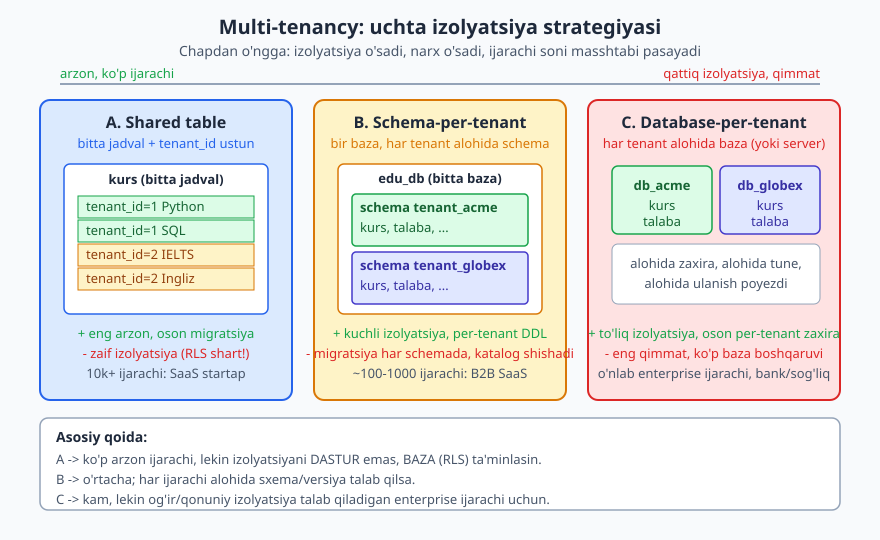
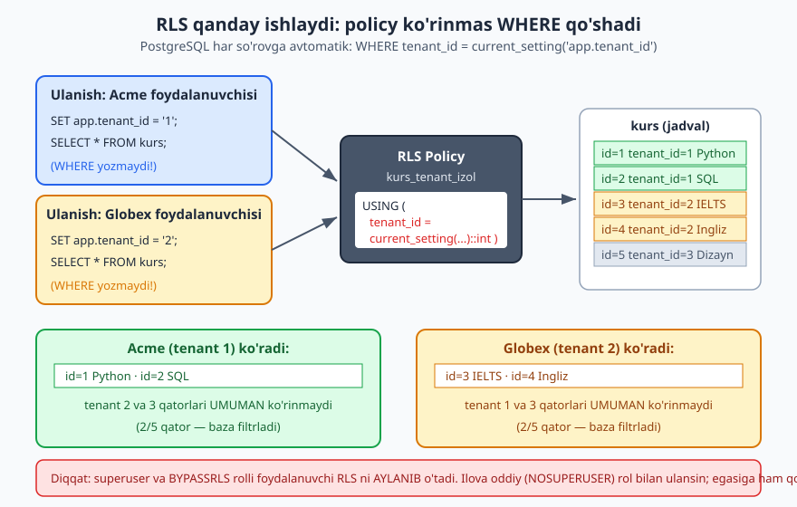
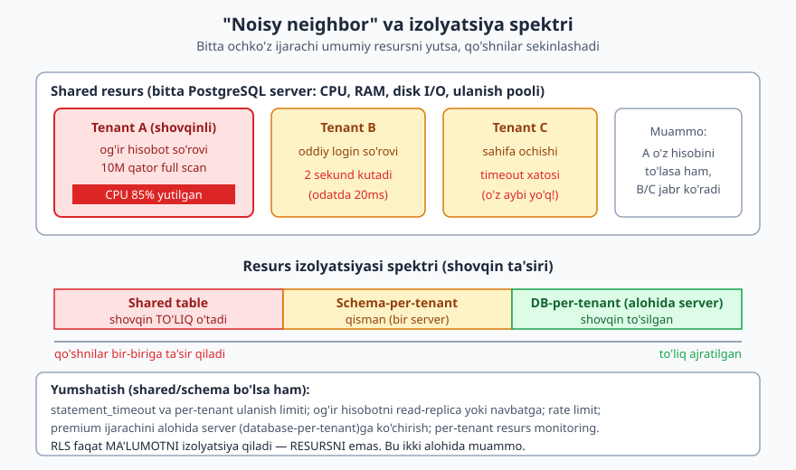

# 19 — Multi-tenancy dizayni va RLS

[⬅️ Oldingi: 18 — Vaqtinchalik va versiyalangan ma'lumot](./18-temporal-versiya.md) · [🏠 README](./README.md) · [Keyingi: 20 — NoSQL ma'lumot modellashtirish ➡️](./20-nosql-modellashtirish.md)

> **Bu bobda:** bitta SaaS mahsulotini yuzlab mijoz (ijarachi) baham ko'rganda — ularning ma'lumotini qanday ajratamiz? Uchta strategiyani (shared table + `tenant_id`, schema-per-tenant, database-per-tenant) izolyatsiya/narx/masshtab/migratsiya/zaxira bo'yicha taqqoslaymiz. Eng arzon strategiyaning eng katta xavfini — dasturchi `WHERE tenant_id` ni unutsa ma'lumot oqib ketishini — ko'ramiz va uni PostgreSQL **Row-Level Security (RLS)** bilan bazada qanday yopishni o'rganamiz. Hamma RLS misoli PostgreSQL 18.4 da alohida (oddiy, NOSUPERUSER) rol bilan haqiqatan ishga tushirilgan: bir ijarachi boshqa ijarachi qatorini umuman ko'rmasligi isbotlangan. So'ngida "noisy neighbor" muammosi va qaysi strategiya qachon mosligini ko'ramiz.

---

## 0. Bu bob qayerda turadi

Bu kitobning oldingi boblarida biz **bitta tashkilot** uchun sxema loyihaladik. Lekin SaaS (Software-as-a-Service) dunyosida bitta dastur **ko'p mijoz**ga xizmat qiladi — `EduCore` deylik, onlayn ta'lim platformasi: Acme o'quv markazi, Globex til kursi, yana yuzlab markaz — hammasi bitta `EduCore` ilovasidan foydalanadi, lekin har biri **faqat o'z ma'lumotini** ko'rishi shart.

Har bir mijoz — bu **ijarachi** (tenant). Ko'p ijarachiga bitta dastur xizmat qilishi — **multi-tenancy**. Bu sof dizayn qarori: ma'lumotni qayerda va qanday ajratish "fizik" sxemangizni, narxingizni, xavfsizligingizni va masshtabingizni belgilaydi. Bu yerda noto'g'ri tanlov keyinroq deyarli tuzatib bo'lmaydigan qarz bo'lib qoladi.

> **Hayotiy o'xshatish.** Multi-tenancy — uy-joy modeli:
> - **Shared table** = bitta katta yotoqxona, hamma bir zalda, lekin har kishining karavoti raqamlangan (`tenant_id`). Arzon, lekin devor yo'q — agar qo'riqchi adashsa, birovning narsasini boshqaga ko'rsatadi.
> - **Schema-per-tenant** = bitta binoda alohida xonalar (har ijarachiga eshikli xona). Yaxshi izolyatsiya, lekin har xonani alohida tozalash kerak.
> - **Database-per-tenant** = har ijarachiga alohida uy (yoki hatto alohida ko'cha). Eng xavfsiz, eng qimmat.

[SQL kitobining 27-bobi](../sql/27-xavfsizlik-admin.md) `GRANT`/`REVOKE` va rol sintaksisini o'rgatadi — buni qayta o'rgatmaymiz. Bu bob esa **izolyatsiyani sxema darajasida qanday loyihalash** haqida.

---

## 1. Uchta strategiya



Bir nechta ijarachining ma'lumotini ajratishning uchta asosiy usuli bor. Ular bir o'q bo'ylab joylashadi: chap tarafda **arzon, lekin zaif izolyatsiya**; o'ng tarafda **qattiq izolyatsiya, lekin qimmat**.

### 1.1 Strategiya A — shared schema / shared table (`tenant_id` ustun)

Hamma ijarachi **bir xil jadval**larda yashaydi. Har jadvalga `tenant_id` ustuni qo'shiladi; har qator qaysi ijarachiga tegishli ekanini shu ustun aytadi.

```sql
CREATE TABLE kurs (
  id        bigint GENERATED ALWAYS AS IDENTITY PRIMARY KEY,
  tenant_id int  NOT NULL,           -- qaysi ijarachi
  nom       text NOT NULL,
  narx      numeric(10,2) NOT NULL
);
```

Har bir so'rovga `WHERE tenant_id = :joriy` qo'shiladi. Bu eng arzon va eng oson masshtablanadigan model — bitta jadval, bitta indeks, 10 mingta ijarachi ham bitta `kurs` jadvalida yashaydi.

> **Asosiy xavf:** izolyatsiya **dasturning** har bir so'roviga bog'liq. Bitta joyda dasturchi `WHERE tenant_id` ni **unutsa** — boshqa ijarachining ma'lumoti oqib ketadi. Bu eng keng tarqalgan SaaS xavfsizlik buzilishi. (Yechimini 3-bo'limda — RLS — ko'ramiz.)

### 1.2 Strategiya B — schema-per-tenant

Bir bazada, lekin har ijarachiga **alohida PostgreSQL schema** (nomlar fazosi). Har schemada bir xil jadval tuzilmasi, lekin ma'lumot ajralgan:

```sql
CREATE SCHEMA tenant_acme;
CREATE SCHEMA tenant_globex;

CREATE TABLE tenant_acme.kurs   (id int PRIMARY KEY, nom text);
CREATE TABLE tenant_globex.kurs (id int PRIMARY KEY, nom text);
```

Ijarachi tanlash `search_path` orqali: `SET search_path = tenant_acme;` — endi `kurs` deganda Acme jadvali tushuniladi. `tenant_id` ustuni umuman kerak emas — ijarachi schema nomida.

> Bu PostgreSQL ning kuchli joyi: u boshqa ko'p bazalardan farqli o'laroq, bitta bazada minglab schema saqlay oladi. Lekin katalog (`pg_class`, `pg_attribute`) shishadi: 1000 ijarachi x 50 jadval = 50 000 jadval yozuvi.

### 1.3 Strategiya C — database-per-tenant

Har ijarachiga **alohida baza** (yoki hatto alohida server). To'liq izolyatsiya: Acme `db_acme` da, Globex `db_globex` da.

```sql
-- Boshqaruv (admin) ulanishida:
CREATE DATABASE db_acme;
CREATE DATABASE db_globex;
-- har bazaga alohida ulanasiz, alohida zaxiralaysiz, alohida tune qilasiz
```

Bu eng qattiq izolyatsiya: bir ijarachining bazasi buzilsa boshqalarga umuman ta'sir qilmaydi; per-tenant zaxira/tiklash arzon; ma'lumotni butun davlatga (data residency) joylashtirish oson. Lekin narxi yuqori: 1000 baza = 1000 ta ulanish poyezdi, 1000 ta migratsiya, 1000 ta monitoring.

### 1.4 Trade-off jadvali

| Mezon | A. Shared table | B. Schema-per-tenant | C. Database-per-tenant |
|---|---|---|---|
| **Ma'lumot izolyatsiyasi** | zaif (dastur/RLS ga bog'liq) | o'rtacha (schema chegarasi) | kuchli (baza chegarasi) |
| **Narx (ijarachi boshiga)** | eng arzon | o'rta | eng qimmat |
| **Masshtab (ijarachi soni)** | 10k+ oson | ~100-1000 | o'nlab-yuzlab |
| **Migratsiya (sxema o'zgarishi)** | bitta `ALTER` hammaga | har schemada takror (skript bilan) | har bazada takror |
| **Per-tenant zaxira/tiklash** | qiyin (qatorlarni ajratish) | o'rta (`pg_dump --schema`) | oson (`pg_dump` butun baza) |
| **Per-tenant moslash (custom ustun)** | qiyin (umumiy jadval) | oson (har schema mustaqil) | eng oson |
| **Noisy neighbor (resurs)** | to'liq ta'sir | qisman (bir server) | ajratilgan (alohida server bo'lsa) |
| **Yangi ijarachi yaratish** | `INSERT` qatordan iborat | `CREATE SCHEMA` + jadvallar | `CREATE DATABASE` + sxema |
| **Cross-tenant analitika** | oson (`GROUP BY tenant_id`) | qiyin (schema bo'ylab `UNION`) | eng qiyin (baza tashqarisi) |

Hech bir strategiya "to'g'ri" emas — bu trade-off. Lekin amaliyotda **ko'p SaaS shared table dan boshlaydi** (eng arzon, eng tez masshtab) va izolyatsiyani **RLS** bilan mustahkamlaydi. Premium yoki katta ijarachilarni keyinroq alohida bazaga ko'chiradi — bu **gibrid** model.

---

## 2. Shared-table dagi asosiy xavf: unutilgan `tenant_id`

Shared-table eng arzon, lekin uning izolyatsiyasi har bir so'rovga `WHERE tenant_id` yozishingizga tayanadi. Yuzlab so'rov ichida bitta yerda buni unutish — ma'lumot oqishi (data leak).

Buni `ch19b` schemada haqiqatan ko'rsataylik. `invoice` jadvalida ikki ijarachining hisob-fakturalari bor:

```sql
CREATE SCHEMA ch19b;
SET search_path = ch19b;
CREATE TABLE invoice (id int PRIMARY KEY, tenant_id int, summa numeric);
INSERT INTO invoice VALUES (1,1,100),(2,1,200),(3,2,999999),(4,2,5);

-- Dasturchi WHERE tenant_id ni UNUTDI (klassik bug):
SELECT * FROM invoice ORDER BY id;
```

PostgreSQL 18 da haqiqiy chiqish:

```
 id | tenant_id | summa
----+-----------+--------
  1 |         1 |    100
  2 |         1 |    200
  3 |         2 | 999999      <- tenant 1 foydalanuvchisi tenant 2 ning maxfiy summasini ko'rdi!
  4 |         2 |      5
```

Tenant 1 ga xizmat ko'rsatayotgan ekran endi tenant 2 ning `999999` hisob-fakturasini ko'rsatdi. Bitta unutilgan `WHERE` — to'liq ma'lumot oqishi. Va bu xato kompilyatsiyada emas, testda emas, faqat ishlab chiqarishda, biror mijoz shikoyat qilganda topiladi.

> **Dizayn xulosasi:** izolyatsiyani **har bir dasturchining har bir so'roviga** ishonib topshirish — xavfli. Yechim: izolyatsiyani **bazaga** — oxirgi qal'aga (11-bobni eslang) — ko'chirish. PostgreSQL da buni **Row-Level Security** qiladi.

---

## 3. PostgreSQL Row-Level Security (RLS)



**Row-Level Security (RLS)** — PostgreSQL ning jadval darajasidagi mexanizmi: u har bir so'rovga **ko'rinmas `WHERE` filtri** qo'shadi. Dasturchi `WHERE tenant_id` yozsa-yozmasa ham, baza avtomatik faqat joriy ijarachining qatorlarini qaytaradi. Izolyatsiya endi dasturda emas — **bazada**.

RLS uch qadamdan iborat:

1. Jadvalga `ENABLE ROW LEVEL SECURITY` — RLS ni yoqish.
2. `CREATE POLICY ... USING (...)` — qaysi qatorlar ko'rinishini belgilash.
3. Har ulanishda joriy ijarachini bildirish: `SET app.tenant_id = '...'`.

`USING` ifodasi `current_setting('app.tenant_id')` orqali joriy ijarachi raqamini o'qiydi. `app.tenant_id` — bu biz o'ylab topgan **maxsus sozlama (custom GUC)**; nuqtali nom (`app.`) shart, aks holda PostgreSQL uni qabul qilmaydi.

### 3.1 RLS ni sozlash (real misol)

`EduCore` `kurs` jadvali — uchta ijarachi, beshta kurs:

```sql
CREATE SCHEMA ch19;
SET search_path = ch19;

CREATE TABLE kurs (
  id        bigint GENERATED ALWAYS AS IDENTITY PRIMARY KEY,
  tenant_id int  NOT NULL,
  nom       text NOT NULL,
  narx      numeric(10,2) NOT NULL
);
INSERT INTO kurs (tenant_id, nom, narx) VALUES
  (1, 'Python asoslari',  490000),
  (1, 'SQL boshlovchi',   390000),
  (2, 'IELTS intensiv',   1200000),
  (2, 'Ingliz A1',        300000),
  (3, 'Grafik dizayn',    700000);

-- 1) RLS ni yoqamiz
ALTER TABLE kurs ENABLE ROW LEVEL SECURITY;

-- 2) Policy: faqat joriy tenant_id ga teng qatorlar ko'rinadi
CREATE POLICY kurs_tenant_izol ON kurs
  USING (tenant_id = current_setting('app.tenant_id')::int);
```

### 3.2 KRITIK: superuser RLS ni aylanib o'tadi

Bu yerda eng ko'p qiluvchi xatoni ochiq aytamiz. Agar siz bazaga **superuser** (`postgres`) yoki `BYPASSRLS` huquqli rol bilan ulansangiz — **RLS umuman qo'llanmaydi**, hamma qator ko'rinadi. Men buni o'z ko'zim bilan tasdiqladim: yuqoridagi policy tayyor bo'lgan holda, `postgres` sifatida `SET app.tenant_id = '1'` qildim va baribir beshala qatorni ko'rdim, hatto boshqa ijarachi qatorini `UPDATE` ham qila oldim.

Demak RLS ni **isbotlash** uchun oddiy (NOSUPERUSER, NOBYPASSRLS) rol kerak. Ilovangiz ham aynan shunday rol bilan ulanishi shart:

```sql
-- Oddiy ilova roli — superuser EMAS, BYPASSRLS EMAS
CREATE ROLE edu_app NOLOGIN NOSUPERUSER NOBYPASSRLS;
GRANT USAGE ON SCHEMA ch19 TO edu_app;
GRANT SELECT, INSERT, UPDATE, DELETE ON kurs TO edu_app;
```

> **Ikkinchi qopqon — jadval EGASI.** Hatto oddiy rol bo'lsa ham, agar u jadval **egasi** bo'lsa, RLS unga qo'llanmaydi (egasi o'z jadvalini to'liq ko'radi). Egasiga ham majburlash uchun: `ALTER TABLE kurs FORCE ROW LEVEL SECURITY;`. Amaliyotda eng toza yondashuv — jadval egasi alohida (migratsiya) rol, ilova esa egadan ajralgan `edu_app` roli bilan ishlasin.

### 3.3 Izolyatsiya isboti (PG18 da haqiqatan)

Endi `edu_app` roliga o'tib, har ijarachi nimani ko'rishini tekshiramiz:

```sql
SET ROLE edu_app;
SELECT current_user, current_setting('is_superuser');   -- edu_app | off

SET app.tenant_id = '1';
SELECT id, tenant_id, nom FROM kurs ORDER BY id;
```

PostgreSQL 18 da haqiqiy chiqish — tenant 1:

```
 id | tenant_id |       nom
----+-----------+-----------------
  1 |         1 | Python asoslari
  2 |         1 | SQL boshlovchi
(2 rows)
```

Faqat 2 qator! Tenant 2 va 3 ning qatorlari **umuman yo'q**. Endi tenant 2:

```sql
SET app.tenant_id = '2';
SELECT id, tenant_id, nom FROM kurs ORDER BY id;
```

```
 id | tenant_id |      nom
----+-----------+----------------
  3 |         2 | IELTS intensiv
  4 |         2 | Ingliz A1
(2 rows)
```

Yana faqat o'z ikki qatori. Eng muhim sinov — tenant 2 boshqa ijarachining qatorini **o'zgartira oladimi**? `id=1` tenant 1 ga tegishli:

```sql
SET app.tenant_id = '2';
UPDATE kurs SET narx = 0 WHERE id = 1;   -- id=1 tenant 1 niki
```

Haqiqiy chiqish:

```
UPDATE 0
```

**Nol qator o'zgardi.** Tenant 2 uchun `id=1` qatori umuman mavjud emas — RLS uni `UPDATE` dan ham yashirdi. Cross-tenant yozish ham to'silgan. `COUNT` ham policyni hisobga oladi:

```sql
SET app.tenant_id = '1';  SELECT count(*) FROM kurs;   -- 2
SET app.tenant_id = '3';  SELECT count(*) FROM kurs;   -- 1
```

```
 count          count
-------         -------
     2  (t1)         1  (t3)
```

Ma'lumot bazaning o'zida izolyatsiyalandi. Endi dasturchi `WHERE tenant_id` ni unutsa ham — oqish bo'lmaydi, chunki PostgreSQL har so'rovga policyni avtomatik qo'shadi.

### 3.4 `USING` va `WITH CHECK`: o'qish va yozish alohida

`USING` ifodasi qaysi qatorlar **ko'rinishini** (SELECT/UPDATE/DELETE da qaysi qatorlar tegiladigan) belgilaydi. Lekin `INSERT` (va `UPDATE` natijasidagi yangi qator) uchun alohida `WITH CHECK` mavjud — u qaysi qator **kiritilishi mumkinligini** tekshiradi.

Muhim nozik nuqta (men 5434 da tekshirdim): agar policyda faqat `USING` bo'lsa, PostgreSQL uni `INSERT`/`UPDATE` ning `WITH CHECK` i sifatida ham **avtomatik ishlatadi**. Demak yuqoridagi `USING`-only policy bilan ham tenant 2 boshqa ijarachi uchun qator kirita olmaydi:

```sql
SET ROLE edu_app;
SET app.tenant_id = '2';
INSERT INTO kurs (tenant_id, nom, narx) VALUES (9, 'Yashirin kurs', 1);
```

Haqiqiy chiqish:

```
ERROR:  new row violates row-level security policy for table "kurs"
```

Yaxshi — INSERT bloklandi. Endi **xato** dizaynni ko'ring: kimdir "INSERT ham tez ishlasin" deb `WITH CHECK (true)` qo'ysa, tekshiruv yo'qoladi:

```sql
-- ❌ ANTI-MISOL: WITH CHECK (true) yozish dirty INSERT ni ochadi
CREATE POLICY kurs_tenant_izol ON kurs
  USING       (tenant_id = current_setting('app.tenant_id')::int)
  WITH CHECK  (true);                          -- hech narsa tekshirmaydi
```

Endi tenant 2 boshqa ijarachi (tenant 9) uchun qator kirita oladi — bu LEAK:

```sql
SET app.tenant_id = '2';
INSERT INTO kurs (tenant_id, nom, narx) VALUES (9, 'Yashirin kurs', 1);   -- INSERT 0 1 (o'tdi!)
```

Bu qator boshqa ijarachiga "begona qator" qoldirdi. To'g'ri yondashuv — yoki faqat `USING` (avtomatik `WITH CHECK` bo'ladi), yoki ikkalasini bir xil ifodaga qo'yish:

```sql
-- ✅ TO'G'RI: o'qish ham, yozish ham bir xil tenant filtriga bo'ysunadi
CREATE POLICY kurs_tenant_izol ON kurs
  USING       (tenant_id = current_setting('app.tenant_id')::int)
  WITH CHECK  (tenant_id = current_setting('app.tenant_id')::int);
```

### 3.5 GUC o'rnatilmasa nima bo'ladi — fail-closed

Agar ilova `SET app.tenant_id` ni umuman bajarmasa-chi? Qat'iy `current_setting('app.tenant_id')` mavjud bo'lmagan sozlamaga **xato** beradi:

```sql
SET ROLE edu_app;     -- app.tenant_id o'rnatilmagan
SELECT count(*) FROM kurs;
```

```
ERROR:  unrecognized configuration parameter "app.tenant_id"
```

Bu aslida **yaxshi** — "fail-closed" (xato bo'lsa hech narsa ko'rsatmaydi) ma'lumot oqishidan ko'ra xavfsiz. Agar siz buni boshqarib, "tenant aniqlanmasa hech qator qaytmasin" desangiz, `current_setting(...)` ning ikkinchi argumenti `true` (missing_ok) bilan yumshoq variant:

```sql
-- tenant o'rnatilmagan bo'lsa xato emas, lekin hech qatorga mos kelmaydigan qiymat
USING (tenant_id = current_setting('app.tenant_id', true)::int)
```

Bu holda GUC bo'sh bo'lsa `current_setting` `NULL` qaytaradi, `tenant_id = NULL` esa hech qachon `TRUE` bo'lmaydi — natijada nol qator. Ya'ni baribir fail-closed, lekin xatosiz.

### 3.6 Ulanish pooli va `SET LOCAL`

`SET app.tenant_id = '1'` — sessiya darajasida ishlaydi va sessiya oxirigacha qoladi. Lekin SaaS lar ko'pincha **ulanish pooli** (PgBouncer) ishlatadi: bir ulanish ketma-ket har xil ijarachiga xizmat qiladi. Agar `SET` sessiyada "yopishib" qolsa, keyingi ijarachi avvalgisining `tenant_id` si bilan ulanib — yana oqish.

Yechim — `SET LOCAL`, u faqat **joriy tranzaksiya** ichida amal qiladi va `COMMIT`/`ROLLBACK` da avtomatik tugaydi:

```sql
SET ROLE edu_app;
BEGIN;
  SET LOCAL app.tenant_id = '1';
  SELECT count(*) FROM kurs;          -- 2 (faqat tenant 1)
COMMIT;
-- tranzaksiyadan tashqarida app.tenant_id yana yo'q -> fail-closed
```

Haqiqiy chiqish: tranzaksiya ichida `count = 2`, tashqarida sozlama qaytadan yo'q. Demak har bir so'rov o'z tranzaksiyasida `SET LOCAL` qiladi, pool ulanishi keyingi ijarachiga "iflos" holatda o'tmaydi. Bu — pool bilan RLS ning to'g'ri birikishi.

---

## 4. Schema-per-tenant amalda

Endi B strategiyasini ko'raylik. Har ijarachiga alohida schema; ijarachi `search_path` bilan tanlanadi.

```sql
CREATE SCHEMA tenant_acme;
CREATE SCHEMA tenant_globex;

CREATE TABLE tenant_acme.kurs   (id int PRIMARY KEY, nom text);
CREATE TABLE tenant_globex.kurs (id int PRIMARY KEY, nom text);
INSERT INTO tenant_acme.kurs   VALUES (1, 'Acme: DevOps');
INSERT INTO tenant_globex.kurs VALUES (1, 'Globex: Marketing');

SET search_path = tenant_acme;
SELECT nom FROM kurs;        -- search_path tenant_acme ni tanladi
```

PG18 da haqiqiy chiqish:

```
     nom
--------------
 Acme: DevOps
(1 row)
```

```sql
SET search_path = tenant_globex;
SELECT nom FROM kurs;
```

```
        nom
-------------------
 Globex: Marketing
(1 row)
```

`kurs` so'zining o'zi o'zgarmadi — faqat `search_path` o'zgardi, va u boshqa ijarachining jadvaliga ishora qildi. Ma'lumot toza ajralgan, `tenant_id` ustuni umuman kerak emas. Nechta ijarachi borligini katalogdan ko'rish mumkin:

```sql
SELECT count(*) FROM information_schema.schemata WHERE schema_name LIKE 'tenant\_%';   -- 2
```

> **Migratsiya og'rig'i.** Yangi ustun qo'shish kerak bo'lsa, shared-table da bitta `ALTER TABLE kurs ADD COLUMN ...` hammaga yetadi. Schema-per-tenant da esa **har bir schema uchun** `ALTER` ni takrorlash kerak — odatda sikl bilan generatsiya qilingan skript orqali. 500 schema = 500 ta `ALTER`, ularning birortasi yarmida uzilsa — yarim ijarachi yangi sxemada, yarmi eskisida. Bu strategiyani tanlasangiz, migratsiya avtomatlashtirilishi shart (23-bobga qarang).

Tozalash:

```sql
DROP SCHEMA tenant_acme   CASCADE;
DROP SCHEMA tenant_globex CASCADE;
```

---

## 5. Migratsiya har strategiyada

Sxema vaqt o'tishi bilan o'zgaradi (23-bob). Multi-tenancy bu o'zgarishni qanchalik og'irlashtirishini ko'rsataylik — "yangi `ustun` qo'shish" oddiy misolida:

| Strategiya | "Yangi ustun qo'shish" | Risk | Yangi ijarachi qo'shish |
|---|---|---|---|
| **A. Shared table** | bitta `ALTER TABLE kurs ADD COLUMN ...` | past (atomik, hammaga bir vaqtda) | `INSERT` (yoki birinchi yozuv) — bir lahza |
| **B. Schema-per-tenant** | har schemada `ALTER` (skript bilan tsikl) | o'rta (yarmida uzilsa — qisman holat) | `CREATE SCHEMA` + barcha jadvallar (shablon `template` schemadan) |
| **C. Database-per-tenant** | har bazada migratsiya (alohida ulanib) | yuqori (ulanishlar, versiya nomuvofiqligi) | `CREATE DATABASE` + butun sxema (eng sekin) |

Diqqat: A da migratsiya oson, lekin katta jadvalga ustun qo'shish hamma ijarachini bir vaqtda qulflashi mumkin (23-bobda xavfsiz `ALTER` ni ko'ramiz). B/C da har ijarachi alohida vaqtda migratsiya qilinishi mumkin — bu **bosqichma-bosqich rollout** uchun afzallik (avval bitta ijarachida sinab ko'rasiz), lekin "versiya tarqoqligi" xavfi bor (ba'zi ijarachi eski sxemada qoladi).

> **Gibrid yondashuv.** Real SaaS ko'pincha A (shared table + RLS) bilan boshlaydi, chunki migratsiyasi eng oson va masshtabi eng katta. Faqat **alohida izolyatsiya/zaxira/data-residency talab qiladigan** premium yoki enterprise ijarachilarni keyinroq C (alohida baza) ga ko'chiradi. Dizayningiz `tenant_id` ni boshidan har joyga qo'ygan bo'lsa, bu ko'chirish ancha oson.

---

## 6. "Noisy neighbor" muammosi



RLS **ma'lumotni** izolyatsiya qiladi — lekin **resursni** emas. Bu ikki butunlay alohida muammo, va ko'p jamoa buni adashtiradi.

Tasavvur qiling: `EduCore` da Tenant A og'ir hisobot so'rovi yuboradi (10 million qatorni `full scan`). U serverning CPU sini 85% ga yutadi. Shu payt Tenant B oddiy login qilmoqchi — odatda 20 ms, lekin endi 2 sekund kutadi. Tenant C sahifasi `timeout` xatosi beradi. **B va C ning aybi yo'q**, lekin ular jabr ko'radi — chunki bitta shovqinli qo'shni umumiy resursni egalladi.

Bu — **noisy neighbor** (shovqinli qo'shni). Izolyatsiya spektri:

- **Shared table:** shovqin to'liq o'tadi — hamma bitta server, bitta jadval, bitta CPU/I/O da.
- **Schema-per-tenant:** qisman — ma'lumot ajralgan, lekin baribir bitta serverning resursini baham ko'radi.
- **Database-per-tenant (alohida serverda):** shovqin to'silgan — A o'z serverida, B/C tegmaydi.

Yumshatish (shared/schema bo'lsa ham qo'llasa bo'ladi):

- **`statement_timeout`** — uzoq so'rovni avtomatik to'xtatish; per-tenant rolga belgilash mumkin.
- **Ulanish va so'rov limiti** — bir ijarachi necha ulanish/so'rovni egallay olishini cheklash (rate limit, `CONNECTION LIMIT`).
- **Og'ir hisobotni read-replica yoki navbatga** ko'chirish — OLTP yo'lini bo'shatadi.
- **Premium ijarachini alohida bazaga** ko'chirish (gibrid C).
- **Per-tenant monitoring** — qaysi ijarachi qancha resurs yeyayotganini kuzatish.

```sql
-- Ijarachi rolga so'rov vaqti chegarasi: 5 sekunddan uzun so'rov o'ladi
ALTER ROLE edu_app SET statement_timeout = '5s';
```

> **Asosiy fikr:** "RLS qo'ydim, multi-tenancy tayyor" — yarim haqiqat. RLS ma'lumot oqishini to'xtatadi, lekin shovqinli qo'shni baribir hammani sekinlashtiradi. To'liq yechim resurs izolyatsiyasini ham talab qiladi.

---

## 7. Qaysi strategiya qachon

| Vaziyat | Tavsiya |
|---|---|
| Erta bosqich startap, ko'p kichik ijarachi, tez masshtab kerak | **A — shared table + RLS** (eng arzon, oson migratsiya) |
| O'rta B2B SaaS, har ijarachi o'z sxemasini/sozlamasini istaydi | **B — schema-per-tenant** |
| O'nlab yirik enterprise mijoz, qonuniy/data-residency izolyatsiya | **C — database-per-tenant** |
| Aralash: ko'p arzon + bir nechta premium VIP | **Gibrid** — A asos, VIP larni C ga ko'chirish |
| Bank/sog'liq — qattiq regulyatsiya | **C** (yoki kamida alohida schema + audit) |

Amaliy maslahat: **A dan boshlang, lekin `tenant_id` ni hamma joyga (har jadvalga, har indeksga, har FK ga) boshidan qo'ying va RLS ni birinchi kundan yoqing.** Buni keyin qo'shish (retrofit) — minglab so'rovni qayta tekshirish degani; boshidan qilish — bir necha `CREATE POLICY`. Kelajakdagi "men"ingizga sovg'a qiling.

> **Yana bir nozik nuqta — indeks.** Shared-table da deyarli har so'rov `WHERE tenant_id = ...` (RLS qo'shadigan) bilan boshlanadi, shuning uchun kompozit indekslarning **birinchi ustuni `tenant_id` bo'lishi** kerak: `CREATE INDEX ON kurs (tenant_id, nom);`. Bu 14-bobning kompozit indeks tartibi qoidasining to'g'ridan-to'g'ri qo'llanilishi — `tenant_id` har so'rovning tengsizlik-bo'lmagan (tenglik) filtri, demak chap tomonda turishi shart.

---

## Mashqlar

### Oson

1. **Strategiya tanlash.** Quyidagi har bir holat uchun A/B/C dan birini tanlang va bir jumlada asoslang: (a) 50 000 ta bepul foydalanuvchili to'g'ridan-to'g'ri iste'molchi (B2C) ilova; (b) 30 ta yirik bank, har biri qattiq audit talab qiladi; (c) 400 ta o'rta biznes, ba'zilari o'z maxsus maydonlarini xohlaydi.
2. **`tenant_id` qo'shish.** Quyidagi jadvalni shared-table multi-tenant qilish uchun o'zgartiring: `CREATE TABLE talaba (id bigint PRIMARY KEY, ism text, email text UNIQUE);`. `tenant_id` ni qaysi joyga qo'shasiz va `email UNIQUE` constraint nima uchun muammo bo'lishi mumkin?
3. **Birinchi RLS policy.** `talaba` jadvali uchun ijarachi izolyatsiyasini ta'minlovchi `ENABLE ROW LEVEL SECURITY` va `CREATE POLICY` ni yozing (`current_setting('app.tenant_id')` bilan).
4. **Superuser qopqoni.** Bir hamkasbingiz "RLS ishlamayapti, hamma qator ko'rinyapti" deydi. U `postgres` foydalanuvchisi bilan ulangan. Muammo nimada va ikkita yechimni ayting.

### O'rta

5. **`email UNIQUE` ni tuzating.** 2-mashqdagi muammoni hal qiling: ikki xil ijarachida bir xil email bo'lishi mumkin bo'lsin, lekin bitta ijarachi ichida takrorlanmasin.
6. **`USING` va `WITH CHECK`.** Bir jamoa `WITH CHECK (true)` qo'ygan. Bu nima xavf tug'diradi? To'g'ri policyni yozing va nima uchun faqat `USING` ham yetarli bo'lishini tushuntiring.
7. **Schema-per-tenant migratsiya rejasi.** Sizda 200 ta `tenant_NNN` schemasi bor, har birida `kurs` jadvali. Hamma `kurs` ga `daraja text` ustunini qo'shish kerak. Buni xavfsiz amalga oshirish rejasini (skriptlash g'oyasi + nima uzilsa nima bo'ladi) tasvirlang.
8. **Pool xavfsizligi.** Ilovangiz PgBouncer ishlatadi va `SET app.tenant_id = '...'` (LOCAL emas) ishlatadi. Qanday oqish (leak) yuzaga keladi va uni qanday tuzatasiz?
9. **Noisy neighbor diagnozi.** Tenant 17 shikoyat qiladi: "tushdan keyin tizim sekin". Sizning ilovangiz A strategiyasida. Qaysi 3 narsani tekshirasiz va sxema/sozlama darajasida qaysi 2 yumshatishni qo'llaysiz?
10. **Fail-closed dizayn.** RLS policyni shunday yozingki, agar `app.tenant_id` umuman o'rnatilmagan bo'lsa, so'rov **xato bermasin**, lekin **hech qator qaytarmasin**. Nima uchun bu "hamma qator" yoki "xato bilan tushib qolish" dan yaxshiroq?

### Qiyin

11. **Izolyatsiya buzilishini toping.** Quyidagi sozlamani ko'ring va ma'lumot oqishi mumkin bo'lgan **ikkita** alohida xatoni toping:
    ```sql
    ALTER TABLE buyurtma ENABLE ROW LEVEL SECURITY;
    CREATE POLICY p ON buyurtma USING (tenant_id = current_setting('app.tenant_id')::int);
    -- ilova ulanish roli:
    CREATE ROLE app_user LOGIN SUPERUSER;
    -- buyurtma jadvali egasi: app_user
    ```
12. **Cross-tenant admin so'rovi.** Platforma egasi (siz) barcha ijarachilar bo'ylab "umumiy daromad" hisobotini olishi kerak. RLS yoqilgan A strategiyada buni qanday qilasiz, lekin oddiy ilova roli baribir cross-tenant ko'rmasligini ta'minlaysiz? (Ikki rol yondashuvi.)
13. **Gibrid migratsiya.** `EduCore` A strategiyada ishlayapti (shared table + RLS). "MegaUniversity" nomli ijarachi juda kattalashdi va o'z alohida bazasini talab qilmoqda. Bu bitta ijarachini A dan C ga ko'chirish rejasini bosqichma-bosqich yozing (ma'lumotni ajratish, ulanishni qayta yo'naltirish, eski qatorlarni o'chirish — qaysi tartibda va nima uchun).
14. **`EduCore` to'liq sxema.** `EduCore` uchun multi-tenant shared-table sxemasini loyihalang: ijarachilar (`tenant`), markazlar foydalanuvchilari (`foydalanuvchi`), kurslar (`kurs`), ro'yxatdan o'tishlar (`royxat` — talaba kursga yozilgan). Har jadvalda `tenant_id`, kerakli `tenant_id` ni o'z ichiga olgan indekslar, har bir jadvalda RLS policy, va `royxat` ning FK lari **bir xil ijarachi** ichida qolishini ta'minlovchi mexanizmni ko'rsating (eslatma: FK o'zi tenant ni tekshirmaydi). Yechimingiz PG18 da ishlashi kerak.

---

## Yechimlar

<details markdown="1">
<summary>Yechim — 1</summary>

- **(a) 50 000 bepul B2C foydalanuvchi → A (shared table + RLS).** Ijarachi soni juda katta, har biri kichik, narx eng muhim. Alohida schema/baza 50 000 marta — boshqarib bo'lmaydi.
- **(b) 30 ta yirik bank, audit → C (database-per-tenant).** Kam ijarachi, lekin har biri qattiq izolyatsiya, alohida zaxira va data-residency talab qiladi. Narx bu yerda muammo emas, izolyatsiya muammo.
- **(c) 400 ta o'rta biznes, maxsus maydon → B (schema-per-tenant).** O'rtacha son, har ijarachi o'z sxemasini biroz moslashtira oladi (alohida schemada qo'shimcha ustun/jadval). C ham mumkin, lekin 400 baza B dan qimmatroq boshqariladi.

</details>

<details markdown="1">
<summary>Yechim — 2</summary>

`tenant_id` ni jadvalga (odatda PK dan keyin) qo'shamiz:

```sql
CREATE TABLE talaba (
  id        bigint GENERATED ALWAYS AS IDENTITY PRIMARY KEY,
  tenant_id int  NOT NULL,
  ism       text NOT NULL,
  email     text NOT NULL
);
```

**`email UNIQUE` muammosi:** global `UNIQUE(email)` ikki xil ijarachi bir xil emaildan foydalana olmasligini bildiradi — bu noto'g'ri. Acme dagi `ali@x.uz` va Globex dagi `ali@x.uz` bir-biriga bog'liq emas, lekin global UNIQUE ulardan birini rad etadi. Bu — ma'lumotning "oqishi" emas, lekin **izolyatsiya buzilishi**: bir ijarachi mavjudligi boshqasiga ta'sir qiladi. (Tuzatishni 5-mashqda ko'ramiz.)

</details>

<details markdown="1">
<summary>Yechim — 3</summary>

```sql
ALTER TABLE talaba ENABLE ROW LEVEL SECURITY;

CREATE POLICY talaba_tenant_izol ON talaba
  USING       (tenant_id = current_setting('app.tenant_id')::int)
  WITH CHECK  (tenant_id = current_setting('app.tenant_id')::int);
```

Eslatma: bu faqat oddiy (NOSUPERUSER, NOBYPASSRLS) rol bilan ishlaydi; `app.tenant_id` har ulanishda (ideal — `SET LOCAL` bilan tranzaksiya ichida) o'rnatilishi kerak.

</details>

<details markdown="1">
<summary>Yechim — 4</summary>

**Muammo:** `postgres` — superuser. Superuser (va `BYPASSRLS` huquqli rol) RLS policylarni **butunlay aylanib o'tadi** — hamma qator ko'rinadi. Men buni 5434 da tasdiqladim: superuser sifatida `SET app.tenant_id='1'` qilinganda ham beshala qator ko'rindi va cross-tenant `UPDATE` ham o'tdi.

**Ikki yechim:**
1. Ilovani **oddiy rol** (`NOSUPERUSER NOBYPASSRLS`) bilan ulang — RLS faqat shunday rollarga qo'llanadi.
2. Agar jadval egasi rolini ham majburlash kerak bo'lsa: `ALTER TABLE kurs FORCE ROW LEVEL SECURITY;` (egasi ham o'z jadvaliga RLS ostida tushadi). Lekin superuserni FORCE ham to'xtatmaydi — superuser baribir bypass qiladi; shuning uchun ilova hech qachon superuser bilan ulanmasin.

</details>

<details markdown="1">
<summary>Yechim — 5</summary>

Global UNIQUE o'rniga **kompozit (tenant ichidagi) UNIQUE**:

```sql
CREATE TABLE talaba (
  id        bigint GENERATED ALWAYS AS IDENTITY PRIMARY KEY,
  tenant_id int  NOT NULL,
  ism       text NOT NULL,
  email     text NOT NULL,
  UNIQUE (tenant_id, email)        -- bir ijarachi ICHIDA noyob
);
```

Endi Acme dagi `ali@x.uz` va Globex dagi `ali@x.uz` baxtli birga yashaydi, lekin Acme ichida ikki marta `ali@x.uz` rad etiladi. Ushbu `(tenant_id, email)` indeks bonus sifatida tenant bo'yicha qidiruvni ham tezlashtiradi.

</details>

<details markdown="1">
<summary>Yechim — 6</summary>

**Xavf:** `WITH CHECK (true)` `INSERT` va `UPDATE` da yangi qatorni **umuman tekshirmaydi**. Demak tenant 2 sifatida ulangan ilova `tenant_id = 9` li qator kirita oladi — boshqa ijarachi maydoniga begona qator "ekib" qo'yadi. Men buni 5434 da tasdiqladim: `WITH CHECK (true)` bilan tenant 2 `(9, ...)` qatorini muvaffaqiyatli kiritdi.

**To'g'ri policy** — `WITH CHECK` ni ham tenant filtriga bog'lash:

```sql
CREATE POLICY kurs_tenant_izol ON kurs
  USING       (tenant_id = current_setting('app.tenant_id')::int)
  WITH CHECK  (tenant_id = current_setting('app.tenant_id')::int);
```

**Nima uchun faqat `USING` ham yetarli:** PostgreSQL da policyda `WITH CHECK` ko'rsatilmasa, u `USING` ifodasini `INSERT`/`UPDATE` uchun `WITH CHECK` sifatida avtomatik qo'llaydi. Demak `USING`-only policy ham begona-tenant INSERT ni bloklaydi (5434 da tasdiqlangan: `ERROR: new row violates row-level security policy`). Xato — aynan `WITH CHECK (true)` deb buni qo'lda "ochib qo'yish".

</details>

<details markdown="1">
<summary>Yechim — 7</summary>

**Reja:**
1. **Avtomatlashtir.** 200 ta schemani `information_schema.schemata` (yoki `pg_namespace`) dan `tenant\_%` bo'yicha tanlab, har biri uchun `ALTER TABLE <schema>.kurs ADD COLUMN daraja text;` ni generatsiya qiluvchi skript (yoki `DO` bloki / `format()` bilan dinamik SQL).
2. **Tranzaksiyaga o'ramang** (ya'ni hammasini bitta ulkan tranzaksiyada qilmang): agar bitta `ALTER` da xato bo'lsa, butun migratsiya orqaga qaytadi va siz qayerda to'xtaganini bilmaysiz. O'rniga har schemani **alohida** (yoki kichik partiyalarda) qiling va **progress jadvaliga** yozib boring (`migratsiya_holati(schema, bajarildi_at)`).
3. **Idempotent qiling:** `ADD COLUMN IF NOT EXISTS daraja text;` — qayta ishga tushganda allaqachon qo'shilganlarni o'tkazib yuboradi.
4. **Nima uzilsa nima bo'ladi:** 100-schemada uzilsa, 1-100 yangi sxemada, 101-200 eskisida qoladi (versiya tarqoqligi). Idempotentlik + progress jadvali bo'lsa, skriptni qayta ishga tushirib qolganini tugatasiz. Ilova kodi **ikkala holatga ham bardosh** bersin (yangi ustun NULL bo'lishi mumkin) — bu expand-contract naqshi (23-bob).

```sql
-- g'oya (admin rolida):
DO $$
DECLARE s text;
BEGIN
  FOR s IN SELECT schema_name FROM information_schema.schemata
           WHERE schema_name LIKE 'tenant\_%'
  LOOP
    EXECUTE format('ALTER TABLE %I.kurs ADD COLUMN IF NOT EXISTS daraja text', s);
  END LOOP;
END $$;
```

</details>

<details markdown="1">
<summary>Yechim — 8</summary>

**Leak:** PgBouncer (ayniqsa `transaction` yoki `statement` pooling rejimida) bitta fizik ulanishni ketma-ket har xil ijarachiga beradi. `SET app.tenant_id = '5'` (LOCAL emas) bu ulanishda **yopishib qoladi**. Keyingi ijarachi (masalan tenant 8) shu ulanishni olganda, agar u o'z `SET` ini qilishdan oldin so'rov yuborsa — yoki ilova hisoblashda adashsa — u tenant 5 ning qatorlarini ko'radi. Sessiya holati ulanishlar orasida "sizib" o'tdi.

**Tuzatish:** har so'rovni tranzaksiyaga o'rab, **`SET LOCAL`** ishlating:

```sql
BEGIN;
  SET LOCAL app.tenant_id = '8';
  -- ... shu tenant uchun so'rovlar ...
COMMIT;   -- app.tenant_id avtomatik tugaydi, ulanish toza qaytadi
```

`SET LOCAL` faqat joriy tranzaksiyada amal qiladi va `COMMIT`/`ROLLBACK` da yo'qoladi, shuning uchun pool ulanishi keyingi ijarachiga iflos holatda o'tmaydi. (Men 5434 da tasdiqladim: `BEGIN; SET LOCAL ...; COMMIT;` dan keyin sozlama qaytadan yo'q — fail-closed.)

</details>

<details markdown="1">
<summary>Yechim — 9</summary>

**Tekshiriladigan 3 narsa:**
1. **Qaysi ijarachi resurs yeyayapti** — `pg_stat_activity` da uzoq ishlayotgan so'rovlar; ularning `app.tenant_id` si (yoki so'rov matni) qaysi ijarachiniki. Ehtimol tenant 17 emas, balki boshqa shovqinli qo'shni aybdor.
2. **Sekin so'rov** — `pg_stat_statements` bilan eng ko'p vaqt yeydigan so'rovlar; indeks yetishmovchiligi (`tenant_id` indeksdami? seq scan bormi — `EXPLAIN`).
3. **Resurs** — CPU/I/O/ulanish soni cho'qqida ekanmi (noisy neighbor alomati).

**2 yumshatish (sxema/sozlama darajasi):**
- `ALTER ROLE edu_app SET statement_timeout = '5s';` — uzoq so'rovni avtomatik to'xtatish.
- Kompozit indeks tartibini tuzatish: `CREATE INDEX ON <jadval> (tenant_id, ...);` — har so'rov `tenant_id` bilan filtrlangani uchun u indeksning birinchi ustuni bo'lishi shart (seq scan ni index scan ga aylantiradi).

(Yana: og'ir hisobotni read-replicaga ko'chirish, premium ijarachini alohida bazaga.)

</details>

<details markdown="1">
<summary>Yechim — 10</summary>

`current_setting` ning ikkinchi argumenti (`missing_ok = true`) GUC yo'q bo'lsa xato o'rniga `NULL` qaytaradi; `tenant_id = NULL` hech qachon `TRUE` emas, demak nol qator:

```sql
CREATE POLICY kurs_tenant_izol ON kurs
  USING       (tenant_id = current_setting('app.tenant_id', true)::int)
  WITH CHECK  (tenant_id = current_setting('app.tenant_id', true)::int);
```

**Nima uchun yaxshiroq:**
- "hamma qator" (RLS o'chiq) — bu ma'lumot oqishi, eng yomon natija.
- "xato bilan tushib qolish" — funksional, lekin har bir tenant aniqlanmagan so'rov ilovani yiqitadi (yomon UX, log shovqini).
- "hech qator" (fail-closed) — xavfsiz **va** barqaror: aniqlanmagan ijarachi shunchaki bo'sh natija oladi, oqish ham yo'q, qulash ham yo'q. (Bu "default deny" xavfsizlik tamoyili.)

</details>

<details markdown="1">
<summary>Yechim — 11</summary>

**Xato 1 — `SUPERUSER` rol.** `CREATE ROLE app_user LOGIN SUPERUSER;` — ilova superuser bilan ulanadi, demak RLS **butunlay aylanib o'tiladi**. Har bir ijarachi hamma qatorni ko'radi. Tuzatish: `app_user` `NOSUPERUSER NOBYPASSRLS` bo'lsin.

**Xato 2 — `app_user` jadval EGASI.** Jadval egasiga RLS standart holda qo'llanmaydi (egasi o'z jadvalini to'liq ko'radi). `app_user` `buyurtma` egasi bo'lgani uchun, hatto superuser bo'lmasa ham, RLS uni filtrlamaydi. Ikki yechim: (a) `ALTER TABLE buyurtma FORCE ROW LEVEL SECURITY;` — egasiga ham majburlash; yoki (b) jadval boshqa (migratsiya) rol egaligida bo'lsin, ilova esa egadan ajralgan `app_user` bilan ulansin (afzal yondashuv).

Ikkala xato birga — bu sxema RLS bor deb o'ylab, aslida hech qanday izolyatsiya bermaydi.

</details>

<details markdown="1">
<summary>Yechim — 12</summary>

**Ikki rol yondashuvi:**

- **Ilova roli `edu_app`** — `NOSUPERUSER NOBYPASSRLS`. RLS unga to'liq qo'llanadi; u hech qachon cross-tenant ko'rmaydi. Kundalik ilova trafigi shu rol bilan.
- **Hisobot/admin roli `edu_reporting`** — `BYPASSRLS` huquqli (lekin superuser EMAS). Bu rol RLS ni aylanib o'tadi va barcha ijarachilar bo'ylab `SELECT tenant_id, sum(summa) ... GROUP BY tenant_id` qila oladi.

```sql
CREATE ROLE edu_reporting NOLOGIN NOSUPERUSER BYPASSRLS;
GRANT USAGE ON SCHEMA ch19 TO edu_reporting;
GRANT SELECT ON ALL TABLES IN SCHEMA ch19 TO edu_reporting;
```

Muhim: faqat **hisobot** (analitika) yo'li `edu_reporting` ga ulanadi, faqat `SELECT` huquqi bilan. Ilovaning oddiy foydalanuvchi so'rovlari hech qachon bu rolga tushmaydi. Shunday qilib cross-tenant ko'rish faqat aniq, cheklangan, faqat-o'qish yo'lida — ilovaning qolgan qismi izolyatsiyada qoladi.

</details>

<details markdown="1">
<summary>Yechim — 13</summary>

**MegaUniversity ni A → C ga ko'chirish (zero-downtime g'oyasi):**

1. **Yangi baza tayyorla.** `CREATE DATABASE db_mega;`, sxemani (jadvallar, indekslar — `tenant_id` siz yoki saqlab) yarat.
2. **Ma'lumotni ko'chir (backfill).** `EduCore` shared jadvallaridan `WHERE tenant_id = <mega>` bo'yicha qatorlarni `db_mega` ga ko'chir (`COPY` yoki `pg_dump --data-only` filtri bilan). Bu davomida eski A baza yozishni davom ettiradi.
3. **Yetib olish (catch-up).** Ko'chirish davomidagi yangi o'zgarishlarni qo'lga kiritish — yo qisqa "muzlatish oynasi" (MegaUniversity uchun yozishni bir necha daqiqaga to'xtatish), yoki o'zgarishlarni log/CDC bilan ikkala bazaga yozish.
4. **Ulanishni qayta yo'naltir.** `EduCore` da MegaUniversity so'rovlarini `db_mega` ga yo'naltir (marshrutlash jadvali: `tenant_id → ulanish`). Endi MegaUniversity yangi bazada.
5. **Tasdiqla.** Bir muddat ikkala manbani kuzat, sonlar mos kelishini tekshir.
6. **Eski qatorlarni o'chir — ENG OXIRIDA.** Faqat MegaUniversity yangi bazada barqaror ishlaganiga ishonganingizdan keyin, A bazadan `DELETE FROM ... WHERE tenant_id = <mega>;`.

**Tartib sababi:** avval nusxala, keyin yo'naltir, **eng oxirida** o'chir — bu rollback imkonini saqlaydi. Agar 4-qadamda muammo chiqsa, hali eski ma'lumot joyida, ortga qaytasiz. Avval o'chirib qo'ysangiz — yo'l yo'q.

</details>

<details markdown="1">
<summary>Yechim — 14</summary>

To'liq multi-tenant shared-table sxema. (Quyidagi blok 5434 da `ch19demo` schemada ishga tushirilib tekshirilgan g'oyaga asoslangan.)

```sql
-- Ijarachilar registri (RLSsiz — platforma boshqaradi)
CREATE TABLE tenant (
  id   int GENERATED ALWAYS AS IDENTITY PRIMARY KEY,
  nom  text NOT NULL,
  reja text NOT NULL DEFAULT 'free'
);

CREATE TABLE foydalanuvchi (
  id        bigint GENERATED ALWAYS AS IDENTITY PRIMARY KEY,
  tenant_id int  NOT NULL REFERENCES tenant(id),
  email     text NOT NULL,
  UNIQUE (tenant_id, email)               -- tenant ichida noyob
);

CREATE TABLE kurs (
  id        bigint GENERATED ALWAYS AS IDENTITY PRIMARY KEY,
  tenant_id int  NOT NULL REFERENCES tenant(id),
  nom       text NOT NULL
);

CREATE TABLE royxat (
  id            bigint GENERATED ALWAYS AS IDENTITY PRIMARY KEY,
  tenant_id     int    NOT NULL REFERENCES tenant(id),
  foydalanuvchi bigint NOT NULL,
  kurs          bigint NOT NULL,
  -- KOMPOZIT FK: tenant ham mos kelishi shart (oddiy FK buni qilmaydi)
  FOREIGN KEY (tenant_id, foydalanuvchi) REFERENCES foydalanuvchi (tenant_id, id),
  FOREIGN KEY (tenant_id, kurs)          REFERENCES kurs          (tenant_id, id),
  UNIQUE (tenant_id, foydalanuvchi, kurs)
);

-- Kompozit FK ishlashi uchun maqsad jadvallarda mos UNIQUE kerak:
ALTER TABLE foydalanuvchi ADD UNIQUE (tenant_id, id);
ALTER TABLE kurs          ADD UNIQUE (tenant_id, id);

-- Indekslar: tenant_id BIRINCHI (RLS har so'rovga tenant filtri qo'shadi)
CREATE INDEX ON foydalanuvchi (tenant_id, email);
CREATE INDEX ON kurs          (tenant_id, nom);
CREATE INDEX ON royxat        (tenant_id, foydalanuvchi);

-- RLS har bir tenant-jadvalda
ALTER TABLE foydalanuvchi ENABLE ROW LEVEL SECURITY;
ALTER TABLE kurs          ENABLE ROW LEVEL SECURITY;
ALTER TABLE royxat        ENABLE ROW LEVEL SECURITY;

CREATE POLICY p ON foydalanuvchi
  USING (tenant_id = current_setting('app.tenant_id')::int)
  WITH CHECK (tenant_id = current_setting('app.tenant_id')::int);
CREATE POLICY p ON kurs
  USING (tenant_id = current_setting('app.tenant_id')::int)
  WITH CHECK (tenant_id = current_setting('app.tenant_id')::int);
CREATE POLICY p ON royxat
  USING (tenant_id = current_setting('app.tenant_id')::int)
  WITH CHECK (tenant_id = current_setting('app.tenant_id')::int);
```

**FK bir xil ijarachida qolishini ta'minlash — eng muhim nozik nuqta.** Oddiy `FOREIGN KEY (foydalanuvchi) REFERENCES foydalanuvchi(id)` tenant ni **tekshirmaydi**: tenant 1 ning `royxat` qatori xato bilan tenant 2 ning foydalanuvchisiga ishora qilishi mumkin. Yechim — **kompozit FK** `(tenant_id, foydalanuvchi)` ni `foydalanuvchi(tenant_id, id)` ga bog'lash. Endi baza ro'yxatga olingan foydalanuvchi va kurs **aynan o'sha `tenant_id`** ga tegishli ekanini majburlaydi — cross-tenant bog'lanish fizik imkonsiz bo'ladi. Bu RLS dan tashqari ikkinchi himoya qatlami.

</details>

---

[⬅️ Oldingi: 18 — Vaqtinchalik va versiyalangan ma'lumot](./18-temporal-versiya.md) · [🏠 README](./README.md) · [Keyingi: 20 — NoSQL ma'lumot modellashtirish ➡️](./20-nosql-modellashtirish.md)
