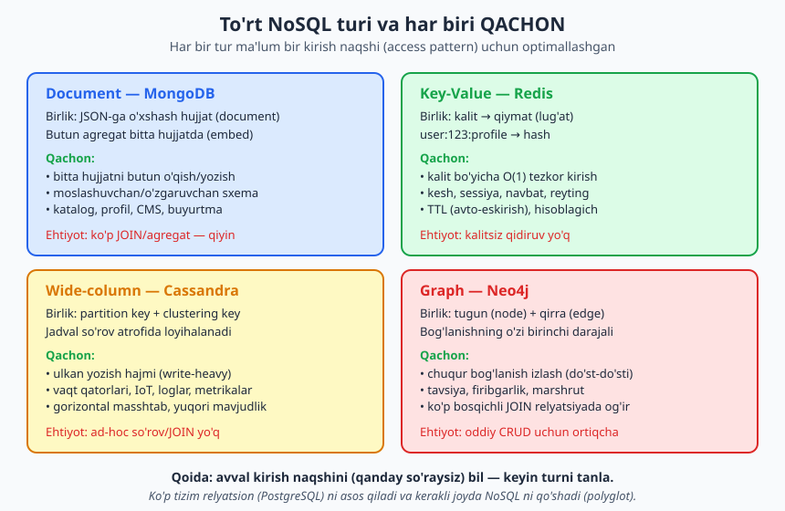
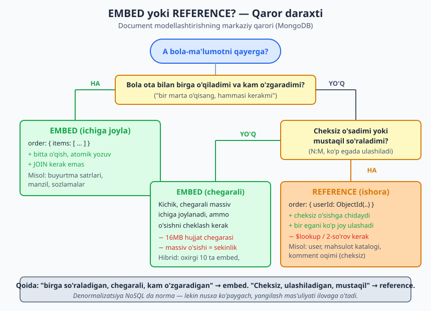
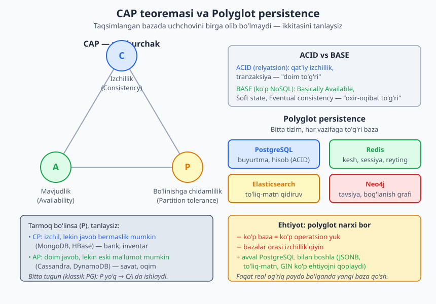

# 20 — NoSQL ma'lumot modellashtirish

[⬅️ Oldingi: 19 — Multi-tenancy dizayni va RLS](./19-multi-tenancy.md) · [🏠 README](./README.md) · [Keyingi: 21 — Analitik dizayn va ma'lumotlar ombori ➡️](./21-analitik-ombor.md)

> **Bu bobda:** shu paytgacha biz relyatsion (PostgreSQL) dunyoda yashadik — normalizatsiya, FK, JOIN. Endi NoSQL ga chiqamiz: document (MongoDB), key-value (Redis), wide-column (Cassandra), graph (Neo4j) — har biri qachon to'g'ri tanlov. Eng muhim aqliy siljish — relyatsion fikrlashdan voz kechib, **kirish naqshi (access pattern) bo'yicha dizayn** qilish: avval qanday so'rashingni bil, keyin modellashtir. Document modellashtirishning yuragi — `embed` va `reference` qarori, denormalizatsiya, 16MB chegarasi, massiv o'sishi muammosi. Redis kalit nomlash va TTL ni, CAP/BASE ni qoplaymiz. Har joyda relyatsion ekvivalent bilan taqqoslaymiz. Redis va PostgreSQL JSONB misollari haqiqatan ishga tushirilgan; MongoDB sintaksisi (shell yo'qligi sababli) illustrativ deb belgilangan.

---

## 0. Bu bob qayerda turadi

[SQL kitobi](../sql/README.md) va shu kitobning hamma boblari relyatsion modelni o'rgatdi. Bu bob butunlay boshqa dunyoga — **NoSQL** ga — kirib chiqadi. Maqsad sizni MongoDB yoki Cassandra mutaxassisi qilish emas (bu alohida kitoblar); maqsad — **dizayn nuqtai nazaridan**:

- NoSQL turlarini ajrata olish va qaysi muammoga qaysi tur mosligini bilish;
- relyatsion odatdan voz kechib, NoSQL uslubida — kirish naqshi bo'yicha — modellashtira olish;
- "Bizga NoSQL kerakmi?" degan savolga halol javob bera olish (ko'pincha javob — "yo'q, PostgreSQL yetadi").

> **NoSQL nima emas:** "No SQL" emas, "**Not only** SQL". U relyatsion bazani o'ldirmaydi — uni **to'ldiradi**. Ko'p hollarda eng to'g'ri arxitektura — PostgreSQL ni asos qilib, kerakli joyga NoSQL qo'shish (`polyglot persistence`, pastda).

---

## 1. NoSQL nega paydo bo'ldi va nima vada qiladi

Relyatsion model 1970-lardan beri hukmron va u ajoyib: yaxlitlik, JOIN, tranzaksiya, deklarativ so'rov. Lekin 2000-lar oxirida ikkita bosim paydo bo'ldi:

1. **Masshtab.** Bir veb-sayt millionlab foydalanuvchiga yetganda, bitta kuchli serverga (vertikal masshtab) sig'maydi. Ko'p arzon serverga **gorizontal** tarqatish kerak. Relyatsion JOIN va tranzaksiya esa ko'p tugunga tarqalganda qiyinlashadi.
2. **Moslashuvchanlik.** Har bir hujjat boshqacha maydonlarga ega bo'lishi mumkin (mahsulot katalogi: kitobning sahifasi bor, futbolkaning o'lchami bor). Qat'iy sxema bunga qarshilik qiladi.

NoSQL bazalar shu ikki bosimga javob sifatida tug'ildi. Lekin ular **bepul kelmaydi** — almashinuv (trade-off) bor:

| Nimani olasiz | Nimani berasiz |
|---|---|
| Gorizontal masshtab, yuqori mavjudlik | Kuchli izchillik (ko'pincha "eventual") |
| Moslashuvchan/sxemasiz | Bazaviy yaxlitlik (FK, CHECK yo'q yoki kuchsiz) |
| Ma'lum naqsh uchun tezlik | Ad-hoc so'rov/JOIN qiyin yoki yo'q |

> **Asosiy fikr:** NoSQL "yaxshiroq baza" emas — u **boshqacha** baza, boshqa trade-off bilan. To'g'ri tanlov — muammoga qarab. Ko'p loyiha NoSQL ni "moda" deb tanlab, keyin JOIN va tranzaksiya yo'qligidan aziyat chekadi.

---

## 2. To'rt NoSQL turi va har biri qachon

NoSQL — bitta narsa emas, balki to'rtta tamoman boshqa oila. Har biri boshqa ma'lumot modelini va boshqa kirish naqshini optimallashtiradi.



### 2.1 Document (hujjat) — MongoDB

Birlik — **hujjat**: JSON ga o'xshash, ichma-ich joylangan struktura. Bog'liq ma'lumot bitta hujjatda **embed** (joylangan) bo'ladi.

- **Qachon:** bitta agregatni (masalan, butun buyurtmani satrlari bilan) bir o'qishda olasiz; sxema moslashuvchan; katalog, foydalanuvchi profili, CMS, buyurtma.
- **Relyatsion ekvivalent:** PostgreSQL `JSONB` ustun (3-bo'limda real misol).

### 2.2 Key-value (kalit-qiymat) — Redis

Birlik — **kalit → qiymat** lug'ati. Eng sodda model, eng tez.

- **Qachon:** kalit bo'yicha O(1) tezkor kirish; kesh, sessiya, navbat, reyting, hisoblagich; `TTL` (avto-eskirish) kerak.
- **Relyatsion ekvivalent:** odatda kesh **qatlami** sifatida PostgreSQL **ustiga** qo'yiladi, uning o'rniga emas.

### 2.3 Wide-column (keng-ustun) — Cassandra

Birlik — `partition key` + `clustering key` bilan tashkillangan qator. Jadval **so'rov atrofida** loyihalanadi (denormalizatsiya majburiy).

- **Qachon:** ulkan yozish hajmi (write-heavy); vaqt qatorlari, IoT, loglar, metrikalar; gorizontal masshtab va yuqori mavjudlik (AP, pastda).
- **Ehtiyot:** ad-hoc so'rov va JOIN yo'q — jadvalni avvaldan kerak bo'ladigan so'rovga moslab tuzasiz.

### 2.4 Graph (graf) — Neo4j

Birlik — **tugun** (node) va **qirra** (edge). Bog'lanishning o'zi birinchi darajali fuqaro.

- **Qachon:** chuqur bog'lanish izlash ("do'stimning do'stining do'sti"); tavsiya tizimi, firibgarlik aniqlash, marshrut; relyatsionda 5-6 darajali JOIN og'irlashganda.
- **Ehtiyot:** oddiy CRUD uchun ortiqcha.

> **Dizayn qoidasi:** turni tanlashdan oldin **kirish naqshini** yoz: "men ma'lumotni qanday so'rayman?" Agar javob "kalit bo'yicha bitta narsa" bo'lsa — key-value. "Butun agregatni birga" — document. "Chuqur bog'lanish bo'ylab yurish" — graph. "Ulkan yozish, oddiy so'rov" — wide-column. "Murakkab ad-hoc so'rov, yaxlitlik" — relyatsion (PostgreSQL).

---

## 3. Relyatsion fikrlashdan voz kechish: access-pattern bo'yicha dizayn

Bu bobning eng muhim aqliy siljishi. Relyatsion dunyoda dizayn tartibi shunday:

```
1. Ma'lumotni normallashtir (anomaliyani yo'qot).
2. Jadvallarni tuz, FK bilan bog'la.
3. Keyin har qanday so'rovni JOIN bilan yoz.
```

Relyatsionda model **ma'lumot tuzilishi** atrofida quriladi, so'rov esa keyin keladi — JOIN istalgan savolga javob beradi.

NoSQL da bu **teskari**:

```
1. Avval KIRISH NAQSHLARINI yoz: aniq qaysi so'rovlar bo'ladi?
   ("foydalanuvchining oxirgi 20 buyurtmasi", "buyurtma + satrlari ID bo'yicha")
2. Har bir so'rov BITTA o'qishda javob beradigan qilib ma'lumotni JOYLA.
3. Kerak bo'lsa, ma'lumotni TAKRORLA (denormalizatsiya).
```

NoSQL da JOIN yo'q yoki qimmat. Shuning uchun "birga so'raladigan narsa — birga saqlanadi". Bu **denormalizatsiya NoSQL da norma** ekanini anglatadi: bir xil ma'lumot bir necha joyda nusxalanadi, toki har so'rov tez bo'lsin.

> **Hayotiy o'xshatish:** relyatsion baza — kutubxona katalogi: har kitob bir marta, JOIN bilan istalgan tartibda topasiz. NoSQL — restoran menyusi: "nonushta to'plami" da tuxum va non birga chop etilgan, "tushlik to'plami" da yana non bor — non ikki joyda takrorlangan, lekin mijoz bitta sahifada hamma kerakini ko'radi.

### 3.1 Denormalizatsiyaning narxi

Bepul emas: ma'lumot ikki joyda bo'lsa, biri o'zgarganda **ikkalasini ham** yangilash kerak. Relyatsionda buni FK + bitta yangilash hal qiladi; NoSQL da bu **ilova kodining** mas'uliyati. Savol shunday: "bu ma'lumot qancha tez-tez o'zgaradi?" Kam o'zgarsa (masalan, buyurtmadagi mahsulot nomi — buyurtma vaqtidagi snapshot) — denormalizatsiya xavfsiz. Tez o'zgarsa (joriy narx, balans) — reference yaxshiroq.

---

## 4. Document modellashtirish (MongoDB): EMBED vs REFERENCE

> **Eslatma — illustrativ kod:** bu muhitda MongoDB ning `mongod.exe` binari bor, lekin `mongosh`/`mongo` **shell** o'rnatilmagan. Shu sababli quyidagi MongoDB sintaksisi bloklari **illustrativ** (ko'rsatma) — ular MongoDB hujjatlaridagi standart sintaksis, lekin shu yerda ishga tushirib tasdiqlanmagan. Buning o'rniga 3-bo'limdagi g'oyani **PostgreSQL JSONB** da haqiqatan ishga tushiramiz (5-bo'lim) — JSONB document modelining bir xil "embed" mantig'ini namoyish etadi.

Document modellashtirishning markaziy qarori: bola-ma'lumotni ota-hujjat **ichiga joylash** (embed) yoki ota faqat unga **ishora** saqlash (reference)?



### 4.1 EMBED — ichiga joylash

Butun agregat bitta hujjatda. Misol: buyurtma + uning satrlari.

```javascript
// EMBED — buyurtma satrlari hujjat ichida (illustrativ, MongoDB)
db.orders.insertOne({
  _id: ObjectId("..."),
  mijoz: { id: 7, ism: "Oqil", shahar: "Toshkent" },
  holat: "tolangan",
  items: [
    { mahsulot: "Klaviatura", narx: 250000, soni: 1 },
    { mahsulot: "Sichqoncha", narx: 120000, soni: 2 }
  ]
})

// Bitta o'qishda butun buyurtma keladi — JOIN kerak emas:
db.orders.find({ _id: ObjectId("...") })
```

**Embed qachon to'g'ri:**

- bola ota bilan **birga o'qiladi** ("bir marta o'qisang hammasi kerak");
- bola **chegarali** (massiv cheksiz o'smaydi);
- bola **mustaqil so'ralmaydi** (buyurtma satrini buyurtmasiz qidirmaysiz);
- atomik yozuv kerak (butun buyurtma bir operatsiyada saqlanadi).

### 4.2 REFERENCE — ishora

Faqat ID saqlanadi, bola alohida kolleksiyada.

```javascript
// REFERENCE — buyurtma faqat userId ga ishora qiladi (illustrativ, MongoDB)
db.users.insertOne({ _id: 7, ism: "Oqil", shahar: "Toshkent" })
db.orders.insertOne({ _id: ObjectId("..."), userId: 7, holat: "tolangan" })

// O'qish uchun 2-so'rov yoki $lookup (JOIN ga o'xshash) kerak:
db.orders.aggregate([
  { $match: { _id: ObjectId("...") } },
  { $lookup: { from: "users", localField: "userId",
               foreignField: "_id", as: "mijoz" } }
])
```

**Reference qachon to'g'ri:**

- bola **cheksiz o'sadi** (mahsulotning komment oqimi, postning like'lari);
- bola **ko'p egada ulashiladi** (bitta foydalanuvchi ko'p buyurtmada — N:M);
- bola **mustaqil so'raladi** yoki tez-tez **o'zgaradi** (joriy narx — bir joyda turishi kerak).

### 4.3 Qaror jadvali

| Mezon | EMBED | REFERENCE |
|---|---|---|
| Birga o'qiladimi? | Ha → embed | Yo'q → reference |
| Bola cheksiz o'sadimi? | Yo'q → embed | Ha → reference |
| Ko'p egada ulashiladimi? | Yo'q (1:N egalik) → embed | Ha (N:M) → reference |
| Tez-tez mustaqil o'zgaradimi? | Yo'q → embed | Ha → reference |
| O'qish tezligi | Tez (1 so'rov) | Sekinroq (`$lookup`/2-so'rov) |

> **Hibrid (subset) naqsh:** ko'pincha eng yaxshi yechim — ikkovini aralashtirish. Masalan, mahsulot hujjatiga **oxirgi 5 ta** sharhni embed qilib, qolganini alohida kolleksiyada reference saqlash. Sahifa darhol bir o'qishda chiqadi, "barcha sharhlar" tugmasi qo'shimcha so'rov qiladi.

### 4.4 16MB hujjat chegarasi va massiv o'sishi muammosi

MongoDB da bitta hujjat **16MB** dan oshmaydi. Bu cheklov embed qarorini bevosita boshqaradi: agar embed qilingan massiv cheksiz o'ssa (masalan, mashhur postga million like), siz bu chegaraga urilasiz. Undan oldin ham muammo bor: **massiv o'sganda** MongoDB hujjatni qayta-qayta diskda ko'chirishi kerak bo'ladi, bu yozishni sekinlashtiradi va indekslarni qayta yozadi.

> **Qoida:** cheksiz o'sadigan narsani hech qachon embed qilmang. "Bu massiv eng ko'pi bilan nechta element bo'ladi?" deb so'rang. Javob "cheksiz" yoki "minglab" bo'lsa — reference. "O'nlab, qattiq chegarali" bo'lsa — embed.

---

## 5. PostgreSQL JSONB: document modelining relyatsion ekvivalenti (REAL)

MongoDB shell yo'qligi sababli, document modelning **bir xil g'oyasini** PostgreSQL 18.4 (port 5434) da `JSONB` bilan haqiqatan ishga tushiramiz. Bu sizga ko'pincha "alohida document baza" kerak emasligini ham ko'rsatadi — PostgreSQL document va relyatsion modelni bitta bazada birlashtiradi.

> Quyidagi bloklar `ch20` sxemasida haqiqatan bajarildi va natijalar psql chiqishidan ko'chirildi.

### 5.1 EMBED — butun agregat bitta JSONB hujjatda

```sql
CREATE SCHEMA ch20;
SET search_path = ch20;

-- "Document-store" naqshi: bitta hujjat = bitta qator, butun agregat JSONB ichida.
CREATE TABLE buyurtmalar (
  id     bigint GENERATED ALWAYS AS IDENTITY PRIMARY KEY,
  hujjat jsonb NOT NULL
);

-- EMBED: buyurtma + mijoz + satrlar bitta hujjatda (MongoDB embed bilan bir xil g'oya)
INSERT INTO buyurtmalar (hujjat) VALUES
('{
  "mijoz": {"id": 7, "ism": "Oqil", "shahar": "Toshkent"},
  "holat": "tolangan",
  "items": [
    {"mahsulot": "Klaviatura", "narx": 250000, "soni": 1},
    {"mahsulot": "Sichqoncha", "narx": 120000, "soni": 2}
  ]
}'),
('{
  "mijoz": {"id": 9, "ism": "Laylo", "shahar": "Samarqand"},
  "holat": "yangi",
  "items": [ {"mahsulot": "Monitor", "narx": 1800000, "soni": 1} ]
}');
```

### 5.2 Hujjatdan o'qish (`->`, `->>`)

```sql
SELECT id, hujjat->'mijoz'->>'ism' AS mijoz, hujjat->>'holat' AS holat
FROM buyurtmalar ORDER BY id;
```

Haqiqiy natija:

```
 id | mijoz |  holat
----+-------+----------
  1 | Oqil  | tolangan
  2 | Laylo | yangi
(2 rows)
```

`->` JSONB qiymatini qaytaradi, `->>` esa `text` qiymatini. Bu MongoDB ning `find({}, {ism: 1})` proyeksiyasiga o'xshaydi.

### 5.3 Embed qilingan massiv ichini yoyish va agregat

```sql
-- Massiv ichidagi har satrni qatorga yoyamiz:
SELECT b.id,
       it->>'mahsulot' AS mahsulot,
       (it->>'narx')::numeric AS narx,
       (it->>'soni')::int AS soni
FROM buyurtmalar b,
     jsonb_array_elements(b.hujjat->'items') AS it
ORDER BY b.id;
```

Haqiqiy natija:

```
 id |  mahsulot  |  narx   | soni
----+------------+---------+------
  1 | Klaviatura |  250000 |    1
  1 | Sichqoncha |  120000 |    2
  2 | Monitor    | 1800000 |    1
(3 rows)
```

```sql
-- Har hujjatning jami summasi (embed massiv ustida agregat):
SELECT b.id, SUM((it->>'narx')::numeric * (it->>'soni')::int) AS jami
FROM buyurtmalar b, jsonb_array_elements(b.hujjat->'items') AS it
GROUP BY b.id ORDER BY b.id;
```

Haqiqiy natija:

```
 id |  jami
----+---------
  1 |  490000
  2 | 1800000
(2 rows)
```

### 5.4 Containment qidiruv (`@>`) va GIN indeks

```sql
CREATE INDEX idx_buyurtma_gin ON buyurtmalar USING GIN (hujjat);

SELECT id FROM buyurtmalar WHERE hujjat @> '{"holat": "yangi"}';
```

Haqiqiy natija:

```
 id
----
  2
(1 row)
```

`@>` ("o'z ichiga oladi") — JSONB ning kuchli operatori: "hujjat ushbu kalit-qiymatni o'z ichiga oladimi". `GIN` indeks aynan shu turdagi qidiruvni tezlashtiradi.

> **Halol kuzatuv:** bizning jadvalda atigi 2 qator bor, shuning uchun `EXPLAIN` planner GIN indeks o'rniga `Seq Scan` ni tanlaydi — kichik jadvalda ketma-ket o'qish arzonroq. Bu **xato emas**: indeks faqat jadval kattalashganda foyda beradi (14-bobdagi qoida). Real ishlab chiqarishda minglab qator bo'lganda planner GIN indeksga o'tadi.

### 5.5 Hujjatni yangilash (`jsonb_set`)

```sql
UPDATE buyurtmalar
SET hujjat = jsonb_set(hujjat, '{holat}', '"yetkazildi"')
WHERE id = 1;

SELECT id, hujjat->>'holat' AS holat FROM buyurtmalar WHERE id = 1;
```

Haqiqiy natija:

```
 id |   holat
----+------------
  1 | yetkazildi
(1 row)
```

### 5.6 REFERENCE — relyatsion (normallashtirilgan) ekvivalent

O'sha "buyurtma" ni endi reference uslubida — uchta normallashtirilgan jadval bilan — modellashtiramiz:

```sql
CREATE TABLE mijozlar (
  id bigint GENERATED ALWAYS AS IDENTITY PRIMARY KEY,
  ism text NOT NULL, shahar text
);
CREATE TABLE buyurtma_ref (
  id bigint GENERATED ALWAYS AS IDENTITY PRIMARY KEY,
  mijoz_id bigint NOT NULL REFERENCES mijozlar(id),
  holat text NOT NULL
);
CREATE TABLE buyurtma_satr (
  id bigint GENERATED ALWAYS AS IDENTITY PRIMARY KEY,
  buyurtma_id bigint NOT NULL REFERENCES buyurtma_ref(id),
  mahsulot text NOT NULL, narx numeric(12,2) NOT NULL, soni int NOT NULL
);
-- ... ma'lumot kiritilgan ...

-- JOIN bilan o'sha "hujjat" ni qayta yig'amiz:
SELECT m.ism, br.holat, SUM(bs.narx*bs.soni) AS jami
FROM buyurtma_ref br
JOIN mijozlar m      ON m.id = br.mijoz_id
JOIN buyurtma_satr bs ON bs.buyurtma_id = br.id
GROUP BY m.ism, br.holat ORDER BY m.ism;
```

Haqiqiy natija:

```
  ism  |  holat   |    jami
-------+----------+------------
 Laylo | yangi    | 1800000.00
 Oqil  | tolangan |  490000.00
(2 rows)
```

E'tibor bering: **bir xil jami** (490000, 1800000). Farq — modelda, natijada emas:

| | JSONB embed (document) | Normallashtirilgan (reference) |
|---|---|---|
| O'qish | 1 satr, JOIN yo'q | 3 jadval JOIN |
| Yaxlitlik | ilova mas'ul (FK yo'q) | baza majburlaydi (FK) |
| Sxema | moslashuvchan | qat'iy |
| Mahsulot nomi o'zgarsa | har hujjatda alohida yangilash | bir joyda (lookup) |
| Mos vaziyat | snapshot, moslashuvchan agregat | yaxlitlik, ko'p ad-hoc so'rov |

```sql
DROP SCHEMA ch20 CASCADE;  -- tozalash
```

> **Xulosa:** PostgreSQL JSONB sizga "document tanasi" + "relyatsion qovurg'a" ni bitta bazada beradi. Alohida MongoDB ga o'tishdan oldin: PostgreSQL JSONB ehtiyojni qoplamaydimi? Ko'p hollda — qoplaydi.

---

## 6. Key-value modellashtirish (Redis): kalit nomlash, TTL, strukturalar

Redis — eng sodda NoSQL: kalit → qiymat. Lekin "qiymat" oddiy string emas, balki **boy struktura** bo'lishi mumkin: hash, list, set, sorted set. Modellashtirishning kaliti — to'g'ri **kalit nomlash konvensiyasi** va to'g'ri **struktura tanlash**.

> Quyidagi misollar Redis serverida (port 6380) **haqiqatan** ishga tushirildi (`redis-cli`), natijalar chiqishdan ko'chirildi.

### 6.1 Kalit nomlash konvensiyasi

Redis da "jadval" yo'q — faqat tekis kalit fazosi. Tashkilotni **kalit nomi** beradi. Standart konvensiya — ikki nuqta (`:`) bilan ierarxiya:

```
<obyekt-turi>:<id>:<atribut>
```

Misol:

```
user:123:profile       -- 123-foydalanuvchi profili (hash)
user:123:feed          -- uning oqimi (list)
session:abc123         -- sessiya (string + TTL)
post:987:views         -- ko'rishlar hisoblagichi (string/int)
post:987:likes         -- yoqtirganlar (set)
leaderboard            -- global reyting (sorted set)
```

> **Nega muhim:** yaxshi nomlash sizga `KEYS user:123:*` (yoki ishlab chiqarishda `SCAN`) bilan bog'liq kalitlarni topish, mantiqiy guruhlash va xatolarni kamaytirish imkonini beradi. Yomon nomlash (`u123p`, `data1`) — relyatsiondagi "magic ustun nomi" anti-naqshining (13-bob) Redis versiyasi.

### 6.2 String + TTL (sessiya)

```bash
SET session:abc123 "user42" EX 3600   # 3600 soniya = 1 soat TTL
GET session:abc123                      # -> "user42"
TTL session:abc123                      # -> qancha soniya qoldi
```

Haqiqiy natija:

```
OK
user42
3600
```

> **TTL — dizayn vositasi:** Redis kalitga avto-eskirish (`EX`) qo'ya oladi. Sessiya, kesh, bir martalik kod (OTP), rate-limit oynasi — hammasi TTL bilan o'zini avtomatik tozalaydi. Relyatsionda buni `cron` yoki `WHERE expires_at < now()` bilan qo'lda qilasiz.

### 6.3 Hash (profil — maydonli obyekt)

```bash
HSET user:123:profile name "Oqil" city "Toshkent" plan "pro"
HGETALL user:123:profile
HGET user:123:profile plan
```

Haqiqiy natija:

```
3
name
Oqil
city
Toshkent
plan
pro
pro
```

Hash — relyatsion **qatorga** o'xshaydi: maydonlar to'plami bitta kalit ostida. Bitta maydonni o'qish/yozish butun obyektni o'qimasdan mumkin (`HGET`/`HSET`).

### 6.4 String INCR (atomik hisoblagich)

```bash
INCR post:987:views          # -> 1
INCR post:987:views          # -> 2
INCRBY post:987:views 10     # -> 12
```

Haqiqiy natija:

```
1
2
12
```

> Bu Redis ning eng kuchli tomonlaridan biri: `INCR` **atomik** — minglab parallel so'rov bir vaqtda kelsa ham hisob to'g'ri qoladi, qulf kerak emas. Relyatsionda buni `UPDATE ... SET views = views + 1` qiladi, lekin Redis da bu xotirada, juda tez.

### 6.5 List, Set, Sorted Set

```bash
# LIST — tartibli (oqim, navbat). LPUSH boshiga qo'shadi:
LPUSH user:123:feed "post:1" "post:2" "post:3"
LRANGE user:123:feed 0 -1     # -> post:3, post:2, post:1 (oxirgi birinchi)

# SET — takrorsiz to'plam (kim like bosgan):
SADD post:987:likes user:1 user:2 user:2 user:9
SCARD post:987:likes          # -> 3 (user:2 takror hisoblanmaydi)
SISMEMBER post:987:likes user:2  # -> 1 (bor)

# SORTED SET (zset) — ball bo'yicha tartiblangan reyting:
ZADD leaderboard 1500 user:1 2300 user:2 1800 user:9
ZREVRANGE leaderboard 0 -1 WITHSCORES  # eng yuqori balldan
```

Haqiqiy natija (asosiy qatorlar):

```
SCARD post:987:likes      -> 3
SISMEMBER ... user:2      -> 1
ZREVRANGE leaderboard:
  user:2  2300
  user:9  1800
  user:1  1500
```

| Struktura | Relyatsion ekvivalent | Tipik ishlatish |
|---|---|---|
| String / int | bitta ustun qiymati | kesh, sessiya, hisoblagich |
| Hash | jadval qatori | obyekt/profil |
| List | tartibli ustun (`ORDER BY pos`) | oqim, navbat, oxirgi N |
| Set | `DISTINCT` to'plam | teglar, like'lar, a'zolik |
| Sorted set | `ORDER BY ball DESC` | reyting (leaderboard), top-N |

> **Asosiy fikr:** Redis "kalit → string" emas — u tarkibida kichik ma'lumot strukturalarining serveri. To'g'ri struktura tanlash — Redis modellashtirishning yuragi. Reyting kerakmi? Sorted set — `ZADD`/`ZREVRANGE` bir buyruqda hal qiladi; relyatsionda buni har so'rovda `ORDER BY ... LIMIT` qilasiz.

---

## 7. Wide-column (Cassandra) — qisqacha

Wide-column bazada (Cassandra, ScyllaDB) jadval **so'rov atrofida** loyihalanadi. Ikki qismli birlamchi kalit:

- **Partition key** — ma'lumot qaysi tugunda saqlanishini belgilaydi (taqsimot). Bir partition ichidagi hamma ma'lumot birga turadi.
- **Clustering key** — partition ichida qatorlar qanday **tartiblanishini** belgilaydi.

```sql
-- Illustrativ (Cassandra CQL — bu muhitda Cassandra yo'q):
-- "Foydalanuvchining xabarlarini vaqt bo'yicha" so'roviga MOSLAB tuziladi:
CREATE TABLE xabarlar_user_boyicha (
  user_id   uuid,
  vaqt      timestamp,
  xabar     text,
  PRIMARY KEY ((user_id), vaqt)   -- partition=user_id, clustering=vaqt DESC
) WITH CLUSTERING ORDER BY (vaqt DESC);
```

Bu yerda dizayn falsafasi keskin farq qiladi: agar sizga "xabarni ID bo'yicha" ham, "vaqt bo'yicha" ham kerak bo'lsa, Cassandra da **ikki alohida jadval** tuzasiz va ma'lumotni ikkalasiga ham yozasiz (denormalizatsiya majburiy). JOIN yo'q, ad-hoc `WHERE` yo'q. Buning evaziga — ulkan write hajmi va deyarli cheksiz gorizontal masshtab.

> **Qachon:** vaqt qatorlari, IoT sensor oqimi, hodisa loglari, metrikalar — yozish ko'p, so'rov naqshi oldindan ma'lum va sodda. PostgreSQL bunday hajmga (partitioning bilan, 22-bob) bir muddat dosh beradi; haqiqiy "petabayt + ko'p datacenter" miqyosida wide-column kerak bo'ladi.

---

## 8. Graph (Neo4j) — qisqacha

Graf baza ma'lumotni **tugun** (entity) va **qirra** (bog'lanish) sifatida ko'radi. Qirralarning o'zi atributga ega bo'lishi mumkin.

```cypher
// Illustrativ (Neo4j Cypher — bu muhitda Neo4j yo'q):
// "Do'stimning do'sti, lekin men bilan hali do'st emas" (tavsiya):
MATCH (men:User {id: 7})-[:DUST]->(dost)-[:DUST]->(tavsiya)
WHERE NOT (men)-[:DUST]->(tavsiya) AND tavsiya <> men
RETURN tavsiya.ism, count(*) AS umumiy_dostlar
ORDER BY umumiy_dostlar DESC LIMIT 5
```

Relyatsionda bu so'rov chuqurlik oshgani sayin og'irlashadi: "do'stning do'sti" — ikkita self-JOIN; "5 darajagacha" — recursive CTE va katta jadvalda sekin. Graf bazada esa "qirra bo'ylab yurish" tabiiy va doimiy tezlikda.

> **Qachon:** ijtimoiy tarmoq, tavsiya tizimi, firibgarlik aniqlash (g'ayritabiiy bog'lanish naqshlari), bilim grafi, marshrut/logistika. Oddiy 1:N yoki N:M bog'lanish uchun **graf baza ortiqcha** — relyatsion junction jadval (4-bob) yetadi. 17-bobda graf strukturasini relyatsionda (qirralar jadvali, recursive CTE) qanday modellashtirishni ko'rgansiz; graf baza faqat chuqur bog'lanish izlash hukmron bo'lganda kerak.

---

## 9. Polyglot persistence: har ish uchun to'g'ri baza

Real katta tizimlar bitta bazaga tayanmaydi. **Polyglot persistence** — har bir vazifa uchun eng mos bazani ishlatish g'oyasi.



Misol — bitta marketplace:

| Vazifa | Baza | Nega |
|---|---|---|
| Buyurtma, to'lov, hisob | PostgreSQL | ACID, FK, tranzaksiya — pul xato bo'lmasin |
| Kesh, sessiya, reyting, savat | Redis | tezlik, TTL, atomik hisoblagich |
| Mahsulot to'liq-matn qidiruv | Elasticsearch | nisbiy reyting, til tahlili |
| "Bu mahsulotni olganlar shuni ham oldi" | Neo4j / graf | bog'lanish bo'ylab tavsiya |
| Hodisa loglari, analitika | wide-column / ombor | ulkan write, 21-bob |

> **Ehtiyot — polyglot bepul emas:** har qo'shilgan baza — yangi operatsion yuk (zaxira, monitoring, mutaxassis), va bazalar orasidagi izchillikni saqlash qiyin (Redis keshi PostgreSQL bilan moslashmay qolishi mumkin). **Qoida:** bitta yaxshi sozlangan PostgreSQL dan boshlang (u JSONB, to'liq-matn qidiruv, GIN, hatto navbat ham qila oladi). Yangi bazani faqat **real, o'lchangan og'riq** paydo bo'lganda qo'shing — "balki kerak bo'lar" deb emas.

---

## 10. CAP teoremasi va BASE (vs ACID)

NoSQL ni tushunish uchun ikki tushuncha kerak: **CAP** va **BASE**.

### 10.1 CAP teoremasi

Taqsimlangan bazada (ma'lumot bir necha tugunda) uchta xususiyatdan **ikkitasini** olasiz, uchchovini birga emas:

- **C — Consistency (izchillik):** har o'qish eng so'nggi yozuvni qaytaradi (yoki xato).
- **A — Availability (mavjudlik):** har so'rov javob oladi (eng so'nggi bo'lmasa ham).
- **P — Partition tolerance (bo'linishga chidamlilik):** tugunlar orasidagi tarmoq uzilsa ham tizim ishlaydi.

Tarmoq bo'linishi (**P**) real dunyoda muqarrar — kabel uziladi, tugun yiqiladi. Shuning uchun taqsimlangan tizimda haqiqiy tanlov **C** va **A** orasida (P ni tashlab bo'lmaydi):

- **CP** (izchillik + bo'linish): bo'linish bo'lsa, eskirgan javob berishdan ko'ra **javob bermaslik** ni tanlaydi. Misol: MongoDB (sozlamaga ko'ra), HBase. Bank balansi, inventar — eski son xavfli.
- **AP** (mavjudlik + bo'linish): bo'linish bo'lsa, **eskirgan javob** bersa ham ishlashda davom etadi. Misol: Cassandra, DynamoDB. Savat, ijtimoiy oqim — bir oz eskilik tolerantli.

> **Bitta tugundagi PostgreSQL** — taqsimlanmagan, demak P muammosi yo'q; u CA da, qat'iy ACID izchillik bilan ishlaydi. CAP faqat ma'lumot **ko'p tugunga** tarqalganda (replikatsiya/sharding, 22-bob) ahamiyat kasb etadi.

### 10.2 ACID vs BASE

| | ACID (relyatsion) | BASE (ko'p NoSQL) |
|---|---|---|
| Izchillik | Atomicity, Consistency, Isolation, Durability — **doim to'g'ri** | **Eventual** (oxir-oqibat to'g'ri) |
| Falsafa | "har lahzada izchil" | **B**asically **A**vailable, **S**oft state, **E**ventual consistency |
| Narx | masshtab qiyinroq | masshtab oson, lekin "eski o'qish" mumkin |
| Mos | pul, buyurtma, yaxlitlik muhim | feed, like soni, "taxminan to'g'ri yetadi" |

**Eventual consistency** misoli: postga like bossangiz, do'stingiz uni 2 soniyadan keyin ko'rishi mumkin — bu yetarli. Lekin bank o'tkazmasida 2 soniya "eski balans" — qabul qilinmaydi (ACID kerak).

> **Dizayn savoli:** "bu ma'lumot uchun bir necha soniyalik eskilik xavflimi?" Ha → ACID/CP (PostgreSQL). Yo'q → BASE/AP qabul qilinadi, masshtab uchun. Ko'p tizim **ikkalasini** ishlatadi: pul — PostgreSQL (ACID), like soni — Redis/AP.

---

## Mashqlar

Quyidagi masalalar **dizayn** masalalari — kod yozish emas, **qaror** qabul qilish. Har birida sababini ayting.

### Oson

1. **Tur tanlash.** Quyidagi har bir ehtiyojga qaysi NoSQL turi (yoki PostgreSQL) eng mos: (a) foydalanuvchi sessiyasi 30 daqiqa TTL bilan; (b) ijtimoiy tarmoqda "umumiy do'stlar"; (c) IoT sensorlardan soniyasiga 100000 o'lchov; (d) bank hisob-kitobi.
2. **Embed yoki reference (1).** Blog tizimi: `Post` va uning `Comment` lari. Bir postga minglab komment kelishi mumkin. Embed qilasizmi yoki reference? Nega?
3. **Embed yoki reference (2).** Foydalanuvchi va uning `manzili` (uy manzili, bittadan kam, kamdan-kam o'zgaradi). Embed yoki reference?
4. **Kalit nomlash.** Redis da quyidagilar uchun kalit nomlarini taklif qiling: 42-foydalanuvchining profili; 42-foydalanuvchining xarid savati; "kun mahsuloti" global keshi.
5. **TTL.** Quyidagilardan qaysilariga Redis `TTL` mos: (a) parolni tiklash kodi; (b) foydalanuvchi profili; (c) rate-limit "daqiqada 100 so'rov" oynasi; (d) doimiy buyurtma tarixi.
6. **Struktura tanlash.** Redis da "maqolaning yoqtirganlari soni va kim yoqtirgani" ni saqlash uchun qaysi struktura? "Eng ko'p ball to'plagan 10 o'yinchi" uchun-chi?

### O'rta

7. **Access-pattern dizayni.** Taksi ilovasi MongoDB da. Asosiy so'rovlar: "haydovchining bugungi safarlari ro'yxati" va "safar tafsiloti ID bo'yicha". Hujjat(lar)ni qanday modellashtirasiz (embed/reference, qaysi kolleksiya)?
8. **Relyatsion → document o'tkazish.** Quyidagi normallashtirilgan sxemani MongoDB hujjatiga aylantiring va embed/reference qarorini asoslang:
   ```
   mualliflar(id, ism)
   kitoblar(id, sarlavha, muallif_id -> mualliflar)
   sharhlar(id, kitob_id -> kitoblar, matn, ball)
   ```
9. **16MB / massiv o'sishi.** Mashhur Instagram-uslubidagi post uchun "like bosganlar" ni post hujjatiga embed qilish nega xavfli? Buning o'rniga qanday modellashtirasiz?
10. **CAP qarori.** Onlayn-do'kon savati va to'lov jarayoni. Qaysi qism uchun CP (izchillik), qaysi qism uchun AP (mavjudlik) mos? Nega?
11. **Polyglot loyihasi.** Yetkazib berish ilovasi uchun: (a) buyurtma/to'lov; (b) jonli kuryer joylashuvi keshi; (c) "shu yaqindagi restoranlar" qidiruvi. Har biriga baza tanlang va asoslang.
12. **Denormalizatsiya narxi.** Document bazada buyurtma hujjatiga mahsulot **nomi va narxini** nusxalab embed qildingiz. Mahsulot narxi o'zgarsa nima bo'ladi? Bu yerda denormalizatsiya to'g'rimi yoki xato?

### Qiyin

13. **PostgreSQL JSONB vs MongoDB.** Bir CMS loyihasida jamoa "MongoDB ga o'tamiz, chunki bizga moslashuvchan sxema kerak" deydi. Qachon bu to'g'ri qaror, qachon PostgreSQL JSONB yetarli? Aniq mezonlar bilan tahlil qiling.
14. **Hibrid (subset) naqsh.** Mahsulot sahifasida darhol oxirgi 3 sharh ko'rinishi kerak, "barchasi" tugmasi qolganini yuklaydi. MongoDB da bu hibrid embed+reference naqshini qanday loyihalaysiz? Sharh yangilanganda izchillik muammosi qanday yuzaga keladi?
15. **Wide-column dizayni.** Cassandra da chat ilovasi uchun: "suhbatdagi xabarlarni vaqt bo'yicha" va "foydalanuvchi yozgan barcha xabarlarni" so'rovlari kerak. Nega bitta jadval yetmaydi? Partition/clustering kalitlarini tanlang.
16. **Eventual consistency tuzog'i.** Redis da mahsulot omborini (`stock`) keshlaysiz, PostgreSQL haqiqiy manba. Mijoz oxirgi 1 dona mahsulotni Redis keshiga qarab sotib oladi, lekin u allaqachon sotilgan. Bu muammoni dizayn darajasida qanday oldini olasiz?

## Yechimlar

<details markdown="1">
<summary>Yechim — 1</summary>

(a) **Redis** — kalit-qiymat + TTL sessiya uchun ideal (`SET session:... EX 1800`). (b) **Graph (Neo4j)** — "umumiy do'stlar" bog'lanish bo'ylab yurish, graf bazaning klassik kuchli tomoni. (c) **Wide-column (Cassandra)** — ulkan write hajmi, vaqt qatori, sodda so'rov naqshi. (d) **PostgreSQL (relyatsion, ACID)** — pul uchun qat'iy izchillik va tranzaksiya majburiy; bu yerda NoSQL xato bo'lardi.

</details>

<details markdown="1">
<summary>Yechim — 2</summary>

**Reference.** Komment massivi **cheksiz o'sadi** (minglab) — embed qilsangiz 16MB chegarasiga yaqinlashasiz va massiv o'sgani sayin hujjat qayta ko'chiriladi (sekinlik). Kommentlar alohida `comments` kolleksiyasida `postId` reference bilan turishi kerak. Hibrid variant: postga oxirgi 2-3 kommentni embed qilib, qolganini reference (14-mashqqa qarang).

</details>

<details markdown="1">
<summary>Yechim — 3</summary>

**Embed.** Manzil: (1) doim foydalanuvchi bilan birga o'qiladi; (2) chegarali (1 ta yoki bir nechta, cheksiz emas); (3) mustaqil so'ralmaydi (manzilni egasiz qidirmaysiz); (4) kamdan-kam o'zgaradi. To'rt mezon ham embed tarafida. `user: { manzil: { kocha, shahar, indeks } }`.

</details>

<details markdown="1">
<summary>Yechim — 4</summary>

- Profil: `user:42:profile` (hash — `HSET ... name ... email ...`).
- Savat: `user:42:cart` (hash yoki list, masalan `HSET user:42:cart product:7 2`).
- Global kun mahsuloti keshi: `cache:product-of-day` (string yoki hash) + TTL `EX 86400`.

Konvensiya: `<turi>:<id>:<atribut>`, global narsa uchun `cache:` prefiksi. Bu `SCAN user:42:*` bilan bir foydalanuvchining hamma kalitini topish imkonini beradi.

</details>

<details markdown="1">
<summary>Yechim — 5</summary>

TTL mos: (a) parol tiklash kodi — **ha** (`EX 600`, 10 daqiqa); (c) rate-limit oynasi — **ha** (`EX 60`). TTL mos emas: (b) profil — doimiy ma'lumot, eskirmasligi kerak; (d) buyurtma tarixi — doimiy, hech qachon avto-o'chmasligi kerak (bu umuman Redis emas, PostgreSQL da turishi kerak). Qoida: TTL faqat **vaqtinchalik, qayta yaratish mumkin** bo'lgan ma'lumot uchun.

</details>

<details markdown="1">
<summary>Yechim — 6</summary>

- Yoqtirganlar to'plami: **Set** — `SADD post:987:likes user:1` (takrorsiz), soni `SCARD`, "men bosdimmi" `SISMEMBER`. Set takrorlanishni o'zi oldini oladi.
- Top-10 o'yinchi: **Sorted set** — `ZADD leaderboard 2300 user:2`, keyin `ZREVRANGE leaderboard 0 9 WITHSCORES`. Sorted set ball bo'yicha tartibni doimiy saqlaydi, har so'rovda saralash kerak emas.

</details>

<details markdown="1">
<summary>Yechim — 7</summary>

Asosiy kolleksiya — `trips` (safarlar), har safar bitta hujjat: `{ _id, haydovchi_id, vaqt, manzil_dan, manzil_gacha, narx, holat }`. Safar **mustaqil so'raladi** (ID bo'yicha) va haydovchiga **reference** (`haydovchi_id`), embed emas — chunki haydovchining safarlari **cheksiz o'sadi**.

"Haydovchining bugungi safarlari" so'rovi uchun `haydovchi_id` + `vaqt` ga indeks. Haydovchini har safarga embed qilmaymiz (denormalizatsiya nusxasini yangilash og'ir bo'lardi). Eslatma: haydovchining **nomi** kabi kam o'zgaradigan maydonni safar hujjatiga snapshot sifatida embed qilish mumkin (tarixiy to'g'rilik uchun).

</details>

<details markdown="1">
<summary>Yechim — 8</summary>

```javascript
// kitob hujjati (illustrativ, MongoDB)
{
  _id: ObjectId("..."),
  sarlavha: "Ma'lumotlar bazasi dizayni",
  muallif: { id: 5, ism: "Oqil" },     // EMBED: muallif kam o'zgaradi, birga o'qiladi
  sharhlar: [                           // EMBED yoki REFERENCE — sharh soniga bog'liq
    { matn: "Zo'r kitob", ball: 5 },
    { matn: "Foydali", ball: 4 }
  ]
}
```

**Qaror:** `muallif` — **embed** (snapshot: ism kam o'zgaradi, kitob bilan birga o'qiladi). `sharhlar` — agar kitobga **oz** (o'nlab) sharh kelsa embed; agar **minglab** kelsa reference (alohida `reviews` kolleksiya, `kitob_id` bilan) — chunki cheksiz o'sish + 16MB. Real loyihada sharhlar odatda **reference**, chunki ularning soni oldindan noma'lum.

</details>

<details markdown="1">
<summary>Yechim — 9</summary>

Xavf: mashhur postga **millionlab** like keladi. Embed qilsangiz: (1) hujjat 16MB chegarasiga uriladi; (2) har yangi like'da massiv o'sib, MongoDB butun hujjatni diskda qayta ko'chiradi — yozish sekinlashadi; (3) postni o'qiganda million elementli massivni ham yuklaysiz, garchi faqat sonni ko'rsatsangiz ham.

**Yechim:** like'ni reference qiling. (a) Like sonini post hujjatida **hisoblagich** sifatida saqlang (`likes_count: 1234567`); (b) kim like bosgani alohida `likes` kolleksiyada (`{ post_id, user_id }`) yoki Redis Set'da. PostgreSQL/Redis da: Redis `SADD post:987:likes user:1` + `SCARD` soni uchun — bu eng tez yechim.

</details>

<details markdown="1">
<summary>Yechim — 10</summary>

- **Savat — AP (mavjudlik).** Savat bir oz eskirgan bo'lsa fojea emas; mijoz har doim savatga qo'sha olsin (mavjudlik muhim). Eventual consistency qabul qilinadi. Redis (AP-uslub kesh) mos.
- **To'lov — CP (izchillik).** Pul ikki marta yechilmasligi, balans aniq bo'lishi shart. Bo'linish bo'lsa, noaniq javob berishdan ko'ra operatsiyani **rad etish** afzal. PostgreSQL ACID tranzaksiya majburiy.

Bu polyglot misoli: bir ilovada ikki qism — ikki xil izchillik talabi, ikki xil baza/yondashuv.

</details>

<details markdown="1">
<summary>Yechim — 11</summary>

- (a) Buyurtma/to'lov — **PostgreSQL**: ACID, FK, tranzaksiya (pul, yaxlitlik).
- (b) Jonli kuryer joylashuvi — **Redis**: tez-tez yangilanadigan, vaqtinchalik ma'lumot; `GEO` strukturasi yoki oddiy hash + TTL. Eskilik tolerantli (AP).
- (c) "Yaqindagi restoranlar" — **PostgreSQL + PostGIS** (geografik indeks) yoki Elasticsearch (geo qidiruv). Aslida bu yerda alohida NoSQL shart emas — PostgreSQL PostGIS bilan geo-qidiruvni a'lo qiladi.

Xulosa: PostgreSQL ikki vazifani (a, c) qoplaydi; faqat tez-o'zgaruvchi jonli joylashuv (b) uchun Redis qo'shiladi. Bu "kerakli joyda NoSQL" tamoyiliga mos — uchta alohida baza shart emas.

</details>

<details markdown="1">
<summary>Yechim — 12</summary>

Mahsulot narxi o'zgarsa, **eski buyurtmalardagi nusxa o'zgarmaydi** — va bu **to'g'ri**! Buyurtma narxi — sotib olish **paytidagi** narx (snapshot), joriy narx emas. Agar reference qilsangiz va joriy narxni ko'rsatsangiz, eski cheklar buzilardi.

Bu **to'g'ri denormalizatsiya**: buyurtma satriga `mahsulot_nomi` va `narx` ni atayin nusxalaysiz, chunki ular **tarixiy fakt**. Bu hatto relyatsion dizaynda ham tavsiya etiladi (12-bobdagi "snapshot" naqshi). Aksincha, `mahsulot.tavsifi` kabi "joriy" ma'lumotni reference qilish kerak. Qoida: **tarixiy** qiymat — nusxala; **joriy** qiymat — reference.

</details>

<details markdown="1">
<summary>Yechim — 13</summary>

**PostgreSQL JSONB yetarli, qachon:**
- Ma'lumotning faqat **bir qismi** moslashuvchan, qolgani strukturali (PostgreSQL JSONB ustun + oddiy ustunlar aralash).
- Sizga **JOIN, tranzaksiya, FK, yaxlitlik** ham kerak (CMS odatda foydalanuvchi, ruxsat, kategoriya bilan bog'liq — bularga relyatsion kerak).
- Jamoa allaqachon PostgreSQL biladi, qo'shimcha operatsion baza istamaydi.
- Hajm bitta PostgreSQL serveriga sig'adi (millionlab, milliardlab emas).

**MongoDB to'g'ri, qachon:**
- Ma'lumot **tabiatan hujjat** — har yozuv tamoman boshqa struktura, deyarli hech qachon JOIN kerak emas.
- **Gorizontal masshtab** (sharding) birinchi kundanoq talab — petabayt darajasi.
- Kirish naqshi sof "agregatni ID bo'yicha ol/yoz".

**Tahlil mezoni:** "Bizga JOIN va yaxlitlik kerakmi?" Ha bo'lsa — PostgreSQL JSONB (ikkala dunyoni beradi). "Faqat moslashuvchan sxema" uchun MongoDB ga o'tish — ko'pincha **noto'g'ri sabab**, chunki JSONB aynan shuni beradi, qolgan kuchni yo'qotmasdan. Ko'p loyiha MongoDB ni tanlab, keyin JOIN/tranzaksiya yo'qligidan qayta PostgreSQL ga ko'chgan.

</details>

<details markdown="1">
<summary>Yechim — 14</summary>

**Subset (hibrid) naqsh:**
- `products` kolleksiyasida har mahsulotga **oxirgi 3 sharhni embed** qiling: `recent_reviews: [...]` (massivni 3 ta bilan cheklang).
- Barcha sharhlar alohida `reviews` kolleksiyada `product_id` reference bilan.
- Mahsulot sahifasi **bir o'qishda** mahsulot + 3 sharhni oladi (tez); "barchasi" tugmasi `reviews` dan qo'shimcha so'rov qiladi.

**Izchillik muammosi:** yangi sharh kelganda **ikki joyni** yangilash kerak — `reviews` ga insert **va** `products.recent_reviews` ni yangilab, eng eski 4-sharhni massivdan chiqarib tashlash (`$push` + `$slice: -3`). Agar biri muvaffaqiyatli, ikkinchisi xato bo'lsa — nomuvofiqlik. MongoDB da buni bitta hujjatga tegsa atomik, lekin ikki kolleksiyaga tegsa tranzaksiya (yoki eventual yangilash) kerak. Bu denormalizatsiya narxi — tezlik evaziga izchillik mas'uliyati ilovaga o'tadi.

</details>

<details markdown="1">
<summary>Yechim — 15</summary>

**Nega bitta jadval yetmaydi:** Cassandra da `WHERE` faqat partition key (va clustering) bo'yicha ishlaydi — ad-hoc `WHERE` yo'q. "Suhbat bo'yicha" so'rov partition=`suhbat_id` talab qiladi; "foydalanuvchi bo'yicha" so'rov partition=`user_id` talab qiladi. Bir jadval bir partition kalitiga ega — ikki xil so'rov ikki xil partition kalitini talab qiladi.

**Yechim — ikki jadval (denormalizatsiya):**
```
xabarlar_suhbat: PRIMARY KEY ((suhbat_id), vaqt)   -- suhbat bo'yicha
xabarlar_user:   PRIMARY KEY ((user_id), vaqt)     -- foydalanuvchi bo'yicha
```
Har xabar yozilganda **ikkala jadvalga ham** yoziladi. Bu Cassandra falsafasi: "so'rov uchun jadval tuz, ma'lumotni takrorla". Diskdan ko'ra so'rov tezligi muhim.

</details>

<details markdown="1">
<summary>Yechim — 16</summary>

Bu klassik **eventual consistency tuzog'i**: kesh (Redis) haqiqiy manbadan (PostgreSQL) orqada qoladi va ikki mijoz bir vaqtda oxirgi dona uchun "bor" javobini oladi.

**Dizayn yechimi:** muhim, cheklangan resurs (oxirgi dona) uchun **keshga ishonmang** — sotib olish lahzasida haqiqiy manbada **atomik** tekshiring:
```sql
-- PostgreSQL: faqat zaxira bor bo'lsa kamaytir (atomik, qulfsiz):
UPDATE mahsulotlar SET stock = stock - 1
WHERE id = :id AND stock > 0;   -- 0 qator o'zgarsa -> sotuvga ulgurmadi
```
Yoki Redis `DECR` ni atomik rezervatsiya sifatida ishlatib, manfiyga tushsa orqaga qaytaring. **Qoida:** keshni **ko'rsatish** uchun (ro'yxatda "bor/yo'q") ishlating, lekin **qaror** (sotib olish) ni har doim haqiqiy manbada atomik amalga oshiring. "Eski o'qish" tolerantli joy — kesh; "to'g'ri yozish" majburiy joy — ACID baza.

</details>

---

[⬅️ Oldingi: 19 — Multi-tenancy dizayni va RLS](./19-multi-tenancy.md) · [🏠 README](./README.md) · [Keyingi: 21 — Analitik dizayn va ma'lumotlar ombori ➡️](./21-analitik-ombor.md)
