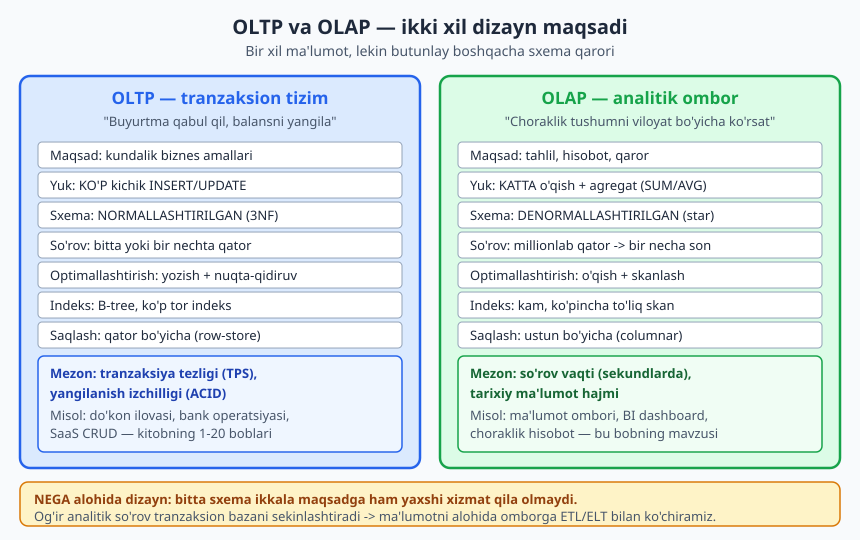
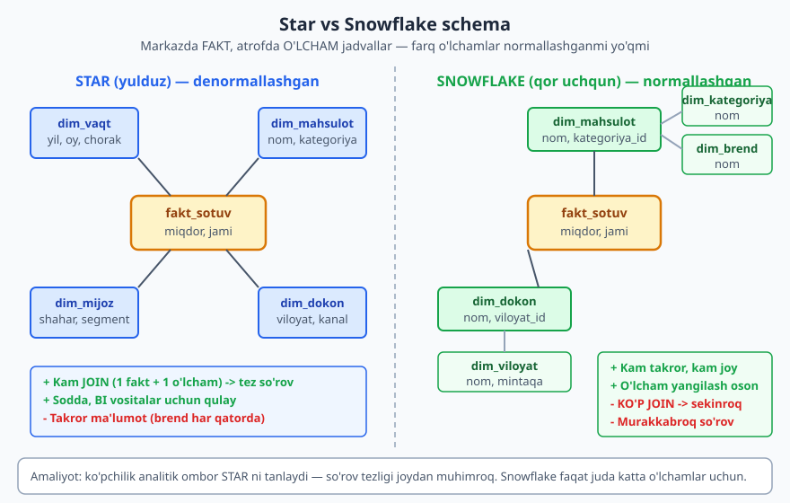
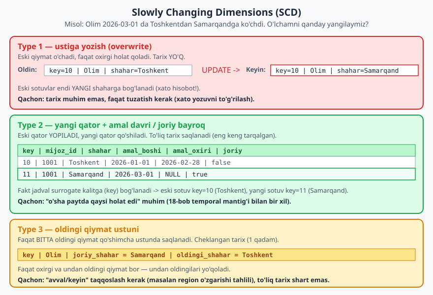

# 21 — Analitik dizayn va ma'lumotlar ombori

[⬅️ Oldingi: 20 — NoSQL ma'lumot modellashtirish](./20-nosql-modellashtirish.md) · [🏠 README](./README.md) · [Keyingi: 22 — Partitioning, sharding va masshtablash ➡️](./22-partitioning-masshtab.md)

> **Bu bobda:** shu paytgacha biz **tranzaksion** (OLTP) sxemalar loyihaladik — normallashtirilgan, anomaliyasiz, ko'p kichik yozuv uchun. Endi teskari dunyoga kiramiz: **analitik** (OLAP) dizayn, ya'ni "choraklik tushumni viloyat bo'yicha ko'rsat" kabi savollarga millionlab qatordan tez javob beradigan ombor. Nega OLTP va OLAP **alohida** sxema talab qiladi; Kimball ning **dimensional modeling** metodologiyasi (fakt va o'lcham jadvallari); **star** va **snowflake** sxemalar trade-off'i; eng muhim qaror — **grain** (donalik); **Slowly Changing Dimensions** (SCD Type 1/2/3) bilan o'lcham tarixini saqlash; ETL vs ELT; ombor (warehouse) vs ko'l (lake); va nega bu yerda **denormalizatsiya — norma**. Hamma SQL PostgreSQL 18.4 da haqiqatan ishga tushirilgan.

---

## 0. Bu bob qayerda turadi

Butun kitob davomida bitta tamoyilni o'rgandik: **normallashtir, takrorni yo'qot, anomaliyani oldini ol** (7-8-boblar). Bu OLTP — *Online Transaction Processing* — uchun to'g'ri. Do'kon ilovasi buyurtma qabul qiladi, balansni yangilaydi, ombordan kamaytiradi: ko'p kichik, tez, izchil yozuvlar.

Ammo bir kuni rahbar so'raydi: *"O'tgan chorakda qaysi kategoriya, qaysi viloyatda, qaysi kanalda eng ko'p sotildi?"* Bu savolga javob berish uchun siz **millionlab** buyurtma qatorini o'qib, guruhlab, jamlashingiz kerak. Bu — OLAP — *Online Analytical Processing*. Va u butunlay boshqacha dizayn talab qiladi.

Bu bob shu ikkinchi dunyoning dizaynini o'rgatadi. Biz hali ham PostgreSQL ishlatamiz (alohida analitik baza yoki ombor sifatida), lekin qoidalar teskari: normalizatsiya emas — **denormalizatsiya**; ko'p tor indeks emas — **kam, keng skanlash**; "anomaliyani oldini ol" emas — "o'qishni tezlashtir".

> **Eslatma:** [SQL kitobining 11-bobi](../sql/11-aggregate-group-by.md) `GROUP BY` / agregat sintaksisini o'rgatgan. Buni qayta o'rgatmaymiz. Bu bob — *qanday sxema* shu agregat so'rovlarni millionlab qatorlarda tez qiladi.

---

## 1. OLTP vs OLAP — nega ikki xil dunyo

Tasavvur qiling, do'kon kassasi (OLTP) va buxgalteriya bo'limi (OLAP) bir xil daftarni ishlatadi. Kassir har soniyada yozuv qo'shadi; buxgalter esa oyiga bir marta butun daftarni varaqlab jamlaydi. Agar buxgalter daftarni soatlab varaqlasa — kassir yozolmay qoladi. Yechim: buxgalterga **alohida**, jamlashga qulay nusxa berish.



| Mezon | OLTP (tranzaksion) | OLAP (analitik) |
|---|---|---|
| Maqsad | Kundalik biznes amallari | Tahlil, hisobot, qaror |
| Tipik so'rov | "Buyurtma #501 ni o'qi/yangila" | "Yil bo'yicha kategoriya tushumi" |
| Yuk turi | Ko'p kichik `INSERT`/`UPDATE` | Kam, lekin og'ir `SELECT` + agregat |
| Tegadigan qatorlar | Bir nechta | Millionlab |
| Sxema | Normallashtirilgan (3NF) | Denormallashtirilgan (star) |
| Indeks | Ko'p tor B-tree | Kam; ko'pincha to'liq skan |
| Saqlash | Qator bo'yicha (row-store) | Ustun bo'yicha (columnar) |
| Yangilanish | Doimiy, real vaqt | Davriy (kunlik/soatlik yuklash) |
| Mezon | Tranzaksiya tezligi (TPS), ACID | So'rov vaqti, tarix hajmi |

**Nega bitta sxema ikkalasiga yaramaydi?** Uch sabab:

1. **Resurs raqobati.** Og'ir analitik so'rov (millionlab qatorni skanlash) tranzaksion bazaning xotira va diskini band qiladi -> mijozlar uchun ilova sekinlashadi.
2. **Sxema shakli.** OLTP normallashtirilgan: bitta tushum savoli 8-10 ta `JOIN` talab qiladi -> sekin. OLAP denormallashtirilgan: 1-2 `JOIN` -> tez.
3. **Tarix.** OLTP odatda **joriy** holatni saqlaydi ("mijozning hozirgi shahri"). OLAP esa **o'tmishni** ("o'sha sotuv paytida qaysi shahar edi") — bu butunlay boshqa modellashtirish (SCD, 5-bo'lim).

> **Asosiy qaror:** ma'lumotni tranzaksion bazadan analitik omborga **ko'chirib**, alohida loyihalangan sxemada saqlaymiz. Ko'chirish jarayoni — ETL/ELT (7-bo'lim).

---

## 2. Dimensional modeling: Kimball metodologiyasi

OLAP sxemasini loyihalashning eng mashhur usuli — **dimensional modeling**, uni Ralph Kimball mashhur qilgan. G'oya juda sodda va biznesga tushunarli:

> Har bir biznes hodisasini ikki qismga ajrating: **nima o'lchandi** (raqamlar) va **qanday kontekstda** (matnli tavsiflar).

- **Fakt jadvali** (*fact table*) — **o'lchanadigan hodisalar**ni saqlaydi: sotuv summasi, miqdor, voqea soni. Bu — raqamlar (measures). Juda ko'p qator, tor (kam ustun).
- **O'lcham jadvali** (*dimension table*) — **kontekst**ni saqlaydi: qachon (vaqt), nima (mahsulot), kim (mijoz), qayerda (do'kon). Bu — matnli, tavsifiy atributlar. Kam qator, keng (ko'p ustun).

Hayotiy o'xshatish: chek qog'ozi. **Fakt** — "3 dona x 450 000 = 1 350 000". **O'lchamlar** — "Quloqchin Air" (mahsulot), "2026-04-12" (vaqt), "Olim" (mijoz), "Internet-magazin" (do'kon). Fakt — "qancha", o'lchamlar — "nima/qachon/kim/qayerda".

Analitik savol har doim shu shaklda: *"[o'lchov]ni [o'lcham] bo'yicha [agregat] qil"* — masalan "**tushum**ni **kategoriya** bo'yicha **SUM** qil". Aynan shuning uchun bu model BI vositalariga (Power BI, Metabase, Tableau) juda mos.

### 2.1 Surrogate kalit — bu yerda majburiy

OLTP da surrogate vs natural kalit — trade-off edi (6-bob). Omborda esa o'lcham jadvallari deyarli **doim** kichik, ma'nosiz surrogate kalit (`mahsulot_key`, `vaqt_key`) ishlatadi. Sabab: fakt jadvali tabiiy kalitga (uzun SKU matni) emas, kichik `int` ga bog'lansa — joy tejaladi va `JOIN` tezroq. Bundan tashqari, SCD Type 2 (5-bo'lim) tabiiy kalit barqaror qolib, surrogate kalit har versiyada o'zgarishini talab qiladi.

---

## 3. Star schema vs Snowflake schema

Endi fakt va o'lchamlarni qanday **bog'lash** — ikki asosiy naqsh bor.



**Star (yulduz) schema** — markazda fakt jadvali, atrofida bevosita unga bog'langan **denormallashgan** o'lchamlar. Diagrammada yulduzga o'xshaydi. O'lcham jadvali ataylab takror saqlaydi: masalan `dim_mahsulot` da har qatorda `kategoriya` va `brend` matni to'g'ridan-to'g'ri yoziladi (alohida jadvalga ajratilmaydi).

**Snowflake (qor uchqun) schema** — o'lchamlar ham **normallashtirilgan**: `dim_mahsulot` dan `kategoriya` va `brend` alohida kichik jadvallarga ajratiladi, fakt -> o'lcham -> kichik-o'lcham zanjiri hosil bo'ladi. Diagrammada qor uchquniga o'xshaydi.

| Mezon | Star | Snowflake |
|---|---|---|
| O'lchamlar | Denormallashgan (takror bor) | Normallashgan (takror kam) |
| `JOIN` soni | Kam (1 fakt + 1 o'lcham) | Ko'p (zanjirli) |
| So'rov tezligi | Tezroq | Sekinroq |
| Disk joyi | Ko'proq (takror) | Kamroq |
| Murakkablik | Sodda | Murakkabroq |
| BI vositaga moslik | A'lo | O'rtacha |

> **Amaliyot qaroriga:** ko'pchilik analitik ombor **star** ni tanlaydi. Omborda disk joyi arzon, lekin so'rov tezligi va soddalik qimmat. Snowflake faqat o'lcham juda katta bo'lib, takror jiddiy joy yeganda yoki o'lcham tez-tez yangilanganda mantiqiy. Denormalizatsiya bu yerda **xato emas — norma**: biz ataylab takror saqlaymiz, chunki maqsad o'qish tezligi.

---

## 4. Grain — eng muhim qaror

Fakt jadvalini loyihalashda **birinchi va eng muhim qaror** — **grain** (donalik): *bitta fakt qatori aniq nimani ifodalaydi?*

Grain ni bir jumlada, biznes tilida ayta olishingiz kerak. Misollar:

- "Bitta chekdagi bitta mahsulot qatori" (eng nozik — *line item*).
- "Bitta chek (jami)" (qatorlar yig'ilgan).
- "Bir kunlik, bir do'kondagi, bir mahsulot bo'yicha jami sotuv" (kunlik snapshot).

Grain ni **birinchi** tanlang, keyin o'lchamlar va o'lchovlarni unga moslang. Qoidalar:

1. **Eng nozik (atomic) grain ni afzal ko'ring** — "bitta chek qatori". Nozik grain'dan har qanday yuqori darajani (chek, kun, oy) jamlash mumkin; teskarisi — imkonsiz. Agar kunlik jamlab saqlasangiz, keyin "soat bo'yicha" so'rashning iloji yo'q.
2. **Bitta fakt jadvalida grain aralashtirmang.** "Chek qatori" va "kunlik jami" ni bitta jadvalga qo' shsangiz — `SUM` ikki marta sanaydi (double counting). Har grain — alohida fakt jadvali.
3. **Har o'lchov (measure) grain ga mos bo'lsin.** "Chek qatori" grain'ida `miqdor`, `narx` mantiqiy. "Chekdagi yetkazib berish narxi" esa qator emas, butun chek darajasida — uni har qatorga takrorlash double counting beradi.

> **Ekspert maslahati:** grain ni noto'g'ri tanlash — omborning eng qimmat xatosi, chunki uni keyin tuzatish butun yuklashni qayta qurish demakdir. Avval grain, keyin qolgani.

Quyida grain = "bitta sotuv chekidagi bitta mahsulot qatori" deb tanlangan star sxemani PostgreSQL da quramiz.

---

## 5. Amaliy: PostgreSQL da star schema (RUN)

Endi haqiqiy star sxema quramiz: 1 fakt + 4 o'lcham jadval, ma'lumot kiritamiz va agregat so'rovlar bilan jamlaymiz. Hammasi PG 18.4 da ishga tushirildi (izolyatsiya uchun `ch21` schema).

```sql
CREATE SCHEMA IF NOT EXISTS ch21;
SET search_path = ch21;

-- O'lcham: vaqt (har omborning markaziy o'lchami)
CREATE TABLE dim_vaqt (
    vaqt_key   int PRIMARY KEY,        -- 20260110 ko'rinishidagi "ma'noli" surrogate
    sana       date NOT NULL,
    yil        int  NOT NULL,
    chorak     int  NOT NULL,
    oy         int  NOT NULL,
    oy_nomi    text NOT NULL,
    hafta_kuni text NOT NULL,
    dam_kuni   boolean NOT NULL
);

-- O'lcham: mahsulot (denormallashgan — kategoriya/brend SHU YERDA)
CREATE TABLE dim_mahsulot (
    mahsulot_key int GENERATED ALWAYS AS IDENTITY PRIMARY KEY,
    sku          text NOT NULL,
    nom          text NOT NULL,
    kategoriya   text NOT NULL,
    brend        text NOT NULL
);

-- O'lcham: mijoz
CREATE TABLE dim_mijoz (
    mijoz_key int GENERATED ALWAYS AS IDENTITY PRIMARY KEY,
    ism       text NOT NULL,
    shahar    text NOT NULL,
    segment   text NOT NULL          -- 'B2C' / 'B2B'
);

-- O'lcham: do'kon (joy + kanal)
CREATE TABLE dim_dokon (
    dokon_key int GENERATED ALWAYS AS IDENTITY PRIMARY KEY,
    nom       text NOT NULL,
    viloyat   text NOT NULL,
    kanal     text NOT NULL          -- 'online' / 'offline'
);

-- FAKT: sotuv. GRAIN = "bitta chekdagi bitta mahsulot qatori".
CREATE TABLE fakt_sotuv (
    sotuv_id     bigint GENERATED ALWAYS AS IDENTITY PRIMARY KEY,
    vaqt_key     int  NOT NULL REFERENCES dim_vaqt(vaqt_key),
    mahsulot_key int  NOT NULL REFERENCES dim_mahsulot(mahsulot_key),
    mijoz_key    int  NOT NULL REFERENCES dim_mijoz(mijoz_key),
    dokon_key    int  NOT NULL REFERENCES dim_dokon(dokon_key),
    -- o'lchovlar (measures) — jamlanadigan raqamlar:
    miqdor       int     NOT NULL,
    narx         numeric(12,2) NOT NULL,
    jami         numeric(14,2) GENERATED ALWAYS AS (miqdor * narx) STORED
);
```

E'tibor bering: fakt jadvali **tor** (faqat 4 ta o'lcham kaliti + 3 ta o'lchov) lekin millionlab qatorga cho'ziladi. O'lchamlar **keng** lekin kam qatorli. Bu — klassik star shakli. `jami` ustuni `GENERATED ... STORED` (10-bobdan) — har sotuv qatori uchun avtomatik hisoblanadi.

Ma'lumotni to'ldiramiz:

```sql
SET search_path = ch21;

INSERT INTO dim_vaqt (vaqt_key, sana, yil, chorak, oy, oy_nomi, hafta_kuni, dam_kuni) VALUES
 (20260110,'2026-01-10',2026,1,1,'Yanvar','Shanba',true),
 (20260115,'2026-01-15',2026,1,1,'Yanvar','Payshanba',false),
 (20260205,'2026-02-05',2026,1,2,'Fevral','Payshanba',false),
 (20260320,'2026-03-20',2026,1,3,'Mart','Juma',false),
 (20260412,'2026-04-12',2026,2,4,'Aprel','Yakshanba',true);

INSERT INTO dim_mahsulot (sku, nom, kategoriya, brend) VALUES
 ('LP-100','Notebook Pro 14','Noutbuk','Acme'),
 ('PH-200','Smartfon X','Telefon','Acme'),
 ('HD-300','Quloqchin Air','Aksessuar','Sona');

INSERT INTO dim_mijoz (ism, shahar, segment) VALUES
 ('Olim','Toshkent','B2C'),
 ('Dilnoza','Samarqand','B2C'),
 ('TexnoSavdo MChJ','Toshkent','B2B');

INSERT INTO dim_dokon (nom, viloyat, kanal) VALUES
 ('Markaziy do''kon','Toshkent','offline'),
 ('Internet-magazin','Toshkent','online');

INSERT INTO fakt_sotuv (vaqt_key, mahsulot_key, mijoz_key, dokon_key, miqdor, narx) VALUES
 (20260110, 1, 1, 1, 1, 12000000.00),
 (20260110, 3, 1, 1, 2,   450000.00),
 (20260115, 2, 2, 2, 1,  6500000.00),
 (20260205, 1, 3, 2, 5, 11500000.00),
 (20260205, 3, 3, 2,10,   420000.00),
 (20260320, 2, 1, 1, 2,  6700000.00),
 (20260412, 3, 2, 2, 3,   450000.00);
```

### 5.1 Agregat so'rovlar (star join + GROUP BY)

Endi analitik savollarga javob beramiz. Har biri — fakt + o'lcham `JOIN` + `GROUP BY` o'lcham atributi bo'yicha.

**Savol 1: qaysi kategoriya eng ko'p tushum berdi?**

```sql
SET search_path = ch21;

SELECT m.kategoriya, SUM(f.jami) AS tushum, SUM(f.miqdor) AS sotilgan_dona
FROM fakt_sotuv f
JOIN dim_mahsulot m ON m.mahsulot_key = f.mahsulot_key
GROUP BY m.kategoriya
ORDER BY tushum DESC;
```

PG 18.4 da haqiqiy natija:

```text
 kategoriya |   tushum    | sotilgan_dona
------------+-------------+---------------
 Noutbuk    | 69500000.00 |             6
 Telefon    | 19900000.00 |             3
 Aksessuar  |  6450000.00 |            15
(3 rows)
```

**Savol 2: chorak + kanal bo'yicha tushum (ikki o'lchamli kesim).**

```sql
SET search_path = ch21;

SELECT v.chorak, d.kanal, SUM(f.jami) AS tushum
FROM fakt_sotuv f
JOIN dim_vaqt v  ON v.vaqt_key  = f.vaqt_key
JOIN dim_dokon d ON d.dokon_key = f.dokon_key
GROUP BY v.chorak, d.kanal
ORDER BY v.chorak, d.kanal;
```

```text
 chorak |  kanal  |   tushum
--------+---------+-------------
      1 | offline | 26300000.00
      1 | online  | 68200000.00
      2 | online  |  1350000.00
(3 rows)
```

**Savol 3: mijoz segmenti bo'yicha o'rtacha qator qiymati.**

```sql
SET search_path = ch21;

SELECT mz.segment, COUNT(*) AS qatorlar, ROUND(AVG(f.jami),0) AS ortacha_qator
FROM fakt_sotuv f
JOIN dim_mijoz mz ON mz.mijoz_key = f.mijoz_key
GROUP BY mz.segment
ORDER BY mz.segment;
```

```text
 segment | qatorlar | ortacha_qator
---------+----------+---------------
 B2B     |        2 |      30850000
 B2C     |        5 |       6830000
(2 rows)
```

E'tibor bering — uchala so'rov ham bir xil **shaklda**: fakt'dan `SUM`/`AVG`, o'lchamdan `GROUP BY`. Bu — star sxemaning kuchi: har qanday biznes savoli shu naqshga tushadi.

> **`ROLLUP`/`CUBE`:** PostgreSQL `GROUP BY ROLLUP (yil, oy)` yoki `CUBE (...)` bilan bir so'rovda ham detal, ham oraliq jamlamalarni beradi — analitik hisobotlar uchun juda qulay. `GROUP BY` haqida [SQL kitobining 11-bobida](../sql/11-aggregate-group-by.md) o'qishingiz mumkin.

---

## 6. Slowly Changing Dimensions (SCD)

Eng nozik savol: **o'lcham vaqt o'tishi bilan o'zgarsa** nima qilamiz? Olim Toshkentdan Samarqandga ko'chdi. Uning eski sotuvlari **qaysi** shaharga tegishli — Toshkentgami (o'sha paytdagi haqiqat) yoki Samarqandgami (hozirgi haqiqat)?

Bu — **Slowly Changing Dimension** muammosi. "Slowly" — chunki o'lcham atributlari kamdan-kam (mijoz ko'chishi, mahsulot kategoriyasi o'zgarishi), lekin o'zgaradi. Kimball uch asosiy strategiyani nomlaydi.



### 6.1 Type 1 — ustiga yozish

Eski qiymat o'chiriladi, faqat oxirgi holat qoladi:

```sql
-- Type 1: shunchaki UPDATE
UPDATE dim_mijoz SET shahar = 'Samarqand' WHERE mijoz_key = 1;
```

**Tarix yo'q.** Endi Olimning **barcha** eski sotuvlari ham Samarqandga "ko'chadi" -> "Toshkentda o'tgan yilgi tushum" xato chiqadi. Type 1 ni faqat **xato tuzatish** uchun ishlating ("shaxar nomi xato yozilgan edi"), real o'zgarish uchun emas.

### 6.2 Type 2 — yangi qator + amal davri / joriy bayroq

Eng keng tarqalgan strategiya: eski qatorni **yopamiz** (amal oxirini belgilaymiz, `joriy=false`), yangi qator **qo'shamiz**. Bu — 18-bobdagi temporal/tarix naqshining ombordagi ko'rinishi. PG 18.4 da quramiz:

```sql
SET search_path = ch21;

CREATE TABLE dim_mijoz_scd2 (
    mijoz_key   int GENERATED ALWAYS AS IDENTITY PRIMARY KEY,  -- surrogate (har versiya yangi)
    mijoz_id    int  NOT NULL,        -- tabiiy (business) kalit — barqaror
    ism         text NOT NULL,
    shahar      text NOT NULL,
    amal_boshi  date NOT NULL,
    amal_oxiri  date,                 -- NULL = hali amalda
    joriy       boolean NOT NULL DEFAULT true,
    UNIQUE (mijoz_id, amal_boshi)
);

-- Boshlang'ich: Olim Toshkentda
INSERT INTO dim_mijoz_scd2 (mijoz_id, ism, shahar, amal_boshi, amal_oxiri, joriy)
VALUES (1001, 'Olim', 'Toshkent', '2026-01-01', NULL, true);

-- 2026-03-01 da ko'chdi: eski qatorni YOP, yangi qator QO'SH
UPDATE dim_mijoz_scd2
SET amal_oxiri = '2026-02-28', joriy = false
WHERE mijoz_id = 1001 AND joriy;

INSERT INTO dim_mijoz_scd2 (mijoz_id, ism, shahar, amal_boshi, amal_oxiri, joriy)
VALUES (1001, 'Olim', 'Samarqand', '2026-03-01', NULL, true);
```

Endi mijoz 1001 uchun **ikki** qator bor — biri yopilgan, biri joriy:

```sql
SET search_path = ch21;
SELECT mijoz_key, mijoz_id, shahar, amal_boshi, amal_oxiri, joriy
FROM dim_mijoz_scd2 WHERE mijoz_id = 1001 ORDER BY amal_boshi;
```

PG 18.4 da haqiqiy natija:

```text
 mijoz_key | mijoz_id |  shahar   | amal_boshi | amal_oxiri | joriy
-----------+----------+-----------+------------+------------+-------
         1 |     1001 | Toshkent  | 2026-01-01 | 2026-02-28 | f
         2 |     1001 | Samarqand | 2026-03-01 |            | t
(2 rows)
```

**Sehr shu yerda:** fakt jadval `mijoz_key` (surrogate) ga bog'lanadi. 2026-02 dagi sotuv `mijoz_key=1` (Toshkent) ga, 2026-04 dagi sotuv `mijoz_key=2` (Samarqand) ga ulanadi. Shunday qilib har sotuv **o'sha paytdagi** holatni saqlaydi — bu Type 2 ning butun maqsadi.

Joriy holat va "o'sha paytda qaysi shahar edi" so'rovlari:

```sql
SET search_path = ch21;

-- Joriy holat (faqat aktiv qator)
SELECT mijoz_id, ism, shahar FROM dim_mijoz_scd2 WHERE mijoz_id = 1001 AND joriy;

-- "2026-01-15 da Olim qaysi shaharda edi?" (point-in-time, 18-bob mantig'i)
SELECT shahar FROM dim_mijoz_scd2
WHERE mijoz_id = 1001
  AND DATE '2026-01-15' >= amal_boshi
  AND (amal_oxiri IS NULL OR DATE '2026-01-15' <= amal_oxiri);
```

```text
 mijoz_id | ism  |  shahar
----------+------+-----------
     1001 | Olim | Samarqand
(1 row)

  shahar
----------
 Toshkent
(1 row)
```

Joriy so'rov "Samarqand" (hozir), point-in-time so'rov "Toshkent" (2026-01-15 da) qaytardi — aynan kutilgani. Tozalaymiz:

```sql
DROP SCHEMA ch21 CASCADE;
```

### 6.3 Type 3 — oldingi qiymat ustuni

O'rta yo'l: qo'shimcha ustunda **faqat bitta** oldingi qiymat saqlanadi:

```sql
-- joriy_shahar = 'Samarqand', oldingi_shahar = 'Toshkent'
ALTER TABLE dim_mijoz ADD COLUMN oldingi_shahar text;
UPDATE dim_mijoz SET oldingi_shahar = shahar, shahar = 'Samarqand' WHERE mijoz_key = 1;
```

Faqat "avval/keyin" taqqoslash kerak bo'lganda foydali (masalan, "viloyatni o'zgartirgan mijozlar tahlili"). To'liq tarix saqlanmaydi — undan oldingi qiymat yo'qoladi.

| Type | Tarix | Qachon ishlatish |
|---|---|---|
| **Type 1** | Yo'q (ustiga yozish) | Xato tuzatish; tarix muhim emas |
| **Type 2** | To'liq (har versiya qator) | "O'sha paytdagi holat" muhim (eng keng) |
| **Type 3** | Cheklangan (1 oldingi) | "Avval/keyin" taqqoslash, to'liq tarix shart emas |

> **Bog'lanish:** Type 2 — bu aslida 18-bobdagi **valid-time temporal** naqshning analitik nomi. SCD — temporal modellashtirishning ombor jargoni.

---

## 7. ETL vs ELT — ma'lumotni omborga qanday ko'chiramiz

OLTP bazadan analitik omborga ma'lumot **ko'chiriladi** (real vaqtda emas, davriy). Ikki yondashuv bor:

- **ETL** (*Extract -> Transform -> Load*): ma'lumotni **olib**, **tashqarida** (alohida vositada) o'zgartirib/tozalab, keyin omborga **yuklash**. An'anaviy; ombor cheklangan quvvatga ega bo'lganda mantiqiy edi.
- **ELT** (*Extract -> Load -> Transform*): ma'lumotni **olib**, omborga **xom holda yuklash**, keyin **ombor ichida** SQL bilan o'zgartirish. Zamonaviy bulutli omborlar (BigQuery, Snowflake) kuchli bo'lgani uchun bu ustun bo'ldi — "transform" ni baza o'zi qiladi.

PostgreSQL kontekstida oddiy ELT — tranzaksion jadvallardan o'qib, fakt/o'lcham jadvallariga `INSERT ... SELECT` qilish (ko'pincha tunda, `cron` bilan), yoki **materialized view** (15-bobdan) ni davriy `REFRESH` qilish.

```sql
-- Illustrativ ELT: tranzaksion buyurtmalardan kunlik faktni qurish
-- (har tun cron bilan: REFRESH MATERIALIZED VIEW kunlik_sotuv;)
CREATE MATERIALIZED VIEW kunlik_sotuv AS
SELECT date_trunc('day', yaratilgan) AS kun,
       mahsulot_id,
       SUM(miqdor)      AS jami_miqdor,
       SUM(miqdor*narx) AS jami_summa
FROM oltp_buyurtma_qatori
GROUP BY 1, 2;
```

> **Halollik eslatmasi:** yuqoridagi blok illustrativ (manba `oltp_buyurtma_qatori` jadvali bu schemada mavjud emas), shuning uchun u RUN qilinmadi. 5-bo'limdagi star sxema esa to'liq RUN qilingan.

---

## 8. Ombor vs ko'l vs columnar — qisqacha

**Ma'lumotlar ombori (data warehouse)** — bu bob mavzusi: **strukturalangan**, sxemasi oldindan loyihalangan (schema-on-write), tozalangan, analitikaga tayyor ma'lumot. Star/snowflake bu yerda yashaydi.

**Ma'lumotlar ko'li (data lake)** — **xom**, har xil formatdagi (JSON, log, rasm, parquet) ma'lumotni "o'qishda izohlash" (schema-on-read) bilan saqlaydi. Avval to'plab, keyin "nima qilish" ni hal qilasiz. Arzon, moslashuvchan, lekin tartibsiz bo'lib ketishi mumkin ("data swamp" — botqoq). Ko'pincha ikkalasi birga ishlatiladi: ko'lga xom to'plab, omborga tozalab yuklash ("lakehouse").

**Columnar (ustunli) saqlash** — nega OLAP uchun muhim:

- **Row-store** (OLTP, PG ning standarti): bir qator barcha ustunlari yonma-yon diskda. "Bitta buyurtmani o'qish" tez.
- **Columnar** (OLAP): bir ustun barcha qiymatlari yonma-yon. `SUM(jami)` faqat `jami` ustunini o'qiydi, qolganini emas -> millionlab qatorni jamlash tez. Bir xil qiymatlar yonma-yon bo'lgani uchun **siqish** (compression) ham yaxshi.

PostgreSQL standartan row-store, lekin analitik yuk uchun kengaytmalar mavjud (masalan `cstore`/ustunli FDW lar yoki tashqi analitik enginelar). Maxsus omborlar (ClickHouse, BigQuery, Snowflake) tug'ma columnar.

---

## 9. Bu bobning xulosasi (dizayn yodnomasi)

- **OLTP va OLAP — ikki xil maqsad, ikki xil sxema.** Analitik yukni tranzaksion bazada ishlatmang.
- **Dimensional modeling:** fakt (o'lchanadigan raqamlar) + o'lcham (kontekst). Surrogate kalit majburiy.
- **Star** ni standart deb biling, **snowflake** ni faqat zarurat bo'lganda. **Denormalizatsiya — bu yerda norma.**
- **Grain** ni birinchi va aniq tanlang; eng nozik darajani afzal ko'ring; grain aralashtirmang.
- **SCD Type 2** — o'lcham tarixini saqlashning standart usuli (18-bob temporal naqshi).
- **ELT** zamonaviy norma; ombor ichida transform. **Columnar** saqlash OLAP ni tezlashtiradi.

---

## Mashqlar

### Oson

1. **OLTP yoki OLAP?** Quyidagi har bir ish yukini OLTP yoki OLAP deb belgilang va bir jumlada asoslang: (a) bankomat balansni yangilaydi; (b) marketing bo'limi "oxirgi 3 yil oylik tushum trendi" ni so'raydi; (c) foydalanuvchi parolini o'zgartiradi; (d) BI dashboard har viloyat bo'yicha sotuvni ko'rsatadi.
2. **Fakt yoki o'lcham?** Onlayn-do'kon ombori uchun quyidagilarni fakt jadvaliga yoki o'lcham jadvaliga ajrating: sotuv summasi, mahsulot nomi, mijoz shahri, sotilgan miqdor, sana, to'lov turi, chegirma foizi.
3. **Grain ni bir jumlada ayting** — quyidagi fakt jadvali uchun: `fakt_qoldiq(kun_key, ombor_key, mahsulot_key, qoldiq_dona)`. Bu jadvalda `SUM(qoldiq_dona)` ni bir kun bo'yicha hisoblash mantiqiymi?
4. **Star schema chizing** — taksi xizmati uchun: fakt = "bitta safar". Qaysi o'lchamlar (kamida 3 ta) va qaysi o'lchovlar (kamida 2 ta) bo'lishini sanab bering.

### O'rta

5. **SCD turini tanlang.** Har holat uchun SCD Type 1/2/3 dan birini tanlang va asoslang: (a) mahsulot nomida imlo xatosi tuzatilmoqda; (b) mijoz familiyasini o'zgartirdi va eski hisobotlar eski familiyani ko'rsatishi kerak; (c) "sotuvchining hozirgi va bir oldingi mintaqasi" ni taqqoslash kerak.
6. **Snowflake'ni star'ga aylantiring.** Sizda snowflake bor: `fakt_sotuv -> dim_mahsulot(kategoriya_id) -> dim_kategoriya(nom, bolim_id) -> dim_bolim(nom)`. Buni star ga aylantiring (`dim_mahsulot` ni qanday o'zgartirasiz) va bitta afzallik/bitta kamchilikni yozing.
7. **Grain xatosini toping.** Bir jamoa `fakt_sotuv(chek_key, mahsulot_key, miqdor, chek_jami_summa, yetkazib_berish_narxi)` quribdi. `SUM(yetkazib_berish_narxi)` ni mahsulot kategoriyasi bo'yicha hisoblamoqchi. Bu yerda qanday double counting xatosi bor va qanday tuzatasiz?
8. **Vaqt o'lchamini loyihalang.** `dim_vaqt` jadvali uchun kamida 8 ta foydali ustun sanang (kun darajasidagi grain uchun). Nega ombor `WHERE sana BETWEEN ...` o'rniga `JOIN dim_vaqt ... WHERE dim_vaqt.chorak = 1` ni afzal ko'radi?

### Qiyin

9. **OLTP -> OLAP o'tkazish.** Normallashtirilgan OLTP sxemasi berilgan: `buyurtma(id, mijoz_id, sana)`, `buyurtma_qatori(buyurtma_id, mahsulot_id, miqdor, narx)`, `mahsulot(id, nom, kategoriya_id)`, `kategoriya(id, nom)`, `mijoz(id, ism, shahar_id)`, `shahar(id, nom, viloyat)`. Bundan "bitta buyurtma qatori" grain' idagi **star** analitik sxemani loyihalang: fakt jadval DDL'i, kamida 3 o'lcham jadval DDL'i, va OLTP'dan faktga to'ldiruvchi bitta `INSERT ... SELECT` (illustrativ) yozing.
10. **SCD Type 2 to'liq.** `dim_mahsulot` uchun SCD Type 2 ni loyihalang: narx kategoriyasi ("arzon"/"premium") vaqt bilan o'zgaradi. Jadval DDL (surrogate + business key + amal_boshi/amal_oxiri/joriy), o'zgarishni amalga oshiruvchi `UPDATE`+`INSERT`, va "2026-yil 1-iyulda mahsulot X qaysi kategoriyada edi" so'rovini yozing.
11. **Double counting tahlili.** `fakt_buyurtma(buyurtma_key, mijoz_key, jami_summa)` da grain = "bitta buyurtma". Tahlilchi bu faktni `dim_buyurtma_qatori` (har qatorda mahsulot) bilan `JOIN` qilib `SUM(jami_summa)` ni mahsulot bo'yicha hisobladi va g'alati katta raqam oldi. Nega? Buni to'g'ri qilish uchun qanday grain'dagi fakt kerak?
12. **Ombor vs ko'l qarori.** Bir startap log fayllar (JSON, kuniga 50 GB), struktura tez-tez o'zgaradi, ma'lumotlar olimlari turli tahlil qilmoqchi — lekin moliya bo'limi aniq, barqaror "oylik tushum" hisobotini ham xohlaydi. Qaysi ma'lumotni ko'lga, qaysisini omborga joylashtirasiz va nega? Star sxema qaysi qismda yashaydi?

---

## Yechimlar

<details markdown="1">
<summary>Yechim — 1</summary>

(a) **OLTP** — bitta yozuvni tez yangilash, ACID muhim. (b) **OLAP** — millionlab tarixiy qatorni jamlash. (c) **OLTP** — bitta qatorni yangilash. (d) **OLAP** — agregat + guruhlash.

Qoida: bitta yozuvga tegadigan, real-vaqt, izchillik talab qiluvchi -> OLTP. Ko'p qatorni o'qib jamlaydigan, tarixiy, hisobot -> OLAP.

</details>

<details markdown="1">
<summary>Yechim — 2</summary>

**Fakt** (o'lchanadigan raqamlar, jamlanadi): sotuv summasi, sotilgan miqdor, chegirma foizi.
**O'lcham** (kontekst, tavsifiy): mahsulot nomi (`dim_mahsulot`), mijoz shahri (`dim_mijoz`), sana (`dim_vaqt`), to'lov turi (`dim_tolov` yoki kichik o'lcham).

Chegirma foizi chegaraviy: agar har sotuv qatori uchun bo'lsa — o'lchov (fakt'da); agar mahsulotning doimiy xususiyati bo'lsa — o'lcham atributi. Grain ga bog'liq.

</details>

<details markdown="1">
<summary>Yechim — 3</summary>

Grain: **"bir kun oxiridagi, bitta ombordagi, bitta mahsulotning qoldiq miqdori"** (snapshot fakt).

`SUM(qoldiq_dona)` ni **bir kun bo'yicha** hisoblash mantiqiy emas, agar siz **kunlar bo'ylab** jamlasangiz — bu double counting (qoldiq yig'iladigan emas, balki holat o'lchovi). Bir kun **ichida** ombor/mahsulot bo'yicha jamlash mumkin, lekin kunlar bo'ylab `SUM` o'rniga oxirgi kun qiymatini olish yoki `AVG` kerak. Bu — "semi-additive" o'lchov (faqat ba'zi o'lchamlar bo'yicha qo'shiladi).

</details>

<details markdown="1">
<summary>Yechim — 4</summary>

Grain = "bitta taksi safari".

**O'lchamlar:** `dim_vaqt` (safar boshlangan sana/soat), `dim_haydovchi`, `dim_yo'lovchi`, `dim_hudud` (boshlanish/tugash mintaqasi), `dim_tolov_turi`.
**O'lchovlar (fakt'da):** masofa (km), narx (so'm), davomiylik (daqiqa), kutish vaqti.

DDL eskizi:

```sql
CREATE TABLE fakt_safar (
  safar_id      bigint GENERATED ALWAYS AS IDENTITY PRIMARY KEY,
  vaqt_key      int NOT NULL,
  haydovchi_key int NOT NULL,
  yolovchi_key  int NOT NULL,
  hudud_key     int NOT NULL,
  masofa_km     numeric(6,2),
  narx          numeric(10,2),
  davomiylik    int
);
```

</details>

<details markdown="1">
<summary>Yechim — 5</summary>

(a) **Type 1** — bu xato tuzatish, tarix kerak emas, ustiga yozish.
(b) **Type 2** — eski hisobotlar eski familiyani ko'rsatishi kerak -> yangi qator + amal davri, har sotuv o'sha paytdagi `key` ga bog'lanadi.
(c) **Type 3** — faqat "hozirgi va bir oldingi" taqqoslash kerak -> `joriy_mintaqa` + `oldingi_mintaqa` ustunlari.

</details>

<details markdown="1">
<summary>Yechim — 6</summary>

Star ga aylantirish: `dim_mahsulot` ga `kategoriya` va `bolim` **matnini to'g'ridan-to'g'ri** ustun sifatida qo'shamiz (denormalizatsiya), `dim_kategoriya` va `dim_bolim` jadvallarini o'chiramiz:

```sql
CREATE TABLE dim_mahsulot (
  mahsulot_key int GENERATED ALWAYS AS IDENTITY PRIMARY KEY,
  nom        text NOT NULL,
  kategoriya text NOT NULL,   -- avval alohida jadval edi
  bolim      text NOT NULL    -- avval alohida jadval edi
);
```

**Afzallik:** kategoriya bo'yicha so'rov endi `JOIN`siz (yoki 1 `JOIN`) -> tezroq, BI vositaga qulay.
**Kamchilik:** takror — har mahsulot qatorida kategoriya/bolim matni qaytariladi -> ko'proq joy; agar bolim nomi o'zgarsa, ko'p qatorni yangilash kerak (lekin omborda o'zgarish kam).

</details>

<details markdown="1">
<summary>Yechim — 7</summary>

**Xato:** `chek_jami_summa` va `yetkazib_berish_narxi` chek darajasidagi qiymatlar, lekin jadval grain'i "chek qatori" (har mahsulot uchun bitta qator). Bitta chek 3 mahsulotdan iborat bo'lsa, `yetkazib_berish_narxi` 3 marta takrorlanadi -> `SUM` uni 3 baravar sanaydi.

**Tuzatish:** chek darajasidagi o'lchovlarni alohida fakt jadvaliga chiqaring (grain = "bitta chek"):

```sql
CREATE TABLE fakt_chek (         -- grain: bitta chek
  chek_key int PRIMARY KEY,
  mijoz_key int, vaqt_key int,
  chek_jami_summa numeric(14,2),
  yetkazib_berish_narxi numeric(10,2)
);
CREATE TABLE fakt_chek_qatori (  -- grain: chekdagi mahsulot qatori
  chek_key int, mahsulot_key int,
  miqdor int, narx numeric(12,2)
);
```

Endi `yetkazib_berish_narxi` ni `fakt_chek` dan, mahsulot detalini `fakt_chek_qatori` dan jamlaysiz — double counting yo'q.

</details>

<details markdown="1">
<summary>Yechim — 8</summary>

`dim_vaqt` ustunlari: `vaqt_key`, `sana`, `yil`, `chorak`, `oy`, `oy_nomi`, `hafta_kuni`, `hafta_raqami`, `dam_kuni` (boolean), `bayram` (boolean), `moliya_yili`.

Nega `JOIN dim_vaqt` afzal: vaqt o'lchami "biznes taqvimi" mantig'ini (chorak, moliya yili, bayram, dam kuni) bir joyda saqlaydi. `WHERE sana BETWEEN` har so'rovda shu mantiqni qayta yozishni talab qiladi va "moliya choragi" yoki "bayram kunlari" kabi murakkab tushunchalarni ifodalay olmaydi. `dim_vaqt` ularni tayyor ustun qiladi -> so'rov sodda va izchil.

</details>

<details markdown="1">
<summary>Yechim — 9</summary>

Grain = "bitta buyurtma qatori".

```sql
-- O'lchamlar
CREATE TABLE dim_vaqt (
  vaqt_key int PRIMARY KEY, sana date, yil int, chorak int, oy int);
CREATE TABLE dim_mahsulot (
  mahsulot_key int GENERATED ALWAYS AS IDENTITY PRIMARY KEY,
  nom text, kategoriya text);          -- kategoriya denormallashgan
CREATE TABLE dim_mijoz (
  mijoz_key int GENERATED ALWAYS AS IDENTITY PRIMARY KEY,
  ism text, shahar text, viloyat text); -- shahar+viloyat denormallashgan

-- Fakt
CREATE TABLE fakt_sotuv (
  sotuv_id bigint GENERATED ALWAYS AS IDENTITY PRIMARY KEY,
  vaqt_key int NOT NULL REFERENCES dim_vaqt(vaqt_key),
  mahsulot_key int NOT NULL REFERENCES dim_mahsulot(mahsulot_key),
  mijoz_key int NOT NULL REFERENCES dim_mijoz(mijoz_key),
  miqdor int NOT NULL,
  narx numeric(12,2) NOT NULL,
  jami numeric(14,2) GENERATED ALWAYS AS (miqdor*narx) STORED);

-- ELT to'ldirish (illustrativ — o'lchamlar to'ldirilgan deb hisoblaymiz)
INSERT INTO fakt_sotuv (vaqt_key, mahsulot_key, mijoz_key, miqdor, narx)
SELECT to_char(b.sana,'YYYYMMDD')::int,
       dm.mahsulot_key, dmz.mijoz_key,
       bq.miqdor, bq.narx
FROM buyurtma_qatori bq
JOIN buyurtma b   ON b.id = bq.buyurtma_id
JOIN mahsulot mh  ON mh.id = bq.mahsulot_id
JOIN dim_mahsulot dm  ON dm.nom = mh.nom
JOIN mijoz mj     ON mj.id = b.mijoz_id
JOIN dim_mijoz dmz ON dmz.ism = mj.ism;
```

Asosiy g'oya: snowflake'simon OLTP zanjiri (`kategoriya`, `shahar`->`viloyat`) o'lcham jadvallariga **yassilanadi** (denormalizatsiya).

</details>

<details markdown="1">
<summary>Yechim — 10</summary>

```sql
CREATE TABLE dim_mahsulot_scd2 (
  mahsulot_key int GENERATED ALWAYS AS IDENTITY PRIMARY KEY,
  mahsulot_id  int NOT NULL,          -- business key, barqaror
  nom          text NOT NULL,
  narx_kat     text NOT NULL,         -- 'arzon' / 'premium'
  amal_boshi   date NOT NULL,
  amal_oxiri   date,
  joriy        boolean NOT NULL DEFAULT true,
  UNIQUE (mahsulot_id, amal_boshi)
);

-- Boshlang'ich: X 'arzon'
INSERT INTO dim_mahsulot_scd2 (mahsulot_id, nom, narx_kat, amal_boshi, amal_oxiri, joriy)
VALUES (500, 'Mahsulot X', 'arzon', '2026-01-01', NULL, true);

-- 2026-06-01 da 'premium' ga o'tdi
UPDATE dim_mahsulot_scd2 SET amal_oxiri = '2026-05-31', joriy = false
WHERE mahsulot_id = 500 AND joriy;
INSERT INTO dim_mahsulot_scd2 (mahsulot_id, nom, narx_kat, amal_boshi, amal_oxiri, joriy)
VALUES (500, 'Mahsulot X', 'premium', '2026-06-01', NULL, true);

-- "2026-07-01 da X qaysi kategoriyada edi?"
SELECT narx_kat FROM dim_mahsulot_scd2
WHERE mahsulot_id = 500
  AND DATE '2026-07-01' >= amal_boshi
  AND (amal_oxiri IS NULL OR DATE '2026-07-01' <= amal_oxiri);
-- -> 'premium'
```

</details>

<details markdown="1">
<summary>Yechim — 11</summary>

**Nega katta raqam:** grain "bitta buyurtma" bo'lgan faktni "buyurtma qatori" (har mahsulot) bilan `JOIN` qilish — har buyurtma uchun `jami_summa` ni shu buyurtmadagi qatorlar soniga **ko'paytiradi**. 3 mahsulotli buyurtma uchun `jami_summa` 3 marta sanaladi -> double counting.

**To'g'ri yechim:** mahsulot bo'yicha tahlil uchun **qator grain'idagi** fakt kerak: `fakt_sotuv_qatori(buyurtma_key, mahsulot_key, qator_summa)`, bu yerda `qator_summa` = shu mahsulot qatori summasi. Keyin `SUM(qator_summa)` mahsulot bo'yicha to'g'ri ishlaydi. Buyurtma darajasidagi `jami_summa` (yetkazib berish, chegirma) esa alohida `fakt_buyurtma` da qoladi.

</details>

<details markdown="1">
<summary>Yechim — 12</summary>

**Ko'lga (data lake):** xom JSON loglar (kuniga 50 GB), tez o'zgaruvchi struktura, ma'lumot olimlarining ad-hoc tahlili. Sabab: schema-on-read, arzon saqlash, moslashuvchanlik; oldindan sxema loyihalashning hojati yo'q.

**Omborga (warehouse):** moliyaning aniq, barqaror "oylik tushum" hisoboti. Sabab: bu strukturalangan, takrorlanadigan, ishonchli bo'lishi kerak -> dimensional model (fakt_tushum + dim_vaqt + dim_mahsulot).

**Star sxema omborda yashaydi.** Amaliy oqim: xom loglar ko'lga tushadi -> ELT bilan tozalanib/jamlanib omborning star sxemasiga yuklanadi (lakehouse naqshi). Ma'lumot olimlari ko'ldan erkin ishlaydi, moliya esa ishonchli ombordan hisobot oladi.

</details>

---

[⬅️ Oldingi: 20 — NoSQL ma'lumot modellashtirish](./20-nosql-modellashtirish.md) · [🏠 README](./README.md) · [Keyingi: 22 — Partitioning, sharding va masshtablash ➡️](./22-partitioning-masshtab.md)
