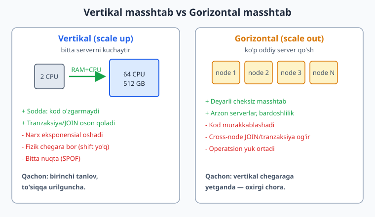
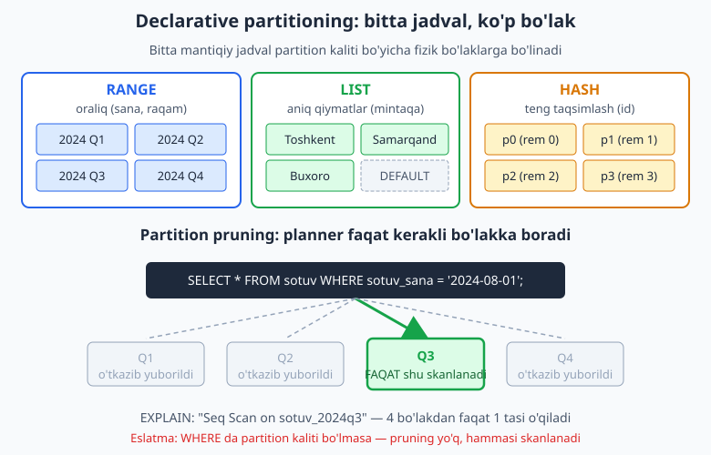
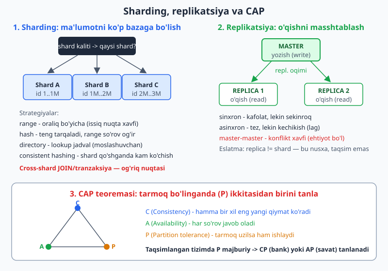

# 22 — Partitioning, sharding va masshtablash

[⬅️ Oldingi: 21 — Analitik dizayn va ma'lumotlar ombori](./21-analitik-ombor.md) · [🏠 README](./README.md) · [Keyingi: 23 — Migratsiya va sxema evolyutsiyasi ➡️](./23-migratsiya-evolyutsiya.md)

> **Bu bobda:** sxemangiz to'g'ri loyihalangan bo'lsa ham, ma'lumot millionlab qatorga, so'rovlar minglab/sekundga yetganda u "qotib" boshlaydi. Shu daqiqada nima qilamiz? Avval ikki yo'lni ajratamiz — **vertikal** (bitta serverni kuchaytirish) va **gorizontal** (ko'p server qo'shish) masshtab, qaysi biri qachon. So'ng PostgreSQL ning **declarative partitioning** (RANGE/LIST/HASH) imkoniyatini chuqur ko'ramiz va **partition pruning** ni `EXPLAIN` bilan haqiqatan tasdiqlaymiz. Keyin **sharding** (ma'lumotni ko'p bazaga taqsimlash) strategiyalari va eng muhim qaror — shard kalitini tanlash; **replikatsiya** (master-replica, read replica) bilan o'qishni masshtablash; va **CAP teoremasi** orqali taqsimlangan tizimning tub kelishuvi. Bobning shiori: **"avval partition (bitta bazada), keyin shard (oxirgi chora)"**.

---

## 0. Bu bob qayerda turadi

Bu yergacha biz **bitta** bazadagi sxema sifatiga e'tibor berdik: normalizatsiya (7-8), indeks (14), performans (15), tranzaksiya (16). Bu bob boshqa savolga javob beradi: **sxema to'g'ri, lekin hajm va yuk sig'maydi — endi nima?**

Bu **operatsion-dizayn** chegarasidagi mavzu. Shuning uchun ikki turdagi material aralashadi, va men ularni halol ajrataman:

- **PostgreSQL partitioning** — bitta tugunda (server) ishlaydi, men uni 5434 (PG 18.4) klasterida **haqiqatan ishga tushirib** tekshirdim. Hamma `EXPLAIN` natijalari real.
- **Sharding va replikatsiya** — bir necha mashina/klaster talab qiladi. Mende bunday klaster yo'q, shuning uchun bu qismdagi kod **illustrativ** (tushuntiruvchi) — men "ishladi/natija shunday" deb soxta yozmayman; faqat dizayn qarorini ko'rsataman.

> **Asosiy fikr:** masshtablash — bu "kuchli kompyuter sotib olish" emas. Bu **dizayn kelishuvlari** zanjiri: har qadamda biror narsani (soddalikni, izchillikni, JOIN imkoniyatini) qurbon qilasiz. Yaxshi dizayner zarurat tug'ilmasdan oldin murakkablikka sakramaydigan kishidir.

---

## 1. Vertikal vs gorizontal masshtab: birinchi yo'lbosh

Ikki tubdan farqli yo'l bor.



**Vertikal masshtab (scale up)** — bitta serverni kuchaytirish: ko'proq CPU, RAM, tezroq disk (NVMe). O'xshatish: do'koningiz tor — kattaroq do'kon ijaraga olasiz.

- **Afzalligi:** kod **umuman o'zgarmaydi**. JOIN, tranzaksiya, `FOREIGN KEY` — hammasi avvalgidek ishlaydi, chunki ma'lumot hali bitta joyda. Operatsion jihatdan eng sodda.
- **Kamchiligi:** narx chiziqli emas — eksponensial oshadi (2 barobar kuchli server 2 barobar emas, 4-5 barobar qimmat). **Fizik chegara** bor: dunyodagi eng katta server ham cheklangan. Va bitta server — bitta nosozlik nuqtasi (SPOF).

**Gorizontal masshtab (scale out)** — ko'p **oddiy** server qo'shish va yukni ular orasida bo'lish. O'xshatish: bitta ulkan do'kon o'rniga shahar bo'ylab ko'p filial ochasiz.

- **Afzalligi:** deyarli cheksiz masshtab; arzon serverlar; bitta tugun qulasa, qolganlari ishlaydi (bardoshlilik).
- **Kamchiligi:** kod **murakkablashadi**. Ma'lumot bo'lingach, ikki tugundagi qatorni JOIN qilish yoki bitta tranzaksiyada yangilash og'irlashadi. Operatsion yuk (monitoring, backup, debug) keskin ortadi.

### 1.1 Qaysi birini, qachon

Ko'pchilik xato shu yerda boshlanadi: jamoa "biz Google bo'lamiz" deb birinchi kundanoq gorizontalga sakraydi va keraksiz murakkablikda cho'kib qoladi.

| Bosqich | To'g'ri qadam |
|---|---|
| Hozir sekinmi? | Avval **o'lcha** (15-bob): `EXPLAIN ANALYZE`, indeks (14-bob), so'rovni optimallashtir. Ko'p "masshtab muammosi" — aslida indeks muammosi. |
| Sxema yaxshi, server kichik | **Vertikal** masshtab — RAM/CPU/disk qo'sh. Arzon va xavfsiz. |
| Bitta jadval juda katta (100M+ qator), so'rovlar/maintenance og'ir | **Partitioning** — bitta bazada jadvalni bo'laklarga bo'l (pastda). Hali bitta server. |
| O'qish ko'p, yozish kam | **Read replica** qo'sh — o'qishni replikalarga tarqat (pastda). |
| Bitta server endi sig'maydi (yozish ham, hajm ham) | **Sharding** — ma'lumotni ko'p bazaga taqsimla. **Oxirgi chora.** |

> **Ekspert maslahati:** "premature scaling" (vaqtidan oldin masshtablash) — premature optimization ning kattaroq akasi. Sharding kodingizni umrbod murakkablashtiradi. Unga **majbur bo'lmaguningizcha** bormang. Ko'p mashhur mahsulotlar yillar davomida bitta katta PostgreSQL + replika bilan ishlagan.

---

## 2. PostgreSQL declarative partitioning

**Partitioning** — bitta **mantiqiy** jadvalni ko'p **fizik** bo'lakka (partition) bo'lish. Ilova hali bitta jadvalga (`sotuv`) yozadi va o'qiydi, lekin PostgreSQL ma'lumotni ichkarida bir necha bola-jadvalga taqsimlaydi. Bu **bitta server ichida** sodir bo'ladi — bu sharding emas.



Nega kerak?

- **Maintenance:** eski ma'lumotni o'chirish endi `DELETE` (millionlab qator, sekin, lock) emas, balki bitta partition'ni bir lahzada uzish (`DETACH` yoki `DROP`).
- **So'rov tezligi:** sana bo'yicha so'rovlar faqat kerakli partition'larni o'qiydi (**pruning** — pastda). Indeks ham har partition uchun kichikroq.
- **Vacuum/autovacuum** har partition ustida alohida va yengilroq ishlaydi.

PostgreSQL uch xil bo'lish usulini beradi:

| Tur | Kalit nimaga ko'ra | Tipik domen |
|---|---|---|
| **RANGE** | oraliq (sana, raqam) | vaqt seriyasi, log, sotuv tarixi |
| **LIST** | aniq qiymatlar ro'yxati | mintaqa, davlat, kategoriya |
| **HASH** | kalit xeshi (teng taqsim) | issiq nuqtasiz teng yuk |

### 2.1 RANGE partitioning — eng keng tarqalgan

Eng ko'p uchraydigan holat: **sana bo'yicha** bo'lish. `sotuv` jadvalini choraklarga bo'lamiz.

```sql
CREATE SCHEMA IF NOT EXISTS ch22;
SET search_path = ch22;

CREATE TABLE sotuv (
    id          bigint GENERATED ALWAYS AS IDENTITY,
    sotuv_sana  date NOT NULL,
    summa       numeric(12,2) NOT NULL,
    mijoz_id    int NOT NULL,
    PRIMARY KEY (id, sotuv_sana)
) PARTITION BY RANGE (sotuv_sana);

CREATE TABLE sotuv_2024q1 PARTITION OF sotuv FOR VALUES FROM ('2024-01-01') TO ('2024-04-01');
CREATE TABLE sotuv_2024q2 PARTITION OF sotuv FOR VALUES FROM ('2024-04-01') TO ('2024-07-01');
CREATE TABLE sotuv_2024q3 PARTITION OF sotuv FOR VALUES FROM ('2024-07-01') TO ('2024-10-01');
CREATE TABLE sotuv_2024q4 PARTITION OF sotuv FOR VALUES FROM ('2024-10-01') TO ('2025-01-01');
```

Diqqat qiling — **muhim dizayn cheklovi:** partition kaliti (`sotuv_sana`) `PRIMARY KEY` tarkibida bo'lishi **shart**. PostgreSQL boshqacha qila olmaydi, chunki har partition o'z unikalligini mustaqil tekshiradi; bo'linish ustuni kalitda bo'lmasa, global unikallikni kafolatlab bo'lmaydi. Shuning uchun bu yerda `PRIMARY KEY (id, sotuv_sana)` — kompozit (6-bobni eslang). `FOR VALUES FROM ... TO ...` oraliqi **chap-yopiq, o'ng-ochiq** (`[from, to)`): `'2024-04-01'` Q1 ga emas, Q2 ga tushadi.

Endi qator qo'shamiz va PostgreSQL ularni **avtomatik** to'g'ri partition'ga yo'naltirishini ko'ramiz:

```sql
SET search_path = ch22;

INSERT INTO sotuv (sotuv_sana, summa, mijoz_id) VALUES
 ('2024-02-15', 100.00, 1),
 ('2024-05-20', 250.50, 2),
 ('2024-08-01', 999.99, 3),
 ('2024-11-30', 42.00, 4),
 ('2024-03-10', 75.25, 1);

SELECT tableoid::regclass AS partition, count(*) FROM sotuv GROUP BY 1 ORDER BY 1;
```

Real natija (5434, PG 18.4):

```text
  partition   | count
--------------+-------
 sotuv_2024q1 |     2
 sotuv_2024q2 |     1
 sotuv_2024q3 |     1
 sotuv_2024q4 |     1
(4 rows)
```

`tableoid::regclass` har qatorning aslida qaysi fizik partition'da yotganini ko'rsatadi. Fevral va mart Q1 ga, may Q2 ga, avgust Q3 ga, noyabr Q4 ga tushdi — biz `INSERT INTO sotuv` deb yozdik, partition nomini umuman tilga olmadik. Yo'naltirishni PostgreSQL o'zi qildi.

### 2.2 Partition'ga indeks

Partition jadvalga indeks qo'shsangiz, PostgreSQL uni **har bir partition'ga avtomatik** tarqatadi (va kelajakda qo'shiladigan yangi partition'larga ham):

```sql
SET search_path = ch22;
CREATE INDEX ON sotuv (mijoz_id);
```

Bu butun partition oilasiga taalluqli "partitioned index" yaratadi. Endi har partition `mijoz_id` bo'yicha o'z (kichikroq) indeksiga ega — bu performans uchun kichik indekslarning afzalligi (14-bob: kichik indeks = kamroq disk, tezroq qidiruv).

### 2.3 Partition pruning — yurakdagi optimizatsiya

Bu butun bobning **eng muhim** texnik nuqtasi. **Pruning** — planner so'rov shartiga qarab **kerak bo'lmagan** partition'larni rejadan butunlay chiqarib tashlashi. Buni `EXPLAIN` bilan ko'z bilan ko'ramiz.

Aniq sana bo'yicha so'rov:

```sql
SET search_path = ch22;
EXPLAIN (COSTS OFF)
SELECT * FROM sotuv WHERE sotuv_sana = '2024-08-01';
```

Real natija:

```text
                 QUERY PLAN
---------------------------------------------
 Seq Scan on sotuv_2024q3 sotuv
   Filter: (sotuv_sana = '2024-08-01'::date)
(2 rows)
```

Diqqat — rejada **faqat** `sotuv_2024q3` bor. Q1, Q2, Q4 umuman ko'rinmaydi. Planner sananing `[2024-07-01, 2024-10-01)` oraliqiga tushishini tushundi va qolgan uch partition'ni o'qishga hatto urinmadi ham. Agar jadvalda 10 yillik (40 chorak) ma'lumot bo'lsa, bu so'rov 40 ta o'rniga 1 ta partition'ni o'qiydi — 40 barobar kam ish.

Oraliq so'rov ham ishlaydi, ikkita partition qoladi:

```sql
SET search_path = ch22;
EXPLAIN (COSTS OFF)
SELECT sum(summa) FROM sotuv WHERE sotuv_sana >= '2024-05-01' AND sotuv_sana < '2024-09-01';
```

Real natija:

```text
                                            QUERY PLAN
--------------------------------------------------------------------------------------------------
 Aggregate
   ->  Append
         ->  Seq Scan on sotuv_2024q2 sotuv_1
               Filter: ((sotuv_sana >= '2024-05-01'::date) AND (sotuv_sana < '2024-09-01'::date))
         ->  Seq Scan on sotuv_2024q3 sotuv_2
               Filter: ((sotuv_sana >= '2024-05-01'::date) AND (sotuv_sana < '2024-09-01'::date))
(6 rows)
```

`Append` (partition'larni birlashtirish) ostida faqat Q2 va Q3 bor. May-avgust oralig'i shu ikki chorakka tegadi — Q1 va Q4 yana chiqarib tashlandi.

`EXPLAIN ANALYZE` bilan **haqiqatda bajarilganda** ham bitta partition o'qilganini ko'ramiz:

```sql
SET search_path = ch22;
EXPLAIN (ANALYZE, COSTS OFF, TIMING OFF, SUMMARY OFF)
SELECT count(*) FROM sotuv WHERE sotuv_sana = '2024-11-30';
```

Real natija:

```text
                           QUERY PLAN
-----------------------------------------------------------------
 Aggregate (actual rows=1.00 loops=1)
   Buffers: shared hit=1
   ->  Seq Scan on sotuv_2024q4 sotuv (actual rows=1.00 loops=1)
         Filter: (sotuv_sana = '2024-11-30'::date)
         Buffers: shared hit=1
 Planning:
   Buffers: shared hit=181
(7 rows)
```

`actual rows=1` va faqat `sotuv_2024q4` — pruning ham planlash, ham bajarish bosqichida tasdiqlandi.

> **Pruning ning OLTIN qoidasi:** pruning faqat so'rov **partition kalitini** (`sotuv_sana`) `WHERE` da o'z ichiga olganda ishlaydi. Agar partition kalitisiz so'rasangiz — pruning **yo'q**, hamma partition skanlanadi.

Quyidagi so'rov `mijoz_id` bo'yicha qidiradi, lekin `mijoz_id` partition kaliti emas:

```sql
SET search_path = ch22;
EXPLAIN (COSTS OFF)
SELECT * FROM sotuv WHERE mijoz_id = 1;
```

Real natija — **barcha** partition skanlanadi:

```text
               QUERY PLAN
----------------------------------------
 Append
   ->  Seq Scan on sotuv_2024q1 sotuv_1
         Filter: (mijoz_id = 1)
   ->  Seq Scan on sotuv_2024q2 sotuv_2
         Filter: (mijoz_id = 1)
   ->  Seq Scan on sotuv_2024q3 sotuv_3
         Filter: (mijoz_id = 1)
   ->  Seq Scan on sotuv_2024q4 sotuv_4
         Filter: (mijoz_id = 1)
(9 rows)
```

To'rttala partition ham ro'yxatda. **Bu — partition kalitini tanlashning eng katta darsi:** kalit so'rovlaringizning eng tez-tez ishlatiladigan `WHERE` shartiga mos kelishi kerak. Agar so'rovlaringiz asosan `mijoz_id` bo'yicha bo'lsa, balki `mijoz_id` bo'yicha (HASH yoki LIST) partition qilish kerakdir, sana bo'yicha emas.

### 2.4 Partition kalitini tanlash — eng muhim qaror

Partitioning'da kalit tanlash indeks tanlashdan ham muhimroq, chunki uni keyin o'zgartirish jadvalni qayta qurishni talab qiladi. Mezonlar:

1. **So'rov naqshiga mos kelsin.** Eng ko'p so'rovlaringiz qaysi ustun bo'yicha filterlaydi? Pruning shu ustun bo'yicha ishlaydi.
2. **Teng taqsimlasin.** Bir partition 90% ma'lumotni olmasin (issiq nuqta — hot spot). Sana yaxshi, chunki vaqt o'tib teng to'ladi.
3. **Maintenance naqshiga mos kelsin.** "Har oy eng eski oyni o'chiramiz" — sana bo'yicha RANGE bunga ideal: eski partition'ni `DROP` qilasiz.
4. **Yetarli yirik bo'lsin.** 5-10 ta partition'da foyda kam; 50-1000 partition'da katta foyda. Lekin 100000 partition — planlash sekinlashadi. Oraliqni shunga moslang (kunlik emas, oylik/choraklik).

### 2.5 LIST partitioning

Aniq qiymatlar bo'yicha — masalan mintaqa:

```sql
SET search_path = ch22;

CREATE TABLE mijoz (
    id      int,
    mintaqa text NOT NULL,
    ism     text,
    PRIMARY KEY (id, mintaqa)
) PARTITION BY LIST (mintaqa);

CREATE TABLE mijoz_toshkent  PARTITION OF mijoz FOR VALUES IN ('Toshkent');
CREATE TABLE mijoz_samarqand PARTITION OF mijoz FOR VALUES IN ('Samarqand','Buxoro');
CREATE TABLE mijoz_boshqa    PARTITION OF mijoz DEFAULT;

INSERT INTO mijoz VALUES (1,'Toshkent','Ali'),(2,'Buxoro','Vali'),(3,'Xorazm','Guli');
SELECT tableoid::regclass, count(*) FROM mijoz GROUP BY 1 ORDER BY 1;
```

Real natija:

```text
    tableoid     | count
-----------------+-------
 mijoz_toshkent  |     1
 mijoz_samarqand |     1
 mijoz_boshqa    |     1
(3 rows)
```

`'Buxoro'` `mijoz_samarqand` partition'iga tushdi (chunki uning ro'yxatida `'Buxoro'` ham bor), `'Xorazm'` esa hech bir ro'yxatga mos kelmagani uchun **DEFAULT** partition'ga (`mijoz_boshqa`) tushdi.

### 2.6 DEFAULT partition

`DEFAULT` partition — hech bir oraliq/ro'yxatga **tushmagan** qatorlar uchun "tutib qoluvchi". Usiz, mos kelmaydigan qator `INSERT` da xato beradi. RANGE bilan ham foydali:

```sql
SET search_path = ch22;
CREATE TABLE sotuv_boshqa PARTITION OF sotuv DEFAULT;
INSERT INTO sotuv (sotuv_sana, summa, mijoz_id) VALUES ('2025-03-01', 10.00, 9);
SELECT 'default-ga tushdi' AS info, tableoid::regclass FROM sotuv WHERE sotuv_sana='2025-03-01';
```

Real natija:

```text
       info        |   tableoid
-------------------+--------------
 default-ga tushdi | sotuv_boshqa
(1 row)
```

`'2025-03-01'` 2024 choraklariga sig'magani uchun `sotuv_boshqa` ga tushdi.

> **Ehtiyot:** `DEFAULT` partition foydali "xavfsizlik to'ri", lekin unga ko'p ma'lumot tushib qolmasin — u juda kattalashsa, undan yangi to'g'ri partition ajratish sekin (validatsiya) bo'ladi. Vaqtida (masalan har chorak boshida) keyingi davr partition'ini oldindan yarating.

### 2.7 HASH partitioning

Kalit bo'yicha tartibli emas, balki **teng** taqsimlash kerak bo'lganda (issiq nuqtaning oldini olish). Masalan, har `id` ni 4 bo'lakka:

```sql
SET search_path = ch22;

CREATE TABLE hodisa (
    id   bigint,
    turi text,
    PRIMARY KEY (id)
) PARTITION BY HASH (id);

CREATE TABLE hodisa_p0 PARTITION OF hodisa FOR VALUES WITH (MODULUS 4, REMAINDER 0);
CREATE TABLE hodisa_p1 PARTITION OF hodisa FOR VALUES WITH (MODULUS 4, REMAINDER 1);
CREATE TABLE hodisa_p2 PARTITION OF hodisa FOR VALUES WITH (MODULUS 4, REMAINDER 2);
CREATE TABLE hodisa_p3 PARTITION OF hodisa FOR VALUES WITH (MODULUS 4, REMAINDER 3);

INSERT INTO hodisa SELECT g, 'klik' FROM generate_series(1,1000) g;
SELECT tableoid::regclass, count(*) FROM hodisa GROUP BY 1 ORDER BY 1;
```

Real natija:

```text
 tableoid  | count
-----------+-------
 hodisa_p0 |   259
 hodisa_p1 |   234
 hodisa_p2 |   276
 hodisa_p3 |   231
(4 rows)
```

1000 qator to'rt partition orasida deyarli teng (259/234/276/231) tarqaldi. HASH ning **kelishuvi:** teng taqsim oladi, lekin **oraliq so'rov** (`WHERE id BETWEEN ...`) endi pruning'dan foyda ko'rmaydi — qiymatlar xesh bo'yicha sochilgan. HASH faqat aniq tenglik (`WHERE id = 500`) bo'yicha pruning beradi.

### 2.8 ATTACH va DETACH: partition'ni qo'shish/o'chirish

Partitioning ning operatsion ustunligi shu yerda. Yangi davr kelganda partition **qo'shish**, eski davr ma'lumotini **uzish** — ikkalasi ham deyarli bir lahzalik metadata operatsiyasi (millionlab qatorni `INSERT`/`DELETE` qilmaysiz).

```sql
SET search_path = ch22;

-- DETACH: eski partition'ni jadvaldan ajratamiz (ma'lumot yo'qolmaydi, alohida mustaqil jadval bo'ladi)
ALTER TABLE sotuv DETACH PARTITION sotuv_2024q1;
SELECT 'q1 ajratildi, mustaqil jadval:' AS info, count(*) FROM sotuv_2024q1;

-- ATTACH: tayyor jadvalni qayta ulaymiz.
-- Mos CHECK constraint oldindan qo'shilgan bo'lsa, PG ATTACH'da to'liq skanlashni o'tkazib yuboradi (tezroq).
ALTER TABLE sotuv_2024q1 ADD CONSTRAINT q1_chk
    CHECK (sotuv_sana >= '2024-01-01' AND sotuv_sana < '2024-04-01');
ALTER TABLE sotuv ATTACH PARTITION sotuv_2024q1
    FOR VALUES FROM ('2024-01-01') TO ('2024-04-01');
SELECT 'qayta ulandi' AS info, tableoid::regclass, count(*)
FROM sotuv WHERE sotuv_sana < '2024-04-01' GROUP BY 2;
```

Real natija:

```text
              info              | count
--------------------------------+-------
 q1 ajratildi, mustaqil jadval: |     2
(1 row)

     info     |   tableoid   | count
--------------+--------------+-------
 qayta ulandi | sotuv_2024q1 |     2
(1 row)
```

`DETACH` dan keyin `sotuv_2024q1` mustaqil jadval bo'lib qoldi (ma'lumoti — 2 qator — saqlanib turibdi); uni arxivga ko'chirish yoki `DROP` qilish mumkin, asosiy jadvalga teginmasdan. `ATTACH` da oldindan mos `CHECK` qo'ygani uchun PostgreSQL ma'lumotni qayta to'liq skanlashga majbur bo'lmaydi — bu katta partition'da soatlarni tejaydi.

> **Eski ma'lumotni o'chirishning to'g'ri yo'li:** RANGE partition'da "2 yildan eski sotuvlarni o'chir" = `ALTER TABLE sotuv DETACH PARTITION sotuv_2022q1; DROP TABLE sotuv_2022q1;`. Bu bitta lahzalik amal. Buni partition'siz `DELETE FROM sotuv WHERE sana < ...` bilan qilsangiz — millionlab qator, uzoq lock, ulkan `VACUUM` ishi. Partitioning'ning eng "qonli" foydasi shu.

---

## 3. Sharding: gorizontal taqsimlash (illustrativ)

> **Halol belgi:** quyidagi bo'lim kodlari **illustrativ**. Sharding bir necha alohida bazani (ko'pincha alohida mashinalarda) talab qiladi; menda bunday klaster yo'q, shuning uchun "ishladi/natija" deb yozmayman — faqat dizayn mantig'ini ko'rsataman.

Partitioning bitta server **ichida** bo'lib turardi. **Sharding** esa ma'lumotni **bir necha alohida baza** (shard) o'rtasida taqsimlaydi — endi har shard mustaqil server. Bu — gorizontal masshtabning eng kuchli (va eng og'riqli) ko'rinishi.



Asosiy savol: **berilgan qatorni qaysi shard saqlaydi?** Buni **shard kaliti** (masalan `mijoz_id`) va **strategiya** hal qiladi.

### 3.1 Sharding strategiyalari

| Strategiya | Qanday | Afzalligi | Kamchiligi |
|---|---|---|---|
| **Range-based** | kalit oralig'i: `id 1..1M` -> shard A, `1M..2M` -> shard B | oraliq so'rov bitta shardga tushadi; sodda | **issiq nuqta** — yangi (ketma-ket) `id` lar doim oxirgi shardga yog'iladi |
| **Hash-based** | `hash(kalit) % N` -> shard raqami | yuk teng tarqaladi, issiq nuqta yo'q | shard **qo'shganda** (`N` o'zgaradi) deyarli hamma narsa ko'chadi; oraliq so'rov barcha shardga tegadi |
| **Directory/lookup** | alohida lookup jadval: `kalit -> shard` | to'liq moslashuvchan; qatorni xohlagan shardga ko'chirish mumkin | lookup'ning o'zi nosozlik nuqtasi; har so'rovga qo'shimcha qidiruv |
| **Consistent hashing** | kalit va shardlar halqaga (ring) joylashadi | shard qo'shganda **faqat kichik qism** ko'chadi | tushunish/amalga oshirish murakkabroq |

**Consistent hashing — qisqa kirish.** Oddiy `hash % N` ning balosi: bitta shard qo'shsangiz `N` o'zgaradi va deyarli **hamma** qator yangi joyga ko'chishi kerak (qimmat, xavfli). Consistent hashing kalitlar va shardlarni xayoliy doiraga (ring) joylashtiradi; har kalit soat yo'nalishida birinchi uchragan shardga tegishli. Yangi shard qo'shilsa, **faqat** qo'shni segmentdagi kalitlar ko'chadi, qolgani joyida qoladi. Shuning uchun ko'p taqsimlangan tizimlar (Cassandra, DynamoDB g'oyasi) shu yondashuvga tayanadi.

### 3.2 Shard kalitini tanlash — eng muhim (va orqaga qaytmas) qaror

Bu butun sharding loyihasidagi **eng muhim** qaror. Yomon shard kaliti tanlasangiz, keyinroq tuzatish butun ma'lumotni qayta taqsimlash — deyarli loyihani qayta qurishga teng.

Yaxshi shard kaliti:

- **Yukni teng taqsimlaydi** (issiq nuqta yo'q). `country` yomon kalit bo'lardi — bir davlat boshqalardan 100 barobar katta bo'lishi mumkin.
- **So'rovlarni bitta shardga jamlaydi.** Agar ko'p so'rovlaringiz `mijoz_id` bo'yicha bo'lsa, `mijoz_id` ni kalit qiling — shunda mijozning hamma ma'lumoti bitta shardda, so'rov bitta shardga boradi.
- **Yuqori kardinallikka ega** (ko'p turli qiymat) — aks holda teng taqsimlab bo'lmaydi.

**Cross-shard so'rov muammosi.** Sharding'ning eng katta og'rig'i. Ikki misol:

- `JOIN`: agar `buyurtma` `mijoz_id` bo'yicha, `mahsulot` esa `mahsulot_id` bo'yicha shardlangan bo'lsa, ularni bitta `JOIN` qilish endi bitta bazada bajarilmaydi — ilova bir necha shardni so'rab, natijani **o'zi** birlashtirishi kerak.
- Agregat: "barcha mijozlar bo'yicha jami sotuv" — har shardga so'rov yuborib, qisman natijalarni ilovada qo'shish kerak (scatter-gather).
- Tranzaksiya: ikki shardni qamrab oluvchi atomik tranzaksiya alohida (two-phase commit) mexanizm talab qiladi — sekin va mo'rt.

Shuning uchun shard kalitini shunday tanlangki, **ko'pchilik** so'rov bitta shardga tushsin (single-shard query). Cross-shard so'rovni umuman yo'qotib bo'lmaydi, lekin uni kamaytirish — yaxshi dizaynning belgisi.

```sql
-- ILLUSTRATIV (run qilinmagan): directory/lookup yondashuvi g'oyasi.
-- Alohida "marshrutlash" bazasida qaysi mijoz qaysi shardda turishini saqlaymiz.
CREATE TABLE shard_xarita (
    mijoz_id   bigint PRIMARY KEY,
    shard_nomi text NOT NULL    -- masalan: 'shard_a', 'shard_b'
);
-- Ilova mantig'i (psevdo-kod):
--   shard := SELECT shard_nomi FROM shard_xarita WHERE mijoz_id = :id;
--   connection := shard_ulanishlari[shard];
--   connection.query("SELECT ... FROM buyurtma WHERE mijoz_id = :id");
```

> **Ekspert maslahati:** PostgreSQL'ning o'zida sharding "qutidan" yo'q, lekin uni **Citus** (taqsimlangan PG kengaytmasi) yoki `postgres_fdw` (foreign data wrapper) + partitioning bilan qurish mumkin. Ko'p jamoalar sharding'ga o'tishdan oldin shu kengaytmalardan foydalanadi, chunki ular ilova kodini deyarli o'zgartirmaydi.

---

## 4. Replikatsiya: o'qishni masshtablash (illustrativ)

> **Halol belgi:** bu bo'lim ham **illustrativ** — replikatsiya bir necha PostgreSQL instansiyasini (master + replikalar) talab qiladi. Konfiguratsiya g'oyasini ko'rsataman, "ishladi" demayman.

**Replikatsiya** sharding'dan tubdan farq qiladi: sharding ma'lumotni **bo'ladi** (har shardda boshqa ma'lumot), replikatsiya esa ma'lumotni **nusxalaydi** (har replikada bir xil ma'lumot). Maqsad — o'qish yukini tarqatish va bardoshlilik.

### 4.1 Master-replica (primary-standby)

- **Master (primary)** — yagona yozish (`INSERT`/`UPDATE`/`DELETE`) qabul qiladigan tugun.
- **Replica (standby)** — masterdan o'zgarishlar oqimini (WAL) qabul qilib, faqat **o'qishga** xizmat qiladi.

Ilova **yozishni** masterga, **o'qishni** replikalarga yo'naltiradi (read/write splitting). O'qish ko'p, yozish kam bo'lgan tizimlarda (ko'p web-ilovalar shunday) bu o'qish quvvatini bir necha barobar oshiradi — sxemani umuman o'zgartirmasdan.

```text
ILLUSTRATIV — PostgreSQL replikatsiya konfiguratsiyasi g'oyasi:

# Master tomonida (postgresql.conf):
wal_level = replica
max_wal_senders = 10

# Replica streaming bilan masterga ulanadi (primary_conninfo).
# Ilova darajasida marshrutlash (psevdo-kod):
#   agar so'rov YOZISH bo'lsa  -> master_ulanishi
#   agar so'rov O'QISH bo'lsa  -> replica_ulanishi (bir nechta orasida balanslab)
```

### 4.2 Sinxron vs asinxron

| Tur | Master `COMMIT` ni qachon tasdiqlaydi | Kelishuv |
|---|---|---|
| **Sinxron** | replika ham yozganini tasdiqlagach | ma'lumot **yo'qolmaydi**, lekin har `COMMIT` sekinroq (replikani kutadi) |
| **Asinxron** | o'zi yozishi bilan, replikani kutmasdan | tez, lekin master qulasa **oxirgi soniyalardagi** o'zgarishlar yo'qolishi mumkin (replication lag) |

Asinxron replikada yana bir nozik muammo: **replication lag** tufayli o'qish "eskirgan" ma'lumot qaytarishi mumkin (foydalanuvchi profilini yangiladi, darrov o'qisa — eski qiymat ko'rinadi). Yechim: muhim "o'zimni o'qish" (read-your-writes) holatlarida o'qishni ham masterga yo'naltirish.

### 4.3 Master-master — ehtiyot bo'ling

**Master-master** (har ikki tugun ham yozadi) jozibali ko'rinadi, lekin **konflikt** muammosini keltiradi: ikki master bir qatorni bir vaqtda o'zgartirsa — qaysi g'olib? "Last write wins" ma'lumot yo'qotadi; "merge" murakkab. Shuning uchun klassik relyatsion tizimlarda master-master kamdan-kam to'g'ri tanlov. Ko'p hollarda **bitta master + ko'p replika** ancha sodda va xavfsiz.

> **Replica != shard:** chalkashtirmang. Replika yozishni masshtablamaydi (yozish baribir bitta masterga boradi), faqat o'qishni va bardoshlilikni beradi. Yozish quvvatini oshirish kerak bo'lsa — sharding (yoki vertikal masshtab) kerak.

---

## 5. CAP teoremasi: taqsimlangan tizimning tub kelishuvi

Bir nechta tugun bilan ishlay boshlaganingiz zahoti CAP teoremasiga duch kelasiz. U uchta xossani nomlaydi:

- **C — Consistency (izchillik):** har bir o'qish eng so'nggi yozilgan qiymatni (yoki xato) qaytaradi — hamma tugun bir xil ko'radi.
- **A — Availability (mavjudlik):** har bir so'rov (xatosiz) javob oladi — tizim doimo javob beradi.
- **P — Partition tolerance (bo'linishga chidamlilik):** tugunlar orasidagi tarmoq **uzilsa ham** tizim ishlashda davom etadi.

**Teorema:** tarmoq bo'linishi (P) sodir bo'lganda, **C va A ning faqat bittasini** saqlay olasiz, ikkalasini emas.

Nega? Tasavvur qiling, ikki tugun orasidagi aloqa uzildi. Foydalanuvchi bir tugundan ma'lumot so'radi. U tugun ikkinchisi bilan gaplasha olmaydi:

- Agar **javob bersa** (A ni saqlasa), bu ma'lumot eskirgan bo'lishi mumkin (C ni buzdi).
- Agar **izchillikni kafolatlamoqchi bo'lsa** (C ni saqlasa), u javob berolmaydi, "kuting" deyishi kerak (A ni buzdi).

Taqsimlangan tizimda tarmoq **albatta** vaqti-vaqti bilan uziladi, shuning uchun **P dan voz kechib bo'lmaydi**. Demak amaliy tanlov har doim:

| Tanlov | Ma'no | Qachon |
|---|---|---|
| **CP** | bo'linishda izchillikni saqlaydi, mavjudlikni qurbon qiladi | bank, to'lov, ombor qoldig'i — noto'g'ri qiymat halokatli |
| **AP** | bo'linishda doim javob beradi, vaqtincha eskirgan bo'lishi mumkin | savat, like soni, lenta — "biroz eskirgan" mayli, "ishlamaydi" yomon |

> **Nozik haqiqat:** CAP "ikkitasini tanla" deb soddalashtirilgan; aslida bu **faqat tarmoq bo'lingan paytda** tanlov. Tarmoq sog'lom bo'lganda C va A ni birga olasiz. Shuning uchun zamonaviy ta'rif PACELC ham deyiladi: bo'linish (P) bo'lsa A yoki C; bo'linish bo'lmasa (E, else) kechikish (L, latency) yoki izchillik (C) orasida tanlaysiz. Lekin amalda dizayn qarori sifatida "bu ma'lumot CP mi, AP mi?" deb so'rashning o'zi yetarli boshlang'ich.

PostgreSQL (sinxron replikatsiya bilan) odatda **CP** uchli — izchillikni afzal ko'radi. Eventual consistency'ga asoslangan NoSQL (20-bob) tizimlari ko'pincha **AP** tanlaydi.

---

## 6. Hammasini birlashtirish: masshtablash zinapoyasi

Real loyihada qadamlar ketma-ketligi (shoshilmang, har qadamni faqat kerak bo'lganda bosing):

1. **O'lcha va optimallashtir** (15-bob): `EXPLAIN ANALYZE`, indeks (14-bob), so'rovni tuzat. Ko'p muammo shu yerda hal bo'ladi.
2. **Vertikal masshtab:** RAM/CPU/disk qo'sh. Arzon, kodsiz.
3. **Connection pooling** (masalan PgBouncer): minglab ulanish PostgreSQL'ni bo'g'adi — pool bilan yengillashtiring.
4. **Read replica:** o'qish ko'p bo'lsa — o'qishni replikalarga tarqating.
5. **Partitioning:** bitta jadval juda katta bo'lsa — bitta bazada bo'laklarga bo'ling (pruning + oson maintenance).
6. **Sharding:** yuqoridagilarning hammasi yetmaganda — ma'lumotni ko'p bazaga taqsimlang. **Oxirgi chora.**

> **Bobning yakuniy shiori:** **avval partition (bitta bazada), keyin shard (oxirgi chora).** Partitioning sizga sharding'ning ko'p foydasini (kichik bo'laklar, oson maintenance, pruning) operatsion azobsiz beradi va sxema/kod deyarli o'zgarmaydi. Sharding esa butun arxitekturangizni umrbod murakkablashtiradi — unga faqat haqiqatan boshqa yo'l qolmaganda boring.

---

## Mashqlar

### Oson

1. **Partition kalitini tanla.** IoT tizimida `sensor_oqim(sensor_id, vaqt timestamptz, qiymat)` jadvali kuniga ~50M qator yozadi, so'rovlar deyarli har doim vaqt oralig'i bo'yicha ("oxirgi 24 soat", "o'tgan hafta"). Qaysi partitioning turini (RANGE/LIST/HASH) va qaysi ustunni partition kaliti qilasiz? Nega?

2. **Vertikal yoki gorizontal?** Bir startap "biz ham Google kabi sharding qilamiz" deb yangi loyihani 12 ta shardga bo'lib boshlamoqchi, hozircha 5000 foydalanuvchisi bor. Sizning maslahatingiz nima va nega?

3. **Pruning sharti.** `sotuv` jadvali `sotuv_sana` bo'yicha RANGE partitioned. Quyidagi ikki so'rovdan qaysi biri pruning'dan foyda ko'radi, qaysi biri yo'q, nega? (a) `WHERE sotuv_sana = '2024-08-01'`; (b) `WHERE mijoz_id = 42`.

4. **Replica vs shard.** "Bizda yozishlar juda ko'p, shuning uchun 5 ta read replica qo'shdik, lekin yozish baribir sekin" — bu jamoa nimani tushunmagan? To'g'ri yechim qaysi yo'nalishda?

5. **DEFAULT partition.** RANGE partitioned jadvalga `DEFAULT` partition qo'shishning bitta foydasi va bitta xavfini ayting.

### O'rta

6. **Partitioning loyihala.** Marketplace `buyurtma(id, sana date, do'kon_id, summa)` jadvali 3 yillik tarixga ega va o'sib bormoqda. Talablar: (a) so'rovlar asosan sana oralig'i bo'yicha; (b) har oy 3 yildan eski ma'lumotni arxivga ko'chirib o'chirish kerak. To'liq `CREATE TABLE ... PARTITION BY` DDL (kamida 3 partition) va eski ma'lumotni o'chirish strategiyasini yozing.

7. **Issiq nuqtani aniqla.** Bir jamoa `foydalanuvchi` jadvalini `mamlakat` bo'yicha LIST partition qildi. Tizim asosan O'zbekistonda ishlatiladi, foydalanuvchilarning 95% `'Uzbekiston'` qiymatiga ega. Bu dizaynda qanday muammo bor va qanday tuzatasiz?

8. **Shard kaliti tanla.** Ko'p-ijarachi (multi-tenant, 19-bob) SaaS'ni shardlamoqchisiz. Har ijarachi (tenant) o'z ma'lumotiga ega va so'rovlar deyarli har doim bitta tenant ichida. Qaysi ustunni shard kaliti qilasiz va bu cross-shard so'rovlarni qanday kamaytiradi?

9. **Sinxron yoki asinxron.** Ikki holatga replikatsiya turini (sinxron/asinxron) tanlang va asoslang: (a) to'lov tranzaksiyalari jurnali — bironta ham yozuv yo'qolmasligi shart; (b) blog statistikasi (ko'rishlar soni) — biroz kechikish mayli, tezlik muhim.

10. **HASH vs RANGE pruning.** `hodisa(id)` ni HASH(id) bilan 8 partition qildingiz. `WHERE id = 12345` va `WHERE id BETWEEN 1000 AND 2000` so'rovlaridan qaysi biri pruning'dan foyda ko'radi, qaysi biri yo'q? Nega RANGE bunda boshqacha bo'lardi?

### Qiyin

11. **CAP trade-off bahola.** Quyidagi uch tizim uchun CP yoki AP tanlang va bir jumlada asoslang: (a) onlayn bank balansi; (b) ijtimoiy tarmoq "like" soni; (c) aviachipta o'rin band qilish. Har birida noto'g'ri tanlovning oqibati nima bo'lardi?

12. **Sharding migratsiya rejasi.** Hozir bitta katta PostgreSQL'da `mijoz` va uning `buyurtma` lari bor. Tizim sharding'ga o'tishi kerak (shard kaliti — `mijoz_id`). Cross-shard JOIN muammosini hisobga olib, `buyurtma` jadvalini qanday shardlaysiz (`mijoz` bilan birga yoki alohida)? "Bir mijozning hamma buyurtmasi bitta shardda" tamoyilini qanday saqlaysiz va bu nega muhim?

13. **Partition + arxiv strategiyasi.** Log tizimi `log(vaqt, daraja, xabar)` kuniga 200M qator yozadi, 90 kun saqlanadi, undan keyin o'chiriladi. RANGE partitioning bilan (a) qanday oraliq (kunlik/haftalik/oylik) tanlaysiz va nega; (b) yangi partition'larni avtomatik yaratish va eskilarini o'chirish jarayonini qanday tashkil qilasiz; (c) `DELETE` o'rniga `DETACH/DROP` nega afzal?

14. **Aralash strategiya.** Global SaaS'ni masshtablash kerak: ma'lumot mintaqalar (EU, US, ASIA) bo'yicha tabiiy bo'linadi, har mintaqa ichida esa juda ko'p tenant bor va ma'lumot katta. "Avval partition, keyin shard" tamoyilini qo'llab, partitioning va sharding'ni qanday **birga** ishlatasiz? Qaysi qatlamda nima?

---

## Yechimlar

<details markdown="1">
<summary>Yechim — 1</summary>

**RANGE partitioning, kalit — `vaqt`.** Sabablar:

- So'rovlar deyarli doim vaqt oralig'i bo'yicha -> RANGE pruning aynan shu so'rovlarga mos keladi (faqat kerakli kun/hafta partition'lari skanlanadi).
- Vaqt tabiiy ravishda teng to'ladi (har kun taxminan bir xil hajm) -> issiq nuqta yo'q.
- 90/180 kunlik saqlash siyosatida eski partition'ni `DETACH/DROP` qilish oson.

Oraliq sifatida **kunlik** yoki **haftalik** mantiqiy (kuniga 50M qator — kunlik partition ham juda katta bo'lmaydi va maintenance donaligi yaxshi). `PARTITION BY RANGE (vaqt)`.

</details>

<details markdown="1">
<summary>Yechim — 2</summary>

**Sharding qilmang — hozircha bitta PostgreSQL yetarli (vertikal masshtab + indeks).** 5000 foydalanuvchi zamonaviy bitta PostgreSQL uchun arzimagan yuk; u millionlab qatorni bemalol ko'taradi.

Sharding kodni umrbod murakkablashtiradi (cross-shard JOIN, tranzaksiya, marshrutlash), operatsion yukni oshiradi va bu bosqichda **hech qanday** foyda bermaydi. Bu "premature scaling" — vaqtidan oldin masshtablash. To'g'ri yo'l: bitta yaxshi indekslangan baza bilan boshlash, o'sganda avval vertikal masshtab va read replica, partitioning, va faqat haqiqatan kerak bo'lganda — sharding.

</details>

<details markdown="1">
<summary>Yechim — 3</summary>

- **(a) `WHERE sotuv_sana = '2024-08-01'` — pruning ISHLAYDI.** `sotuv_sana` partition kaliti, shuning uchun planner faqat shu sana tushadigan partition'ni (Q3) skanlaydi, qolganlarini chiqarib tashlaydi.
- **(b) `WHERE mijoz_id = 42` — pruning YO'Q.** `mijoz_id` partition kaliti emas; qatorlar har partition'da bo'lishi mumkin, shuning uchun planner **hamma** partition'ni skanlashga majbur (`Append` ostida barchasi).

Dars: pruning faqat **partition kaliti** `WHERE` da bo'lganda ishlaydi. Bu bobdagi `EXPLAIN` natijalari shuni real tasdiqladi.

</details>

<details markdown="1">
<summary>Yechim — 4</summary>

Jamoa **replica != shard** ekanini tushunmagan. Read replica faqat **o'qishni** masshtablaydi — barcha **yozishlar** baribir yagona masterga boradi, shuning uchun yozish replikadan zarracha tezlashmaydi.

To'g'ri yo'nalishlar (yozishni masshtablash uchun):

- Avval **yozishni optimallashtir**: keraksiz indekslarni kamaytir (har indeks yozishni sekinlashtiradi, 14-bob), batch `INSERT`, to'g'ri tranzaksiya chegaralari.
- **Vertikal masshtab** (tezroq disk/CPU) — masterga.
- Yetmasa — **sharding** (yozishni ko'p masterga bo'lish) yoki Citus kabi taqsimlangan yechim.

</details>

<details markdown="1">
<summary>Yechim — 5</summary>

- **Foydasi:** oraliqqa tushmaydigan kutilmagan qiymat (`INSERT` da) xato bermaydi — `DEFAULT` partition uni "tutib qoladi". Bu jadvalni "mos partition yo'q" xatosidan himoya qiladi.
- **Xavfi:** agar yangi davr partition'lari oldindan yaratilmasa, ma'lumot `DEFAULT` ga to'planib ketadi va u juda kattalashadi. Bunda `DEFAULT` dan yangi to'g'ri partition ajratish (`ATTACH`) sekin bo'ladi, chunki PostgreSQL `DEFAULT` ni to'liq skanlab, ko'chadigan qatorlar yo'qligini tekshirishi kerak.

To'g'ri amaliyot: `DEFAULT` ni xavfsizlik to'ri sifatida ushlab turing, lekin keyingi davr partition'larini **oldindan** yarating.

</details>

<details markdown="1">
<summary>Yechim — 6</summary>

```sql
CREATE TABLE buyurtma (
    id       bigint GENERATED ALWAYS AS IDENTITY,
    sana     date NOT NULL,
    dokon_id int NOT NULL,
    summa    numeric(12,2) NOT NULL,
    PRIMARY KEY (id, sana)          -- partition kaliti PK tarkibida bo'lishi shart
) PARTITION BY RANGE (sana);

CREATE TABLE buyurtma_2024 PARTITION OF buyurtma FOR VALUES FROM ('2024-01-01') TO ('2025-01-01');
CREATE TABLE buyurtma_2025 PARTITION OF buyurtma FOR VALUES FROM ('2025-01-01') TO ('2026-01-01');
CREATE TABLE buyurtma_2026 PARTITION OF buyurtma FOR VALUES FROM ('2026-01-01') TO ('2027-01-01');
```

(Real loyihada oylik oraliq donalikni yaxshilaydi; yillik — soddalashtirilgan misol.)

**Eski ma'lumatni o'chirish strategiyasi:** 3 yildan eski partition'ni `DELETE` qilmaysiz — `DETACH/DROP`:

```sql
-- 3 yildan eski partition'ni uzib, o'chiramiz (yoki avval arxivga ko'chiramiz):
ALTER TABLE buyurtma DETACH PARTITION buyurtma_2023;
DROP TABLE buyurtma_2023;   -- bitta lahzalik amal, lock va ulkan VACUUM yo'q
```

So'rovlar sana oralig'i bo'yicha bo'lgani uchun pruning ularni avtomatik tezlashtiradi.

</details>

<details markdown="1">
<summary>Yechim — 7</summary>

**Muammo — issiq nuqta (hot spot) va teng emas taqsimot.** Foydalanuvchilarning 95% bitta partition'da (`'Uzbekiston'`) to'planadi. Natijada:

- Bu partition boshqalardan 20 barobar katta — partitioning'ning "kichik bo'lak" foydasi yo'qoladi.
- So'rovlar deyarli doim shu bitta ulkan partition'ga tushadi — pruning amalda hech narsa bermaydi.
- Maintenance/indeks shu bitta partition'da og'irlashadi.

**Tuzatish:** past kardinallikli, teng emas taqsimlangan ustun (`mamlakat`) partition kaliti uchun yomon tanlov. Variantlar:

- Agar so'rovlar `foydalanuvchi_id` bo'yicha bo'lsa — `HASH(foydalanuvchi_id)` bilan teng taqsimot oling.
- Agar vaqt muhim bo'lsa (ro'yxatdan o'tish sanasi) — `RANGE(yaratilgan_sana)`.
- LIST'ni umuman partitioning kaliti emas, balki oddiy indeks/filter sifatida ishlating.

</details>

<details markdown="1">
<summary>Yechim — 8</summary>

**Shard kaliti — `tenant_id`.** Sabab: so'rovlar deyarli doim bitta tenant ichida (`WHERE tenant_id = :id ...`). `tenant_id` ni shard kaliti qilsak, bitta tenantning **hamma** ma'lumoti bitta shardda turadi.

Bu cross-shard so'rovlarni keskin kamaytiradi: tipik so'rov (bitta tenant ichidagi JOIN, agregat, tranzaksiya) butunlay **bitta shardda** bajariladi — boshqa shardlarga umuman tegmaydi (single-shard query). Cross-shard faqat kamdan-kam ma'muriy/global hisobotlarda kerak bo'ladi.

Qo'shimcha: yirik tenant boshqalarni "bosib ketmasligi" uchun (issiq nuqta) juda katta tenantlarni alohida shardga ajratish (directory/lookup yondashuvi) mumkin.

</details>

<details markdown="1">
<summary>Yechim — 9</summary>

- **(a) To'lov jurnali — SINXRON.** Bironta yozuv yo'qolmasligi shart; master qulasa ham replikada yozuv bo'lishi kafolatlanishi kerak. Sinxron replikatsiya har `COMMIT` ni replika tasdiqlagunicha kutadi — sekinroq, lekin ma'lumot yo'qolmaydi. Bu yerda izchillik tezlikdan muhimroq.
- **(b) Blog statistikasi — ASINXRON.** Ko'rishlar soni biroz kechiksa yoki master qulaganda oxirgi soniyalardagi bir nechta inkrement yo'qolsa — falokat emas. Asinxron tezroq va yozish quvvatini sarflamaydi. Bu yerda tezlik mukammal izchillikdan muhimroq.

Bu — CAP/durability kelishuvining amaliy ko'rinishi: kafolat narxi — tezlik.

</details>

<details markdown="1">
<summary>Yechim — 10</summary>

- **`WHERE id = 12345` — pruning ISHLAYDI.** HASH partitioning aniq tenglik bo'yicha kalit xeshini hisoblab, qator qaysi partition'da turishini aniq biladi -> faqat shu bitta partition skanlanadi.
- **`WHERE id BETWEEN 1000 AND 2000` — pruning YO'Q.** HASH qiymatlarni xesh bo'yicha sochadi, shuning uchun ketma-ket `id` lar turli partition'larda tarqalgan. Planner oraliqdagi qaysi qiymat qaysi partition'da ekanini oldindan bilolmaydi -> **hamma** partition skanlanadi.

**RANGE bunda boshqacha:** `RANGE(id)` da `id 1000..2000` ketma-ket bitta (yoki ozchilik) partition'da yotadi, shuning uchun `BETWEEN` so'rovi pruning'dan foyda ko'radi. Dars: HASH — teng taqsim uchun, lekin oraliq so'rovni qurbon qiladi; RANGE — oraliq so'rov uchun, lekin issiq nuqta xavfi bilan.

</details>

<details markdown="1">
<summary>Yechim — 11</summary>

- **(a) Bank balansi — CP.** Izchillik majburiy: noto'g'ri (eskirgan) balans ko'rsatish yoki ikki marta yechishga ruxsat berish halokatli. Tarmoq bo'lingan paytda tizim "vaqtincha javob bermaslik" ni afzal ko'rishi kerak. AP tanlansa — qo'shaloq sarflash, manfiy balans kabi moliyaviy xatolar.
- **(b) "Like" soni — AP.** Mavjudlik muhim: foydalanuvchi har doim sahifani ko'rishi kerak. "Like" soni bir necha soniya eskirgan bo'lsa — hech kim sezmaydi va zarar yo'q. CP tanlansa — tarmoq muammosida sahifa umuman ochilmaydi, bu esa keraksiz yomon tajriba.
- **(c) Aviachipta o'rin band qilish — CP.** Bitta o'rinni ikki kishiga sotmaslik kerak (double-booking). Izchillik mavjudlikdan muhim: tarmoq bo'linsa, "band qilishni vaqtincha to'xtatish" "ikki marta sotish" dan yaxshi. AP tanlansa — bir o'rin ikki yo'lovchiga sotiladi.

</details>

<details markdown="1">
<summary>Yechim — 12</summary>

**`buyurtma` ni `mijoz` bilan BIR XIL shard kaliti (`mijoz_id`) bo'yicha shardlang** — ya'ni `mijoz` va uning `buyurtma` lari doim **bitta shardda** yashasin (co-location, birga joylash).

Sabab — cross-shard JOIN'dan qochish: eng ko'p so'rov "shu mijoz va uning buyurtmalari" bo'ladi. Agar `buyurtma` boshqa kalit (masalan `buyurtma_id`) bo'yicha shardlangan bo'lsa, mijozni uning buyurtmalari bilan JOIN qilish ikki shardni qamrab oladi — sekin scatter-gather va ilova darajasidagi birlashtirish kerak bo'ladi.

**"Bir mijozning hamma buyurtmasi bitta shardda" tamoyilini saqlash:** `buyurtma` qatorini joylashtirishda uning `mijoz_id` siga **mijozning shardi** qaysi bo'lsa, o'shani ishlatish (xuddi shu marshrutlash funksiyasi/lookup). Shunda mijoz + buyurtmalari + (masalan) to'lovlari hammasi bitta shardda — tipik tranzaksiya va JOIN bitta shardda bajariladi.

Bu **muhim**, chunki cross-shard tranzaksiya (two-phase commit) sekin va mo'rt; co-location uni butunlay yo'q qiladi tipik holatlar uchun.

</details>

<details markdown="1">
<summary>Yechim — 13</summary>

- **(a) Oraliq — KUNLIK.** Kuniga 200M qator; 90 kun saqlash. Kunlik partition saqlash siyosatiga aniq mos keladi (har kun — bitta partition, 90 ta partition). "90 kundan eskini o'chir" = har kuni eng eski bitta partition'ni `DROP`. Oylik bo'lsa donalik qo'pol (bir oy = ~6 milliard qator bitta partition) va saqlash chegarasi kunlik aniqlikda bo'lmaydi; haftalik — oraliq variant, lekin kunlik bu yerda eng toza.
- **(b) Avtomatlashtirish:** rejalashtirilgan vazifa (cron / `pg_cron` kengaytmasi) har kuni: (1) keyingi kun(lar) uchun partition'ni **oldindan** yaratadi (`CREATE TABLE ... PARTITION OF ...`); (2) 90 kundan oshgan eng eski partition'ni `DETACH` qilib `DROP` qiladi (yoki avval arxivga ko'chiradi). Partition'larni bir-ikki kun **oldinga** yaratib qo'yish — `DEFAULT` ga ma'lumot tushib qolishining oldini oladi.
- **(c) `DETACH/DROP` nega afzal:** `DELETE FROM log WHERE vaqt < ...` 200M+ qatorni o'chiradi — uzoq lock, ulkan WAL, og'ir `VACUUM`, jadval shishishi (bloat). `DROP TABLE log_2024_01_01` esa **bitta lahzalik metadata amali** — diskni darrov bo'shatadi, lock va VACUUM yuki yo'q.

</details>

<details markdown="1">
<summary>Yechim — 14</summary>

**Ikki qatlamli yondashuv — "avval partition, keyin shard" ni mintaqa darajasida qo'llaymiz:**

1. **Sharding qatlami (mintaqa bo'yicha) — gorizontal, tugunlararo.** Ma'lumot tabiiy ravishda EU/US/ASIA bo'yicha bo'linadi va ko'pincha mintaqaviy talablar (data residency — ma'lumot o'z mintaqasida turishi) ham buni talab qiladi. Har mintaqa — alohida shard (alohida server/klaster), shard kaliti tarkibida `mintaqa`. Bu cross-region so'rovlarni kamaytiradi va kechikishni (latency) yaxshilaydi.

2. **Partitioning qatlami (har shard ichida) — vertikal, tugun ichida.** Har mintaqa shardi ichida ma'lumot baribir katta. Shu yerda PostgreSQL declarative partitioning'ni qo'llaymiz — masalan `RANGE(sana)` (vaqt seriyasi uchun) yoki `HASH(tenant_id)` (tenantlarni teng taqsimlash uchun). Bu pruning va oson maintenance beradi, sharding murakkabligisiz.

Natijada: **tugunlararo bo'linish — sharding (mintaqa)**, **tugun ichidagi bo'linish — partitioning**. Tipik so'rov bitta mintaqa shardiga, undagi bitta-ikki partition'ga tushadi — cross-shard va to'liq skanlash ikkalasidan ham qochiladi. Bu "avval partition (har bazada arzon), sharding'ni faqat tabiiy/majburiy chegara (mintaqa) bo'yicha" tamoyilining amaliy ko'rinishi.

</details>

---

[⬅️ Oldingi: 21 — Analitik dizayn va ma'lumotlar ombori](./21-analitik-ombor.md) · [🏠 README](./README.md) · [Keyingi: 23 — Migratsiya va sxema evolyutsiyasi ➡️](./23-migratsiya-evolyutsiya.md)
