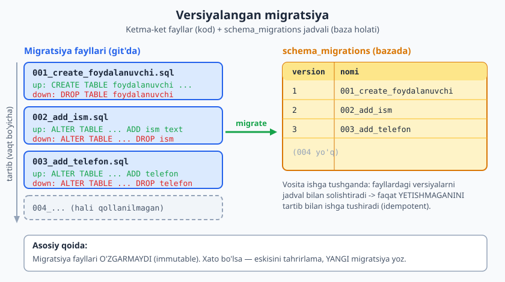
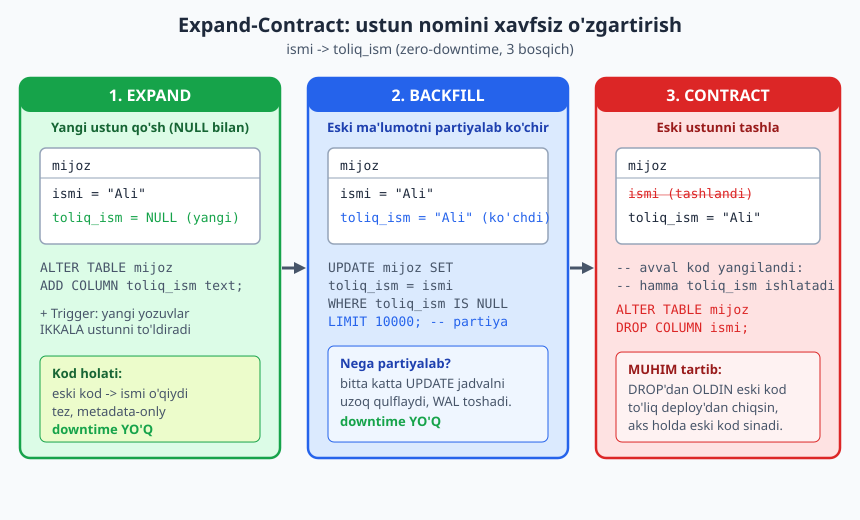
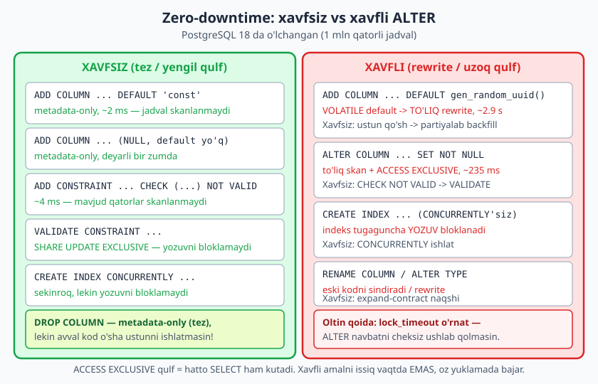

# 23 — Migratsiya va sxema evolyutsiyasi

[⬅️ Oldingi: 22 — Partitioning, sharding va masshtablash](./22-partitioning-masshtab.md) · [🏠 README](./README.md) · [Keyingi: 24 — Yakuniy loyiha: tizimni 0 dan loyihalash ➡️](./24-yakuniy-loyiha.md)

> **Bu bobda:** hech bir sxema bir marta yozilib, abadiy qotib qolmaydi — biznes o'sadi, talab o'zgaradi, ustun qo'shiladi, nomi o'zgaradi, ba'zan butun jadval bo'linadi. Shu o'zgarishlarni xavfsiz, qaytarib bo'ladigan va jamoa bilan birga ishlaydigan qilib boshqarishni o'rganamiz: versiyalangan migratsiya fayllari va `schema_migrations` jadvali; mashhur vositalar (Flyway, Liquibase, Alembic, Prisma, golang-migrate) qaysi tilda; zero-downtime migratsiya prinsipi; expand-contract (parallel change) naqshi bilan ustunni xavfsiz qo'shish/o'chirish/qayta nomlash; katta jadvalga ustun qo'shishning yashirin xavfi va PostgreSQL ning unga munosabati; rollback rejasi. Hamma misol PostgreSQL 18.4 da haqiqatan ishga tushirilgan — qulf vaqtlari va o'lchovlar real.

---

## 0. Bu bob qayerda turadi

Avvalgi boblar **sxemani loyihalash** haqida edi: qanday jadval, qaysi kalit, qaysi indeks, qanday partition. Bu bob boshqacha savolga javob beradi:

> "Sxemam ishlab turibdi va unda ma'lumot bor. Endi uni qanday **o'zgartiraman** — ishlab turgan tizimni buzmasdan?"

Bu — operatsion mahorat. Bo'sh bazada `ALTER TABLE` yozish oson; ichida 50 million qator va ustida 200 ta parallel so'rov bor bazada o'sha `ALTER` ni xavfsiz bajarish — butunlay boshqa masala. SQL kitobida `ALTER` **sintaksisini** ko'rgansiz; bu yerda **qaysi `ALTER` xavfsiz, qaysisi tizimni to'xtatadi** va ularni qanday tartibga solishni ko'ramiz.

> **Hayotiy o'xshatish:** sxema o'zgarishi — yo'lda ketayotgan poyezdning g'ildiragini almashtirishga o'xshaydi. Poyezdni to'xtatib qo'yib, hammasini bir kunda qilish (downtime) oson, lekin yo'lovchilar (foydalanuvchilar) g'azablanadi. Mahorat — poyezd yurib turganda, asta-sekin, hech kim sezmaydigan qilib g'ildirakni almashtirishda. Bu bob aynan shu haqida.

---

## 1. Nega migratsiya kerak: sxema vaqt o'tishi bilan o'zgaradi

Real loyihada sxema o'zgarishi — istisno emas, **norma**. Bir nechta tipik sabab:

- **Yangi funksiya:** foydalanuvchiga telefon raqami qo'shildi -> yangi ustun.
- **Refaktoring:** `ismi` ustuni aslida to'liq ismni saqlardi -> uni `toliq_ism` ga aniqlashtirish.
- **Normalizatsiya tuzatish:** vergulli ro'yxat (anti-naqsh, 13-bob) ni alohida jadvalga ajratish.
- **Performans:** indeks qo'shish, ustun turini o'zgartirish, jadvalni partition qilish (22-bob).

Savol "o'zgaradimi?" emas, "o'zgarishni **qanday boshqaramiz**?". Ikki yomon javob bor:

1. **Qo'lda:** kimdir productionda `psql` ochib `ALTER TABLE` yozadi. Hech qayerda yozilmaydi. Ikki haftadan keyin "test bazasida bu ustun bor, productionda yo'q — nega?" degan savol tug'iladi. Halokat.
2. **Hech qachon o'zgartirmaslik:** sxemani "muzlatib" qo'yib, hamma narsani `jsonb` ustunga tiqish. Bu — yaxlitlikni tashlab, anarxiyaga yo'l ochish (13-bobdagi EAV anti-naqshining ko'rinishi).

To'g'ri javob — **versiyalangan migratsiya**: har bir sxema o'zgarishi alohida, raqamlangan, git'da saqlanadigan fayl bo'ladi. Kod kabi review qilinadi, kod kabi deploy qilinadi.

---

## 2. Versiyalangan migratsiya: ketma-ket fayllar + holat jadvali

G'oya juda sodda va kuchli:

- Har bir sxema o'zgarishi — **alohida fayl**, ketma-ket raqam (yoki vaqt belgisi) bilan: `001_...`, `002_...`, `003_...`.
- Har bir migratsiyada kamida **up** (forward — o'zgarishni qo'llash) bo'ladi; ko'pincha **down** (rollback — orqaga qaytarish) ham.
- Baza qaysi migratsiyalar allaqachon qo'llanilganini **`schema_migrations`** (yoki shunga o'xshash) jadvalida saqlaydi.
- Migratsiya vositasi ishga tushganda: fayllardagi versiyalarni jadval bilan solishtiradi va faqat **yetishmaganini** tartib bilan qo'llaydi.



### 2.1 `schema_migrations` jadvali — bazaning xotirasi

Eng oddiy ko'rinishi: faqat versiya raqami va nomi. PostgreSQL 18 da yaratamiz:

```sql
CREATE SCHEMA IF NOT EXISTS ch23;
SET search_path = ch23;

CREATE TABLE schema_migrations (
    version     bigint      PRIMARY KEY,
    nomi        text        NOT NULL,
    qollanildi  timestamptz NOT NULL DEFAULT now()
);
```

Endi ikkita migratsiyani "qo'llaymiz" — har birida sxema o'zgarishi **va** `schema_migrations` ga yozuv bitta tranzaksiyada boradi (bu muhim: agar `ALTER` muvaffaqiyatli bo'lsa-yu, yozuv qo'shilmasa, vosita uni qaytadan qo'llashga urinadi):

```sql
-- migratsiya 001: dastlabki jadval
CREATE TABLE foydalanuvchi (
    id    bigint GENERATED ALWAYS AS IDENTITY PRIMARY KEY,
    email text NOT NULL UNIQUE
);
INSERT INTO schema_migrations (version, nomi) VALUES (1, '001_create_foydalanuvchi');

-- migratsiya 002: ism ustuni
ALTER TABLE foydalanuvchi ADD COLUMN ism text;
INSERT INTO schema_migrations (version, nomi) VALUES (2, '002_add_ism');

SELECT version, nomi FROM schema_migrations ORDER BY version;
```

Haqiqiy chiqish (PG 18.4 da ishga tushirilgan):

```
 version |           nomi
---------+--------------------------
       1 | 001_create_foydalanuvchi
       2 | 002_add_ism
(2 rows)
```

Vosita keyingi safar ishga tushganda `SELECT max(version)` qilib "men 2-gachani bilaman" deydi va faqat 3-dan boshlab qo'llaydi. Mana shu — migratsiyaning butun mexanizmi.

> **Asosiy qoida — migratsiya fayli o'zgarmas (immutable):** allaqachon qo'llanilgan migratsiyani **hech qachon tahrirlamang**. Test bazasida ishlagan, ko'pchilik mashinasiga tarqalgan migratsiyani o'zgartirsangiz — kimdadir eski, kimdadir yangi versiya qo'llanadi va bazalar bir-biridan farq qiladi. Xato bor bo'lsa — eskisini tuzatmang, **yangi** migratsiya yozing.

### 2.2 Up va Down (forward va rollback)

Migratsiya faylida ko'pincha ikki yo'nalish bo'ladi:

```sql
-- 003_add_telefon.sql

-- == up (forward) ==
ALTER TABLE foydalanuvchi ADD COLUMN telefon text;

-- == down (rollback) ==
-- ALTER TABLE foydalanuvchi DROP COLUMN telefon;
```

`down` — "agar bu migratsiya xato bo'lsa, uni qanday qaytaraman?". Uni haqiqatan ishlab ko'ramiz (up qo'llaymiz, keyin down bilan qaytaramiz):

```sql
-- 003 migratsiya: ustun qo'shish (up) -> uni qaytarish (down)
ALTER TABLE foydalanuvchi ADD COLUMN telefon text;   -- up
INSERT INTO schema_migrations (version, nomi) VALUES (3, '003_add_telefon');
SELECT 'UP dan keyin' AS bosqich, max(version) AS oxirgi_versiya FROM schema_migrations;

-- DOWN: 003 ni orqaga qaytarish
ALTER TABLE foydalanuvchi DROP COLUMN telefon;       -- down
DELETE FROM schema_migrations WHERE version = 3;
SELECT 'DOWN dan keyin' AS bosqich, max(version) AS oxirgi_versiya FROM schema_migrations;
```

Haqiqiy chiqish:

```
   bosqich    | oxirgi_versiya
--------------+----------------
 UP dan keyin |              3
(1 row)

    bosqich     | oxirgi_versiya
----------------+----------------
 DOWN dan keyin |              2
(1 row)
```

> **Down haqida halol gap:** ko'plab jamoalar productionda `down` ga **ishonmaydi**. Sababi: `down` ko'pincha ma'lumotni yo'qotadi (`DROP COLUMN` o'sha ustundagi hamma narsani o'chiradi — uni "qaytarib bo'lmaydi"). Shuning uchun ko'p tashkilotda haqiqiy rollback strategiyasi — `down` migratsiya emas, balki **oldinga yuradigan tuzatuvchi migratsiya** (forward fix). `down` ni asosan lokal/test muhitda ishlatishadi. Buni 8-bo'limda batafsil ko'ramiz.

---

## 3. Migratsiya vositalari: qaysi til, qaysi vosita

Yuqoridagi mexanizmni har safar qo'lda yozmaysiz — buni vositalar avtomatlashtiradi. Hammasi bir xil g'oyaga asoslanadi (ketma-ket fayllar + holat jadvali), faqat sintaksis va ekotizim farq qiladi. Tushuncha darajasida:

| Vosita | Ekotizim / til | Migratsiya formati | Xususiyat |
|---|---|---|---|
| **Flyway** | Java/JVM (lekin har qanday loyiha bilan CLI) | sof `.sql` fayllar (`V1__...sql`) | Sodda, SQL-asosli; "shunchaki SQL yozaman" deydiganlar uchun |
| **Liquibase** | Java/JVM | XML / YAML / JSON / SQL | DB-mustaqil (changelog) — bir nechta bazaga bir xil migratsiya |
| **Alembic** | Python (SQLAlchemy bilan) | Python skript (`upgrade()`/`downgrade()`) | Django'dan tashqari Python loyihalar; avtomatik diff generatsiya |
| **Django migrations** | Python (Django ORM) | Python (`makemigrations`) | Model o'zgarishidan migratsiya avtomatik chiqariladi |
| **Prisma Migrate** | Node.js / TypeScript | `schema.prisma` -> SQL | Deklarativ sxema fayli; diff'dan SQL chiqariladi |
| **golang-migrate** | Go | juft `.up.sql` / `.down.sql` fayllar | Go loyihalar; sof SQL, ko'p baza bilan |
| **dbmate / goose** | Go / til-mustaqil | `.sql` fayllar | Yengil, CLI-asosli |
| **Rails Active Record** | Ruby on Rails | Ruby DSL | Rails ekotizimi |

Ikki keng yondashuv:

- **Imperativ (versiyalangan):** siz har bir o'zgarishni o'zingiz yozasiz (`ALTER TABLE ...`). Flyway, golang-migrate, Alembic shunday. To'liq nazorat, lekin ko'proq yozish.
- **Deklarativ (holat-asosli):** siz "sxema **qanday** bo'lishi kerakligini" yozasiz, vosita joriy holat bilan solishtirib, `ALTER` larni **avtomatik** chiqaradi. Prisma, Django (qisman), `atlas`, `skeema` shunday. Qulay, lekin chiqarilgan SQL ni **albatta tekshiring** — vosita ba'zan xavfli `ALTER` (jadval rewrite) ni avtomatik chiqarib qo'yadi.

> **Dizayn maslahati:** vosita qaysi bo'lishidan qat'i nazar, qoidalar bir xil: fayllar versiyalangan va o'zgarmas, har migratsiya kichik va aniq, hammasi git'da, deploy quvuriga ulangan. Vosita — mexanizm; intizom — sizdan.

> **MySQL'da farq:** MySQL'ning eski versiyalarida ko'p `ALTER` jadvalni to'liq qayta yozardi va uzoq qulflardi; shuning uchun `pt-online-schema-change` (Percona) yoki `gh-ost` (GitHub) kabi maxsus "online schema change" vositalari mashhur — ular yangi jadval yaratib, ma'lumotni triggerlar bilan ko'chiradi. PostgreSQL'da ko'p amal allaqachon yengil bo'lgani uchun ko'pincha bunday vosita kerak emas (3-7 bo'limlarda ko'ramiz).

---

## 4. Zero-downtime migratsiya prinsipi

Eng muhim tushuncha. Zamonaviy tizim doim ishlab turadi — uni "to'xtatib, sxemani o'zgartirib, qaytadan yoqamiz" deb bo'lmaydi (bu downtime). Demak migratsiya **ishlab turgan** tizimda bo'lishi kerak. Bu bitta tub haqiqatga olib keladi:

> **Migratsiya paytida (va undan keyin biroz vaqt) ESKI kod va YANGI kod BIRGA ishlaydi.**

Nega? Chunki deploy oniy emas. Siz yangi kodni server-serverga, instans-instansiga yoyasiz. Bir necha soniya/daqiqa davomida bir qism serverlar **eski** kodni, bir qism **yangi** kodni ishlatadi — va ikkalasi ham **bitta** bazaga uriladi. Shuningdek, baza o'zgarishi va kod deploy'i bir vaqtda emas.

Bu ikki yo'nalishli moslik talab qiladi:

- **Orqaga moslik (backward compatibility):** sxemaning yangi holati **eski kod** bilan ham ishlashi kerak. Misol: yangi ustun qo'shsangiz, u `NULL` qabul qilishi yoki `DEFAULT` ga ega bo'lishi kerak — chunki eski kod `INSERT` da uni bilmaydi va qiymat bermaydi.
- **Oldinga moslik (forward compatibility):** sxemaning eski holati **yangi kod** bilan ishlashi kerak (yangi kod hali yo'q ustunga murojaat qilmasin).

Buni buzadigan klassik xato:

```sql
-- ❌ XAVFLI: bir migratsiyada ustunni darrov NOT NULL qilib qo'shish
ALTER TABLE foydalanuvchi ADD COLUMN telefon text NOT NULL;
-- Eski kod INSERT qilganda telefon bermaydi -> XATO, eski instanslar sinadi.
```

Yana bitta:

```sql
-- ❌ XAVFLI: ustunni darrov o'chirish
ALTER TABLE foydalanuvchi DROP COLUMN ism;
-- Hali eski kod ishlab turgan bo'lsa va u "ism" ni o'qisa/yozsa -> XATO.
```

Bu muammolarning yechimi — keyingi bo'limdagi **expand-contract** naqshi: o'zgarishni bir zarba bilan emas, bir necha xavfsiz qadamga bo'lib bajarish.

---

## 5. Expand-Contract (parallel change) naqshi

Bu — zero-downtime sxema o'zgarishining markaziy naqshi. G'oya: har qanday "buzuvchi" o'zgarishni uch bosqichga bo'lamiz, va har bosqich orasida eski va yangi kod **birga** ishlay oladi.

1. **Expand (kengaytirish):** yangi struktura qo'shamiz, eskisini **saqlab qolamiz**. Baza endi ikkalasini ham qo'llab-quvvatlaydi.
2. **Migrate / Backfill:** ma'lumotni eski strukturadan yangisiga ko'chiramiz; kodni asta-sekin yangisiga o'tkazamiz.
3. **Contract (qisqartirish):** hamma yangisiga o'tgach, eskisini **tashlaymiz**.



Eng ko'p chalkashlik tug'diradigan amalni — **ustun nomini o'zgartirish** ni — to'liq ko'rib chiqamiz. `RENAME COLUMN` ni to'g'ridan qilib bo'lmaydi: u bir lahzada eski nomni yo'qotadi va o'sha nomdan foydalanayotgan har qanday eski kod **darrov** sinadi. Buning o'rniga expand-contract.

Vaziyat: `mijoz` jadvalida `ismi` ustuni bor; uni `toliq_ism` ga o'zgartirmoqchimiz. Test uchun 50 000 qator yuklaymiz:

```sql
SET search_path = ch23;

CREATE TABLE mijoz (
    id    bigint GENERATED ALWAYS AS IDENTITY PRIMARY KEY,
    ismi  text NOT NULL
);
INSERT INTO mijoz (ismi)
SELECT 'Mijoz ' || g FROM generate_series(1, 50000) g;
SELECT count(*) AS jami FROM mijoz;
```

```
 jami
-------
 50000
(1 row)
```

### 5.1 Expand — yangi ustun + sinxron trigger

Yangi ustunni `NULL` bilan qo'shamiz (tez, metadata-only) va **trigger** o'rnatamiz: bundan keyin har qanday `INSERT`/`UPDATE` ikkala ustunni ham izchil ushlab turadi. Bu — naqshning yuragi: trigger tufayli **eski kod** (`ismi` ga yozadi) ham, **yangi kod** (`toliq_ism` ga yozadi) ham to'g'ri ishlaydi.

```sql
-- EXPAND: yangi ustun (NULL bilan, metadata-only, tez)
ALTER TABLE mijoz ADD COLUMN toliq_ism text;

-- Sinxron trigger: ikkala ustun bir-biriga mos qoladi
CREATE FUNCTION sync_ism() RETURNS trigger AS $$
BEGIN
    IF NEW.toliq_ism IS NULL THEN NEW.toliq_ism := NEW.ismi; END IF;
    IF NEW.ismi IS NULL THEN NEW.ismi := NEW.toliq_ism; END IF;
    RETURN NEW;
END;
$$ LANGUAGE plpgsql;

CREATE TRIGGER trg_sync_ism BEFORE INSERT OR UPDATE ON mijoz
    FOR EACH ROW EXECUTE FUNCTION sync_ism();
```

### 5.2 Backfill — mavjud ma'lumotni partiyalab ko'chirish

Trigger faqat **yangi** o'zgarishlarni ushlaydi; eski 50 000 qatorda `toliq_ism` hali `NULL`. Ularni ko'chirish kerak. **Bitta katta `UPDATE` yozmang** — u jadvalni uzoq qulflaydi va WAL ni toshiradi. Buning o'rniga **partiya-partiya** (batch) ko'chiramiz:

```sql
DO $$
DECLARE
    tasirlangan integer;
    jami        bigint := 0;
BEGIN
    LOOP
        UPDATE mijoz
           SET toliq_ism = ismi
         WHERE id IN (
             SELECT id FROM mijoz
              WHERE toliq_ism IS NULL
              ORDER BY id
              LIMIT 10000
         );
        GET DIAGNOSTICS tasirlangan = ROW_COUNT;
        jami := jami + tasirlangan;
        EXIT WHEN tasirlangan = 0;
        RAISE NOTICE 'Partiya yangilandi: % qator (jami %)', tasirlangan, jami;
        -- real loyihada: bu yerda COMMIT (procedure ichida) + qisqa kutish (pg_sleep)
    END LOOP;
    RAISE NOTICE 'Backfill tugadi. Jami: %', jami;
END $$;

-- Backfill to'liqligini tekshiramiz
SELECT count(*) FILTER (WHERE toliq_ism IS NULL) AS qolgan_null,
       count(*) FILTER (WHERE toliq_ism = ismi)  AS mos
FROM mijoz;
```

Haqiqiy chiqish (PG 18.4):

```
NOTICE:  Partiya yangilandi: 10000 qator (jami 10000)
NOTICE:  Partiya yangilandi: 10000 qator (jami 20000)
NOTICE:  Partiya yangilandi: 10000 qator (jami 30000)
NOTICE:  Partiya yangilandi: 10000 qator (jami 40000)
NOTICE:  Partiya yangilandi: 10000 qator (jami 50000)
NOTICE:  Backfill tugadi. Jami: 50000
 qolgan_null |  mos
-------------+-------
           0 | 50000
(1 row)
```

> **Real loyihada `DO` blokining cheklovi:** `DO` blok bitta tranzaksiyada ishlaydi, demak ichidagi `LOOP` ham yagona tranzaksiya — qulf butun davomida ushlanadi. Productionda partiyalarni **alohida tranzaksiyalarda** commit qilish kerak: buni `CALL` qilinadigan **PROCEDURE** ichida `COMMIT` bilan, yoki migratsiya vositasi/skript darajasida tashqi tsikl bilan qilasiz (har partiya — alohida `UPDATE ... LIMIT` so'rovi, oralarida `pg_sleep` bilan). Yuqoridagi `DO` — mantiqni namoyish qilish uchun; ssenariy to'g'ri, lekin haqiqiy zero-downtime backfill partiyalarni **alohida commit qiladi**.

### 5.3 Contract — kod ko'chgach, eskisini tashlash

Endi (va faqat **kod to'liq `toliq_ism` ga o'tgach va eski kod deploy'dan chiqib ketgach**) eski ustunni tashlaymiz va trigger'ni olib tashlaymiz:

```sql
-- CONTRACT: yangi ustunni NOT NULL qilib, eskisini tashlaymiz
ALTER TABLE mijoz ALTER COLUMN toliq_ism SET NOT NULL;
DROP TRIGGER trg_sync_ism ON mijoz;
DROP FUNCTION sync_ism();
ALTER TABLE mijoz DROP COLUMN ismi;

\d mijoz
```

Haqiqiy chiqish:

```
                            Table "ch23.mijoz"
  Column   |  Type  | Collation | Nullable |           Default
-----------+--------+-----------+----------+------------------------------
 id        | bigint |           | not null | generated always as identity
 toliq_ism | text   |           | not null |
Indexes:
    "mijoz_pkey" PRIMARY KEY, btree (id)
```

Ustun "qayta nomlandi" — lekin tizim bir lahza ham to'xtamadi va hech qaysi kod sinmadi.

### 5.4 Naqshning umumiy ko'rinishi

Bir xil uch qadam boshqa o'zgarishlarga ham mos:

| O'zgarish | Expand | Migrate | Contract |
|---|---|---|---|
| **Ustun qo'shish** | `ADD COLUMN` NULL/DEFAULT bilan | (kerak bo'lsa) backfill | kod o'tgach `SET NOT NULL` |
| **Ustun o'chirish** | kodni ustunni ishlatmaydigan qilish | — | eski kod chiqgach `DROP COLUMN` |
| **Ustun qayta nomlash** | yangi ustun + sinxron trigger | backfill | kod o'tgach eski ustunni `DROP` |
| **Tur o'zgartirish** | yangi turli ustun + trigger | backfill (konvertatsiya bilan) | eski ustunni `DROP` |
| **Jadval bo'lish (split)** | yangi jadval + dual-write | backfill | eski ustunlarni `DROP` |

> **Eslab qoling:** "expand" qadam doim **qo'shadi** (additive, orqaga mos), "contract" qadam **olib tashlaydi** (destructive) va u faqat eski kod butunlay yo'qolgach bajariladi. O'rtada — backfill va kod migratsiyasi. Tartibni buzsangiz — downtime yoki ma'lumot yo'qotish.

---

## 6. Katta jadvalga ustun qo'shish: yashirin xavf va PostgreSQL ning xatti-harakati

Endi eng ko'p chalg'itadigan mavzu. "Ustun qo'shish — bir qator SQL, nima xavfi bor?" Xavfi — **qulf** va **jadval rewrite**. Lekin PostgreSQL bu borada yillar davomida ancha yaxshilandi. Hammasini 1 million qatorli jadvalda **o'lchaymiz**.

Avval katta jadval tayyorlaymiz:

```sql
SET search_path = ch23;

CREATE TABLE buyurtma (
    id      bigint GENERATED ALWAYS AS IDENTITY PRIMARY KEY,
    summa   numeric(12,2) NOT NULL
);
INSERT INTO buyurtma (summa)
SELECT (random()*1000)::numeric(12,2) FROM generate_series(1, 1000000);
SELECT count(*) AS qatorlar,
       pg_size_pretty(pg_total_relation_size('buyurtma')) AS hajm
FROM buyurtma;
```

```
 qatorlar | hajm
----------+-------
  1000000 | 64 MB
(1 row)
```



### 6.1 XAVFSIZ: doimiy (constant) DEFAULT bilan ustun qo'shish

PostgreSQL 11 dan beri **doimiy** `DEFAULT` qiymatli ustun qo'shish — **metadata-only** amal. PG jadvalning har bir qatoriga qiymatni yozmaydi; u shunchaki katalogga "bu ustunning eski qatorlardagi qiymati — mana shu doimiy" deb belgilaydi va kerak bo'lganda o'qishda qaytaradi. Demak — bir zumda, jadval hajmidan qat'i nazar:

```sql
-- \timing on (psql)
ALTER TABLE buyurtma ADD COLUMN holat text NOT NULL DEFAULT 'yangi';
-- Time: 2.359 ms
SELECT holat, count(*) FROM buyurtma GROUP BY holat;
```

```
 holat |  count
-------+---------
 yangi | 1000000
(1 row)
```

1 million qatorga `NOT NULL DEFAULT` bilan ustun qo'shish — **2.4 millisekund**. Diqqat: bu `NOT NULL` bo'lsa ham tez, chunki DEFAULT doimiy va PG har qatorni yozmaydi.

### 6.2 XAVFLI: o'zgaruvchan (VOLATILE) DEFAULT — to'liq rewrite

Endi DEFAULT **har qatorda har xil** bo'lsa-chi (masalan `gen_random_uuid()`)? PG har qatorga alohida qiymat yozishi shart — demak butun jadvalni **qayta yozadi** (rewrite) va shu davomida `ACCESS EXCLUSIVE` qulf ushlaydi (hatto `SELECT` ham kutadi):

```sql
-- ❌ XAVFLI katta jadvalda: VOLATILE default -> to'liq rewrite
ALTER TABLE buyurtma ADD COLUMN tasodif uuid NOT NULL DEFAULT gen_random_uuid();
-- Time: 2863.435 ms  (~2.9 soniya, 64 MB jadval uchun)
```

2.4 ms va 2863 ms — **mingdan ortiq farq**. 1 GB jadvalda bu daqiqalarga aylanadi, va shu davomida jadval to'liq bloklangan. To'g'ri yo'l — ustunni DEFAULT'siz qo'shib, qiymatni **partiyalab backfill** qilish (5.2-bo'limdagi naqsh).

### 6.3 XAVFLI: mavjud ustunga `SET NOT NULL`

Mavjud ustunni `NOT NULL` qilish PG ni butun jadvalni skanlashga majbur qiladi ("hech bir qatorda `NULL` yo'qmi?") va shu davomida `ACCESS EXCLUSIVE` qulf ushlaydi:

```sql
ALTER TABLE buyurtma ADD COLUMN izoh text;
UPDATE buyurtma SET izoh = 'x' WHERE id <= 1000000;
-- Time: 6754.570 ms (UPDATE'ning o'zi katta)
ALTER TABLE buyurtma ALTER COLUMN izoh SET NOT NULL;
-- Time: 235.361 ms  (to'liq skan, qulf bilan)
```

235 ms — kichik ko'rinadi, lekin shu paytda **hamma yozuv va o'qish kutadi**. Issiq jadvalda bu sezilarli to'xtalish. Xavfsiz muqobil — keyingi bo'limdagi `NOT VALID` hiyla.

### 6.4 XAVFSIZ hiyla: `CHECK ... NOT VALID` keyin `VALIDATE`

`NOT NULL` ni to'g'ridan majburlash o'rniga, **`CHECK (... IS NOT NULL)` constraint** ni ikki qadamda qo'shamiz. Birinchi qadam (`NOT VALID`) mavjud qatorlarni **skanlamaydi** — faqat bundan keyingi yozuvlarga tegishli, demak deyarli bir zumda va yengil qulf. Ikkinchi qadam (`VALIDATE`) mavjud qatorlarni tekshiradi, lekin u **`SHARE UPDATE EXCLUSIVE`** qulf bilan — bu **yozuvni bloklamaydi**:

```sql
-- 1-qadam: NOT VALID -> mavjud qatorlar skanlanmaydi (tez, yengil qulf)
ALTER TABLE buyurtma ADD CONSTRAINT summa_musbat CHECK (summa >= 0) NOT VALID;
-- Time: 3.791 ms

-- 2-qadam: VALIDATE -> mavjudlarni tekshiradi, lekin yozuvni bloklamaydi
ALTER TABLE buyurtma VALIDATE CONSTRAINT summa_musbat;
-- Time: 109.570 ms
```

```
   conname    | convalidated
--------------+--------------
 summa_musbat | t
(1 row)
```

Bir xil natijaga erishdik (qoida majburlanadi), lekin og'ir `ACCESS EXCLUSIVE` qulfni butun jadval skani davomida ushlamadik. Aynan shu hiyla `FOREIGN KEY` qo'shishda ham ishlaydi: `ADD FOREIGN KEY ... NOT VALID` (tez) -> `VALIDATE CONSTRAINT` (yengil qulf).

### 6.5 XAVFSIZ: `CREATE INDEX CONCURRENTLY`

Oddiy `CREATE INDEX` indeks qurilguncha jadvalga **yozishni** bloklaydi. Katta jadvalda bu uzoq. `CONCURRENTLY` — sekinroq, lekin yozuvni **bloklamaydi**:

```sql
-- Oddiy: yozishni bloklaydi
CREATE INDEX idx_buyurtma_holat ON buyurtma (holat);
-- Time: 329.315 ms

-- CONCURRENTLY: sekinroq, lekin yozuvni bloklamaydi
CREATE INDEX CONCURRENTLY idx_buyurtma_summa ON buyurtma (summa);
-- Time: 916.118 ms
```

`CONCURRENTLY` qariyb 3 baravar sekinroq (916 ms vs 329 ms), lekin productionda bu deyarli har doim to'g'ri tanlov — chunki tizim ishlab turaveradi.

> **MUHIM cheklov:** `CREATE INDEX CONCURRENTLY` ni **tranzaksiya ichida ishlatib bo'lmaydi**. Ko'p migratsiya vositasi har migratsiyani avtomatik `BEGIN...COMMIT` ga o'raydi — shuning uchun `CONCURRENTLY` migratsiyasini alohida, tranzaksiyasiz belgilash kerak (masalan Django'da `atomic = False`, golang-migrate'da alohida fayl). Tekshirib ko'ramiz:

```sql
BEGIN;
CREATE INDEX CONCURRENTLY idx_xato ON buyurtma (id);
COMMIT;
```

Haqiqiy chiqish:

```
ERROR:  CREATE INDEX CONCURRENTLY cannot run inside a transaction block
```

Yana bir nozik nuqta: `CONCURRENTLY` yarmida uzilib qolsa, **yaroqsiz (invalid)** indeks qoldirishi mumkin — uni `DROP INDEX` qilib qaytadan yaratish kerak (`pg_index.indisvalid = false` bilan topiladi).

### 6.6 Oltin qoida: `lock_timeout`

Xavfli `ALTER` ni majbur bajarishga to'g'ri kelsa, **`lock_timeout`** o'rnating. Sababi: agar `ALTER` darrov qulf ololmasa (kimdir uzoq tranzaksiya ushlab turibdi), u **navbatda kutadi** — va u kutayotganda **ortidagi hamma so'rov ham kutadi** (u `ACCESS EXCLUSIVE` so'ragani uchun navbatni to'sib qo'yadi). Bu butun bazani qotirishi mumkin. `lock_timeout` bilan `ALTER` "qulfni 2 soniyada ololmasam, voz kechaman" deydi:

```sql
SET lock_timeout = '2s';
ALTER TABLE buyurtma ADD COLUMN qoshimcha text;
RESET lock_timeout;
```

Agar qulf 2 soniyada olinmasa, `ALTER` xato bilan to'xtaydi (`canceling statement due to lock timeout`) va navbat tiqilib qolmaydi — siz keyinroq qaytadan urinasiz. Bu — production migratsiyasining standart ehtiyot choralaridan biri.

Tozalash:

```sql
DROP SCHEMA ch23 CASCADE;
```

---

## 7. Ma'lumot migratsiyasi (data migration) vs sxema migratsiyasi

Ikki turdagi migratsiyani ajrating:

- **Sxema migratsiyasi (DDL):** strukturani o'zgartirish — `CREATE`/`ALTER`/`DROP`. Tez (yengil bo'lsa), atomik.
- **Ma'lumot migratsiyasi (DML):** mavjud ma'lumotni qayta shakllantirish — `UPDATE`/`INSERT ... SELECT`. Sekin, katta, partiyalab.

Ularni **aralashtirmang**. Klassik xato — bitta migratsiya faylida `ALTER TABLE ADD COLUMN` va keyin darrov `UPDATE ... SET yangi_ustun = ...` (butun jadvalga). DDL bir zumda bo'ladi, lekin `UPDATE` million qatorda daqiqalarcha qulf ushlaydi va migratsiya "qotib" qoladi.

To'g'ri amaliyot:

1. **Sxema migratsiyasi** — ustun qo'shadi (tez, deploy quvurida).
2. **Backfill** — alohida, partiyalab, fon jarayonida (yoki alohida bir martalik skript). Migratsiya vositasi ba'zan buni qo'llab-quvvatlaydi, lekin ko'pincha bu — alohida operatsion qadam.

Backfill skeletining production varianti (partiyalar **alohida** commit qilinadi):

```text
batch_size = 5000
LOOP:
    affected = UPDATE jadval SET yangi = f(eski)
               WHERE id IN (SELECT id FROM jadval
                            WHERE yangi IS NULL ORDER BY id LIMIT batch_size)
    COMMIT                      -- har partiya alohida commit -> qulf tutilmaydi
    if affected == 0: break
    sleep(50ms)                 -- bazani "nafas oldirish" (replica lag, vacuum)
```

Indeksdan foydalanish uchun `WHERE yangi IS NULL` ustiga **partial index** (`CREATE INDEX ... WHERE yangi IS NULL`) qo'shsangiz, har partiya tez topiladi va backfill tugagach indeksni tashlaysiz.

---

## 8. Rollback rejasi: orqaga qaytishni qanday loyihalash

Migratsiya productionda noto'g'ri ketsa nima qilasiz? Bu — oldindan o'ylangan **reja** bo'lishi kerak, panika emas.

### 8.1 `down` migratsiya — illyuziya emas, ehtiyot bilan

`down` (3.2-bo'limda ko'rgan) lokal/test uchun ajoyib. Lekin productionda u ko'pincha **xavfli**:

- `DROP COLUMN` ning `down` i `ADD COLUMN` — lekin ustundagi **ma'lumot abadiy yo'qolgan**. "Qaytarib bo'lmaydi".
- Ma'lumot migratsiyasini qaytarish ko'pincha imkonsiz (qanday qilib parchalangan ma'lumotni qayta birlashtirasiz?).

### 8.2 Forward-fix — production uchun haqiqiy strategiya

Ko'p yetuk jamoa qoidasi: **production rollback = oldinga yuradigan tuzatuvchi migratsiya**, `down` emas. Ya'ni xatoni "orqaga qaytarish" emas, balki uni tuzatadigan **yangi** migratsiya yozasiz. Buni mumkin qiladigan narsa — yana **expand-contract**: agar har o'zgarish orqaga mos (additive) bo'lsa, eski kodga qaytish ham, oldinga tuzatish ham xavfsiz.

### 8.3 Rollback rejasining elementlari

Har bir xavfli migratsiyadan **oldin** quyidagilar tayyor bo'lsin:

1. **Zaxira (backup) / nuqta:** migratsiyadan oldin zaxira yoki PITR (point-in-time recovery) nuqtasi. Eng so'nggi xavfsizlik to'ri.
2. **Kichik, qaytariladigan qadamlar:** bitta ulkan migratsiya o'rniga bir nechta kichik — har biri alohida deploy va alohida rollback nuqtasi.
3. **Additive-first:** "expand" qadamlar (qo'shuvchi) doim xavfsiz qaytariladi (yangi narsani tashlash — eski kodga tegmaydi). "Contract" qadamlarni **eng oxirga** va **alohida** deploy qiling.
4. **Feature flag bilan ajratish:** kod o'zgarishi va sxema o'zgarishini ajrating. Yangi ustun bor, lekin uni ishlatuvchi kod **flag** ortida — muammo bo'lsa flagni o'chirasiz (kodni rollback qilmay).
5. **Sinab ko'rish:** migratsiyani avval staging/test bazasida (production hajmiga yaqin) ishga tushiring va **vaqtini o'lchang** — productionda qancha qulf bo'lishini bilib oling.

> **Asosiy fikr:** eng yaxshi rollback rejasi — rollback **kerak bo'lmaydigan** dizayn. Har o'zgarishni orqaga mos (additive) qilib, kichik qadamlarga bo'lib, feature flag bilan ajratsangiz, "orqaga qaytarish" o'rniga doim "oldinga tuzatish" mumkin bo'ladi — va bu ancha xavfsiz.

---

## 9. Amaliy yakuniy ro'yxat (production migratsiya checklist)

- [ ] Har migratsiya — alohida, versiyalangan, o'zgarmas fayl, git'da, review qilingan.
- [ ] Sxema (DDL) va ma'lumot (backfill) migratsiyalari ajratilgan.
- [ ] Buzuvchi o'zgarishlar expand-contract bilan bosqichlangan (additive avval).
- [ ] Ustun DEFAULT'i doimiymi? (VOLATILE bo'lsa — rewrite xavfi).
- [ ] `SET NOT NULL` o'rniga `CHECK ... NOT VALID` -> `VALIDATE`.
- [ ] Indeks `CONCURRENTLY` bilan, tranzaksiyadan tashqari.
- [ ] Xavfli `ALTER` da `lock_timeout` o'rnatilgan.
- [ ] Backfill partiyalab, alohida commit, oralarda kutish bilan.
- [ ] Migratsiya staging'da (production hajmiga yaqin) sinab, vaqti o'lchangan.
- [ ] Rollback rejasi: zaxira nuqtasi + forward-fix imkoniyati + feature flag.

---

## Mashqlar

### Oson

1. **`schema_migrations` jadvali.** Versiyani vaqt belgisi (timestamp) sifatida (masalan `20260613120000`) saqlaydigan `schema_migrations` jadvalini loyihalang. Nega ko'p vosita ketma-ket raqam (`001`) o'rniga vaqt belgisidan foydalanadi — bir jumlada tushuntiring.
2. **Up va down yozing.** `mahsulot` jadvaliga `tavsif text` ustunini qo'shadigan migratsiyaning `up` va `down` qismlarini yozing.
3. **Vosita mosligi.** Quyidagi loyihalarning har biri uchun mos migratsiya vositasini ayting: (a) Django backend, (b) Go mikroservis, (c) Node/TypeScript + Prisma, (d) "men shunchaki sof SQL yozaman" deydigan Java jamoa.
4. **Tez yoki sekin?** Quyidagilardan qaysi biri 10 million qatorli jadvalda **tez** (metadata-only), qaysi biri **sekin** (rewrite/skan)? (a) `ADD COLUMN status text DEFAULT 'new'`, (b) `ADD COLUMN uid uuid DEFAULT gen_random_uuid()`, (c) `ADD COLUMN note text`, (d) `ALTER COLUMN x SET NOT NULL`.

### O'rta

5. **Xavfli ALTER ni toping va tuzating.** Quyidagi migratsiyada uchta xavfli amal bor. Har birini toping, nega xavfli ekanini ayting va xavfsiz muqobilini yozing:
   ```sql
   ALTER TABLE buyurtma ADD COLUMN izoh text NOT NULL;
   ALTER TABLE buyurtma ALTER COLUMN summa SET NOT NULL;
   CREATE INDEX idx_summa ON buyurtma (summa);
   ```
6. **Ustun nomini xavfsiz o'zgartirish.** `xodim` jadvalida `tel` ustuni bor. Uni `telefon_raqam` ga zero-downtime o'zgartirishning to'liq expand-contract rejasini (3 bosqich, har bosqichdagi SQL va kod holati bilan) yozing.
7. **Backfill rejasi.** `buyurtma(id, summa)` jadvaliga `summa_soliq numeric` ustuni qo'shildi va u `summa * 0.12` bo'lishi kerak. 20 million qatorli jadvalda buni qulfni minimallashtirib backfill qilish rejasini (partiya, alohida commit, partial index) yozing.
8. **`CONCURRENTLY` va tranzaksiya.** Bir dasturchi migratsiya vositasida `CREATE INDEX CONCURRENTLY` yozdi, lekin u `ERROR: ... cannot run inside a transaction block` bilan ishlamadi. Nega? Qanday tuzatadi (vosita konteksti bilan)?

### Qiyin

9. **`NOT VALID` strategiyasi.** 50 million qatorli `tolov` jadvaliga `mijoz_id` -> `mijoz(id)` `FOREIGN KEY` qo'shmoqchisiz, lekin jadval doim band. To'g'ridan `ADD FOREIGN KEY` nima qiladi va nega xavfli? Buni ikki qadamga bo'lib (`NOT VALID` -> `VALIDATE`) qanday xavfsiz qilasiz? Har qadamning qulf darajasini ayting.
10. **Jadval bo'lish (table split).** `foydalanuvchi(id, email, manzil_kocha, manzil_shahar, manzil_index)` jadvalidagi manzil ustunlarini alohida `manzil(foydalanuvchi_id, kocha, shahar, index)` jadvaliga zero-downtime ko'chirish rejasini expand-contract bilan tuzing (dual-write, backfill, contract).
11. **Rollback rejasi.** Sizning jamoa "buyurtma `holat` ustunini `text` dan `enum` ga o'zgartiramiz" deb productionga migratsiya chiqardi va u yarmida xato berdi. Ma'lum bo'ldiki, `enum` ga o'tkazish ba'zi eski qiymatlarni rad etgan. Bu vaziyatni oldini oladigan zero-downtime + forward-fix rejasini loyihalang. Nega "down migratsiya" bu yerda yomon variant?
12. **To'liq migratsiya hujjati.** `obuna(id, foydalanuvchi_id, reja text)` jadvalida `reja` ustuni `'oddiy'`/`'pullik'` qiymatlarini saqlaydi. Endi obuna `'oddiy'`/`'pro'`/`'biznes'` rejalarini va har rejaning oylik narxini talab qiladi. Buni qo'llab-quvvatlaydigan sxema o'zgarishini (yangi `reja` lookup jadvali + `obuna` ga FK) zero-downtime expand-contract rejasi sifatida loyihalang: migratsiya tartibi, backfill (eski `'pullik'` -> `'pro'` ga moslash), va contract qadami.

---

## Yechimlar

<details markdown="1">
<summary>Yechim — 1</summary>

```sql
CREATE TABLE schema_migrations (
    version     bigint      PRIMARY KEY,   -- 20260613120000 (YYYYMMDDHHMMSS)
    nomi        text        NOT NULL,
    qollanildi  timestamptz NOT NULL DEFAULT now()
);
```

Ko'p vosita ketma-ket raqam (`001`, `002`) o'rniga vaqt belgisidan foydalanadi, chunki **bir nechta dasturchi parallel ishlaganda raqam to'qnashuvi bo'lmaydi**: ikki kishi bir vaqtda `005` yozsa konflikt bo'ladi, lekin vaqt belgisi (har kim o'z migratsiyasini yaratgan lahza) deyarli hech qachon to'qnashmaydi va merge'da tartib o'z-o'zidan to'g'ri chiqadi.

</details>

<details markdown="1">
<summary>Yechim — 2</summary>

```sql
-- 0xx_add_mahsulot_tavsif.sql

-- == up ==
ALTER TABLE mahsulot ADD COLUMN tavsif text;

-- == down ==
ALTER TABLE mahsulot DROP COLUMN tavsif;
```

Ustun `NULL` qabul qiladi (DEFAULT yo'q), shuning uchun `up` orqaga mos: eski kod `tavsif` ni bilmasa ham `INSERT` ishlaydi. `down` esa ustunni tashlaydi — lekin diqqat: agar `down` qilinsa, `tavsif` dagi har qanday ma'lumot yo'qoladi.

</details>

<details markdown="1">
<summary>Yechim — 3</summary>

- (a) **Django backend** -> Django migrations (`makemigrations`/`migrate`), modeldan avtomatik chiqariladi. (Yoki sof SQL kerak bo'lsa Alembic — lekin Django'da odatda ORM migratsiyasi.)
- (b) **Go mikroservis** -> golang-migrate yoki goose/dbmate (sof `.up.sql`/`.down.sql`).
- (c) **Node/TypeScript + Prisma** -> Prisma Migrate (`schema.prisma` deklarativ -> SQL).
- (d) **Sof SQL yozadigan Java jamoa** -> Flyway (SQL-asosli, eng sodda; `V1__...sql` fayllari). (Yoki DB-mustaqillik kerak bo'lsa Liquibase.)

</details>

<details markdown="1">
<summary>Yechim — 4</summary>

- (a) `ADD COLUMN status text DEFAULT 'new'` -> **TEZ** (doimiy DEFAULT -> metadata-only).
- (b) `ADD COLUMN uid uuid DEFAULT gen_random_uuid()` -> **SEKIN** (VOLATILE DEFAULT -> har qatorga har xil qiymat -> to'liq rewrite).
- (c) `ADD COLUMN note text` -> **TEZ** (DEFAULT yo'q, NULL -> metadata-only).
- (d) `ALTER COLUMN x SET NOT NULL` -> **SEKIN** (butun jadvalni skanlaydi, `ACCESS EXCLUSIVE` qulf bilan).

10 mln qatorda farq: TEZ amallar millisekundlarda, SEKIN amallar soniyalar-daqiqalarda va qulf ushlaydi.

</details>

<details markdown="1">
<summary>Yechim — 5</summary>

Uchala amal ham katta jadvalda xavfli:

1. `ADD COLUMN izoh text NOT NULL` — DEFAULT'siz `NOT NULL` ustun: eski qatorlarda qiymat yo'q, shuning uchun PG **rad etadi** (yoki DEFAULT bersangiz VOLATILE bo'lsa rewrite). Xavfsiz: avval `NULL` bilan qo'sh, backfill qil, keyin `NOT NULL`.
2. `ALTER COLUMN summa SET NOT NULL` — to'liq skan + `ACCESS EXCLUSIVE`. Xavfsiz: `CHECK (summa IS NOT NULL) NOT VALID` -> `VALIDATE CONSTRAINT`.
3. `CREATE INDEX idx_summa ON buyurtma (summa)` — yozishni bloklaydi. Xavfsiz: `CREATE INDEX CONCURRENTLY`.

Tuzatilgan:

```sql
-- 1: ustunni NULL bilan qo'sh (keyin alohida backfill, keyin SET NOT NULL)
ALTER TABLE buyurtma ADD COLUMN izoh text;
-- 2: NOT NULL o'rniga
ALTER TABLE buyurtma ADD CONSTRAINT summa_not_null CHECK (summa IS NOT NULL) NOT VALID;
ALTER TABLE buyurtma VALIDATE CONSTRAINT summa_not_null;
-- 3: CONCURRENTLY (tranzaksiyadan tashqari)
CREATE INDEX CONCURRENTLY idx_summa ON buyurtma (summa);
```

</details>

<details markdown="1">
<summary>Yechim — 6</summary>

**Expand-contract, `tel` -> `telefon_raqam`:**

**1. Expand** (migratsiya + deploy):
```sql
ALTER TABLE xodim ADD COLUMN telefon_raqam text;   -- NULL, metadata-only
CREATE FUNCTION sync_tel() RETURNS trigger AS $$
BEGIN
    IF NEW.telefon_raqam IS NULL THEN NEW.telefon_raqam := NEW.tel; END IF;
    IF NEW.tel IS NULL THEN NEW.tel := NEW.telefon_raqam; END IF;
    RETURN NEW;
END; $$ LANGUAGE plpgsql;
CREATE TRIGGER trg_sync_tel BEFORE INSERT OR UPDATE ON xodim
    FOR EACH ROW EXECUTE FUNCTION sync_tel();
```
Kod holati: eski kod hali `tel` ni o'qiydi/yozadi — trigger ikkalasini moslaydi.

**2. Backfill + kod migratsiyasi** (partiyalab, alohida commit):
```text
LOOP: UPDATE xodim SET telefon_raqam = tel
      WHERE id IN (SELECT id FROM xodim WHERE telefon_raqam IS NULL
                   ORDER BY id LIMIT 5000); COMMIT;
```
So'ng kodni `telefon_raqam` ga o'tkazib deploy qil. Endi eski kod yo'q.

**3. Contract** (eski kod chiqgach):
```sql
ALTER TABLE xodim ALTER COLUMN telefon_raqam SET NOT NULL;  -- agar kerak bo'lsa
DROP TRIGGER trg_sync_tel ON xodim;
DROP FUNCTION sync_tel();
ALTER TABLE xodim DROP COLUMN tel;
```

</details>

<details markdown="1">
<summary>Yechim — 7</summary>

```sql
-- 1. Sxema migratsiyasi (tez): ustun NULL bilan
ALTER TABLE buyurtma ADD COLUMN summa_soliq numeric;

-- 2. Backfill uchun partial index (faqat to'ldirilmaganlar tez topiladi)
CREATE INDEX CONCURRENTLY idx_buyurtma_soliq_null
    ON buyurtma (id) WHERE summa_soliq IS NULL;

-- 3. Backfill (skript/procedure, partiyalab, alohida commit):
--    LOOP:
--      UPDATE buyurtma SET summa_soliq = summa * 0.12
--      WHERE id IN (SELECT id FROM buyurtma WHERE summa_soliq IS NULL
--                   ORDER BY id LIMIT 5000);
--      COMMIT; sleep(50ms);
--    EXIT WHEN affected = 0;

-- 4. Tugagach: partial indexni tashlaymiz, (kerak bo'lsa) NOT NULL ni
--    NOT VALID/VALIDATE bilan qo'shamiz
DROP INDEX CONCURRENTLY idx_buyurtma_soliq_null;
ALTER TABLE buyurtma ADD CONSTRAINT soliq_nn CHECK (summa_soliq IS NOT NULL) NOT VALID;
ALTER TABLE buyurtma VALIDATE CONSTRAINT soliq_nn;
```

Asosiy g'oya: DDL bir zumda, backfill alohida va partiyalab — qulf hech qachon uzoq ushlanmaydi. Partial index har partiyada "qaysi qatorlar qoldi" ni tez topadi.

</details>

<details markdown="1">
<summary>Yechim — 8</summary>

`CREATE INDEX CONCURRENTLY` **tranzaksiya bloki ichida ishlamaydi** (u o'z ichida bir nechta tranzaksiya ochadi va jadval skanini ikki bosqichda qiladi). Ko'p migratsiya vositasi har migratsiyani avtomatik `BEGIN ... COMMIT` ga **o'raydi** — shuning uchun xato chiqadi.

Tuzatish (vosita konteksti bilan):
- **Django:** migratsiya klassida `atomic = False` o'rnatib, indeksni alohida operatsiya qilish (`AddIndexConcurrently`).
- **golang-migrate / Flyway:** o'sha migratsiyani **alohida** faylga ajratish va vositaga "bu faylni tranzaksiyaga o'rama" deb belgilash (Flyway: `executeInTransaction=false`).
- **Alembic:** `op.execute` ni autocommit blokida ishlatish (`with op.get_context().autocommit_block():`).

Umumiy yechim: `CONCURRENTLY` migratsiyasini boshqa DDL bilan **aralashtirmang** va vositaga uni tranzaksiyasiz ishga tushirishni ayting.

</details>

<details markdown="1">
<summary>Yechim — 9</summary>

To'g'ridan `ALTER TABLE tolov ADD FOREIGN KEY (mijoz_id) REFERENCES mijoz(id)`:
- PG **butun `tolov` jadvalini skanlaydi** (har qatorning `mijoz_id` si `mijoz` da bormi tekshiradi) va shu davomida **`SHARE ROW EXCLUSIVE`** qulf ushlaydi — bu yozuvni (`INSERT`/`UPDATE`/`DELETE`) bloklaydi. 50 mln qatorda bu uzoq, demak band jadval bloklanadi.

Xavfsiz, ikki qadam:
```sql
-- 1-qadam: NOT VALID -> mavjud qatorlar TEKSHIRILMAYDI, faqat yangi yozuvlar.
--          Yengil qulf, deyarli bir zumda.
ALTER TABLE tolov
    ADD CONSTRAINT fk_tolov_mijoz FOREIGN KEY (mijoz_id) REFERENCES mijoz(id)
    NOT VALID;

-- 2-qadam: VALIDATE -> mavjud qatorlarni tekshiradi, lekin
--          SHARE UPDATE EXCLUSIVE qulf bilan -> YOZUVNI BLOKLAMAYDI.
ALTER TABLE tolov VALIDATE CONSTRAINT fk_tolov_mijoz;
```
Qulf darajalari: `NOT VALID` qadam — qisqa, yengil (`ShareRowExclusive`, lekin onsoniya); `VALIDATE` qadam — `SHARE UPDATE EXCLUSIVE` (yozuvni bloklamaydi, faqat boshqa sxema o'zgarishi bilan to'qnashadi). Natijada FK to'liq majburlanadi, lekin band jadval qotmaydi.

</details>

<details markdown="1">
<summary>Yechim — 10</summary>

**Expand-contract, manzil ustunlarini alohida jadvalga ko'chirish:**

**1. Expand** — yangi jadval + dual-write:
```sql
CREATE TABLE manzil (
    foydalanuvchi_id bigint PRIMARY KEY REFERENCES foydalanuvchi(id),
    kocha  text,
    shahar text,
    indeks text
);
-- Dual-write: ilova endi HAR yozuvda ikkala joyga ham yozadi
-- (foydalanuvchi.manzil_* VA manzil.*), yoki trigger bilan:
CREATE FUNCTION sync_manzil() RETURNS trigger AS $$
BEGIN
    INSERT INTO manzil (foydalanuvchi_id, kocha, shahar, indeks)
    VALUES (NEW.id, NEW.manzil_kocha, NEW.manzil_shahar, NEW.manzil_index)
    ON CONFLICT (foydalanuvchi_id) DO UPDATE
       SET kocha=EXCLUDED.kocha, shahar=EXCLUDED.shahar, indeks=EXCLUDED.indeks;
    RETURN NEW;
END; $$ LANGUAGE plpgsql;
CREATE TRIGGER trg_sync_manzil AFTER INSERT OR UPDATE ON foydalanuvchi
    FOR EACH ROW EXECUTE FUNCTION sync_manzil();
```

**2. Backfill** — mavjudlarni ko'chir (partiyalab):
```sql
INSERT INTO manzil (foydalanuvchi_id, kocha, shahar, indeks)
SELECT id, manzil_kocha, manzil_shahar, manzil_index
FROM foydalanuvchi f
WHERE NOT EXISTS (SELECT 1 FROM manzil m WHERE m.foydalanuvchi_id = f.id)
-- ... ORDER BY id LIMIT 5000, alohida commit bilan tsiklda
ON CONFLICT (foydalanuvchi_id) DO NOTHING;
```
So'ng kodni `manzil` jadvalidan o'qiydigan qilib deploy qil.

**3. Contract** — eski kod chiqgach:
```sql
DROP TRIGGER trg_sync_manzil ON foydalanuvchi;
DROP FUNCTION sync_manzil();
ALTER TABLE foydalanuvchi
    DROP COLUMN manzil_kocha,
    DROP COLUMN manzil_shahar,
    DROP COLUMN manzil_index;
```

</details>

<details markdown="1">
<summary>Yechim — 11</summary>

Muammoning ildizi: `text` -> `enum` to'g'ridan o'tkazish (a) jadvalni qayta yozadi/skanlaydi va og'ir qulf oladi, (b) `enum` ga sig'maydigan eski qiymatlar (masalan typo, `'yangii'`) butun migratsiyani to'xtatadi.

**Zero-downtime + forward-fix rejasi (expand-contract):**

1. **Tozalash (avval):** alohida ma'lumot migratsiyasi bilan `holat` dagi notog'ri qiymatlarni to'g'rilang (`UPDATE ... WHERE holat NOT IN (...)`). Toza bo'lmaguncha enum'ga tegmang.
2. **Expand:** yangi `holat_enum` ustunini (enum turida, NULL bilan) qo'shing + trigger bilan `holat` (text) dan ko'chiring/sinxronlang.
3. **Backfill:** mavjud qatorlarni partiyalab `holat_enum` ga ko'chiring; sig'maganlar bo'lsa — to'xtamasdan log qilib, keyin tuzating.
4. **Kod migratsiyasi:** kodni `holat_enum` ga o'tkazib deploy qiling.
5. **Contract:** eski `holat` (text) ni `DROP`, kerak bo'lsa `holat_enum` ni `holat` ga rename (yana expand-contract bilan).

**Nega "down migratsiya" yomon:** migratsiya **yarmida** xato berdi — ya'ni baza yarim holatda. `down` bu yerda ishonchsiz, chunki: (a) `down` ham xuddi `up` kabi yarmida uzilishi mumkin, (b) ba'zi qatorlar allaqachon o'zgargan bo'lsa, `down` ularni qaytara olmaydi (ma'lumot yo'qolgan), (c) productionda eski kod allaqachon yangi ustunni kuta boshlagan bo'lishi mumkin. Forward-fix (yangi tuzatuvchi migratsiya) — har doim aniq, sinab ko'rilgan va additive bo'lgani uchun xavfsizroq.

</details>

<details markdown="1">
<summary>Yechim — 12</summary>

**To'liq migratsiya: `reja text` -> lookup jadval + FK, eski qiymatlarni moslash.**

**1. Expand** — yangi `reja` lookup jadvali:
```sql
CREATE TABLE reja (
    kod          text PRIMARY KEY,         -- 'oddiy','pro','biznes'
    nomi         text NOT NULL,
    oylik_narx   numeric(10,2) NOT NULL
);
INSERT INTO reja (kod, nomi, oylik_narx) VALUES
    ('oddiy',  'Oddiy',  0),
    ('pro',    'Pro',    99000),
    ('biznes', 'Biznes', 299000);

-- obuna ga yangi FK ustun (NULL bilan, metadata-only)
ALTER TABLE obuna ADD COLUMN reja_kod text REFERENCES reja(kod);
```
Eslatma: FK ustun `NULL` bilan qo'shilgani uchun darrov majburlanmaydi; backfill'dan keyin to'ldiriladi. Trigger bilan yangi yozuvlarda eski `reja` (text) dan `reja_kod` ni hosil qilish mumkin.

**2. Backfill** — eski qiymatlarni yangisiga moslash (`'pullik'` -> `'pro'`):
```sql
-- partiyalab, alohida commit bilan:
UPDATE obuna SET reja_kod = CASE reja
        WHEN 'oddiy'  THEN 'oddiy'
        WHEN 'pullik' THEN 'pro'      -- eski 'pullik' -> yangi 'pro'
        ELSE 'oddiy'
    END
WHERE reja_kod IS NULL;
```
So'ng kodni `reja_kod` (va `reja` jadvalidan narx) ishlatadigan qilib deploy qiling.

**3. Contract** — eski kod chiqgach:
```sql
-- yangi ustunni majburiy qilish (yengil yo'l bilan)
ALTER TABLE obuna ADD CONSTRAINT obuna_reja_nn CHECK (reja_kod IS NOT NULL) NOT VALID;
ALTER TABLE obuna VALIDATE CONSTRAINT obuna_reja_nn;
-- eski text ustunni tashla
ALTER TABLE obuna DROP COLUMN reja;
```

Natija: `reja` endi normalizatsiyalangan lookup jadval (narx bir joyda), `obuna` unga FK bilan bog'langan, eski `'pullik'` qiymatlar `'pro'` ga moslandi — va tizim bir lahza ham to'xtamadi.

</details>

---

[⬅️ Oldingi: 22 — Partitioning, sharding va masshtablash](./22-partitioning-masshtab.md) · [🏠 README](./README.md) · [Keyingi: 24 — Yakuniy loyiha: tizimni 0 dan loyihalash ➡️](./24-yakuniy-loyiha.md)
