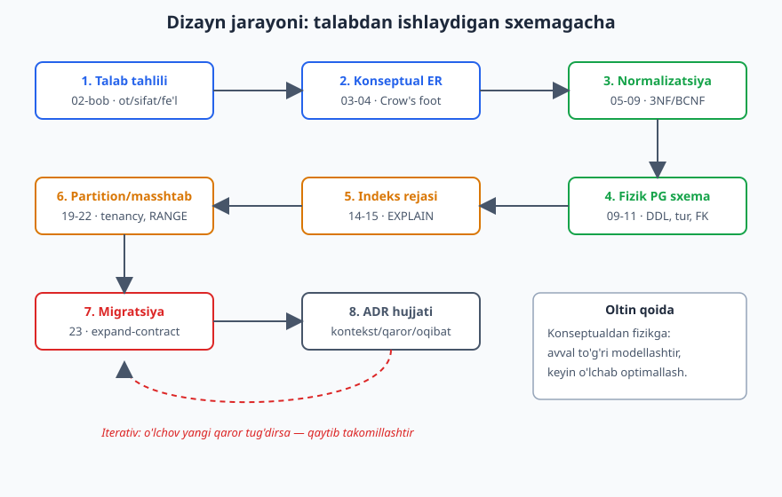
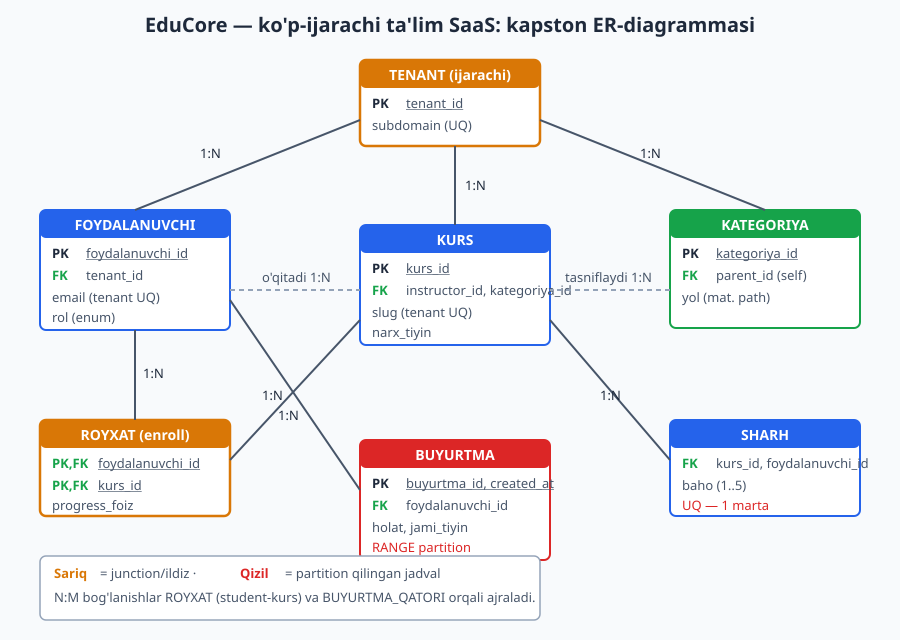
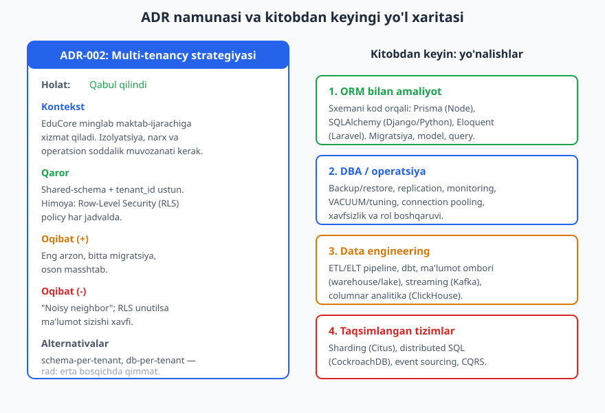

# 24 — Yakuniy loyiha: tizimni 0 dan loyihalash

[⬅️ Oldingi: 23 — Migratsiya va sxema evolyutsiyasi](./23-migratsiya-evolyutsiya.md) · [🏠 README](./README.md)

> **Bu bobda:** kitob davomida o'rgangan hamma narsani bitta real tizimga jamlaymiz. Bo'sh sahifadan boshlab — biznes talabidan tortib ishlaydigan PostgreSQL sxemasigacha — **EduCore** nomli ko'p-ijarachi ta'lim SaaS marketplace'ini 0 dan loyihalaymiz. Har bosqich oldingi boblarning qarorini amalda qo'llaydi: talab tahlili (02), ER (03-04), normalizatsiya (05-09), fizik DDL (09-11), tur (10), constraint (11), indeks (14), partition (22), multi-tenancy (19), temporal tarix (18), migratsiya (23). Eng oxirida dizayn qarorlarimizni **ADR** (Architecture Decision Record) hujjati sifatida rasmiylashtiramiz va kitobdan keyingi yo'l xaritasini chizamiz. To'liq sxema PostgreSQL 18.4 da haqiqatan yaratilgan va hisobotlar real natijalar bilan ishlatilgan.

---

## 0. Kapston nima va nega bunday tuzilgan

Kitobning har bobi bitta tushunchani — kalit, normalizatsiya, indeks, partition — alohida o'rgatdi. Lekin real loyihada bu qarorlar **birga**, bir-biriga ta'sir qilib qabul qilinadi. Bu bob aynan shu yaxlitlikni ko'rsatadi: dizayn — bu izolyatsiya qilingan qoidalar to'plami emas, balki bir-biriga bog'liq trade-off'lar zanjiri.

Jarayonimiz aniq bosqichlardan iboradi va har biri oldingi bobga ishora qiladi:



Diqqat: jarayon **iterativ**. Indeks bosqichida (14) o'lchov qilib, hisobot juda sekin chiqsa — biz konseptual modelga qaytib, denormalizatsiya (08) qarorini ko'rib chiqamiz. "Avval to'g'ri modellashtir, keyin o'lchab optimallash" — 01-bobning oltin qoidasi shu yerda amalda ko'rinadi.

---

## 1. Bosqich 1 — Talab tahlili (02-bobni qo'llash)

Mijoz quyidagi biznes talabini berdi (so'zma-so'z):

> *"Biz onlayn ta'lim platformasi quramiz. Bu platformada bir nechta **maktab** (har biri alohida brend, alohida domen) o'z **kurslarini** sotadi. Har maktabda **egasi**, bir nechta **o'qituvchi** va ko'plab **o'quvchilar** bo'ladi. O'qituvchi kurs yaratadi; kurs **kategoriyaga** tegishli (kategoriyalar daraxt — masalan Dasturlash > Web > Backend). O'quvchi kursga **yozilib**, uni xarid qiladi: **buyurtma** beradi, **to'lov** qiladi. Bir buyurtmada bir nechta kurs bo'lishi mumkin. O'quvchi tugatgan kursiga **sharh** va baho qoldiradi. Kurs narxi vaqt o'tishi bilan o'zgaradi, lekin biz eski narx tarixini saqlashimiz kerak. Buyurtmalar juda ko'p — oyiga millionlab."*

02-bobning **ot/sifat/fe'l evristikasi** bilan matnni parchalaymiz:

| Til bo'lagi | Topilgan | Model elementi |
|---|---|---|
| Ot (entity) | maktab, kurs, o'qituvchi, o'quvchi, egasi, kategoriya, buyurtma, to'lov, sharh | jadval nomzodi |
| Sifat/xususiyat (atribut) | brend nomi, domen, narx, baho, sana, holat | ustun nomzodi |
| Fe'l (bog'lanish) | sotadi, yaratadi, tegishli, yoziladi, xarid qiladi, qoldiradi | FK / junction nomzodi |

**Biznes qoidalari** (constraint nomzodlari, 11-bobga olib boradi):

- Maktab ("ijarachi" = **tenant**) — barcha ma'lumot bir tenantga tegishli; tenantlar bir-birini **ko'rmaydi**.
- Email faqat **bitta tenant ichida** unikal (ikki maktabda bir email bo'lishi mumkin).
- O'quvchi bir kursga **bir marta** sharh qoldiradi; baho 1..5 oralig'ida.
- Buyurtma holatlari: `pending -> paid -> refunded/cancelled`.
- Pul — hech qachon kasr float'da emas (13-bob anti-naqshi).
- Buyurtmalar ko'p va vaqt bo'yicha o'sadi -> **partition** kerak (22-bob).

> **Ko'lam (scope) qarori (02-bob):** birinchi versiyada (MVP) **chat, sertifikat, kupon** kabi modullarni **kiritmaymiz**. Ular keyin qo'shiladi (mashqlarda kengaytiramiz). Scope'ni erta cheklash — eng muhim dizayn qarori.

---

## 2. Bosqich 2 — Konseptual ER-model (03-04-boblarni qo'llash)

Endi entity'lar orasidagi bog'lanish va kardinallikni Crow's foot notatsiyasida chizamiz (03-04-bob).



Bog'lanishlarni kardinallik bilan o'qiymiz:

| Bog'lanish | Kardinallik | Izoh |
|---|---|---|
| TENANT — FOYDALANUVCHI | 1:N | bir maktabda ko'p foydalanuvchi |
| TENANT — KURS / KATEGORIYA | 1:N | hamma narsa tenantga "tegishli" |
| FOYDALANUVCHI (instructor) — KURS | 1:N | o'qituvchi ko'p kurs yaratadi |
| KATEGORIYA — KATEGORIYA | 1:N (o'z-o'ziga) | daraxt: `parent_id` (04-bob, 17-bob) |
| FOYDALANUVCHI — KURS (yozilish) | **N:M** | junction: `ROYXAT` |
| BUYURTMA — KURS | **N:M** | junction: `BUYURTMA_QATORI` |
| FOYDALANUVCHI — BUYURTMA | 1:N | bir o'quvchi ko'p buyurtma |
| BUYURTMA — TOLOV | 1:N | bir buyurtmaga bir nechta to'lov urinishi |
| KURS — SHARH | 1:N (UNIQUE bilan cheklangan) | bir o'quvchi bir kursga 1 sharh |

Ikkita **N:M** bog'lanishni 04-bob qoidasi bilan bog'lovchi (junction) jadvalga ajratamiz: `ROYXAT` (student <-> kurs) va `BUYURTMA_QATORI` (buyurtma <-> kurs). Bu kapston sxemaning markaziy skeleti.

---

## 3. Bosqich 3 — Logik model va normalizatsiya (05-09-boblarni qo'llash)

Konseptual modeldan **logik modelga** o'tamiz: har entity'ni atributlari bilan yozamiz va **3NF/BCNF** holatiga keltiramiz (07-08-bob).

Talabda yashiringan ikkita **anomaliya xavfini** topamiz va tuzatamiz:

**(a) Tranzitiv bog'liqlik (3NF buzilishi).** Boshlang'ich loyihada `kurs` jadvaliga `kategoriya_nomi` ham, `kategoriya_yol` ham yozish vasvasasi bor edi. Lekin `kategoriya_nomi` -> `kategoriya_id` orqali aniqlanadi (tranzitiv). Yechim: kategoriyani alohida jadvalga ajratdik, `kurs` faqat `kategoriya_id` (FK) saqlaydi. Bu — 07-bobning toza 3NF qadami.

**(b) Hosilaviy atribut takrori.** `buyurtma.jami_tiyin` — bu `buyurtma_qatori`larning yig'indisi (hosilaviy). Sof 3NF buni saqlashni man qiladi. Ammo bu yerda **ongli denormalizatsiya** qaramiz (08-bob): hisobot va chek juda tez-tez kerak, qatorlarni har safar jamlash qimmat. Shartlilik: `jami_tiyin` to'lov vaqtida bir marta yoziladi va keyin **o'zgarmaydi** (snapshot, 12-bob). Bu trade-off ADR-003 da hujjatlashtiriladi.

**(c) Snapshot narx.** `buyurtma_qatori.narx_tiyin` — kurs narxining **xarid vaqtidagi nusxasi**. Kurs narxi keyin oshsa ham, eski buyurtma o'sha narxda qoladi. Bu denormalizatsiya emas, **tarixiy haqiqat** (12-bob): `kurs.narx_tiyin` joriy narx, `buyurtma_qatori.narx_tiyin` esa "o'sha onda qancha to'langani".

Natijada logik model 3NF/BCNF da: har jadvalning har nokalit atributi **butun kalitga, faqat kalitga va kalitdan boshqa hech narsaga** bog'liq emas.

---

## 4. Bosqich 4 — Fizik PostgreSQL sxemasi (09-11-boblarni qo'llash)

Endi logik modelni **haqiqiy DDL**ga aylantiramiz. Bu yerda 06 (kalit), 09 (nomlash), 10 (turlar), 11 (constraint), 19 (tenancy), 22 (partition) qarorlari birga keladi.

### 4.1 Sxema, nomlash va turlar

09-bob konvensiyalari: jadval nomi birlik (`kurs`, `buyurtma`), ustun `snake_case`, constraint nomi prefiksli (`uq_`, `fk_`, `ck_`, `idx_`). Misol uchun har bobni alohida schema'da izolyatsiya qildik (`ch24`).

ENUM vs lookup (10-bob) qarori: rol va holatlar **kichik, barqaror to'plam** -> `ENUM` (yangi qiymat kamdan-kam qo'shiladi). Agar tez-tez o'zgarsa edi — lookup jadval tanlardik.

```sql
CREATE SCHEMA IF NOT EXISTS ch24;
SET search_path = ch24;

CREATE TYPE rol_turi       AS ENUM ('owner', 'instructor', 'student');
CREATE TYPE buyurtma_holat AS ENUM ('pending', 'paid', 'refunded', 'cancelled');
CREATE TYPE tolov_holat    AS ENUM ('initiated', 'succeeded', 'failed');
```

### 4.2 Tenant va foydalanuvchi (06 + 10 + 11 + 19)

```sql
-- TENANT: 19-bob shared-schema strategiyasining ildizi
CREATE TABLE tenant (
    tenant_id  bigint GENERATED ALWAYS AS IDENTITY PRIMARY KEY,
    nomi       text NOT NULL,
    subdomain  text NOT NULL UNIQUE CHECK (subdomain ~ '^[a-z0-9-]{3,40}$'),
    public_id  uuid NOT NULL DEFAULT uuidv7() UNIQUE,   -- PG18: uuidv7() tashqi ID uchun
    created_at timestamptz NOT NULL DEFAULT now()
);

CREATE TABLE foydalanuvchi (
    foydalanuvchi_id bigint GENERATED ALWAYS AS IDENTITY PRIMARY KEY,
    tenant_id        bigint NOT NULL REFERENCES tenant(tenant_id) ON DELETE CASCADE,
    email            text   NOT NULL,
    parol_hash       text   NOT NULL,
    toliq_ism        text   NOT NULL,
    rol              rol_turi NOT NULL DEFAULT 'student',
    created_at       timestamptz NOT NULL DEFAULT now(),
    deleted_at       timestamptz,                       -- 12-bob: soft delete
    CONSTRAINT uq_foyd_email_tenant UNIQUE (tenant_id, email)  -- email tenant ichida unikal
);
```

Kalit qarori (06-bob): ichki PK — `bigint IDENTITY` (surrogate, ixcham, indeks-do'st). Tashqiga ko'rsatiladigan ID (URL, API) uchun esa `uuidv7()` (PG18) — ketma-ket bigint'larni tashqariga ochmaslik xavfsizlik nuqtai nazaridan to'g'ri. **Ikkala kalit** strategiyasini birga ishlatamiz.

`public_id uuid DEFAULT uuidv7()` — PG18 ning yangi funksiyasi. UUIDv4 dan farqi: v7 **vaqt bilan tartiblangan**, shuning uchun B-tree indeksda v4'dagidek tasodifiy sochilib ketmaydi (06-bob).

### 4.3 Kategoriya daraxti (17-bobni qo'llash)

Kategoriya ierarxik. 17-bob 4 usulni ko'rsatgan edi; biz **adjacency list + materialized path gibridi** tanlaymiz: `parent_id` yozish/yangilash uchun sodda, `yol` ('1.2.3') esa "ushbu shox ostidagi hamma narsa" so'rovini indeks bilan tez qiladi.

```sql
CREATE TABLE kategoriya (
    kategoriya_id bigint GENERATED ALWAYS AS IDENTITY PRIMARY KEY,
    tenant_id     bigint NOT NULL REFERENCES tenant(tenant_id) ON DELETE CASCADE,
    nomi          text   NOT NULL,
    parent_id     bigint REFERENCES kategoriya(kategoriya_id) ON DELETE RESTRICT,
    yol           text   NOT NULL,   -- materialized path: '1.2.3'
    CONSTRAINT uq_kat_tenant_nomi UNIQUE (tenant_id, parent_id, nomi)
);
```

`ON DELETE RESTRICT` (11-bob): ostida shoxi bor kategoriyani o'chirishga ruxsat yo'q — bola yetimi qolmasligi uchun.

### 4.4 Kurs (markaziy mahsulot)

```sql
CREATE TABLE kurs (
    kurs_id       bigint GENERATED ALWAYS AS IDENTITY PRIMARY KEY,
    tenant_id     bigint NOT NULL REFERENCES tenant(tenant_id) ON DELETE CASCADE,
    instructor_id bigint NOT NULL REFERENCES foydalanuvchi(foydalanuvchi_id) ON DELETE RESTRICT,
    kategoriya_id bigint REFERENCES kategoriya(kategoriya_id) ON DELETE SET NULL,
    slug          text   NOT NULL,                          -- 12-bob: URL kaliti
    sarlavha      text   NOT NULL,
    narx_tiyin    bigint NOT NULL CHECK (narx_tiyin >= 0),  -- pul = butun tiyin (10/13-bob)
    valyuta       char(3) NOT NULL DEFAULT 'UZS' CHECK (valyuta ~ '^[A-Z]{3}$'),
    chop_etilgan  boolean NOT NULL DEFAULT false,
    created_at    timestamptz NOT NULL DEFAULT now(),
    CONSTRAINT uq_kurs_tenant_slug UNIQUE (tenant_id, slug)
);
```

ON DELETE strategiyalari (11-bob) ataylab har xil:

- `tenant` o'chsa -> kurslar ham (`CASCADE`): tenant ketsa, ma'lumoti ham ketadi.
- `instructor` o'chsa -> **RESTRICT**: kursi bor o'qituvchini o'chirib bo'lmaydi (avval kursni boshqasiga o'tkaz).
- `kategoriya` o'chsa -> `SET NULL`: kurs "kategoriyasiz" qoladi, lekin yo'qolmaydi.

### 4.5 N:M junction jadvallari

```sql
-- ROYXAT: student <-> kurs (yozilish). Tabiiy kompozit PK (06-bob)
CREATE TABLE royxat (
    foydalanuvchi_id bigint NOT NULL REFERENCES foydalanuvchi(foydalanuvchi_id) ON DELETE CASCADE,
    kurs_id          bigint NOT NULL REFERENCES kurs(kurs_id) ON DELETE CASCADE,
    royxat_sana      timestamptz NOT NULL DEFAULT now(),
    progress_foiz    smallint NOT NULL DEFAULT 0 CHECK (progress_foiz BETWEEN 0 AND 100),
    PRIMARY KEY (foydalanuvchi_id, kurs_id)
);
```

`ROYXAT` da surrogate kalit qo'shmadik — kompozit `(foydalanuvchi_id, kurs_id)` o'zi tabiiy va barqaror PK, hamda "bir kursga ikki marta yozilmaslik"ni bepul majburlaydi (06-bob).

### 4.6 Buyurtma — partition qilingan (22-bobni qo'llash)

Buyurtmalar oyiga millionlab. 22-bob qaroriga ko'ra `created_at` bo'yicha **RANGE partition** qilamiz. Muhim qoida: partition kaliti **PK ichida** bo'lishi shart, shuning uchun PK = `(buyurtma_id, created_at)`.

```sql
CREATE TABLE buyurtma (
    buyurtma_id      bigint GENERATED ALWAYS AS IDENTITY,
    tenant_id        bigint NOT NULL,
    foydalanuvchi_id bigint NOT NULL,
    holat            buyurtma_holat NOT NULL DEFAULT 'pending',
    jami_tiyin       bigint NOT NULL CHECK (jami_tiyin >= 0),  -- 08-bob: ongli denorm (snapshot)
    idempotency_key  uuid   NOT NULL DEFAULT uuidv7(),         -- 16-bob: idempotentlik
    created_at       timestamptz NOT NULL DEFAULT now(),
    PRIMARY KEY (buyurtma_id, created_at),                     -- partition kaliti PK ichida
    CONSTRAINT fk_buyurtma_tenant FOREIGN KEY (tenant_id)
        REFERENCES tenant(tenant_id) ON DELETE CASCADE,
    CONSTRAINT fk_buyurtma_foyd FOREIGN KEY (foydalanuvchi_id)
        REFERENCES foydalanuvchi(foydalanuvchi_id) ON DELETE RESTRICT,
    CONSTRAINT uq_buyurtma_idem UNIQUE (idempotency_key, created_at)
) PARTITION BY RANGE (created_at);

CREATE TABLE buyurtma_2026_05 PARTITION OF buyurtma
    FOR VALUES FROM ('2026-05-01') TO ('2026-06-01');
CREATE TABLE buyurtma_2026_06 PARTITION OF buyurtma
    FOR VALUES FROM ('2026-06-01') TO ('2026-07-01');
CREATE TABLE buyurtma_default PARTITION OF buyurtma DEFAULT;
```

`idempotency_key` (16-bob): mijoz "to'lash" tugmasini ikki marta bossa, ikkinchi buyurtma `UNIQUE` tufayli rad etiladi — pul ikki marta yechilmaydi.

> **PG nozikligi:** partition qilingan jadval `created_at` ni o'z ichiga olgan PK talab qiladi va unga **FK qilib ishora qiluvchi** bola jadvallar (`buyurtma_qatori`, `tolov`) ham `(buyurtma_id, buyurtma_sana)` kompozit FK ishlatishi kerak — chunki FK butun PK'ga ishora qilishi shart.

### 4.7 Buyurtma qatori, to'lov, sharh

```sql
CREATE TABLE buyurtma_qatori (
    qator_id      bigint GENERATED ALWAYS AS IDENTITY PRIMARY KEY,
    buyurtma_id   bigint NOT NULL,
    buyurtma_sana timestamptz NOT NULL,
    kurs_id       bigint NOT NULL REFERENCES kurs(kurs_id) ON DELETE RESTRICT,
    narx_tiyin    bigint NOT NULL CHECK (narx_tiyin >= 0),    -- 12-bob: snapshot narx
    CONSTRAINT fk_qator_buyurtma FOREIGN KEY (buyurtma_id, buyurtma_sana)
        REFERENCES buyurtma(buyurtma_id, created_at) ON DELETE CASCADE
);

CREATE TABLE tolov (
    tolov_id      bigint GENERATED ALWAYS AS IDENTITY PRIMARY KEY,
    buyurtma_id   bigint NOT NULL,
    buyurtma_sana timestamptz NOT NULL,
    summa_tiyin   bigint NOT NULL CHECK (summa_tiyin > 0),
    holat         tolov_holat NOT NULL DEFAULT 'initiated',
    provider_ref  text,
    created_at    timestamptz NOT NULL DEFAULT now(),
    CONSTRAINT fk_tolov_buyurtma FOREIGN KEY (buyurtma_id, buyurtma_sana)
        REFERENCES buyurtma(buyurtma_id, created_at) ON DELETE CASCADE
);

CREATE TABLE sharh (
    sharh_id         bigint GENERATED ALWAYS AS IDENTITY PRIMARY KEY,
    kurs_id          bigint NOT NULL REFERENCES kurs(kurs_id) ON DELETE CASCADE,
    foydalanuvchi_id bigint NOT NULL REFERENCES foydalanuvchi(foydalanuvchi_id) ON DELETE CASCADE,
    baho             smallint NOT NULL CHECK (baho BETWEEN 1 AND 5),
    matn             text,
    created_at       timestamptz NOT NULL DEFAULT now(),
    CONSTRAINT uq_sharh_bir_marta UNIQUE (kurs_id, foydalanuvchi_id)  -- biznes qoidasi bazada
);
```

`uq_sharh_bir_marta` — "bir o'quvchi bir kursga bir sharh" biznes qoidasi ilovada emas, **bazada** majburlanadi (11-bob: baza — oxirgi qal'a).

### 4.8 Temporal narx tarixi (18-bobni qo'llash, PG18)

"Eski narx tarixini saqla" talabini 18-bob temporal naqshi bilan hal qilamiz. PG18 ning `WITHOUT OVERLAPS` temporal PK'si bir kurs uchun ikkita davr ustma-ust tushmasligini **bazada** kafolatlaydi.

```sql
CREATE TABLE kurs_narx_tarixi (
    kurs_id    bigint NOT NULL REFERENCES kurs(kurs_id) ON DELETE CASCADE,
    narx_tiyin bigint NOT NULL CHECK (narx_tiyin >= 0),
    davr       daterange NOT NULL,
    PRIMARY KEY (kurs_id, davr WITHOUT OVERLAPS)   -- PG18+ temporal primary key
);
```

---

## 5. Bosqich 5 — Indeks rejasi (14-bobni qo'llash)

Indeks — DDL emas, **dizayn qarori** (14-bob). Avval **access pattern**larni (qaysi so'rovlar tez-tez ishlaydi) sanaymiz, keyin indeks qo'yamiz:

| So'rov (access pattern) | Indeks | Tur |
|---|---|---|
| Har FK bo'yicha JOIN/filtr | har FK ustuniga | B-tree (13-bob: indekssiz FK anti-naqsh) |
| "Tenant X ning chop etilgan kurslari" | `(tenant_id, created_at) WHERE chop_etilgan` | **partial** (14-bob) |
| "Bu shox ostidagi kategoriyalar" | `(tenant_id, yol text_pattern_ops)` | path prefiks qidiruvi |

```sql
CREATE INDEX idx_foyd_tenant     ON foydalanuvchi (tenant_id);
CREATE INDEX idx_kurs_tenant     ON kurs (tenant_id);
CREATE INDEX idx_kurs_instructor ON kurs (instructor_id);
CREATE INDEX idx_kurs_kategoriya ON kurs (kategoriya_id);
CREATE INDEX idx_royxat_kurs     ON royxat (kurs_id);     -- PK chap ustuni boshqa, alohida kerak
CREATE INDEX idx_qator_kurs      ON buyurtma_qatori (kurs_id);
CREATE INDEX idx_sharh_kurs      ON sharh (kurs_id);

-- Partial: faqat chop etilgan kurslar indekslanadi -> kichik, tez
CREATE INDEX idx_kurs_chop ON kurs (tenant_id, created_at) WHERE chop_etilgan;

-- Materialized path bo'yicha prefiks qidiruv (yol LIKE '1.2.%')
CREATE INDEX idx_kat_yol ON kategoriya (tenant_id, yol text_pattern_ops);
```

`idx_royxat_kurs` nega kerak? `royxat` PK'si `(foydalanuvchi_id, kurs_id)` — chap ustun `foydalanuvchi_id`. "Bu kursga kim yozilgan?" so'rovi `kurs_id` bo'yicha qidiradi, lekin u PK'ning **chap** ustuni emas, shuning uchun alohida indeks zarur (14-bob kompozit indeks tartibi qoidasi).

---

## 6. Bosqich 6 — Multi-tenancy va RLS (19-bobni qo'llash)

`tenant_id` har jadvalda bor — bu 19-bob **shared-schema** strategiyasi. Ammo dasturchi `WHERE tenant_id = ?` ni unutishi mumkin (eng xavfli xato — bir maktab ikkinchisining ma'lumotini ko'rishi). Buni **Row-Level Security (RLS)** bilan bazada kafolatlaymiz:

```sql
ALTER TABLE kurs ENABLE ROW LEVEL SECURITY;
CREATE POLICY kurs_tenant_isolation ON kurs
    USING (tenant_id = current_setting('app.tenant_id', true)::bigint);
```

Ilova har so'rovdan oldin `SET app.tenant_id = '1';` qiladi; shundan keyin `SELECT * FROM kurs` **avtomatik** faqat o'sha tenantning kurslarini qaytaradi — `WHERE` yozilmasa ham. Bu — "noisy neighbor" xavfini saqlagan holda izolyatsiyani bazaga ko'taradi.

---

## 7. Bosqich 7 — Migratsiya strategiyasi (23-bobni qo'llash)

Bu sxema bir kunda tug'ilmaydi — vaqt o'tib o'sadi. 23-bob qoidalarini reja qilamiz:

- **Versiyalangan migratsiya:** har o'zgarish `V001__init.sql`, `V002__add_kupon.sql` kabi ketma-ket fayllar (Flyway/Liquibase/Alembic uslubi).
- **Yangi oy partition'i:** har oy boshida yangi `buyurtma_YYYY_MM` partition'i **oldindan** qo'shiladi (cron yoki `pg_partman`). Bu — `DEFAULT` partition'ga ma'lumot tushib qolmasligi uchun.
- **Yangi ustun qo'shish (expand-contract):** masalan `kurs`ga `til` ustuni qo'shsak — avval `NULL` ruxsatli qo'shamiz (lock'siz, PG da metadata-only), backfill qilamiz, keyin `NOT NULL` qilamiz. To'g'ridan-to'g'ri `NOT NULL DEFAULT` katta jadvalda lock beradi.
- **Xavfli ALTER'dan qochish:** ustun turini o'zgartirish (`bigint -> uuid`) jadvalni qayta yozadi -> expand-contract bilan yangi ustun qo'shib, ko'chirib, eski ustunni keyin tashlaymiz.

> Misol — xavfsiz ustun qo'shish:
> ```sql
> -- V005: xavfsiz (metadata-only, lock yo'q)
> ALTER TABLE kurs ADD COLUMN til char(2);
> -- backfill alohida tranzaksiyalarda (batch)
> -- V006: endi NOT NULL
> ALTER TABLE kurs ALTER COLUMN til SET DEFAULT 'uz';
> ```

---

## 8. Bosqich 8 — ADR: qarorlarni hujjatlashtirish

Dizayndagi muhim qarorlar **nega** shunday qabul qilingani vaqt o'tib unutiladi. **ADR (Architecture Decision Record)** — har bir muhim qarorni `kontekst -> qaror -> oqibat -> alternativalar` formatida yozadigan qisqa hujjat. Quyida kapston loyihaning 4 ta ADR'i.



### ADR-001 — Surrogate `bigint` PK + tashqi `uuidv7`

- **Kontekst:** ichki JOIN'lar tez bo'lishi kerak, lekin tashqi API'da ketma-ket ID'larni ochish xavfsizlik muammosi (raqobatchi buyurtmalar sonini taxmin qilishi mumkin).
- **Qaror:** ichki PK — `bigint IDENTITY`; tashqiga ko'rsatiladigan har jadvalda `public_id uuid DEFAULT uuidv7()`.
- **Oqibat (+):** ixcham, indeks-do'st ichki kalit; xavfsiz tashqi ID; `uuidv7` vaqt-tartibli, B-tree fragmentatsiyasi kam.
- **Oqibat (-):** har jadvalda ikkita "identifikator"; biroz qo'shimcha joy.
- **Alternativalar:** faqat UUID PK (rad: kattaroq indeks, JOIN sekinroq); faqat bigint (rad: tashqi ID xavfi).

### ADR-002 — Shared-schema multi-tenancy + RLS

- **Kontekst:** minglab kichik maktab-ijarachi; har biriga alohida baza qimmat.
- **Qaror:** `tenant_id` ustun + PostgreSQL RLS policy.
- **Oqibat (+):** eng arzon, bitta migratsiya hammaga, oson masshtab.
- **Oqibat (-):** "noisy neighbor"; RLS policy unutilsa ma'lumot sizishi xavfi.
- **Alternativalar:** schema-per-tenant, database-per-tenant (rad: erta bosqichda operatsion qimmat; lekin yirik enterprise mijoz uchun keyin migratsiya yo'li ochiq).

### ADR-003 — `buyurtma.jami_tiyin` denormalizatsiyasi (snapshot)

- **Kontekst:** chek va daromad hisoboti juda tez-tez, har safar qatorlarni `SUM` qilish qimmat; hamda to'langan summa **o'zgarmas** bo'lishi kerak.
- **Qaror:** `jami_tiyin` ni `buyurtma`da snapshot sifatida saqlash; to'lov vaqtida bir marta hisoblanadi, keyin immutable.
- **Oqibat (+):** hisobot tez; tarixiy haqiqat saqlanadi (kurs narxi keyin o'zgarsa ham buyurtma o'zgarmaydi).
- **Oqibat (-):** 3NF dan ataylab chekinish; `jami_tiyin` qatorlar yig'indisiga mos kelishini ilova/test ta'minlashi kerak.
- **Alternativalar:** har safar JOIN+SUM (rad: hisobot sekin, narx o'zgarsa eski chek buziladi).

### ADR-004 — Buyurtmalarni `created_at` bo'yicha RANGE partition

- **Kontekst:** oyiga millionlab buyurtma; eski oylar kamdan-kam o'qiladi; arxivlash/o'chirish kerak bo'ladi.
- **Qaror:** `buyurtma` ni oy bo'yicha RANGE partition; yangi oy partition'i oldindan yaratiladi.
- **Oqibat (+):** so'rovlar faqat tegishli oy partition'ini skanlaydi (partition pruning); eski oyni `DETACH` qilib arxivlash oson.
- **Oqibat (-):** PK'ga `created_at` qo'shish shart; bola jadvallarda kompozit FK; partition boshqaruvi (yangi oy) avtomatlashtirilishi kerak.
- **Alternativalar:** monolit jadval + indeks (rad: jadval o'sgan sari VACUUM/indeks og'irlashadi).

---

## 9. To'liq sxemani PostgreSQL 18 da yaratish va hisobotlar

Yuqoridagi barcha DDL **bitta skript** sifatida PostgreSQL 18.4 da haqiqatan ishga tushirildi: 3 ENUM, 13 jadval (3 partition bilan), 9 indeks, RLS policy, namuna ma'lumot va 7 hisobot so'rovi. Quyida hisobotlar va ularning **real** psql natijalari.

### 9.1 Tenant bo'yicha sotuv

```sql
SELECT t.nomi, count(b.*) AS buyurtmalar, sum(b.jami_tiyin)/100.0 AS jami_som
FROM buyurtma b JOIN tenant t ON t.tenant_id = b.tenant_id
WHERE b.holat = 'paid'
GROUP BY t.nomi ORDER BY jami_som DESC;
```

```text
      nomi      | buyurtmalar |   jami_som
----------------+-------------+--------------
 Aurora Academy |           2 | 797000.00...
(1 row)
```

### 9.2 Eng daromadli kurslar (partition'lar bo'ylab JOIN)

```sql
SELECT k.sarlavha, count(q.*) AS sotildi, sum(q.narx_tiyin)/100.0 AS daromad_som
FROM buyurtma_qatori q
JOIN buyurtma b ON b.buyurtma_id = q.buyurtma_id AND b.created_at = q.buyurtma_sana
JOIN kurs k ON k.kurs_id = q.kurs_id
WHERE b.holat = 'paid'
GROUP BY k.sarlavha ORDER BY daromad_som DESC;
```

```text
    sarlavha    | sotildi |  daromad_som
----------------+---------+--------------
 PostgreSQL Pro |       2 | 598000.00...
 React 0 dan    |       1 | 199000.00...
(2 rows)
```

### 9.3 Kurs reytingi (sharh agregati)

```sql
SELECT k.sarlavha, round(avg(s.baho),2) AS ortacha_baho, count(*) AS sharhlar
FROM sharh s JOIN kurs k ON k.kurs_id = s.kurs_id
GROUP BY k.sarlavha ORDER BY ortacha_baho DESC;
```

```text
    sarlavha    | ortacha_baho | sharhlar
----------------+--------------+----------
 React 0 dan    |         5.00 |        1
 PostgreSQL Pro |         4.50 |        2
(2 rows)
```

### 9.4 Kategoriya daraxti (recursive CTE — 17-bob)

```sql
WITH RECURSIVE daraxt AS (
    SELECT kategoriya_id, nomi, parent_id, 0 AS daraja, nomi::text AS yol_nomi
    FROM kategoriya WHERE parent_id IS NULL AND tenant_id = 1
    UNION ALL
    SELECT k.kategoriya_id, k.nomi, k.parent_id, d.daraja+1, d.yol_nomi || ' > ' || k.nomi
    FROM kategoriya k JOIN daraxt d ON k.parent_id = d.kategoriya_id
)
SELECT repeat('  ', daraja) || nomi AS daraxt, yol_nomi FROM daraxt ORDER BY yol_nomi;
```

```text
   daraxt    |          yol_nomi
-------------+----------------------------
 Dasturlash  | Dasturlash
   Web       | Dasturlash > Web
     Backend | Dasturlash > Web > Backend
(3 rows)
```

### 9.5 Partition pruning tasdiqlash (22-bob)

```sql
EXPLAIN (COSTS OFF)
SELECT * FROM buyurtma WHERE created_at >= '2026-06-01' AND created_at < '2026-07-01';
```

```text
                          QUERY PLAN
---------------------------------------------------------------
 Seq Scan on buyurtma_2026_06 buyurtma
   Filter: ((created_at >= '2026-06-01 ...') AND (created_at < '2026-07-01 ...'))
(2 rows)
```

Diqqat: planner faqat **`buyurtma_2026_06`** partition'ini skanlaydi — may va default partition'lar umuman ochilmaydi. Bu — partition rejamizning ishlayotgani isboti.

### 9.6 Temporal narx tarixi (18-bob, PG18)

```sql
SELECT k.sarlavha, h.narx_tiyin/100.0 AS narx_som, h.davr
FROM kurs_narx_tarixi h JOIN kurs k ON k.kurs_id = h.kurs_id
ORDER BY h.davr;
```

```text
    sarlavha    | narx_som  |          davr
----------------+-----------+-------------------------
 PostgreSQL Pro | 249000... | [2026-01-01,2026-04-01)
 PostgreSQL Pro | 299000... | [2026-04-01,)
(2 rows)
```

`WITHOUT OVERLAPS` temporal PK ikkita davr ustma-ust tushishiga yo'l qo'ymaydi — eski narx ([01-01, 04-01)) va joriy narx ([04-01, ∞)) bir-biriga tegmaydi.

> **Verifikatsiya:** butun skript `ON_ERROR_STOP=1` bilan toza schema'da xatosiz ishladi, oxirida `DROP SCHEMA ch24 CASCADE` bilan tozalandi. Hech bir natija qo'lda yozilmagan — barchasi real psql chiqishidan.

---

## 10. Kitob yakuni: bundan keyin qayerga?

Tabriklaymiz — siz endi bo'sh sahifadan boshlab to'liq, normallashtirilgan, indekslangan, partition qilingan, ko'p-ijarachi sxemani loyihalay olasiz. Dizayn — bu kasb; keyingi bosqichlar:

1. **ORM bilan amaliyot.** Sxemani kod orqali boshqarish:
   - **Prisma / Drizzle** (Node.js) — [Node.js kitobiga](../nodejs/README.md) qarang.
   - **Django ORM** (Python) — [Django kitobiga](../django/README.md).
   - **Eloquent** (PHP/Laravel) — [Laravel kitobiga](../laravel/README.md).
   - Sof SQL'ni mustahkamlash uchun esa [SQL va MySQL kitobi](../sql/README.md).

2. **DBA / operatsiya.** Backup/restore (`pg_dump`, PITR), replication (streaming, logical), monitoring (`pg_stat_statements`), `VACUUM`/autovacuum sozlash, connection pooling (PgBouncer), rol va xavfsizlik.

3. **Data engineering.** ETL/ELT pipeline'lar, `dbt`, ma'lumot ombori (warehouse) va ko'l (lake), streaming (Kafka), columnar analitik bazalar (ClickHouse, DuckDB) — 21-bobdagi analitik dizayn davomi.

4. **Taqsimlangan tizimlar.** Sharding (Citus), distributed SQL (CockroachDB, YugabyteDB), event sourcing va CQRS — 22-bobdagi masshtablash g'oyalarining keyingi qadami.

Eng muhim maslahat o'zgarmaydi (01-bob): **avval to'g'ri modellashtir, keyin o'lcha, keyin optimallash.** Yaxshi sxema — yillab xizmat qiladigan poydevor; yomon sxema — har kuni soliq to'laydigan qarz. Endi farqni bilasiz.

---

## Mashqlar

Bu mashqlar kapston tizimni kengaytiradi yoki butunlay yangi tizimni 0 dan loyihalashni so'raydi. Yechimlar to'liq DDL bilan, PostgreSQL 18 da tekshirilgan.

### Oson

1. **Lavozim ustuni.** `foydalanuvchi` jadvaliga "oxirgi kirgan vaqti" (`oxirgi_kirish`) ustunini qo'shing. Qaysi tur to'g'ri (10-bob) va NULL ruxsat berilishi kerakmi — asoslang.
2. **Slug constraint.** `kurs.slug` faqat kichik harf, raqam va `-` dan iborat bo'lishini majburlovchi `CHECK` constraint yozing.
3. **Yangi partition.** 2026-iyul oyi uchun `buyurtma` jadvaliga yangi partition qo'shing. Nega buni har oy boshida **oldindan** qilish kerak?
4. **Sharh indeksi.** "Bu o'quvchining barcha sharhlari" so'rovi tez-tez ishlatiladi. Qaysi indeks kerak va nega `sharh` PK'si yetmaydi?

### O'rta

5. **Kupon moduli.** Tizimga chegirma kuponi qo'shing: kod, foiz YOKI summa (ikkisi birga emas), amal qilish davri, ishlatish limiti. XOR qoidasini bazada qanday majburlaysiz?
6. **Buyurtma holat tarixi.** Buyurtma holatining har o'zgarishini (kim, qachon, qaysi holatga) saqlash kerak. 12/18-bob naqshlaridan qaysi birini tanlaysiz va nega?
7. **Denormalizatsiya qarori.** `kurs` jadvaliga `sharh_soni` va `ortacha_baho` ustunlarini qo'shish taklif qilindi. Bu to'g'ri denormalizatsiyami? ADR formatida (kontekst/qaror/oqibat/alternativa) javob yozing.
8. **O'qituvchi-kurs N:M.** Hozir bir kursning bitta o'qituvchisi bor. Talab o'zgardi: bir kursni bir nechta o'qituvchi birga olib boradi (co-teaching). Sxemani qanday o'zgartirasiz?

### Qiyin

9. **Sertifikat moduli.** O'quvchi kursni 100% tugatganda o'zgarmas (immutable) sertifikat beriladi. Sertifikat tashqi tomonlama tekshiriluvchi bo'lishi kerak. Kalit, tur va constraint qarorlarini asoslang.
10. **Jonli dars jadvali.** O'qituvchilar jonli dars o'tkazadi: kurs, xona, vaqt oralig'i. **Bitta xonada vaqtlar ustma-ust tushmasligi** kerak. Buni qaysi PostgreSQL mexanizmi bazada kafolatlaydi (11-bob)?
11. **ADR yozing.** Kapston uchun "sharh matnini `kurs` jadvalida JSONB massiv sifatida saqlash" taklifi keldi. Buni ADR formatida baholang va rad eting (13-bob anti-naqshlariga ishora qiling).
12. **Yangi tizimni 0 dan.** Restoran yetkazib berish platformasini (restoran, menyu, buyurtma, kuryer, yetkazib berish manzili, baho) 02-bobdan boshlab loyihalang: talab -> ER (matn bilan ta'riflang) -> 3NF logik model -> asosiy fizik DDL (kamida 6 jadval). Kamida bitta multi-tenancy va bitta partition qaroriga ishora qiling.

---

## Yechimlar

<details markdown="1">
<summary>Yechim — 1</summary>

`timestamptz` to'g'ri tur (10-bob): vaqt zonasi bilan, "qachon" savoliga to'g'ri javob. NULL **ruxsat berilishi kerak**, chunki yangi ro'yxatdan o'tgan, hali hech kirmagan foydalanuvchida qiymat yo'q — bu yo'qlik tabiiy holat, NULL aynan shuni anglatadi (05-bob).

```sql
ALTER TABLE ch24.foydalanuvchi ADD COLUMN oxirgi_kirish timestamptz;  -- NULL ruxsat
```

`DEFAULT now()` bermaymiz: bu "hisob yaratilgan vaqt" emas, "oxirgi kirish" — boshida bilib bo'lmaydi.

</details>

<details markdown="1">
<summary>Yechim — 2</summary>

```sql
ALTER TABLE ch24.kurs
    ADD CONSTRAINT ck_kurs_slug CHECK (slug ~ '^[a-z0-9]+(-[a-z0-9]+)*$');
```

Regex: faqat kichik harf/raqam bloklari, orasida bitta `-`, boshida/oxirida `-` yo'q. Bu URL'da "toza" slug kafolatlaydi (`postgres-pro` ✅, `Postgres Pro` ❌, `-bad-` ❌).

</details>

<details markdown="1">
<summary>Yechim — 3</summary>

```sql
CREATE TABLE ch24.buyurtma_2026_07 PARTITION OF ch24.buyurtma
    FOR VALUES FROM ('2026-07-01') TO ('2026-08-01');
```

**Oldindan** yaratish shart, chunki agar 1-iyul kelganda partition mavjud bo'lmasa, yangi buyurtmalar `DEFAULT` partition'ga tushadi. `DEFAULT` ga ma'lumot tushgach, o'sha oraliq uchun aniq partition qo'shish **murakkablashadi** (avval default'dan ko'chirish kerak). Shuning uchun amalda `pg_partman` yoki cron har oy oldindan partition yaratadi (23-bob migratsiya rejasi).

</details>

<details markdown="1">
<summary>Yechim — 4</summary>

`sharh` PK'si `sharh_id` (surrogate). Mavjud `uq_sharh_bir_marta (kurs_id, foydalanuvchi_id)` indeksi chap ustuni `kurs_id`, shuning uchun "shu o'quvchining sharhlari" (`WHERE foydalanuvchi_id = ?`) uchun yaramaydi — `foydalanuvchi_id` chap ustun emas (14-bob kompozit tartib qoidasi).

```sql
CREATE INDEX idx_sharh_foyd ON ch24.sharh (foydalanuvchi_id);
```

</details>

<details markdown="1">
<summary>Yechim — 5</summary>

XOR qoidasi (`foiz` yoki `summa`, ikkisi birga emas, lekin biri bo'lishi shart) `num_nonnulls()` bilan bazada majburlanadi. Limit nazorati ham `CHECK` bilan:

```sql
CREATE TABLE ch24.kupon (
    kupon_id    bigint GENERATED ALWAYS AS IDENTITY PRIMARY KEY,
    tenant_id   bigint NOT NULL REFERENCES ch24.tenant(tenant_id) ON DELETE CASCADE,
    kod         text   NOT NULL,
    foiz        smallint CHECK (foiz BETWEEN 1 AND 100),
    summa_tiyin bigint   CHECK (summa_tiyin > 0),
    amal_davr   daterange NOT NULL,
    limit_soni  integer NOT NULL DEFAULT 0 CHECK (limit_soni >= 0),
    ishlatildi  integer NOT NULL DEFAULT 0 CHECK (ishlatildi >= 0),
    CONSTRAINT uq_kupon_kod  UNIQUE (tenant_id, kod),
    CONSTRAINT ck_kupon_xor  CHECK (num_nonnulls(foiz, summa_tiyin) = 1),  -- aynan bittasi
    CONSTRAINT ck_kupon_limit CHECK (ishlatildi <= limit_soni)
);
```

`num_nonnulls(foiz, summa_tiyin) = 1` — ikkisidan **aynan bittasi** NULL bo'lmasligini talab qiladi. Ikkisi birga (`= 2`) yoki ikkisi ham yo'q (`= 0`) bo'lsa, INSERT rad etiladi. (PG18 da tekshirildi: `foiz` va `summa` birga berilganda `ck_kupon_xor` xato berdi.)

</details>

<details markdown="1">
<summary>Yechim — 6</summary>

Holat o'zgarishlari — bu **hodisalar oqimi**, joriy holat emas. 18-bobning **tarix jadvali (history table)** naqshini tanlaymiz: `buyurtma` joriy holatni saqlaydi, alohida `buyurtma_holat_tarixi` har o'tishni audit qiladi.

```sql
CREATE TABLE ch24.buyurtma_holat_tarixi (
    tarix_id      bigint GENERATED ALWAYS AS IDENTITY PRIMARY KEY,
    buyurtma_id   bigint NOT NULL,
    buyurtma_sana timestamptz NOT NULL,
    eski_holat    ch24.buyurtma_holat,        -- birinchi yozuvda NULL
    yangi_holat   ch24.buyurtma_holat NOT NULL,
    ozgartirgan   bigint REFERENCES ch24.foydalanuvchi(foydalanuvchi_id),
    ozgardi_at    timestamptz NOT NULL DEFAULT now(),
    CONSTRAINT fk_holat_buyurtma FOREIGN KEY (buyurtma_id, buyurtma_sana)
        REFERENCES ch24.buyurtma(buyurtma_id, created_at) ON DELETE CASCADE
);
```

Nega event sourcing (to'liq) emas? Bu yerda bizga joriy holat tez kerak (`buyurtma.holat`), audit esa qo'shimcha — gibrid yondashuv yetarli. To'liq event sourcing (holatni faqat hodisalardan qayta tiklash) ortiqcha murakkablik bo'lardi (18-bob trade-off).

</details>

<details markdown="1">
<summary>Yechim — 7</summary>

**ADR-005 — `kurs` ga `sharh_soni` va `ortacha_baho` denormalizatsiyasi**

- **Kontekst:** kurs ro'yxati sahifasi har kursning reytingini ko'rsatadi. Har safar `sharh` jadvalini `AVG`/`COUNT` qilish — katalogda yuzlab kurs bo'lsa — qimmat (15-bob N+1/agregat muammosi).
- **Qaror:** `kurs` ga `sharh_soni int` va `ortacha_baho numeric(3,2)` keshlangan agregat ustunlarini qo'shamiz; ular `sharh` INSERT/UPDATE/DELETE'da **trigger** orqali yangilanadi.
- **Oqibat (+):** katalog so'rovi `sharh` ga JOIN'siz, juda tez; reyting bo'yicha saralash indeks-do'st.
- **Oqibat (-):** 3NF dan chekinish; trigger to'g'ri yozilmasa kesh `sharh` bilan rassinxronlashadi; yozish biroz sekinlashadi.
- **Alternativalar:** (a) har safar agregat (rad: katalog sekin); (b) materialized view (mumkin, lekin yangilash kechikishi bor — REFRESH kerak). Trigger — real-time aniqlik talab qilingani uchun tanlandi.

Bu **to'g'ri** denormalizatsiya: o'qish yozishdan ko'p marta ko'p, va keshni izchil saqlash mexanizmi (trigger) bor (08-bob qoidasi).

</details>

<details markdown="1">
<summary>Yechim — 8</summary>

Bir kursning bir nechta o'qituvchisi -> bu **N:M** bog'lanish (04-bob). `kurs.instructor_id` ni o'chirib, junction jadval qo'shamiz:

```sql
-- kurs.instructor_id ni olib tashlaymiz (expand-contract bilan, 23-bob)
CREATE TABLE ch24.kurs_oqituvchi (
    kurs_id          bigint NOT NULL REFERENCES ch24.kurs(kurs_id) ON DELETE CASCADE,
    foydalanuvchi_id bigint NOT NULL REFERENCES ch24.foydalanuvchi(foydalanuvchi_id) ON DELETE RESTRICT,
    rol_dars         text NOT NULL DEFAULT 'asosiy' CHECK (rol_dars IN ('asosiy','yordamchi')),
    PRIMARY KEY (kurs_id, foydalanuvchi_id)
);
CREATE INDEX idx_kursoqit_foyd ON ch24.kurs_oqituvchi (foydalanuvchi_id);
```

Junction jadval qo'shimcha atribut (`rol_dars` — asosiy yoki yordamchi o'qituvchi) saqlay olishi — N:M ni junction bilan modellashtirishning afzalligi (04-bob). Migratsiya: avval junction'ni yaratib, mavjud `instructor_id` larni unga ko'chirib (backfill), keyin `kurs.instructor_id` ni tashlaymiz.

</details>

<details markdown="1">
<summary>Yechim — 9</summary>

```sql
CREATE TABLE ch24.sertifikat (
    sertifikat_id    uuid PRIMARY KEY DEFAULT uuidv7(),   -- tashqi tekshiruv uchun UUID
    foydalanuvchi_id bigint NOT NULL REFERENCES ch24.foydalanuvchi(foydalanuvchi_id),
    kurs_id          bigint NOT NULL REFERENCES ch24.kurs(kurs_id),
    berildi_at       timestamptz NOT NULL DEFAULT now(),
    CONSTRAINT uq_sert UNIQUE (foydalanuvchi_id, kurs_id)  -- bir kursga bir sertifikat
);
```

Qarorlar asosi:

- **Kalit `uuid` (06-bob):** sertifikatni tashqi tomon (ish beruvchi) URL orqali tekshiradi — `bigint` ketma-ketligi xavfsiz emas (taxmin qilinadi). `uuidv7()` (PG18) global-unikal va tasodifiy.
- **UNIQUE (foydalanuvchi, kurs):** bir o'quvchi bir kursni bir marta tugatadi -> bitta sertifikat (11-bob).
- **Immutable:** sertifikat berilgach o'zgartirilmaydi. Buni ilova darajasida (UPDATE ruxsat bermaslik) yoki `BEFORE UPDATE` trigger bilan bloklash, yoki sertifikatga FK qiluvchi narsa yo'qligini ta'minlash bilan kafolatlaymiz. Eng tozasi — alohida cheklangan rol faqat INSERT qila olishi.

</details>

<details markdown="1">
<summary>Yechim — 10</summary>

"Bitta xonada vaqtlar ustma-ust tushmasligi" — bu **EXCLUDE constraint** uchun klassik holat (11-bob). `btree_gist` kengaytmasi `=` va `&&` (overlap) operatorlarini bitta GiST indeksda birlashtiradi:

```sql
CREATE EXTENSION IF NOT EXISTS btree_gist;

CREATE TABLE ch24.jonli_dars (
    dars_id bigint GENERATED ALWAYS AS IDENTITY PRIMARY KEY,
    kurs_id bigint NOT NULL REFERENCES ch24.kurs(kurs_id) ON DELETE CASCADE,
    xona    text   NOT NULL,
    vaqt    tsrange NOT NULL,
    EXCLUDE USING gist (xona WITH =, vaqt WITH &&)   -- ayni xona + ustma-ust vaqt = rad
);
```

`EXCLUDE USING gist (xona WITH =, vaqt WITH &&)`: agar yangi qatorda `xona` bir xil (`=`) **va** `vaqt` oraliqlari kesishsa (`&&`), constraint rad etadi. PG18 da tekshirildi: `A-101` xonasiga `[10:00,12:00)` muvaffaqiyatli kirdi, `[11:00,13:00)` esa `conflicting key value violates exclusion constraint` xatosi bilan rad etildi. Bu — `CHECK` bilan qilib bo'lmaydigan, qatorlararo qoidani bazada majburlash.

</details>

<details markdown="1">
<summary>Yechim — 11</summary>

**ADR-006 — Sharhlarni `kurs.sharhlar` JSONB massivida saqlash (RAD ETILDI)**

- **Kontekst:** "sharhlarni alohida jadval o'rniga `kurs`da JSONB massiv qilsak, JOIN kerak bo'lmaydi" degan taklif.
- **Qaror:** **Rad etildi.** Sharh — alohida `sharh` jadvali bo'lib qoladi.
- **Sabab (13-bob anti-naqshlari):**
  - JSONB massivga sharh qo'shish butun `kurs` qatorini qayta yozadi -> har sharhda yozish konflikti, MVCC shishishi.
  - "Bir o'quvchi bir sharh" qoidasini (UNIQUE) JSONB ichida majburlab bo'lmaydi.
  - `baho BETWEEN 1 AND 5` kabi `CHECK` JSONB element darajasida ishlamaydi.
  - FK yo'q -> o'chirilgan foydalanuvchining sharhi "osilib" qoladi (referential butunlik yo'qoladi).
  - "O'rtacha baho" agregati JSONB massivda indekslanmaydi -> sekin.
- **Oqibat:** relyatsion `sharh` jadvali butunlik, constraint va indeks beradi. JSONB faqat **chinakam strukturasiz/o'zgaruvchan** ma'lumot uchun to'g'ri (10-bob), bu yerda struktura aniq.

</details>

<details markdown="1">
<summary>Yechim — 12</summary>

**1) Talab -> entity'lar (02-bob):** restoran, menyu_taom, buyurtma, buyurtma_qatori, kuryer, mijoz, manzil, baho. Tenant = **restoran tarmog'i** (bir nechta restoran bir brendga tegishli) yoki har restoran alohida.

**2) ER (matn bilan):** RESTORAN 1:N MENYU_TAOM; MIJOZ 1:N BUYURTMA; BUYURTMA N:M MENYU_TAOM (junction = BUYURTMA_QATORI); BUYURTMA 1:1 YETKAZISH; KURYER 1:N YETKAZISH; MIJOZ 1:N MANZIL; BUYURTMA 1:1 BAHO.

**3) 3NF logik model:** manzilni alohida jadval (bir mijozda ko'p manzil, takror yo'q); narxni `buyurtma_qatori`da snapshot; taom narxi `menyu_taom`da joriy.

**4) Asosiy fizik DDL:**

```sql
CREATE SCHEMA IF NOT EXISTS food; SET search_path = food;

CREATE TABLE restoran (
    restoran_id bigint GENERATED ALWAYS AS IDENTITY PRIMARY KEY,
    tenant_id   bigint NOT NULL,                       -- multi-tenancy (19-bob)
    nomi        text NOT NULL,
    faol        boolean NOT NULL DEFAULT true
);
CREATE TABLE menyu_taom (
    taom_id     bigint GENERATED ALWAYS AS IDENTITY PRIMARY KEY,
    restoran_id bigint NOT NULL REFERENCES restoran(restoran_id) ON DELETE CASCADE,
    nomi        text NOT NULL,
    narx_tiyin  bigint NOT NULL CHECK (narx_tiyin >= 0)
);
CREATE TABLE mijoz (
    mijoz_id bigint GENERATED ALWAYS AS IDENTITY PRIMARY KEY,
    tenant_id bigint NOT NULL,
    ism text NOT NULL,
    telefon text NOT NULL
);
CREATE TABLE manzil (
    manzil_id bigint GENERATED ALWAYS AS IDENTITY PRIMARY KEY,
    mijoz_id  bigint NOT NULL REFERENCES mijoz(mijoz_id) ON DELETE CASCADE,
    matn      text NOT NULL,
    lat numeric(9,6), lng numeric(9,6)
);
CREATE TABLE buyurtma (
    buyurtma_id bigint GENERATED ALWAYS AS IDENTITY,
    tenant_id   bigint NOT NULL,
    mijoz_id    bigint NOT NULL REFERENCES mijoz(mijoz_id) ON DELETE RESTRICT,
    manzil_id   bigint NOT NULL REFERENCES manzil(manzil_id) ON DELETE RESTRICT,
    jami_tiyin  bigint NOT NULL CHECK (jami_tiyin >= 0),
    created_at  timestamptz NOT NULL DEFAULT now(),
    PRIMARY KEY (buyurtma_id, created_at)              -- partition (22-bob)
) PARTITION BY RANGE (created_at);
CREATE TABLE buyurtma_2026_06 PARTITION OF buyurtma
    FOR VALUES FROM ('2026-06-01') TO ('2026-07-01');
CREATE TABLE buyurtma_default PARTITION OF buyurtma DEFAULT;

CREATE TABLE buyurtma_qatori (
    qator_id      bigint GENERATED ALWAYS AS IDENTITY PRIMARY KEY,
    buyurtma_id   bigint NOT NULL,
    buyurtma_sana timestamptz NOT NULL,
    taom_id       bigint NOT NULL REFERENCES menyu_taom(taom_id) ON DELETE RESTRICT,
    miqdor        int NOT NULL CHECK (miqdor > 0),
    narx_tiyin    bigint NOT NULL CHECK (narx_tiyin >= 0),   -- snapshot
    CONSTRAINT fk_qator_buy FOREIGN KEY (buyurtma_id, buyurtma_sana)
        REFERENCES buyurtma(buyurtma_id, created_at) ON DELETE CASCADE
);

DROP SCHEMA food CASCADE;
```

**Multi-tenancy qarori:** `tenant_id` shared-schema (19-bob) — restoran tarmoqlari ko'p, lekin har biri kichik. **Partition qarori:** `buyurtma` ni oy bo'yicha RANGE — yetkazib berish buyurtmalari katta hajmli va vaqt bo'yicha o'sadi (22-bob). (Bu DDL PG18 da xatosiz yaratildi va tozalandi.)

</details>

---

[⬅️ Oldingi: 23 — Migratsiya va sxema evolyutsiyasi](./23-migratsiya-evolyutsiya.md) · [🏠 README](./README.md)
