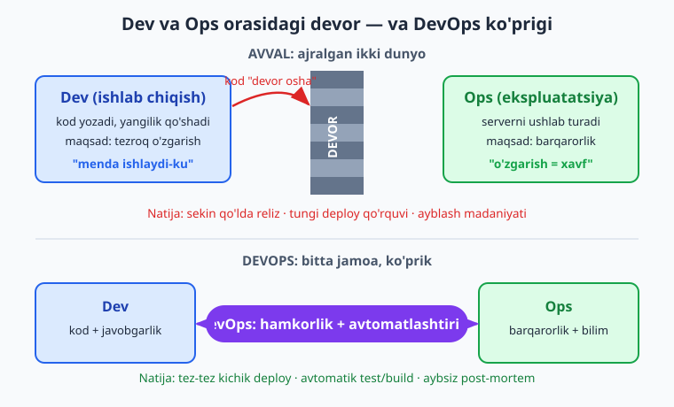
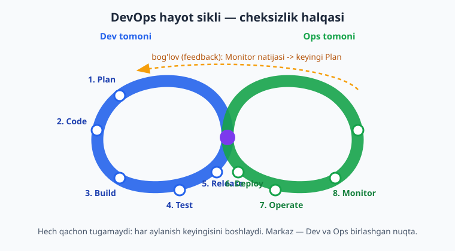
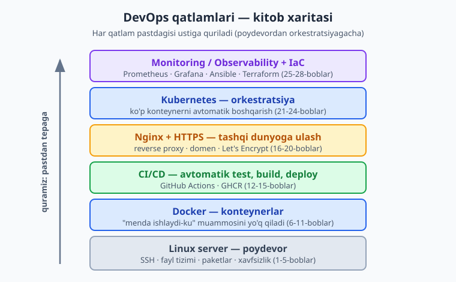

# 01 — DevOps nima va nega kerak

[🏠 README](./README.md) · [Keyingi: 02 — Linux server asoslari ➡️](./02-linux-server-asoslari.md)

---

> **Bu bobda:** dasturchi kod yozadigan "Dev" dunyosi bilan ilovani serverda ishlatadigan "Ops" dunyosi orasidagi ko'rinmas DEVORni — "menda ishlaydi-ku" muammosi, qo'lda va sekin reliz, ayblash madaniyati va tungi deploy qo'rquvini — ko'ramiz. So'ng DevOps'ning asl ta'rifini ochamiz: u vosita emas, balki Dev va Ops birlashib hamma narsani **avtomatik, takrorlanadigan va o'lchanadigan** qiladigan **madaniyat va amaliyot**. DevOps hayot siklini (cheksizlik halqasi: Plan → Code → Build → Test → Release → Deploy → Operate → Monitor) va uni mustahkamlaydigan **CALMS** modelini (Culture, Automation, Lean, Measurement, Sharing) o'rganamiz. Keyin butun kitobning ustunlarini — konteynerlar (Docker), CI/CD, Infrastructure as Code, monitoring/observability va orkestratsiya (Kubernetes) — qisqa tanishtiramiz, DevOps bilan SRE farqini aniqlaymiz, "DevOps muhandisi nima qiladi va nega bozorda talabgir" degan savolga javob beramiz va nihoyat 6 qismdan iborat kitob xaritasini chizamiz. Bu konseptual bob: kod kam, lekin u qolgan 27 bobning "nega"sini beradi.

---

## Muammo: ikki dunyo va orasidagi devor

Tasavvur qiling: siz haftalar davomida ajoyib ilova yozdingiz. Lokal kompyuteringizda u benuqson ishlaydi — har bir tugma joyida, har bir so'rov javob qaytaradi. Endi uni internetga chiqarish kerak: real foydalanuvchilar real serverda ishlatsin.

Va aynan shu yerda hammasi murakkablashadi.

Dasturlashda an'anaviy ravishda ikki xil rol bo'lgan:

- **Dev** (Development — ishlab chiqish): dasturchilar. Ular kod yozadi, yangi imkoniyat qo'shadi, xatolarni tuzatadi. Ularning maqsadi — **o'zgarish**: tezroq, ko'proq yangilik.
- **Ops** (Operations — ekspluatatsiya): tizim ma'murlari (sysadmin). Ular serverni ushlab turadi, ilovani ishga tushiradi, monitoring qiladi, tunda sayt tushib qolsa turg'izadi. Ularning maqsadi — **barqarorlik**: hech narsa buzilmasin, sayt ishlab tursin.

Ko'rinishidan bir maqsad uchun ishlaydigan ikki jamoa. Aslida esa ularning manfaatlari **bir-biriga qarama-qarshi**. Dev "tezroq o'zgartiraylik" deydi, Ops "o'zgarish — bu xavf, tegmaylik" deydi. Ular orasida ko'rinmas, lekin juda haqiqiy bir **DEVOR** o'sib chiqadi.



Bu devor o'zini bir nechta og'riq orqali namoyon qiladi.

### 1. "Menda ishlaydi-ku" muammosi

Dasturchi kodni topshiradi, server'da esa u ishlamaydi. Dasturchi yelka qisadi: *"Menda ishlaydi-ku!"* Ops esa boshini qashiydi.

Sabab odatda **muhit farqi**: dasturchining kompyuterida Python 3.13, serverda 3.10; lokalda PostgreSQL 17, serverda 14; lokalda bir kutubxona o'rnatilgan, serverda yo'q. Kod bir xil, lekin **atrof-muhit** boshqacha — shuning uchun natija ham boshqacha.

> 📌 "Menda ishlaydi-ku" — DevOps'ning asosiy dushmani. Yechim: ilova **bir xil muhitda** — lokalda ham, serverda ham — ishlashini kafolatlash. Bu Docker konteynerlarining (06-bob) tug'ilish sababi.

### 2. Sekin va qo'lda reliz

Yangi versiyani chiqarish marosimga aylanadi. Kimdir SSH bilan serverga kiradi, qo'lda fayllarni ko'chiradi, bog'liqliklarni o'rnatadi, eski jarayonni to'xtatib yangisini ishga tushiradi, Nginx'ni qayta yuklaydi. Har bir qadam — **qo'lda**, demak xato qilish mumkin. Kimdir bir buyruqni unutsa — sayt tushadi.

Bunday reliz soatlab davom etadi va shunchalik qo'rqinchliki, jamoalar uni faqat oyiga bir marta qilishga harakat qiladi. Natijada har bir reliz ulkan, "katta portlash" bo'ladi — va katta portlash katta xatoni anglatadi.

### 3. Tungi deploy qo'rquvi

Reliz xavfli bo'lgani uchun uni odamlar kam bo'lganda — juma kuni tunda yoki dam olish kunlari — qilishadi. Agar biror narsa buzilsa, panika boshlanadi: log'lar titkilanadi, buyruqlar shoshilinch teriladi, kimdir uxlamasdan tongacha tuzatadi. Ertasi kuni — charchagan, asabiy jamoa.

### 4. Ayblash madaniyati (blame culture)

Sayt tushganda birinchi savol "**nega**" emas, "**kim**" bo'ladi. Dev Ops'ni ayblaydi ("server'ingiz noto'g'ri sozlangan"), Ops Dev'ni ayblaydi ("kodingiz buzuq"). Hech kim aybni o'z bo'yniga olishni xohlamaydi, shuning uchun hech kim ochiq gapirmaydi, shuning uchun bir xil xato qayta-qayta takrorlanadi.

> ⚠️ Ayblash madaniyati eng zararli narsa: u odamlarni xatoni yashirishga majbur qiladi. Yashirilgan xato esa hech qachon tuzatilmaydi.

Mana shu to'rt og'riq — bir muammoning to'rt yuzi: **Dev bilan Ops bir-biridan ajralib qolgan**. DevOps aynan shu devorni buzish uchun tug'ildi.

---

## DevOps nima (va nima emas)

Eng katta tushunmovchilikdan boshlaylik:

> 📌 **DevOps — bu dastur, lavozim yoki sotib olinadigan vosita EMAS.** "Bizda DevOps bor, biz Docker o'rnatdik" degan gap noto'g'ri. DevOps — bu **madaniyat va amaliyotlar to'plami**: Dev va Ops jamoalari (va ko'pincha xavfsizlik, QA) birlashib, dasturni yozishdan to ishlatishgacha bo'lgan butun yo'lni **avtomatik, takrorlanadigan va o'lchanadigan** qilishadi.

DevOps nomining o'zi shu birlashishni bildiradi: **Dev** + **Ops** = **DevOps**. G'oya 2009-yil atrofida paydo bo'lgan — odamlar Dev bilan Ops orasidagi devor naqadar qimmatga tushishini anglab yetgan paytda.

DevOps'ning yuragida bir oddiy haqiqat yotadi:

> 💡 Qo'lda qilinadigan har bir ish — bu xato qilish imkoniyati va sekinlik manbasi. Demak: **qo'lda qilinadigan, takrorlanuvchi ishni avtomatlashtiring.** Kompyuter charchamaydi, unutmaydi va har safar bir xil ishni bir xil qiladi.

DevOps qabul qilingan jamoada og'riqlar shunday yechiladi:

| Eski og'riq (devor) | DevOps yechimi |
|---|---|
| "Menda ishlaydi-ku" | Konteyner: bir xil muhit hamma joyda (Docker) |
| Sekin, qo'lda reliz | CI/CD: `git push` -> avtomatik test+build+deploy |
| Tungi deploy qo'rquvi | Kichik, tez-tez, avtomatik, qaytariladigan (rollback) deploy |
| Ayblash madaniyati | Aybsiz post-mortem: "kim emas, nega va qanday tuzatamiz" |
| "Server qanday sozlangan, hech kim bilmaydi" | Infrastructure as Code: server sozlamasi koddagi, Git'da |

Eng muhimi: DevOps reliz qilishni **kichik va tez-tez** qiladi. Har kuni o'nlab marta deploy qilinadigan jamoada har bir deploy mayda — agar biror narsa buzilsa, faqat shu kichik o'zgarishni qaytarib, sekundlarda tuzatasiz. Bu qarama-qarshi tuyuladi ("tez-tez deploy = ko'p xato" emasmi?), lekin amalda **aksincha**: kichik o'zgarishni nazorat qilish va tuzatish oson.

---

## DevOps hayot sikli: cheksizlik halqasi

DevOps jarayoni hech qachon tugamaydigan **halqa** sifatida tasvirlanadi — buni mashhur cheksizlik (∞) belgisi shaklida chizishadi. Sabab oddiy: dastur "tayyor bo'lib" tinchib qolmaydi. Uni doimo yangilaysiz, kuzatasiz, yana yaxshilaysiz. Har bir aylanish keyingisini boshlaydi.



Halqaning sakkiz bosqichi:

1. **Plan** (rejalashtirish) — nima qilishni hal qilamiz: yangi imkoniyat, tuzatish, vazifa.
2. **Code** (kod yozish) — dasturchilar kodni yozadi, Git'ga topshiradi.
3. **Build** (yig'ish) — kod ishga yaroqli holatga keltiriladi: kompilyatsiya, bog'liqliklar, Docker image.
4. **Test** (sinash) — avtomatik testlar kodni tekshiradi: ishlaydimi, eskisini buzmadimi.
5. **Release** (chiqarishga tayyorlash) — sinovdan o'tgan versiya reliz uchun belgilanadi (tag).
6. **Deploy** (joylash) — versiya serverga/klasterga chiqariladi.
7. **Operate** (ishlatish) — ilova ishlab turadi, masshtablanadi, sozlanadi.
8. **Monitor** (kuzatish) — metrikalar, log'lar, ogohlantirishlar yig'iladi — keyin yana **Plan**'ga qaytamiz.

Chap yarmi (Plan→Code→Build→Test→Release) ko'proq **Dev**, o'ng yarmi (Deploy→Operate→Monitor) ko'proq **Ops** dunyosiga tegishli. DevOps ularni bir uzluksiz oqimga ulaydi — devor o'rniga halqa.

> 💡 Monitor bosqichi tasodifan oxirgi emas: kuzatuvdan olingan ma'lumot (qaysi sahifa sekin, qaysi xato tez-tez) keyingi Plan'ni shakllantiradi. Bu **fikr-mulohaza halqasi** (feedback loop) — DevOps shu halqani iloji boricha qisqartiradi.

---

## CALMS modeli

DevOps madaniyatini eslab qolish uchun mashhur **CALMS** qisqartmasi ishlatiladi. Bu — jamoa DevOps'ni "tushundimi" degan savolga javob beradigan besh ustun.

- **C — Culture (madaniyat).** Dev va Ops bir jamoa, umumiy maqsad bilan. Ayblash o'rniga hamkorlik; xato — o'rganish imkoniyati.
- **A — Automation (avtomatlashtirish).** Qo'lda takrorlanadigan ish yo'q: test, build, deploy, server sozlash — hammasi skript yoki pipeline orqali.
- **L — Lean (ortiqchasiz, tejamkor).** Kichik bo'laklar bilan tez harakat; ortiqcha, qiymat bermaydigan qadamlarni olib tashlash. Katta reliz emas — kichik, tez oqim.
- **M — Measurement (o'lchash).** "O'lchamasangiz — boshqara olmaysiz." Deploy chastotasi, xato darajasi, tiklanish vaqti — hammasi raqamlarda.
- **S — Sharing (ulashish).** Bilim, javobgarlik va asboblar ochiq ulashiladi. "Bu faqat Ops'ning ishi" degan to'siq yo'q.

> 📌 CALMS'da **Culture birinchi harf** — bu bejiz emas. Eng zo'r asboblarni o'rnatsangiz ham, agar jamoa hamon bir-birini ayblasa, DevOps ishlamaydi. Avval madaniyat, keyin asbob.

---

## Kitobning asosiy ustunlari

DevOps madaniyatini amaliyotga aylantiradigan beshta texnik ustun bor. Bularning har biri keyinchalik alohida bob/qismda chuqur ochiladi — bu yerda faqat tanishamiz, toki butun manzara ko'z oldingizda bo'lsin.



**1. Konteynerlar — Docker.** Konteyner — bu ilovani uning butun muhiti bilan (kutubxonalar, sozlamalar) bitta yengil, ko'chma "qutiga" o'rab qo'yadigan texnologiya. Bir marta yasab, **istalgan joyda bir xil** ishlatasiz. "Menda ishlaydi-ku" muammosini aynan shu yo'q qiladi. *(II qism: 06–11-boblar.)*

**2. CI/CD — uzluksiz integratsiya va yetkazib berish.** *CI* (Continuous Integration) — har bir o'zgarish avtomatik test va build qilinadi. *CD* (Continuous Delivery/Deployment) — sinovdan o'tgan versiya avtomatik tayyorlanadi yoki to'g'ridan-to'g'ri serverga chiqariladi. Biz buni **GitHub Actions** bilan quramiz: `git push` qildingiz — qolganini mashina bajaradi. *(III qism: 12–15-boblar.)*

**3. Infrastructure as Code (IaC) — infratuzilma kod sifatida.** Serverni qo'lda sozlash o'rniga, uning butun konfiguratsiyasini (qaysi paket, qaysi sozlama, nechta server) **koddagi fayllarda** yozasiz va Git'da saqlaysiz. Serverni yo'qotsangiz — koddan qaytadan, bir xil, bir tugma bilan tiklaysiz. Biz **Ansible** va **Terraform** bilan tanishamiz. *(27-bob.)*

**4. Monitoring va observability — kuzatuv.** Ilova ishlab tursagina yetmaydi — **qanday** ishlayotganini bilish kerak: tezmi, xatolar bormi, server bo'g'ilyaptimi? *Monitoring* — oldindan bilgan savollarga javob (CPU necha foiz?). *Observability* — kutilmagan muammoni log, metrika va trace orqali tushuna olish. Biz **Prometheus + Grafana** ishlatamiz. *(25–26-boblar.)*

**5. Orkestratsiya — Kubernetes.** Bitta konteynerni qo'lda boshqarish oson. Lekin o'nlab serverda yuzlab konteyner bo'lsa-chi? **Kubernetes** (qisqacha **K8s**) — konteynerlarni avtomatik joylashtiradigan, masshtablaydigan, tushganini o'zi turg'izadigan "dirijyor". *(V qism: 21–24-boblar.)*

Bu ustunlar bir-birining ustiga quriladi: pastda **Linux server**, uning ustida **Docker** konteynerlari, ularni **CI/CD** quradi va joylaydi, **Nginx + HTTPS** tashqi dunyoga ulaydi, **Kubernetes** ko'p mashinada boshqaradi, **Monitoring va IaC** esa butun tizimni ko'rinadigan va qayta tiklanadigan qiladi.

---

## DevOps vs SRE

Ko'p marta **SRE** (Site Reliability Engineering — sayt ishonchliligi muhandisligi) atamasini eshitasiz va "bu DevOps'mi?" deb hayron bo'lasiz.

Qisqasi:

- **DevOps** — bu **falsafa va maqsad**: Dev bilan Ops devorini buzish, hamkorlik va avtomatlashtirish.
- **SRE** — bu shu falsafani amalga oshirishning **aniq, muhandislik usuli**, Google ichida tug'ilgan. SRE'da ishonchlilik raqamlar bilan boshqariladi: **SLO** (xizmat darajasi maqsadi, masalan "99.9% vaqt ishlaydi"), **error budget** (ruxsat etilgan nosozlik miqdori) va Ops ishini **dasturlash bilan** avtomatlashtirishga urg'u.

Mashhur ta'rif: *"SRE — bu DevOps'ning bir aniq implementatsiyasi."* DevOps "nima qilish kerak" desa, SRE "buni aynan qanday qilamiz" deydi. Bu kitobda SRE g'oyalarini (SLI/SLO/error budget) 26-bobda ko'ramiz.

---

## DevOps muhandisi nima qiladi va nega talabgir

**DevOps muhandisi** — bu Dev va Ops orasidagi ko'prikni quradigan va ushlab turadigan mutaxassis. Uning kundalik ishi:

- CI/CD pipeline'larini qurish va saqlash (test, build, deploy avtomatlashtirish).
- Ilovalarni konteynerlash (Docker) va orkestratsiya (Kubernetes).
- Infratuzilmani kod bilan boshqarish (Ansible/Terraform).
- Monitoring, ogohlantirish va log tizimlarini sozlash.
- Server xavfsizligi, backup, tiklanish jarayonlarini ta'minlash.
- Dasturchilarga "kodim qanday production'ga boradi" yo'lini soddalashtirib berish.

Nega bu rol bozorda shunchalik talabgir (O'zbekistonda ham)?

> 💡 Sabab oddiy: **DevOps muhandisi vaqt va pulni tejaydi.** Qo'lda soatlab qilinadigan ishni avtomatlashtirib daqiqaga aylantiradi, sayt tushishini kamaytiradi, jamoaning tezligini oshiradi. Biznes uchun bu — to'g'ridan-to'g'ri foyda. Shuning uchun yaxshi DevOps muhandisi — eng yuqori maoshli IT mutaxassislaridan biri.

O'zbekistonda ham bulutli xizmatlar, fintech, e-tijorat va startaplar o'sgani sayin DevOps ko'nikmalariga talab tez ortib bormoqda — chunki bitta dasturchi qancha yaxshi kod yozsa ham, uni ishonchli va tez yetkaza olmasa, qiymati cheklangan bo'lib qoladi.

> ℹ️ Muhim: "DevOps muhandisi" alohida lavozim bo'lishi *shart emas*. Ko'p jamoalarda DevOps — bu **har bir dasturchi** egallaydigan ko'nikma. Aynan shu kitob sizni — ilova yoza oladigan dasturchini — o'z ilovangizni o'zingiz ishonchli yetkaza oladigan darajaga olib chiqadi.

---

## Bir lahza: DevOps "fikri" kodda qanday ko'rinadi

Keyingi boblarda chuqur kiramiz, lekin DevOps "ishni avtomatlashtirish" deganini his qilish uchun mana kichik, **illustrativ** misol — bu `git push` bo'lganda kodni avtomatik tekshiradigan GitHub Actions workflow'ining eng soddalashtirilgan ko'rinishi (12-bobda chinakam o'rganamiz):

```yaml
name: CI
on: push
jobs:
  test:
    runs-on: ubuntu-latest
    steps:
      - uses: actions/checkout@v6
      - run: echo "Kod tekshirilmoqda..."
```

Bu fayl repozitoriyangizda turadi. Mazmuni shunday: *"Har bir `push`'da, `ubuntu-latest` mashinasida, kodni ol va tekshir."* Hech kim qo'lda hech narsa qilmaydi — mana DevOps'ning ruhi: **qoidani bir marta yozasiz, mashina uni har safar bajaradi.**

---

## Kitob xaritasi

Kitob 6 qismdan iborat. Pastdan yuqoriga — poydevordan murakkab orkestratsiyagacha quramiz.

| Qism | Boblar | Nima beradi |
|---|---|---|
| **I — Poydevor** | 01–05 | DevOps falsafasi, Linux server, Bash avtomatlashtirish, xavfsizlik, qo'lda deploy (va nega u og'riqli). |
| **II — Docker** | 06–11 | Konteynerlar, `docker run`, Dockerfile, image optimizatsiya va registry, volume/network, Docker Compose. |
| **III — CI/CD** | 12–15 | GitHub Actions asoslari, test/build pipeline, image qurib GHCR'ga push, avtomatik deploy. |
| **IV — Nginx, HTTPS, deploy** | 16–20 | Nginx, reverse proxy va load balancing, HTTPS+domen (Let's Encrypt), systemd, to'liq production deploy. |
| **V — Kubernetes** | 21–24 | K8s arxitektura va lokal klaster, Pod/Deployment/Service, production K8s, Ingress/Helm/GitOps. |
| **VI — Monitoring, IaC, kapston** | 25–28 | Prometheus+Grafana, logging/alerting/backup, Ansible+Terraform (IaC), yakuniy to'liq platforma kapstoni. |

Har bir bob oldingisiga tayanadi, shuning uchun **tartib bilan** o'qing. Keyingi bob — **02 — Linux server asoslari** — barchasi ustiga quriladigan poydevordan, ya'ni serverga ulanish va undagi asosiy ko'nikmalardan boshlaydi.

> 📌 Eslatma: bu kitob siz bitta tilda ilova yoza olasiz va terminal hamda Git bilan tanishsiz deb hisoblaydi. Git'ni mustahkamlash kerak bo'lsa, [Git & GitHub — 0 dan Expertgacha](../git-github/README.md) kitobiga murojaat qiling — CI/CD qismi shunga tayanadi.

---

## 01-bob mashqlari

Bu bob konseptual, shuning uchun mashqlar ham asosan tushunish va o'z holatingizga bog'lashga qaratilgan. Daftaringizni oching va halol javob bering.

### Oson

1. O'z so'zlaringiz bilan, bir jumlada: DevOps nima va u qaysi muammoni hal qiladi?
2. "Dev" va "Ops" rollarining asosiy maqsadi bir-biridan nimasi bilan farq qiladi?
3. "Menda ishlaydi-ku" muammosining sababi nima? Bir misol keltiring.
4. DevOps hayot siklining sakkiz bosqichini tartib bilan yozing.
5. CALMS qisqartmasidagi har bir harf nimani anglatadi?

### O'rta

6. Nega DevOps siklini cheksizlik (∞) halqasi sifatida chizishadi? "Bog'lov" (feedback) halqasi nima va u qayerda yopiladi?
7. Quyidagi og'riqlarning har birini mos DevOps ustuniga bog'lang: (a) "menda ishlaydi-ku", (b) sekin qo'lda reliz, (c) "server qanday sozlangan hech kim bilmaydi", (d) "sayt sekin ishlayotganini sezmay qoldik".
8. "Ayblash madaniyati" nega zararli? U xatolarni tuzatishga qanday to'sqinlik qiladi?
9. CALMS'da nega Culture birinchi o'rinda turadi? Faqat asbob o'rnatish nega yetarli emas?
10. DevOps va SRE orasidagi farqni 2-3 jumlada tushuntiring.

### Qiyin

11. O'zingiz yozgan (yoki o'zingiz biladigan) bitta ilovani oling. Uni serverga chiqarish jarayonini bosqichma-bosqich yozing va har bir qo'lda qadamni belgilang. Qaysi qadamlarni avtomatlashtirish mumkin?

<details markdown="1"><summary>Yechim</summary>

Namuna (oddiy Node.js "vazifalar" API si uchun qo'lda deploy):

```text
1.  SSH bilan serverga kirish .................... qo'lda
2.  git pull bilan yangi kodni olish ............. qo'lda (avtomatlashtirsa bo'ladi)
3.  npm install (bog'liqliklar) .................. qo'lda (avtomatlashtirsa bo'ladi)
4.  testlarni qo'lda yugurtirish (yoki o'tkazib yuborish!) ... qo'lda -> CI ga
5.  eski jarayonni to'xtatish .................... qo'lda (xato xavfi)
6.  yangi jarayonni ishga tushirish .............. qo'lda
7.  Nginx ni qayta yuklash ....................... qo'lda
8.  brauzerda ochib tekshirish ................... qo'lda
```

Avtomatlashtirish xaritasi:
- 2–3-qadam (kod olish, bog'liqlik) -> **CI/CD** pipeline (12–15-boblar) bajaradi.
- 4-qadam (test) -> **CI** har push'da avtomatik (12-bob).
- 5–6-qadam (jarayonni almashtirish) -> **konteyner** + orkestratsiya (06, 21-boblar) xavfsiz qiladi.
- 1, 7-qadam (SSH, Nginx) -> **avtomatik deploy** skripti yoki Actions (15-bob).

Asosiy xulosa: deyarli **har bir qo'lda qadam** avtomatlashtirilishi mumkin — DevOps shuni qiladi.
</details>

12. "Menda ishlaydi-ku" muammosi nega aynan kelib chiqishini muhit farqi orqali tushuntiring va DevOps'ning qaysi ustuni uni qanday yo'q qilishini yozing.

<details markdown="1"><summary>Yechim</summary>

**Sabab — muhit farqi (environment drift).** Ilova faqat kodning o'zidan iborat emas; u quyidagilarga ham bog'liq: til versiyasi (Python 3.13 vs 3.10), kutubxona versiyalari, OS va tizim paketlari, environment o'zgaruvchilari, ma'lumotlar bazasi versiyasi, fayl yo'llari. Dasturchining kompyuteri bilan serverning bu "muhiti" bir xil bo'lmasa — bir xil kod boshqacha ishlaydi yoki umuman ishlamaydi.

**Yechim — konteynerlar (Docker).** Konteyner ilovani **butun muhiti bilan birga** bitta image'ga o'raydi: aniq til versiyasi, aniq kutubxonalar, aniq sozlamalar. Bu image lokalda ham, serverda ham, hamkasbingizning mashinasida ham **bayt-baytigacha bir xil** ishlaydi. Shunday qilib "qaysi muhitda" degan savol yo'qoladi — muhit image'ning o'zida. Buni 06-bobda batafsil ko'ramiz.
</details>

13. Bir biznes egasi "Nega menga DevOps muhandisi kerak, dasturchilarim bor-ku?" deb so'radi. Unga 3-4 jumlada javob yozing (biznes tilida: vaqt, pul, xavf).

<details markdown="1"><summary>Yechim</summary>

Namuna javob:

> "Dasturchilaringiz ajoyib kod yozadi, lekin bu kod foydalanuvchiga ishonchli va tez yetib bormasa, qiymati cheklangan. DevOps muhandisi reliz jarayonini avtomatlashtiradi: qo'lda soatlab qilinadigan deploy daqiqalarga tushadi, demak dasturchilaringiz kod yozishga ko'proq vaqt ajratadi. U saytning tushib qolish ehtimolini kamaytiradi (har bir tushgan soat — yo'qotilgan daromad va obro') va muammoni tez aniqlab tuzatish imkonini beradi. Qisqasi: tezroq yangilanish, kamroq nosozlik, kamroq tungi favqulodda holat — bularning hammasi to'g'ridan-to'g'ri pul tejaydi."

Asosiy fikrlar: avtomatlashtirish = vaqt tejash, ishonchlilik = daromad himoyasi, tez tiklanish = kam xavf.
</details>

14. Kelgusi 28 bobni o'qib bo'lganingizda o'zingiz qila olishni xohlaydigan **uchta** aniq narsani yozing (masalan "git push qilsam, ilovam avtomatik serverga chiqsin"). Bu — sizning shaxsiy maqsad ro'yxatingiz; kitob oxirida qaytib tekshiring.

<details markdown="1"><summary>Yechim</summary>

Bu shaxsiy mashq — "to'g'ri" javob yo'q. Namuna maqsadlar:

1. Ilovamni Docker konteyneriga joylab, istalgan serverda bir xil ishga tushira olish (06–08-boblar).
2. `git push` qilganda ilova avtomatik test qilinib, GHCR'ga image push bo'lib, serverga deploy bo'lishi (12–15-boblar).
3. Saytimni o'z domenim ostida HTTPS bilan ishga tushirish va Grafana'da uning holatini kuzata olish (18, 25-boblar).

Ro'yxatingizni saqlab qo'ying — 28-bob (kapston) aynan shularning hammasini bitta loyihada birlashtiradi.
</details>

---

[🏠 README](./README.md) · [Keyingi: 02 — Linux server asoslari ➡️](./02-linux-server-asoslari.md)
