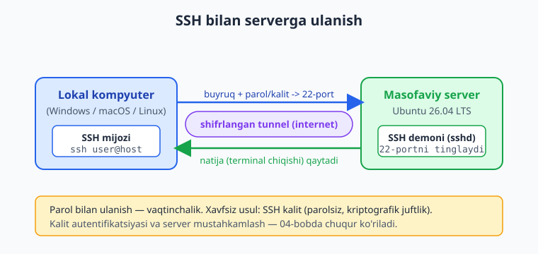
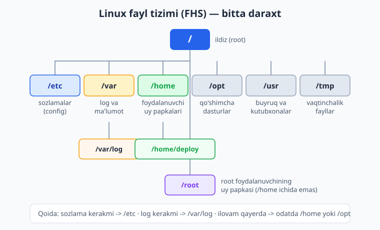
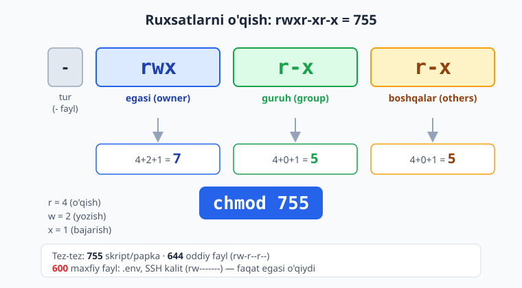

# 02 — Linux server asoslari

[⬅️ Oldingi: 01 — DevOps nima va nega kerak](./01-devops-nima.md) · [🏠 README](./README.md) · [Keyingi: 03 — Bash skripting va avtomatlashtirish ➡️](./03-bash-skripting.md)

> **Bu bobda:** nega deyarli barcha serverlar Linux (Ubuntu)'da ishlashini va lokal kompyuteringizdan serverga `ssh` bilan qanday ulanishni o'rganamiz, Linux fayl tizimi ierarxiyasini (`/etc`, `/var`, `/home`, `/opt`, `/usr`, `/tmp`, `/root` — FHS) va absolyut/nisbiy yo'l farqini ko'ramiz, kundalik ish uchun eng kerakli buyruqlarni (`ls`, `cd`, `cat`/`less`/`tail -f`, `cp`/`mv`/`rm`, `mkdir -p`, `find`, `grep`, `nano`/`vim`) qo'lga olamiz, foydalanuvchi va guruh bilan ishlashni (`whoami`, `sudo`, `adduser`, `usermod -aG`, nega root'da ishlamaslik), fayl ruxsatlarini (`rwx`, sakkizlik `755`/`644`/`600`, `chmod`/`chown`/`chmod +x`), paket boshqaruvini (`apt update && apt upgrade`, `apt install`/`remove`/`search`), process boshqaruvini (`ps aux`, `top`/`htop`, `kill`, `&`/`jobs`), `systemctl` va `journalctl` asoslarini hamda disk/xotirani kuzatishni (`df -h`, `du -sh`, `free -h`) muammodan yechimga olib boramiz.

---

## Muammo

Tasavvur qiling: 01-bobda DevOps falsafasini o'qib, ruhlandingiz. Endi arzon VPS oldingiz, provayder sizga elektron pochtaga uchta narsa yubordi:

```text
IP manzil:    203.0.113.42
Foydalanuvchi: root
Parol:        7xK9mPq2Lz
```

Brauzerda hech qanday "boshqaruv paneli" yo'q. Faqat shu uchta qator. Endi nima qilasiz? Bu serverga qanday "kirasiz"? Ichida fayllar qayerda turadi? Ilovangizni qayerga qo'yasiz? Va eng muhimi — qora ekranda kursor miltillab turibdi, har bir noto'g'ri buyruq butun serverni buzib qo'yishi mumkindek tuyuladi.

Yaxshi xabar: server — bu sizning kompyuteringizning "klaviaturasiz va monitorsiz" ukasi, xolos. U ham operatsion tizimda ishlaydi — deyarli har doim **Linux**'da. Bu bob sizni o'sha qora ekran bilan do'st qiladi: ulanishdan, fayllarni topishgacha, ruxsatlarni sozlashdan dastur o'rnatishgacha. Bob oxirida server sizga "begona" emas, "uy" bo'lib qoladi.

📌 Bu bob — **poydevor**. Docker, CI/CD, Nginx, Kubernetes — keyingi hamma narsa shu yerda o'rgangan buyruq va tushunchalar ustiga quriladi. Shoshilmang, har bir buyruqni o'zingiz tering.

---

## Nega serverlar Linux'da ishlaydi

Lokalda Windows yoki macOS ishlatasiz — chunki unda brauzer, ofis dasturlari va chiroyli oyna kerak. Lekin serverning vazifasi boshqacha: u **xizmatni** (sayt, API, ma'lumotlar bazasi) yillab, uzluksiz, monitorsiz ishlatib turishi kerak. Aynan shu ish uchun Linux yutuqli:

- **Bepul va ochiq.** Litsenziya to'lovi yo'q — minglab serverni bemalal ishga tushirasiz.
- **Yengil.** Grafik oyna yo'q (server'da `Desktop` o'rnatilmaydi) — butun quvvat ilovangizga ketadi.
- **Barqaror.** Yillab qayta yuklamasdan ishlaydi.
- **Skriptlanadi.** Hamma narsa buyruq orqali bajariladi — demak avtomatlashtirsa bo'ladi (DevOps'ning yuragi shu).

Linux'ning ko'plab "ta'mlari" (distributiv) bor: Ubuntu, Debian, CentOS/Rocky, Alpine va boshqalar. Biz **Ubuntu Server**'ni tanlaymiz — chunki u eng keng tarqalgan, hujjatlari boy va internetdagi ko'p qo'llanma aynan unga mo'ljallangan.

ℹ️ Joriy versiya: **Ubuntu 26.04 LTS** ("Resolute Raccoon", 2026-04-23 chiqdi). LTS — *Long Term Support*, uzoq muddat (5+ yil) yangilanish oladi degani; production uchun aynan LTS oling. Oldingi **24.04 LTS** ham hali to'liq qo'llab-quvvatlanadi — agar provayder unisini bersa, kitobdagi hamma narsa bir xil ishlaydi.

💡 Docker (06-bobdan) ham aslida Linux ustida quriladi. Linux'ni bilish — keyin konteyner ichida nima bo'layotganini tushunish demak. Bu bob bekorga "poydevor" deb atalmagan.

---

## Serverga SSH bilan ulanish

Lokal kompyuteringizdan masofadagi serverga ulanish uchun **SSH** (*Secure Shell* — xavfsiz qobiq) ishlatiladi. SSH — bu sizning terminalingiz bilan serverning terminali o'rtasida shifrlangan tunnel: siz buyruq yozasiz, u serverda bajariladi, natija qaytib keladi. Hamma narsa shifrlangan, hech kim eshitolmaydi.

Quyidagi diagramma oqimni ko'rsatadi: lokal mashinangiz SSH mijozi orqali internet bo'ylab serverning 22-portiga ulanadi.



SSH mijozi macOS, Linux va zamonaviy Windows 10/11'da allaqachon o'rnatilgan (`ssh` buyrug'i terminalda ishlaydi). Ulanish formati oddiy:

```bash
ssh foydalanuvchi@server_manzili
```

Yuqoridagi misol uchun:

```bash
ssh root@203.0.113.42
```

Birinchi marta ulanganda SSH server'ning "barmoq izini" tasdiqlashingizni so'raydi — bu normal, `yes` deb javob bering:

```text
The authenticity of host '203.0.113.42' can't be established.
ED25519 key fingerprint is SHA256:Xy9...aB2.
Are you sure you want to continue connecting (yes/no/[fingerprint])? yes
```

So'ng parolni so'raydi (terminalda parol terilganda hech narsa ko'rinmaydi — bu xavfsizlik, davom etavering). To'g'ri kiritsangiz, server sizni kutib oladi:

```text
Welcome to Ubuntu 26.04 LTS (GNU/Linux ...)
root@srv1:~#
```

Mana, endi siz serverdasiz. Oxiridagi `#` belgisi — siz **root** (eng kuchli foydalanuvchi) ekaningizni bildiradi.

⚠️ **Parol bilan ulanish — vaqtinchalik yechim.** U xavfsiz emas: parol o'g'irlanishi yoki "brute-force" qilinishi mumkin. To'g'ri usul — **SSH kalit** (parolsiz, kriptografik juftlik). Uni va serverni mustahkamlashni **04-bobda** ("Tarmoq va server xavfsizligi") chuqur ko'ramiz. Hozircha parol bilan kirib, asoslarni o'rganamiz.

Serverdan chiqish uchun:

```bash
exit
```

---

## Fayl tizimi: hamma narsa daraxtning bir shoxida

Windows'da disklar `C:\`, `D:\` bo'lib ajraladi. Linux'da bunaqa emas: **bitta** daraxt bor, uning ildizi `/` (slash) deb ataladi. Hamma narsa — fayllar, papkalar, hatto qurilmalar — shu yagona daraxtning shoxlarida turadi.

Bu daraxtning tuzilishi tasodifiy emas — u **FHS** (*Filesystem Hierarchy Standard* — fayl tizimi ierarxiyasi standarti) bo'yicha tartiblangan. Har bir papkaning aniq vazifasi bor:



| Yo'l | Vazifasi | DevOps uchun nega muhim |
|---|---|---|
| `/etc` | Konfiguratsiya fayllari (sozlamalar) | Nginx, SSH, systemd sozlamalari shu yerda |
| `/var` | O'zgaruvchan ma'lumot: loglar, bazalar | `/var/log` — server loglari shu yerda |
| `/home` | Oddiy foydalanuvchilar uy papkalari | Ilovangiz ko'pincha `/home/deploy/...` da turadi |
| `/root` | `root` foydalanuvchining uy papkasi | `/home` ichida emas, alohida |
| `/opt` | Qo'shimcha (uchinchi tomon) dasturlar | Ba'zi ilovalar shu yerga o'rnatiladi |
| `/usr` | O'rnatilgan dasturlar va kutubxonalar | `/usr/bin` da deyarli barcha buyruqlar |
| `/tmp` | Vaqtinchalik fayllar (qayta yuklashda tozalanadi) | Vaqtinchalik yuklash, build keshi uchun |
| `/bin`, `/sbin` | Asosiy tizim buyruqlari | `ls`, `cp` kabi buyruqlar joyi |

📌 **Asosiy qoida:** *sozlama* kerakmi — `/etc`'ga qara; *log* kerakmi — `/var/log`'ga qara; *ilovam qayerda* — odatda `/home`'da yoki `/opt`'da. Bu uchta yo'lni yodda tutsangiz, serverda adashmaysiz.

### Absolyut vs nisbiy yo'l

Yo'lni ikki xil ko'rsatish mumkin:

- **Absolyut yo'l** — `/` dan boshlanadi, har doim aynan bitta joyni bildiradi: `/var/log/nginx/access.log`. Qayerda turishingizdan qat'i nazar ishlaydi.
- **Nisbiy yo'l** — hozir turgan papkangizga nisbatan: `log/app.log` (joriy papka ichidagi `log` papkasi). `.` — joriy papka, `..` — bir pog'ona yuqori, `~` — uy papkangiz.

```bash
cd /var/log        # absolyut: aniq /var/log ga boramiz
cd nginx           # nisbiy: /var/log/nginx ga (hozirgi joydan)
cd ..              # bir pog'ona yuqori: /var/log ga qaytamiz
cd ~               # uy papkasiga (root uchun /root, deploy uchun /home/deploy)
```

💡 Adashsangiz, `pwd` (*print working directory*) yozing — u qaysi papkada turganingizni absolyut yo'l bilan aytadi. Yangi terminalda eng birinchi refleksingiz `pwd` bo'lsin.

---

## Kundalik buyruqlar: navigatsiya va fayllar

Endi serverda harakatlanaylik. Quyidagi buyruqlar — sizning kunlik nonu tuzingiz.

**Qayerdaman va nima bor:**

```bash
pwd            # qaysi papkadaman?
ls             # papkadagi fayllar ro'yxati
ls -la         # batafsil: yashirin fayllar (.) ham, ruxsatlar ham, hajm ham
cd /etc/nginx  # papkaga kirish
cd             # uy papkasiga qaytish (argumentsiz cd ~ ga teng)
```

`ls -la` natijasi shunday ko'rinadi (haqiqiy Ubuntu serverdan):

```text
total 20
drwxr-xr-x 4 root root 4096 Jun 13 16:59 .
drwxr-xr-x 1 root root 4096 Jun 13 16:59 ..
-rw------- 1 root root   49 Jun 13 16:59 .env
drwxr-xr-x 2 root root 4096 Jun 13 16:59 log
drwxr-xr-x 2 root root 4096 Jun 13 16:59 skriptlar
```

Bu jadvalning ustunlarini hozircha tanang: birinchi ustun (`drwxr-xr-x`) — **ruxsatlar** (pastda chuqur ko'ramiz), `root root` — egasi va guruhi, `4096` — hajm baytda, oxiri — nom. `d` bilan boshlansa — papka, `-` bilan — oddiy fayl.

**Fayl ichini ko'rish:**

```bash
cat /etc/hostname          # butun faylni ekranga to'kadi (kichik fayl uchun)
less /var/log/syslog       # uzun faylni sahifalab ko'rish (q bilan chiqish)
tail -n 20 app.log         # oxirgi 20 qatorni
tail -f /var/log/nginx/access.log   # JONLI kuzatish: yangi qatorlar real vaqtda oqib chiqadi
```

⚠️ `tail -f` (*follow*) — DevOps'ning eng sevimli buyruqlaridan biri. U faylni yopmaydi, balki yangi yozuvlarni real vaqtda ko'rsatib turadi. Loglarni jonli kuzatish uchun ajoyib. Chiqish uchun `Ctrl+C`.

**Fayl va papka boshqaruvi:**

```bash
mkdir loyiha               # bitta papka yaratish
mkdir -p loyiha/log/2026   # -p: butun zanjirni (yo'q oraliq papkalarni ham) yaratadi
cp manba.txt nusxa.txt     # nusxa ko'chirish
cp -r papka1 papka2        # -r: papkani ichidagisi bilan ko'chirish
mv eski.txt yangi.txt      # ko'chirish YOKI nomini o'zgartirish
rm fayl.txt                # faylni o'chirish
rm -r papka                # papkani ichidagisi bilan o'chirish
```

⚠️ **`rm`'da `Recycle Bin` yo'q.** O'chirilgan fayl butunlay yo'qoladi. Ayniqsa `rm -rf /` kabi buyruqlardan ehtiyot bo'ling — u butun serverni o'chiradi. Hech qachon `rm -rf` ni o'ylamasdan, ayniqsa o'zgaruvchi bilan (`rm -rf $DIR/`) yozmang.

**Topish va izlash:**

```bash
find /home -name "*.sh"          # /home ichidagi barcha .sh fayllarni topadi
find /var/log -name "*.log"      # barcha log fayllarni
grep "ERROR" app.log             # fayl ichida "ERROR" so'zi bor qatorlarni topadi
grep -r "TODO" .                 # joriy papkadan (rekursiv) qidirish
```

`grep` — DevOps'da loglardan xatolikni qidirishning asosiy quroli. Masalan:

```bash
grep "ERROR" /var/log/app.log
```

```text
2026-06-13 ERROR ulanish uzildi
2026-06-13 ERROR disk toldi
```

**Matnni tahrirlash:** serverda fayl ochib tahrirlash kerak bo'ladi (masalan Nginx sozlamasi). Ikki muharrir bor:

- **`nano`** — boshlovchi uchun. `nano fayl.conf` bilan ochiladi, oddiy matn muharriri kabi yozasiz, `Ctrl+O` saqlash, `Ctrl+X` chiqish (pastda ko'rsatma turadi).
- **`vim`** — kuchli, lekin o'rganish kerak. `vim fayl.conf` bilan ochiladi; `i` bilan yozish rejimi, `Esc` bilan chiqish, `:wq` saqlab chiqish, `:q!` saqlamasdan chiqish.

💡 Boshida `nano` ishlating — u sodda. `vim` zo'r, lekin avval undan "qanday chiqishni" bilib oling (`Esc` keyin `:q!`) — bu eng mashhur "qopqonlardan" biri.

---

## Foydalanuvchi va guruh: nega root'da ishlamaslik kerak

```bash
whoami         # men kimman? (masalan: root)
id             # to'liq: uid, gid, qaysi guruhlardaman
```

Server bilan tanishganda siz `root` bo'lasiz. **root** — bu Linux'dagi "xudo": hamma narsani o'chirishi, o'zgartirishi, har qanday faylga tegishi mumkin. Aynan shu — xavf.

⚠️ **Nega root'da kundalik ishlamaslik kerak?** root bo'lib bitta xato buyruq (masalan noto'g'ri `rm -rf`) butun serverni o'ldiradi — hech kim sizni to'xtatmaydi. Agar dasturingiz buzilsa va u root bo'lib ishlasa, hujumchi butun serverni egallaydi. **Eng yaxshi amaliyot:** oddiy foydalanuvchi yarating, unga kerak bo'lganda `sudo` bilan vaqtincha kuch bering.

`sudo` (*superuser do*) — bitta buyruqni vaqtincha root huquqi bilan bajarish:

```bash
sudo apt update        # bu buyruq root huquqi bilan ishga tushadi
sudo nano /etc/hosts   # himoyalangan faylni tahrirlash uchun
```

**Yangi foydalanuvchi yaratish** (illustrativ — o'z serveringizda, root bo'lib turib bajaring):

```bash
adduser deploy
```

Bu buyruq parol va bir nechta savol so'raydi, so'ng `/home/deploy` uy papkasini yaratadi. Endi bu foydalanuvchiga `sudo` huquqini berish uchun uni `sudo` guruhiga qo'shamiz:

```bash
usermod -aG sudo deploy
```

📌 `usermod -aG` ni yaxshilab tushuning: `-a` (*append*, qo'shish) va `-G` (*group*, guruh) — **birga** ishlatilishi shart. Faqat `-G` yozsangiz, foydalanuvchi avvalgi barcha guruhlaridan chiqib, faqat shu guruhda qoladi (xavfli xato). `-aG` esa **qo'shadi**, eskilarini saqlaydi.

Endi keyingi safar serverga oddiy foydalanuvchi sifatida ulanasiz:

```bash
ssh deploy@203.0.113.42
```

Bu rejimda buyruq oxiridagi belgi `#` emas, `$` bo'ladi — siz oddiy foydalanuvchi ekaningizni bildiradi. root kuchi kerak bo'lganda — `sudo` qo'shasiz.

---

## Ruxsatlar: kim nima qila oladi

Linux'da har bir fayl uchun **uch toifa** odamga **uch xil** huquq beriladi. Toifalar: **egasi** (*owner*), **guruh** (*group*), **boshqalar** (*others*). Huquqlar: **o'qish** (`r` — read), **yozish** (`w` — write), **bajarish** (`x` — execute).

`ls -l`'dagi `-rwxr-xr-x` qatorini ana shu ko'z bilan o'qing. Quyidagi diagramma uni ochib beradi.



`-rwxr-xr-x` ni uchga bo'lib o'qing (birinchi `-` — fayl turi, papka bo'lsa `d`):

| Toifa | Belgilar | Ma'nosi |
|---|---|---|
| Egasi | `rwx` | o'qiydi, yozadi, bajaradi |
| Guruh | `r-x` | o'qiydi, bajaradi (yozolmaydi) |
| Boshqalar | `r-x` | o'qiydi, bajaradi (yozolmaydi) |

### Sakkizlik (octal) raqamlar

Har bir huquqning soni bor: `r=4`, `w=2`, `x=1`. Bir toifa uchun ularni qo'shasiz:

- `rwx` = 4+2+1 = **7**
- `r-x` = 4+0+1 = **5**
- `rw-` = 4+2+0 = **6**
- `r--` = 4+0+0 = **4**
- `---` = 0 = **0**

Demak `rwxr-xr-x` = **755**. Eng ko'p uchraydigan uchta qiymat:

| Octal | Belgi | Qachon ishlatiladi |
|---|---|---|
| `755` | `rwxr-xr-x` | Skript va papkalar (egasi to'liq, boshqalar o'qiydi+bajaradi) |
| `644` | `rw-r--r--` | Oddiy fayllar (egasi yozadi, boshqalar faqat o'qiydi) |
| `600` | `rw-------` | Maxfiy fayllar: `.env`, SSH kalit (faqat egasi o'qiydi/yozadi) |

### `chmod` va `chown`

`chmod` (*change mode*) — ruxsatlarni o'zgartiradi. `chown` (*change owner*) — egasini o'zgartiradi.

```bash
chmod 644 .env                # ruxsatni aniq 644 ga o'rnatish
chmod 600 .env                # maxfiy faylga
chmod +x deploy.sh            # "bajarish" huquqini qo'shish (skriptni ishga tushiriladigan qilish)
chown deploy:deploy app.log   # egasini va guruhini deploy ga o'tkazish
chown -R deploy:deploy /opt/app   # -R: papka ichidagi hamma narsani
```

Quyidagi misollar **haqiqiy Ubuntu serverda ishga tushirilgan** va natijalari aynan ko'chirilgan:

```bash
chmod +x deploy.sh
ls -l deploy.sh
```

```text
-rwxr-xr-x 1 root root 32 Jun 13 16:59 deploy.sh
```

```bash
chmod 600 .env
ls -l .env
```

```text
-rw------- 1 root root 49 Jun 13 16:59 .env
```

📌 **Sir:** maxfiy fayllarni (`.env`, SSH kalitlar, parollar) doim `600` qiling. SSH kalitlar `644` (boshqalar o'qiy oladigan) bo'lsa, SSH ularni rad etadi ("permissions too open" xatosi). Bu — eng ko'p uchraydigan SSH muammosi.

---

## Paket boshqaruvi: dasturlarni o'rnatish

Linux'da dastur o'rnatish uchun `.exe` yuklab olmaysiz. Buning o'rniga **paket menejeri** bor — Ubuntu'da bu **`apt`** (*Advanced Package Tool*). U dasturlarni rasmiy ombordan (repository) yuklab, bog'liqliklari bilan o'rnatadi. Worry-free.

Quyidagi buyruqlar root huquqini talab qiladi — shuning uchun `sudo` bilan (illustrativ — o'z serveringizda):

```bash
sudo apt update                 # paketlar ro'yxatini yangilash (har doim avval shuni)
sudo apt upgrade                # o'rnatilgan paketlarni yangi versiyaga ko'tarish
sudo apt install nginx          # nginx ni o'rnatish
sudo apt install -y htop curl git   # -y: barcha savolga avtomatik "ha"
sudo apt remove nginx           # o'chirish (sozlamalar qoladi)
sudo apt purge nginx            # o'chirish + sozlamalar bilan
sudo apt search nginx           # paket qidirish
```

📌 **Oltin qoida:** har doim avval `apt update`, keyin `apt install`. `update` paketlar **ro'yxatini** (qaysi versiya bor) yangilaydi; `upgrade` esa **dasturlarni o'zini** yangilaydi. Ikkalasini birga ko'pincha shunday yozishadi:

```bash
sudo apt update && sudo apt upgrade -y
```

Bu yerda `&&` — "birinchi muvaffaqiyatli tugasa, ikkinchisini ham bajar" degani (bu mantiqni 03-bobda chuqur ko'ramiz).

💡 Yangi server olganingizdan keyin birinchi ishingiz — `sudo apt update && sudo apt upgrade -y` bilan tizimni yangilash. Bu xavfsizlik yamoqlarini ham o'rnatadi.

---

## Process boshqaruvi: nima ishlab turibdi

Serverdagi har bir ishlab turgan dastur — **process** (jarayon). Har birining `PID` (process ID) raqami bor. Ularni ko'rish va boshqarish kerak.

```bash
ps aux              # barcha ishlab turgan processlar ro'yxati
ps aux | grep nginx # faqat nginx bilan bog'liqlarini (quvur orqali grep ga uzatamiz)
top                 # JONLI ko'rinish: CPU/xotira yuki real vaqtda (q bilan chiqish)
htop                # top ning chiroyli, qulay versiyasi (apt install htop kerak)
```

`ps aux` natijasi shunday ustunlarni beradi (illustrativ server chiqishi):

```text
USER       PID %CPU %MEM    VSZ   RSS TTY      STAT START   TIME COMMAND
root         1  0.0  0.1 168120 11500 ?       Ss   09:00   0:01 /sbin/init
www-data   842  0.3  1.2 145200 49800 ?       S    09:05   0:12 nginx: worker process
deploy    1337  1.1  3.4 998200 138400 ?      Sl   09:10   2:45 node /opt/app/server.js
```

`PID` ni bilib, processni to'xtatish mumkin:

```bash
kill 1337       # processga "muloyim" to'xtash signalini yuborish (u tozalanib chiqadi)
kill -9 1337    # MAJBURIY o'ldirish (process javob bermay qolsa, oxirgi chora)
```

⚠️ `kill -9` (`SIGKILL`) — processni darhol, hech narsa saqlamasdan o'ldiradi. Avval oddiy `kill` (`SIGTERM`) ni sinab ko'ring — u dasturga "yig'ishtirib chiq" deydi. `-9` faqat process qotib qolganda.

**Foreground va background.** Buyruq odatda terminalni "band" qiladi (foreground). Uni orqa fonga (background) o'tkazib, terminalni bo'shatish mumkin:

```bash
./uzun-vazifa.sh &      # & — buyruqni orqa fonda ishga tushiradi
jobs                    # shu terminaldagi background vazifalar ro'yxati
fg                      # oxirgi background vazifani foreground ga qaytarish
```

💡 `&` bilan ishga tushirilgan vazifa terminalni yopganda to'xtaydi. Server'da ilovani **doimiy** ishlatish uchun `&` yetarli emas — buning uchun `systemd` ishlatiladi (pastda asoslarini, **19-bobda** to'liq ko'ramiz).

---

## systemd: xizmatlarni boshqarish (asos)

Serverdagi doimiy xizmatlar (Nginx, ma'lumotlar bazasi, sizning ilovangiz) **`systemd`** orqali boshqariladi. U xizmatni avtomatik ishga tushiradi, qulasa qayta ko'taradi, server qayta yuklanganda yana yoqadi. Boshqaruvchi buyruq — `systemctl` (illustrativ — o'z serveringizda):

```bash
sudo systemctl status nginx    # holatini ko'rish (ishlayaptimi, xato bormi)
sudo systemctl start nginx     # ishga tushirish
sudo systemctl stop nginx      # to'xtatish
sudo systemctl restart nginx   # qayta ishga tushirish
sudo systemctl enable nginx    # server qayta yuklanganda AVTOMATIK yoqilsin
sudo systemctl disable nginx   # avtomatik yoqishni o'chirish
```

`systemctl status nginx` taxminan shunday ko'rinadi (illustrativ):

```text
● nginx.service - A high performance web server and a reverse proxy server
     Loaded: loaded (/usr/lib/systemd/system/nginx.service; enabled; preset: enabled)
     Active: active (running) since Sat 2026-06-13 09:05:11 UTC; 2h ago
   Main PID: 842 (nginx)
```

Yashil `active (running)` — xizmat sog'lom ishlayapti. `enabled` — qayta yuklashda o'zi yonadi.

Xizmat loglarini ko'rish uchun **`journalctl`**:

```bash
sudo journalctl -u nginx           # nginx xizmatining barcha loglari
sudo journalctl -u nginx -f        # JONLI kuzatish (tail -f kabi)
sudo journalctl -u nginx --since "1 hour ago"   # oxirgi 1 soatlik
```

ℹ️ `-u` (*unit*) — qaysi xizmatning logini ko'rsatishni bildiradi. `systemd` va `journalctl`'ni **19-bobda** to'liq, o'z xizmat faylingizni (`.service` unit) yozishgacha o'rganamiz. Hozircha shu uchta buyruqni biling — ular bilan har qanday xizmatni tekshira olasiz.

---

## Disk va xotirani kuzatish

Server "to'lib" qolsa (disk yoki RAM tugasa) ilova ishdan chiqadi. Buni oldindan ko'rish uchun uch buyruq:

```bash
df -h          # disk bo'sh joyi (-h: odam o'qiydigan ko'rinish: GB, MB)
du -sh /var/log    # ma'lum papka qancha joy egallayotgani (-s: yig'indi, -h: o'qiluvchan)
free -h        # operativ xotira (RAM) holati
```

`df -h` natijasi (illustrativ server chiqishi):

```text
Filesystem      Size  Used Avail Use% Mounted on
/dev/vda1        40G   12G   26G  32% /
tmpfs           2.0G     0  2.0G   0% /dev/shm
```

`Use%` ustuni 90%'dan oshsa — diqqat, joy bo'shatish vaqti keldi (eski loglarni, keraksiz Docker image'larni tozalash). `du -sh` esa qaysi papka "semirib" ketganini topadi:

```bash
du -sh /var/log/*
```

```text
2.1G    /var/log/journal
340M    /var/log/nginx
12M     /var/log/syslog
```

`free -h` esa RAM holatini ko'rsatadi (illustrativ):

```text
               total        used        free      shared  buff/cache   available
Mem:           2.0Gi       801Mi       412Mi       6.9Mi       786Mi       1.0Gi
Swap:          1.0Gi          0B       1.0Gi
```

💡 `available` ustuniga qarang — bu haqiqatan bo'sh, ilovaga berib bo'ladigan xotira (`free` ustuni emas, chunki Linux bo'sh RAM'ni keshga ishlatadi — bu normal). `available` doim 0'ga yaqinlashsa, server "swap"'ga o'tib sekinlashadi yoki ilovani o'ldiradi.

📌 DevOps'ning oltin odati: muammo chiqsa, avval shu uchtasini tekshiring — `df -h` (disk to'lganmi?), `free -h` (RAM tugaganmi?), `journalctl -u xizmat` (xato logda nima deyapti?). Ko'p "sirli" nosozlik aslida to'lgan disk yoki tugagan xotira bo'lib chiqadi.

---

## Xulosa

Bu bobda serverning qora ekranini "uy"ga aylantirdik. Endi siz: `ssh` bilan ulanasiz, fayl tizimida (`/etc`, `/var`, `/home`) adashmaysiz, fayllarni ko'chirasiz/topasiz/tahrirlaysiz, ruxsatlarni (`755`/`644`/`600`) tushunasiz, `apt` bilan dastur o'rnatasiz, ishlab turgan processlarni ko'rasiz va `systemctl`/`journalctl` bilan xizmatlarni tekshirasiz. Bu — keyingi hamma narsaning poydevori.

Keyingi bobda shu buyruqlarni **bitta faylga jamlab**, takrorlanadigan vazifalarni avtomatlashtirishni — ya'ni **Bash skripting**ni o'rganamiz. Aynan shu joydan "qo'lda qilish" o'rnini "skript qiladi" egallay boshlaydi.

---

## 02-bob mashqlari

> 💡 Bu mashqlarni iloji boricha **haqiqiy serverda yoki lokal Linux/WSL'da** bajaring. Server buyruqlari (`apt`, `adduser`, `systemctl`) uchun arzon VPS yoki lokal virtual mashina oling — ko'pi haqiqiy server talab qiladi.

### Oson

1. Serveringizga (yoki lokal Linux/WSL'ga) `ssh foydalanuvchi@manzil` bilan ulaning. Ulanib bo'lib `whoami` va `pwd` yozing — siz kimsiz va qaysi papkadasiz?
2. `ls -la` bilan uy papkangizdagi barcha fayllarni (yashirinlari ham) ko'ring. Nechta yashirin fayl (`.` bilan boshlanadigan) bor?
3. `cd /etc` bilan o'ting, `pwd` bilan tasdiqlang, `ls` bilan ichidagi sozlama fayllarini ko'ring, so'ng `cd ~` bilan uyga qayting.
4. `mkdir -p mashq/birinchi/ikkinchi` yozing va `ls -R mashq` bilan butun zanjir yaratilganini tasdiqlang.
5. `df -h` va `free -h` ni ishga tushiring. Diskning necha foizi band? RAM'dan qancha `available`?

### O'rta

6. Bitta matn fayl yarating (`nano salom.txt`), ichiga ikki qator yozing, saqlang (`Ctrl+O`, `Ctrl+X`). So'ng `cat salom.txt` bilan tarkibini ko'ring.

<details markdown="1"><summary>Yechim</summary>

```bash
nano salom.txt
# nano ochiladi — yozing:
#   Birinchi qator
#   Ikkinchi qator
# Ctrl+O bosib Enter (saqlash), keyin Ctrl+X (chiqish)

cat salom.txt
```

Kutilgan chiqish:

```text
Birinchi qator
Ikkinchi qator
```

`nano` — eng sodda muharrir; pastdagi `^O`, `^X` belgilari `Ctrl` tugmasini bildiradi.

</details>

7. `salom.txt` faylidan nusxa oling (`cp`), nusxaning nomini o'zgartiring (`mv`), so'ng asl faylni o'chiring (`rm`). Har qadamdan keyin `ls` bilan tekshiring.

<details markdown="1"><summary>Yechim</summary>

```bash
cp salom.txt nusxa.txt        # nusxa olish
ls                            # ikkala fayl ko'rinadi
mv nusxa.txt yangi.txt        # nomini o'zgartirish
ls                            # endi salom.txt va yangi.txt
rm salom.txt                  # aslini o'chirish
ls                            # faqat yangi.txt qoldi
```

`mv` — bir vaqtning o'zida ham ko'chirish, ham nomini o'zgartirish buyrug'i (yangi nom bo'lsa — qayta nomlaydi).

</details>

8. `ls -l` chiqishidan biror faylning ruxsat qatorini (masalan `-rw-r--r--`) toping va uni sakkizlik raqamga (octal) aylantiring. Hisoblashni izohlab yozing.

<details markdown="1"><summary>Yechim</summary>

`-rw-r--r--` ni uchga bo'lamiz (birinchi `-` — fayl turi):

- Egasi: `rw-` = 4+2+0 = **6**
- Guruh: `r--` = 4+0+0 = **4**
- Boshqalar: `r--` = 4+0+0 = **4**

Demak `rw-r--r--` = **644** — oddiy fayllar uchun standart ruxsat. Tekshirish: `chmod 644 fayl.txt` keyin `ls -l fayl.txt` aynan `-rw-r--r--` berishi kerak.

</details>

9. Bitta log faylini (yoki o'zingiz `ERROR` so'zli qatorlar bor fayl yarating) `grep` bilan filtrlang: faqat `ERROR` bor qatorlarni chiqaring.

<details markdown="1"><summary>Yechim</summary>

```bash
# Sinov fayli yaratamiz:
printf '2026-06-13 INFO ishga tushdi\n2026-06-13 ERROR ulanish uzildi\n2026-06-13 ERROR disk toldi\n' > app.log

grep "ERROR" app.log
```

Kutilgan chiqish:

```text
2026-06-13 ERROR ulanish uzildi
2026-06-13 ERROR disk toldi
```

`grep "namuna" fayl` — fayl ichidan namunaga mos qatorlarni chiqaradi; loglardan xato qidirishning asosiy usuli.

</details>

10. `ps aux` ni ishga tushiring va uni `grep` ga uzatib (`ps aux | grep bash`), faqat `bash` bilan bog'liq processlarni ko'ring.

<details markdown="1"><summary>Yechim</summary>

```bash
ps aux | grep bash
```

`|` (quvur, pipe) — birinchi buyruqning chiqishini ikkinchisining kirishiga uzatadi. Bu yerda `ps aux` barcha processlarni beradi, `grep bash` esa ulardan faqat `bash` bor qatorlarni ajratadi. (Pipe'ni keyingi 03-bobda chuqurroq ko'ramiz.)

</details>

### Qiyin

11. Yangi oddiy foydalanuvchi yarating va unga `sudo` huquqini bering. So'ng o'sha foydalanuvchi sifatida qayta ulaning. (Illustrativ — o'z serveringizda root bo'lib bajaring.)

<details markdown="1"><summary>Yechim</summary>

```bash
# root bo'lib turib:
adduser deploy
# parol va savollarga javob bering

usermod -aG sudo deploy       # sudo guruhiga QO'SHISH (-aG juda muhim!)

# tekshirish:
groups deploy                 # ro'yxatda "sudo" ko'rinishi kerak

# chiqib, yangi foydalanuvchi bilan ulanish:
exit
ssh deploy@SERVER_MANZILI
```

Endi prompt `$` bilan tugaydi (root emas). root kuchi kerak bo'lganda buyruq oldiga `sudo` qo'shasiz. `-aG` dagi `-a` (append) eskidagi guruhlarni saqlaydi — uni unutsangiz, foydalanuvchi boshqa guruhlardan chiqib ketadi.

</details>

12. Bir papka va undagi barcha fayllarning egasini `deploy` foydalanuvchiga, ruxsatini esa skript uchun `755`, maxfiy `.env` uchun `600` qilib sozlang. (Illustrativ — o'z serveringizda yoki lokal Linux'da.)

<details markdown="1"><summary>Yechim</summary>

```bash
sudo mkdir -p /opt/app
sudo cp -r ./loyiha/* /opt/app/        # ilovani joylash (namuna)

# butun papka egasini deploy ga o'tkazish:
sudo chown -R deploy:deploy /opt/app

# skriptni bajariladigan qilish:
sudo chmod 755 /opt/app/deploy.sh

# maxfiy faylni faqat egaga ko'rinadigan qilish:
sudo chmod 600 /opt/app/.env

# tekshirish:
ls -l /opt/app
```

Kutilgan natija: `deploy.sh` — `-rwxr-xr-x` (755), `.env` — `-rw-------` (600), egasi `deploy deploy`. `-R` bayrog'i `chown`/`chmod`'ni papka ichidagi hamma narsaga rekursiv qo'llaydi.

</details>

13. `htop` ni o'rnating va undan eng ko'p CPU yoki xotira ishlatayotgan processni toping. (Illustrativ — o'z serveringizda.)

<details markdown="1"><summary>Yechim</summary>

```bash
sudo apt update
sudo apt install -y htop
htop
```

`htop` interaktiv: CPU/xotira yuki rangli ustunlarda ko'rinadi. `F6` (yoki `>`) bilan saralash ustunini tanlang — `PERCENT_CPU` yoki `PERCENT_MEM` ni tanlasangiz, eng ochko'z process yuqoriga chiqadi. `F10` yoki `q` bilan chiqish. `top` (o'rnatishsiz) ham xuddi shuni soddaroq qiladi.

</details>

14. Nginx'ni o'rnating, holatini tekshiring, qayta ishga tushiring, so'ng uning oxirgi loglarini ko'ring. (Illustrativ — o'z serveringizda.)

<details markdown="1"><summary>Yechim</summary>

```bash
sudo apt update
sudo apt install -y nginx

sudo systemctl status nginx        # active (running) ko'rinishi kerak
sudo systemctl restart nginx       # qayta ishga tushirish
sudo systemctl enable nginx        # server qayta yuklanganda avtomatik yonsin

sudo journalctl -u nginx --since "10 min ago"   # oxirgi 10 daqiqalik log
```

`status` yashil `active (running)` bersa — ishlayapti. Brauzerda serverning IP manzilini ochsangiz, Nginx'ning "Welcome" sahifasi ko'rinadi. systemd va journalctl'ni 19-bobda chuqur ko'ramiz.

</details>

15. Serveringizda qaysi papka eng ko'p joy egallayotganini toping: `/var` ichini `du -sh` bilan tekshirib, eng "og'ir" papkani aniqlang. (Illustrativ — o'z serveringizda.)

<details markdown="1"><summary>Yechim</summary>

```bash
sudo du -sh /var/*
```

Bu `/var` ostidagi har bir papkaning hajmini chiqaradi. Odatda eng og'iri `/var/log` (loglar) yoki Docker o'rnatilgan bo'lsa `/var/lib/docker`. Toza serverga qarab, masalan:

```text
2.1G    /var/log
1.8G    /var/lib/docker
340M    /var/cache
```

Eng og'irini topib (`du -sh /var/log/*` bilan ichiga kirib), keraksiz eski loglarni tozalash mumkin. `df -h` bilan birga ishlatib, disk to'lishining sababini aniqlaysiz.

</details>

16. Tasavvur qiling: ilovangiz ishlamay qoldi. Faqat uchta buyruq bilan dastlabki tashxis qo'ying. Qaysi buyruqlarni, qanday tartibda ishlatasiz va har biri nimani aniqlaydi — izohlab yozing.

<details markdown="1"><summary>Yechim</summary>

Dastlabki tashxis uchun uch buyruq, shu tartibda:

```bash
# 1. Xizmat umuman ishlayaptimi?
sudo systemctl status myapp
# -> active (running) emas, failed bo'lsa — xizmatning o'zi qulagan

# 2. Logda aniq qanday xato?
sudo journalctl -u myapp --since "30 min ago"
# -> xato matni (port band, fayl topilmadi, ruxsat yo'q...) shu yerda

# 3. Resurs tugamadimi?
df -h        # disk to'lib qolgan bo'lishi mumkin (yozolmaydi)
free -h      # RAM tugab, ilova "o'ldirilgan" bo'lishi mumkin
```

Tartib mantiqiy: avval xizmat holatini (ishlayaptimi), keyin sababini (logda nima), so'ng resursni (disk/RAM tugamadimi) tekshiramiz. Ko'p "sirli" nosozlik aslida to'lgan disk yoki tugagan xotira bo'lib chiqadi — shuning uchun `df -h`/`free -h` doim ro'yxatda bo'lsin.

</details>

---

[⬅️ Oldingi: 01 — DevOps nima va nega kerak](./01-devops-nima.md) · [🏠 README](./README.md) · [Keyingi: 03 — Bash skripting va avtomatlashtirish ➡️](./03-bash-skripting.md)
