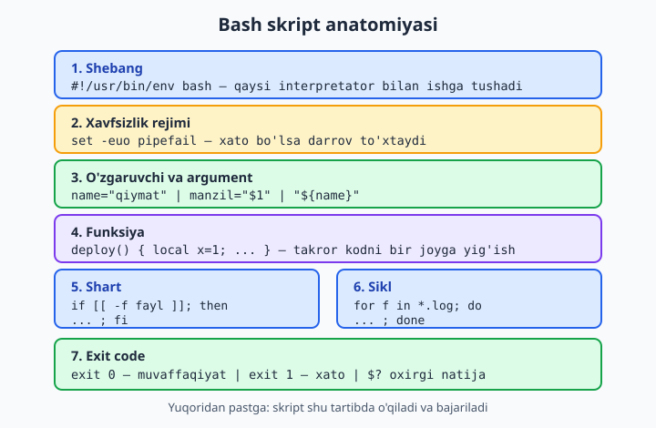
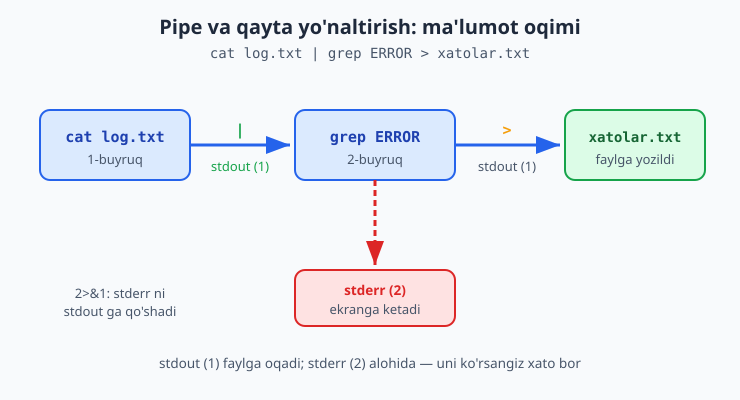
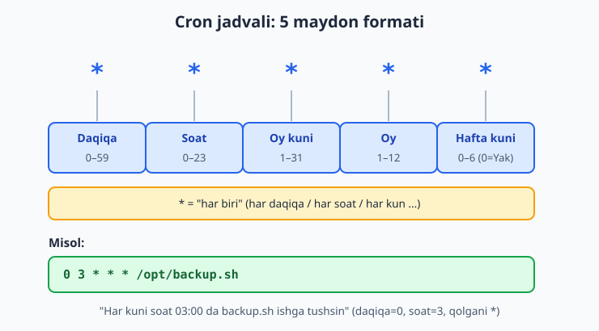

# 03 — Bash skripting va avtomatlashtirish

[⬅️ Oldingi: 02 — Linux server asoslari](./02-linux-server-asoslari.md) · [🏠 README](./README.md) · [Keyingi: 04 — Tarmoq va server xavfsizligi ➡️](./04-tarmoq-xavfsizlik.md)

> **Bu bobda:** har kuni qo'lda teradigan takroriy buyruqlarni (backup, deploy, holatni tekshirish) bir marta yozib, qayta-qayta ishlatiladigan **skript** ga aylantiramiz; shebang va `chmod +x` bilan skriptni ishga tushirib, o'zgaruvchi, **quoting** (qo'shtirnoq nega muhim), argument (`$1`/`$@`/`$#`), `read` bilan input, shartlar (`if [[ ... ]]`, test bayroqlari, `&&`/`||`, `case`), sikllar (`for`/`while`/`until`, `break`/`continue`), funksiya (`local`, `return`, qiymat qaytarish), exit code (`$?`) va har skriptni xavfsiz qiladigan `set -euo pipefail` ni o'rganamiz; pipe (`|`), qayta yo'naltirish (`>`/`>>`/`2>&1`/`/dev/null`) va command substitution (`$(...)`) bilan buyruqlarni zanjirlab, oxirida uchta amaliy skript (backup, deploy, health-check) yozib, ularni `cron` orqali avtomatik rejaga qo'yamiz.

---

## Muammo

Har ertalab serveringizga SSH bilan kirasiz va xuddi shu marosimni qaytarasiz: loyiha papkasiga o'tasiz, `git pull` qilasiz, `npm ci` deysiz, xizmatni qayta ishga tushirasiz, keyin saytni ochib "tirikmi" deb tekshirasiz. Beshta-oltita buyruq. Charchaganingizda bittasini unutasiz — masalan xizmatni qayta tushirmaysiz — va yangi kod ishga tushmay qoladi. Yarim soatdan keyin "nega o'zgarish ko'rinmadi?" deb hayron bo'lasiz.

Yoki: ma'lumotlar bazasini har kuni qo'lda backup qilmoqchisiz. Bir kun qilasiz, ikki kun qilasiz, uchinchi kun esdan chiqadi. To'rtinchi kun disk to'lib, hamma narsa qulaganda — backup yo'q.

Odam takroriy ishni yomon bajaradi: zerikadi, unutadi, xato qiladi. Kompyuter esa aksincha — bir xil ishni million marta, charchamasdan, aniq bajaradi. Demak yechim oddiy: **buyruqlar ketma-ketligini bir marta faylga yozib qo'yamiz**, keyin shu faylni chaqiramiz yoki uni `cron` ga "har kuni soat 3 da o'zing ishga tushir" deb topshirib qo'yamiz. Mana shu fayl — **Bash skript**, va u DevOps ning yuragi: avtomatlashtirishning eng birinchi va eng tez-tez ishlatiladigan vositasi.

Bu bobda til sifatida Bash ni puxta o'rganamiz va kitob bo'ylab ishlatadigan namuna ilovamiz — kichik **vazifalar API** (Node.js) — atrofida real skriptlar yozamiz.

---

## Birinchi skript: shebang va `chmod +x`

Skript — bu oddiy matn fayli, ichida terminalga teradigan buyruqlaringiz qator-qator yozilgan. Keling, eng sodda misoldan boshlaylik. `salom.sh` faylini yarating:

```bash
#!/usr/bin/env bash
echo "Salom, DevOps!"
echo "Bugun: $(date +%Y-%m-%d)"
```

Birinchi qatorga e'tibor bering — u **shebang** deyiladi (`#!` belgisi). U operatsion tizimga "bu faylni qaysi dastur bilan ishga tushirish kerak"ligini aytadi. Bizning holatda — `bash` bilan.

```bash
#!/usr/bin/env bash
```

📌 **Nega `#!/usr/bin/env bash`, oddiy `#!/bin/bash` emas?** `env` Bash ni `PATH` ichidan topadi. Turli tizimlarda Bash turli joyda turishi mumkin (masalan `/bin/bash`, `/usr/local/bin/bash`). `env` orqali yozsangiz, skript ko'proq tizimlarda ishlaydi — bu portativ (ko'chma) usul.

Skriptni ishga tushirishdan oldin uni **bajariladigan** (executable) qilib belgilashimiz kerak. Linux fayllarni "shunchaki" ishga tushirmaydi — fayl bajarilish ruxsatiga ega bo'lishi shart (buni 02-bobda `chmod` bilan ko'rganmiz):

```bash
chmod +x salom.sh
./salom.sh
```

Kutilgan natija:

```text
Salom, DevOps!
Bugun: 2026-06-13
```

⚠️ **`./salom.sh` dagi `./` ni unutmang.** Agar shunchaki `salom.sh` desangiz, Bash uni `PATH` ichidan qidiradi va topa olmaydi ("command not found"). `./` — "shu papkadagi fayl" degani.

💡 `chmod +x` bilan ovora bo'lmasdan ham skriptni ishga tushirish mumkin: `bash salom.sh`. Bu holda shebang shart emas va ruxsat ham kerak emas — Bash ni o'zingiz to'g'ridan-to'g'ri chaqirasiz. Ikkala usul ham to'g'ri; `chmod +x` esa skriptni "haqiqiy buyruq"ga aylantiradi.

Quyidagi diagramma butun bob davomida ko'radigan skript bo'laklarini bir qarashda jamlaydi — yuqoridan pastga skript shu tartibda o'qiladi:



---

## O'zgaruvchi va quoting

O'zgaruvchi — qiymatni saqlaydigan nomli "quti". Bash da o'zgaruvchini `nom=qiymat` ko'rinishida yaratasiz va `$nom` bilan o'qiysiz:

```bash
#!/usr/bin/env bash
name="Oqil"
echo "Salom, $name!"
echo "Salom, ${name}!"
```

⚠️ **Tenglik belgisi atrofida probel BO'LMASIN.** `name = "Oqil"` (probel bilan) — XATO. To'g'risi `name="Oqil"`. Bash uchun `name =` bu "name buyrug'ini ishga tushir" degani.

`$name` va `${name}` bir xil ishlaydi. Figurali qavs (`${name}`) qachon kerak? Qiymatni boshqa matnga ulaganda chegarani aniqlash uchun:

```bash
fayl="hisobot"
echo "${fayl}_2026.txt"   # hisobot_2026.txt  -> to'g'ri
echo "$fayl_2026.txt"     # bo'sh chiqadi! Bash "fayl_2026" o'zgaruvchisini qidiradi
```

### Quoting: nega doim qo'shtirnoq?

DevOps da eng ko'p uchraydigan xato — o'zgaruvchini qo'shtirnoqsiz ishlatish. Quyidagini ko'ring:

```bash
yol="/var/log/mening loyiham"
rm -rf $yol        # ❌ XAVFLI: ikkita argumentga bo'linadi!
rm -rf "$yol"      # ✅ TO'G'RI: bitta yo'l sifatida
```

Birinchi holatda Bash probel bo'yicha bo'lib, `rm -rf` ga ikkita alohida argument beradi: `/var/log/mening` va `loyiham`. Natijada noto'g'ri papka o'chib ketishi mumkin. 

📌 **Oltin qoida: o'zgaruvchini deyarli HAR DOIM `"$nom"` ko'rinishida qo'shtirnoq ichida yozing.** Bu probel va maxsus belgilardan himoya qiladi. Qo'shtirnoqsiz qoldirishning kamdan-kam holati bor; shubha bo'lsa — qo'shtirnoq qo'ying.

### `readonly` va environment o'zgaruvchilari

O'zgarmas qiymat uchun `readonly` ishlating — keyin uni tasodifan o'zgartirib bo'lmaydi:

```bash
readonly LOYIHA_DIR="/opt/vazifalar-api"
LOYIHA_DIR="/boshqa"   # XATO: readonly variable
```

`export` esa o'zgaruvchini **environment**ga chiqaradi — shunda skript chaqirgan boshqa dasturlar ham uni ko'radi:

```bash
export NODE_ENV="production"
node server.js          # server.js endi NODE_ENV ni o'qiy oladi
```

💡 Kelishuv: oddiy lokal o'zgaruvchini `kichik_harf`, environment va sozlama o'zgaruvchilarini `KATTA_HARF` bilan nomlash odat. Bu skriptni o'qishni osonlashtiradi.

---

## Argumentlar va input

Skriptga "tashqaridan" qiymat berishning ikki yo'li bor: ishga tushirayotganda **argument** sifatida, yoki ishlash paytida `read` bilan **so'rab olish**.

Argumentlar maxsus o'zgaruvchilarda turadi:

| Belgi | Ma'nosi |
|---|---|
| `$0` | Skriptning o'z nomi |
| `$1`, `$2`, ... | 1-, 2-, ... argument |
| `$#` | Argumentlar soni |
| `$@` | Hamma argument (alohida-alohida) |

```bash
#!/usr/bin/env bash
echo "Skript nomi: $0"
echo "Birinchi argument: $1"
echo "Argumentlar soni: $#"
echo "Hammasi: $@"
```

Ishga tushiramiz:

```bash
./args.sh alfa beta gamma
```

Natija:

```text
Skript nomi: ./args.sh
Birinchi argument: alfa
Argumentlar soni: 3
Hammasi: alfa beta gamma
```

💡 **Argument berilmagan bo'lsa standart qiymat:** `${1:-status}` — "agar `$1` bo'sh bo'lsa, `status` ni ishlat". Argument **majburiy** bo'lsa va berilmasa to'xtatmoqchi bo'lsangiz: `${1:?Manzilni bering}` — bu yo'qligida xato berib chiqadi.

`read` bilan foydalanuvchidan jonli so'rash:

```bash
#!/usr/bin/env bash
read -rp "Ismingiz: " ism
echo "Salom, $ism"
```

`read -rp` da `-p` so'rov matnini ko'rsatadi, `-r` esa teskari chiziq (`\`) ni "xom" o'qiydi (skriptlarda deyarli har doim `-r` ishlating).

---

## `set -euo pipefail`: har skriptning birinchi qatori

Bu — bobning eng muhim qoidasi. Sodda skript jimgina xato qiladi: bir buyruq qulaydi, lekin skript davom etaveradi, go'yo hammasi joyida. DevOps da bu falokat: backup qulagani holda skript "tayyor" deb chiqadi, siz esa backup bor deb o'ylab yuribsiz.

Yechim — skriptning eng boshiga (shebangdan keyin) shu qatorni qo'yish:

```bash
#!/usr/bin/env bash
set -euo pipefail
```

Uchta harf, uchta himoya:

- **`-e`** (errexit) — biror buyruq xato (exit code 0 dan farqli) qaytarsa, skript **darrov to'xtaydi**. Xatoni e'tiborsiz qoldirib davom etmaydi.
- **`-u`** (nounset) — yo'q (e'lon qilinmagan) o'zgaruvchini ishlatsangiz, xato beradi. Bu yozuv xatolarini (`$LOYHIA_DIR` o'rniga `$LOYIHA_DIR`) tutadi.
- **`-o pipefail`** — pipe (`|`) ichidagi biror buyruq qulasa, butun zanjir qulagan hisoblanadi. Busiz faqat oxirgi buyruqning natijasi hisobga olinadi.

Misol bilan ko'raylik. `-e` siz:

```bash
#!/usr/bin/env bash
echo "1-qator"
false              # bu buyruq doim xato (exit 1) qaytaradi
echo "2-qator"     # baribir chiqadi -- yomon!
```

`set -e` bilan:

```bash
#!/usr/bin/env bash
set -euo pipefail
echo "1-qator"
false              # bu yerda skript TO'XTAYDI
echo "2-qator"     # umuman ishlamaydi
```

Ikkinchi skriptning natijasi faqat `1-qator` bo'ladi va u exit code 1 bilan chiqadi. Aynan shuni xohlaymiz: xato bo'lsa, davom etmasin.

📌 **Qoida: har bir production skript `set -euo pipefail` bilan boshlanadi.** Bu kichik odat sizni "jimgina qulagan deploy" muammosidan asraydi. Hozir buni odat qiling — keyingi boblardagi har bir skriptda uni ko'rasiz.

---

## Shartlar: `if`, `test` va `case`

Skript ko'pincha qaror qabul qilishi kerak: "fayl bormi? yo'qmi?", "port band emasmi?". Buning uchun `if` ishlatamiz:

```bash
if [[ -f "/etc/nginx/nginx.conf" ]]; then
  echo "Nginx config mavjud"
else
  echo "Nginx config yo'q"
fi
```

`[[ ... ]]` — bu **test** ifodasi. Eng ko'p ishlatiladigan bayroqlar:

| Test | Rost bo'ladi, agar... |
|---|---|
| `-f fayl` | fayl mavjud (oddiy fayl) |
| `-d papka` | papka mavjud |
| `-e yol` | fayl yoki papka mavjud |
| `-z "$s"` | satr bo'sh (uzunligi nol) |
| `-n "$s"` | satr bo'sh emas |
| `"$a" == "$b"` | ikki satr teng |
| `"$a" != "$b"` | teng emas |
| `"$x" -eq N` | sonlar teng (`-ne`, `-gt`, `-lt`, `-ge`, `-le`) |

⚠️ **Satr uchun `==`, son uchun `-eq`.** `"$a" == "$b"` — matnni taqqoslaydi; `"$x" -eq 5` — sonni. Ularni aralashtirmang. Va `[[` dan keyin, `]]` dan oldin **probel** shart: `[[ -f x ]]` to'g'ri, `[[-f x]]` xato.

💡 **Eski `[ ... ]` (bitta qavs) ham bor, lekin `[[ ... ]]` (ikki qavs) afzal:** u quoting xatolariga chidamliroq va `&&`/`||` ni ichida qo'llab-quvvatlaydi. Yangi Bash skriptlarda `[[ ]]` ishlating.

Qisqa shartlar uchun `&&` ("va keyin, agar oldingisi muvaffaqiyatli bo'lsa") va `||` ("aks holda") qulay:

```bash
[[ -d /opt/app ]] && echo "papka bor"
[[ -f config.yaml ]] || echo "config topilmadi!"
```

Ko'p variantli tanlov uchun esa `if-elif` zanjiri o'rniga `case` toza ko'rinadi. Bu — `start`/`stop`/`status` uslubidagi boshqaruv skriptlarining klassik shakli:

```bash
#!/usr/bin/env bash
set -euo pipefail
buyruq="${1:-status}"

case "$buyruq" in
  start)   echo "Xizmat ishga tushmoqda" ;;
  stop)    echo "Xizmat to'xtatilmoqda" ;;
  status)  echo "Holat: ishlamoqda" ;;
  *)       echo "Noma'lum buyruq: $buyruq"; exit 1 ;;
esac
```

Har bir variant `)` bilan tugaydi, blok `;;` bilan yopiladi, `*)` esa "boshqa har qanday qiymat" (default). `./xizmat.sh start` -> `Xizmat ishga tushmoqda`, `./xizmat.sh nimadir` -> xato va exit 1.

---

## Sikllar: `for`, `while`, `until`

Sikl — bir ishni ko'p marta takrorlash. DevOps da bu juda tez-tez kerak: "har bir muhitga deploy qil", "har bir log faylini siqib qo'y", "xizmat ko'tarilguncha kutib tur".

`for` — ro'yxat bo'yicha aylanadi:

```bash
for muhit in dev staging prod; do
  echo "Deploy qilinmoqda: $muhit"
done
```

Fayllar bo'yicha aylanish (glob bilan) — backup va log skriptlarda doim uchraydi:

```bash
for f in /var/log/*.log; do
  echo "Topildi: $(basename "$f")"
done
```

`while` — shart rost ekan, takrorlaydi:

```bash
i=1
while [[ "$i" -le 3 ]]; do
  echo "Urinish $i"
  i=$((i + 1))
done
```

`$((...))` — arifmetika; `i=$((i + 1))` hisoblagichni bittaga oshiradi. `until` esa `while` ning teskarisi — shart rost bo'lguncha takrorlaydi (masalan "javob 200 bo'lguncha kut").

Siklni boshqarish:

- `break` — siklni butunlay to'xtatadi;
- `continue` — joriy qadamni tashlab, keyingisiga o'tadi.

```bash
for x in 1 2 3 4 5; do
  [[ "$x" -eq 3 ]] && continue   # 3 ni tashlab ket
  [[ "$x" -eq 5 ]] && break      # 5 da to'xta
  echo "x=$x"
done
```

Natija: `x=1`, `x=2`, `x=4` (3 tashlandi, 5 da to'xtadi).

---

## Funksiya: takror kodni bir joyga yig'ish

Skript kattalashganda bir xil kod bo'laklari takrorlana boshlaydi — masalan har joyda "vaqt bilan log yozish". Funksiya bu takrorni bartaraf qiladi: bir marta yozasiz, nom bilan chaqirasiz.

```bash
#!/usr/bin/env bash
set -euo pipefail

log() {
  echo "[$(date '+%H:%M:%S')] $*"
}

salomlash() {
  local ism="$1"          # local: faqat shu funksiya ichida ko'rinadi
  echo "Salom, ${ism}!"
}

log "Skript boshlandi"
xabar=$(salomlash "DevOps")    # funksiya echo qilgan qiymatni olamiz
echo "$xabar"
log "Skript tugadi"
```

Diqqat qilingan ikki narsa:

- **`local ism="$1"`** — funksiya ichidagi o'zgaruvchini `local` qiling. Aks holda u global bo'lib, skriptning boshqa joyidagi shu nomli o'zgaruvchini buzishi mumkin.
- **Funksiya argumentlari** ham `$1`, `$2`, `$@` (xuddi skript kabi).

Funksiya ikki xil "javob" qaytaradi:

1. **Exit code** — `return 0` (muvaffaqiyat) yoki `return 1` (xato). Buni `if` da ishlatasiz.
2. **Qiymat** — `echo` bilan chiqarasiz, chaqirgan joyda `$(...)` bilan ushlab olasiz.

```bash
fayl_bormi() {
  if [[ -e "$1" ]]; then
    return 0     # rost
  else
    return 1     # yolg'on
  fi
}

if fayl_bormi "/etc/hostname"; then
  echo "fayl mavjud"
fi
```

📌 **Funksiya qiymatni `return` bilan QAYTARMAYDI** — `return` faqat 0..255 oralig'idagi exit code uchun. Matn yoki son qaytarish uchun `echo` qiling, natijani `$(funksiya)` bilan oling. Bu C/Python dan kelgan dasturchilarni ko'p chalg'itadi.

---

## Pipe, qayta yo'naltirish va command substitution

Bash ning kuchi — kichik buyruqlarni zanjirlab, kattaroq ish chiqarishda. Bu yerda uchta tushuncha bor.

**Pipe (`|`)** — bir buyruqning chiqishini (stdout) keyingi buyruqning kirishiga ulaydi:

```bash
cat /var/log/syslog | grep "ERROR" | wc -l
```

Bu "syslog faylini o'qi -> faqat ERROR qatorlarni qoldir -> nechta ekanini sana" degani.

**Qayta yo'naltirish** — chiqishni ekran o'rniga faylga yuboradi:

- `>` — faylga yozadi (eski mazmunni **o'chirib**);
- `>>` — fayl oxiriga **qo'shadi**;
- `2>` — xato oqimini (stderr) yo'naltiradi;
- `2>&1` — stderr ni stdout bilan **birlashtiradi** ("xatoni ham shu joyga yubor");
- `/dev/null` — "axlat qutisi", yuborilgan hamma narsa yo'qoladi.

Har bir Linux buyrug'ida ikkita chiqish oqimi bor: **stdout** (raqami 1, oddiy natija) va **stderr** (raqami 2, xato xabarlari). Quyidagi diagramma `cat log.txt | grep ERROR > xatolar.txt` da ma'lumot qanday oqishini ko'rsatadi:



Amaliy namunalar:

```bash
echo "boshlandi" > deploy.log          # logni yangidan boshla
echo "qadam 1 tugadi" >> deploy.log     # oxiriga qo'sh
./skript.sh >> deploy.log 2>&1          # ham natija, ham xato logga
./tekshir.sh 2>/dev/null                # xato xabarlarini ko'rsatma
```

📌 `>> log 2>&1` — DevOps da eng ko'p ishlatiladigan idioma: skriptning **butun** chiqishini (oddiy + xato) bitta log fayl oxiriga qo'shadi. Tartib muhim: `2>&1` `>>` dan **keyin** turadi.

**Command substitution (`$(...)`)** — buyruqni ishga tushirib, uning natijasini o'zgaruvchiga oladi:

```bash
sana=$(date +%Y-%m-%d)
fayllar_soni=$(ls | wc -l)
joriy_dir=$(pwd)
echo "Bugun $sana, $joriy_dir da $fayllar_soni element bor"
```

💡 Eski qo'llanmalarda `` `date` `` (teskari apostrof) ko'rasiz — bu **eski usul**. `$(...)` afzal: u o'qishga oson va ichma-ich (`$(... $(...) ...)`) ishlaydi.

---

## Amaliy skript 1: backup

Endi o'rgangan hamma narsani birlashtirib, real skript yozamiz. Birinchisi — papkani sana bilan nomlangan `tar.gz` arxivga oladigan backup skripti:

```bash
#!/usr/bin/env bash
set -euo pipefail

MANBA="${1:?Iltimos backup qilinadigan papkani bering}"
NISHON_DIR="${2:-/opt/backups}"

mkdir -p "$NISHON_DIR"
sana=$(date +%Y-%m-%d_%H%M%S)
nom="backup_${sana}.tar.gz"
yol="${NISHON_DIR}/${nom}"

echo "[$(date '+%H:%M:%S')] Backup boshlandi: $MANBA -> $yol"
tar -czf "$yol" -C "$(dirname "$MANBA")" "$(basename "$MANBA")"
hajm=$(du -h "$yol" | cut -f1)
echo "[$(date '+%H:%M:%S')] Tayyor: $yol ($hajm)"
```

Ishga tushirish va natija:

```bash
./backup.sh /opt/vazifalar-api /opt/backups
```

```text
[22:02:20] Backup boshlandi: /opt/vazifalar-api -> /opt/backups/backup_2026-06-13_220220.tar.gz
[22:02:20] Tayyor: /opt/backups/backup_2026-06-13_220220.tar.gz (1.0K)
```

Bu yerda hamma narsa ishlamoqda: `${1:?...}` argumentni majbur qiladi, `${2:-/opt/backups}` standart qiymat beradi, `$(date ...)` arxivni vaqt bilan nomlaydi (eski backuplar ustiga yozilmaydi), `tar -czf` esa siqilgan arxiv yaratadi.

💡 Eski backuplarni avtomatik tozalash uchun bir qator qo'shing — 7 kundan eski arxivlarni o'chiradi:

```bash
find "$NISHON_DIR" -name "backup_*.tar.gz" -mtime +7 -delete
```

---

## Amaliy skript 2: deploy

Ikkinchi skript — namuna vazifalar API mizni yangilaydigan deploy skripti: yangi kodni tortadi, bog'liqliklarni o'rnatadi va xizmatni qayta ishga tushiradi.

```bash
#!/usr/bin/env bash
set -euo pipefail

LOYIHA_DIR="${1:?Loyiha papkasini bering}"
XIZMAT="${2:-vazifalar-api}"

log() { echo "[$(date '+%H:%M:%S')] $*"; }

cd "$LOYIHA_DIR"

log "Yangi kod tortilmoqda..."
git pull --ff-only origin main

log "Bog'liqliklar o'rnatilmoqda..."
npm ci --omit=dev

log "Xizmat qayta ishga tushirilmoqda: $XIZMAT"
sudo systemctl restart "$XIZMAT"

log "Deploy tugadi."
```

⚠️ **Illustrativ.** `git pull`, `npm ci` va ayniqsa `sudo systemctl restart` real serverni va o'rnatilgan xizmatni talab qiladi — buni o'z VPS ingizda ishga tushiring. Skriptning **strukturasi** (tuzilishi) to'liq to'g'ri va lokal mashinada `bash -n` bilan sintaksis hamda izohlangan (buyruqlar `#` bilan o'chirilgan) variant haqiqatan tekshirilgan; `git`/`systemctl` qatorlari esa serveringizda ishlaydi. `systemctl` ni 19-bobda batafsil ko'ramiz.

📌 `--ff-only` "faqat oldinga tezlatish" — agar serverdagi kod va GitHub bir-biriga zid bo'lsa, jimgina merge qilib chalkashtirmaydi, balki xato berib to'xtaydi. `set -e` tufayli deploy ham to'xtaydi — bu xavfsizroq.

---

## Amaliy skript 3: health-check

Uchinchisi — ilova "tirik"ligini HTTP holat kodi orqali tekshiradigan skript. Bu monitoring va deploy dan keyingi tekshiruv uchun asos (25-26 boblarda monitoringga qaytamiz):

```bash
#!/usr/bin/env bash
set -euo pipefail

URL="${1:-http://localhost:3000/health}"

kod=$(curl -s -o /dev/null -w "%{http_code}" "$URL")

if [[ "$kod" == "200" ]]; then
  echo "OK: $URL javob berdi ($kod)"
  exit 0
else
  echo "XATO: $URL holati $kod" >&2
  exit 1
fi
```

`curl -s -o /dev/null -w "%{http_code}"` — sahifa mazmunini ko'rsatmasdan (`-o /dev/null`), jimgina (`-s`), faqat HTTP holat kodini (`-w "%{http_code}"`) qaytaradi. 200 bo'lsa — sog'lom, exit 0; aks holda xato xabarini **stderr** ga (`>&2`) yuborib, exit 1 qaytaradi.

⚠️ **Illustrativ qism** — `curl` real ishlayotgan ilovaga ulanishi kerak. Skriptning **mantig'i** (kodni tekshirish, exit code qaytarish) lokal sinovda statusni taqlid qilib tasdiqlangan: 200 -> exit 0, 503 -> exit 1. O'z serveringizda ilovangizning haqiqiy `/health` manziliga moslang.

💡 Exit code qaytarish nega muhim? Chunki bu skriptni boshqa skript yoki `cron` ichida ishlatish mumkin: `./healthcheck.sh && echo "deploy muvaffaqiyatli"` — health-check o'tsa, keyingi qadam ishga tushadi.

---

## `cron` bilan rejalashtirish

Skriptlarimiz tayyor, lekin ularni qo'lda ishga tushirsak — yana o'sha "unutish" muammosi. `cron` — Linux ning ichki "budilnik"i: berilgan vaqtda skriptni o'zi ishga tushiradi.

O'z jadvalingizni tahrirlash:

```bash
crontab -e
```

Har bir qator — bitta rejalashtirilgan vazifa. Format: **beshta maydon + buyruq**. Maydonlar — daqiqa, soat, oyning kuni, oy, haftaning kuni:



`*` belgisi "har biri" degani. Misollar:

```text
# daqiqa soat kun oy hafta   buyruq
0 3 * * *      /opt/backup.sh /opt/vazifalar-api >> /var/log/backup.log 2>&1
*/5 * * * *    /opt/healthcheck.sh >> /var/log/health.log 2>&1
0 0 * * 0      /opt/haftalik-tozalash.sh >> /var/log/cleanup.log 2>&1
```

Ularni o'qiymiz:

- `0 3 * * *` — har kuni soat **03:00** da (daqiqa 0, soat 3, qolgani har biri) backup;
- `*/5 * * * *` — **har 5 daqiqada** health-check (`*/5` — "har 5-chi");
- `0 0 * * 0` — **har yakshanba** yarim tunda (hafta kuni 0 = yakshanba) tozalash.

📌 **Har cron qatorida `>> log 2>&1` ni qo'shing.** Cron skriptni "ko'rinmas" fonda ishga tushiradi — ekran yo'q. Agar chiqishni faylga yo'naltirmasangiz, skript qulasa ham xabar topa olmaysiz. Log fayl — yagona ko'zingiz.

⚠️ **Cron muhiti "yalang'och".** Cron skriptni juda kam `PATH` va environment bilan ishga tushiradi — sizning terminaldagi sozlamalaringiz bo'lmaydi. Shuning uchun cron skriptlarda **to'liq yo'l** ishlating (`/opt/backup.sh`, `node` emas `/usr/bin/node`) va kerakli environment o'zgaruvchilarini skript ichida o'zingiz e'lon qiling.

ℹ️ **Illustrativ:** `crontab -e` va real jadval o'z serveringizda ishlaydi (bu yerda yozilgan vaqtlar va formatlar to'g'ri). Mashq uchun jadvalni `*/1 * * * *` (har daqiqa) qilib qo'yib, log faylga yozilayotganini kuzating, keyin to'g'rilang. Joriy jadvalni ko'rish: `crontab -l`.

💡 Zamonaviy serverlarda `cron` o'rniga `systemd timer` ham ishlatiladi (19-bobda ko'ramiz) — u logni `journald` ga yozadi va bog'liqliklarni boshqarishda kuchliroq. Boshlash uchun esa `cron` sodda va hamma joyda bor.

---

## 03-bob mashqlari

Mashqlar uchun lokal mashinangizda yoki sinov VPS ingizda vaqtinchalik papka oching (masalan `~/bash-mashq`). Har bir skriptda `set -euo pipefail` ishlating va `bash -n skript.sh` bilan sintaksisni tekshirib oding.

**Oson**

1. `salom.sh` skriptini yarating: shebang `#!/usr/bin/env bash`, `echo` bilan ismingizni va `$(date)` bilan joriy vaqtni chiqarsin. `chmod +x` qilib `./salom.sh` bilan ishga tushiring.
2. Skript yarating: ikkita o'zgaruvchi (`ism` va `shahar`) e'lon qilib, ularni `"Men ${ism}, ${shahar}dan"` ko'rinishida chop eting. O'zgaruvchini doim qo'shtirnoq ichida ishlating.
3. `args.sh` yarating: `$0`, `$1`, `$#` va `$@` ni chop etsin. Uni uchta argument bilan ishga tushirib, natijani kuzating.
4. `read -rp` bilan foydalanuvchidan ismini so'rab, "Salom, <ism>" deb javob beradigan skript yozing.

**O'rta**

5. `set -euo pipefail` ni qo'shilgan va qo'shilmagan ikki skript yozing; ikkalasiga ham o'rtaga `false` buyrug'ini qo'ying. Farqni kuzating: qaysi biri to'xtaydi, qaysi biri davom etadi?
6. Argument sifatida fayl yo'lini qabul qiladigan skript: agar fayl mavjud bo'lsa "topildi", aks holda "yo'q" desin (`[[ -f ... ]]`).
7. `case` bilan `start`/`stop`/`status` ni boshqaradigan skript yozing; noma'lum buyruqda xato xabar berib `exit 1` qilsin.
8. `for` sikli bilan `dev staging prod` ro'yxati bo'yicha aylanib, har biri uchun "Deploy: <muhit>" chop eting.
9. `while` sikli bilan 1 dan 10 gacha sanang, lekin faqat juft sonlarni chop eting (`$((i % 2))` dan foydalaning).

<details markdown="1"><summary>Yechim (9)</summary>

```bash
#!/usr/bin/env bash
set -euo pipefail
i=1
while [[ "$i" -le 10 ]]; do
  if [[ $((i % 2)) -eq 0 ]]; then
    echo "$i"
  fi
  i=$((i + 1))
done
```

`$((i % 2))` — qoldiqni hisoblaydi: juft sonda 0 chiqadi, shuning uchun `-eq 0` shartiga tushadi. `i=$((i + 1))` hisoblagichni oshirmasa, sikl cheksiz aylanadi.
</details>

10. `log()` funksiyasi yozing: u har bir xabarning oldiga `[soat:daqiqa:soniya]` qo'shsin (`date '+%H:%M:%S'`). Uni uch marta chaqirib sinab ko'ring.

<details markdown="1"><summary>Yechim (10)</summary>

```bash
#!/usr/bin/env bash
set -euo pipefail

log() {
  echo "[$(date '+%H:%M:%S')] $*"
}

log "Skript boshlandi"
log "Ishlamoqda..."
log "Tugadi"
```

`$*` funksiyaga berilgan barcha argumentlarni bitta satr qilib oladi, shuning uchun `log "bir necha so'z"` to'g'ri ishlaydi. `$(date ...)` har chaqiruvda joriy vaqtni hisoblaydi.
</details>

**Qiyin**

11. **Backup skript.** Argument sifatida manba papkani va (ixtiyoriy) nishon papkani oladigan skript yozing; manbani sana bilan nomlangan `tar.gz` ga arxivlasin. Manba berilmasa xato bilan to'xtasin (`${1:?...}`).

<details markdown="1"><summary>Yechim (11)</summary>

```bash
#!/usr/bin/env bash
set -euo pipefail

MANBA="${1:?Iltimos backup qilinadigan papkani bering}"
NISHON_DIR="${2:-/opt/backups}"

mkdir -p "$NISHON_DIR"
sana=$(date +%Y-%m-%d_%H%M%S)
yol="${NISHON_DIR}/backup_${sana}.tar.gz"

echo "Backup: $MANBA -> $yol"
tar -czf "$yol" -C "$(dirname "$MANBA")" "$(basename "$MANBA")"
echo "Tayyor ($(du -h "$yol" | cut -f1))"
```

`tar -C "$(dirname ...)" "$(basename ...)"` papkaga "kirib" arxivlaydi, shunda arxiv ichida to'liq absolyut yo'l emas, faqat papka nomi qoladi. `${2:-/opt/backups}` nishon berilmasa standart joyni ishlatadi.
</details>

12. **Health-check skript.** Argument sifatida URL oladigan skript: `curl` bilan HTTP holat kodini olib, 200 bo'lsa "OK" deb `exit 0`, aks holda xatoni **stderr** ga yozib `exit 1` qaytarsin.

<details markdown="1"><summary>Yechim (12)</summary>

```bash
#!/usr/bin/env bash
set -euo pipefail

URL="${1:-http://localhost:3000/health}"
kod=$(curl -s -o /dev/null -w "%{http_code}" "$URL")

if [[ "$kod" == "200" ]]; then
  echo "OK: $URL ($kod)"
  exit 0
else
  echo "XATO: $URL holati $kod" >&2
  exit 1
fi
```

`-o /dev/null` mazmunni tashlaydi, `-w "%{http_code}"` faqat kodni qaytaradi. `>&2` xatoni stderr ga yo'naltiradi, shunda uni `2>` bilan alohida ushlash mumkin. Exit code tufayli skriptni `&&` zanjirida ishlatsa bo'ladi.
</details>

13. **Retry funksiyasi.** Buyruqni eng ko'pi bilan 3 marta urinib ko'radigan funksiya yozing: muvaffaqiyatli bo'lsa to'xtasin, har urinishdan keyin 2 soniya kutsin (`sleep 2`). (`until` yoki `for` + `break` bilan.)

<details markdown="1"><summary>Yechim (13)</summary>

```bash
#!/usr/bin/env bash
set -euo pipefail

urinib_kor() {
  local urinish=1
  local maksimum=3
  while [[ "$urinish" -le "$maksimum" ]]; do
    echo "Urinish $urinish/$maksimum..."
    if "$@"; then
      echo "Muvaffaqiyat!"
      return 0
    fi
    urinish=$((urinish + 1))
    sleep 2
  done
  echo "Hamma urinish qulagan" >&2
  return 1
}

urinib_kor curl -sf http://localhost:3000/health
```

`"$@"` funksiyaga berilgan buyruqni (argumentlari bilan) ishga tushiradi. `if "$@"; then` buyruq muvaffaqiyatli (exit 0) bo'lsa ishlaydi. Bu — tarmoq beqaror bo'lganda health-check yoki API chaqiruvlari uchun klassik DevOps namunasi.
</details>

14. **Deploy skript.** `log()` funksiyasi, `set -euo pipefail` va `cd "$LOYIHA_DIR"` bilan deploy skripti yozing: kod tortish, bog'liqlik o'rnatish, xizmatni qayta tushirish qadamlarini bajarsin. (Real `git`/`systemctl` qatorlarini izohda qoldirib, `bash -n` bilan tekshiring.)

<details markdown="1"><summary>Yechim (14)</summary>

```bash
#!/usr/bin/env bash
set -euo pipefail

LOYIHA_DIR="${1:?Loyiha papkasini bering}"
XIZMAT="${2:-vazifalar-api}"

log() { echo "[$(date '+%H:%M:%S')] $*"; }

cd "$LOYIHA_DIR"
log "Kod tortilmoqda..."
git pull --ff-only origin main
log "Bog'liqliklar..."
npm ci --omit=dev
log "Qayta ishga tushirish: $XIZMAT"
sudo systemctl restart "$XIZMAT"
log "Tayyor."
```

`set -e` tufayli `git pull` yoki `npm ci` qulasa, deploy darrov to'xtaydi va buzuq holatda xizmat qayta tushirilmaydi. `--ff-only` zid o'zgarishlarda merge qilmay xato beradi — bu xavfsizroq.
</details>

15. **Cron jadvali.** Quyidagi vazifalar uchun cron qatorlarini yozing va har birining ma'nosini izohlang: (a) har kuni 02:30 da backup; (b) har 10 daqiqada health-check; (c) har dushanba soat 06:00 da haftalik hisobot. Har birida `>> log 2>&1` bo'lsin.

<details markdown="1"><summary>Yechim (15)</summary>

```text
# daqiqa soat kun oy hafta   buyruq
30 2 * * *       /opt/backup.sh /opt/vazifalar-api >> /var/log/backup.log 2>&1
*/10 * * * *     /opt/healthcheck.sh >> /var/log/health.log 2>&1
0 6 * * 1        /opt/haftalik-hisobot.sh >> /var/log/hisobot.log 2>&1
```

(a) `30 2 * * *` — daqiqa 30, soat 2, qolgani har biri -> har kuni 02:30. (b) `*/10 * * * *` — "har 10-chi daqiqa". (c) `0 6 * * 1` — hafta kuni 1 = dushanba, soat 6, daqiqa 0. `>> log 2>&1` chiqish va xatoni log faylga yozadi, chunki cron da ekran yo'q.
</details>

16. **To'liq skript.** `case` bilan boshqariladigan `xizmat.sh` yozing: `backup` -> backup funksiyasini chaqirsin, `check` -> health-check funksiyasini, `deploy` -> ikkalasini ham (`set -e` tufayli check qulasa deploy to'xtasin). `log()` funksiyasi va to'g'ri exit code bilan.

<details markdown="1"><summary>Yechim (16)</summary>

```bash
#!/usr/bin/env bash
set -euo pipefail

LOYIHA_DIR="/opt/vazifalar-api"
BACKUP_DIR="/opt/backups"
URL="http://localhost:3000/health"

log() { echo "[$(date '+%H:%M:%S')] $*"; }

backup() {
  log "Backup boshlandi"
  local sana; sana=$(date +%Y-%m-%d_%H%M%S)
  tar -czf "${BACKUP_DIR}/backup_${sana}.tar.gz" \
      -C "$(dirname "$LOYIHA_DIR")" "$(basename "$LOYIHA_DIR")"
  log "Backup tayyor"
}

check() {
  log "Health-check"
  local kod; kod=$(curl -s -o /dev/null -w "%{http_code}" "$URL")
  if [[ "$kod" != "200" ]]; then
    log "XATO: holat $kod"
    return 1
  fi
  log "OK ($kod)"
}

case "${1:-help}" in
  backup) backup ;;
  check)  check ;;
  deploy) check && backup ;;
  *)      echo "Foydalanish: $0 {backup|check|deploy}" >&2; exit 1 ;;
esac
```

`deploy` da `check && backup` ishlatilgani sababli, health-check qulasa (`return 1`) backup ishlamaydi. `local sana; sana=$(...)` ikki qatorda yozilgani bejiz emas: `local x=$(...)` bir qatorda yozilsa, `$(...)` ning exit code i yashirinadi va `set -e` ni chalg'itadi — shuning uchun e'lon va tayinlashni ajratdik.
</details>

---

[⬅️ Oldingi: 02 — Linux server asoslari](./02-linux-server-asoslari.md) · [🏠 README](./README.md) · [Keyingi: 04 — Tarmoq va server xavfsizligi ➡️](./04-tarmoq-xavfsizlik.md)
