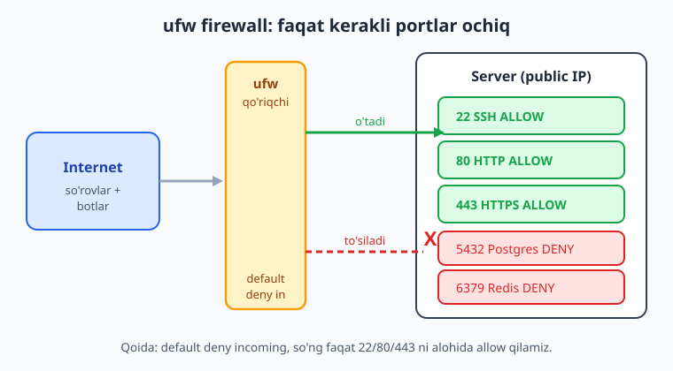
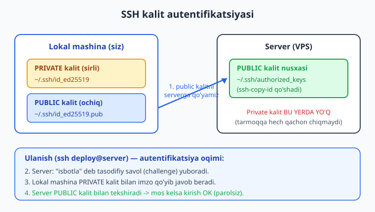
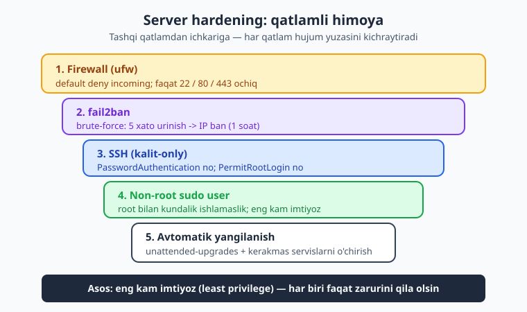

# 04 — Tarmoq va server xavfsizligi

[⬅️ Oldingi: 03 — Bash skripting va avtomatlashtirish](./03-bash-skripting.md) · [🏠 README](./README.md) · [Keyingi: 05 — Ilovani qo'lda serverga joylash ➡️](./05-qolda-deploy.md)

---

> **Bu bobda:** Internetdagi serveringizni hujumlardan himoyalashning poydevorini quramiz. Avval tarmoq asoslari — **IP** manzil (public va private), **port** nima, `localhost`/`127.0.0.1` va `0.0.0.0` farqi, hamda mashhur portlar (22-SSH, 80-HTTP, 443-HTTPS, 5432-Postgres, 6379-Redis, 3000-ilova). So'ng **DNS** (domen → IP, A/AAAA/CNAME yozuvlari) va uni `dig`/`nslookup`/`ping` bilan tekshirishni, **HTTP vs HTTPS** ni `curl -I` bilan ko'rishni o'rganamiz. Keyin amaliy himoya: **`ufw`** firewall bilan faqat kerakli portlarni ochish (`default deny incoming`), **SSH kalit** autentifikatsiyasi (`ssh-keygen -t ed25519`, `ssh-copy-id`, `authorized_keys`) va parolni butunlay o'chirish (`sshd_config`: `PasswordAuthentication no`, `PermitRootLogin no`), **`fail2ban`** bilan brute-force himoyasi, va nihoyat to'liq **server hardening** ro'yxati (non-root sudo user, kalit-only SSH, ufw, fail2ban, `unattended-upgrades`). Eng kam imtiyoz (least privilege) prinsipi bo'yicha.
>
> **Halol eslatma:** Bu bobdagi `ufw`, `fail2ban`, `sshd_config` va `apt` buyruqlari **real serverda** (root yoki sudo bilan) ishlaydi — lokal mashinada sinash mumkin emas, shuning uchun ular matnda **"illustrativ"** deb belgilangan: ularni o'z VPS'ingizda ishga tushiring. Buning evaziga `ssh-keygen` bilan kalit juftligini yaratish **lokal mashinada haqiqatan tekshirilgan** (quyida natijasi bor), barcha Bash skriptlari `bash -n` sintaksis tekshiruvidan o'tgan, 3 ta SVG esa XML-valid.

---

## Muammo: server endi butun internetga ochiq

02-bobda SSH bilan serverga ulandik, 03-bobda uni Bash bilan avtomatlashtirdik. Endi xunuk haqiqat: serveringiz **public IP** olgan zahoti, butun dunyodan unga ulanishga urinishlar boshlanadi. Bu mubolag'a emas — yangi VPS olib, bir necha soatdan keyin SSH log'iga qarasangiz, allaqachon yuzlab "login urinishi"ni ko'rasiz:

```text
Failed password for root from 218.92.0.34 port 51234 ssh2
Failed password for admin from 45.155.205.18 port 33001 ssh2
Failed password for root from 193.32.162.89 port 60122 ssh2
```

Bular sizni shaxsan bilmaydi. Bu — internetni doimiy skanerlab, zaif parolli serverlarni qidiradigan **botlar**. Agar root paroli `admin123` bo'lsa, ertaga serveringiz ularniki. U yerga mayner o'rnatishadi, spam tarqatishadi yoki sizning ma'lumotingizni o'g'irlashadi.

Yaxshi xabar: himoya **murakkab emas**. Bir necha qadam bilan serverni "ochiq eshik"dan "qulflangan qal'a"ga aylantiramiz. Lekin avval — nimani himoya qilayotganimizni tushunaylik: tarmoq.

---

## 1. Tarmoq asoslari: IP va port

### IP manzil — serverning "uy manzili"

**IP manzil** (Internet Protocol) — tarmoqdagi har bir qurilmaning raqamli manzili, masalan `203.0.113.45`. Pochta xatiga uy manzili kerak bo'lgani kabi, ma'lumot paketiga ham IP kerak. Ikki turi bor:

- **Public IP** — butun internetdan ko'rinadigan manzil. VPS'ingiz aynan shunday IP oladi (`203.0.113.45`). Domeningiz ham oxir-oqibat shu IP'ga yo'naltiriladi.
- **Private IP** — faqat lokal tarmoq ichida ishlaydi, internetdan ko'rinmaydi. Bular oldindan ajratilgan diapazonlar: `10.0.0.0/8`, `172.16.0.0/12`, `192.168.0.0/16`. Uy routeringiz telefoningizga odatda `192.168.1.x` beradi.

> 📌 **Public IP — hujum yuzasi.** Server public IP olgan zahoti, undagi har bir **ochiq port** internetdan tekshiriladi. Shuning uchun keyinroq firewall bilan deyarli hamma portni yopib, faqat kerakligini ochamiz.

### Port — bitta serverdagi "xona raqami"

Bitta IP'da bir vaqtda ko'plab xizmat ishlashi mumkin: web-server, ma'lumotlar bazasi, SSH. Ularni bir-biridan ajratish uchun **port** ishlatiladi — 0 dan 65535 gacha bo'lgan raqam. IP — bu bino manzili, port — shu binodagi aniq xona.

Mashhur portlarni yodlab oling — ular kitob bo'ylab qayta-qayta uchraydi:

| Port | Xizmat | Izoh |
|---|---|---|
| **22** | SSH | Serverga uzoqdan ulanish (kritik!) |
| **80** | HTTP | Shifrlanmagan web-trafik |
| **443** | HTTPS | Shifrlangan web-trafik (TLS) |
| **5432** | PostgreSQL | Ma'lumotlar bazasi |
| **6379** | Redis | Kesh / navbat |
| **3000** | Ilova | Node/ishlab-chiqish serveri (ko'p ishlatiladi) |

`0-1023` oralig'i — **"taniqli" (well-known) portlar** (22, 80, 443 shular ichida); ularni faqat root ocha oladi. `5432`, `6379`, `3000` esa odatdagi ilova portlari.

### `localhost`, `127.0.0.1` va `0.0.0.0`

Bu uchtasini ko'p chalkashtirishadi, lekin farqi xavfsizlik uchun **muhim**:

- **`127.0.0.1`** (`localhost`) — "o'zim" manzili (loopback). Faqat shu mashinaning o'zidan ulanish mumkin, tashqaridan **mutlaqo yo'q**.
- **`0.0.0.0`** — "barcha tarmoq interfeyslari". Xizmat shunga "tinglasa" (bind qilsa), u **tashqaridan ham** ochiq bo'ladi.

Bu nazariya emas — amaliy oqibati katta:

```bash
# Faqat serverning o'zidan ko'rinadi (xavfsiz):
node app.js   # 127.0.0.1:3000 ga bind qilsa

# Butun internetga ochiq (ehtiyot bo'ling!):
node app.js   # 0.0.0.0:3000 ga bind qilsa
```

> 💡 **Sir:** Ilovangizni `127.0.0.1`'ga bind qiling, oldiga esa **Nginx** (16-bob) qo'ying. Shunda ilova to'g'ridan-to'g'ri internetga ochiq bo'lmaydi — faqat Nginx orqali, u esa 80/443 portda turadi. Postgres va Redis ham deyarli har doim `127.0.0.1`'ga bind qilinishi kerak — ularni hech qachon `0.0.0.0`'da ochmang.

Serverda qaysi portlar tinglanayotganini ko'rish uchun:

```bash
# tinglanayotgan portlar va ularning manzili
ss -tlnp
```

Bu illustrativ chiqish — bunda farqni aniq ko'rasiz:

```text
State    Local Address:Port    Process
LISTEN   127.0.0.1:5432        postgres   <- faqat lokal (yaxshi)
LISTEN   0.0.0.0:22            sshd       <- internetga ochiq
LISTEN   0.0.0.0:80            nginx      <- internetga ochiq
```

`ss` — bu zamonaviy buyruq (eski `netstat` o'rnini bosgan): `-t` TCP, `-l` faqat tinglovchilar (listening), `-n` raqamli port, `-p` process nomi.

---

## 2. DNS: domen → IP

Hech kim `203.0.113.45` ni yodlamaydi — biz `mysite.uz` ni yodlaymiz. **DNS** (Domain Name System) — domen nomini IP'ga aylantiruvchi "internetning telefon kitobi". Brauzerga `mysite.uz` yozsangiz, kompyuter avval DNS'dan "bu domenning IP'si nima?" deb so'raydi, javobni olib, keyin shu IP'ga ulanadi.

Asosiy DNS yozuv turlari (chuqurroq — 18-bobda HTTPS bilan birga):

| Yozuv | Vazifasi | Misol |
|---|---|---|
| **A** | Domen → IPv4 manzil | `mysite.uz → 203.0.113.45` |
| **AAAA** | Domen → IPv6 manzil | `mysite.uz → 2001:db8::1` |
| **CNAME** | Domen → boshqa domen (taxallus) | `www.mysite.uz → mysite.uz` |

DNS'ni tekshirish uchun uch quroldan foydalanamiz (bular lokal mashinada ham, serverda ham ishlaydi — internet kerak):

```bash
# 1) dig — eng batafsil (DevOps standarti)
dig mysite.uz +short
# Natija (illustrativ): 203.0.113.45

# faqat A yozuv
dig A mysite.uz +short

# 2) nslookup — sodda, hamma joyda bor
nslookup mysite.uz

# 3) ping — IP'ga javob keladimi (+ DNS aniqlanishini ham ko'rsatadi)
ping -c 3 mysite.uz
```

> ⚠️ **DNS darrov o'zgarmaydi.** Domenning IP'sini o'zgartirsangiz, eski qiymat dunyo bo'ylab keshlangan bo'lishi mumkin — to'liq yoyilishi (propagation) bir necha soatgacha vaqt oladi. Shuning uchun deploy paytida "domen hali eski serverni ko'rsatyapti" holatiga tayyor turing. `TTL` (Time To Live) qancha kichik bo'lsa, yangilanish shuncha tez.

---

## 3. HTTP vs HTTPS (qisqacha)

- **HTTP** (port 80) — ma'lumot **ochiq** uzatiladi. Wi-Fi'dagi yoki yo'ldagi har kim sizning parolingizni, cookie'ngizni o'qiy oladi.
- **HTTPS** (port 443) — bir xil HTTP, lekin **TLS** bilan shifrlangan. Endi o'rtadagi hech kim trafikni o'qiy olmaydi. Bugun **har bir** production sayt HTTPS bo'lishi shart.

To'liq sozlash — 18-bobda (Let's Encrypt bilan bepul sertifikat). Hozircha faqat **tekshirishni** o'rganamiz. `curl -I` faqat HTTP **sarlavhalarini** (header) so'raydi (`-I` = HEAD so'rovi, javob tanasini yuklamaydi):

```bash
# HTTPS sayt sarlavhalarini ko'rish
curl -I https://example.com
```

Illustrativ chiqish:

```text
HTTP/2 200
content-type: text/html; charset=UTF-8
server: nginx
strict-transport-security: max-age=31536000
```

`HTTP/2 200` — sayt ishlayapti. `strict-transport-security` (HSTS) — brauzerga "doim HTTPS ishlat" deydi. HTTP'dan HTTPS'ga yo'naltirishni tekshirish:

```bash
curl -I http://example.com
# Natija (illustrativ): HTTP/1.1 301 Moved Permanently
#                       location: https://example.com/
```

`301` — bu "doimiy ko'chirildi", ya'ni HTTP so'rov avtomatik HTTPS'ga yo'naltirilyapti. Aynan shuni 18-bobda sozlaymiz.

---

## 4. Firewall: `ufw` bilan portlarni boshqarish

Endi amaliyot. **Firewall** (devor) — qaysi portga ulanishga ruxsat berilishini hal qiladigan qoidalar to'plami. Tasavvur qiling: serveringiz — eshiklari ko'p bino, firewall esa — kiraverishdagi qo'riqchi. Standart holatda qo'riqchi yo'q, hamma kiraveradi. Bizning vazifamiz: "faqat 22, 80, 443 eshiklaridan kirsa bo'ladi, qolgani — yo'q" deyish.

Ubuntu'da eng oddiy firewall vositasi — **`ufw`** (Uncomplicated Firewall). Nomi to'g'ri: u haqiqatan ham murakkab emas.



> ⚠️ **Quyidagi `ufw` buyruqlari — illustrativ (real serverda root/sudo bilan).** Lokal mashinada emas, o'z VPS'ingizda ishga tushiring.

### Asosiy qadamlar

```bash
# 1) Standart siyosat: kiruvchini hammasi BLOK, chiquvchini RUXSAT
#    (eng muhim qadam — "default deny incoming")
sudo ufw default deny incoming
sudo ufw default allow outgoing
```

`default deny incoming` — eng muhim qoida: "agar boshqacha aytmasam, hech kim kirmasin". Endi faqat o'zimizga kerak portlarni **alohida** ochamiz:

```bash
# 2) SSH ni ochamiz — buni AVVAL qiling (pastdagi ogohlantirishni o'qing!)
sudo ufw allow 22/tcp

# 3) Web portlarini ochamiz
sudo ufw allow 80,443/tcp     # HTTP va HTTPS bitta qoatorda

# 4) Aniq bir IP dan biror portga ruxsat (masalan ofis IP -> Postgres)
sudo ufw allow from 203.0.113.10 to any port 5432 proto tcp

# 5) Birovni aniq bloklash
sudo ufw deny 23/tcp          # telnet — hech qachon kerak emas
```

> 📌 **ENG MUHIM OGOHLANTIRISH — SSH portini bloklab qo'ymang!** `ufw` ni yoqishdan **oldin** `ufw allow 22/tcp` qiling. Agar avval `ufw enable` qilib, keyin SSH ochishni unutsangiz — joriy SSH ulanishingiz **o'sha zahoti uziladi** va serveringizga boshqa kira olmaysiz (faqat provayder konsoli orqali tiklaysiz). Bu DevOps'da klassik "o'zini eshikdan tashqarida qoldirish" xatosi.

Hammasi tayyor bo'lgach, firewall'ni **yoqamiz** va holatni ko'ramiz:

```bash
# 6) Firewall ni yoqish
sudo ufw enable
# (tasdiq so'raydi; SSH ulanish uzilishi haqida ogohlantiradi -> y)

# 7) Holatni ko'rish
sudo ufw status verbose
```

Illustrativ chiqish:

```text
Status: active
Default: deny (incoming), allow (outgoing)

To                Action    From
--                ------    ----
22/tcp            ALLOW IN  Anywhere
80,443/tcp        ALLOW IN  Anywhere
5432/tcp          ALLOW IN  203.0.113.10
```

Qoidani o'chirish kerak bo'lsa:

```bash
sudo ufw status numbered   # qoidalarni raqami bilan ko'rsatadi
sudo ufw delete 3          # 3-qoidani o'chirish
sudo ufw disable           # firewall ni butunlay o'chirish
```

> 💡 **Maslahat:** Agar SSH portini o'zgartirsangiz (5-bo'limga qarang, masalan 2222), `ufw` da ham yangi portni oching: `sudo ufw allow 2222/tcp`, eski 22 ni esa keyin yoping. Aks holda yangi portga kira olmaysiz.

---

## 5. SSH xavfsizligi — DevOps'da eng kritik qadam

Parol bilan SSH — bu zaif. Parolni topish mumkin, terib olishadi, sizdan o'g'irlashadi. DevOps'da standart yechim — **SSH kalit juftligi** bilan kirish va parolni **butunlay o'chirish**.

### Kalit juftligi nima?

SSH kalit juftligi — bir-biriga matematik bog'langan ikki fayl:

- **Private kalit** (`id_ed25519`) — **sirli**, faqat **sizning lokal mashinangizda** turadi. Hech kimga bermaysiz, hech qayerga yuklamaysiz.
- **Public kalit** (`id_ed25519.pub`) — **ochiq**, uni **serverga** qo'yasiz. Uni hamma ko'rsa ham zarari yo'q.

Mantiq: server "menda public kaling bor, isbotla, sendagi private kalit shunga mosligini" deydi. Lokal mashinangiz private kalit bilan "imzo" qo'yadi, server uni public kalit bilan tekshiradi. Private kalit **hech qachon tarmoqqa chiqmaydi** — shu uchun ham bu paroldan ancha xavfsiz.



### 1-qadam: kalit juftligini yaratish (lokal mashinada)

Bu buyruq **lokalda ishlaydi** (server kerak emas) — quyida men uni haqiqatan ishga tushirib tekshirdim:

```bash
# ed25519 — zamonaviy, qisqa va xavfsiz algoritm (RSA dan afzal)
ssh-keygen -t ed25519 -C "ism@kompyuter"
```

`-t ed25519` — algoritm; `-C` — izoh (odatda email yoki "kim/qaysi mashina"). Buyruq qayerga saqlashni va **passphrase** (kalitni ochuvchi qo'shimcha parol — tavsiya etiladi) so'raydi. Natijada ikki fayl paydo bo'ladi:

```text
~/.ssh/id_ed25519       <- PRIVATE (sirli, hech qayerga bermang)
~/.ssh/id_ed25519.pub   <- PUBLIC  (serverga qo'yiladi)
```

Public kalit shunday ko'rinadi (bitta qator):

```text
ssh-ed25519 AAAAC3NzaC1lZDI1NTE5AAAAICV4aIRUlZ11L34Bvp4/Xef6F8/1iJzAnoqHWCWUMQPV ism@kompyuter
```

> 💡 **Nega ed25519, RSA emas?** `ed25519` — zamonaviy egri-chiziqli (elliptic-curve) algoritm: kalit qisqaroq, tezroq va kamida RSA-3072 darajasida xavfsiz. Eski qo'llanmalarda `ssh-keygen -t rsa -b 4096` ko'rasiz — u hali ishlaydi, lekin yangi serverlar uchun `ed25519` ni tanlang.

### 2-qadam: public kalitni serverga qo'yish

Eng oson yo'l — `ssh-copy-id` (u public kalitni serverning `~/.ssh/authorized_keys` fayliga qo'shadi):

```bash
# Illustrativ — real serverga ulanadi (oxirgi marta parol so'raydi)
ssh-copy-id -i ~/.ssh/id_ed25519.pub deploy@203.0.113.45
```

Agar `ssh-copy-id` bo'lmasa, qo'lda qilish mumkin (mantiqni tushunish uchun foydali):

```bash
# Illustrativ — public kalit matnini serverdagi authorized_keys ga qo'shadi
cat ~/.ssh/id_ed25519.pub | ssh deploy@203.0.113.45 \
  'mkdir -p ~/.ssh && chmod 700 ~/.ssh && cat >> ~/.ssh/authorized_keys && chmod 600 ~/.ssh/authorized_keys'
```

`authorized_keys` — serverdagi "kirishga ruxsat etilgan public kalitlar" ro'yxati. Endi parolsiz kirish ishlashi kerak:

```bash
ssh deploy@203.0.113.45    # endi parol so'ramaydi (passphrase bo'lsa, kalit passphrase'ini so'raydi)
```

> ⚠️ **Ruxsatlar muhim.** SSH `~/.ssh` papkasi `700`, `authorized_keys` esa `600` bo'lishini talab qiladi (faqat egasi o'qiy/yoza olsin). Aks holda SSH "xavfsizlik sababli" kalitni rad etadi va sukut bo'yicha parolga qaytadi. 02-bobdagi `chmod` shu yerda kerak bo'ladi.

### 3-qadam: parolni o'chirish (`sshd_config`)

Kalit ishlayotganiga **ishonch hosil qilgach** (yangi terminalda parolsiz kira olganingizni tekshiring!), parol bilan kirishni butunlay yopamiz. Bu serverdagi `/etc/ssh/sshd_config` faylida sozlanadi:

```ini
# /etc/ssh/sshd_config  (illustrativ — real serverda root bilan tahrirlanadi)

# 1) Parol bilan kirishni o'chirish (faqat kalit)
PasswordAuthentication no

# 2) root bilan to'g'ridan-to'g'ri kirishni taqiqlash
PermitRootLogin no

# 3) (ixtiyoriy) standart portni o'zgartirish — shovqinni kamaytiradi
Port 2222

# 4) bo'sh parolli loginlarni taqiqlash
PermitEmptyPasswords no
```

O'zgartirgach, SSH xizmatini qayta ishga tushiramiz:

```bash
# Illustrativ — real serverda
sudo systemctl restart ssh
```

> 📌 **Oltin qoida: ikkinchi terminalni ochiq qoldiring.** `sshd_config` ni o'zgartirib, SSH'ni qayta ishga tushirganda **joriy ulanishingizni uzmang**. Yangi terminalda yangi ulanish ochib, kalit bilan kira olishingizni tekshiring. Agar nimadir noto'g'ri bo'lsa — eski (hali ochiq) terminal orqali tuzatasiz. Bu sizni "o'zini serverdan tashqarida qulflab qo'yish"dan saqlaydi.

> ⚠️ **Port o'zgartirsangiz:** `ufw allow 2222/tcp` qilishni unutmang (4-bo'lim), aks holda yangi portga firewall yo'l qo'ymaydi. Ulanishda esa portni ko'rsating: `ssh -p 2222 deploy@203.0.113.45`.

---

## 6. `fail2ban`: brute-force hujumlarni avtomatik to'sish

`PasswordAuthentication no` qo'ygach, parol terib topish allaqachon imkonsiz. Lekin botlar baribir urinaverishadi — log'ni to'ldiradi, resurs yeydi. **`fail2ban`** shularni avtomatik jazolaydi: u log fayllarni kuzatadi va belgilangan vaqtda ko'p marta muvaffaqiyatsiz urinish bo'lsa, o'sha IP'ni firewall bilan vaqtincha **bloklaydi** (ban qiladi).

Asosiy tushunchalar:

- **Jail** ("qamoqxona") — bitta xizmatni kuzatish konfiguratsiyasi (masalan `sshd` jail).
- **Ban** — qoidani buzgan IP'ni belgilangan vaqtga bloklash.

```bash
# Illustrativ — real serverda (Ubuntu)
sudo apt install -y fail2ban
```

Sozlamani `jail.local` faylida yozamiz (`jail.conf` ni to'g'ridan-to'g'ri tahrirlamaymiz — yangilanishda ustiga yoziladi):

```ini
# /etc/fail2ban/jail.local  (illustrativ)
[DEFAULT]
bantime  = 1h      # bloklash muddati
findtime = 10m     # shu oraliqda
maxretry = 5       # 5 marta xato urinish bo'lsa -> ban

[sshd]
enabled = true
port    = 2222     # SSH portingiz (standart bo'lsa 22)
```

```bash
# Illustrativ — yoqish va holat
sudo systemctl enable --now fail2ban
sudo fail2ban-client status sshd
```

Illustrativ chiqish (kimdir allaqachon bloklangan):

```text
Status for the jail: sshd
|- Filter
|  `- Currently failed: 2
|- Actions
   |- Currently banned: 1
   `- Banned IP list:   218.92.0.34
```

> 💡 **O'zingizni bloklashdan ehtiyot bo'ling.** Agar parol/passphrase'ni bir necha marta noto'g'ri kiritsangiz, `fail2ban` sizni ham bloklashi mumkin. O'z IP'ingizni "oq ro'yxat"ga qo'shing: `jail.local` ichida `[DEFAULT]` ostiga `ignoreip = 127.0.0.1/8 203.0.113.10` (o'z statik IP'ingiz).

---

## 7. Server hardening: to'liq ro'yxat

Endi hamma narsani bitta **hardening** (mustahkamlash) ro'yxatiga yig'amiz. Yangi VPS olganingizda, **birinchi yarim soat** ichida shularni bajaring — keyingi boblardagi hamma narsa shu poydevor ustiga quriladi.



Buning asosida — **eng kam imtiyoz prinsipi** (principle of least privilege): har bir foydalanuvchi, jarayon va port faqat **o'ziga zarur** darajada ruxsatga ega bo'lsin, ortig'iga emas. Root sifatida hamma narsani qilmang; faqat 3 ta port kerak bo'lsa 3 tasini oching; ilova faqat o'z papkasiga yoza olsin.

### Hardening checklist

**1) Oddiy (non-root) sudo user yarating** — root bilan kundalik ishlamang:

```bash
# Illustrativ — real serverda root sifatida
adduser deploy                    # parol va ma'lumot so'raydi
usermod -aG sudo deploy           # sudo guruhiga qo'shish
# endi public kalitni shu user uchun qo'ying (5-bo'lim)
```

**2) Kalit-only SSH** — parolni o'chiring, root login'ni taqiqlang (5-bo'lim):

```ini
# /etc/ssh/sshd_config
PasswordAuthentication no
PermitRootLogin no
```

**3) Firewall (`ufw`)** — default deny, faqat kerakli portlar (4-bo'lim):

```bash
# Illustrativ
sudo ufw default deny incoming
sudo ufw allow 22/tcp          # yoki o'zgartirilgan port
sudo ufw allow 80,443/tcp
sudo ufw enable
```

**4) `fail2ban`** — brute-force himoyasi (6-bo'lim).

**5) Avtomatik xavfsizlik yangilanishlari** — `unattended-upgrades` yangilanishlarni o'zi o'rnatadi:

```bash
# Illustrativ — real serverda
sudo apt update && sudo apt upgrade -y
sudo apt install -y unattended-upgrades
sudo dpkg-reconfigure --priority=low unattended-upgrades   # "Yes" tanlang
```

> 📌 **Nega avtomatik yangilanish muhim?** Hujumlarning ko'pi — allaqachon tuzatilgan, ammo siz **yangilamagan** zaifliklardan foydalanadi. `unattended-upgrades` xavfsizlik patch'larini o'zi qo'yib boradi — siz unutsangiz ham.

**6) Kerakmas xizmatlarni o'chiring** — ishlamayotgan port = ortiqcha xavf:

```bash
# Illustrativ — qaysi xizmatlar ishlayapti?
systemctl list-units --type=service --state=running
# Kerakmasini o'chirish (masalan):
sudo systemctl disable --now <xizmat-nomi>
```

**7) Eng kam imtiyoz** — ilovani **o'z** user'i ostida ishlating (root emas), faqat kerakli papkalarga yozish ruxsati bering, ma'lumotlar bazasi va Redis'ni `127.0.0.1`'ga bind qiling (1-bo'lim).

> 💡 **Bitta jumlada hardening:** *non-root sudo user + kalit-only SSH + ufw (default deny) + fail2ban + avtomatik yangilanish + kerakmasni o'chirish.* Shu olti qadam serveringizni "ochiq eshik"dan butunlay boshqa ligaga ko'taradi.

Bu poydevor tayyor bo'lgach, 05-bobda nihoyat **ilovani serverga qo'lda joylaymiz** — va nega bu yo'l og'riqli ekanini his qilamiz (Docker va CI/CD'ga motivatsiya).

---

## 04-bob mashqlari

> Quyidagilarning ko'pi **real VPS** (yoki lokal virtual mashina) talab qiladi — "illustrativ" deb belgilanganlarni o'z serveringizda bajaring. `ssh-keygen` va `bash`/`curl`/`dig` mashqlari lokal mashinada ham ishlaydi.

### Oson

1. **(Lokal)** Lokal mashinangizda `ss -tlnp` (Linux/WSL) yoki `netstat` ishlatib, qaysi portlar tinglanayotganini ko'ring. Qaysilari `127.0.0.1`'da, qaysilari `0.0.0.0`'da?

2. **(Lokal)** `ssh-keygen -t ed25519 -C "test@mashina"` bilan yangi kalit juftligini yarating (saqlash joyini standartdan boshqa qiling, masalan `~/.ssh/test_key`). `id`'ni va `.pub`'ni ajrating — qaysi biri sirli?

3. Quyidagi portlarni xizmatiga moslang: 22, 80, 443, 5432, 6379. (Yoddan.)

4. **(Lokal, internet)** `dig example.com +short` va `ping -c 3 example.com` ni ishlating. IP'lar bir xilmi?

5. **(Lokal, internet)** `curl -I https://example.com` ishlating. Javobning birinchi qatori nima (status kod)? `server:` sarlavhasida nima yozilgan?

6. `localhost`, `127.0.0.1` va `0.0.0.0` farqini bittadan jumlada tushuntiring. Qaysi biri "internetga ochiq"ni anglatadi?

### O'rta

7. **(Illustrativ, VPS)** Bo'sh VPS'da `ufw` ni shunday sozlang: kiruvchi standart blok, SSH (22) va web (80, 443) ochiq. So'ng `ufw status verbose` chiqishini o'qing.

8. **(Lokal/VPS)** O'z public kalitingizni `ssh-copy-id` bilan serverga qo'shing (yoki qo'lda `authorized_keys`'ga qo'shing). So'ng parolsiz kira olishingizni tekshiring.

9. **(Lokal)** Bash skripti yozing: u argument sifatida domen oladi va `dig +short` bilan IP'sini chiqaradi; agar IP topilmasa, "topilmadi" deb yozadi. (Maslahat: `dig` chiqishi bo'sh bo'lsa, domen aniqlanmagan.)

10. **(Illustrativ, VPS)** `sshd_config` da `PasswordAuthentication no` va `PermitRootLogin no` qo'ying, SSH'ni qayta ishga tushiring. **Joriy terminalni yopmasdan**, yangi terminalda kalit bilan kira olishni tekshiring. Nega ikkinchi terminal muhim?

11. **(Lokal)** `curl -I http://example.com` va `curl -I https://example.com` chiqishlarini solishtiring. HTTP javobida `location:` bormi? `301` nimani anglatadi?

12. **(Illustrativ, VPS)** Faqat bitta aniq IP (masalan `203.0.113.10`) ga Postgres portini (5432) ochadigan, qolganlarga yopadigan `ufw` qoidasini yozing.

### Qiyin

13. **(Lokal)** Bash skripti yozing: bir nechta portni (massiv: `22 80 443 8080`) berilgan hostda ochiq-yopiqligini tekshiradi (`nc -z -w2 HOST PORT` yoki `/dev/tcp` bilan) va har biriga `OCHIQ`/`YOPIQ` deb yozadi.

<details markdown="1">
<summary>Yechim</summary>

```bash
#!/usr/bin/env bash
set -euo pipefail

HOST="${1:?Foydalanish: ./portscan.sh <host>}"
PORTS=(22 80 443 8080 5432)

for port in "${PORTS[@]}"; do
    # bash ichki /dev/tcp bilan (nc kerak emas); 2 soniya timeout
    if timeout 2 bash -c ">/dev/tcp/$HOST/$port" 2>/dev/null; then
        echo "Port $port: OCHIQ"
    else
        echo "Port $port: YOPIQ"
    fi
done
```

`bash -c ">/dev/tcp/HOST/PORT"` — bashning maxsus "tarmoq fayli"; ulanish muvaffaqiyatli bo'lsa exit 0 (OCHIQ), aks holda xato (YOPIQ). `timeout 2` osilib qolishdan saqlaydi. `nc` bor bo'lsa: `nc -z -w2 "$HOST" "$port"` bir xil natija beradi.

</details>

14. **(Lokal)** `ssh-keygen` bilan kalit yarating, so'ng public kalit **fingerprint**'ini chiqaring (`ssh-keygen -lf <pub-fayl>`). Algoritm nima (oxirida qavs ichida)? Bit uzunligi qancha?

<details markdown="1">
<summary>Yechim</summary>

```bash
#!/usr/bin/env bash
set -euo pipefail

# Vaqtinchalik papkada test kalit (repo'ni ifloslantirmaymiz)
TMP="$(mktemp -d)"
ssh-keygen -t ed25519 -f "$TMP/test_key" -N "" -C "demo@mashina" -q

echo "Public kalit:"
cat "$TMP/test_key.pub"

echo "Fingerprint:"
ssh-keygen -lf "$TMP/test_key.pub"
# Natija (illustrativ): 256 SHA256:Hp...4KA demo@mashina (ED25519)
# 256 -> bit; (ED25519) -> algoritm

rm -rf "$TMP"
```

`-N ""` — bo'sh passphrase (faqat avtomatik test uchun; haqiqiy kalitda passphrase qo'ying). `256` — ed25519'ning bit uzunligi, qavs ichida algoritm `(ED25519)`. RSA bo'lsa `3072`/`4096` ko'rinardi.

</details>

15. **(Illustrativ, VPS)** To'liq "yangi VPS hardening" skriptini yozing (illustrativ — root sifatida ishlaydi): non-root `deploy` user yaratish, sudo guruhiga qo'shish, `ufw` ni sozlash (deny incoming + 22/80/443), `fail2ban` o'rnatish va yoqish, `unattended-upgrades` o'rnatish. Har qadamga izoh yozing.

<details markdown="1">
<summary>Yechim</summary>

```bash
#!/usr/bin/env bash
# Illustrativ — yangi Ubuntu VPS'da ROOT sifatida ishga tushiriladi.
# DIQQAT: SSH kalitingizni AVVAL deploy user uchun qo'ying, keyin parolni o'chiring.
set -euo pipefail

NEW_USER="deploy"

echo "==> 1) Tizimni yangilash"
apt update && apt upgrade -y

echo "==> 2) Non-root sudo user yaratish"
if ! id "$NEW_USER" >/dev/null 2>&1; then
    adduser --disabled-password --gecos "" "$NEW_USER"
    usermod -aG sudo "$NEW_USER"
fi
# Bu yerda: deploy user uchun public kalitni authorized_keys ga qo'ying.

echo "==> 3) Firewall (ufw): default deny + kerakli portlar"
ufw default deny incoming
ufw default allow outgoing
ufw allow 22/tcp        # SSH ni AVVAL ochish shart!
ufw allow 80,443/tcp    # HTTP + HTTPS
ufw --force enable      # --force => interaktiv tasdiqsiz

echo "==> 4) fail2ban (brute-force himoya)"
apt install -y fail2ban
systemctl enable --now fail2ban

echo "==> 5) Avtomatik xavfsizlik yangilanishlari"
apt install -y unattended-upgrades
# Interaktivsiz yoqish:
echo 'APT::Periodic::Update-Package-Lists "1";' > /etc/apt/apt.conf.d/20auto-upgrades
echo 'APT::Periodic::Unattended-Upgrade "1";' >> /etc/apt/apt.conf.d/20auto-upgrades

echo "==> TAYYOR. Endi sshd_config da PasswordAuthentication no +"
echo "    PermitRootLogin no qo'ying va: systemctl restart ssh"
echo "    (kalit bilan kira olishni YANGI terminalda tekshirgach!)"
```

Eslatma: `ufw --force enable` — interaktiv tasdiqni o'tkazib yuboradi (skriptda kerak). `adduser --disabled-password` — parolsiz user (faqat kalit bilan kiradi). `sshd_config` o'zgarishini skript oxiriga qoldirdik — chunki kalit ishlayotganini tekshirmasdan parolni o'chirish xavfli.

</details>

16. **(Lokal)** `sshd_config`'ni xavfsizlik bo'yicha "audit" qiluvchi Bash skripti yozing: berilgan config faylda `PasswordAuthentication no`, `PermitRootLogin no` borligini tekshirib, har biri uchun `OK` yoki `OGOHLANTIRISH` chiqarsin. (Lokalda namuna config fayl bilan sinang.)

<details markdown="1">
<summary>Yechim</summary>

```bash
#!/usr/bin/env bash
set -euo pipefail

CONFIG="${1:?Foydalanish: ./ssh-audit.sh <sshd_config>}"

check() {
    local key="$1" want="$2"
    # izoh (#) bilan boshlanmagan, kalit = qiymat qatorini qidiramiz
    if grep -Eq "^\s*${key}\s+${want}\b" "$CONFIG"; then
        echo "OK: ${key} ${want}"
    else
        echo "OGOHLANTIRISH: ${key} ${want} topilmadi (yoki izohda)"
    fi
}

echo "== SSH config audit: $CONFIG =="
check "PasswordAuthentication" "no"
check "PermitRootLogin"        "no"
check "PermitEmptyPasswords"   "no"
```

`grep -E "^\s*KEY\s+QIYMAT\b"` — qator boshida (izohsiz) kalit va qiymat bo'lishini tekshiradi. `\b` — so'z chegarasi (`no` `nope`ga moslashmasin). Test uchun namuna config yarating: `printf 'PasswordAuthentication no\nPermitRootLogin yes\n' > /tmp/test_sshd` va skriptni unga qarshi ishlating — `PermitRootLogin` uchun ogohlantirish chiqishi kerak.

</details>

---

[⬅️ Oldingi: 03 — Bash skripting va avtomatlashtirish](./03-bash-skripting.md) · [🏠 README](./README.md) · [Keyingi: 05 — Ilovani qo'lda serverga joylash ➡️](./05-qolda-deploy.md)
