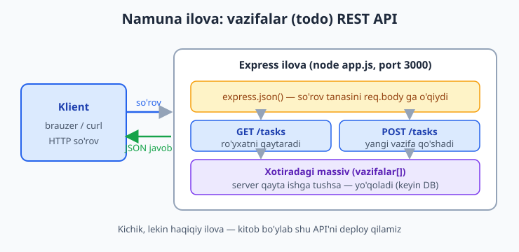
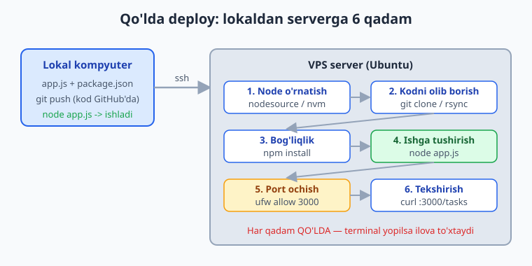
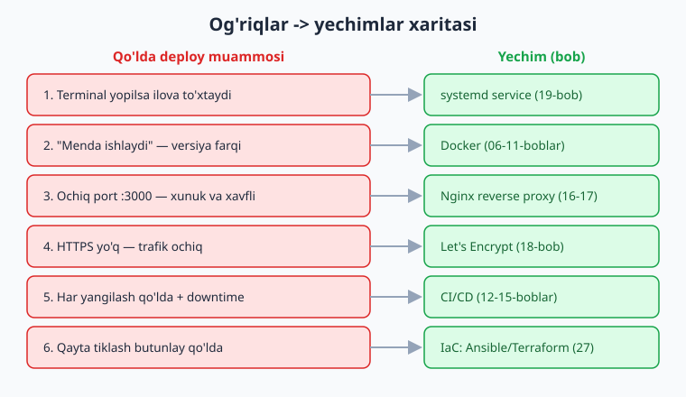

# 05 — Ilovani qo'lda serverga joylash

[⬅️ Oldingi: 04 — Tarmoq va server xavfsizligi](./04-tarmoq-xavfsizlik.md) · [🏠 README](./README.md) · [Keyingi: 06 — Docker nima: konteynerlar ➡️](./06-docker-nima.md)

> **Bu bobda:** nazariyani bir chetga qo'yib, haqiqiy ishni qilamiz — kichik lekin ishlaydigan **Node.js (Express) "vazifalar" (todo) REST API** yozamiz (`GET /tasks`, `POST /tasks`, xotirada), uni lokalda ishga tushiramiz, so'ng **qo'lda** VPS serverga joylaymiz: `ssh` bilan ulanish, Node o'rnatish (nodesource yoki nvm), kodni `git clone` (yoki `scp`/`rsync`) bilan olib borish, `npm install`, `node app.js` va `curl` bilan tekshirish. Hammasi ishlaydi — lekin keyin bu yo'lning **oltita og'rig'ini** sezasiz: terminal yopilsa ilova o'ladi, "menda ishlaydi" muammosi, ochiq xunuk port, HTTPS yo'qligi, har yangilashda qo'lda downtime, va qayta tiklashning og'irligi. Har og'riq — kitobning keyingi qaysidir bobida hal qilinadi; oxirida **"og'riqlar -> yechimlar xaritasi"** jadvalini ko'rasiz. Bu bob — kitobning qolgan qismi uchun **motivatsiya**: nima uchun Docker, CI/CD, Nginx, systemd va Kubernetes kerakligini his qildiradi.

---

## Muammo: ilova lokalda ishlaydi, endi nima?

Tasavvur qiling — ilovangizni yozib bo'ldingiz. `node app.js` deysiz, brauzerda `localhost:3000` ochiladi, hammasi zo'r. Lekin bu faqat **sizning kompyuteringizda**. Dunyodagi boshqa hech kim uni ko'ra olmaydi: kompyuteringiz uxlab qolsa yoki uni o'chirsangiz, ilova ham yo'qoladi.

"Internetga chiqarish" — buni **deploy** (joylashtirish) deyiladi: ilovani doimo yoqilgan, internetga ulangan **server**ga ko'chirib, u yerda ishlatib turish. Server haqiqiy bo'lsa, ilova ham haqiqatan ishlaydi. Bu bobda buni eng oddiy, eng "qo'l bilan" usulda qilamiz. Maqsad — ilovani ishlatish, **va** shu jarayonning qanchalik mashaqqatli ekanini his qilish. Chunki aynan shu mashaqqat keyingi 20+ bobning sababi.

> 📌 Bu bob **motivatsiya** bobi. Biz "to'g'ri" deploy qilmaymiz — ataylab eng sodda yo'ldan boramiz, og'riqlarni sanaymiz, keyin har birini kitobning tegishli bobiga ulagan holatda yo'l xaritasini chizamiz.

---

## Namuna ilova: vazifalar (todo) API

Butun kitob bo'ylab bizga deploy qilish uchun bitta **namuna ilova** kerak. U kichkina bo'lishi kerak (diqqatimiz deployda, ilova mantig'ida emas), lekin **haqiqiy** bo'lishi shart — port tinglaydigan, so'rovga javob beradigan, internetga chiqarsa ma'no kasb etadigan. Backend dasturchilarning ko'pchiligi tushunadigan narsa — **REST API**. Shuning uchun kichik **"vazifalar"** (todo) API yozamiz.

Ilovaning arxitekturasi juda oddiy: klient (brauzer yoki `curl`) HTTP so'rov yuboradi, Express uni qabul qiladi, marshrut (route) ishlaydi, javob qaytadi. Vazifalar hozircha **xotirada** (oddiy massivda) saqlanadi — ma'lumotlar bazasi keyinroq.



Ikki fayl kifoya. Avval `package.json`:

```json
{
  "name": "vazifalar-api",
  "version": "1.0.0",
  "type": "module",
  "main": "app.js",
  "scripts": {
    "start": "node app.js"
  },
  "dependencies": {
    "express": "^5.1.0"
  }
}
```

> ℹ️ `"type": "module"` — zamonaviy ESM (`import`/`export`) sintaksisini yoqadi. `"scripts.start"` esa `npm start` deganda nima ishga tushishini bildiradi — bu odat keyin server va Docker'da qo'l keladi.

Endi `app.js` — ilovaning o'zi:

```js
import express from "express";

const app = express();
app.use(express.json());

// Vazifalar xotirada saqlanadi (server qayta ishga tushsa yo'qoladi)
let vazifalar = [
  { id: 1, matn: "DevOps kitobini o'qish", bajarildi: false },
];
let keyingiId = 2;

// Barcha vazifalarni qaytarish
app.get("/tasks", (req, res) => {
  res.json(vazifalar);
});

// Yangi vazifa qo'shish
app.post("/tasks", (req, res) => {
  const matn = req.body?.matn;
  if (!matn) {
    return res.status(400).json({ xato: "matn maydoni shart" });
  }
  const vazifa = { id: keyingiId++, matn, bajarildi: false };
  vazifalar.push(vazifa);
  res.status(201).json(vazifa);
});

const PORT = process.env.PORT || 3000;
app.listen(PORT, () => {
  console.log(`Vazifalar API http://localhost:${PORT} da ishlamoqda`);
});
```

Bu yerda muhim bir narsa bor: port `process.env.PORT || 3000` orqali olinadi. Ya'ni `PORT` **muhit o'zgaruvchisi** (environment variable) berilsa — o'sha, aks holda 3000. Bu — production ilovaning birinchi qoidasi: **sozlamalar kodda emas, muhitda**. Serverda portni o'zgartirish uchun kodga tegmaysiz.

Lokalda sinab ko'ramiz:

```bash
npm install
npm start
```

```text
Vazifalar API http://localhost:3000 da ishlamoqda
```

Ikkinchi terminalda `curl` bilan tekshiramiz:

```bash
curl http://localhost:3000/tasks
```

```json
[{"id":1,"matn":"DevOps kitobini o'qish","bajarildi":false}]
```

Yangi vazifa qo'shamiz (`POST`):

```bash
curl -X POST http://localhost:3000/tasks \
  -H "Content-Type: application/json" \
  -d '{"matn":"Serverga deploy qilish"}'
```

```json
{"id":2,"matn":"Serverga deploy qilish","bajarildi":false}
```

Ishladi. Endi xuddi shu ilovani **boshqa kishilar ham ko'ra oladigan** qilishimiz kerak — ya'ni serverga olib chiqamiz.

> 💡 Bu kichik ilova — kitobning "tirik qahramoni". Keyin uni Docker konteyneriga joylaymiz, CI/CD pipeline'iga ulaymiz, Nginx ortiga qo'yamiz, HTTPS beramiz va oxirida Kubernetes'da masshtablaymiz. Hozir esa — eng oddiy yo'l.

---

## Bizga server kerak

Server — bu shunchaki **doimo yoqilgan, internetga doimiy IP bilan ulangan kompyuter**. Uni o'zingiz sotib olishingiz shart emas: cloud provayderlardan (DigitalOcean, Hetzner, AWS Lightsail, Vultr va h.k.) oyiga bir necha dollarga **VPS** (Virtual Private Server — virtual xususiy server) ijaraga olasiz. Yangi hisoblar uchun ko'pincha bepul kredit beriladi.

VPS olganingizda sizga uchta narsa beriladi: **IP manzil** (masalan `203.0.113.10`), **foydalanuvchi** (odatda `root` yoki `ubuntu`) va **kirish usuli** (parol yoki, to'g'ri yo'l — SSH kalit, [04-bobda](./04-tarmoq-xavfsizlik.md) ko'rganmiz). Biz Ubuntu 26.04 LTS (yoki hali qo'llab-quvvatlanadigan 24.04 LTS) serveridan foydalanamiz.

> ⚠️ Bu bobdagi server qadamlari **illustrativ** — ular **haqiqiy VPS**da bajariladi va shuning uchun o'z serveringizda ishlab ko'rishingiz kerak. Lokal kompyuterda `apt`, `ufw`, `ssh root@...` ishlamaydi (yoki ma'no kasb etmaydi). Buyruqlar to'g'ri yozilgan — ularni arzon VPS olib, o'sha yerda sinab ko'ring.

---

## Qadamma-qadam: qo'lda deploy

Quyidagi olti qadam — qo'lda deployning klassik yo'li. Har biri qo'l mehnati, har biri keyin avtomatlashtiriladigan narsa.



### 1-qadam: serverga `ssh` bilan ulanish

Lokal terminalingizdan serverga kiramiz ([04-bobda](./04-tarmoq-xavfsizlik.md) SSH kalitni sozlagansiz):

```bash
ssh ubuntu@203.0.113.10
```

Endi terminalingiz **server ichida** ishlaydi. Buyruqlar serverda bajariladi.

### 2-qadam: Node.js o'rnatish

Server toza Ubuntu — unda Node yo'q. Ikki keng tarqalgan usul bor.

**Usul A — NodeSource (tizim bo'yicha, server uchun afzal):**

```bash
curl -fsSL https://deb.nodesource.com/setup_22.x -o nodesource_setup.sh
sudo -E bash nodesource_setup.sh
sudo apt-get install -y nodejs
node -v
```

```text
v22.x.x
```

**Usul B — nvm (Node Version Manager, bir nechta versiyani boshqarish uchun qulay):**

```bash
curl -o- https://raw.githubusercontent.com/nvm-sh/nvm/v0.40.1/install.sh | bash
# yangi qobiq oching yoki: source ~/.bashrc
nvm install 22
nvm use 22
node -v
```

> 💡 Server uchun odatda NodeSource (Usul A) afzal — Node butun tizim uchun bir marta o'rnatiladi. nvm bir foydalanuvchi bir nechta loyihada turli Node versiyalarini ishlatadigan holatda qulay. Aynan shu "qaysi versiya?" savoli — keyinroq bizni Docker'ga olib boradigan og'riqlardan biri.

### 3-qadam: kodni serverga olib borish

Eng toza yo'l — kod GitHub'da bo'lsa, serverda `git clone`:

```bash
sudo apt-get install -y git
git clone https://github.com/foydalanuvchi/vazifalar-api.git
cd vazifalar-api
```

Agar kod faqat lokalda bo'lsa, **lokal terminaldan** (server emas) `rsync` yoki `scp` bilan yuborasiz:

```bash
# Lokal kompyuterda bajariladi:
rsync -av --exclude node_modules ./vazifalar-api/ ubuntu@203.0.113.10:~/vazifalar-api/
```

> 📌 `node_modules`'ni **hech qachon ko'chirmang** — u yuzlab megabayt va platformaga bog'liq bo'lishi mumkin. Serverda `npm install` qiling, u kerakli paketlarni o'sha server uchun o'rnatadi. Shuning uchun `--exclude node_modules`.

### 4-qadam: bog'liqliklarni o'rnatish

Server ichida, loyiha papkasida:

```bash
npm install
```

`npm` `package.json` dagi `dependencies`'ni o'qib, Express'ni va uning bog'liqliklarini `node_modules/` ga o'rnatadi.

### 5-qadam: ilovani ishga tushirish va portni ochish

```bash
node app.js
```

```text
Vazifalar API http://localhost:3000 da ishlamoqda
```

Ilova ishlamoqda — lekin server **firewall** (`ufw`, [04-bob](./04-tarmoq-xavfsizlik.md)) 3000-portni tashqaridan bloklayotgan bo'lishi mumkin. Buni **boshqa** terminaldan (yana bir `ssh` seansi) ochamiz:

```bash
sudo ufw allow 3000/tcp
```

> ⚠️ 3000-portni to'g'ridan-to'g'ri butun internetga ochish — vaqtinchalik, "ishlasin" yechimi. Production'da ilova porti tashqariga ochilmaydi; oldida Nginx turadi va faqat 80/443 ochiq bo'ladi (16-18-boblar). Hozircha — sezish uchun ochamiz.

### 6-qadam: tashqaridan tekshirish

Lokal kompyuteringizdan (yoki brauzerdan) serverning IP'siga murojaat qilamiz:

```bash
curl http://203.0.113.10:3000/tasks
```

```json
[{"id":1,"matn":"DevOps kitobini o'qish","bajarildi":false}]
```

Tabriklaymiz — ilovangiz **internetda**. Dunyoning istalgan nuqtasidan `http://203.0.113.10:3000/tasks` ochib uni ko'rish mumkin.

Endi... bir nafas oling. Chunki bu quvonch uzoq davom etmaydi.

---

## Va mana — og'riqlar boshlanadi

### Og'riq 1: terminalni yopsangiz, ilova o'ladi

`ssh` seansidan chiqasiz (yoki shunchaki terminalni yopasiz) — va ilova **to'xtaydi**. Chunki `node app.js` sizning terminal seansingizga "bog'langan" jarayon. Seans tugasa — jarayon ham.

Vaqtinchalik yamoq — `nohup` yoki `screen`/`tmux`:

```bash
# nohup: jarayon terminalga bog'lanmaydi, log faylga yoziladi
nohup node app.js > app.log 2>&1 &
```

```bash
# yoki screen: nomli seans ochib, undan "uzilib" chiqasiz
screen -S vazifalar
node app.js
# Ctrl+A keyin D bosib uziling — ilova ishlab qoladi
```

Bu **ishlaydi**, lekin xunuk: server qayta yuklansa ilova o'z-o'zidan ko'tarilmaydi, qulab tushsa qayta ishga tushmaydi, loglar tartibsiz. Asl yechim — operatsion tizimning **xizmat menejeri**, ya'ni **systemd**: u ilovani fon xizmati qiladi, qulasa avtomatik qayta ishga tushiradi, server o'chib-yonsa o'zi ko'taradi.

> ✅ **Yechim: systemd ([19-bob](./19-systemd-process.md)).** `nohup`/`screen` — vaqtinchalik plaster; systemd service — to'g'ri yechim.

### Og'riq 2: "menda ishlaydi-ku!"

Lokalingizda Node 22 bor edi, serverda esa 18 o'rnatib qo'ydingiz — va ilova ishlamaydi. Yoki lokal Linux, server boshqa distributiv; yoki bir paket lokalda bor, serverda yo'q. Klassik gap: *"Menda ishlaydi-ku!"* — lekin serverda yo'q.

Sabab — **muhit farqi**: Node versiyasi, OS, tizim kutubxonalari, muhit o'zgaruvchilari. Har bir serverni qo'lda bir xil holatga keltirish — qiyin va xatoga moyil.

> ✅ **Yechim: Docker ([06–11-boblar](./06-docker-nima.md)).** Ilovani **konteyner**ga — Node, kod va barcha bog'liqliklar bilan bitta "qutiga" — joylaymiz. Bu quti lokalda ham, serverda ham, hamkasbingizda ham **aynan bir xil** ishlaydi. "Menda ishlaydi" muammosi yo'qoladi.

### Og'riq 3: `http://203.0.113.10:3000` — xunuk va xavfli

Foydalanuvchiga "saytim `203.0.113.10:3000` da" deb aytib bo'lmaydi. Bizga **domen nomi** (masalan `vazifalar.uz`) va odatdagi **80/443 portlar** kerak — `:3000`siz. Bundan tashqari, ilova portini to'g'ridan internetga ochish — xavfsizlik nuqtai nazaridan yomon: ilova bevosita hujum yuzasiga aylanadi.

> ✅ **Yechim: Nginx reverse proxy ([16–17-boblar](./16-nginx-asoslari.md)).** Nginx 80/443-portda turadi, so'rovlarni ichkaridagi `localhost:3000` ga uzatadi. Foydalanuvchi `:3000` ni ko'rmaydi, ilova porti tashqariga ochilmaydi, bir nechta ilovaga yuk taqsimlash ham mumkin bo'ladi.

### Og'riq 4: HTTPS yo'q

URL `http://` — `https://` emas. Ya'ni trafik **shifrlanmagan**: parollar, tokenlar ochiq uzatiladi, brauzer "Xavfsiz emas" deb ogohlantiradi. Bugungi internetda HTTPSsiz sayt — qabul qilib bo'lmas holat.

> ✅ **Yechim: Let's Encrypt + Certbot ([18-bob](./18-https-domen.md)).** Bepul, avtomatik yangilanadigan TLS sertifikat. `http://` `https://` ga aylanadi, brauzerda qulf belgisi paydo bo'ladi.

### Og'riq 5: har yangilashda — yana qo'lda, yana downtime

Kodda bitta satr o'zgartirdingizmi? Yana hamma narsa boshidan: `ssh`, `git pull`, `npm install`, eski jarayonni o'ldirish, qaytadan ishga tushirish. Bu vaqtda sayt **bir necha soniya/daqiqa ishlamaydi** (downtime). Kuniga o'n marta deploy qilsangiz — bu jahannam. Va bir kun yarim tunda, charchagan holatda, bir qadamni o'tkazib yuborib — production'ni buzasiz.

> ✅ **Yechim: CI/CD — GitHub Actions ([12–15-boblar](./12-cicd-github-actions.md)).** Har `git push`da avtomatik: test ishlaydi, image quriladi, serverga deploy bo'ladi — odam aralashuvisiz. [Git & GitHub](../git-github/README.md) kitobida Actions asoslarini ko'rganmiz; bu yerda uni deploy uchun ishlatamiz.

### Og'riq 6: qayta tiklash — butunlay qo'lda

Server qulab tushsa yoki yangisini olsangiz, hamma narsa boshidan: Node o'rnatish, firewall, foydalanuvchi, ilova... yodingizda bormi har bir buyruq? Yo'q. "Qaysi paketni o'rnatgan edim?" degan savol qoladi.

> ✅ **Yechim: Infrastructure as Code — Ansible/Terraform ([27-bob](./27-iac-ansible-terraform.md)).** Butun serverni **kod** bilan tasvirlaysiz; bitta buyruq bilan noldan tiklanadigan, takrorlanadigan infratuzilma. Kubernetes ([21–24-boblar](./21-kubernetes-nima.md)) esa ilovani avtomatik tiklash va masshtablashni o'z zimmasiga oladi.

---

## Og'riqlar -> yechimlar xaritasi

Yuqoridagi olti og'riqning hammasi — bekorga emas. Har biri kitobning aniq bir bobida hal qilinadi. Mana to'liq xarita:



| # | Qo'lda deploy og'rig'i | Yechim | Bob |
|---|---|---|---|
| 1 | Terminal yopilsa ilova to'xtaydi; qulasa ko'tarilmaydi | **systemd** xizmat (auto-restart) | [19](./19-systemd-process.md) |
| 2 | "Menda ishlaydi" — Node/OS/bog'liqlik farqi | **Docker** konteyner | [06–11](./06-docker-nima.md) |
| 3 | Ochiq `:3000` port — xunuk va xavfli | **Nginx** reverse proxy | [16–17](./16-nginx-asoslari.md) |
| 4 | HTTPS yo'q — trafik shifrlanmagan | **Let's Encrypt** / Certbot | [18](./18-https-domen.md) |
| 5 | Har yangilash qo'lda + downtime | **CI/CD** (GitHub Actions) | [12–15](./12-cicd-github-actions.md) |
| 6 | Qayta tiklash butunlay qo'lda | **IaC** (Ansible/Terraform), **K8s** | [27](./27-iac-ansible-terraform.md), [21–24](./21-kubernetes-nima.md) |

> 📌 Shu jadval — kitobning yo'l xaritasi. Keyingi har bir bobni o'qiyotganda "bu qaysi og'riqni yechyapti?" deb o'zingizdan so'rang. 20-bob esa hammasini birlashtirib, namuna ilovani **to'liq production**ga chiqaradi.

Qo'lda deploy yomon emas — uni **bir marta bilish shart**, chunki avtomatlashtirish ostida aynan shu qadamlar bajariladi. Lekin uni **har kuni qo'lda takrorlash** — DevOps aynan yo'q qiladigan narsa. Keyingi bobdan boshlab biz har bir qadamni avtomatik, takrorlanadigan va ishonchli qilamiz. Birinchi to'xtash — **Docker**: "menda ishlaydi" muammosining yakuni.

---

## 05-bob mashqlari

### Oson

1. Namuna `vazifalar-api` ilovasini lokalda yarating (`app.js` + `package.json`), `npm install` va `npm start` qiling, so'ng `curl http://localhost:3000/tasks` bilan boshlang'ich vazifani ko'ring.
2. `POST /tasks` ga `curl -X POST ... -d '{"matn":"yangi vazifa"}'` yuboring va `201` javobini hamda yangi `id` ni ko'ring. So'ng `GET /tasks` qaytarganda ikki vazifa borligini tasdiqlang.
3. Ilovani `PORT=4000 npm start` bilan boshqa portda ishga tushiring. `process.env.PORT` qanday ishlayotganini tushuntiring.
4. `POST /tasks` ga `matn` maydonisiz (`-d '{}'`) so'rov yuboring. Qaysi status kod qaytadi va nega?

### O'rta

5. Qo'lda deployning olti qadamini (ssh -> Node -> kod -> npm install -> ishga tushirish -> tekshirish) o'z so'zlaringiz bilan ketma-ketlik sifatida yozing. Har qadam yonida "bu qadam qo'lda bo'lgani uchun qanday xato kelib chiqishi mumkin?" deb bitta xavfni belgilang.
6. `node_modules` papkasini nega serverga ko'chirmaslik kerakligini tushuntiring va `rsync` buyrug'ida uni `--exclude` bilan chiqarib tashlang.
7. `nohup node app.js > app.log 2>&1 &` buyrug'ining har bir qismini (`nohup`, `> app.log`, `2>&1`, `&`) ajratib tushuntiring. Bu yechim nega vaqtinchalik?
8. Olti og'riqning har birini mos yechim/bobga ulang (xotiradan jadval tuzing). Qaysi og'riq sizni eng ko'p qiziqtiradi va nega?

### Qiyin

9. Namuna ilovaga uchinchi marshrut qo'shing: `DELETE /tasks/:id` — berilgan `id` li vazifani o'chirsin, topilsa `204`, topilmasa `404` qaytarsin. Lokalda `curl -X DELETE` bilan sinab ko'ring.
10. NodeSource (Usul A) va nvm (Usul B) bilan Node o'rnatishni solishtiring: qaysi biri server uchun, qaysi biri ko'p-versiyali ish stoli uchun afzal va nega? Har birining bitta kamchiligini ayting.
11. "Menda ishlaydi" muammosini boshdan kechiring (yoki tasavvur qiling): namuna ilovani Node 22 talab qiladigan kodga ataylab o'zgartiring (masalan yangi sintaksis ishlating), so'ng eski Node bo'lgan muhitda ishga tushirilsa nima bo'lishini tushuntiring. Docker buni qanday yo'qotadi?
12. Bitta `bash` skript (`deploy.sh`) yozing — qo'lda deployning server tomonidagi qadamlarini birlashtirsin: `git pull`, `npm install`, eski jarayonni to'xtatib `nohup` bilan qayta ishga tushirish. Skript yozgach, nega bu hali ham "to'g'ri" deploy emasligini (downtime, auto-restart yo'q, atomik emas) ayting.

<details markdown="1"><summary>Yechim — 9</summary>

`app.js` ga quyidagi marshrutni qo'shing (boshqa marshrutlar yonida):

```js
// Vazifani o'chirish
app.delete("/tasks/:id", (req, res) => {
  const id = Number(req.params.id);
  const oldingi = vazifalar.length;
  vazifalar = vazifalar.filter((v) => v.id !== id);
  if (vazifalar.length === oldingi) {
    return res.status(404).json({ xato: "Vazifa topilmadi" });
  }
  res.status(204).end();
});
```

Sinash:

```bash
curl -i -X DELETE http://localhost:3000/tasks/1   # 204 No Content
curl -i -X DELETE http://localhost:3000/tasks/999 # 404 Not Found
```

`Number(req.params.id)` — URL parametri har doim satr bo'lgani uchun `id` ni songa aylantiramiz. `204` — "muvaffaqiyatli, lekin qaytaradigan tana yo'q". Topilmasa `404`.
</details>

<details markdown="1"><summary>Yechim — 10</summary>

**NodeSource (Usul A)** — Node'ni tizim paketi sifatida butun serverga o'rnatadi. Server uchun afzal: bitta versiya, barcha foydalanuvchi va xizmatlar uchun bir xil, `systemd` xizmati uchun ishonchli yo'l. **Kamchiligi:** bir serverda bir vaqtda bir nechta Node versiyasini saqlash qiyin; yangilash uchun `apt` bilan ishlash kerak.

**nvm (Usul B)** — har foydalanuvchi o'z uy papkasiga bir nechta Node versiyasini o'rnatadi va `nvm use` bilan almashtiradi. Ish stoli / ishlab chiqish muhiti uchun afzal: turli loyihalar turli Node versiyalarini talab qilganda qulay. **Kamchiligi:** foydalanuvchi qobig'iga bog'liq (`source ~/.bashrc`), shuning uchun `systemd` xizmati uchun yo'lni aniq ko'rsatish kerak; har foydalanuvchida alohida o'rnatiladi.

Xulosa: serverda **NodeSource**, ko'p-loyihali ish stolida **nvm**. Va aslida "qaysi Node versiyasi?" savolining o'zi — Docker bu og'riqni butunlay yo'q qiladigan sababdir (versiya image ichida qotiriladi).
</details>

<details markdown="1"><summary>Yechim — 11</summary>

Masalan `app.js` ga ataylab yangi sintaksis/API qo'shasiz (faqat yangi Node'da bor narsa). Eski Node bo'lgan serverda `node app.js` qilsangiz — `SyntaxError` yoki `is not a function` kabi xato bilan **qulaydi**, lokalingizda esa muammosiz ishlardi. Mana shu — "menda ishlaydi-ku" muammosining mohiyati: ilova **muhitga** bog'liq, muhit esa serverdan serverga farq qiladi.

**Docker buni qanday yo'qotadi:** ilovani `FROM node:22` kabi aniq versiyali base image ustiga quramiz. Endi kod, Node versiyasi va barcha bog'liqliklar bitta **image** ichida qotiriladi. Bu image lokalda ham, serverda ham, har qanday CI'da ham — bitobit bir xil. Serverda "qaysi Node?" degan savol umuman yo'qoladi: konteyner o'z Node'ini olib keladi. (Buni 06–08-boblarda batafsil ko'ramiz.)
</details>

<details markdown="1"><summary>Yechim — 12</summary>

Sodda `deploy.sh` (server tomonida, loyiha papkasida bajariladi):

```bash
#!/usr/bin/env bash
set -euo pipefail

echo "1/4 Eng yangi kodni olish..."
git pull origin main

echo "2/4 Bog'liqliklarni o'rnatish..."
npm install --omit=dev

echo "3/4 Eski jarayonni to'xtatish (bo'lsa)..."
pkill -f "node app.js" || true

echo "4/4 Ilovani qayta ishga tushirish..."
nohup node app.js > app.log 2>&1 &

echo "Tayyor. Loglar: app.log"
```

`set -euo pipefail` — xato bo'lsa skript darhol to'xtaydi (03-bobdagi xavfsiz skript odati). `pkill ... || true` — jarayon bo'lmasa ham skript yiqilmasin.

**Nega bu hali ham "to'g'ri" deploy emas:**
- **Downtime bor** — eski jarayon o'lib, yangisi ko'tarilguncha sayt javob bermaydi.
- **Auto-restart yo'q** — server qayta yuklansa yoki ilova qulasa, hech kim uni ko'tarmaydi (`nohup` buni qilmaydi).
- **Atomik emas** — `npm install` yarim yo'lda buzilsa, ilova nuqson holatda qoladi, qaytarish (rollback) yo'q.
- **Hali ham qo'lda ishga tushiriladi** — skriptni kimdir `ssh` qilib chaqirishi kerak.

To'g'ri yechim: ilovani **systemd** xizmati qilish (19-bob, auto-restart + reboot'da ko'tarilish) va deployni **CI/CD** ga ko'chirish (12–15-boblar, `git push`da avtomatik), ideal holatda **Docker image** orqali (atomik, rollback oson).
</details>

---

[⬅️ Oldingi: 04 — Tarmoq va server xavfsizligi](./04-tarmoq-xavfsizlik.md) · [🏠 README](./README.md) · [Keyingi: 06 — Docker nima: konteynerlar ➡️](./06-docker-nima.md)
