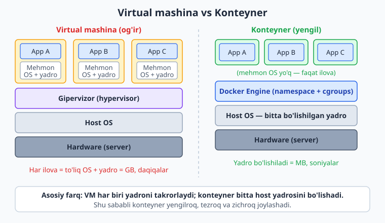
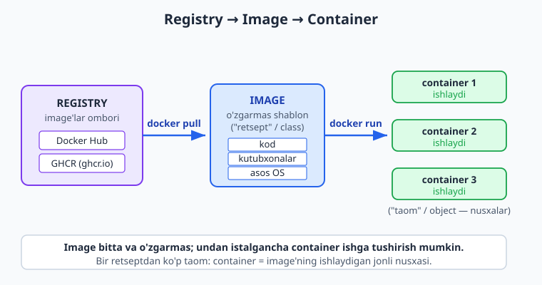
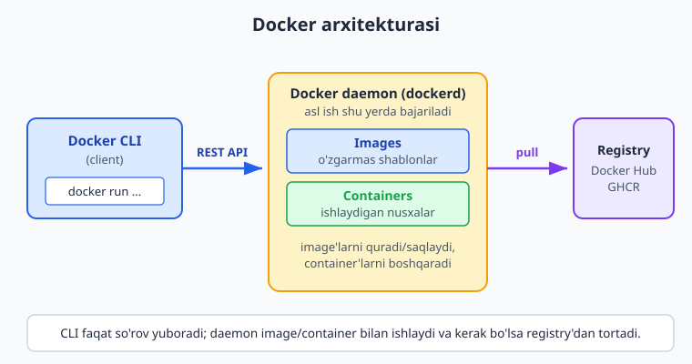

# 06 — Docker nima: konteynerlar

[⬅️ Oldingi: 05 — Ilovani qo'lda serverga joylash](./05-qolda-deploy.md) · [🏠 README](./README.md) · [Keyingi: 07 — Konteyner bilan ishlash ➡️](./07-konteyner-ishlash.md)

> **Bu bobda:** 05-bobdagi "menda ishlaydi" og'rig'idan boshlab Docker'ning yechimini ko'ramiz — ilova va uning barcha bog'liqliklarini bitta portativ paketga jamlash; konteyner va virtual mashina o'rtasidagi arxitektura farqini (yadro bo'lishish, namespace/cgroups izolyatsiyasi) jadval bilan taqqoslaymiz; **image**, **container** va **registry** uchta asosiy tushunchasini o'xshatishlar bilan ochamiz; Docker arxitekturasini (CLI → daemon → registry) va `docker run` ortida nima bo'lishini ko'rsatamiz; Docker'ni o'rnatib `docker run hello-world` bilan birinchi konteynerni ishga tushiramiz; va nega Docker butun DevOps zanjirining poydevori ekanini tushunamiz.

---

## Muammo: "menda ishlaydi-ku!"

[05-bobda](./05-qolda-deploy.md) ilovani VPS'ga qo'lda joyladik va og'riqni o'z terimizda his qildik. Eng achchiq lahzasini eslang: laptopda ilova bekam-ko'st ishlaydi, lekin serverda ishga tushganda — qulaydi.

Sabablari tanish:

- Laptopda Node.js 22, serverda 18. Ilova yangi sintaksisni ishlatadi — server uni tushunmaydi.
- Laptopda kerakli kutubxona o'rnatilgan, serverda yo'q.
- Operatsion tizim boshqacha: laptopda Windows/macOS, serverda Ubuntu — yo'l ajratuvchilari, muhit o'zgaruvchilari, fayl ruxsatlari farq qiladi.
- "U fayl" lokalda bor edi, lekin Git'ga qo'shilmagan ekan.

Natija — dasturchining mashhur jumlasi: **"Menda ishlaydi-ku!"** (*works on my machine*). Muammo ilovada emas — **muhitda**. Ilova o'zi yashayotgan muhitga bog'lanib qolgan, lekin biz faqat kodni ko'chirdik, muhitni emas.

📌 **Asosiy g'oya.** Ilovaning faqat kodini emas, balki **butun ishlash muhitini** — til versiyasi, kutubxonalar, tizim paketlari, sozlamalar — birga olib yursak, "qaysi mashinada" degan savol yo'qoladi. Aynan shuni **Docker** qiladi.

## Yechim: ilovani muhiti bilan paketlash

Docker ilovani va uning **barcha bog'liqliklarini** (dependencies) bitta yengil, izolyatsiyalangan, portativ paketga — **konteyner**ga — joylaydi. Bu paketning ichida ilovangiz kutgan hamma narsa bor: to'g'ri til versiyasi, kerakli kutubxonalar, kerakli tizim utilitalari.

Yaxshi o'xshatish — **dengiz konteyneri**. Ilgari yuklarni har xil shaklda kemaga ortishar, har biriga alohida yondashuv kerak edi. Standart metall konteyner kashf qilingach, ichida nima borligi (kiyim, mashina, banan) ahamiyatsiz bo'lib qoldi — har qanday kema, poyezd, kran bir xil ishlaydi. Docker konteyneri ham xuddi shunday: ichidagi ilova Node, Python, PHP yoki Java ekani Docker'ni qiziqtirmaydi — tashqi "shakl" har joyda bir xil.

> Konteyner ichida ishlaydigan narsa — **laptopingizda ham, hamkasbingiz mashinasida ham, test serverida ham, production serverida ham aynan bir xil** ishlaydi. "Menda ishlaydi" endi "hamma joyda ishlaydi"ga aylanadi.

💡 Konteyner butun operatsion tizimni o'z ichiga **olmaydi** — bu uni yengil qiladi. U faqat ilova va uning bog'liqliklarini oladi, OS yadrosini esa host mashinadan ijaraga oladi. Bu farq keyingi bo'limning markazida.

## Konteyner vs virtual mashina

Docker'dan oldin "izolyatsiyalangan muhit" deganda **virtual mashina** (VM) tushunilardi. VM ham ilovani ajratadi, lekin butunlay boshqacha — og'irroq — usulda. Farqni arxitektura darajasida ko'raylik.

Quyidagi diagrammada chap tomonda virtual mashinalar steki, o'ng tomonda Docker konteynerlari steki ko'rsatilgan — e'tibor bering, qaysi qatlam takrorlanadi va qaysisi bo'lishiladi:



**Virtual mashina** fizik mashina (yoki uning yadrosi) ustida **gipervizor** (hypervisor — VMware, VirtualBox, KVM) ishlaydi. Har bir VM o'zining **to'liq mehmon operatsion tizimini** (guest OS — to'liq Linux yoki Windows, yadrosi bilan) olib yuradi. Uchta ilova kerak bo'lsa — uchta to'liq OS ko'tarasiz.

**Konteyner**da gipervizor ham, mehmon OS ham yo'q. Konteynerlar **host mashinaning bitta yadrosini bo'lishadi** (share). Docker Engine ularni shu bitta yadro ustida bir-biridan ajratib turadi. Izolyatsiya ikkita Linux yadrosi mexanizmi bilan amalga oshadi:

- **namespaces** — har bir konteyner alohida "ko'rinish" oladi: o'ziga xos protsesslar ro'yxati, tarmoq, fayl tizimi nuqtai nazari. Konteyner o'zini yolg'iz mashinada deb hisoblaydi.
- **cgroups** (control groups) — har bir konteyner qancha CPU, xotira, I/O ishlatishi mumkinligini cheklaydi.

📌 Yadro bo'lishilgani uchun konteynerlar **megabaytlarda** o'lchanadi va **soniyalarda** (ko'pincha millisoniyalarda) ishga tushadi; VM esa **gigabaytlarda** o'lchanadi va **daqiqalarda** yuklanadi.

| Xususiyat | Virtual mashina | Konteyner (Docker) |
|---|---|---|
| Izolyatsiya birligi | To'liq mehmon OS + yadro | Protsess (namespace + cgroups) |
| Yadro | Har VM o'zinikini olib yuradi | Host yadrosini **bo'lishadi** |
| Hajm | Gigabaytlar (GB) | Megabaytlar (MB) |
| Ishga tushish | Daqiqalar | Soniya / millisoniya |
| Zichlik (bitta serverda) | O'nlab | Yuzlab / minglab |
| Ko'tarish yuki (overhead) | Yuqori (to'liq OS) | Past (faqat ilova) |
| Izolyatsiya kuchi | Kuchliroq (alohida yadro) | Yetarli (jarayon darajasida) |

⚠️ Konteyner VM'dan **xavfsizroq emas** — yadro bo'lishilgani sababli izolyatsiya VM darajasida qattiq emas. Lekin amaliyotda deyarli barcha ilovalar uchun bu izolyatsiya yetarli, foydasi esa juda katta. Konteyner VM'ni **o'rnini bosmaydi** — ko'pincha VM (yoki bulutdagi server) **ichida** Docker ishlaydi.

💡 Linux yadrosi konteynerning sharti bo'lgani uchun, Windows va macOS'da Docker ichida kichik Linux virtual mashinasi ishlaydi va konteynerlar shu yadroni bo'lishadi. Shuning uchun Windows'da Docker Desktop WSL2 (Linux quyi tizimi) ustida turadi.

## Uchta asosiy tushuncha: image, container, registry

Docker bilan ishlashda uchta so'z doimo qaytariladi. Ularni hozir mustahkam yodda saqlab qolsangiz, qolgani osonlashadi.

### Image — o'zgarmas shablon

**Image** (obraz) — ilova va uning muhitining **o'zgarmas (read-only) shabloni**. Uni:

- **retsept** deb tasavvur qiling — ovqat tayyorlash uchun aniq yo'riqnoma va masolliklar ro'yxati;
- yoki dasturlashdan **class** (sinf) deb — ob'ekt yaratish uchun chizma.

Image bir marta tuziladi va o'zgarmaydi. Ichida: asos OS qatlami (masalan Alpine Linux), til runtime'i (Node.js), ilovangiz kodi va bog'liqliklari.

ℹ️ Image **qatlamlardan** (layers) tashkil topadi — har bir qadam (asos, kutubxonalar, kod) alohida qatlam. Qatlamlar boshqa image'lar bilan bo'lishiladi va keshlanadi, shu sababli image'lar tez tuziladi va kam joy egallaydi. Qatlamlarni [08-bobda](./08-dockerfile.md) chuqur ochamiz — hozir shuni bilsangiz yetadi: image = qatlamlar stegi.

### Container — ishlaydigan nusxa

**Container** (konteyner) — image'dan **ishga tushirilgan jonli nusxa**. Davom etamiz:

- agar image = retsept bo'lsa, container = shu retsept bo'yicha pishirilgan **taom**;
- agar image = class bo'lsa, container = shu class'dan yaratilgan **object** (nusxa, instance).

Bitta image'dan **bir nechta** konteyner ishga tushirishingiz mumkin — bir retseptdan ko'p taom kabi. Har bir konteyner o'zining yozish mumkin bo'lgan qatlamiga ega, lekin asos image o'zgarmasligicha qoladi.

```text
        IMAGE  (o'zgarmas shablon — 1 dona)
          |
   docker run    docker run    docker run
          |            |            |
     container 1  container 2  container 3   (jonli nusxalar)
```

### Registry — image'lar ombori

**Registry** (registr) — image'lar saqlanadigan va almashinadigan **markaziy ombor**. Git uchun GitHub nima bo'lsa, Docker image'lar uchun registry shu.

- **Docker Hub** (`hub.docker.com`) — eng katta, ochiq registry. `nginx`, `node`, `python` kabi rasmiy image'lar shu yerda.
- **GHCR** — GitHub Container Registry (`ghcr.io`). O'z image'laringizni GitHub hisobingizga bog'lab saqlash uchun qulay; CI/CD bilan zo'r ishlaydi (buni [14-bobda](./14-docker-ci-ghcr.md) ishlatamiz).

Quyidagi diagramma uchchala tushunchaning bog'lanishini ko'rsatadi — registry'dan image'ni `pull` qilamiz, image'dan `run` bilan konteyner tug'iladi:



📌 Uchovini bitta jumlada: **registry**'da **image** saqlanadi → uni `docker pull` bilan tortib olasiz → `docker run` bilan undan **container** ishga tushadi.

## Docker arxitekturasi: orqada nima bo'ladi

Siz `docker` buyrug'ini terganingizda aslida ikkita qism gaplashadi. Diagrammada oqimni kuzating:



- **Docker CLI (client)** — siz teradigan `docker ...` buyrug'i. U faqat **so'rov yuboradi**, hech narsa ishga tushirmaydi.
- **Docker daemon (`dockerd`)** — fonda doimo ishlaydigan xizmat. Asl ish shu yerda: image'larni quradi/saqlaydi, konteynerlarni ishga tushiradi va boshqaradi, registry bilan gaplashadi. CLI daemon'ga REST API orqali murojaat qiladi.
- **Registry** — daemon kerakli image'ni mahalliy topa olmasa, registry'dan tortib oladi.

Misol uchun `docker run nginx` terganingizda **orqada** quyidagilar ketma-ket bo'ladi:

1. CLI daemon'ga "`nginx` image'idan konteyner ishga tushir" so'rovini yuboradi.
2. Daemon `nginx` image'ini mahalliy qidiradi. Topa olmasa — registry'dan (Docker Hub) `pull` qiladi.
3. Daemon shu image'dan yangi konteyner yaratadi.
4. Daemon konteynerga namespace/cgroups izolyatsiyasini berib, ichidagi protsessni ishga tushiradi.
5. Konteyner chiqishini (log) CLI'ga qaytaradi.

ℹ️ "Daemon ishlamayapti" (`Cannot connect to the Docker daemon`) xatosini ko'rsangiz — bu CLI daemon'ni topa olmagani; Docker Desktop'ni (yoki Linux'da `dockerd` xizmatini) ishga tushiring.

## O'rnatish va birinchi konteyner

### Docker'ni o'rnatish

- **Windows / macOS:** [Docker Desktop](https://www.docker.com/products/docker-desktop/) — grafik ilova. Windows'da WSL2 ni yoqishni so'raydi (Linux yadrosi uchun). O'rnatib, ishga tushiring — yuqori panelda Docker belgisi turg'un bo'lsa, daemon tayyor.
- **Linux:** **Docker Engine** — to'g'ridan-to'g'ri serverga. Ubuntu'da rasmiy repozitoriydan o'rnatish tavsiya etiladi (paket menejeridagi eski versiya emas):

```bash
# Ubuntu uchun (rasmiy convenience skript — production'da bosqichma-bosqich qo'llanmani afzal ko'ring)
curl -fsSL https://get.docker.com | sh
# Joriy foydalanuvchini docker guruhiga qo'shing (sudo'siz ishlatish uchun)
sudo usermod -aG docker $USER
# Keyin tizimdan chiqib qayta kiring
```

⚠️ Linux'da `sudo` siz `docker` ishlatish uchun foydalanuvchini `docker` guruhiga qo'shasiz. Bu guruh aslida **root'ga teng huquq** beradi (daemon root bilan ishlaydi), shuni xavfsizlik nuqtai nazaridan yodda tuting.

O'rnatilganini tekshiring:

```bash
docker --version
```

```text
Docker version 29.5.3, build d1c06ef
```

📌 Docker Engine **29.x** — joriy (2026) versiya. Versiya raqami biroz farq qilishi normal; muhimi `docker --version` xatosiz versiyani ko'rsatishi.

### Birinchi konteyner: `hello-world`

Docker'ning rasmiy minimal test image'ini ishga tushiramiz. Bu image hech narsa qilmaydi — faqat bitta xabar chiqaradi va to'xtaydi, demak xavfsiz:

```bash
docker run hello-world
```

```text
Unable to find image 'hello-world:latest' locally
latest: Pulling from library/hello-world
4f55086f7dd0: Pull complete
Digest: sha256:96498ffd522e70807ab6384a5c0485a79b9c7c08ca79ba08623edcad1054e62d
Status: Downloaded newer image for hello-world:latest

Hello from Docker!
This message shows that your installation appears to be working correctly.

To generate this message, Docker took the following steps:
 1. The Docker client contacted the Docker daemon.
 2. The Docker daemon pulled the "hello-world" image from the Docker Hub.
 3. The Docker daemon created a new container from that image which runs the
    executable that produces the output you are currently reading.
 4. The Docker daemon streamed that output to the Docker client, which sent it
    to your terminal.
```

Bu chiqishni e'tibor bilan o'qing — Docker o'zining ishlash mantig'ini sizga aytib bermoqda! Birinchi qator (`Unable to find image ... locally`) — daemon image'ni mahalliy topa olmadi, shuning uchun Docker Hub'dan `pull` qildi. Keyin yuqorida ko'rgan to'rt qadam aynan ro'y berdi. Tabriklaymiz — birinchi konteyneringiz ishladi.

💡 Ikkinchi marta `docker run hello-world` qilsangiz, image allaqachon mahalliy bo'lgani uchun `Pulling ...` qatorlari bo'lmaydi va konteyner darhol ishga tushadi.

### Haqiqiy konteyner: nginx web-server

`hello-world` chiqarib to'xtadi. Endi **fonda yashaydigan** haqiqiy xizmatni ishga tushiramiz — Nginx web-serverini. Bu yerda yangi bayroqlar ishtirok etadi:

- `-d` (detached) — fonda ishlasin, terminalni egallab olmasin;
- `--name nginx-test` — konteynerga eslab qolish oson nom beramiz;
- `-p 8088:80` — host'ning `8088`-portini konteyner ichidagi `80`-portga ulaymiz (chapda host, o'ngda konteyner).

```bash
docker run -d --name nginx-test -p 8088:80 nginx:1.27-alpine
```

```text
Unable to find image 'nginx:1.27-alpine' locally
1.27-alpine: Pulling from library/nginx
Status: Downloaded newer image for nginx:1.27-alpine
351352bd7b2a350dfcc9ed6dec833ebe4f66b229d0bb1a7285e1f3e43cd35a25
```

Oxirgi uzun satr — konteynerning to'liq ID'si. Ishlab turganini ko'ramiz:

```bash
docker ps
```

```text
NAMES        IMAGE               STATUS         PORTS
nginx-test   nginx:1.27-alpine   Up 3 seconds   0.0.0.0:8088->80/tcp
```

Endi brauzerda `http://localhost:8088` ni oching — Nginx'ning xush kelibsiz sahifasini ko'rasiz. Terminaldan ham tekshirish mumkin:

```bash
curl -s -o /dev/null -w "HTTP status: %{http_code}\n" http://localhost:8088
```

```text
HTTP status: 200
```

`200` — server javob bermoqda. E'tibor bering: laptopingizga Nginx **o'rnatmadingiz**, sozlamadingiz — bitta buyruq bilan to'liq web-server ishga tushdi. Tugatgach, konteynerni majburan to'xtatib o'chiramiz:

```bash
docker rm -f nginx-test
```

```text
nginx-test
```

📌 `nginx:1.27-alpine` dagi `:1.27-alpine` — bu **tag**: aniq versiya (`1.27`) va kichik Alpine Linux asosida. Tag ko'rsatmasangiz Docker `:latest` ni oladi — production'da bu xavfli, chunki "latest" vaqt o'tib boshqa versiyaga aylanib qoladi. Versiyani har doim aniq belgilang.

⚠️ Yuqorida `8088`-portni tanladik, chunki ko'p qo'llanmalardagi `8080` ko'pincha band bo'ladi. Agar `bind: address already in use` xatosini ko'rsangiz — port boshqa dastur tomonidan band; boshqa port tanlang (`-p 9000:80`).

## Nega Docker DevOps'ning poydevori

Docker shunchaki bitta qulay vosita emas — u butun zamonaviy DevOps amaliyotining tagida turadi. Sabablari:

- **Portativlik** — laptop = test serveri = production. Konteyner har joyda bir xil ishlaydi, "menda ishlaydi" muammosi yo'qoladi.
- **Izolyatsiya** — bir serverda o'nlab ilova bir-biriga xalal bermay yashaydi. Biriga Node 18, ikkinchisiga Node 22 kerak bo'lsa — muammo emas, har biri o'z konteynerida.
- **Takrorlanuvchanlik** (reproducibility) — image o'zgarmas, shu sababli bugun qurilgan image bir yildan keyin ham aynan o'sha tarzda ishga tushadi.
- **Tez deploy** — konteyner soniyalarda ishga tushadi; yangi versiyani chiqarish — yangi image'ni `pull` qilib qayta ishga tushirish, xolos.
- **Mikroservislar poydevori** — har bir kichik xizmatni alohida konteynerga joylash tabiiy bo'ladi.
- **CI/CD va Kubernetes poydevori** — keyingi boblarda ko'radigan GitHub Actions pipeline'lari image quradi, [Kubernetes](./21-kubernetes-nima.md) esa minglab konteynerni orkestratsiya qiladi. Ikkalasi ham Docker tushunchalariga (image, container, registry) tayanadi.

> Shuning uchun bu kitobda Docker — markaziy. Endi konteynerlarni qanday boshqarishni — to'xtatish, log ko'rish, ichiga kirish, port va muhit o'zgaruvchilarini berishni — [keyingi bobda](./07-konteyner-ishlash.md) batafsil o'rganamiz.

---

## 06-bob mashqlari

> Quyidagi mashqlar uchun Docker o'rnatilgan va daemon ishlab turishi kerak. Har bir buyruqni o'zingiz tering va chiqishini kuzating.

### Oson

1. **(Oson)** `docker --version` ni ishga tushiring va versiyani qayd eting. Docker Engine 29.x ekanini tasdiqlang.
2. **(Oson)** `docker run hello-world` ni ishga tushiring. Chiqishdagi 4 qadamni o'qing va ularni Docker arxitekturasi (CLI → daemon → registry) bilan bog'lang.
3. **(Oson)** O'z so'zlaringiz bilan **image** va **container** o'rtasidagi farqni tushuntiring. Bitta image'dan nechta container ishga tushirsa bo'ladi?
4. **(Oson)** Konteyner virtual mashinadan nimasi bilan **yengilroq**? Bitta jumlada (yadro bilan bog'lab) ayting.

### O'rta

5. **(O'rta)** Quyidagi tushunchalarni to'g'ri o'xshatishga ulang: image / container / registry ↔ retsept / taom / oziq-ovqat do'koni. Nega aynan shunday?
6. **(O'rta)** `docker run -d --name web -p 8088:80 nginx:1.27-alpine` ni ishga tushiring, `docker ps` bilan tekshiring, brauzerda yoki `curl` bilan ochib ko'ring, so'ng `docker rm -f web` bilan o'chiring.

    <details markdown="1"><summary>Yechim</summary>

    ```bash
    docker run -d --name web -p 8088:80 nginx:1.27-alpine
    docker ps
    curl -s -o /dev/null -w "%{http_code}\n" http://localhost:8088   # 200 qaytishi kerak
    docker rm -f web
    ```

    `-d` konteynerni fonda ishlatadi, `-p 8088:80` host portini (8088) konteyner portiga (80) bog'laydi. `curl` `200` qaytarsa — Nginx javob bermoqda. `docker rm -f` ishlab turgan konteynerni majburan to'xtatib o'chiradi.
    </details>

7. **(O'rta)** `-p 8088:80` dagi ikki raqamdan qaysi biri **host** porti, qaysi biri **konteyner** porti? Agar `8088` band bo'lsa nima xato chiqadi va qanday hal qilasiz?

    <details markdown="1"><summary>Yechim</summary>

    Format `host:container`, ya'ni **chapdagi `8088` — host (sizning mashinangiz) porti**, **o'ngdagi `80` — konteyner ichidagi port**. Agar host porti band bo'lsa, `docker` `bind: address already in use` (yoki `Only one usage of each socket address ...`) xatosini beradi. Yechim — bo'sh boshqa port tanlash, masalan `-p 9000:80`, so'ng `http://localhost:9000` ga kirish.
    </details>

8. **(O'rta)** `nginx:1.27-alpine` ifodasidagi `nginx`, `1.27` va `alpine` qismlari nimani anglatadi? Nega tag'ni `:latest` qoldirgandan ko'ra aniq versiya yozish yaxshi?

    <details markdown="1"><summary>Yechim</summary>

    `nginx` — image nomi (repozitoriy); `1.27` — versiya; `alpine` — kichik Alpine Linux asosi (yengil image). To'liq: `nginx:1.27-alpine` — bu **tag**. `:latest` vaqt o'tishi bilan boshqa (yangi) versiyaga ishora qila boshlaydi, shu sababli bugun ishlagan deploy ertaga kutilmaganda boshqacha versiyani tortib, sinishi mumkin. Aniq versiya — **takrorlanuvchanlik** (reproducibility) kafolati.
    </details>

### Qiyin

9. **(Qiyin)** `docker run hello-world` terganingizda CLI, daemon va registry o'rtasida nima yuz berishini 4-5 qadamda batafsil yozing.

    <details markdown="1"><summary>Yechim</summary>

    1. **CLI** (`docker`) daemon'ga REST API orqali "`hello-world:latest` image'idan konteyner ishga tushir" so'rovini yuboradi.
    2. **Daemon** (`dockerd`) image'ni mahalliy keshda qidiradi. Topa olmasa —
    3. daemon **registry**'dan (Docker Hub) image'ni `pull` qiladi (qatlamlarni yuklaydi).
    4. Daemon shu image'dan yangi **container** yaratadi va unga namespace/cgroups izolyatsiyasini beradi.
    5. Daemon konteyner ichidagi protsessni ishga tushiradi; protsess xabar chiqaradi va tugaydi; daemon chiqishni CLI'ga, CLI esa terminalga qaytaradi.
    </details>

10. **(Qiyin)** Konteyner va VM stack'larini yodingizdan chizing: ikkalasida ham eng pastda nima turadi, qaysi qatlam VM'da takrorlanadi-yu konteynerda bo'lishiladi?

    <details markdown="1"><summary>Yechim</summary>

    ```text
    VIRTUAL MASHINA                  KONTEYNER (Docker)
    ----------------                 ------------------
    App A | App B | App C            App A | App B | App C
    GuestOS|GuestOS|GuestOS          --- (mehmon OS yo'q) ---
    -------- Hypervisor -------      ------ Docker Engine ------
    -------- Host OS ----------      ------ Host OS (1 yadro) --
    -------- Hardware ---------      ------ Hardware -----------
    ```

    Eng pastda ikkalasida ham **Hardware** va **Host OS**. VM'da har ilova **o'z to'liq mehmon OS'ini** (guest OS, yadrosi bilan) takrorlaydi va ular **gipervizor** ustida turadi. Konteynerda mehmon OS umuman yo'q — barcha konteynerlar **bitta host yadrosini bo'lishadi**, Docker Engine ularni namespace/cgroups bilan ajratadi. Shu sababli konteyner yengilroq va tezroq.
    </details>

11. **(Qiyin)** `docker run nginx:1.27-alpine` (bayroqsiz) va `docker run -d nginx:1.27-alpine` o'rtasida terminal xulqi qanday farq qiladi? Birinchisidan qanday chiqasiz?

    <details markdown="1"><summary>Yechim</summary>

    Bayroqsiz `docker run nginx:1.27-alpine` konteynerni **frontda** (attached) ishga tushiradi: Nginx loglari to'g'ridan-to'g'ri terminalga oqadi va terminal **band bo'lib qoladi** — konteyner ishlab turganicha boshqa buyruq tera olmaysiz. Undan `Ctrl+C` bilan chiqasiz (bu konteynerni to'xtatadi). `-d` (detached) bilan konteyner **fonda** ishlaydi, terminal darhol bo'shaydi va sizga konteyner ID'sini qaytaradi; loglarni keyin `docker logs` bilan ko'rasiz (07-bobda).
    </details>

12. **(Qiyin)** Bir hamkasbingiz "Docker konteyneri — bu yengil virtual mashina" deydi. Bu ta'rif nega texnik jihatdan noto'g'ri? Tuzating.

    <details markdown="1"><summary>Yechim</summary>

    Ta'rif noto'g'ri, chunki konteyner **virtual mashina emas** — uning ichida **alohida operatsion tizim yadrosi yo'q**. VM gipervizor ustida o'zining to'liq mehmon OS'ini (yadrosi bilan) ishlatadi; konteyner esa **host mashinaning yadrosini bo'lishadi** va faqat jarayon darajasida (namespace + cgroups bilan) izolyatsiyalanadi. To'g'ri ta'rif: **konteyner — host yadrosini bo'lishadigan, izolyatsiyalangan jarayon (va uning fayl tizimi)**, "yengil VM" emas. Aynan yadroni bo'lishish konteynerni MB'larda va soniyalarda ishlaydigan qiladi.
    </details>

13. **(Qiyin)** Konteynerlar VM'dan **xavfsizlik** jihatidan kuchsizroq, deyiladi. Nega? Bu amaliyotda Docker'dan voz kechishni anglatadimi?

    <details markdown="1"><summary>Yechim</summary>

    Konteynerlar **bitta host yadrosini bo'lishgani** uchun, yadroda jiddiy zaiflik bo'lsa — nazariy jihatdan bir konteyner host'ga yoki boshqa konteynerga "chiqib" ketishi (escape) mumkin; VM esa alohida yadro bilan qattiqroq devor quradi. Lekin bu **Docker'dan voz kechish demas**: amaliyotda namespace/cgroups izolyatsiyasi aksariyat ilovalar uchun yetarli, foydasi (portativlik, tezlik, zichlik) esa juda katta. Xavfsizlikni image skani (Trivy), eng kam huquq, ishonchli base image va yangilab turish bilan kuchaytiramiz (bularni keyingi boblarda ko'ramiz). Yuqori izolyatsiya talab qilinsa, konteynerlarni alohida VM'lar ichida ishlatish odatiy yondashuv.
    </details>

---

[⬅️ Oldingi: 05 — Ilovani qo'lda serverga joylash](./05-qolda-deploy.md) · [🏠 README](./README.md) · [Keyingi: 07 — Konteyner bilan ishlash ➡️](./07-konteyner-ishlash.md)
