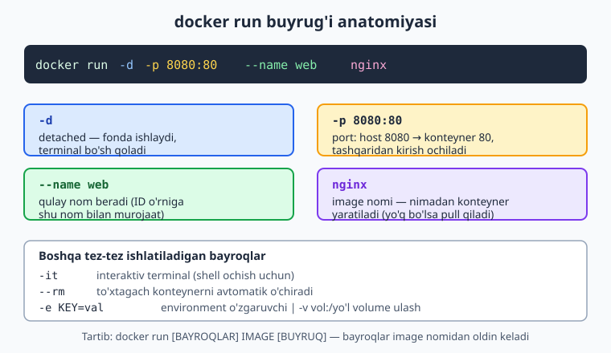
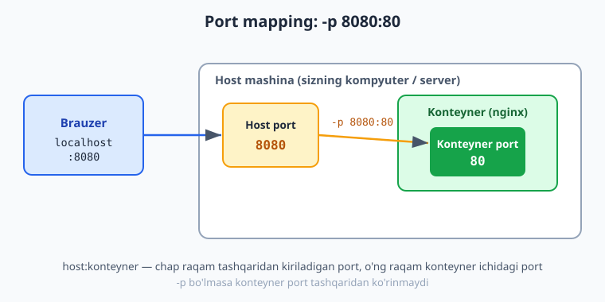
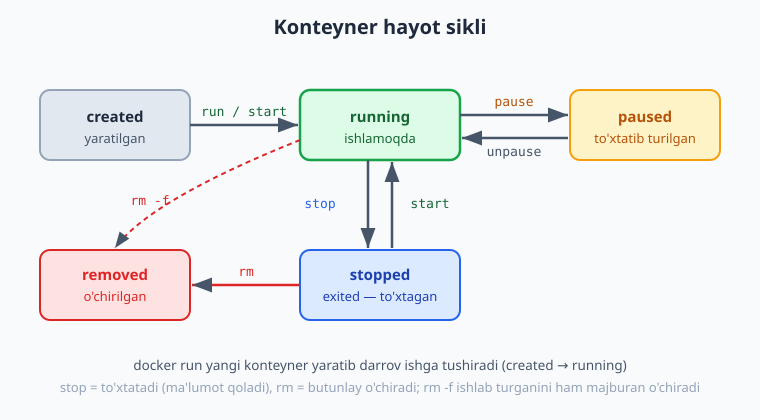

# 07 — Konteyner bilan ishlash

[⬅️ Oldingi: 06 — Docker nima: konteynerlar](./06-docker-nima.md) · [🏠 README](./README.md) · [Keyingi: 08 — Dockerfile: o'z image'ingiz ➡️](./08-dockerfile.md)

> **Bu bobda:** `docker run`'ni chuqur o'rganamiz — `-d` (fonda), `-it` (interaktiv), `--rm` (chiqqach o'chir), `--name`, `-p host:konteyner` (port), `-e KEY=val` (environment), `-v` (volume) va `--restart` bayroqlari; konteynerlarni `ps`/`logs`/`exec`/`stop`/`start`/`restart`/`rm`/`inspect`/`stats` bilan boshqarish; image'larni `pull`/`images`/`rmi`/`prune` bilan boshqarish; konteyner hayot sikli (created → running → stopped → removed); va amaliyotda `nginx` hamda `redis` konteynerlarini ishga tushirib, log ko'rib, ichiga kirib, to'xtatib, o'chirib chiqamiz.

---

## Muammo: image bor, endi nima?

[Oldingi bobda](./06-docker-nima.md) ko'rdik: **image** — bu ilovangizning "muzlatilgan surati" (kod + kutubxonalar + sozlamalar), **container** (konteyner) esa — shu image'dan tug'ilgan, ishlab turgan tirik nusxa. `docker run nginx` deb yozganingizda Docker image'dan konteyner yaratadi va ishga tushiradi.

Lekin amaliyotda savollar paydo bo'ladi: konteyner fonda ishlashini qanday qilaman? Brauzerdan unga qanday kiraman? Ishlab turgan konteyner ichida nima bo'lyapti — qanday ko'raman? To'xtatib, keyin yana ishga tushira olamanmi? Bu bob aynan shu kundalik ishlarni — konteynerni **ishga tushirish, kuzatish va boshqarishni** o'rgatadi. Bob oxirida `docker run` bayroqlarini yoddan bilasiz va konteynerni xuddi alohida kichik kompyuterdek boshqara olasiz.

> ℹ️ Bu bobdagi deyarli barcha buyruqlarni o'zingiz terib ko'ring. Docker o'rnatilgan bo'lishi kerak (06-bobga qarang). Misollar uchun internet kerak — birinchi marta `nginx` va `redis` image'lari yuklab olinadi.

---

## `docker run` — eng muhim buyruq

`docker run` — Docker'da eng ko'p ishlatiladigan buyruq. U bitta qatorda ikki ish qiladi: image'dan **yangi konteyner yaratadi** va uni **ishga tushiradi**. Umumiy tartibi shunday:

```text
docker run [BAYROQLAR] IMAGE [KONTEYNERDA BAJARILADIGAN BUYRUQ]
```

Diqqat: bayroqlar **image nomidan oldin** keladi. Image nomidan keyin yozilgan narsa — konteyner ichida bajariladigan buyruq deb qabul qilinadi.

Mana eng tipik misol — `nginx` web-serverni fonda, 8080-portda ishga tushirish. Quyidagi diagramma har bir bayroqni alohida ochib beradi:



```bash
docker run -d -p 8080:80 --name web nginx
```

Endi har bir bayroqni navbat bilan ko'rib chiqamiz.

### `-d` — fonda ishlatish (detached)

`-d` (detached, "ajratilgan") konteynerni **fonda** ishga tushiradi va sizga konteyner ID'sini qaytarib, terminalni darrov bo'shatadi:

```bash
docker run -d nginx
# 9c1f...e3a  (konteyner ID — terminal sizga qaytariladi)
```

`-d`'siz konteyner **oldinda** (foreground) ishlaydi va uning chiqishi terminalingizni egallaydi — `nginx` to'xtamaguncha kursor qaytmaydi.

> ⚠️ **Tez-tez xato: terminal "qotib qoladi".** Ko'pchilik `docker run nginx` deb `-d`'siz yozadi, keyin terminal javob bermay qolganidan hayron bo'ladi. Sabab — konteyner oldinda ishlayapti. To'xtatish uchun `Ctrl+C` bosing, keyin `-d` bilan qayta ishga tushiring. Web-server, ma'lumotlar bazasi kabi uzoq ishlaydigan xizmatlar deyarli har doim `-d` bilan ishga tushiriladi.

### `-p host:konteyner` — portni chiqarish

Konteyner ichidagi xizmat o'z portida (masalan `nginx` 80-portda) tinglaydi, lekin bu port **konteyner ichida qamalgan** — tashqaridan ko'rinmaydi. `-p` bayrog'i host (kompyuter/server) portini konteyner portiga **bog'laydi**:

```bash
docker run -d -p 8080:80 nginx
```

Bu degani: host'ning `8080`-portiga kelgan har bir so'rov konteynerning `80`-portiga uzatiladi. Endi brauzerda `http://localhost:8080` ochsangiz, nginx'ning sahifasini ko'rasiz.



> 📌 **Format: `-p host:konteyner`.** Chap raqam — tashqaridan kiriladigan host porti, o'ng raqam — konteyner ichidagi port. Bularni adashtirmang: `-p 8080:80` to'g'ri, `-p 80:8080` esa boshqa narsa. `-p` umuman bo'lmasa, konteyner porti tashqaridan **ko'rinmaydi** (boshqa konteynerlar bilan ichki tarmoq orqali gaplasha oladi, lekin host'dan kira olmaysiz).

### `--name` — qulay nom berish

Nom bermasangiz, Docker konteynerga tasodifiy nom (masalan `nostalgic_turing`) va uzun ID beradi. Keyingi buyruqlarda shu ID/nomni yozish noqulay. `--name` bilan o'zingiz tushunadigan nom bering:

```bash
docker run -d -p 8080:80 --name web nginx
```

Endi konteynerga `docker logs web`, `docker stop web` deb murojaat qila olasiz.

> ⚠️ **Tez-tez xato: "nom band".** Agar `web` nomli konteyner allaqachon mavjud bo'lsa (hatto to'xtagan bo'lsa ham), yangi konteynerni shu nom bilan yarata olmaysiz: `Conflict. The container name "/web" is already in use`. Yechim — eski konteynerni o'chiring (`docker rm web`) yoki boshqa nom tanlang.

### `-e KEY=val` — environment o'zgaruvchi

Ko'p image'lar o'z sozlamalarini **environment o'zgaruvchilari** (muhit o'zgaruvchilari) orqali oladi. Masalan PostgreSQL parolni `POSTGRES_PASSWORD` orqali oladi:

```bash
docker run -d --name db \
  -e POSTGRES_PASSWORD=maxfiy \
  -e POSTGRES_DB=todo \
  postgres:17-alpine
```

Bir nechta o'zgaruvchi uchun `-e`'ni qayta-qayta yozing. Bu — parol, port, til kabi sozlamalarni image'ni o'zgartirmasdan berishning standart usuli.

### `-v` — volume (ma'lumotni saqlash, qisqacha)

Konteyner o'chsa, uning ichidagi yozilgan ma'lumot **yo'qoladi**. Ma'lumotni saqlab qolish uchun `-v` bilan **volume** (host'dagi doimiy joy) ulanadi:

```bash
docker run -d --name db \
  -e POSTGRES_PASSWORD=maxfiy \
  -v todo_data:/var/lib/postgresql/data \
  postgres:17-alpine
```

Bu yerda `todo_data` nomli volume konteyner ichidagi ma'lumotlar papkasiga ulandi — endi konteyner o'chsa ham, ma'lumot volume'da qoladi.

> 💡 Volume va Docker tarmog'ini chuqur — **10-bobda** ([Volume va Docker tarmog'i](./10-volume-network.md)) ko'ramiz. Hozircha `-v nom:/yo'l` formatini bilib qo'ying — ma'lumotlar bazasi konteynerlari uchun u shart.

### `--rm` — chiqqach avtomatik o'chirish

Vaqtinchalik, bir martalik konteynerlar (masalan biror buyruqni sinab ko'rish) uchun `--rm` qulay: konteyner to'xtashi bilan **avtomatik o'chiriladi**, "axlat" qoldirmaydi:

```bash
docker run --rm alpine echo "Salom Docker"
# Salom Docker   (konteyner echo bajaradi, to'xtaydi va darrov o'chadi)
```

### `-it` — interaktiv rejim (konteyner ichiga kirish)

`-it` aslida ikki bayroq: `-i` (interaktiv — kiritishni ochiq tutadi) va `-t` (TTY — terminal beradi). Birga ular konteyner ichida **interaktiv shell** ochish imkonini beradi:

```bash
docker run -it --rm alpine sh
# / # ls
# / # cat /etc/os-release
# / # exit
```

Bu yerda `alpine` image'idan konteyner yaratildi va ichida `sh` (shell) ishga tushdi — endi konteyner ichida xuddi alohida Linux mashinadagidek buyruqlar terasiz. `exit` bilan chiqasiz (konteyner ham to'xtaydi).

### `--restart` — qayta ishga tushirish siyosati

Server qayta yuklansa yoki konteyner kutilmaganda yiqilsa, uni avtomatik tiklash uchun `--restart` ishlatiladi:

```bash
docker run -d --name web -p 8080:80 --restart unless-stopped nginx
```

Variantlari:

| Siyosat | Ma'nosi |
|---|---|
| `no` | Hech qachon avtomatik qayta ishga tushmaydi (standart) |
| `on-failure` | Faqat xato bilan (exit code ≠ 0) yiqilsa qayta tushadi |
| `unless-stopped` | Har doim tiklanadi, lekin siz `docker stop` qilgan bo'lsangiz — tiklanmaydi |
| `always` | Har doim tiklanadi (hatto siz to'xtatgan bo'lsangiz ham, daemon qayta ishga tushganda) |

> 💡 Production'da xizmat uchun odatda `--restart unless-stopped` tanlanadi — server qayta yuklansa xizmat o'zi ko'tariladi, lekin siz ataylab to'xtatgan bo'lsangiz tinch turadi.

---

## Konteyner hayot sikli

Konteyner doim "ishlab turibdi yoki yo'q" emas — uning bir nechta **holati** bor. Quyidagi diagramma asosiy holatlar va ular orasidagi o'tishlarni ko'rsatadi:



- **created** — konteyner yaratilgan, lekin hali ishlamayapti (`docker create` qilsangiz shu holatga tushadi).
- **running** — ishlab turibdi (`docker run` yoki `docker start`).
- **paused** — vaqtincha "muzlatilgan" (`docker pause`), `unpause` bilan davom etadi — kam ishlatiladi.
- **stopped / exited** — to'xtagan (`docker stop`), lekin **o'chmagan** — ma'lumotlari joyida, qayta `start` qilish mumkin.
- **removed** — butunlay o'chirilgan (`docker rm`) — ortga qaytmaydi.

> 📌 Eng muhim farq: **stop ≠ rm**. `docker stop` konteynerni to'xtatadi, lekin u `docker ps -a`'da ko'rinib turadi va uni `docker start` bilan qayta tiklash mumkin. `docker rm` esa konteynerni butunlay o'chiradi. Image (asl "suvrat") esa bularning hech birida o'chmaydi — undan yana yangi konteyner yaratish mumkin.

---

## Konteynerlarni boshqarish

### `docker ps` — ishlab turgan konteynerlar

`docker ps` (process status) — **ishlab turgan** konteynerlar ro'yxati:

```bash
docker ps
# CONTAINER ID   IMAGE     COMMAND                  STATUS         PORTS                  NAMES
# b5b28f78d943   nginx     "/docker-entrypoint.…"   Up 2 minutes   0.0.0.0:8080->80/tcp   web
```

To'xtagan konteynerlarni ham ko'rish uchun `-a` (all) qo'shing:

```bash
docker ps -a
# ... STATUS "Exited (0) 5 minutes ago" bo'lgan konteynerlar ham chiqadi
```

### `docker logs` — konteyner chiqishini ko'rish

Konteyner nima yozayotganini (loglarini) ko'rish — muammo qidirishda eng muhim vosita:

```bash
docker logs web
```

Loglarni **jonli** kuzatish uchun `-f` (follow) qo'shing — xuddi `tail -f` kabi yangi qatorlar ekranga chiqib turadi (`Ctrl+C` bilan chiqasiz):

```bash
docker logs -f web
```

Faqat oxirgi qatorlarni ko'rish:

```bash
docker logs --tail 50 web      # oxirgi 50 qator
docker logs --since 10m web    # oxirgi 10 daqiqa
```

### `docker exec` — ishlab turgan konteyner ichiga kirish

`docker exec` ishlab turgan konteyner ichida buyruq bajaradi. Eng ko'p ishlatiladigani — ichida shell ochish:

```bash
docker exec -it web sh
# / # ls /usr/share/nginx/html
# 50x.html  index.html
# / # exit
```

`-it` shu yerda ham kerak (interaktiv terminal). Yoki bitta buyruqni interaktiv kirmasdan bajarish:

```bash
docker exec web ls /usr/share/nginx/html
# 50x.html
# index.html
```

> 💡 Ba'zi kichik image'larda (`alpine` asosidagi) `bash` yo'q — `sh` ishlating. To'liqroq image'larda `bash` ham bor: `docker exec -it web bash`.

### `docker stop` / `start` / `restart`

```bash
docker stop web       # to'xtatadi (10 soniya muloyim kutadi, keyin majburlaydi)
docker start web      # to'xtagan konteynerni qayta ishga tushiradi
docker restart web    # to'xtatib, qayta ishga tushiradi
```

`docker stop` avval konteynerga "to'xta" signalini (SIGTERM) yuboradi va 10 soniya kutadi; xizmat o'zi tugamasa, majburan (SIGKILL) o'chiradi.

### `docker rm` — konteynerni o'chirish

```bash
docker rm web         # FAQAT to'xtagan konteynerni o'chiradi
docker rm -f web      # ishlab turgan bo'lsa ham majburan to'xtatib o'chiradi
```

Bir nechta konteynerni birataga:

```bash
docker rm -f web db cache
```

To'xtagan barcha konteynerlarni tozalash:

```bash
docker container prune
# WARNING! This will remove all stopped containers. ... [y/N]
```

### `docker inspect` — to'liq ma'lumot

`docker inspect` konteyner (yoki image) haqidagi **barcha** texnik ma'lumotni JSON ko'rinishida beradi — IP manzil, portlar, volume'lar, environment:

```bash
docker inspect web
```

Aniq bitta maydonni olish uchun `-f` (Go shabloni) bilan filtrlang:

```bash
docker inspect -f '{{range .NetworkSettings.Networks}}{{.IPAddress}}{{end}}' web
# 172.17.0.2
```

### `docker stats` — resurs sarfini kuzatish

`docker stats` konteynerlar **qancha CPU/xotira** ishlatayotganini jonli ko'rsatadi (`Ctrl+C` bilan chiqasiz):

```bash
docker stats
# NAME   CPU %   MEM USAGE / LIMIT     MEM %   NET I/O      ...
# web    0.00%   9.5MiB / 7.7GiB       0.12%   1.2kB/0B     ...
```

Bir martalik (jonli emas) suvrat uchun `--no-stream`:

```bash
docker stats --no-stream web
```

---

## Image'larni boshqarish

Konteynerlar image'lardan tug'iladi, shuning uchun image'larni ham boshqarish kerak.

### `docker pull` — image yuklab olish

```bash
docker pull nginx:1.27-alpine
docker pull redis:7-alpine
```

`docker run` o'zi ham kerakli image yo'q bo'lsa avtomatik `pull` qiladi, lekin oldindan yuklab qo'yish (masalan deploy oldidan) foydali.

> 📌 **Tag**'ni doim aniq yozing. `nginx` deb yozsangiz, u `nginx:latest`'ni oladi — bu vaqt o'tib o'zgarib ketishi mumkin. Production'da `nginx:1.27-alpine` kabi aniq versiyani belgilang — qayta-qayta bir xil natija olasiz.

### `docker images` — yuklangan image'lar ro'yxati

```bash
docker images
# REPOSITORY   TAG           IMAGE ID       SIZE
# nginx        1.27-alpine   ...            74.5MB
# redis        7-alpine      ...            57.8MB
```

### `docker rmi` — image o'chirish

```bash
docker rmi nginx:1.27-alpine
```

> ⚠️ Image'ni shu image'dan yaratilgan konteyner mavjud bo'lsa (hatto to'xtagan bo'lsa ham) o'chira olmaysiz: `image is being used by ... container`. Avval konteynerlarni o'chiring.

### `docker image prune` — keraksiz image'lardan tozalash

Vaqt o'tib hech qaysi konteyner ishlatmaydigan, "osilib qolgan" (dangling, tagsiz) image'lar yig'iladi — ular disk joyini egallaydi:

```bash
docker image prune          # faqat dangling (tagsiz) image'larni o'chiradi
docker image prune -a       # umuman ishlatilmayotgan barcha image'larni o'chiradi (ehtiyot bo'ling)
```

---

## Amaliyot: nginx konteynerni boshidan oxirigacha

Endi hammasini birlashtiramiz. Quyidagi qadamlar **haqiqatan ishga tushirib tekshirilgan** (lokal Docker Engine 29.x da, `nginx:1.27-alpine` image bilan).

**1. Ishga tushirish (fonda, 8080-portda, nom bilan):**

```bash
docker run -d -p 8080:80 --name web nginx:1.27-alpine
# b5b28f78d943...   (konteyner ID qaytadi)
```

**2. Ishlab turganini tekshirish:**

```bash
docker ps
# NAMES   IMAGE               STATUS         PORTS
# web     nginx:1.27-alpine   Up 5 seconds   0.0.0.0:8080->80/tcp
```

**3. Brauzer yoki `curl` bilan sinash:**

```bash
curl http://localhost:8080
# <!DOCTYPE html>
# <html>
# <head><title>Welcome to nginx!</title> ...
```

Brauzerda `http://localhost:8080` ochsangiz ham "Welcome to nginx!" sahifasini ko'rasiz.

**4. Loglarni ko'rish:**

```bash
docker logs web
# /docker-entrypoint.sh: Configuration complete; ready for start up
# ... [notice] 1#1: start worker processes
```

**5. Konteyner ichiga kirish va fayllarni ko'rish:**

```bash
docker exec web ls /usr/share/nginx/html
# 50x.html
# index.html

docker exec -it web sh
# / # cat /usr/share/nginx/html/index.html | head -3
# / # exit
```

**6. To'xtatish:**

```bash
docker stop web
docker ps -a
# NAMES   STATUS
# web     Exited (0) 2 seconds ago
```

**7. O'chirish (tozalash):**

```bash
docker rm web
# yoki bitta qadamda: docker rm -f web
```

> 💡 Bu — Docker bilan ishlashning kundalik aylanasi: **run → ps → logs → exec → stop → rm**. Buni bir necha marta takrorlasangiz, qo'lingiz buyruqlarni o'zi yodlab oladi.

---

## Amaliyot: redis konteyner (`-e` bilan)

Endi ma'lumotlar bazasi turidagi xizmatni `-e` bilan sozlab ishga tushiramiz. Quyidagilar ham haqiqatan tekshirilgan (`redis:7-alpine`):

```bash
# parolli redis ishga tushirish
docker run -d --name cache -e REDIS_ARGS="--requirepass maxfiy" redis:7-alpine

# ichidan parol bilan ulanib tekshirish
docker exec cache redis-cli -a maxfiy PING
# PONG

# resurs sarfini ko'rish
docker stats --no-stream cache
# NAME    CPU %    MEM USAGE / LIMIT
# cache   0.45%    3.3MiB / 7.7GiB

# tozalash
docker rm -f cache
```

Bu yerda redis ilovangiz uchun tezkor kesh (cache) sifatida ishlaydi — keyingi boblarda namuna "todo" API'mizni shunga ulaymiz.

> ℹ️ Bu xizmatga host'dan ulanish kerak bo'lsa, `-p 6379:6379` qo'shar edingiz. Bu yerda faqat konteyner ichidan sinab ko'rdik, shuning uchun port chiqarish shart bo'lmadi.

---

## Tez-tez uchraydigan xatolar (xulosa)

| Xato | Sabab | Yechim |
|---|---|---|
| `bind: address already in use` | Host porti band (`-p 8080:...`) | Boshqa host port tanlang (`-p 8081:80`) yoki bandlovchini to'xtating |
| `container name ... already in use` | O'sha `--name` band | Eski konteynerni `docker rm`, yoki boshqa nom |
| Terminal "qotib qoldi" | `-d`'siz ishga tushirildi | `Ctrl+C`, keyin `-d` bilan qayta |
| `Cannot connect to the Docker daemon` | Docker ishlamayapti | Docker Desktop/Engine'ni ishga tushiring |
| O'chirgach ma'lumot yo'qoldi | Volume ishlatilmadi | `-v nom:/yo'l` bilan saqlang (10-bob) |

---

## 07-bob mashqlari

> Mashqlarni o'zingiz terib bajaring. Avval natijani taxmin qiling, keyin buyruqni ishga tushirib solishtiring.

**Oson**

1. `nginx:1.27-alpine` image'ini `docker pull` bilan yuklab oling va `docker images` bilan ro'yxatda borligini tasdiqlang.
2. `nginx`'ni `-d -p 8080:80 --name web` bilan ishga tushiring va `docker ps` chiqishida `STATUS` hamda `PORTS` ustunlarini topib o'qing.
3. Brauzer yoki `curl http://localhost:8080` bilan nginx sahifasini oching.
4. `docker logs web` bilan loglarni ko'ring, so'ng `docker logs --tail 5 web` bilan faqat oxirgi 5 qatorni oling.
5. `docker stop web` qiling, so'ng `docker ps` va `docker ps -a` chiqishidagi farqni tushuntiring.

**O'rta**

6. `docker exec -it web sh` bilan konteyner ichiga kiring, `/usr/share/nginx/html` papkasini ko'ring va `exit` bilan chiqing.
7. To'xtagan `web` konteynerni `docker start web` bilan qayta ishga tushiring, keyin `docker restart web` bilan qayta yuklang — `docker ps`'da `STATUS` o'zgarganini kuzating.
8. `docker run --rm alpine echo "salom"` ishga tushiring va keyin `docker ps -a`'da bu konteyner **yo'qligini** tekshiring. Nega yo'q?

<details markdown="1"><summary>Yechim</summary>

```bash
docker run --rm alpine echo "salom"
# salom
docker ps -a    # ro'yxatda alpine echo konteyneri YO'Q
```

`--rm` bayrog'i konteyner ishini tugatishi (echo bajarilib, to'xtashi) bilan uni **avtomatik o'chiradi**. Shuning uchun `docker ps -a`'da ham ko'rinmaydi — bir martalik, vaqtinchalik buyruqlar uchun ideal.

</details>

9. `web` konteynerning ichki IP manzilini `docker inspect -f '{{range .NetworkSettings.Networks}}{{.IPAddress}}{{end}}' web` bilan toping.

<details markdown="1"><summary>Yechim</summary>

```bash
docker inspect -f '{{range .NetworkSettings.Networks}}{{.IPAddress}}{{end}}' web
# 172.17.0.2
```

`docker inspect` konteyner haqidagi to'liq JSON ma'lumotni beradi; `-f` (Go shablon) bilan undan faqat kerakli maydonni — bu yerda standart `bridge` tarmog'idagi IP manzilni — ajratib olamiz. Bu IP konteynerlararo aloqada ishlatiladi (10-bobda batafsil).

</details>

10. Ataylab xato qiling: `web` ishlab turgan holda yana bir marta `docker run -d -p 8080:80 --name web nginx` yozing. Qanday xato chiqdi? Tushuntiring.

<details markdown="1"><summary>Yechim</summary>

Ikki xatodan biri (yoki ikkalasi) chiqadi:

```text
docker: Error response from daemon: Conflict. The container name "/web" is already in use ...
```

yoki port band bo'lsa:

```text
docker: Error response from daemon: ... bind: address already in use
```

Sabab — `--name web` allaqachon band va host porti `8080` ham band. Yechim: avval `docker rm -f web`, yoki boshqa nom (`--name web2`) va boshqa port (`-p 8081:80`) tanlash.

</details>

**Qiyin**

11. Parol bilan himoyalangan `redis` konteynerni ishga tushiring, ichidan `redis-cli` bilan `PING` yuborib `PONG` javobini oling, so'ng o'chiring.

<details markdown="1"><summary>Yechim</summary>

```bash
docker run -d --name cache -e REDIS_ARGS="--requirepass maxfiy" redis:7-alpine
docker exec cache redis-cli -a maxfiy PING
# PONG
docker rm -f cache
```

`-e REDIS_ARGS="--requirepass maxfiy"` environment o'zgaruvchisi orqali redis'ga parol o'rnatamiz. `docker exec` bilan ishlab turgan konteyner ichida `redis-cli`'ni `-a maxfiy` (parol) bilan chaqiramiz; `PING` buyrug'iga `PONG` qaytsa, xizmat ishlayapti. Oxirida `rm -f` bilan tozalaymiz.

</details>

12. `nginx`'ni `--restart unless-stopped` bilan ishga tushiring, keyin Docker'ni qayta yuklab (yoki konteynerni majburan yiqitib) uning o'zi tiklanishini kuzating. So'ng `docker stop` qilib, endi tiklanmasligini tekshiring.

<details markdown="1"><summary>Yechim</summary>

```bash
docker run -d -p 8082:80 --name web --restart unless-stopped nginx:1.27-alpine

# yiqilishni taqlid qilamiz (ichidagi asosiy jarayonni o'ldiramiz)
docker exec web sh -c "kill 1"
docker ps      # web bir-ikki soniyada yana "Up" bo'lib qaytadi

# endi ataylab to'xtatamiz
docker stop web
docker ps -a   # "Exited" - unless-stopped buni TIKLAMAYDI

docker rm -f web
```

`unless-stopped` siyosati konteyner yiqilsa yoki daemon qayta ishga tushsa uni avtomatik tiklaydi, **lekin** siz `docker stop` bilan ataylab to'xtatgan bo'lsangiz tinch qoldiradi. Bu — production xizmatlar uchun eng ko'p tanlanadigan siyosat.

</details>

13. Tozalash mashqi: `docker ps -a` bilan barcha to'xtagan konteynerlarni ko'ring, `docker container prune` bilan tozalang, so'ng `docker image prune` bilan tagsiz image'lardan tozalang. Har qadamdan keyin nima o'zgarganini kuzating.

<details markdown="1"><summary>Yechim</summary>

```bash
docker ps -a                 # to'xtagan konteynerlar ro'yxati
docker container prune       # tasdiqlang (y) — barcha to'xtaganlar o'chadi
docker image prune           # tagsiz (dangling) image'lar o'chadi
docker images                # qolgan image'larni tekshiring
```

`prune` buyruqlari diskni keraksiz "axlatdan" tozalaydi. `container prune` faqat **to'xtagan** konteynerlarni, `image prune` (bayroqsiz) faqat **tagsiz** (dangling) image'larni o'chiradi — ishlab turgan konteynerlar va ishlatilayotgan image'larga tegmaydi. Diskni tozalashning eng yengil yo'li. (`docker system prune` esa hammasini birataga tozalaydi — ehtiyot bo'ling.)

</details>

---

[⬅️ Oldingi: 06 — Docker nima: konteynerlar](./06-docker-nima.md) · [🏠 README](./README.md) · [Keyingi: 08 — Dockerfile: o'z image'ingiz ➡️](./08-dockerfile.md)
