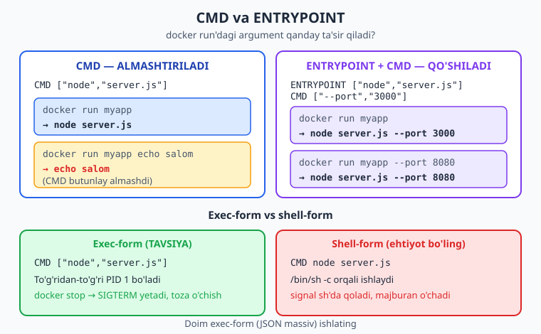
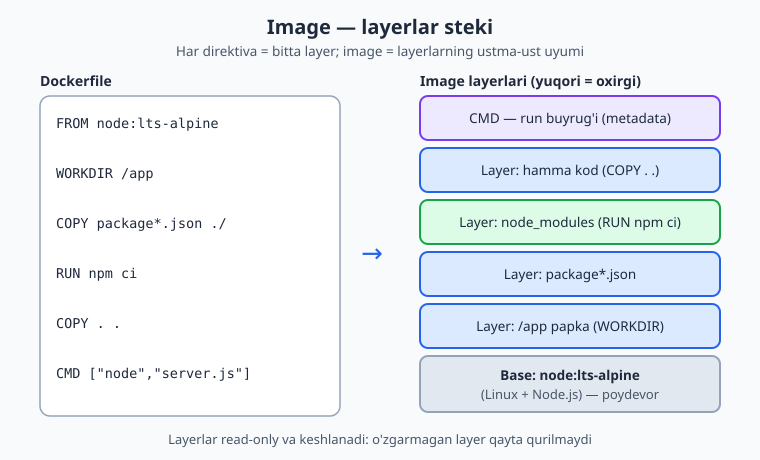
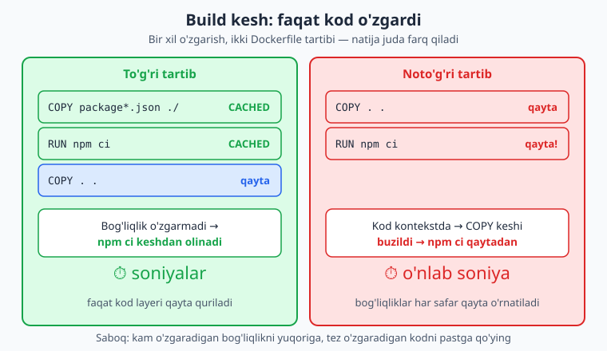

# 08 — Dockerfile: o'z image'ingiz

[⬅️ Oldingi: 07 — Konteyner bilan ishlash](./07-konteyner-ishlash.md) · [🏠 README](./README.md) · [Keyingi: 09 — Image optimizatsiya va registry ➡️](./09-image-optimizatsiya.md)

> **Bu bobda:** tayyor image yetmaganda o'z ilovangizni **Dockerfile** orqali image'ga paketlashni o'rganamiz — `FROM`/`WORKDIR`/`COPY` (va nega `ADD` emas)/`RUN`/`ENV`/`ARG`/`EXPOSE`/`LABEL`/`USER` direktivalari, har direktiva bir **layer** ekani va layerlar qanday keshlanishi, `CMD` va `ENTRYPOINT` farqi (shell vs exec form), eng muhim optimizatsiya — `COPY package.json` + `RUN npm install`ni `COPY . .`dan oldin qo'yib **build keshini** saqlash, `.dockerignore`, va `docker build -t myapp:1.0 .` bilan namuna Express "vazifalar" ilovasini real image'ga aylantirib, ishga tushirib ko'rsatamiz.

---

## Muammo: tayyor image yetmaydi

[Oldingi bobda](./07-konteyner-ishlash.md) biz `docker run nginx` yoki `docker run node` kabi **tayyor** image'larni ishga tushirdik. Ular zo'r — lekin ularning ichida **sizning ilovangiz yo'q**. `node` image'i faqat Node.js bor toza muhit; sizning `server.js` faylingizni, `package.json`'ingizni va bog'liqliklaringizni hech kim u yerga qo'ymagan.

Ikkita yomon yo'l bor:

1. **Har safar qo'lda.** Konteynerni ishga tushirib, ichiga `docker cp` bilan kodni ko'chirish, `npm install` qilish, keyin ishga tushirish. Konteyner o'chsa — hammasi yo'qoladi. Bu 05-bobdagi "qo'lda deploy" og'rig'ining aynan o'zi, faqat konteyner ichida.
2. **Volume bilan ulash.** Kodingizni tashqaridan mount qilish — lekin u holda image **ko'chirib bo'lmaydigan** bo'lib qoladi: boshqa serverga olib borsangiz, kod va bog'liqliklar yana qo'lda kerak.

Bizga kerak narsa: **kod + bog'liqlik + ishga tushirish buyrug'i** hammasi bitta **image** ichida, qotirilgan holda. Bir marta quramiz — istalgan joyda bir xil ishlaydi. Buni qiladigan retsept fayli — **`Dockerfile`**.

> 📌 **Image** — ilovangizning "muzlatilgan surati": OS qatlami + Node + sizning kodingiz + bog'liqliklar, bari ichida. **Dockerfile** — shu surat qanday quriladi, qadam-baqadam yozilgan retsept. `docker build` retseptni o'qib image yasaydi; `docker run` esa image'dan konteyner ishga tushiradi.

Bu bobda biz kitob bo'ylab ishlatadigan namuna ilovani — kichik **"vazifalar" API**'sini (Node.js + Express) — to'liq image'ga aylantiramiz.

---

## Birinchi Dockerfile

`Dockerfile` — bu oddiy matn fayl, odatda ilova ildizida joylashadi va aynan `Dockerfile` deb nomlanadi (kengaytmasiz). Har qatori bitta **direktiva**: katta harf bilan yoziladigan buyruq (`FROM`, `COPY`, `RUN`, ...) va uning argumenti.

Mana namuna "vazifalar" ilovamiz uchun to'liq, ishlaydigan `Dockerfile` (har qatorni quyida tushuntiramiz):

```dockerfile
# 1) Base image: kichik, rasmiy Node.js LTS (Alpine Linux)
FROM node:lts-alpine

# Image metadatasi (MAINTAINER emas, LABEL)
LABEL org.opencontainers.image.title="Vazifalar API" \
      org.opencontainers.image.description="Oddiy Express ilovasi"

# 2) Ish papkasi konteyner ichida
WORKDIR /app

# 3) AVVAL faqat bog'liqlik manifestini ko'chiramiz (kesh uchun)
COPY package*.json ./

# 4) Bog'liqliklarni aniq, qayta-takrorlanadigan tarzda o'rnatamiz
RUN npm ci --omit=dev

# 5) Endi qolgan kodni ko'chiramiz
COPY . .

# 6) Ilova qaysi portni tinglashini hujjatlashtiramiz
EXPOSE 3000

# 7) root emas, oddiy foydalanuvchi (xavfsizlik)
USER node

# 8) Konteyner ishga tushganda nima bajariladi (exec-form)
CMD ["node", "server.js"]
```

Bir necha qatorda butun ilova paketlandi. Endi har bir direktivani tartib bilan ochamiz.

---

## Direktivalar: retsept tili

### `FROM` — poydevor

```dockerfile
FROM node:lts-alpine
```

Har Dockerfile **`FROM`** bilan boshlanadi: qaysi tayyor image ustiga quramiz. Bu **base image** (poydevor image). Biz noldan OS yozmaymiz — Node.js o'rnatilgan tayyor `node:lts-alpine`'dan boshlaymiz. `lts` — Node'ning uzoq qo'llab-quvvatlanadigan versiyasi, `alpine` — juda kichik Linux (image hajmi keskin kichik bo'ladi; 09-bobda batafsil).

> 💡 Doim **aniq tag** ishlating (`node:lts-alpine`, `node:22-alpine`), `node:latest` emas. `latest` ertaga boshqa versiyaga aylanib, kutilmagan buzilishga olib kelishi mumkin.

### `WORKDIR` — ish papkasi

```dockerfile
WORKDIR /app
```

Konteyner ichidagi joriy papkani belgilaydi. Bundan keyingi `COPY`, `RUN`, `CMD` shu papkadan ishlaydi. Papka bo'lmasa — yaratiladi. Bu `RUN mkdir /app && cd /app`'dan toza va to'g'ri yo'l.

### `COPY` — fayllarni ichkariga ko'chirish (va nega `ADD` emas)

```dockerfile
COPY package*.json ./
COPY . .
```

`COPY <manba> <manzil>` — build kontekstidagi (sizning loyiha papkangizdagi) fayllarni image ichiga ko'chiradi. `COPY . .` — joriy papkadagi hammasini `WORKDIR`'ga.

`ADD` ham bor va o'xshash, lekin uning ikkita "sehrli" qo'shimcha xatti-harakati bor: u URL'dan yuklab olishi va `.tar` arxivni avtomatik ochishi mumkin. Aynan shu "sehr" tushunarsiz xatolarga sabab bo'ladi.

> 📌 **`COPY`'ni afzal ko'ring, `ADD`'dan qoching.** `COPY` aynan ko'chiradi, boshqa hech narsa qilmaydi — bashorat qilinadigan. `ADD`'ni faqat haqiqatan lokal `.tar`ni ochish kerak bo'lganda ishlating. Buni Docker rasmiy qo'llanmasi ham tavsiya qiladi.

### `RUN` — image qurilayotganda buyruq bajarish

```dockerfile
RUN npm ci --omit=dev
```

`RUN` — image **qurilish vaqtida** (build) buyruq bajaradi va natijani image'ga qotiradi. Bu yerda biz bog'liqliklarni o'rnatamiz. Biz `npm install` emas, **`npm ci`** ishlatdik: u `package-lock.json`'ga aniq mos keladigan versiyalarni o'rnatadi — qayta-takrorlanadigan (reproducible) va tezroq. `--omit=dev` esa faqat production bog'liqliklarini o'rnatadi (test/lint paketlari image'ga tushmaydi).

> ⚠️ `RUN` bilan `CMD`/`ENTRYPOINT`ni adashtirmang. `RUN` — **build paytida** (image yasalayotganda), `CMD`/`ENTRYPOINT` — **konteyner ishga tushganda**. `RUN npm ci` image ichiga bog'liqliklarni o'rnatadi; `CMD ["node","server.js"]` esa keyin har run'da ilovani ishga tushiradi.

### `ENV` va `ARG` — o'zgaruvchilar

```dockerfile
ARG NODE_ENV=production
ENV NODE_ENV=$NODE_ENV
ENV PORT=3000
```

- **`ENV`** — konteyner **ichida ishlash vaqtida** mavjud bo'ladigan muhit o'zgaruvchisi. Ilova `process.env.PORT` orqali o'qiy oladi.
- **`ARG`** — faqat **build vaqtida** mavjud bo'ladigan o'zgaruvchi; `docker build --build-arg NODE_ENV=production .` bilan beriladi. Konteyner ichida `ARG` ko'rinmaydi.

Soddasi: **`ARG` = qurilish parametri**, **`ENV` = ishlash vaqtidagi sozlama**.

### `EXPOSE` — qaysi portni tinglaydi

```dockerfile
EXPOSE 3000
```

Bu — **hujjatlashtiruvchi** direktiva: "bu ilova 3000-portni tinglaydi" deb belgilaydi. U **portni o'zi ochmaydi** — portni tashqariga ulash uchun baribir `docker run -p 8090:3000` kerak (07-bobdan). `EXPOSE` boshqa odamga (va Docker vositalariga) qaysi port muhimligini ko'rsatadi.

### `LABEL` — metadata (`MAINTAINER` emas)

```dockerfile
LABEL org.opencontainers.image.title="Vazifalar API" \
      org.opencontainers.image.source="https://github.com/foydalanuvchi/vazifalar"
```

`LABEL` — image'ga "kim, nima, qaysi versiya" kabi metadata yopishtiradi (`docker inspect` bilan ko'rinadi).

> ⚠️ **`MAINTAINER` eskirgan** (deprecated). Eski qo'llanmalarda `MAINTAINER Ism <email>` ko'rasiz — endi ishlatmang. O'rniga: `LABEL org.opencontainers.image.authors="Ism <email>"`.

### `USER` — root'dan voz keching

```dockerfile
USER node
```

Standart holatda konteyner ichidagi jarayon **root** (super-foydalanuvchi) sifatida ishlaydi — agar ilovada zaiflik bo'lsa, hujumchi konteynerda root huquqiga ega bo'ladi. `USER node` — `node` image'ida oldindan tayyor turgan oddiy `node` foydalanuvchisiga o'tadi.

> 📌 **Eng yaxshi amaliyot: konteynerni non-root foydalanuvchi sifatida ishlating.** `USER`'ni `COPY`/`RUN`'dan **keyin** qo'ying (avval fayllarni root sifatida joylab, keyin huquqni pasaytirasiz).

### `CMD` va `ENTRYPOINT` — nima ishga tushadi

Bu eng ko'p chalkashtiriladigan ikki direktiva. Ikkalasi ham **konteyner ishga tushganda** nima bajarilishini belgilaydi, lekin xulqi farq qiladi.

```dockerfile
CMD ["node", "server.js"]
```

**`CMD`** — standart buyruq, lekin **almashtirilishi** mumkin. `docker run myapp echo salom` desangiz, `node server.js` o'rniga `echo salom` ishlaydi.

**`ENTRYPOINT`** — konteynerning "asosiy dasturi"; `docker run`'da bergan argumentlar uni **almashtirmaydi, balki unga qo'shiladi**.

Ikkalasini **birga** ishlatish — eng kuchli idiom. `ENTRYPOINT` = qat'iy dastur, `CMD` = unga standart argument:

```dockerfile
ENTRYPOINT ["node", "server.js"]
CMD ["--port", "3000"]
```

- `docker run myapp` → `node server.js --port 3000`
- `docker run myapp --port 8080` → `node server.js --port 8080` (`CMD` almashdi, `ENTRYPOINT` qoldi)

Bizning oddiy ilovamiz uchun yolg'iz `CMD` yetarli — moslashuvchanroq, chunki kerak bo'lsa `docker run myapp sh` bilan ichkariga kirib ko'rish oson.

#### Exec-form vs shell-form

Bu ikki yozuv juda muhim farqqa ega:

```dockerfile
# exec-form (TAVSIYA ETILADI) — JSON massiv, qo'shtirnoq bilan
CMD ["node", "server.js"]

# shell-form — oddiy matn
CMD node server.js
```

- **Exec-form** (`["node", "server.js"]`) — buyruqni **to'g'ridan-to'g'ri** bajaradi (PID 1 sifatida). Konteynerni to'xtatish signali (`SIGTERM`, `docker stop`) ilovaga **to'g'ri yetadi** — toza o'chish.
- **Shell-form** (`node server.js`) — `/bin/sh -c "node server.js"` orqali ishlaydi; signal `sh`'da qoladi, ilovaga yetmasligi mumkin — konteyner sekin, "majburan" o'chadi.

> 📌 **Doim exec-form ishlating** (`CMD ["...", "..."]` JSON massiv). Bu signal boshqaruvini to'g'rilaydi va `docker stop` ilovani toza yopadi.

Quyidagi diagramma `CMD` va `ENTRYPOINT` farqini umumlashtiradi:



---

## Layerlar: image — qatlamlar steki

Bu bobning yuragi shu yerda. **Dockerfile'dagi har bir direktiva (`FROM`, `COPY`, `RUN`, ...) image'ga bitta yangi layer (qatlam) qo'shadi.** Image — bu layerlarning ustma-ust qo'yilgan steki (uyumi). Har layer faqat o'zidan oldingi holatga nisbatan **o'zgarishni** saqlaydi.

Buni varaqlar uyumiga o'xshating: `FROM` — eng pastdagi varaq (Node bor OS), keyin har direktiva ustiga yangi shaffof varaq qo'yadi (`WORKDIR` papka yasadi, `COPY package*.json` manifest qo'shdi, `RUN npm ci` `node_modules` yasadi...). Image — shu varaqlar yig'indisi.



Eng muhim xususiyat: **layerlar keshlanadi va qayta ishlatiladi.** `docker build`ni ikkinchi marta ishga tushirganda, Docker har layer uchun "kirish ma'lumotlari o'zgarmadimi?" deb tekshiradi. O'zgarmagan bo'lsa — qaytadan qurmaydi, **keshdan oladi** (`CACHED` deb ko'rsatadi). Kesh **birinchi o'zgargan layergacha** ishlaydi: o'sha layer (va undan keyingi hammasi) qaytadan quriladi.

> ℹ️ Ikki tushuncha aralashmasin: **layer** — image quruvchi bloki (qurilish vaqtida hosil bo'ladi va keshlanadi); 07-bobdagi **konteyner qatlami** esa image'ning yuqorisidagi yozish mumkin bo'lgan vaqtinchalik qatlam (run vaqtida). Image layerlari o'qish-uchun (read-only) va konteynerlar o'rtasida umumiy.

---

## Build kesh va tartib — eng muhim optimizatsiya

Layer keshini bilsangiz, undan **foyda olishingiz** kerak. Sir tartibda: **kam o'zgaradigan narsalarni yuqoriga, tez-tez o'zgaradigan narsalarni pastga qo'ying.**

Ilovangizda nima tez-tez o'zgaradi? **Kod** (`server.js`). Nima kamdan-kam o'zgaradi? **Bog'liqliklar** (`package.json` — yangi paket qo'shganingizdagina o'zgaradi). Shuning uchun:

```dockerfile
COPY package*.json ./     # avval faqat manifest
RUN npm ci --omit=dev     # bog'liqliklarni o'rnat
COPY . .                  # keyin qolgan kod
```

Endi kodingizni o'zgartirsangiz (`server.js`'ni tahrirlasangiz), `package*.json` **o'zgarmagani** uchun `COPY package*.json` va og'ir `RUN npm ci` layerlari **keshdan olinadi** — bog'liqliklar qayta o'rnatilmaydi. Faqat `COPY . .` qaytadan ishlaydi (bir lahzada).

❌ **Noto'g'ri tartib** (har kod o'zgarishida bog'liqliklarni qayta o'rnatadi):

```dockerfile
# YOMON: kodni avval ko'chirsangiz, har o'zgarishda npm ci buziladi
COPY . .
RUN npm ci --omit=dev
```

Bunda `COPY . .` kodingiz har o'zgarganda **layer keshini buzadi** — undan keyingi `RUN npm ci` ham keshdan tushadi va har safar noldan ishlaydi (sekin: o'nlab soniya, ba'zan daqiqalar).

Quyidagi diagramma ikkala tartibni yonma-yon ko'rsatadi — kod o'zgarganda:



> 💡 Bu — Dockerfile'dagi **eng muhim** optimizatsiya saboq. Faqat ikki qatorni to'g'ri tartiblash bilan build vaqtini daqiqalardan soniyalarga tushirasiz. Xuddi shu naqsh barcha tillarda ishlaydi: Python'da `COPY requirements.txt` → `RUN pip install` → `COPY . .`; Go'da `COPY go.mod go.sum` → `RUN go mod download` → `COPY . .`.

Biz buni **haqiqatan tekshirdik**: to'g'ri tartibli image'ni qurib, keyin faqat `server.js`'ni o'zgartirib qayta qurganimizda Docker `WORKDIR`, `COPY package*.json` va `RUN npm ci` layerlarini `CACHED` deb belgiladi — faqat `COPY . .` qayta ishladi. Noto'g'ri tartibda esa har kod o'zgarishida `npm ci` qaytadan ishladi.

---

## `.dockerignore` — kontekstga nima tushmasin

`docker build -t myapp:1.0 .` desangiz, oxiridagi **nuqta (`.`)** — bu **build konteksti**: Docker shu papkadagi hamma faylni daemonga jo'natadi. Agar papkangizda `node_modules` (yuzlab megabayt), `.git` tarixi yoki `.env` (sirlaringiz) bo'lsa — ular ham jo'natiladi. Bu sekin, og'ir va xavfli.

Yechim — `.dockerignore` fayli (xuddi `.gitignore` kabi):

```text
node_modules
npm-debug.log
.git
.gitignore
.env
Dockerfile
.dockerignore
*.md
```

- **`node_modules`** — image ichida `RUN npm ci` bilan toza o'rnatamiz; lokal (ehtimol boshqa OS uchun qurilgan) `node_modules`'ni ko'chirish noto'g'ri va `COPY . .` keshini ham buzadi.
- **`.git`** — butun versiya tarixi image'ga kerak emas, faqat hajmni shishiradi.
- **`.env`** — **sirlar** (parol, API kalit) image ichiga **hech qachon** tushmasin. Ularni run vaqtida `-e` yoki Compose/secrets bilan beriladi.

> ⚠️ `.env`'ni image'ga `COPY` qilmang. Image ko'pincha registry'ga (boshqalar ko'radigan joyga) jo'natiladi — ichidagi parol ochiq qoladi. `.dockerignore`'ga `.env`'ni qo'shish — birinchi himoya.

---

## Image'ni qurish va ishga tushirish

Endi hammasini birga ko'ramiz. Loyiha papkasida `Dockerfile`, `.dockerignore`, `package.json`, `package-lock.json` va `server.js` bor.

**1) Image'ni quramiz:**

```bash
docker build -t vazifalar:1.0 .
```

- `-t vazifalar:1.0` — image'ga **tag** (nom:versiya) beradi.
- oxiridagi `.` — **build konteksti** (joriy papka). Docker shu papkadan `Dockerfile`ni topib o'qiydi.

Kutilgan chiqish (qisqartirilgan):

```text
 => [1/5] FROM docker.io/library/node:lts-alpine
 => [2/5] WORKDIR /app
 => [3/5] COPY package*.json ./
 => [4/5] RUN npm ci --omit=dev
 => [5/5] COPY . .
 => exporting to image
 => naming to docker.io/library/vazifalar:1.0
```

**2) Image ro'yxatda turibdimi — tekshiramiz:**

```bash
docker images
```

```text
REPOSITORY   TAG   IMAGE ID       CREATED         SIZE
vazifalar    1.0   2b3a30198dc9   5 seconds ago   148MB
```

**3) Konteyner sifatida ishga tushiramiz:**

```bash
docker run -d --name vazifalar-c -p 8090:3000 vazifalar:1.0
```

- `-d` — fonda (detached), `--name` — qulay nom, `-p 8090:3000` — host'ning 8090-portini konteynerning 3000-portiga ulaydi (07-bobdan).

**4) Ishlayotganini tekshiramiz:**

```bash
curl http://localhost:8090/vazifalar
```

```text
[{"id":1,"matn":"Dockerfile yozish","bajarildi":false}]
```

Ishladi — bizning kod o'z image'imiz ichida konteyner bo'lib aylanmoqda. Yangi vazifa qo'shib ko'ramiz:

```bash
curl -X POST http://localhost:8090/vazifalar \
  -H "Content-Type: application/json" \
  -d '{"matn":"Image push qilish"}'
```

```text
{"id":2,"matn":"Image push qilish","bajarildi":false}
```

**5) Konteyner haqiqatan non-root ekanini tekshiramiz** (`USER node` ishladimi):

```bash
docker exec vazifalar-c whoami
```

```text
node
```

Root emas, `node` — to'g'ri.

**6) Tozalash:**

```bash
docker rm -f vazifalar-c       # konteynerni o'chiramiz
docker rmi vazifalar:1.0       # image'ni o'chiramiz
```

> ✅ **Tekshirildi.** Bu bobdagi `Dockerfile`, namuna Express ilova va build kesh saboq lokal Docker'da (Engine 29.x) **haqiqatan ishga tushirildi**: `docker build` muvaffaqiyatli yakunlandi, konteyner `node` foydalanuvchi sifatida ishladi, `curl` GET va POST so'rovlariga to'g'ri javob berdi, build keshi to'g'ri tartibda `npm ci`ni `CACHED` qildi, noto'g'ri tartibda esa qayta qurdi. So'ng image va konteyner tozalandi.

---

## Tez ma'lumotnoma

| Direktiva | Vazifasi | Misol |
|---|---|---|
| `FROM` | Base image | `FROM node:lts-alpine` |
| `WORKDIR` | Ish papkasi | `WORKDIR /app` |
| `COPY` | Fayl ko'chirish (afzal) | `COPY . .` |
| `ADD` | COPY + URL/tar (kamdan-kam) | `ADD x.tar.gz /app` |
| `RUN` | Build paytida buyruq | `RUN npm ci --omit=dev` |
| `ENV` | Run paytidagi o'zgaruvchi | `ENV PORT=3000` |
| `ARG` | Build paytidagi o'zgaruvchi | `ARG NODE_ENV` |
| `EXPOSE` | Tinglanadigan port (hujjat) | `EXPOSE 3000` |
| `LABEL` | Metadata (`MAINTAINER` emas) | `LABEL ...title="API"` |
| `USER` | Non-root foydalanuvchi | `USER node` |
| `CMD` | Standart buyruq (almashadi) | `CMD ["node","server.js"]` |
| `ENTRYPOINT` | Asosiy dastur (qo'shiladi) | `ENTRYPOINT ["node","server.js"]` |

---

## 08-bob mashqlari

> Ko'pchilik mashq lokal Docker o'rnatilgan kompyuterda bajariladi. Har mashqdan keyin yaratgan konteyner/image'laringizni `docker rm -f` va `docker rmi` bilan tozalab boring.

### Oson

1. Bo'sh papkada bitta `index.js` (`console.log("Salom Docker")`) yarating va shuni ishga tushiradigan **eng kichik** `Dockerfile` yozing (`FROM node:lts-alpine`, `WORKDIR`, `COPY`, `CMD`). `docker build -t salom:1.0 .` qiling.

2. `docker images` bilan yaratgan image'ingizni toping. Uning `SIZE` ustunini yozib oling.

3. `salom:1.0` image'ini `docker run salom:1.0` bilan ishga tushiring va `Salom Docker` chiqishini ko'ring.

4. `Dockerfile`'da `MAINTAINER` qatorini ko'rdingiz deylik. Uni qaysi direktivaga almashtirasiz? Bitta qatorda yozing.

### O'rta

5. Yuqoridagi "vazifalar" `Dockerfile`'ida `CMD ["node", "server.js"]`ni **shell-form**ga (`CMD node server.js`) o'zgartiring. Build qilib, konteynerni `docker stop` bilan to'xtating — qaysi form `docker stop`'da tezroq to'xtaydi? Nega?

<details markdown="1"><summary>Yechim</summary>

Exec-form (`CMD ["node", "server.js"]`) tezroq va toza to'xtaydi. Shell-form'da buyruq `/bin/sh -c "node server.js"` orqali ishlaydi: `docker stop` jo'natgan `SIGTERM` signali `sh` jarayoniga boradi, lekin Node'ga uzatilmasligi mumkin. Shuning uchun konteyner `SIGTERM`'ga javob bermay, ~10 soniyadan keyin `SIGKILL` bilan majburan o'chadi. Exec-form'da Node to'g'ridan-to'g'ri PID 1 bo'ladi, signalni o'zi oladi va darrov toza yopiladi. **Doim exec-form (JSON massiv) ishlating.**

</details>

6. `EXPOSE 3000` bo'lgan image'ni `docker run` bilan **`-p`siz** ishga tushiring. Brauzerdan/curl'dan unga ulanib ko'ring. Nima bo'ladi va nega?

<details markdown="1"><summary>Yechim</summary>

Ulanib bo'lmaydi. `EXPOSE` faqat **hujjatlashtiruvchi** direktiva — u portni tashqariga **ochmaydi**. Portni host'ga ulash uchun baribir `docker run -p 8090:3000 ...` kerak. `EXPOSE` shunchaki "bu ilova 3000-portni tinglaydi" deb belgilaydi, boshqa hech narsa qilmaydi.

</details>

7. `.dockerignore` faylini namuna ilovaga qo'shing (`node_modules`, `.git`, `.env`). Build qiling. Keyin `.dockerignore`'ni o'chirib qayta build qiling — build kontekstining hajmi (`transferring context`) qanchaga oshdi?

8. `ENV PORT=4000`ni `Dockerfile`'ga qo'shing va ilovani `process.env.PORT`'ni o'qiydigan qiling. Build qilib, `-p 8090:4000` bilan ishga tushiring. Endi konteyner qaysi portni tinglaydi?

<details markdown="1"><summary>Yechim</summary>

`Dockerfile`'ga `ENV PORT=4000` qo'shilgach, ilova (`process.env.PORT || 3000` mantig'i bilan) **4000**-portni tinglaydi. Shuning uchun `EXPOSE`'ni ham `EXPOSE 4000`ga o'zgartirib, `docker run -p 8090:4000 vazifalar:1.0` bilan ishga tushirasiz — host'ning 8090-porti konteynerning 4000-portiga ulanadi. `ENV` — run vaqtidagi sozlama bo'lgani uchun ilova uni `process.env` orqali ko'radi.

</details>

### Qiyin

9. Namuna "vazifalar" ilovasiga **to'liq** `Dockerfile` yozing: `FROM node:lts-alpine`, `WORKDIR /app`, `COPY package*.json ./`, `RUN npm ci --omit=dev`, `COPY . .`, `EXPOSE 3000`, `USER node`, `CMD ["node","server.js"]`. Build qiling, `-p 8090:3000` bilan ishga tushiring, `curl http://localhost:8090/vazifalar` bilan tasdiqlang.

<details markdown="1"><summary>Yechim</summary>

`Dockerfile`:

```dockerfile
FROM node:lts-alpine
WORKDIR /app
COPY package*.json ./
RUN npm ci --omit=dev
COPY . .
EXPOSE 3000
USER node
CMD ["node", "server.js"]
```

Build va run:

```bash
docker build -t vazifalar:1.0 .
docker run -d --name vazifalar-c -p 8090:3000 vazifalar:1.0
curl http://localhost:8090/vazifalar
# [{"id":1,"matn":"Dockerfile yozish","bajarildi":false}]
docker rm -f vazifalar-c && docker rmi vazifalar:1.0
```

`COPY package*.json ./` + `RUN npm ci`ni `COPY . .`dan oldin qo'ygani uchun keyinchalik kod o'zgarsa ham bog'liqlik keshi saqlanadi.

</details>

10. **Build kesh isboti.** 9-mashqdagi image'ni quring. Endi faqat `server.js`'ni o'zgartiring (bitta izoh qo'shing) va `docker build`ni qayta ishga tushiring. Chiqishda qaysi qadamlar `CACHED` deb belgilanadi? Endi `package.json`'ga yangi paket qo'shib qayta quring — endi nima o'zgaradi?

<details markdown="1"><summary>Yechim</summary>

Faqat `server.js` o'zgarganda `WORKDIR`, `COPY package*.json ./` va og'ir `RUN npm ci` qadamlari **CACHED** bo'ladi — faqat `COPY . .` (va undan keyingilar) qaytadan ishlaydi:

```text
 => CACHED [2/5] WORKDIR /app
 => CACHED [3/5] COPY package*.json ./
 => CACHED [4/5] RUN npm ci --omit=dev
 => [5/5] COPY . .
```

`package.json` o'zgarganda esa `COPY package*.json ./` keshi buziladi — undan keyingi `RUN npm ci` ham qaytadan ishlaydi (bog'liqliklar yangidan o'rnatiladi). Saboq: kam o'zgaradigan bog'liqliklarni yuqoriga, tez o'zgaradigan kodni pastga qo'ying.

</details>

11. **Noto'g'ri tartib bilan taqqoslang.** `COPY . .`ni `RUN npm ci`dan **oldin** qo'yilgan ikkinchi `Dockerfile` yozing. Birini, keyin ikkinchisini quring; keyin ikkalasida ham faqat kodni o'zgartirib qayta quring. Qaysi biri har safar `npm ci`ni qayta ishlatadi? Vaqtni o'lchang.

<details markdown="1"><summary>Yechim</summary>

Noto'g'ri tartibli `Dockerfile`:

```dockerfile
FROM node:lts-alpine
WORKDIR /app
COPY . .
RUN npm ci --omit=dev
CMD ["node", "server.js"]
```

Bunda kod har o'zgarganda `COPY . .` keshi buziladi (kod kontekstning bir qismi), shuning uchun undan keyingi `RUN npm ci` **har safar qaytadan ishlaydi** — sekin. To'g'ri tartibda esa `npm ci` `CACHED` qoladi. `time docker build ...` bilan o'lchasangiz, to'g'ri tartib soniyalar, noto'g'ri tartib o'nlab soniyada tugaydi.

</details>

12. `CMD` va `ENTRYPOINT`ni birga ishlatadigan `Dockerfile` yozing: `ENTRYPOINT ["node", "server.js"]` va `CMD ["--port", "3000"]`. `docker run myapp` va `docker run myapp --port 8080` ikki holatda konteyner ichida qanday to'liq buyruq ishga tushadi?

<details markdown="1"><summary>Yechim</summary>

- `docker run myapp` → `node server.js --port 3000` (`CMD` standart argument sifatida ishlatildi).
- `docker run myapp --port 8080` → `node server.js --port 8080` (`run`'dagi argument `CMD`ni **almashtirdi**, `ENTRYPOINT` o'zgarmadi).

`ENTRYPOINT` — qat'iy "asosiy dastur", `CMD` — almashtiriladigan standart argument. Bu naqsh ilovani har doim `node server.js` orqali ishga tushishini kafolatlaydi, lekin argumentni moslashuvchan qoldiradi.

</details>

13. `docker build` chiqishidagi `Sending build context`/`transferring context` qatorini toping. Loyihangizga 200MB lik fayl qo'shsangiz (`.dockerignore`'ga kiritmasdan), bu raqam qanday o'zgaradi? Nega `.dockerignore` muhim?

<details markdown="1"><summary>Yechim</summary>

Build konteksti — `docker build .`dagi `.` papkadagi **hamma fayl** (`.dockerignore`'da istisno qilinmaganlari). 200MB lik fayl qo'shilsa, u ham daemonga jo'natiladi — kontekst hajmi ~200MB ga oshadi, build sekinlashadi va u fayl kerak bo'lmasa ham. `.dockerignore` bilan keraksiz narsalarni (`node_modules`, `.git`, katta fayllar) chiqarib tashlash kontekstni kichik, build'ni tez va image'ni xavfsiz (`.env` tushmaydi) qiladi.

</details>

---

[⬅️ Oldingi: 07 — Konteyner bilan ishlash](./07-konteyner-ishlash.md) · [🏠 README](./README.md) · [Keyingi: 09 — Image optimizatsiya va registry ➡️](./09-image-optimizatsiya.md)
