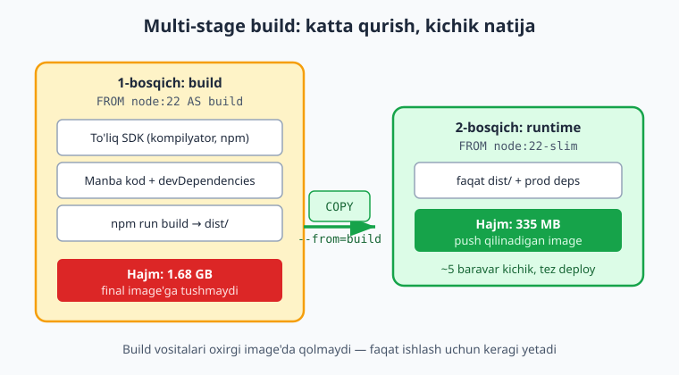
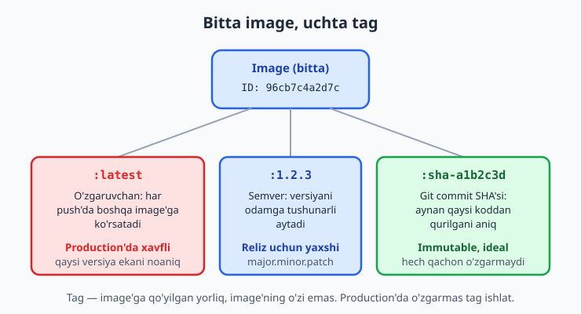
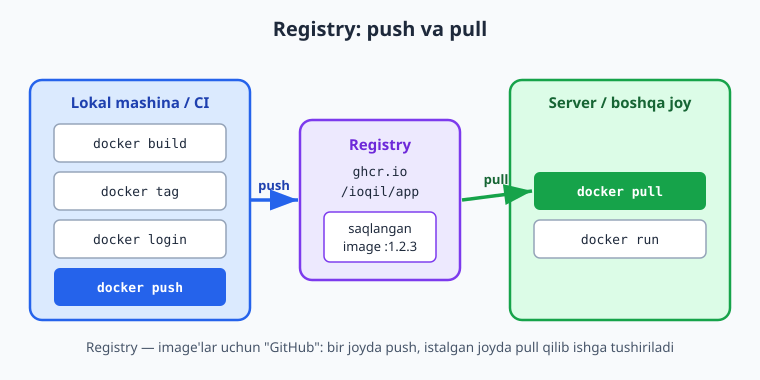

# 09 — Image optimizatsiya va registry

[⬅️ Oldingi: 08 — Dockerfile: o'z image'ingiz](./08-dockerfile.md) · [🏠 README](./README.md) · [Keyingi: 10 — Volume va Docker tarmog'i ➡️](./10-volume-network.md)

> **Bu bobda:** Image hajmi nega muhimligidan boshlab — `multi-stage build` bilan build vositalarini oxirgi image'dan chiqarib tashlaymiz, kichik base image'lar (`alpine`, `-slim`, `distroless`) farqini ko'ramiz, `RUN` qatlamlarini birlashtirib hajmni qisqartiramiz, `docker history`/`docker images` bilan hajmni o'lchaymiz, `latest`/semver/git-sha tag strategiyasini va `immutable` taglarni o'rganamiz, image'ni `docker login`/`docker tag`/`docker push`/`docker pull` bilan registry'ga (Docker Hub va GHCR) chiqaramiz, va `docker scout`/Trivy bilan zaiflik skanini boshlaymiz.

---

## Muammo: 1.7 gigabaytlik "Salom dunyo"

08-bobda biz Dockerfile yozib, o'z image'imizni qurdik. U ishladi — lekin keling, hajmiga qaraylik. Oddiy Node.js ilovasini to'liq `node:22` base'idan qurganimizda, image **1.68 GB** chiqdi. Ichida bir nechta yuz kilobayt kodimiz bor, qolgani — kompilyator, `npm`, build vositalari, devDependencies va biz ishlatmaydigan minglab fayl.

Bu nega muhim? Tasavvur qiling, har `git push`'da CI shu 1.68 GB'ni registry'ga **push** qiladi, keyin server uni **pull** qiladi. Sekin tarmoqda bu daqiqalar. Endi 50 ta serverga (yoki Kubernetes'da 50 ta Pod'ga) tarqatayotganingizni tasavvur qiling.

📌 Image hajmi to'rt narsaga to'g'ridan-to'g'ri ta'sir qiladi:

- **Tezlik:** kichik image tezroq push/pull bo'ladi — CI tez tugaydi, deploy tez bo'ladi, scaling (yangi nusxa ko'tarish) zudlik bilan.
- **Xavfsizlik:** image ichidagi har bir paket — potensial zaiflik. Kompilyator, `curl`, `bash`, kerasmas kutubxonalar — bularning hammasi **hujum yuzasi** (attack surface). Kamroq paket = kamroq xavf.
- **Narx:** registry saqlash va tarmoq trafigi pul turadi. Katta image'lar kunlik build'larda tez yig'iladi.
- **Disk:** serverda ham, CI runner'da ham joy band qiladi.

Bu bobda 1.68 GB'ni **335 MB**'gacha — taxminan **5 baravar** — kichraytiramiz. Va bu raqamlar haqiqiy: quyidagi konfiguratsiyalarni lokal Docker'da qurib o'lchadik.

---

## Multi-stage build: katta qurish, kichik natija

Asosiy g'oya oddiy: **ilovani qurish uchun kerak bo'lgan narsalar** (kompilyator, build vositalari, devDependencies) **ishga tushirish uchun kerak emas**. Build tugagach, ularni image'da saqlab yurishning ma'nosi yo'q.

`Multi-stage build` — bitta Dockerfile ichida bir nechta `FROM` bosqichi yozish imkonini beradi. Har `FROM` yangi bosqichni boshlaydi. Oxirgi `FROM`dan keyin yozilgani — **final image** bo'ladi; undan oldingilari faqat ish-stoli sifatida ishlatiladi va natijaga tushmaydi. Kerakli artefaktni bir bosqichdan ikkinchisiga `COPY --from=<bosqich>` bilan ko'chiramiz.

Avval kichkina namuna ilovamizni eslaylik — kitob bo'ylab ishlatadigan **vazifalar API** (`vazifalar-api`):

```json
{
  "name": "vazifalar-api",
  "version": "1.2.3",
  "scripts": {
    "build": "node build.js",
    "start": "node dist/server.js"
  },
  "dependencies": { "express": "4.21.2" },
  "devDependencies": { "esbuild": "0.24.2" }
}
```

`esbuild` — faqat build paytida kerak (devDependency). `express` — ishga tushganda kerak (dependency). Build natijasi `dist/` papkasiga tushadi.

### Avval — sodda (single-stage) Dockerfile

```dockerfile
FROM node:22

WORKDIR /app
COPY package.json ./
RUN npm install
COPY . .
RUN npm run build
EXPOSE 3000
CMD ["node", "dist/server.js"]
```

Bu **ishlaydi**, lekin oxirgi image'da to'liq `node:22` (Debian + kompilyator), `esbuild` va boshqa barcha devDependencies qoladi. Hajmi: **1.68 GB**.

### Endi — multi-stage Dockerfile

```dockerfile
# 1-bosqich: build (katta SDK, devDependencies bilan)
FROM node:22 AS build
WORKDIR /app
COPY package.json ./
RUN npm install
COPY . .
RUN npm run build

# 2-bosqich: runtime (faqat kerakli artefakt + prod deps)
FROM node:22-slim AS runtime
WORKDIR /app
ENV NODE_ENV=production
COPY package.json ./
RUN npm install --omit=dev && npm cache clean --force
COPY --from=build /app/dist ./dist
EXPOSE 3000
CMD ["node", "dist/server.js"]
```

Nima o'zgardi:

1. Birinchi `FROM ... AS build` — to'liq SDK'da ilovani quradi. Bu bosqich katta, lekin final image'ga **tushmaydi**.
2. Ikkinchi `FROM node:22-slim AS runtime` — toza, kichik base'dan boshlaydi.
3. `npm install --omit=dev` — faqat production dependency'larni o'rnatadi (`esbuild`siz). `npm cache clean --force` — npm keshini tozalab, qatlamni yengillashtiradi.
4. `COPY --from=build /app/dist ./dist` — build bosqichidan **faqat tayyor artefaktni** ko'chiradi.

Natijada manba kod, devDependencies va build vositalari final image'da yo'q. Hajmi: **335 MB**. Mana bu oqim:



💡 `node:22-slim` o'rniga `--omit=dev` bilan birga yanada kichikroq qilish mumkin (pastda `alpine`/`distroless`'ga qaraymiz). Lekin allaqachon 1.68 GB → 335 MB — bu eng katta yutuq, faqat ikkita `FROM` evaziga.

📌 `COPY --from`ning manzili boshqa image ham bo'lishi mumkin: `COPY --from=nginx:1.27-alpine /etc/nginx/nginx.conf ./`. Lekin odatda u o'zimizning oldingi bosqichimizga (`AS build`) ishora qiladi.

---

## Kichik base: alpine, -slim, distroless

Image hajmining katta qismi — **base image**. Bitta `node:22` ichida butun Debian operatsion tizimi yotadi. Tanlovlar:

| Base | Asos | Taxminiy hajm | Qachon |
|---|---|---|---|
| `node:22` | To'liq Debian | ~1.1 GB | build bosqichi, kompilyatsiya kerak bo'lganda |
| `node:22-slim` | Yengil Debian | ~200 MB | xavfsiz, mos keladigan umumiy tanlov |
| `node:22-alpine` | Alpine Linux (musl) | ~150 MB | eng kichik, lekin ehtiyot kerak |
| `gcr.io/distroless/nodejs22` | Distroless (OS-siz) | ~170 MB | eng xavfsiz production runtime |

**`-slim`** — Debian'ning yengillashtirilgan varianti, kerasmas paketlar olib tashlangan. Eng xavfsiz "default" tanlov: mosligi yuqori, muammo kam.

**`alpine`** — Alpine Linux juda kichik distributiv. Lekin u standart `glibc` o'rniga **`musl libc`** ishlatadi. Ko'p ilovalar uchun farqi yo'q, lekin native (C/C++) modullar `glibc`'ga moslangan bo'lsa — `alpine`'da qurish murakkablashishi yoki sekin ishlashi mumkin.

⚠️ "Alpine = har doim yaxshi" degan tushuncha noto'g'ri. `musl` tufayli DNS xatti-harakati, vaqt mintaqasi, ba'zi native paketlar boshqacha bo'lishi mumkin. Production'ga o'tkazishdan oldin albatta `docker run` bilan sinab ko'ring. Shubha bo'lsa — `-slim` ishonchliroq.

**`distroless`** — Google'ning image'lari: ichida operatsion tizim qobig'i (`shell`), paket menejeri, `bash` umuman **yo'q**. Faqat sizning ilovangiz va uning runtime'i (masalan Node yoki Python). Bu eng xavfsiz: hujumchi konteynerga kirsa ham, ishlatadigan hech narsasi yo'q. Kamchiligi — debug qiyin (`docker exec ... sh` ishlamaydi), shuning uchun ko'pincha `multi-stage`ning oxirgi bosqichi sifatida ishlatiladi.

💡 Tartib: ishlab chiqishda `-slim`, ishonch hosil qilgach production'da `distroless`. `alpine`'ni faqat hajm juda muhim bo'lganda va native modulingiz yo'q bo'lsa tanlang.

---

## Layer (qatlam) kamaytirish

08-bobda ko'rganimizdek, Dockerfile'dagi har bir `RUN`, `COPY`, `ADD` yangi **qatlam** (layer) yaratadi. Qatlamlar bir-birining ustiga qo'yiladi va o'chirilmaydi: agar bir qatlamda fayl yaratib, keyingisida o'chirsangiz, fayl o'chgan ko'rinadi, lekin **hajm baribir saqlanadi** (eski qatlamda yotadi).

❌ Eski/yomon usul — har biri alohida `RUN`, kesh tozalanmaydi:

```dockerfile
RUN apt-get update
RUN apt-get install -y git curl
```

Bu uchta muammo: (1) ortiqcha qatlamlar, (2) `apt` keshi (`/var/lib/apt/lists/*`) image ichida qoladi, (3) `apt-get update` keshi eski bo'lib, keyin notog'ri paket o'rnatilishi mumkin.

✅ To'g'ri usul — bitta `RUN`'da birlashtirish, `--no-install-recommends` va keshni o'sha qatlamning o'zida tozalash:

```dockerfile
RUN apt-get update \
    && apt-get install -y --no-install-recommends git curl \
    && rm -rf /var/lib/apt/lists/*
```

- `&&` bilan birlashtirilgani — hammasi **bitta qatlam**.
- `--no-install-recommends` — tavsiya qilingan, lekin majburiy bo'lmagan paketlarni o'tkazib yuboradi.
- `rm -rf /var/lib/apt/lists/*` — `apt` keshini **o'sha qatlam ichida** o'chiradi, shuning uchun hajmga qo'shilmaydi.

📌 Umumiy qoida: "yaratib-o'chirish" amallari **bitta `RUN` ichida** bo'lsin. Boshqa qatlamda o'chirilgan fayl hajmni baribir oshiradi.

`alpine`'da bu `apk` bilan o'xshash:

```dockerfile
RUN apk add --no-cache git curl
```

`--no-cache` — `apk`'da keshni umuman saqlamaydi, alohida `rm` shart emas.

💡 `COPY` tartibi ham muhim — bu kesh masalasi (08-bobda ko'rganmiz): kam o'zgaradigan narsalarni (`package.json` + `npm install`) avval, tez-tez o'zgaradigan kodni (`COPY . .`) keyin qo'ying. Shunda kod o'zgarganda `npm install` qatlami keshdan olinadi va build tezlashadi.

---

## Hajmni o'lchash: docker images va docker history

Optimizatsiya qildingiz — endi qancha foyda berganini **o'lchang**. Ikki asosiy buyruq.

`docker images` — image'lar ro'yxati va hajmi:

```bash
docker images vazifalar-api
```

```text
REPOSITORY      TAG       SIZE
vazifalar-api   multi     335MB
vazifalar-api   single    1.68GB
```

Mana, single-stage va multi-stage farqi ko'z oldida.

`docker history` — image qaysi qatlamlardan tashkil topganini va har biri qancha joy egallaganini ko'rsatadi:

```bash
docker history vazifalar-api:multi --format '{{.Size}}\t{{.CreatedBy}}'
```

```text
0B       CMD ["node" "dist/server.js"]
0B       EXPOSE map[3000/tcp:{}]
16.4kB   COPY /app/dist ./dist
7.41MB   RUN npm install --omit=dev && npm cache clean --force
12.3kB   COPY package.json ./
0B       ENV NODE_ENV=production
8.19kB   WORKDIR /app
154MB    RUN ... node yuklash
85.3MB   debian bookworm slim base
```

Bu juda foydali: ko'rib turibsizki, hajmning katta qismi **base image** (Debian + Node), bizning ilova kodimiz esa atigi 16 kB. Qaysidir qatlam kutilmaganda katta bo'lsa (masalan keshni tozalashni unutgan bo'lsangiz) — shu yerda darrov ko'rinadi.

💡 Chuqurroq tahlil uchun **`dive`** degan vosita bor (`wagoodman/dive`) — har qatlamni interaktiv ochib, qaysi fayllar joy egallayotganini ko'rsatadi va "bekorga ketgan" joyni belgilaydi. Bu bobda kerak emas, lekin bilib qo'ying.

---

## Tag strategiyasi: latest, semver va git sha

Image qurganimizdan keyin unga **tag** (yorliq) qo'yamiz. Tag — image'ning o'ziga emas, balki bir image'ga **ishora qiluvchi nom**. Bitta image'ga bir nechta tag qo'yish mumkin, hammasi bitta `Image ID`'ga ko'rsatadi.

```bash
docker tag vazifalar-api:multi ghcr.io/ioqil/vazifalar-api:1.2.3
docker tag vazifalar-api:multi ghcr.io/ioqil/vazifalar-api:sha-a1b2c3d
docker tag vazifalar-api:multi ghcr.io/ioqil/vazifalar-api:latest
```

Buni lokalda qurib tekshirganimizda, uchala tag ham bitta `Image ID`'ga (`96cb7c4a2d7c`) ko'rsatdi — ya'ni bir image, uchta nom:

```text
REPOSITORY                    TAG           IMAGE ID
ghcr.io/ioqil/vazifalar-api   1.2.3         96cb7c4a2d7c
ghcr.io/ioqil/vazifalar-api   latest        96cb7c4a2d7c
ghcr.io/ioqil/vazifalar-api   sha-a1b2c3d   96cb7c4a2d7c
```



### `latest` nega xavfli (production'da)

`:latest` — shunchaki bir tag. "Eng yangi" degani **emas** — uni har push'da boshqa image'ga ko'chirib turasiz. Muammosi:

- Server `docker pull ...:latest` qilganda **qaysi versiya kelishi noaniq** — bugun bir, ertaga boshqa.
- Rollback qilolmaysiz: oldingi `latest` qayerda — bilmaysiz.
- Ikki server `latest` pull qilsa, **turli vaqtda turli image** olishi mumkin.

⚠️ Production deploy'da hech qachon `:latest`'ga tayanmang. U faqat lokal tajriba yoki "har doim eng yangisi mayli" bo'lgan joy uchun.

### Semver: `1.2.3`

Semantic versioning — `major.minor.patch`. Odamga tushunarli: `1.2.3` — bu aniq reliz. Patch (`1.2.4`) — buzilmaydigan tuzatish, minor (`1.3.0`) — yangi imkoniyat, major (`2.0.0`) — orqaga moslik buziladi. Reliz'larni belgilash uchun ideal.

### Git SHA: `sha-a1b2c3d`

Eng aniqi: image'ni qaysi **git commit**'dan qurganingizni tag'ga yozasiz. `sha-a1b2c3d` ko'rsangiz — aynan qaysi koddan qurilganini bir zumda topasiz. CI'da bu odatda avtomatik qo'yiladi (14-bobda `docker/metadata-action` buni o'zi qiladi).

📌 **Immutable tag** — bir marta push qilingach **hech qachon o'zgarmaydigan** tag. `1.2.3` va `sha-a1b2c3d` — immutable bo'lishi kerak: `1.2.3` deganingiz doim o'sha image bo'lsin. `latest` esa tabiatan o'zgaruvchan (mutable). Production'da immutable tag = ishonchli, takrorlanadigan deploy va oson rollback.

💡 Amaliy yondashuv: har deploy'ga `sha-...` yoki `1.2.3` ishlat (immutable), `latest`'ni esa qulaylik uchun yonida saqla, lekin unga **tayanma**.

---

## Registry: image'ni dunyoga chiqarish

Image'ni lokalda qurdik — endi uni boshqa joyga (serverga, hamkasbga, CI'ga) yetkazish kerak. Buning yo'li — **registry**. Registry image'lar uchun "GitHub" kabi: bir joyda **push** qilasiz, istalgan joyda **pull** qilib ishga tushirasiz.



Ikki ommabop registry:

- **Docker Hub** — eng mashhur, jamoat image'lari (`node`, `nginx` shu yerdan keladi). Nom: `docker.io/<user>/<image>` (`docker.io/` odatda yozilmaydi).
- **GHCR** — GitHub Container Registry, `ghcr.io/<user>/<image>`. GitHub repo'ngiz bilan birga keladi, GitHub Actions'da `GITHUB_TOKEN` bilan oson ulanadi (14-bobning asosiy yo'li). Kitobda asosan **GHCR** ishlatamiz.

To'liq oqim — build, tag, login, push:

```bash
# 1. Image qurish
docker build -t vazifalar-api:multi .

# 2. Registry manzili bilan tag qo'yish
docker tag vazifalar-api:multi ghcr.io/ioqil/vazifalar-api:1.2.3

# 3. Registry'ga kirish (GHCR uchun GitHub token bilan)
echo "$GHCR_TOKEN" | docker login ghcr.io -u ioqil --password-stdin

# 4. Push
docker push ghcr.io/ioqil/vazifalar-api:1.2.3
```

Boshqa joyda (serverda) esa shunchaki:

```bash
docker pull ghcr.io/ioqil/vazifalar-api:1.2.3
docker run -d -p 3000:3000 ghcr.io/ioqil/vazifalar-api:1.2.3
```

ℹ️ **Illustrativ:** yuqoridagi `docker login`/`docker push` real registry hisobi va token talab qiladi (GHCR uchun GitHub `Personal Access Token` yoki Actions'da `GITHUB_TOKEN`). Bu bobda biz `tag`'ni lokal qurib tekshirdik, lekin **push qilmadik** — uni o'z hisobingizda bajaring. Parolni hech qachon to'g'ridan-to'g'ri buyruqqa yozmang: `--password-stdin` bilan stdin orqali bering (terminal tarixiga tushmaydi). CI'da bu butunlay avtomatlashtiriladi — 14-bobda ko'ramiz.

📌 GHCR'da repository standart holatda **private** (yopiq). Pull qilish uchun yo login kerak, yoki uni GitHub'da "public" qilib qo'yasiz. Image GitHub repo'ngiz sahifasidagi "Packages" bo'limida ko'rinadi.

---

## Zaiflik skani: docker scout va Trivy (kirish)

Kichik image — kam paket — kam zaiflik. Lekin "kam" degani "nol" emas. Image ichidagi paketlar ma'lum xavfsizlik zaifliklariga (`CVE` — Common Vulnerabilities and Exposures) ega bo'lishi mumkin. Ularni **skanerlash** kerak.

Docker o'rnatilgan vositasi — **`docker scout`**:

```bash
docker scout cves vazifalar-api:multi
```

Bu image ichidagi paketlarni ma'lum CVE bazasi bilan solishtirib, topilgan zaifliklarni jiddiyligi (`critical`/`high`/`medium`/`low`) bo'yicha ko'rsatadi.

Mustaqil, mashhur muqobil — **Trivy** (Aqua Security):

```bash
trivy image ghcr.io/ioqil/vazifalar-api:1.2.3
```

```text
Total: 4 (HIGH: 3, CRITICAL: 1)
```

ℹ️ **Illustrativ:** `docker scout` (Docker Hub hisobi bilan ishlaydi) va `trivy` (alohida o'rnatiladi) ham internetga ulanib, yangilanib turadigan CVE bazasini yuklab oladi. Yuqoridagi chiqish — namuna ko'rinish, raqamlar sizning image'ingizga qarab boshqacha bo'ladi.

📌 Bu — faqat **kirish**. Zaiflik skanini CI pipeline'iga qo'shib, har build'da avtomatik tekshirish va `critical` topilsa deploy'ni to'xtatishni **14-bobda** (Docker image CI va GHCR) batafsil ko'ramiz. Hozircha asosiy fikr: kichik base + skanerlash = xavfsiz image.

💡 Eng samarali zaiflik kamaytirish — `distroless` yoki `-slim` base ishlatish va base image'larni muntazam yangilab turish (`docker pull node:22-slim` bilan eng yangi patch'larni olish).

---

## 09-bob mashqlari

> Quyidagi mashqlarni lokal Docker bilan bajaring. `docker build`/`docker images`/`docker history`/`docker tag` — hammasi lokalda ishlaydi. `docker push`/`docker scout`/`trivy` — hisob talab qiladi (illustrativ).

**Oson**

1. Bir `Dockerfile` yozing: `FROM node:22`, keyin `node:22-slim`. Ikkalasini `docker build -t test:full .` va `:slim` deb quring, `docker images test` bilan hajm farqini taqqoslang.
2. `docker history <image>` ishga tushiring va eng katta uchta qatlamni toping. Ular nima?
3. Bitta image'ga uchta tag qo'ying (`docker tag`): `:1.0.0`, `:latest`, `:sha-abc123`. `docker images` bilan ularning `Image ID`'si bir xil ekanini ko'ring.
4. Quyidagi qaysi base eng kichik, qaysi eng xavfsiz, qaysi `musl libc` ishlatadi: `node:22`, `node:22-slim`, `node:22-alpine`, `distroless`?

**O'rta**

5. Quyidagi yomon `RUN` blokini bitta optimallashtirilgan `RUN`'ga birlashtiring: `apt-get update` + `apt-get install -y git curl` (alohida qatorlarda, kesh tozalanmagan).
6. `:latest` tagi production'da nega xavfli? Uch sabab keltiring.
7. `multi-stage` Dockerfile'da `COPY --from=build /app/dist ./dist` qatori nima qiladi? `--from` bo'lmasa nima bo'lardi?
8. Bir GHCR manzilini to'g'ri yozing: foydalanuvchi `aziz`, image `blog`, versiya `2.1.0`. To'liq nom qanday?
9. `npm install` va `npm install --omit=dev` farqi nima? Multi-stage'ning qaysi bosqichida qaysi birini ishlatasiz?

**Qiyin**

10. Berilgan namuna ilova uchun to'liq `multi-stage` Dockerfile yozing: build bosqichi `node:22`'da `npm install` + `npm run build`, runtime bosqichi `node:22-slim`'da faqat prod deps + `dist/`. `docker build` qiling va single-stage'dan kichikligini `docker images` bilan isbotlang.

<details markdown="1"><summary>Yechim</summary>

```dockerfile
# 1-bosqich: build
FROM node:22 AS build
WORKDIR /app
COPY package.json ./
RUN npm install
COPY . .
RUN npm run build

# 2-bosqich: runtime
FROM node:22-slim AS runtime
WORKDIR /app
ENV NODE_ENV=production
COPY package.json ./
RUN npm install --omit=dev && npm cache clean --force
COPY --from=build /app/dist ./dist
EXPOSE 3000
CMD ["node", "dist/server.js"]
```

Qurish va o'lchash:

```bash
docker build -t vazifalar-api:multi .
docker images vazifalar-api
```

Build bosqichi devDependencies va kompilyatorni ishlatadi, lekin final image'ga faqat `dist/` + prod deps tushadi. Bizning sinovda 1.68 GB → 335 MB (~5 baravar kichik). `--omit=dev` runtime bosqichida `esbuild` kabi dev paketlarni tashlab ketadi; `npm cache clean --force` keshni o'sha qatlamda tozalaydi.

</details>

11. Quyidagi Dockerfile bir muammoga ega: kod biroz o'zgarganda ham har build'da `npm install` qaytadan ishlaydi (sekin). Sababini toping va tuzating.

```dockerfile
FROM node:22-slim
WORKDIR /app
COPY . .
RUN npm install
CMD ["node", "server.js"]
```

<details markdown="1"><summary>Yechim</summary>

Muammo: `COPY . .` hamma narsani (kodni ham) bir qatlamda ko'chiradi. Kod o'zgarsa, shu qatlam keshi buziladi va keyingi `RUN npm install` qaytadan ishlaydi — garchi `package.json` o'zgarmagan bo'lsa ham.

Yechim — bog'liqliklar faylini alohida, kod oldidan ko'chirish:

```dockerfile
FROM node:22-slim
WORKDIR /app
COPY package.json package-lock.json ./
RUN npm ci
COPY . .
CMD ["node", "server.js"]
```

Endi `package.json` o'zgarmasa, `npm ci` qatlami keshdan olinadi va kod o'zgarishi build'ni tezlashtiradi. (`npm ci` — `package-lock.json`'ga aniq mos o'rnatadi, CI uchun afzal.)

</details>

12. Optimizatsiya qilingan image'ni GHCR'ga chiqarish uchun to'liq buyruqlar ketma-ketligini yozing: build → tag (`1.0.0`) → login → push. Foydalanuvchi `aziz`, image `vazifalar-api`. Keyin uni boshqa serverda pull qilib run qilishni ko'rsating.

<details markdown="1"><summary>Yechim</summary>

```bash
# Lokal: qurish, tag, login, push
docker build -t vazifalar-api:multi .
docker tag vazifalar-api:multi ghcr.io/aziz/vazifalar-api:1.0.0
echo "$GHCR_TOKEN" | docker login ghcr.io -u aziz --password-stdin
docker push ghcr.io/aziz/vazifalar-api:1.0.0

# Serverda: pull va run
docker pull ghcr.io/aziz/vazifalar-api:1.0.0
docker run -d -p 3000:3000 ghcr.io/aziz/vazifalar-api:1.0.0
```

Eslatma (illustrativ): `login`/`push`/`pull` real GHCR hisobi va token talab qiladi. `GHCR_TOKEN` — GitHub `Personal Access Token` (`write:packages` ruxsati bilan). Parolni `--password-stdin` orqali bering, buyruqqa to'g'ridan-to'g'ri yozmang. Immutable tag (`1.0.0`) ishlatdik — `latest` emas.

</details>

13. `docker scout cves <image>` yoki `trivy image <image>` ni o'z image'ingizda ishga tushiring. Nechta `critical`/`high` zaiflik topildi? Base'ni `-slim`'ga o'zgartirsangiz, kamayadimi?

<details markdown="1"><summary>Yechim</summary>

```bash
docker scout cves vazifalar-api:multi
# yoki
trivy image vazifalar-api:multi
```

(Illustrativ — bu vositalar internetdan CVE bazasini yuklaydi.) Odatda `node:22` (to'liq Debian) `node:22-slim`'dan ko'proq paket, demak ko'proq potensial CVE oladi. Base'ni `-slim` yoki `distroless`'ga o'zgartirib, qayta skanerlasangiz, zaifliklar soni kamayishini ko'rasiz — chunki kamroq paket = kamroq hujum yuzasi. Eng yaxshi amaliyot: base image'ni muntazam yangilab (`docker pull`), eng yangi xavfsizlik patch'larini olib turish.

</details>

---

[⬅️ Oldingi: 08 — Dockerfile: o'z image'ingiz](./08-dockerfile.md) · [🏠 README](./README.md) · [Keyingi: 10 — Volume va Docker tarmog'i ➡️](./10-volume-network.md)
