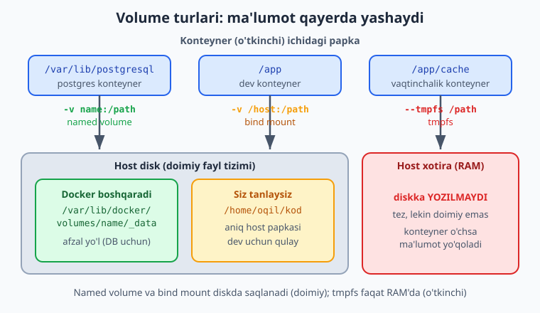
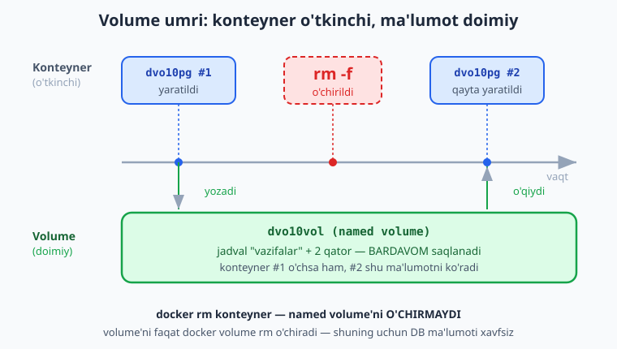
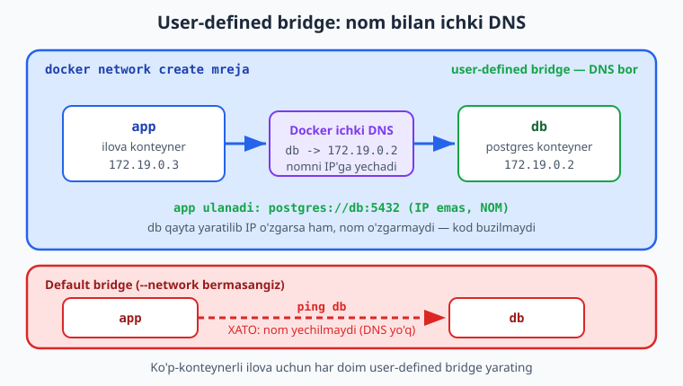

# 10 — Volume va Docker tarmog'i

[⬅️ Oldingi: 09 — Image optimizatsiya va registry](./09-image-optimizatsiya.md) · [🏠 README](./README.md) · [Keyingi: 11 — Docker Compose ➡️](./11-docker-compose.md)

> **Bu bobda:** konteyner o'chganda ma'lumotning yo'qolishi muammosini (ephemeral fayl tizimi) hal qilamiz — **volume** turlari (named volume, bind mount, tmpfs), `-v` va `--mount` sintaksisi, `docker volume create/ls/inspect/rm/prune`; haqiqiy postgres konteyneriga jadval yozib, konteynerni o'chirib qayta yaratganda ma'lumot saqlanishini ko'rsatamiz; so'ng **Docker network** — default bridge va user-defined bridge farqi (ichki DNS bilan konteynerlar bir-birini **nom** orqali topishi), `host`/`none` rejimlar, `docker network create/ls/inspect/connect`, hamda port publish (`-p`) bilan ichki tarmoq aloqasi orasidagi xavfsizlik farqi.

---

## Muammo: konteyner o'chsa, ma'lumot yo'qoladi

Tasavvur qiling: postgres'ni konteynerda ishga tushirdingiz, ichiga jadval va yuzlab qator yozdingiz. Ertasi kuni image'ni yangilamoqchi bo'lib konteynerni o'chirib (`docker rm`) qayta yaratdingiz — va **hamma ma'lumot yo'q**. Bo'sh baza. Bu sizning xatoyingiz emas: bu Docker'ning ataylab qilingan dizayni.

Konteynerning fayl tizimi **ephemeral** (o'tkinchi) — u image qatlamlari ustiga qo'shilgan ingichka "writable layer"da yashaydi. Konteyner o'chsa, shu qatlam ham o'chadi. Bu image'lar uchun zo'r (toza, takrorlanadigan), lekin **ma'lumotlar bazasi, yuklangan fayllar, loglar** uchun halokat.

```bash
docker run -d --name baza -e POSTGRES_PASSWORD=test postgres:16-alpine
# ... ichiga ma'lumot yozdingiz ...
docker rm -f baza      # konteyner o'chdi
docker run -d --name baza -e POSTGRES_PASSWORD=test postgres:16-alpine
# baza BO'SH — ma'lumot yo'q
```

> 📌 **Asosiy qoida:** saqlanishi kerak bo'lgan har qanday ma'lumotni konteyner ichida QOLDIRMANG. Uni konteynerdan **tashqaridagi** doimiy joyga — **volume**'ga chiqaring. Konteyner — o'tkinchi, volume — doimiy.

Yechim: konteyner ichidagi muayyan papkani (masalan postgres uchun `/var/lib/postgresql/data`) konteyner umridan **mustaqil** yashaydigan saqlash joyiga ulaymiz. Bu joy — **volume**.

---

## Volume turlari

Docker'da ma'lumotni saqlashning uch yo'li bor. Quyidagi diagramma uchovi host (asosiy kompyuter) fayl tizimi va xotirasiga qanday bog'lanishini ko'rsatadi.



### 1. Named volume — afzal yo'l

**Named volume** (nomlangan volume) — Docker o'zi boshqaradigan, nomi bor saqlash joyi. Docker uni host'da maxsus papkada saqlaydi (Linux'da `/var/lib/docker/volumes/<nom>/_data`) va siz to'g'ridan-to'g'ri papka yo'lini bilishingiz shart emas — faqat **nom** bilan murojaat qilasiz.

```bash
docker volume create maydonlar       # named volume yaratish
docker run -d --name baza \
  -e POSTGRES_PASSWORD=test \
  -v maydonlar:/var/lib/postgresql/data \
  postgres:16-alpine
```

Bu yerda `-v maydonlar:/var/lib/postgresql/data` degani: `maydonlar` nomli volume'ni konteyner ichidagi `/var/lib/postgresql/data` papkaga ula. Postgres shu papkaga yozadi — demak hamma ma'lumot volume'ga tushadi.

> 💡 **Afzal yo'l shu.** Production'da, ayniqsa DB uchun, **named volume** ishlating. Docker uni boshqaradi (huquqlar, drayver, backup nuqtasi), host papka strukturasiga bog'lanib qolmaysiz, va boshqa mashinaga ko'chirish osonroq.

### 2. Bind mount — dev uchun qulay

**Bind mount** — host'dagi **aniq papkani** konteynerga ulash. Siz host yo'lini o'zingiz ko'rsatasiz:

```bash
docker run -d --name web \
  -v /home/oqil/loyiha/kod:/app \
  node:22-alpine
```

Bu yerda host'dagi `/home/oqil/loyiha/kod` papkasi konteyner ichidagi `/app` ga ulanadi. Host'da faylni tahrirlasangiz, konteyner ichida ham **darhol** o'zgaradi — shuning uchun bind mount **ishlab chiqish (dev)** uchun ideal: kodni mahalliy tahrirlaysiz, konteyner darrov ko'radi, qayta build qilish shart emas.

> ⚠️ **Bind mount = host'ga to'g'ridan-to'g'ri ulanish.** Konteyner shu papkadagi fayllarni o'chirishi/o'zgartirishi mumkin. Production DB uchun bind mount tavsiya etilmaydi: host yo'liga, huquqlarga va host fayl tizimiga bog'lanib qolasiz. Dev'da kod uchun — a'lo; production ma'lumot uchun — named volume.

📌 Yo'l ajratish farqi: `-v` qiymatida **nom** bo'lsa (`maydonlar:/app`) — bu **named volume**; **absolyut yo'l** bo'lsa (`/home/oqil/...:/app` yoki `.:/app`) — bu **bind mount**. Docker `/` belgisiga qarab ajratadi.

### 3. tmpfs — xotirada, vaqtinchalik

**tmpfs mount** — ma'lumotni diskka emas, host'ning **operativ xotirasiga** (RAM) yozadi. Konteyner o'chsa — yo'qoladi. Bu maxfiy vaqtinchalik fayllar (parol, token kesh) yoki tez, lekin saqlanishi shart bo'lmagan ma'lumot uchun.

```bash
docker run -d --name vaqtinchalik \
  --tmpfs /app/cache \
  alpine sleep 600
```

> ℹ️ tmpfs faqat Linux host'da ishlaydi. Diskka hech narsa yozilmaydi — tez, lekin doimiy emas.

### `-v` va `--mount` — ikki sintaksis

Volume ulashning ikki yozuvi bor — ikkalasi ham ishlaydi:

```bash
# qisqa sintaksis (-v): NAME:TARGET[:OPTIONS]
docker run -v maydonlar:/var/lib/postgresql/data postgres:16-alpine

# aniq sintaksis (--mount): key=value juftliklari
docker run --mount type=volume,source=maydonlar,target=/var/lib/postgresql/data postgres:16-alpine
```

Farqi: `--mount` **batafsil va aniq** (har bir parametr nomi bilan: `type`, `source`, `target`, `readonly`), `-v` esa **qisqa**. Docker rasmiy hujjatlari yangi loyihalar uchun `--mount`ni tavsiya qiladi (xatoga kam yo'l qo'yadi), lekin amaliyotda `-v` hamon eng ko'p ishlatiladi. Misol uchun `readonly` (faqat o'qish):

```bash
docker run --mount type=volume,source=konfig,target=/etc/app,readonly nginx:1.27-alpine
# -v ekvivalenti:  -v konfig:/etc/app:ro
```

---

## Volume buyruqlari

```bash
docker volume create maydonlar        # yaratish
docker volume ls                      # barcha volume'lar ro'yxati
docker volume inspect maydonlar       # batafsil (jumladan host'dagi joyi)
docker volume rm maydonlar            # o'chirish (foydalanilmayotgan bo'lsa)
docker volume prune                   # foydalanilmayotgan barcha volume'larni tozalash
```

`docker volume inspect` ma'lumot qayerda yotganini ko'rsatadi:

```bash
docker volume inspect maydonlar --format '{{.Mountpoint}}'
```
```text
/var/lib/docker/volumes/maydonlar/_data
```

> ⚠️ **`docker volume prune` ehtiyot bo'lib ishlating.** U hech bir konteyner ishlatmayotgan volume'larni o'chiradi — undagi ma'lumot bilan birga. Agar konteyner vaqtincha o'chgan, lekin volume keyin kerak bo'lsa, `prune` uni ham yo'q qilishi mumkin. `-a` (`--all`) bayrog'i esa nom berilgan volume'larni ham o'chiradi. Production'da o'ylab ishlating.

📌 Muhim nuqta: `docker rm konteyner` konteyner bilan bog'langan **named volume'ni o'chirmaydi** — shuning uchun ma'lumot saqlanadi. Volume'ni faqat `docker volume rm` yoki `docker rm -v` (anonim volume'lar uchun) o'chiradi.

---

## Amaliyot: postgres ma'lumoti konteynerdan omon qoladi

Endi eng muhim isbotni qilamiz: konteynerni o'chirib qayta yaratsak ham, named volume'dagi ma'lumot **saqlanib qoladi**. Quyidagi qadamlar haqiqatan lokal Docker'da sinab ko'rilgan.

Quyidagi diagramma volume "umr chizig'i"ni ko'rsatadi: konteyner o'chib qayta yaralsa ham, volume va undagi ma'lumot joyida qoladi.



**1-qadam — volume yarating va postgres'ni ulang:**

```bash
docker volume create dvo10vol
docker run -d --name dvo10pg \
  -e POSTGRES_PASSWORD=test \
  -v dvo10vol:/var/lib/postgresql/data \
  postgres:16-alpine
```

Postgres tayyor bo'lishini kuting (bir necha soniya), keyin tekshiring:

```bash
docker exec dvo10pg pg_isready -U postgres
```
```text
/var/run/postgresql:5432 - accepting connections
```

**2-qadam — jadval yarating va qator yozing:**

```bash
docker exec dvo10pg psql -U postgres -c \
  "CREATE TABLE vazifalar (id serial PRIMARY KEY, matn text);"
docker exec dvo10pg psql -U postgres -c \
  "INSERT INTO vazifalar (matn) VALUES ('volume sinovi'), ('ikkinchi qator');"
docker exec dvo10pg psql -U postgres -c "SELECT * FROM vazifalar;"
```
```text
 id |      matn
----+----------------
  1 | volume sinovi
  2 | ikkinchi qator
(2 rows)
```

**3-qadam — konteynerni butunlay o'chiring:**

```bash
docker rm -f dvo10pg
```
```text
dvo10pg
```

Konteyner endi yo'q. Lekin volume omon: `docker volume ls` da `dvo10vol` hali turibdi.

**4-qadam — SHU volume bilan yangi konteyner yarating va ma'lumotni tekshiring:**

```bash
docker run -d --name dvo10pg \
  -e POSTGRES_PASSWORD=test \
  -v dvo10vol:/var/lib/postgresql/data \
  postgres:16-alpine
# tayyor bo'lguncha kuting...
docker exec dvo10pg psql -U postgres -c "SELECT * FROM vazifalar;"
```
```text
 id |      matn
----+----------------
  1 | volume sinovi
  2 | ikkinchi qator
(2 rows)
```

**Ma'lumot joyida!** Konteyner yangi, lekin jadval va ikkala qator saqlanib qoldi — chunki ular konteynerda emas, **volume'da** yashagan. Aynan shu narsa production DB uchun hayotiy.

**Tozalash** (mashqdan keyin):

```bash
docker rm -f dvo10pg
docker volume rm dvo10vol
```

> 💡 **Sir:** image'ni yangilash (masalan `postgres:16-alpine` dan keyingi versiyaga o'tish) — volume tufayli xavfsiz: eski konteynerni o'chirasiz, yangi image bilan qayta yaratasiz, ma'lumot o'sha volume'dan keladi. Konteyner — almashtiriladigan qism, volume — qadrli yadro.

---

## Docker network: konteynerlar qanday gaplashadi

Ilovangiz odatda yolg'iz emas: `web` konteyner `db` konteynerga, `db` esa `cache` (redis) ga ulanishi kerak. Ular bir-birini qanday topadi? Docker har bir konteynerga IP beradi, lekin IP har ishga tushganda o'zgarishi mumkin — IP'ga bog'lanib qolish mo'rt. Yechim — **Docker network** va undagi **ichki DNS**.

Tarmoq turlari (drayverlari):

| Tur | Tavsif | Qachon |
|---|---|---|
| **bridge** (default) | Standart yakka-host tarmog'i. Yangi konteyner avtomatik shu yerga tushadi. | Oddiy holatlar |
| **user-defined bridge** | O'zingiz yaratgan bridge — **ichki DNS bor** (konteyner nomi bilan topiladi). | **Ko'p-konteynerli ilova — afzal** |
| **host** | Konteyner host'ning tarmog'ini to'g'ridan-to'g'ri ishlatadi (izolyatsiya yo'q). | Maxsus, yuqori unumdorlik kerak bo'lsa |
| **none** | Tarmoq umuman yo'q (to'liq izolyatsiya). | Tarmoqsiz ishlash kerak bo'lsa |

### Default bridge vs user-defined bridge — eng muhim farq

Bu bobning eng muhim nuqtasi. **Default** bridge'da konteynerlar bir-birini faqat **IP** orqali topadi — nom bilan emas. **User-defined** bridge'da esa Docker o'rnatilgan **DNS server** ishga tushiradi: konteynerlar bir-birini **nom** orqali topadi.

```bash
# ❌ ESKI / ZAIF USUL: default bridge — nom bilan topilmaydi
docker run -d --name db alpine sleep 600
docker run -d --name app alpine sleep 600
docker exec app ping db        # XATO: "bad address 'db'" — nom yechilmaydi
```

```bash
# ✅ TO'G'RI: user-defined bridge — nom bilan topiladi
docker network create mreja
docker run -d --name db  --network mreja alpine sleep 600
docker run -d --name app --network mreja alpine sleep 600
docker exec app ping db        # ISHLAYDI: db nomi IP'ga yechiladi
```

Quyidagi diagramma user-defined bridge'dagi ichki DNS'ni ko'rsatadi: `app` konteyner `db` konteynerni IP emas, **nom** orqali topadi.



> 📌 **Qoida:** ko'p-konteynerli ilova qursangiz, HAR DOIM **user-defined bridge** yarating va konteynerlarni shunga ulang. Shunda ulanish manzili IP emas, barqaror **nom** bo'ladi (`postgres://db:5432`, `redis://cache:6379`). IP'ni hech qachon qo'lda yozmang. (11-bobdagi Docker Compose buni avtomatik qiladi.)

### Network buyruqlari

```bash
docker network create mreja            # user-defined bridge yaratish
docker network ls                      # tarmoqlar ro'yxati
docker network inspect mreja           # batafsil (ulangan konteynerlar, IP'lar)
docker network connect mreja konteyner # ishlab turgan konteynerni tarmoqqa ulash
docker network disconnect mreja konteyner   # tarmoqdan uzish
docker network rm mreja                # o'chirish
docker network prune                   # foydalanilmayotgan tarmoqlarni tozalash
```

---

## Amaliyot: ikki konteyner bir-birini nom bilan topadi

Quyidagi mashq haqiqatan lokal Docker'da sinab ko'rilgan: bitta tarmoq yaratamiz, ikki konteynerni shunga ulaymiz va biri ikkinchisini **nom** orqali topishini ko'rsatamiz.

**1-qadam — tarmoq yarating:**

```bash
docker network create dvo10net
docker network inspect dvo10net --format 'driver={{.Driver}}'
```
```text
driver=bridge
```

**2-qadam — ikki konteyner shu tarmoqda:**

```bash
docker run -d --name dvo10db  --network dvo10net alpine sleep 600
docker run -d --name dvo10app --network dvo10net alpine sleep 600
```

**3-qadam — `app` konteyneridan `db` ni NOM bilan toping:**

```bash
docker exec dvo10app getent hosts dvo10db
```
```text
172.19.0.2        dvo10db  dvo10db
```

Nom (`dvo10db`) IP'ga (`172.19.0.2`) yechildi — buni Docker'ning ichki DNS'i qildi. Endi ping:

```bash
docker exec dvo10app ping -c 2 dvo10db
```
```text
PING dvo10db (172.19.0.2): 56 data bytes
64 bytes from 172.19.0.2: seq=0 ttl=64 time=0.311 ms
64 bytes from 172.19.0.2: seq=1 ttl=64 time=0.084 ms
```

Teskari yo'nalish ham ishlaydi (`db` dan `app` ni topish) — DNS ikki tomonlama.

**Tozalash:**

```bash
docker rm -f dvo10app dvo10db
docker network rm dvo10net
```

> 💡 Real ilovada bu shunday ko'rinadi: `app` konteyner kodida ulanish satri `postgres://dvo10db:5432/...` bo'ladi — IP emas, nom. `db` konteyner qayta yaratilib IP o'zgarsa ham, nom o'zgarmaydi, demak kod ham o'zgarmaydi.

---

## Port publish (`-p`) vs ichki tarmoq aloqasi — xavfsizlik

Endi muhim farqni ajrataylik: **ichki** konteynerlararo aloqa va **tashqi** dunyoga port ochish — bular ikki boshqa narsa.

- **Ichki aloqa** (bir tarmoqdagi konteynerlar) — `-p` **shart emas**. Bir user-defined tarmoqda turgan konteynerlar bir-biriga **barcha portlar bo'yicha** to'g'ridan-to'g'ri ulanadi. `app` konteyner `db:5432` ga `-p` siz ham ulanadi.
- **Tashqi aloqa** (host'dan yoki internetdan konteynerga) — `-p` (publish) **kerak**. `-p 8080:80` host'ning 8080-portini konteynerning 80-portiga ulaydi.

```bash
# faqat ICHKI: db ni publish QILMANG — tashqaridan ko'rinmaydi, faqat tarmoq ichidan
docker run -d --name db --network mreja postgres:16-alpine

# TASHQI: web ni publish qiling — brauzer host:8080 orqali ko'radi
docker run -d --name web --network mreja -p 8080:80 nginx:1.27-alpine
```

> 📌 **Xavfsizlik qoidasi:** faqat tashqaridan ko'rinishi SHART bo'lgan servislarnigina publish qiling (odatda — web/reverse proxy). **Ma'lumotlar bazasi, redis, ichki API**ni `-p` bilan ochmang — ular faqat ichki tarmoqda yashasin. Agar `-p 5432:5432` bilan DB'ni ochsangiz, u butun internetga (yoki kamida host tarmog'iga) ochilib qoladi — bu jiddiy xavfsizlik teshigi.

⚠️ Ko'p yangi boshlovchilar "ulanmayapti" deb DB'ni ham publish qilib qo'yadi — bu noto'g'ri yechim. To'g'ri yechim: ikkala konteynerni **bir tarmoqqa** qo'yish, DB'ni publish qilmaslik, web esa DB'ga **nom** bilan ulanadi.

> ℹ️ `host` tarmoq rejimida (`--network host`) konteyner host portlarini to'g'ridan-to'g'ri egallaydi — `-p` ishlamaydi va izolyatsiya yo'qoladi. Bu maxsus holatlar uchun; odatda user-defined bridge + tanlab publish afzal.

---

## 10-bob mashqlari

> Quyidagi buyruqlarni o'zingiz tering va ishga tushiring. Tugagach `docker volume rm` / `docker network rm` bilan tozalashni unutmang.

### Oson

1. `docker volume create mashq1` bilan named volume yarating, so'ng `docker volume ls` da ko'ring va `docker volume inspect mashq1 --format '{{.Mountpoint}}'` bilan host'dagi joyini toping.
2. Bitta alpine konteynerni `-v mashq2:/data` bilan ishga tushiring, ichida `/data/salom.txt` fayl yarating, konteynerni o'chiring, yangi konteynerni shu volume bilan yarating va fayl saqlanganini tekshiring.
3. `-v` va `--mount` farqini ayting: `-v` qiymatida `db:/var/lib/...` va `/home/user/kod:/app` dan qaysi biri named volume, qaysi biri bind mount va Docker buni qanday ajratadi?
4. `docker network ls` ni ishga tushiring va default tarmoqlarni (`bridge`, `host`, `none`) toping.
5. `docker network create test1` bilan tarmoq yarating va `docker network inspect test1 --format '{{.Driver}}'` bilan drayveri `bridge` ekanini tasdiqlang.

### O'rta

6. Postgres'ni named volume bilan ishga tushiring, jadval va qator yozing, konteynerni `rm -f` qiling, qayta yarating va ma'lumot saqlanganini ko'rsating.

   <details markdown="1"><summary>Yechim</summary>

   ```bash
   docker volume create mashq6
   docker run -d --name pg6 -e POSTGRES_PASSWORD=test \
     -v mashq6:/var/lib/postgresql/data postgres:16-alpine
   # tayyor bo'lguncha kuting
   docker exec pg6 pg_isready -U postgres
   docker exec pg6 psql -U postgres -c "CREATE TABLE t (id int);"
   docker exec pg6 psql -U postgres -c "INSERT INTO t VALUES (42);"
   docker rm -f pg6
   docker run -d --name pg6 -e POSTGRES_PASSWORD=test \
     -v mashq6:/var/lib/postgresql/data postgres:16-alpine
   docker exec pg6 psql -U postgres -c "SELECT * FROM t;"   # 42 chiqadi
   # tozalash:
   docker rm -f pg6 && docker volume rm mashq6
   ```

   Ma'lumot konteynerda emas, volume'da yashaydi — shuning uchun `rm -f` dan keyin ham saqlanadi.
   </details>

7. User-defined bridge yarating, ikki alpine konteynerni shunga ulang va biri ikkinchisini `getent hosts <nom>` bilan topishini ko'rsating.

   <details markdown="1"><summary>Yechim</summary>

   ```bash
   docker network create mashq7
   docker run -d --name a7 --network mashq7 alpine sleep 600
   docker run -d --name b7 --network mashq7 alpine sleep 600
   docker exec a7 getent hosts b7     # b7 IP'ga yechiladi
   docker exec a7 ping -c 2 b7        # ping ishlaydi
   # tozalash:
   docker rm -f a7 b7 && docker network rm mashq7
   ```
   </details>

8. Default bridge'da nom bilan ulanish ISHLAMASLIGINI ko'rsating: `--network` bermay ikki konteyner yarating va biridan ikkinchisini nom bilan topib ko'ring.

   <details markdown="1"><summary>Yechim</summary>

   ```bash
   docker run -d --name d1 alpine sleep 120
   docker run -d --name d2 alpine sleep 120
   docker exec d2 getent hosts d1     # natija yo'q — default bridge'da DNS yo'q
   docker rm -f d1 d2
   ```

   Default bridge'da ichki DNS yo'q, shuning uchun nom yechilmaydi. Aynan shu sabab user-defined bridge afzal.
   </details>

9. `--mount` sintaksisi bilan readonly (faqat o'qish) volume ulang va konteyner ichida fayl yozib ko'ring (xato berishi kerak).

   <details markdown="1"><summary>Yechim</summary>

   ```bash
   docker volume create mashq9
   # avval ma'lumot yozamiz (yozish ruxsati bilan)
   docker run --rm -v mashq9:/data alpine sh -c "echo salom > /data/f.txt"
   # endi readonly ulaymiz
   docker run --rm --mount type=volume,source=mashq9,target=/data,readonly \
     alpine sh -c "cat /data/f.txt; echo yangi > /data/g.txt"
   # cat ishlaydi (salom), lekin yozish "Read-only file system" xatosi beradi
   docker volume rm mashq9
   ```
   </details>

10. Web (nginx) konteynerni `-p 8080:80` bilan publish qiling va host brauzeridan `http://localhost:8080` ochib ishlaganini tekshiring. So'ng `-p` siz qayta ishga tushirib, tashqaridan ko'rinmasligini ko'ring.

### Qiyin

11. Bitta tarmoqda nginx (`web`, publish bilan) va alpine (`ichki`, publish'siz) yarating. `web` dan `ichki` ni nom bilan toping, lekin host'dan `ichki` ga to'g'ridan-to'g'ri ulana olmasligingizni tushuntiring (publish yo'q).

    <details markdown="1"><summary>Yechim</summary>

    ```bash
    docker network create m11
    docker run -d --name web11 --network m11 -p 8080:80 nginx:1.27-alpine
    docker run -d --name ichki11 --network m11 alpine sleep 600
    # web11 dan ichki11 ni nom bilan topish (ichki aloqa, publish shart emas):
    docker exec web11 getent hosts ichki11   # IP'ga yechiladi
    # host brauzeridan web11 ko'rinadi (publish bor): http://localhost:8080
    # ichki11 host'dan KO'RINMAYDI — publish yo'q, faqat m11 tarmog'i ichida yashaydi
    # tozalash:
    docker rm -f web11 ichki11 && docker network rm m11
    ```

    Xavfsizlik mohiyati: `ichki11` (masalan DB rolida) tashqariga ochilmaydi — faqat tarmoq ichidagi konteynerlar unga ulanadi. Faqat `web11` publish qilingani uchun internetga ochiq, ichki servislar himoyada.
    </details>

12. Ishlab turgan konteynerni `docker network connect` bilan ikkinchi tarmoqqa ham ulang va `docker network inspect` orqali konteynerning ikkala tarmoqda turganini tasdiqlang.

    <details markdown="1"><summary>Yechim</summary>

    ```bash
    docker network create net-a
    docker network create net-b
    docker run -d --name ikkita --network net-a alpine sleep 600
    docker network connect net-b ikkita        # ikkinchi tarmoqqa qo'shamiz
    docker inspect ikkita --format '{{json .NetworkSettings.Networks}}'
    # net-a va net-b ikkalasi ham ko'rinadi
    docker network inspect net-b --format '{{range .Containers}}{{.Name}}{{end}}'  # ikkita
    # tozalash:
    docker rm -f ikkita && docker network rm net-a net-b
    ```

    Bir konteyner bir nechta tarmoqda bo'lishi mumkin — masalan, reverse proxy ham "frontend", ham "backend" tarmog'ida turishi mumkin.
    </details>

13. Bind mount bilan dev-loop ko'rsating: host papkasini konteynerga ulang, host'da faylni o'zgartiring va konteyner ichida o'zgarish darhol ko'rinishini tasdiqlang.

    <details markdown="1"><summary>Yechim</summary>

    ```bash
    mkdir -p /tmp/mashq13 && echo "v1" > /tmp/mashq13/data.txt
    docker run -d --name bind13 -v /tmp/mashq13:/app alpine sleep 600
    docker exec bind13 cat /app/data.txt        # v1
    echo "v2" > /tmp/mashq13/data.txt            # host'da o'zgartiramiz
    docker exec bind13 cat /app/data.txt        # v2 — darhol ko'rinadi
    docker rm -f bind13
    ```

    Bind mount host papkasini "to'g'ridan-to'g'ri oyna" sifatida ulaydi — qayta build yoki ko'chirish shart emas. Shuning uchun dev'da kod uchun ideal.
    </details>

[⬅️ Oldingi: 09 — Image optimizatsiya va registry](./09-image-optimizatsiya.md) · [🏠 README](./README.md) · [Keyingi: 11 — Docker Compose ➡️](./11-docker-compose.md)
