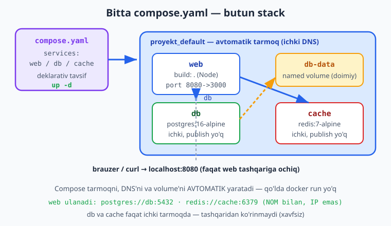
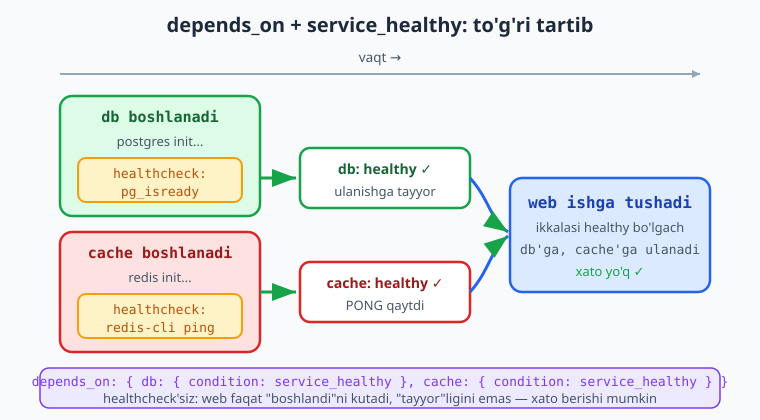
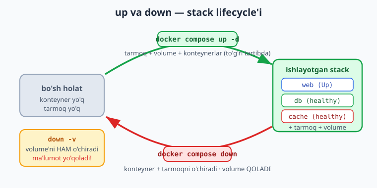

# 11 — Docker Compose

[⬅️ Oldingi: 10 — Volume va Docker tarmog'i](./10-volume-network.md) · [🏠 README](./README.md) · [Keyingi: 12 — CI/CD va GitHub Actions asoslari ➡️](./12-cicd-github-actions.md)

> **Bu bobda:** o'nlab `docker run` buyrug'ini eslab yurish va qo'lda network/volume yaratish muammosini hal qilamiz — **Docker Compose** bilan butun stack (web + db + cache) bitta `compose.yaml` faylda **deklarativ** tasvirlanadi; sintaksis (`services:` — versiyasiz, har servisda `image`/`build`, `ports`, `environment`/`env_file`, `volumes`, `depends_on`, `healthcheck`, `restart`), asosiy buyruqlar (`docker compose up -d`/`down`/`ps`/`logs`/`exec`/`build`), `depends_on` + `condition: service_healthy` bilan to'g'ri ishga tushish tartibi, `.env` fayl va `${O'ZGARUVCHI}`, profillar (`profiles`) va bir nechta compose fayl (override) — hammasini haqiqiy Node "vazifalar" ilovasi misolida ko'rsatamiz va lokal Docker'da ishga tushirib tasdiqlaymiz.

---

## Muammo: bitta ilova — o'nlab buyruq

10-bobda ko'rganmiz: ko'p-konteynerli ilovani to'g'ri qurish uchun tarmoq yaratish, named volume yaratish, har konteynerni alohida bayroqlar bilan ishga tushirish kerak. Bitta web + postgres + redis stack'i shunday ko'rinadi:

```bash
# ❌ ESKI, QO'LDA USUL — har safar shu uzun ketma-ketlik
docker network create app-net
docker volume create db-data
docker run -d --name db --network app-net \
  -e POSTGRES_PASSWORD=maxfiy -e POSTGRES_DB=vazifalar \
  -v db-data:/var/lib/postgresql/data postgres:16-alpine
docker run -d --name cache --network app-net redis:7-alpine
docker build -t vazifalar-web .
docker run -d --name web --network app-net -p 8080:3000 \
  -e DB_HOST=db -e REDIS_HOST=cache vazifalar-web
```

Bu yondashuvning dardlari:

- **Eslab qolish qiyin** — qaysi bayroq, qaysi tartib, qaysi nom edi? Bir hafta o'tib unutasiz.
- **Takrorlash mumkin emas** — hamkasbingiz bir xil komandani qo'lda terolmaydi; bitta bayroq tushib qolsa, stack boshqacha ishlaydi.
- **Tartib muammosi** — `web` `db` tayyor bo'lishini kutmasdan ishga tushadi va xato bilan o'ladi.
- **Tozalash chigal** — 3 ta konteyner, 1 tarmoq, 1 volume'ni qo'lda topib o'chirish kerak.

> 📌 **Yechim — deklarativ tavsif.** "Qanday qilib" (imperativ buyruqlar) o'rniga "nima kerak"ni (deklarativ holat) bitta faylga yozamiz. Docker Compose shu faylni o'qib, hamma narsani o'zi yaratadi, to'g'ri tartibda ishga tushiradi va bitta buyruq bilan tozalaydi.

Quyidagi diagramma butun stack'ning bitta `compose.yaml` faylga jamlanishini ko'rsatadi: uchala servis bitta tarmoqda, db named volume bilan.



---

## Birinchi `compose.yaml`

Compose fayl — bu YAML. Eng oddiy ko'rinishi: `services:` kaliti ostida har bir servis nomi va uning sozlamalari.

```yaml
services:
  web:
    image: nginx:1.27-alpine
    ports:
      - "8080:80"
```

Tamom. Endi shu papkada:

```bash
docker compose up -d
```
```text
[+] Running 2/2
 ✔ Network proyekt_default  Created
 ✔ Container proyekt-web-1   Started
```

Compose avtomatik tarmoq yaratdi, konteynerni ishga tushirdi va `localhost:8080` da nginx ochildi. Bitta `docker run` ham yozmadingiz.

> ℹ️ **Compose fayl nomi.** Yangi tavsiya — `compose.yaml`. Eski `docker-compose.yml` ham hamon ishlaydi (Compose ikkalasini ham tan oladi), lekin yangi loyihalarda `compose.yaml` ishlating. Compose ushbu nomlarni joriy papkadan avtomatik topadi — `-f` bermasangiz ham.

> ⚠️ **`version:` kaliti ESKIRGAN.** Eski qo'llanmalarda fayl `version: "3.8"` bilan boshlanadi. Compose v2'da bu kalit **eskirgan** va ortiqcha — Compose uni e'tiborsiz qoldiradi (yoki ogohlantirish beradi). Faylni to'g'ridan-to'g'ri `services:` bilan boshlang.

```yaml
# ❌ ESKI — yozmang
version: "3.8"
services:
  web:
    image: nginx:1.27-alpine
```
```yaml
# ✅ TO'G'RI — versiyasiz
services:
  web:
    image: nginx:1.27-alpine
```

> 📌 **`docker compose` (probelli), `docker-compose` (tireli) EMAS.** Tireli `docker-compose` — eski, alohida Python vositasi (Compose v1). Hozir Compose Docker'ning ichiga **plagin** sifatida kirgan: buyruq `docker compose` (ikki so'z, probel bilan). Tireli variantni faqat juda eski tizimlarda uchratasiz — yangi `docker compose` ni ishlating.

---

## Servis maydonlari: nimadan tashkil topadi

Har bir servis ostida quyidagi asosiy maydonlar bo'ladi:

| Maydon | Vazifasi |
|---|---|
| `image` | Tayyor image'dan foydalanish (`postgres:16-alpine`) |
| `build` | O'z Dockerfile'ingizdan image qurish (`build: .`) |
| `ports` | Host:konteyner port publish (`"8080:3000"`) |
| `environment` | Muhit o'zgaruvchilari (key: value) |
| `env_file` | O'zgaruvchilarni fayldan o'qish (`.env`) |
| `volumes` | Named volume yoki bind mount ulash |
| `depends_on` | Ishga tushish tartibi (qaysi servisdan keyin) |
| `healthcheck` | Servis "sog'lom"ligini aniqlash usuli |
| `restart` | Qayta ishga tushirish siyosati |

`image` va `build` — ikki muqobil: yo tayyor image olasiz, yo o'zingiz quryapsiz.

```yaml
services:
  db:
    image: postgres:16-alpine        # tayyor image — Docker Hub'dan tortiladi
  web:
    build: .                          # joriy papkadagi Dockerfile'dan quriladi
```

`build` ni batafsilroq ham yozish mumkin:

```yaml
  web:
    build:
      context: .                      # qaysi papkadan
      dockerfile: Dockerfile          # qaysi Dockerfile (boshqa nom bo'lsa)
```

### `environment` va `env_file`

Konteynerga o'zgaruvchi uzatishning ikki yo'li:

```yaml
  db:
    environment:                      # to'g'ridan-to'g'ri faylda
      POSTGRES_USER: postgres
      POSTGRES_PASSWORD: maxfiy_parol
      POSTGRES_DB: vazifalar
```

yoki alohida fayldan:

```yaml
  db:
    env_file:
      - .env                          # .env faylidagi hamma o'zgaruvchi yuklanadi
```

> 💡 **Maslahat:** maxfiy ma'lumotni (parol, token) `compose.yaml` ichiga **yozmang** — uni `.env` faylga qo'ying va `.env` ni `.gitignore` ga kiriting. Compose `.env` ni avtomatik o'qiydi (buni quyida ko'ramiz). Shunda config Git'da, sirlar esa repodan tashqarida qoladi.

### `restart` siyosati

```yaml
  web:
    restart: unless-stopped
```

`unless-stopped` — konteyner xato bilan o'lsa yoki server qayta yuklansa, Docker uni avtomatik qayta ishga tushiradi; ammo siz **qo'lda** `docker compose stop` qilsangiz, qayta tushirmaydi. Production uchun eng ko'p ishlatiladigan, mantiqiy variant. (Muqobillari: `no` — hech qachon, `always` — har doim, `on-failure` — faqat xatoda.)

---

## `depends_on` va healthcheck: to'g'ri tartib

Eng ko'p uchraydigan xato: `web` ishga tushib `db` ga ulanmoqchi bo'ladi, lekin postgres hali ulanishlarni qabul qilishga **tayyor emas** — web xato bilan o'ladi.

`depends_on` ishga tushish **tartibini** beradi, lekin oddiy holatda u faqat konteyner **boshlanishini** kutadi, "tayyorligini" emas. Postgres'ning konteyneri boshlangani bilan, ichidagi baza bir necha soniyadan keyin tayyor bo'ladi. Yechim — `healthcheck` bilan birga ishlatish:

```yaml
services:
  web:
    build: .
    depends_on:
      db:
        condition: service_healthy    # db SOG'LOM bo'lgachgina web ishga tushadi
      cache:
        condition: service_healthy

  db:
    image: postgres:16-alpine
    healthcheck:
      test: ["CMD-SHELL", "pg_isready -U postgres -d vazifalar"]
      interval: 5s
      timeout: 3s
      retries: 5
```

`healthcheck` Docker'ga "bu servis tayyormi?" degan savolni qanday tekshirishni aytadi:

- `test` — ishga tushiriladigan buyruq; `0` qaytarsa **sog'lom**, aks holda **kasal**. `CMD` (to'g'ridan-to'g'ri buyruq) yoki `CMD-SHELL` (shell orqali, o'zgaruvchilar bilan).
- `interval` — necha vaqtda bir tekshirish (`5s`).
- `timeout` — bir tekshiruv qancha kutadi.
- `retries` — necha marta kasal bo'lsa, "unhealthy" deb belgilash.

Quyidagi diagramma bu tartibni ko'rsatadi: avval db va cache "healthy" bo'ladi, keyingina web ishga tushadi.



> 📌 **Qoida:** `depends_on` + `condition: service_healthy` = bog'liq servis HAQIQATAN tayyor bo'lguncha web kutadi. Healthcheck'siz `depends_on` faqat "konteyner boshlandi" deb biladi, "baza ulanishga tayyor" deb emas. DB/cache uchun har doim healthcheck qo'shing.

Redis uchun healthcheck oddiyroq:

```yaml
  cache:
    image: redis:7-alpine
    healthcheck:
      test: ["CMD", "redis-cli", "ping"]   # PONG qaytarsa sog'lom
      interval: 5s
      timeout: 3s
      retries: 5
```

---

## To'liq stack: vazifalar ilovasi

Endi haqiqiy stack quramiz: Node (Express) "vazifalar" API + postgres + redis. Web db'ga **nom** bilan (`db`), redis'ga **nom** bilan (`cache`) ulanadi — IP'siz, 10-bobdagi user-defined bridge tamoyili bo'yicha. Compose tarmoqni va undagi DNS'ni avtomatik beradi.

Ilova kodi (`server.js`, soddalashtirilgan) db va redis'ga muhit o'zgaruvchisidagi **xost nomi** orqali ulanadi:

```javascript
const pool = new pg.Pool({
  host: process.env.DB_HOST || "db",      // konteyner NOMI, IP emas
  port: 5432,
  user: process.env.POSTGRES_USER,
  password: process.env.POSTGRES_PASSWORD,
  database: process.env.POSTGRES_DB,
});
const redis = createClient({ url: `redis://${process.env.REDIS_HOST || "cache"}:6379` });
```

`Dockerfile` (8-bobdagidek, healthcheck bilan):

```dockerfile
FROM node:22-alpine
LABEL org.opencontainers.image.title="vazifalar-web"
WORKDIR /app
COPY package.json ./
RUN npm install --omit=dev
COPY server.js ./
EXPOSE 3000
HEALTHCHECK --interval=10s --timeout=3s --start-period=5s --retries=5 \
  CMD wget -qO- http://localhost:3000/ || exit 1
CMD ["node", "server.js"]
```

Va asosiy `compose.yaml` — butun stack:

```yaml
services:
  web:
    build: .
    ports:
      - "${WEB_PORT:-8080}:3000"
    environment:
      DB_HOST: db
      REDIS_HOST: cache
      POSTGRES_USER: ${POSTGRES_USER}
      POSTGRES_PASSWORD: ${POSTGRES_PASSWORD}
      POSTGRES_DB: ${POSTGRES_DB}
    depends_on:
      db:
        condition: service_healthy
      cache:
        condition: service_healthy
    restart: unless-stopped

  db:
    image: postgres:16-alpine
    environment:
      POSTGRES_USER: ${POSTGRES_USER}
      POSTGRES_PASSWORD: ${POSTGRES_PASSWORD}
      POSTGRES_DB: ${POSTGRES_DB}
    volumes:
      - db-data:/var/lib/postgresql/data
    healthcheck:
      test: ["CMD-SHELL", "pg_isready -U ${POSTGRES_USER} -d ${POSTGRES_DB}"]
      interval: 5s
      timeout: 3s
      retries: 5
    restart: unless-stopped

  cache:
    image: redis:7-alpine
    healthcheck:
      test: ["CMD", "redis-cli", "ping"]
      interval: 5s
      timeout: 3s
      retries: 5
    restart: unless-stopped

volumes:
  db-data:
```

Diqqat qiling:

- **Tarmoq yo'q?** To'g'ri — Compose avtomatik `<loyiha>_default` nomli user-defined bridge yaratadi va hamma servisni shunga qo'shadi. Shuning uchun web `db` va `cache` ni **nom** bilan topadi. Qo'lda tarmoq yozish shart emas.
- **`db` va `cache` da `ports` yo'q** — ular faqat ichki tarmoqda yashaydi, tashqariga ochilmaydi (10-bobdagi xavfsizlik qoidasi). Faqat `web` publish qilingan.
- **Pastdagi `volumes:` bo'limi** — named volume'ni e'lon qiladi; Compose uni `<loyiha>_db-data` deb yaratadi.

`.env` fayli (parol va port shu yerda):

```ini
POSTGRES_USER=postgres
POSTGRES_PASSWORD=maxfiy_parol
POSTGRES_DB=vazifalar
WEB_PORT=8080
```

`${POSTGRES_USER}`, `${WEB_PORT:-8080}` — Compose `.env` faylidan o'zgaruvchi o'rniga qo'yadi. `${WEB_PORT:-8080}` degani: `WEB_PORT` aniqlanmagan bo'lsa, **standart** `8080` ishlat.

### Ishga tushiramiz

```bash
docker compose up -d --build
```
```text
[+] Running 4/4
 ✔ Network vazifalar_default      Created
 ✔ Container vazifalar-cache-1    Healthy
 ✔ Container vazifalar-db-1       Healthy
 ✔ Container vazifalar-web-1      Started
```

E'tibor bering: `cache` va `db` avval **Healthy** bo'ldi, keyingina `web` **Started** — `condition: service_healthy` aynan shuni qildi. Holatni ko'ramiz:

```bash
docker compose ps
```
```text
NAME                 SERVICE   STATUS                    PORTS
vazifalar-cache-1    cache     Up (healthy)              6379/tcp
vazifalar-db-1       db        Up (healthy)              5432/tcp
vazifalar-web-1      web       Up (healthy)              0.0.0.0:8080->3000/tcp
```

Endi API ishlashini tekshiramiz:

```bash
curl localhost:8080/
# Vazifalar API ishlayapti

curl -X POST localhost:8080/vazifalar -H "Content-Type: application/json" \
  -d '{"matn":"compose sinovi"}'
# {"id":1,"matn":"compose sinovi"}

curl localhost:8080/vazifalar
# {"vazifalar":[{"id":1,"matn":"compose sinovi"}],"sorovlar":1}
```

Web postgres'ga (`db`) yozdi va redis'dan (`cache`) so'rovlar sonini oldi — ikkalasiga ham **nom** bilan ulandi. Web konteyner ichidan tekshirsak, nom IP'ga yechiladi:

```bash
docker compose exec web getent hosts db
# 172.19.0.3        db  db
```

> 💡 **Sir:** `compose.yaml` da servis nomi (`db`, `cache`) — bu o'sha servis uchun tarmoq xost nomi. Ilovangiz kodida ulanish satrini `postgres://db:5432/vazifalar` deb yozasiz — `db` aynan compose'dagi servis nomi. IP hech qachon kerak emas.

---

## Compose buyruqlari

Stack lifecycle'ni bir necha buyruq boshqaradi. Quyidagi diagramma asosiy `up`/`down` aylanishini ko'rsatadi.



```bash
docker compose up -d          # stack'ni ko'tarish (detached, fonda)
docker compose up -d --build  # ko'tarishdan oldin image'larni qayta qurish
docker compose ps             # servislar holati (Up/healthy)
docker compose logs -f        # barcha servis loglarini kuzatish (follow)
docker compose logs -f web    # faqat bitta servis logi
docker compose exec web sh    # ishlab turgan web ichida buyruq/shell
docker compose build          # faqat build (ishga tushirmasdan)
docker compose pull           # image'larni registry'dan yangilab tortish
docker compose restart web    # bitta servisni qayta ishga tushirish
docker compose stop           # to'xtatish (o'chirmasdan)
docker compose down           # stack'ni to'xtatish + konteyner/tarmoqni o'chirish
docker compose down -v        # ... volume'larni HAM o'chirish (ma'lumot yo'qoladi!)
```

`down` va `down -v` farqi muhim:

- `docker compose down` — konteynerlar va tarmoqni o'chiradi, **named volume'lar qoladi** — ma'lumot saqlanadi.
- `docker compose down -v` — volume'larni **ham** o'chiradi — DB ma'lumoti **butunlay yo'qoladi**.

> ⚠️ **`down -v` ehtiyot bo'lib.** `-v` named volume'larni o'chiradi — postgres ma'lumotingiz bilan. Uni faqat "toza boshlamoqchiman" deganda ishlating. Production'da `down -v` — xavfli buyruq.

> ℹ️ Eski qo'llanmalarda `docker-compose up` (tireli) ko'rasiz — bu eski v1 vositasi. Yangi `docker compose up` (probelli) ishlating; bayroqlar deyarli bir xil.

---

## `.env` fayl va o'zgaruvchilar

Compose joriy papkadagi `.env` faylini **avtomatik** o'qiydi va `${...}` o'zgaruvchilarni o'rniga qo'yadi. Bu config'ni muhitga moslashtirishning eng oddiy yo'li.

```ini
# .env
WEB_PORT=8099
POSTGRES_PASSWORD=boshqa_parol
```

```yaml
services:
  web:
    ports:
      - "${WEB_PORT:-8080}:3000"      # .env dan 8099 keladi; bo'lmasa 8080
```

`config` buyrug'i bilan o'rniga qo'yilgan holatni ko'rishingiz mumkin — bu xatolarni topishning eng yaxshi usuli:

```bash
docker compose config
```

Bu compose faylni **parse qiladi, normalizatsiya qiladi** va `${...}` o'zgaruvchilar to'ldirilgan to'liq, tekshirilgan holatni chiqaradi. Yozishda xato bo'lsa — shu yerda ko'rinadi.

> 💡 **Maslahat:** har deploy oldidan `docker compose config` ni ishga tushiring. U YAML sintaksisini, o'zgaruvchi o'rin qo'yishni va struktura xatolarini ilova ko'tarilmasdan oldin topadi. "Avval validatsiya, keyin `up`" — yaxshi odat.

---

## Profillar: ixtiyoriy servislar

Ba'zi servislar har doim kerak emas — masalan, `adminer` (DB ko'rish UI'si) faqat dev'da kerak. `profiles` shu servisni **standartda o'chiq** qiladi, faqat profil tanlanganda yoqiladi:

```yaml
services:
  web:
    image: nginx:1.27-alpine
  adminer:
    image: adminer:latest
    profiles:
      - tools                          # faqat "tools" profilida yoqiladi
```

```bash
docker compose up -d                   # faqat web — adminer ishga tushmaydi
docker compose --profile tools up -d   # web + adminer
```

Bu DB admin paneli, test ma'lumotini to'ldiruvchi, debug vositalari kabi "kerak bo'lganda" servislar uchun qulay.

---

## Bir nechta compose fayl: override

Compose joriy papkadagi `compose.yaml` ustiga `compose.override.yaml` (bo'lsa) ni **avtomatik birlashtiradi**. Bu dev va prod sozlamalarini ajratishning standart usuli: asosiy fayl umumiy, override esa dev'ga xos qo'shimchalar.

`compose.yaml` (asosiy, prod'ga mos):

```yaml
services:
  web:
    image: nginx:1.27-alpine
    ports:
      - "80:80"
```

`compose.override.yaml` (dev — avtomatik yuklanadi):

```yaml
services:
  web:
    ports:
      - "8080:80"                      # dev'da boshqa port
    environment:
      MODE: dev
```

```bash
docker compose up -d
# avtomatik: compose.yaml + compose.override.yaml birlashadi
# natija: MODE=dev (map almashtiriladi); portlar BIRLASHADI -> asosiy port VA 8080 ikkalasi ochiq

docker compose -f compose.yaml up -d
# faqat asosiy fayl: port 80, override e'tiborga olinmaydi
```

> 📌 **Qoida:** `-f` bermasangiz, Compose `compose.yaml` + `compose.override.yaml` ni avtomatik birlashtiradi. ⚠️ Diqqat: birlashtirishda **ro'yxat (list) maydonlari — `ports`, `volumes`, `expose` — QO'SHILADI (append), almashtirilmaydi**; faqat skalyar va map maydonlar (masalan `environment` kalitlari, `image`) almashtiriladi. Shuning uchun override'da `ports` bersangiz, asosiy portlar ham ochiq qoladi. Aniq fayl(lar)ni ko'rsatsangiz (`-f a.yaml -f b.yaml`), faqat o'shalar — keyingisi avvalgisini bekor qiladi (override). Prod deploy'da odatda `-f compose.yaml -f compose.prod.yaml` deb aniq beriladi.

---

## 11-bob mashqlari

> Quyidagi mashqlarni o'zingiz yozing va `docker compose up -d` bilan ishga tushiring. Tugagach `docker compose down -v` bilan tozalashni unutmang.

### Oson

1. Bitta servisli (`nginx:1.27-alpine`, port `8080:80`) `compose.yaml` yozing, `docker compose up -d` qiling va `http://localhost:8080` ochiq ekanini tekshiring. So'ng `docker compose down` bilan tozalang.
2. Yuqoridagi faylga eskirgan `version: "3.8"` qatorini qo'shib `docker compose config` qiling — Compose ogohlantirish berishini yoki uni e'tiborsiz qoldirishini kuzating, so'ng qatorni olib tashlang.
3. `docker compose ps`, `docker compose logs`, `docker compose stop`, `docker compose down` buyruqlari nima qilishini o'z so'zingiz bilan yozing.
4. `docker-compose` (tireli) va `docker compose` (probelli) farqini ayting: qaysi biri zamonaviy va nega?
5. `.env` faylda `WEB_PORT=9090` yozing, compose faylda `"${WEB_PORT:-8080}:80"` ishlating va `docker compose config` chiqishida portning `9090` bo'lganini tasdiqlang.

### O'rta

6. `web` (nginx) va `db` (`postgres:16-alpine`) ikki servisli stack yozing; `db` ga named volume va healthcheck (`pg_isready`) qo'shing, `web` esa `db` ga `condition: service_healthy` bilan bog'lansin.

   <details markdown="1"><summary>Yechim</summary>

   ```yaml
   services:
     web:
       image: nginx:1.27-alpine
       ports:
         - "8080:80"
       depends_on:
         db:
           condition: service_healthy
     db:
       image: postgres:16-alpine
       environment:
         POSTGRES_PASSWORD: test
       volumes:
         - db-data:/var/lib/postgresql/data
       healthcheck:
         test: ["CMD-SHELL", "pg_isready -U postgres"]
         interval: 5s
         timeout: 3s
         retries: 5
   volumes:
     db-data:
   ```

   `docker compose up -d` da db avval "Healthy" bo'ladi, keyin web ishga tushadi. `docker compose ps` da db `(healthy)` ko'rsatishini tasdiqlang.
   </details>

7. `docker compose config` bilan compose faylingizni **validatsiya** qiling. Faylga ataylab xato kiriting (masalan `ports:` o'rniga `port:`) va `config` qanday xato berishini ko'ring.

   <details markdown="1"><summary>Yechim</summary>

   ```bash
   docker compose config        # to'g'ri fayl — normalizatsiya qilingan holatni chiqaradi
   # endi ataylab buzamiz: "ports" ni "port" qilib o'zgartiramiz
   docker compose config        # xato: "Additional property port is not allowed" kabi
   ```

   `config` faylni parse va normalizatsiya qiladi; struktura xatolarini `up` dan oldin topadi. Deploy oldidan har doim ishga tushiring.
   </details>

8. `environment` o'rniga `env_file: [.env]` ishlating: postgres parolini `.env` faylga qo'ying va `compose.yaml` da to'g'ridan-to'g'ri yozmang. `docker compose config` da parol o'rniga qo'yilganini ko'ring.

   <details markdown="1"><summary>Yechim</summary>

   `.env`:
   ```ini
   POSTGRES_PASSWORD=maxfiy_parol
   POSTGRES_DB=vazifalar
   ```
   `compose.yaml`:
   ```yaml
   services:
     db:
       image: postgres:16-alpine
       env_file:
         - .env
   ```
   ```bash
   docker compose config    # db.environment ichida POSTGRES_PASSWORD ko'rinadi
   ```

   Sirlar `.env` da (repodan tashqarida, `.gitignore`), config esa Git'da qoladi.
   </details>

9. `profiles` ishlating: `adminer` servisini `tools` profiliga qo'ying va `docker compose config --services` bilan standartda ko'rinmasligini, `--profile tools` bilan ko'rinishini tasdiqlang.

   <details markdown="1"><summary>Yechim</summary>

   ```yaml
   services:
     web:
       image: nginx:1.27-alpine
     adminer:
       image: adminer:latest
       profiles:
         - tools
   ```
   ```bash
   docker compose config --services
   # web   (adminer yo'q)
   docker compose --profile tools config --services
   # adminer
   # web
   ```

   Profil tanlanmasa, servis o'chiq qoladi — dev-only vositalar uchun ideal.
   </details>

10. `restart: unless-stopped` ni servisga qo'shing, konteynerni `docker compose up -d` qiling, so'ng ichidagi jarayonni o'ldiring (`docker compose exec ... kill 1`) va Docker uni avtomatik qayta ko'targanini `docker compose ps` da kuzating.

### Qiyin

11. To'liq stack yozing: Node/Express web (`build: .`) + `postgres:16-alpine` (named volume + healthcheck) + `redis:7-alpine` (healthcheck). Web db'ga va redis'ga **nom** bilan ulansin, `.env` dan port va parol kelsin. `up -d` qiling, `ps` da hammasi `(healthy)` ekanini, `curl` bilan API ishlashini tasdiqlang, so'ng `down -v` bilan tozalang.

    <details markdown="1"><summary>Yechim</summary>

    `compose.yaml`:
    ```yaml
    services:
      web:
        build: .
        ports:
          - "${WEB_PORT:-8080}:3000"
        environment:
          DB_HOST: db
          REDIS_HOST: cache
          POSTGRES_USER: ${POSTGRES_USER}
          POSTGRES_PASSWORD: ${POSTGRES_PASSWORD}
          POSTGRES_DB: ${POSTGRES_DB}
        depends_on:
          db:
            condition: service_healthy
          cache:
            condition: service_healthy
        restart: unless-stopped
      db:
        image: postgres:16-alpine
        environment:
          POSTGRES_USER: ${POSTGRES_USER}
          POSTGRES_PASSWORD: ${POSTGRES_PASSWORD}
          POSTGRES_DB: ${POSTGRES_DB}
        volumes:
          - db-data:/var/lib/postgresql/data
        healthcheck:
          test: ["CMD-SHELL", "pg_isready -U ${POSTGRES_USER} -d ${POSTGRES_DB}"]
          interval: 5s
          timeout: 3s
          retries: 5
        restart: unless-stopped
      cache:
        image: redis:7-alpine
        healthcheck:
          test: ["CMD", "redis-cli", "ping"]
          interval: 5s
          timeout: 3s
          retries: 5
        restart: unless-stopped
    volumes:
      db-data:
    ```
    ```bash
    docker compose up -d --build
    docker compose ps                              # hammasi Up (healthy)
    curl localhost:8080/vazifalar                  # {"vazifalar":[...],"sorovlar":N}
    docker compose exec web getent hosts db        # db nomi IP'ga yechiladi
    docker compose down -v                         # to'liq tozalash
    ```

    Bu bobda yozilgan asosiy stack — aynan shu. Compose tarmoqni va DNS'ni avtomatik beradi, depends_on healthcheck to'g'ri tartibni ta'minlaydi.
    </details>

12. `depends_on` ni healthcheck'siz ishlatib, web db tayyor bo'lishini KUTMAY ishga tushishini kuzating (ehtimol web xato beradi), so'ng healthcheck + `condition: service_healthy` qo'shib muammo yo'qolishini ko'rsating.

    <details markdown="1"><summary>Yechim</summary>

    ```yaml
    # ❌ healthcheck'siz: web db boshlanishini kutadi, lekin "tayyor"ligini emas
    services:
      web:
        build: .
        depends_on:
          - db        # faqat tartib — db boshlangach darrov web ham boshlanadi
      db:
        image: postgres:16-alpine
        environment:
          POSTGRES_PASSWORD: test
    ```
    Web postgres ulanishlarni qabul qilishidan oldin ulanmoqchi bo'lib xato berishi mumkin (ayniqsa birinchi ishga tushishda, baza initsializatsiyasi davom etayotganda).
    ```yaml
    # ✅ healthcheck + condition: web db SOG'LOM bo'lgachgina ishga tushadi
    services:
      web:
        build: .
        depends_on:
          db:
            condition: service_healthy
      db:
        image: postgres:16-alpine
        environment:
          POSTGRES_PASSWORD: test
        healthcheck:
          test: ["CMD-SHELL", "pg_isready -U postgres"]
          interval: 5s
          timeout: 3s
          retries: 5
    ```

    `condition: service_healthy` — `depends_on` ni "tayyorlik"ka bog'laydi. DB/cache uchun har doim shunday qiling.
    </details>

13. Override mexanizmini ko'rsating: `compose.yaml` (port `80:80`) va `compose.override.yaml` (port `8080:80` + `MODE: dev`) yozing. `docker compose config` da ikkalasi birlashganini (port 8080, MODE dev), `docker compose -f compose.yaml config` da esa faqat asosiy fayl (port 80) ishlatilishini tasdiqlang.

    <details markdown="1"><summary>Yechim</summary>

    `compose.yaml`:
    ```yaml
    services:
      web:
        image: nginx:1.27-alpine
        ports:
          - "80:80"
    ```
    `compose.override.yaml`:
    ```yaml
    services:
      web:
        ports:
          - "8080:80"
        environment:
          MODE: dev
    ```
    ```bash
    docker compose config                 # birlashadi: portlar 80 VA 8080 (ro'yxat qo'shiladi), MODE=dev
    docker compose -f compose.yaml config # faqat asosiy: port 80, MODE yo'q
    ```

    `-f` bermasangiz override avtomatik qo'shiladi; aniq `-f` bersangiz faqat ko'rsatilgan fayl(lar) ishlatiladi. Bu dev/prod ajratishning standart usuli.
    </details>

[⬅️ Oldingi: 10 — Volume va Docker tarmog'i](./10-volume-network.md) · [🏠 README](./README.md) · [Keyingi: 12 — CI/CD va GitHub Actions asoslari ➡️](./12-cicd-github-actions.md)
