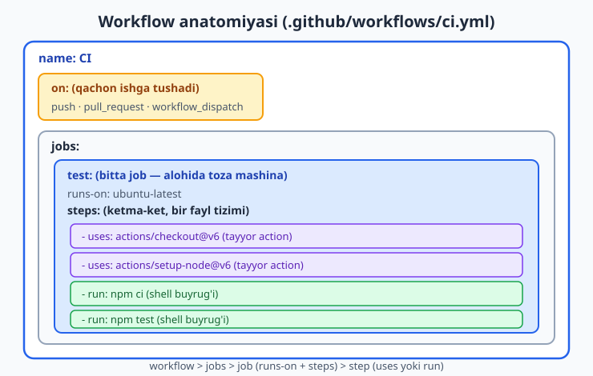
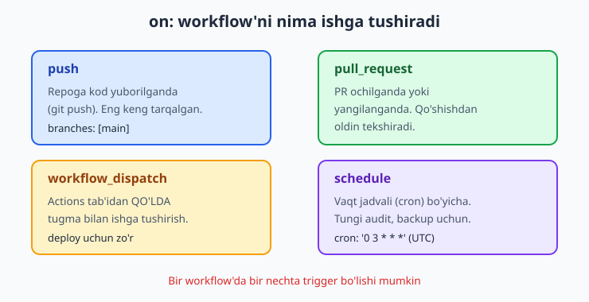
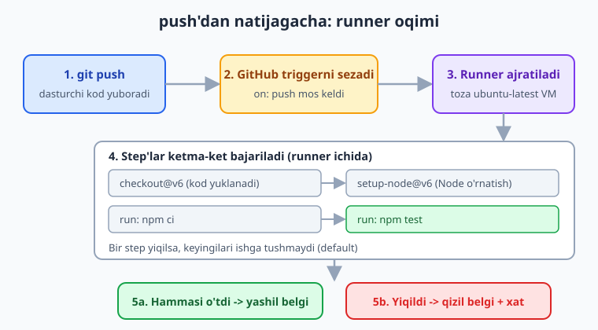

# 12 — CI/CD va GitHub Actions asoslari

[⬅️ Oldingi: 11 — Docker Compose](./11-docker-compose.md) · [🏠 README](./README.md) · [Keyingi: 13 — Test va build pipeline ➡️](./13-pipeline-test-build.md)

> **Bu bobda:** "menda ishladi-ku" muammosidan **CI/CD** (Continuous Integration / Continuous Delivery — uzluksiz integratsiya va yetkazib berish) avtomatlashtirishiga o'tamiz; **GitHub Actions** nima va workflow fayli qayerda yashashi (`.github/workflows/*.yml`, YAML — probel, tab emas); workflow anatomiyasi — `name`, `on` (push, pull_request, `workflow_dispatch`=qo'lda, `schedule`=cron), `jobs`, har job'da `runs-on: ubuntu-latest` va `steps`, har step'da `uses` (tayyor action) yoki `run` (buyruq); zamonaviy action'lar (`actions/checkout@v6`, `actions/setup-node@v6`) va eskirgan `set-output` o'rniga `$GITHUB_OUTPUT`/`$GITHUB_ENV`; runner nima (GitHub-hosted vs self-hosted), job vs step farqi, parallel job'lar, `secrets` va `github` context; va nihoyat birinchi haqiqiy workflow — checkout + Node sozlash + `npm test` — hamda Actions tab'idagi loglarni o'qish.

---

## Muammo: "menda ishladi-ku"

Tasavvur qiling — kichik jamoa bir Node.js loyihasini birga yozyapsiz. Siz funksiya qo'shdingiz, lokalda `npm test` o'tdi, `git push` qildingiz. Bir hafta o'tib hamkasbingiz boshqa branch'ni `main`'ga qo'shdi va sayt ishdan chiqdi. Sababi: uning kodi sizning testlaringizdan birini buzgan edi, lekin **hech kim push qilishdan oldin testni qaytadan ishlatmagan**.

Yoki yana yomonroq: deploy paytida kimdir `npm install` qilishni unutdi, yoki noto'g'ri branch'ni serverga ko'chirdi. Bularning hammasi bitta sababdan kelib chiqadi — **qo'lda bajariladigan qadamlar unutiladi va xato qilinadi**.

Yechim — bu takror, zerikarli, lekin muhim qadamlarni (test, lint, build, deploy) **mashinaga** topshirish. Har `git push`'da bir robot avtomatik testlarni ishlatsin, o'tmasa sizni ogohlantirsin, o'tsa yo'lga qo'ysin. Aynan shuni **CI/CD** deyiladi.

> ℹ️ CI/CD asosini [Git & GitHub](../git-github/README.md) kitobida birinchi marta ko'rganmiz. U yerda fokus Git workflow'da edi; bu yerda DevOps nuqtai nazaridan — **nega va qanday avtomatlashtirish** ishlab chiqarishni ishonchli qilishiga qaraymiz.

---

## CI/CD nima: ikkita oddiy g'oya

- **CI — Continuous Integration (uzluksiz integratsiya):** har bir o'zgarish (commit/push) markaziy repozitoriyga qo'shilganda, **avtomatik** ravishda build qilinadi va testdan o'tkaziladi. Maqsad — buzilgan kodni iloji boricha **erta** topish, "main har doim ishlaydigan holatda" bo'lsin.
- **CD — Continuous Delivery / Deployment (uzluksiz yetkazib berish / joylash):** CI o'tgach, kod avtomatik (yoki bitta tugma bosib) staging yoki production muhitiga joylanadi. Inson har deployni qo'lda qilmaydi.

📌 **Asosiy qoida:** agar bir ishni ikki martadan ko'p qo'lda qilayotgan bo'lsangiz, uni avtomatlashtirishni o'ylab ko'ring. CI/CD — "har push'da nima bo'lishi kerakligini" bir marta yozib qo'yib, keyin uni unutish.

Eski qo'lda usul (5-bobda ko'rgan SSH bilan qo'lda deploy) bilan solishtiring: u yerda har gal terminal ochib, server'ga kirib, `git pull`, `npm install`, qayta ishga tushirish qadamlarini **qo'lda** bajargandik. CI/CD shularning hammasini matn faylga yozadi va robot bajaradi.

---

## GitHub Actions va workflow fayli

**GitHub Actions** — GitHub'ning o'ziga qurilgan CI/CD tizimi. Alohida server sozlashingiz shart emas: repozitoriyangizga maxsus YAML fayl qo'shasiz, GitHub uni o'qib, kerakli paytda **avtomatik** ishga tushiradi.

Workflow fayllari aniq bir joyda yashashi shart:

```text
loyiha/
├── .github/
│   └── workflows/
│       ├── ci.yml          <- bu yerga
│       └── deploy.yml
├── src/
├── package.json
└── ...
```

📌 Papka nomi **aniq** `.github/workflows/` bo'lishi shart (nuqtadan boshlanadi). Fayl kengaytmasi `.yml` yoki `.yaml`. Bitta repozitoriyada nechta workflow fayli bo'lsa, bo'lishi mumkin — GitHub `.github/workflows/` ichidagi har bir faylni alohida workflow deb biladi.

> ⚠️ **YAML — probelga sezgir til.** Indentatsiya (chekinish) **faqat probel** bilan qilinadi, **TAB bilan emas**. Bir-ikki probel xato bo'lsa, GitHub workflow'ni umuman o'qiy olmaydi. Tahrirlovchingizda "tab'ni probelga aylantir" (insert spaces) sozlamasini yoqib qo'ying va odatda 2 probel chekinish ishlating.

---

## Workflow anatomiyasi

Workflow faylining tuzilishi ichma-ich qatlamli: bitta workflow ichida bir nechta **job**, har job ichida bir nechta **step**. Quyidagi diagramma shu qatlamlarni ko'rsatadi.



Eng kichik to'liq workflow shunday ko'rinadi:

```yaml
name: CI

on:
  push:
    branches: [main]
  pull_request:
    branches: [main]
  workflow_dispatch:

jobs:
  test:
    name: Test va lint
    runs-on: ubuntu-latest
    steps:
      - name: Kodni olish
        uses: actions/checkout@v6

      - name: Node sozlash
        uses: actions/setup-node@v6
        with:
          node-version: '22'
          cache: 'npm'

      - name: Bog'liqliklarni o'rnatish
        run: npm ci

      - name: Testlarni ishga tushirish
        run: npm test
```

Endi har bir kalitni ko'rib chiqamiz.

### `name` — workflow nomi

Actions tab'ida ko'rinadigan inson o'qiy oladigan nom. Ixtiyoriy, lekin tavsiya etiladi.

### `on` — qachon ishga tushadi (trigger)

`on` — workflow'ni **nima** qo'zg'atishini belgilaydi. To'rtta eng ko'p ishlatiladigan trigger:



```yaml
on:
  push:                      # repoga push bo'lganda
    branches: [main]         # faqat main branch
  pull_request:              # PR ochilganda/yangilanganda
    branches: [main]
  workflow_dispatch:         # Actions tab'idan QO'LDA tugma bilan
  schedule:                  # vaqt jadvali bo'yicha (cron)
    - cron: '0 3 * * *'      # har kuni soat 03:00 UTC
```

- **`push`** — kimdir kodni repoga yuborsa. Eng keng tarqalgan: har push'da test ishlasin.
- **`pull_request`** — PR ochilganda yoki yangilanganda. PR'ni `main`'ga qo'shishdan oldin testlar o'tishini tekshiradi.
- **`workflow_dispatch`** — Actions tab'idagi **"Run workflow"** tugmasi orqali qo'lda ishga tushirish. Deploy kabi inson qarori kerak bo'lgan ishlar uchun zo'r.
- **`schedule`** — `cron` ifodasi bilan vaqt jadvali. Tungi audit, backup, bog'liqlik tekshiruvi uchun.

> 💡 **`cron` formati eslatma:** `'0 3 * * *'` — beshta maydon: `daqiqa soat kun-oy oy hafta-kuni`. Bu yerda har kuni 03:00 da. `schedule` UTC vaqtida ishlaydi — mahalliy vaqtga moslang. (Bash bobida cron'ni batafsil ko'rgandik.)

### `jobs` — bajariladigan ishlar

`jobs` ichida bir yoki bir nechta **job** bo'ladi. Har job — alohida, **toza** mashinada ishlaydi. Yuqorida bitta job bor: `test`.

### `runs-on` — qaysi mashinada

Har job'da `runs-on` bo'lishi shart — qaysi turdagi **runner**'da (mashinada) ishlashini ko'rsatadi. Odatda `ubuntu-latest` (eng yangi barqaror Ubuntu). Boshqalar: `windows-latest`, `macos-latest`.

### `steps` — qadamlar

Job ichida ketma-ket bajariladigan qadamlar. Har step ikki xil bo'ladi:

- **`uses`** — tayyor **action**'ni chaqiradi (boshqalar yozgan qayta ishlatiladigan blok), masalan `actions/checkout@v6`.
- **`run`** — to'g'ridan-to'g'ri **shell buyrug'i**, masalan `run: npm test`.

Har step'da ixtiyoriy `name` (logda ko'rinadigan nom) va `env` (o'sha step uchun muhit o'zgaruvchilari) bo'lishi mumkin.

---

## Job vs Step: muhim farq

Bu ikkisini chalkashtirmang:

| | **Job** | **Step** |
|---|---|---|
| Qayerda ishlaydi | O'z **alohida toza mashinasida** | Job'ning **o'sha** mashinasida |
| Bir-biriga ta'siri | Default'da **parallel**, izolyatsiya qilingan | Ketma-ket, **bir** fayl tizimini bo'lishadi |
| Misol | "test" job va "build" job | "checkout" step, "npm test" step |

📌 Ikki **job** default holda **parallel** (bir vaqtda) ishlaydi va bir-birining fayllarini ko'rmaydi — har biri toza mashinada boshlanadi. Agar `build` job `test`'dan **keyin** ishlashini xohlasangiz, `needs: test` bilan bog'lashingiz kerak (buni 13-bobda chuqurroq ko'ramiz).

Bir job ichidagi **step**'lar esa **ketma-ket** ishlaydi va **bir xil** fayl tizimini bo'lishadi: shuning uchun `checkout` step kodni yuklab oladi, keyingi `npm ci` step o'sha kodni ko'radi.

```yaml
jobs:
  test:
    runs-on: ubuntu-latest
    steps:
      - run: echo "men test job'man"
  lint:
    runs-on: ubuntu-latest    # test bilan PARALLEL ishlaydi
    steps:
      - run: echo "men lint job'man"
```

---

## Runner nima

**Runner** — workflow step'larini aslida bajaradigan **mashina** (server). Ikki xil bo'ladi:

- **GitHub-hosted runner** — GitHub har ishga tushishda siz uchun **toza, vaqtinchalik** virtual mashina ajratadi (`ubuntu-latest` va h.k.). Ish tugagach mashina o'chiriladi. Hech narsa sozlashingiz shart emas. Public repolar uchun bepul, private uchun cheklangan bepul daqiqalar bor.
- **Self-hosted runner** — o'zingizning serveringizda runner dasturini o'rnatib, GitHub'ga ulaysiz. Maxsus apparat (GPU), ichki tarmoqqa kirish yoki ko'p daqiqa kerak bo'lganda ishlatiladi. Boshqaruvi (yangilash, xavfsizlik) sizning zimmangizda.

Boshlovchilar uchun GitHub-hosted yetarli — biz shularni ishlatamiz.

Quyidagi diagramma push'dan natijagacha bo'lgan butun oqimni ko'rsatadi: GitHub triggerni sezadi, runner ajratiladi, step'lar ketma-ket bajariladi, oxirida muvaffaqiyat yoki xato belgisi qo'yiladi.



---

## Secrets va context

CI ichida ko'pincha **maxfiy** ma'lumot kerak bo'ladi: registry paroli, deploy SSH kaliti, API token. Bularni faylga **hech qachon** yozmang. GitHub repo sozlamalarida (**Settings → Secrets and variables → Actions**) saqlanadi va workflow'da `${{ secrets.NOM }}` orqali olinadi:

```yaml
      - name: Registry'ga login
        run: echo "${{ secrets.GHCR_TOKEN }}" | docker login ghcr.io -u "${{ github.actor }}" --password-stdin
```

> ⚠️ Secret qiymatlari logda **avtomatik yashiriladi** (`***` bo'lib chiqadi). Lekin baribir secret'ni `echo` qilmang yoki faylga yozmang — ehtiyot shart.

GitHub yana bir qancha tayyor ma'lumotni **`github` context** orqali beradi — joriy commit, branch, kim ishga tushirgani va h.k.:

```yaml
      - run: echo "Commit ${{ github.sha }} | branch ${{ github.ref_name }} | kim ${{ github.actor }}"
```

Eng ko'p ishlatiladigani: `github.sha` (commit hash), `github.ref_name` (branch/tag nomi), `github.repository` (`user/repo`), `github.actor` (ishga tushirgan foydalanuvchi).

### Step'lar orasida ma'lumot uzatish — to'g'ri usul

Bir step natijani hisoblab, keyingi step ishlatishi kerak bo'lsa, natijani `$GITHUB_OUTPUT` fayliga yozasiz:

```yaml
      - name: Versiyani aniqlash
        id: meta
        run: echo "sha_short=${GITHUB_SHA::7}" >> "$GITHUB_OUTPUT"

      - name: Ishlatish
        run: echo "Qisqa SHA = ${{ steps.meta.outputs.sha_short }}"
```

Muhit o'zgaruvchisini keyingi step'larga uzatish uchun esa `$GITHUB_ENV`:

```yaml
      - run: echo "TAG=v1.2.3" >> "$GITHUB_ENV"
      - run: echo "Tag = $TAG"   # keyingi step'da ko'rinadi
```

> ⚠️ **Eskirgan usulni ishlatmang.** Eski qo'llanmalarda `echo "::set-output name=x::qiymat"` va `::save-state::` ko'rinasiz — bular **o'chirilgan** va endi ishlamaydi. Zamonaviy usul — `$GITHUB_OUTPUT` va `$GITHUB_ENV` fayllariga `>>` bilan yozish.

---

## Zamonaviy action versiyalari

Action'lar `uses: egasi/nom@versiya` ko'rinishida chaqiriladi. Versiyani **doim** ko'rsating. 2026-yil holatiga tasdiqlangan asosiy action'lar:

```yaml
- uses: actions/checkout@v6        # kodni runner'ga yuklab oladi
- uses: actions/setup-node@v6      # kerakli Node versiyasini o'rnatadi
- uses: actions/setup-python@v5    # Python uchun
- uses: actions/cache@v5           # keshlash
- uses: actions/upload-artifact@v4 # build natijasini saqlash
```

> ⚠️ **Eskirgan versiyalarni ishlatmang.** `actions/checkout@v2` va `@v3` eskirgan (eski Node runtime'ida ishlaydi, GitHub ogohlantirish beradi). Doim joriy major versiyani ishlating: `actions/checkout@v6`. Shubha bo'lsa, action'ning GitHub sahifasidagi "Releases"ni tekshiring — versiyani ixtiro qilmang.

💡 `@v6` deb major versiyaga bog'lansangiz, GitHub o'sha major ichidagi eng yangi patchni avtomatik oladi (xavfsizlik tuzatishlari kelib turadi). To'liq aniqlik kerak bo'lsa, commit SHA'ga bog'lash mumkin (`@a1b2c3...`), lekin boshlang'ich uchun `@v6` yetarli.

---

## Amaliyot: birinchi workflow'ingiz

Endi yuqoridagi `ci.yml` ni haqiqiy repoga qo'shamiz. Namuna ilovamiz — kitob bo'ylab ishlatib kelayotgan oddiy "vazifalar" (todo) Node.js API'si.

**1-qadam.** Loyiha ildizida papka va fayl yarating:

```bash
mkdir -p .github/workflows
```

**2-qadam.** `.github/workflows/ci.yml` faylini yarating (mazmuni — yuqoridagi to'liq workflow).

**3-qadam.** `package.json`'da test buyrug'i borligiga ishonch hosil qiling. Test hali yo'q bo'lsa, vaqtinchalik shu ishni beradi:

```json
{
  "scripts": {
    "test": "node --test"
  }
}
```

**4-qadam.** Commit qilib push qiling:

```bash
git add .github/workflows/ci.yml
git commit -m "CI: birinchi GitHub Actions workflow"
git push
```

> ℹ️ **Illustrativ qadam:** push qilingach, GitHub'da repozitoriyangizning **Actions** tab'ini ochish, workflow ishga tushganini va loglarni ko'rish **haqiqiy GitHub repozitoriyasi**ni talab qiladi (bu kitobda offline ko'rsatib bo'lmaydi). Quyidagi tavsiflar siz o'z repongizda ko'radigan natijaga mos.

### Loglarni o'qish

`git push` qilgach, GitHub triggerni darhol sezadi. Repo sahifasida **Actions** tab'iga o'ting:

1. **Workflow ro'yxati** — chapda "CI" ko'rinadi, har ishga tushish (run) bitta qator.
2. **Run ichida** — `test` job ko'rinadi: yashil ✓ (o'tdi) yoki qizil ✗ (xato).
3. **Job ichida** — har step alohida ochiladigan blok. Bossangiz, o'sha step'ning to'liq terminal chiqishi ko'rinadi.

Tipik muvaffaqiyatli chiqish shunday ko'rinadi (qisqartirilgan):

```text
Run npm test
> vazifalar-api@1.0.0 test
> node --test

✔ vazifa qo'shiladi (12.3ms)
✔ bo'sh ro'yxat qaytariladi (1.1ms)
# tests 2
# pass 2
# fail 0
```

Agar test yiqilsa, qizil ✗ chiqadi va aynan qaysi step, qaysi qatorda xato bo'lgani logda ko'rinadi. PR'da esa bu natija to'g'ridan-to'g'ri PR sahifasida "checks" bo'limida ko'rinadi — buzilgan PR'ni qo'shishdan oldin ko'rasiz.

💡 Logni o'qishda eng tez yo'l: yiqilgan (qizil) step'ni oching, oxirigacha aylantiring — xato xabari odatda eng pastda bo'ladi. Step nomini ma'noli qo'ysangiz (`name:`), qaysi bosqichda yiqilganini bir qarashda tushunasiz.

---

## 12-bob mashqlari

> Quyidagi mashqlarda YAML yozasiz. Strukturani lokalda tekshirish uchun foydali: faylni `python -c "import yaml; yaml.safe_load(open('ci.yml'))"` bilan parse qiling — xatosiz o'tsa, sintaksis to'g'ri. Haqiqiy ishga tushirish GitHub repozitoriyasini talab qiladi.

### Oson

1. `.github/workflows/` papkasi nima uchun kerak va fayl kengaytmasi qanday bo'lishi mumkin? Bir nechta workflow fayli bo'lsa nima bo'ladi?
2. `on:` kalitidagi `push`, `pull_request`, `workflow_dispatch`, `schedule` triggerlarini bittadan jumlada izohlang.
3. **Job** bilan **step** orasidagi uchta farqni ayting (qayerda ishlashi, parallel/ketma-ket, fayl tizimini bo'lishish).
4. `uses` bilan `run` step'lari farqi nimada? Har biriga bittadan misol yozing.

### O'rta

5. Quyidagi workflow'da `on:` push'da, lekin faqat `main` branch'da ishga tushishini sozlang va `name` bering.

   <details markdown="1"><summary>Yechim</summary>

   ```yaml
   name: CI

   on:
     push:
       branches: [main]

   jobs:
     test:
       runs-on: ubuntu-latest
       steps:
         - uses: actions/checkout@v6
         - run: echo "test ketyapti"
   ```

   `branches: [main]` filtri faqat `main`'ga push bo'lganda ishga tushiradi. Boshqa branch'larga push'da workflow o'tkazib yuboriladi.

   </details>

6. Python loyihasi uchun checkout + Python 3.12 sozlash + `pip install -r requirements.txt` + `pytest` ishlatadigan workflow yozing.

   <details markdown="1"><summary>Yechim</summary>

   ```yaml
   name: Python CI

   on: [push, pull_request]

   jobs:
     test:
       runs-on: ubuntu-latest
       steps:
         - uses: actions/checkout@v6
         - uses: actions/setup-python@v5
           with:
             python-version: '3.12'
         - run: pip install -r requirements.txt
         - run: pytest
   ```

   `on: [push, pull_request]` — qisqa yozuv: ikkala triggerni filtersiz yoqadi.

   </details>

7. Bir workflow'da ikkita **parallel** job yarating: `test` va `lint`. Har biri o'z `echo` buyrug'ini bajarsin. Ular bir vaqtda ishlashini tushuntiring.

   <details markdown="1"><summary>Yechim</summary>

   ```yaml
   name: CI

   on: push

   jobs:
     test:
       runs-on: ubuntu-latest
       steps:
         - run: echo "testlar"
     lint:
       runs-on: ubuntu-latest
       steps:
         - run: echo "lint"
   ```

   `test` va `lint` orasida bog'liqlik (`needs`) yo'q, shuning uchun GitHub ularni ikkita alohida toza mashinada **bir vaqtda** ishga tushiradi. Bu jami vaqtni qisqartiradi.

   </details>

8. `workflow_dispatch` ni `inputs` bilan qo'shing: foydalanuvchi "muhit" qiymatini (default `staging`) tanlay olsin. Workflow ichida shu inputni `echo` qiling.

   <details markdown="1"><summary>Yechim</summary>

   ```yaml
   name: Qo'lda deploy

   on:
     workflow_dispatch:
       inputs:
         muhit:
           description: 'Qaysi muhit'
           required: true
           default: 'staging'

   jobs:
     deploy:
       runs-on: ubuntu-latest
       steps:
         - run: echo "Tanlangan muhit = ${{ inputs.muhit }}"
   ```

   Actions tab'idagi "Run workflow" tugmasi bosilganda matn kiritish maydoni chiqadi. Qiymat workflow ichida `${{ inputs.muhit }}` orqali olinadi.

   </details>

9. Workflow'da joriy commit qisqa SHA'sini hisoblab (`github.sha`ning birinchi 7 belgisi), keyingi step'da ishlatib chiqaring. **`$GITHUB_OUTPUT`** ishlating.

   <details markdown="1"><summary>Yechim</summary>

   ```yaml
   jobs:
     build:
       runs-on: ubuntu-latest
       steps:
         - uses: actions/checkout@v6
         - id: meta
           run: echo "sha_short=${GITHUB_SHA::7}" >> "$GITHUB_OUTPUT"
         - run: echo "Qisqa SHA = ${{ steps.meta.outputs.sha_short }}"
   ```

   `${GITHUB_SHA::7}` — bash'da satrning birinchi 7 belgisi. `id: meta` step'ga nom beradi, natija `steps.meta.outputs.sha_short` orqali olinadi. Eskirgan `::set-output` ni **ishlatmaymiz**.

   </details>

### Qiyin

10. To'liq CI workflow yozing: `push` va `pull_request` (faqat `main`) hamda `workflow_dispatch`'da ishlasin; Node 22 sozlasin (npm keshi bilan), `npm ci` va `npm test` qilsin. Har step'ga ma'noli `name` bering.

    <details markdown="1"><summary>Yechim</summary>

    ```yaml
    name: CI

    on:
      push:
        branches: [main]
      pull_request:
        branches: [main]
      workflow_dispatch:

    jobs:
      test:
        name: Test va lint
        runs-on: ubuntu-latest
        steps:
          - name: Kodni olish
            uses: actions/checkout@v6

          - name: Node sozlash
            uses: actions/setup-node@v6
            with:
              node-version: '22'
              cache: 'npm'

          - name: Bog'liqliklarni o'rnatish
            run: npm ci

          - name: Testlarni ishga tushirish
            run: npm test
    ```

    `cache: 'npm'` — `setup-node` keshlashni yoqadi, keyingi run'larda `npm ci` tezroq bo'ladi. `npm ci` (clean install) `package-lock.json`'ga aniq mos o'rnatadi — CI uchun `npm install`'dan afzal.

    </details>

11. Quyidagi workflow ikkita xatoga ega. Toping va tuzating.

    ```yaml
    name: CI
    on:
      push
    jobs:
      test:
        steps:
          - uses: actions/checkout@v3
          - run: npm test
    ```

    <details markdown="1"><summary>Yechim</summary>

    Ikki xato:
    1. `test` job'da **`runs-on` yo'q** — har job qaysi mashinada ishlashini ko'rsatishi shart.
    2. `actions/checkout@v3` **eskirgan** — `@v6` ishlating. (Qo'shimcha: `on:` ostidagi `push` indentatsiyasi noto'g'ri — `push:` mustaqil kalit bo'lishi kerak.)

    Tuzatilgan:

    ```yaml
    name: CI
    on:
      push:
    jobs:
      test:
        runs-on: ubuntu-latest
        steps:
          - uses: actions/checkout@v6
          - run: npm test
    ```

    </details>

12. `schedule` trigger bilan har kuni soat 06:00 (UTC) da `npm audit` ishlaydigan "tungi xavfsizlik tekshiruvi" workflow yozing. `workflow_dispatch` ham qo'shing (qo'lda ham ishga tushira olish uchun).

    <details markdown="1"><summary>Yechim</summary>

    ```yaml
    name: Nightly audit

    on:
      schedule:
        - cron: '0 6 * * *'
      workflow_dispatch:

    jobs:
      audit:
        runs-on: ubuntu-latest
        steps:
          - uses: actions/checkout@v6
          - uses: actions/setup-node@v6
            with:
              node-version: '22'
          - run: npm audit --omit=dev
    ```

    `cron: '0 6 * * *'` — har kuni 06:00 UTC. `schedule` UTC'da ishlaydi, mahalliy vaqtga moslang. `workflow_dispatch` qo'shilgani uchun jadval kutmasdan qo'lda ham sinab ko'rasiz.

    </details>

13. Deploy workflow'da `secrets` dan SSH kaliti va server manzilini olib, `github.sha` ni log qiladigan **xavfsiz** struktura yozing (haqiqiy deploy buyrug'i o'rniga `echo` qo'ying — illustrativ).

    <details markdown="1"><summary>Yechim</summary>

    ```yaml
    name: Deploy

    on:
      workflow_dispatch:

    jobs:
      deploy:
        runs-on: ubuntu-latest
        steps:
          - uses: actions/checkout@v6
          - name: Ma'lumotni log qilish
            run: echo "Deploy commit ${{ github.sha }} -> server ${{ secrets.DEPLOY_HOST }}"
          - name: Deploy (illustrativ)
            env:
              SSH_KEY: ${{ secrets.DEPLOY_SSH_KEY }}
            run: echo "bu yerda ssh/rsync bo'lardi (real serverga ulanish kerak)"
    ```

    Secret'lar repo **Settings → Secrets and variables → Actions**'da saqlanadi va faqat `${{ secrets.NOM }}` orqali olinadi — faylga **yozilmaydi**. SSH kalitini step'ning `env`'iga berdik, logda u `***` bo'lib yashiriladi. Real deploy 15-bobda batafsil ko'riladi.

    </details>

---

[⬅️ Oldingi: 11 — Docker Compose](./11-docker-compose.md) · [🏠 README](./README.md) · [Keyingi: 13 — Test va build pipeline ➡️](./13-pipeline-test-build.md)
