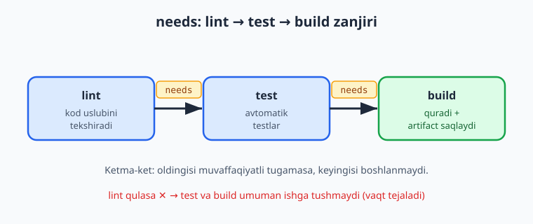
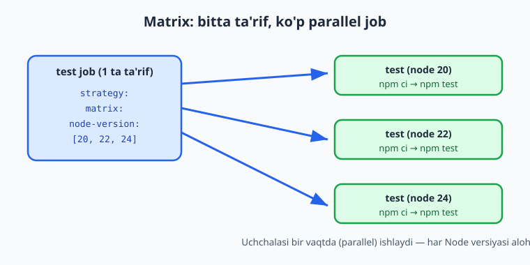
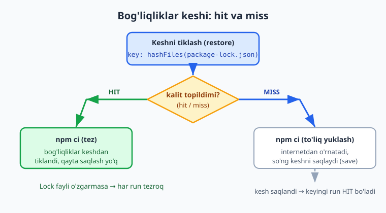

# 13 — Test va build pipeline

[⬅️ Oldingi: 12 — CI/CD va GitHub Actions asoslari](./12-cicd-github-actions.md) · [🏠 README](./README.md) · [Keyingi: 14 — Docker image CI va GHCR ➡️](./14-docker-ci-ghcr.md)

> **Bu bobda:** 12-bobda ko'rgan workflow anatomiyasidan to'liq, ishlatishga tayyor CI pipeline'ga o'tamiz — namuna `vazifalar-api` ilovasi uchun `actions/checkout@v6` + `actions/setup-node@v6` (`cache: npm` bilan), `npm ci` → `npm run lint` → `npm test` → `npm run build` zanjirini quramiz; `strategy.matrix` orqali ilovani bir nechta Node versiyasida (20/22/24) parallel sinaymiz va `fail-fast`ni boshqaramiz; bog'liqliklarni `actions/cache@v5` bilan (yoki setup-node'ning o'rnatilgan keshi bilan) `hashFiles` kaliti orqali keshlaymiz; build natijasini `actions/upload-artifact@v4` bilan saqlaymiz; `needs:`, `if:` va `concurrency` bilan job'larni bog'lab eski run'larni bekor qilamiz; va README'ga **status badge** qo'shib, branch himoyasida **required status check** sozlaymiz — shunda yashil belgi PR'ni qo'shishning sharti bo'ladi.

---

## Muammo: "test qildingmi?" — "albatta... shekilli"

12-bobda birinchi workflow'ni yozdik: u `push` bo'lganda ishga tushib, bitta `run` qadamni bajardi. Bu — boshlanish. Lekin haqiqiy loyihada CI'ning vazifasi bitta: **buzuq kod `main` shoxiga (branch) tushmasin**.

Tasavvur qiling, jamoadasiz. Hamkasbingiz PR ochadi va "menda ishlayapti" deydi. Lekin uning kompyuterida Node 24, serverda esa 20; u test yozgan, lekin oxirgi o'zgarishdan keyin ishlatib ko'rmagan; lint xatosi bor, kod uslubi buzilgan. Bularning hammasini **qo'lda** tekshirish — charchatadi va unutiladi.

CI pipeline aynan shu ishonchni avtomatlashtiradi: har `push` va har PR'da kodni **bir xil**, **takrorlanadigan** muhitda lint qiladi, test qiladi, quradi. O'tmasa — qizil belgi, PR bloklanadi. O'tsa — yashil, ishonch bilan birlashtirasiz.

📌 CI'ning oltin qoidasi: **lokalda ishlash yetarli emas**. "Ishonchli" degani — toza muhitda, har safar, hamma uchun bir xil ishlaydi. CI buni kafolatlaydi.

> ℹ️ Bu bob [Git & GitHub](../git-github/README.md) kitobida va 12-bobda ko'rgan GitHub Actions asoslariga (workflow, `on`, `jobs`, `steps`, `uses`, `run`, runner) tayanadi. Yangi bo'lsa, avval 12-bobni ko'rib chiqing.

---

## Namuna ilova: `vazifalar-api`

Kitob bo'ylab izchil ishlatadigan namuna — kichik **vazifalar API** (`vazifalar-api`, Node.js/Express). Uning `package.json`'ida CI uchun kerakli to'rtta skript bor:

```json
{
  "name": "vazifalar-api",
  "version": "1.2.3",
  "type": "module",
  "scripts": {
    "lint": "node --check src/server.js",
    "test": "node --test",
    "build": "node build.js",
    "start": "node src/server.js"
  }
}
```

- `lint` — kod uslubi/sintaksisini tekshiradi (haqiqiy loyihada bu odatda ESLint, bu yerda soddalik uchun `node --check`).
- `test` — Node'ning **o'rnatilgan** test ishlatuvchisi (`node --test`, qo'shimcha paketsiz). `test/` papkasidagi `*.test.js` fayllarni topadi va ishlatadi.
- `build` — ilovani `dist/` papkasiga quradi (artifact shu yerdan olinadi).
- `start` — ishga tushiradi (CI'da ishlatmaymiz, lekin deploy uchun kerak).

Bizning testimiz — vazifa qo'shish/bajarish mantig'ini sinaydigan oddiy birliklar (unit testlar):

```javascript
import { test } from 'node:test';
import assert from 'node:assert/strict';
import { vazifaQosh, bajarilmaganlar } from '../src/vazifalar.js';

test('vazifaQosh yangi vazifa qo\'shadi', () => {
  const r = vazifaQosh([], 'kod yozish');
  assert.equal(r.length, 1);
  assert.equal(r[0].bajarildi, false);
});

test('vazifaQosh bo\'sh matnda xato beradi', () => {
  assert.throws(() => vazifaQosh([], '   '), /Bo'sh vazifa/);
});
```

💡 Bu testlar **haqiqiy**: lokalda `npm test` ishga tushirilganda `node --test` ularni topadi, ishlatadi va `pass 4 / fail 0` deb hisobot beradi. Agar kod buzilsa — `fail` chiqadi va (CI'da) qadam qizil bo'ladi. Pipeline'ning "test" bosqichi shunchaki bezak emas, u haqiqatan xatoni ushlaydi.

---

## To'liq CI pipeline: checkout → setup → install → tekshirish

Endi 12-bobdagi bitta qadamli workflow o'rniga to'liq pipeline yozamiz. Faylni `.github/workflows/ci.yml` ga joylaymiz.

Avval sodda, bitta job'li variant (keyin uni job'larga bo'lamiz):

```yaml
name: CI

on:
  push:
    branches: [main]
  pull_request:
    branches: [main]

jobs:
  ci:
    runs-on: ubuntu-latest
    steps:
      - uses: actions/checkout@v6
      - uses: actions/setup-node@v6
        with:
          node-version: 22
          cache: npm
      - run: npm ci
      - run: npm run lint
      - run: npm test
      - run: npm run build
```

Har qadamni ko'rib chiqamiz:

1. **`actions/checkout@v6`** — repozitoriya kodini runner'ga ko'chiradi. Busiz runner'da kodingiz yo'q. (Tasdiqlangan latest: `@v6`.)
2. **`actions/setup-node@v6`** — runner'ga Node.js o'rnatadi. `node-version: 22` — qaysi versiya; `cache: npm` — bog'liqliklarni avtomatik keshlaydi (pastda batafsil).
3. **`npm ci`** — bog'liqliklarni o'rnatadi. ❌ `npm install` emas! `npm ci` `package-lock.json`'ga **aniq** mos o'rnatadi (takrorlanadigan, tez, CI uchun maxsus). `npm install` lock faylni o'zgartirib yuborishi mumkin.
4. **`npm run lint`** — kod uslubini tekshiradi.
5. **`npm test`** — testlarni ishlatadi.
6. **`npm run build`** — ilovani quradi.

📌 `on:` ikkita hodisani tinglaydi: `push` (`main`'ga) va `pull_request` (`main`'ga qaratilgan). Shunday qilib pipeline **PR ochilganda ham**, **birlashtirilgandan keyin ham** ishlaydi. PR'dagi yashil/qizil belgi — kod ko'rib chiqishning asosiy signali.

⚠️ `cache: npm` ishlashi uchun loyihada `package-lock.json` bo'lishi shart (`setup-node` shu fayldan kesh kalitini hisoblaydi). Lokalda kamida bir marta `npm install` qilib lock faylni yarating va commit qiling.

---

## Job'larga bo'lish: needs bilan zanjir

Bitta job hammasini ketma-ket bajaradi — ishlaydi, lekin kamchiligi bor: agar lint o'tib, test qulasa, sizga **qaysi bosqich** muammoga sabab bo'lganini darrov ko'rsatmaydi (hammasi bitta yashil/qizil). Yaxshiroq yondashuv — har bosqichni **alohida job** qilish va ularni `needs:` bilan zanjirlash.



```yaml
name: CI

on:
  push:
    branches: [main]
  pull_request:
    branches: [main]

jobs:
  lint:
    runs-on: ubuntu-latest
    steps:
      - uses: actions/checkout@v6
      - uses: actions/setup-node@v6
        with:
          node-version: 22
          cache: npm
      - run: npm ci
      - run: npm run lint

  test:
    needs: lint
    runs-on: ubuntu-latest
    steps:
      - uses: actions/checkout@v6
      - uses: actions/setup-node@v6
        with:
          node-version: 22
          cache: npm
      - run: npm ci
      - run: npm test

  build:
    needs: test
    runs-on: ubuntu-latest
    steps:
      - uses: actions/checkout@v6
      - uses: actions/setup-node@v6
        with:
          node-version: 22
          cache: npm
      - run: npm ci
      - run: npm run build
      - uses: actions/upload-artifact@v4
        with:
          name: dist
          path: dist/
          retention-days: 7
```

- **`needs: lint`** — `test` job'i faqat `lint` **muvaffaqiyatli** tugagandan keyin boshlanadi.
- **`needs: test`** — `build` faqat `test` o'tgach ishga tushadi.
- Agar `lint` qulasa — `test` va `build` **umuman ishga tushmaydi** (runner vaqti tejaladi).

ℹ️ Diqqat: har job **alohida runner**'da, toza muhitda ishlaydi. Shuning uchun har birida `checkout` + `setup-node` + `npm ci` qaytariladi. Bu ortiqcha tuyulishi mumkin, lekin job'lar mustaqil bo'lishi izolyatsiya beradi. Kesh tufayli `npm ci` baribir tez bo'ladi (pastda).

💡 `needs` ro'yxat ham bo'lishi mumkin: `needs: [lint, test]` — ikkalasi ham tugashini kutadi. Va `needs`siz job'lar bir-biriga **parallel** ishlaydi. Zanjir kerak bo'lsa `needs`, parallel kerak bo'lsa — `needs`siz qoldiring.

---

## Matrix: bir nechta versiyada parallel sinash

Ilovangiz Node 22'da ishlaydi. Lekin foydalanuvchilar 20'da ishlatsa-chi? Yoki kelajakdagi 24'da? Har versiyani **qo'lda** sinash — uzoq. `strategy.matrix` buni avtomatlashtiradi: bitta job ta'rifini bir nechta variant bo'yicha **parallel** ko'paytiradi.



```yaml
name: CI matrix

on:
  push:
    branches: [main]

jobs:
  test:
    runs-on: ${{ matrix.os }}
    strategy:
      fail-fast: false
      matrix:
        os: [ubuntu-latest]
        node-version: [20, 22, 24]
    steps:
      - uses: actions/checkout@v6
      - uses: actions/setup-node@v6
        with:
          node-version: ${{ matrix.node-version }}
          cache: npm
      - run: npm ci
      - run: npm test
```

Nima bo'ladi:

- `matrix.node-version: [20, 22, 24]` — uchta qiymat. GitHub bu bitta `test` job'ni **uchta alohida parallel job**'ga yoyadi: `test (20)`, `test (22)`, `test (24)`.
- Har job ichida `${{ matrix.node-version }}` o'sha job'ning qiymatiga almashtiriladi. Demak har biri o'z Node versiyasida `npm test` ishlatadi.
- `os: [ubuntu-latest]` — bu yerda bitta OS, lekin `[ubuntu-latest, windows-latest, macos-latest]` qilsangiz, matrix **ko'paytiriladi**: OS × versiya. Masalan 3 OS × 3 versiya = 9 parallel job.

### `fail-fast`: tez to'xtatish yoki hammasini ko'rish

```yaml
strategy:
  fail-fast: false
```

- **`fail-fast: true`** (standart) — matrix'dagi **bittasi** qulasa, GitHub qolgan parallel job'larni darrov **bekor qiladi**. Tez signal, runner tejaydi.
- **`fail-fast: false`** — bittasi qulasa ham qolganlari oxirigacha ishlaydi. Shunda "faqat Node 20'da muammo, 22 va 24 yaxshi" degan to'liq manzarani ko'rasiz.

💡 Maslahat: ish jarayonida muammoni to'liq tushunish uchun `fail-fast: false` qulay (qaysi versiyalarda yiqilganini ko'rasiz). Tez fikr-mulohaza kerak bo'lsa — standart `true`'ni qoldiring.

⚠️ `matrix` **`strategy` ostiga** yoziladi, to'g'ridan-to'g'ri `job` ostiga emas. Va matrix o'zgaruvchilariga `${{ matrix.<nom> }}` orqali murojaat qilinadi — boshqacha yozsangiz GitHub uni tanimaydi.

---

## Kesh: har safar internetdan yuklamaslik

`npm ci` har ishga tushganda bog'liqliklarni **internetdan** yuklab oladi. Katta loyihada bu daqiqalar. Yechim — bir marta yuklab, **keshlash**: keyingi run'larda lock fayli o'zgarmagan bo'lsa, keshdan tez tiklab olamiz.



### Eng oson yo'l: setup-node'ning o'rnatilgan keshi

Yuqorida allaqachon ishlatdik:

```yaml
- uses: actions/setup-node@v6
  with:
    node-version: 22
    cache: npm
```

`cache: npm` — `setup-node` o'zi `package-lock.json` asosida npm keshini saqlab/tiklab beradi. Ko'p loyiha uchun **shu yetarli** — qo'lda hech narsa sozlamaysiz.

### Aniq nazorat: actions/cache@v5

Agar keshni o'zingiz boshqarmoqchi bo'lsangiz (masalan boshqa papkani keshlash kerak), `actions/cache@v5` ishlatasiz:

```yaml
- uses: actions/setup-node@v6
  with:
    node-version: 22
- name: npm keshini tiklash
  uses: actions/cache@v5
  with:
    path: ~/.npm
    key: npm-${{ runner.os }}-${{ hashFiles('**/package-lock.json') }}
    restore-keys: |
      npm-${{ runner.os }}-
- run: npm ci
```

Bu yerda eng muhimi — **kalit** (`key`):

- **`hashFiles('**/package-lock.json')`** — lock faylning **xesh**ini (barmoq izi) hisoblaydi. Lock o'zgarmasa — xesh bir xil — kalit bir xil — **cache hit** (keshdan tiklanadi). Lock o'zgarsa — yangi xesh — yangi kalit — **cache miss** (qaytadan yuklab, yangi keshni saqlaydi).
- **`runner.os`** — kalitga OS qo'shadi, chunki Linux va Windows keshi mos kelmaydi.
- **`restore-keys`** — aniq kalit topilmasa, shu prefiks bilan **eng yaqin eski keshni** ishlatadi (to'liq yuklashdan ko'ra qisman foydali).

📌 Kalit qoidasi: kalit **kirishlarga** (bu yerda lock fayl) bog'liq bo'lsin. Agar kalitni o'zgartirmasangiz, kesh "muzlab qoladi" va yangi bog'liqliklar olinmaydi. `hashFiles` aynan shuni hal qiladi — kirish o'zgarsa kalit avtomatik o'zgaradi.

💡 Qaysi birini tanlash? Oddiy Node loyihasi uchun **`cache: npm`** (setup-node ichidagi) — eng oson va yetarli. `actions/cache@v5`'ni faqat maxsus papka yoki murakkab holatda ishlating.

---

## Artifact: build natijasini saqlash

`build` job ilovani `dist/` ga quradi. Lekin job tugashi bilan runner **o'chiriladi** — `dist/` yo'qoladi. Agar natijani saqlab qolmoqchi bo'lsangiz (keyin yuklab olish, yoki keyingi job'ga uzatish uchun), **artifact** sifatida yuklaysiz:

```yaml
- run: npm run build
- uses: actions/upload-artifact@v4
  with:
    name: dist
    path: dist/
    retention-days: 7
```

- `name: dist` — artifact nomi (GitHub UI'da shu nom bilan ko'rinadi).
- `path: dist/` — qaysi papka/fayllarni saqlash.
- `retention-days: 7` — necha kun saqlanadi (standart 90, bu yerda 7 kun — joy tejaydi).

Run tugagach, GitHub'da o'sha run sahifasida **"Artifacts"** bo'limida `dist` paydo bo'ladi — uni `.zip` qilib yuklab olish mumkin.

Boshqa job'da uni qaytadan olish uchun **`actions/download-artifact@v4`** ishlatiladi:

```yaml
- uses: actions/download-artifact@v4
  with:
    name: dist
    path: dist/
```

ℹ️ Artifact'lar — **job'lar orasida fayl uzatishning** standart yo'li (har job alohida runner'da, fayl tizimi umumiy emas). 14-bobda Docker image'ni qurganda buni kengaytiramiz; 15-bobda artifact'ni deploy'da ishlatamiz.

💡 Artifact — kesh emas. **Kesh** — tezlashtirish uchun (bog'liqliklar), yo'qolsa qaytadan yuklanadi. **Artifact** — natijani saqlash/uzatish uchun (build chiqishi, test hisoboti, log).

---

## concurrency: eski run'larni bekor qilish

Tasavvur qiling, bitta PR'ga ketma-ket uch marta push qildingiz. CI uch marta ishga tushadi — lekin birinchi ikkitasining natijasi endi keraksiz (eng oxirgi kod muhim). Ular bekorga runner band qiladi. **`concurrency`** buni hal qiladi:

```yaml
concurrency:
  group: ci-${{ github.ref }}
  cancel-in-progress: true
```

- **`group`** — bir "guruh"ga tegishli run'lar. `github.ref` — branch/PR havolasi, demak guruh **har branch uchun alohida**.
- **`cancel-in-progress: true`** — o'sha guruhda yangi run boshlansa, **avvalgi tugamagan run bekor qilinadi**.

To'liq `ci.yml`ning boshi shunday ko'rinadi:

```yaml
name: CI

on:
  push:
    branches: [main]
  pull_request:
    branches: [main]

concurrency:
  group: ci-${{ github.ref }}
  cancel-in-progress: true

jobs:
  lint:
    runs-on: ubuntu-latest
    steps:
      - uses: actions/checkout@v6
      # ... (yuqoridagidek)
```

📌 `concurrency` ayniqsa tez-tez push qilinadigan loyihalarda runner daqiqalarini sezilarli tejaydi va natijalar tartibsizligini oldini oladi.

### if: shartli qadamlar

Ba'zan qadamni faqat ma'lum sharrtda ishlatish kerak. `if:` shu uchun:

```yaml
  build:
    needs: test
    runs-on: ubuntu-latest
    steps:
      - uses: actions/checkout@v6
      # ... build qadamlar ...
      - name: Faqat main'da xabar
        if: github.ref == 'refs/heads/main'
        run: echo "main shoxida build tugadi"
```

- `if: github.ref == 'refs/heads/main'` — bu qadam faqat `main`'ga push'da ishlaydi, PR'da o'tkazib yuboriladi.
- Foydali `if` qiymatlari: `if: success()` (standart — oldingilar o'tgan bo'lsa), `if: failure()` (biror narsa qulagan bo'lsa — masalan log yig'ish), `if: always()` (har doim — tozalash qadami uchun).

💡 `if: failure()` bilan "test qulasa, log/skrinshotni artifact qilib yukla" degan qadam yozish — debug uchun juda qulay amaliyot.

---

## Status badge: README'da yashil belgi

Pipeline ishlayapti — endi uning holatini hammaga ko'rsataylik. **Status badge** — README'dagi kichik rasm: yashil "passing" yoki qizil "failing". Repozitoriyangizning sog'lig'ini bir qarashda ko'rsatadi.

Markdown'da README'ga qo'shasiz:

```markdown

```

- `ioqil/vazifalar-api` — `<foydalanuvchi>/<repo>` (o'zingiznikiga almashtiring).
- `ci.yml` — workflow fayl nomi (`.github/workflows/` ichidagi).
- `/badge.svg` — GitHub avtomatik yaratadigan jonli rasm: oxirgi run holatiga qarab yashil/qizil bo'ladi.

ℹ️ **Illustrativ:** badge'ning rangi real GitHub'dagi workflow run'iga bog'liq — repozitoriyangizda workflow kamida bir marta ishlagach jonlanadi. Belgini bosish to'g'ridan-to'g'ri Actions sahifasiga olib boradi. Aniq URL'ni GitHub Actions sahifasida workflow'ni ochib, "..." → "Create status badge" orqali ham olishingiz mumkin.

---

## Branch himoyasi: yashilsiz birlashtirib bo'lmaydi

Eng muhim qadam: CI yashil bo'lishini PR birlashtirishning **majburiy** shartiga aylantirish. Aks holda, kimdir qizil CI'ni e'tiborsiz qoldirib `main`'ga birlashtirsa, butun mehnat behuda.

GitHub'da repozitoriya **Settings → Branches → Add branch ruleset** (yoki klassik **Branch protection rules**) orqali `main` uchun qoida qo'shasiz:

- **Require status checks to pass before merging** — birlashtirishdan oldin status check'lar o'tishi shart.
- Ro'yxatdan kerakli check'larni tanlaysiz: masalan `lint`, `test`, `build` (yoki matrix bo'lsa `test (20)`, `test (22)`, `test (24)`).
- **Require branches to be up to date before merging** — PR `main`'ning eng yangi holatiga yangilangan bo'lishini talab qiladi (ixtiyoriy, lekin tavsiya).

ℹ️ **Illustrativ:** branch himoyasi GitHub'ning veb-interfeysida (Settings) sozlanadi — repozitoriya egasi yoki admin huquqi kerak. Buni o'z repozitoriyangizda bajaring. Sozlangach, qizil CI'li PR'da "Merge" tugmasi **bloklanadi** — yashil bo'lmaguncha birlashtirib bo'lmaydi.

📌 Bu — CI'ning butun ma'nosi: avtomatik tekshiruv **majburiy darvoza** (gate) bo'ladi. Inson e'tibordan chetda qoldirishi mumkin, darvoza — yo'q.

---

## Hammasi birga: to'liq ci.yml

Quyida bu bobdagi g'oyalarni birlashtiruvchi to'liq workflow. `lint → test → build` zanjiri, kesh, artifact va `concurrency` bilan:

```yaml
name: CI

on:
  push:
    branches: [main]
  pull_request:
    branches: [main]

concurrency:
  group: ci-${{ github.ref }}
  cancel-in-progress: true

jobs:
  lint:
    runs-on: ubuntu-latest
    steps:
      - uses: actions/checkout@v6
      - uses: actions/setup-node@v6
        with:
          node-version: 22
          cache: npm
      - run: npm ci
      - run: npm run lint

  test:
    needs: lint
    runs-on: ubuntu-latest
    strategy:
      fail-fast: false
      matrix:
        node-version: [20, 22, 24]
    steps:
      - uses: actions/checkout@v6
      - uses: actions/setup-node@v6
        with:
          node-version: ${{ matrix.node-version }}
          cache: npm
      - run: npm ci
      - run: npm test

  build:
    needs: test
    runs-on: ubuntu-latest
    steps:
      - uses: actions/checkout@v6
      - uses: actions/setup-node@v6
        with:
          node-version: 22
          cache: npm
      - run: npm ci
      - run: npm run build
      - uses: actions/upload-artifact@v4
        with:
          name: dist
          path: dist/
          retention-days: 7
```

Bu pipeline: `lint` o'tsa → `test` uchta Node versiyasida parallel ishlaydi → hammasi o'tsa → `build` quradi va `dist/` artifactini saqlaydi. Eski run'lar bekor qilinadi, bog'liqliklar keshlanadi.

📌 14-bobda bu pipeline'ga **Docker image qurish va GHCR'ga push** qadamini qo'shamiz; 15-bobda esa artifact/image'ni **avtomatik serverga deploy** qilamiz. Shu bilan kod → test → build → deploy to'liq avtomat bo'ladi.

---

## 13-bob mashqlari

> Workflow'larni `.github/workflows/` papkasiga joylab, o'z GitHub repozitoriyangizga push qilib sinang. Lokalda esa `npm ci`/`npm run lint`/`npm test`/`npm run build` — to'g'ri yozilganini tekshirish uchun ishlating. Branch himoyasi va badge'ning jonlanishi GitHub repozitoriyasini talab qiladi (illustrativ).

**Oson**

1. Yangi `.github/workflows/ci.yml` yarating: `on: push`, bitta `ci` job, `ubuntu-latest`, `checkout@v6` + `setup-node@v6` (`node-version: 22`) + `npm ci` + `npm test`.
2. `npm ci` va `npm install` farqi nima? CI'da nega `npm ci` afzal? Bir-ikki jumlada yozing.
3. Workflow'ni `push`'dan tashqari `pull_request`'da ham ishlatish uchun `on:` blokini qanday yozasiz?
4. `actions/upload-artifact@v4`da `name`, `path`, `retention-days` — har biri nimani anglatadi?
5. README'ga `vazifalar-api` repozitoriyasi (foydalanuvchi `ioqil`, workflow `ci.yml`) uchun status badge markdown qatorini yozing.

**O'rta**

6. `lint`, `test`, `build` — uchta alohida job qiling va `needs:` bilan zanjirlang: lint → test → build. `lint` qulasa nima bo'ladi?
7. `setup-node`'ning `cache: npm` opsiyasi nima qiladi va ishlashi uchun loyihada qaysi fayl bo'lishi shart?
8. `concurrency` blokida `cancel-in-progress: true` nima foyda beradi? Qaysi vaziyatda eng muhim?
9. Bir qadamni faqat `main` shoxiga push bo'lganda ishlatmoqchisiz. `if:` qatorini yozing.
10. `fail-fast: true` va `fail-fast: false` orasidagi farqni matrix kontekstida tushuntiring. Qaysi birida muammoning to'liq manzarasini ko'rasiz?

<details markdown="1"><summary>Yechim</summary>

- **`fail-fast: true`** (standart): matrix'dagi bittasi qulashi bilan GitHub qolgan parallel job'larni darrov bekor qiladi — tez signal, runner tejaydi.
- **`fail-fast: false`**: bittasi qulasa ham qolganlari oxirigacha ishlaydi — masalan "faqat Node 20'da muammo, 22/24 yaxshi" degan to'liq manzarani ko'rasiz.

To'liq manzara kerak bo'lsa `false`'ni tanlang.

</details>

**Qiyin**

11. `test` job'ini `strategy.matrix` bilan uchta Node versiyasida (20, 22, 24) parallel ishlaydigan qiling. `fail-fast: false` qo'shing. Bitta to'liq job yozing.

<details markdown="1"><summary>Yechim</summary>

```yaml
jobs:
  test:
    runs-on: ubuntu-latest
    strategy:
      fail-fast: false
      matrix:
        node-version: [20, 22, 24]
    steps:
      - uses: actions/checkout@v6
      - uses: actions/setup-node@v6
        with:
          node-version: ${{ matrix.node-version }}
          cache: npm
      - run: npm ci
      - run: npm test
```

GitHub bu bitta `test` ta'rifini uchta parallel job'ga (`test (20)`, `test (22)`, `test (24)`) yoyadi. `${{ matrix.node-version }}` har job'da o'sha qiymatga almashadi. `fail-fast: false` tufayli biri qulasa ham qolganlari oxirigacha ishlaydi.

</details>

12. `actions/cache@v5` bilan npm keshini **aniq** sozlang: `path: ~/.npm`, kalit `package-lock.json` xeshiga bog'liq bo'lsin, va aniq mos kelmasa eski keshni topadigan `restore-keys` qo'shing.

<details markdown="1"><summary>Yechim</summary>

```yaml
- uses: actions/setup-node@v6
  with:
    node-version: 22
- name: npm keshini tiklash
  uses: actions/cache@v5
  with:
    path: ~/.npm
    key: npm-${{ runner.os }}-${{ hashFiles('**/package-lock.json') }}
    restore-keys: |
      npm-${{ runner.os }}-
- run: npm ci
```

`hashFiles('**/package-lock.json')` lock faylning xeshini hisoblaydi: lock o'zgarmasa kalit bir xil (cache hit), o'zgarsa yangi kalit (cache miss → qaytadan yuklab, yangi keshni saqlaydi). `runner.os` Linux/Windows keshlarini ajratadi. `restore-keys` aniq kalit topilmaganda eng yaqin eski keshni tiklaydi.

</details>

13. To'liq `ci.yml` yozing: `on` push+PR (`main`), `concurrency` (eski run'larni bekor qilish), `lint → test → build` zanjiri (`needs`), test matrix'da (20/22/24), `build` artifact (`dist/`) saqlaydi.

<details markdown="1"><summary>Yechim</summary>

```yaml
name: CI

on:
  push:
    branches: [main]
  pull_request:
    branches: [main]

concurrency:
  group: ci-${{ github.ref }}
  cancel-in-progress: true

jobs:
  lint:
    runs-on: ubuntu-latest
    steps:
      - uses: actions/checkout@v6
      - uses: actions/setup-node@v6
        with:
          node-version: 22
          cache: npm
      - run: npm ci
      - run: npm run lint

  test:
    needs: lint
    runs-on: ubuntu-latest
    strategy:
      fail-fast: false
      matrix:
        node-version: [20, 22, 24]
    steps:
      - uses: actions/checkout@v6
      - uses: actions/setup-node@v6
        with:
          node-version: ${{ matrix.node-version }}
          cache: npm
      - run: npm ci
      - run: npm test

  build:
    needs: test
    runs-on: ubuntu-latest
    steps:
      - uses: actions/checkout@v6
      - uses: actions/setup-node@v6
        with:
          node-version: 22
          cache: npm
      - run: npm ci
      - run: npm run build
      - uses: actions/upload-artifact@v4
        with:
          name: dist
          path: dist/
          retention-days: 7
```

`lint` o'tsa test uchta versiyada parallel, hammasi o'tsa build quradi va `dist/`ni artifact qiladi. `concurrency` eski run'larni bekor qiladi, `cache: npm` `npm ci`ni tezlashtiradi.

</details>

14. `build` job'i quradi, lekin artifact'ni keyingi (faraziy `report`) job'da ishlatmoqchisiz. `build`'da yuklash va `report`'da qaytadan olish qadamlarini yozing (`upload-artifact@v4` / `download-artifact@v4`, `needs`).

<details markdown="1"><summary>Yechim</summary>

```yaml
  build:
    runs-on: ubuntu-latest
    steps:
      - uses: actions/checkout@v6
      - uses: actions/setup-node@v6
        with: { node-version: 22, cache: npm }
      - run: npm ci
      - run: npm run build
      - uses: actions/upload-artifact@v4
        with:
          name: dist
          path: dist/

  report:
    needs: build
    runs-on: ubuntu-latest
    steps:
      - uses: actions/download-artifact@v4
        with:
          name: dist
          path: dist/
      - run: ls -la dist/
```

Har job alohida runner'da, fayl tizimi umumiy emas — shuning uchun `build` natijani **artifact** qilib yuklaydi, `report` esa `needs: build` bilan kutib, `download-artifact` orqali qaytadan oladi. Bu — job'lar orasida fayl uzatishning standart yo'li.

</details>

15. CI yashil bo'lishini PR birlashtirishning majburiy sharti qilish uchun GitHub'da qaysi sozlamani yoqasiz va u nimani bloklaydi? (Konseptual javob.)

<details markdown="1"><summary>Yechim</summary>

GitHub'da **Settings → Branches** orqali `main` uchun branch himoya qoidasi (ruleset / branch protection) qo'shiladi va **"Require status checks to pass before merging"** yoqiladi; so'ng kerakli check'lar (`lint`, `test (20/22/24)`, `build`) tanlanadi. Sozlangach, qizil CI'li PR'da **"Merge" tugmasi bloklanadi** — yashil bo'lmaguncha birlashtirib bo'lmaydi. (Illustrativ — GitHub veb-interfeysida, admin huquqi bilan bajariladi.) Bu CI'ni majburiy darvozaga aylantiradi: inson e'tibordan chetda qoldirishi mumkin, darvoza yo'q.

</details>

16. Quyidagi workflow ❌ eski/noto'g'ri amaliyotlarga ega. Uchta muammoni toping va to'g'rilang.

```yaml
jobs:
  ci:
    runs-on: ubuntu-latest
    steps:
      - uses: actions/checkout@v3
      - uses: actions/setup-node@v6
      - run: npm install
      - run: npm test
```

<details markdown="1"><summary>Yechim</summary>

Muammolar va tuzatish:

1. **`actions/checkout@v3`** eskirgan — tasdiqlangan latest `@v6`ga yangilang.
2. **`npm install`** CI'da noto'g'ri — `npm ci` ishlating (lock faylga aniq mos, takrorlanadigan).
3. **`setup-node`'da `node-version` va keshsiz** — versiyani aniq belgilang va keshni yoqing.

To'g'ri variant:

```yaml
jobs:
  ci:
    runs-on: ubuntu-latest
    steps:
      - uses: actions/checkout@v6
      - uses: actions/setup-node@v6
        with:
          node-version: 22
          cache: npm
      - run: npm ci
      - run: npm test
```

</details>

---

[⬅️ Oldingi: 12 — CI/CD va GitHub Actions asoslari](./12-cicd-github-actions.md) · [🏠 README](./README.md) · [Keyingi: 14 — Docker image CI va GHCR ➡️](./14-docker-ci-ghcr.md)
