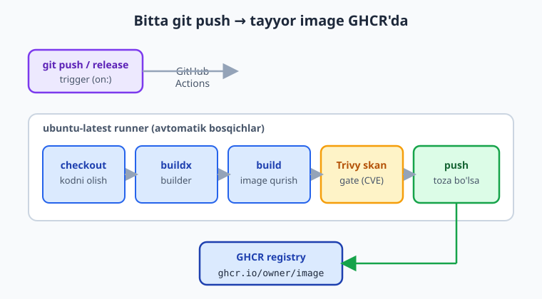
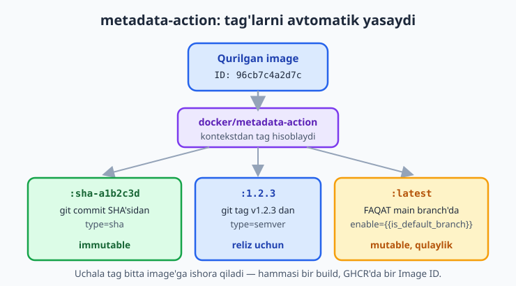
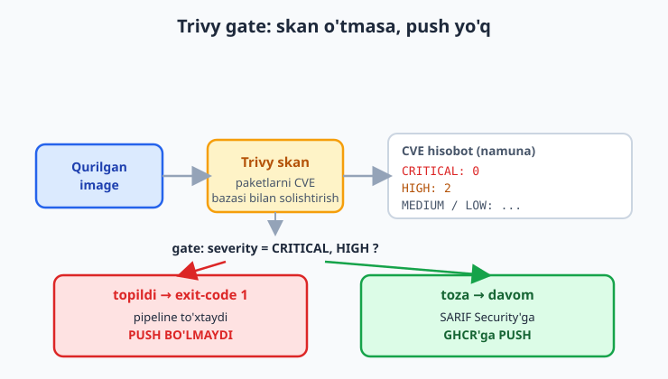

# 14 — Docker image CI va GHCR

[⬅️ Oldingi: 13 — Test va build pipeline](./13-pipeline-test-build.md) · [🏠 README](./README.md) · [Keyingi: 15 — Avtomatik deploy ➡️](./15-avtomatik-deploy.md)

> **Bu bobda:** 09-bobda image'ni qo'lda `docker build`/`docker tag`/`docker push` qilgan edik — endi shu jarayonni butunlay avtomatlashtiramiz: har `git push` va har release'da GitHub Actions image'ni o'zi qurib, tag qo'yib, GHCR'ga (`ghcr.io/<owner>/<image>`) yetkazadi; `permissions` bilan `GITHUB_TOKEN`'ga `packages: write` ruxsatini beramiz, `docker/login-action` bilan loginni, `docker/setup-buildx-action` bilan zamonaviy builder'ni, `docker/metadata-action` bilan tag/label (sha, semver, faqat main'da `latest`) avtomatik generatsiyasini, `docker/build-push-action` bilan `cache-from`/`cache-to: gha` keshli qurish va push'ni sozlaymiz, va nihoyat Trivy bilan har build'da zaiflik skanini qo'yib, `critical`/`high` topilsa deploy'ni to'xtatuvchi xavfsizlik gate'ini va SARIF natijani GitHub Security'ga yuklashni — supply-chain xavfsizligining birinchi qadamini — o'rganamiz.

---

## Muammo: har push'da qo'lda push qilishdan charchadik

09-bobda image'ni registry'ga chiqarishni o'rgandik. Eslang, oqim shunday edi:

```bash
docker build -t vazifalar-api:multi .
docker tag vazifalar-api:multi ghcr.io/ioqil/vazifalar-api:1.2.3
echo "$GHCR_TOKEN" | docker login ghcr.io -u ioqil --password-stdin
docker push ghcr.io/ioqil/vazifalar-api:1.2.3
```

Bu ishlaydi. Lekin har kichik o'zgarishdan keyin buni **qo'lda** takrorlash kerak. Muammolar darrov boshlanadi:

- **Unutib qolasiz.** Kodni push qildingiz, lekin image'ni qurishni unutdingiz — server eski versiyani ishlatib turaveradi.
- **Tag chalkashadi.** Bu safar `1.2.3` deb tag qo'ydingiz, keyingi safar `1.2.4` deyishni unutib, `latest`'ni qaytadan yozdingiz. Qaysi image qaysi koddan ekani noaniq.
- **"Mening mashinamda ishlaydi".** Image sizning noutbukingizda qurildi — sizning `node` versiyangiz, sizning keshingiz bilan. Hamkasbingiznikida boshqacha chiqishi mumkin.
- **Xavfsizlik tekshirilmaydi.** Image ichida `critical` zaiflik bo'lsa ham, hech kim sezmasdan production'ga ketadi.

Yechim — buni **CI'ga** topshirish. [Git & GitHub](../git-github/README.md) kitobida va 12-13-boblarda GitHub Actions bilan tanishdik: har push'da kod testdan o'tib, build bo'ladi. Endi shu pipeline'ga yana bitta bosqich qo'shamiz — **image'ni Actions runner'ida qurib, GHCR'ga avtomatik push qilish**. Bir marta sozlaysiz, keyin har push o'zi qiladi.

📌 Asosiy g'oya: **image'ni hech qachon o'z mashinangizda qo'lda qurib push qilmang.** Manba haqiqati (source of truth) — git repository. CI har commit'dan toza, takrorlanadigan image quradi va uni izlanadigan tag bilan registry'ga qo'yadi.



---

## GHCR nega CI uchun qulay

09-bobda ikki registry'ni ko'rgandik: Docker Hub (`docker.io`) va GHCR (`ghcr.io`). CI uchun GHCR'ning bitta katta afzalligi bor: **u sizning GitHub repo'ngiz bilan birga keladi** va Actions ichida login uchun alohida parol sozlash shart emas.

Har bir GitHub Actions ishi (workflow run) avtomatik ravishda **`GITHUB_TOKEN`** degan vaqtinchalik token oladi. Bu token shu run davomida amal qiladi, run tugagach o'chadi. Unga GHCR'ga push qilish huquqini berish uchun bittagina narsa kerak — workflow'da to'g'ri `permissions` belgilash. Tashqi `Personal Access Token` (PAT) yaratish, uni `secrets`'ga qo'yish — bularning hech biri kerak emas.

ℹ️ Docker Hub yoki boshqa tashqi registry'ga push qilmoqchi bo'lsangiz, u yerda `GITHUB_TOKEN` ishlamaydi — o'sha registry'ning hisobi uchun PAT/parol yaratib, GitHub repo'ngizning `Settings → Secrets`'iga (masalan `DOCKERHUB_TOKEN`) qo'shasiz va `login-action`'ga shu secret'ni berasiz. GHCR esa bularsiz, "ichki" ishlaydi.

---

## Ruxsatlar: `permissions` blokini to'g'ri qo'yish

Standart holatda `GITHUB_TOKEN` faqat **o'qish** huquqiga ega bo'lishi mumkin. Image'ni GHCR'ga push qilish — bu "package yozish" amali, shuning uchun token'ga aniq ruxsat berish kerak. Buni workflow yoki job darajasida `permissions` bilan beramiz:

```yaml
permissions:
  contents: read     # repo kodini o'qish (checkout uchun)
  packages: write    # GHCR'ga (package) image push qilish
```

- `contents: read` — `actions/checkout`'ga repo kodini o'qishga ruxsat.
- `packages: write` — eng muhimi: GHCR'ga image (GitHub terminologiyasida "package") **yozish** ruxsati.

📌 **Eng kam imtiyoz tamoyili** (principle of least privilege): token'ga faqat **kerakli** ruxsatni bering, ortig'ini emas. Bu yerda bizga kodni o'qish va package yozishdan boshqa hech narsa kerak emas — shuning uchun `write-all` kabi keng ruxsat bermaymiz. Token o'g'irlansa ham, qila oladigan zarari shu ikki narsadan oshmaydi.

⚠️ `permissions` blokini umuman yozmasangiz, repo'ngizning standart sozlamasiga tushib qolasiz — u esa juda cheklangan (push ishlamaydi) yoki aksincha juda keng bo'lishi mumkin. Shuning uchun har doim **aniq** yozing.

---

## To'liq workflow: qurish va GHCR'ga push

Endi bo'laklarni birlashtiramiz. Quyidagi workflow `.github/workflows/docker-publish.yml` ichida turadi. U har `main`'ga push'da, har `v*.*.*` tag'da va har release'da ishlaydi:

```yaml
name: Docker image qurish va GHCR'ga push

on:
  push:
    branches: [main]
    tags: ['v*.*.*']
  release:
    types: [published]

env:
  REGISTRY: ghcr.io
  IMAGE_NAME: ${{ github.repository }}

jobs:
  build-and-push:
    runs-on: ubuntu-latest
    permissions:
      contents: read
      packages: write
    steps:
      - name: Kodni checkout qilish
        uses: actions/checkout@v6

      - name: GHCR'ga login
        uses: docker/login-action@v4
        with:
          registry: ${{ env.REGISTRY }}
          username: ${{ github.actor }}
          password: ${{ secrets.GITHUB_TOKEN }}

      - name: Buildx sozlash
        uses: docker/setup-buildx-action@v4

      - name: Tag va label generatsiya (metadata)
        id: meta
        uses: docker/metadata-action@v6
        with:
          images: ${{ env.REGISTRY }}/${{ env.IMAGE_NAME }}
          tags: |
            type=sha
            type=semver,pattern={{version}}
            type=raw,value=latest,enable={{is_default_branch}}

      - name: Image qurish va push
        uses: docker/build-push-action@v7
        with:
          context: .
          push: true
          tags: ${{ steps.meta.outputs.tags }}
          labels: ${{ steps.meta.outputs.labels }}
          cache-from: type=gha
          cache-to: type=gha,mode=max
```

Bir oz uzun ko'rinadi, lekin har bir bosqich aniq bir ish qiladi. Endi qadam-baqadam ko'rib chiqamiz.

### `env`: takrorlanadigan qiymatlar

```yaml
env:
  REGISTRY: ghcr.io
  IMAGE_NAME: ${{ github.repository }}
```

`github.repository` — bu `egasi/repo-nomi` ko'rinishida keladi (masalan `ioqil/vazifalar-api`). Demak image'ning to'liq nomi `ghcr.io/ioqil/vazifalar-api` bo'ladi — aynan 09-bobdagidek. Bu qiymatlarni `env`'ga chiqarib, pastda bir necha marta takrorlashdan saqlanamiz.

### Login: `docker/login-action@v4`

```yaml
- name: GHCR'ga login
  uses: docker/login-action@v4
  with:
    registry: ${{ env.REGISTRY }}
    username: ${{ github.actor }}
    password: ${{ secrets.GITHUB_TOKEN }}
```

Bu 09-bobdagi `docker login ghcr.io -u ... --password-stdin`'ning Actions'dagi muqobili.

- `registry: ghcr.io` — qaysi registry'ga kirayotganimiz.
- `username: ${{ github.actor }}` — workflow'ni ishga tushirgan foydalanuvchi nomi.
- `password: ${{ secrets.GITHUB_TOKEN }}` — yuqorida aytgan avtomatik token. Buni biz yaratmaymiz — GitHub har run uchun o'zi beradi.

💡 `${{ secrets.GITHUB_TOKEN }}` — bu yagona "avtomatik" secret. Boshqa hech qanday secret sozlamasdan GHCR'ga push qila olamiz, chunki `permissions`'da `packages: write` berdik.

### Buildx: `docker/setup-buildx-action@v4`

```yaml
- name: Buildx sozlash
  uses: docker/setup-buildx-action@v4
```

`Buildx` — Docker'ning zamonaviy builder'i (BuildKit ustida). U keshlash, parallel qurish va multi-platform image'larni qo'llab-quvvatlaydi. Keyingi bosqichdagi `cache-from`/`cache-to: gha` (GitHub Actions keshi) aynan shu builder bilan ishlaydi. Bitta qator — keyingi hamma narsa shuning ustida ishlaydi.

### Metadata: `docker/metadata-action@v6` — tag'larni avtomatik o'ylab topadi

Bu — workflow'ning eng "aqlli" qismi. 09-bobda tag'larni qo'lda yozardik (`docker tag ...:1.2.3`, `...:sha-a1b2c3d`). `metadata-action` shu tag'larni **kontekstdan kelib chiqib o'zi generatsiya qiladi**:

```yaml
- name: Tag va label generatsiya (metadata)
  id: meta
  uses: docker/metadata-action@v6
  with:
    images: ${{ env.REGISTRY }}/${{ env.IMAGE_NAME }}
    tags: |
      type=sha
      type=semver,pattern={{version}}
      type=raw,value=latest,enable={{is_default_branch}}
```

`tags:` ostidagi har bir qator — bitta **qoida**:

- `type=sha` — git commit SHA'sidan tag yasaydi (masalan `sha-a1b2c3d`). Bu **immutable** — aynan qaysi koddan qurilgani har doim aniq.
- `type=semver,pattern={{version}}` — agar push `v1.2.3` ko'rinishidagi git **tag**'i bo'lsa, undan `1.2.3` image tag'ini yasaydi. Oddiy branch push'da bu qoida hech narsa qo'shmaydi.
- `type=raw,value=latest,enable={{is_default_branch}}` — `latest` tag'ini **faqat default branch** (`main`) bo'lganda qo'shadi. Boshqa branch'da `latest` o'zgarmaydi.

📌 Mana, 09-bobdagi tag strategiyamiz **avtomatlashdi**: sha (immutable), semver (reliz), `latest` (faqat main). `id: meta` muhim — keyingi bosqich natijaga `steps.meta.outputs.tags` orqali murojaat qiladi.

Bundan tashqari `metadata-action` foydali **label**'lar ham yasaydi (OCI standart): qaysi commit, qaysi vaqt, qaysi repo'dan qurilgani image'ning o'ziga yoziladi. Bu keyinchalik "bu image qayerdan keldi?" degan savolga javob beradi.



### Qurish va push: `docker/build-push-action@v7`

```yaml
- name: Image qurish va push
  uses: docker/build-push-action@v7
  with:
    context: .
    push: true
    tags: ${{ steps.meta.outputs.tags }}
    labels: ${{ steps.meta.outputs.labels }}
    cache-from: type=gha
    cache-to: type=gha,mode=max
```

Bu bitta bosqich `docker build` + `docker push`'ni birlashtiradi:

- `context: .` — Dockerfile va kod repo ildizida (09-bobdagi multi-stage Dockerfile).
- `push: true` — qurgandan keyin GHCR'ga push qil. (`false` qilsangiz faqat quradi, push qilmaydi — buni Trivy bilan ishlaganda ko'ramiz.)
- `tags`/`labels` — `metadata-action` yasagan tag va label'larni shu yerda ishlatamiz. Bitta build, lekin bir nechta tag — xuddi 09-bobdagi "bitta image, uchta tag".
- `cache-from: type=gha` / `cache-to: type=gha,mode=max` — build keshini **GitHub Actions keshida** saqlaydi (`gha` = GitHub Actions). Keyingi build o'zgarmagan qatlamlarni keshdan oladi — image qurish ancha tezlashadi. `mode=max` — barcha oraliq qatlamlarni ham keshlaydi (multi-stage uchun foydali).

💡 `cache-to: gha` birinchi run'da hech narsani tezlashtirmaydi (kesh bo'sh), lekin ikkinchi run'dan boshlab — agar `package.json` o'zgarmagan bo'lsa — `npm install` qatlami keshdan olinadi va build bir necha barobar tez tugaydi. Aynan 09-bobdagi "kam o'zgaradigan narsani avval ko'chir" qoidasining CI'dagi davomi.

⚠️ Push faqat siz repo'ga haqiqatan egalik qilganingizda va `permissions: packages: write` to'g'ri qo'yilganda ishlaydi. Birinchi push'dan keyin image GitHub repo'ngizning **"Packages"** bo'limida ko'rinadi. U standart holatda **private** bo'ladi (09-bobda aytganimizdek) — public qilmoqchi bo'lsangiz, package sozlamalaridan o'zgartirasiz.

ℹ️ **Illustrativ:** yuqoridagi workflow GHCR'ga **haqiqiy push** qiladi, bu esa real GitHub repo, real run va internet talab qiladi. Biz buni lokalda **ishga tushira olmaymiz** — buni o'z repo'ngizda `.github/workflows/`'ga qo'yib sinab ko'rasiz. Lekin biz workflow YAML'ini struktura va sintaksis jihatidan tekshirdik, va o'sha Dockerfile'ni lokalda haqiqatan qurib ishlashiga ishonch hosil qildik (bob oxiridagi tekshiruvga qarang).

---

## Tashqi registry uchun secret (Docker Hub misoli)

GHCR uchun secret kerak emas edi. Lekin Docker Hub yoki boshqa registry'ga push qilsangiz, uning hisobi uchun token kerak. Avval GitHub repo'da `Settings → Secrets and variables → Actions` ostida secret qo'shasiz (masalan `DOCKERHUB_TOKEN`), keyin:

```yaml
- name: Docker Hub'ga login
  uses: docker/login-action@v4
  with:
    username: ${{ secrets.DOCKERHUB_USERNAME }}
    password: ${{ secrets.DOCKERHUB_TOKEN }}
```

`registry`'ni yozmasak, standart `docker.io` (Docker Hub) bo'ladi.

📌 Secret'lar log'da hech qachon to'liq ko'rinmaydi (GitHub ularni avtomatik `***` bilan yashiradi). Parolni hech qachon workflow YAML'iga to'g'ridan-to'g'ri yozmang — har doim `secrets.`'dan oling. Docker Hub'da parol o'rniga **Access Token** ishlating (Docker Hub `Account Settings → Security`'dan yaratiladi).

---

## Supply-chain xavfsizligi: Trivy bilan zaiflik skani

Endi eng muhim qadamlardan biriga keldik. Image qurildi, push qilinmoqda — lekin uning ichida **ma'lum zaifliklar** (`CVE`) bormi? Eski `openssl`, zaif kutubxona, base image'da tuzatilmagan teshik? 09-bobda `docker scout`/`trivy`ni qisqa ko'rgandik. Endi uni **pipeline'ga qo'yamiz**, shunda har build avtomatik skanerlanadi.

Bu — **supply-chain xavfsizligi**ning birinchi qadami. Supply-chain (ta'minot zanjiri) — sizning kodingizdan tashqari, siz ishlatadigan **hamma narsa**: base image, npm paketlari, ularning bog'liqliklari. Bularning birortasida zaiflik bo'lsa, u sizning production image'ingizga ham o'tadi. Trivy aynan shuni topadi.



`aquasecurity/trivy-action` bilan image'ni skanerlaymiz va `critical`/`high` zaiflik topilsa, **pipeline'ni to'xtatamiz** (fail). Mantiq quyidagicha: avval image'ni quramiz (lekin hali push qilmaymiz), skanerlaymiz, **faqat toza bo'lsa** push qilamiz.

```yaml
name: Docker image + Trivy zaiflik skani

on:
  push:
    branches: [main]
  pull_request:

env:
  REGISTRY: ghcr.io
  IMAGE_NAME: ${{ github.repository }}

jobs:
  build-scan-push:
    runs-on: ubuntu-latest
    permissions:
      contents: read
      packages: write
      security-events: write
    steps:
      - name: Checkout
        uses: actions/checkout@v6

      - name: Buildx sozlash
        uses: docker/setup-buildx-action@v4

      - name: Metadata (tag/label)
        id: meta
        uses: docker/metadata-action@v6
        with:
          images: ${{ env.REGISTRY }}/${{ env.IMAGE_NAME }}
          tags: |
            type=sha
            type=raw,value=latest,enable={{is_default_branch}}

      - name: Image qurish (lokal, hali push emas)
        uses: docker/build-push-action@v7
        with:
          context: .
          load: true
          push: false
          tags: ${{ steps.meta.outputs.tags }}
          labels: ${{ steps.meta.outputs.labels }}
          cache-from: type=gha
          cache-to: type=gha,mode=max

      - name: Trivy skan (gate)
        uses: aquasecurity/trivy-action@v0.36.0
        with:
          image-ref: ${{ env.REGISTRY }}/${{ env.IMAGE_NAME }}:latest
          format: sarif
          output: trivy-results.sarif
          severity: CRITICAL,HIGH
          exit-code: '1'
          ignore-unfixed: true

      - name: SARIF natijani Security'ga yuklash
        if: always()
        uses: github/codeql-action/upload-sarif@v3
        with:
          sarif_file: trivy-results.sarif

      - name: GHCR'ga login
        uses: docker/login-action@v4
        with:
          registry: ${{ env.REGISTRY }}
          username: ${{ github.actor }}
          password: ${{ secrets.GITHUB_TOKEN }}

      - name: Skan o'tdi - endi push
        uses: docker/build-push-action@v7
        with:
          context: .
          push: true
          tags: ${{ steps.meta.outputs.tags }}
          labels: ${{ steps.meta.outputs.labels }}
          cache-from: type=gha
```

Yangi bo'laklar:

- `permissions: security-events: write` — qo'shildi, chunki skan natijasini (SARIF) GitHub'ning **Security** bo'limiga yuklaymiz.
- **Avval `load: true, push: false`** — image'ni runner'ning lokal Docker'iga yuklaymiz, **lekin GHCR'ga push qilmaymiz**. Avval tekshirilsin.
- **Trivy gate:**
  - `severity: CRITICAL,HIGH` — faqat shu darajadagi zaifliklarga e'tibor.
  - `exit-code: '1'` — agar shunday zaiflik topilsa, qadam **xato** (fail) bilan tugaydi va butun pipeline to'xtaydi — demak **push bo'lmaydi**. Bu — xavfsizlik **gate**'i.
  - `ignore-unfixed: true` — hali tuzatilmagan (fix yo'q) zaifliklarni e'tiborga olmaydi — aks holda siz qila oladigan hech narsasi yo'q xatolardan pipeline behuda yiqiladi.
  - `format: sarif`, `output: trivy-results.sarif` — natijani standart **SARIF** formatida faylga yozadi.
- **SARIF'ni yuklash** (`github/codeql-action/upload-sarif`) — `if: always()` bilan, ya'ni skan yiqilsa **ham** natijani yuklaydi. Topilgan zaifliklar GitHub repo'ngizning **Security → Code scanning** bo'limida chiroyli ro'yxat bo'lib ko'rinadi.

📌 Tartib muhim: **build → scan → (toza bo'lsa) push**. Agar avval push qilib, keyin skanerlasangiz, zaif image allaqachon registry'da turgan bo'ladi. Shuning uchun gate'ni push'dan **oldin** qo'yamiz.

ℹ️ **Illustrativ:** Trivy jonli ishlaganda internetdan eng yangi CVE bazasini yuklab oladi va aniq raqamlar sizning image'ingizga, o'sha kungi CVE bazasiga bog'liq. Masalan, hisobot taxminan shunday **namuna** ko'rinishda bo'ladi (bu — illyustratsiya, haqiqiy natija emas):

```text
ghcr.io/ioqil/vazifalar-api:latest (debian 12.x)
Total: 2 (HIGH: 2, CRITICAL: 0)
```

Agar `CRITICAL` yoki `HIGH` topilsa, `exit-code: '1'` tufayli qadam qizil bo'ladi va push bosqichigacha yetib bormaydi. Biz bu workflow'ni real GitHub'da ishga tushira olmaymiz (real run/CVE baza kerak), lekin YAML'ni struktura va sintaksis bo'yicha tekshirdik.

💡 Zaiflikni kamaytirishning eng samarali yo'li (09-bobda aytganimizdek) — kichik base (`-slim`/`distroless`) va base image'ni muntazam yangilab turish. Trivy faqat **ko'rsatadi**; tuzatish — base'ni yangilash yoki zaif paketni almashtirish.

---

## Hammasini birlashtirib: bitta `git push`dan production-ready image

Endi katta rasmni ko'ramiz. Siz lokalda kod yozasiz, test qilasiz, keyin:

```bash
git add .
git commit -m "vazifa qo'shish endpoint'i"
git push origin main
```

Shu bitta `git push`dan keyin GitHub Actions o'zi:

1. Kodni checkout qiladi.
2. Buildx'ni sozlaydi.
3. `metadata-action` bilan tag'larni hisoblaydi (`sha-<commit>`, `latest`, agar reliz bo'lsa `1.2.3`).
4. Image'ni quradi (keshdan foydalanib, tez).
5. Trivy bilan zaiflikka skanerlaydi — `critical`/`high` bo'lsa to'xtaydi.
6. Toza bo'lsa — GHCR'ga push qiladi.

Endi serveringizdagi yoki Kubernetes'dagi ish — shunchaki `ghcr.io/ioqil/vazifalar-api:sha-<commit>`'ni `pull` qilish. Buni **avtomatik** qilish — keyingi (15-bob, avtomatik deploy) mavzu. Hozircha pipeline image'ni tayyor, tag'langan va skanerlangan holda GHCR'ga yetkazadi.

📌 Bu — DevOps'ning markaziy g'oyasi: **manba git, qolgani avtomatik**. Inson qo'li faqat kodga tegadi; build, tag, skan, push — hammasi takrorlanadigan va kuzatiladigan (har run log'da ko'rinadi).

---

## 14-bob mashqlari

> Workflow YAML'larini lokalda `python -c "import yaml; ..."` va `python -m yamllint -d relaxed <fayl>` bilan tekshirishingiz mumkin. `docker build` (push'siz) lokalda ishlaydi. Real GHCR push / Actions run / jonli Trivy skan — GitHub hisobi va internet talab qiladi (illustrativ — o'z repo'ngizda sinang).

**Oson**

1. GHCR'ga push qiladigan workflow'da `permissions` bloki nima uchun kerak va qaysi ikki ruxsat yoziladi? Har birini bir jumlada izohlang.
2. `docker/login-action` da GHCR uchun `password` sifatida nima beriladi? Bu qiymatni siz yaratasizmi yoki GitHub o'zi beradimi?
3. `metadata-action`'dagi `type=raw,value=latest,enable={{is_default_branch}}` qatori nima qiladi? Nega `latest`'ni faqat `main`'da qo'shamiz?
4. `cache-from: type=gha` va `cache-to: type=gha` nimani tezlashtiradi? Birinchi run'da ham tez bo'ladimi?
5. Image'ning to'liq GHCR nomini yozing: foydalanuvchi `aziz`, repo `blog-api`. `${{ github.repository }}` bu yerda nimaga teng bo'ladi?

**O'rta**

6. Quyidagi workflow bo'lagidagi xatoni toping va tuzating (image push qilinmoqda, lekin nega ishlamaydi?):

```yaml
jobs:
  push:
    runs-on: ubuntu-latest
    steps:
      - uses: actions/checkout@v6
      - uses: docker/login-action@v4
        with:
          registry: ghcr.io
          username: ${{ github.actor }}
          password: ${{ secrets.GITHUB_TOKEN }}
      - uses: docker/build-push-action@v7
        with:
          push: true
          tags: ghcr.io/aziz/blog-api:latest
```

<details markdown="1"><summary>Yechim</summary>

`permissions` bloki yo'q. `GITHUB_TOKEN` standart holatda GHCR'ga (`packages`) yozish huquqiga ega bo'lmaydi, shuning uchun `push: true` "denied" xatosi beradi. Job'ga ruxsat qo'shamiz:

```yaml
jobs:
  push:
    runs-on: ubuntu-latest
    permissions:
      contents: read
      packages: write
    steps:
      - uses: actions/checkout@v6
      # ... qolgani o'zgarmaydi
```

(Ixtiyoriy: `context: .` ham qo'yilsa aniqroq bo'ladi, lekin u standart `.`.)

</details>

7. `metadata-action`'siz, qo'lda uchta tag (sha, semver, latest) yozmoqchisiz. `build-push-action`'ning `tags:` maydoniga ularni qanday yozasiz (foydalanuvchi `aziz`, image `blog-api`, sha `a1b2c3d`, versiya `2.0.0`)?

<details markdown="1"><summary>Yechim</summary>

```yaml
- uses: docker/build-push-action@v7
  with:
    context: .
    push: true
    tags: |
      ghcr.io/aziz/blog-api:sha-a1b2c3d
      ghcr.io/aziz/blog-api:2.0.0
      ghcr.io/aziz/blog-api:latest
```

Bir nechta tag — har biri alohida qatorda (`|` blok-skalyari). Bitta build, uch tag — barchasi bir `Image ID`'ga ishora qiladi (09-bobdagidek). `metadata-action` aynan shuni avtomatlashtirgan edi: qo'lda yozish xatoga moyil va commit SHA'ni har safar nusxalash kerak.

</details>

8. `type=sha` tag (immutable) bilan `latest` (mutable) farqini production deploy nuqtai nazaridan tushuntiring. Server qaysisini `pull` qilgani ma'qul va nega?

<details markdown="1"><summary>Yechim</summary>

`type=sha` (`sha-a1b2c3d`) — **immutable**: bir marta push qilingach hech qachon o'zgarmaydi, aynan qaysi commit'dan qurilgani aniq. `latest` — **mutable**: har push'da boshqa image'ga ko'chadi. Production server `sha-...` (yoki semver `1.2.3`) ni `pull` qilgani ma'qul, chunki: (1) qaysi versiya ishlayotgani aniq, (2) rollback oson (oldingi sha'ga qaytasiz), (3) ikki server bir vaqtda bir xil image oladi. `latest`'ga tayanish — "qaysi versiya ekani noaniq" muammosini keltiradi (09-bobda ko'rgandik).

</details>

9. Trivy gate'ida `exit-code: '1'` va `severity: CRITICAL,HIGH` nima qiladi? `ignore-unfixed: true` nega foydali?

<details markdown="1"><summary>Yechim</summary>

`severity: CRITICAL,HIGH` — Trivy faqat shu ikki darajadagi zaiflikka e'tibor beradi (medium/low'ni hisobotda ko'rsatsa-da, gate uchun hisobga olmaydi). `exit-code: '1'` — agar shunday zaiflik **topilsa**, qadam xato bilan tugaydi va pipeline to'xtaydi — demak push bo'lmaydi (xavfsizlik gate). `ignore-unfixed: true` — hali tuzatuvi (fix) chiqmagan zaifliklarni e'tiborsiz qoldiradi; aks holda siz hech narsa qila olmaydigan CVE'lar tufayli pipeline behuda yiqiladi. Bu amaliy muvozanat: jiddiy va **tuzatib bo'ladigan** muammoda to'xta.

</details>

10. Nega Trivy skanini push'dan **oldin** qo'yamiz, push'dan keyin emas? Workflow'da bu qanday tartibda ifodalanadi?

<details markdown="1"><summary>Yechim</summary>

Agar avval push qilib, keyin skanerlasak, zaif image allaqachon GHCR'da turadi — uni boshqalar pull qilib olishi mumkin. Gate ma'nosini yo'qotadi. Shuning uchun tartib: **build (`load: true, push: false`) → Trivy skan (gate) → faqat toza bo'lsa push (`push: true`)**. Skan yiqilsa, push qadami umuman ishga tushmaydi (oldingi qadam fail bo'lgani uchun).

</details>

**Qiyin**

11. 09-bobdagi namuna `vazifalar-api` (Express) uchun GHCR'ga push qiluvchi to'liq workflow yozing: trigger `main`'ga push va `v*.*.*` tag; `permissions` to'g'ri; login, buildx, metadata (sha + semver + latest faqat main), build-push (kesh bilan). YAML'ni `yamllint -d relaxed` bilan tekshiring.

<details markdown="1"><summary>Yechim</summary>

`.github/workflows/docker-publish.yml`:

```yaml
name: Docker image qurish va GHCR'ga push

on:
  push:
    branches: [main]
    tags: ['v*.*.*']

env:
  REGISTRY: ghcr.io
  IMAGE_NAME: ${{ github.repository }}

jobs:
  build-and-push:
    runs-on: ubuntu-latest
    permissions:
      contents: read
      packages: write
    steps:
      - uses: actions/checkout@v6
      - uses: docker/login-action@v4
        with:
          registry: ${{ env.REGISTRY }}
          username: ${{ github.actor }}
          password: ${{ secrets.GITHUB_TOKEN }}
      - uses: docker/setup-buildx-action@v4
      - id: meta
        uses: docker/metadata-action@v6
        with:
          images: ${{ env.REGISTRY }}/${{ env.IMAGE_NAME }}
          tags: |
            type=sha
            type=semver,pattern={{version}}
            type=raw,value=latest,enable={{is_default_branch}}
      - uses: docker/build-push-action@v7
        with:
          context: .
          push: true
          tags: ${{ steps.meta.outputs.tags }}
          labels: ${{ steps.meta.outputs.labels }}
          cache-from: type=gha
          cache-to: type=gha,mode=max
```

Tekshirish (lokal):

```bash
python -c "import yaml,sys; list(yaml.safe_load_all(open(sys.argv[1]))); print('parse OK')" docker-publish.yml
python -m yamllint -d relaxed docker-publish.yml
```

Bu workflow `main` push'da (sha + latest) va `v1.2.3` tag push'da (semver) image'ni quradi va GHCR'ga push qiladi. (Real push GitHub repo va internet talab qiladi — illustrativ.)

</details>

12. 11-mashqdagi workflow'ga Trivy zaiflik gate'ini qo'shing: image avval `push: false` bilan qurilsin, Trivy `CRITICAL,HIGH`'da `exit-code: '1'` bilan skanerlasin, SARIF natija GitHub Security'ga yuklansin, keyin (toza bo'lsa) push bo'lsin. `permissions`'ga nima qo'shiladi?

<details markdown="1"><summary>Yechim</summary>

`permissions`'ga `security-events: write` qo'shiladi (SARIF yuklash uchun). Build qadamiga `load: true, push: false`, so'ng Trivy va SARIF yuklash, oxirida push qadami:

```yaml
    permissions:
      contents: read
      packages: write
      security-events: write
    steps:
      - uses: actions/checkout@v6
      - uses: docker/setup-buildx-action@v4
      - id: meta
        uses: docker/metadata-action@v6
        with:
          images: ${{ env.REGISTRY }}/${{ env.IMAGE_NAME }}
          tags: |
            type=sha
            type=raw,value=latest,enable={{is_default_branch}}
      - name: Qurish (push'siz)
        uses: docker/build-push-action@v7
        with:
          context: .
          load: true
          push: false
          tags: ${{ steps.meta.outputs.tags }}
          cache-from: type=gha
          cache-to: type=gha,mode=max
      - name: Trivy skan
        uses: aquasecurity/trivy-action@v0.36.0
        with:
          image-ref: ${{ env.REGISTRY }}/${{ env.IMAGE_NAME }}:latest
          format: sarif
          output: trivy-results.sarif
          severity: CRITICAL,HIGH
          exit-code: '1'
          ignore-unfixed: true
      - name: SARIF yuklash
        if: always()
        uses: github/codeql-action/upload-sarif@v3
        with:
          sarif_file: trivy-results.sarif
      - uses: docker/login-action@v4
        with:
          registry: ${{ env.REGISTRY }}
          username: ${{ github.actor }}
          password: ${{ secrets.GITHUB_TOKEN }}
      - name: Push (skan o'tgach)
        uses: docker/build-push-action@v7
        with:
          context: .
          push: true
          tags: ${{ steps.meta.outputs.tags }}
          cache-from: type=gha
```

`if: always()` SARIF yuklashda muhim — skan yiqilsa **ham** natija Security bo'limiga tushadi. (Illustrativ — jonli Trivy CVE bazasini yuklaydi.)

</details>

13. Docker Hub'ga (GHCR emas) push qilmoqchisiz. GHCR variantidan nimasi farq qiladi? `secrets` qaysi, `login-action` qanday o'zgaradi, `permissions: packages: write` kerakmi?

<details markdown="1"><summary>Yechim</summary>

Farqlar:
- **Secret kerak:** Docker Hub'da `GITHUB_TOKEN` ishlamaydi. Docker Hub `Account Settings → Security`'dan **Access Token** yaratib, GitHub repo `Settings → Secrets`'iga (masalan `DOCKERHUB_TOKEN`, `DOCKERHUB_USERNAME`) qo'shasiz.
- **`login-action`:** `registry`'ni yozmaysiz (standart `docker.io`), `username`/`password`'ni secret'lardan olasiz:

```yaml
- uses: docker/login-action@v4
  with:
    username: ${{ secrets.DOCKERHUB_USERNAME }}
    password: ${{ secrets.DOCKERHUB_TOKEN }}
```

- **`permissions: packages: write` kerak emas:** u faqat GHCR (GitHub packages) uchun. Docker Hub'ga push autentifikatsiya secret token orqali bo'ladi, GitHub token ruxsatiga bog'liq emas.
- **Image nomi:** `aziz/blog-api` (yoki `docker.io/aziz/blog-api`) — `ghcr.io/` prefiksisiz.

</details>

14. Workflow ishladi, lekin `docker/build-push-action` "denied: permission_denied: write_package" xatosi bilan to'xtadi. Ehtimoliy ikkita sababni va yechimni ayting.

<details markdown="1"><summary>Yechim</summary>

Ikkita asosiy sabab:

1. **`permissions: packages: write` yo'q** (yoki `contents: read` o'rniga noto'g'ri yozilgan). Yechim: job/workflow'ga aniq `permissions` blokini qo'shish.
2. **Repo darajasidagi standart ruxsat cheklangan.** GitHub repo `Settings → Actions → General → Workflow permissions` da "Read repository contents permission" tanlangan bo'lsa, hatto workflow'da yozsangiz ham cheklov bo'lishi mumkin. Yechim: "Read and write permissions"ni yoqish yoki ko'pincha workflow'dagi aniq `permissions` bloki yetarli.

Qo'shimcha: image nomi `${{ github.repository }}`'ga mos kelmasa (boshqa egaga push) ham denied bo'ladi — egasi sizning hisobingiz/tashkilotingiz bo'lishi kerak.

</details>

15. Bir jamoadosh "har push'da `latest`'ni serverga pull qilamiz, shunda doim eng yangisi bo'ladi" deydi. Bu yondashuvning xavfini tushuntiring va CI tag strategiyasi bilan qanday to'g'ri qilishni taklif qiling.

<details markdown="1"><summary>Yechim</summary>

Xavf: `latest` — mutable, har push'da boshqa image'ga ko'chadi. Server `pull latest` qilganda **qaysi versiya kelishi noaniq**; ikki server turli vaqtda turli image olishi mumkin; muammo chiqsa **rollback qilib bo'lmaydi** (oldingi `latest` qayerda — bilinmaydi). To'g'ri yondashuv: CI har commit'ga **immutable** `sha-<commit>` (yoki reliz uchun semver `1.2.3`) tag qo'yadi (`metadata-action` buni avtomatik qiladi); server aynan **o'sha aniq tag**ni pull qiladi. `latest`'ni qulaylik uchun yonida saqlash mumkin, lekin deploy unga **tayanmasin**. Shunda har deploy aniq, takrorlanadigan va rollback oson (oldingi sha-tagga qaytasiz). Avtomatik deploy'ni 15-bobda ko'ramiz.

</details>

---

[⬅️ Oldingi: 13 — Test va build pipeline](./13-pipeline-test-build.md) · [🏠 README](./README.md) · [Keyingi: 15 — Avtomatik deploy ➡️](./15-avtomatik-deploy.md)
