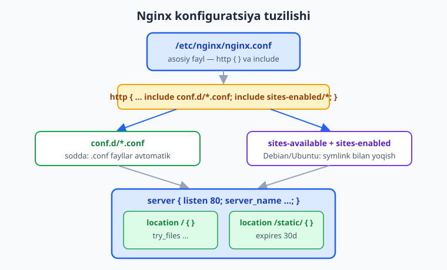
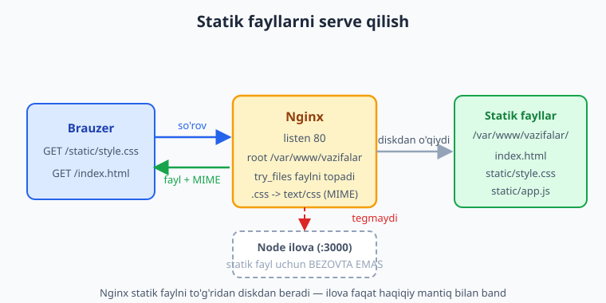

# 16 — Nginx asoslari

[⬅️ Oldingi: 15 — Avtomatik deploy](./15-avtomatik-deploy.md) · [🏠 README](./README.md) · [Keyingi: 17 — Reverse proxy va load balancing ➡️](./17-reverse-proxy-load-balancing.md)

> **Bu bobda:** ilovamiz oldida turadigan **web server**ni — Nginx'ni (o'qilishi "engin-eks") noldan o'rganamiz: nima uchun kerakligini ([05-bobda](./05-qolda-deploy.md) ochiq `:3000` portining og'rig'ini eslab), uni real serverda `apt install nginx` va lokalda Docker'da (`nginx:1.27-alpine`) o'rnatishni, konfiguratsiya tuzilishini (`nginx.conf`, `conf.d/*.conf`, `sites-available`+`sites-enabled` symlink konvensiyasi va `http { server { location {} } }` kontekstlar ierarxiyasini), `server` blokini (`listen`, `server_name`, `root`, `index`, `location`, `try_files`), statik HTML/CSS/JS papkasini serve qilishni, loglarni (`access_log`/`error_log` qayerda va `tail -f`) va boshqaruvni (`nginx -t` config testi — **har** o'zgarishdan keyin!, `nginx -s reload` / `systemctl reload` graceful — downtime'siz, `restart`). Bobni Docker'da `nginx -t` bilan **haqiqatan** tekshirib, kichik `index.html` ni `curl` orqali serve qilib ko'ramiz. Keyingi bobda esa shu Nginx'ni ilovamiz oldiga reverse proxy qilib qo'yamiz.

---

## Muammo: ochiq `:3000` port endi yetarli emas

[05-bobda](./05-qolda-deploy.md) namuna ilovamizni — vazifalar (todo) API'ni — serverga qo'lda joyladik va `ufw allow 3000/tcp` bilan portini ochib qo'ydik. Ilova ishladi, lekin biz o'shanda **uchta og'riq**ni belgilab qo'ygandik:

- Foydalanuvchiga `http://203.0.113.10:3000` deb aytib bo'lmaydi — xunuk, domen yo'q, port ko'rinib turibdi.
- Ilova porti to'g'ridan-to'g'ri internetga ochilgan — ilova **bevosita** hujum yuzasiga aylangan.
- HTTPS yo'q, statik fayllar (rasm, CSS) ilovaning o'zidan tarqatilmoqda — bu sekin va isrofgarchilik.

Yechim — ilova **oldiga** maxsus dasturni qo'yish: u 80- (va keyin 443-) portda turadi, tashqi dunyo bilan u gaplashadi, ilova esa ichkarida, ko'rinmas holda ishlaydi. Bu dastur — **web server**, eng mashhuri esa **Nginx**.

> 📌 Bu bobda biz Nginx'ni **web server** va **statik fayl serveri** sifatida o'rganamiz — uning poydevorini. Ilova oldiga uni **reverse proxy** qilib qo'yish (so'rovni `localhost:3000` ga uzatish) va yukni bir nechta nusxaga taqsimlash (load balancing) — keyingi, [17-bob](./17-reverse-proxy-load-balancing.md) mavzusi. Avval Nginx'ning o'zini tushunib olaylik.

---

## Nginx nima va nega kerak

**Nginx** — yuqori unumdorlikka ega ochiq kodli **web server**. U bir vaqtning o'zida bir nechta vazifani bajara oladi:

- **Web server** — brauzerdan kelgan HTTP so'rovlarini qabul qiladi va javob qaytaradi.
- **Statik fayl serveri** — HTML, CSS, JS, rasm kabi o'zgarmas fayllarni juda tez tarqatadi (ilovani bezovta qilmasdan).
- **Reverse proxy** — so'rovni orqadagi ilovaga (masalan, `localhost:3000` dagi Node) uzatadi ([17-bob](./17-reverse-proxy-load-balancing.md)).
- **Load balancer** — bir xil ilovaning bir nechta nusxasi o'rtasida yukni taqsimlaydi ([17-bob](./17-reverse-proxy-load-balancing.md)).

Nima uchun ilova oldiga aynan Nginx qo'yiladi? Sababi — u **C tilida yozilgan**, hodisaga asoslangan (event-driven) arxitekturaga ega va o'n minglab bir vaqtdagi ulanishni juda kam xotira bilan eplaydi. Node.js (yoki Python, PHP) ilovasi esa biznes-mantiq uchun yaratilgan — statik fayl tarqatish, ko'p ulanishni ushlab turish va TLS shifrlash unga noqulay va sekin. Shuning uchun "mehnat taqsimoti" qilinadi:

> 💡 **Oddiy o'xshatish:** Nginx — restoran eshigi oldidagi tajribali **darbon va ofitsiant**. Mehmonni (so'rovni) kutib oladi, menyu (statik fayl) bo'lsa o'zi beradi, ovqat kerak bo'lsa oshxonaga (ilovaga) buyurtma uzatadi. Oshpaz (ilova) faqat ovqat tayyorlaydi — eshik oldida turib mijoz kutib olmaydi. Shu sababli oshpaz tez va xotirjam ishlaydi, eshik esa hech qachon to'lib qolmaydi.

Apache HTTP Server ham bor (eski, hali keng tarqalgan), lekin yangi loyihalarda statik serve va reverse proxy uchun Nginx odatiy tanlov.

---

## O'rnatish

Nginx'ni ikki muhitda ko'rib chiqamiz: lokalda mashq qilish uchun **Docker** va real ish uchun **VPS**.

### Lokalda Docker bilan (mashq uchun)

Eng tez yo'l — rasmiy `nginx` image. Biz yengil `alpine` variantidan foydalanamiz (atigi bir necha megabayt):

```bash
docker run --rm -d --name nginx-mashq -p 8080:80 nginx:1.27-alpine
```

```text
a1b2c3d4e5f6...
```

Endi brauzerda yoki `curl` bilan tekshiramiz:

```bash
curl -I http://localhost:8080
```

```text
HTTP/1.1 200 OK
Server: nginx/1.27.4
Content-Type: text/html
```

Ishladi — Nginx default "Welcome to nginx!" sahifasini berdi. Tozalash:

```bash
docker stop nginx-mashq
```

> 💡 `nginx:1.27-alpine` — barqaror (stable) tarmoqning yengil image'i. `nginx:stable-alpine` ham bor (eng so'nggi stable). Mashq va testlar uchun Docker juda qulay: serverni ifloslantirmaysiz, `docker stop` bilan izsiz tozalanadi.

### Real serverda (VPS, Ubuntu)

VPS'da (Ubuntu 26.04 LTS yoki hali qo'llab-quvvatlanadigan 24.04 LTS) Nginx tizim paketidan o'rnatiladi:

```bash
sudo apt update
sudo apt install -y nginx
```

O'rnatilgach, Nginx **avtomatik** xizmat sifatida ishga tushadi. Holatini tekshiramiz:

```bash
systemctl status nginx
```

```text
● nginx.service - A high performance web server and a reverse proxy server
     Active: active (running) since ...
```

Serverning IP'siga brauzerda kirsangiz, "Welcome to nginx!" sahifasini ko'rasiz — 80-port allaqachon ochiq. `ufw` ([04-bob](./04-tarmoq-xavfsizlik.md)) yoqilgan bo'lsa, HTTP/HTTPS trafikni ruxsat berasiz:

```bash
sudo ufw allow 'Nginx Full'
```

> ⚠️ Bu bobdagi `apt`, `systemctl` va `ufw` qadamlari **real VPS** uchun — ular **illustrativ**, o'z serveringizda bajariladi. Lokal kompyuterda buning o'rniga Docker bilan mashq qiling: tushuncha va konfiguratsiya bir xil, faqat boshqaruv buyrug'i (`systemctl reload` o'rniga `nginx -s reload`) farq qiladi.

---

## Konfiguratsiya tuzilishi

Nginx'ning butun xatti-harakati matn fayllar — konfiguratsiya bilan boshqariladi. Boshlovchilarni eng ko'p chalkashtiradigan narsa — bu fayllarning **qayerda turishi** va bir-biriga **qanday ulanishi**. Keling, ierarxiyani tartib bilan ko'rib chiqaylik.



**Asosiy fayl — `/etc/nginx/nginx.conf`.** Bu bosh konfiguratsiya: global sozlamalar (ishchi jarayonlar soni, loglar, MIME turlari) va eng muhimi — **boshqa fayllarni ichiga qo'shadigan** (`include`) `http { }` bloki shu yerda. Odatda unga to'g'ridan-to'g'ri tegmaysiz; ichida shunaqa qatorlar bo'ladi:

```nginx
http {
    include       /etc/nginx/mime.types;
    default_type  application/octet-stream;

    access_log  /var/log/nginx/access.log;
    error_log   /var/log/nginx/error.log;

    include /etc/nginx/conf.d/*.conf;
    include /etc/nginx/sites-enabled/*;
}
```

Ko'rib turganingizdek, `http { }` ikki joydan qo'shimcha fayllarni **include** qiladi — sizning saytlaringiz aynan o'sha papkalarda yashaydi:

- **`/etc/nginx/conf.d/*.conf`** — barcha `.conf` fayllar avtomatik qo'shiladi. Bu — Docker image va ko'p distributivlardagi sodda usul. Sayt konfiguratsiyasini shu yerga `mysite.conf` deb tashlaysiz — tamom.
- **`/etc/nginx/sites-available/` + `/etc/nginx/sites-enabled/`** — Debian/Ubuntu konvensiyasi. To'liq sxema bunday: konfiguratsiyani `sites-available/` da yozasiz (bu "mavjud, lekin yoqilmagan" saytlar ombori), keyin uni **yoqish** uchun `sites-enabled/` ga **symlink** (ramziy havola) qo'yasiz. Faqat `sites-enabled/` dagilari ishlaydi.

```bash
# saytni yoqish: available'dan enabled'ga symlink
sudo ln -s /etc/nginx/sites-available/vazifalar /etc/nginx/sites-enabled/

# saytni o'chirish (faylni o'chirmasdan): symlink'ni olib tashlash
sudo rm /etc/nginx/sites-enabled/vazifalar
```

> 💡 `sites-available` + symlink g'oyasi — saytni **o'chirmasdan** vaqtincha **o'chirib qo'yish** imkonini beradi. Symlink'ni olib tashlaysiz, sayt o'chadi; konfiguratsiyaning o'zi `sites-available` da omon qoladi. Docker image'da odatda faqat `conf.d/` bo'ladi (soddaroq) — biz mashqlarda shuni ishlatamiz.

### Kontekstlar: `http { server { location {} } }`

Nginx konfiguratsiyasi **kontekst** (blok) ierarxiyasidan iborat. Bu — bir-birining ichiga joylashgan figurali qavslar. Asosiy uchtasi:

| Kontekst | Vazifasi |
|---|---|
| `http { }` | Barcha HTTP sozlamalari shu yerda. `nginx.conf` ichida bir marta. |
| `server { }` | Bitta **virtual server** (sayt): qaysi portni tinglaydi, qaysi domenga javob beradi. Bittadan ko'p bo'lishi mumkin. |
| `location { }` | `server` ichida: **URL yo'liga** qarab nima qilish. Masalan `/` uchun bir narsa, `/static/` uchun boshqasi. |

Ana shu uch kontekstning ichma-ich joylashishi — Nginx konfiguratsiyasini o'qishning kalitidir. Biz odatda `conf.d/*.conf` yoki `sites-available/*` faylida faqat **`server { }`** blokini yozamiz (u allaqachon `http { }` ichiga `include` qilinadi).

---

## `server` bloki: virtual server

Mana namuna ilovamiz uchun eng sodda statik `server` bloki. Hozircha u statik fayl beradi (reverse proxy keyingi bobda):

```nginx
server {
    listen 80;
    server_name vazifalar.uz www.vazifalar.uz;

    root  /var/www/vazifalar;
    index index.html;

    location / {
        try_files $uri $uri/ =404;
    }
}
```

Har bir qatorni ochib beramiz:

- **`listen 80;`** — bu server **80-portni** (oddiy HTTP) tinglaydi. HTTPS uchun keyin `listen 443 ssl;` qo'shiladi ([18-bob](./18-https-domen.md)).
- **`server_name vazifalar.uz www.vazifalar.uz;`** — bu server qaysi **domen nom**(lar)iga javob beradi. Bir IP'da bir nechta sayt turishi mumkin; Nginx so'rovning `Host` sarlavhasiga qarab to'g'ri `server` blokini tanlaydi.
- **`root /var/www/vazifalar;`** — fayllar **qayerdan** olinadi. So'rov `/about.html` bo'lsa, Nginx `/var/www/vazifalar/about.html` faylini qaytaradi.
- **`index index.html;`** — papka so'ralganda (masalan `/`) qaysi fayl beriladi (`/var/www/vazifalar/index.html`).
- **`location / { ... }`** — `/` bilan boshlanadigan barcha yo'llar uchun qoida.
- **`try_files $uri $uri/ =404;`** — eng muhim qator. Nginx **navbat bilan** sinab ko'radi: avval `$uri` (so'ralgan fayl mavjudmi?), keyin `$uri/` (shu nomli papka bormi?), topilmasa **`=404`** (Not Found) qaytaradi. Bu — fayl yo'q bo'lsa toza xato berishni kafolatlaydi.

> ℹ️ **MIME turlari.** `nginx.conf` dagi `include mime.types;` Nginx'ga fayl kengaytmasiga qarab to'g'ri `Content-Type` qo'yishni o'rgatadi: `.html` -> `text/html`, `.css` -> `text/css`, `.js` -> `application/javascript`, `.png` -> `image/png`. Shu sababli brauzer CSS'ni stil sifatida, rasmni rasm sifatida to'g'ri qabul qiladi. Bu avtomatik ishlaydi — sozlash shart emas.

### So'rov qanday `server` va `location` ni topadi

Kelgan har bir so'rov ikki bosqichdan o'tadi: avval **qaysi `server`**, keyin **qaysi `location`**.


Masalan, `GET /static/style.css` so'rovi `Host: vazifalar.uz` bilan kelsa:

1. Nginx `Host` ni `server_name` lar bilan solishtiradi -> `vazifalar.uz` serverini tanlaydi.
2. `/static/style.css` yo'lini `location` lar bilan solishtiradi. Eng mos kelganini tanlaydi (masalan, `location /static/` bo'lsa — o'sha; bo'lmasa `location /`).
3. Tanlangan `location` ichidagi qoidaga (`root` + `try_files`) ko'ra `/var/www/.../static/style.css` faylini topib qaytaradi.

> 📌 `location` mosligi muhim mavzu (prefiks `/static/`, aniq `=`, regex `~`), lekin boshlovchi uchun bir qoida yetarli: **aniqroq (uzunroq prefiks) location ustun keladi.** `location /static/` `location /` dan ko'ra aniqroq, shuning uchun `/static/...` so'rovlari unga tushadi.

---

## Statik fayllarni serve qilish

Endi amaliyot — Nginx'ni shunchaki statik HTML/CSS papkasini serve qiladigan qilib sozlaymiz. Bu — har qanday "frontend" (React build, oddiy sayt, hujjat) ni tarqatishning poydevori.



Aytaylik, `/var/www/vazifalar` papkasida statik fayllarimiz bor:

```text
/var/www/vazifalar/
├── index.html
└── static/
    └── style.css
```

Konfiguratsiya — ikki `location` bilan: biri umumiy (`/`), biri statik papka uchun (`/static/`):

```nginx
server {
    listen 80;
    server_name vazifalar.uz;

    root  /var/www/vazifalar;
    index index.html;

    # Asosiy sahifalar
    location / {
        try_files $uri $uri/ =404;
    }

    # Statik fayllar — uzoq muddat keshlash bilan
    location /static/ {
        expires 30d;
        access_log off;
    }
}
```

`location /static/` da ikki qo'shimcha sozlama bor:

- **`expires 30d;`** — brauzerga "bu fayllarni 30 kun keshda saqla" deydi (`Cache-Control` sarlavhasi). CSS/JS kam o'zgargani uchun bu saytni tezlashtiradi.
- **`access_log off;`** — statik fayllar uchun har so'rovni logga yozmaymiz (log faylni shishirmaslik uchun).

> 💡 Nginx statik faylni **ilovaga umuman tegmasdan** to'g'ridan-to'g'ri diskdan beradi. Node ilovangiz CSS/rasm uchun bezovta bo'lmaydi — u faqat haqiqiy mantiqiy so'rovlar (`GET /tasks`) bilan shug'ullanadi. Aynan shu sabab statik kontentni Nginx'ga topshirish — birinchi va eng arzon optimizatsiya.

---

## Loglar: nima sodir bo'layotganini ko'rish

Nginx har bir so'rov va har bir xatoni **log** fayllarga yozadi. Standart joy — `/var/log/nginx/`:

- **`access_log`** (`/var/log/nginx/access.log`) — **har bir** so'rov: kim, qachon, qaysi URL'ni so'radi, qaysi status kod (200, 404, 500) qaytdi.
- **`error_log`** (`/var/log/nginx/error.log`) — **xatolar va ogohlantirishlar**: ilova javob bermadi, fayl topilmadi, config muammosi.

Loglarni jonli kuzatish uchun `tail -f` ([03-bob](./03-bash-skripting.md)):

```bash
sudo tail -f /var/log/nginx/access.log
```

```text
203.0.113.5 - - [13/Jun/2026:10:22:41 +0000] "GET /tasks HTTP/1.1" 200 87 "-" "curl/8.5.0"
203.0.113.5 - - [13/Jun/2026:10:22:55 +0000] "GET /yoq.html HTTP/1.1" 404 153 "-" "Mozilla/5.0"
```

Birinchi qatorda `200` — muvaffaqiyat; ikkinchisida `404` — fayl topilmadi. Biror narsa ishlamasa, **birinchi qaraydigan joyingiz — aynan shu ikki fayl**:

> 💡 Docker'da Nginx loglarni faylga emas, **konteyner chiqishi**ga (stdout/stderr) yozadi — shu sababli `docker logs <konteyner>` bilan ko'rasiz. Bu konteyner uchun maqsadli xatti-harakat: log fayllarni boshqarish o'rniga ularni Docker o'zi yig'adi.

---

## Boshqaruv: test, reload, restart

Nginx konfiguratsiyasini o'zgartirsangiz, u **avtomatik** qo'llanmaydi — qayta yuklash kerak. Lekin undan **oldin** har doim bitta qadam bor:

### 1. `nginx -t` — config testi (HAR o'zgarishdan keyin!)

```bash
sudo nginx -t
```

```text
nginx: the configuration file /etc/nginx/nginx.conf syntax is ok
nginx: configuration file /etc/nginx/nginx.conf test is successful
```

Bu buyruq konfiguratsiyani **ishga tushirmasdan tekshiradi** — sintaksis xato bormi, fayllar topiladimi. Agar xato bo'lsa, aniq qatorni ko'rsatadi:

```text
nginx: [emerg] unexpected "}" in /etc/nginx/conf.d/vazifalar.conf:12
nginx: configuration file test failed
```

> 📌 **Oltin qoida:** `nginx -t` **har** konfiguratsiya o'zgarishidan keyin, reload'dan **oldin** ishlat. Sintaksis xatosi bilan reload qilsangiz, Nginx eski (ishlaydigan) konfiguratsiyada qoladi yoki — restart bo'lsa — umuman ko'tarilmaydi va sayt yiqiladi. Test — bu sizning xavfsizlik to'ringizdir.

### 2. `reload` — graceful (downtime'siz)

Test o'tgach, yangi konfiguratsiyani qo'llaymiz. Eng to'g'ri yo'l — **reload** (qayta yuklash), `restart` (qayta ishga tushirish) emas:

```bash
# Real serverda (systemd):
sudo systemctl reload nginx

# Docker konteyneri ichida (yoki systemd bo'lmagan joyda):
nginx -s reload
```

**Reload — graceful:** Nginx yangi konfiguratsiyani o'qiydi, yangi ishchi jarayonlarni ko'taradi, eski jarayonlar esa **joriy so'rovlarni tugatib bo'lgach** xotirjam to'xtaydi. Natijada **downtime yo'q** — birorta ham so'rov tushib qolmaydi. Reload paytida sayt bir soniya ham o'chmaydi.

### 3. `restart` — to'liq qayta ishga tushirish

```bash
sudo systemctl restart nginx
```

`restart` — Nginx'ni **butunlay to'xtatib**, qaytadan ishga tushiradi. Bu vaqtda qisqa **downtime** bo'ladi va joriy ulanishlar uziladi. Restart faqat reload yetmaganda kerak bo'ladi — masalan, port (`listen`) o'zgarganda yoki Nginx'ni butunlay yangidan boshlash kerak bo'lganda. Kundalik konfiguratsiya o'zgarishlari uchun har doim **reload**.

| Buyruq | Nima qiladi | Downtime |
|---|---|---|
| `nginx -t` | Konfiguratsiyani tekshiradi (qo'llamaydi) | Yo'q (hech narsani o'zgartirmaydi) |
| `systemctl reload nginx` / `nginx -s reload` | Configni qayta o'qiydi, graceful | **Yo'q** |
| `systemctl restart nginx` | To'liq to'xtatib-yoqadi | **Ha** (qisqa) |

> ⚠️ Eng keng tarqalgan boshlovchi xatosi: configni o'zgartirib, `nginx -t` qilmasdan to'g'ridan `restart` qilish. Agar configda xato bo'lsa — Nginx ko'tarilmaydi va sayt yiqiladi. **Avval test, keyin reload** — bu odatni hoziroq qabul qiling.

---

## Hammasini birga: tekshirilgan namuna

Mana to'liq, **haqiqatan tekshirilgan** statik konfiguratsiya. Buni `conf.d/` ga `vazifalar.conf` deb qo'yasiz:

```nginx
server {
    listen 80;
    server_name localhost;

    root  /usr/share/nginx/html;
    index index.html;

    location / {
        try_files $uri $uri/ =404;
    }

    location /static/ {
        expires 30d;
        access_log off;
    }
}
```

Docker bilan lokalda sinash (mashq sxemasi):

```bash
# 1. Config va statik faylni tayyorlang (vazifalar.conf + html/index.html)
# 2. Konteynerni configni va html'ni mount qilib ishga tushiring:
docker run --rm -d --name nginx-test -p 8080:80 \
  -v "$PWD/vazifalar.conf:/etc/nginx/conf.d/default.conf:ro" \
  -v "$PWD/html:/usr/share/nginx/html:ro" \
  nginx:1.27-alpine

# 3. Tekshiring:
curl http://localhost:8080
docker exec nginx-test nginx -t   # config testi

# 4. Tozalang:
docker stop nginx-test
```

Keyingi bobda aynan shu `server` blokiga **`location /tasks/` -> `proxy_pass http://localhost:3000;`** qo'shib, uni namuna ilovamiz oldidagi **reverse proxy** ga aylantiramiz. Nginx poydevori esa — siz hozir o'rgangan `server`, `location`, `try_files`, `nginx -t`, `reload` — o'zgarmaydi.

---

## 16-bob mashqlari

### Oson

1. `docker run --rm -d --name nginx-mashq -p 8080:80 nginx:1.27-alpine` bilan Nginx'ni ishga tushiring, `curl -I http://localhost:8080` qiling va `200 OK` hamda `Server: nginx/...` sarlavhasini ko'ring. So'ng `docker stop nginx-mashq` bilan tozalang.
2. `server` blokidagi quyidagi to'rt direktivani o'z so'zlaringiz bilan tushuntiring: `listen`, `server_name`, `root`, `index`.
3. `nginx -t` buyrug'i nima qiladi va nima uchun u `reload`/`restart` dan **oldin** ishlatiladi? Bir jumlada javob bering.
4. `reload` va `restart` farqini ayting: qaysi biri downtime keltiradi, qaysi biri yo'q va nega?
5. Nginx loglari qayerda saqlanadi (ikki fayl nomini ayting) va `tail -f` bilan jonli kuzatishni qanday qilasiz?

### O'rta

6. `try_files $uri $uri/ =404;` qatorining har bir qismini (`$uri`, `$uri/`, `=404`) ajratib tushuntiring. `/about` so'ralganda Nginx aynan nimani sinab ko'radi?
7. `sites-available` + `sites-enabled` konvensiyasini tushuntiring: saytni "yoqish" va "o'chirish" qanday symlink amali bilan qilinadi? Nega bu `conf.d/` dan ko'ra moslashuvchanroq?
8. `conf.d/*.conf` va `sites-enabled/*` — ikkalasi ham `nginx.conf` ning qaysi kontekstidan `include` qilinadi? `http { server { location {} } }` ierarxiyasini chizib bering.
9. Statik fayllar uchun `location /static/` ga `expires 30d;` va `access_log off;` qo'shishning ikki foydasini ayting. Nega statik kontentni ilova emas, Nginx serve qilgani afzal?
10. Bitta IP'da ikkita domen (`a.uz` va `b.uz`) ni serve qilmoqchisiz. Nginx kelgan so'rovni qaysi `server` blokiga yo'naltirishni qanday hal qiladi? Qaysi sarlavha hal qiluvchi?

### Qiyin

11. To'liq statik sayt sozlang va Docker bilan **haqiqatan** sinab ko'ring: `vazifalar.conf` (`server` bloki, `location /` + `try_files`) va `html/index.html` yarating, ularni `nginx:1.27-alpine` konteyneriga mount qiling, `nginx -t` bilan tekshiring va `curl http://localhost:8080` bilan o'z HTML'ingizni ko'ring. Tugagach tozalang.
12. Config'ga ataylab **sintaksis xato** kiriting (masalan, `server { }` blokining yopuvchi `}` sini olib tashlang), `nginx -t` qiling va u qaysi qatorni ko'rsatishini kuzating. Xatoni tuzatib qayta test qiling. Bu mashq nima uchun har reload'dan oldin `nginx -t` muhimligini ko'rsatadi?
13. `location` mosligi: ikkita `location / { ... }` va `location /static/ { ... }` bo'lsa, `GET /static/app.js` so'rovi qaysi blokga tushadi va nega? "Aniqroq prefiks ustun keladi" qoidasini misol bilan tushuntiring.

<details markdown="1"><summary>Yechim — 6</summary>

`try_files $uri $uri/ =404;` Nginx'ga so'ralgan URL bo'yicha **navbat bilan** quyidagilarni sinashni buyuradi:

- **`$uri`** — so'ralgan yo'l nomidagi **fayl** mavjudmi? `/about` uchun `root/about` faylini qidiradi.
- **`$uri/`** — shu nomli **papka** mavjudmi? `root/about/` papkasi bo'lsa, undagi `index` faylini (masalan `index.html`) beradi.
- **`=404`** — yuqoridagilarning hech biri topilmasa, **404 Not Found** xato qaytaradi.

Ya'ni `/about` so'ralganda Nginx avval `about` faylini, keyin `about/` papkasini sinaydi, ikkalasi ham yo'q bo'lsa 404 beradi. Bu — fayl yo'q bo'lganda toza, bashorat qilinadigan javob berishni kafolatlaydi (Nginx default ichki xatosi o'rniga).
</details>

<details markdown="1"><summary>Yechim — 8</summary>

Ikkalasi ham `nginx.conf` ning **`http { }`** konteksti ichidan `include` qilinadi:

```nginx
http {
    # ... global sozlamalar (mime.types, loglar) ...
    include /etc/nginx/conf.d/*.conf;
    include /etc/nginx/sites-enabled/*;
}
```

Ierarxiya — ichma-ich joylashgan kontekstlar:

```text
http {                      <- barcha HTTP sozlamalari (nginx.conf da bir marta)
    server {                <- bitta virtual server/sayt (listen, server_name)
        location / {        <- URL yo'liga qarab qoida
            try_files ...;
        }
        location /static/ {
            expires 30d;
        }
    }
}
```

Bizning `conf.d/*.conf` yoki `sites-enabled/*` faylimizda odatda faqat **`server { }`** blokini yozamiz — u `include` orqali avtomatik `http { }` ning ichiga joylashadi. `http { }` ni o'zimiz yozmaymiz (u `nginx.conf` da).
</details>

<details markdown="1"><summary>Yechim — 11</summary>

Avval ikki fayl yarating. `vazifalar.conf`:

```nginx
server {
    listen 80;
    server_name localhost;

    root  /usr/share/nginx/html;
    index index.html;

    location / {
        try_files $uri $uri/ =404;
    }
}
```

`html/index.html`:

```html
<!doctype html>
<html lang="uz">
  <head><meta charset="utf-8"><title>Vazifalar</title></head>
  <body><h1>Salom, Nginx!</h1></body>
</html>
```

Ishga tushiring, tekshiring, tozalang:

```bash
docker run --rm -d --name nginx-test -p 8080:80 \
  -v "$PWD/vazifalar.conf:/etc/nginx/conf.d/default.conf:ro" \
  -v "$PWD/html:/usr/share/nginx/html:ro" \
  nginx:1.27-alpine

docker exec nginx-test nginx -t      # syntax is ok
curl http://localhost:8080           # <h1>Salom, Nginx!</h1> ni ko'rasiz

docker stop nginx-test
```

`default.conf` deb mount qildik, chunki rasmiy image'ning standart konfiguratsiyasi aynan shu nomda — uni almashtirib, o'zimiznikini qo'yamiz. `:ro` (read-only) — konteyner faylimizga o'zgartirish kirita olmaydi.
</details>

<details markdown="1"><summary>Yechim — 12</summary>

Xato config (yopuvchi `}` olib tashlangan):

```nginx
server {
    listen 80;
    server_name localhost;
    root /usr/share/nginx/html;
    location / {
        try_files $uri $uri/ =404;
    }
# bu yerda yopuvchi } yo'q!
```

`nginx -t` aniq qatorni ko'rsatadi:

```text
nginx: [emerg] unexpected end of file, expecting "}" in /etc/nginx/conf.d/default.conf:9
nginx: configuration file /etc/nginx/nginx.conf test failed
```

Yopuvchi `}` ni qaytarib, qayta test qiling — `syntax is ok` chiqadi.

**Nima uchun muhim:** agar shu xato config bilan to'g'ridan `restart` qilganingizda, Nginx **umuman ko'tarilmasdi** va sayt to'liq yiqilardi. `nginx -t` esa xatoni **ishga tushirishdan oldin**, hech narsani buzmasdan tutib oladi va aniq qatorni ko'rsatadi. Shuning uchun qoida: **avval `nginx -t`, keyin `reload`**.
</details>

<details markdown="1"><summary>Yechim — 13</summary>

`GET /static/app.js` so'rovi **`location /static/`** blokiga tushadi.

Nginx prefiks `location` lar orasidan **eng uzun (eng aniq) mos kelganini** tanlaydi:

- `location /` `/` bilan boshlanadigan **hamma** narsaga mos keladi (eng umumiy).
- `location /static/` faqat `/static/` bilan boshlanadigan yo'llarga mos keladi (aniqroq).

`/static/app.js` ikkala prefiksga ham mos keladi, lekin `/static/` uzunroq va aniqroq, shuning uchun **u yutadi**. Agar so'rov `/index.html` bo'lsa-chi? U `/static/` ga mos kelmaydi, faqat `/` ga mos keladi — demak `location /` ga tushadi.

Qoidaning mohiyati: **umumiy `location /` — "qolgan hammasi" uchun zaxira (fallback), aniqroq `location` lar esa o'z yo'llarini "tortib oladi".** Shu sababli statik papka uchun alohida `location /static/` yozish ishlaydi: u o'z so'rovlarini umumiy bloqdan ajratib oladi.
</details>

---

[⬅️ Oldingi: 15 — Avtomatik deploy](./15-avtomatik-deploy.md) · [🏠 README](./README.md) · [Keyingi: 17 — Reverse proxy va load balancing ➡️](./17-reverse-proxy-load-balancing.md)
