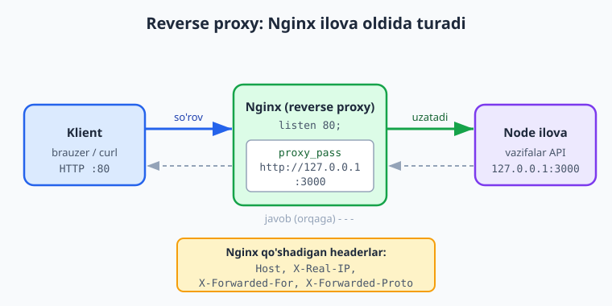
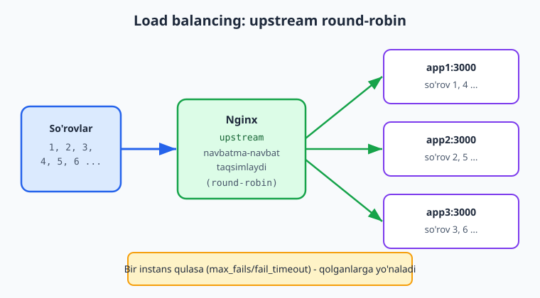
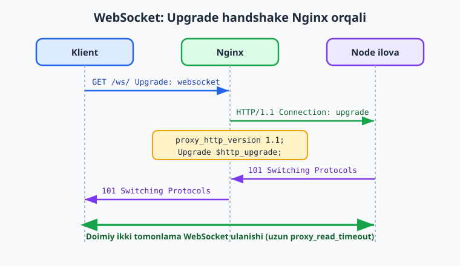

# 17 — Reverse proxy va load balancing

[⬅️ Oldingi: 16 — Nginx asoslari](./16-nginx-asoslari.md) · [🏠 README](./README.md) · [Keyingi: 18 — HTTPS, domen va Let's Encrypt ➡️](./18-https-domen.md)

> **Bu bobda:** Nginx'ni ilovamiz oldida turuvchi **reverse proxy** sifatida sozlaymiz — tashqi 80-portni qabul qilib, so'rovni ichki `localhost:3000`'dagi Node ilovaga uzatamiz, nega bu bitta kirish nuqtasi, TLS terminatsiya va xavfsizlik uchun kerakligini ko'ramiz; `proxy_pass` va muhim `proxy_set_header` (`Host`, `X-Real-IP`, `X-Forwarded-For`, `X-Forwarded-Proto`) headerlarini — ilova real IP va protokolni bilishi uchun — o'rganamiz; bitta ilova kam bo'lganda `upstream` blok bilan bir nechta backend instansiga **load balancing** qilamiz (round-robin, `least_conn`, `ip_hash`, `weight`, va `max_fails`/`fail_timeout` bilan sog'liq tekshiruvi); `gzip` siqish va `proxy_read_timeout` kabi buferlash sozlamalarini qo'shamiz; oxirida **WebSocket** so'rovlarini `proxy_http_version 1.1` va `Upgrade`/`Connection` headerlari bilan to'g'ri proxy qilishni ko'rsatamiz. Barcha konfiguratsiyani lokalda `nginx -t` va jonli `docker compose` stenddi bilan haqiqatan sinab ko'rdik.

---

## Muammo: ilova internetga to'g'ridan-to'g'ri chiqmasligi kerak

16-bobda Nginx'ni o'rnatib, statik fayllarni uzatishni ko'rdik. Endi haqiqiy holatga qaytamiz: bizning **vazifalar (todo) API** Node'da yozilgan va `localhost:3000`'da ishlaydi. Uni internetga chiqarishning eng sodda yo'li — Node serverni to'g'ridan-to'g'ri 80-portga qo'yish edi. Lekin bu juda yomon g'oya:

- **80/443-port maxsus huquq talab qiladi.** 1024'dan past portlarni faqat `root` ocha oladi. Ilovani `root` bilan ishlatish — xavfsizlik xatosi.
- **Bitta ilova = bitta port.** Bir serverda ikkita ilova (masalan API va admin-panel) bo'lsa, ikkalasi ham 80-portni egallab ololmaydi.
- **HTTPS'ni har ilovada qaytadan yozish kerak.** TLS sertifikat, qayta-yo'naltirish — bularning hammasini ilova kodiga aralashtirib yuborish noto'g'ri.
- **Ilovangiz internetga ochiq turadi.** Har bir so'rov to'g'ridan-to'g'ri ilovaga uradi — DDoS, sekin so'rovlar, xavfsizlik tekshiruvisiz.

Yechim — ilova **oldiga** Nginx'ni qo'yish. Nginx tashqi dunyoga qaraydi (80/443), so'rovni qabul qiladi va ichki ilovaga (`localhost:3000`) uzatadi. Bu naqsh **reverse proxy** (teskari proxy) deyiladi.

📌 "Oddiy" (forward) proxy — klient nomidan internetga chiqadi (masalan VPN). **Reverse** proxy — buning aksi: server nomidan klientga qaraydi, klient u orqasidagi ilovani ko'rmaydi ham. "Teskari" so'zi shu yo'nalish almashuvini bildiradi.

---

## Reverse proxy nima va nega kerak

Reverse proxy — bu **bitta kirish nuqtasi**. Klient faqat Nginx bilan gaplashadi; orqada nechta ilova, qaysi portda turishini bilmaydi.



Nginx'ni ilova oldiga qo'yish beshta katta foyda beradi:

1. **Bitta kirish nuqtasi.** Tashqaridan faqat 80/443 ochiq. Orqada API `:3000`, admin-panel `:4000`, hammasi Nginx orqali keladi — bittagina nom (domen) ostida.
2. **TLS terminatsiya (18-bob).** HTTPS sertifikatni faqat Nginx'da sozlaysiz. Ilova oddiy HTTP'da, ichki tarmoqda ishlayveradi — TLS haqida o'ylamaydi.
3. **Statik fayllar.** Rasm, CSS, JS'ni Nginx to'g'ridan-to'g'ri (ilovaga bezovta qilmasdan) uzatadi — bu Node'dan tezroq.
4. **Xavfsizlik.** Nginx so'rovlarni filtrlaydi, tezlik chekloviga (`rate limiting`), buferlashga qodir. Ilova internetdan to'g'ridan-to'g'ri ko'rinmaydi.
5. **Load balancing.** Bir nechta ilova nusxasiga so'rovni taqsimlaydi — bu bobning ikkinchi yarmi.

📌 Ichki ilovani `127.0.0.1:3000`'da (faqat lokalga) tinglashga sozlang, `0.0.0.0`'da emas. Shunda ilova faqat Nginx orqali ochiq bo'ladi, tashqaridan portga to'g'ridan-to'g'ri kirib bo'lmaydi. Bu "ilovani internetdan yashirish".

---

## Eng sodda reverse proxy: proxy_pass

16-bobda ko'rganimizdek, Nginx sozlamalari `/etc/nginx/conf.d/*.conf` ichidagi `server` bloklarda yoziladi. Reverse proxy uchun bitta `location` yetadi:

```nginx
server {
    listen 80;
    server_name vazifalar.example.com;

    location / {
        proxy_pass http://127.0.0.1:3000;

        proxy_set_header Host              $host;
        proxy_set_header X-Real-IP         $remote_addr;
        proxy_set_header X-Forwarded-For   $proxy_add_x_forwarded_for;
        proxy_set_header X-Forwarded-Proto $scheme;
    }
}
```

Bu yerda eng muhimi — `proxy_pass http://127.0.0.1:3000;`. U "shu `location`'ga kelgan har bir so'rovni ichki 3000-portga uzat" degani. Klient `http://vazifalar.example.com/tasks` so'rasa, Nginx uni `http://127.0.0.1:3000/tasks`'ga yuboradi va ilovaning javobini klientga qaytaradi.

💡 Bu konfiguratsiyani lokal Docker'da `nginx -t` bilan haqiqatan tekshirdik — sintaksis to'g'ri, test muvaffaqiyatli o'tdi (pastdagi "Sinab ko'rish" bo'limiga qarang).

### proxy_set_header: nega bu headerlar kerak

`proxy_pass` o'zi so'rovni uzatadi, lekin bir muammo bor: Nginx ilovaga ulanganda, ilova so'rovning **Nginx'dan** kelganini ko'radi — haqiqiy klientni emas. Ilova uchun "kim so'radi?" degan savolga javob `127.0.0.1` (ya'ni Nginx'ning o'zi) bo'lib qoladi. Ilova real klient haqida hech narsa bilmaydi.

`proxy_set_header` — bu Nginx ilovaga uzatadigan so'rovga qo'shimcha header qo'yadi, ya'ni "haqiqiy klient haqida ma'lumotni ilovaga yetkazadi":

- **`Host $host`** — klient so'ragan domen nomini (`vazifalar.example.com`) saqlaydi. Busiz ilova `Host`'ni `127.0.0.1`deb ko'radi va virtual-host yoki absolyut URL yasashda adashadi.
- **`X-Real-IP $remote_addr`** — klientning haqiqiy IP manzili. Ilova "bu so'rov qaysi IP'dan keldi" deb bilishi uchun (log, rate-limit, geolokatsiya).
- **`X-Forwarded-For $proxy_add_x_forwarded_for`** — proksilar zanjirini ko'rsatadi. Agar bir nechta proxy ketma-ket bo'lsa, har biri o'z manzilini qo'shadi (`$proxy_add_x_forwarded_for` mavjud qiymatga `$remote_addr`'ni qo'shib boradi). Ilova "klient -> proxy1 -> proxy2 -> men" zanjirini ko'radi.
- **`X-Forwarded-Proto $scheme`** — klient `http` yoki `https` ishlatganini bildiradi. Bu 18-bobda muhim: Nginx HTTPS'da, ilova HTTP'da ishlaydi, lekin ilova foydalanuvchi HTTPS'da ekanini bilishi kerak (masalan, xavfsiz cookie qo'yish yoki HTTP -> HTTPS yo'naltirish uchun).

⚠️ Bu headerlarni qo'shishni unutsangiz, ilova log'larida hamma so'rov `127.0.0.1`'dan kelgandek ko'rinadi va `req.protocol` doim `http` bo'ladi. Bu eng ko'p uchraydigan "deploy'dan keyin login ishlamayapti" yoki "log'da real IP yo'q" muammosining sababi.

📌 `$proxy_add_x_forwarded_for` (`add` bilan) va `$http_x_forwarded_for` farqi: birinchisi mavjud zanjirga yangi IP qo'shadi (to'g'ri tanlov), ikkinchisi faqat kelgan headerni qaytaradi. Reverse proxy'da har doim `$proxy_add_x_forwarded_for` ishlating.

💡 Express ilovangizda `app.set('trust proxy', true)` qo'ying — shunda `req.ip` va `req.protocol` `X-Forwarded-*` headerlardan o'qiydi, ya'ni Nginx orqasida real klient IP'sini va protokolni to'g'ri ko'radi.

---

## Bir ilova kam: load balancing va upstream

Vazifalar API mashhur bo'lib ketdi va bitta Node jarayoni barcha so'rovlarni eplay olmayapti. Yechim — ilovaning **bir nechta nusxasini** (instansini) ko'tarish (masalan `app1:3000`, `app2:3000`, `app3:3000`) va so'rovlarni ular orasida **taqsimlash**. Bu **load balancing** (yuk taqsimoti).

Nginx'da buni `upstream` blok bilan qilamiz. `upstream` — bir nechta backend serverni bitta nom ostida guruhlaydi:



```nginx
upstream vazifalar_backend {
    server app1:3000 max_fails=3 fail_timeout=30s;
    server app2:3000 max_fails=3 fail_timeout=30s;
    server app3:3000 max_fails=3 fail_timeout=30s;
}

server {
    listen 80;
    server_name vazifalar.example.com;

    location / {
        proxy_pass http://vazifalar_backend;

        proxy_set_header Host              $host;
        proxy_set_header X-Real-IP         $remote_addr;
        proxy_set_header X-Forwarded-For   $proxy_add_x_forwarded_for;
        proxy_set_header X-Forwarded-Proto $scheme;
    }
}
```

Diqqat: `proxy_pass` endi bitta manzilga emas, **`upstream` nomiga** (`vazifalar_backend`) ishora qiladi. Nginx har so'rovda guruh ichidan bitta serverni tanlaydi.

ℹ️ Yuqorida backendlar `app1`, `app2`, `app3` deb nomlangan — bular Docker tarmog'idagi konteyner nomlari. Bitta serverdagi bir nechta jarayon bo'lsa, ular `127.0.0.1:3001`, `127.0.0.1:3002` ko'rinishida bo'lardi.

### Load balancing usullari

Nginx bir nechta taqsimot algoritmini qo'llab-quvvatlaydi:

| Usul | Qanday ishlaydi | Qachon ishlatiladi |
|---|---|---|
| **round-robin** (default) | Navbatma-navbat: 1, 2, 3, 1, 2, 3... | Instanslar bir xil quvvatda, so'rovlar yengil |
| **`least_conn`** | Ayni paytda eng kam aktiv ulanishi bor serverga | So'rovlar turli davom etadigan vaqtga ega |
| **`ip_hash`** | Bir IP doim bir serverga (sticky) | Sessiya serverda saqlansa (login holati) |
| **`weight=N`** | Og'irlikka mutanosib taqsimot | Serverlar turli quvvatda |

Hech narsa yozmasangiz — **round-robin** (default). Boshqasini xohlasangiz, `upstream` ichiga birinchi qator qilib yozasiz:

```nginx
upstream lc_backend {
    least_conn;
    server app1:3000;
    server app2:3000;
}
```

`weight` esa har `server` qatorida ko'rsatiladi — kuchliroq serverga ko'proq yuk:

```nginx
upstream weighted_backend {
    server app1:3000 weight=3;   # 4 so'rovning 3 tasi shunga
    server app2:3000 weight=1;   # 4 so'rovning 1 tasi shunga
}
```

`ip_hash` — bir foydalanuvchi doim bir serverga tushishini ta'minlaydi (sessiya yoki kesh serverda tursa kerak bo'ladi):

```nginx
upstream sticky_backend {
    ip_hash;
    server app1:3000;
    server app2:3000;
}
```

💡 Zamonaviy ilovalar sessiyani serverda emas, tashqi joyda (Redis, JWT token, ma'lumotlar bazasi) saqlashi afzal — shunda istalgan instans istalgan so'rovni eplaydi va `ip_hash` shart bo'lmaydi. `ip_hash`'ni faqat sessiya majburan serverda bo'lsa ishlating.

### Sog'liq: max_fails va fail_timeout

Bir instans qulasa, Nginx unga so'rov yuborib davom etmasligi kerak. Buni `max_fails` va `fail_timeout` boshqaradi:

```nginx
server app1:3000 max_fails=3 fail_timeout=30s;
```

- **`max_fails=3`** — `fail_timeout` ichida 3 marta muvaffaqiyatsiz urinishdan keyin Nginx bu serverni "nosog'lom" deb belgilaydi.
- **`fail_timeout=30s`** — serverni 30 soniya chetga surib turadi, keyin yana sinab ko'radi.

Shunday qilib bitta instans qulasa, so'rovlar avtomatik ravishda qolgan sog'lom instanslarga yo'naladi — foydalanuvchi xato ko'rmaydi. Bu eng sodda **avtomatik failover**.

📌 Bu — **passiv** sog'liq tekshiruvi (so'rov muvaffaqiyatsiz bo'lgandagina sezadi). Faol (active) sog'liq tekshiruvi — Nginx o'zi muntazam "tirikmisan?" deb so'rab turishi — bepul Nginx'da yo'q (Nginx Plus'da bor). Open-source'da odatda backendni alohida monitoring (25-bob) bilan kuzatasiz.

---

## gzip, timeout va buferlash

Reverse proxy faqat uzatib qo'ymaydi — yo'l-yo'lakay ishni optimallashtiradi ham.

**gzip — javobni siqish.** Matn (HTML, CSS, JS, JSON) yaxshi siqiladi. Nginx javobni klientga jo'natishdan oldin siqsa, tarmoq trafigi kamayadi:

```nginx
gzip on;
gzip_types text/plain text/css application/json application/javascript;
gzip_min_length 1024;
```

- `gzip on;` — siqishni yoqadi.
- `gzip_types` — qaysi turdagi javoblarni siqish (HTML allaqachon kiritilgan, qolganini qo'shamiz). Rasm/video kabi allaqachon siqilgan fayllarni qayta siqishning ma'nosi yo'q.
- `gzip_min_length 1024;` — 1 KB'dan kichik javoblarni siqmaydi (kichik fayl uchun siqish foydadan ko'ra ortiqcha ish).

**Timeout — qancha kutish.** Backend sekin javob bersa, Nginx qachongacha kutadi:

```nginx
location / {
    proxy_pass http://vazifalar_backend;
    proxy_connect_timeout 5s;    # ulanish o'rnatishga
    proxy_read_timeout 60s;      # javobni kutishga
}
```

- `proxy_connect_timeout 5s;` — backendga ulanish 5 soniyada bo'lmasa, xato.
- `proxy_read_timeout 60s;` — backend javob berishini eng ko'pi 60 soniya kutadi. Uzoq ishlaydigan so'rovlar (masalan hisobot) bo'lsa, bu qiymatni oshirasiz.

⚠️ `proxy_read_timeout`ni juda katta qilmang — sekin yoki osilib qolgan backend ulanishlari yig'ilib, Nginx resurslarini band qiladi. WebSocket (pastda) — bunga maxsus istisno.

💡 Nginx javoblarni qisqa muddatga **keshlashi** ham mumkin (`proxy_cache`), shunda bir xil so'rov backendga qayta-qayta urmaydi. Bu kuchli, lekin ehtiyot talab qiladi (qaysi javobni keshlash mumkin, qancha vaqt) — kirish darajasida `gzip` va `timeout` yetarli.

---

## WebSocket proxy: Upgrade handshake

Oddiy HTTP so'rovi — "so'ra, javob ol, ulanish yopiladi". WebSocket esa **doimiy, ikki tomonlama** ulanish (chat, real-time bildirishnoma, jonli yangilanish). U oddiy HTTP ulanishidan boshlanadi, keyin maxsus **`Upgrade`** so'rovi bilan WebSocket protokoliga "ko'tariladi".



Muammo: Nginx default holatda backendga HTTP/1.0 bilan boradi va `Connection` headerini olib tashlaydi — bu WebSocket `Upgrade`'ini buzadi. Shuning uchun WebSocket `location`'ida ikkita maxsus sozlama kerak:

```nginx
location /ws/ {
    proxy_pass http://vazifalar_backend;

    proxy_http_version 1.1;
    proxy_set_header Upgrade    $http_upgrade;
    proxy_set_header Connection "upgrade";
    proxy_set_header Host       $host;

    proxy_read_timeout 3600s;
}
```

- **`proxy_http_version 1.1;`** — `Upgrade` mexanizmi HTTP/1.1 talab qiladi. Default 1.0 — WebSocket ishlamaydi.
- **`proxy_set_header Upgrade $http_upgrade;`** — klientdan kelgan `Upgrade: websocket` headerini backendga uzatadi (busiz backend "bu WebSocket so'rovi" ekanini bilmaydi).
- **`proxy_set_header Connection "upgrade";`** — backendga "bu ulanishni protokol almashuviga ko'tar" deb aytadi.
- **`proxy_read_timeout 3600s;`** — WebSocket ulanishi soatlab ochiq turishi mumkin. Default 60s bo'lsa, Nginx tinch ulanishni uzib qo'yadi. Shuning uchun uni katta qilamiz.

Backend `101 Switching Protocols` qaytarsa, ulanish WebSocket'ga aylanadi va Nginx ikki tomon orasida ma'lumotni shaffof o'tkazib turadi.

📌 Oddiy HTTP `location /` va WebSocket `location /ws/`'ni alohida saqlash toza yechim: oddiy so'rovlarga qisqa timeout, WebSocket'ga uzun timeout va `Upgrade` headerlari. Ikkalasini aralashtirmang.

---

## Sinab ko'rish: nginx -t va jonli load balancing

Bu bobdagi konfiguratsiyalarni **haqiqatan** lokal Docker'da sinab ko'rdik. Buni siz ham qila olasiz.

Avval konfiguratsiya sintaksisini tekshiramiz. `reverse-proxy.conf` faylini bir papkaga (`conf.d/`) qo'yib:

```bash
docker run --rm \
  -v "$PWD/conf.d:/etc/nginx/conf.d:ro" \
  nginx:1.27-alpine nginx -t
```

```text
nginx: the configuration file /etc/nginx/nginx.conf syntax is ok
nginx: configuration file /etc/nginx/nginx.conf test is successful
```

ℹ️ `upstream` blokda nom bilan (`app1:3000`) backend yozsangiz, alohida `nginx -t` shu nomni tarmoqda topolmay xato berishi mumkin (`host not found in upstream`). Bu — DNS muammosi, **sintaksis xatosi emas**. Sinov uchun yo `127.0.0.1:PORT` ishlating, yoki pastdagidek `compose` tarmog'i ichida tekshiring (u yerda `app1` haqiqatan hal bo'ladi).

Endi jonli load balancing'ni ko'rish uchun kichik stend ko'taramiz: Nginx + uchta soxta backend (`hashicorp/http-echo`, har biri o'z nomini qaytaradi). `compose.yaml`:

```yaml
services:
  app1:
    image: hashicorp/http-echo:1.0
    command: ["-listen=:3000", "-text=app1"]
  app2:
    image: hashicorp/http-echo:1.0
    command: ["-listen=:3000", "-text=app2"]
  app3:
    image: hashicorp/http-echo:1.0
    command: ["-listen=:3000", "-text=app3"]
  nginx:
    image: nginx:1.27-alpine
    ports:
      - "8080:80"
    volumes:
      - ./conf.d:/etc/nginx/conf.d:ro
    depends_on:
      - app1
      - app2
      - app3
```

Ko'taramiz va so'rovni bir necha marta yuboramiz:

```bash
docker compose up -d
for i in $(seq 1 6); do curl -s -H "Connection: close" http://127.0.0.1:8080/; done
```

```text
app1
app2
app3
app1
app2
app3
```

Mana — round-robin ko'z oldida: har so'rov navbatdagi instansga tushdi. ℹ️ `Connection: close` qo'shdik: aks holda nginx keep-alive ulanishni qayta ishlatib, ketma-ket so'rovlar bitta backendga tushib qolishi mumkin — har so'rovni alohida ulanish qilsak, navbat aniq ko'rinadi. Aniq taqsimot muhitga bog'liq, lekin yuk ko'p so'rovda backendlar bo'ylab teng tarqaladi. Tugagach, tozalaymiz:

```bash
docker compose down -v
```

📌 `hashicorp/http-echo` — bu shunchaki demonstratsiya uchun: har so'rovga o'z nomini matn qilib qaytaradigan minimal server. Haqiqiy hayotda `app1/app2/app3` — bu sizning vazifalar API'ngizning uchta nusxasi bo'lardi. 20-bobda buni to'liq production deploy bilan birlashtiramiz.

⚠️ Jonli server qismi (real domen `vazifalar.example.com`, 80-portni tashqariga ochish, real foydalanuvchi trafigi) **illustrativ** — uni o'z VPS yoki Docker hostingizda sinang. Yuqoridagi `nginx -t` va `compose` stenddi esa har qanday Docker o'rnatilgan mashinada haqiqatan ishlaydi.

---

## 17-bob mashqlari

> Konfiguratsiya mashqlarini `nginx -t` bilan (yuqoridagi `docker run ...` usuli) tekshirib boring. Jonli load balancing mashqlari uchun `compose` stenddidan foydalaning.

**Oson**

1. Reverse proxy nima va u "forward" proxy'dan nimasi bilan farq qiladi? Bitta-ikkita jumlada ayting.
2. Quyidagi to'rt headerning har biri ilovaga nimani yetkazadi: `Host`, `X-Real-IP`, `X-Forwarded-For`, `X-Forwarded-Proto`?
3. `proxy_pass http://127.0.0.1:3000;` qatori nima qiladi? Ilova qaysi manzilda tinglashi kerak?
4. Load balancing usullaridan qaysi biri Nginx'da **default** (hech narsa yozmasangiz)?
5. Nega ichki ilovani `0.0.0.0`'da emas, `127.0.0.1`'da tinglatish afzal?

**O'rta**

6. Bitta backend (`127.0.0.1:3000`) uchun to'liq `server` blok yozing: 80-portni tinglasin, `proxy_pass` qilsin va to'rtta `proxy_set_header`ni qo'shsin. Keyin `nginx -t` bilan tekshiring.

<details markdown="1"><summary>Yechim</summary>

```nginx
server {
    listen 80;
    server_name vazifalar.example.com;

    location / {
        proxy_pass http://127.0.0.1:3000;

        proxy_set_header Host              $host;
        proxy_set_header X-Real-IP         $remote_addr;
        proxy_set_header X-Forwarded-For   $proxy_add_x_forwarded_for;
        proxy_set_header X-Forwarded-Proto $scheme;
    }
}
```

Tekshirish (faylni `conf.d/single.conf` deb saqlab):

```bash
docker run --rm -v "$PWD/conf.d:/etc/nginx/conf.d:ro" nginx:1.27-alpine nginx -t
```

`127.0.0.1` ishlatilgani uchun `nginx -t` DNS muammosisiz o'tadi. Bu konfiguratsiyani aynan shu usulda sinab, "syntax is ok" javobini oldik.

</details>

7. Uchta instans (`app1`, `app2`, `app3`) uchun `upstream` blok yozing va uni `proxy_pass`'da ishlating. `least_conn` algoritmini tanlang.

<details markdown="1"><summary>Yechim</summary>

```nginx
upstream vazifalar_backend {
    least_conn;
    server app1:3000;
    server app2:3000;
    server app3:3000;
}

server {
    listen 80;
    server_name vazifalar.example.com;

    location / {
        proxy_pass http://vazifalar_backend;
        proxy_set_header Host            $host;
        proxy_set_header X-Real-IP       $remote_addr;
        proxy_set_header X-Forwarded-For $proxy_add_x_forwarded_for;
    }
}
```

`least_conn;` — `upstream` ichida birinchi qator. `proxy_pass` endi upstream nomiga (`vazifalar_backend`) ishora qiladi, bitta manzilga emas.

</details>

8. `max_fails=3 fail_timeout=30s` nima qiladi? Bitta instans qulaganda nima bo'ladi?

<details markdown="1"><summary>Yechim</summary>

`fail_timeout` (30 soniya) ichida `max_fails` (3) marta muvaffaqiyatsiz urinishdan keyin Nginx bu serverni "nosog'lom" deb belgilab, 30 soniyaga chetga suradi. Shu vaqt ichida so'rovlar qolgan sog'lom instanslarga yo'naladi (avtomatik failover) — foydalanuvchi xato ko'rmaydi. 30 soniyadan keyin Nginx serverni yana sinab ko'radi.

</details>

9. WebSocket `location`'ida `proxy_http_version 1.1;` nega kerak? Uni yozmasangiz nima buziladi?

<details markdown="1"><summary>Yechim</summary>

`Upgrade` mexanizmi (HTTP'dan WebSocket'ga protokol almashuvi) faqat **HTTP/1.1**'da ishlaydi. Nginx default holatda backendga **HTTP/1.0** bilan boradi va `Connection` headerini olib tashlaydi. Shu sababli `proxy_http_version 1.1;` va `Connection "upgrade"` bo'lmasa, `Upgrade` handshake'i backendga yetib bormaydi va WebSocket ulanishi o'rnatilmaydi (klient odatda ulanish darrov uzilganini ko'radi).

</details>

10. `gzip_min_length 1024;` nima uchun? Nega barcha javoblarni (hatto kichigini ham) siqmaymiz?

<details markdown="1"><summary>Yechim</summary>

`gzip_min_length 1024;` — 1 KB'dan kichik javoblarni siqmaslikni bildiradi. Juda kichik javobni siqish foydasiz: siqish ham vaqt/CPU sarflaydi, ammo kichik fayl uchun tejaladigan bayt arzimas (ba'zan siqilgan natija hatto kattaroq chiqishi mumkin). Shuning uchun faqat siqishga arziydigan (kattaroq, matnli) javoblarni siqamiz.

</details>

**Qiyin**

11. To'liq reverse proxy + load balancing konfiguratsiyasini yozing: 3 instansli `upstream` (round-robin, `max_fails`/`fail_timeout` bilan), to'rtta `proxy_set_header`, `gzip` va `proxy_read_timeout`. Keyin uni `compose` stenddida ko'tarib, `curl`ni bir necha marta chaqirib round-robin aylanishini ko'rsating.

<details markdown="1"><summary>Yechim</summary>

`conf.d/reverse-proxy.conf`:

```nginx
upstream vazifalar_backend {
    server app1:3000 max_fails=3 fail_timeout=30s;
    server app2:3000 max_fails=3 fail_timeout=30s;
    server app3:3000 max_fails=3 fail_timeout=30s;
}

gzip on;
gzip_types text/plain text/css application/json application/javascript;
gzip_min_length 1024;

server {
    listen 80;
    server_name vazifalar.example.com;

    location / {
        proxy_pass http://vazifalar_backend;

        proxy_set_header Host              $host;
        proxy_set_header X-Real-IP         $remote_addr;
        proxy_set_header X-Forwarded-For   $proxy_add_x_forwarded_for;
        proxy_set_header X-Forwarded-Proto $scheme;

        proxy_read_timeout 60s;
        proxy_connect_timeout 5s;
    }
}
```

`compose.yaml` (yuqoridagi "Sinab ko'rish" bo'limidagidek 3 ta `http-echo` + nginx). Ko'tarib sinash:

```bash
docker compose up -d
for i in $(seq 1 6); do curl -s -H "Connection: close" http://127.0.0.1:8080/; done
docker compose down -v
```

Chiqishda `app1`, `app2`, `app3` navbatma-navbat takrorlanadi — round-robin. Aynan shu konfiguratsiyani sinab, `nginx -t` "successful" berdi va `curl` so'rovlari uch backendga taqsimlandi.

</details>

12. WebSocket uchun alohida `location /ws/` yozing — `proxy_http_version 1.1`, `Upgrade`/`Connection` headerlari va uzun `proxy_read_timeout` bilan. Oddiy `location /` (qisqa timeout) bilan bir `server` blokda birlashtiring.

<details markdown="1"><summary>Yechim</summary>

```nginx
server {
    listen 80;
    server_name vazifalar.example.com;

    location / {
        proxy_pass http://vazifalar_backend;
        proxy_set_header Host              $host;
        proxy_set_header X-Real-IP         $remote_addr;
        proxy_set_header X-Forwarded-For   $proxy_add_x_forwarded_for;
        proxy_set_header X-Forwarded-Proto $scheme;
        proxy_read_timeout 60s;
    }

    location /ws/ {
        proxy_pass http://vazifalar_backend;
        proxy_http_version 1.1;
        proxy_set_header Upgrade    $http_upgrade;
        proxy_set_header Connection "upgrade";
        proxy_set_header Host       $host;
        proxy_read_timeout 3600s;
    }
}
```

Oddiy so'rovlar `location /`'ga (qisqa 60s timeout), WebSocket so'rovlari `/ws/` prefiksiga (HTTP/1.1, `Upgrade`/`Connection` headerlari va uzun 3600s timeout) tushadi. Ikki turdagi trafikni alohida sozlash — toza va xavfsiz yechim.

</details>

13. Quyidagi konfiguratsiyada xato bor: ilova log'larida barcha so'rov `127.0.0.1`'dan kelgandek ko'rinyapti va `req.protocol` doim `http`. Sababini toping va tuzating.

```nginx
location / {
    proxy_pass http://127.0.0.1:3000;
}
```

<details markdown="1"><summary>Yechim</summary>

Muammo: `proxy_set_header` qatorlari yo'q. Nginx so'rovni ilovaga uzatganda, ilova uchun "so'rov yuboruvchi" Nginx'ning o'zi (`127.0.0.1`) bo'lib qoladi va protokol doim `http` (Nginx ilovaga HTTP bilan ulanadi). Real klient IP va protokolni yetkazish uchun headerlarni qo'shamiz:

```nginx
location / {
    proxy_pass http://127.0.0.1:3000;
    proxy_set_header Host              $host;
    proxy_set_header X-Real-IP         $remote_addr;
    proxy_set_header X-Forwarded-For   $proxy_add_x_forwarded_for;
    proxy_set_header X-Forwarded-Proto $scheme;
}
```

Express tomonda esa `app.set('trust proxy', true)` qo'shing — shunda `req.ip` `X-Real-IP`/`X-Forwarded-For`'dan, `req.protocol` esa `X-Forwarded-Proto`'dan o'qiladi.

</details>

14. `weight=` bilan og'irlikli taqsimot yozing: `app1` har 4 so'rovning 3 tasini, `app2` 1 tasini olsin. Qachon bunday qilish mantiqli?

<details markdown="1"><summary>Yechim</summary>

```nginx
upstream weighted_backend {
    server app1:3000 weight=3;
    server app2:3000 weight=1;
}
```

`weight=3` va `weight=1` — Nginx har 4 so'rovning 3 tasini `app1`'ga, 1 tasini `app2`'ga yuboradi. Bu serverlar **turli quvvatda** bo'lganda mantiqli: masalan `app1` kuchliroq mashinada turibdi va ko'proq yukni ko'tara oladi, `app2` esa zaifroq. Bir xil quvvatdagi serverlarda `weight` shart emas — oddiy round-robin yetadi.

</details>

15. `ip_hash` qachon kerak, qachon undan qochish kerak? Zamonaviy muqobil nima?

<details markdown="1"><summary>Yechim</summary>

`ip_hash` bir foydalanuvchini (IP bo'yicha) doim bir backendga yo'naltiradi (sticky session). U **sessiya backend serverda saqlanganda** kerak — masalan login holati instans xotirasida bo'lsa, foydalanuvchi har safar boshqa instansga tushsa, tizimdan chiqib qolardi.

Undan qochish kerak chunki: (1) yuk teng taqsimlanmaydi (bir IP ortida ko'p foydalanuvchi bo'lsa — masalan korporativ tarmoq — hammasi bir serverga tushadi); (2) bir instans qulasa, unga bog'langan foydalanuvchilar sessiyasini yo'qotadi.

Zamonaviy muqobil — sessiyani **tashqarida** saqlash (Redis, JWT token, ma'lumotlar bazasi). Shunda istalgan instans istalgan so'rovni eplaydi, `ip_hash` shart bo'lmaydi va load balancing erkin (round-robin/`least_conn`) ishlaydi.

</details>

---

[⬅️ Oldingi: 16 — Nginx asoslari](./16-nginx-asoslari.md) · [🏠 README](./README.md) · [Keyingi: 18 — HTTPS, domen va Let's Encrypt ➡️](./18-https-domen.md)
