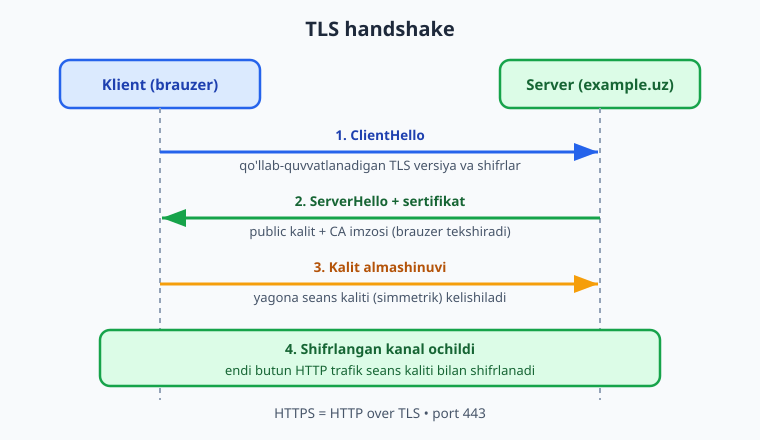
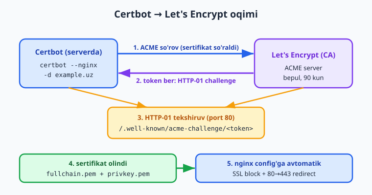
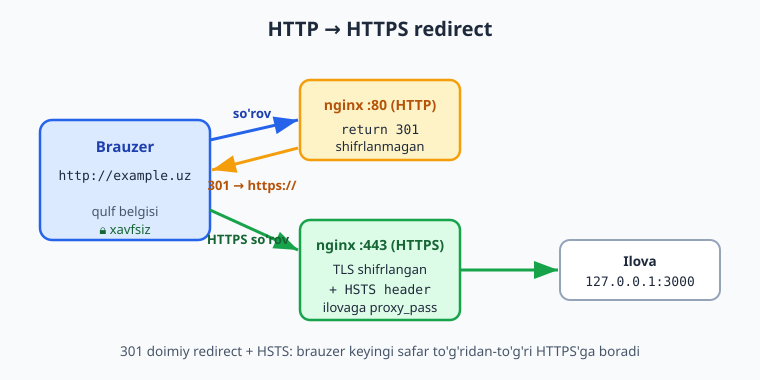

# 18 — HTTPS, domen va Let's Encrypt

[⬅️ Oldingi: 17 — Reverse proxy va load balancing](./17-reverse-proxy-load-balancing.md) · [🏠 README](./README.md) · [Keyingi: 19 — systemd va process boshqaruvi ➡️](./19-systemd-process.md)

> **Bu bobda:** Nega HTTPS shartligidan boshlab (shifrlash, ishonch, SEO, brauzerning "Not secure" ogohlantirishi) — TLS/SSL asoslarini sodda tushuntiramiz (sertifikat, CA, public/private kalit, TLS handshake bosqichlari), HTTPS = HTTP over TLS port 443 ekanini ko'ramiz, domen sotib olish va DNS `A record` bilan domenni server IP'ga yo'naltirishni (`dig`/`nslookup` bilan tekshirib) o'rganamiz, Let's Encrypt'ning bepul 90 kunlik sertifikatini ACME protokoli va HTTP-01 challenge orqali olamiz, Certbot bilan `certbot --nginx -d example.uz` qilib nginx config'iga avtomatik SSL server block + 80→443 redirect qo'shamiz (webroot variantini ham ko'ramiz), `ssl_protocols`/HSTS bilan SSL server block'ni qo'lda yozamiz, `certbot renew --dry-run` va `certbot.timer` bilan auto-renew'ni sozlaymiz, va Caddy/acme.sh/Cloudflare muqobillariga qisqacha qaraymiz.

---

## Muammo: brauzer "Not secure" deydi

16 va 17-boblarda nginx'ni sozlab, ilovamizni `http://example.uz` orqali ochiq qildik. Ishladi — lekin brauzer manzil yonida "Not secure" (xavfsiz emas) deb ogohlantiryapti. Foydalanuvchi login formasiga parol kiritmoqchi bo'lganda, Chrome qizil ogohlantirish chiqaradi. Telefonda ham, kompyuterda ham.

Nega? Chunki oddiy HTTP — **ochiq** protokol. Brauzer bilan server o'rtasidagi har bir bayt **shifrlanmagan** holda uchadi. Bu degani: bir xil Wi-Fi'dagi har kim, internet-provayder, yo'ldagi har bir router — yuborilgan parol, token, bank kartasi raqamini **o'qiy oladi**, hatto **o'zgartira oladi** (sahifaga reklama yoki zararli kod qistirib).

📌 HTTPS to'rt muammoni hal qiladi:

- **Maxfiylik (shifrlash):** ma'lumot shifrlanadi — yo'ldagi hech kim o'qiy olmaydi.
- **Yaxlitlik (integrity):** ma'lumot yo'lda o'zgartirilsa, brauzer buni sezadi va rad etadi.
- **Ishonch (autentifikatsiya):** siz haqiqatan `example.uz` bilan gaplashayotganingizni, soxta sayt bilan emas, sertifikat tasdiqlaydi.
- **SEO va ishonch belgisi:** Google HTTPS saytlarni reyting'da ustun qo'yadi; brauzer "Not secure" o'rniga qulf belgisini ko'rsatadi.

⚠️ Bugun HTTPS — tanlov emas, **minimum talab**. HTTP/2, HTTP/3, Service Worker, geolokatsiya, kamera kabi ko'p zamonaviy brauzer imkoniyatlari faqat HTTPS'da ishlaydi. Production'da HTTP'da qolish — qabul qilib bo'lmaydigan holat.

Yaxshi xabar: ilgari sertifikat pullik va qo'lda sozlanardi. Bugun **Let's Encrypt** tufayli u **bepul va avtomatik**. Bu bobda `http://`dan `https://`gacha to'liq yo'lni bosib o'tamiz.

---

## TLS/SSL asoslari (sodda)

HTTPS — bu sehr emas. Uning ostida **TLS** (Transport Layer Security) degan protokol yotadi. "SSL" — TLS'ning eski nomi; bugun hamma TLS ishlatadi, lekin odat bo'yicha hali ham "SSL sertifikat", "SSL server block" deyiladi. Ikkalasini sinonim deb tushuning.

Asosiy tushunchalar:

- **Public/private kalit (juftlik):** serverda ikkita kalit bor. **Public kalit** — hammaga ochiq, u bilan shifrlangan narsani faqat **private kalit** ocha oladi. Private kalit — serverda maxfiy turadi, hech qachon tashqariga chiqmaydi. Bu **asimmetrik shifrlash**.
- **Sertifikat:** serverning public kalitini va domen nomini (`example.uz`) bir hujjatda jamlaydi. Bu — "men haqiqatan example.uz'man" degan rasmiy pasport.
- **CA (Certificate Authority):** sertifikatni **imzolovchi** ishonchli tashkilot. Brauzerlar bir necha o'nlab CA'larga oldindan ishonadi. CA `example.uz`ni imzolagani — "men, ishonchli CA, bu sayt haqiqatan example.uz egasiga tegishli ekanini tekshirdim" degani. Let's Encrypt — ana shunday CA (bepul).

📌 Shu yerda asosiy g'oya: brauzer notanish serverga ishonmaydi, lekin **CA'ga ishonadi**. CA imzolagan sertifikatni ko'rsa — serverning haqiqiyligiga ishonadi. Bu — ishonch zanjiri.

### TLS handshake bosqichlari

Brauzer HTTPS sayt bilan gaplashishni boshlaganda, asl ma'lumot uzatilishidan oldin **handshake** (qo'l berib ko'rishish) bo'lib o'tadi. Maqsad: bir-birini tekshirish va keyingi suhbat uchun yagona maxfiy kalitga kelishish.



1. **ClientHello:** brauzer "salom" deydi — qaysi TLS versiyalari va shifrlash usullarini qo'llab-quvvatlashini aytadi.
2. **ServerHello + sertifikat:** server javob beradi, ishlatiladigan TLS versiyasini tanlaydi va o'z **sertifikatini** (ichida public kalit + CA imzosi) yuboradi. Brauzer sertifikatni tekshiradi: CA imzosi haqiqimi, domen mosmi, muddati o'tmaganmi.
3. **Kalit almashinuvi:** ikki tomon (server public kaliti yordamida) faqat o'zlari biladigan yagona **seans kaliti** (session key)ga kelishadi. Bu — **simmetrik** kalit (tez ishlaydi).
4. **Shifrlangan kanal:** shu lahzadan boshlab butun suhbat (HTTP so'rovlari va javoblari) shu seans kaliti bilan shifrlanadi. Endi yo'ldagi hech kim o'qiy olmaydi.

💡 Diqqat: handshake'da asimmetrik kalit (sekin, lekin xavfsiz almashinuv uchun) ishlatiladi, asl ma'lumot esa simmetrik seans kaliti (tez) bilan shifrlanadi. Ikkala usulning eng yaxshi tomoni birlashtirilgan.

### HTTPS = HTTP over TLS

HTTPS — yangi protokol emas. Bu — **oddiy HTTP, lekin TLS qatlami ichida**. Oddiy HTTP `80`-portda, shifrlanmagan; HTTPS `443`-portda, TLS bilan o'ralgan. Ya'ni `https://example.uz` ochganingizda: avval TLS handshake (yuqoridagi 4 bosqich), keyin o'sha shifrlangan kanal ichida odatdagi `GET /` so'rovi ketadi.

📌 Esda tuting: **HTTP — port 80, HTTPS — port 443**. Serverda HTTPS'ni yoqsangiz, `443`-portni ochish kerak (`ufw allow 443/tcp` — 04-bobda ufw'ni ko'rganmiz).

---

## Domen: nomni server IP'ga ulash

Sertifikat olishdan oldin sizga **domen** kerak — `example.uz`, `myapp.dev` kabi nom. (IP manzilga, masalan `203.0.113.10`, Let's Encrypt sertifikat bermaydi — domen kerak.)

**1-qadam: domen sotib olish.** Domen registrator'idan (masalan `.uz` uchun mahalliy registratorlar, yoki global `Namecheap`, `Cloudflare Registrar`, `Porkbun`) yillik to'lov bilan domen sotib olasiz. Bu — ijaraga olishga o'xshaydi: yiliga uzaytirib turasiz.

**2-qadam: DNS A record qo'shish.** Domenni sotib olganingiz — yetarli emas. Brauzer `example.uz`ni qaysi serverga (qaysi IP'ga) yuborishini bilishi kerak. Buni **DNS** (Domain Name System) hal qiladi — internetning "telefon kitobi". Domen panelida **A record** qo'shasiz:

```text
Tur     Nom                   Qiymat (IP)        TTL
A       example.uz            203.0.113.10       3600
A       www.example.uz        203.0.113.10       3600
```

`A record` — domen nomini **IPv4 manzilga** ulaydi. (IPv6 uchun `AAAA record`.) Yuqoridagi yozuv: "`example.uz`ni so'raganlar `203.0.113.10`ga borsin". Ko'pincha `www.` uchun ham alohida yozuv qo'shiladi (yoki `CNAME` bilan asosiy domenga yo'naltiriladi).

⚠️ **Yoyilish (propagation) vaqti.** DNS o'zgarishi darrov butun dunyoga tarqalmaydi — `TTL` (Time To Live, sekundlarda) qiymatiga qarab keshlanadi. Odatda bir necha daqiqadan bir necha soatgacha vaqt ketadi. Yangi domen qo'shganda sabr qiling — sertifikat olishdan oldin DNS ishlayotganini tekshiring.

### DNS'ni tekshirish: dig va nslookup

DNS to'g'ri sozlanganini sertifikat olishdan **oldin** tekshiring. `dig` (Linux/macOS'da kuchli vosita) yoki `nslookup` (hamma joyda bor):

```bash
dig example.uz +short
```

```text
203.0.113.10
```

```bash
nslookup example.uz
```

```text
Name:    example.uz
Address: 203.0.113.10
```

Agar chiqishda **sizning server IP'ingiz** ko'rinsa — DNS tayyor. Agar bo'sh yoki boshqa IP ko'rinsa — yoki yozuvni noto'g'ri qo'ygansiz, yoki hali yoyilmagan. Let's Encrypt domeningizni shu DNS orqali tekshiradi, shuning uchun bu qadam **majburiy**.

💡 `dig example.uz @8.8.8.8 +short` — Google'ning DNS serveridan to'g'ridan-to'g'ri so'rab, lokal keshni chetlab o'tadi. Yoyilishni tekshirishda foydali.

---

## Let's Encrypt va ACME protokoli

**Let's Encrypt** — bepul, avtomatik, ochiq CA (notijorat tashkilot tomonidan boshqariladi). U HTTPS'ni hammaga arzon va oddiy qilish uchun yaratilgan.

Asosiy xususiyatlar:

- **Bepul.** Hech qanday to'lov yo'q.
- **Avtomatik.** Sertifikat olish va yangilash dasturiy yo'l bilan, qo'l aralashuvisiz.
- **90 kun amal qiladi.** Sertifikat atigi 90 kun yaroqli — qisqa muddat ataylab tanlangan: tez-tez avtomatik yangilanadi, o'g'irlangan kalit uzoq zarar bermaydi. Shuning uchun **auto-renew** majburiy (pastda ko'ramiz).

Let's Encrypt **ACME** (Automatic Certificate Management Environment) protokoli orqali ishlaydi. ACME — "men shu domen egasiman" deb isbotlash va sertifikat olishning standart, avtomatik usuli.

### Domain validation: HTTP-01 challenge

Let's Encrypt sertifikat berishdan oldin sizning **shu domenni boshqarishingizni** tekshirishi kerak. Eng keng tarqalgan usul — **HTTP-01 challenge**:

1. Siz Let's Encrypt'dan `example.uz` uchun sertifikat so'raysiz.
2. Let's Encrypt sizga maxsus **token** (tasodifiy satr) beradi va aytadi: "buni `http://example.uz/.well-known/acme-challenge/<token>` manzilida ko'rsat".
3. Sizning vositangiz (Certbot) shu faylni serveringizning `80`-portida joylashtiradi.
4. Let's Encrypt **internet orqali** shu manzilga kiradi va tokenni o'qiydi. Token mos kelsa — siz haqiqatan shu domen va serverni boshqarayotganingiz isbotlandi.
5. Let's Encrypt sertifikatni imzolab beradi.

📌 Shuning uchun HTTP-01 challenge **80-port ochiq** va **DNS server IP'ngizga ulangan** bo'lishini talab qiladi. Mana nega DNS'ni avval tekshirdik. (Boshqa usul — **DNS-01 challenge** — DNS yozuviga token qo'yadi; wildcard `*.example.uz` sertifikat uchun kerak, lekin bu bobda HTTP-01'ga e'tibor beramiz.)

---

## Certbot: bir buyruq bilan HTTPS

**Certbot** — Let's Encrypt'ning rasmiy vositasi (EFF tomonidan). U ACME protokolini siz uchun bajaradi: challenge'ni joylashtiradi, sertifikat oladi va — eng zo'ri — **nginx config'ini avtomatik sozlaydi**.

Serverda (Ubuntu 26.04 yoki 24.04 LTS) o'rnatish:

```bash
sudo apt update
sudo apt install -y certbot python3-certbot-nginx
```

`python3-certbot-nginx` — Certbot'ning nginx plagini; aynan shu nginx config'ini avtomatik o'zgartirishni biladi.

Endi bitta buyruq — va HTTPS tayyor:

```bash
sudo certbot --nginx -d example.uz -d www.example.uz
```

Bu buyruqni ochib tushuntiramiz:

- `--nginx` — nginx plagini ishlatiladi (config'ni avtomatik tahrirlaydi).
- `-d example.uz -d www.example.uz` — sertifikat qaysi domenlar uchun. Har domen alohida `-d` bilan. (Ikkalasi bitta sertifikatga sig'adi.)

Birinchi marta Certbot email so'raydi (muddat tugashi haqida ogohlantirish uchun) va shartlarga rozilik so'raydi. Keyin u o'zi: HTTP-01 challenge o'tkazadi, sertifikat oladi va nginx config'iga quyidagilarni **qo'shadi**:

1. `listen 443 ssl` bilan yangi **SSL server block**.
2. `ssl_certificate` va `ssl_certificate_key` yo'llari (olingan sertifikatga).
3. `80`-portdagi so'rovlarni `443`ga yo'naltiradigan **301 redirect** (Certbot redirect'ni qo'shishni so'raydi — rozi bo'ling, yoki `--redirect` bayrog'i bilan oldindan tasdiqlang).

📌 Mana bu sehrning go'zalligi: bitta buyruq, nginx config'ini siz qo'lda tegmasdan, sayt to'liq HTTPS'ga o'tadi. Bu oqimni quyidagi diagrammada ko'ring:



ℹ️ **Illustrativ:** `apt install certbot ...` va `certbot --nginx ...` real VPS, real domen va ochiq `80`/`443` portlar talab qiladi (HTTP-01 challenge internet orqali serveringizga kiradi). Lokal mashinada bu o'rinli emas — bu bo'limni **o'z serveringizda** bajaring. Quyida biz Certbot **yaratadigan** nginx SSL config'ini qo'lda yozib, uni lokalda haqiqatan `nginx -t` bilan tekshirdik (sintaksis to'g'riligini tasdiqlash uchun) — buni keyingi bo'limda ko'rasiz.

### Webroot variant (qisqa)

`--nginx` plagini config'ni o'zi tahrirlaydi. Agar config'ni o'zgartirmasdan, faqat sertifikat olishni xohlasangiz — **webroot** usuli:

```bash
sudo certbot certonly --webroot -w /var/www/certbot \
  -d example.uz -d www.example.uz
```

`certonly` — faqat sertifikat ol, config'ga tegma. `--webroot -w /var/www/certbot` — challenge faylini shu papkaga joyla (nginx shu papkadan `/.well-known/acme-challenge/` ni ko'rsatsin). Bu usulda SSL server block'ni o'zingiz yozasiz — pastda aynan shuni qilamiz.

---

## nginx SSL server block (qo'lda)

Certbot config'ni avtomatik yozsa ham, **nimani** yozayotganini tushunish muhim. Mana to'liq, production'ga yaroqli SSL server block (Certbot ham shunga o'xshashini yaratadi). Bu config'ni lokalda haqiqatan `nginx -t` bilan tekshirdik:

```nginx
# HTTP (80) -> HTTPS (443) ga yo'naltirish
server {
    listen 80;
    listen [::]:80;
    server_name example.uz www.example.uz;
    return 301 https://$host$request_uri;
}

# HTTPS (443) — asosiy server block
server {
    listen 443 ssl;
    listen [::]:443 ssl;
    http2 on;
    server_name example.uz www.example.uz;

    ssl_certificate     /etc/letsencrypt/live/example.uz/fullchain.pem;
    ssl_certificate_key /etc/letsencrypt/live/example.uz/privkey.pem;

    ssl_protocols       TLSv1.2 TLSv1.3;
    ssl_ciphers         HIGH:!aNULL:!MD5;
    ssl_prefer_server_ciphers off;

    # HSTS: brauzerga "bu saytga doim HTTPS bilan kir" deydi
    add_header Strict-Transport-Security "max-age=31536000; includeSubDomains" always;

    location / {
        proxy_pass http://127.0.0.1:3000;
        proxy_set_header Host $host;
        proxy_set_header X-Forwarded-Proto $scheme;
    }
}
```

Asosiy direktivalar:

- `listen 443 ssl` — `443`-portda TLS bilan tinglaydi. `http2 on;` — HTTP/2'ni yoqadi (zamonaviy nginx'da alohida direktiva; eski `listen 443 ssl http2` o'rniga).
- `ssl_certificate` / `ssl_certificate_key` — sertifikat (`fullchain.pem`) va private kalit (`privkey.pem`) yo'llari. Let's Encrypt ularni `/etc/letsencrypt/live/<domen>/` ga qo'yadi.
- `ssl_protocols TLSv1.2 TLSv1.3` — faqat zamonaviy, xavfsiz TLS versiyalari. Eski TLSv1.0/1.1 — buzilgan, ishlatmang.
- `add_header Strict-Transport-Security ...` — **HSTS**. Brauzerga "kelgusi `max-age` (bu yerda 1 yil) sekund davomida bu saytga faqat HTTPS bilan kir, HTTP'ga umuman urinma" deydi. Bu downgrade hujumidan himoya qiladi.

❌ Eski/xavfli usul — eskirgan protokollarni yoqib qo'yish:

```nginx
ssl_protocols SSLv3 TLSv1 TLSv1.1 TLSv1.2;
```

`SSLv3`, `TLSv1`, `TLSv1.1` — barchasi buzilgan va eskirgan. Ularni hech qachon yoqmang — faqat `TLSv1.2 TLSv1.3`.

### HTTP→HTTPS redirect

Birinchi `server` block'ning butun vazifasi — `80`-portga kelgan har bir so'rovni `443`ga **301 (doimiy) redirect** qilish. `return 301 https://$host$request_uri;` — kelgan domen va yo'lni saqlab, `https://`ga o'tkazadi.



💡 `301` (doimiy) ataylab tanlangan — brauzer va qidiruv tizimlari buni eslab qoladi va keyingi safar to'g'ridan-to'g'ri HTTPS'ga boradi. HSTS bilan birga bu HTTP'ni amalda butunlay chetlab o'tadi.

---

## Auto-renew: sertifikat 90 kunda tugaydi

Let's Encrypt sertifikati **90 kun** amal qiladi. Qo'lda yangilab yurish — unutishga mahkum (va sayt to'satdan "ishonchsiz" bo'lib qoladi). Yaxshi xabar: Certbot buni **avtomatik** qiladi.

Avval yangilashni **sinab** ko'ring (haqiqiy sertifikatga tegmaydi):

```bash
sudo certbot renew --dry-run
```

`renew --dry-run` — Let's Encrypt'ning **staging** (sinov) serveriga ulanib, yangilash jarayonini boshidan-oxir o'tkazadi, lekin natijani **saqlamaydi**. Agar bu xatosiz o'tsa — haqiqiy avtomatik yangilash ham ishlaydi.

Certbot o'rnatilganda **systemd timer** ham keladi (19-bobda systemd'ni batafsil ko'ramiz). Uni tekshiring:

```bash
systemctl list-timers certbot.timer
sudo systemctl status certbot.timer
```

`certbot.timer` kuniga ikki marta ishga tushib, har bir sertifikatni tekshiradi: muddati 30 kundan kam qolgan bo'lsa — avtomatik yangilaydi (aks holda hech narsa qilmaydi). Yangilangach nginx avtomatik qayta yuklanadi (yangi sertifikatni o'qish uchun).

📌 Amalda siz **hech narsa qilmaysiz**: Certbot o'rnatilgach, `certbot.timer` o'zi yangilab turadi. Faqat bir marta `--dry-run` bilan ishlashiga ishonch hosil qiling. Eski tizimlarda timer o'rniga `cron` ishlatilishi mumkin — natija bir xil.

⚠️ **Illustrativ:** `certbot renew` va `certbot.timer` real serverda, real sertifikatlar bilan ishlaydi. Lokal mashinada haqiqiy sertifikat yo'q, shuning uchun bu buyruqlarni **o'z serveringizda** bajaring.

---

## Muqobillar (qisqa)

Certbot — eng keng tarqalgan, lekin yagona yo'l emas:

- **Caddy** — veb-server (nginx muqobili) bo'lib, HTTPS'ni **butunlay avtomatik** qiladi. `Caddyfile`'da shunchaki domen nomini yozasiz — Caddy o'zi Let's Encrypt'dan sertifikat olib, yangilab turadi. Hech qanday Certbot, hech qanday qo'l sozlash. Yangi loyihalar uchun juda qulay.
- **acme.sh** — sof shell skriptida yozilgan yengil ACME klienti. Python (Certbot) o'rnatmasdan, minimal qaramlik bilan sertifikat olmoqchi bo'lsangiz — yaxshi tanlov. Ko'p DNS provayderlar bilan DNS-01 challenge'ni qo'llab-quvvatlaydi.
- **Cloudflare** — domeningizni Cloudflare orqali o'tkazsangiz, u **chekka (edge)** sertifikatni avtomatik beradi va boshqaradi. Tashrifchi ↔ Cloudflare orqasida HTTPS Cloudflare zimmasida; siz hech narsa o'rnatmaysiz. Bonus: CDN, DDoS himoya, kesh.

💡 Maslahat: nginx ishlatayotgan bo'lsangiz — Certbot eng tabiiy yo'l. Yangi loyiha boshlayotgan bo'lsangiz va sodda HTTPS xohlasangiz — Caddy'ni ko'rib chiqing. Domeningiz Cloudflare'da bo'lsa — uning HTTPS'idan ham foydalaning.

---

## 18-bob mashqlari

> Quyidagi mashqlarning ko'pi real server, domen va internet talab qiladi (Certbot, Let's Encrypt, DNS) — ular **illustrativ**, o'z serveringizda bajaring. nginx config sintaksisi va `dig`/`nslookup` esa lokalda ham mashq qilinadi.

**Oson**

1. HTTP va HTTPS qaysi portda ishlaydi? "HTTPS = HTTP over ___" jumlasini to'ldiring.
2. HTTPS hal qiladigan to'rt muammoni (shifrlash, ishonch, ...) sanab bering.
3. Let's Encrypt sertifikati necha kun amal qiladi? Bu nega auto-renew'ni majburiy qiladi?
4. `dig example.uz +short` va `nslookup example.uz` buyruqlari nima ko'rsatadi? Sertifikat olishdan oldin nega buni tekshirish kerak?
5. Quyidagi DNS yozuvida nima xato: `example.uz` ni serverga ulamoqchimiz, lekin server IP'si `203.0.113.10` o'rniga domen nomi yozilgan. To'g'ri `A record`ni yozing.

**O'rta**

6. TLS handshake'ning to'rt bosqichini tartibi bilan ayting (ClientHello'dan boshlab). Har bosqichda nima bo'ladi?
7. CA (Certificate Authority) nima va brauzer nega notanish serverga emas, CA imzolagan sertifikatga ishonadi?
8. `certbot --nginx -d example.uz -d www.example.uz` buyrug'ini qism-qismga ajratib tushuntiring. `--nginx` nima qiladi, `-d` nima uchun?
9. HTTP-01 challenge qanday ishlaydi? Nega u 80-port ochiq va DNS to'g'ri sozlangan bo'lishini talab qiladi?
10. SSL server block'da `ssl_protocols TLSv1.2 TLSv1.3;` nega faqat shu ikki versiya? `SSLv3`/`TLSv1.1` qo'shsa nima xato bo'ladi?

**Qiyin**

11. To'liq nginx config yozing: `app.example.uz` uchun (a) `80`-portda 301 bilan HTTPS'ga redirect qiluvchi server block, (b) `443`-portda SSL server block — `TLSv1.2 TLSv1.3`, HSTS sarlavhasi, va `http://127.0.0.1:3000` ga `proxy_pass`. Sertifikat yo'llari `/etc/letsencrypt/live/app.example.uz/`.

<details markdown="1"><summary>Yechim</summary>

```nginx
# HTTP -> HTTPS redirect
server {
    listen 80;
    listen [::]:80;
    server_name app.example.uz;
    return 301 https://$host$request_uri;
}

# HTTPS
server {
    listen 443 ssl;
    listen [::]:443 ssl;
    http2 on;
    server_name app.example.uz;

    ssl_certificate     /etc/letsencrypt/live/app.example.uz/fullchain.pem;
    ssl_certificate_key /etc/letsencrypt/live/app.example.uz/privkey.pem;

    ssl_protocols       TLSv1.2 TLSv1.3;
    ssl_ciphers         HIGH:!aNULL:!MD5;
    ssl_prefer_server_ciphers off;

    add_header Strict-Transport-Security "max-age=31536000; includeSubDomains" always;

    location / {
        proxy_pass http://127.0.0.1:3000;
        proxy_set_header Host $host;
        proxy_set_header X-Forwarded-Proto $scheme;
    }
}
```

Birinchi block butun HTTP trafikni `443`ga doimiy (301) yo'naltiradi. Ikkinchisi TLS'ni faqat zamonaviy versiyalar bilan yoqadi, HSTS bilan brauzerni HTTPS'da ushlab turadi va so'rovni lokal ilovaga (`3000`-port) uzatadi. Sertifikatni Certbot bilan olganingizdan keyin bu config `nginx -t` dan o'tadi. (`X-Forwarded-Proto $scheme` — orqadagi ilovaga so'rov HTTPS ekanini bildiradi.)

</details>

12. Certbot ishlatmasdan, faqat sertifikat olmoqchisiz (config'ni o'zingiz yozasiz). To'g'ri `webroot` buyrug'ini yozing: domenlar `example.uz` va `www.example.uz`, webroot papka `/var/www/certbot`. Keyin nginx'da `/.well-known/acme-challenge/` ni shu papkadan ko'rsatadigan `location` blokini yozing.

<details markdown="1"><summary>Yechim</summary>

```bash
sudo certbot certonly --webroot -w /var/www/certbot \
  -d example.uz -d www.example.uz
```

nginx'da `80`-port server block'ida (challenge fayli HTTP orqali o'qiladi):

```nginx
server {
    listen 80;
    server_name example.uz www.example.uz;

    location /.well-known/acme-challenge/ {
        root /var/www/certbot;
    }

    location / {
        return 301 https://$host$request_uri;
    }
}
```

`certonly` — faqat sertifikat oladi, config'ga tegmaydi. `--webroot -w /var/www/certbot` — challenge faylini shu papkaga joylaydi; nginx'dagi `location /.well-known/acme-challenge/` esa Let's Encrypt'ning so'roviga shu fayllarni qaytaradi. Qolgan trafik HTTPS'ga yo'naltiriladi. Bu config lokalda `nginx -t` dan o'tadi.

</details>

13. `certbot renew --dry-run` aniq nima qiladi va nega xavfsiz? `certbot.timer` qancha vaqtda ishlaydi va sertifikatni qachon yangilaydi?

<details markdown="1"><summary>Yechim</summary>

`certbot renew --dry-run` Let's Encrypt'ning **staging** (sinov) serveriga ulanib, yangilash jarayonini to'liq o'tkazadi, lekin natijani diskka **saqlamaydi** va haqiqiy sertifikatga tegmaydi. Shuning uchun xavfsiz: avtomatik yangilash sozlamalari to'g'ri ekanini tekshirish uchun ishlatiladi (rate limit'ni ham yemaydi).

`certbot.timer` — systemd timer, kuniga (odatda) ikki marta ishga tushadi. Har safar barcha sertifikatlarni tekshiradi va **muddati 30 kundan kam qolganlarini** yangilaydi (qolganlariga tegmaydi). Yangilangach nginx avtomatik qayta yuklanadi. Demak amalda siz hech narsa qilmaysiz — faqat o'rnatishda bir marta `--dry-run` bilan tekshirib qo'yasiz.

</details>

14. Bir hamkasbingiz "Alpine kabi Caddy ham, Certbot ham bir xil, ikkalasi ham nginx config yozadi" deydi. Bu xato — Caddy bilan Certbot+nginx orasidagi asosiy farqni tushuntiring. Qachon qaysi birini tanlardingiz?

<details markdown="1"><summary>Yechim</summary>

Farqi: **Certbot** — bu alohida vosita bo'lib, **nginx** (yoki Apache) veb-serveriga sertifikat olib beradi va uning config'ini tahrirlaydi; nginx'ning o'zi HTTPS'ni bilmaydi, Certbot uni sozlaydi. **Caddy** esa — to'liq veb-serverning **o'zi** (nginx o'rnida turadi) bo'lib, HTTPS'ni ichki, avtomatik qiladi: `Caddyfile`'da domen nomini yozasiz, Caddy o'zi Let's Encrypt'dan sertifikat olib, yangilab turadi — alohida Certbot kerak emas.

Tanlov: allaqachon nginx ishlatayotgan yoki nginx'ning aniq nazoratini xohlasangiz — Certbot+nginx. Yangi, sodda loyiha boshlayotgan va "shunchaki ishlasin" desangiz — Caddy (kamroq sozlash, avtomatik HTTPS).

</details>

15. SEO va xavfsizlik nuqtai nazaridan, sayt HTTP'da qolsa qanday muammolar bo'ladi? Kamida to'rtta aniq oqibatni keltiring (brauzer, qidiruv tizimi, foydalanuvchi, zamonaviy imkoniyatlar bo'yicha).

<details markdown="1"><summary>Yechim</summary>

1. **Brauzer ogohlantirishi:** Chrome/Firefox manzil yonida "Not secure" deb ko'rsatadi; parol/karta formasida qizil ogohlantirish — foydalanuvchi qo'rqib chiqib ketadi.
2. **Maxfiylik buziladi:** trafik shifrlanmagan — bir xil Wi-Fi'dagi yoki yo'ldagi har kim parol, token, shaxsiy ma'lumotni o'qiy oladi (va o'zgartira oladi — sahifaga zararli kod qistirishi mumkin).
3. **SEO pasayadi:** Google HTTPS'ni reyting omili sifatida ishlatadi — HTTP saytlar qidiruvda pastroq turadi.
4. **Zamonaviy imkoniyatlar ishlamaydi:** HTTP/2, HTTP/3, Service Worker (PWA), geolokatsiya, kamera/mikrofon kabi ko'p brauzer API'lari faqat HTTPS'da yoqiladi.

Xulosa: bugun production'da HTTP — qabul qilib bo'lmaydi; Let's Encrypt bepul bo'lgani uchun HTTPS'ni yoqmaslikning hech qanday bahonasi yo'q.

</details>

---

[⬅️ Oldingi: 17 — Reverse proxy va load balancing](./17-reverse-proxy-load-balancing.md) · [🏠 README](./README.md) · [Keyingi: 19 — systemd va process boshqaruvi ➡️](./19-systemd-process.md)
