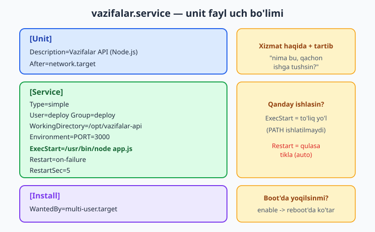
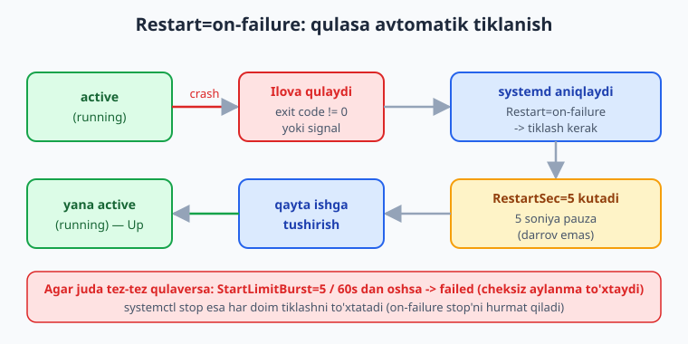
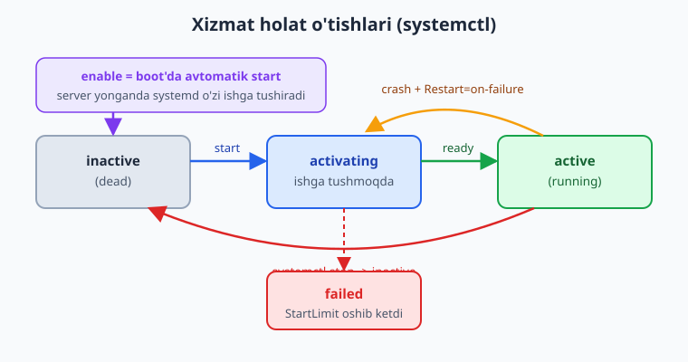

# 19 — systemd va process boshqaruvi

[⬅️ Oldingi: 18 — HTTPS, domen va Let's Encrypt](./18-https-domen.md) · [🏠 README](./README.md) · [Keyingi: 20 — To'liq production deploy ➡️](./20-toliq-deploy.md)

> **Bu bobda:** 05-bobda topgan birinchi og'riqni — *"terminal yopilsa ilova o'ladi, qulasa qayta ko'tarilmaydi, server qayta yuklansa o'zi ishga tushmaydi"* — to'g'ri hal qilamiz. `nohup`/`screen` faqat plaster ekanini ko'rib, **systemd**ga o'tamiz: Linux'ning init tizimi va xizmat (service) menejeri qanday ishlashini, **unit fayl** (`/etc/systemd/system/myapp.service`) ning uch bo'limini (`[Unit]`, `[Service]`, `[Install]`) va asosiy kalitlarini (`ExecStart`, `Restart`, `User`, `WorkingDirectory`, `Environment`, `WantedBy`) o'rganamiz. Namuna "vazifalar" Node ilovasini **systemd xizmati** qilamiz — qulasa avtomatik tiklansin, server reboot bo'lsa o'zi ko'tarilsin. `systemctl daemon-reload / enable --now / start / stop / status` va `journalctl -u myapp -f` buyruqlarini, `Restart=always` va `on-failure` farqini, qisqacha **timer unit**larni (cron alternativasi) ko'ramiz, va oxirida konteynersiz systemd deploy bilan Docker'ning `restart: unless-stopped` siyosatini taqqoslaymiz.

---

## Muammo: `node app.js` — terminalga bog'langan jarayon

05-bobda namuna **vazifalar API** ilovasini VPS serverda `node app.js` bilan ishga tushirdik. Ishladi — lekin uchta jiddiy nuqson chiqdi:

- **Terminal yopilsa ilova o'ladi.** `node app.js` sizning `ssh` seansingizga bog'langan jarayon. Seansdan chiqsangiz — jarayon ham o'ladi, sayt o'chadi.
- **Ilova qulasa qayta ko'tarilmaydi.** Kodda kutilmagan xato bo'lib jarayon yiqilsa (`crash`), uni hech kim qayta ishga tushirmaydi. Sayt yarim tunda o'ladi, ertalab bilasiz.
- **Server qayta yuklansa ilova ko'tarilmaydi.** VPS yangilanish yoki nosozlik tufayli `reboot` bo'lsa, ilova o'z-o'zidan ishga tushmaydi. Qo'lda `ssh` qilib qayta yoqishingiz kerak.

05-bobda vaqtinchalik yamoq sifatida `nohup` va `screen` ni ko'rgandik:

```bash
# nohup: jarayon terminalga bog'lanmaydi, log faylga yoziladi
nohup node app.js > app.log 2>&1 &
```

Bu **birinchi muammoni** (terminal yopilishi) yopadi, lekin qolgan ikkitasini hal qilmaydi: `nohup` ilova qulasa qayta ishga tushirmaydi va server reboot bo'lsa hech narsa qilmaydi. `screen`/`tmux` ham xuddi shunday — ular *terminal seansi* uchun mo'ljallangan, *xizmat boshqaruvi* uchun emas.

> ⚠️ `nohup`/`screen` — plaster, yechim emas. Ular jarayonni terminaldan ajratadi, lekin "qulasa tikla", "boot'da yoq", "loglarni tartibli yig'" kabi xizmat menejerining vazifalarini bajarmaydi. Production'da ulardan foydalanmang.

Bizga jarayonni **fon xizmati** (background service) qiladigan, hayot siklini boshqaradigan vosita kerak. Linux'da bu vosita allaqachon o'rnatilgan: **systemd**.

---

## systemd nima

**systemd** — zamonaviy Linux distributivlarining (Ubuntu, Debian, Fedora, RHEL...) **init tizimi** va **xizmat menejeri**. "init tizimi" deganda — yadro (kernel) yuklangandan keyin birinchi ishga tushadigan va boshqa hamma jarayonlarni boshqaradigan tizim jarayoni nazarda tutiladi. U **PID 1** bilan ishlaydi (jarayonlar daraxtining ildizi) va serverdagi barcha **xizmat**larning (`nginx`, `ssh`, ma'lumotlar bazasi, sizning ilovangiz) hayot siklini — ishga tushirish, to'xtatish, qayta yoqish, qulaganda tiklash, boot'da avtomatik ko'tarish — o'z zimmasiga oladi.

Oddiy o'xshatish: systemd — serveringizning **ish boshqaruvchisi**. Siz unga "mana shu ilovani doimo ishlatib tur; qulasa qayta yoq; men reboot qilsam, qaytadan ko'tar" deb **bir marta** ayta olasiz — keyin u buni o'zi bajaradi, siz ketganingizdan keyin ham.

systemd boshqaradigan har bir narsa — **unit** deyiladi. Unitlarning bir necha turi bor; bizga eng kerakligi:

- **`.service`** — fon jarayonini (xizmatni) boshqaradi. Bizning ilova aynan shu.
- **`.timer`** — vaqt jadvali bo'yicha boshqa unitni ishga tushiradi (cron alternativasi). Bobning oxirida qisqacha ko'ramiz.
- (`.socket`, `.mount`, `.target` — boshqa turlar, hozir kerak emas.)

> 📌 systemd FAQAT Linux serverda mavjud. Windows yoki macOS'da yo'q, va odatdagi Docker konteyneri ichida ham yo'q (konteynerda PID 1 — bevosita sizning ilovangiz; bu farqni bob oxirida ko'ramiz). Shuning uchun bu bobdagi `systemctl`/`journalctl` buyruqlari **haqiqiy Linux server**da bajariladi — o'z VPS'ingizda sinab ko'ring.

---

## Unit fayl: ilovani xizmat sifatida tasvirlash

systemd'ga ilovangizni qanday boshqarishni aytish uchun **unit fayl** yozasiz. Bu — INI formatidagi (`[bo'lim]` + `kalit=qiymat`) oddiy matn fayl. Foydalanuvchi yaratgan xizmatlar uchun joyi:

```text
/etc/systemd/system/<nom>.service
```

Namuna vazifalar API ilovamiz uchun `/etc/systemd/system/vazifalar.service` faylini yozamiz. Avval to'liq fayl, keyin har bo'limni ajratib tushuntiramiz:

```ini
[Unit]
Description=Vazifalar API (Node.js)
After=network.target

[Service]
Type=simple
User=deploy
Group=deploy
WorkingDirectory=/opt/vazifalar-api
Environment=NODE_ENV=production
Environment=PORT=3000
ExecStart=/usr/bin/node /opt/vazifalar-api/app.js
Restart=on-failure
RestartSec=5

[Install]
WantedBy=multi-user.target
```

Faylning uch bo'limi uch xil savolga javob beradi.



### `[Unit]` — xizmat haqida umumiy ma'lumot va tartib

- **`Description=`** — xizmatning inson o'qiy oladigan nomi. `systemctl status` da ko'rinadi.
- **`After=network.target`** — bu xizmat tarmoq tayyor bo'lgandan **keyin** ishga tushsin. Ilova port tinglagani uchun tarmoqqa muhtoj. (`After=` faqat *tartib* belgilaydi, bog'liqlikni majburlamaydi — qattiq bog'liqlik kerak bo'lsa `Wants=`/`Requires=` ishlatiladi.)

### `[Service]` — xizmatni qanday ishga tushirish va boshqarish

Bu — eng muhim bo'lim.

- **`ExecStart=`** — ishga tushiriladigan buyruq, **to'liq absolyut yo'l** bilan. systemd `PATH` muhitidan foydalanmaydi, shuning uchun `node` emas, `/usr/bin/node` yozish shart. (Yo'lni `which node` bilan toping.)
- **`Type=simple`** — `ExecStart` ishga tushgan jarayonning o'zi xizmat deb hisoblanadi (jarayon fork qilib fonga o'tmaydi). Node ilovalari uchun odatiy tanlov. (`Type=exec` ham bor — `simple` ga juda yaqin, lekin systemd jarayon haqiqatan `exec` bo'lganini kutadi; oddiy holatlar uchun `simple` yetarli.)
- **`Restart=on-failure`** — jarayon **xato bilan** (nol bo'lmagan chiqish kodi yoki signal) tugasa, systemd uni avtomatik qayta ishga tushiradi. Pastda `always` bilan farqini ko'ramiz.
- **`RestartSec=5`** — qayta ishga tushirishdan oldin 5 soniya kutadi. Bu — qulagan ilovani darhol-darhol qayta yoqib serverni "olovga" aylantirmaslik uchun.
- **`User=` / `Group=`** — xizmat qaysi foydalanuvchi nomidan ishlasin. Buni `root` qilmang — alohida, kam huquqli `deploy` foydalanuvchi yarating (xavfsizlik: ilova buzilsa, butun serverni emas, faqat shu foydalanuvchini egallaydi).
- **`WorkingDirectory=`** — ilova qaysi papkadan ishlasin (nisbiy yo'llar shu yerga nisbatan hisoblanadi).
- **`Environment=`** — muhit o'zgaruvchilarini beradi. 05-bobda ko'rganimizdek, ilova `process.env.PORT` ni o'qiydi — uni shu yerda beramiz. Bir nechta o'zgaruvchini alohida `Environment=` qatorlarida yoki bitta qatorda probel bilan yozish mumkin.

Agar maxfiy ma'lumot (parol, API kalit) ko'p bo'lsa, ularni faylda saqlab `EnvironmentFile=` bilan ulang — unit faylda ochiq yozmaslik uchun:

```ini
EnvironmentFile=/etc/vazifalar-api/env
```

```text
# /etc/vazifalar-api/env  (KALIT=qiymat, har qatorda bittadan)
NODE_ENV=production
PORT=3000
DATABASE_URL=postgres://localhost/vazifalar
```

> 💡 `EnvironmentFile=` ishlatsangiz, fayl ruxsatini cheklang: `sudo chmod 600 /etc/vazifalar-api/env` va egasini `deploy` qiling. Maxfiy qiymatlar git'ga tushmasin — bu faylni repozitoriyga qo'shmang.

### `[Install]` — boot'da qanday yoqilsin

- **`WantedBy=multi-user.target`** — `systemctl enable` qilganingizda, xizmat `multi-user.target` ga (server normal, ko'p foydalanuvchili rejimda yuklanganda yetib boradigan holat) "ulanadi". Natijada server **har boot'da** bu xizmatni avtomatik ishga tushiradi. Bu — uchinchi muammoni (reboot'da ko'tarilmaslik) hal qiladigan satr.

> 📌 `[Install]` bo'limi va `WantedBy=` faqat `systemctl enable` uchun kerak. `[Unit]`/`[Service]` esa `start` uchun yetarli. Ya'ni: `[Service]` "qanday ishlasin", `[Install]` "boot'da yoqilsinmi" degan savolga javob beradi.

---

## systemctl: xizmatni boshqarish buyruqlari

Unit faylni yozgach (yoki o'zgartirgach), systemd'ga uni qayta o'qishni aytasiz, so'ng ishga tushirasiz. Asosiy buyruqlar:

```bash
# Unit fayl yaratilgandan/o'zgartirilgandan keyin SHART — systemd unitlarni qayta o'qiydi
sudo systemctl daemon-reload

# Xizmatni hozir ishga tushirish
sudo systemctl start vazifalar

# Boot'da avtomatik yoqilsin deb belgilash (WantedBy ishga tushadi)
sudo systemctl enable vazifalar

# Ikkalasini birga: hozir ishga tushir VA boot'da yoq
sudo systemctl enable --now vazifalar

# Holatni ko'rish (active/inactive, oxirgi loglar)
systemctl status vazifalar

# To'xtatish / qayta ishga tushirish
sudo systemctl stop vazifalar
sudo systemctl restart vazifalar

# Boot'dan o'chirish (avtomatik yoqilmaydigan qilish)
sudo systemctl disable vazifalar
```

`systemctl status vazifalar` chiqishi taxminan shunday ko'rinadi:

```text
● vazifalar.service - Vazifalar API (Node.js)
     Loaded: loaded (/etc/systemd/system/vazifalar.service; enabled; preset: enabled)
     Active: active (running) since Sat 2026-06-13 10:21:04 UTC; 5min ago
   Main PID: 1843 (node)
      Tasks: 11 (limit: 4915)
     Memory: 41.2M
        CGroup: /system.slice/vazifalar.service
             └─1843 /usr/bin/node /opt/vazifalar-api/app.js
```

Diqqat qiladigan ikki so'z: `enabled` (boot'da yoqiladi) va `active (running)` (hozir ishlayapti). Ikkalasi ham bo'lsa — ilovangiz to'g'ri xizmatga aylangan.

> ⚠️ Eng ko'p uchraydigan xato: unit faylni tahrirladingiz, lekin `daemon-reload` qilmadingiz. systemd hali **eski** versiyani ko'radi. Qoida: unit faylga tegsangiz — `daemon-reload`, keyin `restart`.

### Loglar: journalctl

`node app.js` ning `console.log` chiqishlari endi terminalga emas, systemd **journal**iga (markaziy log) yoziladi. Ularni `journalctl` bilan ko'rasiz:

```bash
# Shu xizmatning barcha loglari
journalctl -u vazifalar

# Jonli kuzatish (yangi loglar real vaqtda oqib chiqadi)
journalctl -u vazifalar -f

# Faqat oxirgi bir soat
journalctl -u vazifalar --since "1 hour ago"

# Bugungi loglar
journalctl -u vazifalar --since today
```

> 💡 `journalctl -u vazifalar -f` — production'da debug qilishning birinchi vositasi. Ilova qulasa yoki g'alati ishlasa, shu buyruq bilan sababini ko'rasiz. `-u` = unit nomi, `-f` = "follow" (kuzatib turish).

---

## Restart policy: ilova qulasa avtomatik tiklanish

`Restart=` kaliti — bu bobning yuragi. U ilova *qanday tugaganda* systemd uni qayta ishga tushirishni belgilaydi. Eng ko'p ishlatiladigan ikki qiymat:

- **`Restart=on-failure`** — faqat **xato** bilan tugaganda (nol bo'lmagan chiqish kodi yoki signal bilan qulash) qayta ishga tushiradi. Agar siz ataylab `systemctl stop` qilsangiz yoki ilova `0` kod bilan toza chiqsa — qayta yoqmaydi. Bu — ko'pchilik ilovalar uchun **oqilona tanlov**.
- **`Restart=always`** — sababidan qat'i nazar (xato bilan ham, toza chiqishda ham) doimo qayta ishga tushiradi. FAQAT `systemctl stop` to'xtata oladi. Doimo ishlab turishi shart bo'lgan xizmatlar uchun.

Restart oqimi quyidagicha kechadi:



`RestartSec=` qayta urinishlar orasidagi pauzani belgilaydi (yuqorida 5 soniya). Agar ilova **darrov-darrov** qulayversa (masalan, sozlama xatosi tufayli har safar darhol yiqilsa), systemd cheksiz aylanmasin uchun **start limit** mexanizmi bor:

```ini
[Unit]
StartLimitIntervalSec=60
StartLimitBurst=5
```

Bu — "60 soniya ichida 5 martadan ko'p ishga tushirishga urinish bo'lsa, to'xta va boshqa urinma" degani (xizmat `failed` holatiga o'tadi). Bu sozlamalar `[Unit]` bo'limida bo'ladi. Maqsad — buzuq ilovani abadiy qayta yoqib server resurslarini yoqib yubormaslik.

> 📌 `on-failure` vs `always` ni shunday tanlang: ilovangiz "doimo ishlab turishi" shart bo'lsa va toza chiqish ham g'ayritabiiy bo'lsa — `always`. Aksincha, toza chiqishni "men shunday xohladim" deb hurmat qilmoqchi bo'lsangiz — `on-failure`. Web ilova uchun ikkalasi ham keng tarqalgan; biz `on-failure` dan boshlaymiz.

`Restart=` ni sinash uchun ilovani ataylab "o'ldirib" ko'ring:

```bash
# Ilovaning PID sini toping va process ni o'ldiring (crash imitatsiyasi)
sudo systemctl status vazifalar    # Main PID: 1843
sudo kill 1843

# Bir necha soniyadan keyin yana status — systemd uni qayta ko'targan bo'ladi
systemctl status vazifalar         # Active: active (running), yangi PID
```

> ℹ️ Bu sinov **haqiqiy Linux serverda** bajariladi — lokal Windows/macOS'da `systemctl` yo'q. O'z VPS'ingizda `kill` qilib, ilova o'z-o'zidan qayta ko'tarilishini ko'ring: aynan shu — 05-bobdagi "qulasa ko'tarilmaydi" og'rig'ining yechimi.

---

## Holat o'tishlari: xizmat hayot sikli

Xizmat bir necha holat orasida harakatlanadi. Buni tushunish `systemctl status` chiqishini o'qishni osonlashtiradi:



- **inactive (dead)** — xizmat ishlamayapti. Boshlang'ich holat.
- **activating** — `start` berildi, ishga tushmoqda (qisqa oraliq).
- **active (running)** — ishlayapti, normal holat.
- **deactivating / inactive** — `stop` berildi, to'xtadi.
- **failed** — qulab tushdi va (start limit tufayli yoki `Restart=no` bo'lgani uchun) qayta ko'tarilmadi.

`enable` bu rasmga "boot vaqtida avtomatik `start`" o'qini qo'shadi: server yonganda systemd `enabled` xizmatlarni o'zi `activating` ga olib o'tadi. `Restart=` esa `active (running)` dan kutilmagan chiqish bo'lganda (crash) yana `activating` ga qaytaradigan o'qni qo'shadi.

---

## Timer unit: cron alternativasi (qisqa)

03-bobda davriy vazifalar uchun `cron` ni ko'rgan edik. systemd'ning o'z varianti bor — **timer unit**. U `.timer` (jadval) + `.service` (bajariladigan ish) juftligidan iborat. Cron'dan afzalligi: loglar `journalctl` da, server o'chiq turgan vaqtdagi o'tkazib yuborilgan ishlarni qoplash (`Persistent=true`), va boshqa unitlarga bog'lash imkoni.

Masalan, har kuni soat 03:00 da backup skriptini ishlatish. Avval `backup.service` (oneshot — bir marta ishlab tugaydi):

```ini
[Unit]
Description=Kunlik backup

[Service]
Type=oneshot
ExecStart=/usr/local/bin/backup.sh
```

So'ng `backup.timer` (uni qachon ishga tushirish):

```ini
[Unit]
Description=Backup'ni har kuni 03:00 da ishga tushir

[Timer]
OnCalendar=*-*-* 03:00:00
Persistent=true

[Install]
WantedBy=timers.target
```

Yoqish — xuddi xizmat kabi, lekin `.timer` ni enable qilasiz:

```bash
sudo systemctl daemon-reload
sudo systemctl enable --now backup.timer
systemctl list-timers          # Faol timerlar va keyingi ishga tushish vaqti
```

> 💡 `.service` faylda jadval YO'Q — u faqat "nima qilinadi"ni biladi. Jadval (`OnCalendar=`) `.timer` faylda. Timer'ni enable qilasiz, service'ni emas — service'ni timer o'zi chaqiradi. (Bu — 26-bobdagi backup avtomatlashtirishida qo'l keladi.)

---

## Amaliy: vazifalar ilovasini systemd xizmati qilish (to'liq)

Endi hamma narsani birlashtiramiz — 05-bobdagi namuna ilovani **konteynersiz** to'g'ri deploy qilamiz. Bu — server qadamlari, shuning uchun **haqiqiy VPS**da bajariladi.

**1. Alohida foydalanuvchi va papka:**

```bash
# Kam huquqli xizmat foydalanuvchisi (login qilmaydigan)
sudo useradd --system --no-create-home --shell /usr/sbin/nologin deploy

# Ilova papkasi
sudo mkdir -p /opt/vazifalar-api
sudo chown deploy:deploy /opt/vazifalar-api
```

**2. Kodni joylashtirish va bog'liqliklarni o'rnatish** (05-bobdagidek `git clone`/`rsync`, so'ng `npm install --omit=dev`). `node` yo'lini aniqlang:

```bash
which node      # masalan: /usr/bin/node  -> ExecStart da SHU yo'lni yozing
```

**3. Unit faylni yarating** — yuqoridagi `/etc/systemd/system/vazifalar.service`.

**4. Ishga tushiring va boot'da yoqing:**

```bash
sudo systemctl daemon-reload
sudo systemctl enable --now vazifalar
systemctl status vazifalar       # active (running) bo'lishi kerak
curl http://localhost:3000/tasks # ilova javob berishini tekshiring
```

Tabriklaymiz — endi: terminalni yopsangiz ilova ishlab qoladi; ilova qulasa `Restart=on-failure` uni 5 soniyada qayta ko'taradi; server reboot bo'lsa `enable` tufayli o'zi ishga tushadi. **05-bobning birinchi og'rig'i — hal bo'ldi.**

> 📌 Bu — *konteynersiz* deploy yo'li: ilova to'g'ridan serverda, systemd ostida ishlaydi. 06–11-boblarda ko'rgan Docker yo'li boshqacha — ilova konteynerda ishlaydi. Ikkalasini quyida taqqoslaymiz; 20-bobda esa Nginx + HTTPS + systemd/Docker'ni birlashtirib to'liq production deploy qilamiz.

---

## systemd vs Docker restart policy

"Ilova qulasa qayta ishga tushsin, server qayta yuklansa ko'tarilsin" muammosini Docker ham hal qiladi — lekin o'z mexanizmi bilan. `docker run` da `--restart`, Compose'da `restart:` kaliti:

```yaml
# compose.yaml — Docker yo'lida restart policy
services:
  vazifalar:
    image: ghcr.io/foydalanuvchi/vazifalar-api:latest
    restart: unless-stopped
    ports:
      - "3000:3000"
    environment:
      - NODE_ENV=production
      - PORT=3000
```

Compose `restart:` qiymatlari va systemd ekvivalenti:

| Maqsad | systemd (`Restart=`) | Docker Compose (`restart:`) |
|---|---|---|
| Hech qachon qayta ishga tushirma | `no` | `no` |
| Faqat xato/crash bo'lsa | `on-failure` | `on-failure` |
| Doimo (toza chiqishda ham) | `always` | `always` |
| Doimo, lekin men to'xtatsam — yo'q | `always` (+ `stop` bilan) | `unless-stopped` |
| Boot'da avtomatik ko'tarilish | `enable` (`WantedBy=`) | `always` / `unless-stopped` (Docker daemon o'zi ko'taradi) |

Asosiy farq:

- **systemd** — ilovani to'g'ridan **operatsion tizim** boshqaradi. Konteyner kerak emas, lekin "menda ishlaydi" muammosi (05-bob, Og'riq 2) qoladi: Node versiyasi, bog'liqliklar serverga bog'liq.
- **Docker** — ilova konteyner ichida, izolyatsiya va takrorlanuvchanlik bilan. Restart'ni **Docker daemon** boshqaradi. Konteyner ichida odatda systemd YO'Q — PID 1 to'g'ridan sizning ilovangiz (`node app.js`).

> 💡 Amalda ikkalasi **birga** ishlaydi: Docker daemon'ning o'zi `systemd` xizmati (`systemctl status docker`). Ya'ni `restart: unless-stopped` qo'ygan konteyneringiz server reboot'da ko'tariladi, chunki systemd avval Docker'ni, Docker esa konteynerni ko'taradi. systemd bilan to'g'ridan deploy — Docker ishlatmaydigan oddiy holatlar yoki Docker daemon'ning o'zini boshqarish uchun foydali bo'lib qoladi.

`unless-stopped` bilan `always` farqi nozik: ikkalasi ham qulagan/reboot bo'lgan konteynerni ko'taradi, lekin siz `docker stop` qilgan konteynerni `always` daemon qayta yoqilganda yana ko'taradi, `unless-stopped` esa "siz ataylab to'xtatgan" deb hurmat qiladi — bu odatda xohlagan xulqimiz.

---

## Yakun

05-bobning birinchi og'rig'ini to'liq yopdik. `nohup`/`screen` plaster ekanini ko'rib, ilovani **systemd xizmati** qildik: unit faylning uch bo'limi, `ExecStart` to'liq yo'l bilan, `Restart=on-failure` + `RestartSec`, `User`/`WorkingDirectory`/`Environment`, va `WantedBy=multi-user.target` orqali boot'da avtomatik ko'tarilish. `systemctl` bilan boshqarish, `journalctl -u` bilan log o'qish, holat o'tishlari va timer unitlarni ko'rdik; oxirida systemd'ni Docker'ning `restart:` siyosati bilan taqqosladik.

Endi ilovamiz "tirik" — terminaldan mustaqil, qulasa tiklanadi, reboot'da ko'tariladi. Keyingi **20-bobda** hamma narsani birlashtiramiz: namuna ilovani Nginx reverse proxy (16–17), HTTPS (18) va systemd/Docker restart bilan **to'liq production deploy** qilamiz — bitta yaxlit, ishonchli tizim sifatida.

---

## 19-bob mashqlari

### Oson

1. systemd nima ekanini bir-ikki jumlada tushuntiring: u qaysi PID bilan ishlaydi va asosiy vazifasi nima?
2. Unit faylning uch bo'limini (`[Unit]`, `[Service]`, `[Install]`) sanang va har biri qaysi savolga javob berishini ayting.
3. `node app.js` ni `nohup` bilan ishga tushirish nega to'liq yechim emas? Kamida ikki kamchilikni ayting.
4. `systemctl start vazifalar` va `systemctl enable vazifalar` orasidagi farq nima? `enable --now` nima qiladi?
5. `journalctl -u vazifalar -f` buyrug'idagi `-u` va `-f` nimani anglatadi?

### O'rta

6. `Restart=on-failure` va `Restart=always` orasidagi farqni misol bilan tushuntiring: qaysi holatda biri ishga tushiradi, ikkinchisi yo'q?
7. Unit faylda `ExecStart=node /opt/app/app.js` deb yozsangiz, systemd "node: command not found" beradi. Nega? To'g'rilab yozing.
8. Unit faylni o'zgartirgandan keyin qaysi buyruqni unutib bo'lmaydi? Agar uni o'tkazib yuborsangiz nima bo'ladi?
9. `User=root` o'rniga `User=deploy` qo'yish nega xavfsizlik nuqtai nazaridan to'g'ri? Bitta jumlada.
10. Compose `restart:` ning `always` va `unless-stopped` qiymatlari orasidagi farqni ayting. Qaysi biri "men ataylab to'xtatdim" holatini hurmat qiladi?

### Qiyin

11. Namuna vazifalar ilovasi uchun to'liq `/etc/systemd/system/vazifalar.service` unit faylini yozing: `deploy` foydalanuvchi nomidan, `/opt/vazifalar-api` papkadan, `PORT=4000` muhit o'zgaruvchisi bilan, xato bo'lsa 10 soniyadan keyin qayta ishga tushadigan va boot'da yoqiladigan qilib. So'ng uni faollashtirish buyruqlarini ketma-ketlikda yozing.
12. Har kuni soat 02:30 da `/usr/local/bin/cleanup.sh` skriptini ishlatadigan systemd **timer** yarating: `cleanup.service` (oneshot) va `cleanup.timer` (`OnCalendar`). `Persistent=true` nima uchun kerakligini ayting va timerni yoqish buyrug'ini yozing.
13. Bir xil "qulasa qayta ishga tush, boot'da ko'taril" maqsadini systemd bilan va Docker Compose bilan ikki xil yo'lda ifodalang (unit fayl `Restart=`/`enable` vs `compose.yaml` `restart:`). Har ikki yo'lning bitta afzalligi va bitta kamchiligini ayting.

<details markdown="1"><summary>Yechim — 11</summary>

`/etc/systemd/system/vazifalar.service`:

```ini
[Unit]
Description=Vazifalar API (Node.js)
After=network.target

[Service]
Type=simple
User=deploy
Group=deploy
WorkingDirectory=/opt/vazifalar-api
Environment=NODE_ENV=production
Environment=PORT=4000
ExecStart=/usr/bin/node /opt/vazifalar-api/app.js
Restart=on-failure
RestartSec=10

[Install]
WantedBy=multi-user.target
```

Faollashtirish:

```bash
sudo systemctl daemon-reload         # yangi unit faylni o'qish
sudo systemctl enable --now vazifalar # hozir ishga tushir + boot'da yoq
systemctl status vazifalar           # active (running) + enabled ekanini tekshir
curl http://localhost:4000/tasks     # ilova 4000-portda javob berishini tekshir
```

`RestartSec=10` — 10 soniyalik pauza; `Environment=PORT=4000` — ilovaning `process.env.PORT` ni o'qishi; `ExecStart` da `node` ning to'liq yo'li (`/usr/bin/node`) chunki systemd `PATH` ishlatmaydi; `enable --now` boot'da ko'tarilishni va hozir ishga tushishni birga beradi.
</details>

<details markdown="1"><summary>Yechim — 12</summary>

`/etc/systemd/system/cleanup.service`:

```ini
[Unit]
Description=Kunlik tozalash skripti

[Service]
Type=oneshot
ExecStart=/usr/local/bin/cleanup.sh
```

`/etc/systemd/system/cleanup.timer`:

```ini
[Unit]
Description=cleanup.sh ni har kuni 02:30 da ishga tushir

[Timer]
OnCalendar=*-*-* 02:30:00
Persistent=true

[Install]
WantedBy=timers.target
```

Yoqish:

```bash
sudo systemctl daemon-reload
sudo systemctl enable --now cleanup.timer
systemctl list-timers cleanup.timer   # keyingi ishga tushish vaqtini ko'rish
```

`Persistent=true` — agar belgilangan vaqtda (02:30) server **o'chiq** bo'lgan bo'lsa, server keyingi safar yonganda systemd o'tkazib yuborilgan ishni darhol bajaradi. Usiz o'sha kunlik ish butunlay o'tkazib yuboriladi. Timerni enable qilamiz, service'ni emas — service'ni timer o'zi chaqiradi.
</details>

<details markdown="1"><summary>Yechim — 13</summary>

**systemd yo'li** — `/etc/systemd/system/vazifalar.service` da:

```ini
[Service]
ExecStart=/usr/bin/node /opt/vazifalar-api/app.js
Restart=on-failure
RestartSec=5

[Install]
WantedBy=multi-user.target
```

`sudo systemctl enable --now vazifalar` — `Restart=on-failure` crash'da tiklaydi, `enable` (`WantedBy=`) boot'da ko'taradi.

**Docker Compose yo'li** — `compose.yaml` da:

```yaml
services:
  vazifalar:
    image: ghcr.io/foydalanuvchi/vazifalar-api:latest
    restart: unless-stopped
    ports:
      - "3000:3000"
```

`docker compose up -d` — `restart: unless-stopped` crash'da va reboot'da (Docker daemon orqali) ko'taradi.

**systemd afzalligi:** Docker o'rnatish shart emas, OS bevosita boshqaradi, resurs qo'shimchasi minimal. **Kamchiligi:** "menda ishlaydi" muammosi qoladi — Node/bog'liqliklar serverga bog'liq, har serverni qo'lda bir xil holatga keltirish kerak.

**Docker afzalligi:** izolyatsiya va takrorlanuvchanlik — image lokalda ham, serverda ham bir xil; "menda ishlaydi" muammosi yo'qoladi; rollback oson (oldingi image tag). **Kamchiligi:** Docker daemon kerak (qo'shimcha qatlam), image qurish/registry boshqaruvi qo'shimcha murakkablik keltiradi.

Amalda ko'pincha Docker tanlanadi (12–15-boblarda CI/CD bilan), lekin Docker daemon'ning o'zi systemd xizmati — ya'ni eng pastda baribir systemd turadi.
</details>

---

[⬅️ Oldingi: 18 — HTTPS, domen va Let's Encrypt](./18-https-domen.md) · [🏠 README](./README.md) · [Keyingi: 20 — To'liq production deploy ➡️](./20-toliq-deploy.md)
