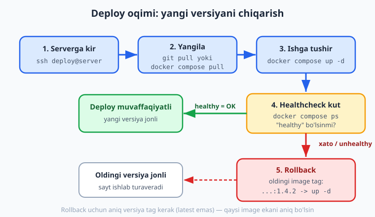
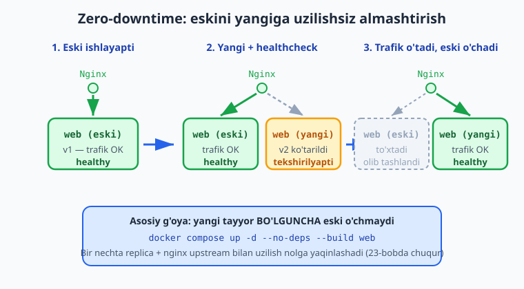

# 20 — To'liq production deploy

[⬅️ Oldingi: 19 — systemd va process boshqaruvi](./19-systemd-process.md) · [🏠 README](./README.md) · [Keyingi: 21 — Nega Kubernetes: arxitektura va lokal klaster ➡️](./21-kubernetes-nima.md)

> **Bu bobda:** kitobning IV qismini yakunlab, hozirgacha o'rganilgan hamma narsani — VPS va xavfsizlik (02, 04), Docker va Compose (06–11), Nginx reverse proxy (16–17), HTTPS (18) va restart siyosati (19) — bitta yaxlit tizimga birlashtiramiz. Namuna "vazifalar" ilovasini noldan production'ga chiqaramiz: bitta `compose.yaml` da `web` (build yoki GHCR image) + `postgres` (named volume) + `redis` + `nginx` (reverse proxy, 80/443) servislarini, `restart: unless-stopped` va `depends_on` + `healthcheck` bilan; maxfiy ma'lumotlarni `.env`/secret faylda serverda (kodga emas) saqlaymiz. Domen + HTTPS (DNS A record, Certbot webroot, auto-renew), serverga deploy oqimi (`git pull` / `docker compose pull` → `up -d` → healthcheck kut), **zero-downtime** asoslari (`up -d --no-deps --build web`, rolling vs recreate, nginx upstream replica) va to'liq **production deploy checklist**ini (env/secret, backup, healthcheck, log, monitoring, rollback) — keyingi qismlarga ko'prik sifatida — ko'ramiz.

---

## Muammo: bo'laklar tayyor, lekin yaxlit tizim yo'q

IV qismda ko'p narsa o'rgandik, lekin har birini **alohida** ko'rdik:

- 02 va 04-boblarda VPS oldik va uni xavfsizladik (SSH kalit, `ufw`, `fail2ban`).
- 06–11-boblarda ilovani **Docker** ga o'tkazdik, image qurdik va `compose.yaml` bilan bir nechta servisni birga ko'tardik.
- 16–17-boblarda **Nginx** ni reverse proxy qildik, 18-bobda **HTTPS** qo'shdik, 19-bobda esa `restart` siyosati bilan ilovani "tirik" qildik.

Endi savol: bularning hammasini **bitta serverda, bitta yaxlit production tizim** sifatida qanday birlashtirish kerak? Real ilova faqat `node app.js` emas — unga **ma'lumotlar bazasi** (Postgres), **cache** (Redis), oldida **Nginx** (TLS bilan), va bularning hammasini boshqaradigan ishonchli **deploy oqimi** kerak.

Bu bob — aynan shu yaxlitlik. Oxirida sizda real, takrorlanuvchi production deploy bo'ladi.

> 📌 Quyidagi `compose.yaml` ni biz lokal Docker'da **haqiqatan ishga tushirib** sinab ko'rdik: `nginx → web → postgres + redis` zanjiri to'liq ishladi (`curl` nginx orqali web'ga yetib bordi). Real domen, jonli 443 TLS va Certbot esa **o'z serveringizda** bajariladi — bu qismlar illustrativ, lekin to'g'ri yozilgan.

---

## To'liq stack arxitekturasi

Avval umumiy rasmni ko'raylik — internetdan ilovagacha so'rov qaysi yo'ldan o'tadi:


Zanjir shunday: **internet → DNS (domen → server IP) → Nginx :443 (TLS tugatish) → web :3000 → postgres + redis**. Hammasi bitta Compose stack ichida, bitta ichki tarmoqda. Faqat Nginx tashqariga ochiq (80/443); web, postgres va redis faqat ichki tarmoqda ko'rinadi (xavfsiz — 11 va 17-boblardagi qoida).

Endi shu arxitekturani `compose.yaml` da yozamiz.

---

## Bitta compose.yaml: butun stack

Production stack quyidagi to'rt servisdan iborat. Avval to'liq fayl, keyin muhim joylarni ajratamiz:

```yaml
services:
  web:
    # Variant A: serverda image qurish
    build: ./app
    # Variant B (afzal): CI qurgan tayyor image (14-bob, GHCR)
    image: ghcr.io/foydalanuvchi/vazifalar-api:latest
    restart: unless-stopped
    environment:
      NODE_ENV: production
      PORT: 3000
      DATABASE_URL: postgres://app:${DB_PASSWORD}@db:5432/vazifalar
      REDIS_URL: redis://cache:6379
    depends_on:
      db:
        condition: service_healthy
      cache:
        condition: service_healthy
    healthcheck:
      test: ["CMD", "node", "-e", "require('http').get('http://localhost:3000/health',r=>process.exit(r.statusCode===200?0:1)).on('error',()=>process.exit(1))"]
      interval: 10s
      timeout: 3s
      retries: 5
      start_period: 10s

  db:
    image: postgres:17-alpine
    restart: unless-stopped
    environment:
      POSTGRES_USER: app
      POSTGRES_PASSWORD: ${DB_PASSWORD}
      POSTGRES_DB: vazifalar
    volumes:
      - db-data:/var/lib/postgresql/data
    healthcheck:
      test: ["CMD-SHELL", "pg_isready -U app -d vazifalar"]
      interval: 10s
      timeout: 5s
      retries: 5

  cache:
    image: redis:7-alpine
    restart: unless-stopped
    healthcheck:
      test: ["CMD", "redis-cli", "ping"]
      interval: 10s
      timeout: 3s
      retries: 5

  nginx:
    image: nginx:1.27-alpine
    restart: unless-stopped
    ports:
      - "80:80"
      - "443:443"
    volumes:
      - ./nginx/app.conf:/etc/nginx/conf.d/default.conf:ro
      - certbot-www:/var/www/certbot
      - certbot-conf:/etc/letsencrypt
    depends_on:
      web:
        condition: service_healthy

volumes:
  db-data:
  certbot-www:
  certbot-conf:
```

Bir nechta qoidaga e'tibor bering:

- **`version:` kaliti YO'Q.** Compose v2'da faylni to'g'ridan `services:` bilan boshlaymiz. ❌ `version: "3.8"` — eskirgan, yozmang.
- **`web` da `build` YOKI `image`.** Serverda qurmoqchi bo'lsangiz `build: ./app`; CI tayyor image qurib GHCR'ga yuborgan bo'lsa (14-bob), faqat `image:` qoldiring va `docker compose pull` qiling — bu production'da afzalroq, chunki serverda kompilyatsiya bo'lmaydi.
- **`restart: unless-stopped` hamma servisda** — qulasa va server reboot bo'lsa Docker daemon ularni ko'taradi (19-bob).
- **`depends_on` + `condition: service_healthy`** — `web` faqat `db` va `cache` **sog'lom** (healthcheck o'tgan) bo'lgandan keyin ishga tushadi. Oddiy `depends_on` faqat "ishga tushgan"ni kutadi, "tayyor"ni emas — `condition: service_healthy` esa haqiqiy tayyorlikni kutadi.
- **`healthcheck`** — har servisning "tirikmi va javob beryaptimi" tekshiruvi. `web` o'zining `/health` endpointini, `db` `pg_isready` ni, `cache` `redis-cli ping` ni ishlatadi.
- **Faqat `nginx` da `ports:`** — 80 va 443 tashqariga ochiq. `web`, `db`, `cache` da `ports:` yo'q — ular faqat ichki tarmoqda, tashqaridan ko'rinmaydi.
- **Named volume `db-data`** — Postgres ma'lumotlari konteyner o'chsa ham saqlanib qoladi (10-bob). `certbot-www`/`certbot-conf` — Certbot challenge va sertifikatlar uchun.

> ⚠️ `web` da `build` ham, `image` ham bo'lsa: `docker compose build`/`up --build` `image:` nomi bilan **qurib**, o'sha nom bilan teglaydi; `docker compose pull` esa `image:` ni **tortib oladi**. Production'da bitta yo'lni tanlang — odatda CI qurgan image'ni `pull` qilish (qayta qurish emas).

---

## Maxfiy ma'lumot: `.env` serverda, kodda emas

`compose.yaml` da `${DB_PASSWORD}` ni ko'rdingiz — parolni faylga ochiq yozmadik. Compose `${...}` o'zgaruvchilarini **shu papkadagi `.env` faylidan** o'qiydi:

```ini
# .env  — SERVERda turadi, git'ga TUSHMAYDI
DB_PASSWORD=juda-kuchli-tasodifiy-parol
```

Bu `.env` faylni serverda qo'lda yarating va ruxsatini cheklang:

```bash
# Faqat egasi o'qiy oladigan qiling
chmod 600 .env

# git'ga tushmasligi uchun .gitignore'ga qo'shing
echo ".env" >> .gitignore
```

> 📌 **Maxfiy ma'lumotlarning oltin qoidasi:** parol, API kalit, token — **hech qachon** git repozitoriyga tushmasin. Ular faqat serverdagi `.env` (yoki Docker/K8s secret) da yashaydi. Kodda — faqat o'zgaruvchi nomi (`${DB_PASSWORD}`), qiymat emas. Bu — 04-bobdagi xavfsizlik qoidasining deploy'dagi davomi.

💡 `docker compose config` bilan tekshirsangiz, `${DB_PASSWORD}` joriy `.env` qiymati bilan almashtirilganini ko'rasiz — agar `.env` yo'q bo'lsa, Compose ogohlantirish beradi. Bu — deploydan oldin maxfiylar joyidami yo'qligini tekshirishning oson usuli.

---

## Nginx konteyner: ilova oldida TLS bilan

Nginx konteyneri `web:3000` ga proxy qiladi. Diqqat: bu — *konteyner* Nginx (17-bobdagi serverga o'rnatilgan Nginx emas). `proxy_pass` manzili `127.0.0.1` emas, balki Compose servis nomi — **`web`** (ichki DNS, 11-bob). `nginx/app.conf`:

```nginx
upstream vazifalar_backend {
    server web:3000;          # Compose ichki DNS: servis nomi "web"
}

# HTTP (80): ACME challenge uchun joy + HTTPS'ga yo'naltirish
server {
    listen 80;
    server_name vazifalar.example.com;

    location /.well-known/acme-challenge/ {
        root /var/www/certbot;     # Certbot webroot challenge'ni shu yerga qo'yadi
    }

    location / {
        return 301 https://$host$request_uri;   # HTTP -> HTTPS
    }
}

# HTTPS (443): TLS tugatish va web'ga proxy
server {
    listen 443 ssl;
    http2 on;
    server_name vazifalar.example.com;

    ssl_certificate     /etc/letsencrypt/live/vazifalar.example.com/fullchain.pem;
    ssl_certificate_key /etc/letsencrypt/live/vazifalar.example.com/privkey.pem;

    location / {
        proxy_pass http://vazifalar_backend;
        proxy_http_version 1.1;
        proxy_set_header Host $host;
        proxy_set_header X-Real-IP $remote_addr;
        proxy_set_header X-Forwarded-For $proxy_add_x_forwarded_for;
        proxy_set_header X-Forwarded-Proto $scheme;     # ilova HTTPS ekanini bilsin
    }
}
```

Bu config 16–18-boblardagi hamma narsani jamlaydi: HTTP→HTTPS yo'naltirish, TLS tugatish 443'da, `X-Forwarded-*` headerlar (17-bob), va ACME challenge yo'li (18-bob).

> 💡 `listen 443 ssl http2;` — **eski** sintaksis. Zamonaviy Nginx'da `listen 443 ssl;` va alohida `http2 on;` yoziladi. Bu config'ni `nginx -t` bilan tekshirib ko'ring (pastda mashqlarda) — har deploydan oldin shart.

⚠️ Sertifikat hali yo'q paytda `ssl_certificate` qatorlari Nginx'ni ishga tushirmaydi (fayl topilmaydi). Real deploy ketma-ketligi: avval faqat 80-portli server bloki bilan Nginx'ni ko'taring, Certbot bilan sertifikat oling, **keyin** 443 blokni qo'shib `nginx -s reload` qiling. Buni quyida ko'ramiz.

---

## Domen va HTTPS: DNS + Certbot

**1. DNS A record.** Domen registratoringizda (yoki Cloudflare kabi DNS provayderda) domeningizni server IP'siga ulang:

```text
Turi    Nom                       Qiymat (server IP)
A       vazifalar.example.com     203.0.113.10
```

DNS yoyilishi (propagation) bir necha daqiqadan bir necha soatgacha vaqt oladi. `dig vazifalar.example.com +short` yoki `nslookup` bilan server IP'sini ko'rsatishini kuting.

**2. Certbot bilan sertifikat (webroot usuli).** Nginx konteyneri 80-portda ishlab turganda, Certbot konteyneri bilan sertifikat oling. Compose'ga bir martalik `certbot` servisi qo'shamiz yoki to'g'ridan ishlatamiz:

```bash
# certbot konteyneri webroot orqali sertifikat oladi
# (certbot-www va certbot-conf volume'lari nginx bilan baham ko'riladi)
docker run --rm \
  -v certbot-conf:/etc/letsencrypt \
  -v certbot-www:/var/www/certbot \
  certbot/certbot certonly --webroot -w /var/www/certbot \
  -d vazifalar.example.com \
  --email admin@example.com --agree-tos --no-eff-email
```

Sertifikat olingach, Nginx config'iga 443 blokni qo'shib qayta yuklang:

```bash
docker compose exec nginx nginx -t          # config to'g'rimi
docker compose exec nginx nginx -s reload   # uzilishsiz qayta yuklash
```

**3. Auto-renew.** Let's Encrypt sertifikati 90 kun amal qiladi. Yangilashni avtomatlashtiring — masalan serverda systemd timer yoki cron (19-bob) bilan har kuni:

```bash
# Har kuni yangilashga urinadi; 30 kun qolganda haqiqatan yangilaydi
docker run --rm \
  -v certbot-conf:/etc/letsencrypt \
  -v certbot-www:/var/www/certbot \
  certbot/certbot renew --webroot -w /var/www/certbot \
  && docker compose exec nginx nginx -s reload
```

> ℹ️ Bu qadamlar — **jonli**: real domen, DNS yoyilishi va Let's Encrypt server bilan aloqa offline ishlamaydi. Shuning uchun ularni **o'z serveringizda** bajaring. Config sintaksisini esa lokalda `nginx -t` bilan (self-signed sertifikat bilan) tekshirish mumkin.

---

## Deploy oqimi: serverga kelib yangilashni chiqarish

Stack tayyor. Endi yangi versiyani production'ga chiqarish oqimini ko'ramiz. Ikki asosiy variant bor:

**Variant A — serverda qurish (`git pull` + `build`):**

```bash
ssh deploy@203.0.113.10
cd /opt/vazifalar-api
git pull                              # yangi kodni torting
docker compose up -d --build          # qayta qur va yangi konteynerga almashtir
docker compose ps                     # holatni tekshir
```

**Variant B — tayyor image'ni tortish (`docker compose pull`, afzal):**

CI (14-bob) image'ni qurib GHCR'ga yuborgan bo'lsa, serverda qurish shart emas — faqat tayyor image'ni torting:

```bash
ssh deploy@203.0.113.10
cd /opt/vazifalar-api
docker compose pull                   # GHCR'dan yangi image'ni tort
docker compose up -d                  # yangi image bilan konteynerni almashtir
docker compose ps                     # healthcheck "healthy" bo'lishini kut
```



`up -d` ning aqlli tomoni: Compose faqat **o'zgargan** servislarni qayta yaratadi. Image'i o'zgarmagan `db` va `cache` ga tegmaydi — ular ishlab turaveradi. Faqat `web` ning yangi image'i bo'lsa, faqat `web` almashtiriladi.

> 💡 Deploydan keyin **albatta** healthcheck'ni kuting va loglarga qarang: `docker compose ps` (healthy bo'lishi kerak) va `docker compose logs -f web`. "Up qildim, ketdim" emas — "up qildim, sog'lom ekanini ko'rdim, keyin ketdim".

---

## Zero-downtime asoslari

"Deploy paytida sayt o'chib qoladimi?" — eng ko'p beriladigan savol. Compose darajasidagi asoslarni ko'ramiz (chuqur rolling update — 23-bobda, Kubernetes bilan).

**`up -d` qanday ishlaydi.** `docker compose up -d` o'zgargan servis uchun **yangi** konteyner ko'taradi va **eskisini** to'xtatib almashtiradi. Standart xulq — `recreate`: eski to'xtaydi, yangi ishga tushadi. Bir oz uzilish bo'lishi mumkin (yangi konteyner ko'tarilguncha).

**Faqat web'ni qayta qurish/almashtirish:**

```bash
# Faqat web servisini qayta qur va almashtir, db/cache'ga tegmasdan
docker compose up -d --no-deps --build web
```

`--no-deps` — `web` ning bog'liqliklarini (db, cache) qayta ishga tushirmaydi; ular ishlab turaveradi. `--build` — yangi image'ni qurib oladi. Bu — eng ko'p ishlatiladigan tezkor deploy buyrug'i.

**Haqiqiy zero-downtime — healthcheck + bir nechta replica.** Uzilishni nolga yaqinlashtirish uchun: yangi konteyner ko'tariladi, **healthcheck OK** bo'lguncha kutiladi, **keyin** trafik unga o'tadi, eski o'chadi:



Nginx upstream'da bir nechta replica bilan bu yanada silliqlashadi (17-bob):

```nginx
upstream vazifalar_backend {
    server web1:3000;
    server web2:3000;     # ikkinchi replica
}
```

Bittasi yangilanayotganda ikkinchisi trafikni ushlab turadi. Ammo Compose'da replica boshqaruvi qo'lda; haqiqiy **rolling update** (bir-bir replica'ni avtomatik almashtirish, healthcheck bilan) — Kubernetes'ning kuchli tomoni, uni **23-bobda** chuqur ko'ramiz.

> 📌 **Rolling vs recreate.** *Recreate* — eskisini o'chirib yangisini ko'taradi (oddiy, qisqa uzilish bo'lishi mumkin). *Rolling* — replica'larni bir-bir almashtiradi, har doim kamida bittasi ishlab turadi (uzilishsiz). Compose'da `up -d` asosan recreate; rolling uchun K8s Deployment (22-bob) yoki bir nechta replica + nginx upstream kerak.

---

## Production deploy checklist

Birinchi marta yoki har jiddiy deploydan oldin shu ro'yxatdan o'ting. Ko'p punktlar keyingi qismlarga (monitoring, backup) ko'prik:

- **Env / secret** — barcha maxfiy qiymatlar serverdagi `.env` (yoki secret) da, git'da emas. `chmod 600 .env`. `docker compose config` bilan o'zgaruvchilar to'g'ri o'qilganini tekshiring.
- **Backup** — ma'lumotlar bazasi (named volume) **muntazam** zaxiralanyaptimi? `pg_dump` + offsite (boshqa joyga nusxa). Volume yo'qolsa ma'lumot ham yo'qoladi — bu eng katta xavf. (26-bobda chuqur.)
- **Healthcheck** — har servisda `healthcheck` bor; `web` da `/health` endpoint; `depends_on: condition: service_healthy`.
- **Log** — `docker compose logs` ishlayaptimi? Loglar markazlashtirilganmi yoki hech bo'lmasa `journalctl`/fayl orqali ko'rinadimi? (26-bob.)
- **Monitoring** — server va ilova metrikalari (CPU, RAM, javob vaqti, xatolar) kuzatilyaptimi? (25-bob: Prometheus + Grafana.)
- **HTTPS** — sertifikat amaldami, auto-renew sozlanganmi, HTTP→HTTPS yo'naltirish ishlayaptimi?
- **Rollback rejasi** — yangi versiya buzilsa, **oldingi** versiyaga qanday qaytasiz? Image tag bilan:

```bash
# Yangi versiya buzildi -> oldingi tag'ga qayt (14-bobdagi semantik tag'lar)
docker compose pull            # yoki aniq tag: image: ghcr.io/.../vazifalar-api:1.4.2
docker compose up -d web
```

> ⚠️ **`latest` tag'iga ishonmang.** Production'da `latest` o'rniga aniq versiya tag'i (`:1.5.0`) ishlating (14-bob). Aks holda "oldingi versiyaga qayt" deganda qaysi image ekanini bilmaysiz va rollback imkonsiz bo'ladi.

📌 Bu checklist — production'ning "minimal javobgarligi". `web + db` ni `up -d` qilib qo'yib ketish *deploy* emas; backup, monitoring, rollback rejasi bilan birga *ishonchli deploy* bo'ladi. Keyingi qismlar (V: Kubernetes, VI: monitoring/backup/IaC) shu ro'yxatni mustahkamlaydi.

---

## Yakun

IV qismni yakunladik: namuna "vazifalar" ilovasini noldan production'ga chiqardik. Bitta `compose.yaml` da `web` + `postgres` + `redis` + `nginx` ni `restart: unless-stopped`, `depends_on` + `healthcheck` bilan birlashtirdik; maxfiy ma'lumotlarni serverdagi `.env` da (kodda emas) sakladik; domen + HTTPS ni (DNS A record, Certbot webroot, auto-renew) qo'shdik; serverga deploy oqimini (`git pull` / `docker compose pull` → `up -d` → healthcheck kut) va zero-downtime asoslarini (`up -d --no-deps`, rolling vs recreate, nginx upstream replica) ko'rdik; va production deploy checklist'ini chiqardik.

Endi sizda real, takrorlanuvchi production deploy bor. Lekin bitta serverda Compose'ning chegaralari bor: avtomatik rolling update yo'q, bir nechta serverga (klaster) tarqatish qiyin, replica'larni o'zi boshqarmaydi, biror konteyner butun serverni "olib ketsa" — zaxira yo'q. **V qismda** aynan shu muammolarni hal qiladigan vositaga — **Kubernetes**ga o'tamiz. Keyingi **21-bobda** Kubernetes nima uchun kerakligini va lokal klaster (minikube/kind) bilan birinchi qadamni ko'ramiz.

---

## 20-bob mashqlari

### Oson

1. To'liq production stack qaysi to'rt servisdan iborat? Har birining vazifasini bir jumlada ayting.
2. `compose.yaml` da nega faqat `nginx` da `ports:` bor, `web`/`db`/`cache` da yo'q? Bu qanday xavfsizlik foydasi beradi?
3. Maxfiy ma'lumot (DB paroli) qayerda saqlanadi va qayerda **saqlanmasligi** kerak? `compose.yaml` da nima yoziladi?
4. `docker compose up -d` va `docker compose pull` orasidagi farq nima? Production'da qaysi biri afzal va nega?
5. Nima uchun `version: "3.8"` ni `compose.yaml` ga yozmaslik kerak?

### O'rta

6. `depends_on` ning oddiy varianti va `condition: service_healthy` varianti orasidagi farqni tushuntiring. Nega `web` uchun ikkinchisi muhim?
7. Nginx config'da `proxy_pass http://web:3000` da nega `127.0.0.1` emas, `web` yoziladi? (11 va 17-boblarga tayaning.)
8. Deploy paytida "zero-downtime" ni ta'minlash uchun `up -d --no-deps --build web` buyrug'i nima qiladi? `--no-deps` nimani anglatadi?
9. Let's Encrypt sertifikati necha kun amal qiladi va nega auto-renew kerak? Yangilashni qanday avtomatlashtirasiz?
10. Rollback nima va u nega `latest` tag bilan emas, aniq versiya tag bilan ishlaydi?

### Qiyin

11. To'liq production `compose.yaml` yozing: `web` (GHCR image, `restart: unless-stopped`, `/health` healthcheck, `db` va `cache` sog'lom bo'lgandan keyin ishga tushadigan), `db` (`postgres:17-alpine`, named volume, `pg_isready` healthcheck), `cache` (`redis:7-alpine`), va `nginx` (80/443, config volume bilan). DB parolini `.env` o'zgaruvchisi bilan bering. So'ng `docker compose config` bilan tekshirish buyrug'ini yozing.
12. Namuna ilova oldidagi `nginx/app.conf` ni yozing: HTTP (80)'da ACME challenge yo'li + HTTPS'ga yo'naltirish, HTTPS (443)'da TLS sertifikat va `web:3000` ga proxy (zamonaviy `http2 on;` sintaksisi bilan, `X-Forwarded-*` headerlar bilan). Config'ni qanday tekshirasiz?
13. To'liq deploy ssenariysi yozing: yangi versiyani GHCR'dan tortib chiqarish ketma-ketligi (SSH → pull → up → healthcheck kut), va agar yangi versiya buzilsa rollback qadamlari. Production deploy checklist'idan kamida 5 punktni sanang.

<details markdown="1"><summary>Yechim — 11</summary>

```yaml
services:
  web:
    image: ghcr.io/foydalanuvchi/vazifalar-api:1.5.0
    restart: unless-stopped
    environment:
      NODE_ENV: production
      PORT: 3000
      DATABASE_URL: postgres://app:${DB_PASSWORD}@db:5432/vazifalar
      REDIS_URL: redis://cache:6379
    depends_on:
      db:
        condition: service_healthy
      cache:
        condition: service_healthy
    healthcheck:
      test: ["CMD", "node", "-e", "require('http').get('http://localhost:3000/health',r=>process.exit(r.statusCode===200?0:1)).on('error',()=>process.exit(1))"]
      interval: 10s
      timeout: 3s
      retries: 5
      start_period: 10s

  db:
    image: postgres:17-alpine
    restart: unless-stopped
    environment:
      POSTGRES_USER: app
      POSTGRES_PASSWORD: ${DB_PASSWORD}
      POSTGRES_DB: vazifalar
    volumes:
      - db-data:/var/lib/postgresql/data
    healthcheck:
      test: ["CMD-SHELL", "pg_isready -U app -d vazifalar"]
      interval: 10s
      timeout: 5s
      retries: 5

  cache:
    image: redis:7-alpine
    restart: unless-stopped

  nginx:
    image: nginx:1.27-alpine
    restart: unless-stopped
    ports:
      - "80:80"
      - "443:443"
    volumes:
      - ./nginx/app.conf:/etc/nginx/conf.d/default.conf:ro
    depends_on:
      web:
        condition: service_healthy

volumes:
  db-data:
```

Tekshirish:

```bash
docker compose config        # xatosiz parse + ${DB_PASSWORD} .env'dan olinadi
```

`version:` yo'q (Compose v2); maxfiy parol faqat `${DB_PASSWORD}` orqali (`.env` da); `db` va `cache` da `ports:` yo'q (ichki); `web` aniq versiya tag bilan (`1.5.0`, `latest` emas) — rollback uchun.
</details>

<details markdown="1"><summary>Yechim — 12</summary>

`nginx/app.conf`:

```nginx
upstream vazifalar_backend {
    server web:3000;
}

server {
    listen 80;
    server_name vazifalar.example.com;

    location /.well-known/acme-challenge/ {
        root /var/www/certbot;
    }

    location / {
        return 301 https://$host$request_uri;
    }
}

server {
    listen 443 ssl;
    http2 on;
    server_name vazifalar.example.com;

    ssl_certificate     /etc/letsencrypt/live/vazifalar.example.com/fullchain.pem;
    ssl_certificate_key /etc/letsencrypt/live/vazifalar.example.com/privkey.pem;

    location / {
        proxy_pass http://vazifalar_backend;
        proxy_http_version 1.1;
        proxy_set_header Host $host;
        proxy_set_header X-Real-IP $remote_addr;
        proxy_set_header X-Forwarded-For $proxy_add_x_forwarded_for;
        proxy_set_header X-Forwarded-Proto $scheme;
    }
}
```

Tekshirish:

```bash
# Ishlab turgan stack'da:
docker compose exec nginx nginx -t

# Yoki alohida (config va sertifikatni mount qilib):
docker run --rm -v "$PWD/nginx/app.conf:/etc/nginx/conf.d/default.conf:ro" \
  nginx:1.27-alpine nginx -t
```

`http2 on;` alohida qator (eski `listen 443 ssl http2;` emas); `proxy_pass` servis nomiga (`web`, ichki DNS); `X-Forwarded-Proto $scheme` — ilova so'rov HTTPS ekanini biladi.
</details>

<details markdown="1"><summary>Yechim — 13</summary>

**Deploy ketma-ketligi (GHCR'dan tayyor image):**

```bash
ssh deploy@203.0.113.10
cd /opt/vazifalar-api
docker compose pull                 # yangi image'ni GHCR'dan tort
docker compose up -d                # konteynerni yangi image bilan almashtir
docker compose ps                   # web "healthy" bo'lishini kut
docker compose logs -f web          # loglarda xato yo'qligini ko'r
curl -fsS https://vazifalar.example.com/health   # tashqaridan tekshir
```

**Rollback (yangi versiya buzildi):**

```bash
# compose.yaml'da tag'ni oldingi ishlagan versiyaga qaytar, masalan:
#   image: ghcr.io/foydalanuvchi/vazifalar-api:1.4.2
docker compose pull web
docker compose up -d web            # eski (ishlagan) image bilan almashtir
docker compose ps                   # yana healthy ekanini tekshir
```

**Checklist (5+ punkt):**

1. **Env/secret** — `.env` serverda, `chmod 600`, git'da yo'q.
2. **Backup** — DB volume muntazam zaxiralanadi (`pg_dump` + offsite).
3. **Healthcheck** — har servisda healthcheck, `web` da `/health`.
4. **Log** — `docker compose logs` ishlaydi, loglar kuzatiladi.
5. **Monitoring** — CPU/RAM/javob vaqti/xatolar kuzatiladi (25-bob).
6. **HTTPS** — sertifikat amalda, auto-renew sozlangan, HTTP→HTTPS yo'naltirish bor.
7. **Rollback rejasi** — aniq versiya tag bilan oldingi versiyaga qaytish yo'li tayyor.

`latest` o'rniga aniq tag (`1.4.2`) ishlatish rollback'ni mumkin qiladi: "oldingi versiya" qaysi image ekani aniq.
</details>

---

[⬅️ Oldingi: 19 — systemd va process boshqaruvi](./19-systemd-process.md) · [🏠 README](./README.md) · [Keyingi: 21 — Nega Kubernetes: arxitektura va lokal klaster ➡️](./21-kubernetes-nima.md)
