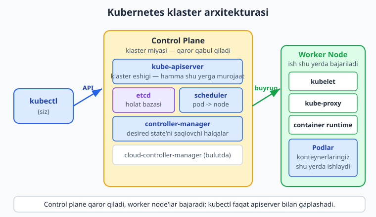
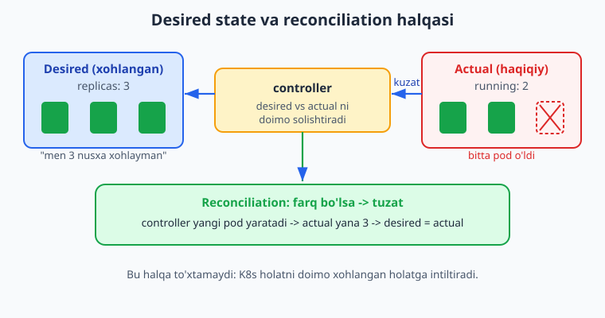
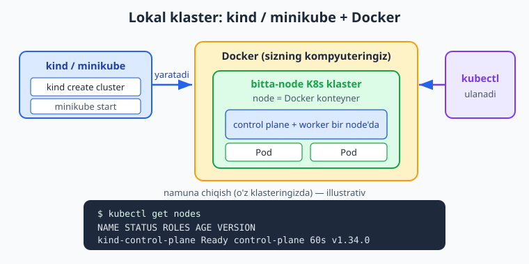

# 21 — Nega Kubernetes: arxitektura va lokal klaster

[⬅️ Oldingi: 20 — To'liq production deploy](./20-toliq-deploy.md) · [🏠 README](./README.md) · [Keyingi: 22 — Pod, Deployment, Service ➡️](./22-pod-deployment-service.md)

> **Bu bobda:** 20-bobgacha bitta serverda Docker Compose bilan to'liq production deploy qildik — endi shu yondashuv qayerda yetmasligini ko'ramiz: bitta server cheklovi, qo'lda scaling, self-healing yo'qligi, ko'p serverga tarqatishning qiyinligi. Bu muammolar bizni **orkestratsiya** (orchestration) ga olib keladi va asosiy orkestrator — **Kubernetes** (K8s) bilan tanishtiradi: u nima, qisqa tarixi (Google Borg), **qachon kerak / qachon kerak emas** (kichik loyihaga Compose halol yetadi). Klaster arxitekturasini — **control plane** (kube-apiserver, etcd, kube-scheduler, controller-manager, cloud-controller-manager) va **worker node** (kubelet, kube-proxy, container runtime) — sodda tilda ochamiz. K8s'ning yuragi bo'lgan **desired state** va **reconciliation loop** ni ("men 3 nusxa xohlayman" -> controller doim shu holatga intiladi), klaster bilan gaplashish vositasi **`kubectl`** ni va kubeconfig'ni, so'ng **minikube**/**kind** bilan kompyuteringizda lokal klaster ishga tushirishni ko'rib chiqamiz. Oxirida 22-bobda chuqurlashtiriladigan asosiy obyektlar — Pod, Deployment, Service, Namespace — bilan qisqa tanishamiz.

---

## Muammo: Docker Compose qayerda yetmaydi

20-bobda namuna **vazifalar API** ilovamizni bitta VPS serverda Docker Compose bilan deploy qildik: Nginx reverse proxy, HTTPS, `restart: unless-stopped`. Bu — ko'p loyiha uchun mukammal yechim. Lekin loyiha o'sgani sayin to'rtta jiddiy cheklov chiqadi:

- **Bitta server cheklovi.** Hamma narsa bitta mashinada. O'sha server o'chsa (apparat nosozligi, data-markaz uzilishi, `reboot`) — **butun sayt o'chadi**. Compose bir nechta serverni boshqarmaydi; u faqat bitta hostdagi konteynerlarni biladi.
- **Qo'lda scaling.** Yuk oshganda? `docker compose up --scale vazifalar=4` bilan bitta serverda nusxa qo'shasiz — lekin o'sha serverning CPU/RAM'i tugaydi. Boshqa serverga avtomatik tarqatish yo'q; har yangi serverni o'zingiz sozlab, qo'lda konteyner ko'tarasiz.
- **Self-healing yo'q (server darajasida).** `restart: unless-stopped` *konteyner* qulasa uni ko'taradi — lekin agar butun *server* o'lsa, Docker daemon ham o'ladi, hech kim ilovani boshqa sog'lom serverga ko'chirmaydi. Sizga "bir node o'lsa, ish boshqasiga o'tsin" kafolati kerak — Compose buni bermaydi.
- **Ko'p serverga tarqatish qiyin.** 10 ta serverga bir xil stack'ni tarqatish, ularni yangilash, qaysi konteyner qayerda ishlayotganini kuzatish — qo'lda boshqarib bo'lmaydigan ish. Bitta `compose.yaml` 10 ta mustaqil serverni hech qachon yagona tizim qilmaydi.

Bularning ildizi bitta: Compose — **bitta xost** vositasi. Sizga **ko'p serverni (klaster)** yagona resurs sifatida boshqaradigan, "shu ilovani 5 nusxada, sog'lom serverlarga tarqatib ishlatib tur; biri o'lsa boshqasiga ko'chir; yuk oshsa nusxa qo'sh" deydigan vosita kerak. Bu vosita sinfi — **orkestratsiya** (container orchestration), eng tarqalgani — **Kubernetes**.

> 📌 Compose "yomon" emas — u boshqa muammoni hal qiladi. Compose = bitta serverda bir nechta konteynerni birga ko'tarish. Kubernetes = ko'p serverdan iborat klasterda konteynerlarni avtomatik tarqatish, tiklash va kengaytirish. To'g'ri vositani to'g'ri masshtabda tanlash kerak.

---

## Kubernetes (K8s) nima

**Kubernetes** — ochiq kodli **konteyner orkestratori**: bir nechta serverni (node'larni) birlashtirib **klaster** qiladi va sizning konteynerlaringizni shu klaster bo'ylab avtomatik joylashtiradi, kuzatadi, qulaganda tiklaydi, yuk bo'yicha kengaytiradi. Nomi yunoncha "rul boshqaruvchisi" (kemaning shturvalini ushlovchi) degani; qisqartmasi **K8s** ("K", keyin 8 ta harf, "s").

Eng muhim g'oya: Kubernetes — **deklarativ**. Siz unga *qadamlarni* (avval buni ishga tushir, keyin uni) aytmaysiz; siz **xohlangan natijani** (desired state) tasvirlaysiz: "vazifalar ilovamning 3 nusxasi doimo ishlasin, har biri shu image'dan, 3000-portda". Kubernetes esa shu holatga **doimo intiladi** — bittasi o'lsa, yangisini yaratadi; node yiqilsa, podlarni boshqa node'ga ko'chiradi. Bu — keyingi bo'limdagi **reconciliation loop**.

**Qisqa tarix.** Kubernetes 2014-yilda Google tomonidan ochildi va o'zlarining ichki tizimi **Borg** (Google o'n yildan ortiq million konteynerlarni shu bilan boshqargan) tajribasiga asoslangan. Bugun u **CNCF** (Cloud Native Computing Foundation) loyihasi — sanoat standarti, deyarli barcha bulutlar (AWS EKS, Google GKE, Azure AKS) uni boshqariladigan xizmat sifatida taklif qiladi.

### Qachon kerak / qachon KERAK EMAS (halol)

Kubernetes kuchli, lekin **murakkab**. Uni har loyihaga tiqishtirish — keng tarqalgan xato. Halol jadval:

| Holat | Tavsiya |
|---|---|
| Bitta kichik sayt/API, 1–2 server, kam trafik | **Compose yetadi.** K8s ortiqcha murakkablik. |
| Pet-loyiha, MVP, hobbi | Compose yoki oddiy PaaS. K8s shart emas. |
| Ko'p mikroservis, ko'p jamoa | K8s o'zini oqlaydi. |
| Yuqori mavjudlik (HA) kerak — bir node o'lsa ish to'xtamasin | K8s (ko'p node'li). |
| Avtomatik scaling, tez-tez deploy, rolling update kerak | K8s yoki shunga o'xshash orkestrator. |

> ⚠️ Eng katta yangi boshlovchi xatosi — kichik loyihaga Kubernetes o'rnatib, keyin uning murakkabligida (YAML, tarmoq, RBAC, monitoring) ko'milib qolish. Agar Compose muammolaringizni hal qilayotgan bo'lsa — Compose'da qoling. K8s'ni real ehtiyoj (ko'p server, HA, avtomatik scaling) paydo bo'lganda joriy eting. Bu bob K8s'ni **o'rganish** uchun; production'ga o'tish — ehtiyojga qarab.

---

## Arxitektura: control plane va worker node'lar

Kubernetes klasteri ikki turdagi mashinadan iborat: **control plane** (klaster miyasi — qaror qabul qiladi) va bir yoki bir nechta **worker node** (ish bajariladigan joy — sizning konteynerlaringiz shu yerda ishlaydi). Quyidagi diagramma butun manzarani ko'rsatadi:



### Control plane komponentlari

Control plane — klasterning "boshqaruv markazi". To'rt asosiy komponent (+ bulut uchun bittasi):

- **kube-apiserver** — klasterning **yagona eshigi**. Hamma — siz (`kubectl` orqali), boshqa komponentlar, har bir node — faqat shu bilan gaplashadi. U so'rovlarni qabul qiladi, tekshiradi (autentifikatsiya/avtorizatsiya), holatni `etcd`ga yozadi. Tasavvur qiling: klasterning **registratura/qabulxonasi**.
- **etcd** — klaster holatining **bazasi** (kalit-qiymat ombori). "Hozir nima xohlanyapti, nima ishlayapti" — hammasi shu yerda saqlanadi. Klasterning **yagona haqiqat manbai** (source of truth). U yo'qolsa — klaster xotirasini yo'qotadi (shuning uchun production'da `etcd` backup qilinadi).
- **kube-scheduler** — yangi **pod**ni qaysi worker node'da ishga tushirishni hal qiladi: qaysi node'da yetarli CPU/RAM bor, cheklovlar bajariladimi. U faqat **joylashtirishni rejalashtiradi** — "bu podni shu node'ga qo'y" deb belgilaydi.
- **kube-controller-manager** — bir nechta **controller** (boshqaruvchi halqa) ni ishlatadi. Har biri ma'lum bir turdagi holatni kuzatadi va xohlangan holatga intiladi (masalan, "3 nusxa kerak, hozir 2 ta — yana bittasini yarat"). Bu — keyingi bo'limdagi reconciliation loop'ning markazi.
- **cloud-controller-manager** — faqat **bulutda** ishlaydi: bulut provayderi bilan integratsiya (LoadBalancer yaratish, disk ulash). Lokal yoki o'z serveringizdagi klasterda bo'lmasligi mumkin.

> 💡 Boshqariladigan K8s xizmatlarida (GKE, EKS, AKS) **control plane'ni bulut provayderi boshqaradi** — siz faqat worker node'lar bilan ishlaysiz va `etcd` backup, apiserver yangilash kabi tashvishlardan ozod bo'lasiz. Bu — production uchun eng keng tarqalgan, eng oson yo'l.

### Worker node komponentlari

Har bir worker node'da uchta komponent bo'ladi:

- **kubelet** — node'dagi **agent**. apiserver'dan "shu podlarni ishlatib tur" buyrug'ini oladi va container runtime orqali konteynerlarni ishga tushiradi, ularning sog'lig'ini kuzatib turadi va apiserver'ga hisobot beradi.
- **kube-proxy** — node'dagi **tarmoq qoidalari** ni boshqaradi: Service'ga kelgan trafikni to'g'ri pod'larga yo'naltiradi (22-bobda Service'ni ko'ramiz).
- **container runtime** — konteynerlarni **haqiqatan ishlatadigan** dvigatel (masalan containerd). 06-bobdagi Docker'ning konteyner ishlatish qismiga o'xshaydi — kubelet shu runtime'ga buyruq beradi.

Va eng muhimi — node'da sizning **podlaringiz** ishlaydi: pod ichida bir yoki bir nechta konteyner (odatda ilovangizning bitta nusxasi). Pod — K8s'da eng kichik joylashtiriladigan birlik (22-bobda batafsil).

> 📌 Lokal klaster (minikube/kind) da control plane va worker **bitta** node'da birlashadi — o'rganish uchun yetarli. Production'da control plane alohida, worker'lar alohida (ko'pincha bir nechta) bo'ladi — toki bittasi o'lsa ham ish davom etsin.

---

## Desired state va reconciliation loop

Bu — Kubernetes'ni boshqa hamma narsadan ajratib turadigan asosiy g'oya. Siz **xohlagan holatni** e'lon qilasiz, K8s esa **haqiqiy holatni** doimo shunga moslab turadi.



Misol bilan:

1. Siz e'lon qilasiz: **desired = 3 nusxa** (`replicas: 3`). Bu apiserver orqali `etcd`ga yoziladi.
2. Controller bu xohishni ko'radi, scheduler 3 podni node'larga joylashtiradi, kubelet'lar ularni ishga tushiradi. **Actual = 3.** Hammasi joyida.
3. Bir pod (yoki butun bir node) **o'ladi**. Endi **actual = 2**, lekin desired hali ham 3.
4. Controller bu **farqni sezadi** (har doim desired'ni actual bilan solishtiradi) va **yangi pod yaratadi**. Scheduler uni sog'lom node'ga qo'yadi, kubelet ishga tushiradi. **Actual yana 3.**

Bu doimiy "kuzat -> solishtir -> tuzat" jarayoni — **reconciliation loop** (moslashtirish halqasi). U hech qachon to'xtamaydi. Aynan shu sababdan K8s **self-healing** (o'z-o'zini davolaydigan): siz tunda uxlayotganingizda pod qulasa ham, controller uni o'zi qayta yaratadi.

> 💡 Bu — 19-bobdagi systemd `Restart=on-failure` va Docker `restart:` g'oyasining **klaster darajasidagi** versiyasi. systemd bitta serverda jarayonni tiklaydi; K8s **butun klaster** bo'ylab podlarni tiklaydi va kerak bo'lsa boshqa sog'lom node'ga ko'chiradi. Ana shu — Compose'da yetishmagan "server o'lsa ish boshqasiga o'tsin" kafolati.

---

## `kubectl` — klaster bilan gaplashish vositasi

Klaster bilan ishlashning asosiy vositasi — **`kubectl`** ("kube control" yoki "kube-cuttle"). Bu — apiserver'ga buyruq yuboradigan buyruq qatori dasturi. Lokal mashinamizda u allaqachon o'rnatilgan:

```bash
kubectl version --client
```

Kutilgan chiqish (versiya raqami mashinangizga qarab farq qilishi mumkin):

```text
Client Version: v1.34.1
Kustomize Version: v5.7.1
```

`--client` — faqat `kubectl` ning o'z versiyasini ko'rsatadi, klasterga ulanmasdan. (Klastersiz `--client`siz `kubectl version` ishlatsangiz, "ulanib bo'lmadi" xatosini berishi mumkin — chunki u serverga ham murojaat qiladi.)

Eng ko'p ishlatiladigan buyruqlar (klaster ulanganda):

```bash
kubectl get nodes          # klasterdagi node'lar ro'yxati va holati
kubectl get pods           # joriy namespace'dagi podlar
kubectl get pods -A        # barcha namespace'dagi podlar
kubectl apply -f app.yaml  # YAML'da tasvirlangan desired state'ni qo'llash
kubectl describe pod <nom> # pod haqida batafsil ma'lumot (debugging uchun)
kubectl delete -f app.yaml # YAML'da tasvirlangan obyektlarni o'chirish
```

`kubectl apply -f` — eng muhim buyruq: u sizning **deklarativ** YAML faylingizni o'qib, "men shu holatni xohlayman" deb apiserver'ga aytadi. K8s qolganini reconciliation loop bilan o'zi bajaradi.

### kubeconfig: kubectl qaysi klasterga ulanishini biladi

`kubectl` qaysi klasterga, qaysi foydalanuvchi sifatida ulanishini **kubeconfig** faylidan o'qiydi. Standart joyi:

```text
~/.kube/config        # Linux/macOS
%USERPROFILE%\.kube\config   # Windows
```

Bu fayl klaster manzili (apiserver URL), autentifikatsiya ma'lumotlari va **context** (qaysi klaster + foydalanuvchi + namespace) ni saqlaydi. minikube/kind klaster yaratganda bu faylni **o'zi to'ldiradi** — shuning uchun klaster yaratgandan keyin `kubectl` darhol unga ulanadi. Bir nechta klasteringiz bo'lsa, ular orasida shunday almashasiz:

```bash
kubectl config get-contexts     # mavjud context'lar ro'yxati
kubectl config current-context  # hozir qaysisiga ulangansiz
kubectl config use-context kind-kind   # boshqasiga o'tish
```

> ⚠️ kubeconfig — maxfiy fayl (klasterga to'liq kirish kalitini saqlaydi). Uni Git'ga **commit qilmang**, boshqalarga yubormang. Yo'qolsa — klasteringizni begona qo'lga topshirgan bo'lasiz.

---

## Lokal klaster: minikube yoki kind

Production klaster bir nechta serverni talab qiladi — lekin **o'rganish va lokal test** uchun kompyuteringizda bitta-node'li klaster ko'tarish mumkin. Ikki mashhur vosita bor, ikkalasi ham **Docker** ichida klaster yaratadi:



### kind (Kubernetes IN Docker)

`kind` har bir node'ni **Docker konteyner** sifatida ishlatadi — yengil, tez, ko'p-node'li klasterni ham oson yaratadi (CI uchun ideal). Klaster yaratish:

```bash
kind create cluster
```

Bu buyruq standart `kind` nomli bitta-node klaster yaratadi va kubeconfig'ni o'zi sozlaydi. So'ng tekshiring:

```bash
kubectl get nodes
```

Namuna chiqish (illustrativ — o'z klasteringizda; bu mashinada klaster yo'q):

```text
NAME                 STATUS   ROLES           AGE   VERSION
kind-control-plane   Ready    control-plane   60s   v1.34.0
```

Klasterni o'chirish:

```bash
kind delete cluster
```

### minikube

`minikube` — yangi boshlovchilarga eng do'stona, ko'p o'rnatuvchi va boy qo'shimchalar (addons: dashboard, ingress) bilan. Docker driver bilan ishga tushirish:

```bash
minikube start --driver=docker
```

Tekshirish va to'xtatish/o'chirish:

```bash
minikube status     # klaster holati
kubectl get nodes   # node ro'yxati
minikube stop       # to'xtatish (saqlanadi)
minikube delete     # butunlay o'chirish
```

### Boshlovchi qaysisini tanlasin?

- **minikube** — birinchi marta o'rganayotgan bo'lsangiz: do'stona, dashboard'i bor, xatolarni yaxshi tushuntiradi. Tavsiya: **boshlovchiga minikube**.
- **kind** — tezroq, yengilroq, CI/CD pipeline'da klaster ko'tarish va ko'p-node'li test uchun ideal. Tavsiya: **CI va ko'p-node test uchun kind**.

Ikkalasiga ham **Docker** kerak (06-bobda o'rnatdik) — chunki har ikkisi klasterni Docker konteyner(lar)i ichida ko'taradi.

> 💡 Ko'p-node'li lokal klaster (control plane + worker'lar) ham mumkin. `kind` da config fayl orqali:
> ```yaml
> kind: Cluster
> apiVersion: kind.x-k8s.io/v1alpha4
> nodes:
>   - role: control-plane
>   - role: worker
>   - role: worker
> ```
> So'ng `kind create cluster --config kind-config.yaml` — bu 3 node'li klaster yaratadi (illustrativ — o'z mashinangizda).

---

## Asosiy obyektlar bilan qisqa tanishuv

Klaster tayyor — endi unga nima joylaymiz? K8s'da hamma narsa **obyekt** (resource) sifatida, YAML'da tasvirlanadi. To'rtta eng asosiysi (22-bobda chuqur ko'ramiz, hozir faqat tanishuv):

- **Pod** — eng kichik joylashtiriladigan birlik. Ichida bir (yoki kam hollarda bir nechta) konteyner ishlaydi. Odatda **bevosita Pod yaratmaysiz** — uni Deployment boshqaradi.
- **Deployment** — Pod'larni **boshqaradi**: nechta nusxa (`replicas`) kerakligini e'lon qilasiz, Deployment esa reconciliation loop orqali shuni ta'minlaydi va yangilanishlarni (rolling update) bajaradi. Aynan bu — "men 3 nusxa xohlayman" deyiladigan joy.
- **Service** — Pod'larga **barqaror manzil** beradi. Pod'lar o'lib-yaralib turadi (IP'lari o'zgaradi), Service esa o'zgarmas nom/IP orqali ularga trafik yo'naltiradi (yuk taqsimlash bilan).
- **Namespace** — klaster ichidagi **mantiqiy bo'lim** (papka kabi): obyektlarni guruhlash uchun (masalan `dev`, `staging`, `prod`). Standart namespace — `default`; tizim komponentlari — `kube-system`.

Bu obyektlarni qanday YAML'da yozish va ulashni 22-bobda batafsil ko'ramiz. Hozir asosiy g'oya yetarli: **siz YAML'da desired state'ni tasvirlaysiz -> `kubectl apply` -> K8s shu holatga intiladi.**

> ℹ️ Namuna sifatida bitta minimal Pod manifesti (22-bobda Deployment'ga o'tamiz, hozir faqat ko'rish uchun):
> ```yaml
> apiVersion: v1
> kind: Pod
> metadata:
>   name: vazifalar
> spec:
>   containers:
>     - name: vazifalar
>       image: ghcr.io/foydalanuvchi/vazifalar-api:latest
>       ports:
>         - containerPort: 3000
> ```
> Buni `kubectl apply -f pod.yaml` bilan klasterga qo'llanadi (illustrativ — o'z klasteringizda).

---

## Yakun

20-bobdagi bitta-server + Compose yondashuvi qayerda yetmasligini ko'rdik: bitta server cheklovi, qo'lda scaling, server darajasidagi self-healing yo'qligi, ko'p serverga tarqatishning qiyinligi — bularning hammasi bizni **orkestratsiya** ga olib keldi. **Kubernetes** ni tanishtirdik: u nima (konteyner orkestratori, deklarativ, "desired state"ni saqlaydi), qisqa tarixi (Google Borg -> CNCF), va eng muhimi — **qachon kerak emas** (kichik loyihaga Compose halol yetadi).

Arxitekturani ochdik: **control plane** (apiserver — yagona eshik, etcd — holat bazasi, scheduler — pod joylashtirish, controller-manager — desired state'ni saqlovchi halqalar) va **worker node** (kubelet, kube-proxy, container runtime + podlaringiz). K8s'ning yuragi — **reconciliation loop**: siz xohlangan holatni e'lon qilasiz, K8s actual'ni doimo shunga intiltiradi (pod o'lsa — yangisini yaratadi). `kubectl` va kubeconfig bilan klasterga qanday gaplashishni, **minikube/kind** bilan lokal klaster ko'tarishni ko'rdik.

Keyingi **22-bobda** asosiy obyektlarni — Pod, Deployment, Service — YAML manifestlari bilan chuqur o'rganamiz va namuna vazifalar ilovamizni lokal klasterda haqiqatan ishga tushiramiz: "men N nusxa xohlayman" g'oyasini amalda ko'ramiz.

---

## 21-bob mashqlari

### Oson

1. Docker Compose'ning to'rtta cheklovini (bu bobda ko'rganlardan) sanang va har biriga bitta jumlada izoh bering.
2. "Orkestratsiya" (orchestration) so'zi shu kontekstda nimani anglatadi? Kubernetes qaysi muammoni hal qiladi?
3. Kubernetes nima uchun "K8s" deb qisqartiriladi? Uning tarixi qaysi Google tizimiga borib taqaladi?
4. `kubectl version --client` buyrug'i nimani ko'rsatadi va nega `--client` bayrog'i kerak? (Klastersiz nima farqi bor?)
5. Control plane va worker node orasidagi asosiy farq nima? Sizning konteynerlaringiz qayerda ishlaydi?

### O'rta

6. Control plane'ning to'rt asosiy komponentini (apiserver, etcd, scheduler, controller-manager) sanang va har birining vazifasini bitta jumlada ayting.
7. "Desired state" va "reconciliation loop" nima? `replicas: 3` qo'ygan podlardan bittasi o'lsa, K8s nima qiladi va qaysi komponent buni amalga oshiradi?
8. Kichik shaxsiy loyiha (bitta sayt, kam trafik) uchun Kubernetes tavsiya etiladimi? Javobingizni asoslang — bu bobning qaysi ogohlantirishiga tayanasiz?
9. kubeconfig fayli nima saqlaydi va nega uni Git'ga commit qilmaslik kerak? Standart joyi qayerda?
10. Boshlovchiga minikube va kind orasidan qaysi birini tavsiya qilasiz va nega? Har ikkisiga ham qaysi vosita (06-bobdan) o'rnatilgan bo'lishi shart?

### Qiyin

11. `kubectl version --client` ni o'z mashinangizda ishga tushiring va chiqishni yozing. So'ng (klaster bo'lsa) `kubectl get nodes` chiqishidagi ustunlarni (NAME, STATUS, ROLES, AGE, VERSION) izohlang: bitta-node lokal klasterda STATUS va ROLES nima bo'ladi?
12. `kind` bilan **uch node'li** (1 control-plane + 2 worker) lokal klaster yaratish uchun config faylini yozing va uni ishlatadigan `kind create cluster` buyrug'ini ko'rsating. Bu YAML'da `kind`, `apiVersion` va `nodes` maydonlari aniq nima bo'lishini ayting.
13. Quyidagi ssenariyni tahlil qiling: vazifalar ilovangiz `replicas: 5` bilan ishlayapti, klasterda 3 ta worker node bor. Birdan bitta node butunlay o'ladi (o'sha node'da 2 ta pod bor edi). Reconciliation loop nuqtai nazaridan, qadamma-qadam nima sodir bo'ladi? Qaysi komponentlar ishtirok etadi va yakuniy actual nechta pod bo'ladi?

<details markdown="1"><summary>Yechim — 11</summary>

```bash
kubectl version --client
```

Chiqish (versiya mashinangizga qarab farq qiladi):

```text
Client Version: v1.34.1
Kustomize Version: v5.7.1
```

`kubectl get nodes` chiqishidagi ustunlar:

- **NAME** — node nomi (lokalda masalan `kind-control-plane` yoki `minikube`).
- **STATUS** — node sog'lig'i; sog'lom bo'lsa **`Ready`**.
- **ROLES** — node roli; lokal bitta-node klasterda **`control-plane`** (chunki control plane va worker bitta node'da birlashgan).
- **AGE** — node qancha vaqtdan beri mavjud (masalan `60s`, `5m`).
- **VERSION** — node'dagi Kubernetes versiyasi (masalan `v1.34.0`).

Bitta-node lokal klasterda: STATUS = `Ready`, ROLES = `control-plane` (worker yuki ham shu node'da ishlaydi).
</details>

<details markdown="1"><summary>Yechim — 12</summary>

`kind-config.yaml`:

```yaml
kind: Cluster
apiVersion: kind.x-k8s.io/v1alpha4
nodes:
  - role: control-plane
  - role: worker
  - role: worker
```

Klaster yaratish:

```bash
kind create cluster --config kind-config.yaml
kubectl get nodes   # 3 ta node ko'rinishi kerak (illustrativ — o'z mashinangizda)
```

Maydonlar:

- **`kind: Cluster`** — bu obyekt turi (kind'ning klaster konfiguratsiyasi). Diqqat: bu yerdagi `kind:` — YAML obyekt turi maydoni, vosita nomi `kind` bilan tasodifan bir xil.
- **`apiVersion: kind.x-k8s.io/v1alpha4`** — kind config sxemasining versiyasi (rasmiy kind docs'da tasdiqlangan joriy versiya).
- **`nodes:`** — node'lar ro'yxati; har biri `role` bilan: `control-plane` (klaster miyasi) yoki `worker` (ish bajariladigan node). Bu yerda 1 control-plane + 2 worker = 3 node.
</details>

<details markdown="1"><summary>Yechim — 13</summary>

Boshlang'ich holat: desired = 5 pod, actual = 5 pod, 3 node bo'ylab tarqalgan (masalan 2+2+1). Bir node o'ladi va u node'dagi **2 pod** yo'qoladi.

Qadamma-qadam:

1. **O'lgan node'dagi kubelet** apiserver'ga hisobot bera olmaydi; ma'lum vaqt (timeout) o'tgach apiserver node'ni **`NotReady`** deb belgilaydi.
2. **controller-manager** (node controller + Deployment/ReplicaSet controller) holatni kuzatib turibdi: endi **actual = 3**, lekin **desired = 5**. Farq bor — reconciliation kerak.
3. Controller yo'qolgan podlar o'rniga **2 ta yangi pod yaratishni** so'raydi (desired'ni qondirish uchun).
4. **kube-scheduler** bu 2 yangi podni **qolgan 2 ta sog'lom node'ga** joylashtiradi (qaysisida joy bor — CPU/RAM bo'yicha).
5. O'sha node'lardagi **kubelet'lar** container runtime orqali yangi podlarni ishga tushiradi.
6. **Yakuniy actual = 5** (qolgan 2 node'da, masalan 3+2 yoki 2+3). Desired = actual — halqa muvozanatga qaytdi.

Natija: bitta node o'lsa ham ilova **5 nusxada ishlashda davom etadi** — bu Compose'da yetishmagan klaster darajasidagi self-healing. Ishtirok etgan komponentlar: apiserver (holatni biladi), controller-manager (farqni sezadi va tuzatadi), scheduler (joylashtiradi), kubelet'lar (ishga tushiradi).
</details>

---

[⬅️ Oldingi: 20 — To'liq production deploy](./20-toliq-deploy.md) · [🏠 README](./README.md) · [Keyingi: 22 — Pod, Deployment, Service ➡️](./22-pod-deployment-service.md)
