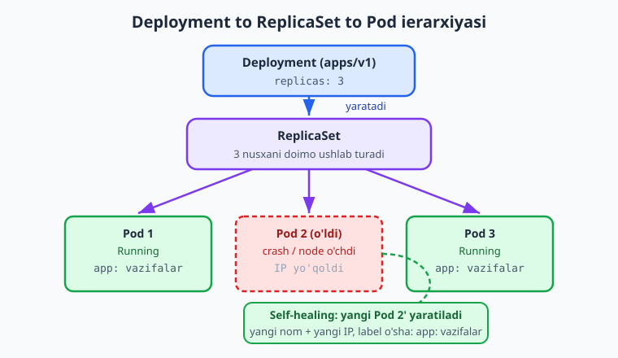
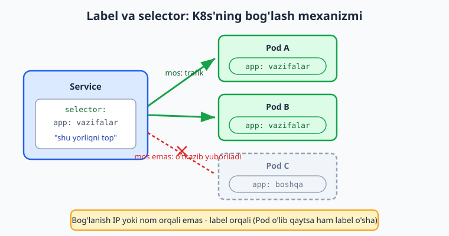
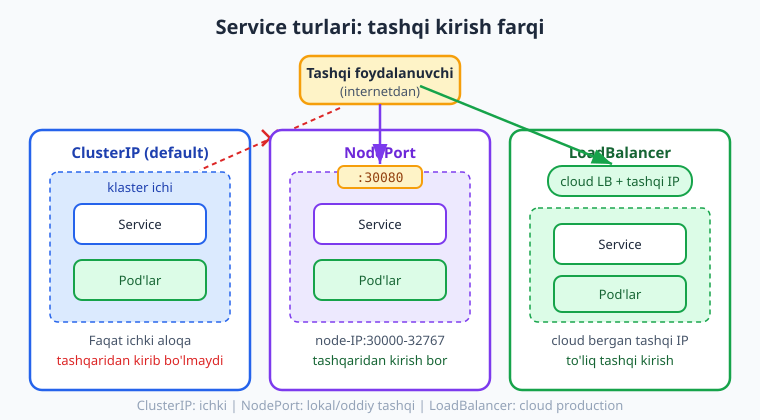

# 22 — Pod, Deployment, Service

[⬅️ Oldingi: 21 — Nega Kubernetes: arxitektura va lokal klaster](./21-kubernetes-nima.md) · [🏠 README](./README.md) · [Keyingi: 23 — Production Kubernetes ➡️](./23-production-k8s.md)

> **Bu bobda:** 21-bobda nega Kubernetes kerakligini va lokal klaster (`minikube`/`kind`) ko'targan edik — endi unda ishlaydigan asosiy obyektlarni o'rganamiz. Kubernetes'ning eng kichik birligi **Pod** (bir yoki bir necha konteyner, umumiy tarmoq va storage) ekanini, Pod **ephemeral** (o'tkinchi) ekanini ko'ramiz; **ReplicaSet** bir xil Pod nusxalarini ushlab turishini; **Deployment** (`apps/v1`) esa ReplicaSet'ni deklarativ boshqarib `replicas`, `selector`, `template` orqali **self-healing** va **masshtablash** berishini o'rganamiz. K8s'ning bog'lash mexanizmi — **label va selector** — ni alohida puxta ko'ramiz: Deployment va Service Pod'larni IP orqali emas, **label** orqali topadi. So'ng **Service** (`v1`) — ephemeral Pod'lar ustidan barqaror tarmoq nuqtasi va load balancing — va uning uch turi (**ClusterIP**, **NodePort**, **LoadBalancer**) farqini ko'ramiz. Oxirida konfiguratsiyani koddan ajratuvchi **ConfigMap** va **Secret** (`v1`) ni, va namuna "vazifalar" ilovasi uchun to'liq Deployment + Service + ConfigMap manifestini `kubectl apply -f` bilan deploy qilishni o'rganamiz.

---

## Muammo: "konteynerni qo'lda ishlatish" yetarli emas

21-bobda lokal klaster ko'tardik. Endi unga namuna **vazifalar API** ilovamizni (kitob bo'ylab ishlatib kelayotgan kichik Node.js ilova) joylashtirmoqchimiz. Birinchi xayolga keladigan narsa — Docker'dagidek bitta konteyner ishga tushirish:

```bash
# Bitta Pod'ni qo'lda ishga tushirish (illustrativ - keyin nega yomonligini ko'ramiz)
kubectl run vazifalar --image=ghcr.io/foydalanuvchi/vazifalar-api:latest
```

Ishladi — bitta Pod ko'tarildi. Lekin shu zahoti uchta jiddiy savol tug'iladi:

- **Pod qulasa-chi?** Ilova kodida xato bo'lib konteyner yiqilsa, uni kim qayta ko'taradi? `kubectl run` bilan ko'tarilgan yakka Pod o'lsa — o'lik qoladi.
- **Yukni qanday ko'taramiz?** Bitta Pod yetmasa, 3 ta bir xil nusxa kerak. Ularni qo'lda 3 marta `kubectl run` qilamizmi va birini boshqaramizmi?
- **Pod'ga qanday murojaat qilamiz?** Pod'ning IP manzili bor, lekin Pod o'lib qayta yaratilsa **IP o'zgaradi**. Brauzer yoki boshqa servis qaysi manzilga ulanadi?

Bu uchta savolning javobi — bu bobning uchta asosiy obyekti: **Deployment** (qulasa tikla, masshtabla), **label/selector** (bog'lash) va **Service** (barqaror manzil). Ularni quyidan yuqoriga, Pod'dan boshlab quramiz.

> 📌 Kubernetes'da deyarli hech qachon Pod'ni yoki konteynerni **to'g'ridan qo'lda** ishlatmaysiz. Buning o'rniga **deklarativ** ravishda "men 3 ta shunday Pod xohlayman" deb YAML'da yozasiz, klaster esa shu holatga o'zini keltiradi va ushlab turadi. Bu — 21-bobdagi "kerakli holatni e'lon qilasan, K8s amalga oshiradi" tamoyilining amaliyoti.

---

## Pod: K8s'ning eng kichik birligi

Docker'da eng kichik ish birligi — **konteyner**. Kubernetes'da esa **Pod**. Pod — bir yoki bir necha konteynerni o'rab turuvchi qobiq. Bir Pod ichidagi konteynerlar:

- **bitta tarmoq** (network namespace) ni baham ko'radi — ya'ni `localhost` orqali bir-biriga ulanadi, bitta IP manzilga ega;
- **storage (volume)** ni baham ko'rishi mumkin;
- har doim **birga** rejalashtiriladi (bir node'da turadi), birga ko'tariladi va birga o'ladi.

Oddiy o'xshatish: Pod — bitta **kvartira**, konteynerlar — undagi xonadoshlar. Xonadoshlar bitta manzilni (IP) baham ko'radi, bitta eshikdan kiradi va birga ko'chib chiqadi. Aksar hollarda kvartirada **bitta** xonadosh bo'ladi (1 Pod = 1 konteyner = sizning ilovangiz); ikkinchi konteyner faqat asosiy ilovaga **yordamchi** ("sidecar") bo'lganda qo'shiladi (masalan log yig'uvchi).

> 💡 Amalda **eng keng tarqalgan holat: 1 Pod = 1 konteyner**. "Bir necha konteyner" — bu istisno, oddiy qoida emas. Boshlovchi sifatida har doim "1 Pod = mening ilovam" deb tasavvur qiling, sidecar'ni keyinroq kerak bo'lganda qo'shasiz.

### Pod ephemeral — bu eng muhim xususiyat

**Pod o'tkinchi (ephemeral).** U o'ladi va o'rniga **yangi** Pod yaratiladi — eski Pod tiklanmaydi, balki butunlay yangisi tug'iladi, **yangi nom va yangi IP** bilan. Pod o'lishi mumkin: konteyner qulasa, node yangilansa, klaster Pod'ni boshqa node'ga ko'chirsa. Shuning uchun:

- Pod'ning IP'siga **tayanmang** — u istalgan vaqtda o'zgaradi (Service shuning uchun kerak).
- Pod ichidagi diskka muhim ma'lumot **yozmang** — Pod o'lsa yo'qoladi (doimiy ma'lumot uchun PersistentVolume kerak, 24-bobda).

Pod'ni quyidagicha tasvirlash mumkin — bu eng oddiy K8s manifesti:

```yaml
# pod.yaml - eng oddiy Pod (odatda buni TO'G'RIDAN ishlatmaymiz)
apiVersion: v1
kind: Pod
metadata:
  name: vazifalar
  labels:
    app: vazifalar
spec:
  containers:
    - name: api
      image: ghcr.io/foydalanuvchi/vazifalar-api:latest
      ports:
        - containerPort: 3000
```

Har K8s manifestida to'rt asosiy maydon bor (buni har obyektda ko'rasiz):

- **`apiVersion`** — obyekt qaysi API guruh/versiyaga tegishli (Pod uchun `v1`).
- **`kind`** — obyekt turi (`Pod`, `Deployment`, `Service`...).
- **`metadata`** — nom (`name`) va **label**lar (pastda muhim rol o'ynaydi).
- **`spec`** — kerakli holat: qaysi image, qaysi port, nechta nusxa va h.k.

Pod bilan ishlash buyruqlari (Docker'dagi `docker ps`/`logs`/`exec` ning K8s ekvivalenti):

```bash
kubectl apply -f pod.yaml        # manifestdan Pod yaratish
kubectl get pods                 # Pod'lar ro'yxati va holati
kubectl describe pod vazifalar   # batafsil: hodisalar, xatolar, IP
kubectl logs vazifalar           # konteyner loglari (docker logs kabi)
kubectl exec -it vazifalar -- sh # Pod ichiga kirish (docker exec kabi)
kubectl delete pod vazifalar     # Pod'ni o'chirish
```

`kubectl get pods` chiqishi taxminan shunday:

```text
NAME        READY   STATUS    RESTARTS   AGE
vazifalar   1/1     Running   0          18s
```

`READY 1/1` — Pod'dagi 1 konteynerdan 1 tasi tayyor; `STATUS Running` — ishlayapti.

> ⚠️ `kubectl run`/`pod.yaml` bilan yakka Pod yaratsangiz va u o'lsa, **hech kim** uni qayta yaratmaydi — o'lik qoladi. Yakka Pod'da self-healing YO'Q. Shuning uchun production'da Pod'ni hech qachon to'g'ridan ishlatmaymiz; uni **Deployment** orqali boshqaramiz. Yuqoridagi `pod.yaml` faqat "Pod nima" ni ko'rsatish uchun.

---

## ReplicaSet va Deployment: self-healing va masshtablash

Yakka Pod'ning kamchiligini (o'lsa tiklanmaydi, ko'paytirib bo'lmaydi) ikki qatlam hal qiladi.

**ReplicaSet** — vazifasi bitta: belgilangan sondagi (`replicas`) bir xil Pod'ni **doimo** ushlab turish. Agar 3 ta so'ralgan bo'lsa-yu, bittasi o'lsa — ReplicaSet darhol yangisini yaratadi (3 ta bo'lib qoladi). Bu — **self-healing**.

Lekin ReplicaSet'ni **to'g'ridan ishlatmaymiz**. Uning ustida yana bir qatlam — **Deployment** — turadi, chunki ReplicaSet yangilanish (yangi image'ga o'tish) ni boshqara olmaydi. Deployment esa: yangi versiyaga **rolling update** (bosqichma-bosqich), **rollback** (orqaga qaytish) va masshtablashni boshqaradi.

Ierarxiya quyidagicha: siz **Deployment** yozasiz, u **ReplicaSet** yaratadi, u esa **Pod**larni yaratadi.



Namuna vazifalar ilovamiz uchun Deployment manifesti:

```yaml
# deployment.yaml
apiVersion: apps/v1          # DIQQAT: Deployment apps/v1 (Pod v1 emas)
kind: Deployment
metadata:
  name: vazifalar
  labels:
    app: vazifalar
spec:
  replicas: 3                # 3 ta bir xil Pod nusxasi xohlaymiz
  selector:
    matchLabels:
      app: vazifalar         # qaysi Pod'larni "meniki" deb hisoblaydi
  template:                  # yaratiladigan Pod'ning shabloni (qolipi)
    metadata:
      labels:
        app: vazifalar       # selector.matchLabels bilan AYNAN bir xil
    spec:
      containers:
        - name: api
          image: ghcr.io/foydalanuvchi/vazifalar-api:latest
          ports:
            - containerPort: 3000
          env:
            - name: NODE_ENV
              value: production
```

Asosiy maydonlar:

- **`replicas: 3`** — kerakli nusxa soni. Klaster doimo aynan shuncha Running Pod ushlab turadi.
- **`selector.matchLabels`** — Deployment qaysi Pod'larni boshqarishini label bo'yicha aniqlaydi. Bu Pod IP'siga emas, **label**ga tayanadi.
- **`template`** — yaratiladigan har bir Pod'ning **qolipi**: aslida `template.metadata` + `template.spec` — bu yuqoridagi `pod.yaml` ning ichki qismi.

> 📌 **Eng muhim qoida (xatolarning 90 foizi shu yerda):** Deployment'da `spec.selector.matchLabels` va `spec.template.metadata.labels` **aynan bir xil** bo'lishi SHART. Selector "men shu label'li Pod'larni boshqaraman" deydi, template esa "men shu label'li Pod'lar yarataman" deydi — ular mos kelmasa, Deployment o'zi yaratgan Pod'ni "meniki" deb tanimaydi va xato beradi. Yuqorida ikkalasi ham `app: vazifalar`.

Deployment bilan ishlash:

```bash
kubectl apply -f deployment.yaml      # deploy qilish (yoki yangilash)
kubectl get deploy                    # Deployment'lar holati
kubectl get pods                      # 3 ta Pod ko'rinadi
kubectl scale deploy/vazifalar --replicas=5   # 3 -> 5 ga masshtablash
kubectl rollout status deploy/vazifalar       # yangilanish holati
kubectl delete -f deployment.yaml     # o'chirish
```

`kubectl get deploy` va `kubectl get pods` chiqishi:

```text
NAME        READY   UP-TO-DATE   AVAILABLE   AGE
vazifalar   3/3     3            3           40s

NAME                         READY   STATUS    RESTARTS   AGE
vazifalar-7c9f8d6b5-2xklm    1/1     Running   0          40s
vazifalar-7c9f8d6b5-9wq4t    1/1     Running   0          40s
vazifalar-7c9f8d6b5-mn7pz    1/1     Running   0          40s
```

E'tibor bering: Pod nomlari **avtomatik** generatsiya qilingan (Deployment nomi + ReplicaSet hash + tasodifiy qism). Pod nomini siz tanlamaysiz — chunki ular o'tkinchi.

> 💡 **Self-healing'ni sinab ko'ring:** Pod'lardan birini ataylab o'chiring — `kubectl delete pod vazifalar-7c9f8d6b5-2xklm`. Bir necha soniyada `kubectl get pods` ga qarang: ReplicaSet o'rniga **yangi** Pod (yangi nom) yaratgan bo'ladi, jami yana 3 ta. Hech qanday qo'lda aralashuvsiz — bu 19-bobdagi systemd `Restart=` ga o'xshash, lekin butun klaster miqyosida. (Bu jonli klasterda bajariladi.)

---

## Label va selector: K8s'ning bog'lash mexanizmi

Bu — Kubernetes'ni tushunishdagi **eng muhim** tushuncha. Agar shuni o'zlashtirsangiz, qolgan hamma narsa joyiga tushadi.

Kubernetes obyektlari bir-birini **IP yoki nom orqali emas, label orqali** topadi. **Label** — bu obyektga (asosan Pod'ga) yopishtirilgan oddiy `kalit: qiymat` yorlig'i, masalan `app: vazifalar` yoki `tier: backend`. **Selector** — "menga shu label'lari mos keladigan obyektlarni top" degan so'rov.

Oddiy o'xshatish: label — kiyimdagi **bayroqcha/yorliq**, selector — "qizil yorliqli hamma narsani ber" degan **filtr**. Pod'lar to'plamida turli yorliqlar bor; selector kerakligini yorliq bo'yicha ajratib oladi.

Nega bu shunchalik muhim? Chunki Pod'lar **o'tkinchi** — IP va nomlari doim o'zgaradi. Agar Deployment yoki Service Pod'ni IP bo'yicha qidirsa, Pod qayta yaratilishi bilan bog'lanish uziladi. Label esa **barqaror**: yangi Pod ham xuddi shu `app: vazifalar` label bilan yaratiladi, demak selector uni baribir topadi.



Yuqoridagi Deployment misolida shu mexanizm ikki marta ishladi:

1. **Deployment → Pod:** `selector.matchLabels: {app: vazifalar}` Deployment'ga qaysi Pod'lar "meniki" ekanini aytdi.
2. **Service → Pod** (keyingi bo'limda): Service ham xuddi shu `app: vazifalar` selector bilan o'sha Pod'larni topadi va ularga trafik yuboradi.

Label'larni buyruqdan ham ko'rish/filtrlash mumkin:

```bash
kubectl get pods --show-labels              # har Pod'ning label'larini ko'rsatadi
kubectl get pods -l app=vazifalar           # faqat shu label'li Pod'lar (-l = selector)
kubectl get pods -l 'app in (vazifalar,web)'  # bir nechta qiymat bo'yicha
kubectl label pod <nom> tier=backend        # mavjud Pod'ga label qo'shish
```

> 📌 Label/selector — K8s'da **hamma bog'lanish** shu orqali bo'ladi: Service → Pod, Deployment → Pod, NetworkPolicy → Pod, hatto Pod → Node (`nodeSelector`). "X obyekti Y obyektni qanday topadi?" degan savolga K8s'da javob deyarli har doim **"label/selector orqali"** bo'ladi. IP yoki nom emas.

---

## Service: o'tkinchi Pod'lar ustidan barqaror manzil

Endi muammoning oxirgi qismi: 3 ta Pod ishlayapti, har birining IP'si bor, lekin:

- Pod o'lib qayta yaratilsa, IP **o'zgaradi** — brauzer qaysi IP'ga ulanadi?
- 3 ta Pod bor — yukni ular orasida kim **taqsimlaydi** (load balancing)?

Yechim — **Service**. Service Pod'lar guruhi ustida **bitta barqaror tarmoq nuqtasi** (o'zgarmas IP va DNS nom) yaratadi va kirgan trafikni mos Pod'lar orasida **avtomatik taqsimlaydi**. Service Pod'larni — albatta — **label selector** orqali topadi.

```yaml
# service.yaml
apiVersion: v1               # DIQQAT: Service v1 (Deployment'dan farqli)
kind: Service
metadata:
  name: vazifalar
spec:
  type: ClusterIP            # default - klaster ichida ko'rinadigan
  selector:
    app: vazifalar           # SHU label'li Pod'larga trafik yuboradi
  ports:
    - port: 80               # Service tinglaydigan port
      targetPort: 3000       # Pod ichidagi konteyner porti
```

E'tibor bering: Service `selector` **to'g'ridan `app: vazifalar`** (oddiy `kalit: qiymat`), Deployment'dagi kabi `matchLabels` ostida EMAS — bu ikki obyektning kichik, lekin tez-tez xato qilinadigan farqi. `port` — Service'ga kelinadigan port, `targetPort` — u Pod ichida qaysi portga uzatishi (bizning ilova 3000-portni tinglaydi).

> 💡 Service yaratilgach, klaster ichida unga **DNS nom** beriladi: oddiygina `vazifalar` (yoki to'liq `vazifalar.default.svc.cluster.local`). Boshqa Pod'lar IP o'rniga shu **nom** bilan ulanadi — `http://vazifalar:80`. Pod'lar qancha o'lib-yaralsa ham, bu nom va Service IP **o'zgarmaydi**. Aynan shu — "barqaror nuqta" ning ma'nosi.

### Service uch turi: ClusterIP, NodePort, LoadBalancer

`type` maydoni Service'ga **kim** murojaat qila olishini belgilaydi — faqat klaster ichidagilarmi yoki tashqaridagilar ham.



- **ClusterIP** (default) — Service faqat **klaster ichida** ko'rinadi. Tashqaridan kirib bo'lmaydi. Ichki servislararo aloqa uchun (masalan frontend → backend, ilova → ma'lumotlar bazasi). Eng ko'p ishlatiladigan tur.
- **NodePort** — Service har bir node'ning **yuqori portida** (30000–32767 oralig'ida) ochiladi, shunda `http://<node-IP>:<NodePort>` orqali **tashqaridan** kirish mumkin. Lokal sinov (`minikube`) yoki oddiy holatlar uchun qulay, lekin port chiroyli emas (30080 kabi) va to'g'ridan production uchun kam ishlatiladi.
- **LoadBalancer** — **cloud provayderdan** (AWS, GCP, Azure...) tashqi yuk balanslagich va tashqi IP so'raydi. Eng "production" tur, lekin haqiqiy cloud klaster kerak — lokal `minikube`/`kind` da to'liq ishlamaydi (illustrativ qoladi).

ClusterIP'ni vaqtinchalik tashqaridan sinash uchun **port-forward** ishlatiladi (tur o'zgartirmasdan):

```bash
kubectl apply -f service.yaml
kubectl get svc                       # Service'lar ro'yxati, CLUSTER-IP va PORT
# Lokalda sinash: 8080-portni Service'ning 80-portiga ulash
kubectl port-forward svc/vazifalar 8080:80
# Endi brauzerda http://localhost:8080 ishlaydi (terminal ochiq turishi kerak)
```

`kubectl get svc` chiqishi:

```text
NAME         TYPE        CLUSTER-IP      EXTERNAL-IP   PORT(S)   AGE
vazifalar    ClusterIP   10.96.142.51    <none>        80/TCP    12s
kubernetes   ClusterIP   10.96.0.1       <none>        443/TCP   2d
```

`EXTERNAL-IP <none>` — ClusterIP tashqi IP olmaydi (bu normal). LoadBalancer turida bu ustun cloud bergan IP'ni ko'rsatardi.

> 📌 **Real production'da tashqi kirish odatda Service emas, Ingress orqali bo'ladi.** Har domen/yo'l uchun alohida LoadBalancer ochish qimmat — buning o'rniga bitta Ingress (16–17-bobdagi Nginx reverse proxy'ning K8s ekvivalenti) ko'plab Service'larni domen/yo'l bo'yicha boshqaradi. Ingress'ni **24-bobda** ko'ramiz. Hozircha: ichki aloqa = ClusterIP, lokal sinov = NodePort yoki `port-forward`.

> ⚠️ `kubectl expose` bilan Service'ni buyruqdan ham yaratish mumkin (`kubectl expose deploy/vazifalar --port=80 --target-port=3000`), lekin manifestni YAML faylda saqlash afzal — chunki u **deklarativ**, git'ga tushadi va takrorlanadi. Buyruqli usul tezkor sinov uchun yaxshi, production uchun emas.

---

## ConfigMap va Secret: konfiguratsiyani koddan ajratish

Ilovaga konfiguratsiya (port, ma'lumotlar bazasi manzili, xususiyat bayroqlari) va sirlar (parol, API kalit) kerak. Ularni image ichiga "qotirib qo'yish" — yomon amaliyot: har o'zgarganda yangi image qurish kerak, sirlar image'da ochiq qoladi. K8s'da buni ajratish uchun ikki obyekt bor:

- **ConfigMap** — **maxfiy bo'lmagan** konfiguratsiya (`kalit: qiymat`). Ochiq matn.
- **Secret** — **maxfiy** ma'lumot (parol, token). Qiymat base64 bilan kodlanadi (bu shifrlash EMAS — quyida ogohlantirish bor).

```yaml
# configmap.yaml
apiVersion: v1
kind: ConfigMap
metadata:
  name: vazifalar-config
data:
  NODE_ENV: production
  APP_TITLE: Vazifalar API
```

```yaml
# secret.yaml
apiVersion: v1
kind: Secret
metadata:
  name: vazifalar-secret
type: Opaque
stringData:                  # stringData - oddiy matn yozasiz, K8s o'zi base64 qiladi
  DATABASE_PASSWORD: parol123
```

> 💡 Secret'da **`stringData`** ishlating (oddiy matn yozasiz) — K8s o'zi base64 ga o'giradi. `data` maydoni esa **allaqachon base64 qilingan** qiymat kutadi (`echo -n parol123 | base64` -> `cGFyb2wxMjM=`). `stringData` qulayroq va xatosizroq.

ConfigMap/Secret'dagi qiymatlarni Pod'ga **muhit o'zgaruvchisi** (env) sifatida ulash — eng keng tarqalgan usul:

```yaml
# deployment.yaml ichida, containers: > env: o'rniga to'liqroq variant
      containers:
        - name: api
          image: ghcr.io/foydalanuvchi/vazifalar-api:latest
          ports:
            - containerPort: 3000
          env:
            - name: NODE_ENV
              valueFrom:
                configMapKeyRef:        # ConfigMap'dan bitta kalit
                  name: vazifalar-config
                  key: NODE_ENV
            - name: DATABASE_PASSWORD
              valueFrom:
                secretKeyRef:           # Secret'dan bitta kalit
                  name: vazifalar-secret
                  key: DATABASE_PASSWORD
```

Yoki butun ConfigMap'ni bir yo'la `envFrom` bilan ulash mumkin (har kalit alohida env bo'ladi):

```yaml
          envFrom:
            - configMapRef:
                name: vazifalar-config
            - secretRef:
                name: vazifalar-secret
```

> ⚠️ **Secret base64 — bu shifrlash EMAS, faqat kodlash.** `echo cGFyb2wxMjM= | base64 -d` istalgan kishiga parolni qaytarib beradi. Secret'ning haqiqiy maqsadi — sirlarni ConfigMap'dan/manifestdan **ajratish** va ularga kirishni RBAC bilan cheklash. Haqiqiy himoya uchun: Secret manifestini git'ga **ochiq qo'ymang** (Sealed Secrets / External Secrets / SOPS ishlating), klasterda **encryption-at-rest** yoqing. Bu mavzuni 24/26-boblarda ko'ramiz.

---

## Hammasini birlashtirish: to'liq manifest

Endi namuna vazifalar ilovasini to'liq deploy qilamiz: ConfigMap + Secret + Deployment + Service bitta faylda (`---` bilan ajratilgan). K8s'da bir nechta obyektni bitta faylga yozish odatiy:

```yaml
# vazifalar.yaml - to'liq stack
apiVersion: v1
kind: ConfigMap
metadata:
  name: vazifalar-config
data:
  NODE_ENV: production
  APP_TITLE: Vazifalar API
---
apiVersion: v1
kind: Secret
metadata:
  name: vazifalar-secret
type: Opaque
stringData:
  DATABASE_PASSWORD: parol123
---
apiVersion: apps/v1
kind: Deployment
metadata:
  name: vazifalar
  labels:
    app: vazifalar
spec:
  replicas: 3
  selector:
    matchLabels:
      app: vazifalar
  template:
    metadata:
      labels:
        app: vazifalar
    spec:
      containers:
        - name: api
          image: ghcr.io/foydalanuvchi/vazifalar-api:latest
          ports:
            - containerPort: 3000
          envFrom:
            - configMapRef:
                name: vazifalar-config
            - secretRef:
                name: vazifalar-secret
---
apiVersion: v1
kind: Service
metadata:
  name: vazifalar
spec:
  type: ClusterIP
  selector:
    app: vazifalar
  ports:
    - port: 80
      targetPort: 3000
```

Bitta buyruq bilan hammasini qo'llaymiz:

```bash
kubectl apply -f vazifalar.yaml
# configmap/vazifalar-config created
# secret/vazifalar-secret created
# deployment.apps/vazifalar created
# service/vazifalar created

kubectl get all                       # Pod, Deployment, ReplicaSet, Service - hammasi
kubectl port-forward svc/vazifalar 8080:80   # lokalda http://localhost:8080
```

Mana bog'lanish zanjiri qanday yopildi: **Service** (`selector: app: vazifalar`) → label'i mos **Pod**lar (3 ta, Deployment yaratgan) → har Pod ichidagi **konteyner** (port 3000) → konfiguratsiya **ConfigMap/Secret** dan env orqali. Pod'lardan biri o'lsa, ReplicaSet yangisini ko'taradi (label o'sha), Service esa yangi Pod'ni avtomatik topib trafikni unga ham yuboradi. Hech narsani qo'lda yangilash kerak emas.

> 📌 `kubectl apply -f` — **deklarativ**: faylda "kerakli holat"ni e'lon qilasiz, K8s mavjud holat bilan solishtirib farqni amalga oshiradi. Faylni o'zgartirib qayta `apply` qilsangiz — K8s faqat **o'zgargan** qismni yangilaydi (masalan `replicas: 3` ni `5` qilsangiz — 2 ta yangi Pod qo'shiladi). Bu — 21-bobdagi deklarativ tamoyilning amaliy ko'rinishi.

---

## Yakun

Kubernetes'ning to'rt asosiy obyektini qurdik. **Pod** — eng kichik birlik, o'tkinchi (ephemeral), shuning uchun IP va nomiga tayanmaymiz. **Deployment** (`apps/v1`) ReplicaSet orqali belgilangan sondagi Pod'ni ushlab turadi — self-healing va `replicas` bilan masshtablash beradi. K8s'ning bog'lash mexanizmi — **label va selector**: obyektlar bir-birini IP emas, label orqali topadi (`selector.matchLabels` == `template.metadata.labels` qoidasi shu yerdan). **Service** (`v1`) o'tkinchi Pod'lar ustida barqaror tarmoq nuqtasi va load balancing yaratadi; uch turi — ClusterIP (ichki, default), NodePort (tashqi port), LoadBalancer (cloud) — tashqi kirish darajasi bilan farq qiladi. **ConfigMap/Secret** (`v1`) konfiguratsiya va sirlarni koddan ajratadi. Oxirida hammasini bitta manifestda birlashtirib `kubectl apply -f` bilan deploy qildik.

Endi ilovamiz klasterda ishlaydi — lekin "production-tayyor" emas: tashqi kirish (Ingress), resurs limitlari, sog'liq tekshiruvlari (probe), avtomatik masshtablash (HPA) hali yo'q. Aynan shularni **23-bobda** — Production Kubernetes — qo'shamiz.

---

## 22-bob mashqlari

### Oson

1. Pod nima va u Docker konteyneridan nimasi bilan farq qiladi? "Bir Pod ichida bir necha konteyner" deganda ular nimani baham ko'radi?
2. "Pod ephemeral" degani nima? Bundan kelib chiqadigan ikki amaliy xulosani ayting (IP va disk haqida).
3. Har K8s manifestidagi to'rt asosiy maydonni (`apiVersion`, `kind`, `metadata`, `spec`) sanang va har biri nimani bildirishini ayting.
4. Deployment, ReplicaSet va Pod orasidagi ierarxiyani ayting: kim kimni yaratadi?
5. ClusterIP, NodePort va LoadBalancer turlarining qaysi biri tashqaridan kirishga ruxsat bermaydi, qaysi biri cloud tashqi IP oladi?

### O'rta

6. Deployment manifestidagi `spec.selector.matchLabels` va `spec.template.metadata.labels` o'rtasida qanday qoida bor? Buzilsa nima bo'ladi?
7. Nega Pod'ga IP orqali emas, Service orqali murojaat qilamiz? Service Pod'larni qanday topadi?
8. Service manifestidagi `port` va `targetPort` farqini namuna ilova (Service 80, ilova 3000) misolida tushuntiring.
9. ConfigMap va Secret o'rtasidagi farq nima? Secret'ning base64 kodlashi sirni "himoyalaydi"mi — nega ha yoki yo'q?
10. `kubectl run` bilan yakka Pod yaratish nega production uchun yomon? Buning o'rniga nima ishlatiladi va u qanday afzallik beradi?

### Qiyin

11. `web` nomli, `nginx:1.27-alpine` image bilan, 2 nusxali (`replicas: 2`) Deployment manifestini yozing. Label `app: web` bo'lsin, konteyner 80-portni ochsin. `selector` va `template.labels` to'g'ri mosligiga ishonch hosil qiling. So'ng uni qo'llash va 4 nusxaga masshtablash buyruqlarini yozing.
12. 11-mashqdagi `web` Deployment uchun **ClusterIP** Service yozing: Service 8080-portda tinglasin, trafikni Pod'ning 80-portiga yuborsin, faqat `app: web` label'li Pod'larga. So'ng lokalda brauzerdan sinash uchun `port-forward` buyrug'ini yozing.
13. Namuna vazifalar ilovasi uchun bitta faylga (`---` bilan) **ConfigMap + Deployment + Service** yozing: ConfigMap'da `NODE_ENV=production` va `APP_PORT=3000` bo'lsin; Deployment 3 nusxali bo'lib ConfigMap'ni `envFrom` bilan butunlay ulasin; Service ClusterIP bo'lib 80→3000 uzatsin. Barcha label/selector mosligini saqlang.

<details markdown="1"><summary>Yechim — 11</summary>

```yaml
# web-deployment.yaml
apiVersion: apps/v1
kind: Deployment
metadata:
  name: web
  labels:
    app: web
spec:
  replicas: 2
  selector:
    matchLabels:
      app: web
  template:
    metadata:
      labels:
        app: web        # selector.matchLabels bilan AYNAN bir xil
    spec:
      containers:
        - name: nginx
          image: nginx:1.27-alpine
          ports:
            - containerPort: 80
```

```bash
kubectl apply -f web-deployment.yaml     # qo'llash
kubectl get pods -l app=web              # 2 ta Pod ko'rinishi kerak
kubectl scale deploy/web --replicas=4    # 2 -> 4 ga masshtablash
```

`selector.matchLabels: {app: web}` va `template.metadata.labels: {app: web}` aynan bir xil — Deployment o'zi yaratgan Pod'larni shu orqali tanidi. `kubectl scale` `replicas` ni 4 ga oshiradi va ReplicaSet darhol 2 ta yangi Pod qo'shadi.
</details>

<details markdown="1"><summary>Yechim — 12</summary>

```yaml
# web-service.yaml
apiVersion: v1
kind: Service
metadata:
  name: web
spec:
  type: ClusterIP
  selector:
    app: web          # Deployment Pod'lari label'iga mos (matchLabels EMAS, oddiy map)
  ports:
    - port: 8080      # Service tinglaydigan port
      targetPort: 80  # Pod (nginx) konteyner porti
```

```bash
kubectl apply -f web-service.yaml
kubectl get svc web                       # ClusterIP va PORT(S) 8080/TCP
kubectl port-forward svc/web 8888:8080    # localhost:8888 -> Service:8080 -> Pod:80
# Endi brauzerda http://localhost:8888 nginx sahifasini ko'rsatadi
```

Service `selector: app: web` orqali 11-mashqdagi Pod'larni topadi. `port: 8080` Service'ga kelinadigan, `targetPort: 80` Pod ichidagi nginx porti. `port-forward` ClusterIP turini o'zgartirmasdan vaqtincha lokaldan kirish beradi.
</details>

<details markdown="1"><summary>Yechim — 13</summary>

```yaml
# vazifalar-stack.yaml
apiVersion: v1
kind: ConfigMap
metadata:
  name: vazifalar-config
data:
  NODE_ENV: production
  APP_PORT: "3000"          # raqamni ham tirnoq ichida (string) yozing
---
apiVersion: apps/v1
kind: Deployment
metadata:
  name: vazifalar
  labels:
    app: vazifalar
spec:
  replicas: 3
  selector:
    matchLabels:
      app: vazifalar
  template:
    metadata:
      labels:
        app: vazifalar
    spec:
      containers:
        - name: api
          image: ghcr.io/foydalanuvchi/vazifalar-api:latest
          ports:
            - containerPort: 3000
          envFrom:
            - configMapRef:
                name: vazifalar-config
---
apiVersion: v1
kind: Service
metadata:
  name: vazifalar
spec:
  type: ClusterIP
  selector:
    app: vazifalar
  ports:
    - port: 80
      targetPort: 3000
```

```bash
kubectl apply -f vazifalar-stack.yaml
kubectl get all                              # ConfigMap'dan tashqari hammasi ko'rinadi
kubectl get configmap vazifalar-config       # ConfigMap'ni alohida tekshirish
```

Uchala obyektda ham bog'lanish `app: vazifalar` label/selector orqali: Deployment `selector.matchLabels` == `template.labels` (Pod yaratish uchun), Service `selector` (trafik yuborish uchun). `envFrom` + `configMapRef` ConfigMap'dagi `NODE_ENV` va `APP_PORT` ni har Pod'ga muhit o'zgaruvchisi qilib ulaydi. `APP_PORT` raqamini tirnoq ichida yozdik, chunki ConfigMap `data` qiymatlari string bo'lishi shart.
</details>

---

[⬅️ Oldingi: 21 — Nega Kubernetes: arxitektura va lokal klaster](./21-kubernetes-nima.md) · [🏠 README](./README.md) · [Keyingi: 23 — Production Kubernetes ➡️](./23-production-k8s.md)
