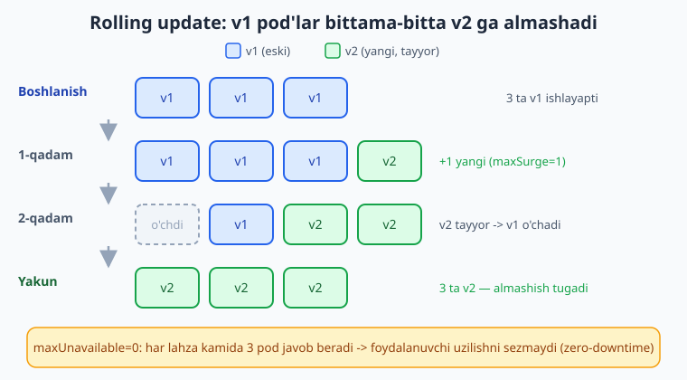
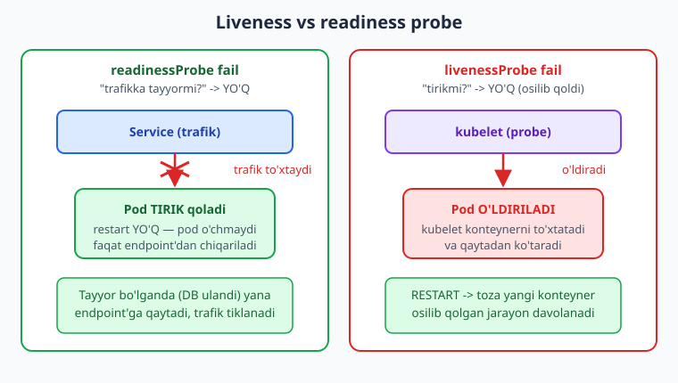
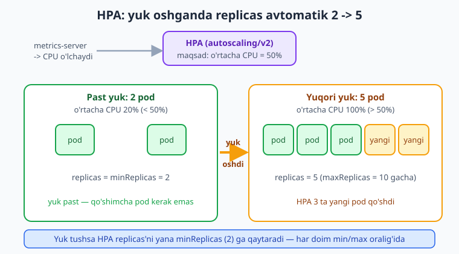

# 23 — Production Kubernetes

[⬅️ Oldingi: 22 — Pod, Deployment, Service](./22-pod-deployment-service.md) · [🏠 README](./README.md) · [Keyingi: 24 — Ingress, storage, Helm va GitOps ➡️](./24-ingress-helm-gitops.md)

> **Bu bobda:** 22-bobdagi oddiy Deployment'ni *production*'ga tayyorlaymiz. Yangi versiyani uzilishsiz (zero-downtime) chiqaradigan **rolling update** (`strategy: RollingUpdate`, `maxSurge`/`maxUnavailable`) va xato bo'lsa orqaga qaytaruvchi **rollback** (`kubectl rollout status` / `history` / `undo`); pod sog'lig'ini kuzatuvchi **probe**'lar (`livenessProbe` — o'lgan pod'ni restart, `readinessProbe` — trafikka tayyormi, `startupProbe` — sekin start); CPU/xotira **resurs** so'rovi va chegarasi (`resources.requests`/`limits`, scheduler, OOMKill, QoS); resurslarni ajratuvchi **namespace** va `ResourceQuota`; hamda yuk oshganda `replicas`'ni avtomatik ko'taradigan **Horizontal Pod Autoscaler** (`autoscaling/v2`, `scaleTargetRef`, `minReplicas`/`maxReplicas`, `metrics` + metrics-server) — barchasini bitta to'liq production Deployment va HPA manifestida birlashtiramiz.

---

## Muammo: "ishlaydi" yetarli emas, "ishonchli" kerak

22-bobda namuna **vazifalar API** ilovamizni Deployment qilib, 3 ta pod ko'tardik va Service orqali ochdik. Ishladi — lekin production uchun uchta savol ochiq qoldi:

- **Yangi versiyani qanday chiqaramiz?** `kubectl set image` bilan image'ni almashtirsak — eski pod'lar bir vaqtda o'chib, yangi pod'lar ko'tarilguncha sayt **uziladimi**? Foydalanuvchi 502 ko'radimi?
- **Yangi versiya buzuq bo'lsa-chi?** Deploy qildik, lekin pod'lar qulayapti. Qanday qilib tez orqaga (oldingi ishlaydigan versiyaga) qaytamiz?
- **Pod "ishlayapti" deb ko'rinadi, lekin javob bermayapti.** Jarayon tirik, ammo ichida osilib qolgan. Kubernetes buni qanday biladi va trafikni unga yubormay turadi?
- **Tushlik payti yuk 5 barobar oshsa-chi?** 3 ta pod yetmay qoladi. Kim `replicas`'ni qo'lda 10 ga ko'taradi yarim tunda?

Bu bob — aynan shu to'rt savolning yechimi. Kubernetes bularning hammasini **deklarativ** hal qiladi: siz "qanday bo'lsin"ni YAML'da aytasiz, K8s o'zi amalga oshiradi va kuzatib turadi.

---

## Rolling update: uzilishsiz yangilanish

Deployment'ning eng kuchli tomoni — versiyani **bittama-bitta** (pod-by-pod) almashtirishi. Buni **rolling update** deyiladi. Eski v1 pod'lar bir vaqtda o'chmaydi: K8s avval bitta yangi v2 pod ko'taradi, u tayyor bo'lganini kutadi, keyin bitta eski v1 pod'ni o'chiradi — va shu jarayonni hammasi v2 bo'lguncha takrorlaydi. Natija: jarayon davomida **doimo yetarli pod ishlab turadi**, sayt uzilmaydi.



Yangi versiyani chiqarishning ikki yo'li bor — ikkalasi ham rolling update'ni ishga soladi:

```bash
# Yo'l 1: YAML'da image tag'ini o'zgartirib qayta apply qilish (deklarativ, afzal)
kubectl apply -f deployment.yaml

# Yo'l 2: faqat image'ni tezda almashtirish (imperativ, tezkor)
kubectl set image deployment/vazifalar-api \
  vazifalar-api=ghcr.io/foydalanuvchi/vazifalar-api:v2
```

> 📌 Production'da **deklarativ yo'l** (`apply` + git'dagi YAML) afzal — manifest git'da turadi, har o'zgarish tarixda qoladi, va 24-bobdagi GitOps shu asosga quriladi. `set image` qulay, lekin git'dagi YAML bilan haqiqat orasida farq tug'diradi.

Rolling update'ni boshqarish — `strategy` bo'limida:

```yaml
spec:
  strategy:
    type: RollingUpdate
    rollingUpdate:
      maxSurge: 1          # eski + 1 ta ortiqcha pod ko'tarishga ruxsat
      maxUnavailable: 0    # hech qachon kerakli sondan kam pod bo'lmasin
```

Ikki "tugma" jarayonning tezligi va xavfsizligini belgilaydi:

- **`maxSurge`** — istalgan `replicas`'dan **qancha ortiq** pod bir vaqtda bo'lishi mumkin. `1` — bir vaqtda atigi bitta qo'shimcha yangi pod ko'tariladi. Foiz ham bo'ladi: `25%`.
- **`maxUnavailable`** — yangilanish davomida kerakli sondan **qancha kam** pod bo'lishi mumkin. `0` — har lahza to'liq `replicas` soni ishlab tursin (eng xavfsiz, lekin biroz sekinroq, chunki avval yangi pod ko'tarilib, keyin eski o'chadi).

> 💡 `maxSurge: 1, maxUnavailable: 0` — zero-downtime uchun klassik tanlov: avval yangi pod tayyor bo'ladi (readiness probe!), keyingina eski o'chadi. Ikkalasini ham `0` qilib bo'lmaydi (K8s bunda ilgarilay olmaydi — xato beradi).

### rollout: jarayonni kuzatish, tarix va rollback

Yangilanish boshlangach, uni kuzatib turasiz va kerak bo'lsa orqaga qaytarasiz:

```bash
# Yangilanish jarayonini kuzatish (hamma yangi pod tayyor bo'lguncha kutadi)
kubectl rollout status deployment/vazifalar-api

# Versiyalar tarixi (har apply yangi "revision" yaratadi)
kubectl rollout history deployment/vazifalar-api

# ORQAGA QAYTARISH: oldingi (ishlaydigan) versiyaga
kubectl rollout undo deployment/vazifalar-api

# Aniq bir revision'ga qaytarish
kubectl rollout undo deployment/vazifalar-api --to-revision=2
```

`kubectl rollout status` chiqishi taxminan shunday:

```text
Waiting for deployment "vazifalar-api" rollout to finish: 2 out of 3 new replicas have been updated...
Waiting for deployment "vazifalar-api" rollout to finish: 1 old replicas are pending termination...
deployment "vazifalar-api" successfully rolled out
```

> ⚠️ Rollback faqat sozlama/image darajasida ishlaydi — agar yangi versiya **ma'lumotlar bazasini** (migratsiya) buzgan bo'lsa, `rollout undo` uni qaytarmaydi. DB migratsiyalarini doim *orqaga mos* (backward-compatible) qiling. Bu — 24/26-boblarda batafsil.

---

## Probe'lar: pod haqiqatan sog'mi?

Kubernetes pod ichidagi jarayon **tirik** ekanini ko'radi — lekin "tirik" har doim "sog'lom" degani emas. Jarayon ishlab turibdi, ammo ichida deadlock bo'lib osilib qolgan yoki hali ishga tushib ulgurmagan bo'lishi mumkin. K8s buni bilishi uchun siz unga **probe** (tekshiruv) berasiz — u pod'ni davriy "turtib" sog'ligini so'raydi.

Uch xil probe bor va ular **boshqa-boshqa** savolga javob beradi:



- **`livenessProbe`** — "pod **tirikmi**?" Agar muvaffaqiyatsiz bo'lsa, kubelet konteynerni **o'ldirib qayta ishga tushiradi** (restart). Osilib qolgan jarayonni davolaydi.
- **`readinessProbe`** — "pod **trafikka tayyormi**?" Agar muvaffaqiyatsiz bo'lsa, pod **tirik qoladi**, lekin Service uni o'z endpoint'laridan **olib tashlaydi** — unga trafik bormaydi. Pod tayyor bo'lguncha (masalan DB ulanishini kutyapti) trafikni to'xtatadi. Rolling update'da KALIT rol o'ynaydi: yangi pod readiness bermaguncha eski pod o'chmaydi.
- **`startupProbe`** — sekin ishga tushadigan ilovalar uchun. U muvaffaqiyatli bo'lguncha liveness/readiness **kutib turadi** — shunda sekin start davrida liveness pod'ni adashib o'ldirmaydi.

Probe'lar pod'ni uch usulda tekshiradi:

- **`httpGet`** — berilgan `path`/`port`ga HTTP so'rov; 2xx/3xx javob = sog'lom. Web ilovalar uchun eng keng tarqalgan.
- **`exec`** — konteyner ichida buyruq ishlatadi; chiqish kodi `0` = sog'lom.
- **`tcpSocket`** — port ochiq (TCP ulanish mumkin)mi tekshiradi.

To'liq probe namunasi (ilova `/healthz` va `/ready` endpoint'larini ochib bergan deb hisoblaymiz):

```yaml
livenessProbe:
  httpGet:
    path: /healthz
    port: 3000
  initialDelaySeconds: 10   # birinchi tekshiruvgacha kutish (ilova ko'tarilsin)
  periodSeconds: 10         # har 10 soniyada tekshir
readinessProbe:
  httpGet:
    path: /ready
    port: 3000
  initialDelaySeconds: 5
  periodSeconds: 5
```

- **`initialDelaySeconds`** — birinchi tekshiruvgacha kutiladigan vaqt (ilova ko'tarilishiga fursat beradi).
- **`periodSeconds`** — tekshiruvlar orasidagi oraliq.

> 📌 Liveness va readiness uchun **alohida** endpoint ishlatish maslahat: `/ready` DB/cache ulanishini ham tekshirsin (tashqi bog'liqlik tushsa trafik to'xtasin), `/healthz` esa faqat "jarayon tirikmi"ni qaytarsin — aks holda DB qisqa uzilganda liveness pod'ni keraksiz restart qilib yuboradi.

> 💡 Nega muhim: probe'siz K8s faqat "jarayon o'ldimi"ni biladi. Probe bilan u "javob bermayapti" (liveness restart) va "hali tayyor emas" (readiness — trafikni ushlab tur) holatlarini ham hal qiladi. Bu — production ishonchliligining poydevori.

---

## Resurslar: requests va limits

Klasterda bir nechta node (server) va ularda ko'p pod bor. Kubernetes har pod'ni qaysi node'ga joylashtirishni va resurslarni qanday taqsimlashni bilishi kerak. Buning uchun har konteynerga **resurs so'rovi** va **chegarasi** berasiz:

```yaml
resources:
  requests:          # KAFOLAT: pod kamida shuncha resurs oladi
    cpu: "100m"      # 100 millicore = 0.1 CPU yadrosi
    memory: "128Mi"  # 128 mebibayt
  limits:            # CHEGARA: pod bundan ko'p ishlata olmaydi
    cpu: "500m"
    memory: "256Mi"
```

Ikki tushuncha ikki xil maqsadga xizmat qiladi:

- **`requests`** — pod **kafolatlangan** minimal resurs. **Scheduler** aynan shuni o'qiydi: pod'ni joylashtirganda node'da `requests` qadar bo'sh joy borligini tekshiradi. Ya'ni requests — "joylashtirish byudjeti".
- **`limits`** — pod **maksimal** ishlata oladigan resurs. Bundan oshsa K8s cheklaydi.

CPU va memory chegaradan oshganda xulq **farq qiladi**:

- **CPU** — `limits`'dan oshsa pod **o'ldirilmaydi**, faqat *sekinlashtiriladi* (throttle).
- **Memory** — `limits`'dan oshsa pod **OOMKilled** bo'ladi (Out Of Memory — yadro jarayonni majburan o'ldiradi). `kubectl get pod` da `OOMKilled` ko'rinadi va konteyner restart bo'ladi.

> ⚠️ Memory `limits`'ni juda past qo'ysangiz, ilova og'irroq so'rovda OOMKilled bo'lib doimo restart bo'laveradi. Real yuk ostida xotira sarfini o'lchab (`kubectl top pod`, 25-bob), `limits`'ni shunga mos qo'ying.

### QoS klasslari (qisqa)

`requests`/`limits`'ni qanday qo'yganingizga qarab K8s pod'ga **QoS (Quality of Service) klassi** beradi. Bu — node xotirasi tugaganda qaysi pod'ni birinchi o'chirishni belgilaydi:

- **Guaranteed** — har konteynerda `requests == limits` (CPU va memory). Eng himoyalangan, oxirida o'chiriladi.
- **Burstable** — `requests` bor, lekin `limits`'dan kam (yoki yo'q). O'rtacha.
- **BestEffort** — `requests`/`limits` umuman yo'q. Birinchi o'chiriladigan (eng zaif).

> 💡 Production ilova uchun kamida **Burstable** bo'ling — har konteynerga hech bo'lmaganda `requests` bering. Aks holda (BestEffort) node siqilganda ilovangiz birinchi qurbon bo'ladi.

---

## Namespace: resurslarni ajratish

Bitta klasterda ko'p jamoa, ko'p muhit (`dev`, `staging`, `prod`) yashashi mumkin. **Namespace** — klaster ichidagi mantiqiy bo'lim: resurslar (Deployment, Service, Pod...) namespace ichida nomlanadi va ajraladi.

```bash
# Namespace yaratish
kubectl create namespace prod

# Resursni aniq namespace'da ko'rish / yaratish (-n bayrog'i)
kubectl get pods -n prod
kubectl apply -f deployment.yaml -n prod
```

Namespace'ni manifest ichida ham belgilash mumkin (`metadata.namespace`). Bir namespace resurslari boshqasinikini ko'rmaydi (Service DNS nomi namespace bilan to'liq: `vazifalar-api.prod.svc.cluster.local`).

Namespace'ga resurs cheklovini **`ResourceQuota`** bilan qo'yasiz — bir jamoa butun klasterni "yeb" qo'ymasin:

```yaml
apiVersion: v1
kind: ResourceQuota
metadata:
  name: prod-kvota
  namespace: prod
spec:
  hard:
    requests.cpu: "4"        # bu namespace jami 4 CPU so'ray oladi
    requests.memory: 8Gi
    limits.cpu: "8"
    pods: "20"               # ko'pi bilan 20 pod
```

> ℹ️ `ResourceQuota` ishlasa, namespace'dagi har pod `requests`/`limits` ko'rsatishi **shart** bo'lib qoladi — aks holda kvota hisoblab bo'lmaydi va pod rad etiladi. Bu — jamoani resurs ko'rsatishga "majburlash"ning yaxshi yo'li.

---

## HPA: yukka qarab avtomatik miqyoslash

22-bobda `replicas`'ni qo'lda qo'ydik (`replicas: 3`). Production'da yuk o'zgarib turadi — kunduzi yuqori, kechasi past. Har safar qo'lda o'zgartirish — mumkin emas. **Horizontal Pod Autoscaler (HPA)** buni avtomatlashtiradi: u metrikani (odatda CPU) kuzatib, `replicas`'ni belgilangan oraliqda **avtomatik** ko'taradi va tushiradi.



HPA "joriy o'rtacha foydalanish maqsadli foydalanishga teng bo'lsin" tamoyilida ishlaydi. Masalan, maqsad CPU 50%, hozir o'rtacha 100% bo'lsa — pod sonini taxminan **ikki barobar** oshiradi (`maxReplicas`'gacha).

```yaml
apiVersion: autoscaling/v2
kind: HorizontalPodAutoscaler
metadata:
  name: vazifalar-api-hpa
  namespace: prod
spec:
  scaleTargetRef:               # KIMNI miqyoslaydi
    apiVersion: apps/v1
    kind: Deployment
    name: vazifalar-api
  minReplicas: 2                # hech qachon 2 tadan kam emas
  maxReplicas: 10              # hech qachon 10 tadan ko'p emas
  metrics:
    - type: Resource
      resource:
        name: cpu
        target:
          type: Utilization
          averageUtilization: 50   # o'rtacha CPU ~50% atrofida ushlab tur
```

Asosiy maydonlar:

- **`scaleTargetRef`** — qaysi Deployment'ning `replicas`'ini boshqaradi.
- **`minReplicas` / `maxReplicas`** — miqyoslash oralig'i (chegaralar).
- **`metrics`** — nimaga qarab miqyoslaydi. Yuqorida CPU foydalanishi (`Utilization`, foizda, `requests`ga nisbatan). Memory yoki custom/external metrikalar ham bo'ladi.

> 📌 HPA CPU foizini **`requests.cpu`ga nisbatan** hisoblaydi. Shuning uchun HPA ishlashi uchun pod'da CPU `requests` **bo'lishi shart** — yuqoridagi `resources.requests.cpu` qo'yilmagan bo'lsa, HPA `<unknown>` ko'rsatadi va ishlamaydi.

> ⚠️ HPA metrikani **metrics-server**'dan oladi — bu klasterga alohida o'rnatiladigan komponent (lokal `minikube addons enable metrics-server`). U bo'lmasa HPA metrikani ko'ra olmaydi. `kubectl top pod` ishlasa, metrics-server bor demak.

HPA holatini kuzatish:

```bash
kubectl get hpa -n prod
# NAME                REFERENCE                  TARGETS    MINPODS  MAXPODS  REPLICAS
# vazifalar-api-hpa   Deployment/vazifalar-api   12%/50%    2        10       2
```

`TARGETS` ustuni `joriy/maqsad` ko'rinishida (`12%/50%`). Joriy maqsaddan oshsa — `REPLICAS` o'sadi.

---

## To'liq production manifest

Endi hammasini birlashtiramiz: probe + resources + rolling strategy bilan Deployment, va uni miqyoslaydigan HPA. Bu — namuna vazifalar API uchun production-darajadagi manifest.

```yaml
# deployment.yaml
apiVersion: apps/v1
kind: Deployment
metadata:
  name: vazifalar-api
  namespace: prod
  labels:
    app: vazifalar-api
spec:
  replicas: 3
  selector:
    matchLabels:
      app: vazifalar-api
  strategy:
    type: RollingUpdate
    rollingUpdate:
      maxSurge: 1
      maxUnavailable: 0
  template:
    metadata:
      labels:
        app: vazifalar-api
    spec:
      containers:
        - name: vazifalar-api
          image: ghcr.io/foydalanuvchi/vazifalar-api:v2
          ports:
            - containerPort: 3000
          env:
            - name: NODE_ENV
              value: production
            - name: PORT
              value: "3000"
          resources:
            requests:
              cpu: "100m"
              memory: "128Mi"
            limits:
              cpu: "500m"
              memory: "256Mi"
          livenessProbe:
            httpGet:
              path: /healthz
              port: 3000
            initialDelaySeconds: 10
            periodSeconds: 10
          readinessProbe:
            httpGet:
              path: /ready
              port: 3000
            initialDelaySeconds: 5
            periodSeconds: 5
```

Va uni miqyoslaydigan HPA:

```yaml
# hpa.yaml
apiVersion: autoscaling/v2
kind: HorizontalPodAutoscaler
metadata:
  name: vazifalar-api-hpa
  namespace: prod
spec:
  scaleTargetRef:
    apiVersion: apps/v1
    kind: Deployment
    name: vazifalar-api
  minReplicas: 2
  maxReplicas: 10
  metrics:
    - type: Resource
      resource:
        name: cpu
        target:
          type: Utilization
          averageUtilization: 50
```

Klasterga qo'llash (haqiqiy klaster + metrics-server talab qiladi — quyidagilar **illustrativ**, o'z klasteringizda ishga tushiring):

```bash
kubectl create namespace prod                 # bir marta
kubectl apply -f deployment.yaml
kubectl apply -f hpa.yaml

kubectl rollout status deployment/vazifalar-api -n prod   # yangilanishni kuzat
kubectl get hpa -n prod                                   # miqyoslashni kuzat
```

> ℹ️ Yuqoridagi `kubectl apply`/`rollout`/`get hpa` buyruqlari **haqiqiy Kubernetes klaster** (va HPA uchun metrics-server) talab qiladi. Manifestlarni lokalda `kubectl apply --dry-run=client -f deployment.yaml` bilan sintaktik tekshira olasiz (klaster shart emas), lekin haqiqiy rolling update va avtomatik miqyoslash xatti-harakatini faqat jonli klasterda ko'rasiz — `minikube`/`kind` (21-bob) buning uchun yetarli.

---

## Yakun

22-bobdagi "ishlaydigan" Deployment'ni production-ga tayyor qildik. **Rolling update** (`maxSurge`/`maxUnavailable`) bilan uzilishsiz yangilanish va `rollout status`/`history`/`undo` bilan kuzatuv va **rollback**; **probe**'lar bilan haqiqiy sog'liq nazorati (liveness — restart, readiness — trafikni ushlab tur, startup — sekin start); **resources.requests/limits** bilan scheduler joylashtiruvi, OOMKill va QoS klasslari; **namespace** + `ResourceQuota` bilan ajratish; va **HPA** (`autoscaling/v2`) bilan yukka qarab avtomatik miqyoslash — barchasi bitta to'liq manifestda.

Endi ilovamiz ko'p pod'da, sog'lig'i kuzatilgan, yukka moslashadigan holda ishlaydi. Keyingi **24-bobda** uni tashqi dunyoga to'g'ri ochamiz (**Ingress**), ma'lumotni saqlaymiz (**storage/PV**), takrorlanuvchi manifestlarni **Helm** bilan paketlaymiz va **GitOps** (Argo CD) bilan git'ni klaster bilan sinxronlaymiz.

---

## 23-bob mashqlari

### Oson

1. Rolling update nima va u nega "zero-downtime" deyiladi? Bir-ikki jumlada tushuntiring.
2. `livenessProbe` va `readinessProbe` orasidagi farqni ayting: qaysi biri muvaffaqiyatsiz bo'lsa pod restart bo'ladi, qaysi biri faqat trafikni to'xtatadi?
3. `resources.requests` va `resources.limits` orasidagi farq nima? Scheduler ulardan qaysi birini o'qiydi?
4. Memory `limits`'dan oshgan pod bilan nima bo'ladi? Bu holatning nomi nima?
5. HPA qaysi `apiVersion`da yoziladi va u qaysi uchta asosiy chegarani/maqsadni belgilaydi (`min`, `max` va ...)?

### O'rta

6. `maxSurge: 1` va `maxUnavailable: 0` qo'yilsa, rolling update qanday tartibda kechadi (yangi pod oldin ko'tariladimi yoki eski oldin o'chadimi)? Nega bu zero-downtime beradi?
7. Yangi versiyani deploy qildingiz, lekin u buzuq chiqdi. Oldingi ishlaydigan versiyaga qaytaradigan buyruqni yozing va nima bo'lishini tushuntiring.
8. `httpGet`, `exec` va `tcpSocket` probe usullarini sanang va har biri pod'ni qanday tekshirishini bir jumlada ayting.
9. HPA `replicas`'ni ko'tarmoqchi, lekin `kubectl get hpa` da `TARGETS` ustunida `<unknown>/50%` ko'rinyapti. Eng ehtimoliy ikki sabab nima?
10. QoS klasslarini (Guaranteed, Burstable, BestEffort) sanang va node xotirasi tugaganda qaysi biri birinchi o'chirilishini ayting.

### Qiyin

11. Namuna vazifalar API uchun to'liq production Deployment manifestini yozing: `prod` namespace'da, 3 replica, `RollingUpdate` (`maxSurge: 1`, `maxUnavailable: 0`), CPU `requests: 100m`/`limits: 500m`, memory `requests: 128Mi`/`limits: 256Mi`, va `/healthz` (liveness) + `/ready` (readiness) `httpGet` probe'lari bilan (port 3000).
12. 11-mashqdagi Deployment'ni miqyoslaydigan HPA manifestini (`autoscaling/v2`) yozing: 2 dan 10 gacha replica, o'rtacha CPU 60% maqsad bilan. So'ng uni qo'llash va holatini kuzatish buyruqlarini yozing. HPA ishlashi uchun yana nima bo'lishi shart?
13. `prod` namespace yarating va unga `ResourceQuota` qo'shing: jami `requests.cpu: 4`, `requests.memory: 8Gi`, ko'pi bilan 20 pod. Quota o'rnatilgandan keyin pod'lar uchun qanday majburiy talab paydo bo'lishini tushuntiring.

<details markdown="1"><summary>Yechim — 11</summary>

`deployment.yaml`:

```yaml
apiVersion: apps/v1
kind: Deployment
metadata:
  name: vazifalar-api
  namespace: prod
  labels:
    app: vazifalar-api
spec:
  replicas: 3
  selector:
    matchLabels:
      app: vazifalar-api
  strategy:
    type: RollingUpdate
    rollingUpdate:
      maxSurge: 1
      maxUnavailable: 0
  template:
    metadata:
      labels:
        app: vazifalar-api
    spec:
      containers:
        - name: vazifalar-api
          image: ghcr.io/foydalanuvchi/vazifalar-api:v2
          ports:
            - containerPort: 3000
          resources:
            requests:
              cpu: "100m"
              memory: "128Mi"
            limits:
              cpu: "500m"
              memory: "256Mi"
          livenessProbe:
            httpGet:
              path: /healthz
              port: 3000
            initialDelaySeconds: 10
            periodSeconds: 10
          readinessProbe:
            httpGet:
              path: /ready
              port: 3000
            initialDelaySeconds: 5
            periodSeconds: 5
```

`selector.matchLabels` va `template.metadata.labels` **bir xil** (`app: vazifalar-api`) bo'lishi shart — Deployment pod'larni shu label orqali topadi. `maxUnavailable: 0` har lahza to'liq 3 pod ishlashini, `maxSurge: 1` bir vaqtda 1 ortiqcha pod ko'tarilishini kafolatlaydi.
</details>

<details markdown="1"><summary>Yechim — 12</summary>

`hpa.yaml`:

```yaml
apiVersion: autoscaling/v2
kind: HorizontalPodAutoscaler
metadata:
  name: vazifalar-api-hpa
  namespace: prod
spec:
  scaleTargetRef:
    apiVersion: apps/v1
    kind: Deployment
    name: vazifalar-api
  minReplicas: 2
  maxReplicas: 10
  metrics:
    - type: Resource
      resource:
        name: cpu
        target:
          type: Utilization
          averageUtilization: 60
```

Qo'llash va kuzatish:

```bash
kubectl apply -f hpa.yaml
kubectl get hpa -n prod            # TARGETS ustunida joriy/maqsad CPU
kubectl describe hpa vazifalar-api-hpa -n prod   # miqyoslash hodisalari
```

HPA ishlashi uchun **ikki shart**: (1) klasterda **metrics-server** o'rnatilgan bo'lishi kerak (aks holda HPA metrikani ko'ra olmaydi), (2) maqsad Deployment'da CPU `requests` qo'yilgan bo'lishi shart — HPA foizni `requests.cpu`ga nisbatan hisoblaydi. Ikkalasidan biri yo'q bo'lsa `TARGETS` da `<unknown>` chiqadi.
</details>

<details markdown="1"><summary>Yechim — 13</summary>

```bash
kubectl create namespace prod
```

`resourcequota.yaml`:

```yaml
apiVersion: v1
kind: ResourceQuota
metadata:
  name: prod-kvota
  namespace: prod
spec:
  hard:
    requests.cpu: "4"
    requests.memory: 8Gi
    pods: "20"
```

```bash
kubectl apply -f resourcequota.yaml
kubectl get resourcequota -n prod   # ishlatilgan/maksimal (Used/Hard)
```

Quota o'rnatilgandan keyin `prod` namespace'dagi **har bir** pod (konteyner) `requests.cpu` va `requests.memory` ko'rsatishi **majburiy** bo'lib qoladi — quota chegaralangan resurs uchun K8s pod qancha so'rayotganini bilishi kerak. Agar pod `requests` ko'rsatmasa, u rad etiladi (`failed quota` xatosi). Bu jamoani har pod uchun resurs so'rovini aniq belgilashga majbur qiladi.
</details>

---

[⬅️ Oldingi: 22 — Pod, Deployment, Service](./22-pod-deployment-service.md) · [🏠 README](./README.md) · [Keyingi: 24 — Ingress, storage, Helm va GitOps ➡️](./24-ingress-helm-gitops.md)
