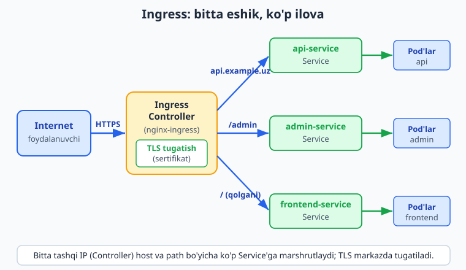
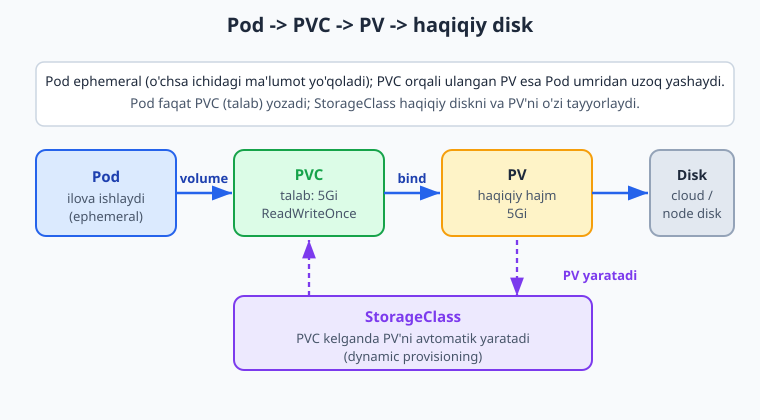
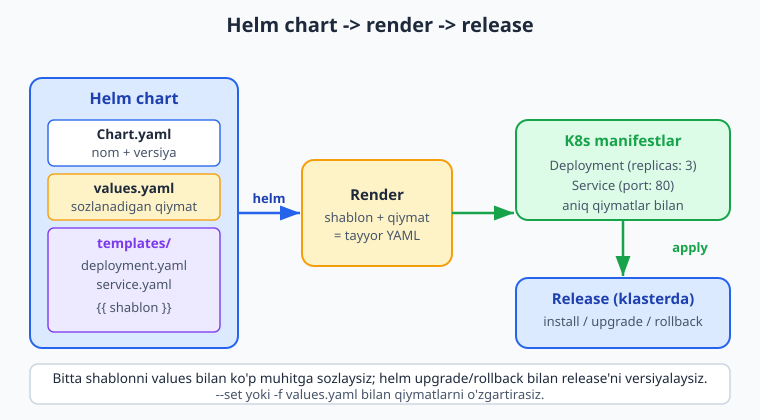

# 24 — Ingress, storage, Helm va GitOps

[⬅️ Oldingi: 23 — Production Kubernetes](./23-production-k8s.md) · [🏠 README](./README.md) · [Keyingi: 25 — Monitoring: Prometheus va Grafana ➡️](./25-monitoring-prometheus-grafana.md)

> **Bu bobda:** Har bir Service uchun alohida `LoadBalancer` (va alohida IP) olish qimmat va boshqarib bo'lmas muammosidan boshlab — **Ingress** (`networking.k8s.io/v1`) bilan ko'p Service'ni bitta tashqi kirish nuqtasiga ulashni, domen va path bo'yicha marshrutlashni (`rules`, `host`, `http.paths`, `pathType`, `backend.service`) va TLS'ni (`tls` bloki, cert-manager bilan avtomatik sertifikat) o'rganamiz, Ingress ishlashi uchun **Ingress Controller** (nginx-ingress) kerakligini ko'ramiz; Pod **ephemeral** (vaqtinchalik) ekanini va ma'lumotni saqlash uchun **PersistentVolume (PV)** / **PersistentVolumeClaim (PVC)** / **StorageClass** (dynamic provisioning) bilan haqiqiy diskni Pod'ga ulashni, DB kabi stateful ilovalar uchun **StatefulSet** (`apps/v1`, barqaror nom + headless Service + `volumeClaimTemplates`) ni ko'rib chiqamiz; takroriy YAML'ni shablonlash uchun **Helm** paket menejerini (`Chart.yaml`, `values.yaml`, `templates/`, `helm install/upgrade/rollback/uninstall`, `--set`/`-f`) o'rganamiz; va nihoyat **GitOps** (Argo CD / Flux — Git haqiqat manbai, push vs pull deploy) hamda **managed Kubernetes** (EKS/GKE/AKS) ga kirish darajasida qaraymiz.

---

## Muammo: har bir ilovaga alohida IP olib bo'lmaydi

22 va 23-boblarda ilovamizni Kubernetes'da `Deployment` + `Service` bilan ishga tushirdik. Tashqi dunyoga ochish uchun `type: LoadBalancer` Service ishlatdik — cloud unga tashqi IP berdi. Bitta ilova uchun bu yaxshi ishladi.

Endi real loyihani tasavvur qiling: sizda `api.example.uz` (backend), `example.uz` (frontend), `admin.example.uz` (admin panel) bor. Har biriga alohida `LoadBalancer` Service qilsangiz — cloud sizdan **har bir IP uchun** alohida to'lov oladi (oyiga $15-20 atrofida), va sizda uchta turli IP bo'ladi. DNS'da uchta yozuv, uchta sertifikat, hammasini qo'lda boshqarish kerak. Ilova soni 10 taga yetganda — bu chidab bo'lmas holatga aylanadi.

📌 Yana bir muammo: `LoadBalancer` Service faqat **TCP/port** darajasida ishlaydi. U "`example.uz/api` ga kelganni backend'ga, `example.uz/` ga kelganni frontend'ga yubor" deya **olmaydi** — chunki u HTTP yo'lini (path) yoki domen nomini (host) ko'rmaydi. Bizga **L7** (HTTP darajasida) marshrutlash kerak.

Yechim — **Ingress**. Bitta tashqi kirish nuqtasi, bitta IP, va domen/path bo'yicha aqlli marshrutlash. Bu — Kubernetes ichidagi reverse proxy (17-bobda nginx'da ko'rgan reverse proxy g'oyasini eslang). Bu bobda Ingress'dan boshlab, ma'lumotni saqlash (storage), ilovalarni paketlash (Helm) va Git orqali deploy qilish (GitOps) gacha boramiz.

---

## Ingress: bitta eshik, ko'p ilova

**Ingress** (kirish) — klasterga tashqaridan keladigan HTTP/HTTPS trafikni domen va path bo'yicha turli Service'larga taqsimlovchi qoidalar to'plami. U — klaster oldidagi aqlli darvozabon: "`api.example.uz` so'rovini `api-service`'ga, `example.uz/admin` ni `admin-service`'ga yubor".



⚠️ Eng muhim nozik nuqta: **Ingress obyektining o'zi hech narsa qilmaydi**. U faqat qoidalar ro'yxati (YAML). Bu qoidalarni **bajaradigan** dastur kerak — bu **Ingress Controller**.

### Ingress Controller nima va nega kerak

`Ingress` resursi — bu "men shunday marshrutlashni xohlayman" degan deklaratsiya. Lekin uni amalda bajaradigan kimdir bo'lishi kerak. Bu vazifani **Ingress Controller** bajaradi — klasterda ishlaydigan haqiqiy reverse proxy (odatda nginx). Eng mashhuri — **nginx-ingress** (`ingress-nginx`).

Ingress Controller:

1. Klasterdagi barcha `Ingress` obyektlarini kuzatib turadi.
2. Ulardagi qoidalarni o'qib, ichki nginx config'iga aylantiradi.
3. O'zi bitta `LoadBalancer` Service orqali tashqi IP oladi — va **butun klaster uchun shu bitta IP** yetarli bo'ladi.

📌 Demak mantiq: **bitta** Ingress Controller (bitta tashqi IP) + **ko'p** Ingress qoidalari (har ilova uchun). Pulli IP bitta, marshrutlash esa cheksiz. Mana shu LoadBalancer-har-ilova muammosini hal qiladi.

Ingress Controller'ni o'rnatish (illustrativ — real klaster kerak):

```bash
# nginx-ingress controller (rasmiy manifest)
kubectl apply -f https://raw.githubusercontent.com/kubernetes/ingress-nginx/main/deploy/static/provider/cloud/deploy.yaml

# o'rnatilgach, uning tashqi IP'sini ko'rish
kubectl get service -n ingress-nginx
```

ℹ️ **Illustrativ:** yuqoridagi `kubectl apply` real klaster (minikube/kind/cloud) talab qiladi va internetdan manifest yuklaydi. Lokalda biz uni bajarmaymiz; quyidagi Ingress YAML'ning **strukturasini** esa offline tekshirdik.

### Ingress manifesti: host va path bo'yicha marshrutlash

Mana to'liq Ingress namunasi. Bu uchta holatni ko'rsatadi: domen bo'yicha, path bo'yicha marshrutlash va TLS:

```yaml
apiVersion: networking.k8s.io/v1
kind: Ingress
metadata:
  name: example-ingress
  annotations:
    # nginx-ingress'ga maxsus ko'rsatma (controller'ga qarab o'zgaradi)
    nginx.ingress.kubernetes.io/rewrite-target: /
spec:
  ingressClassName: nginx
  rules:
    # 1) Domen (host) bo'yicha: api.example.uz -> api-service
    - host: api.example.uz
      http:
        paths:
          - path: /
            pathType: Prefix
            backend:
              service:
                name: api-service
                port:
                  number: 80
    # 2) Asosiy domen, path bo'yicha bo'linadi
    - host: example.uz
      http:
        paths:
          - path: /admin
            pathType: Prefix
            backend:
              service:
                name: admin-service
                port:
                  number: 80
          - path: /
            pathType: Prefix
            backend:
              service:
                name: frontend-service
                port:
                  number: 80
```

Asosiy maydonlar:

- `apiVersion: networking.k8s.io/v1` — Ingress'ning barqaror (stable) versiyasi. ❌ Eski `extensions/v1beta1` yoki `networking.k8s.io/v1beta1` — **olib tashlangan**, ishlatmang.
- `ingressClassName: nginx` — qaysi Ingress Controller bu qoidani bajarishini aytadi (klasterda bir nechta controller bo'lishi mumkin).
- `rules` — marshrutlash qoidalari ro'yxati. Har biri `host` (domen) va `http.paths` (path'lar).
- `pathType` — path qanday solishtiriladi:
  - `Prefix` — yo'l boshi mos kelsa (`/admin` -> `/admin/users` ham tushadi). Eng ko'p ishlatiladi.
  - `Exact` — aniq mos kelishi shart.
- `backend.service.name` + `backend.service.port.number` — so'rov qaysi Service'ga va uning qaysi portiga yuborilishi.

💡 Tartib muhim: nginx-ingress eng **uzun mos keluvchi prefix**ni tanlaydi. Yuqorida `/admin` `/`dan oldin tekshiriladi, shuning uchun `example.uz/admin/...` admin'ga, qolgani frontend'ga ketadi.

### Ingress vs Service (LoadBalancer)

| | Service `LoadBalancer` | Ingress |
|---|---|---|
| Daraja | L4 (TCP/port) | L7 (HTTP: host + path) |
| Tashqi IP | Har Service'ga alohida (pulli) | Bitta controller'ga, hammaga umumiy |
| Marshrutlash | Yo'q (faqat port) | Domen va path bo'yicha |
| TLS | Yo'q (ilova o'zi qiladi) | Markazda, Ingress'da tugatiladi |
| Qachon | Bitta TCP xizmat (DB, gRPC) | Ko'p HTTP ilova, bitta klaster |

📌 Qoida: **HTTP(S) ilovalar uchun — Ingress**. `LoadBalancer` Service'ni faqat HTTP bo'lmagan (masalan tashqaridan ochiq DB yoki maxsus TCP protokol) holatlar uchun yoki Ingress Controller'ning o'zini ochish uchun saqlang.

### TLS va cert-manager bilan avtomatik HTTPS

Ingress sertifikatni markazda boshqarishga imkon beradi — har ilova o'zi HTTPS qilmaydi, Ingress Controller TLS'ni **tugatadi** (terminate). `spec.tls` bloki domen va sertifikat saqlangan Secret'ni bog'laydi:

```yaml
spec:
  tls:
    - hosts:
        - api.example.uz
        - example.uz
      secretName: example-tls   # TLS sertifikat shu Secret'da
  rules:
    - host: api.example.uz
      # ... (yuqoridagidek)
```

Sertifikatni qo'lda olish va Secret'ga solish zerikarli (18-bobdagi Certbot'ni eslang). Klasterda buni **cert-manager** avtomatlashtiradi: u Let's Encrypt'dan ACME orqali sertifikat oladi, Secret'ga yozadi va 90 kunda avtomatik yangilaydi — xuddi 18-bobdagi `certbot.timer` kabi, lekin Kubernetes ichida.

```yaml
metadata:
  annotations:
    cert-manager.io/cluster-issuer: letsencrypt-prod
```

Shu annotatsiya bilan cert-manager Ingress'dagi `tls.hosts` domenlari uchun sertifikatni o'zi oladi va `secretName`'ga joylaydi. (18-bobda Let's Encrypt va ACME'ni batafsil ko'rganmiz — cert-manager o'sha jarayonni klaster ichida bajaradi.)

ℹ️ **Illustrativ:** cert-manager o'rnatish va Let's Encrypt'dan real sertifikat olish jonli klaster, real domen va ochiq port talab qiladi — o'z klasteringizda bajaring.

---

## Storage: Pod o'chsa, ma'lumot yo'qoladi

Hozirgacha ilovalarimiz **stateless** edi — ma'lumotni o'zida saqlamasdi. Lekin DB (PostgreSQL), fayl yuklamalari, yoki Redis kabi narsalar **ma'lumotni saqlashi** kerak.

Muammo: **Pod ephemeral** (vaqtinchalik). Pod o'chsa, qayta yaratilsa yoki boshqa node'ga ko'chsa — uning ichidagi disk **butunlay yo'qoladi**. Pod ichiga yozilgan PostgreSQL ma'lumotlari Pod restart bo'lishi bilan yo'q bo'ladi. Bu — falokat.

Yechim: Pod'ning umridan **uzoq yashaydigan**, alohida disk. Kubernetes'da bu — **PersistentVolume** tizimi.

### PV, PVC va StorageClass

Kubernetes storage'ni uch tushuncha bilan boshqaradi:



- **PersistentVolume (PV)** — klasterdagi **haqiqiy** disk bo'lagi (cloud disk, NFS, lokal disk). Bu — "ombordagi mavjud hajm".
- **PersistentVolumeClaim (PVC)** — disk uchun **talabnoma**: "menga 5 GB, `ReadWriteOnce` rejimida disk kerak". Pod PV'ni to'g'ridan-to'g'ri emas, **PVC orqali** so'raydi. Bu — "men shunday hajm istayman" degan ariza.
- **StorageClass** — PVC kelganda PV'ni **avtomatik yaratish** (dynamic provisioning) qoidasi. Cloud'da odatda standart StorageClass bor: PVC yozsangiz, u o'zi cloud disk yaratib, PV qilib bog'laydi. Qo'lda PV yaratish shart emas.

📌 Mantiqni o'xshatish bilan: PVC — restoranda **buyurtma** ("menga 5 GB"), StorageClass — **oshpaz** (buyurtmaga ko'ra taom tayyorlaydi, ya'ni PV yaratadi), PV — tayyor **taom** (haqiqiy disk). Pod faqat buyurtma beradi (PVC), qolganini tizim qiladi.

PVC manifesti:

```yaml
apiVersion: v1
kind: PersistentVolumeClaim
metadata:
  name: postgres-pvc
spec:
  accessModes:
    - ReadWriteOnce        # bitta node'dan o'qish/yozish
  resources:
    requests:
      storage: 5Gi         # 5 gigabayt so'raymiz
  storageClassName: standard   # qaysi StorageClass (cloud'da odatda standart bor)
```

`accessModes` — diskga kirish rejimi:

- `ReadWriteOnce` (RWO) — bitta node disk'ni o'qiydi/yozadi. DB uchun eng ko'p ishlatiladi.
- `ReadOnlyMany` (ROX) — ko'p node faqat o'qiydi.
- `ReadWriteMany` (RWX) — ko'p node yozadi (NFS kabi maxsus storage kerak).

### PVC'ni Pod'ga ulash

PVC'ni Pod (yoki Deployment) ichida `volumes` + `volumeMounts` bilan ulaymiz:

```yaml
apiVersion: apps/v1
kind: Deployment
metadata:
  name: postgres
spec:
  replicas: 1
  selector:
    matchLabels:
      app: postgres
  template:
    metadata:
      labels:
        app: postgres
    spec:
      containers:
        - name: postgres
          image: postgres:17
          env:
            - name: POSTGRES_PASSWORD
              value: "maxfiy-parol"   # haqiqatda Secret'dan oling
          volumeMounts:
            - name: pgdata
              mountPath: /var/lib/postgresql/data
      volumes:
        - name: pgdata
          persistentVolumeClaim:
            claimName: postgres-pvc    # yuqoridagi PVC
```

- `volumes` — Pod'ga qaysi hajmlar ulanishini e'lon qiladi; bu yerda `persistentVolumeClaim.claimName` orqali PVC'ga ishora.
- `volumeMounts.mountPath` — disk konteyner ichida qayerga ulanishi (`/var/lib/postgresql/data` — PostgreSQL ma'lumotlari shu yerda).

Endi Pod o'chsa ham, disk PVC sifatida saqlanib qoladi; yangi Pod o'sha PVC'ni qayta ulaydi va ma'lumot **joyida turadi**.

⚠️ `env`'da parolni ochiq yozish — faqat namuna. Production'da 23-bobda ko'rgan **Secret**'dan `valueFrom.secretKeyRef` bilan oling.

### StatefulSet: DB kabi stateful ilovalar uchun

Deployment + PVC oddiy holatda ishlaydi, lekin DB klasteri (bir nechta PostgreSQL/MongoDB replikasi) uchun yetarli emas: har replikaga **o'z barqaror nomi** va **o'z alohida diski** kerak. Buni **StatefulSet** beradi.

StatefulSet Deployment'dan farqi:

- **Barqaror, oldindan aytib bo'ladigan nom:** Pod'lar `db-0`, `db-1`, `db-2` deb tartib bilan nomlanadi (Deployment'da tasodifiy `app-7d8f...`). Pod o'chib qayta yaratilsa ham **o'sha nom** qaytadi.
- **Har Pod'ga alohida storage:** `volumeClaimTemplates` orqali har replika uchun alohida PVC avtomatik yaratiladi (`db-0` -> o'z diski, `db-1` -> boshqa disk).
- **Headless Service** bilan ishlaydi: har Pod'ga barqaror DNS nom beradi (`db-0.db`, `db-1.db`).

```yaml
apiVersion: apps/v1
kind: StatefulSet
metadata:
  name: postgres
spec:
  serviceName: postgres        # headless Service nomi (barqaror DNS uchun)
  replicas: 3
  selector:
    matchLabels:
      app: postgres
  template:
    metadata:
      labels:
        app: postgres
    spec:
      containers:
        - name: postgres
          image: postgres:17
          ports:
            - containerPort: 5432
          volumeMounts:
            - name: pgdata
              mountPath: /var/lib/postgresql/data
  volumeClaimTemplates:        # har replikaga alohida PVC
    - metadata:
        name: pgdata
      spec:
        accessModes:
          - ReadWriteOnce
        resources:
          requests:
            storage: 5Gi
```

- `serviceName` — headless Service nomi; StatefulSet shu orqali Pod'larga barqaror DNS beradi.
- `volumeClaimTemplates` — PVC **shabloni**: StatefulSet har Pod uchun (`pgdata-postgres-0`, `pgdata-postgres-1`, ...) alohida PVC yaratadi.

📌 Qoida: oddiy stateless ilova -> **Deployment**. Saqlanadigan ma'lumotli, identifikatsiyasi muhim ilova (DB, message queue) -> **StatefulSet**. Boshlovchi uchun ko'p hollarda boshqariladigan cloud DB ishlatish (klaster ichida DB ishlatishdan) osonroq — buni ham yodda tuting.

---

## Helm: Kubernetes'ning paket menejeri

Hozirgacha har bir resurs uchun alohida YAML yozdik: Deployment, Service, Ingress, PVC, ConfigMap, Secret... Bitta ilova uchun bu 5-6 fayl. Endi shu ilovani **uchta muhitga** (dev, staging, prod) deploy qilish kerak — har birida replika soni, domen, resurs limitlari boshqacha.

Variant 1: YAML'larni uch marta nusxalab, qiymatlarni qo'lda o'zgartirish. Natija — nusxalar bir-biridan farq qila boshlaydi, xato kiradi, boshqarib bo'lmaydi.

Variant 2: **Helm** — Kubernetes'ning paket menejeri (Linux'da `apt`/`npm` kabi, lekin K8s manifestlari uchun). Helm YAML'ni **shablonlash** (template) va **versiyalash** imkonini beradi.



### Chart strukturasi

Helm paketi — **chart** deb ataladi. Bu — quyidagi tuzilishdagi papka:

```text
myapp/
├── Chart.yaml          # chart metadatasi (nom, versiya)
├── values.yaml         # standart qiymatlar (sozlanadi)
└── templates/
    ├── deployment.yaml # {{ }} shabloni bilan
    └── service.yaml
```

`Chart.yaml` — chart haqida ma'lumot:

```yaml
apiVersion: v2
name: myapp
description: Mening ilovam uchun Helm chart
type: application
version: 0.1.0          # chart versiyasi
appVersion: "1.0.0"     # ichidagi ilova versiyasi
```

`values.yaml` — standart, **o'zgartiriladigan** qiymatlar:

```yaml
replicaCount: 2
image:
  repository: ghcr.io/myuser/myapp
  tag: "1.0.0"
service:
  port: 80
```

`templates/deployment.yaml` — `{{ }}` shablon ifodalari bilan (qiymatlar `values.yaml`'dan keladi):

```yaml
apiVersion: apps/v1
kind: Deployment
metadata:
  name: {{ .Release.Name }}-myapp
spec:
  replicas: {{ .Values.replicaCount }}
  selector:
    matchLabels:
      app: {{ .Release.Name }}-myapp
  template:
    metadata:
      labels:
        app: {{ .Release.Name }}-myapp
    spec:
      containers:
        - name: myapp
          image: "{{ .Values.image.repository }}:{{ .Values.image.tag }}"
          ports:
            - containerPort: {{ .Values.service.port }}
```

⚠️ **Illustrativ shablon:** yuqoridagi `templates/deployment.yaml`dagi `{{ .Values... }}` qatorlari — Helm-specific shablon sintaksisi, **sof YAML emas**. Helm uni `helm install` paytida render qilib, haqiqiy YAML'ga aylantiradi. `.Release.Name` — `helm install` da bergan release nomi, `.Values.X` — `values.yaml`dagi qiymat. (Shu sababli bu faylni to'g'ridan-to'g'ri `kubectl apply` qilib bo'lmaydi — avval Helm render qilishi kerak.)

### Helm buyruqlari

```bash
# 1) Tashqi chart repozitoriyni qo'shish
helm repo add bitnami https://charts.bitnami.com/bitnami
helm repo update

# 2) Chart'ni klasterga o'rnatish (release nomi = "web")
helm install web ./myapp

# 3) values'ni o'zgartirib o'rnatish
helm install web ./myapp --set replicaCount=5
helm install web ./myapp -f prod-values.yaml

# 4) Mavjud release'ni yangilash (yangi versiya / yangi qiymatlar)
helm upgrade web ./myapp --set image.tag=1.1.0

# 5) Xato bo'lsa — oldingi holatga qaytish
helm rollback web 1        # 1-revizyaga qaytar

# 6) O'chirish
helm uninstall web

# Render natijasini ko'rish (klasterga tegmasdan)
helm template web ./myapp
```

Asosiy g'oyalar:

- **release** — chart'ning klasterga o'rnatilgan nusxasi. Bitta chart'ni turli nom bilan ko'p marta o'rnatish mumkin (`web`, `web-staging`).
- `--set key=value` — bitta qiymatni buyruq qatorida o'zgartirish (tezkor).
- `-f values.yaml` — butun qiymatlar faylini berish (muhit bo'yicha: `dev-values.yaml`, `prod-values.yaml`).
- `helm upgrade` / `helm rollback` — Helm har o'rnatishni **revizya** (versiya) sifatida saqlaydi; xato bo'lsa bir buyruq bilan oldingi ishchi holatga qaytasiz.

📌 Nega Helm: takroriy YAML'ni **bir marta shablonlab**, qiymatlar bilan ko'p muhitga sozlash; butun ilovani **bir buyruq** bilan o'rnatish/yangilash/qaytarish; va tayyor chart'lardan (PostgreSQL, Redis, nginx-ingress) foydalanib, g'ildirakni qaytadan ixtiro qilmaslik.

💡 Tayyor chart'lar ko'p: `helm install my-db bitnami/postgresql` bilan butun PostgreSQL'ni (PVC, Service, Secret bilan) bir buyruqda o'rnatasiz. Ko'p mashhur dasturlarning rasmiy Helm chart'i bor.

ℹ️ **Illustrativ:** `helm install/upgrade` real klaster talab qiladi. Quyida (verify qismida) chart fayllari va render natijasi YAML strukturasini offline tekshirdik; `{{ }}` shablon qatorlari esa Helm tomonidan render qilinishini yodda tuting.

---

## GitOps: Git — haqiqat manbai

Hozirgacha biz `kubectl apply` yoki `helm upgrade` ni **qo'lda** terminaldan ishga tushirdik. Bu — **push** model: odam (yoki CI) klasterga o'zgarishni "itaradi". Muammolari:

- Klasterning **haqiqiy holati** Git'dagi YAML'dan farq qilishi mumkin (kimdir qo'lda `kubectl edit` qilgan — Git bilmaydi).
- Kim, qachon, nimani o'zgartirgani — tarix `kubectl` history'da emas, hech qayerda aniq qayd etilmaydi.
- Rollback — qo'lda, xatoga moyil.

**GitOps** boshqacha yondashuv: **Git repozitoriysi = klasterning yagona haqiqat manbai**. Klaster qanday bo'lishi kerakligi (barcha manifestlar/Helm chart) Git'da yotadi. Klaster ichidagi **agent** Git'ni doimiy kuzatadi va klasterni Git holatiga **avtomatik moslashtiradi**.

### Push vs Pull deploy

- **Push (an'anaviy):** CI quvuri tashqaridan klasterga `kubectl apply` qiladi. CI'da klaster kaliti (kubeconfig) saqlanadi — xavfsizlik xavfi.
- **Pull (GitOps):** klaster ichidagi agent (Argo CD / Flux) Git'ni **o'zi tortib oladi** (pull) va o'zgarishni qo'llaydi. Klaster kaliti tashqariga chiqmaydi; agar kimdir qo'lda o'zgartirsa, agent uni Git holatiga **qaytaradi** (self-healing, drift correction).

📌 GitOps qoidasi: klasterga to'g'ridan-to'g'ri `kubectl apply` qilmaysiz — o'zgarishni **Git'ga commit/PR** qilasiz, qolganini agent bajaradi. Deploy = `git push`. Rollback = `git revert`. Audit = Git tarixi.

### Argo CD va Flux

Ikki asosiy GitOps vositasi:

- **Argo CD** — Git'ni kuzatuvchi agent + qulay **veb-UI** (qaysi ilova Git bilan sinxron, qaysi biri "drift" qilgan — vizual ko'rinadi). Boshlash uchun qulayroq.
- **Flux** — yengilroq, UI'siz, CLI/Kubernetes-native; GitOps tamoyillariga qattiq amal qiladi.

Ikkalasi ham bir g'oyani amalga oshiradi: Git holatini klasterga **doimiy** moslashtirish.

ℹ️ **Illustrativ:** Argo CD / Flux o'rnatish va ulardan foydalanish jonli klaster talab qiladi — bu bobda faqat g'oyani kirish darajasida beramiz; amaliy qism o'z klasteringizda.

---

## Managed Kubernetes (qisqa)

Hozirgacha lokal `minikube`/`kind` haqida gapirdik. Production'da Kubernetes'ni **o'zingiz** boshqarish (control plane, etcd, yangilashlar, zaxira) — juda mehnat talab va xatarli. Shuning uchun ko'pchilik **managed Kubernetes** ishlatadi:

- **EKS** (Amazon), **GKE** (Google), **AKS** (Azure) — cloud control plane'ni siz uchun boshqaradi.

Nega self-managed o'rniga managed:

- **Control plane sizning tashvishingiz emas:** apiserver, etcd, scheduler'ni cloud boshqaradi, yangilaydi, zaxira oladi.
- **Tugmani bosib node qo'shish** (autoscaling), cloud LoadBalancer/disk/IAM bilan integratsiya tayyor.
- Siz faqat **ilovangizga** (manifestlar, Helm) e'tibor berasiz, infratuzilmani emas.

💡 Boshlovchi uchun maslahat: production K8s kerak bo'lsa — boshidan managed (GKE/EKS/AKS) ni tanlang. Self-managed klaster (`kubeadm` bilan) — o'rganish uchun yaxshi, lekin kichik jamoa uchun kunlik boshqaruvga arzimaydi.

---

## 24-bob mashqlari

> Quyidagi mashqlarning ko'pi YAML manifest yozish va tushunchalarni mustahkamlash haqida — bularni lokalda (`kubectl apply --dry-run=client`, yaml parse bilan) mashq qilasiz. Jonli klaster talab qiladiganlar (Ingress Controller, cert-manager, Argo CD, `helm install`) **illustrativ** — o'z klasteringizda bajaring.

### Oson

1. Ingress va `LoadBalancer` Service o'rtasidagi asosiy farqni (qaysi darajada ishlaydi, IP soni, marshrutlash imkoni) ayting.
2. "Ingress obyektining o'zi hech narsa qilmaydi" — bu nima degani? Qoidalarni kim bajaradi?
3. Pod "ephemeral" deganda nima nazarda tutiladi? Bu DB uchun nega muammo?
4. PV, PVC va StorageClass — uchalasini bir jumladan ta'riflang (restoran o'xshatishidan foydalaning).
5. Helm'da `Chart.yaml`, `values.yaml` va `templates/` papkasi har biri nima uchun? 
6. GitOps'da deploy qilish, rollback qilish va audit (kim nima qildi) qanday bajariladi?

### O'rta

7. `pathType: Prefix` va `pathType: Exact` farqini misol bilan tushuntiring. `example.uz/admin` so'rovi `/admin` (Prefix) qoidasiga tushadimi?
8. PVC manifestida `accessModes` nima? `ReadWriteOnce` va `ReadWriteMany` qachon ishlatiladi?
9. Deployment + PVC bilan StatefulSet o'rtasidagi uchta asosiy farqni ayting. DB klasteri uchun qaysi biri to'g'ri va nega?
10. `helm upgrade` va `helm rollback` qanday ishlaydi? Helm release versiyalarini qanday saqlaydi?
11. GitOps'da push va pull deploy farqini ayting. Pull (Argo CD/Flux) nega xavfsizlik jihatdan afzal?

### Qiyin

12. `shop.example.uz` uchun Ingress yozing: `/api` (Prefix) -> `api-svc:8080`, qolgan barcha yo'l (`/`, Prefix) -> `web-svc:80`. `ingressClassName: nginx` ishlating.

<details markdown="1"><summary>Yechim</summary>

```yaml
apiVersion: networking.k8s.io/v1
kind: Ingress
metadata:
  name: shop-ingress
spec:
  ingressClassName: nginx
  rules:
    - host: shop.example.uz
      http:
        paths:
          - path: /api
            pathType: Prefix
            backend:
              service:
                name: api-svc
                port:
                  number: 8080
          - path: /
            pathType: Prefix
            backend:
              service:
                name: web-svc
                port:
                  number: 80
```

`/api` `/`dan oldin yozilgan; nginx-ingress eng uzun mos prefix'ni tanlagani uchun `/api/...` so'rovlari `api-svc`'ga, qolgani `web-svc`'ga ketadi. `apiVersion: networking.k8s.io/v1` — Ingress'ning barqaror versiyasi. Bu manifest `kubectl apply --dry-run=client` dan o'tadi.

</details>

13. `redis-pvc` nomli PVC yozing: 2 GB, `ReadWriteOnce`, `standard` StorageClass. Keyin uni `redis` Deployment'ida `/data` ga ulang.

<details markdown="1"><summary>Yechim</summary>

```yaml
apiVersion: v1
kind: PersistentVolumeClaim
metadata:
  name: redis-pvc
spec:
  accessModes:
    - ReadWriteOnce
  resources:
    requests:
      storage: 2Gi
  storageClassName: standard
---
apiVersion: apps/v1
kind: Deployment
metadata:
  name: redis
spec:
  replicas: 1
  selector:
    matchLabels:
      app: redis
  template:
    metadata:
      labels:
        app: redis
    spec:
      containers:
        - name: redis
          image: redis:7-alpine
          volumeMounts:
            - name: data
              mountPath: /data
      volumes:
        - name: data
          persistentVolumeClaim:
            claimName: redis-pvc
```

PVC `2Gi` disk so'raydi (StorageClass uni avtomatik yaratadi). Deployment `volumes.persistentVolumeClaim.claimName` orqali PVC'ni ulaydi va `volumeMounts.mountPath` bilan konteyner ichida `/data`'ga bog'laydi. Redis o'chsa ham disk saqlanadi.

</details>

14. `Chart.yaml` va `values.yaml` (replicaCount, image.repository, image.tag) yozing, so'ng `replicas` va `image`ni `values.yaml`dan oladigan minimal `templates/deployment.yaml` shablonini yozing.

<details markdown="1"><summary>Yechim</summary>

`Chart.yaml`:

```yaml
apiVersion: v2
name: todo
description: Todo API uchun chart
type: application
version: 0.1.0
appVersion: "1.0.0"
```

`values.yaml`:

```yaml
replicaCount: 3
image:
  repository: ghcr.io/myuser/todo
  tag: "1.0.0"
```

`templates/deployment.yaml` (shablon — Helm render qiladi):

```yaml
apiVersion: apps/v1
kind: Deployment
metadata:
  name: {{ .Release.Name }}-todo
spec:
  replicas: {{ .Values.replicaCount }}
  selector:
    matchLabels:
      app: {{ .Release.Name }}-todo
  template:
    metadata:
      labels:
        app: {{ .Release.Name }}-todo
    spec:
      containers:
        - name: todo
          image: "{{ .Values.image.repository }}:{{ .Values.image.tag }}"
```

`{{ .Values.X }}` qiymatlar `values.yaml`dan, `{{ .Release.Name }}` esa `helm install <nom> ...` dan keladi. `helm install todo ./todo --set replicaCount=5` bilan replika sonini bir muhitda o'zgartirish mumkin. (Shablon qatorlari sof YAML emas — Helm render qilgach `kubectl apply` qilinadi.)

</details>

15. `postgres` uchun 2 replikali StatefulSet yozing: headless `serviceName: postgres`, har replikaga 10 GB `ReadWriteOnce` PVC (`volumeClaimTemplates`), `/var/lib/postgresql/data` ga ulangan.

<details markdown="1"><summary>Yechim</summary>

```yaml
apiVersion: apps/v1
kind: StatefulSet
metadata:
  name: postgres
spec:
  serviceName: postgres
  replicas: 2
  selector:
    matchLabels:
      app: postgres
  template:
    metadata:
      labels:
        app: postgres
    spec:
      containers:
        - name: postgres
          image: postgres:17
          ports:
            - containerPort: 5432
          volumeMounts:
            - name: pgdata
              mountPath: /var/lib/postgresql/data
  volumeClaimTemplates:
    - metadata:
        name: pgdata
      spec:
        accessModes:
          - ReadWriteOnce
        resources:
          requests:
            storage: 10Gi
```

`serviceName` headless Service'ga bog'laydi (har Pod barqaror DNS oladi: `postgres-0.postgres`, `postgres-1.postgres`). `volumeClaimTemplates` har replika uchun alohida PVC yaratadi (`pgdata-postgres-0`, `pgdata-postgres-1`) — har biriga 10 GB. Pod o'chsa, o'sha nom va disk qaytadi. Bu manifest `apps/v1` apiVersion bilan, `kubectl apply --dry-run=client` dan o'tadi.

</details>

16. Bir hamkasbingiz "GitOps shunchaki CI'da `kubectl apply` yozish" deydi. Bu xato — GitOps (pull) bilan an'anaviy CI push deploy orasidagi farqni va GitOps afzalligini tushuntiring.

<details markdown="1"><summary>Yechim</summary>

An'anaviy **push**: CI quvuri tashqaridan klasterga `kubectl apply`/`helm upgrade` qiladi. CI'da klaster kaliti (kubeconfig) saqlanadi (xavf), va klasterning haqiqiy holati Git'dan ajralib ketishi mumkin (kimdir qo'lda o'zgartirsa — hech kim bilmaydi).

**GitOps (pull):** Git = yagona haqiqat manbai. Klaster **ichidagi** agent (Argo CD/Flux) Git'ni o'zi kuzatadi va klasterni Git holatiga doimiy moslashtiradi. Afzalliklari: (1) klaster kaliti tashqariga chiqmaydi — agent ichkarida; (2) drift tuzatish/self-healing — qo'lda o'zgarish Git holatiga qaytariladi; (3) deploy = git push, rollback = git revert, audit = Git tarixi (kim/qachon/nima — hammasi commit'larda). Demak GitOps faqat "apply'ni boshqa joyga ko'chirish" emas — boshqaruv modelini Git-markazli qiladi.

</details>

17. Qachon `LoadBalancer` Service, qachon Ingress ishlatiladi? Ikkita aniq stsenariy bilan tushuntiring.

<details markdown="1"><summary>Yechim</summary>

**Ingress** — ko'p HTTP(S) ilovani bitta tashqi IP orqali ochganda. Masalan `example.uz` (frontend), `api.example.uz` (backend), `example.uz/admin` (admin) — uchalasi bitta Ingress Controller IP'sida, host/path bo'yicha marshrutlanadi, TLS markazda. Bu — odatiy veb-ilova holati.

**`LoadBalancer` Service** — HTTP bo'lmagan yoki maxsus TCP xizmat tashqariga ochilganda. Masalan tashqaridan ulanish kerak bo'lgan PostgreSQL (5432-port, sof TCP) yoki gRPC/maxsus protokol — Ingress (L7 HTTP) bularni marshrutlay olmaydi, shuning uchun `LoadBalancer` (L4) kerak. Shuningdek Ingress Controller'ning o'zi tashqi IP'ni `LoadBalancer` Service orqali oladi.

Qoida: HTTP(S) -> Ingress; sof TCP/maxsus protokol yoki bitta xizmatga to'g'ridan-to'g'ri IP -> `LoadBalancer`.

</details>

---

[⬅️ Oldingi: 23 — Production Kubernetes](./23-production-k8s.md) · [🏠 README](./README.md) · [Keyingi: 25 — Monitoring: Prometheus va Grafana ➡️](./25-monitoring-prometheus-grafana.md)
