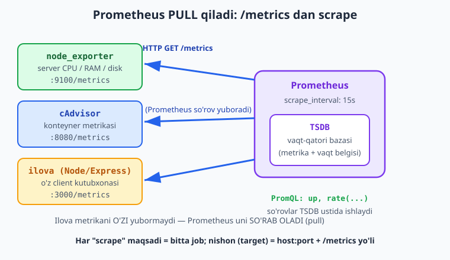
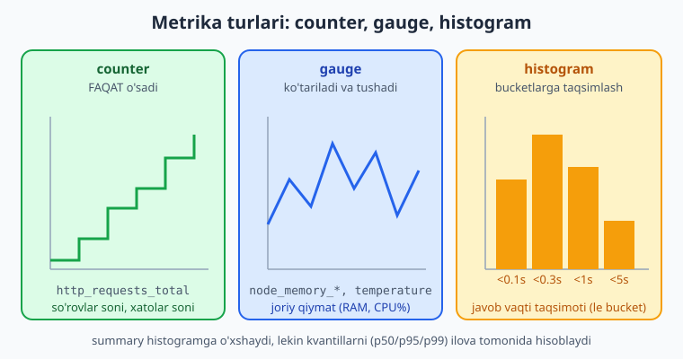
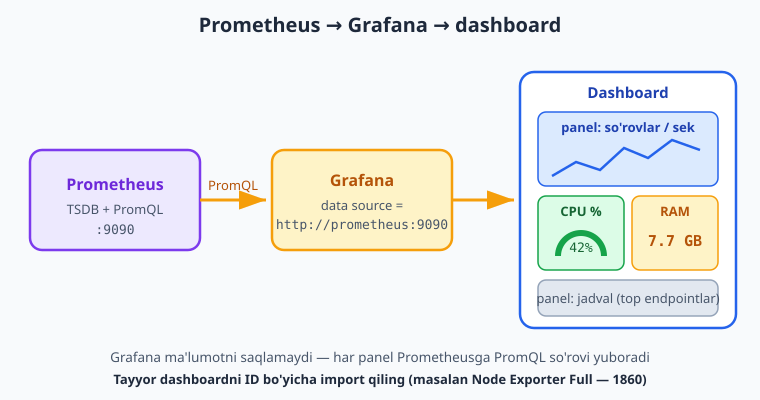

# 25 — Monitoring: Prometheus va Grafana

[⬅️ Oldingi: 24 — Ingress, storage, Helm va GitOps](./24-ingress-helm-gitops.md) · [🏠 README](./README.md) · [Keyingi: 26 — Logging, alerting, backup va ishonchlilik ➡️](./26-logging-alerting-backup.md)

> **Bu bobda:** "ilovam ishlayaptimi, sekinlashayaptimi, server to'lib bormoqdami?" degan savolga raqam bilan javob beramiz — **observability** (kuzatuvchanlik)ning uchta ustuni (metrics / logs / traces)dan bu bob **metrics**ga bag'ishlanadi (loglar 26-bobda); **Prometheus** ning pull-based modeli (`prometheus.yml`, `scrape_configs`, `job_name`, `targets`, `scrape_interval`) va `/metrics` endpoint, **exporter**lar (`node_exporter` — server, `cAdvisor` — konteyner, ilovaning o'z client kutubxonasi), to'rt metrika turi (counter / gauge / histogram / summary), **PromQL** asoslari (`up`, `rate(...)`, label filtr, `sum by`), **Grafana** ni Prometheus'ga ulash va dashboard/panel/tayyor dashboard import, va nihoyat bularning hammasini bitta `compose.yaml`'da ko'tarib lokal Docker'da haqiqatan ishga tushirib tasdiqlaymiz.

---

## Muammo: "ishlayapti shekilli"

Tasavvur qiling: 20-bobda production'ga deploy qildingiz, K8s'da ishlayapti (21-24-boblar). Ertalab telefoningizga foydalanuvchidan xabar keladi: "saytingiz ochilmayapti". Siz hayron: kecha hammasi joyida edi-ku?

Siz `kubectl get pods` qilasiz — hammasi `Running`. `curl` qilasiz — ishlayapti. Foydalanuvchi yana yozadi: "endi ishladi, lekin juda sekin edi". Nima bo'ldi? **Bilmaysiz.** Chunki sizda o'tmishni ko'rsatadigan hech narsa yo'q:

- So'rovlar soni qachon ko'tarildi?
- Javob vaqti qachon sekinlashdi?
- RAM/CPU qachon to'ldi?
- Xato (5xx) foizi qancha edi?

> 📌 **Monitoring nima va nega.** Monitoring — tizimingiz holatini **doimiy o'lchab, vaqt bo'yicha saqlab borish**. Maqsad: muammoni **foydalanuvchidan oldin** ko'rish ("disk 80% to'ldi" — hali to'lmasdan). "Ishlayapti shekilli" o'rniga "so'nggi 1 soatda 5xx xatolar 0.1%, p95 javob vaqti 120ms" deb **raqam bilan** aytasiz.

Bu observability'ning bir qismi. Observability uch ustunga tayanadi:

| Ustun | Savol | Vosita | Qayerda |
|---|---|---|---|
| **Metrics** | Necha? Qancha? Qachon? (raqamlar, vaqt qatori) | Prometheus + Grafana | **Bu bob** |
| **Logs** | Aniq nima bo'ldi? (matnli yozuvlar) | Loki / ELK | 26-bob |
| **Traces** | So'rov qaysi servisda sekinlashdi? | Jaeger / Tempo | (kirish, 26-bob) |

Bu bobda **metrics**ga e'tibor beramiz — eng arzon, eng zich va eng tez ogohlantiruvchi ustun.

---

## Prometheus: pull modeli

[Git & GitHub](../git-github/README.md) kitobida ko'rganmiz — yaxshi vosita oddiy g'oyaga tayanadi. Prometheus'ning g'oyasi: **men kerakli joydan metrikani o'zim so'rab olaman**.

Ko'p eski tizimlar **push** modelida ishlaydi: har bir ilova o'z metrikasini markaziy serverga **yuboradi**. Prometheus teskari ishlaydi — **pull (scrape)**: Prometheus belgilangan vaqt oralig'ida (masalan har 15 soniyada) har bir nishonning (`target`) `/metrics` HTTP endpointiga GET so'rovi yuboradi va javobni o'qib oladi.



> 💡 **Nega pull yaxshi?** Prometheus o'zi nishonlar ro'yxatini biladi — biror nishon javob bermasa, darrov "u o'lik" deb biladi (`up = 0`). Push'da esa "ma'lumot kelmayapti" ham "ilova o'lgan", ham "tarmoq uzilgan" degani bo'lishi mumkin — farqlash qiyin. Pull'da nazorat Prometheus qo'lida.

Prometheus o'qigan metrikalarni o'zining ichki **TSDB** (time-series database — vaqt qatori bazasi)siga yozadi. Har bir yozuv: metrika nomi + label'lar + vaqt belgisi + qiymat. Keyin bu bazaga **PromQL** so'rov tili bilan murojaat qilasiz.

### `/metrics` endpoint qanday ko'rinadi

Prometheus o'qiydigan format — oddiy matn. Har qator: metrika nomi, label'lar va qiymat. Masalan ilovaning `/metrics`'i shunaqa bo'ladi:

```text
# HELP http_requests_total Jami HTTP so'rovlar soni
# TYPE http_requests_total counter
http_requests_total{method="GET",path="/vazifalar",status="200"} 1027
http_requests_total{method="POST",path="/vazifalar",status="201"} 143
http_requests_total{method="GET",path="/vazifalar",status="500"} 2
# HELP process_resident_memory_bytes Jarayon ishlatayotgan RAM
# TYPE process_resident_memory_bytes gauge
process_resident_memory_bytes 5.3428224e+07
```

Bu shunchaki matn — brauzerda `http://localhost:9100/metrics` ni ochsangiz, o'sha node_exporter'ning yuzlab qatorli shu matnini ko'rasiz. Prometheus aynan shu matnni o'qib, parse qiladi.

---

## `prometheus.yml`: konfiguratsiya

Prometheus'ning yuragi — `prometheus.yml`. Unda asosan ikki narsa: global sozlamalar va "kimni scrape qilish".

```yaml
global:
  scrape_interval: 15s        # har 15 soniyada nishonlarni so'rab olish
  scrape_timeout: 10s         # bir scrape ko'pi bilan 10s kutadi

scrape_configs:
  - job_name: "prometheus"    # Prometheus o'zini ham scrape qiladi
    static_configs:
      - targets: ["localhost:9090"]

  - job_name: "node"          # server metrikasi
    static_configs:
      - targets: ["node-exporter:9100"]

  - job_name: "cadvisor"      # konteyner metrikasi
    static_configs:
      - targets: ["cadvisor:8080"]
```

Asosiy tushunchalar:

- **`scrape_interval`** — qanchalik tez-tez scrape qilish. 15s — yaxshi standart (juda kichik qilsangiz yuk ortadi, juda katta qilsangiz spike'ni o'tkazib yuborasiz).
- **`job_name`** — bir guruh bir xil turdagi nishonga nom. Har scrape qilingan metrikaga `job="node"` degan label avtomatik qo'shiladi.
- **`targets`** — `host:port` ro'yxati. Prometheus har biriga `http://host:port/metrics` GET yuboradi.
- **`static_configs`** — nishonlarni qo'lda yozish. (Katta tizimlarda `kubernetes_sd_configs` bilan avtomatik topiladi, lekin boshlash uchun static yetadi.)

> ℹ️ **Standart yo'l `/metrics`.** Agar nishonning metrikasi boshqa yo'lda bo'lsa, `metrics_path: /custom`'ni job ostida ko'rsatasiz. Aks holda Prometheus `/metrics`'ni o'qiydi.

---

## Exporter'lar: metrikani kim beradi

Prometheus faqat HTTP'dan matn o'qiydi — metrikani **ishlab chiqarish** boshqa dasturlarning ishi. Bu dasturlarni **exporter** deyiladi: ular tizimning biror qismidan ma'lumot yig'ib, Prometheus formatida `/metrics`'da chiqaradi.

| Exporter | Nimani o'lchaydi | Image | Port |
|---|---|---|---|
| **node_exporter** | Server: CPU, RAM, disk, tarmoq | `prom/node-exporter` | 9100 |
| **cAdvisor** | Konteynerlar: har birining CPU/RAM/IO | `gcr.io/cadvisor/cadvisor` | 8080 |
| ilovaning o'zi | App metrikasi (so'rovlar, xatolar) | client kutubxona | ilovangiz porti |

`node_exporter` — eng birinchi qo'yiladigan exporter: u serveringizning OS darajasidagi yuzlab metrikasini beradi (`node_cpu_seconds_total`, `node_memory_MemAvailable_bytes`, `node_filesystem_avail_bytes`...).

`cAdvisor` (Container Advisor) — Docker konteynerlari haqida: har bir konteyner qancha CPU/RAM yeyapti (`container_cpu_usage_seconds_total`, `container_memory_usage_bytes`).

Ilovaning o'zi uchun **client kutubxona** ishlatasiz — u kodingizga `/metrics` endpoint qo'shadi. Masalan Node/Express'da `prom-client`:

```javascript
import express from "express";
import client from "prom-client";

const app = express();
client.collectDefaultMetrics();             // process RAM/CPU avtomatik

const sorovlar = new client.Counter({
  name: "http_requests_total",
  help: "Jami HTTP so'rovlar",
  labelNames: ["method", "path", "status"],
});

app.use((req, res, next) => {
  res.on("finish", () => {
    sorovlar.inc({ method: req.method, path: req.path, status: res.statusCode });
  });
  next();
});

app.get("/metrics", async (req, res) => {     // Prometheus shuni scrape qiladi
  res.set("Content-Type", client.register.contentType);
  res.end(await client.register.metrics());
});

app.listen(3000);
```

> 📌 **Asosiy qoida.** Prometheus hech narsani o'lchamaydi — u faqat `/metrics`'dan o'qiydi. O'lchashni exporter (yoki ilovangizdagi client kutubxona) qiladi. Demak monitoring qo'shish = `/metrics` chiqaruvchi dasturni ishga tushirish + uni `prometheus.yml`'ga nishon qilib qo'shish.

---

## Metrika turlari

Prometheus to'rt turdagi metrikani biladi. Eng muhim ikkitasi — **counter** va **gauge**.



- **counter** — faqat **o'sadigan** son (yoki ishga tushganda 0'ga tushadi). Misol: jami so'rovlar soni, jami xatolar soni. "Hozir 1027 ta so'rov bo'lgan." Counter'ning xom qiymati kam ma'no beradi — uni `rate()` bilan "sekundiga necha?" ga aylantirasiz.
- **gauge** — **ko'tarilib-tushadigan** joriy qiymat. Misol: hozirgi RAM ishlatilishi, navbatdagi vazifalar soni, harorat. "Hozir RAM 7.7 GB."
- **histogram** — kuzatishlarni oldindan belgilangan **bucket**larga (oraliqlarga) taqsimlaydi. Misol: javob vaqtlari — qanchasi 0.1s'dan kam, qanchasi 0.3s'dan kam... Bundan p95/p99 (95-/99-foizlik javob vaqti) hisoblanadi.
- **summary** — histogramga o'xshaydi, lekin kvantillarni (p50/p95/p99) ilova **tomonida** hisoblaydi. Histogram odatda afzal (Prometheus tomonida agregatsiya mumkin).

> 💡 **Qaysi birini tanlash?** "Faqat oshadigan hodisalar soni" (so'rov, xato, bayt) → **counter**. "Hozirgi holat / o'lcham" (RAM, navbat, ulanishlar) → **gauge**. "Taqsimot / foizlik kerak" (javob vaqti, hajm) → **histogram**.

---

## PromQL: so'rov tili asoslari

PromQL — Prometheus'ning so'rov tili. TSDB'dagi metrikalardan kerakli javobni ajratib olasiz. Eng muhim namunalar:

```promql
up
```

`up` — eng oddiy va eng foydali metrika: har nishon uchun `1` (scrape muvaffaqiyatli, nishon tirik) yoki `0` (nishon o'lik). Bizning verifikatsiyamizda haqiqiy natija shunaqa bo'ldi:

```text
up{job="prometheus", instance="localhost:9090"}      1
up{job="node",       instance="node-exporter:9100"}  1
up{job="cadvisor",   instance="cadvisor:8080"}        0
```

(node va prometheus tirik = 1; cadvisor ishga tushmagan = 0.)

**Label filtr** — jingalak qavs ichida nishonni toraytirasiz:

```promql
up{job="node"}                       # faqat node job'ining holati
http_requests_total{status="500"}    # faqat 500 xatolar
```

**`rate()`** — counter'ni "sekundiga tezlik"ka aylantiradi. Bu eng ko'p ishlatiladigan funksiya:

```promql
rate(http_requests_total[5m])        # so'nggi 5 daqiqadagi o'rtacha so'rov/sek
```

`[5m]` — "vaqt oynasi": so'nggi 5 daqiqa ma'lumotidan tezlikni hisoblaydi. Counter'ni hech qachon to'g'ridan-to'g'ri grafikga qo'ymang — har doim `rate()` bilan.

**Aggregation** — `sum by` bilan label'lar bo'yicha yig'asiz:

```promql
sum by (status) (rate(http_requests_total[5m]))   # status bo'yicha so'rov/sek
```

Bu har `status` (200, 201, 500...) uchun alohida qator beradi — xato foizini ko'rishga ideal.

Node metrikasi misollari:

```promql
node_memory_MemAvailable_bytes                     # bo'sh RAM (bayt)
node_filesystem_avail_bytes{mountpoint="/"}        # / da bo'sh joy
100 - (avg by (instance) (rate(node_cpu_seconds_total{mode="idle"}[5m])) * 100)
                                                   # CPU band foizi
```

> ⚠️ **Counter'ni xom ko'rsatmang.** `http_requests_total` ni to'g'ridan-to'g'ri grafikga qo'ysangiz — faqat o'sib boruvchi to'g'ri chiziq ko'rasiz, ma'nosiz. `rate(http_requests_total[5m])` esa "hozir sekundiga necha so'rov" — aynan kerakli savol.

---

## Grafana: ko'rsatish va dashboard

Prometheus raqamlarni saqlaydi va PromQL'ga javob beradi, lekin uning UI'si jo'n. **Grafana** — chiroyli, interaktiv dashboard quruvchi: u Prometheus'ni **data source** sifatida qo'shadi va panellarda grafik/gauge/jadval ko'rsatadi.



Jarayon uch qadam:

1. **Data source qo'shish** — Grafana'da *Connections → Data sources → Add → Prometheus*, URL'ga `http://prometheus:9090` (compose tarmog'ida servis nomi bilan, 11-bobdagi DNS tamoyili). *Save & test* — yashil belgi chiqsa, ulanish ishladi.
2. **Dashboard yaratish** — *Dashboards → New → Add panel*. Har panelga PromQL so'rovini yozasiz (masalan `rate(http_requests_total[5m])`) va vizualizatsiya turini (time series / gauge / stat / table) tanlaysiz.
3. **Tayyor dashboard import** — har safar noldan yasash shart emas. Grafana'da *Dashboards → New → Import* va tayyor dashboard'ning **ID**'sini kiritasiz. Mashhur biri — **Node Exporter Full**, ID **1860**: node_exporter'ning hamma metrikasi uchun tayyor, professional dashboard.

> 💡 **Maslahat — avval import qiling.** Yangi boshlovchi sifatida noldan panel yasashga urinmang. node_exporter o'rnatib, Grafana'ga **1860**'ni import qiling — bir necha soniyada serveringizning CPU/RAM/disk/tarmoq grafiklarini to'liq ko'rasiz. Keyin asta-sekin o'z ilovangiz uchun panel qo'shasiz.

> ℹ️ **Grafana jonli UI — bu yerda illustrativ.** Yuqoridagi click qadamlari (data source qo'shish, dashboard import) brauzerdagi jonli amallar — ularni **o'z mashinangizda** `http://localhost:3000` ochib bajarasiz (standart login `admin`/`admin`, birinchi kirishda parol so'raydi). Bu bobda biz stekni **haqiqatan ko'taramiz**, lekin Grafana ekran qadamlari matnda tasvirlangan.

---

## Hammasini birga: monitoring stek (compose)

Endi to'rttasini bitta `compose.yaml`'da birlashtiramiz: prometheus + grafana + node-exporter + cadvisor. Bu — kichik/o'rta loyiha uchun amaliy va to'liq monitoring steki.

`prometheus.yml` (yuqoridagi konfiguratsiya):

```yaml
global:
  scrape_interval: 15s
  scrape_timeout: 10s

scrape_configs:
  - job_name: "prometheus"
    static_configs:
      - targets: ["localhost:9090"]

  - job_name: "node"
    static_configs:
      - targets: ["node-exporter:9100"]

  - job_name: "cadvisor"
    static_configs:
      - targets: ["cadvisor:8080"]
```

`compose.yaml`:

```yaml
services:
  prometheus:
    image: prom/prometheus:latest        # Prometheus 3.x
    ports:
      - "9090:9090"
    volumes:
      - ./prometheus.yml:/etc/prometheus/prometheus.yml:ro
      - prom-data:/prometheus
    command:
      - "--config.file=/etc/prometheus/prometheus.yml"
    restart: unless-stopped

  node-exporter:
    image: prom/node-exporter:latest
    pid: host
    command:
      - "--path.rootfs=/host"
    volumes:
      - /:/host:ro,rslave                 # serverning fayl tizimini o'qiydi
    restart: unless-stopped

  cadvisor:
    image: gcr.io/cadvisor/cadvisor:v0.49.1
    privileged: true
    devices:
      - /dev/kmsg
    volumes:
      - /:/rootfs:ro
      - /var/run:/var/run:ro
      - /sys:/sys:ro
      - /var/lib/docker/:/var/lib/docker:ro
    restart: unless-stopped

  grafana:
    image: grafana/grafana:latest         # Grafana (eng so'nggi barqaror, 12.x)
    ports:
      - "3000:3000"
    environment:
      GF_SECURITY_ADMIN_PASSWORD: admin
    volumes:
      - grafana-data:/var/lib/grafana
    depends_on:
      - prometheus
    restart: unless-stopped

volumes:
  prom-data:
  grafana-data:
```

Diqqat qiling:

- **`prometheus.yml` bind mount qilingan** (`:ro`) — config'ni xost faylidan o'qiydi; o'zgartirsangiz, konteynerni restart qilasiz.
- **`prom-data` va `grafana-data` named volume** — Prometheus metrikasi va Grafana dashboardlari konteyner o'chsa ham saqlanadi (10-bobdagi tamoyil).
- **node-exporter serverning `/`'ini `:ro` o'qiydi** — shuning uchun u host'ning disk/RAM/CPU'sini ko'radi. `pid: host` — host jarayonlarini ko'rish uchun.
- **Faqat prometheus (9090) va grafana (3000) port publish qilingan** — exporter'lar faqat ichki tarmoqda (xavfsiz, 10-bobdagi qoida).

Ko'taramiz va tekshiramiz:

```bash
docker compose up -d
```
```text
[+] Running 6/6
 ✔ Network monitor_default              Created
 ✔ Volume monitor_prom-data            Created
 ✔ Volume monitor_grafana-data         Created
 ✔ Container monitor-node-exporter-1   Started
 ✔ Container monitor-cadvisor-1        Started
 ✔ Container monitor-prometheus-1      Started
 ✔ Container monitor-grafana-1         Started
```

Prometheus tirikligini va nishonlarni tekshiramiz:

```bash
curl -s localhost:9090/-/healthy
# Prometheus Server is Healthy.

curl -s 'localhost:9090/api/v1/targets?state=active' | jq -r '.data.activeTargets[] | "\(.labels.job) \(.health)"'
# prometheus up
# node up
# cadvisor up
```

So'ng brauzerda **`http://localhost:3000`** (Grafana, `admin`/`admin`) ochib, Prometheus'ni data source qilib qo'shasiz va **1860**'ni import qilasiz.

Tugagach tozalaymiz:

```bash
docker compose down -v        # konteyner + tarmoq + volume'larni o'chiradi
```

> ⚠️ **node-exporter va xost mount.** Yuqoridagi `/:/host:ro,rslave` va `cadvisor` mount'lari **Linux serverda** to'g'ri ishlaydi (siz deploy qiladigan joy). Windows/macOS'dagi Docker Desktop'da bu host mount'lari boshqacha ishlashi mumkin — sinab ko'rish uchun node-exporter'ni soddaroq, mount'siz ham ishga tushirsangiz (`docker run -d prom/node-exporter`) Prometheus uni baribir scrape qiladi.

---

## 25-bob mashqlari

> Mashqlar uchun bitta vaqtinchalik papka oching, `prometheus.yml` va `compose.yaml` yozing, `docker compose up -d` qiling. Tugagach `docker compose down -v` bilan tozalang.

### Oson

1. Observability'ning uch ustunini (metrics / logs / traces) o'z so'zingiz bilan ayting va bu bob qaysi biriga bag'ishlanganini yozing.
2. Push va pull monitoring farqini tushuntiring: Prometheus qaysi modelda ishlaydi va nima uchun bu nishon "o'lik"ligini bilishni osonlashtiradi?
3. Brauzerda yoki `curl` bilan node_exporter ishlab turgan bo'lsa `/metrics` endpointini oching (`curl localhost:9100/metrics | head`) va chiqishning Prometheus matn formatiga o'xshashini ko'ring.
4. `prometheus.yml`'da `scrape_interval`, `job_name` va `targets` har biri nima qilishini yozing.
5. Counter va gauge farqini misol bilan ayting: "jami so'rovlar soni" va "hozirgi RAM ishlatilishi"dan qaysi biri counter, qaysi biri gauge?

### O'rta

6. Faqat bitta servisli `compose.yaml` yozing: `prom/prometheus:latest`, port `9090:9090`, `prometheus.yml` bind mount qilingan. `prometheus.yml`'da faqat `prometheus` o'zini scrape qilsin. `docker compose up -d` qiling va `curl localhost:9090/-/healthy` ishlashini tasdiqlang.

   <details markdown="1"><summary>Yechim</summary>

   `prometheus.yml`:
   ```yaml
   global:
     scrape_interval: 15s
   scrape_configs:
     - job_name: "prometheus"
       static_configs:
         - targets: ["localhost:9090"]
   ```
   `compose.yaml`:
   ```yaml
   services:
     prometheus:
       image: prom/prometheus:latest
       ports:
         - "9090:9090"
       volumes:
         - ./prometheus.yml:/etc/prometheus/prometheus.yml:ro
       command:
         - "--config.file=/etc/prometheus/prometheus.yml"
   ```
   ```bash
   docker compose up -d
   curl -s localhost:9090/-/healthy        # Prometheus Server is Healthy.
   docker compose down
   ```
   </details>

7. Yuqoridagi steckga `prom/node-exporter:latest` qo'shing va `prometheus.yml`'ga `node` job (`targets: ["node-exporter:9100"]`) qo'shing. `up{job="node"}` so'rovi `1` qaytarishini Prometheus UI'da (`localhost:9090`) yoki `curl` bilan tasdiqlang.

   <details markdown="1"><summary>Yechim</summary>

   `compose.yaml`'ga qo'shing:
   ```yaml
     node-exporter:
       image: prom/node-exporter:latest
   ```
   `prometheus.yml`'ga qo'shing:
   ```yaml
     - job_name: "node"
       static_configs:
         - targets: ["node-exporter:9100"]
   ```
   ```bash
   docker compose up -d
   # bir-ikki scrape kutib:
   curl -s 'localhost:9090/api/v1/query?query=up{job="node"}' | jq '.data.result[].value[1]'
   # "1"
   docker compose down -v
   ```

   Eslatma: node-exporter ichki tarmoqda `node-exporter:9100` nomi bilan topiladi (compose DNS). Linux serverda host metrikasi uchun mount'larni ham qo'shing (bobdagi to'liq misol).
   </details>

8. `docker compose config` bilan monitoring `compose.yaml`'ingizni validatsiya qiling. Faylga ataylab xato kiriting (masalan `volumes:` o'rniga `volume:`) va `config` qanday xato berishini ko'ring.

   <details markdown="1"><summary>Yechim</summary>

   ```bash
   docker compose config          # to'g'ri fayl -> normalizatsiya qilingan holat
   # "volumes" ni "volume" qilib buzamiz:
   docker compose config          # xato: "Additional property volume is not allowed" kabi
   ```
   `config` faylni `up` dan oldin tekshiradi — har deploy oldidan ishlating.
   </details>

9. `prometheus.yml`'ni `yamllint` (relaxed) va Python `pyyaml` bilan tekshiring: sintaksis to'g'ri va `scrape_configs` ro'yxat ekanini tasdiqlang.

   <details markdown="1"><summary>Yechim</summary>

   ```bash
   python -m yamllint -d relaxed prometheus.yml
   python -c "import yaml; d=yaml.safe_load(open('prometheus.yml')); print([j['job_name'] for j in d['scrape_configs']])"
   # ['prometheus', 'node', ...]
   ```
   YAML xatosi (chekinish, ikki nuqta) shu yerda ko'rinadi — konteyner ko'tarilmasdan oldin.
   </details>

10. Quyidagi PromQL so'rovlarining har biri nima qaytarishini yozing: `up`, `up{job="node"}`, `rate(http_requests_total[5m])`, `sum by (status) (rate(http_requests_total[5m]))`.

    <details markdown="1"><summary>Yechim</summary>

    - `up` — har nishon uchun 1 (tirik) yoki 0 (o'lik).
    - `up{job="node"}` — faqat `node` job nishonlarining holati.
    - `rate(http_requests_total[5m])` — so'nggi 5 daqiqadagi o'rtacha so'rov/sekund (counter'ni tezlikka aylantiradi).
    - `sum by (status) (rate(http_requests_total[5m]))` — har `status` kodi (200, 500...) uchun so'rov/sekund yig'indisi.
    </details>

### Qiyin

11. To'liq monitoring stek yozing: prometheus + node-exporter + cadvisor + grafana bitta `compose.yaml`'da, `prometheus.yml` bilan. `up -d` qiling, `/api/v1/targets` orqali node target `up` ekanini tasdiqlang, `node_memory_MemTotal_bytes` so'rovi qiymat qaytarishini ko'ring, so'ng `down -v`.

    <details markdown="1"><summary>Yechim</summary>

    `prometheus.yml`:
    ```yaml
    global:
      scrape_interval: 15s
      scrape_timeout: 10s
    scrape_configs:
      - job_name: "prometheus"
        static_configs:
          - targets: ["localhost:9090"]
      - job_name: "node"
        static_configs:
          - targets: ["node-exporter:9100"]
      - job_name: "cadvisor"
        static_configs:
          - targets: ["cadvisor:8080"]
    ```
    `compose.yaml`:
    ```yaml
    services:
      prometheus:
        image: prom/prometheus:latest
        ports:
          - "9090:9090"
        volumes:
          - ./prometheus.yml:/etc/prometheus/prometheus.yml:ro
          - prom-data:/prometheus
        command:
          - "--config.file=/etc/prometheus/prometheus.yml"
        restart: unless-stopped
      node-exporter:
        image: prom/node-exporter:latest
        pid: host
        command:
          - "--path.rootfs=/host"
        volumes:
          - /:/host:ro,rslave
        restart: unless-stopped
      cadvisor:
        image: gcr.io/cadvisor/cadvisor:v0.49.1
        privileged: true
        devices:
          - /dev/kmsg
        volumes:
          - /:/rootfs:ro
          - /var/run:/var/run:ro
          - /sys:/sys:ro
          - /var/lib/docker/:/var/lib/docker:ro
        restart: unless-stopped
      grafana:
        image: grafana/grafana:latest
        ports:
          - "3000:3000"
        environment:
          GF_SECURITY_ADMIN_PASSWORD: admin
        volumes:
          - grafana-data:/var/lib/grafana
        depends_on:
          - prometheus
        restart: unless-stopped
    volumes:
      prom-data:
      grafana-data:
    ```
    ```bash
    docker compose up -d
    curl -s localhost:9090/-/healthy
    curl -s 'localhost:9090/api/v1/targets?state=active' | jq -r '.data.activeTargets[] | "\(.labels.job) \(.health)"'
    curl -s 'localhost:9090/api/v1/query?query=node_memory_MemTotal_bytes' | jq '.data.result[0].value[1]'
    # "8285003776" kabi qiymat
    docker compose down -v
    ```

    Linux serverda hamma target `up` bo'ladi. Docker Desktop'da node-exporter host mount bilan ishlamasa, uni mount'siz alohida ishga tushiring.
    </details>

12. Node/Express ilovaga `prom-client` bilan `/metrics` endpoint va `http_requests_total` counter qo'shing, ilovani `prometheus.yml`'ga yangi job qilib qo'shing.

    <details markdown="1"><summary>Yechim</summary>

    `server.js` (asosiy qism):
    ```javascript
    import express from "express";
    import client from "prom-client";
    const app = express();
    client.collectDefaultMetrics();
    const sorovlar = new client.Counter({
      name: "http_requests_total",
      help: "Jami HTTP so'rovlar",
      labelNames: ["method", "path", "status"],
    });
    app.use((req, res, next) => {
      res.on("finish", () =>
        sorovlar.inc({ method: req.method, path: req.path, status: res.statusCode }));
      next();
    });
    app.get("/metrics", async (req, res) => {
      res.set("Content-Type", client.register.contentType);
      res.end(await client.register.metrics());
    });
    app.listen(3000);
    ```
    `prometheus.yml`'ga:
    ```yaml
      - job_name: "ilova"
        static_configs:
          - targets: ["web:3000"]
    ```
    Endi Prometheus ilovaning `/metrics`'ini scrape qiladi; `rate(http_requests_total[5m])` bilan so'rov tezligini ko'rasiz.
    </details>

13. PromQL bilan "CPU band foizi" so'rovini yozing va nima uchun `node_cpu_seconds_total` (counter) `rate()` ichida ishlatilishini tushuntiring.

    <details markdown="1"><summary>Yechim</summary>

    ```promql
    100 - (avg by (instance) (rate(node_cpu_seconds_total{mode="idle"}[5m])) * 100)
    ```
    `node_cpu_seconds_total` — counter (CPU har rejimda qancha sekund o'tkazgani, doim o'sadi). `rate(...[5m])` uni "sekundiga necha CPU-sekund idle" = idle ulushiga aylantiradi (0..1). `* 100` foizga, `100 - ...` band foiziga aylantiradi. Counter'ni `rate()`'siz ishlatib bo'lmaydi — xom qiymat faqat o'sib boruvchi son.
    </details>

14. Grafana'da tayyor dashboard import qilishni tushuntiring: qadamlar nima, "Node Exporter Full"ning ID'si necha, va nega noldan yasashdan ko'ra import afzal?

    <details markdown="1"><summary>Yechim</summary>

    Qadamlar: Grafana (`localhost:3000`) → *Dashboards → New → Import* → ID maydoniga **1860** → *Load* → data source'ga Prometheus'ni tanlash → *Import*. "Node Exporter Full" ID'si — **1860**. Import afzal, chunki u node_exporter metrikalari uchun tayyor, sinovdan o'tgan, professional panellar to'plamini bir necha soniyada beradi — boshlovchi noldan o'nlab panel yasab vaqt sarflamaydi. Keyin asta-sekin o'z ilovangiz uchun maxsus panel qo'shasiz.
    </details>

[⬅️ Oldingi: 24 — Ingress, storage, Helm va GitOps](./24-ingress-helm-gitops.md) · [🏠 README](./README.md) · [Keyingi: 26 — Logging, alerting, backup va ishonchlilik ➡️](./26-logging-alerting-backup.md)
