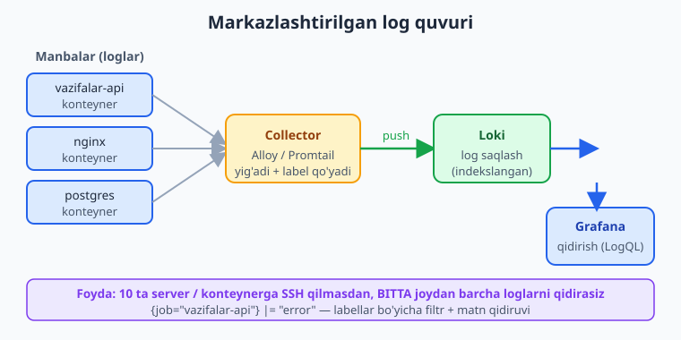
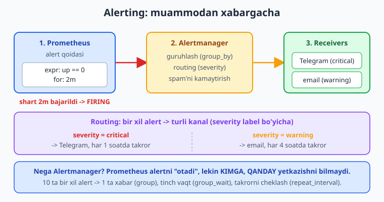

# 26 — Logging, alerting, backup va ishonchlilik

[⬅️ Oldingi: 25 — Monitoring: Prometheus va Grafana](./25-monitoring-prometheus-grafana.md) · [🏠 README](./README.md) · [Keyingi: 27 — Infrastructure as Code: Ansible va Terraform ➡️](./27-iac-ansible-terraform.md)

> **Bu bobda:** 25-bobda metrikani ko'rdik — endi metrika "nimadir buzilganini" ko'rsatadi, lekin *nega* buzilganini **loglar** aytadi, buzilganda *sizni xabardor qilish* esa **alerting** ishi. Avval markazlashtirilgan log nima uchun kerakligini (ko'p server/konteyner -> bitta joydan qidirish) ko'ramiz: `docker logs`, `journald` (19-bobni eslaymiz), log drayverlar, `logrotate` bilan log fayllar disk to'ldirib yubormasligi, strukturali (JSON) log, va Prometheus oilasidagi **Loki + Alloy/Promtail** stek (ELK/EFK bilan qisqa taqqos). So'ng **alerting**: Prometheus alert qoidalari (`alert`/`expr`/`for`/`labels`/`annotations`), **Alertmanager** (routing, grouping, Telegram/email receiver'lar, `amtool`), healthcheck/uptime monitoring (blackbox exporter, UptimeRobot). Keyin **ishonchlilik (SRE)** asoslari — SLI, SLO, SLA, error budget sodda tilda. Oxirida **backup va recovery**: nega kerak, `pg_dump`/`mysqldump`, volume `tar` backup, 3-2-1 qoidasi, retention, off-site, va eng muhimi — **restore'ni sinash** (sinalmagan backup = backup emas); to'liq avtomatik backup + restore skriptini cron bilan yozamiz.

---

## Muammo: metrika "yong'in" deydi, lekin sababini ko'rsatmaydi

25-bobda Grafana dashboard qurdik. Bir kuni grafik qizarib ketdi: 5xx xatolar 0% dan 30% ga sakradi. Ajoyib — *bilasiz*. Lekin endi nima qilasiz?

- **Sababni qayerdan ko'rasiz?** Metrika "30% so'rov yiqilyapti" deydi, lekin *qaysi* endpoint, *qanday* xato — buni faqat **log** aytadi. SSH qilib `docker logs` ko'rasizmi? 5 ta konteynerda? 3 ta serverda? Qaysi birida?
- **Xabarni qanday olasiz?** Grafik tunda qizarsa, siz uxlab yotgan bo'lsangiz — ertalab bilasiz. Sizga **alert** kerak: muammo boshlanganda Telegram'ga xabar kelsin.
- **Eng yomoni — ma'lumot yo'qolsa?** Disk o'ladi, kimdir `DROP TABLE` qiladi, ransomware shifrlaydi. Metrika ham, log ham bu yerda yordam bermaydi — sizga **backup** kerak. Va backup bo'lsa-yu, qaytara olmasangiz — backup ham yo'q.

Bu bob shu uchta og'riqni yopadi: **loglarni bir joyga yig'ish**, **muammoda xabar olish**, **falokatdan tiklanish**. Hammasi 25-bobdagi namuna **vazifalar API** stegi ustiga quriladi.

---

## 1-qism: Logging — loglarni bir joyga yig'ish

### Nega markazlashtirilgan log

Bitta serverda bitta ilova ishlatganda log oddiy: `node app.js` chiqishini ko'rasiz. Lekin production o'sgani sari:

- Ilova **bir nechta konteyner**da (nginx + app + postgres + redis).
- Konteynerlar **bir nechta server**da (yoki Kubernetes Pod'larida — qulasa o'chib, yangisi tug'iladi va eski log yo'qoladi).
- Muammo qaysi birida ekanini oldindan bilmaysiz.

Har biriga alohida SSH qilib `docker logs` qidirish — kechki tushga aylanadi. Yechim — barcha loglarni **bitta markazga** oqizish va u yerdan qidirish:



> 📌 Markazlashtirilgan log = "barcha server/konteyner loglarini bitta joyga yig'ib, bitta interfeysdan qidirish". Foydasi: SSH qilmaysiz, konteyner o'lsa ham logi qoladi, bir nechta xizmat logini birga ko'rib muammoni ulay olasiz (korrelyatsiya).

### Boshlang'ich: `docker logs` va `journald`

Markazga o'tishdan oldin, mavjud loglarni eslaylik. Docker har konteynerning `stdout`/`stderr` ini ushlaydi:

```bash
docker logs vazifalar              # konteyner loglari
docker logs -f vazifalar           # jonli kuzatish (follow)
docker logs --since 1h vazifalar   # oxirgi 1 soat
docker logs --tail 100 vazifalar   # oxirgi 100 qator
```

19-bobda systemd xizmati loglarini `journalctl -u vazifalar -f` bilan ko'rgandik — bu **journald**, systemd'ning markaziy log jamlovchisi. Konteynersiz (systemd) deploy'da loglar shu yerda; Docker'da esa Docker'ning **log drayveri** boshqaradi.

Docker'ning standart log drayveri — `json-file` (har konteyner logini diskka JSON fayl qilib yozadi). Asosiy drayverlar:

| Drayver | Nima qiladi |
|---|---|
| `json-file` | Standart. Diskka JSON fayl (`docker logs` shu yerdan o'qiydi). |
| `local` | `json-file` ga o'xshash, lekin samaraliroq va avto-rotatsiyali. |
| `journald` | Loglarni systemd journal'ga yuboradi (`journalctl` bilan ko'riladi). |

> ⚠️ `json-file` drayveri **standartda log fayllarni cheklamaydi** — uzoq ishlagan konteyner diskni jimgina to'ldirib, serverni o'ldirishi mumkin. Cheklash kerak (pastda).

### Log fayllar disk to'ldirib yubormasligi

Ikki joyda cheklash kerak.

**1) Docker log drayveri darajasida** — har konteyner logiga hajm/fayllar soni chegarasi. `compose.yaml` da:

```yaml
services:
  vazifalar:
    image: ghcr.io/foydalanuvchi/vazifalar-api:latest
    logging:
      driver: json-file
      options:
        max-size: "10m"     # bitta log fayl maksimum 10 MB
        max-file: "3"       # eng ko'pi 3 ta fayl (qolgani o'chadi)
```

Bu — Docker o'zi qiladigan rotatsiya: fayl 10 MB ga yetganda yangisini boshlaydi, 3 tadan oshganda eng eskisini o'chiradi. Disk hech qachon 30 MB dan oshmaydi (shu konteyner uchun).

**2) Oddiy fayl loglar uchun — `logrotate`.** Agar ilovangiz (yoki nginx) bevosita faylga yozsa (masalan `/var/log/vazifalar/app.log`), uni **logrotate** aylantiradi. logrotate — Linux'ning standart vositasi (odatda har kuni cron orqali ishlaydi). Config `/etc/logrotate.d/<nom>` ga qo'yiladi:

```text
/var/log/vazifalar/*.log {
    daily
    rotate 14
    compress
    delaycompress
    missingok
    notifempty
    create 0640 deploy deploy
    sharedscripts
    postrotate
        systemctl reload vazifalar.service > /dev/null 2>&1 || true
    endscript
}
```

Har direktiva nima qiladi:

- **`daily`** — har kuni aylantir (`weekly`/`monthly` ham bor).
- **`rotate 14`** — 14 ta eski nusxani saqla, keyin eng eskisini o'chir (~2 hafta).
- **`compress`** — eski loglarni `.gz` qil (joy tejaydi). `delaycompress` — eng oxirgi aylantirilganini siqishni bir qadam kechiktiradi (ilova hali yozayotgan bo'lsa muammo bo'lmasin).
- **`missingok`** — log fayli yo'q bo'lsa xato berma.
- **`notifempty`** — bo'sh faylni aylantirma.
- **`create 0640 deploy deploy`** — aylantirgandan keyin yangi bo'sh faylni shu ruxsat va egasi bilan yarat.
- **`postrotate ... endscript`** — aylantirgandan keyin ilovaga "yangi faylga yoz" deb signal beradi (`reload`). `sharedscripts` — bir nechta fayl bo'lsa ham skriptni bir marta ishlatadi.

> 💡 logrotate config'ni sinash: `sudo logrotate --debug /etc/logrotate.d/vazifalar` (haqiqatan aylantirmasdan nima qilishini ko'rsatadi). Bu bob uchun bu config'ni Docker ichidagi haqiqiy `logrotate --debug` bilan tekshirdim — `daily`, `rotate 14`, `create 0640 deploy deploy`, `postrotate` to'g'ri parse bo'ldi.

### Strukturali (JSON) log

Oddiy matn log:

```text
2026-06-13 10:21:04 user 42 created task "sut olish"
```

Strukturali (JSON) log:

```json
{"time":"2026-06-13T10:21:04Z","level":"info","msg":"task created","user_id":42,"task":"sut olish"}
```

Farqi: JSON logni **mashina o'qiy oladi** — `user_id=42` bo'yicha filtr, `level=error` bo'yicha qidiruv juda oson bo'ladi. Matn logda buni `grep` + regex bilan azoblanib ajratish kerak. Loki/Elasticsearch kabi tizimlar JSON maydonlaridan avtomatik filtr quradi.

> 📌 Production'da **strukturali log yozing** (har til uchun kutubxona bor: Node — `pino`/`winston`, Python — `structlog`, Go — `slog`). Vaqt, daraja (`level`), xabar (`msg`) va kontekst (`user_id`, `request_id`) ni alohida maydon qiling. Keyin markaziy log tizimida ulardan filtr qilasiz.

### Markaziy stek: Loki + Alloy (Prometheus oilasi)

25-bobda Prometheus + Grafana ni ko'rdik. **Loki** — o'sha oiladan: "loglar uchun Prometheus" deb ataladi. U log **matnini indekslamaydi**, faqat **labellar**ni (`job`, `container`, `level`) indekslaydi — shuning uchun arzon va tez. Komponentlar:

- **Loki** — loglarni saqlovchi va so'rovga javob beruvchi server.
- **Collector** — loglarni manbalardan yig'ib, label qo'shib, Loki'ga **push** qiladi. Hozirgi tavsiya — **Grafana Alloy** (yangi, universal collector); eski nomi **Promtail** (hali ishlaydi, lekin Alloy afzal).
- **Grafana** — Loki'ni ma'lumot manbai sifatida ulab, **LogQL** bilan qidirasiz (PromQL'ning log varianti).

LogQL so'rovi PromQL'ga o'xshaydi — avval label bo'yicha tanlaysiz, keyin filtrlaysiz:

```text
{job="vazifalar-api"} |= "error"
{job="vazifalar-api", level="error"} | json | user_id="42"
```

Birinchisi: `vazifalar-api` loglaridan ichida "error" so'zi borlarini. Ikkinchisi: `level=error` loglarni JSON sifatida ochib, `user_id=42` bo'yicha filtr. Bitta server o'rniga **butun infratuzilma** bo'ylab.

Loki + Alloy + Grafana stegini Compose bilan ko'tarish (25-bobdagi monitoring stegiga qo'shiladi):

```yaml
services:
  loki:
    image: grafana/loki:3.5.0
    command: -config.file=/etc/loki/config.yaml
    ports:
      - "3100:3100"
    volumes:
      - ./loki-config.yaml:/etc/loki/config.yaml:ro
      - loki-data:/loki
    restart: unless-stopped

  alloy:
    image: grafana/alloy:latest
    command:
      - run
      - /etc/alloy/config.alloy
      - --storage.path=/var/lib/alloy/data
    volumes:
      - ./config.alloy:/etc/alloy/config.alloy:ro
      - /var/lib/docker/containers:/var/lib/docker/containers:ro
      - /var/run/docker.sock:/var/run/docker.sock:ro
    depends_on:
      - loki
    restart: unless-stopped

  grafana:
    image: grafana/grafana:latest
    ports:
      - "3000:3000"
    environment:
      - GF_SECURITY_ADMIN_PASSWORD=admin
    volumes:
      - grafana-data:/var/lib/grafana
    depends_on:
      - loki
    restart: unless-stopped

volumes:
  loki-data:
  grafana-data:
```

Alloy `docker.sock` va konteyner loglar papkasini o'qib, har konteyner logini avtomatik yig'adi va Loki'ga push qiladi. Grafana'da Loki'ni manba qilib ulaysiz va LogQL bilan qidirasiz.

> ℹ️ Loki'ni Grafana'da ko'rish, real konteyner loglarini yig'ish va LogQL natijalarini ko'rish — **jonli ish**: bu stekni o'z serveringizda `docker compose up -d` bilan ko'tarib, Grafana > Explore > Loki'da sinab ko'ring. Men bu yerda compose faylni `docker compose config` bilan tekshirdim (sintaksis to'g'ri), lekin jonli log oqimi UI'da sinaladi.

### ELK/EFK bilan qisqa taqqos

Boshqa mashhur stek — **ELK** (Elasticsearch + Logstash + Kibana) yoki **EFK** (Logstash o'rniga Fluentd/Fluent Bit):

| | Loki + Alloy + Grafana | ELK / EFK |
|---|---|---|
| Indekslash | Faqat labellar (yengil, arzon) | To'liq matn (kuchli qidiruv, og'irroq) |
| Resurs | Kam (RAM/disk tejamkor) | Ko'p (Elasticsearch RAM ochko'z) |
| UI | Grafana (metrika bilan birga) | Kibana (boy, lekin alohida) |
| Qachon | Metrika allaqachon Grafana'da bo'lsa, oddiy/o'rta loyiha | To'liq matn bo'yicha murakkab qidiruv, katta hajm |

> 💡 Agar metrikangiz allaqachon Grafana'da bo'lsa (25-bob), **Loki** mantiqan to'g'ri keladi — bitta UI'da metrika va log birga. ELK kuchliroq qidiruv beradi, lekin resurs va boshqaruvi og'irroq. Boshlash uchun Loki.

---

## 2-qism: Alerting — muammoda xabar olish

Loglar bor, metrika bor — lekin ekranga **24/7 qarab o'tirmaysiz**. Muammo boshlanganda tizim *o'zi* xabar bersin. Bu — alerting.



### Prometheus alert qoidalari

25-bobda Prometheus metrikani yig'di. Endi unga **qoida** beramiz: "agar shu PromQL ifoda rost bo'lsa — alert ot". Qoidalar alohida faylda (`alert-rules.yml`):

```yaml
groups:
  - name: vazifalar-api
    rules:
      - alert: InstanceDown
        expr: up == 0
        for: 2m
        labels:
          severity: critical
        annotations:
          summary: "{{ $labels.instance }} ishlamayapti"
          description: "Target 2 daqiqadan beri javob bermayapti."

      - alert: HighErrorRate
        expr: |
          sum(rate(http_requests_total{status=~"5.."}[5m]))
            / sum(rate(http_requests_total[5m])) > 0.05
        for: 5m
        labels:
          severity: warning
        annotations:
          summary: "Yuqori xatolik darajasi (5xx > 5%)"
          description: "Oxirgi 5 daqiqada 5xx javoblar ulushi 5% dan oshdi."

      - alert: DiskAlmostFull
        expr: |
          (node_filesystem_avail_bytes{mountpoint="/"}
            / node_filesystem_size_bytes{mountpoint="/"}) < 0.10
        for: 10m
        labels:
          severity: critical
        annotations:
          summary: "Disk to'lib bormoqda"
          description: "/ bo'limida 10% dan kam bo'sh joy qoldi."
```

Har qoidaning 5 qismi:

- **`alert:`** — alert nomi (`InstanceDown`).
- **`expr:`** — PromQL ifoda. **Rost** (natija qaytsa) bo'lsa — alert "faollashadi". `up == 0` = target javob bermayapti.
- **`for:`** — ifoda **shu muddat davomida** rost bo'lib turishi shart, shundan keyin `firing` bo'ladi. Bu — vaqtinchalik sakrashlardan (flap) kelib chiqadigan soxta alertlarni filtrlaydi. `up == 0` 2 daqiqa davom etsa — haqiqiy muammo.
- **`labels:`** — alertga yorliq qo'shadi (`severity: critical`). Alertmanager shular bo'yicha routing qiladi.
- **`annotations:`** — odam o'qiy oladigan matn (`summary`, `description`). `{{ $labels.instance }}` — alert qaysi target'dan kelganini ko'rsatadi.

Prometheus'ga bu fayl haqida aytamiz (`prometheus.yml`):

```yaml
rule_files:
  - "alert-rules.yml"

alerting:
  alertmanagers:
    - static_configs:
        - targets:
            - "alertmanager:9093"
```

> 📌 `for:` — alertning eng muhim kaliti. `for: 0` (yoki yo'q) = ifoda bir sekund rost bo'lsayoq alert. Bu spam keltiradi. `for: 5m` = "5 daqiqa muammo bo'lib tursa". Haqiqiy muammoni o'tkinchidan ajratadi.

### Alertmanager: routing, grouping, receiver'lar

Prometheus alertni **otadi**, lekin uni **kimga, qanday** yetkazishni bilmaydi. Bu — **Alertmanager** ishi. U uchta katta muammoni hal qiladi:

1. **Grouping (guruhlash)** — 10 ta server bir vaqtda yiqilsa, 10 ta alohida xabar emas, **bitta** guruhlangan xabar.
2. **Routing** — alertni labellari bo'yicha to'g'ri kanalga yo'naltiradi (`critical` -> Telegram, `warning` -> email).
3. **Inhibition / repeat** — takror xabarlarni cheklaydi (`repeat_interval`), bir alert boshqasini bostiradi (kritik bor ekan, ogohlantirishni yubormaydi).

`alertmanager.yml`:

```yaml
global:
  resolve_timeout: 5m

route:
  receiver: telegram-default
  group_by: ["alertname", "job"]
  group_wait: 30s
  group_interval: 5m
  repeat_interval: 4h
  routes:
    - matchers:
        - severity = critical
      receiver: telegram-critical
      repeat_interval: 1h

receivers:
  - name: telegram-default
    telegram_configs:
      - bot_token: "123456:REPLACE_WITH_TOKEN"
        chat_id: -1001234567890
        send_resolved: true

  - name: telegram-critical
    telegram_configs:
      - bot_token: "123456:REPLACE_WITH_TOKEN"
        chat_id: -1001234567890
        send_resolved: true
        message: "CRITICAL: {{ .CommonAnnotations.summary }}"

inhibit_rules:
  - source_matchers:
      - severity = critical
    target_matchers:
      - severity = warning
    equal: ["alertname", "instance"]
```

Asosiy kalitlar:

- **`route`** — alertlar daraxti. Yuqorida — standart yo'nalish; `routes:` ichida maxsus shartlar.
- **`group_by`** — qaysi labellar bir xil bo'lsa, bir guruhga qo'shsin (`alertname` + `job`).
- **`group_wait`** — birinchi xabardan oldin biroz kutadi (30s), shu vaqtda kelgan o'xshash alertlarni birga yuboradi.
- **`repeat_interval`** — hal bo'lmagan alert qancha vaqtda bir takror eslatiladi (standart 4h, kritiklar 1h).
- **`matchers`** — qaysi alertlar shu yo'nalishga tushadi (`severity = critical`).
- **`receivers`** — qayerga yuborish. Bu yerda **Telegram**; email/Slack uchun `email_configs`/`slack_configs` bor.

Telegram bot tokenini [@BotFather](https://t.me/BotFather) dan, `chat_id` ni bot orqali olasiz (guruh uchun `-100...` bilan boshlanadi).

> ⚠️ `bot_token` — maxfiy. Uni git'ga **qo'ymang**. Production'da Docker secret yoki muhit o'zgaruvchisi orqali bering. Yuqoridagi `REPLACE_WITH_TOKEN` — namuna o'rni.

### `amtool` bilan tekshirish

Alertmanager bilan keladigan `amtool` config'ni va alertlarni tekshiradi:

```bash
# Config to'g'riligini tekshirish (deploy'dan oldin SHART)
amtool check-config alertmanager.yml

# Alert qaysi receiver'ga ketishini test qilish (haqiqatan yubormay)
amtool config routes test --config.file=alertmanager.yml severity=critical
```

> 💡 Bu bobdagi `alertmanager.yml` ni haqiqiy `amtool check-config` bilan tekshirdim: SUCCESS — global config, route, 1 inhibit rule, 2 receiver topildi. `alert-rules.yml` ni esa `promtool check rules` bilan: SUCCESS, 3 rule. Deploy'dan oldin doim shu ikki buyruqni ishlating.

### Healthcheck va uptime monitoring

Yuqoridagi alertlar **server ichidan** keladi (Prometheus serveringizda). Lekin agar **butun server yoki tarmoq** o'lsa? Prometheus ham o'lgan bo'ladi — sizga xabar yetmaydi. Shuning uchun ikki qatlam kerak:

- **Blackbox exporter** (ichkaridan, lekin tashqaridan qaragandek) — saytingizga HTTP so'rov yuborib, javob beradimi, sertifikat amal qiladimi tekshiradi. Prometheus uni "scrape" qiladi:

```yaml
scrape_configs:
  - job_name: "blackbox-http"
    metrics_path: /probe
    params:
      module: [http_2xx]
    static_configs:
      - targets:
          - "https://vazifalar.example.uz"
    relabel_configs:
      - source_labels: [__address__]
        target_label: __param_target
      - source_labels: [__param_target]
        target_label: instance
      - target_label: __address__
        replacement: "blackbox-exporter:9115"
```

- **Tashqi uptime (UptimeRobot va boshqalar)** — butunlay **boshqa joydan** (boshqa data-markaz) saytingizni tekshiradi. Server bilan birga sizning Prometheus'ingiz ham o'lsa, tashqi xizmat baribir SMS/email yuboradi. Bu — eng oddiy, lekin eng ishonchli "sayt ko'rinadimi?" tekshiruvi.

> 📌 Qoida: **o'zingizni o'zingiz kuzata olmaysiz**. Kamida bitta tashqi uptime monitor qo'ying (UptimeRobot bepul tarif beradi) — server butunlay o'lsa, ichki Prometheus emas, faqat shu sizni ogohlantiradi.

---

## 3-qism: Ishonchlilik (SRE) asoslari — SLI, SLO, SLA, error budget

Alert qachon kerak? "100% ishlamasa" desangiz — mukammallik mumkin emas, har chiqindan alert kelaveradi. Buni o'lchashning aniq tili bor — Google ixtiro qilgan **SRE** (Site Reliability Engineering) atamalari. Kirish darajasida:

- **SLI (Service Level Indicator)** — *o'lchov*. "So'rovlarning necha foizi muvaffaqiyatli (2xx/3xx)?" yoki "javob vaqti 300ms dan kammi?". Bu — 25-bobdagi metrikadan kelib chiqadigan **raqam**.
- **SLO (Service Level Objective)** — *maqsad*. "So'rovlarning **99.9%** muvaffaqiyatli bo'lsin (oyiga)." Ichki maqsad, jamoa o'ziga qo'yadi.
- **SLA (Service Level Agreement)** — *shartnoma*. Mijoz bilan rasmiy kelishuv: "99.9% bo'lmasa, pul qaytaramiz." SLA odatda SLO dan biroz **bo'shroq** (xavfsizlik chegarasi).
- **Error budget** — *xato byudjeti*. 99.9% SLO = oyiga **0.1%** "uzilishga ruxsat". Bu — taxminan **43 daqiqa/oy**. Mana shu — sizning "byudjetingiz".

Error budget'ning kuchi — u **qaror beradi**:

- Byudjet hali to'lmagan (43 daqiqadan kam uzildi) -> jasur bo'l, yangi feature deploy qil, tajriba qil.
- Byudjet tugadi (oy oxirigacha 43 daqiqa o'tib ketdi) -> **to'xta**, faqat barqarorlik ustida ishla, riskli deploy qilma.

| SLO | Yiliga ruxsat etilgan uzilish | Oyiga taxminan |
|---|---|---|
| 99% ("ikki to'qqiz") | ~3.65 kun | ~7 soat |
| 99.9% ("uch to'qqiz") | ~8.76 soat | ~43 daqiqa |
| 99.99% ("to'rt to'qqiz") | ~52.6 daqiqa | ~4.3 daqiqa |

> 💡 Boshlang'ich loyiha uchun **99.9%** real maqsad. **100% maqsad qilmang** — har qo'shimcha "to'qqiz" eksponensial qimmat va deyarli imkonsiz. Error budget falsafasi: "biroz uzilishga ruxsat bor, uni aqlli sarflang". Alertni SLO atrofida sozlang — har minutlik chiqindan emas, byudjetni jiddiy yeyayotgan muammodan ogohlantirsin.

---

## 4-qism: Backup va recovery — falokatdan tiklanish

Eng oxirgi himoya qatlami. Metrika va log "nimadir buzildi" deganda yordam beradi; backup esa "ma'lumot **yo'qoldi**" deganda — yagona umid.

### Nega backup

- **DB buzilishi** — disk xatosi, kutilmagan o'chish paytida baza shikastlanadi.
- **Inson xatosi** — kimdir `DROP TABLE users;` yoki `DELETE` ni `WHERE` siz ishlatadi (eng ko'p uchraydigan sabab!).
- **Ransomware / hujum** — disk shifrlanadi, to'lov so'raladi.
- **Disk o'limi** — apparat shunchaki o'ladi.
- **Noto'g'ri deploy** — migratsiya ma'lumotni buzadi.


### DB backup: `pg_dump` / `mysqldump`

PostgreSQL uchun `pg_dump`, MySQL/MariaDB uchun `mysqldump` — bazani **bitta matn (SQL) fayl**ga "to'kadi". Bu fayldan keyin bazani to'liq qayta tiklash mumkin:

```bash
# PostgreSQL: bazani siqilgan SQL faylga olish
pg_dump -U vazifalar vazifalar | gzip > backup.sql.gz

# MySQL/MariaDB ekvivalenti
mysqldump -u vazifalar -p vazifalar | gzip > backup.sql.gz
```

`| gzip` — chiqishni darhol siqadi (SQL matn yaxshi siqiladi, ko'pincha 5-10 barobar).

### Volume backup: `tar`

Foydalanuvchi yuklagan fayllar (rasmlar, hujjatlar) bazada emas, **volume**da (10-bob). Ularni `tar` bilan arxivlaysiz:

```bash
tar -czf files.tar.gz -C /opt/vazifalar-api/uploads .
```

`-c` yarat, `-z` gzip bilan siq, `-f` fayl nomi, `-C <dir> .` — shu papka ichidagini arxivla.

### 3-2-1 qoidasi va retention

Backup faylni **server ichida** qoldirish yetarli emas — server o'lsa, backup ham o'ladi. Sanoat standarti — **3-2-1 qoidasi**:

- **3** nusxa (asl + 2 backup),
- **2** xil saqlash turida/joyida,
- **1** nusxa **off-site** (boshqa shahar/data-markaz yoki bulut — S3, Cloudflare R2, `rclone` bilan).

**Retention** — eski backup'larni avtomatik o'chirish (yo'qsa disk to'ladi). "Oxirgi 14 kunlik kunlik backup'larni saqla" odatiy.

> 📌 3-2-1 qoidasini soddalashtiring: **kamida bitta nusxa boshqa joyda** bo'lsin. Hammasi bitta serverda bo'lsa — server o'chsa, hammasi ketadi. `rclone` bilan kuniga bir marta bulut saqlashga nusxa ko'chirish — eng oson off-site yo'l.

### Eng muhimi: RESTORE'ni sinash

> ⚠️ **Sinalmagan backup — backup emas.** Eng ko'p uchraydigan falokat: yillab backup olinadi, falokat kuni ma'lum bo'ladi-ki, backup buzuq edi / bo'sh edi / qaytarib bo'lmaydi. Backup olishning yagona maqsadi — *qaytara olish*. Buni **isbotlamaguningizcha** backup'ingiz bor deb hisoblamang.

Restore — backup'ning teskarisi:

```bash
# PostgreSQL: siqilgan backup'dan bazani tiklash
gunzip -c backup.sql.gz | psql -U vazifalar vazifalar

# Volume'ni tiklash
tar -xzf files.tar.gz -C /opt/vazifalar-api/uploads
```

Doimo **test bazaga** restore qilib sinang (ishlab turgan production'ga emas!): backup ochiladimi, jadvallar to'g'rimi, qatorlar soni mantiqiymi. Buni oyiga bir marta jadvalga qo'ying.

> 💡 Bu bobdagi backup/restore mantig'ini haqiqatan sinab ko'rdim: `tar` bilan sanali arxiv yaratish, `find -mtime +14 -delete` bilan eski'larni o'chirish (14 kundan eski fayl o'chdi, yangisi qoldi), va `gzip | ... | gunzip` round-trip (siqildi, to'liq qaytarildi) — hammasi lokal bash'da ishladi. `pg_dump`/`psql` real bazani talab qiladi (illustrativ), lekin tar/find/gzip mantig'i tekshirilgan.

### To'liq avtomatik backup skripti

Hammasini birlashtiramiz — kuniga bir marta cron ishlatadigan skript: DB backup + volume backup + sanali nom + eski'larni tozalash.

```bash
#!/usr/bin/env bash
# backup.sh — vazifalar-api uchun kunlik DB + volume backup
set -euo pipefail

# --- Sozlamalar ---
BACKUP_DIR="/var/backups/vazifalar"
DB_NAME="vazifalar"
DB_USER="vazifalar"
DATA_DIR="/opt/vazifalar-api/uploads"   # foydalanuvchi yuklagan fayllar (volume)
RETENTION_DAYS=14                        # 14 kundan eski backup'lar o'chiriladi
STAMP="$(date +%Y-%m-%d_%H%M%S)"         # masalan 2026-06-13_032001

mkdir -p "$BACKUP_DIR"

# --- 1) PostgreSQL backup (pg_dump, siqilgan) ---
DB_FILE="$BACKUP_DIR/db_${DB_NAME}_${STAMP}.sql.gz"
pg_dump -U "$DB_USER" "$DB_NAME" | gzip > "$DB_FILE"
echo "DB backup: $DB_FILE"

# --- 2) Volume (yuklamalar) backup (tar) ---
FILES_FILE="$BACKUP_DIR/files_${STAMP}.tar.gz"
tar -czf "$FILES_FILE" -C "$DATA_DIR" .
echo "Fayllar backup: $FILES_FILE"

# --- 3) Eski backup'larni tozalash (retention) ---
find "$BACKUP_DIR" -name 'db_*.sql.gz' -mtime "+${RETENTION_DAYS}" -delete
find "$BACKUP_DIR" -name 'files_*.tar.gz' -mtime "+${RETENTION_DAYS}" -delete
echo "Tozalandi: ${RETENTION_DAYS} kundan eski backup'lar o'chirildi"

# --- 4) (Tavsiya) off-site nusxa: 3-2-1 qoidasi ---
# rclone copy "$DB_FILE" "$FILES_FILE" remote:vazifalar-backups/
echo "Backup tugadi: $STAMP"
```

Cron bilan har kuni 03:00 da (3-bobni eslang):

```bash
# crontab -e
0 3 * * * /usr/local/bin/backup.sh >> /var/log/vazifalar-backup.log 2>&1
```

Yoki 19-bobdagidek **systemd timer** bilan (loglar `journalctl` da, o'tkazib yuborilgan ishni `Persistent=true` qoplaydi).

Mos restore skripti:

```bash
#!/usr/bin/env bash
# restore.sh — backup faylidan DB ni tiklash
set -euo pipefail

if [ $# -ne 1 ]; then
  echo "Foydalanish: $0 <db_backup_file.sql.gz>"
  exit 1
fi

DB_FILE="$1"
DB_NAME="vazifalar"
DB_USER="vazifalar"

if [ ! -f "$DB_FILE" ]; then
  echo "Xato: fayl topilmadi: $DB_FILE"
  exit 1
fi

echo "DIQQAT: '$DB_NAME' bazasi $DB_FILE dan tiklanadi (mavjud ma'lumot almashtiriladi)."
gunzip -c "$DB_FILE" | psql -U "$DB_USER" "$DB_NAME"
echo "Restore tugadi: $DB_FILE -> $DB_NAME"
```

> 📌 `set -euo pipefail` — har backup skriptida bo'lsin (3-bob): xatoda darhol to'xta (`-e`), e'lon qilinmagan o'zgaruvchida xato (`-u`), quvur (`|`) o'rtasidagi xato ham aniqlansin (`pipefail`). `pg_dump` yiqilsa, skript "muvaffaqiyat" deb yolg'on aytmasligi uchun muhim.

> ℹ️ `pg_dump`/`psql` qatorlari **haqiqiy bazani** talab qiladi — ularni o'z serveringizda ishlating. Skriptlarning tar/find/gzip/sana mantig'i va sintaksisi (`bash -n` + haqiqiy ishga tushirish) bu bobda tekshirilgan.

---

## Yakun

Monitoringni to'liq qildik: 25-bobda **metrika** ("nimadir buzildi"), bu bobda **log** ("nega buzildi"), **alert** ("buzilganda xabar ber"), va **backup** ("yo'qolsa qaytar"). Markazlashtirilgan logni (Loki + Alloy + Grafana) ko'rdik, `logrotate` va Docker log limitlari bilan diskni himoya qildik, strukturali JSON log yozishni o'rgandik. Alerting'da Prometheus qoidalari (`expr`/`for`/`labels`/`annotations`) va Alertmanager (routing, grouping, Telegram receiver, `amtool`), tashqi uptime monitoring; SRE tilida SLI/SLO/SLA/error budget; va to'liq avtomatik backup + restore skripti — eng muhim qoida bilan: **restore'ni sinamaguningizcha backup'ingizga ishonmang**.

Tizimingiz endi nafaqat ishlaydi, balki *ishonchli*: kuzatiladi, ogohlantiradi va falokatdan tiklanadi. Keyingi **27-bobda** butun shu infratuzilmani — serverlar, paketlar, config'lar — qo'lda emas, **kod** sifatida boshqarishni o'rganamiz: **Infrastructure as Code** (Ansible va Terraform).

---

## 26-bob mashqlari

### Oson

1. Markazlashtirilgan log nima va nega bir nechta server/konteynerda kerak? Bir-ikki jumlada ayting.
2. `docker logs -f --tail 50 vazifalar` buyrug'idagi `-f` va `--tail 50` nima qiladi?
3. `json-file` Docker log drayverining standart holatda qanday xavfi bor? Uni qanday cheklash mumkin (`compose.yaml` da ikki opsiya)?
4. Oddiy matn log va strukturali (JSON) log orasidagi farq nima? JSON logning bitta amaliy afzalligini ayting.
5. SLI, SLO va SLA atamalarini bittadan jumlada izohlang. Qaysi biri mijoz bilan rasmiy shartnoma?

### O'rta

6. Prometheus alert qoidasidagi `for: 5m` nima vazifa bajaradi? Agar uni olib tashlasangiz qanday muammo paydo bo'ladi?
7. Alertmanager nima uchun kerak — Prometheus o'zi xabar yubora olmaydimi? `grouping` va `routing` ni bittadan jumlada tushuntiring.
8. 99.9% SLO oyiga taxminan qancha uzilishga "ruxsat" beradi? Error budget tugaganda jamoa nima qilishi kerak?
9. 3-2-1 backup qoidasini tushuntiring. Nega faqat serverning o'zida backup saqlash xavfli?
10. "Sinalmagan backup — backup emas" iborasi nimani anglatadi? Restore'ni qayerda sinash kerak (production'dami?) va nega?

### Qiyin

11. `up == 0` shartini 3 daqiqa davom etganda `critical` darajali, `{{ $labels.job }}` ni `summary` da ko'rsatadigan `JobDown` nomli Prometheus alert qoidasini yozing (`alert-rules.yml` formatida). `for` va `labels`/`annotations` ni to'g'ri qo'ying.
12. `severity = critical` alertlarni Telegram'ga, qolganlarini email'ga yo'naltiradigan minimal `alertmanager.yml` yozing: `route` da `group_by`, ikkita receiver (`telegram-critical`, `email-default`), va kritiklar uchun maxsus `routes` yozuvi bilan. Config'ni qaysi buyruq bilan tekshirasiz?
13. Kunlik backup skripti yozing: PostgreSQL `mybaza` bazasini `pg_dump | gzip` bilan `/var/backups` ga **sanali nom** (`db_YYYY-MM-DD.sql.gz`) bilan olsin, `/opt/app/data` papkasini `tar` qilsin, va **7 kundan** eski `db_*.sql.gz` fayllarni o'chirsin. `set -euo pipefail` ishlating. So'ng buni har kuni 02:00 da ishlatadigan crontab qatorini yozing.

<details markdown="1"><summary>Yechim — 11</summary>

```yaml
groups:
  - name: vazifalar-api
    rules:
      - alert: JobDown
        expr: up == 0
        for: 3m
        labels:
          severity: critical
        annotations:
          summary: "{{ $labels.job }} ishlamayapti"
          description: "{{ $labels.job }} ({{ $labels.instance }}) 3 daqiqadan beri javob bermayapti."
```

`expr: up == 0` — target javob bermasa rost bo'ladi. `for: 3m` — shart 3 daqiqa davom etsa `firing` (o'tkinchi chiqindan filtr). `severity: critical` — Alertmanager shu label bo'yicha Telegram'ga yo'naltiradi. `{{ $labels.job }}` — alert qaysi job'dan kelganini xabarga qo'yadi. Tekshirish: `promtool check rules alert-rules.yml`.
</details>

<details markdown="1"><summary>Yechim — 12</summary>

```yaml
route:
  receiver: email-default
  group_by: ["alertname", "job"]
  group_wait: 30s
  group_interval: 5m
  repeat_interval: 4h
  routes:
    - matchers:
        - severity = critical
      receiver: telegram-critical
      repeat_interval: 1h

receivers:
  - name: email-default
    email_configs:
      - to: "jamoa@example.uz"
        from: "alert@example.uz"
        smarthost: "smtp.example.uz:587"
        auth_username: "alert@example.uz"
        auth_password: "REPLACE_WITH_PASSWORD"

  - name: telegram-critical
    telegram_configs:
      - bot_token: "123456:REPLACE_WITH_TOKEN"
        chat_id: -1001234567890
        send_resolved: true
```

Standart `receiver` — `email-default` (hamma narsa email'ga). `routes` ichidagi `matchers: severity = critical` — faqat kritiklarni `telegram-critical` ga yo'naltiradi (va tezroq, har 1 soatda takror). `group_by` o'xshash alertlarni bitta xabarga jamlaydi. Tekshirish: `amtool check-config alertmanager.yml`, marshrutni sinash: `amtool config routes test --config.file=alertmanager.yml severity=critical`.
</details>

<details markdown="1"><summary>Yechim — 13</summary>

```bash
#!/usr/bin/env bash
# backup.sh — mybaza uchun kunlik backup
set -euo pipefail

BACKUP_DIR="/var/backups"
DB_NAME="mybaza"
DB_USER="mybaza"
DATA_DIR="/opt/app/data"
RETENTION_DAYS=7
STAMP="$(date +%Y-%m-%d)"

mkdir -p "$BACKUP_DIR"

# DB backup (sanali nom)
pg_dump -U "$DB_USER" "$DB_NAME" | gzip > "$BACKUP_DIR/db_${STAMP}.sql.gz"

# Volume backup
tar -czf "$BACKUP_DIR/files_${STAMP}.tar.gz" -C "$DATA_DIR" .

# 7 kundan eski DB backup'larni o'chir
find "$BACKUP_DIR" -name 'db_*.sql.gz' -mtime +7 -delete

echo "Backup tugadi: $STAMP"
```

Crontab (har kuni 02:00):

```bash
0 2 * * * /usr/local/bin/backup.sh >> /var/log/backup.log 2>&1
```

`STAMP="$(date +%Y-%m-%d)"` sanali nom beradi (`db_2026-06-13.sql.gz`). `pg_dump | gzip` bazani siqilgan SQL faylga to'kadi. `tar -czf ... -C "$DATA_DIR" .` papkani arxivlaydi. `find ... -mtime +7 -delete` 7 kundan eski DB backup'larni o'chirib retention'ni ta'minlaydi. `set -euo pipefail` — `pg_dump` yiqilsa skript yolg'on "muvaffaqiyat" demaydi. Crontab'da `>> ... 2>&1` chiqish va xatolarni log faylga yozadi.
</details>

---

[⬅️ Oldingi: 25 — Monitoring: Prometheus va Grafana](./25-monitoring-prometheus-grafana.md) · [🏠 README](./README.md) · [Keyingi: 27 — Infrastructure as Code: Ansible va Terraform ➡️](./27-iac-ansible-terraform.md)
