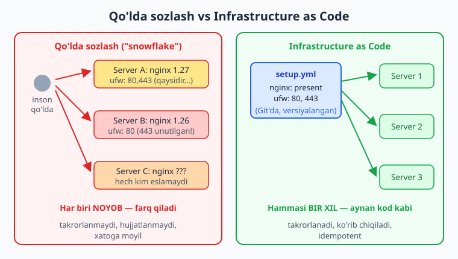
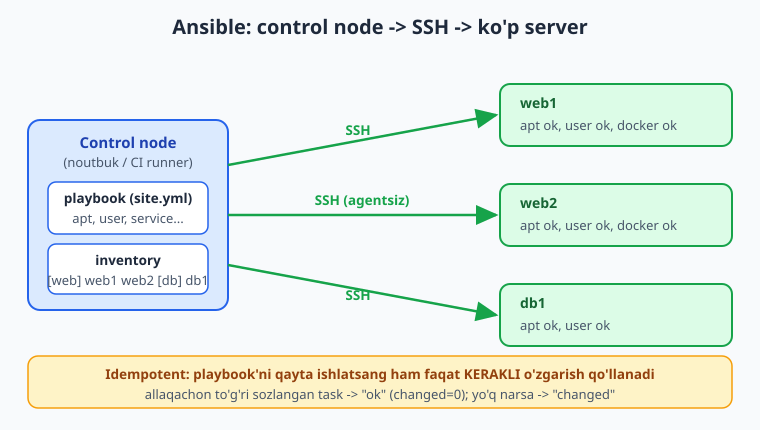
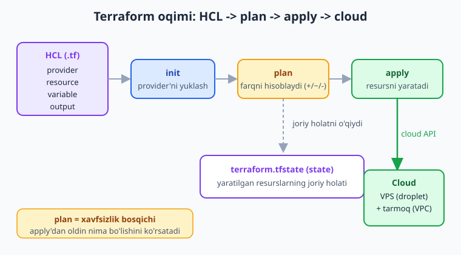

# 27 — Infrastructure as Code: Ansible va Terraform

[⬅️ Oldingi: 26 — Logging, alerting, backup va ishonchlilik](./26-logging-alerting-backup.md) · [🏠 README](./README.md) · [Keyingi: 28 — Yakuniy kapston: to'liq DevOps platforma ➡️](./28-kapston.md)

> **Bu bobda:** 04-bobda serverni QO'LDA — `apt install`, `ufw`, foydalanuvchi yaratish, Docker o'rnatish — sozlagandik. Bu yondashuvning eng katta og'rig'ini hal qilamiz: qo'lda sozlangan server **takrorlanmaydi, hujjatlanmaydi va xatoga moyil** ("snowflake server" — qaytarib bo'lmaydigan, noyob server). Yechim — **Infrastructure as Code (IaC)**: infratuzilmani **kod sifatida** yozish (versiyalanadi, ko'rib chiqiladi, takrorlanadi). IaC tamoyillarini ko'ramiz: **deklarativ vs imperativ**, **idempotentlik** (bir necha marta ishlatsa ham bir xil natija) va **immutable infrastructure**. Ikki asosiy vositani o'rganamiz: **Ansible** — mavjud serverni sozlash uchun (configuration management, agentsiz, SSH orqali, `inventory` + `playbook` + `ansible.builtin.*` modullar, idempotent), va **Terraform** — cloud resurslarini yaratish uchun (provisioning, HCL til, `provider`/`resource`/`variable`/`output`, `init`/`plan`/`apply`, **state** fayl). Misol sifatida 04/06-boblarning qo'lda ishini Ansible playbook'ga, cloud VPS yaratishni Terraform'ga ko'chiramiz, va nihoyat Ansible vs Terraform farqini (sozlash vs yaratish — ko'pincha **birga** ishlatiladi) aniqlaymiz.

---

## Muammo: "snowflake server" — qaytarib bo'lmaydigan server

04-bobda VPS serverni qo'lda sozlagandik. Esda tutsangiz, qadamlar shunaqa edi:

```bash
sudo apt update && sudo apt upgrade -y
sudo adduser deploy
sudo ufw allow OpenSSH && sudo ufw allow 80 && sudo ufw allow 443 && sudo ufw enable
sudo apt install -y fail2ban
# ... Docker o'rnatish, SSH kalit, va hokazo
```

Ishladi. Lekin oradan olti oy o'tdi va endi sizga **ikkinchi server** kerak bo'ldi (trafik o'sdi, yoki staging muhit qurmoqchisiz). Savol: o'sha birinchi serverni **aniq qanday** sozlagan edingiz?

- `ufw` da qaysi portlarni ochdingiz? `fail2ban` ning qaysi sozlamasini o'zgartirdingiz?
- `deploy` foydalanuvchiga qaysi guruhlarni qo'shdingiz? Docker'ning aynan qaysi versiyasini o'rnatdingiz?
- Kechasi soat ikkida bir komandani "tezda" terib qo'ygandingiz — u qayerda hujjatlangan? Hech qayerda.

Bu — **snowflake server** muammosi: har bir qor parchasi noyob bo'lgani kabi, qo'lda sozlangan server ham noyob — uni aynan takrorlab bo'lmaydi. Uchta jiddiy oqibati bor:

- **Takrorlanmaydi.** Ikkinchi bir xil serverni yaratish — yana bir necha soatlik qo'l mehnati, va natija hech qachon aynan bir xil chiqmaydi.
- **Hujjatlanmaydi.** "Bu serverda nima sozlangan?" degan savolga javob — faqat sizning xotirangizda (yoki uni boshqargan odam ishdan ketgan).
- **Xatoga moyil.** Qo'lda terilgan har bir buyruq — xato qilish imkoni. Bir serverda `--no-install-recommends` qo'ydingiz, ikkinchisida unutdingiz — endi ular bir-biridan farq qiladi ("configuration drift", sozlama siljishi).

> ⚠️ Snowflake serverning eng yomon ko'rinishi: server qulab tushdi (disk yondi, provayder o'chirdi) va sizda uni **aynan qayta tiklash** uchun hech narsa yo'q. Bu — 05-bobda sanagan **oltinchi og'riq**: "qayta tiklash butunlay qo'lda".

Yechim — infratuzilmani xotirangizda yoki qo'lingizda emas, **kodda** saqlash.

---

## Infrastructure as Code nima

**Infrastructure as Code (IaC)** — infratuzilmani (serverlar, tarmoq, sozlamalar) **deklarativ matn fayllar** orqali, xuddi dastur kodi kabi tasvirlash va boshqarish amaliyoti. Bu fayllar oddiy ilova kodi bilan bir qatorda Git'da yashaydi.

Oddiy o'xshatish: qo'lda sozlash — bu oshpaz taom pishirib, retseptni hech qayerga yozmasligi (faqat boshida bor). IaC esa — **yozma retsept**: kim bo'lsa ham, qaytadan o'sha taomni aynan pishira oladi.



IaC quyidagilarni beradi:

- **Versiyalanadi.** Sozlama Git'da — kim, qachon, nimani o'zgartirgani `git log` da ko'rinadi. Xato bo'lsa — `git revert`.
- **Ko'rib chiqiladi.** Infratuzilma o'zgarishi ham Pull Request orqali ko'rib chiqiladi (12-bobdagi CI/CD jarayoni kabi).
- **Takrorlanadi.** Bitta kod fayli bir, o'n yoki yuz serverni bir xil holatga keltiradi.
- **Hujjat o'zining o'zi.** Kod — eng aniq hujjat: "bu serverda nima bor?" degan savolga javob faylning o'zida.

### Uchta asosiy tamoyil

**1. Deklarativ vs imperativ.** Bu — IaC ni tushunishning kaliti.

- **Imperativ** ("buyruqli") — *qanday* qilishni qadam-baqadam aytasiz: "apt update qil, keyin nginx o'rnat, keyin uni yoq". Bash skript — imperativ. Muammo: skriptni ikkinchi marta ishlatsangiz nima bo'ladi? Nginx allaqachon o'rnatilgan bo'lsa-chi?
- **Deklarativ** ("e'lon qiluvchi") — *qanday natija* kerakligini aytasiz: "bu serverda nginx **o'rnatilgan** va **ishlab turgan** bo'lsin". Vositaning o'zi joriy holatni tekshiradi: agar nginx allaqachon bor bo'lsa — hech narsa qilmaydi; yo'q bo'lsa — o'rnatadi. Ansible va Terraform asosan deklarativ.

**2. Idempotentlik.** Bu — IaC ning eng muhim xossasi. **Idempotent** amal — uni bir marta ham, o'n marta ham ishlatsangiz, natija bir xil bo'ladi.

```text
Imperativ (idempotent EMAS):       Deklarativ (idempotent):
"foydalanuvchi qo'sh"              "bu foydalanuvchi MAVJUD bo'lsin"
1-marta: qo'shildi  ✅             1-marta: yo'q edi -> yaratildi  ✅
2-marta: "allaqachon bor" XATO ❌  2-marta: bor edi -> o'zgarish yo'q ✅
```

Idempotentlik sababli IaC kodini xotirjam qayta-qayta ishlatasiz: faqat **kerakli o'zgarishlar** qo'llaniladi, qolgani teginilmaydi.

**3. Immutable infrastructure** (o'zgarmas infratuzilma). An'anaviy yondashuvda serverni **joyida o'zgartirasiz** (mutable): yangilash kerak bo'lsa, eski serverga kirib yangilaysiz — vaqt o'tib u "snowflake" ga aylanadi. Immutable yondashuvda esa serverni **hech qachon o'zgartirmaysiz**: yangi versiya kerak bo'lsa, **butunlay yangi server** yaratasiz va eskisini o'chirasiz. Docker image aynan shu g'oya (06-bob): konteynerni "tahrir qilmaysiz" — yangi image qurib, qaytadan ishga tushirasiz.

> 📌 IaC ikki vazifani bajaradi va shunga ko'ra ikki sinf vosita bor. **Provisioning** — resurslarni *yaratish* (server, tarmoq, disk cloud'da). Buni **Terraform** qiladi. **Configuration management** — mavjud serverni *sozlash* (paket o'rnatish, foydalanuvchi, fayl). Buni **Ansible** qiladi. Ko'pincha ular birga ishlatiladi: Terraform serverni yaratadi, Ansible uni sozlaydi.

---

## Ansible: mavjud serverni sozlash

**Ansible** — configuration management vositasi: mavjud serverlarga **SSH orqali** ulanib, ularni kerakli holatga keltiradi (paket o'rnatadi, fayl ko'chiradi, xizmat yoqadi). 04 va 06-bobdagi qo'l ishini aynan shu avtomatlashtiradi.

Ansible ning ikki katta afzalligi:

- **Agentsiz (agentless).** Boshqariladigan serverga hech narsa o'rnatmaysiz — Ansible oddiy **SSH** va Python orqali ishlaydi (server'da Python bo'lsa kifoya, u esa Linux'da deyarli har doim bor). Bu — uni o'rnatish va boshlashni juda osonlashtiradi.
- **Deklarativ va idempotent.** Siz "qanday natija kerak"ni yozasiz; Ansible joriy holatni tekshirib, faqat kerakli o'zgarishni qo'llaydi.

Ansible uch tushunchadan iborat: siz turgan **control node** (boshqaruvchi mashina — sizning noutbukingiz yoki CI runner), boshqariladigan **inventory** (hostlar ro'yxati) va bajariladigan **playbook** (YAML'da yozilgan ish rejasi).



### Inventory: qaysi serverlar

**Inventory** — Ansible boshqaradigan hostlar ro'yxati. Eng sodda ko'rinishi — INI yoki YAML fayl. Hostlarni mantiqiy guruhlarga bo'lasiz:

```ini
# inventory.ini
[web]
web1 ansible_host=203.0.113.10
web2 ansible_host=203.0.113.11

[db]
db1 ansible_host=203.0.113.20

[all:vars]
ansible_user=deploy
ansible_ssh_private_key_file=~/.ssh/id_ed25519
```

Bu yerda `web` guruhida ikki server, `db` da bitta. `[all:vars]` — barcha hostlarga umumiy o'zgaruvchilar: qaysi foydalanuvchi bilan SSH qilish (`deploy` — 04-bobda yaratganimiz) va qaysi kalit bilan (04-bobdagi SSH kalit). IP'lar bu yerda hujjat uchun ajratilgan namuna diapazondan (`203.0.113.x`) — siz o'z server IP'laringizni yozasiz.

Ulanishni tekshirish uchun Ansible'ning `ping` moduli bor (bu ICMP ping emas — SSH + Python ishlashini tekshiradi):

```bash
ansible -i inventory.ini all -m ansible.builtin.ping
```

```text
web1 | SUCCESS => {"changed": false, "ping": "pong"}
web2 | SUCCESS => {"changed": false, "ping": "pong"}
db1  | SUCCESS => {"changed": false, "ping": "pong"}
```

> ℹ️ Bu buyruq **haqiqiy serverlar**ga SSH qiladi, shuning uchun chiqishi illustrativ — o'z serveringizda ishga tushirsangiz shunday natija kutiladi. `changed: false` — idempotentlikning belgisi: ping hech narsani o'zgartirmaydi.

### Playbook: nima qilinadi

**Playbook** — YAML fayl bo'lib, qaysi hostlarda qaysi **task**larni (vazifalarni) bajarishni e'lon qiladi. Har bir task bitta **modul**ni chaqiradi. Modullar `ansible.builtin.*` nom maydonida (namespace) keladi — masalan `ansible.builtin.apt` (paket), `ansible.builtin.copy` (fayl), `ansible.builtin.service` (xizmat), `ansible.builtin.user` (foydalanuvchi).

04-bobning server hardening + Docker o'rnatish ishini playbook'ga ko'chiramiz:

```yaml
# site.yml
- name: Serverni sozlash (hardening + Docker)
  hosts: web
  become: true
  tasks:
    - name: Paket ro'yxatini yangilash va tizimni yangilash
      ansible.builtin.apt:
        update_cache: true
        upgrade: dist

    - name: Kerakli paketlarni o'rnatish
      ansible.builtin.apt:
        name:
          - ufw
          - fail2ban
          - ca-certificates
          - curl
        state: present

    - name: deploy foydalanuvchisini yaratish
      ansible.builtin.user:
        name: deploy
        groups: sudo
        shell: /bin/bash
        state: present

    - name: SSH (OpenSSH) portiga ruxsat
      community.general.ufw:
        rule: allow
        name: OpenSSH

    - name: HTTP va HTTPS portlariga ruxsat
      community.general.ufw:
        rule: allow
        port: "{{ item }}"
        proto: tcp
      loop:
        - "80"
        - "443"

    - name: ufw ni yoqish, kiruvchini standart rad etish
      community.general.ufw:
        state: enabled
        policy: deny

    - name: Docker GPG kalitini qo'shish uchun katalog
      ansible.builtin.file:
        path: /etc/apt/keyrings
        state: directory
        mode: "0755"

    - name: Docker apt repozitoriyasidan o'rnatish
      ansible.builtin.apt:
        name: docker.io
        state: present
        update_cache: true

    - name: Docker xizmatini yoqish va ishga tushirish
      ansible.builtin.service:
        name: docker
        state: started
        enabled: true
```

Diqqat qilinadigan asosiy elementlar:

- **`hosts: web`** — bu play qaysi inventory guruhiga tegishli (yuqoridagi `[web]`).
- **`become: true`** — buyruqlarni `sudo` (root huquqi) bilan bajaradi. 04-bobda har buyruqda `sudo` yozgandik; bu yerda bir marta e'lon qilamiz.
- **`name:`** — har task'ning inson o'qiy oladigan tavsifi (chiqishda ko'rinadi).
- **`state: present`** — deklarativ: "bu paket/foydalanuvchi **mavjud bo'lsin**". `state: started` — "xizmat **ishlab tursin**", `enabled: true` — "boot'da yoqilsin" (19-bobdagi `systemctl enable` ekvivalenti).
- **`loop:`** + **`{{ item }}`** — bitta task'ni ro'yxat bo'yicha takrorlash (bu yerda 80 va 443 portlari uchun).

> 📌 `ansible.builtin.*` — Ansible bilan birga keladigan asosiy modullar (`apt`, `copy`, `template`, `service`, `user`, `file`, `ping`). `ufw` esa `community.general` kollektsiyasida — uni `ansible-galaxy collection install community.general` bilan o'rnatasiz. Modul nomini ixtiro qilmang: shubha bo'lsa `ansible-doc ansible.builtin.apt` yoki rasmiy docs (docs.ansible.com) ni tekshiring.

Playbook'ni ishga tushirish:

```bash
ansible-playbook -i inventory.ini site.yml
```

```text
PLAY [Serverni sozlash (hardening + Docker)] ***********************

TASK [Kerakli paketlarni o'rnatish] *******************************
changed: [web1]
ok: [web2]

TASK [deploy foydalanuvchisini yaratish] **************************
ok: [web1]
ok: [web2]

PLAY RECAP ********************************************************
web1 : ok=10  changed=3  unreachable=0  failed=0
web2 : ok=10  changed=0  unreachable=0  failed=0
```

`PLAY RECAP` — idempotentlikning eng yorqin ko'rinishi. `web1` da 3 ta o'zgarish bo'ldi (`changed=3`); `web2` allaqachon to'g'ri sozlangan edi, shuning uchun `changed=0` — hech narsa o'zgartirilmadi. **Playbook'ni qancha marta ishlatsangiz ham**, faqat haqiqatan kerak bo'lgan o'zgarishlar qo'llaniladi.

> 💡 `ansible-playbook --check site.yml` — "quruq ishga tushirish" (dry run): hech narsani o'zgartirmasdan, *nima o'zgarishini* ko'rsatadi. Terraform'ning `plan` iga o'xshash. Production'ga qo'llashdan oldin doim `--check` bilan ko'rib oling.

### Template, handler va role (qisqacha)

Real playbook'larda yana uch tushuncha tez-tez uchraydi:

- **`ansible.builtin.template`** — Jinja2 shablon faylini o'zgaruvchilar bilan to'ldirib serverga ko'chiradi. Masalan Nginx config (16-bob) yoki systemd unit (19-bob) faylida domen nomini o'zgaruvchidan olib qo'yish. (`copy` — faylni o'zgartirmasdan ko'chiradi; `template` — o'zgaruvchilarni qo'yib ko'chiradi.)
- **`handlers`** — faqat o'zgarish bo'lganda **bir marta** ishga tushadigan task. Klassik misol: config fayl o'zgardi -> Nginx'ni qayta yukla. Agar config o'zgarmasa, handler ishlamaydi (idempotent).

```yaml
    - name: Nginx config'ini joylash
      ansible.builtin.template:
        src: app.conf.j2
        dest: /etc/nginx/conf.d/app.conf
      notify: Restart nginx

  handlers:
    - name: Restart nginx
      ansible.builtin.service:
        name: nginx
        state: restarted
```

- **`roles`** — playbook'ni qayta ishlatiladigan bo'laklarga ajratish. Masalan `webserver`, `database`, `common` rollari — har biri o'z task, template va o'zgaruvchilariga ega standart papka tuzilishi (`roles/webserver/tasks/main.yml`). Katta loyihada `site.yml` faqat rollarni chaqiradi:

```yaml
- name: Web serverlar
  hosts: web
  become: true
  roles:
    - common
    - docker
    - webserver
```

> 💡 Tayyor rollarni Ansible Galaxy (galaxy.ansible.com) dan olishingiz mumkin — masalan Docker yoki Nginx o'rnatishning sinovdan o'tgan rollari. Lekin o'rganish bosqichida o'z playbook'ingizni yozish — nima bo'layotganini tushunish uchun foydaliroq.

---

## Terraform: cloud resurslarini yaratish

Ansible mavjud serverni **sozlaydi**. Lekin serverning o'zini (cloud'dagi VPS, tarmoq, disk) kim **yaratadi**? Buni qo'lda — provayder veb-panelidan tugma bosib — qilish ham yana o'sha "snowflake" muammosiga olib keladi. Bu yerda **Terraform** keladi.

**Terraform** — provisioning vositasi: cloud resurslarini (server, tarmoq, IP, disk, DNS yozuvi) **HCL** (HashiCorp Configuration Language) tilida deklarativ yozasiz, va Terraform ularni provayder API'si orqali yaratadi. AWS, Google Cloud, Azure, DigitalOcean, Hetzner — yuzlab **provider** qo'llab-quvvatlanadi.

Terraform ishlash oqimi to'rt buyruqdan iborat: `init` (provider'ni yuklash), `plan` (nima o'zgarishini ko'rsatish), `apply` (o'zgarishni qo'llash), `destroy` (hammasini o'chirish).



### HCL: resurslarni e'lon qilish

HCL — blok asosidagi deklarativ til. Asosiy bloklar: `provider` (qaysi cloud), `resource` (yaratilgan narsa), `variable` (kirish parametrlari), `output` (chiqish qiymatlari).

Quyida DigitalOcean'da bitta VPS ("droplet") va tarmoq (VPC) yaratish misoli. (Sintaksis va resurs nomlari provayderga bog'liq; bu — illustratsiya uchun tipik tuzilish.)

```hcl
# providers.tf — qaysi provider va versiyasi
terraform {
  required_providers {
    digitalocean = {
      source  = "digitalocean/digitalocean"
      version = "~> 2.0"
    }
  }
}

provider "digitalocean" {
  token = var.do_token
}
```

```hcl
# variables.tf — kirish parametrlari
variable "do_token" {
  description = "DigitalOcean API tokeni"
  type        = string
  sensitive   = true
}

variable "region" {
  description = "Resurslar joylashadigan region"
  type        = string
  default     = "fra1"
}
```

```hcl
# main.tf — yaratiladigan resurslar
resource "digitalocean_vpc" "app_network" {
  name     = "vazifalar-network"
  region   = var.region
  ip_range = "10.10.10.0/24"
}

resource "digitalocean_droplet" "web" {
  name     = "vazifalar-web"
  image    = "ubuntu-24-04-x64"
  size     = "s-1vcpu-1gb"
  region   = var.region
  vpc_uuid = digitalocean_vpc.app_network.id
  ssh_keys = [var.ssh_fingerprint]
}
```

```hcl
# outputs.tf — apply tugagach ko'rsatiladigan qiymatlar
output "web_ip" {
  description = "Yaratilgan serverning ommaviy IP manzili"
  value       = digitalocean_droplet.web.ipv4_address
}
```

Asosiy elementlar:

- **`resource "tur" "nom"`** — birinchi qator: resurs *turi* (`digitalocean_droplet` — providerga xos), ikkinchisi: sizning ichki *nomingiz* (`web` — kodda murojaat uchun).
- **`var.region`** — o'zgaruvchiga murojaat. **`sensitive = true`** — maxfiy qiymat (token) `plan`/`output` chiqishida yashiriladi.
- **`digitalocean_vpc.app_network.id`** — bir resursdan boshqasiga murojaat: droplet shu VPC ichida yaratiladi. Terraform bu **bog'liqliklarni** o'zi aniqlaydi va resurslarni to'g'ri tartibda yaratadi (avval tarmoq, keyin server).
- **`output`** — `apply` tugagach kerakli qiymatni ko'rsatadi (masalan, yangi server IP'sini — keyin uni Ansible inventory'ga berasiz).

### plan, apply va state fayl

Terraform ishlatish ketma-ketligi:

```bash
terraform init      # provider'larni yuklaydi (.terraform/ papkasi)
terraform plan      # nima yaratilishi/o'zgarishini ko'rsatadi (hech narsa qilmaydi)
terraform apply     # tasdiqlashdan keyin resurslarni yaratadi
```

`terraform plan` chiqishi (illustrativ):

```text
Terraform will perform the following actions:

  # digitalocean_droplet.web will be created
  + resource "digitalocean_droplet" "web" {
      + name   = "vazifalar-web"
      + image  = "ubuntu-24-04-x64"
      + size   = "s-1vcpu-1gb"
      + ipv4_address = (known after apply)
    }

  # digitalocean_vpc.app_network will be created
  + resource "digitalocean_vpc" "app_network" {
      + name     = "vazifalar-network"
      + ip_range = "10.10.10.0/24"
    }

Plan: 2 to add, 0 to change, 0 to destroy.
```

`+` belgisi — yaratiladigan resurs. Agar mavjud kodni o'zgartirsangiz, `plan` `~` (o'zgartiriladi) yoki `-` (o'chiriladi) ko'rsatadi. **`plan` — Terraform'ning eng muhim xavfsizlik mexanizmi**: `apply` dan oldin aniq nima bo'lishini ko'rasiz.

Terraform "joriy holat bilan kerakli holat o'rtasidagi farqni" qanday biladi? **State fayl** orqali:

- **`terraform.tfstate`** — Terraform yaratgan barcha resurslarning joriy holatini saqlaydigan JSON fayl. `plan` paytida Terraform shu faylni o'qib, real cloud bilan solishtiradi va farqni hisoblaydi.

> ⚠️ State fayl — Terraform'ning eng nozik joyi. Uni **qo'lda tahrir qilmang**, va **Git'ga qo'shmang** — unda maxfiy ma'lumotlar (token, parol) ochiq bo'lishi mumkin. Jamoada ishlasangiz, state'ni **remote backend** da saqlang (masalan S3, yoki Terraform Cloud) — shunda hamma bir xil state'ni ko'radi va bir vaqtda o'zgartirishdan **locking** himoya qiladi.

```hcl
# backend.tf — state'ni remote saqlash (jamoa uchun)
terraform {
  backend "s3" {
    bucket = "mening-terraform-state"
    key    = "vazifalar/terraform.tfstate"
    region = "eu-central-1"
  }
}
```

Resurslarni o'chirish:

```bash
terraform destroy   # Terraform yaratgan HAMMA resursni o'chiradi (tasdiq so'raydi)
```

> 📌 `terraform plan`/`apply`/`destroy` **haqiqiy cloud akkaunt**ga (va pulga) ta'sir qiladi — bu buyruqlar va ularning chiqishi shu bobda **illustrativ**. O'z cloud akkauntingizda (DigitalOcean, AWS bepul daraja, yoki Hetzner) sinab ko'rishingiz mumkin; `apply` real server yaratadi va hisobingizdan pul yechiladi. Sinovdan keyin `terraform destroy` bilan o'chirib, behuda to'lovning oldini oling.

---

## Ansible vs Terraform: sozlash vs yaratish

Ikkala vosita ham IaC, lekin **har xil vazifa** uchun. Eng keng tarqalgan chalkashlik — "qaysi birini ishlataman?". Javob: ko'pincha **ikkalasini ham**, ketma-ket.

| | Terraform | Ansible |
|---|---|---|
| **Asosiy vazifa** | Provisioning — resurs **yaratish** | Configuration management — server **sozlash** |
| **Nimani boshqaradi** | Cloud resurslari (VPS, tarmoq, disk, DNS) | Mavjud serverning ichki holati (paket, fayl, xizmat) |
| **Til** | HCL (deklarativ) | YAML playbook (deklarativ) |
| **Holatni kuzatish** | State fayl (`terraform.tfstate`) | Statesiz — har safar serverni tekshiradi |
| **Qanday ulanadi** | Cloud provider API | SSH (agentsiz) |
| **Tipik savol** | "Menga 3 ta server va tarmoq kerak" | "Bu serverlarga Docker va Nginx o'rnat" |

Amaldagi tipik oqim:

1. **Terraform** cloud'da serverlar va tarmoqni yaratadi; `output` orqali yangi server IP'larini beradi.
2. Bu IP'lar **Ansible inventory**'ga uzatiladi.
3. **Ansible** o'sha serverlarga SSH qilib, ularni sozlaydi (Docker, Nginx, ilova — 04/06/16-boblardagidek).

```text
Terraform apply  -->  yangi server IP'lari  -->  Ansible inventory  -->  ansible-playbook
   (YARATADI)              (output)                                          (SOZLAYDI)
```

> 💡 Oddiy o'xshatish: Terraform — **uy quruvchi** (poydevor, devor, tom — bo'sh bino). Ansible — **mebelchi va elektrik** (jihoz qo'yadi, sim tortadi — yashashga tayyor qiladi). Birinchi bino bo'lishi kerak, keyin uni jihozlash mumkin.

---

## Boshqa IaC vositalari (qisqa)

Ansible va Terraform — eng keng tarqalganlari, lekin yagona emas:

- **Pulumi** — Terraform kabi provisioning, lekin HCL o'rniga **oddiy dasturlash tillari** (TypeScript, Python, Go) da yoziladi. Agar jamoangiz allaqachon shu tilni bilsa va sikl/funksiya kabi to'liq til imkoniyatlari kerak bo'lsa qulay.
- **cloud-init** — cloud serverlar **birinchi yuklanganda** avtomatik bajariladigan boshlang'ich sozlash (foydalanuvchi yaratish, paket o'rnatish, SSH kalit qo'yish). Ko'pincha Terraform bilan birga: Terraform server yaratadi, cloud-init uni darhol minimal sozlaydi, keyin Ansible to'liq sozlaydi. Misol `user_data` (YAML):

```yaml
#cloud-config
users:
  - name: deploy
    groups: sudo
    shell: /bin/bash
    ssh_authorized_keys:
      - ssh-ed25519 AAAA... siz@mashina
package_update: true
packages:
  - ufw
  - fail2ban
```

- **OpenTofu** — Terraform'ning ochiq-kodli forki (litsenziya o'zgarishidan keyin chiqdi); HCL va buyruqlari deyarli aynan bir xil.

> ℹ️ Bu vositalarni hozir chuqur o'rganish shart emas. Asosiysi — IaC **tamoyilini** (deklarativ, idempotent, versiyalangan) tushunish. Tamoyilni bilsangiz, istalgan vositaga o'tish oson.

---

## Yakun

05-bobdagi oltinchi va oxirgi og'riqni — *"qayta tiklash butunlay qo'lda"* — yopdik. **Snowflake server** muammosini (takrorlanmaydi, hujjatlanmaydi, xatoga moyil) **Infrastructure as Code** bilan hal qildik: infratuzilmani kod sifatida yozdik — versiyalanadi, ko'rib chiqiladi, takrorlanadi. IaC ning uch tamoyilini ko'rdik: deklarativ vs imperativ, idempotentlik va immutable infrastructure.

Ikki vositani o'rgandik. **Ansible** — agentsiz, SSH orqali mavjud serverni sozlaydi: `inventory` (hostlar), `playbook` (YAML task'lar), `ansible.builtin.*` modullar (`apt`, `copy`, `service`, `user`, `template`), `handlers` va `roles`, hammasi idempotent. 04/06-bobning qo'l ishini playbook'ga ko'chirdik. **Terraform** — HCL'da cloud resurslarini yaratadi: `provider`/`resource`/`variable`/`output`, `init`/`plan`/`apply`/`destroy` oqimi, va eng nozigi — **state fayl**. Nihoyat ikkalasini taqqosladik: Terraform yaratadi, Ansible sozlaydi — odatda **birga** ishlatiladi.

Endi 01-bobdan boshlangan butun yo'lni bosib o'tdik: Linux, Bash, xavfsizlik, Docker, CI/CD, Nginx, HTTPS, systemd, Kubernetes, monitoring, IaC. Keyingi **28-bobda** — **yakuniy kapston**: o'rgangan hamma narsani bitta to'liq DevOps platformaga birlashtiramiz.

---

## 27-bob mashqlari

### Oson

1. "Snowflake server" nima va qo'lda sozlangan serverning uchta og'rig'ini sanang.
2. Infrastructure as Code (IaC) bergan kamida uchta foydani ayting (versiyalanish, ko'rib chiqilish, ...).
3. Deklarativ va imperativ yondashuv farqini bir-ikki jumlada tushuntiring. Bash skript qaysi turga kiradi?
4. Idempotentlik nima? Nega u IaC uchun muhim?
5. Ansible va Terraform har biri qaysi asosiy vazifani bajaradi (sozlash yoki yaratish)? Bittadan jumla bilan ayting.
6. Ansible nima uchun "agentsiz" deyiladi? Boshqariladigan serverga qanday ulanadi?

### O'rta

7. Ansible inventory faylida `[web]` guruhiga ikkita server va `[all:vars]` da `ansible_user=deploy` qo'shilgan misol yozing. `[all:vars]` nima vazifani bajaradi?
8. Quyidagi Ansible task'da xato bor — toping va to'g'rilang: `name: nginx; apt: nginx` (modul to'liq nomi va `state` yetishmaydi). To'g'ri task'ni yozing.
9. `ansible-playbook --check` va `terraform plan` qanday umumiy maqsadga xizmat qiladi? Nega ikkalasi ham "qo'llashdan oldin" bosqichi muhim?
10. Terraform `state` fayli nima uchun kerak va nega uni Git'ga qo'shmaslik kerak? "Remote backend" nima muammoni hal qiladi?
11. Terraform va Ansible'ni **birga** ishlatish oqimini uch qadamda tasvirlang (qaysi vosita nima qiladi va ular orasida nima uzatiladi).

### Qiyin

12. 04-bobdagi qo'lda hardening ishini Ansible playbook (`hardening.yml`) ga ko'chiring: `web` guruhida, `become: true` bilan — (a) `ufw`, `fail2ban` paketlarini o'rnatish; (b) `deploy` foydalanuvchisini `sudo` guruhi bilan yaratish; (c) OpenSSH, 80 va 443 portlariga ruxsat berib `ufw` ni yoqish. Idempotentlikni qanday `state:` qiymatlari ta'minlaydi — ayting.
13. DigitalOcean (yoki istalgan provider) uchun Terraform konfiguratsiyasi yozing: bitta `variable "region"` (default qiymat bilan), bitta `digitalocean_droplet` resursi (Ubuntu 24.04, region o'zgaruvchidan), va serverning IP'sini ko'rsatadigan `output`. So'ng to'g'ri buyruqlar ketma-ketligini (`init` -> `plan` -> `apply`) yozing va nega `plan` ni o'tkazib yubormaslik kerakligini ayting.
14. Ansible'da config fayl o'zgarganda Nginx'ni qayta yuklaydigan **handler** yozing (`template` task + `notify` + `handlers`). Nega handler oddiy task'dan ko'ra idempotent — tushuntiring (config o'zgarmasa nima bo'ladi?).

<details markdown="1"><summary>Yechim — 8</summary>

To'g'ri task — modulning to'liq nomi (`ansible.builtin.apt`), `name:` (task tavsifi) va modul ichida `name:` (paket) hamda `state:` kerak:

```yaml
- name: nginx o'rnatish
  ansible.builtin.apt:
    name: nginx
    state: present
```

`state: present` — "nginx mavjud bo'lsin" (deklarativ, idempotent). Agar uni har doim yangilamoqchi bo'lsangiz `state: latest`; lekin `latest` idempotent emas (har ishlatganda yangi versiyani tortishi mumkin), shuning uchun odatda `present` afzal.
</details>

<details markdown="1"><summary>Yechim — 12</summary>

`hardening.yml`:

```yaml
- name: Server hardening
  hosts: web
  become: true
  tasks:
    - name: Xavfsizlik paketlarini o'rnatish
      ansible.builtin.apt:
        name:
          - ufw
          - fail2ban
        state: present
        update_cache: true

    - name: deploy foydalanuvchisini yaratish
      ansible.builtin.user:
        name: deploy
        groups: sudo
        shell: /bin/bash
        state: present

    - name: OpenSSH portiga ruxsat
      community.general.ufw:
        rule: allow
        name: OpenSSH

    - name: HTTP va HTTPS portlariga ruxsat
      community.general.ufw:
        rule: allow
        port: "{{ item }}"
        proto: tcp
      loop:
        - "80"
        - "443"

    - name: ufw ni yoqish (kiruvchini standart rad et)
      community.general.ufw:
        state: enabled
        policy: deny
```

Ishga tushirish: `ansible-playbook -i inventory.ini hardening.yml`.

Idempotentlikni `state: present` (paket/foydalanuvchi — "mavjud bo'lsin, bor bo'lsa tegma") va `state: enabled` (ufw — "yoqilgan bo'lsin") ta'minlaydi. Playbook'ni qayta ishlatsangiz, allaqachon bajarilgan task'lar `ok` (changed emas) bo'lib o'tadi.
</details>

<details markdown="1"><summary>Yechim — 13</summary>

```hcl
# variables.tf
variable "region" {
  description = "Resurs joylashadigan region"
  type        = string
  default     = "fra1"
}

# main.tf
resource "digitalocean_droplet" "web" {
  name   = "vazifalar-web"
  image  = "ubuntu-24-04-x64"
  size   = "s-1vcpu-1gb"
  region = var.region
}

# outputs.tf
output "web_ip" {
  description = "Server IP manzili"
  value       = digitalocean_droplet.web.ipv4_address
}
```

Buyruqlar:

```bash
terraform init     # provider'ni yuklaydi
terraform plan     # nima yaratilishini ko'rsatadi (hech narsa qilmaydi)
terraform apply    # tasdiqdan keyin serverni yaratadi
```

`plan` ni o'tkazib yubormaslik kerak, chunki u — `apply` dan oldin **aniq nima o'zgarishini** (yaratiladi `+`, o'zgaradi `~`, o'chiriladi `-`) ko'rsatadigan xavfsizlik bosqichi. Uni ko'rmasdan `apply` qilsangiz, kutilmagan resursni o'chirib yuborishingiz yoki ortiqcha resurs yaratib pul sarflashingiz mumkin. (`provider` blokini ham qo'shish kerak — qisqalik uchun bu yerda tushirib qoldirildi.)
</details>

<details markdown="1"><summary>Yechim — 14</summary>

```yaml
- name: Nginx config va handler
  hosts: web
  become: true
  tasks:
    - name: Nginx config'ini joylash
      ansible.builtin.template:
        src: app.conf.j2
        dest: /etc/nginx/conf.d/app.conf
      notify: Restart nginx

  handlers:
    - name: Restart nginx
      ansible.builtin.service:
        name: nginx
        state: restarted
```

`notify: Restart nginx` — `template` task **o'zgarish keltirsa** (config fayl haqiqatan o'zgardi, `changed`), handler chaqiriladi. Handler oddiy task'dan idempotentroq, chunki u faqat **o'zgarish bo'lganda** ishlaydi: agar config fayl avvalgisi bilan bir xil bo'lsa, `template` `changed=false` qaytaradi, handler **umuman ishga tushmaydi** — Nginx behuda qayta yuklanmaydi. Bir play ichida bir nechta task bir handler'ni `notify` qilsa ham, handler play oxirida **bir marta** ishlaydi.
</details>

---

[⬅️ Oldingi: 26 — Logging, alerting, backup va ishonchlilik](./26-logging-alerting-backup.md) · [🏠 README](./README.md) · [Keyingi: 28 — Yakuniy kapston: to'liq DevOps platforma ➡️](./28-kapston.md)
