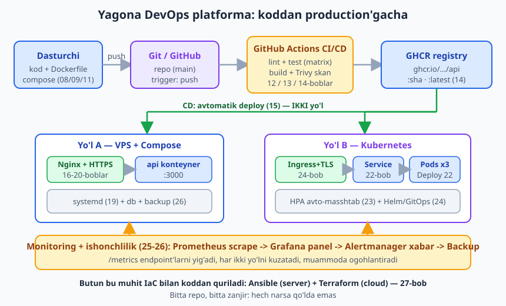
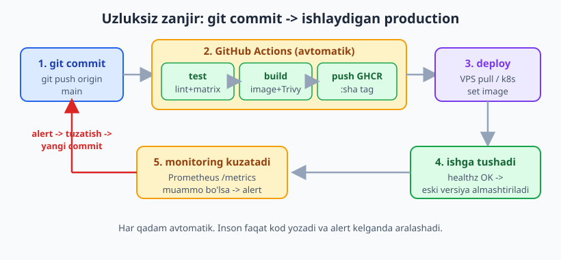
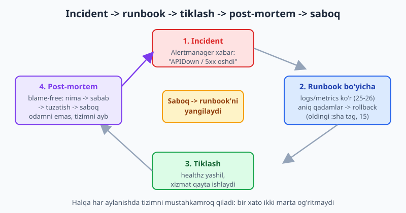

# 28 — Yakuniy kapston: to'liq DevOps platforma

[⬅️ Oldingi: 27 — Infrastructure as Code: Ansible va Terraform](./27-iac-ansible-terraform.md) · [🏠 README](./README.md)

> **Bu bobda:** butun kitobni bitta uzluksiz zanjirga bog'laymiz — namuna **vazifalar API** ilovasini noldan to'liq DevOps platformasiga qo'yamiz: repo va multi-stage `Dockerfile` (08/09), lokal `compose.yaml` dev (11), GitHub Actions CI bilan lint+test+matrix (12-13), Docker image qurib GHCR'ga push va Trivy skani (14, `build-push-action@v7`/`login-action@v4`/`metadata-action@v6`), avtomatik CD (15) **ikki yo'l bilan** — (a) VPS + Compose + Nginx + HTTPS (16-20) va (b) Kubernetes Deployment+Service+Ingress+HPA (21-24), Prometheus+Grafana+Alertmanager monitoringi (25-26), backup (26), va butun muhitni Ansible/Terraform bilan koddan qurish (27); so'ng to'liq **runbook** (ishga tushirish/yangilash/rollback), blame-free **post-mortem** namunasi, o'sish yo'li (service mesh, multi-cloud, DevSecOps, platform engineering) va kitob yakuni.

---

## Muammo: alohida ko'nikmalar bormi, lekin to'liq zanjir-chi?

Birinchi bobdan beri uzun yo'l bosib o'tdik. Endi sizda yetarli qism bor: Linux server, Docker, CI/CD, Nginx, HTTPS, Kubernetes, monitoring, IaC. Lekin haqiqiy DevOps — bu alohida ko'nikmalar emas, **ularning uzluksiz zanjiri**: dasturchi kod yozadi, va shu kod hech qanday qo'l aralashuvisiz, ishonchli tarzda, kuzatib turilgan holda production'da ishlay boshlaydi.

Bu bobda biz aynan shu zanjirni boshidan oxirigacha quramiz. Namuna ilova — kitob bo'ylab ishlatib kelgan **vazifalar API** (Node.js). Har qadamda qaysi bob shu qadamni o'rgatganini eslataman, shunda butun rasm yaqqol ko'rinadi.

Mana butun platforma bitta rasmda — har bo'lim qanday bog'lanishini ko'ring:



> 📌 Kapstonning maqsadi — yangi narsa o'rgatish emas, balki o'rganilganlarni **bitta ishlaydigan tizimga** bog'lash. Agar biror qadam noaniq tuyulsa, mos bobga qaytib o'qing.

---

## 1-qadam: Repo va ilova — multi-stage Dockerfile (08/09)

Hammasi bitta Git repo'sidan boshlanadi. Ichida: ilova kodi, `Dockerfile`, `compose.yaml`, `.github/workflows/`, `k8s/` manifestlar va deploy skriptlar — barchasi versiya nazoratida.

Ilova oddiy: HTTP serveri, uchta endpoint — `/` (vazifalar ro'yxati), `/healthz` (sog'liq tekshiruvi, monitoring uchun), `/metrics` (Prometheus uchun). Uni **multi-stage** `Dockerfile` bilan paketlaymiz (09-bobda ko'rgan usul — kichik va xavfsiz image):

```dockerfile
# 1-bosqich: bog'liqliklarni o'rnatish (build stage)
FROM node:22-alpine AS build
WORKDIR /app
COPY package.json package-lock.json* ./
RUN npm ci --omit=dev || npm install --omit=dev

# 2-bosqich: faqat ishlash uchun kerakli narsa (runtime stage)
FROM node:22-alpine AS runtime
LABEL org.opencontainers.image.source="https://github.com/foydalanuvchi/vazifalar-api"
LABEL org.opencontainers.image.description="Namuna vazifalar API (kapston)"
WORKDIR /app
ENV NODE_ENV=production PORT=3000
# root bo'lmagan foydalanuvchi (xavfsizlik)
RUN addgroup -S app && adduser -S app -G app
COPY --from=build /app/node_modules ./node_modules
COPY app.js ./
USER app
EXPOSE 3000
HEALTHCHECK --interval=30s --timeout=3s --start-period=5s \
  CMD wget -qO- http://127.0.0.1:3000/healthz || exit 1
CMD ["node", "app.js"]
```

Diqqat qiling: `MAINTAINER` emas, `LABEL` (08-bob); `version:` kaliti yo'q; runtime bosqich faqat `node_modules` va `app.js` ni oladi, build asboblari image'ga tushmaydi. `USER app` bilan konteyner root bo'lmagan foydalanuvchida ishlaydi (04-bobdagi eng kam imtiyoz tamoyili).

```bash
docker build -t vazifalar-api:dev ./app
# ... build muvaffaqiyatli ...
docker run -d -p 3000:3000 vazifalar-api:dev
wget -qO- http://127.0.0.1:3000/healthz
# ok
```

---

## 2-qadam: Lokal dev — `compose.yaml` (11)

Ilova yolg'iz emas: unga ma'lumotlar bazasi kerak. Lokalda butun stekni bitta buyruq bilan ko'tarish uchun `compose.yaml` (11-bob):

```yaml
# Lokal dev stek (11-bob). version: kaliti YOZILMAYDI (Compose v2).
services:
  api:
    build: ./app
    image: ghcr.io/foydalanuvchi/vazifalar-api:dev
    environment:
      - PORT=3000
      - DATABASE_URL=postgres://vazifalar:sirli@db:5432/vazifalar
    depends_on:
      db:
        condition: service_healthy
    ports:
      - "3000:3000"
    restart: unless-stopped
    healthcheck:
      test: ["CMD", "wget", "-qO-", "http://127.0.0.1:3000/healthz"]
      interval: 30s
      timeout: 3s
      retries: 3
      start_period: 5s

  db:
    image: postgres:17-alpine
    environment:
      - POSTGRES_USER=vazifalar
      - POSTGRES_PASSWORD=sirli
      - POSTGRES_DB=vazifalar
    volumes:
      - db-data:/var/lib/postgresql/data
    restart: unless-stopped
    healthcheck:
      test: ["CMD-SHELL", "pg_isready -U vazifalar"]
      interval: 10s
      timeout: 5s
      retries: 5

volumes:
  db-data:
```

```bash
docker compose up -d
docker compose ps        # ikkala xizmat ham healthy
docker compose down      # to'xtatish (volume saqlanadi)
```

`depends_on` + `condition: service_healthy` bilan `api` faqat baza tayyor bo'lganda ishga tushadi (11-bob). Volume `db-data` ma'lumotlarni `down`/`up` orasida saqlaydi (10-bob).

> 💡 Lokalda `compose.yaml`, production'da ko'pincha **xuddi shu fayl** (parol va image tag farqi bilan, `.env` orqali). Bu "menda ishlaydi, serverda yo'q" muammosini deyarli yo'qotadi (06-bob).

---

## 3-qadam: CI — lint, test, matrix (12-13)

Endi har `git push` da kod avtomatik tekshirilsin. [Git & GitHub](../git-github/README.md) kitobida GitHub Actions asoslarini ko'rganmiz; bu yerda DevOps quvuriga ulaymiz. Ushbu kapston workflow ham CI (test), ham CD (build/deploy) ni bitta faylga jamlaydi — uni bosqichma-bosqich qo'shamiz. Avval `test` job'i (12-13-boblar):

```yaml
name: CI/CD

on:
  push:
    branches: [main]
    tags: ["v*"]
  pull_request:
    branches: [main]

permissions:
  contents: read
  packages: write

env:
  REGISTRY: ghcr.io
  IMAGE_NAME: ${{ github.repository }}

jobs:
  test:
    name: Lint va test
    runs-on: ubuntu-latest
    strategy:
      matrix:
        node: [20, 22]
    steps:
      - uses: actions/checkout@v6
      - uses: actions/setup-node@v6
        with:
          node-version: ${{ matrix.node }}
          cache: npm
          cache-dependency-path: app/package.json
      - run: npm install
        working-directory: app
      - run: npm run lint --if-present
        working-directory: app
      - run: npm test
        working-directory: app
```

`matrix` ilovani Node 20 va 22 da parallel sinaydi (13-bob) — biror versiyada buzilsa, deploy oldidan bilamiz. `cache: npm` bog'liqliklarni keshlaydi (tezroq build). `permissions: packages: write` — keyingi qadamda GHCR'ga push qilish uchun kerak.

---

## 4-qadam: Image qurish, GHCR'ga push, Trivy (14)

Test o'tdi — endi image quramiz va GHCR'ga yuboramiz. `build-push` job'i `test` muvaffaqiyatidan keyin ishlaydi (`needs: test`):

```yaml
  build-push:
    name: Image qurish va GHCR ga push
    needs: test
    runs-on: ubuntu-latest
    if: github.event_name == 'push'
    steps:
      - uses: actions/checkout@v6

      - name: Buildx
        uses: docker/setup-buildx-action@v4

      - name: GHCR ga login
        uses: docker/login-action@v4
        with:
          registry: ${{ env.REGISTRY }}
          username: ${{ github.actor }}
          password: ${{ secrets.GITHUB_TOKEN }}

      - name: Teglar va metadata
        id: meta
        uses: docker/metadata-action@v6
        with:
          images: ${{ env.REGISTRY }}/${{ env.IMAGE_NAME }}
          tags: |
            type=ref,event=branch
            type=sha,format=short
            type=semver,pattern={{version}}

      - name: Build va push
        id: build
        uses: docker/build-push-action@v7
        with:
          context: ./app
          push: true
          tags: ${{ steps.meta.outputs.tags }}
          labels: ${{ steps.meta.outputs.labels }}
          cache-from: type=gha
          cache-to: type=gha,mode=max

      - name: Trivy xavfsizlik skani
        uses: aquasecurity/trivy-action@v0.36.0
        with:
          image-ref: ${{ env.REGISTRY }}/${{ env.IMAGE_NAME }}:sha-${{ github.sha }}
          format: sarif
          output: trivy.sarif
          severity: CRITICAL,HIGH

      - name: Skan natijasini yuklash
        uses: github/codeql-action/upload-sarif@v3
        with:
          sarif_file: trivy.sarif
```

Bu yerda tasdiqlangan joriy versiyalar: `docker/login-action@v4`, `docker/metadata-action@v6`, `docker/build-push-action@v7`, `docker/setup-buildx-action@v4` (14-bob). `metadata-action` har commit'ga tartibli teg beradi: `:main`, `:sha-abc1234`, va teg push'da `:1.2.3`. `secrets.GITHUB_TOKEN` — Actions o'zi beradigan token, alohida parol kerak emas. Trivy image'dagi CRITICAL/HIGH zaifliklarni topadi va natijani GitHub Security tab'iga yuklaydi.

Mana butun avtomatik zanjir — commit'dan ishlaydigan production'gacha:



> ⚠️ ❌ Eski usul: `docker/build-push-action@v5`, `login-action@v3`, yoki `set-output`/`save-state`. Bular eskirgan — yangi major versiyalar va `$GITHUB_OUTPUT`/`$GITHUB_ENV` ishlating (12-13-boblar). Shubha bo'lsa, action repo'sining release sahifasini tekshiring, versiyani taxmin qilmang.

---

## 5-qadam: CD — avtomatik deploy, ikki yo'l (15)

Image GHCR'da tayyor. Endi uni production'ga chiqaramiz. Ikki keng tarqalgan yo'lni ko'rsataman — har ikkisi ham bu kitobda batafsil yoritilgan.

### Yo'l A — VPS + Compose + Nginx + HTTPS (16-20)

Kichik-o'rta loyihalar uchun eng sodda va arzon yo'l: bitta VPS, Docker Compose, oldida Nginx reverse proxy va Let's Encrypt HTTPS.

Workflow oxiriga `deploy` job'i — SSH orqali serverga ulanib, yangi image'ni tortib oladi va konteynerni almashtiradi (15-bob):

```yaml
  deploy:
    name: Production ga deploy
    needs: build-push
    runs-on: ubuntu-latest
    if: github.ref == 'refs/heads/main'
    environment: production
    steps:
      - uses: actions/checkout@v6
      - name: VPS ga SSH deploy
        run: |
          echo "Bu qadam jonli serverga ulanadi (illustrativ)."
          echo "Haqiqatda: appleboy/ssh-action yoki kubectl set image."
```

> ℹ️ Yuqoridagi `run:` bloki **illustrativ** — jonli SSH ulanishni soxtalashtirmaslik uchun shunday qoldirilgan. Haqiqatda `appleboy/ssh-action` bilan serverga ulanasiz va u yerda quyidagi `deploy.sh` skriptini ishga tushirasiz. `environment: production` GitHub'da tasdiqlash/sirlar qatlamini qo'shadi (15-bob).

Server tomonida deploy/yangilash skripti (19-bobdagi `systemd` o'rniga bu yerda Compose `restart:` siyosatiga tayanamiz):

```bash
#!/usr/bin/env bash
# Production deploy/update skripti (VPS + Compose yo'li).
set -euo pipefail

IMAGE_TAG="${1:?Foydalanish: ./deploy.sh <image-tag>}"
APP_DIR="/opt/vazifalar"
COMPOSE_FILE="$APP_DIR/compose.yaml"

echo "==> Deploy boshlandi: tag=$IMAGE_TAG"

# 1) Yangi image'ni tortib olish
docker compose -f "$COMPOSE_FILE" pull

# 2) Hech qanday to'xtashsiz yangilash (rolling)
docker compose -f "$COMPOSE_FILE" up -d --remove-orphans

# 3) Sog'liqni tekshirish (healthz)
for i in $(seq 1 10); do
  if curl -fsS http://127.0.0.1:3000/healthz >/dev/null 2>&1; then
    echo "==> Sog'lom. Deploy muvaffaqiyatli."
    exit 0
  fi
  echo "   kutilmoqda... ($i/10)"
  sleep 3
done

echo "!! Sog'liq tekshiruvi muvaffaqiyatsiz. Rollback kerak bo'lishi mumkin." >&2
exit 1
```

Nginx oldida turadi — HTTP'ni HTTPS'ga yo'naltiradi va so'rovni `api` konteyneriga uzatadi (16-18-boblar):

```nginx
# HTTP -> HTTPS redirect (18-bob).
server {
    listen 80;
    server_name vazifalar.example.com;
    location /.well-known/acme-challenge/ { root /var/www/certbot; }
    location / { return 301 https://$host$request_uri; }
}

# HTTPS reverse proxy -> api konteyneriga (16-18-boblar).
upstream vazifalar_api {
    server 127.0.0.1:3000;
    keepalive 16;
}

server {
    listen 443 ssl;
    http2 on;
    server_name vazifalar.example.com;

    ssl_certificate     /etc/nginx/certs/cert.pem;
    ssl_certificate_key /etc/nginx/certs/key.pem;
    ssl_protocols TLSv1.2 TLSv1.3;

    add_header Strict-Transport-Security "max-age=31536000" always;
    add_header X-Content-Type-Options nosniff always;

    location /healthz { proxy_pass http://vazifalar_api; access_log off; }

    location / {
        proxy_pass http://vazifalar_api;
        proxy_http_version 1.1;
        proxy_set_header Host $host;
        proxy_set_header X-Real-IP $remote_addr;
        proxy_set_header X-Forwarded-For $proxy_add_x_forwarded_for;
        proxy_set_header X-Forwarded-Proto $scheme;
    }
}
```

> ℹ️ Real sertifikatni `sudo certbot --nginx -d vazifalar.example.com` bilan olasiz va u 90 kunda systemd timer orqali avtomatik yangilanadi (18-bob). VPS'da `ufw` faqat 22/80/443 portlarini ochadi, `fail2ban` SSH'ni himoya qiladi (04-bob). Bu qadamlar **o'z serveringizda** bajariladi.

### Yo'l B — Kubernetes: Deployment + Service + Ingress + HPA (21-24)

Ko'p nusxa, avto-masshtab va o'zini-davolaydigan deploy kerak bo'lsa — Kubernetes. Bitta manifest faylda to'rt resurs (21-24-boblar):

```yaml
apiVersion: apps/v1
kind: Deployment
metadata:
  name: vazifalar-api
  labels:
    app: vazifalar-api
spec:
  replicas: 3
  selector:
    matchLabels:
      app: vazifalar-api
  template:
    metadata:
      labels:
        app: vazifalar-api
    spec:
      containers:
        - name: api
          image: ghcr.io/foydalanuvchi/vazifalar-api:latest
          ports:
            - containerPort: 3000
          env:
            - name: PORT
              value: "3000"
          resources:
            requests: { cpu: 100m, memory: 128Mi }
            limits:   { cpu: 500m, memory: 256Mi }
          readinessProbe:
            httpGet: { path: /healthz, port: 3000 }
            initialDelaySeconds: 5
            periodSeconds: 10
          livenessProbe:
            httpGet: { path: /healthz, port: 3000 }
            initialDelaySeconds: 10
            periodSeconds: 15
---
apiVersion: v1
kind: Service
metadata:
  name: vazifalar-api
spec:
  selector:
    app: vazifalar-api
  ports:
    - port: 80
      targetPort: 3000
  type: ClusterIP
---
apiVersion: networking.k8s.io/v1
kind: Ingress
metadata:
  name: vazifalar-api
  annotations:
    cert-manager.io/cluster-issuer: letsencrypt-prod
spec:
  ingressClassName: nginx
  tls:
    - hosts: [vazifalar.example.com]
      secretName: vazifalar-tls
  rules:
    - host: vazifalar.example.com
      http:
        paths:
          - path: /
            pathType: Prefix
            backend:
              service:
                name: vazifalar-api
                port: { number: 80 }
---
apiVersion: autoscaling/v2
kind: HorizontalPodAutoscaler
metadata:
  name: vazifalar-api
spec:
  scaleTargetRef:
    apiVersion: apps/v1
    kind: Deployment
    name: vazifalar-api
  minReplicas: 2
  maxReplicas: 10
  metrics:
    - type: Resource
      resource:
        name: cpu
        target:
          type: Utilization
          averageUtilization: 70
```

Zanjir aniq: **Ingress -> Service -> Pod**. Ingress `vazifalar-api` Service'iga yo'naltiradi (24-bob); Service `app: vazifalar-api` yorlig'iga ega Pod'larni `selector` orqali topadi (22-bob); HPA CPU 70% dan oshsa Pod sonini 2 dan 10 gacha o'zgartiradi (23-bob). `readinessProbe`/`livenessProbe` `/healthz` orqali Pod sog'ligini kuzatadi.

```bash
kubectl apply -f k8s/vazifalar.yaml
kubectl get deploy,svc,ingress,hpa
kubectl rollout status deployment/vazifalar-api
```

CI'dan deploy esa bitta buyruq bilan — yangi image tag'ini o'rnatish:

```bash
kubectl set image deployment/vazifalar-api \
  api=ghcr.io/foydalanuvchi/vazifalar-api:sha-abc1234
kubectl rollout status deployment/vazifalar-api   # rolling update kuzatish
```

> ℹ️ `kubectl apply` va `rollout` **jonli klasterda** bajariladi (lokalda `minikube`/`kind`, production'da boshqariladigan klaster — 21-bob). Bu yerdagi manifestlar to'g'ri yozilgan; ularni o'z klasteringizda qo'llang. Helm bilan paketlash va Argo CD bilan GitOps — 24-bobda.

---

## 6-qadam: Monitoring va alerting (25-26)

Deploy bo'ldi — endi **ko'rib turish** kerak. Ilova `/metrics` endpoint'ini ochadi, Prometheus uni davriy yig'adi (scrape), Grafana panellarda ko'rsatadi, Alertmanager muammoda xabar yuboradi (25-26-boblar).

```yaml
# prometheus.yml
global:
  scrape_interval: 15s
  evaluation_interval: 15s

alerting:
  alertmanagers:
    - static_configs:
        - targets: ["alertmanager:9093"]

rule_files:
  - "alert.rules.yml"

scrape_configs:
  - job_name: prometheus
    static_configs:
      - targets: ["localhost:9090"]
  - job_name: node
    static_configs:
      - targets: ["node-exporter:9100"]
  - job_name: vazifalar-api
    metrics_path: /metrics
    static_configs:
      - targets: ["api:3000"]
```

Oddiy ogohlantirish qoidasi — ilova javob bermay qolsa:

```yaml
# alert.rules.yml
groups:
  - name: vazifalar
    rules:
      - alert: APIDown
        expr: up{job="vazifalar-api"} == 0
        for: 1m
        labels:
          severity: critical
        annotations:
          summary: "Vazifalar API javob bermayapti"
```

`up == 0` bir daqiqa davom etsa, Alertmanager critical xabar yuboradi (Telegram/email/Slack — 26-bob). `node-exporter` server resurslarini, cAdvisor konteyner metrikalarini beradi (25-bob).

> ℹ️ Grafana dashboard'lari va jonli alertlar **ishlayotgan Prometheus/Grafana** ustida ko'rinadi. Bu yerdagi konfiglar to'g'ri; ularni o'z stekingizda ishga tushiring va Grafana'da `import` orqali tayyor dashboard yuklang (25-bob).

---

## 7-qadam: Backup (26)

Monitoring buzilishni ko'rsatadi, lekin ma'lumotni qaytarmaydi. Baza har kuni avtomatik zaxiralanadi (26-bob):

```bash
#!/usr/bin/env bash
# Postgres backup -> sana bilan, eski nusxalarni tozalash (26-bob).
set -euo pipefail

BACKUP_DIR="/var/backups/vazifalar"
STAMP="$(date +%Y%m%d-%H%M%S)"
mkdir -p "$BACKUP_DIR"

docker compose -f /opt/vazifalar/compose.yaml exec -T db \
  pg_dump -U vazifalar vazifalar | gzip > "$BACKUP_DIR/db-$STAMP.sql.gz"

# 14 kundan eski backuplarni o'chirish
find "$BACKUP_DIR" -name 'db-*.sql.gz' -mtime +14 -delete

echo "Backup tayyor: $BACKUP_DIR/db-$STAMP.sql.gz"
```

Buni `cron` yoki systemd timer har tun 02:30 da ishga tushiradi (03/19-boblar). 3-2-1 qoidasini eslang (26-bob): 3 nusxa, 2 xil joy, 1 tashqi (masalan S3). Backup'ni vaqti-vaqti bilan **tiklab sinab** ko'ring — sinalmagan backup yo'q deyiladi.

---

## 8-qadam: Hammasini koddan — Ansible va Terraform (27)

Yuqoridagi VPS'ni qo'lda sozlash mumkin, lekin server qulasa yoki ikkinchisi kerak bo'lsa — hammasini qaytadan qilish azob. IaC bilan butun muhit **kodda** tasvirlanadi (27-bob).

Terraform cloud serverni yaratadi (HCL — illustrativ, o'z hisobingizda `apply` qilasiz):

```hcl
resource "digitalocean_droplet" "web" {
  name   = "vazifalar-web"
  region = "fra1"
  size   = "s-1vcpu-1gb"
  image  = "ubuntu-24-04-x64"
}
```

Ansible serverni sozlaydi — idempotent, ya'ni necha marta ishlatsangiz ham natija bir xil (27-bob):

```yaml
- name: VPS ni tayyorlash (idempotent)
  hosts: web
  become: true
  tasks:
    - name: Kerakli paketlar
      ansible.builtin.apt:
        name: [docker.io, ufw, fail2ban]
        state: present
        update_cache: true

    - name: Docker xizmati yoqilgan
      ansible.builtin.systemd:
        name: docker
        enabled: true
        state: started

    - name: UFW faqat 22, 80, 443
      community.general.ufw:
        rule: allow
        port: "{{ item }}"
      loop: ["22", "80", "443"]
```

```bash
terraform init && terraform plan && terraform apply   # cloud server (illustrativ)
ansible-playbook -i inventory.ini playbook.yml        # serverni sozlash
```

Endi butun infratuzilma repo'da: serverni o'chirib qaytadan qursangiz ham, bir necha buyruq bilan aynan o'sha holatga qaytadi (immutable infratuzilma g'oyasi, 27-bob).

---

## To'liq runbook: ishga tushirish, yangilash, rollback

**Runbook** — bu "tushgan paytda nima qilish" bo'yicha aniq, qadamma-qadam yo'riqnoma. Yarim tunda, asabiy holatda o'ylab o'tirmaslik uchun oldindan yoziladi.

**A. Birinchi ishga tushirish (yangi muhit):**

1. `terraform apply` — cloud server yaratiladi (27).
2. `ansible-playbook playbook.yml` — Docker, ufw, fail2ban o'rnatiladi (04/27).
3. `compose.yaml` va `.env` ni `/opt/vazifalar` ga ko'chiring; `docker compose up -d` (11).
4. `certbot --nginx -d vazifalar.example.com` — HTTPS (18).
5. Monitoring stekini ko'taring; Grafana'da dashboard import qiling (25).
6. `backup.sh` ni cron/timer'ga qo'shing (26).
7. `curl https://vazifalar.example.com/healthz` -> `ok` ekanini tasdiqlang.

**B. Yangilash (kundalik deploy):**

1. Kod yozing -> `git push origin main`.
2. Actions o'zi: test -> build -> GHCR push -> deploy (12-15). Qo'l ish yo'q.
3. VPS yo'li: `deploy.sh <tag>` healthz yashil bo'lguncha kutadi. K8s yo'li: `kubectl set image ... && kubectl rollout status` (23).
4. Grafana/Alertmanager'da xato darajasi (error rate) oshmaganini 10-15 daqiqa kuzating.

**C. Rollback (deploy buzildi):**

1. Alert keldi yoki healthz qizil.
2. K8s: `kubectl rollout undo deployment/vazifalar-api` — bir buyruq, oldingi ishlagan versiyaga qaytadi (23). VPS: oldingi `:sha` tag bilan qayta deploy:

```bash
#!/usr/bin/env bash
set -euo pipefail
PREV_TAG="${1:?Foydalanish: ./rollback.sh <oldingi-tag>}"
echo "==> Rollback: $PREV_TAG ga qaytamiz"
export IMAGE_TAG="$PREV_TAG"
docker compose -f /opt/vazifalar/compose.yaml up -d
echo "==> Rollback yakunlandi."
```

3. Tiklanganini tasdiqlang (healthz + Grafana). 4. Sabab topilguncha asosiy versiyani o'zgartirmang.

> 📌 Yaxshi rollback — **tez** rollback. Avval xizmatni tiklang (mijozlar uchun), keyin sabab qidiring. "Avval o'chirilgan saytni tuzataman, keyin tiklayman" — noto'g'ri tartib.

---

## Incident va post-mortem (blame-free)

Tushishlar muqarrar. Farqi — jamoa undan o'rganadimi yoki bir xil xatoni takrorlaydimi. Yaxshi jamoada har jiddiy incident'dan keyin **blame-free post-mortem** yoziladi: odamni emas, **tizimni** ayblaydi.



**Post-mortem namunasi:**

```text
Sarlavha: vazifalar-api 14 daqiqa ishlamadi (2026-06-13)
Ta'sir: 14 daqiqa davomida foydalanuvchilarning ~30% i 502 oldi.

Xronologiya:
  21:02  yangi versiya deploy bo'ldi (sha-abc1234)
  21:03  Alertmanager: APIDown (up == 0)
  21:05  navbatchi runbook'ni ochdi, loglarni ko'rdi
  21:09  sabab aniqlandi: yangi versiya DATABASE_URL ni xato o'qidi
  21:11  kubectl rollout undo -> oldingi versiyaga qaytdi
  21:16  healthz yashil, alert yopildi

Asosiy sabab (root cause):
  Konfiguratsiya o'zgaruvchisi nomi kodda o'zgargan, lekin Secret'da
  yangilanmagan. CI bu xatoni tutmadi (integratsion test yo'q edi).

NIMA YAXSHI ketdi:
  - Alert 1 daqiqada keldi, monitoring ishladi.
  - Rollback bir buyruq bilan, 2 daqiqada bajarildi.

NIMA YOMON ketdi:
  - Konfiguratsiya nomi mosligini hech narsa tekshirmadi.
  - Runbook'da "Secret nomlari" bo'limi yo'q edi.

Saboqlar va harakatlar (kim/qachon):
  1. CI'ga "ilova ishga tushadimi" smoke-test qo'shish — Aziz, 1 hafta.
  2. Konfiguratsiya nomlarini bitta manbadan boshqarish — Dilnoza, 2 hafta.
  3. Runbook'ga "Secret tekshiruvi" qadamini qo'shish — bugun.

Eslatma: bu hujjat AYBLASH UCHUN EMAS. Maqsad — tizimni shunday
mustahkamlashki, bu xato boshqa hech kimda takrorlanmasin.
```

> 💡 Blame-free madaniyat — DevOps'ning yuragida. Agar odamlar jazodan qo'rqsa, xatolarni yashiradi; yashirilgan xato esa kattaroq bo'lib qaytadi. Sabab odatda bir kishi emas, **jarayondagi bo'shliq** bo'ladi — uni to'ldirish kerak.

---

## Keyingi qadamlar: o'sish yo'li

Siz endi to'liq DevOps platformasini qura olasiz. Bu yerda ekspertlikka olib boradigan keyingi yo'nalishlar (qisqacha — har biri alohida chuqur mavzu):

- **Service mesh (Istio, Linkerd):** ko'p mikroservis bo'lganda — xizmatlararo trafik, mTLS shifrlash, kuzatuv (tracing) va canary deploy'larni infratuzilma darajasida boshqaradi.
- **Multi-cloud / multi-region:** bir provayderga bog'lanib qolmaslik va geografik chidamlilik uchun bir necha cloud/region'da ishlash.
- **DevSecOps:** xavfsizlikni quvurning har bosqichiga singdirish — SAST/DAST, image va bog'liqlik skani (Trivy'dan boshladingiz), sirlarni boshqarish (Vault), policy-as-code (OPA).
- **Platform engineering:** dasturchilar uchun "internal developer platform" qurish — ular YAML bilmasdan, self-service portal orqali deploy qila olsin (Backstage kabi).
- **Chuqurroq kuzatuv (observability):** metrika + log + tracing uchligi (OpenTelemetry), SLO/SLI va error budget bilan ishonchlilikni raqamlash (SRE amaliyoti).

Bularning hech biri sehr emas — har biri shu kitobdagi tamoyillarning kengaytmasi: avtomatlashtirish, takrorlanuvchanlik, kuzatuv va blame-free madaniyat.

---

## Tabrik — yo'l yakuni

Siz "0 dan" boshlab to'liq DevOps platformasini quradigan darajaga yetdingiz. Linux serverdan boshlab, Docker konteynerlar, CI/CD quvurlari, Nginx va HTTPS, Kubernetes orkestratsiyasi, Prometheus monitoringi, Ansible/Terraform IaC — va eng muhimi, bularni **bitta uzluksiz, avtomatik, ishonchli zanjirga** bog'lashni o'rgandingiz.

DevOps — bu vositalar to'plami emas, **madaniyat va uzluksiz takomillashish**. Vositalar o'zgaradi (bugun Compose, ertaga yangi narsa), lekin tamoyillar qoladi: qo'lda qilinadigan ishni avtomatlashtir, har narsani koddan qayta qur, doimo kuzatib tur, xatodan o'rgan va aybsiz tahlil qil.

Endi navbat — amaliyot. Kichik bir loyihangizni oling va shu kitobdagi zanjirni boshidan oxirigacha o'zingiz qo'ying. Birinchi `git push` da production yangilanganini ko'rganingizda — siz haqiqiy DevOps muhandisisiz.

Omad va ishonchli deploylar tilayman! 🚀

---

## 28-bob mashqlari

### Oson

1. Kapston zanjirining olti asosiy bo'g'inini ketma-ketlikda sanang (koddan production'gacha) va har biriga bittadan bob raqamini bog'lang.
2. `compose.yaml` da nega `version:` kaliti yozilmaydi? Compose v2'da fayl qaysi kalit bilan boshlanadi?
3. Multi-stage `Dockerfile` da `build` va `runtime` bosqichlarini ajratish nima beradi? Bitta afzallikni ayting.
4. CI workflow'da `needs: test` nima qiladi? Agar `test` job'i muvaffaqiyatsiz bo'lsa, `build-push` ishlaydimi?
5. Runbook nima va nega uni incident **oldidan** yozish kerak? Bir jumlada.

### O'rta

6. Workflow'dagi to'rt docker action va ularning joriy versiyasini yozing (`login`, `metadata`, `build-push`, `setup-buildx`). Qaysi eski versiyalar ❌ eskirgan?
7. VPS (Compose) va Kubernetes deploy yo'llarining har biriga bittadan afzallik va bittadan kamchilik ayting. Qaysi holatda qaysi birini tanlaysiz?
8. Kubernetes manifestida `Ingress -> Service -> Pod` zanjiri qanday bog'lanadi? Service Pod'larni qaysi mexanizm orqali topadi?
9. HPA `averageUtilization: 70` va `minReplicas: 2 / maxReplicas: 10` nimani anglatadi? Trafik kamayganda nima bo'ladi?
10. Blame-free post-mortem'ning maqsadi nima? Nega "kim aybdor" emas, "qaysi jarayon bo'shliq qoldirdi" deb so'raladi?

### Qiyin

11. Namuna ilova uchun to'liq multi-stage `Dockerfile` yozing: Node 22 alpine, `build` va `runtime` bosqichlari, `LABEL` (MAINTAINER emas), root bo'lmagan foydalanuvchi va `/healthz` ga `HEALTHCHECK`.

<details markdown="1"><summary>Yechim — 11</summary>

```dockerfile
FROM node:22-alpine AS build
WORKDIR /app
COPY package.json package-lock.json* ./
RUN npm ci --omit=dev || npm install --omit=dev

FROM node:22-alpine AS runtime
LABEL org.opencontainers.image.source="https://github.com/foydalanuvchi/vazifalar-api"
WORKDIR /app
ENV NODE_ENV=production PORT=3000
RUN addgroup -S app && adduser -S app -G app
COPY --from=build /app/node_modules ./node_modules
COPY app.js ./
USER app
EXPOSE 3000
HEALTHCHECK --interval=30s --timeout=3s --start-period=5s \
  CMD wget -qO- http://127.0.0.1:3000/healthz || exit 1
CMD ["node", "app.js"]
```

`build` bosqichi bog'liqliklarni o'rnatadi; `runtime` faqat `node_modules` va kodni `COPY --from=build` bilan oladi — build asboblari image'ga tushmaydi, hajm kichik bo'ladi (09-bob). `USER app` xavfsizlik uchun (04-bob). `LABEL` zamonaviy, `MAINTAINER` eskirgan (08-bob).
</details>

12. CI/CD workflow'ning `test` job'ini yozing: `push`/`pull_request` triggeri, Node 20 va 22 matritsasi, `checkout@v6` va `setup-node@v6`, npm kesh, va `npm test`.

<details markdown="1"><summary>Yechim — 12</summary>

```yaml
name: CI
on:
  push:
    branches: [main]
  pull_request:
    branches: [main]
jobs:
  test:
    runs-on: ubuntu-latest
    strategy:
      matrix:
        node: [20, 22]
    steps:
      - uses: actions/checkout@v6
      - uses: actions/setup-node@v6
        with:
          node-version: ${{ matrix.node }}
          cache: npm
          cache-dependency-path: app/package.json
      - run: npm install
        working-directory: app
      - run: npm test
        working-directory: app
```

`matrix.node` ikkala versiyada parallel sinaydi (13-bob); `cache: npm` keshlaydi; `checkout@v6`/`setup-node@v6` — joriy versiyalar (12-bob).
</details>

13. `build-push` job'ini yozing: `needs: test`, GHCR'ga `login-action@v4` bilan login, `metadata-action@v6` bilan teglar, `build-push-action@v7` bilan qurib push qilish.

<details markdown="1"><summary>Yechim — 13</summary>

```yaml
  build-push:
    needs: test
    runs-on: ubuntu-latest
    if: github.event_name == 'push'
    permissions:
      contents: read
      packages: write
    steps:
      - uses: actions/checkout@v6
      - uses: docker/setup-buildx-action@v4
      - uses: docker/login-action@v4
        with:
          registry: ghcr.io
          username: ${{ github.actor }}
          password: ${{ secrets.GITHUB_TOKEN }}
      - id: meta
        uses: docker/metadata-action@v6
        with:
          images: ghcr.io/${{ github.repository }}
          tags: |
            type=sha,format=short
            type=ref,event=branch
      - uses: docker/build-push-action@v7
        with:
          context: ./app
          push: true
          tags: ${{ steps.meta.outputs.tags }}
          labels: ${{ steps.meta.outputs.labels }}
```

`needs: test` test o'tmasa qurmaydi; `GITHUB_TOKEN` GHCR uchun yetarli (`packages: write` kerak); `metadata-action` har commit'ga `:sha-...` tegini beradi (14-bob). Versiyalar: login@v4, metadata@v6, build-push@v7, setup-buildx@v4.
</details>

14. Kubernetes Service va HorizontalPodAutoscaler manifestlarini yozing: Service `app: vazifalar-api` Pod'larini 80->3000 portga ulaydi; HPA CPU 70% da 2-10 Pod oralig'ida masshtablaydi. To'g'ri `apiVersion`larni ishlating.

<details markdown="1"><summary>Yechim — 14</summary>

```yaml
apiVersion: v1
kind: Service
metadata:
  name: vazifalar-api
spec:
  selector:
    app: vazifalar-api
  ports:
    - port: 80
      targetPort: 3000
  type: ClusterIP
---
apiVersion: autoscaling/v2
kind: HorizontalPodAutoscaler
metadata:
  name: vazifalar-api
spec:
  scaleTargetRef:
    apiVersion: apps/v1
    kind: Deployment
    name: vazifalar-api
  minReplicas: 2
  maxReplicas: 10
  metrics:
    - type: Resource
      resource:
        name: cpu
        target:
          type: Utilization
          averageUtilization: 70
```

Service `apiVersion: v1`, HPA `autoscaling/v2` (joriy versiyalar — 22/23-boblar). Service `selector` Pod yorlig'iga (`app: vazifalar-api`) mos kelishi shart, aks holda hech qaysi Pod'ga ulanmaydi. HPA `scaleTargetRef` Deployment'ga `apps/v1` bilan ishora qiladi.
</details>

15. Production `deploy.sh` skriptini yozing: argument sifatida image tag oladi, `set -euo pipefail` bilan, yangi image'ni `pull` qiladi, `compose up -d` bilan yangilaydi va healthz yashil bo'lguncha (maks 10 urinish) kutadi; muvaffaqiyatsiz bo'lsa xato kodi bilan chiqadi.

<details markdown="1"><summary>Yechim — 15</summary>

```bash
#!/usr/bin/env bash
set -euo pipefail

IMAGE_TAG="${1:?Foydalanish: ./deploy.sh <image-tag>}"
COMPOSE_FILE="/opt/vazifalar/compose.yaml"

docker compose -f "$COMPOSE_FILE" pull
docker compose -f "$COMPOSE_FILE" up -d --remove-orphans

for i in $(seq 1 10); do
  if curl -fsS http://127.0.0.1:3000/healthz >/dev/null 2>&1; then
    echo "Deploy OK"
    exit 0
  fi
  echo "kutilmoqda... ($i/10)"
  sleep 3
done

echo "Healthz muvaffaqiyatsiz -> rollback kerak" >&2
exit 1
```

`set -euo pipefail`: xatoda to'xta, e'lon qilinmagan o'zgaruvchida to'xta, quvurdagi xatoni tut. `${1:?...}` argument berilmasa aniq xabar bilan chiqadi. `curl -fsS` HTTP xatosida non-zero qaytaradi — shuning uchun healthz tekshiruvi ishonchli (15/03-boblar). Skriptni `bash -n deploy.sh` bilan sintaksisini tekshiring.
</details>

16. Quyidagi blame-li post-mortem yozuvini blame-free ko'rinishga aylantiring: *"Aziz noto'g'ri konfiguratsiya push qilgani uchun sayt o'chdi. U ehtiyotsiz edi."* Asosiy sabab, saboq va harakatni qo'shing.

<details markdown="1"><summary>Yechim — 16</summary>

```text
Asosiy sabab (root cause):
  Konfiguratsiya o'zgaruvchisi kodda o'zgardi, lekin Secret'da
  mos yangilanmadi. CI bu nomuvofiqlikni tutadigan tekshiruvga
  ega emas edi -- ya'ni xato deploy oldidan ushlanmadi.

Nima yomon ketdi (tizim, odam emas):
  - Konfiguratsiya nomi mosligini hech narsa tekshirmaydi.
  - Smoke-test (ilova ishga tushadimi) CI'da yo'q.

Saboq va harakatlar:
  1. CI'ga "ilova ishga tushadimi" smoke-testi qo'shish.
  2. Konfiguratsiya nomlarini bitta manbadan boshqarish (drift'ni oldini olish).

Eslatma: bu hujjat ayblash uchun emas. Bir kishi xato qila olgan
bo'lsa, demak jarayonda bo'shliq bor -- biz o'sha bo'shliqni
to'ldiramiz, shunda xato boshqa hech kimda takrorlanmaydi.
```

Farqi: "Aziz ehtiyotsiz" (odamni ayblash) o'rniga "CI tekshiruvi yo'q edi" (tizim bo'shlig'i). Yechim ham odamni emas, jarayonni tuzatadi — smoke-test va konfiguratsiya boshqaruvi (post-mortem madaniyati shu bobda).
</details>

---

[⬅️ Oldingi: 27 — Infrastructure as Code: Ansible va Terraform](./27-iac-ansible-terraform.md) · [🏠 README](./README.md)
