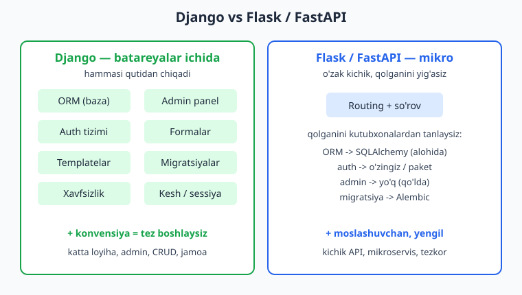
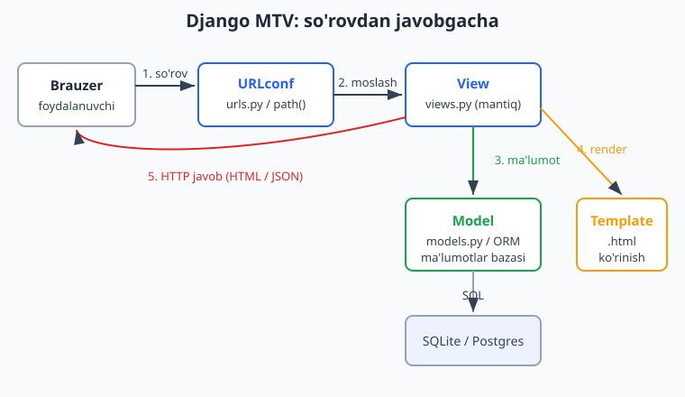
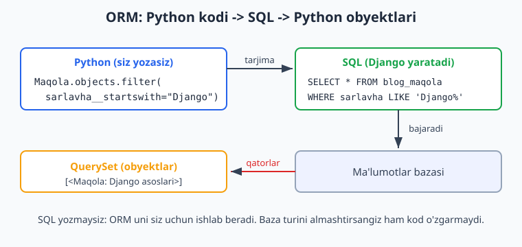

# 01 — Django bilan tanishuv

[🏠 README](./README.md) · [🏠 README](./README.md) · [Keyingi: 02 — O'rnatish va birinchi loyiha ➡️](./02-ornatish-loyiha.md)

---

> **Bu bobda:** Django nima ekanini va u qanday muammoni hal qilishini tushunamiz. Django'ning uchta tayanch falsafasini — "batareyalar ichida" (batteries included), DRY (o'zingni takrorlama) va "konvensiya konfiguratsiyadan ustun" — sodda misollar bilan ochamiz. Django'ning yuragi bo'lgan **MTV (Model-Template-View)** arxitekturasini va bitta HTTP so'rovi qanday qilib bosqichma-bosqich javobga aylanishini (so'rov-javob sikli) ko'rib chiqamiz. Django'ni Flask va FastAPI bilan halol solishtirib, qachon qaysi birini tanlash kerakligini aniqlaymiz. So'ngra Django ekotizimi bilan — ORM, admin panel, autentifikatsiya va DRF (REST API) bilan — qisqacha tanishamiz. Versiya sifatida **Django 6.0** ning yangiliklarini ko'ramiz. Bob nazariyga to'la bo'lsa-da, har bir g'oyani haqiqiy, ishlaydigan kod bilan mustahkamlaymiz. Bu kitob siz Python asoslarini (o'zgaruvchi, funksiya, klass, ro'yxat, lug'at) bilasiz deb faraz qiladi — agar takrorlash kerak bo'lsa, [Python qo'llanmasiga](../python/README.md) murojaat qiling. Hamma kod Django 6.0.6 da haqiqatan ishga tushirib tekshirilgan.

---

## Django nima va u qanday muammoni hal qiladi?

Tasavvur qiling, sizdan blog sayti yozish so'raldi. Sayt foydalanuvchini ro'yxatdan o'tkazishi, kirish-chiqishni boshqarishi, maqolalarni ma'lumotlar bazasiga saqlashi, ularni HTML sahifada chiroyli ko'rsatishi, administratorga maqolalarni tahrirlash imkonini berishi va hujumlardan (parol o'g'irlash, soxta formalar) himoyalanishi kerak.

Bularning **har birini noldan** yozsangiz, oylar ketadi. Va eng yomoni: bu ishlarni har bir yangi loyihada qaytadan yozasiz. Tarmoq dasturlashi shu darajada keng tarqalganki, bu muammolar deyarli har bir veb-saytda bir xil. Demak, ularni bir marta yaxshilab yechib, qayta ishlatish mantiqan to'g'ri.

Aynan shu g'oya **Django** ni dunyoga keltirdi.

> **Django — bu Python tilida yozilgan, yuqori darajadagi veb-karkas (web framework). U veb-saytlarni tez, xavfsiz va kam kod bilan qurish uchun kerakli deyarli barcha asboblarni tayyor holda taqdim etadi.**

Bu ta'rifdagi muhim so'z — **karkas** (framework). Karkas — bu shunchaki kutubxona emas. Kutubxona (masalan, `requests`) — sizning kodingiz chaqiradigan funksiyalar to'plami: siz boshqarasiz, kutubxona xizmat qiladi. Karkas esa teskari ishlaydi: **karkas sizning kodingizni chaqiradi**. Siz "qoidaga" muvofiq fayllarni to'g'ri joylarga qo'yasiz, Django esa so'rov kelganda sizning kodingizni o'zi topib ishga tushiradi. Bu "Hollywood prinsipi" deyiladi: "Bizni chaqirmang — biz sizni chaqiramiz."

Django 2005-yilda AQShdagi gazeta nashriyotida tug'ilgan. U yerda jurnalistlar tez-tez yangi sahifa va bo'limlar so'rashardi, dasturchilar esa ularni soatlar ichida tayyorlashlari kerak edi. Shu bosim ostida tug'ilgan Django bugun Instagram, Spotify, Mozilla, Pinterest, Dropbox kabi ulkan saytlarni quvvatlaydi. Demak Django ham kichik blog uchun, ham millionlab foydalanuvchili tizim uchun mos.

Birinchi qadam sifatida Django'ning o'rnatilganini va versiyasini tekshiramiz:

```bash
python -m django --version
```

Natija:

```
6.0.6
```

Yoki Python ichidan:

```python
import django
print("Django", django.get_version())
```

Natija:

```
Django 6.0.6
```

Bu kitobdagi hamma kod aynan shu versiyada — Django 6.0.6, Python 3.14 da — tekshirilgan.

## Uch tayanch falsafa: batareyalar, DRY va konvensiya

Django shunchaki asboblar to'plami emas — uning ortida aniq dunyoqarash bor. Uchta tamoyilni tushunsangiz, Django nega aynan shunday tuzilganini his qilasiz.

### 1. Batareyalar ichida (batteries included)

Bu ibora Python dunyosidan kelgan: Python "batareyalar bilan keladi" deyiladi, chunki standart kutubxonasida deyarli hamma narsa tayyor. Django bu g'oyani veb-dunyoga olib keldi.

Django'ni o'rnatganingiz bilanoq sizda quyidagilar **tayyor** holda bo'ladi:

- **ORM** — ma'lumotlar bazasi bilan SQL yozmasdan ishlash.
- **Admin panel** — modellaringizni tahrirlaydigan tayyor boshqaruv interfeysi.
- **Autentifikatsiya** — foydalanuvchi, parol, ruxsatlar tizimi.
- **Formalar** — foydalanuvchi kiritmasini tekshirish va xavfsiz qabul qilish.
- **Template tizimi** — HTML sahifalarni dinamik yaratish.
- **Xavfsizlik** — CSRF, SQL injection, XSS, clickjacking himoyasi standart yoqilgan.
- **Migratsiyalar** — baza tuzilishini kod orqali boshqarish.

Boshqa, "mikro" karkaslarda (Flask, FastAPI) bularning ko'pini o'zingiz tanlab, ulab, sozlashingiz kerak. Django'da ular allaqachon shu yerda. Bu — tezlik va izchillik degani.



### 2. DRY — Don't Repeat Yourself (o'zingni takrorlama)

DRY — dasturlashning eng muhim tamoyillaridan biri: **bir narsa bir joyda, faqat bir marta yozilishi kerak.** Agar bir ma'lumotni ikki joyda saqlasangiz, ertaga ulardan birini o'zgartirib, ikkinchisini unutasiz — xato shu yerdan tug'iladi.

Django'da buni eng yaqqol modellarda ko'rasiz. Siz "Maqola" qanaqa ekanini **bir marta** Python klassi sifatida ta'riflaysiz. Django esa shu bitta ta'rifdan:

- ma'lumotlar bazasi jadvalini yaratadi,
- admin panel formasini yasaydi,
- ma'lumotni tekshirish qoidalarini chiqaradi,
- ORM orqali so'rov yozish imkonini beradi.

Ya'ni bir joyga yozasiz — Django uni ko'p joyda ishlatadi. Buni amalda ko'raylik. Quyidagi 9 qatorgina kod butun bir ma'lumotlar jadvalining "yagona haqiqat manbai" bo'ladi:

```python
# blog/models.py
from django.db import models


class Maqola(models.Model):
    sarlavha = models.CharField(max_length=200)
    matn = models.TextField()
    yaratilgan = models.DateTimeField(auto_now_add=True)

    def __str__(self):
        return self.sarlavha
```

Bu klassdan Django avtomatik ravishda quyidagi SQL jadval yaratadi (`makemigrations` va `migrate` buyruqlari bilan — bularni 2-bobda batafsil ko'ramiz):

```sql
CREATE TABLE "blog_maqola" (
    "id" integer NOT NULL PRIMARY KEY AUTOINCREMENT,
    "sarlavha" varchar(200) NOT NULL,
    "matn" text NOT NULL,
    "yaratilgan" datetime NOT NULL
);
```

E'tibor bering: siz `CREATE TABLE` yozmadingiz. `id` ustunini ham qo'shmadingiz — Django uni o'zi qo'shdi. Bu DRY: jadval tuzilishi faqat bitta joyda — Python klassida — yashaydi.

### 3. Konvensiya konfiguratsiyadan ustun (convention over configuration)

Bu tamoyil shunday deydi: **agar aqlli standart qoida bo'lsa, uni majburiy sozlash shart emas.** Django ko'p narsani "siz hech narsa demasangiz, men shunday qilaman" tarzida hal qiladi.

Masalan, modelingiz `Maqola` deb nomlangan bo'lsa va u `blog` ilovasida bo'lsa, Django jadvalni avtomatik `blog_maqola` deb ataydi. Siz jadval nomini aytib o'tirmaysiz — Django konvensiyaga amal qiladi. Albatta, xohlasangiz uni o'zgartirishingiz mumkin, lekin **default** holatda hamma narsa ishlaydi.

Bu uch tamoyil birgalikda Django'ning shiorini tashkil qiladi: *"The web framework for perfectionists with deadlines"* — "muddati bor mukammalchilar uchun veb-karkas". Ya'ni: tez yozasiz (deadline), lekin sifat ham yo'qolmaydi (perfectionist).

## MTV arxitekturasi: Django ilovasining anatomiyasi

Django ilovasi tartibsiz kod uyumi emas — u aniq qismlarga bo'linadi. Bu bo'linishni **MTV** deb atashadi: **Model**, **Template**, **View**.

Agar siz boshqa karkaslardan MVC (Model-View-Controller) haqida eshitgan bo'lsangiz — MTV uning deyarli aynan o'zi, faqat nom boshqacha. Django bunga o'z izohini beradi:

| MTV qismi | Vazifasi | Fayl | "Kim?" |
|-----------|----------|------|--------|
| **Model** | Ma'lumotlar va biznes mantiq. Bazaga nima saqlanadi. | `models.py` | "Ma'lumot qanaqa?" |
| **Template** | Ko'rinish. Foydalanuvchi nimani ko'radi. | `*.html` | "Qanday ko'rsatamiz?" |
| **View** | Mantiq. So'rovni qabul qilib, model va template'ni bog'laydi. | `views.py` | "Nima qilamiz?" |

Har bir qism o'z ishini qiladi va boshqasiga aralashmaydi. Bu — **vazifalar ajratilishi** (separation of concerns). Natijada kod tushunarli, sinovga oson va kengaytirilishi qulay bo'ladi.

Klassik MVC'dagi "Controller" qayerda? Django falsafasiga ko'ra, "controller" — bu Django'ning o'zi (qaysi URL qaysi kodga borishini Django hal qiladi). Shuning uchun Django MVC'dagi "View" ni "Template" deb, "Controller" ni esa "View" deb ataydi. Bu chalkash tuyulishi mumkin, lekin amalda tez o'rganib ketasiz: **View = sizning Python mantiqingiz, Template = HTML.**

Quyidagi diagramma uchchala qismni va ular orasidagi oqimni ko'rsatadi:



Endi har bir qismni minimal, lekin **ishlaydigan** kod bilan ko'raylik. Avval Model (yuqorida ko'rdik), keyin View va URL.

**View** — eng sodda ko'rinishi shunchaki funksiya: `request` (so'rov) ni qabul qiladi va `HttpResponse` (javob) qaytaradi.

```python
# blog/views.py
from django.http import HttpResponse
from .models import Maqola


def salom(request):
    return HttpResponse("Salom, Django!")


def maqolalar(request):
    qatorlar = [m.sarlavha for m in Maqola.objects.all()]
    return HttpResponse("<br>".join(qatorlar) or "Hali maqola yo'q")
```

Birinchi view oddiy matn qaytaradi. Ikkinchisi esa **Model** dan (`Maqola.objects.all()`) ma'lumot olib, undan javob yasaydi — mana View'ning ishi: model va ko'rinishni bog'lash.

**URL** — qaysi manzil qaysi view'ni chaqirishini Django 6.0'da `path()` funksiyasi bilan belgilaymiz:

```python
# blog/urls.py
from django.urls import path
from . import views

urlpatterns = [
    path("salom/", views.salom, name="salom"),
    path("maqolalar/", views.maqolalar, name="maqolalar"),
]
```

> **Eslatma (Django 6.0 idiomi):** zamonaviy Django'da URL'larni har doim `path()` bilan yozamiz. Eski `url()` funksiyasi olib tashlangan. Murakkab naqsh (regular expression) kerak bo'lsagina `re_path()` ishlatiladi — lekin bu kamdan-kam hollarda.

Bu uchta fayl — `models.py`, `views.py`, `urls.py` — birgalikda to'liq ishlaydigan zanjir hosil qiladi. Buni haqiqatan tekshirib ko'rdik: Django'ning test mijozi (test client) brauzer so'rovini imitatsiya qiladi va javobni qaytaradi:

```python
# blog/tests.py — bu kod manage.py test bilan ishga tushiriladi
from django.test import TestCase
from blog.models import Maqola


class SorovJavobTest(TestCase):
    def setUp(self):
        Maqola.objects.create(sarlavha="Django bilan tanishuv", matn="Birinchi bob")
        Maqola.objects.create(sarlavha="MTV arxitekturasi", matn="Model-Template-View")

    def test_salom_view(self):
        r = self.client.get("/blog/salom/")
        self.assertEqual(r.status_code, 200)
        self.assertEqual(r.content.decode(), "Salom, Django!")

    def test_maqolalar_view(self):
        r = self.client.get("/blog/maqolalar/")
        self.assertEqual(r.status_code, 200)
        self.assertIn("Django bilan tanishuv", r.content.decode())
```

Ishga tushirganda hamma test o'tdi:

```bash
python manage.py test blog
```

```
Ran 3 tests in 0.010s

OK
```

Ya'ni so'rov (`/blog/salom/`) -> URLconf -> View -> javob (`200 OK`, "Salom, Django!") zanjiri haqiqatan ishlaydi. Template'ni hozircha ishlatmadik (oddiy matn qaytardik), lekin uni 6-bobda chuqur ko'ramiz.

## So'rov-javob sikli: bitta klik ortida nima sodir bo'ladi?

Endi MTV qismlarini bir-biriga ulab, **bir butun jarayonni** boshidan oxirigacha kuzatamiz. Foydalanuvchi brauzerda `https://sayt.uz/blog/maqolalar/` manziliga kirsa, Django ichida bosqichma-bosqich quyidagilar yuz beradi:

1. **Brauzer HTTP so'rov yuboradi.** "Menga `/blog/maqolalar/` sahifasini ber" degan GET so'rovi serverga keladi.

2. **Django so'rovni qabul qiladi va `HttpRequest` obyektiga aylantiradi.** Bu obyekt ichida hamma narsa bor: qaysi manzil so'ralgani, qanday metod (GET/POST), foydalanuvchi kim, qanday ma'lumot kelgani.

3. **Middleware zanjiri ishlaydi.** So'rov bir nechta "qatlam" (middleware) orqali o'tadi — masalan, xavfsizlik tekshiruvi, sessiya, autentifikatsiya. Bularni 11-bobda ko'ramiz. Hozircha: so'rov view'ga yetib borishidan oldin bir nechta tekshiruvdan o'tadi deb biling.

4. **URLconf manzilni mos view'ga ulaydi.** Django `urls.py` dagi `urlpatterns` ro'yxatini yuqoridan pastga ko'rib chiqadi va `/blog/maqolalar/` ga mos keladigan birinchi `path()` ni topadi — bu `views.maqolalar`.

5. **View ishga tushadi.** `maqolalar(request)` funksiyasi chaqiriladi. U **Model** ga murojaat qiladi (`Maqola.objects.all()`), kerakli ma'lumotni oladi.

6. **Model ORM orqali bazaga SQL so'rov yuboradi** va natijani Python obyektlari (QuerySet) sifatida qaytaradi.

7. **View javob yasaydi.** Olingan ma'lumotni (xohlasa Template orqali HTML'ga aylantirib) `HttpResponse` obyektiga joylaydi.

8. **Javob teskari yo'l bilan qaytadi.** Middleware'lar yana ishlaydi (bu safar javob ustida), so'ngra Django javobni HTTP javobiga aylantirib brauzerga jo'natadi.

9. **Brauzer javobni ko'rsatadi.** Foydalanuvchi sahifani ko'radi.

Eng muhim tushuncha: **har bir so'rov mustaqil.** Django so'rovni qabul qiladi, bir martalik javob qaytaradi va "unutadi". Holatni (kim kirgani, savatda nima borligi) saqlash uchun alohida mexanizmlar — sessiya va baza — ishlatiladi.

Yuqoridagi 5-7 qadamlar — View Model bilan ishlaydigan joy — eng muhim qismi. Quyida ORM aynan nima qilishini ko'ramiz.

## ORM: SQL yozmasdan baza bilan ishlash

**ORM** (Object-Relational Mapping — obyekt-relyatsion moslash) — bu Django ekotizimining eng kuchli qismi. U sizga ma'lumotlar bazasi bilan **SQL tilida emas, Python obyektlari bilan** ishlash imkonini beradi.

Agar SQL haqida tushunchangiz bo'lmasa, [SQL qo'llanmasiga](../sql/README.md) qarashingiz mumkin — lekin Django bilan boshlash uchun SQL shart emas, ORM uni siz uchun yozadi.

Misol uchun, "sarlavhasi 'Django' bilan boshlanadigan barcha maqolalarni top" degan so'rovni ikki xil yozish mumkin. **SQL'da** (qo'lda):

```sql
SELECT * FROM blog_maqola WHERE sarlavha LIKE 'Django%';
```

**Django ORM'da** (Python'da):

```python
Maqola.objects.filter(sarlavha__startswith="Django")
```

Eng qiziq joyi: Django ORM kodingizni **avtomatik** SQL'ga aylantiradi. Buni o'z ko'zimiz bilan ko'rdik. Quyidagi sinov haqiqiy SQL so'rovni ushlab oladi va chop etadi:

```python
# ORM qaysi SQL'ni yaratishini ko'rsatuvchi sinov (manage.py test bilan ishlaydi)
from django.test import TestCase
from django.test.utils import CaptureQueriesContext
from django.db import connection
from blog.models import Maqola


class OrmSqlTest(TestCase):
    def test_orm_to_sql(self):
        Maqola.objects.create(sarlavha="Django asoslari", matn="x")
        Maqola.objects.create(sarlavha="Python", matn="y")

        qs = Maqola.objects.filter(sarlavha__startswith="Django")
        with CaptureQueriesContext(connection) as ctx:
            natija = list(qs)        # mana shu yerda SQL bazaga yuboriladi
        print("SQL:", ctx.captured_queries[0]["sql"])
        print("NATIJA:", [m.sarlavha for m in natija])
        self.assertEqual(len(natija), 1)
```

Ishga tushirganda chiqqan haqiqiy natija:

```
SQL: SELECT "blog_maqola"."id", "blog_maqola"."sarlavha", "blog_maqola"."matn",
     "blog_maqola"."yaratilgan" FROM "blog_maqola"
     WHERE "blog_maqola"."sarlavha" LIKE 'Django%' ESCAPE '\'
NATIJA: ['Django asoslari']
```

Siz `filter(sarlavha__startswith="Django")` yozdingiz, Django esa to'liq, xavfsiz (parametrlangan) SQL so'rovini yaratdi va bazaga yubordi. Diqqat: faqat `list(qs)` chaqirilganda SQL ketdi — ORM "dangasa" (lazy), ya'ni natija haqiqatan kerak bo'lgunicha bazaga tegmaydi.



ORM ning yana bir kuchi: **baza turidan mustaqillik.** Bir xil ORM kod SQLite, PostgreSQL, MySQL — barchasida ishlaydi. Ishlab chiqishda SQLite, productionda PostgreSQL ishlatsangiz ham, kodingiz o'zgarmaydi. Faqat sozlamadagi bitta qatorni almashtirasiz, xolos.

## Django ekotizimi: ORM, admin, auth va DRF

Django'ning "batareyalar" i shunchaki gap emas. Quyida ekotizimning to'rt asosiy ustunini qisqacha ko'rib chiqamiz — har birini keyingi boblarda chuqur o'rganamiz.

**1. ORM (Object-Relational Mapping)** — yuqorida ko'rdik. Modellardan tortib murakkab so'rovlargacha — barchasi Python'da. (Boblar 4-9.)

**2. Admin panel** — bu Django'ning eng sevimli xususiyatlaridan biri. Modelingizni ro'yxatga olib qo'ysangiz, Django sizga ma'lumotni qo'shish, tahrirlash va o'chirish uchun to'liq tayyor veb-interfeys beradi. Bir necha qator kod bilan:

```python
# blog/admin.py
from django.contrib import admin
from .models import Maqola

admin.site.register(Maqola)
```

Shu uch qatordan keyin `/admin/` manzilida `Maqola` ni boshqaradigan to'liq panel paydo bo'ladi — qidiruv, filtrlash, sahifalash bilan. Buni 10-bobda ko'ramiz.

**3. Autentifikatsiya (auth)** — foydalanuvchi, parol, guruh va ruxsatlar tizimi tayyor keladi. Foydalanuvchi yaratish shunchaki:

```python
# Django shell ichida ishlatiladigan misol
from django.contrib.auth.models import User

user = User.objects.create_user(username="oqil", password="maxfiy123")
print(user.username, user.is_active)
```

Parol avtomatik xeshlanadi (ochiq matnda saqlanmaydi), kirish-chiqish, ruxsat tekshirish — hammasi tayyor. (Boblar 12-13.)

**4. DRF — Django REST Framework** — agar siz veb-sahifa emas, balki **API** (mobil ilova yoki React frontend uchun JSON qaytaradigan xizmat) qurmoqchi bo'lsangiz, DRF buni osonlashtiradi. U Django ustiga o'rnatiladigan alohida paket. Eng soddasi — "serializer" Python ma'lumotini JSON'ga aylantiradi:

```python
# DRF serializer: Python ma'lumotini tekshirib, JSON'ga tayyorlaydi
from rest_framework import serializers


class MaqolaSerializer(serializers.Serializer):
    sarlavha = serializers.CharField(max_length=200)
    matn = serializers.CharField()


s = MaqolaSerializer(data={"sarlavha": "Salom", "matn": "Tana"})
print("valid:", s.is_valid())
print("data:", dict(s.validated_data))
```

Haqiqiy natija:

```
valid: True
data: {'sarlavha': 'Salom', 'matn': 'Tana'}
```

DRF token va JWT autentifikatsiya, filtrlash, sahifalash kabi imkoniyatlar ham beradi. Biz DRF (versiya 3.17), `djangorestframework-simplejwt` (JWT autentifikatsiya) va `django-filter` (filtrlash) ni 14-boblardan boshlab batafsil ko'ramiz.

Bu to'rt ustun + template, forma, kesh, sessiya — birgalikda Django'ni "to'liq qurollangan" karkasga aylantiradi. Boshqa karkaslarda bularning ko'pini o'zingiz topib ulashingiz kerak edi.

## Django qachon kerak? Flask va FastAPI bilan solishtirish

Django zo'r, lekin u **har doim** to'g'ri tanlov emas. Halol bo'laylik: Python dunyosida uchta mashhur veb-karkas bor va ularning har biri o'z o'rniga ega.

| Xususiyat | **Django** | **Flask** | **FastAPI** |
|-----------|-----------|-----------|-------------|
| Turi | To'liq (batteries included) | Mikro | Mikro, zamonaviy |
| ORM | Bor (o'rnatilgan) | Yo'q (SQLAlchemy alohida) | Yo'q (alohida) |
| Admin panel | Bor (tayyor) | Yo'q | Yo'q |
| Auth | Bor (tayyor) | Yo'q (qo'lda) | Yo'q (qo'lda) |
| API qurish | DRF orqali | Kengaytma orqali | O'zagida (native) |
| Async | Qisman (kengayib boryapti) | Qisman | To'liq, asosiy kuch |
| Avtomatik API hujjat | Yo'q (DRF qisman) | Yo'q | Bor (Swagger avtomatik) |
| O'rganish | O'rtacha (ko'p tushuncha) | Oson | Oson-o'rtacha |
| Eng mos joyi | Katta saytlar, CRUD, admin | Kichik loyiha, to'liq nazorat | Tez API, mikroservis |

**Django'ni tanlang, agar:**

- katta, ko'p qismli sayt qurayotgan bo'lsangiz (foydalanuvchilar, kontent, admin);
- ma'lumotlar bazasi bilan ko'p ishlasangiz (ORM, migratsiyalar tayyor);
- administrator paneli kerak bo'lsa (Django uni bepul beradi);
- jamoada ishlasangiz — Django'ning aniq tuzilishi (konvensiya) hammani bir xil yo'lda ushlaydi;
- xavfsizlik muhim bo'lsa (CSRF, XSS, injection himoyasi standart yoqilgan).

**Flask'ni o'ylab ko'ring, agar:** juda kichik loyiha bo'lsa, yoki har bir qismni o'zingiz tanlamoqchi bo'lsangiz. Flask sizga "bo'sh varaq" beradi.

**FastAPI'ni o'ylab ko'ring, agar:** asosiy ishingiz tezkor JSON API bo'lsa, async muhim bo'lsa va avtomatik API hujjat (Swagger) kerak bo'lsa. FastAPI yangi, tez va API uchun maxsus yaratilgan.

Agar siz Node.js dunyosidan kelgan bo'lsangiz, taqqoslash shunday: Django — bu Node'dagi **NestJS** ga (to'liq, fikri bor karkas) yaqin, Flask esa **Express** ga (mikro, erkin) o'xshaydi. Node bilan tanish bo'lsangiz, [Node.js qo'llanmasi](../nodejs/README.md) bilan solishtirib ko'rish foydali.

Xulosa: Django "ko'p narsa qaror qilingan" karkas. Bu boshda biroz ko'p tuyulishi mumkin (o'rganadigan tushunchalar ko'p), lekin uzoq muddatda u sizni minglab qarorlardan ozod qiladi va loyihani tez, ishonchli qurish imkonini beradi.

## Django 6.0 da nima yangi?

Bu kitob **Django 6.0** ga asoslangan (aniqrog'i, 6.0.6 nuqtali chiqarilishiga). Django 6.0 — yangi asosiy (feature) chiqarilish: Python 3.12+ talab qiladi va 3.12/3.13/3.14 ni qo'llab-quvvatlaydi. (Eslatma: 6.0 LTS emas — odatiy chiqarilish bo'lib, qisqaroq qo'llab-quvvatlash davriga ega. Uzoq muddatli (LTS) qo'llab-quvvatlash kerak bo'lsa, 5.2 LTS yoki kelgusi 6.2 LTS chiqarilishi tanlanadi; LTS odatda har bir seriyaning oxirgi `.2` chiqarilishi bo'ladi.) Bir necha muhim nuqta:

- **`DEFAULT_AUTO_FIELD` endi standart `BigAutoField`.** Avvalgi versiyalarda yangi loyiha `settings.py` ichiga `DEFAULT_AUTO_FIELD = 'django.db.models.BigAutoField'` qatorini yozardi. Django 6.0'da bu standart qiymat global darajada o'rnatilgan, shuning uchun yangi loyihaning `settings.py` faylida bu qator umuman ko'rinmaydi. Buni tasdiqladik:

```python
import django.conf.global_settings as g
print(g.DEFAULT_AUTO_FIELD)
```

Natija:

```
django.db.models.BigAutoField
```

`BigAutoField` — bu 64-bitli butun son birlamchi kalit, ya'ni jadvalingiz juda katta o'sib ketsa ham (milliardlab qator) `id` qiymatlari tugab qolmaydi.

- **Zamonaviy URL idiomi — `path()`.** Eski `django.conf.urls.url()` ko'pdan beri olib tashlangan. Hamma yangi kodda `path()` ishlatamiz; murakkab naqsh kerak bo'lsagina `re_path()`.
- **Async (asinxron) qo'llab-quvvatlash kengaymoqda.** Django endi async view, async ORM va async middleware'ni ham qo'llab-quvvatlaydi. Bu — bir vaqtning o'zida ko'p so'rovni samarali boshqarish degani. Buni 26-bobda ko'ramiz.
- **Zamonaviy Python talab qilinadi.** Django 6.0 yangi Python versiyalarini (3.12+, biz 3.14 ishlatamiz) talab qiladi va eski naqshlardan voz kechgan.

Yangi loyiha yaratishni 2-bobda batafsil ko'ramiz, lekin buyruq qanaqaligi bilan tanishib qo'yaylik:

```bash
python -m django startproject mysite .
python -m django startapp blog
```

Bu ikki buyruq loyiha (`mysite`) va ilova (`blog`) skeletini yaratadi. So'ngra `python manage.py check` loyihada xato yo'qligini tekshiradi:

```bash
python manage.py check
```

```
System check identified no issues (0 silenced).
```

Bu boblarning hammasini shu yo'l bilan — haqiqiy loyiha qurib, har bir kodni ishga tushirib — o'rganamiz.

## Xulosa

Bu bobda Django'ning "ruhi" bilan tanishdik. Eng muhim fikrlarni jamlaylik:

- **Django — Python'dagi to'liq veb-karkas.** U veb-saytdagi takrorlanuvchi muammolarni (baza, auth, admin, xavfsizlik) tayyor yechadi.
- **Uch falsafa:** batareyalar ichida (hammasi tayyor), DRY (bir narsa bir joyda), konvensiya konfiguratsiyadan ustun (aqlli standartlar).
- **MTV arxitekturasi:** Model (ma'lumot), Template (ko'rinish), View (mantiq) — vazifalar aniq ajratilgan.
- **So'rov-javob sikli:** so'rov -> URLconf -> View -> Model/Template -> javob. Har bir so'rov mustaqil.
- **ORM** SQL yozmasdan, Python obyektlari bilan baza bilan ishlash imkonini beradi va baza turidan mustaqil.
- **Ekotizim:** ORM, admin, auth va DRF — Django'ni to'liq qurollantiradi.
- **Django vs Flask/FastAPI:** Django katta, CRUD'ga boy, admin kerak bo'lgan loyihalar uchun; Flask/FastAPI esa kichik va tezkor API uchun.
- **Django 6.0** — yangi asosiy (feature) chiqarilish (LTS emas; Python 3.12+ talab qiladi): `BigAutoField` standart, `path()` idiomi, kengayib borayotgan async.

Keyingi bobda nazariyadan amaliyotga o'tamiz: Django'ni o'rnatamiz (yoki global o'rnatilganini tekshiramiz), birinchi loyihani noldan quramiz, fayl tuzilishini tushuntiramiz va birinchi sahifani brauzerda ishga tushiramiz.

## Mashqlar

### Oson

1. **Versiyani tekshiring.** Buyruq qatorida Django versiyasini chop etadigan buyruqni yozing. Keyin Python ichidan `django.get_version()` orqali ham chiqaring.

2. **MTV qismlarini ulang.** Quyidagi vazifalarning har birini MTV'ning qaysi qismiga (Model / Template / View) tegishli ekanini ayting: (a) maqola sarlavhasini bazaga saqlash, (b) sahifada maqolalar ro'yxatini HTML jadvalda ko'rsatish, (c) so'rovni qabul qilib, bazadan ma'lumot olib, javob yasash.

3. **Karkas va kutubxona farqi.** Kutubxona (masalan `requests`) bilan karkas (Django) o'rtasidagi asosiy farqni 2-3 jumlada o'z so'zlaringiz bilan tushuntiring.

4. **Eng sodda view.** `/salom/` manzilida "Assalomu alaykum!" matnini qaytaradigan view funksiyasi va unga mos `path()` qatorini yozing.

5. **DRY misoli.** Modelni bir marta yozganingizda Django undan kamida uchta narsa yasaydi. O'sha uchtasini sanab bering.

### O'rta

6. **Modeldan SQL.** Quyidagi modeldan Django qanday `CREATE TABLE` SQL'i yasashini taxmin qilib yozing (ustun nomlari va `id` ni unutmang):

   ```python
   class Mahsulot(models.Model):
       nomi = models.CharField(max_length=100)
       narxi = models.DecimalField(max_digits=10, decimal_places=2)
   ```

7. **ORM dan SQL.** `Mahsulot.objects.filter(narxi__gt=100)` ORM so'rovi qanday SQL `WHERE` shartiga aylanishini yozing. (`__gt` — "greater than", katta).

8. **So'rov-javob ketma-ketligi.** Foydalanuvchi `/blog/maqolalar/` ga kirganda yuz beradigan asosiy 5 qadamni (so'rovdan javobgacha) to'g'ri tartibda yozing.

9. **Karkasni tanlash.** Quyidagi loyihalarning har biri uchun Django, Flask yoki FastAPI'dan qaysi biri ko'proq mos kelishini sababi bilan ayting: (a) admin paneli bo'lgan onlayn-do'kon, (b) faqat JSON qaytaradigan kichik tezkor API, (c) bir sahifalik shaxsiy "havola qisqartirgich".

10. **Ikki view bitta ilovada.** `salom` va `xayr` degan ikki view yozing: birinchisi "Salom!", ikkinchisi "Xayr!" qaytarsin. Ularni `/salom/` va `/xayr/` manzillariga ulaydigan `urlpatterns` ni to'liq yozing.

### Qiyin

11. **ORM dangasaligi (lazy).** `qs = Maqola.objects.filter(...)` qatori yozilganda SQL bazaga **darhol** yubormaydi. SQL qachon haqiqatan yuboriladi? Kamida uchta holatni (operatsiyani) ayting va nega ORM shunday "dangasa" ishlashi foydali ekanini tushuntiring.

12. **MVC va MTV.** Klassik MVC'dagi uch qism (Model, View, Controller) Django'dagi qaysi tushunchalarga to'g'ri keladi? "Controller" Django'da qayerda yashaydi va nega Django uni alohida fayl qilmagan?

13. **Test bilan tekshirish.** `/blog/salom/` view'i "Salom, Django!" matnini va `200` statusini qaytarishini tekshiradigan Django `TestCase` sinfini yozing (test client'dan foydalaning).

14. **Django 6.0 farqi.** Eski Django loyihasining `settings.py` faylida `DEFAULT_AUTO_FIELD = 'django.db.models.BigAutoField'` qatori bo'lardi. Django 6.0'da bu qator yangi loyihada nega ko'rinmaydi? Bu o'zgarish kod xulqiga ta'sir qiladimi?

<details markdown="1"><summary>Yechimlar</summary>

**1. Versiyani tekshirish.**

Buyruq qatorida:

```bash
python -m django --version
```

Python ichida:

```python
import django
print("Django", django.get_version())
```

Ikkalasi ham `6.0.6` (yoki `Django 6.0.6`) chiqaradi.

**2. MTV qismlarini ulash.**

- (a) maqola sarlavhasini bazaga saqlash -> **Model** (ma'lumot tuzilishi va saqlash).
- (b) maqolalar ro'yxatini HTML jadvalda ko'rsatish -> **Template** (ko'rinish).
- (c) so'rovni qabul qilib, bazadan ma'lumot olib, javob yasash -> **View** (mantiq, model va template'ni bog'laydi).

**3. Karkas va kutubxona farqi.**

Kutubxona — bu siz o'zingiz chaqiradigan funksiyalar to'plami: nazorat sizda, kutubxona faqat so'ralganda ishlaydi (masalan `requests.get(...)`). Karkas esa teskari: u sizning kodingizning umumiy tuzilishini belgilaydi va kerakli paytda **sizning kodingizni o'zi chaqiradi** (Django so'rov kelganda sizning view'ingizni topib ishga tushiradi). Qisqasi: kutubxonani siz boshqarasiz, karkas esa sizni boshqaradi ("Hollywood prinsipi").

**4. Eng sodda view.**

```python
# views.py
from django.http import HttpResponse


def salom(request):
    return HttpResponse("Assalomu alaykum!")
```

```python
# urls.py
from django.urls import path
from . import views

urlpatterns = [
    path("salom/", views.salom, name="salom"),
]
```

**5. DRY misoli.** Bitta model ta'rifidan Django quyidagilarni yasaydi (har uchtasi yetarli): (1) ma'lumotlar bazasi jadvali (`CREATE TABLE`), (2) admin panel formasi, (3) ORM so'rov interfeysi (`.objects.filter()` va h.k.), (4) ma'lumotni tekshirish (validatsiya) qoidalari, (5) modeldan forma yasash imkoni. Hammasi bitta klass ta'rifidan.

**6. Modeldan SQL.** Django (SQLite uchun) taxminan shunday jadval yasaydi:

```sql
CREATE TABLE "shop_mahsulot" (
    "id" integer NOT NULL PRIMARY KEY AUTOINCREMENT,
    "nomi" varchar(100) NOT NULL,
    "narxi" decimal NOT NULL
);
```

E'tibor bering: `id` avtomatik qo'shiladi (`BigAutoField`), jadval nomi `ilova_model` shaklida (masalan `shop_mahsulot`), `CharField` -> `varchar`, `DecimalField` -> `decimal`.

**7. ORM dan SQL.**

```python
Mahsulot.objects.filter(narxi__gt=100)
```

quyidagi SQL shartiga aylanadi:

```sql
SELECT ... FROM "shop_mahsulot" WHERE "shop_mahsulot"."narxi" > 100;
```

`__gt` (greater than) `>` operatoriga aylanadi. (Boshqalar: `__lt` -> `<`, `__gte` -> `>=`, `__lte` -> `<=`.)

**8. So'rov-javob ketma-ketligi.**

1. Brauzer `/blog/maqolalar/` ga GET so'rov yuboradi.
2. URLconf (`urls.py`) so'rovni mos view'ga (`maqolalar`) ulaydi.
3. View ishga tushadi va Model'dan ma'lumot oladi (`Maqola.objects.all()`).
4. View javob yasaydi (`HttpResponse`, kerak bo'lsa Template orqali HTML).
5. Django javobni brauzerga qaytaradi, brauzer uni ko'rsatadi.

(Middleware qadamlari ham bor, lekin asosiy 5 qadam shular.)

**9. Karkasni tanlash.**

- (a) Admin paneli bo'lgan onlayn-do'kon -> **Django**: admin panel, auth, ORM, formalar tayyor. Noldan yozish behuda.
- (b) Faqat JSON qaytaradigan kichik tezkor API -> **FastAPI**: API uchun maxsus yaratilgan, async, avtomatik Swagger hujjat. (Yoki katta bo'lsa Django + DRF.)
- (c) Bir sahifalik havola qisqartirgich -> **Flask**: juda kichik, Django'ning butun mashinasi shart emas, Flask yengilroq.

**10. Ikki view bitta ilovada.**

```python
# views.py
from django.http import HttpResponse


def salom(request):
    return HttpResponse("Salom!")


def xayr(request):
    return HttpResponse("Xayr!")
```

```python
# urls.py
from django.urls import path
from . import views

urlpatterns = [
    path("salom/", views.salom, name="salom"),
    path("xayr/", views.xayr, name="xayr"),
]
```

**11. ORM dangasaligi (lazy).**

`qs = Maqola.objects.filter(...)` faqat "so'rov rejasi"ni tayyorlaydi, SQL'ni darhol yubormaydi. SQL haqiqatan quyidagi hollarda yuboriladi:

- QuerySet ustida `list(qs)` chaqirilganda yoki `for m in qs:` bilan aylanib chiqilganda;
- `qs[0]` kabi indeks (yoki kesim) olinganda;
- `len(qs)`, `bool(qs)`, `qs.count()`, `qs.exists()` chaqirilganda;
- QuerySet to'g'ridan-to'g'ri template'da ishlatilganda.

Nega foydali: dangasalik tufayli siz so'rovni bo'lak-bo'lak yig'ishingiz mumkin (`.filter().exclude().order_by()` — hammasi bitta so'rovga birlashadi) va baza faqat **bir marta**, natija haqiqatan kerak bo'lganda so'raladi. Bu keraksiz so'rovlarning oldini oladi.

**12. MVC va MTV.**

| MVC | Django (MTV) |
|-----|--------------|
| Model | Model (`models.py`) — bir xil |
| View (ko'rinish) | **Template** (`*.html`) |
| Controller (mantiq) | **View** (`views.py`) |

"Controller" Django'da alohida fayl emas — uning vazifasini (qaysi URL qaysi kodga borishini hal qilish) **karkasning o'zi** URLconf orqali bajaradi. Django falsafasiga ko'ra, "so'rovni view'ga yo'naltirish" karkasning ishi, dasturchining emas — shuning uchun Django uni qo'lda yozdirmaydi. Aynan shu sabab Django MVC'dagi "View" ni "Template", "Controller" ni esa "View" deb ataydi.

**13. Test bilan tekshirish.**

```python
# blog/tests.py
from django.test import TestCase


class SalomViewTest(TestCase):
    def test_salom_200_va_matn(self):
        r = self.client.get("/blog/salom/")
        self.assertEqual(r.status_code, 200)
        self.assertEqual(r.content.decode(), "Salom, Django!")
```

Ishga tushirish:

```bash
python manage.py test blog
```

Test mijozi (`self.client`) brauzer so'rovini imitatsiya qiladi — server ishga tushirish shart emas. Biz buni tekshirdik: test o'tdi (`OK`).

**14. Django 6.0 farqi.**

Django 6.0'da `BigAutoField` butun karkas uchun **standart** birlamchi kalit turi bo'lib qoldi (global sozlamada o'rnatilgan). Shuning uchun yangi `startproject` `settings.py` ichiga `DEFAULT_AUTO_FIELD` qatorini **yozmaydi** — qiymat allaqachon to'g'ri.

Kod xulqiga ta'sir qilmaydi: yangi modellaringiz baribir `BigAutoField` (64-bitli `id`) bilan yaratiladi. Faqat sozlama faylida bitta ortiqcha qator yo'qoladi — bu "konvensiya konfiguratsiyadan ustun" tamoyilining yana bir misoli. (Tekshirib ko'rdik: `django.conf.global_settings.DEFAULT_AUTO_FIELD` -> `django.db.models.BigAutoField`.)

</details>

---

[🏠 README](./README.md) · [🏠 README](./README.md) · [Keyingi: 02 — O'rnatish va birinchi loyiha ➡️](./02-ornatish-loyiha.md)
