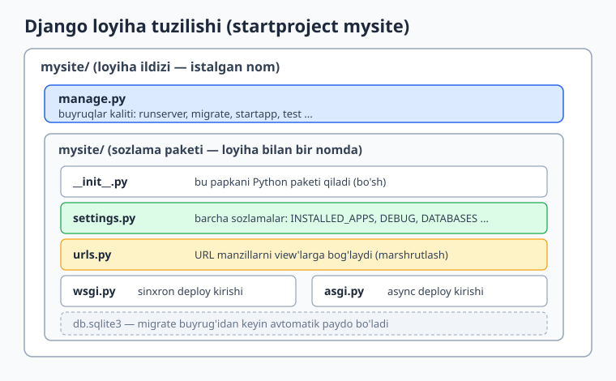
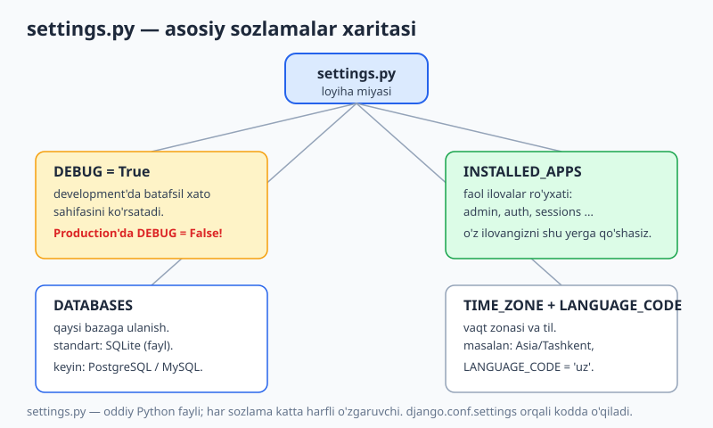
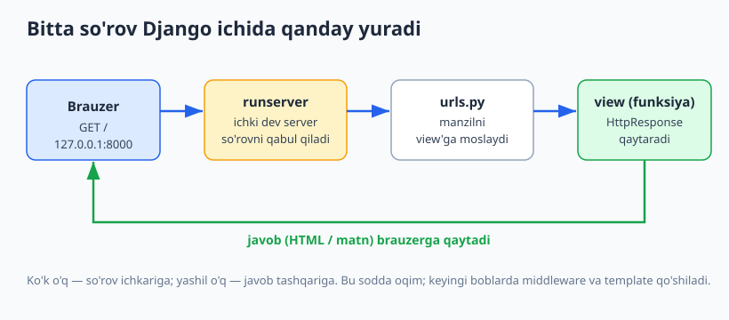

# 02 — O'rnatish va birinchi loyiha

[⬅️ Oldingi: 01 — Django bilan tanishuv](./01-django-tanishuv.md) · [🏠 README](./README.md) · [Keyingi: 03 — View va URL marshrutlash ➡️](./03-view-url.md)

---

> **Bu bobda:** Django'ni mashinangizga o'rnatamiz va birinchi loyihani noldan ko'taramiz. Avval **virtual muhit** (`venv`) nima uchun kerakligini va uni qanday yaratishni ko'ramiz, so'ng `pip install Django` bilan Django'ni o'rnatamiz. Keyin `python -m django startproject` orqali loyiha skeletini yasaymiz va har bir tug'ilgan faylni — `manage.py`, `settings.py`, `urls.py`, `wsgi.py`, `asgi.py` — birma-bir tushuntiramiz. `runserver` bilan development serverini ishga tushirib, brauzerda Django'ning kutib oluvchi sahifasini ko'ramiz. So'ngra `settings.py`ning asoslarini chuqurlashtiramiz: `INSTALLED_APPS`, `DEBUG`, `DATABASES`, `TIME_ZONE`, `LANGUAGE_CODE`. Nihoyat o'zimizning **birinchi sahifamizni** yozamiz — avval to'g'ridan-to'g'ri `HttpResponse` bilan, keyin `startapp` ilovasi va template orqali. Yo'l-yo'lakay `migrate` va `createsuperuser` bilan admin paneliga ham kirib chiqamiz. Hamma kod Django 6.0.6 da haqiqatan ishga tushirib tekshirilgan.

---

## Avval: Python tayyormi?

Django — Python kutubxonasi, demak avval Python kerak. Bu kitob siz Python asoslarini bilasiz deb faraz qiladi (agar takrorlash kerak bo'lsa: [../python/README.md](../python/README.md)). Bu kitobdagi kod **Python 3.14** va **Django 6.0.6** da tekshirilgan.

Birinchi qadam — Python o'rnatilganini tasdiqlash. Terminal (Windows'da PowerShell, macOS/Linux'da Terminal) oching va versiyani so'rang:

```bash
python --version
```

Natija taxminan shunday bo'lishi kerak:

```text
Python 3.14.2
```

> **Eslatma.** Ba'zi tizimlarda buyruq `python` emas, `python3` bo'ladi. Agar `python --version` ishlamasa, `python3 --version` ni sinab ko'ring. Django 6.0 kamida Python 3.12 ni talab qiladi — undan eski versiyada ishlamaydi.

---

## Virtual muhit (venv) — nega va qanday

Tasavvur qiling, sizda ikki loyiha bor: biri eski Django 4.2 ga, ikkinchisi yangi Django 6.0 ga tayangan. Agar ikkalasi ham **bitta umumiy** Python'dan foydalansa, ikkita Django versiyasini bir vaqtda saqlab bo'lmaydi — biri ikkinchisini o'chiradi.

Yechim — **virtual muhit** (`venv`). Bu har loyiha uchun alohida, izolyatsiya qilingan Python "qutisi". Har qutida o'z paketlari (Django, kutubxonalar) bo'ladi va ular boshqa loyihalarga aralashmaydi. Bu Python dunyosida standart amaliyot.



Virtual muhit yaratish bir buyruq:

```bash
python -m venv .venv
```

Bu joriy papkada `.venv/` degan papka yasaydi — ichida toza, izolyatsiya qilingan Python. Endi uni **faollashtirish** kerak. Buyruq operatsion tizimga qarab farq qiladi:

```bash
# Windows (PowerShell):
.venv\Scripts\Activate.ps1

# Windows (cmd.exe):
.venv\Scripts\activate.bat

# macOS / Linux:
source .venv/bin/activate
```

Faollashgach, terminal qatori boshida `(.venv)` ko'rinadi — bu siz muhit ichidasiz degani. Endi bu yerda o'rnatilgan har narsa faqat shu loyihaga tegishli bo'ladi.

> **Tavsiya.** `.venv/` papkasini hech qachon Git'ga qo'shmang — u juda katta va mashinaga bog'liq. `.gitignore` ga `.venv/` qatorini yozing. (Git haqida: [../git-github/README.md](../git-github/README.md).)

Muhitdan chiqish uchun istalgan vaqt:

```bash
deactivate
```

> **Bu kitobda.** Mualliflik muhitida Django **global** (foydalanuvchi darajasida) o'rnatilgan, shuning uchun misollarni `venv`siz to'g'ridan-to'g'ri `python` bilan ishga tushirdik. Lekin **siz** har yangi loyiha uchun `venv` yaratishni odat qiling — bu professional standart va kelajakda versiya to'qnashuvlaridan saqlaydi.

---

## Django'ni o'rnatish: pip install

`venv` faol bo'lganda Django'ni o'rnatish bitta buyruq. `pip` — Python'ning paket o'rnatuvchisi:

```bash
pip install Django
```

`pip` Django'ni va u talab qiladigan kutubxonalarni (masalan `asgiref`, `sqlparse`) Internetdan yuklab o'rnatadi. Aniq versiyani ham so'rashingiz mumkin — kitob aynan shunda tekshirilgan:

```bash
pip install "Django==6.0.6"
```

O'rnatilgach, versiyani tasdiqlang:

```bash
python -m django --version
```

Natija:

```text
6.0.6
```

> **`django-admin` vs `python -m django`.** Django'da `django-admin` degan alohida buyruq ham bor. Lekin u `PATH` ga to'g'ri qo'shilmagan bo'lsa (ayniqsa foydalanuvchi darajasidagi o'rnatmalarda) topilmasligi mumkin. **`python -m django ...`** esa har doim ishonchli ishlaydi, chunki u joriy Python orqali Django modulini to'g'ridan-to'g'ri chaqiradi. Shu sababli kitobda asosan `python -m django` shaklini ishlatamiz.

Paket haqida batafsil ma'lumot ko'rish uchun:

```bash
pip show Django
```

Natija (qisqartirilgan):

```text
Name: Django
Version: 6.0.6
Location: ...\site-packages
```

---

## startproject — birinchi loyiha skeleti

Endi Django bizga loyiha skeletini yasab beradi. `startproject` buyrug'i papka va boshlang'ich fayllarni avtomatik yaratadi:

```bash
python -m django startproject mysite
```

Bu buyruq `mysite/` degan papka yasaydi. `mysite` — loyiha nomi, uni xohlaganingizcha o'zgartirsangiz bo'ladi (`blog`, `dokon` va h.k.). Faqat Python moduli nomlash qoidasiga rioya qiling: harf bilan boshlanadigan, faqat harf/raqam/pastki chiziq, `-` (chiziqcha) yo'q.

> **Nuqta hiyla.** Agar oxiriga `.` (nuqta) qo'shsangiz — `python -m django startproject mysite .` — Django joriy papkani ildiz qilib oladi, qo'shimcha tashqi papka yasamaydi. Bu loyihalarni Git omborlari bilan tartibli saqlashda foydali.

Yaratilgan tuzilishni ko'ramiz:

```text
mysite/
    manage.py
    mysite/
        __init__.py
        settings.py
        urls.py
        wsgi.py
        asgi.py
```

Bu yerda `mysite` so'zi **ikki marta** uchraydi va bu yangi boshlovchini chalkashtiradi. Farqi shunda:

- **Tashqi `mysite/`** — shunchaki konteyner papka (loyiha ildizi). Nomi muhim emas, xohlasangiz `web-loyiham/` deb nomlasangiz ham bo'ladi.
- **Ichki `mysite/`** — bu Python **paketi**. Loyihangizning sozlama fayllari shu yerda. Bu nom muhim, chunki kod ichida `mysite.settings`, `mysite.urls` deb murojaat qilinadi.

---

## Tug'ilgan fayllar: har biri nima qiladi

### manage.py — buyruqlar kaliti

`manage.py` — loyiha ildizidagi eng ko'p ishlatadigan faylingiz. Bu Django bilan suhbatlashishning asosiy darvozasi: server ishga tushirish, baza migratsiyasi, test, foydalanuvchi yaratish — hammasi shu fayl orqali.

```python
#!/usr/bin/env python
"""Django's command-line utility for administrative tasks."""
import os
import sys


def main():
    """Run administrative tasks."""
    os.environ.setdefault('DJANGO_SETTINGS_MODULE', 'mysite.settings')
    try:
        from django.core.management import execute_from_command_line
    except ImportError as exc:
        raise ImportError(
            "Couldn't import Django. Are you sure it's installed and "
            "available on your PYTHONPATH environment variable? Did you "
            "forget to activate a virtual environment?"
        ) from exc
    execute_from_command_line(sys.argv)


if __name__ == '__main__':
    main()
```

Diqqat: `DJANGO_SETTINGS_MODULE` muhit o'zgaruvchisi `'mysite.settings'` ga o'rnatilgan — shu orqali Django qaysi sozlama faylidan foydalanishni biladi. Siz bu faylga deyarli hech qachon tegmaysiz, lekin uni `python manage.py <buyruq>` ko'rinishida doim chaqirasiz.

### settings.py — loyiha miyasi

`settings.py` — loyihaning **barcha** sozlamalari shu yerda: qaysi ilovalar faol, qaysi baza, qaysi vaqt zonasi, xavfsizlik kalitlari va h.k. Bu oddiy Python fayli; har sozlama — katta harfli o'zgaruvchi. Uni quyida alohida bo'limda chuqur ko'ramiz.

### urls.py — manzil xaritasi

`urls.py` — URL manzillarni view (ko'rinish) funksiyalariga bog'laydigan xarita. Tug'ilganda u shunday bo'ladi:

```python
"""
URL configuration for mysite project.
...
"""
from django.contrib import admin
from django.urls import path

urlpatterns = [
    path('admin/', admin.site.urls),
]
```

Hozircha faqat bitta yo'l bor — `admin/`. Birinchi sahifamizni qo'shganda shu ro'yxatga yangi `path()` yozamiz. (URL marshrutlash chuqur 03-bobda.)

### wsgi.py va asgi.py — deploy kirishlari

Bu ikki fayl loyihani **production** serveriga ulash uchun kirish nuqtalari. Ularni development paytida deyarli ochmaysiz.

```python
# wsgi.py — sinxron (an'anaviy) server uchun kirish
import os
from django.core.wsgi import get_wsgi_application

os.environ.setdefault('DJANGO_SETTINGS_MODULE', 'mysite.settings')
application = get_wsgi_application()
```

```python
# asgi.py — asinxron (async) server uchun kirish
import os
from django.core.asgi import get_asgi_application

os.environ.setdefault('DJANGO_SETTINGS_MODULE', 'mysite.settings')
application = get_asgi_application()
```

Sodda farq:

- **WSGI** (Web Server Gateway Interface) — an'anaviy, sinxron model. `gunicorn` kabi serverlar shu `application` ni chaqiradi.
- **ASGI** (Asynchronous Server Gateway Interface) — zamonaviy, async-ni qo'llab-quvvatlaydigan model. `uvicorn` kabi serverlar shuni ishlatadi. WebSocket va `async def` view'lar shu orqali ishlaydi.

> **Illustrativ.** Yuqoridagi fayllar to'g'ri va Django ularni avtomatik yasaydi, lekin `gunicorn`/`uvicorn` bilan haqiqiy production'ga deploy qilish bu bobda **ishga tushirilmagan** — u alohida server muhitini talab qiladi va kitobning deploy bobida ko'riladi. Development uchun bizga faqat `runserver` kerak.

### __init__.py — paket belgisi

Bo'sh fayl. U ichki `mysite/` papkasini Python uchun **paket** ekanini bildiradi, shu sababli `mysite.settings` kabi import ishlaydi. Unga teginmaysiz.

---

## runserver — development serverini ishga tushirish

Endi eng zavqli qadam — loyihani ishga tushirish. Avval ildiz papkaga kiring (`manage.py` shu yerda), keyin:

```bash
cd mysite
python manage.py runserver
```

Django ichki **development serverini** ko'taradi. Terminalda taxminan shunday chiqadi:

```text
Watching for file changes with StatReloader
Performing system checks...

System check identified no issues (0 silenced).

Django version 6.0.6, using settings 'mysite.settings'
Starting development server at http://127.0.0.1:8000/
Quit the server with CTRL-BREAK.
```

Brauzerni oching va `http://127.0.0.1:8000/` ga kiring. Django'ning yashil raketa rasmli "The install worked successfully!" kutib oluvchi sahifasini ko'rasiz. Tabriklaymiz — birinchi Django serveringiz ishlayapti!

Serverni to'xtatish uchun terminalda **Ctrl+C** bosing.

Boshqa portda ishga tushirish ham mumkin (masalan 8000 band bo'lsa):

```bash
python manage.py runserver 8080
```

> **Muhim.** `runserver` — faqat **development** uchun. U yengil, sekin, va xavfsizlik nuqtai nazaridan production'ga **yaroqsiz**. Haqiqiy saytda `gunicorn`/`uvicorn` + `nginx` ishlatiladi (deploy bobida). `runserver` esa kodni o'zgartirsangiz avtomatik qayta yuklanadi — bu development'ni juda tezlashtiradi.

**Tekshirildi:** mualliflik muhitida `runserver` ni ko'tarib, `http://127.0.0.1:.../` ga haqiqiy HTTP so'rov yubordik. Hozir `urls.py` da faqat `admin/` bor, shu sababli `/` so'rovi Django'ning kutib oluvchi (welcome) sahifasini qaytaradi. Server javobi:

```text
[13/Jun/2026 11:55:17] "GET / HTTP/1.1" 200 12068
```

`200` — muvaffaqiyat, `12068` — kutib oluvchi sahifaning hajmi (bayt). Demak sahifa haqiqatan yetkazildi. (Keyinroq o'z view'imizni qo'shganimizda bu raqam o'zgaradi — masalan, qisqa matnli javob uchun ancha kichik bo'ladi.)

---

## migrate — bazani tayyorlash

Birinchi `runserver` paytida ehtimol shunday ogohlantirish ko'rgansiz: "You have 18 unapplied migration(s)". Buning sababi — Django'ning ichki ilovalari (admin, auth va h.k.) ma'lumotlar bazasida jadval kutadi, lekin jadvallar hali yaratilmagan. Ularni yaratish uchun:

```bash
python manage.py migrate
```

Natija (qisqartirilgan):

```text
Operations to perform:
  Apply all migrations: admin, auth, contenttypes, sessions
Running migrations:
  Applying contenttypes.0001_initial... OK
  Applying auth.0001_initial... OK
  Applying admin.0001_initial... OK
  ...
  Applying sessions.0001_initial... OK
```

Bu buyruq standart sozlamada `db.sqlite3` degan fayl yasaydi (loyiha ildizida) va unga Django jadvallarini joylaydi. SQLite — bitta faylga sig'adigan oddiy baza; o'rnatish talab qilmaydi, shuning uchun development uchun ideal. (Baza nazariyasi: [../sql/README.md](../sql/README.md).)

Loyihaning hozirgi holatini tekshirish (xato yo'qligini):

```bash
python manage.py check
```

Natija:

```text
System check identified no issues (0 silenced).
```

---

## settings.py asoslari

Endi loyiha miyasini — `settings.py` ni — chuqurroq ko'ramiz. Quyida muhim sozlamalarni birma-bir tahlil qilamiz.



### DEBUG

```python
DEBUG = True
```

`DEBUG = True` bo'lganda, xato yuz bersa Django **batafsil** xato sahifasini ko'rsatadi — qaysi qatorda, qaysi o'zgaruvchi qiymati bilan. Bu development'da bebaho. Lekin:

```python
# ❌ Production'da BUNDAY QOLDIRMANG:
DEBUG = True   # haqiqiy saytda xavfli — ichki ma'lumotlarni fosh qiladi
```

Production'da `DEBUG = False` bo'lishi **shart**, aks holda xato sahifalari kalitlar, fayl yo'llari va boshqa maxfiy ma'lumotni begona ko'zga ochib qo'yadi. `DEBUG = False` bo'lganda `ALLOWED_HOSTS` ga sayt domenini ham qo'shish kerak.

### SECRET_KEY

```python
SECRET_KEY = 'django-insecure-...'
```

Bu kalit kriptografik imzolar uchun (sessiya, parol tiklash tokenlari va h.k.). `django-insecure-` prefiksi Django sizga ogohlantirish: bu avtomatik yaratilgan kalit production'ga yaroqsiz. Haqiqiy saytda yangi, maxfiy kalit yarating va uni **hech qachon** Git'ga qo'ymang (muhit o'zgaruvchisida saqlang).

### ALLOWED_HOSTS

```python
ALLOWED_HOSTS = []
```

`DEBUG = True` bo'lsa bo'sh ro'yxat `localhost` uchun yetarli. Production'da (`DEBUG = False`) bu yerga sayt domenlarini yozasiz, masalan `ALLOWED_HOSTS = ['ioqil.uz', 'www.ioqil.uz']`. Aks holda Django so'rovlarni rad etadi.

### INSTALLED_APPS

```python
INSTALLED_APPS = [
    'django.contrib.admin',
    'django.contrib.auth',
    'django.contrib.contenttypes',
    'django.contrib.sessions',
    'django.contrib.messages',
    'django.contrib.staticfiles',
]
```

Bu loyihada **faol** ilovalar ro'yxati. Django ko'p funksiyalarni "ilova" (app) ko'rinishida beradi va ular faqat shu ro'yxatda bo'lsa ishlaydi:

- `admin` — tayyor admin paneli.
- `auth` — foydalanuvchi, parol, ruxsatlar tizimi.
- `contenttypes` — modellarni umumiy boshqarish.
- `sessions` — sessiya (login holatini saqlash).
- `messages` — bir martalik xabarlar ("Saqlandi!" kabi).
- `staticfiles` — CSS/JS/rasm fayllarini boshqarish.

O'zingiz `startapp` bilan yaratgan ilovani ham shu ro'yxatga qo'shasiz — buni quyida birinchi sahifa qismida ko'ramiz.

### DATABASES

```python
DATABASES = {
    'default': {
        'ENGINE': 'django.db.backends.sqlite3',
        'NAME': BASE_DIR / 'db.sqlite3',
    }
}
```

Qaysi bazaga ulanish. Standart — SQLite (bitta fayl). Loyiha o'sganda PostgreSQL ga o'tasiz, masalan:

```python
# Illustrativ — PostgreSQL sozlamasi (bu bobda ishga tushirilmagan,
# alohida PostgreSQL serveri talab qiladi; deploy bobida ko'riladi):
DATABASES = {
    'default': {
        'ENGINE': 'django.db.backends.postgresql',
        'NAME': 'mydb',
        'USER': 'postgres',
        'PASSWORD': 'parol',
        'HOST': 'localhost',
        'PORT': '5432',
    }
}
```

Eng yoqimli tomoni: Django ORM tufayli baza turini almashtirsangiz ham kod o'zgarmaydi.

### TIME_ZONE va LANGUAGE_CODE

```python
LANGUAGE_CODE = 'en-us'
TIME_ZONE = 'UTC'
USE_I18N = True
USE_TZ = True
```

`USE_TZ = True` bo'lganda Django vaqtni bazada **UTC** da saqlaydi va kerakli zonaga `TIME_ZONE` orqali o'giradi — bu xalqaro loyihalarda eng to'g'ri yondashuv. O'zbekiston uchun mahalliy zonani belgilash mumkin:

```python
LANGUAGE_CODE = 'uz'
TIME_ZONE = 'Asia/Tashkent'
```

Bu o'zgarishlarni kiritib `python manage.py check` ishga tushirsangiz, xato bermaydi — biz buni tekshirib ko'rdik.

### settings ni kodda o'qish

`settings.py` oddiy Python fayli, lekin kod ichida unga to'g'ridan-to'g'ri import qilib emas, `django.conf.settings` orqali murojaat qilinadi. Buni Django shell'ida sinab ko'ramiz:

```bash
python manage.py shell
```

```python
from django.conf import settings

print(settings.DEBUG)                          # True
print(settings.TIME_ZONE)                      # Asia/Tashkent
print(len(settings.INSTALLED_APPS))            # nechta ilova
print(settings.DATABASES['default']['ENGINE']) # django.db.backends.sqlite3
```

**Tekshirildi:** mualliflik muhitida `manage.py shell` orqali shu satrlarni ishga tushirdik. Chiqish: `DEBUG = True`, `TIME_ZONE = Asia/Tashkent`, ilovalar soni `7` (biz birinchi ilovamizni qo'shganimizdan keyin), engine `django.db.backends.sqlite3`.

---

## Birinchi sahifa: HttpResponse bilan

Endi loyihaning kutib oluvchi sahifasini emas, **o'zimizning** sahifamizni chizamiz. Eng sodda yo'l — view funksiyasi `HttpResponse` qaytaradi.



So'rov shunday yuradi: brauzer manzil so'raydi -> `runserver` qabul qiladi -> `urls.py` manzilni mos view'ga yo'naltiradi -> view javob (`HttpResponse`) qaytaradi -> javob brauzerga boradi.

Avval ichki `mysite/` paketida `views.py` faylini yaratamiz (tug'ilganda yo'q, biz qo'shamiz):

```python
# mysite/views.py
from django.http import HttpResponse


def bosh_sahifa(request):
    return HttpResponse("Salom, Django! Bu mening birinchi sahifam.")
```

`view` — bitta argument (`request`, kelgan so'rov) qabul qilib, javob obyekti qaytaradigan oddiy funksiya. Endi bu funksiyani URL ga bog'laymiz. `mysite/urls.py` ni tahrirlaymiz:

```python
# mysite/urls.py
from django.contrib import admin
from django.urls import path

from . import views

urlpatterns = [
    path('', views.bosh_sahifa, name='bosh_sahifa'),
    path('admin/', admin.site.urls),
]
```

`path('', ...)` — bo'sh yo'l, ya'ni saytning ildizi (`/`). Endi `runserver` ishga tushib turgan bo'lsa, `http://127.0.0.1:8000/` ga kiring — "Salom, Django! Bu mening birinchi sahifam." matnini ko'rasiz.

**Tekshirildi:** `runserver` ni ko'tarib `/` ga so'rov yuborganimizda, endi welcome sahifa emas, balki bizning qisqa javobimiz qaytadi:

```text
[13/Jun/2026 11:56:02] "GET / HTTP/1.1" 200 42
```

Diqqat qiling: `runserver` bo'limidagi `12068` (welcome sahifa) o'rniga endi `42` ko'rinadi — bu aynan `"Salom, Django! Bu mening birinchi sahifam."` matnining hajmi (bayt). Demak so'rov bizning view'imizga yetib bordi. Bu sahifani Django test mijozi orqali ham ishga tushirib ko'rdik — `GET /` natijasi `200` status va matn ichida "Salom, Django!" mavjud. Quyidagi test toza o'tdi:

```python
# mysite/tests.py
from django.test import TestCase


class BoshSahifaTest(TestCase):
    def test_bosh_sahifa_ishlaydi(self):
        javob = self.client.get("/")
        self.assertEqual(javob.status_code, 200)
        self.assertContains(javob, "Salom, Django!")

    def test_admin_login_ga_yonaltiradi(self):
        javob = self.client.get("/admin/")
        self.assertEqual(javob.status_code, 302)  # login sahifasiga yo'naltiradi
```

```bash
python manage.py test mysite.tests
```

```text
Found 2 test(s).
...
Ran 2 tests in 0.012s

OK
```

---

## Birinchi sahifa: ilova va template bilan

`HttpResponse` ichiga matn yozish sodda misol uchun mos, lekin haqiqiy loyihada HTML ni **template** (qolip) faylida saqlash to'g'ri. Buning uchun avval **ilova** (app) yaratamiz. Django'da loyiha bir nechta ilovadan tashkil topadi; har ilova bitta vazifani bajaradi (masalan `blog`, `dokon`, `sahifalar`).

```bash
python manage.py startapp sahifalar
```

Bu `sahifalar/` papkasini bir nechta fayl bilan yasaydi:

```text
sahifalar/
    __init__.py
    admin.py
    apps.py
    migrations/
    models.py
    tests.py
    views.py
```

Yangi ilovani Django ko'rishi uchun uni `INSTALLED_APPS` ga qo'shamiz:

```python
# mysite/settings.py
INSTALLED_APPS = [
    'django.contrib.admin',
    'django.contrib.auth',
    'django.contrib.contenttypes',
    'django.contrib.sessions',
    'django.contrib.messages',
    'django.contrib.staticfiles',
    'sahifalar',
]
```

Endi template fayl yasaymiz. Django standart sozlamada (`APP_DIRS: True`) har ilovaning `templates/` papkasiga qaraydi. Chalkashmaslik uchun template'ni ilova nomi bilan ichma-ich joylaymiz: `sahifalar/templates/sahifalar/salom.html`:

```html
<!-- sahifalar/templates/sahifalar/salom.html -->
<!DOCTYPE html>
<html lang="uz">
<head>
    <meta charset="utf-8">
    <title>Birinchi sahifa</title>
</head>
<body>
    <h1>Salom, {{ ism }}!</h1>
    <p>Bu template orqali chizilgan birinchi sahifa.</p>
</body>
</html>
```

`{{ ism }}` — template o'zgaruvchisi; uning qiymatini view'dan beramiz. View `render()` yordamchisini ishlatadi:

```python
# sahifalar/views.py
from django.shortcuts import render


def salom(request):
    kontekst = {"ism": "Django"}
    return render(request, "sahifalar/salom.html", kontekst)
```

`render(request, template, kontekst)` — template'ni `kontekst` ma'lumotlari bilan to'ldirib, tayyor `HttpResponse` qaytaradi. Endi URL qo'shamiz:

```python
# mysite/urls.py
from django.contrib import admin
from django.urls import path

from . import views
from sahifalar import views as sahifalar_views

urlpatterns = [
    path('', views.bosh_sahifa, name='bosh_sahifa'),
    path('salom/', sahifalar_views.salom, name='salom'),
    path('admin/', admin.site.urls),
]
```

`http://127.0.0.1:8000/salom/` ga kirsangiz — katta sarlavhada "Salom, Django!" va tagida tavsif ko'rinadi.

**Tekshirildi:** bu sahifa uchun ham test yozdik va u toza o'tdi:

```python
# sahifalar/tests.py
from django.test import TestCase


class SalomTemplateTest(TestCase):
    def test_template_sahifa(self):
        javob = self.client.get("/salom/")
        self.assertEqual(javob.status_code, 200)
        self.assertContains(javob, "Salom, Django!")
        self.assertTemplateUsed(javob, "sahifalar/salom.html")
```

```bash
python manage.py test
```

```text
Found 3 test(s).
...
Ran 3 tests in 0.026s

OK
```

Uchala test (ildiz sahifa, admin yo'naltirish, template sahifa) toza o'tdi.

> **Eslatma.** Bu yerda template va `render()` ni faqat birinchi sahifa uchun yengil ko'rsatdik. View, URL marshrutlash va template tizimi keyingi boblarda — [03 — View va URL marshrutlash](./03-view-url.md) va template boblarida — chuqur ochiladi. (Express/Node bilan solishtirish qiziqarli bo'lsa: [../nodejs/README.md](../nodejs/README.md).)

---

## Bonus: admin paneliga kirish

Django'ning eng kuchli sovg'asi — tayyor admin panel. Unga kirish uchun avval superuser (bosh administrator) yaratamiz:

```bash
python manage.py createsuperuser
```

Buyruq foydalanuvchi nomi, email va parol so'raydi. Interaktiv so'roqsiz (masalan skript ichida) ham yaratish mumkin — parolni muhit o'zgaruvchisida berib:

```bash
# Windows PowerShell:
$env:DJANGO_SUPERUSER_PASSWORD = "Parol12345"
python manage.py createsuperuser --noinput --username admin --email admin@example.com
```

```text
Superuser created successfully.
```

Endi `runserver` turgan holda `http://127.0.0.1:8000/admin/` ga kiring, yaratgan login/parolni kiriting — to'liq boshqaruv paneliga tushasiz. U yerdan foydalanuvchilarni, guruhlarni (va keyinroq o'z modellaringizni) bevosita boshqarish mumkin.

**Tekshirildi:** `createsuperuser --noinput` buyrug'i muvaffaqiyatli ishladi, admin login sahifasi (`/admin/login/`) `200` status qaytardi, va login qilmagan holatda `/admin/` so'rovi `302` (login sahifasiga yo'naltirish) qaytardi.

> **Eslatma.** Admin panel keyingi boblarda alohida chuqur ochiladi — model registratsiya, sozlash, ruxsatlar. Hozircha "tayyor panel mavjud" degan bilim yetarli.

---

## Mashqlar

### Oson

1. Mashinangizdagi Python versiyasini terminalda ko'rsating va u 3.12 dan yangi ekanini tasdiqlang.
2. `dukon` degan papka ichida virtual muhit yarating, faollashtiring va qator boshida `(.venv)` paydo bo'lganini tekshiring.
3. Faol muhitda Django 6.0.6 ni o'rnating va `python -m django --version` bilan versiyani tasdiqlang.
4. `python -m django startproject magazin` buyrug'i bilan yangi loyiha yarating va ichida nechta `.py` fayl borligini sanab chiqing.
5. `magazin` loyihasida `runserver` ni ishga tushiring, brauzerda kutib oluvchi sahifani oching, keyin serverni to'xtating.
6. `settings.py` da `TIME_ZONE` ni `'Asia/Tashkent'` va `LANGUAGE_CODE` ni `'uz'` ga o'zgartiring, so'ng `python manage.py check` xato bermasligini tasdiqlang.

### O'rta

7. `magazin` loyihasida `migrate` ni ishga tushiring va `db.sqlite3` fayli paydo bo'lganini tasdiqlang. Migratsiyalar qaysi ilovalarga tegishli ekanini sanab bering.
8. `mysite/views.py` ga `salomlash` degan view yozing, u "Xush kelibsiz!" matnini qaytarsin. Uni `/xush/` URL ga bog'lang va brauzerda tekshiring.
9. `django.conf.settings` orqali `DEBUG`, `INSTALLED_APPS` soni va baza `ENGINE` ni chop etadigan `manage.py shell` sessiyasini yozing.
10. `do'kon` degan yangi ilova yarating (`startapp`), uni `INSTALLED_APPS` ga qo'shing va `python manage.py check` toza o'tishini tasdiqlang.
11. `do'kon` ilovasida template orqali "Bizning do'kon" sarlavhali sahifa yasang. View `kontekst` orqali do'kon nomini template'ga yuborsin.
12. Bir view yozing, u `request.META` dan foydalanuvchi brauzer turini (`HTTP_USER_AGENT`) o'qib, javobda ko'rsatsin.

### Qiyin

13. Bitta loyihada ikkita view yozing: `/` ildiz sahifasi va `/haqida/` sahifasi. Har biri uchun test yozing (status `200` va matn tekshiruvi) va `python manage.py test` bilan ikkala test ham o'tishini ta'minlang.
14. `settings.py` ni o'zgartirmasdan, `--settings` bayrog'i orqali boshqa sozlama fayli (`mysite/dev_settings.py`) bilan `runserver` ishga tushirishni o'rganing. `dev_settings.py` da `from .settings import *` qilib, faqat `TIME_ZONE` ni boshqa qiymatga qo'ying.
15. Loyihangizni nuqta hiyla bilan (`startproject ... .`) joriy papkada yarating, shunda tashqi konteyner papka bo'lmasin. So'ng `manage.py` va sozlama paketi to'g'ri joylashganini tasdiqlang.

---

<details markdown="1"><summary>Yechimlar</summary>

### Yechim — 1

```bash
python --version
```

```text
Python 3.14.2
```

`3.14.2` — `3.12` dan yangi, demak Django 6.0 ga mos. Agar `python` ishlamasa `python3 --version` ni sinang.

### Yechim — 2

```bash
mkdir dukon
cd dukon
python -m venv .venv
# Windows PowerShell:
.venv\Scripts\Activate.ps1
# macOS / Linux:
# source .venv/bin/activate
```

Faollashgach, terminal qatori boshida `(.venv)` ko'rinadi. Chiqish uchun `deactivate`.

### Yechim — 3

```bash
pip install "Django==6.0.6"
python -m django --version
```

```text
6.0.6
```

### Yechim — 4

```bash
python -m django startproject magazin
```

`.py` fayllar: `manage.py`, va paket ichida `__init__.py`, `settings.py`, `urls.py`, `wsgi.py`, `asgi.py` — jami **6 ta** `.py` fayl.

### Yechim — 5

```bash
cd magazin
python manage.py runserver
```

Brauzerda `http://127.0.0.1:8000/` ni ochib kutib oluvchi sahifani ko'rasiz, keyin terminalda **Ctrl+C** bilan to'xtatasiz.

### Yechim — 6

`settings.py` da:

```python
LANGUAGE_CODE = 'uz'
TIME_ZONE = 'Asia/Tashkent'
```

So'ng:

```bash
python manage.py check
```

```text
System check identified no issues (0 silenced).
```

### Yechim — 7

```bash
python manage.py migrate
```

```text
Apply all migrations: admin, auth, contenttypes, sessions
```

Migratsiyalar to'rt ilovaga tegishli: `admin`, `auth`, `contenttypes`, `sessions`. Ulardan keyin loyiha ildizida `db.sqlite3` fayli paydo bo'ladi.

### Yechim — 8

```python
# mysite/views.py
from django.http import HttpResponse


def bosh_sahifa(request):
    return HttpResponse("Salom, Django! Bu mening birinchi sahifam.")


def salomlash(request):
    return HttpResponse("Xush kelibsiz!")
```

```python
# mysite/urls.py
from django.contrib import admin
from django.urls import path

from . import views

urlpatterns = [
    path('', views.bosh_sahifa, name='bosh_sahifa'),
    path('xush/', views.salomlash, name='salomlash'),
    path('admin/', admin.site.urls),
]
```

`http://127.0.0.1:8000/xush/` ga kirsangiz "Xush kelibsiz!" ko'rinadi.

### Yechim — 9

```bash
python manage.py shell
```

```python
from django.conf import settings

print("DEBUG =", settings.DEBUG)
print("INSTALLED_APPS soni =", len(settings.INSTALLED_APPS))
print("ENGINE =", settings.DATABASES["default"]["ENGINE"])
```

Chiqish (taxminan):

```text
DEBUG = True
INSTALLED_APPS soni = 6
ENGINE = django.db.backends.sqlite3
```

### Yechim — 10

```bash
python manage.py startapp dokon
```

```python
# settings.py
INSTALLED_APPS = [
    # ... standart ilovalar ...
    'dokon',
]
```

```bash
python manage.py check
```

```text
System check identified no issues (0 silenced).
```

> **Eslatma.** Ilova/papka nomida apostrof (`do'kon`) ishlatmang — Python moduli nomi faqat harf/raqam/pastki chiziqdan iborat bo'lishi kerak. Shuning uchun yechimda `dokon` ishlatdik.

### Yechim — 11

```python
# dokon/views.py
from django.shortcuts import render


def dokon_sahifa(request):
    kontekst = {"nom": "Mening Do'konim"}
    return render(request, "dokon/dokon.html", kontekst)
```

```html
<!-- dokon/templates/dokon/dokon.html -->
<!DOCTYPE html>
<html lang="uz">
<head><meta charset="utf-8"><title>Do'kon</title></head>
<body>
    <h1>{{ nom }}</h1>
    <p>Bizning do'kon sahifasiga xush kelibsiz!</p>
</body>
</html>
```

```python
# mysite/urls.py — qo'shimcha
from dokon import views as dokon_views
# urlpatterns ichiga:
path('dokon/', dokon_views.dokon_sahifa, name='dokon'),
```

`/dokon/` ga kirsangiz "Mening Do'konim" sarlavhasi ko'rinadi.

### Yechim — 12

```python
# mysite/views.py
from django.http import HttpResponse


def brauzer(request):
    agent = request.META.get("HTTP_USER_AGENT", "noma'lum")
    return HttpResponse(f"Sizning brauzeringiz: {agent}")
```

```python
# urls.py ichiga:
path('brauzer/', views.brauzer, name='brauzer'),
```

`/brauzer/` ga kirsangiz brauzeringiz User-Agent satrini ko'rasiz. `request.META` — kelgan so'rovning sarlavhalari saqlanadigan lug'at.

### Yechim — 13

```python
# mysite/views.py
from django.http import HttpResponse


def bosh_sahifa(request):
    return HttpResponse("Bu bosh sahifa.")


def haqida(request):
    return HttpResponse("Bu loyiha haqida sahifa.")
```

```python
# mysite/urls.py
from django.contrib import admin
from django.urls import path
from . import views

urlpatterns = [
    path('', views.bosh_sahifa, name='bosh'),
    path('haqida/', views.haqida, name='haqida'),
    path('admin/', admin.site.urls),
]
```

```python
# mysite/tests.py
from django.test import TestCase


class SahifalarTest(TestCase):
    def test_bosh(self):
        r = self.client.get("/")
        self.assertEqual(r.status_code, 200)
        self.assertContains(r, "bosh sahifa")

    def test_haqida(self):
        r = self.client.get("/haqida/")
        self.assertEqual(r.status_code, 200)
        self.assertContains(r, "haqida")
```

```bash
python manage.py test mysite.tests
```

```text
Ran 2 tests in 0.0..s

OK
```

### Yechim — 14

```python
# mysite/dev_settings.py
from .settings import *   # standart sozlamalarni meros qilib oladi

TIME_ZONE = 'Asia/Tashkent'   # faqat shuni o'zgartiramiz
```

```bash
python manage.py runserver --settings=mysite.dev_settings
```

Yoki muhit o'zgaruvchisi orqali:

```bash
# Windows PowerShell:
$env:DJANGO_SETTINGS_MODULE = "mysite.dev_settings"
python manage.py runserver
```

`from .settings import *` orqali asosiy sozlamalarni saqlab, faqat `TIME_ZONE` ni qayta yozdik. Bu development/production uchun alohida sozlamalarni boshqarishning oddiy usuli.

### Yechim — 15

```bash
mkdir saytim
cd saytim
python -m django startproject mysite .
```

Oxiridagi `.` (nuqta) tufayli Django joriy papka (`saytim/`) ni ildiz qiladi, qo'shimcha tashqi papka yasamaydi. Natija:

```text
saytim/
    manage.py
    mysite/
        __init__.py
        settings.py
        urls.py
        wsgi.py
        asgi.py
```

`manage.py` to'g'ridan-to'g'ri `saytim/` da, sozlama paketi `mysite/` esa uning yonida. Bu Git ombori bilan tartibli ishlash uchun qulay tuzilma.

</details>

---

[⬅️ Oldingi: 01 — Django bilan tanishuv](./01-django-tanishuv.md) · [🏠 README](./README.md) · [Keyingi: 03 — View va URL marshrutlash ➡️](./03-view-url.md)
