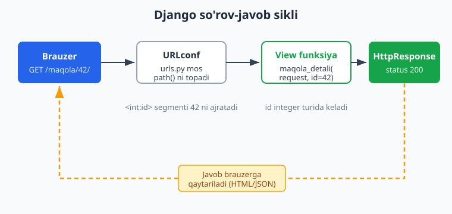
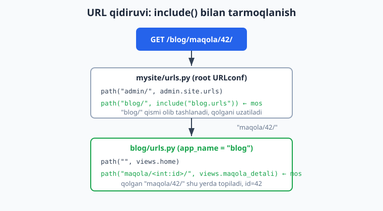
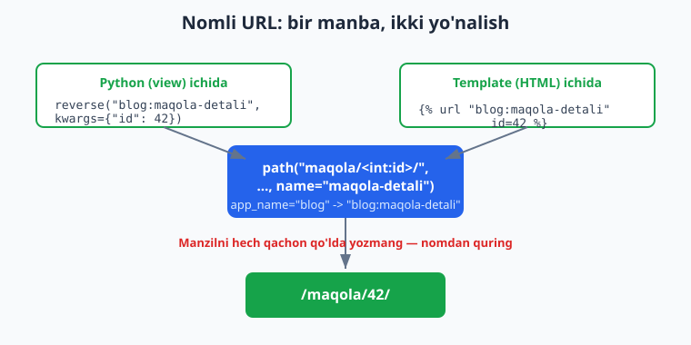

# 03 — View va URL marshrutlash

[⬅️ Oldingi: 02 — O'rnatish va birinchi loyiha](./02-ornatish-loyiha.md) · [🏠 README](./README.md) · [Keyingi: 04 — Template tizimi (DTL) ➡️](./04-template-tizimi.md)

---

> **Bu bobda:** Django ilovasini `startapp` bilan yaratamiz va uning ichki tuzilishini bo'lakma-bo'lak tushunamiz. Funksiyaga asoslangan view (function-based view) yozamiz va `HttpResponse` orqali oddiy matn/HTML, `JsonResponse` orqali esa JSON qaytarishni o'rganamiz. Keyin `urls.py` faylida `path()` bilan marshrut (route) yaratamiz, dinamik segmentlarni (`<int:id>`, `<slug:slug>`, `<str:>`, `<path:>`, `<uuid:>`) ishlatamiz, hatto o'z konvertorimizni yozamiz. `include()` yordamida loyiha URL'larini ilovalarga taqsimlaymiz, `app_name` va nomli URL (named URL) orqali manzillarni `reverse()` va `` bilan quramiz — manzilni hech qachon qo'lda yozmaslik prinsipini o'zlashtiramiz. So'rovning HTTP metodini (`GET`, `POST` va h.k.) tekshirishni va `redirect()` bilan yo'naltirishni ko'ramiz. Hamma kod Django 6.0.6 da haqiqatan ishga tushirib tekshirilgan.

---

## Marshrutlash nima va MTV oqimida qayerda turadi

[02-bobda](./02-ornatish-loyiha.md) loyiha yaratdik. Endi savol: brauzer `http://127.0.0.1:8000/maqola/42/` manziliga so'rov yuborganda, Django qaysi Python kodini ishga tushishini qanday biladi?

Javob — **URL marshrutlash (URL routing)**. Django manzilni (URL) **view** deb ataladigan funksiyaga bog'laydi. View — bu so'rovni (`HttpRequest`) qabul qilib, javobni (`HttpResponse`) qaytaradigan oddiy Python funksiyasi. Bu MTV (Model-Template-View) arxitekturasining "V" qismi.

So'rovning to'liq yo'li quyidagicha:

1. Brauzer URL bo'yicha so'rov yuboradi.
2. Django **URLconf** (URL konfiguratsiyasi) ni yuqoridan pastga qarab o'qiydi va birinchi mos kelgan `path()` ni topadi.
3. Mos `path()` ga bog'langan **view** chaqiriladi. URL'dagi dinamik qismlar (masalan `42`) view'ga argument sifatida uzatiladi.
4. View `HttpResponse` (yoki uning vorisi) qaytaradi.
5. Django javobni brauzerga jo'natadi.



> Python sintaksisi bo'yicha ko'nikmangiz susaygan bo'lsa — funksiyalar, lug'at (dict), f-string — [Python qo'llanmasiga](../python/README.md) qarang. Bu bobda biz faqat Django'ga xos qismlarni chuqur ochamiz.

---

## `startapp`: ilova yaratish

Django loyihasi (project) bir nechta **ilova (app)** dan tashkil topadi. Ilova — bu mantiqan bir butun bo'lgan funksionallik bo'lagi: blog, do'kon, foydalanuvchilar va h.k. Bitta loyihada bir nechta ilova bo'lishi, bitta ilova bir nechta loyihada qayta ishlatilishi mumkin.

Loyiha ildizida (manage.py yonida) yangi ilova yaratamiz:

```bash
python manage.py startapp blog
```

Bu `blog/` papkasini quyidagi tuzilish bilan yaratadi:

```
blog/
├── __init__.py        # papka Python paketi ekanini bildiradi
├── admin.py           # admin panel sozlamalari (07-bob)
├── apps.py            # ilova konfiguratsiyasi (BlogConfig)
├── migrations/        # baza migratsiyalari (05-bob)
│   └── __init__.py
├── models.py          # ma'lumotlar modellari (05-bob)
├── tests.py           # testlar
└── views.py           # VIEW funksiyalari — bu bobning markazi
```

Bu bobda bizni asosan `views.py` va o'zimiz yaratadigan `urls.py` qiziqtiradi.

### Ilovani ro'yxatdan o'tkazish

Django ilovani avtomatik ko'rmaydi — uni `settings.py` dagi `INSTALLED_APPS` ro'yxatiga qo'shish kerak:

```python
# mysite/settings.py
INSTALLED_APPS = [
    "django.contrib.admin",
    "django.contrib.auth",
    "django.contrib.contenttypes",
    "django.contrib.sessions",
    "django.contrib.messages",
    "django.contrib.staticfiles",
    "blog",  # <-- yangi ilovamiz
]
```

`apps.py` ichidagi `BlogConfig` ga to'liq yo'l bilan ham yozish mumkin (`"blog.apps.BlogConfig"`), lekin oddiy `"blog"` Django 6.0 da yetarli — u o'zi `apps.py` dagi yagona `AppConfig` ni topadi.

> **Eslatma — `DEFAULT_AUTO_FIELD`:** Django 6.0 da yangi modellar uchun standart birlamchi kalit turi `BigAutoField` hisoblanadi. Bu Django'ning global standarti (`django.conf.global_settings`) — eski versiyalardagidek `startproject` `settings.py` ga alohida `DEFAULT_AUTO_FIELD` qatorini yozmaydi, va `apps.py` ga ham `default_auto_field` atributi qo'shilmaydi. Kerak bo'lsa uni `settings.py` da `DEFAULT_AUTO_FIELD = "django.db.models.BigAutoField"` bilan oshkora belgilash mumkin (05-bobda muhim bo'ladi).

---

## Birinchi view: `HttpResponse`

View — bu birinchi argumenti `request` bo'lgan oddiy funksiya. Eng sodda view oddiy matn qaytaradi:

```python
# blog/views.py
from django.http import HttpResponse


def home(request):
    return HttpResponse("Salom, Django!")
```

`HttpResponse` brauzerga matn (yoki HTML) ni `200 OK` holati bilan qaytaradi. Ichiga to'g'ridan-to'g'ri HTML ham yozish mumkin:

```python
# blog/views.py
def about(request):
    matn = "<h1>Biz haqimizda</h1><p>Bu oddiy sahifa.</p>"
    return HttpResponse(matn)
```

> Bu yerda HTML'ni qo'lda yozyapmiz — bu faqat o'rganish uchun. Haqiqiy loyihada HTML'ni [04-bobdagi template tizimi](./04-template-tizimi.md) orqali yozasiz. Hozircha view qanday ishlashini ko'rishimiz uchun shu yetarli.

`HttpResponse` ning ko'p ishlatiladigan vorislari ham bor:

| Klass | Holat kodi | Qachon |
|---|---|---|
| `HttpResponse` | 200 | Oddiy javob |
| `HttpResponseNotFound` | 404 | Topilmadi |
| `HttpResponseRedirect` | 302 | Boshqa manzilga yo'naltirish |
| `HttpResponseBadRequest` | 400 | Noto'g'ri so'rov |
| `HttpResponseNotAllowed` | 405 | Bu HTTP metod ruxsat etilmagan |
| `HttpResponseForbidden` | 403 | Taqiqlangan |

---

## `JsonResponse`: JSON qaytarish (API uchun)

Hozir ko'p ilovalar JSON qaytaradi — bu API'lar va frontend (React/Vue) bilan ishlashning asosi. `JsonResponse` Python lug'atini (dict) avtomatik JSON'ga aylantiradi va `Content-Type: application/json` sarlavhasini qo'yadi:

```python
# blog/views.py
from django.http import JsonResponse


def api_holat(request):
    return JsonResponse({
        "status": "ok",
        "versiya": "6.0.6",
        "til": "uz",
    })
```

Brauzerda `/api/holat/` ni ochsangiz, natija:

```json
{"status": "ok", "versiya": "6.0.6", "til": "uz"}
```

Standart holatda `JsonResponse` faqat **lug'atni** (dict) qabul qiladi — bu xavfsizlik chorasi (eski brauzerlardagi JSON massiv zaifligidan himoya). Agar ro'yxat (list) qaytarmoqchi bo'lsangiz, `safe=False` ni aniq berishingiz kerak:

```python
# blog/views.py
def royxat(request):
    sonlar = [1, 2, 3]
    return JsonResponse(sonlar, safe=False)  # safe=False shart, aks holda TypeError
```

```python
# ❌ XATO — list bilan safe=False bermasak, TypeError ko'tariladi:
def royxat_xato(request):
    return JsonResponse([1, 2, 3])  # TypeError: In order to allow non-dict objects ...
```

> JSON API'larni keyinchalik **Django REST Framework** (DRF) bilan ancha qulay quramiz. `JsonResponse` esa Django'ning o'zidagi eng past darajadagi vosita — uni bilish foydali.

---

## `urls.py`: marshrutni `path()` bilan ulash

View yozdik, lekin uni biror URL'ga bog'lamaguncha hech qanday so'rov unga yetib bormaydi. Buning uchun ilovamizda **`urls.py`** faylini yaratamiz (`startapp` uni avtomatik yaratmaydi — qo'lda yaratamiz):

```python
# blog/urls.py
from django.urls import path
from . import views

urlpatterns = [
    path("", views.home, name="home"),
    path("about/", views.about, name="about"),
    path("api/holat/", views.api_holat, name="api-holat"),
    path("api/royxat/", views.royxat, name="api-royxat"),
]
```

`path()` uchta narsani oladi:

1. **Marshrut shabloni (route)** — `"about/"` kabi URL qismi. Boshida `/` qo'yilmaydi.
2. **View** — chaqiriladigan funksiya (`views.home` — qavssiz, ya'ni funksiyaning o'zi, uni chaqirmaymiz).
3. **`name`** — bu marshrutning nomi (keyinroq `reverse()` uchun zarur).

> **Django 6.0 idiomi:** `path()` ishlatiladi. Eski `url()` o'chirib tashlangan. Murakkab regulyar ifoda kerak bo'lsagina `re_path()` ishlatiladi (pastda ko'ramiz).

### Loyiha URLconf'iga ulash: `include()`

`blog/urls.py` ni yaratdik, lekin Django avval **loyiha** URLconf'ini (`mysite/urls.py`) o'qiydi. Ilova URL'larini loyihaga `include()` orqali ulaymiz:

```python
# mysite/urls.py
from django.contrib import admin
from django.urls import path, include

urlpatterns = [
    path("admin/", admin.site.urls),
    path("", include("blog.urls")),   # blog ilovasining hamma URL'lari shu yerga ulanadi
]
```

`include("blog.urls")` — bu "URL'ni shu nuqtadan boshlab `blog/urls.py` ga uzat" degani. Agar bu yerda `path("blog/", include("blog.urls"))` yozsak, blog URL'lari `/blog/about/`, `/blog/api/holat/` ko'rinishini olardi.



Endi serverni ishga tushiramiz:

```bash
python manage.py runserver
```

Brauzerda:

- `http://127.0.0.1:8000/` -> `Salom, Django!`
- `http://127.0.0.1:8000/about/` -> "Biz haqimizda" sahifasi
- `http://127.0.0.1:8000/api/holat/` -> JSON javob

> **`include()` qanday ishlaydi?** Django root URLconf'da mos prefiksni (masalan `"blog/"`) topgach, **o'sha qismni URL'dan olib tashlaydi** va **qolgan qismni** ichki URLconf'ga uzatadi. Shuning uchun `blog/urls.py` ichidagi shablonlar `"blog/"` siz, faqat o'z qismidan boshlab yoziladi.

---

## Dinamik segmentlar: URL'dan qiymat olish

Eng kuchli xususiyat — URL ichidan qiymat ushlab olish. `/maqola/42/` so'rovida `42` raqamini view'ga uzatmoqchimiz. Buning uchun `<konvertor:nom>` sintaksisidan foydalanamiz:

```python
# blog/urls.py
urlpatterns = [
    # ... oldingilar ...
    path("maqola/<int:id>/", views.maqola_detali, name="maqola-detali"),
    path("post/<slug:slug>/", views.maqola_slug, name="maqola-slug"),
    path("arxiv/<int:yil>/<int:oy>/", views.yil_oy, name="yil-oy"),
]
```

View'lar ushlab olingan qiymatni **nomli argument** sifatida qabul qiladi (nom URL'dagi nom bilan bir xil bo'lishi shart):

```python
# blog/views.py
def maqola_detali(request, id):
    return HttpResponse(f"Maqola raqami: {id} (turi: {type(id).__name__})")


def maqola_slug(request, slug):
    return HttpResponse(f"Maqola slugi: {slug}")


def yil_oy(request, yil, oy):
    return HttpResponse(f"{yil}-yil, {oy}-oy maqolalari")
```

Natijalar:

- `/maqola/42/` -> `Maqola raqami: 42 (turi: int)` — diqqat: `id` **integer** turida keladi, string emas!
- `/post/django-darslari/` -> `Maqola slugi: django-darslari`
- `/arxiv/2026/6/` -> `2026-yil, 6-oy maqolalari`
- `/maqola/abc/` -> **404** — chunki `<int:>` faqat raqamga mos keladi, `abc` mos kelmaydi.

### Konvertor turlari (path converters)

Django'ning o'rnatilgan konvertorlari:

| Konvertor | Nimaga mos keladi | Python turi |
|---|---|---|
| `str` | `/` dan boshqa har qanday belgi (standart) | `str` |
| `int` | manfiy bo'lmagan butun son | `int` |
| `slug` | harf, raqam, `-`, `_` (masalan `salom-dunyo`) | `str` |
| `uuid` | UUID (masalan `12345678-1234-...`) | `uuid.UUID` |
| `path` | har qanday belgi, shu jumladan `/` | `str` |

`str` standart konvertor — agar konvertor yozmasangiz (`<nom>`), `str` ishlatiladi. `path` konvertori `/` ni ham qamrab oladi, shuning uchun u butun yo'lni ushlaydi:

```python
# /fayl/rasmlar/2026/logo.png/ -> {"toliq": "rasmlar/2026/logo.png"}
path("fayl/<path:toliq>/", views.fayl_korsat, name="fayl"),
```

### O'z konvertoringizni yozish

Agar standart konvertorlar yetmasa, o'zingiznikini yozasiz. Masalan, ikki xonali yilni (`26`) ushlab, `int`ga aylantiramiz:

```python
# blog/converters.py
class TwoDigitYearConverter:
    regex = "[0-9]{2}"          # mos keladigan naqsh

    def to_python(self, value):  # URL -> Python qiymat
        return int(value)

    def to_url(self, value):     # Python qiymat -> URL (reverse uchun)
        return "%02d" % value
```

```python
# blog/urls.py
from django.urls import path, register_converter
from . import converters, views

register_converter(converters.TwoDigitYearConverter, "yy")

urlpatterns = [
    path("yil/<yy:yil>/", views.yil_korsat, name="yil"),
    # ...
]
```

Endi `/yil/26/` URL'i view'ga `yil=26` (integer) uzatadi.

### `re_path()`: regulyar ifoda kerak bo'lganda

Standart `path()` aksariyat holatlarda yetadi. Lekin murakkab naqsh kerak bo'lsa, `re_path()` ishlatiladi:

```python
# blog/urls.py
from django.urls import re_path

urlpatterns = [
    # 4 xonali yil, faqat 2 raqamli oy:
    re_path(r"^arxiv/(?P<yil>[0-9]{4})/(?P<oy>[0-9]{2})/$", views.yil_oy, name="re-arxiv"),
]
```

> Imkon qadar `path()` ni afzal ko'ring — u o'qishga osonroq va xatosi kamroq. `re_path()` ni faqat haqiqatan kerak bo'lganda ishlating.

---

## HTTP metodlari: `GET`, `POST` va boshqalar

Har bir so'rovning **HTTP metodi** bor: `GET` (ma'lumot olish), `POST` (yangi ma'lumot yuborish), `PUT`, `PATCH`, `DELETE` va h.k. View ichida metodni `request.method` orqali tekshiramiz:

```python
# blog/views.py
from django.http import HttpResponse, HttpResponseNotAllowed


def metod_korsat(request):
    if request.method == "GET":
        return HttpResponse("Bu GET so'rovi")
    elif request.method == "POST":
        return HttpResponse("Bu POST so'rovi")
    else:
        return HttpResponseNotAllowed(["GET", "POST"])  # 405 + Allow sarlavhasi
```

`HttpResponseNotAllowed(["GET", "POST"])` `405 Method Not Allowed` holatini va `Allow: GET, POST` sarlavhasini qaytaradi — bu HTTP standartiga to'g'ri yondashuv.

> **Muhim — CSRF himoyasi:** Haqiqiy brauzerdan (yoki `curl -X POST`) `POST` yuborsangiz, Django standart holatda `403 Forbidden` (CSRF verification failed) qaytaradi. Buning sababi — `POST` so'rovlar uchun CSRF token talab qilinadi (xavfsizlik uchun). HTML formalarida `` ([04-bob](./04-template-tizimi.md)), API'larda esa boshqa usullar ishlatiladi. Quyidagi test misollarida biz Django'ning **test client** idan foydalanamiz — u testlarda CSRF tekshiruvini o'chiradi, shuning uchun `POST` muammosiz ishlaydi.

> Har bir metod uchun alohida `if` yozish zerikarli. Keyinroq **klassga asoslangan view (CBV)** va DRF buni ancha soddalashtiradi. Hozircha asosni tushunamiz.

---

## Nomli URL: `reverse()` va ``

Eng muhim prinsip: **manzilni hech qachon qo'lda yozmang.** Agar kodingizda `/maqola/42/` deb yozsangiz va keyin URL'ni `/post/42/` ga o'zgartirsangiz — butun loyiha bo'ylab qidirib tuzatishingizga to'g'ri keladi. Buning o'rniga marshrutga **nom** beramiz va shu nom orqali manzil quramiz.

Biz allaqachon `path(..., name="maqola-detali")` deb nom berdik. Endi `app_name` qo'shsak, nom **namespace** (fazo nomi) bilan to'liq bo'ladi:

```python
# blog/urls.py
app_name = "blog"   # namespace

urlpatterns = [
    path("", views.home, name="home"),
    path("maqola/<int:id>/", views.maqola_detali, name="maqola-detali"),
    # ...
]
```

Endi to'liq nom `"blog:maqola-detali"` bo'ladi (`namespace:name` ko'rinishida). Bu turli ilovalarda bir xil nom (`detail` kabi) ishlatilsa ham to'qnashuv bo'lmasligini ta'minlaydi.



### Python kodida: `reverse()`

```python
# blog/views.py
from django.urls import reverse
from django.http import HttpResponse


def boshqa_sahifaga(request):
    manzil = reverse("blog:maqola-detali", kwargs={"id": 42})
    return HttpResponse(f"Manzil: {manzil}")   # Manzil: /maqola/42/
```

`reverse()` ni `args` (pozitsion) bilan ham chaqirish mumkin:

```python
reverse("blog:yil-oy", args=[2026, 6])              # -> /arxiv/2026/6/
reverse("blog:yil-oy", kwargs={"yil": 2026, "oy": 6})  # -> /arxiv/2026/6/  (bir xil)
```

### Yo'naltirish: `redirect()`

`redirect()` ham nomdan foydalanadi — manzilni qo'lda yozmaymiz:

```python
# blog/views.py
from django.shortcuts import redirect


def yonaltir(request):
    return redirect("blog:home")   # 302 -> Location: /
```

### Template ichida: ``

HTML template ichida ham xuddi shunday — nom orqali ([04-bobda](./04-template-tizimi.md) chuqurroq):

```html
<a href="">Biz haqimizda</a>
<a href="">42-maqola</a>
```

Bu render bo'lganda:

```html
<a href="/about/">Biz haqimizda</a>
<a href="/maqola/42/">42-maqola</a>
```

> **Node.js bilan solishtirsangiz** ([Node.js qo'llanmasi](../nodejs/README.md)): Express'da `app.get("/maqola/:id", ...)` yozasiz, lekin u yerda nomli marshrut va `reverse()` o'rnatilgan emas. Django'ning nomli URL tizimi — katta loyihalarda manzillarni boshqarishning eng kuchli vositalaridan biri.

---

## Hammasini birga: to'liq misol va test

Yuqoridagi hamma narsa Django 6.0.6 da ishlashini tasdiqlash uchun **`blog/tests.py`** ga test yozamiz. Django testlar uchun **test client** beradi — bu so'rov yuborib, javobni tekshiradigan soxta brauzer:

```python
# blog/tests.py
from django.test import TestCase
from django.urls import reverse


class URLTest(TestCase):
    def test_home(self):
        r = self.client.get(reverse("blog:home"))
        self.assertEqual(r.status_code, 200)
        self.assertContains(r, "Salom")

    def test_dinamik_int(self):
        r = self.client.get("/maqola/42/")
        self.assertEqual(r.status_code, 200)
        self.assertContains(r, "42")

    def test_int_404(self):
        # <int:> faqat raqamga mos keladi -> abc 404 beradi
        self.assertEqual(self.client.get("/maqola/abc/").status_code, 404)

    def test_metod_405(self):
        # metod_korsat faqat GET/POST qabul qiladi
        self.assertEqual(self.client.delete("/metod/").status_code, 405)

    def test_json(self):
        r = self.client.get("/api/holat/")
        self.assertEqual(r["Content-Type"], "application/json")
        self.assertEqual(r.json()["status"], "ok")
```

Testlarni ishga tushiramiz:

```bash
python manage.py test blog
```

Natija:

```
Found 5 test(s).
Creating test database for alias 'default'...
.....
----------------------------------------------------------------------
Ran 5 tests in 0.01s

OK
```

> `assertContains` javob ichida matn borligini, `r.json()` esa JSON javobni Python dict'ga aylantirib tekshiradi. Test client'i CSRF tekshiruvini o'chiradi — shuning uchun `POST`/`DELETE` muammosiz ishlaydi. Testlar — Django'ning eng kuchli tomonlaridan, ularni keyingi boblarda chuqurroq ishlatamiz.

---

## Bobning xulosasi

- **`startapp`** ilova yaratadi; uni `INSTALLED_APPS` ga qo'shish shart.
- **View** — `request` ni olib, `HttpResponse` qaytaradigan funksiya. `JsonResponse` JSON qaytaradi (`list` uchun `safe=False`).
- **`path()`** marshrutni view'ga bog'laydi; **`include()`** loyiha URL'larini ilovalarga taqsimlaydi.
- **Dinamik segmentlar** (`<int:id>`, `<slug:slug>`, `<path:>`, `<uuid:>`) URL'dan qiymat ushlaydi va view'ga nomli argument sifatida uzatadi; konvertor turni avtomatik aylantiradi.
- **`app_name` + `name`** -> nomli URL (`namespace:name`); **`reverse()`** (Python) va **``** (template) manzilni nom orqali quradi — qo'lda yozmang.
- **`request.method`** HTTP metodini tekshiradi; `redirect()` yo'naltiradi.

Keyingi bobda HTML'ni qo'lda yozishni tashlab, [Django Template Language (DTL)](./04-template-tizimi.md) bilan chiroyli sahifalar quramiz.

---

## Mashqlar

### Oson

1. `contact` ilovasini `startapp` bilan yarating va `INSTALLED_APPS` ga qo'shing. `python manage.py check` xatosiz o'tishini tekshiring.
2. `salom(request)` view yozing — u `HttpResponse("Assalomu alaykum!")` qaytarsin va uni `/salom/` URL'iga ulang (nom: `salom`).
3. `vaqt(request)` view yozing — u joriy yilni `JsonResponse({"yil": 2026})` ko'rinishida qaytarsin.
4. `/foydalanuvchi/<int:user_id>/` marshrutini yarating; view `user_id` ni va uning turini (`type().__name__`) qaytarsin.
5. `path("post/<slug:slug>/", ...)` marshrutini yozing va `/post/mening-birinchi-maqolam/` so'rovida `slug` qiymati qaytarilishini tekshiring.
6. Ikkita view (`home`, `about`) ni nomli qiling va `reverse()` orqali ularning manzilini Python shell'da (`python manage.py shell`) chop eting.

### O'rta

7. `<str:>` va `<path:>` farqini ko'rsating: `/yo1/<str:x>/` va `/yo2/<path:x>/` marshrutlarini yarating, `/yo1/a/b/` va `/yo2/a/b/` so'rovlarida qaysi biri mos kelishini izohlang.
8. `metod_korsat` ga o'xshash view yozing, lekin u faqat `POST` ni qabul qilsin; boshqa metodlarda `HttpResponseNotAllowed(["POST"])` qaytarsin. Test client bilan `GET` 405 berishini tasdiqlang.
9. `blog/urls.py` ni `app_name = "blog"` bilan jihozlang. So'ng `reverse("blog:maqola-detali", kwargs={"id": 7})` `/maqola/7/` berishini test yozib tasdiqlang.
10. `JsonResponse` bilan ro'yxat (list) qaytarishga harakat qiling `safe=False` siz — qanday xato chiqadi? Keyin `safe=False` qo'shib to'g'rilang.
11. `redirect()` ishlatuvchi view yozing — `/eski/` so'rovini `/yangi/` ga (nom orqali) yo'naltirsin. Test client `follow=False` bilan 302 va `Location` sarlavhasini tekshiring.
12. Loyiha `mysite/urls.py` da `path("blog/", include("blog.urls"))` qiling. Endi barcha blog URL'lari oldiga `/blog/` qo'shilishini va `reverse("blog:home")` `/blog/` berishini tasdiqlang.

### Qiyin

13. O'z konvertoringizni yozing: `MonthConverter` — faqat `01`-`12` orasidagi ikki xonali oyni qabul qilsin (`regex = "0[1-9]|1[0-2]"`), `to_python` da `int` qaytarsin. `/oy/<month:m>/` marshrutida `/oy/13/` 404, `/oy/06/` 200 berishini test bilan tasdiqlang.
14. `re_path()` bilan `/yil/2026/` (4 xonali yil) marshrutini yozing va `/yil/26/` 404 berishini tasdiqlang. Keyin shu marshrutni `path()` + o'z konvertoringiz bilan qayta yozing.
15. Bir nechta ilova (`blog`, `shop`) yarating, ikkalasida ham `name="detail"` bo'lgan marshrut bo'lsin. `app_name` orqali namespace bering va `reverse("blog:detail", ...)` bilan `reverse("shop:detail", ...)` to'g'ri ajralishini test bilan ko'rsating.

---

<details markdown="1">
<summary>Yechimlar</summary>

**1-mashq:**
```bash
python manage.py startapp contact
```
```python
# mysite/settings.py
INSTALLED_APPS = [
    # ... boshqalar ...
    "blog",
    "contact",
]
```
```bash
python manage.py check   # -> System check identified no issues (0 silenced).
```

**2-mashq:**
```python
# blog/views.py
def salom(request):
    return HttpResponse("Assalomu alaykum!")
```
```python
# blog/urls.py
path("salom/", views.salom, name="salom"),
```

**3-mashq:**
```python
# blog/views.py
def vaqt(request):
    return JsonResponse({"yil": 2026})
```
```python
# blog/urls.py
path("vaqt/", views.vaqt, name="vaqt"),
```

**4-mashq:**
```python
# blog/views.py
def foydalanuvchi(request, user_id):
    return HttpResponse(f"user_id={user_id}, turi={type(user_id).__name__}")
```
```python
# blog/urls.py
path("foydalanuvchi/<int:user_id>/", views.foydalanuvchi, name="foydalanuvchi"),
```
`/foydalanuvchi/5/` -> `user_id=5, turi=int`.

**5-mashq:**
```python
# blog/views.py
def post(request, slug):
    return HttpResponse(f"slug={slug}")
```
```python
# blog/urls.py
path("post/<slug:slug>/", views.post, name="post"),
```
`/post/mening-birinchi-maqolam/` -> `slug=mening-birinchi-maqolam`.

**6-mashq:**
```bash
python manage.py shell
```
```python
>>> from django.urls import reverse
>>> reverse("blog:home")
'/'
>>> reverse("blog:about")
'/about/'
```

**7-mashq:**
```python
# blog/urls.py
path("yo1/<str:x>/", views.yo1, name="yo1"),
path("yo2/<path:x>/", views.yo2, name="yo2"),
```
```python
# blog/views.py
def yo1(request, x):
    return HttpResponse(f"str: {x}")

def yo2(request, x):
    return HttpResponse(f"path: {x}")
```
- `/yo1/a/b/` -> **404**, chunki `<str:>` `/` ni qamramaydi, shuning uchun `a/b` ga mos kelmaydi.
- `/yo2/a/b/` -> **200**, `x = "a/b"` — `<path:>` `/` ni ham qamraydi.

**8-mashq:**
```python
# blog/views.py
from django.http import HttpResponseNotAllowed

def faqat_post(request):
    if request.method == "POST":
        return HttpResponse("POST qabul qilindi")
    return HttpResponseNotAllowed(["POST"])
```
```python
# blog/tests.py
def test_faqat_post(self):
    self.assertEqual(self.client.get("/faqat-post/").status_code, 405)
    self.assertEqual(self.client.post("/faqat-post/").status_code, 200)
```

**9-mashq:**
```python
# blog/urls.py
app_name = "blog"
urlpatterns = [
    path("maqola/<int:id>/", views.maqola_detali, name="maqola-detali"),
    # ...
]
```
```python
# blog/tests.py
from django.urls import reverse
def test_reverse(self):
    self.assertEqual(reverse("blog:maqola-detali", kwargs={"id": 7}), "/maqola/7/")
```

**10-mashq:**
```python
# ❌ Bu xato beradi:
JsonResponse([1, 2, 3])
# TypeError: In order to allow non-dict objects to be serialized
# set the safe parameter to False.

# ✅ To'g'risi:
JsonResponse([1, 2, 3], safe=False)
```

**11-mashq:**
```python
# blog/views.py
from django.shortcuts import redirect
def eski(request):
    return redirect("blog:yangi")

def yangi(request):
    return HttpResponse("Yangi sahifa")
```
```python
# blog/urls.py
path("eski/", views.eski, name="eski"),
path("yangi/", views.yangi, name="yangi"),
```
```python
# blog/tests.py
def test_redirect(self):
    r = self.client.get("/eski/")
    self.assertEqual(r.status_code, 302)
    self.assertEqual(r["Location"], "/yangi/")
```

**12-mashq:**
```python
# mysite/urls.py
urlpatterns = [
    path("admin/", admin.site.urls),
    path("blog/", include("blog.urls")),
]
```
```python
# blog/tests.py
def test_prefix(self):
    self.assertEqual(reverse("blog:home"), "/blog/")
    self.assertEqual(self.client.get("/blog/about/").status_code, 200)
```
Endi barcha blog URL'lari `/blog/...` bilan boshlanadi; `reverse()` buni avtomatik hisobga oladi — kodni o'zgartirmaymiz.

**13-mashq:**
```python
# blog/converters.py
class MonthConverter:
    regex = "0[1-9]|1[0-2]"

    def to_python(self, value):
        return int(value)

    def to_url(self, value):
        return "%02d" % value
```
```python
# blog/urls.py
from django.urls import path, register_converter
from . import converters, views

register_converter(converters.MonthConverter, "month")

urlpatterns = [
    path("oy/<month:m>/", views.oy_view, name="oy"),
    # ...
]
```
```python
# blog/views.py
def oy_view(request, m):
    return HttpResponse(f"oy={m}, turi={type(m).__name__}")
```
```python
# blog/tests.py
def test_month_converter(self):
    self.assertEqual(self.client.get("/oy/13/").status_code, 404)
    r = self.client.get("/oy/06/")
    self.assertEqual(r.status_code, 200)
    self.assertContains(r, "oy=6")   # to_python int qaytargani uchun "06" -> 6
```

**14-mashq:**
```python
# re_path bilan:
from django.urls import re_path
re_path(r"^yil/(?P<yil>[0-9]{4})/$", views.yil_view, name="yil-re"),
```
```python
# blog/tests.py
def test_yil4(self):
    self.assertEqual(self.client.get("/yil/26/").status_code, 404)   # 2 xonali mos emas
    self.assertEqual(self.client.get("/yil/2026/").status_code, 200)
```
`path()` + konvertor bilan:
```python
# blog/converters.py
class FourDigitYearConverter:
    regex = "[0-9]{4}"
    def to_python(self, value):
        return int(value)
    def to_url(self, value):
        return "%04d" % value
```
```python
# blog/urls.py
register_converter(converters.FourDigitYearConverter, "yyyy")
path("yil/<yyyy:yil>/", views.yil_view, name="yil"),
```

**15-mashq:**
```python
# blog/urls.py
app_name = "blog"
urlpatterns = [path("maqola/<int:id>/", views.detail, name="detail")]

# shop/urls.py
app_name = "shop"
urlpatterns = [path("mahsulot/<int:id>/", views.detail, name="detail")]
```
```python
# mysite/urls.py
urlpatterns = [
    path("admin/", admin.site.urls),
    path("blog/", include("blog.urls")),
    path("shop/", include("shop.urls")),
]
```
```python
# test
def test_namespace(self):
    self.assertEqual(reverse("blog:detail", kwargs={"id": 1}), "/blog/maqola/1/")
    self.assertEqual(reverse("shop:detail", kwargs={"id": 1}), "/shop/mahsulot/1/")
```
`app_name` (namespace) tufayli bir xil `name="detail"` ikki ilovada to'qnashmaydi.

</details>

---

[⬅️ Oldingi: 02 — O'rnatish va birinchi loyiha](./02-ornatish-loyiha.md) · [🏠 README](./README.md) · [Keyingi: 04 — Template tizimi (DTL) ➡️](./04-template-tizimi.md)
